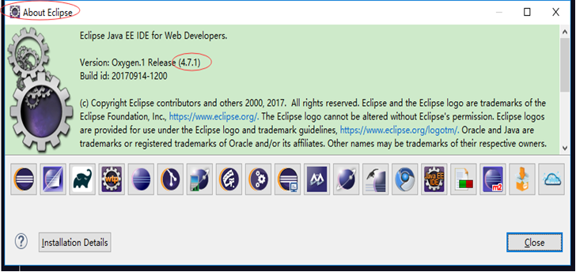
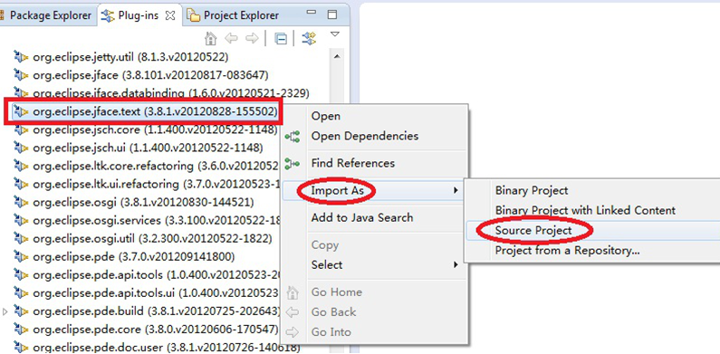
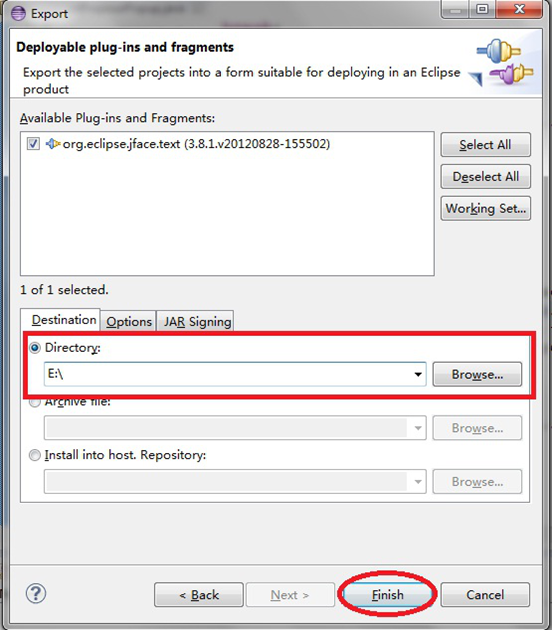
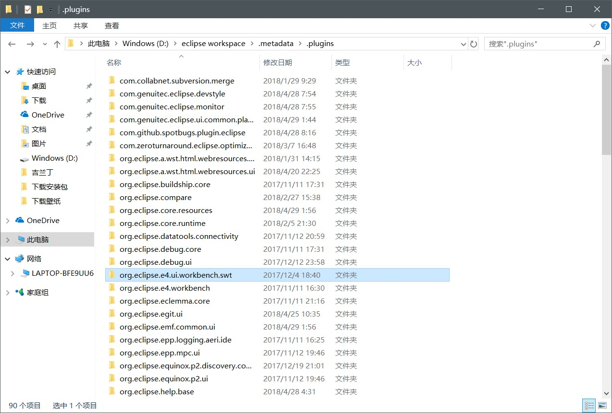
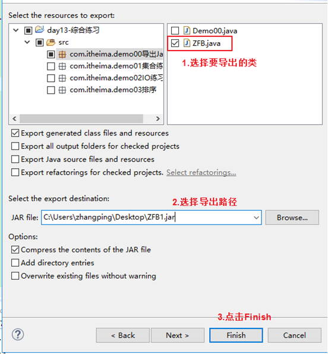
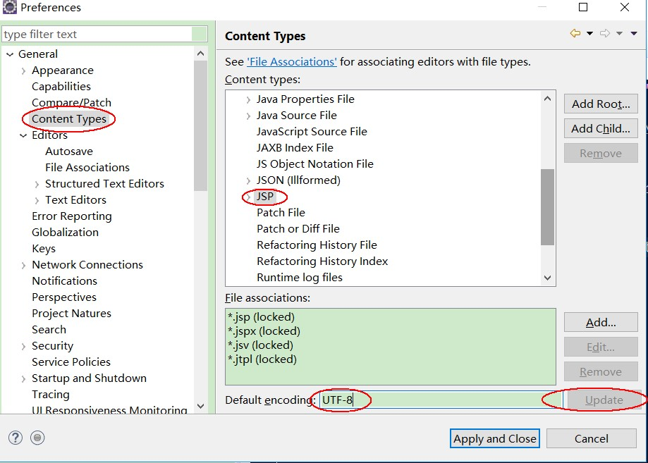
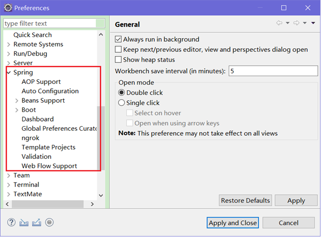
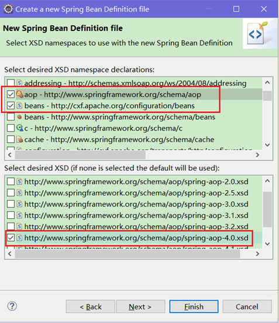

# Eclipse 常用配置与使用

## 1. Eclipse各版本号

- Eclipse 2020-12 (4.18)
- Eclipse 2020-09 (4.17)
- Eclipse 2020-06-R (4.16)
- Eclipse 2020-03-R (4.15)
- Eclipse 2019-12-R (4.14)
- Eclipse 2019-09-R (4.13)
- Eclipse 2019-06-R (4.12)
- Eclipse 2019-03-R (4.11)
- Eclipse 2018-12 (4.10)
- Eclipse 2018-09 (2018 - 4.9)
- Eclipse Photon (2018 - v4.8)
- Eclipse Oxygen (2017 - v4.7)
- Eclipse Neon (2016 - v4.6)
- Eclipse Mars (2015 - v4.5) ---> 必须要jdk1.7以上
- Eclipse Luna (2014 - v4.4)
- Eclipse Kepler (2013 - v4.3)
- Eclipse Juno (2012 - v4.2)
- Eclipse Indigo (2011 - v3.7)

## 2. Eclipse的主题颜色

主题网站：http://www.eclipsecolorthemes.org/

下载EPF文件，打开Eclipse，选择File --> Import，选择EPF文件。

> PS，更多针对单个颜色的修改，可以在Window --> Preference中修改

- Java代码区域的字体大小和颜色：window -- Preferences -- General -- Appearance -- Colors And Fonts -- Java -- Java Edit Text Font
- 控制台：window -- Preferences -- General -- Appearance -- Colors And Fonts -- Debug -- Console font
- 其他文件：window -- Preferences -- General -- Appearance -- Colors And Fonts -- Basic -- Text Font

### 2.1. eclipse 恢复默认的主题

找到eclipse的工作空间目录，也就是workspace，找到这个目录下“`.metadata\.plugins\org.eclipse.core.runtime`”。这里也有`.setting`文件夹，把里面文件全部删除。【建议在改变主题之前，将此文件备份一份】

### 2.2. eclipse 黑色主题包

一款与idea很接近的黑色主题。点选【Help】 --> 【Eclipse Marketplace】 --> 搜索Dark Theme，进行安装即可


### 2.3. 修改eclipse背景


### 2.4. 黑色主题下有高亮底色无查看内容的问题

不勾选图中的高亮选项即可


## 3. 常用快捷键

待整理，暂见`note attachments\99-其他\Eclipse\elipse-快捷键.doc`

## 4. 常用设置（包含MyEclipse设置，与Eclipse设置基本通用）

### 4.1. 7个小技巧，解决eclipse卡顿问题

1. 去掉自动构建项目，改为手动

在eclipse的菜单栏，选择Project，看到下方的Build Automatically，默认是勾选的，取消勾选就行。然后每次启动项目时，可以先clean所选项目，然后点击右键Build Project，这样不仅可以缓解卡顿，也可以解决某些地方修改了代码后没生效的情况。

2. 修改eclipse.ini配置参数

- 在eclipse.ini的文件中，有两个配置参数：Xms和Xmx。
    - Xms是指jvm初始分配的堆内存，默认是物理内存的1/64，可以根据项目的实际大小来修改参数值。
    - Xmx是指jvm最大分配的堆内存，默认是物理内存的1/4，可以根据项目的实际大小来修改参数值。
- 我自己的eclipse在初始化堆内存时，大概在260M左右，所以我的eclipse.ini文件中，Xms的参数给值512m，Xmx的参数给值1024m，大家可以参考，建议根据实际项目大小和电脑本身物理内存大小来确定两个参数的配值。初始内存占用大于60%后，jvm会将堆内存增大到Xmx的设置值。初始内存占用小于30%时，jvm会将堆内存减少到Xms的设置值。所以在开发过程中，通常会将Xms和Xmx两个参数的配置相同的值，其目的是为了能够在java垃圾回收机制清理完堆区后不需要重新分隔计算堆区的大小而浪费资源。
- 另外，如果Xmx不指定或者指定偏小，应用可能会导致java.lang.OutOfMemory错误，此错误来自jvm，不是Throwable的，无法用try…catch捕捉。

3. 手动释放内存

在eclipse菜单栏，选择Window，看到最下方的preferences，点击选中，在弹出的选项框中，右边显示有三个勾选框，勾选第三个Show heap status，点击右下的Apply，点击确认后，在eclipse的右下方会出现eclipse堆内存使用情况的数据，也可以看到前面提到的Xms和Xmx参数值，并且旁边有个垃圾桶的图标，如果eclipse卡到想哭，可以手动点击那个垃圾桶图标释放内存。

4. 关闭启动时不需要用到的插件

在eclipse菜单栏，选择Window，看到最下方的preferences，点击选中，在弹出的选项框中，找到Startup and Shutdown，在右边的详细信息中，去掉上面Refresh workspace on startup和Confirm exit when closing last window勾选，在下面的Plug-ins activated on startup中，没什么用处的可以都去掉勾选，点击右下的Apply，点击确认。

5. 关闭自动更新和安装

在eclipse菜单栏，选择Window，看到最下方的preferences，点击选中，在弹出的选项框中，找到Install/Update，在右边的详细信息中，勾选Show only the latest versions of available software和Ask me what to do when it happens，点击右下的Apply，点击确认。在Install/Update菜单下面还有两个子菜单，Automatic Updates和Available Software Sites，根据实际情况来勾选或设置，记得设置完后点击右下的Apply，点击确认。

6. 关闭拼写检查

在eclipse菜单栏，选择Window，看到最下方的preferences，点击选中，在弹出的选项框中，找到General，选择其下的Editors，再找到Editors下的Text Editors，点开Text Editors，找到Spelling，在右边的详细信息中，最上方的Enable spell checking勾选框，如有勾选，请去掉，然后点击右下的Apply，点击确认。

7. 关闭保存后续动作

在eclipse菜单栏，选择Window，看到最下方的preferences，点击选中，在弹出的选项框中，找到Java，选择其中的Editor，在Editor的子选项中找到Save Actions，在右边的详细信息中，如果perform the selected actions on save选项有优选，请去掉，然后点击右下的Apply，点击确认。

### 4.2. Eclipse统一默认编码

- 修改新建项目默认编码：Window -> Preferences -> General -> Workspace -> Text file encoding 将其修改为UTF-8
- 根据文件修改默认编码：windows -> preferences -> myeclipse -> file and editors下所有选项中的encoding 修改为 IS010646/Unicode(UTF-8) 即统一编码为UTF-8

### 4.3. 设置MyEclipse XML Editor成代码编辑状态，需要设置默认打开方式为XML Editor。

1. Window -> Preferences -> General -> Editors -> File Associations，选择File types: `*.xml`，修改Associated editors: `XML Editor***` -> Default
2. 在Associated editors选择框里点击“`XML Editor***`”，点击“Default”按钮。
3. 将看到“`XML Editor***`”排在最上面，其变为“`XML Editor(Default)***`”。


### 4.4. 关闭updating indexes

Window -> Preferences -> Myeclipse Enterprise Workbench -> Maven4Myeclipse -> Maven -> 禁用Download repository index updates on startup

### 4.5. 关闭MyEclipse的自动validation

validation有一堆，什么xml、jsp、jsf、js等等，没有必要全部都去自动校验一下，只是需要的时候才会手工校验一下，速度立马提升好几个档次

windows -> perferences -> myeclipse -> validation，将Build下全部勾取消

如果你需要验证某个文件的时候，可以单独去验证它。方法是：在需要验证的文件上点击右键 -> MyEclipse -> Run Validation

### 4.6. 去掉MyEclipse的拼写检查（如果觉的有用可以不去）

拼写检查会给带来不少的麻烦，方法命名都会是单词的缩写，也会提示有错，所以最好去掉，没有多大的用处

Window -> perferences -> General -> Editors -> Text Editors -> Spelling -> 将Enable spell checking复选框的勾选去掉

### 4.7. 设置使用浏览器配置


### 4.8. 部分代码显示其他底色

当你的myeclipse调了背景色后，发现js部分的代码依然是白色的背景，看起来十分不方便，下面就叫你怎么单独更改js代码部分的背景色

依次点击Window --> Preferences --> Myeclipse --> Files and Editors --> javascript --> Editor --> Syntax Coloring。在上面框中选择 Background --> Script region background，然后点击旁边的color就可以修改页面javascript中的背景颜色了


### 4.9. MyEclipse定制工具栏

Window --> Customize Perspective


### 4.10. Eclipse设置不格式化注释

注释中写点带格式的文字，format后全乱了，解决办法如下：

Windows -> Preferces -> java -> Code Style -> Formatter -> Edit -> Comments

取消勾选 “Enable Javadoc comment formatting”、“Enable block comment formatting”、“Enable line comment formatting”

### 4.11. 配置Eclipse中的编译和运行环境

Eclipse的运行版本要大于等于编译版本号：会出现bad version number版本问题

- 高版本的运行环境可以运行低版本编译的java文件
- 低版本的运行环境不能运行低版本编译的java文件

- 编译环境的配置：project右键 -> Properties -> Java Complier
- 运行环境的配置：project右键 -> Properties -> Java Build Path

## 5. 加快代码提示与取消空格上屏（重点）

### 5.1. 加快代码提示，根据需要可以修改CSS、HTML、JavaScript、XML

windows --> preferences --> 搜索“content assist”


在【Auto activation triggers for Java】输入框内是“.”，这就是为什么使用MyEclipse只有输入“点”的时候才有代码提示。

所以这里把“`.qwertyuiopasdfghjklzxcvbnm,:QWERTYUIOPASDFGHJKLZXCVBNM`”以及其他可以用到的字符都输入进去，这样当输入任何一个字母时，都会有代码提示了。

在【Auto activation delay(ms)】输入框内，`200`是代码提示的延迟毫秒数，改为“`0`”，即输入代码时，立刻获得代码提示

如果按上面设置，还没有提示，将Advanced里的该勾选的斗勾选


<font color=red>**总结：首先第一步中的作用是指当输入一个字母的时候eclipse就会马上联想相关的单词并显示出来，并且那些联想的单词总是跟着，如果觉得比较烦的话，就改为默认的点号。第二步中才是重点，作用是就是当用`alt+/`快捷键的时候会联想出来的。**</font>

### 5.2. 取消空格上屏

使用Eclipse与MyEclipse的代码提示功能时，按下空格键后Eclipse会自动将代码提示中的第一项上屏。这一点有时会变得相当讨厌，因为很多时候只是单纯的想要输入一个空格而已。然而这一特性是无法通过配置改变的。好在Eclipse是开源的，仍然可以通过修改相应的源代码来改变这一点。

下面先以Eclipse为例说明。首先，如果下载的Eclipse是SDK版本的，那么可以直接越过下面的一段。

如果没有src这个文件夹，说明你使用的版本中没有带源代码，我正好也是这种情况。源代码可以去这个地址下载（找了我好久好久）

http://archive.eclipse.org/eclipse/downloads/




在页面上选择你Eclipse版本的连接（我使用的是4.4.2），然后在新页面中下载`eclipse-SDK-(*************).zip`，根据自己的需要选择合适的版本下载，大概200M左右。下载完成以后解压缩，在`.\eclipse\plugins\`文件夹下找到`org.eclipse.jface.text.source_3.9.2.v20141003-1326.jar`（这是对应使用的Eclipse版本的文件，实际请根据自己的版本进行选择），将这个文件复制到Eclipse安装目录下的.`\eclipse\plugins\`文件夹下，然后重新启动Eclipse。重复上面的操作导入

---

如果你的Eclipse不是SDK版本的，强烈建议你改为使用SDK版本的Eclipse，因为SDK版的Eclipse附带了所有源码。如果你不愿意使用SDK版，那么也可以从http://www.eclipse.org/projects/listofprojects.php获得下文所需的源代码，以本文为例，点击Platform Text，会跳转到project页面，再点击Clone on GitHub，即可下载到相应的源代码。

依次点击 `Window –> Show View –> Other…`，在弹出的对话框中再选择`Plug-in Development –> Plug-ins`：


在Plug-ins中找到`org.eclipse.jface.text`，点击右键，选择Import As –> Source Project



这时eclipse就会把该项目导入到workspace工作空间中了。展开该项目，在src目录中选择`org.eclipse.jface.text.contentassist.CompletionProposalPopup.java`文件：

在该文件中找到如下的代码(一般在1300-1350行之间)：

```java
case '\t':
  e.doit= false;
  fProposalShell.setFocus();
  return false;
```

将其改为：

```java
case '\t':
  e.doit= false;
  insertSelectedProposalWithMask(e.stateMask);
  break;
```

然后，在这段代码的下方，找到如下代码：

```java
if (contains(triggers, key)) {
    e.doit= false;
    hide();
    insertProposal(p, key, e.stateMask, fContentAssistSubjectControlAdapter.getSelectedRange().x);
}
```

将其第一行改为：

```java
if (key != 0x20 && key != '=' && key != ';' && contains(triggers, key)) {
    ....
}
```

经过以上修改，我们去掉了按下空格上屏和`=`上屏`,`上屏的功能，并将其改为按下Tab键上屏，相信这是符合多数人的习惯的，保存修改。

接下来要做的就是使用修改过的代码生成插件，并替换掉Eclipse本来的插件。在该工程上单击右键，选择`Export…`：


在弹出的对话框中选择Plug-in Development –> Deployable plug-ins and fragments，点击Next：


指定一个保存即将导出的jar包的位置，点击Finish。



这时，在刚才指定的路径下会生成一个plugins文件夹，里面就是导出的jar包：


最后一步，定位到Eclipse安装目录下的plugins文件夹，使用这个刚生成的jar包替换掉原本的`org.eclipse.jface.text`包即，大功告成！现在，使用代码提示时按下空格键已经不会自动上屏了，而是使用Tab键来上屏。

对于MyEclipse:

MyEclipse的修改方法与Eclipse完全一样，用修改好的jar包替换掉MyEclipse自带的jar包即可，MyEclipse中该jar包的位置是：MyEclipse安装目录\Common\plugins。

需要额外注意的是MyEclipse中使用的org.eclipse.jface.text包的版本。如笔者使用的MyEclipse 10.6的jface.text的版本是3.7.2，而Eclipse Juno使用的jface.text版本为3.8.1。笔者试图用修改过的3.8.1版本的jar包替换掉MyEclipse自带的3.7.2的jar包，发现替换后的MyEclipse无法启动。无奈只能从网上重新下载了3.7.2版本的Eclipse SDK，将里面的jface.text修改好之后替换道MyEclipse中，最终解决了问题

在myeclipse的安装目录中搜索readme_eclipse.html文件， 它在readme文件夹下面双击打开，版本号就显示了myeclipse中的eclipse版本号：如果你的安装目录是D:/MyEclipse ，那么进入到这个目录，按ctrl + F快捷键 ，输入名字：readme_eclipse.html ，按enter进行搜索，双击搜索到的文件就能显示eclipse版本号了。如下图：


上面的SDK不是用来使用，只是为了拿到里面的源代码。只为了获得`org.eclipse.jface.tex`t的源代码去修改取消空格上屏而已

- eclipse-SDK-4.3.1-win32-x86_64 对应 MyEclipse2014
- eclipse-SDK-4.7.1-win32-x86_64 对应 eclipse-jee-oxygen-1-win32-x86_64
- eclipse-SDK-4.7.2-win32-x86_64 对应 eclipse-jee-oxygen-2-win32-x86_64

## 6. eclipse工作空间配置导出

### 6.1. 方法一：使用eclipse的导出功能

工作目录中右键选择Export -> General -> Preference，这样可以导出epf文件，新的工作空间中可以用Import导入该配置文件，这个方法的确可以导入绝大多数的配置，但是并不全，导入后会丢失很多配置


### 6.2. 方法二：在切换工作空间的时候选择 other -> copy setting


### 6.3. 方法三：推荐使用这种方法，导入的最全

将`workspace/.metadata/.plugins/org.eclipse.core.runtime`中的`.settings`文件夹拷贝出来，里面就是所有的配置文件，新建工作空间的时候将该`.settings`文件夹替换掉新工作空间中的`.settings`文件夹即可。另外导出界面上的工具栏对话框布局等：`.metadata.plugins\org.eclipse.e4.workbench.swt`将该文件夹保存起来即可




## 7. Eclipse 导出 API 帮助⽂档

eclipse 使用时，可以配合文档注释，导出对类的说明文档，从而供其他人阅读学习与使用。通过使用文档注释，将类或者方法进行注释用`@`简单标注基本信息。如`@author`作者、`@version`代码版本、`@param`方法参数、`@return`方法返回值等。

## 8. 导出Jar包步骤

工程右键 -> Export -> Java -> Jar file -> Next -> 选择要导出的类 -> 选择导出的路径 -> Finish




## 9. 导入Jar包步骤

1. 在项目中新建一个文件夹：lib（类库）
2. 将要使用的第三方jar拷贝到lib目录下
3. 选中jar包，右键 Build path --> Add to Build path


## 10. 导入第三方源码


如果源代码是以文件夹形式存在，则选择导入Folder


## 11. eclipse自定义library jar包步骤

右键点击项目 --> Build Path --> Add Libraries --> User Libraries


如果想新建新的Libraries，则点击`User Libraries…`。如果之前已经新建好了，直接勾选需要的后，点击Finish加载进项目即可。


新建Library --> Add External JARs --> 选需要的jar包


使用：新建项目后，根据需要选择自定义Library。右键项目 --> Build Path --> Add Libraries --> User Libraries --> 勾选需要的Library --> Finish

删除Library：选中要删除Lib包 --> Build Path --> Remove from Build Path


## 12. Tomcat与Eclipse连接

打开Eclipse --> 点击Eclipse菜单栏【Window】-->【Preferences】，之后出现【Preferences】对话框面板，在对话框面板左边栏目里找到【Sever】选项点击下出现子选项【Audio】、【Launching】、【Overlays】、【Profiles】和【Runtime Environment】，这是选择点击【Runtime Environment】项，然后在原来打开的【Preferences】面板
右面看到【Sever Runtime Environment】，选择【Add】之后显示以下界面：


在当前界面的面板【Apache】下面选择你对应安装的Apache Tomcat版本，点击【`Next>`】，然后出现对话框：

然后在【Tomcat installation directory】下面的空白文本框里面输入你对应安装的tomcat目录或者点击右边的【`Browse...`】来选择tomcat安装目录，例如：【D:\xampp\tomcat】，继续点击【Finish】就OK了。

## 13. 创建代码模版

点击Eclipse菜单栏【Window】-->【Preferences】 --> 搜索关键字“Templates”


## 14. 设置JSP 页面的编码

Eclipse 的首选项 --> 搜索jsp，找到JSP Files 选择指定的编码，如UTF-8，点击 Apply 后再点击 OK 保存配置。可以分别设置页面编码、页面内容编码




## 15. eclipse中批量修改Java类文件中引入的package包路径

- 方法一：Ctrl+h --> file serach --> 输入原包名(类型为`*.java`) --> Replace --> 找到后输入要替换的包名 然后自己选择是全部替换还是部分替换。通过该方法也可以批量修改配置文件。
- 方法二(推荐)：直接修改出错的类所在的包的名称再改回来，这样就可以统一修改所有出错的类的package包名称

## 16. 常用插件安装与插件卸载

### 16.1. Spring Tool Suite 4 / 3.9.8

Spring Tool Suite(STS) 是一个基于 Eclipse 针对 Spring 应用量身定制的开发环境。提供了开发 Spring 应用必须的编码、调试、运行和部署功能。STS 在最新的 Eclipse 发布版本基础上集成了 Pivotal tc 服务器、Pivotal Cloud Foundry、Git、Maven、AspectJ 等必要的工具。<font color=red>**两个版本都安装**</font>


安装：Help->Eclicpse Marketplace，搜索 spring-tool-suite，点击install

查看是否安装成功：Window --> Preferences 之后出现Spring选项说明已经安装成功。



一、配置`*.xml`默认打开方式

打开Eclipse-->偏好设置，如下图：


找到File Associations，在File types中找到`*.xml`项，如果没有就点击Add来添加，选中`*.xml`然后在Associated editors中选中Spring Config Editor点击右边的Default就可以了

二、新建spring的xml配置文件

File --> new --> other,然后输入spring，选中spring Bean Configuration File


选中spring约束类型，然后finish即可完成，spring配置文件。



### 16.2. Lombok插件

Lombok是一种Java实用工具，可以帮助开发人员消除Java的冗长，具体看lombok的官网：http://projectlombok.org/

安装步骤：

1. 下载lombok.jar包，双击安装，选择eclipse的目录


2. 检查myeclipse.ini/eclipse.ini所在文件目录下是否有lombok.jar包
3. 打开myeclipse.ini/eclipse.ini，是否有以下代码并保存：


4. 重启myeclipse/eclipse
5. 右键点击project --> clean 清理项目

### 16.3. 卸载插件

在菜单栏中点击【help】-【Eclipse MarketPlace】。点击Installed标签页，选择需要卸载的插件


确认可以卸载


### 16.4. 查看eclipse安装的插件

用于查看安装的那些插件与卸载安装


