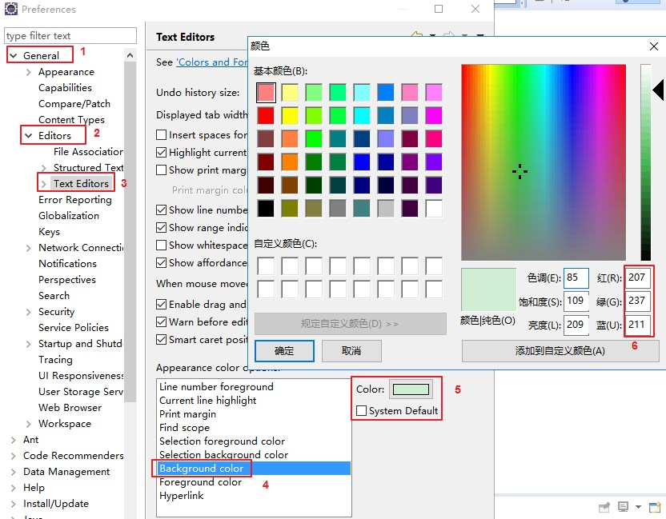

# eclipse

## 1. Eclipse各版本号

- Eclipse 2020-09 (4.17)
- Eclipse 2020-06-R (4.16)
- Eclipse 2020-03-R (4.15)
- Eclipse 2019-12-R (4.14)
- Eclipse 2019-09-R (4.13)
- Eclipse 2019-06-R (4.12)
- Eclipse 2019-03-R (4.11)
- Eclipse 2018-12 (4.10)
- Eclipse 2018-09 (2018 - 4.9)
- Eclipse Photon (2018 - v4.8)
- Eclipse Oxygen (2017 - v4.7)
- Eclipse Neon (2016 - v4.6)
- Eclipse Mars (2015 - v4.5) ---> 必须要jdk1.7以上
- Eclipse Luna (2014 - v4.4)
- Eclipse Kepler (2013 - v4.3)
- Eclipse Juno (2012 - v4.2)
- Eclipse Indigo (2011 - v3.7)

## 2. Eclipse的主题颜色

主题网站：http://www.eclipsecolorthemes.org/

下载EPF文件，打开Eclipse，选择File --> Import，选择EPF文件。

> PS，更多针对单个颜色的修改，可以在Window --> Preference中修改

- Java代码区域的字体大小和颜色：window -- Preferences -- General -- Appearance -- Colors And Fonts -- Java -- Java Edit Text Font
- 控制台：window -- Preferences -- General -- Appearance -- Colors And Fonts -- Debug -- Console font
- 其他文件：window -- Preferences -- General -- Appearance -- Colors And Fonts -- Basic -- Text Font

### 2.1. eclipse 恢复默认的主题

找到eclipse的工作空间目录，也就是workspace，找到这个目录下“`.metadata\.plugins\org.eclipse.core.runtime`”。这里也有`.setting`文件夹，把里面文件全部删除。【建议在改变主题之前，将此文件备份一份】

### 2.2. eclipse 黑色主题包

一款与idea很接近的黑色主题。点选【Help】 --> 【Eclipse Marketplace】 --> 搜索Dark Theme，进行安装即可

### 2.3. 修改eclipse背景

### 2.4. 黑色主题下有高亮底色无查看内容的问题

不勾选图中的高亮选项即可

