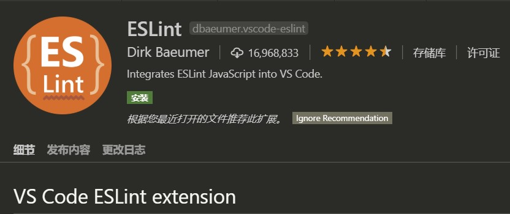
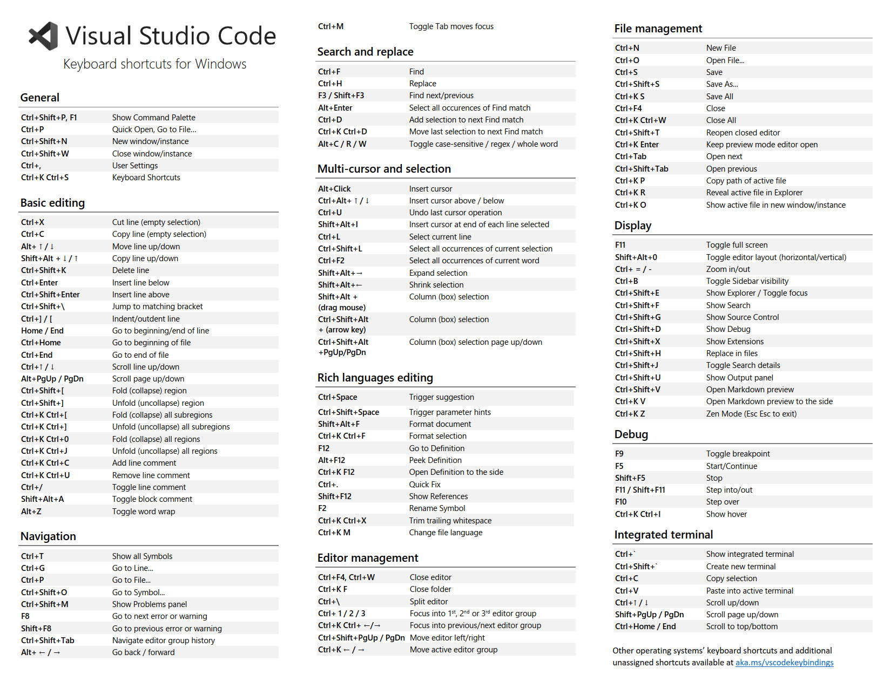

# Visual Studio Code

## 1. 官方网站

官网：https://code.visualstudio.com/

## 2. 常用插件

### 2.1. Chinese (Simplified) Language Pack for VS Code

中文汉化包

### 2.2. Eclipse Keymap（弃用）

配置与eclipse差不多一致的快捷键

### 2.3. Vetur

配置vue文件语法高亮、智能感知、Emmet等。

<font color=red>**注意：VSCode中使用vetur插件格式化vue文件时，js代码会被添加上分号且单引号会转变为双引号。**</font>设置vscode配置文件

```json
"vetur.format.defaultFormatter.js": "vscode-typescript"
```

### 2.4. vscode-icon 或 Material Icon Theme

让vscode资源目录加上图标（必备）

### 2.5. Path Intellisense

自动路劲补全，默认不带这个功能的（必备）

### 2.6. 推荐主题

One Monokai Theme


One Dark Pro


Atom One Dark Theme


Eva Theme


Material Palenight Theme


### 2.7. eslint插件



安装并配置完成 ESLint 后，继续回到 VSCode 进行扩展设置，依次点击 文件 > 首选项 > 设置 打开 VSCode 配置文件，添加如下配置

```json
"files.autoSave":"off",
"eslint.validate": [
   "javascript",
   "javascriptreact",
   "html",
   { "language": "vue", "autoFix": true }
 ],
 "eslint.options": {
    "plugins": ["html"]
 }
]
```

这样每次保存的时候就可以根据根目录下.eslintrc.js配置的eslint规则来检查和做一些简单的fix。以下github上的开源后台项目vue-element-admin的作者常用的eslint配置（参考）

```json
module.exports = {
  root: true,
  parserOptions: {
    parser: 'babel-eslint',
    sourceType: 'module'
  },
  env: {
    browser: true,
    node: true,
    es6: true,
  },
  extends: ['plugin:vue/recommended', 'eslint:recommended'],

  // add your custom rules here
  //it is base on https://github.com/vuejs/eslint-config-vue
  rules: {
    "vue/max-attributes-per-line": [2, {
      "singleline": 10,
      "multiline": {
        "max": 1,
        "allowFirstLine": false
      }
    }],
    "vue/name-property-casing": ["error", "PascalCase"],
    'accessor-pairs': 2,
    'arrow-spacing': [2, {
      'before': true,
      'after': true
    }],
    'block-spacing': [2, 'always'],
    'brace-style': [2, '1tbs', {
      'allowSingleLine': true
    }],
    'camelcase': [0, {
      'properties': 'always'
    }],
    'comma-dangle': [2, 'never'],
    'comma-spacing': [2, {
      'before': false,
      'after': true
    }],
    'comma-style': [2, 'last'],
    'constructor-super': 2,
    'curly': [2, 'multi-line'],
    'dot-location': [2, 'property'],
    'eol-last': 2,
    'eqeqeq': [2, 'allow-null'],
    'generator-star-spacing': [2, {
      'before': true,
      'after': true
    }],
    'handle-callback-err': [2, '^(err|error)$'],
    'indent': [2, 2, {
      'SwitchCase': 1
    }],
    'jsx-quotes': [2, 'prefer-single'],
    'key-spacing': [2, {
      'beforeColon': false,
      'afterColon': true
    }],
    'keyword-spacing': [2, {
      'before': true,
      'after': true
    }],
    'new-cap': [2, {
      'newIsCap': true,
      'capIsNew': false
    }],
    'new-parens': 2,
    'no-array-constructor': 2,
    'no-caller': 2,
    'no-console': 'off',
    'no-class-assign': 2,
    'no-cond-assign': 2,
    'no-const-assign': 2,
    'no-control-regex': 0,
    'no-delete-var': 2,
    'no-dupe-args': 2,
    'no-dupe-class-members': 2,
    'no-dupe-keys': 2,
    'no-duplicate-case': 2,
    'no-empty-character-class': 2,
    'no-empty-pattern': 2,
    'no-eval': 2,
    'no-ex-assign': 2,
    'no-extend-native': 2,
    'no-extra-bind': 2,
    'no-extra-boolean-cast': 2,
    'no-extra-parens': [2, 'functions'],
    'no-fallthrough': 2,
    'no-floating-decimal': 2,
    'no-func-assign': 2,
    'no-implied-eval': 2,
    'no-inner-declarations': [2, 'functions'],
    'no-invalid-regexp': 2,
    'no-irregular-whitespace': 2,
    'no-iterator': 2,
    'no-label-var': 2,
    'no-labels': [2, {
      'allowLoop': false,
      'allowSwitch': false
    }],
    'no-lone-blocks': 2,
    'no-mixed-spaces-and-tabs': 2,
    'no-multi-spaces': 2,
    'no-multi-str': 2,
    'no-multiple-empty-lines': [2, {
      'max': 1
    }],
    'no-native-reassign': 2,
    'no-negated-in-lhs': 2,
    'no-new-object': 2,
    'no-new-require': 2,
    'no-new-symbol': 2,
    'no-new-wrappers': 2,
    'no-obj-calls': 2,
    'no-octal': 2,
    'no-octal-escape': 2,
    'no-path-concat': 2,
    'no-proto': 2,
    'no-redeclare': 2,
    'no-regex-spaces': 2,
    'no-return-assign': [2, 'except-parens'],
    'no-self-assign': 2,
    'no-self-compare': 2,
    'no-sequences': 2,
    'no-shadow-restricted-names': 2,
    'no-spaced-func': 2,
    'no-sparse-arrays': 2,
    'no-this-before-super': 2,
    'no-throw-literal': 2,
    'no-trailing-spaces': 2,
    'no-undef': 2,
    'no-undef-init': 2,
    'no-unexpected-multiline': 2,
    'no-unmodified-loop-condition': 2,
    'no-unneeded-ternary': [2, {
      'defaultAssignment': false
    }],
    'no-unreachable': 2,
    'no-unsafe-finally': 2,
    'no-unused-vars': [2, {
      'vars': 'all',
      'args': 'none'
    }],
    'no-useless-call': 2,
    'no-useless-computed-key': 2,
    'no-useless-constructor': 2,
    'no-useless-escape': 0,
    'no-whitespace-before-property': 2,
    'no-with': 2,
    'one-var': [2, {
      'initialized': 'never'
    }],
    'operator-linebreak': [2, 'after', {
      'overrides': {
        '?': 'before',
        ':': 'before'
      }
    }],
    'padded-blocks': [2, 'never'],
    'quotes': [2, 'single', {
      'avoidEscape': true,
      'allowTemplateLiterals': true
    }],
    'semi': [2, 'never'],
    'semi-spacing': [2, {
      'before': false,
      'after': true
    }],
    'space-before-blocks': [2, 'always'],
    'space-before-function-paren': [2, 'never'],
    'space-in-parens': [2, 'never'],
    'space-infix-ops': 2,
    'space-unary-ops': [2, {
      'words': true,
      'nonwords': false
    }],
    'spaced-comment': [2, 'always', {
      'markers': ['global', 'globals', 'eslint', 'eslint-disable', '*package', '!', ',']
    }],
    'template-curly-spacing': [2, 'never'],
    'use-isnan': 2,
    'valid-typeof': 2,
    'wrap-iife': [2, 'any'],
    'yield-star-spacing': [2, 'both'],
    'yoda': [2, 'never'],
    'prefer-const': 2,
    'no-debugger': process.env.NODE_ENV === 'production' ? 2 : 0,
    'object-curly-spacing': [2, 'always', {
      objectsInObjects: false
    }],
    'array-bracket-spacing': [2, 'never']
  }
}
```

### 2.8. beautify 与 Prettier - Code formatter

- beautify：格式化代码的工具，可以格式化JSON|JS|HTML|CSS|SCSS,比内置格式化好用；但是react工程的jsx文件用beautify插件格式化会乱掉，建议不要用
- Prettier - Code formatter：格式化代码的工具，可以支持react

### 2.9. Bracket Pair Colorizer 或 Bracket Pair Colorizer2

此扩展允许使用颜色标识匹配的括号

### 2.10. Auto Close Tag

自动添加HTML / XML关闭标签

### 2.11. Atuo Rename Tag

修改 html 标签，自动帮你完成尾部闭合标签的同步修改，不过有些bug。

### 2.12. Highlight Matching Tag

高亮显示选中匹配标签

### 2.13. IntelliSense for CSS class names in HTML 或 HTML CSS Support

**IntelliSense for CSS class names in HTML**

在 HTML 中调用定义好的样式名时，有时需要经常在 HTML 与 CSS 文件之间切换，来回地查看你已定义好的 CSS 类名。	而 IntelliSense for CSS class names in HTML 插件，可以在 HTML 中需要调用 CSS 类名的地方，此插件会智能地给你已定义 CSS 类名的提示

**HTML CSS Support**

让 html 标签上写class 智能提示当前项目所支持的样式。新版已经支持scss文件检索

### 2.14. Vscode-element-helper

使用element-ui库的可以安装这个插件，编写标签时自动提示element标签名称。

### 2.15. cssrem

此插件的功能是实现 px 转换 rem

1. 安装插件
2. 打开【设置】（快捷键是 `ctrl + 逗号`）
3. 设置html字体大小基准值，默认是16px
4. 使用时只需要将光标停留在一些px单位的值上，再按`Alt+z`，就可以换算成 rem 单位的值

### 2.16. 待整理

- HTML Snippets
    - 超级实用且初级的 H5代码片段以及提示
- Debugger for Chrome
    - 让 vscode 映射 chrome 的 debug功能，静态页面都可以用 vscode 来打断点调试，真666~。配置稍微复杂一些
- jQuery Code Snippets
    - jquery 重度患者必须品
- Npm Intellisense
    - require 时的包提示（最新版的vscode已经集成此功能）
- Project Manager
    - 在多个项目之前快速切换的工具
- VueHelper
    - snippet代码片段


## 3. 常用配置

### 3.1. 出现CPU 100% 优化的设置

有时，vscode会出现CPU利用率100%的情况，两个rg.exe占用了全部的CPU。

解决办法：文件>首选项>设置, 搜索设置 `"search.followSymlinks" ：false;`


### 3.2. 如何配置VSCODE打开文件总是在一个新的标签

经常搞混单击和双击的区别？这里在左侧资源管理器这边 如果单击文件是打开文件的预览模式，文件所在的标签上显示的文件名是 斜体状态，表明是在 预览模式，会被新打开的文件替换。所以如果是要打开文件进行编辑需要双击文件进行打开

如果要修改这个配置，可以找到以下配置字段进行调整：

如果要一起禁用预览模式，可以通过在设置文件中将“`workbench.editor.enablePreview`”属性设置为`false`来实现。还要注意“`workbench.editor.enablePreviewFromQuickOpen`”选项，以防您只想从快速打开菜单禁用此选项。

在您可以禁用预览模式之前，您需要打开您的Settings File。

专业提示：您可以使用Command Palette打开您的设置文件，只需输入“首选项：打开用户设置”！

打开设置文件(您的设置文件应位于右侧)后，添加“`workbench.editor.enablePreview`”属性，并将其值设置为`false`。


### 3.3. 设置tab为4个空格与格式化时缩进4个空格

tab的宽度设置


格式化缩进


## 4. 快捷键

### 4.1. 官方快捷键列表

- 官网地址：https://code.visualstudio.com/shortcuts/keyboard-shortcuts-windows.pdf
- windows 快捷键



### 4.2. 常用快捷键

- `ctrl+shift+L` 批量修改变量名称

### 4.3. 多行编辑操作

VScode对多行编辑有两种模式。

#### 4.3.1. 第一种模式

竖列选择：长按`Alt+Shift`，按左键拖动鼠标选择多行。这种模式下只可以选择竖列，不可以随意插入光标。所以只限制于同一列且不间隔的情况下

#### 4.3.2. 第二种模式

- 竖列选择：`Shift+Ctrl`
- 选择多个编辑位点：`Ctrl+光标点击`

这种模式下不仅可以选择竖列，同时还可以在多个地方插入光标

#### 4.3.3. 两种模式的切换

使用`Ctrl+Shift+p`快捷键调用查询输入栏，输入“cursor”，列表中会出现“切换多行修改键”这个选项。选择这个选项就可以在两种模式下切换

## 5. VSCode拓展推荐（前端开发）【网络资源】

https://github.com/varHarrie/varharrie.github.io/issues/10

> 最后更新于：2018-08-20 11:13:21

## 6. 个人首选项配置（网络资源，仅供参考）

```json
{
  "breadcrumbs.enabled": true,
  "editor.tabSize": 2,
  "editor.renderWhitespace": "boundary",
  "editor.cursorBlinking": "smooth",
  "editor.minimap.renderCharacters": false,
  "editor.fontFamily": "'Fira Code', 'Droid Sans Mono', 'Courier New', monospace, 'Droid Sans Fallback'",
  "editor.fontLigatures": true,
  "explorer.confirmDragAndDrop": false,
  "extensions.autoUpdate": false,
  "files.insertFinalNewline": true,
  "git.autofetch": true,
  "git.path": "F:\\Program Files\\Git\\cmd\\git.exe",
  "search.exclude": {
    "**/node_modules": true,
    "**/dist": true
  },
  "typescript.locale": "en",
  "window.titleBarStyle": "custom",
  "window.title": "${dirty}${activeEditorMedium}${separator}${rootName}",
  "window.zoomLevel": 1,
  "workbench.activityBar.visible": true,
  "workbench.colorTheme": "Plastic - deprioritised punctuation",
  "workbench.iconTheme": "vscode-great-icons",
  "workbench.startupEditor": "newUntitledFile",
  "eslint.autoFixOnSave": true,
  "eslint.validate": ["javascript", "javascriptreact", "vue"],
  "vsicons.projectDetection.autoReload": true,
  "vsicons.dontShowNewVersionMessage": true,
  "tslint.autoFixOnSave": true,
  "debugwrapper.wrappers": {
    "default": "console.log('$eSEL', $SEL)"
  },
  "prettier.tslintIntegration": true,
  "cSpell.userWords": [
    "Unmount"
  ],
  "jest.autoEnable": false,
}
```


