# IDEA

- 官网：https://www.jetbrains.com/idea/

## 1. 初次启动 Intellij IDEA 前需进行的配置

### 1.1. 设置 idea 配置保存位置

第一次进入Intellij IDEA之前，先修改一下缓存的保存位置

1. 修改idea安装目录下的bin文件中的idea.properties文件（`%IDEA_HOME%/bin/idea.properties`）

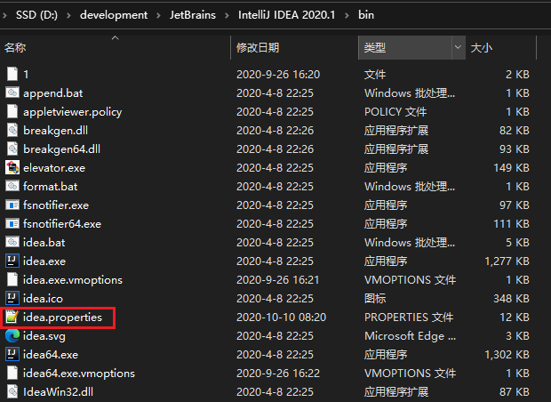

2. 修改idea的配置config文件夹与系统system文件。*注：插件与日志的文件夹可以不需要设置，因为这两个文件夹是默认在config与system目录下，但如果打开idea提示*


```
idea.config.path=D:/development/JetBrains/.IntelliJIdea/config
idea.system.path=D:/development/JetBrains/.IntelliJIdea/system
```

3. 修改后，将idea的配置缓存文件不需要保存在c盘的用户目录下，保存在指定的目录下

### 1.2. 配置说明

- **config**：在初始化安装IntelliJ IDEA时会询问是否导入以存在的配置信息，这个config就是你的配置信息，方便更换电脑和换系统的时候重新安装，前提是要保存好此文件夹。
- **system**：此文件夹是IntelliJ IDEA发生什么不可预知性的错误时，比如蓝屏突然断电导致项目不能启动，可以尝试删除此文件，让系统重新生成一个system的文件。

## 2. 当前项目配置 VS 默认配置

**为什么有了当前项目配置，还需要默认配置呢？**

因为IDEA没有工作空间的概念，所以每个新项目（Project）都需要设置自己的JDK和MAVEN等相关配置，这样虽然提高了灵活性，但是却要为每个新项目都要重新配置，这显然不符合我们的预期。在这个背景下，默认配置给予当前项目配置提供了Default选项，问题自然就迎刃而解了。

最新补充：IDEA为了明确这个新项目配置的概念，在2018.2之后的正式版本已正式将“Default Settings”名字修改“ Default Settings /ProjectStructs”，即“默认配置”就是指“新项目配置”。

**初始化步骤**

- 打开默认配置：顶部导航栏 -> File -> Other Settings -> Default Settings /ProjectStructs
- 打开当前配置：顶部导航栏 -> File -> Settings / ProjectStructs

示例图如下：


## 3. 全局 JDK（默认配置）

具体步骤：顶部工具栏 File -> Other Settins -> Default Project Structure -> SDKs -> JDK

示例：根据下图步骤设置JDK目录，最后点击OK保存。


当前项目在 Project Structure 可为工程和各模块设置喜欢的JDK版本。

## 4. 配置 Maven 仓库

1. 在File -> settings -> Build, Execution, Deployment -> Build Tools -> Maven
2. Mavan home directory --设置maven安装包的bin文件夹所在的位置
3. User settings file --设置setting文件所在的位置
4. Local repository --设置本地仓库

### 4.1. 全局 Maven（默认配置）

具体步骤：顶部工具栏 File -> Other Settings -> Default Settings -> Build & Tools -> Maven

示例：理论上只要配置了Maven主目录即可，实际开发推荐采用User Settins file


### 4.2. 各项目（Project）设置各自的MAVEN等相关配置


### 4.3. 勾选自动导入依赖、下载源码与文档说明


### 4.4. 更新本地仓库和远程仓库

在pom.xml文件中添加依赖jar包的坐标时就可以很好的提示出来


### 4.5. IntelliJ 强制更新 Maven Dependencies

Intellj 自动载入Mave依赖的功能很好用，但有时候会碰到问题，导致pom文件修改却没有触发自动重新载入的动作，此时需要手动强制更新依赖

1. 手动删除 Project Settings 里面的 Libraries 内容；
2. 在 Maven Project 的试图里 clean 一下，删除之前编译过的文件；
3. 项目右键 --> Maven --> Reimport

### 4.6. IDEA 2020 版 Maven 依赖成功导入但任然报错找不到包解决方案

有时 pom.xml 中的依赖正确，点击运行按钮，报错找不到包。但ctrl+鼠标左键却能定位到jar包（说明jar成功导入）

- 原因：IDEA启动程序按钮和maven的build使用的jar包环境不一样
- 解决方案：设置idea构建/运行操作委托给maven就行了。
- 具体设置：Settings搜索Runner,勾选delegate ide build/run actions to maven
- 存在问题：如果勾选之后，在本项目中一些依赖模块（如：项目的公共依赖模块），需要安装到本地仓库，不然会提示说无法找到相应的依赖。


### 4.7. 解决idea创建maven项目速度慢问题的三种方法

idea创建maven项目时，速度很慢，主要原因是创建maven项目时默认是下载求网络上的一个文件archetype-catalog.xml，该文件的大小有5-6M，下载的速度很慢，导致创建过程也变得很慢。

解决办法有三种，并且都需要对maven的VM Options参数做配置。

#### 4.7.1. 方式一

在maven的VM Options加上 `-DarchetypeCatalog=internal` 或者 `-DarchetypeCatalog=local` 参数，步骤如下：

1. 打开idea的启动界面，进入全局设置

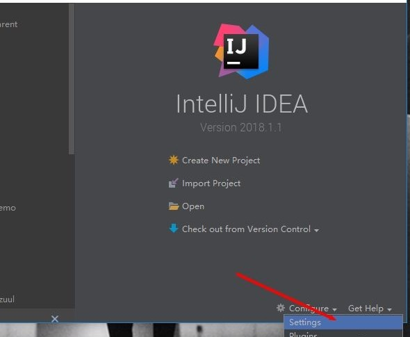

搜索maven，点击Runner一栏，在VM Options输入框里写上 `-DarchetypeCatalog=local`

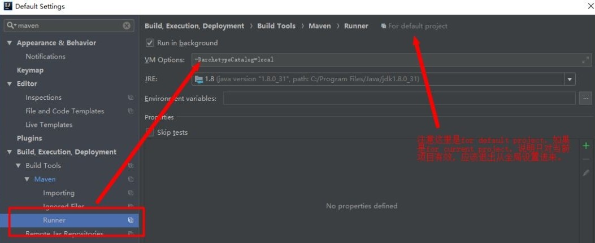

确定后，再新建maven项目，就能发现项目很快就创建完成。

#### 4.7.2. 方式二

下载archetype-catalog.xml文件，在maven的VM Options加上`-DarchetypeCatalog=local`。默认情况下，创建maven项目是从网络下载catalog文件，我们可以将catalog文件下到本地，然后通过设置archetype的使用方式为local，这样就不用每次都从网络上下载了。

1. 下载archetype-catalog.xml文件到本地。文件的位置是http://repo1.maven.org/maven2/archetype-catalog.xml，但直接访问是下载不了，我把该文件放在了github上，有需要的同学可以点击下载。地址：https://github.com/Taoxj/sc_properties
2. 下载后放到本地仓库中对应的位置。maven本地仓库的位置与settting.xml中的配置有关，例如我的setting.xml配置仓库的位置是：D:\apache-maven-3.6.0\repository


那么catalog文件就可以放在 D:\apache-maven-3.6.0\repository\org\apache\maven\archetype-catalog\3.0.1\


如果setting.xml没有配置仓库位置，那么就放到默认本地仓库下面对应的位置即可。本地仓库的默认位置是：`Default: ${user.home}/.m2/repository`，例如笔者的计算机用户名是Administrator，仓库位置就是 C:Users\Administrator\.m2\repository

3. 修改maven的VM Options参数。跟之前方法的步骤一样，打开全局设置中的maven设置栏，然后在VM Options输入框中填入`-DarchetypeCatalog=local`。这样maven每次就会从本地获取catalog文件，创建项目时就不用等那么久了。

#### 4.7.3. 方式三

在maven的VM Options加上`-Dmaven.multiModuleProjectDictory=$MAVEN_HOME`参数，MAVEN_HOME是你环境变量中配置maven环境的名称


设置好参数后，新建maven项目的时候添加上参数archetypeCatalog，值为local，或者是如果本地仓库里有了catalog文件，参数值也可以为local


确定之后，maven项目就能很快的建成了。

#### 4.7.4. 方式四

修改下载下来的 maven 目录下面 conf/settings.xml 文件，修改镜像源使用国内阿里巴巴的镜像源

```xml
<mirror>
    <id>alimaven</id>
    <name>aliyun maven</name>
    <url>http://maven.aliyun.com/nexus/content/groups/public/</url>
    <mirrorOf>central</mirrorOf>
</mirror>
```


## 5. 常用配置

### 5.1. 配置自动编译（非常重要！！）

具体步骤：顶部工具栏 File -> Other Settings -> Default Settings -> Auto Import

说明：开启自动编译之后，结合 `Ctrl+Shift+F9` 会有热更新效果。


具体步骤： 敲击 `Ctrl+Shift+Alt+/` 然后双击Shift搜索进入Registry，找到`compiler.automake.allow.when.app.running`，然后勾选上。


### 5.2. 显示工具条


- 标注1：View --> Toolbar
- 标注2：View --> Tool Buttons

### 5.3. 显示空格和tab


### 5.4. IDEA 设置 tab 为 4 个空格

取消勾选 Use tab character


### 5.5. 修改默认字符集

1. 打开【Settings】，找到【File Encodings】，把 encoding 相关的选项都选择 UTF-8


Transparent native-to-ascii conversion的意思是：自动转换ASCII编码。他的工作原理是：在文件中输入文字时他会自动的转换为Unicode编码，然后在idea中发开文件时他会自动转回文字来显示。这样做是为了防止文件乱码。这样properties文件，一般都不会出现中文乱码！

2. 打开 IDEA 安装路径，找到如下的安装目录。根据所安装的版本修改相应的配置文件（idea64.exe.vmoptions）


2021.2 版本


在文件的最后一行追加以下一项配置，然后重启 IDEA

```properties
-Dfile.encoding=UTF-8 
```

> notes: 最新版本的idea只有64位的配置文件。<font color=red>**特别注意，不能有空格，否则重启后无法打开 IDEA**</font>

3. 如前面的方法均已配置，还有乱码问题，则需要修改idea数据缓存目录中的 idea64.exe.vmoptions，同样在文件的末尾添加：`-Dfile.encoding=UTF-8`，然后重启idea，如图：


> 注：默认的idea数据缓存目录在c盘，也可以修改配置来指定缓存目录的位置

### 5.6. 设置忽略显示，隐藏文件或者文件夹（类似eclipse的filter功能）

【Editor】 --> 】File Types】 --> 【Ignore files and folders】 设置内容：

```
*.hprof;*.pyc;*.pyo;*.rbc;*.yarb;*~;.DS_Store;.git;.hg;.svn;CVS;__pycache__;_svn;vssver.scc;vssver2.scc;.idea;*.iml;
```


### 5.7. 设置取消显示形参名提示

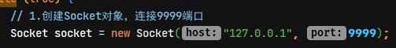

旧版的取消方法：file --> setting --> editor --> General --> appearance，取消√勾选Show parameter name hints，保存退出。


新版的位置不一样了：File --> Setting --> Editor --> Inlay Hints --> Java，取消√勾选Show parameter hints for可以取消所有，也可以单独设置一些情形显示或者取消。


### 5.8. 设置为单行注释的两个斜杠跟随在代码的头部


### 5.9. 设置鼠标悬浮时显示代码的文档信息

选择【File】-->【Settings】-->【Editor】-->【Code Editing】，勾选`Show quick documentation on mouse move`。可以设置弹出提示响应时间，默认500 ms


> 注：旧版本idea是在【General】选项下

### 5.10. 设置显示代码区的行号与方法线

【Editor】 --> 【General】 --> 【Appearance】

- 默认 IntelliJ IDEA 是没有勾选 Show line numbers 显示行数的，勾选上显示行数
- 默认 IntelliJ IDEA 是没有勾选 Show method separators 显示方法线的，这种线有助于我们区分开方法，建议勾选上的。


### 5.11. 忽略提示区分大小写

IDEA默认是匹配大小写，此开关如果未关。输入字符一定要符合大小写。比如输入主string是不会出现代码提示或智能补充。但是，如果开了这个开关，无论输入String或者string都会出现代码提示或者智能补充！

旧版idea：选择【File】-->【Settings】-->【Editor】-->【General】-->【Code Completion】，选择Case sensitive completion为None


2018.3版本后已经变成设置“Match case”选项，取消勾选Match case即可

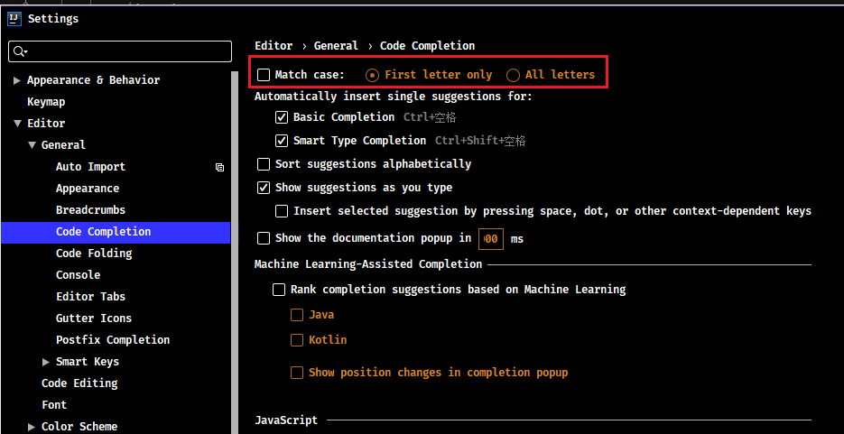

### 5.12. 设置自动导包


如上图标注 1 和 2 所示，默认 IntelliJ IDEA 是没有开启自动 import 包的功能。

- 勾选标注 1 选项，IntelliJ IDEA 将在我们书写代码的时候自动帮我们优化导入的包，比如自动去掉一些没有用到的包。
- 勾选标注 2 选项，IntelliJ IDEA 将在我们书写代码的时候自动帮我们导入需要用到的包。但是对于那些同名的包，还是需要手动 Alt + Enter 进行导入的，IntelliJ IDEA 目前还无法智能到替我们做判断。


如上图标注 1 所示，当我们 Java 类中导入的某个包下类超过这里设置的指定个数，就会换成用 `*` 号来代替。

**如果设置智能自动导包**。如下图所示，将【自动导入不明确的结构】和【智能优化包】这两个选项勾上。在代码中，只要敲list，就会出现提示，自动导入`java.util.List`这个类。而这个特性，在eclipse中，是无法做到的。如下图所示:


### 5.13. 设置tab标签多行显示

File --> settings --> Editor --> General --> Editor Tabs --> 去掉 Show tabs in one row 的 √ 即可


### 5.14. IDEA 设置代码行宽度

输入的代码超出宽度界线时，让IDE自动将代码换行。点击【File】 --> 【settings】 --> 【Editor】 --> 【Code Style】

- 方式1：在上述的“Right margin (columns)”的下方，有“Wrap when typing reaches right margin”选项，选中它。随着输入的字符的增加，当代码宽度到达界线时，IDEA会自动将代码换行。
- 方式2：在File -> settings -> Code Style -> Java中，选中“Wrapping and Braces”选项卡，在“Keep when reformatting”中有一个“Ensure rigth margin is not exceeded”，选中它，在格式化Java代码时，确保代码没有超过宽度界线。即输入的代码超出界线后格式化换行

### 5.15. IDEA 设置类和方法注释模板

首先来设置IDEA中类的模板：（IDEA中在创建类时会自动给添加注释）

设置File-->settings-->Editor-->File and Code Templates-->Files，选择Class文件（当然要设置接口的还也可以选择Interface文件）

1. `${NAME}`：设置类名，与下面的`${NAME}`一样才能获取到创建的类名
2. `TODO`：代办事项的标记，一般生成类或方法都需要添加描述
3. `${USER}`、`${DATE}`、`${TIME}`：设置创建类的用户、创建的日期和时间，这些事IDEA内置的方法，还有一些其他的方法在绿色框标注的位置，比如你想添加项目名则可以使用`${PROJECT_NAME}`
4. `1.0`：设置版本号，一般新创建的类都是1.0版本，这里写死就可以了

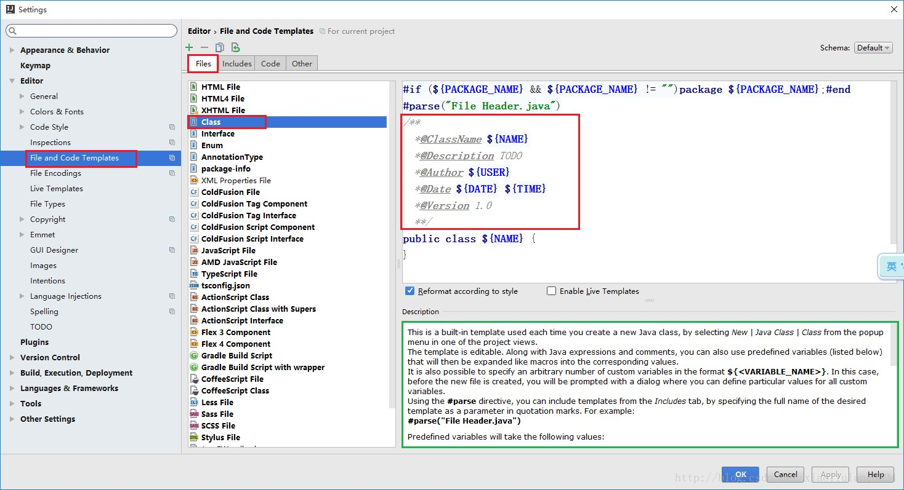

> *方法注释模板设置详见* https://blog.csdn.net/xiaoliulang0324/article/details/79030752

### 5.16. 修改智能提示快捷键

- File -> Settings -> Keymap -> Main menu -> Code -> Completion -> Basic，修改提示快捷键（如：Ctrl+Alt+Enter）
- File -> Settings -> Keymap -> Editor Actions -> Complete Current Statement，修改（如：Ctrl+）

### 5.17. 设置项目结构树状显示或折叠空包

树状显示效果：

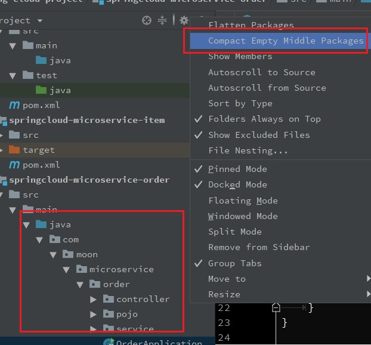

折叠空包显示效果：


### 5.18. 设置默认展开与折叠代码


如上图标注红圈所示，可以对指定代码类型进行默认折叠或是展开的设置，勾选上的表示该类型的代码在文件被打开的时候默认是被折叠的，去掉勾选则反之。

### 5.19. 设置滚轴修改字体大小

按住Ctrl+滚轴可以修改编辑器字体大小，如果需要此功能，勾选下图选项即可


### 5.20. 设置自动生成serialVersionUID

新建一个测试的实体类，实现`java.io.Serializable`接口，选择类名，按`Alt+Enter`键，出现的提示框中没有生成serialVersionUID的提示，这个需要设置之后才会有自动生成的提示信息

点击选择【File】-->【Settings】-->【Editor】-->【Inspections】。在右边的搜索框中输入`serialVersionUID`关键字，出现以下选项，勾选`Serializable class without serialVersionUID`


设置完后，光标放在类名上，再次按`Alt+Enter`键，这个时候可以看到`Add serialVersionUID field`提示信息


### 5.21. 关闭自动保存和标志修改文件为星号（*）

去掉默认保存，File --> settings --> System Settings --> 去掉勾选synchronize files on frame or editor tab activation 和去掉勾选 save files on frame deactivation


标志修改文件为星号File --> Settings --> Editor --> General --> Editor tabs --> 勾选 mark modified files as asterisk


### 5.22. IDEA去除掉虚线，波浪线，和下划线实线的方法

#### 5.22.1. 点击右下角取消文件检查

IntelliJ IDEA 对于编辑大文件并没有太大优势，很卡，原因就是它有各种检查，这样是非常耗内存和 CPU 的，所以为了能加快大文件的读写，一般会暂时性设置为 None。

- Inspections 为最高等级检查，可以检查单词拼写，语法错误，变量使用，方法之间调用等。
- Syntax 可以检查单词拼写，简单语法错误。
- None 不设置检查。


#### 5.22.2. 取消单词拼写检查


如上图箭头所示，IntelliJ IDEA 默认是开启单词拼写检查的，有些人可能有强迫症不喜欢看到单词下面有波浪线，就可以去掉该勾选。

但是建议这个还是不要关闭，因为拼写检查是一个很好的功能，当大家的命名都是标准话的时候，这可以在不时方便地帮我们找到代码因为拼写错误引起的 Bug。

#### 5.22.3. 代码中大量的波浪线


解决方法是File -- Setting -- Editor -- Inspections，右侧搜索General，取消√，保存退出


#### 5.22.4. 参数和变量有下划线，实线


解决方法，Filt -- Setting -- Editor -- Color Scheme -- Java ，点击下方需要修改代码，看到最右侧有显示效果Effects ，如下图。这里可以看到，参数的显示效果是绿色下划线underscored，（同样的点击下面代码中变量名，可以看到他的显示效果，也可以按照这个方法取消一些提示显示的效果）。可以把underscored换成blod underscored，或者直接取消Effects前的√，Apply，退出。


#### 5.22.5. Typo提示


这种提示也是比较常见的，直接File -- Setting，搜索Typo，可以看到下面有各种情况下的提示效果包括Typo（绿色波浪线），Typo上面还有Error错误时红线波浪线，Warning警告时灰色波浪线和无法识别时加红等。根据自己的情况调整。这里把Typo和警告Warning，Weak warning时的提示效果都取消掉。取消方法还是取消掉右侧的Effects的“√”。保存退出。


#### 5.22.6. never used 提示


为了代码更加规范，少些无效的代码，IDEA会对于方法中未使用到的一些变量做出提示never used，但是对于刚创建的变量，方法都还没有写完，他就开始提示该变量没有用到就有点过分了，甚是让人反感。

解决方法，File -- Setting -- Editor -- Inspections，右侧搜索“unused”，找到Java一栏，取消没未用到时的提醒说明。保存退出。


有时候会出现assigned的提示，解决方法和上面的一样。搜索“assigned”，找到java一栏，取消下面的勾选项。


#### 5.22.7. 参数不匹配时symbol错误提示


这个个人感觉还是有必要保留的，但是对于或者用习惯eclipse的，可能一开始提示这样的错误，很诧异，注释中参数名和方法中不匹配竟然直接error提示。当然关闭提示的办法肯定是有的。

如图，直接File -- setting，搜索“javadoc”，取消选项。保存退出。

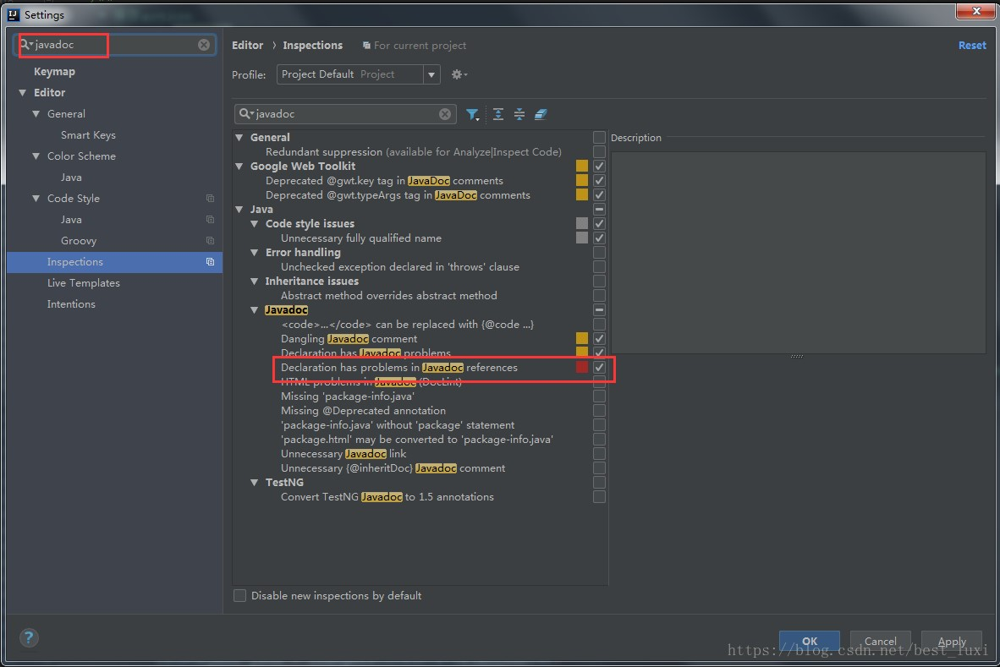

#### 5.22.8. 变量初始化多余时的提示：Variable "xxxx" initializer 'xxx' is redundant


idea对代码进行了审查，在开发的时候也会经常对变量在未使用之前做初始化操作，不分配内存地址，但是不明白为什么，idea竟然会提示“变量初始化多余”。有点不解，难道是对jvm的内存使用理解有问题。

取消提示的方法，选择提示的变量，快捷键“Alt” + “Enter”，取消审查。


#### 5.22.9. 去除IntelliJ IDEA中mapper.xml文件的提示和背景色

1. 点击 File --> Settings --> Editor --> Inspections，找到图中所示的SQL，去掉下面的No data sources configured和SQL dialect detection的勾选


2. 点击 Editor --> Colors Scheme --> General ，打开Code，选择Injected language fragment，去掉Background的勾选


#### 5.22.10. 总结

简单的统一关闭提示的方法，其实上面也有说明这个方法，当遇到提示的时候，我们可以先选择代码，然后快捷键“Alt”+“Enter”，选择remove xxxx，可以选择删除你的多余代码，也可以选择取消idea的提示。

### 5.23. IDEA无法使用已安装的字体

给电脑安装了Monaco.ttf字体后在其他软件都能正常使用，结果在IDEA字体设置中找不到该字体。电脑环境：Windows10 x64、IntelliJ IDEA 2018.3.5 x64


解决办法：找到IDEA安装目录，把字体文件复制到IDEA-jre-lib-fonts目录下，重启IDEA就能看到该字体了


### 5.24. 关闭idea2020的注释doc默认的Rendered View模式

打开【Settings】 -> Editor -> General -> Appearance -> 取消勾选 【Render documentation comments】


Editor -> Reader Mode -> 取消勾选 【Enable Reader mode】


### 5.25. UI Options(界面设置)

设置位置：Appearance & Behavior -> Appearance -> UI Options


#### 5.25.1. 显示树状缩进级别垂直线

【Show tree indent guides】，开启效果如下：


#### 5.25.2. 平滑移动

【Smooth scrolling】，开启后用鼠标中键上下滑动更流畅

#### 5.25.3. 树状菜单更小的缩进

【Smooth scrolling】，开启效果如下：


#### 5.25.4. 按Alt进行拖动

【Drag-n-Drop with Alt pressed only】，启用后，按住该Alt键才可移动内容。避免意外移动文件，编辑器选项卡，工具窗口按钮和其他UI组件。

#### 5.25.5. 合并IDEA主菜单到window标题

【Merge main menu with window title】，将IDEA主菜单合并到window栏

#### 5.25.6. 始终在窗口标题中显示完整路径

【Always show full path in window header】，始终在窗口标题中显示完整路径

#### 5.25.7. 在菜单项中显示图标

【Display icons in menu items】，在主菜单和上下文菜单中，在项目左侧显示图标。

### 5.26. Antialiasing (抗锯齿设置)

IDE: 选择要应用于IDE的哪种抗锯齿模式（包括菜单，工具窗口等）

- Subpixel(子像素): 用于LCD显示器，并利用彩色LCD上的每个像素都由红色，绿色和蓝色子像素组成
- Greyscale(灰度): 建议此选项用于非LCD显示器或垂直放置的显示器。它在像素级别处理文本。
- No antialiasing(无抗锯齿): 此选项可用于高分辨率的显示，其中非抗锯齿的字体渲染速度更快，并且外观可能更好。

Editor: 选择要应用于编辑器的抗锯齿模式：

- Subpixel(子像素): 用于LCD显示器，并利用彩色LCD上的每个像素都由红色，绿色和蓝色子像素组成
- Greyscale(灰度): 建议此选项用于非LCD显示器或垂直放置的显示器。它在像素级别处理文本。
- No antialiasing(无抗锯齿): 此选项可用于高分辨率的显示，其中非抗锯齿的字体渲染速度更快，并且外观可能更好。

### 5.27. Tool Windows(工具栏设置)

设置位置：Appearance & Behavior -> Appearance -> Tool Windows

- 【Show tool window bars】，在主窗口的边缘周围显示工具窗口栏
- 【Show tool window numbers】，工具栏显示数字，并且可以按Alt键加数字键快捷打开菜单

## 6. 配置代码模板（Live Templates）


### 6.1. 示例 - 修改main方法与输出打印快捷键


### 6.2. 示例 - 配置日志LOGGER模板


创建分组，可以区分与IDEA原生的模版


选择分组，创建模版


设置需要的变量值


设置模版作用的范围

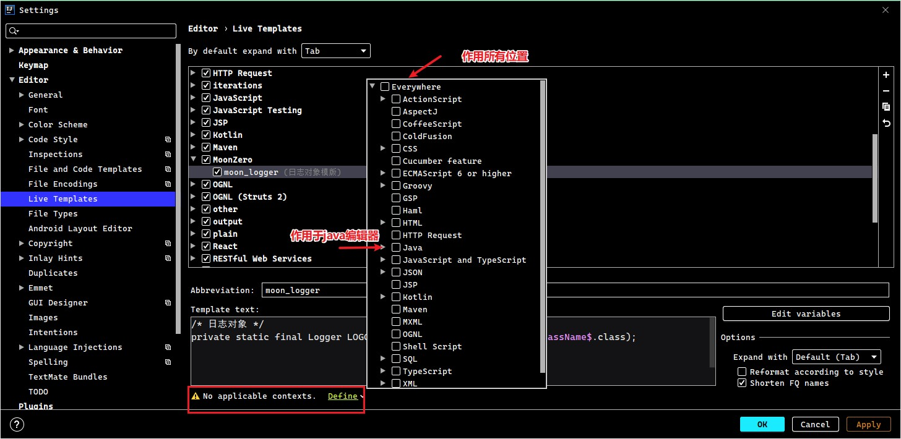

保存后即可以使用


## 7. 定义文件模版（File and Code Templates）


### 7.1. 示例 - 定义Mybatis的mapper.xml文件


创建文件时，多出自定义文件模版


效果如下


## 8. 代码补全模板（Postfix Completion）

Postfix Completion其实就是关于代码补全的一些模板。在【Settings】-->【Editor】-->【General】-->【Postfix Completion】中看到idea默认的一些模板


## 9. IDEA 启用/禁用 Run Dashboard

### 9.1. 启用 Run Dashboard

**方式一**：	创建/打开一个SpringBoot项目【或者点击Run --> Edit Configurations 添加 Spring Boot 类型的项目配置；或者如图在红框处添加配置】，会弹出一个 Run Dashboard 信息框，点击第一个蓝色连接(Show run configurations in Run Dashboard) 即可。


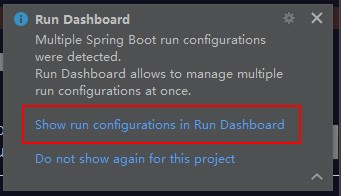

方式二：点击View --> Tool Windows --> Run Dashboard（此方式是Run Dashboard已经打开后，只是隐藏了才能使用此方式）


方式三：在项目`.idea`目录中的`workspace.xml`中找到 RunDashboard 的 component 节点内增加以下代码

```xml
<component name="RunDashboard">
    <option name="configurationTypes">
      <set>
        <option value="SpringBootApplicationConfigurationType" />
      </set>
    </option>
</component>
```

### 9.2. 禁用 Run Dashboard

方式一：在弹出的 Run Dashboard 信息框，点击第二个蓝色连接(Do not show again for this peoject) 即可


方式二：在项目`.idea`目录中的`workspace.xml`中找到 RunDashboard 的 component 接点内删除以下代码

```xml
<option name="configurationTypes">
	<set>
		<option value="SpringBootApplicationConfigurationType" />
	</set>
</option>
```

### 9.3. 其他操作

在弹出的 Run Dashboard 信息框，点击第二个蓝色连接(Do not show again for this peoject)后，会发现Run Dashboard 信息框不再有了，可以通过快捷键`Ctrl+Alt+S`打开Settings窗口【或点击File --> Settings】，在搜索框输入Notifications，然后修改右侧Run Dashboard栏信息即可。以下是Popup(弹出窗口)的设置说明：

- `Balloon`：弹出窗在屏幕上显示一小段时间，然后自动消失。通知也会显示在状态栏中，并添加到通知列表中。
- `Sticky balloon`：若不手动关闭，弹出窗会在屏幕上一直显示
- `No popup`：不显示该弹出窗


## 10. IntelliJ IDEA 导出和导入设置

导出：点击【File】 --> 【Export Settings】 --> 选择需要导出的【Settings】的选项 --> 选择导出的位置，点击【OK】导出


导入：点击【File】 --> 【Import Settings】 --> 找到【Settings】的位置，点击【OK】导入

## 11. 导入maven项目时无法识别

导入项目父级目录不是 Maven Parent 目录而是普通的文件夹，里面的子 maven 项目无法识别（子module变灰）。

### 11.1. 方式1

1. 右键父项目 --> 选择【open Module Settings】 --> 选择【modules】 --> 点击【+】号 --> 选择【Import Module】


2. 选择变灰项目的【pom.xml】文件
3. 点击【ok】 --> 【next】 --> 一直选择到结束即可

### 11.2. 方式2

选择无法识别的 pom.xml 文件，右键选择【+ Add as Maven Project】

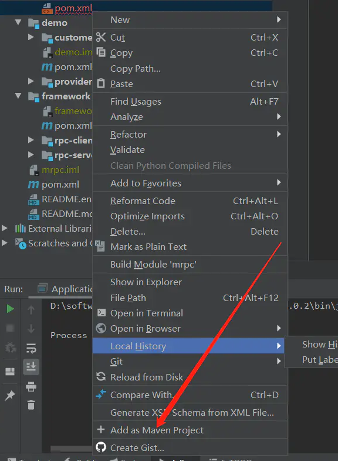

## 12. IDEA复制项目导致sources root复用了另一个项目【解决办法】

比如现在新建一个项目，而对原来的uis-gateway复制粘贴，然后改项目名就成了uis-application了。这时会发现如下图所示，sources root依然是uis-gateway：


解决方法：快捷键`Ctrl+Alt+Shift+S`打开Project Structure -> 在Modules中点下原始项目uis-gateway，可以看到这时它的Sources、Test、Resources都是新项目uis-application的：

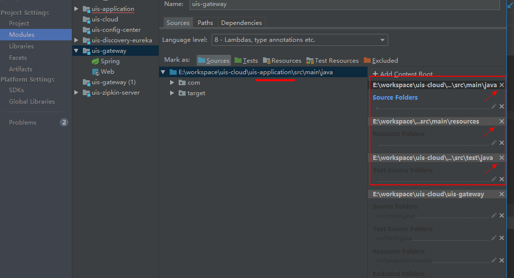

点上图右边框框里的叉叉删掉：


此时恢复原状：


## 13. Tomcat Server（当前项目配置）

Tomcat或者Jetty这些都是部署的容器，自然会联想到Deployment ，打开部署配置，可以看到应用服务器的配置

配置Tomcat方法： File -> Settings -> Deployment -> Application Servers -> Tomcat Server


## 14. IDEA 的项目配置和Web部署

IDEA中最重要的各种设置项，就是这个 `Project Structre` 了，关乎你的项目运行


### 14.1. Project选项卡
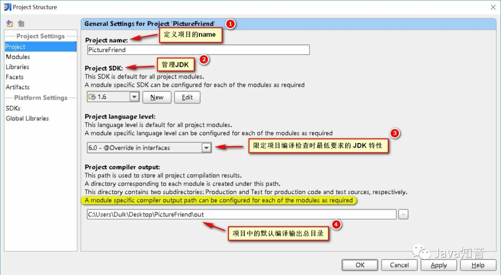

- `Project name`：定义项目的名称；
- `Project SDK`：设置该项目使用的JDK，也可以在此处新添加其他版本的JDK；
- `Project language level`：这个和JDK的类似，区别在于，假如你设置了JDK1.8，却只用到1.6的特性，那么这里可以设置语言等级为1.6，这个是限定项目编译检查时最低要求的JDK特性；
- `Project compiler output`：项目中的默认编译输出总目录，如图黄色部分，实际上每个模块可以自己设置特殊的输出目录（Modules - (project) - Paths - Use module compile output path），所以这个设置有点鸡肋。

### 14.2. Modules选项卡


#### 14.2.1. 增删子项目


一个项目中可以有多个子项目，每个子项目相当于一个模块。一般我们项目只是单独的一个，IntelliJ IDEA 默认也是单子项目的形式，所以只需要配置一个模块

#### 14.2.2. 子项目配置

每个子项目都对应了Sources、Paths、Dependencies 三大配置选项

- `Sources`：显示项目的目录资源，那些是项目部署的时候需要的目录，不同颜色代表不同的类型；
- `Paths`：可以指定项目的编译输出目录，即项目类和测试类的编译输出地址（替换掉了Project的默认输出地址）
- `Dependencies`：项目的依赖


#### 14.2.3. 增删框架（Web部署-1）

每个子项目之下都可以定义它所使用的框架，这里重点说明一下Web部分的设置


### 14.3. Libraries选项卡

这里可以显示所添加的jar包，同时也可以添加jar包，并且可以把多个jar放在一个组里面，类似于jar包整理。

这里默认将每个jar包做为了一个单独的组（未测试，待定）。

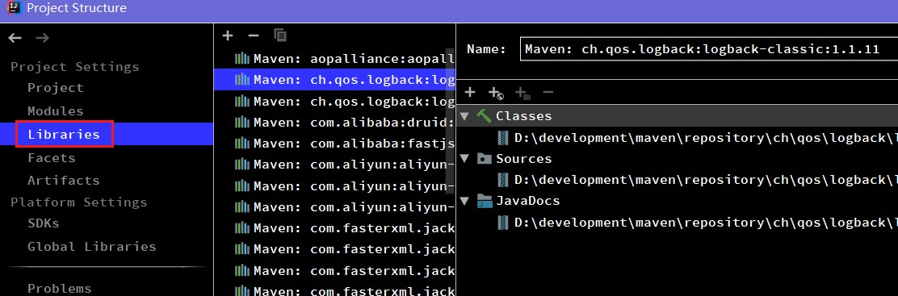

### 14.4. Facets选项卡

官方的解释是：When you select a framework (a facet) in the element selector pane, the settings for the framework are shown in the right-hand part of the dialog.（当你在左边选择面板点击某个技术框架，右边将会显示这个框架的一些设置）

说实话，并没有感觉到有什么作用。


### 14.5. Artifacts（Web部署-2）

项目的打包部署设置，这个是项目配置里面比较关键的地方。先理解下它的含义，来看看官方定义的artifacts：

即编译后的Java类，Web资源等的整合，用以测试、部署等工作。再白话一点，就是说某个module要如何打包，例如war exploded、war、jar、ear等等这种打包形式。某个module有了 Artifacts 就可以部署到应用服务器中了。

- jar：Java ARchive，通常用于聚合大量的Java类文件、相关的元数据和资源（文本、图片等）文件到一个文件，以便分发Java平台应用软件或库；
- war：Web application ARchive，一种JAR文件，其中包含用来分发的JSP、Java Servlet、Java类、XML文件、标签库、静态网页（HTML和相关文件），以及构成Web应用程序的其他资源；
- exploded：在这里你可以理解为展开，不压缩的意思。也就是war、jar等产出物没压缩前的目录结构。建议在开发的时候使用这种模式，便于修改了文件的效果立刻显现出来。

默认情况下，IDEA的 Modules 和 Artifacts 的 output目录已经设置好了，不需要更改，打成war包的时候会自动在 WEB-INF目录下生成classes，然后把编译后的文件放进去。


其实，实际上，当点击运行tomcat时，默认就开始做以下事情：

- 编译，IDEA在保存/自动保存后不会做编译，不像Eclipse的保存即编译，因此在运行server前会做一次编译。编译后class文件存放在指定的项目编译输出目录下（见1.2.2）；
- 根据artifact中的设定对目录结构进行创建；
- 拷贝web资源的根目录下的所有文件到artifact的目录下（见1.2.3）；
- 拷贝编译输出目录下的classes目录到artifact下的WEB-INF下（见1.2.2）；
- 拷贝lib目录下所需的jar包到artifact下的WEB_INF下；
- 运行server，运行成功后，如有需要，会自动打开浏览器访问指定url。

在这里还要注意的是，配置完成的artifact，需要在tomcat中进行添加：


## 15. 设置idea连接linux系统

根据linux系统的编码设置Default encoding


点击Configura Servers，点击【+】，填写连接名称


选择【Type】：SFTP，填写连接url、用户名、密码


点击Tools --> Start SSH session


## 16. 使用idae创建的 Spring Boot 项目，运行两个一样的启动类


## 17. Intellij IDEA 4种配置热部署的方法

热部署可以使的修改代码后，无须重启服务器，就可以加载更改的代码。

### 17.1. 方式1：修改服务器配置，使得IDEA窗口失去焦点时，更新类和资源

菜单Run -> EditConfiguration , 然后配置指定服务器下，右侧server标签下on frame deactivation = Update classes and resource。

- 优点：简单
- 缺点：基于JVM提供的热加载仅支持方法块内代码修改，只有debug模式下，并且是在idea失去焦点时才会出发热加载，相对加载速度缓慢

### 17.2. 方式2：使用springloaded jar包

下载jar包，github：https://github.com/spring-projects/spring-loaded

启动应用时添加VM启动参数：`-javaagent:/home/lkqm/.m2/repository/org/springframework/springloaded/1.2.7.RELEASE/springloaded-1.2.7.RELEASE.jar -noverify`

- 优点：对Spring系列框架支持好（不含Spring boot）, 支持 成员级别的修改（增删改方法、字段、注解），支持对枚举值集。
- 缺点：与优点相对

### 17.3. 方式3：使用spring-boot-devtools提供的开发者工具

spring-boot项目中引入如下依赖

```xml
<dependency>
	<groupId>org.springframework.boot</groupId>
	<artifactId>spring-boot-devtools</artifactId>
</dependency>
```

- 优点：简单，支持Spring-boot项目，支持成员级别的修改热部署。
- 缺点：只支持spring-boot项目。

### 17.4. 方式4：使用Jrebel插件实现热部署(该插件14天免费试用)

在线安装：菜单File -> Setting -> Plugin, 点击右侧底部 Browse repositories, 弹出框顶部输入:JReble for Intellij， 选中安装即可

- 优点：强大，对各类框架支持，并且提供IDE插件的方式

### 17.5. 注意

最后3种方法是基于类加载机制来实现热加载的，因此你修改完成代码后必须重新编译当前代码，才能触发热部署，Eclipse默认就支持了自动编译，而在Intellij IDEA中默认是关闭了自动编译的，可以按照如下2步设置开启：

1. IDEA开启项目自动编译，进入设置，Build,Execut, Deployment -> Compiler 勾选中左侧的`Build Project automatically`
2. IDEA开启项目运行时自动make, ctrl + shift + a搜索命令：registry -> 勾选`compiler.automake.allow.when.app.running`

## 18. IDEA 2019 中文字体渲染有粗有细异常解决方法


解决方法：File --> Settings --> Editor --> Font --> Fallback font 这一栏选择一种字体，如：SimHei 字体


## 19. 开启/关闭一个项目中的某些模块

在项目根目录上右键，选择【Load/Unload Modules...】


选择相应需要加载的/不加载的模块


### 19.1. Http Client 无法请求本地接口


原因是 IDEA 的代理出了问题，准确说是 IDEA 的代理没有忽略本地地址，导致 IDEA 访问不到本地。修改 IDEA 代理或者直接关闭代理


## 20. 自动清理缓存和日志(2021.2+版本)

IDEA 2021.2 增加一个自动清理的缓存以及日志的的功能，目前将会自动清理更新已超过 180 天的所有缓存和日志目录。这个清理不会影响系统设置和插件目录。

另外也可以 Help | Delete Leftover IDE Directories 手动打开这个清理功能。


## 21. 微服务图表(2021.2+版本)

IDEA 2021.2 现在可以展示微服务的图表，在这上面可以看到微信服务交互关系。可以点击 Endpoints 工具窗口中的相应图标进行构建生成。


## 22. 常用操作

### 22.1. 个人修改的快捷键

查看附件\note attachments\99-其他\IntelliJ IDEA\IntelliJ IDEA 快捷键.xlsx

### 22.2. 查看图形形式的继承链

在想查看的类的标签页内，点击右键，选择 Diagrams，其中有 show 和 show ... Popup，只是前者新建在标签页内，后者以浮窗的形式展示：


- 标签页内打开：Ctrl+Alt+Shift+U
- 浮窗打开：Ctrl+Alt+U


- <font color=blue>**蓝色**</font>实线箭头是指继承关系
- <font color=green>**绿色**</font>虚线箭头是指接口实现关系

### 22.3. 同时编辑多行

按着ALT键，用鼠标左键拖动需要编辑的行内容

### 22.4. inject language快速构建一些语法 - 快速定义JSON

1. 定义一个json字符串则需要手动的去用`\`将`"`转义。使用inject language则可以省去这个步骤。
2. 定义一个json的字符串，将光标放在`""`中间，然后按Alt+Enter，出来如下提示后，选择Inject language or reference。

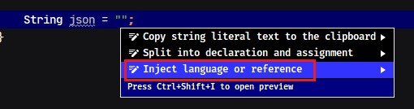

然后点击Enter进入后，选择或搜索JSON后回车。然后继续按Alt+Enter，出来如下提示后，选择Edit JSON Fragment。


回车后，会弹出一个输入框。在输入框中写JSON后会自动帮转义成字符串。


## 23. 解决 idea 卡顿问题

- 在各种优化配置都没明显改善，最后想出了一招禁用和卸载一些平时用不到的插件。效果显著，直接起飞。

> 在升级 2021 以上版本后卡顿问题，感觉主要可能是 Code With Me 和 Space 引起的，在之前没有这 2 插件的时候也没这么明显的卡顿感

# 其他

## 1. 推荐插件

### 1.1. 热替换利器：JRebel

一款热部署插件，帮助开发者在项目处于运行状态下任意修改 Java 文件并动态反馈到运行的项目中。地址：https://plugins.jetbrains.com/plugin/4441-jrebel-for-intellij

### 1.2. 开发测试必备部署神器：Cloud Toolkit

帮助开发者更高效地开发、测试、诊断并部署应用，利用此插件，能够方便地将本地应用一键部署到任意机器（了解更多：[体验链接](https://mp.weixin.qq.com/s?__biz=MzU4NzU0MDIzOQ==&mid=2247485392&idx=3&sn=113a67be48740443b9a29d172da48b12&chksm=fdeb35b0ca9cbca6f48b61c8c333683b6acbaac4f1e8101ff54546d9256347bff629e0e513c5&scene=21#wechat_redirect)）

### 1.3. Lombok插件

Lombok是一个实用的java工具，使用它可以消除java代码的臃肿，Lombok提供一系列的注解，使用这些注解可以不用定义getter/setter、equals、构造方法等，它会在编译时在字节码文件自动生成这些通用的方法，简化开发人员的工作。该插件使用IDEA开发时根据Lombok注解生成通用方法并提示，不报错

项目官方地址：https://www.projectlombok.org/


### 1.4. Rainbow Brackets

彩虹颜色的括号，分清括号个数，防止括号错乱。插件提供地址：https://plugins.jetbrains.com/plugin/10080-rainbow-brackets

### 1.5. Free Mybatis plugin

可以在mapper接口中和mapper的xml文件中来回跳转，就想接口跳到实现类那样简单。

> 目前安装的版本是：Free Mybatis plugin，还一个插件叫Mybatis plugin

### 1.6. 主题类插件

- Material Theme UI
- One Dark theme
- Dark Purple Theme

### 1.7. Key promoter X（快捷键提示）

Key Promoter X 是一个提示插件。在IDEA里使用鼠标操作时，会有这个操作的快捷键在界面的右下角进行告知。有个小缺点是有些没有快捷键的操作，会直接把操作的名字提示出来，实际上那样的提示是没有作用的，可以点击Don't show again来忽略。


### 1.8. Alibaba Java Coding Guidelines（代码规范）

阿里巴巴代码规范检测。不符合代码规范的地方会有波浪线，鼠标移上去就会有相应的提示，有些问题甚至可以快速修复。

### 1.9. Leetcode Editor

LeetCode插件，可以在IDEA中在线刷题。

### 1.10. RestfulToolkit

搜索URL，准确的说是搜索SpringMVC项目里，Controller层的`@RequestMapping`里的URL，通过URL匹配到相应的Controller层方法。使用快捷键：`Ctrl + \` 或 `Ctrl + Alt + N`

### 1.11. CamelCase

在几种字符串格式之间来回切换。有一下几种格式：

- 驼峰，第一个单词首字母小写，其他单词首字母大写；
- 所有字母小写，单词间下划线分隔
- 所有字母小写，单词间空格分隔
- 所有字母小写，单词间短横线分隔
- 每个单词首字母全部大写
- 所有字母大写，单词间下划线分隔

使用：按住Shift + Alt再不停的按U，会把选中内容的单词的下划线转驼峰转大写等，不停的转换。~~感觉String Manipulation功能比它强大~~

### 1.12. String Manipulation

功能：变量名使用驼峰形式、常量需要全部大写等等，编码解码等等。总的来说就是对字符串的处理。

选中需要处理的内容后，按快捷键Alt + M，即可弹出工具功能列表。后面的具体功能也可以使用相应的数字或字母，而不需要鼠标点击。


### 1.13. SequenceDiagram

时序图生成工具。需要梳理业务逻辑或者阅读源码。需要了解整个调用链路，反向生成 UML 的时序图是强需求。其中，SequenceDiagram 插件是一个非常棒的插件。详细使用参考：https://plugins.jetbrains.com/plugin/8286-sequencediagram

### 1.14. Maven Helper

Maven辅助工具。如果 Maven 引入的 jar 包有冲突，可以使用 Maven Helper 插件来帮助分析。详细使用参考：https://plugins.jetbrains.com/plugin/7179-maven-helper

### 1.15. GsonFormat

在对接接口的时候接受对方返回的JSON对象，而自己想要用一个对象去接受时，可以用此插件进行转换。可以根据json字符串生成对应的实体类

### 1.16. Grep Console

Idea的控制台console输出日志时，往往是一大堆信息一起出现，想要快速找到自己想要的日志类型，使用这个插件便可以快速定位到自己关注的日志类型，还可以配置自己喜欢的颜色。

使用方式：点击菜单栏的File之后点击下拉表中的Settings，进入Other Settings中后点击Grep Console设置


### 1.17. Codota—代码智能提示

Codota 这个插件用于智能代码补全，它基于数百万Java程序，能够根据程序上下文提示补全代码。相比于IDEA自带的智能提示来说，Codota 的提示更加全面一些

Codota 还有一个在线网站，在这个网站上可以根据代码关键字搜索相关代码示例。网站地址：https://www.codota.com/code。作用如下：

1. 智能自动补全。Codota 可以快速的完成智能补全以及高频用法提示
2. 快速查询相关使用案例，同时可以通过添加关键字进行过滤，查找到更加精确的代码样例。快捷键：ctrl + shift + o
3. 当不知道某个类如何使用时，可以直接使用快捷键：ctrl + shift + y，然后输入关键字，会查询到很多【开源框架】中使用该类的经典案例。

> 注：同时支持Eclipse

## 2. 使用激活码激活

1. 安装下载软件，安装完成后，注意先不运行软件，所以不要勾选【Run Intelli IDEA】
2. 接下来对软件进行注册破解，首先以记事本的方式打开hosts文件（文件默认目录【C:\Windows\System32\drivers\etc】），将代码添加至hosts文件屏蔽网络联网；

```
0.0.0.0 account.jetbrains.com
0.0.0.0 www.jetbrains.com
```


3. 再运行桌面上生成的idea ultimate 2019.1软件图标，选择【do not import settings】点击ok，然后勾选【I confirm that...】点击continue进入进入如下界面，点击红色框内的选择


4. 弹出注册界面，选择"activation code"输入注册码即可激活

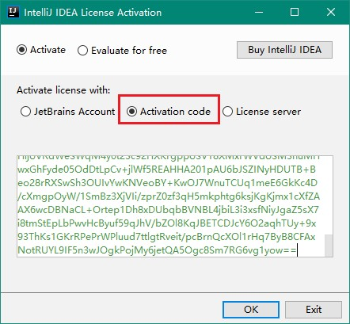

5. 至此，idea ultimate 2019.1破解版成功激活

## 3. 快捷键

- 官方快捷键：https://resources.jetbrains.com/storage/products/intellij-idea/docs/IntelliJIDEA_ReferenceCard.pdf
- windows 快捷键


- macOS 快捷键


## 4. 主题样式

### 4.1. 一些主题网址

- http://www.themesmap.com/
- http://www.riaway.com/
- http://www.easycolor.cc/intelliJidea/list.html
- http://color-themes.com/?view=index

### 4.2. 待尝试主题

- Xcode-Dark Theme主题下载地址：https://plugins.jetbrains.com/plugin/13106-xcode-dark-theme/versions
- Vuesion Theme主题下载地址：https://plugins.jetbrains.com/plugin/13106-xcode-dark-theme/versions
- One Dark theme主题下载地址：https://plugins.jetbrains.com/plugin/11938-one-dark-theme
- Dark Purple Theme主题下载地址：https://plugins.jetbrains.com/plugin/12100-dark-purple-theme

### 4.3. 怎么安装下载的主题

1. 从主菜单打开你的编辑器选择 File --> Import Setting。选择下载的jar文件;
2. 等待重启之后进行配置：打开File --> Settings --> Editor --> Colors and fonts 然后选择要安装的主题即可完成
