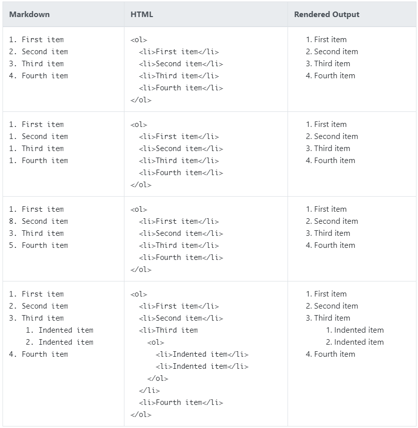
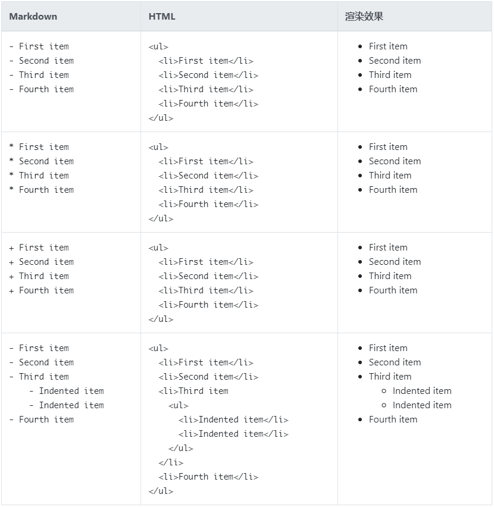
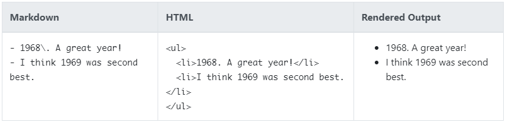
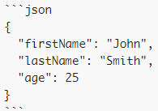

# Markdown 参考笔记

> 参考资料：https://www.markdown.xyz/

## 1. 基础语法

### 1.1. 标题（Headings）

1. **常规写法**

要创建标题，请在单词或短语前面添加井号 (`#`) 。井号的数量代表了标题的级别。例如，添加三个井号即创建一个三级标题 (`<h3>`) (例如：`### My Header`)。

|         Markdown         |            HTML            |                                 渲染效果                                 |
| ------------------------ | -------------------------- | ----------------------------------------------------------------------- |
| `# Heading level 1`      | `<h1>Heading level 1</h1>` | <span style="font-size:2.5rem;font-weight:700;">Heading level 1</span>  |
| `## Heading level 2`     | `<h2>Heading level 2</h2>` | <span style="font-size:2rem;font-weight:700;">Heading level 2</span>    |
| `### Heading level 3`    | `<h3>Heading level 3</h3>` | <span style="font-size:1.75rem;font-weight:700;">Heading level 3</span> |
| `#### Heading level 4`   | `<h4>Heading level 4</h4>` | <span style="font-size:1.5rem;font-weight:700;">Heading level 4</span>  |
| `##### Heading level 5`  | `<h5>Heading level 5</h5>` | <span style="font-size:1.25rem;font-weight:700;">Heading level 5</span> |
| `###### Heading level 6` | `<h6>Heading level 6</h6>` | <span style="font-size:1rem;font-weight:700;">Heading level 6</span>    |

2. **可选语法**

还可以在文本下方添加任意数量的 `==` 号来标识一级标题，或者 `--` 号来标识二级标题。

|                 Markdown                 |            HTML            |                                 渲染效果                                 |
| ---------------------------------------- | -------------------------- | ----------------------------------------------------------------------- |
| `Heading level 2`<br />`==============`  | `<h2>Heading level 2</h2>` | <span style="font-size:2rem;font-weight:700;">Heading level 2</span>    |
| `Heading level 3`<br />`---------------` | `<h3>Heading level 3</h3>` | <span style="font-size:1.75rem;font-weight:700;">Heading level 3</span> |

### 1.2. 段落（Paragraphs）

要创建段落，使用空白行将一行或多行文本进行分隔。

### 1.3. 换行（Line Breaks）

在一行的末尾添加**两个或多个空格**，然后按回车键（return），即可创建一个换行（line break）或新行 (`<br/>`)。

|              Markdown              |                 HTML                 |           渲染效果           |
| ---------------------------------- | ------------------------------------ | --------------------------- |
| `first line.   `<br>`second line.` | `<p>first line.<br>second line.</p>` | first line.<br>second line. |
| `first line.<br>second line.`      | `<p>first line.<br>second line.</p>` | first line.<br>second line. |

**换行（Line Break）用法的最佳实践**

几乎每个 Markdown 应用程序都支持两个或多个空格进行换行 (称为 “结尾空格（trailing whitespace）”) 的方式，但这是有争议的，因为很难在编辑器中直接看到空格，并且很多人在每个句子后面都会有意或无意地添加两个空格。由于这个原因，可能需要使用除结尾空格以外的其它方式来进行换行。如果所使用的 Markdown 应用程序支持 HTML 的话，推荐使用 HTML 的 `<br>` 标签来实现换行。

### 1.4. 强调（Emphasis）

通过将文本设置为粗体或斜体来强调其重要性。

#### 1.4.1. 粗体（Bold）

要加粗文本，请在单词或短语的前后各添加两个星号（asterisks）`**`或下划线（underscores）`__`。如需加粗一个单词或短语的中间部分用以表示强调的话，请在要加粗部分的两侧各添加两个星号（asterisks）。

|          Markdown           |                   HTML                   |          渲染效果          |
| --------------------------- | ---------------------------------------- | ------------------------- |
| `I just love **bold text**` | `I just love <strong>bold text</strong>` | I just love **bold text** |
| `I just love __bold text__` | `I just love <strong>bold text</strong>` | I just love **bold text** |
| `Love**is**bold`            | `Love<strong>is</strong>bold`            | Love**is**bold            |

**粗体（Bold）用法最佳实践**：Markdown 应用程序在如何处理单词或短语中间的下划线上并不一致。为兼容考虑，在单词或短语中间部分加粗的话，请使用星号（asterisks）。

#### 1.4.2. 斜体（Italic）

要用斜体显示文本，请在单词或短语前后添加一个星号（asterisk）`*`或下划线（underscore）`_`。要斜体突出单词的中间部分，请在字母前后各添加一个星号，中间不要带空格。

|               Markdown                |                     HTML                     |               渲染效果               |
| ------------------------------------- | -------------------------------------------- | ----------------------------------- |
| `Italicized text is the *cat's meow*` | `Italicized text is the <em>cat's meow</em>` | Italicized text is the *cat’s meow* |
| `Italicized text is the _cat's meow_` | `Italicized text is the <em>cat's meow</em>` | Italicized text is the *cat’s meow* |
| `A*cat*meow`                          | `A<em>cat</em>meow`                          | A*cat*meow                          |

**斜体（Italic）用法的最佳实践**：Markdown 的众多应用程序在如何处理单词中间的下划线上意见不一致。为了兼容起见，请用星号标注文本斜体

#### 1.4.3. 粗斜体

|               Markdown                |                           HTML                            |               渲染效果               |
| ------------------------------------- | --------------------------------------------------------- | ----------------------------------- |
| `This text is ***really important***` | `This text is <strong><em>really important</em></strong>` | This text is ***really important*** |
| `This text is ___really important___` | `This text is <strong><em>really important</em></strong>` | This text is ___really important___ |
| `This text is __*really important*__` | `This text is <strong><em>really important</em></strong>` | This text is __*really important*__ |
| `This text is **_really important_**` | `This text is <strong><em>really important</em></strong>` | This text is **_really important_** |

Markdown 应用程序在处理单词或短语中间添加的下划线上并不一致。为了实现兼容性，请使用星号加粗并以斜体显示

### 1.5. 删除线（Strikethrough）

贯穿单词的中心放一条横线从而删除这些单词。其效果看起来是这样的：~~like this~~。此功能允许标记某些单词是错误的，不应该出现在文档中。在单词前面和后面分别放置两个波浪号（`~~`） 来表示删除这些单词。

```markdown
~~The world is flat.~~ We now know that the world is round.
```

渲染效果如下：

~~The world is flat.~~ We now know that the world is round.

### 1.6. 块引用（Blockquotes）

#### 1.6.1. 基础引用语法

要创建块引用，请在段落前添加一个 `>` 符号。 Notes: 为兼容起见，在分块引号前后放上空行。

```markdown
> Dorothy followed her through many of the beautiful rooms in her castle.
```

渲染效果如下：

> Dorothy followed her through many of the beautiful rooms in her castle.

#### 1.6.2. 多个段落的块引用（Blockquotes）

块引用可以包含多个段落。为段落之间的空白行各添加一个 `>` 符号。

```markdown
> Dorothy followed her through many of the beautiful rooms in her castle.
>
> The Witch bade her clean the pots and kettles and sweep the floor and keep the fire fed with wood.
```

渲染效果如下：

> Dorothy followed her through many of the beautiful rooms in her castle.
>
> The Witch bade her clean the pots and kettles and sweep the floor and keep the fire fed with wood.

#### 1.6.3. 嵌套块引用（Nested Blockquotes）

块引用可以嵌套。在要嵌套的段落前添加一个 `>>` 符号。

```markdown
> Dorothy followed her through many of the beautiful rooms in her castle.
>
>> The Witch bade her clean the pots and kettles and sweep the floor and keep the fire fed with wood.
```

渲染效果如下：

> Dorothy followed her through many of the beautiful rooms in her castle.
>
>> The Witch bade her clean the pots and kettles and sweep the floor and keep the fire fed with wood.

#### 1.6.4. 带有其它元素的块引用（Blockquotes with Other Elements）    

块引用可以包含其他 Markdown 格式的元素。注意：并非所有元素都可以使用

```markdown
> #### The quarterly results look great!
>
> - Revenue was off the chart.
> - Profits were higher than ever.
>
>  *Everything* is going according to **plan**.
```

渲染效果如下：

> #### The quarterly results look great!
>
> - Revenue was off the chart.
> - Profits were higher than ever.
>
> *Everything* is going according to **plan**.

### 1.7. 列表（Lists）

可以将多个条目与内容组织成有序或无序列表

#### 1.7.1. 有序列表（Ordered Lists）

要创建有序列表，请在每个列表项前添加数字并紧跟一个英文句点。数字不必按数学顺序排列，但是列表应当以数字 1 起始。



**有序列表（Ordered List）用法的最佳实践**：CommonMark 和其它几种轻量级标记语言可以使用括号（`)`）作为分隔符（例如 `1) First item`），但并非所有的 Markdown 应用程序都支持此种用法，因此，从兼容的角度来看，此用法不推荐。为了兼容起见，请只使用英文句点作为分隔符。

#### 1.7.2. 无序列表（Unordered Lists）

要创建无序列表，请在每个列表项前面添加破折号 (`-`)、星号 (`*`) 或加号 (`+`) 。缩进一个或多个列表项可创建嵌套列表。



****无序列表（Unordered List）用法的最佳实践：Markdown 应用程序在如何处理同一列表中混用不同分隔符上并不一致。为了兼容起见，请不要在同一个列表中混用不同的分隔符，最好选定一种分隔符并一直用下去。

#### 1.7.3. 以数字开头的无序列表项

如果需要以数字开头并且紧跟一个英文句号（也就是 `.`）的无序列表项，则可以使使用反斜线（`\`）来**转义**这个英文句号。



#### 1.7.4. 在列表中添加列表项

要在保留列表连续性的同时在列表中添加另一种元素，请将该元素缩进四个空格或一个制表符。

**段落（Paragraphs）**

```markdown
* This is the first list item.
* Here's the second list item.

    I need to add another paragraph below the second list item.

* And here's the third list item.
```

渲染效果如下：

* This is the first list item.
* Here's the second list item.

    I need to add another paragraph below the second list item.

* And here's the third list item.

**引用块（Blockquotes）**

```markdown
* This is the first list item.
* Here's the second list item.

    > A blockquote would look great below the second list item.

* And here's the third list item.
```

渲染效果如下：

* This is the first list item.
* Here's the second list item.

    > A blockquote would look great below the second list item.

* And here's the third list item.

**代码块（Code Blocks）**

代码块（Code blocks）通常采用四个空格或一个制表符缩进。当它们被放在列表中时，请将它们缩进八个空格或两个制表符。

```markdown
1. Open the file.
2. Find the following code block on line 21:

        <head>
            <title>Test</title>
        </head>

3. Update the title to match the name of your website.
```

渲染效果如下：

1. Open the file.
2. Find the following code block on line 21:

        <head>
            <title>Test</title>
        </head>

3. Update the title to match the name of your website.

**图片（Images）**

```markdown
1. Open the file containing the Linux mascot.
2. Marvel at its beauty.

    

3. Close the file.
```

渲染效果如下：

1. Open the file containing the Linux mascot.
2. Marvel at its beauty.

    

3. Close the file.

**列表（Lists）**，可以将无序列表嵌套在有序列表中，反之亦然。

```markdown
1. First item
2. Second item
3. Third item
    - Indented item
    - Indented item
4. Fourth item
```

渲染效果如下：

1. First item
2. Second item
3. Third item
    - Indented item
    - Indented item
4. Fourth item

### 1.8. 行内代码

#### 1.8.1. 行内代码基础语法

要将单词或短语表示为代码，请将其包裹在反引号 (`) 中。

|               Markdown               |                       HTML                       |              渲染效果               |
| ------------------------------------ | ------------------------------------------------ | ---------------------------------- |
| At the command prompt, type \`nano\` | `At the command prompt, type <code>nano</code>.` | At the command prompt, type `nano` |

#### 1.8.2. 转义反引号

如果要表示为代码的单词或短语中包含一个或多个反引号，则可以通过将单词或短语包裹在双反引号(``)中。

|                  Markdown                   |                        HTML                        |                渲染效果                |
| ------------------------------------------- | -------------------------------------------------- | ------------------------------------- |
| \`\`Use \`code\` in your Markdown file.\`\` | ``<code>Use `code` in your Markdown file.</code>`` | ``Use `code` in your Markdown file.`` |


### 1.9. 代码块（Code Blocks）

#### 1.9.1. 缩进式代码块

要创建代码块，可以将代码块的每一行缩进至少四个空格或一个制表符。

```markdown
    <html>
        <head>
        </head>
    </html>
```

渲染效果如下：

    <html>
        <head>
        </head>
    </html>

> Notes: 个人不推荐使用缩进的代码块，如果是html的代码，容易出现渲染问题，推荐使用下面围栏式代码块（fenced code blocks）.

#### 1.9.2. 围栏式代码块（fenced code blocks）

Markdown 的基本语法允许你通过缩进四个空格或一个制表符来创建 代码块 。如果觉得不方便，可以试试围栏代码块（fenced code blocks）。根据 Markdown 解析器或编辑器的不同，代码块的前后可以使用三个反引号（\`\`\`）或三个波浪号（~~~）来标记围栏代码块。不必费力缩进任何行了！许多 Markdown 解析器都支持围栏代码块的语法高亮功能。此功能允许编写代码所用的编程语言添加带颜色的语法高亮显示。如需添加语法高亮，请在围栏代码块前的反引号旁指定所用的编程语言。



渲染效果如下：

```json
{
  "firstName": "John",
  "lastName": "Smith",
  "age": 25
}
```

### 1.10. 分隔线（Horizontal Rules）

要创建分隔线，请在单独一行上使用三个或多个星号 (`***`)、破折号 (`---`) 或下划线 (`___`) ，并且不能包含其他内容。为了兼容性，请在分隔线的前后均添加空白行。

```markdown
***

---

_________________
```

以上三个分隔线的渲染效果看起来都一样：

---

### 1.11. 链接（Links）

要创建链接，请将链接文本括在方括号（例如 [moon]）中，后面紧跟着括在圆括号中的 URL（例如 (https://moon.com) ）。

```markdown
My favorite search engine is [Duck Duck Go](https://duckduckgo.com).
```

渲染效果如下：

My favorite search engine is [Duck Duck Go](https://duckduckgo.com).

#### 1.11.1. 添加标题

可以选择为链接添加标题（即 title 属性）。当用户将鼠标悬停在链接上时，将显示一个提示。将要添加标题放在 URL 后面即可

```markdown
My favorite search engine is [Duck Duck Go](https://duckduckgo.com "The best search engine for privacy").
```

渲染效果如下：

My favorite search engine is [Duck Duck Go](https://duckduckgo.com "The best search engine for privacy").

#### 1.11.2. 网址和电子邮件地址

要将 URL 或电子邮件地址快速转换为链接，请将其括在尖括号中。

```markdown
<https://www.markdownguide.org>
<fake@example.com>
```

渲染效果如下：

<https://www.markdownguide.org> <fake@example.com>

#### 1.11.3. 格式化链接

如需强调（emphasize）某个链接，请在方括号前及圆括号后添加星号。要将链接表示为代码（code），请在方括号内添加反引号。

```markdown
I love supporting the **[EFF](https://eff.org)**.
This is the *[Markdown Guide](https://www.markdownguide.org)*.
See the section on [`code`](#code).
```

渲染效果如下：

I love supporting the **[EFF](https://eff.org)**.  
This is the *[Markdown Guide](https://www.markdownguide.org)*.  
See the section on [`code`](#code).

#### 1.11.4. 引用式链接（待整理）

引用式（Reference-style）链接是一种特殊类型的链接，它使得 URL 在 Markdown 中更易于显示和阅读。引用式链接由两部分组成：一部分被放置在正文文本中；另一部分被放置在文档中的其它地方，以便于阅读。

### 1.12. 图片（Images）

#### 1.12.1. 图片基础语法

要添加图片，首先请添加感叹号（!），然后紧跟着是方括号，方括号中可添加替代文本（alt text，即图片显示失败后显示此文本），最后跟着圆括号，圆括号中添加图片资源的路径或 URL。你可以选择在圆括号中的 URL 之后添加标题（即 title 属性）。

```markdown

```

渲染效果如下：


#### 1.12.2. 带链接的图片

要为图片添加链接，请先为图片的 Markdown 标记添加一个方括号，然后紧跟着一个圆括号，并在圆括号中添加链接地址。

```markdown
[](https://xxx)
```

渲染效果如下：

[](https://www.flickr.com/photos/beaurogers/31833779864/in/photolist-Qv3rFw-34mt9F-a9Cmfy-5Ha3Zi-9msKdv-o3hgjr-hWpUte-4WMsJ1-KUQ8N-deshUb-vssBD-6CQci6-8AFCiD-zsJWT-nNfsgB-dPDwZJ-bn9JGn-5HtSXY-6CUhAL-a4UTXB-ugPum-KUPSo-fBLNm-6CUmpy-4WMsc9-8a7D3T-83KJev-6CQ2bK-nNusHJ-a78rQH-nw3NvT-7aq2qf-8wwBso-3nNceh-ugSKP-4mh4kh-bbeeqH-a7biME-q3PtTf-brFpgb-cg38zw-bXMZc-nJPELD-f58Lmo-bXMYG-bz8AAi-bxNtNT-bXMYi-bXMY6-bXMYv)

### 1.13. 表格（Tables）

#### 1.13.1. 基础表格语法

如需添加表格，请使用三个或更多个连字符（`---`）来为每个列创建表头，并使用管道符（`|`）来分隔每个列。为兼容考虑，你还应该在行的两侧添加管道符。单元格（cell）宽度是可变的不会影响渲染效果。

```markdown
| Syntax      | Description |
| ----------- | ----------- |
| Header      | Title       |
| Paragraph   | Text        |
```

渲染效果如下：

|  Syntax   | Description |
| --------- | ----------- |
| Header    | Title       |
| Paragraph | Text        |

> Tips: 使用连字符（hyphens）和管道符（pipes）创建表格会很乏味。若要加快进度，可使用 [Markdown 表格生成器](https://www.tablesgenerator.com/markdown_tables)。使用图形界面生成表格，然后将生成的 Markdown 格式的文本复制粘贴到文件中即可。

#### 1.13.2. 单元格内容对齐

通过在标题行中的连字符（hyphens）的左侧或右侧或两侧添加冒号（`:`），可以将对应列中的文本向左或向右或居中对齐。

```markdown
| Syntax      | Description | Test Text     |
| :---        |    :----:   |          ---: |
| Header      | Title       | Here's this   |
| Paragraph   | Text        | And more      |
```

渲染效果如下：

| Syntax      | Description | Test Text     |
| :---        |    :----:   |          ---: |
| Header      | Title       | Here's this   |
| Paragraph   | Text        | And more      |

#### 1.13.3. 格式化表格中的文本

可以为表格中的文本设置格式。

- 支持的格式包括：链接（links）、行内代码（code）（注意，只能为单词或短语添加反引号 (\`) ，不能添加 代码块（code blocks））以及强调（emphasis）粗斜体。
- 不支持的格式包括：标题（headings）、块引用（blockquotes）、列表（lists）、水平分割线（horizontal rules）、图片（images）或 HTML 标记。

#### 1.13.4. 转义表格中出现的管道符（Pipe Characters）

如需在表格中显示管道符 (`|`)，可以使用管道符的 HTML 字符编码（`&#124;` 或者 `&#x7C;`）来实现。

### 1.14. 任务列表（Task Lists）

任务列表（task lists 或者 checklists）允许创建带有复选框的项目列表。在支持任务列表的 Markdown 应用程序中，复选框将显示在内容旁边。要创建任务列表，请在任务列表项前面添加破折号（`-`）和中间带空格的方括号（`[ ]`）。要选中复选框，请在方括号中间添加一个`x`，即（`[x]`）。

```markdown
- [x] Write the press release
- [ ] Update the website
- [ ] Contact the media
```

渲染效果如下：

- [x] Write the press release
- [ ] Update the website
- [ ] Contact the media

## 2. 扩展语法

### 2.1. 转义字符（Escaping Characters）

#### 2.1.1. 基础语法

要显示原本用于格式化 Markdown 文档的字符，请在字符前面添加反斜杠字符 (`\`) 。

```markdown
\* 如果没有开头的反斜杠字符的话，这一行将显示为无序列表。
```

渲染效果如下：

\* 如果没有开头的反斜杠字符的话，这一行将显示为无序列表。


#### 2.1.2. 可做转义的（英文）字符

| 字符 |                 名称                  |
| ---- | ------------------------------------ |
| \    | 反斜杠（backslash）                    |
| `    | backtick                             |
| *    | 星号（asterisk）                      |
| _    | 下划线（underscore）                   |
| { }  | 花括号（curly braces）                 |
| [ ]  | 方括号（brackets）                     |
| < >  | angle brackets                       |
| ( )  | 圆括号或括号（parentheses）            |
| #    | 井号（pound sign）                    |
| +    | 加号（plus sign）                     |
| -    | 减号（minus sign） (也叫连字符 hyphen) |
| .    | 句点（dot）                           |
| !    | 感叹号（exclamation mark）             |
| \|   | 管道符（pipe）                         |

### 2.2. 脚注（Footnotes）

脚注（Footnotes）允许添加注释（notes）和引用（references），而不会使文档正文混乱。当你创建脚注时，带有链接的上标数字会出现在你引用脚注的位置。读者可以单击链接以跳转至页面底部的脚注内容处。

要创建一个脚注的引用，请在方括号中添加一个插入符（caret）以及一个标识符，标识符可以是数字或单词，但不能包含空格或制表符。标识符的作用仅是将脚注的引用和脚注本身进行关联，在输出中，脚注按顺序编号。

另一种创建脚注的方式是在方括号内添加一个插入符（caret）以及一个数字，后面跟着冒号和文本，即（`[^1]: My footnote.`）。这种方式让不必在文档末尾添加脚注。可以将脚注放到除列表（lists）、块引用（block quotes）和表格（tables）之外的任何位置上。

```markdown
Here's a simple footnote,[^1] and here's a longer one.[^bignote]

[^1]: This is the first footnote.

[^bignote]: Here's one with multiple paragraphs and code.
```

渲染效果如下：

Here's a simple footnote,[^1] and here's a longer one.[^bignote]

[^1]: This is the first footnote.

[^bignote]: Here's one with multiple paragraphs and code.


### 2.3. 表情符号（Emoji）

有两种方式可以将表情符号添加到 Markdown 文档中：将表情符号复制并粘贴到 Markdown 格式的文本中，或者键入表情符号的简码（emoji shortcodes）。

#### 2.3.1. 复制并粘贴表情符号

在大多数情况下，可以简单地从 [Emojipedia](https://emojipedia.org/) 等来源复制表情符号，然后将其粘贴到文档中。许多 Markdown 应用程序就会自动以 Markdown 格式的文本来显示表情符号。从 Markdown 应用程序导出的 HTML 和 PDF 文件也是可以显示表情符号的。

> Tips: 如果使用的是静态站点生成器，请确保 HTML 页面的字符编码为 UTF-8。

#### 2.3.2. 使用表情符号的简码（Shortcodes）

某些 Markdown 应用程序允许你通过键入表情符号的简码（shortcodes）来插入表情符号。简码以冒号开头和结尾，两个冒号中间是表情符号的名称。

```markdown
Gone camping! :tent: Be back soon.

That is so funny! :joy:
```

渲染效果如下：

Gone camping! :tent: Be back soon.

That is so funny! :joy:

> Tips: 可以使用这个[表情符号简码列表](https://gist.github.com/rxaviers/7360908)，但请记住，表情符号的简码随着 Markdown 应用程序的不同而不同。具体详细参阅使用的 Markdown 应用程序的文档。

## 3. Markdown 中的 html 语法

大多 Markdown 应用程序允许你在 Markdown 格式文本中添加 HTML 标签。如通过 HTML 标签添加图像更加容易。当需要更改元素的属性时（例如为文本指定颜色或更改图像的宽度），使用 HTML 标签更方便些。

### 3.1. 上下标

```html
H<sup>上标</sup>
```

上标效果如下：

H<sup>上标</sup>

```html
H<sub>下标</sub>
```

下标效果如下：

H<sub>下标</sub>

### 3.2. 下划线

Markdown可以和HTML的语法兼容，可以通过HTML的标签来实现下划线效果

```html
<u>下划线</u>
```

渲染效果如下：

<u>下划线</u>

### 3.3. 实现锚点跳转的语法

```html
// 定义锚点方式一：
[锚点1](#锚点)
// 定义锚点方式二：
<a href="#锚点">锚点2</a>

// 定义锚点的位置，需要跳转的地方
<a id="锚点">我是一个锚点位置</a>
// 或者
<a name="锚点">我是目标位置</a>
```

- 跳转到当前文档的指定位置：

```markdown
[点击跳转的文字](#相应的章节或者位置id)
```

- 跳转到其他的文档

```markdown
[点击跳转的文字](/文档的url)
```

### 3.4. 文字居中

使用 `<center>` 标签来文字居中，原理就是此标签自带了 `text-align: center` 的样式

```html
<center>我居中了？？</center>
```

渲染效果如下：

<center>我居中了？？</center>

### 3.5. 文字悬浮注释

`<abbr>` 标签全称是 abbreviations，意思是缩写。应用场景是，为文字增加鼠标悬浮时显示一些注释

```html
<abbr title="全称是 abbreviations">abbr</abbr>，这个标签就可以把全称隐藏掉，弱化信息量，让真正不知道该缩写的用户主动去获取缩写的具体意思
```

渲染效果如下：

<abbr title="全称是 abbreviations，鼠标悬浮时显示一些注释">abbr</abbr>，这个标签就可以把全称隐藏掉，弱化信息量，让真正不知道该缩写的用户主动去获取缩写的具体意思

### 3.6. 文本高亮

`<mark>` 标签用于将包裹的文本高亮展示

```html
<mark>高亮文本</mark>
```

渲染效果如下：

<mark>高亮文本</mark>

### 3.7. 展开详情

`<details>` 标签包裹了的内容默认会被隐藏，只留下一个简述的文字，点击文字后会展示详细的内容。默认情况下，简要文字为"详情"，想要修改这个文字，要搭配 `summary` 标签来使用

```html
<details>
  <summary>点击查看更多</summary>
  <p>我是一段被隐藏的内容</p>
</details>
```

渲染效果如下：

<details>
  <summary>点击查看更多</summary>
  <p>我是一段被隐藏的内容</p>
</details>

### 3.8. 进度条

```html
<!-- 进度条最大值为100，当前进度为60，即60% -->
<progress max="100" value="60"/>
```

渲染效果如下：

<div>
    <progress max="100" value="60"/>
</div>

## 4. 字体、字号与颜色、背景颜色

### 4.1. 常用颜色表

|   颜色名   | 十六进制颜色值 |         RGB值         |                               颜色                                |
| --------- | ------------- | -------------------- | ---------------------------------------------------------------- |
| red       | `#ff0000`     | `rgb(255, 0, 0)`     | <span style="background-color:red">&nbsp;&nbsp;&nbsp;</span>     |
| purple    | `#800080`     | `rgb(128, 0, 128)`   | <span style="background-color:purple">&nbsp;&nbsp;&nbsp;</span>  |
| violet    | `#ee82ee`     | `rgb(238, 130, 238)` | <span style="background-color:violet">&nbsp;&nbsp;&nbsp;</span>  |
| lightgray | `#c7edcc`     | `rgb(199,237,204)`   | <span style="background-color:#c7edcc">&nbsp;&nbsp;&nbsp;</span> |

> 颜色相关在线工具
>
> - [颜色空间转换工具](https://tool.lu/color/)
> - [颜色格式转换工具与颜色参考表](https://tools.fun/color.html)

代码示例：

```html
<font color=red>****</font>
<font color=purple>****</font>
<font color=violet>****</font>
```

### 4.2. 字体、字号配置

一些示例

```html
<font face="黑体">我是黑体字</font>
<font face="微软雅黑">我是微软雅黑</font>
<font face="STCAIYUN">我是华文彩云</font>
<font color=#0099ff size=7 face="黑体">color=#0099ff size=72 face="黑体"</font>
<font color=#00ffff size=72>color=#00ffff</font>
<font color=gray size=72>color=gray</font>
```

Size：规定文本的尺寸大小。可能的值：从 1 到 7 的数字。浏览器默认值是 3。

```html
<font color=red face="微软雅黑">**XXX**</font>
```

### 4.3. 某些支持markdown的云笔记设置背景颜色

有道云笔记，在md类型的文件头部增加

```html
<div style="background-color: #c7e6c8">
```

## 5. markdown 中实现首行缩进的两种方法

由于 markdown 语法主要考虑的是英文，所以对于中文的首行缩进并不太友好，两种方法都可以完美解决这个问题。

### 5.1. 方式一

把输入法由半角改为全角。两次空格之后就能够有两个汉字的缩进。

- 半方大的空白`&ensp;`或`&#8194;`
- 全方大的空白`&emsp;`或`&#8195;`
- 不断行的空白格`&nbsp;`或`&#160;`
  
### 5.2. 方式二

在段落首输入如下代码，实现首行缩进

```html
&ensp;&ensp;&ensp;&ensp;
```

&ensp;&ensp;&ensp;&ensp;这里是实现首先缩进的效果！

## 6. 一些 markdown 软件设置

[简单又好看，你的 Markdown 文稿也能加上个性化主题](https://sspai.com/post/43873)

- 背景颜色

```css
// 设置背景为保护颜色
body {
    font-family: "Open Sans","Clear Sans","Helvetica Neue",Helvetica,Arial,sans-serif;
    color: rgb(51, 51, 51);
	  background-color:rgb(199, 237, 204); //修改
    line-height: 1.6;
}
```

## 7. 替换 md 文档中的图片 src 属性的脚本

```html
<script>
  window.onload = function () {
    var imgs = document.getElementsByTagName("img");
    for (let index = 0; index < imgs.length; index++) {
      const element = imgs[index];
      const originSrc = element.src;
      element.src = originSrc.replace(/\S+\/images\//, "https://moon.com/images/");
    }
  }
</script>
```

## 8. Markdown 相关软件推荐

### 8.1. Markdown Monster

官网：https://markdownmonster.west-wind.com/

### 8.2. Typora

一款 Markdown 编辑器和阅读器

官网：https://typoraio.cn/

- [Typora 的 Markdown 语法参考手册](https://support.typoraio.cn/zh/Markdown-Reference/)

#### 8.2.1. 主题

官网主题地址：https://theme.typoraio.cn/

个人推荐主题：

- [Typora Docsify](https://github.com/Erimus-Koo/theme_typora_docsify)
- [See Yue 主题](https://github.com/jinghu-moon/typora-see-yue-theme)
- [Drake](https://github.com/liangjingkanji/DrakeTyporaTheme)
- [Rainbow](https://github.com/garyzhang2002/typora-theme-rainbow)
- [typora-vue-theme](https://github.com/blinkfox/typora-vue-theme)
- [typora-theme-next](https://github.com/BillChen2k/typora-theme-next)
