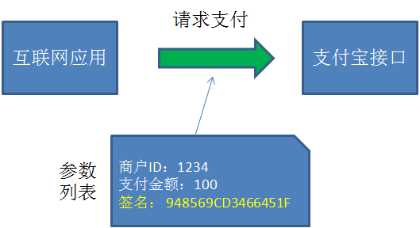
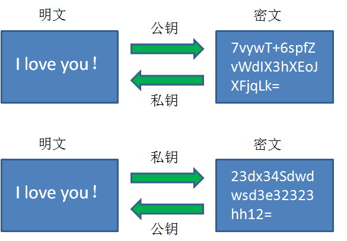

# 加解密资料

## 1. 加密算法
### 1.1. 古代加密历史

古人想出了一种非常朴素的加密方法，被称为**凯撒密码**。加密的原理就像下图这样：

如图所示，图中第一行的字母代表信息的“明文”，第二行字母代表信息的密文。这个加密算法十分简单，就是选择一个偏移量（这里的偏移量是2），把明文当中的所有字母按照字母表的顺序向后偏移两位，从而生成密文。比如：

- 原文的字母A，对应的密文是字母C。
- 原文的字母D，对应的密文是字母F。
- 原文的单词Java，对应的密文是Lcxc。

相应的，按事先约定好了密文的偏移量，把密文的所有字母向前偏移两位，就还原成了明文，这个过程叫做**解密**。

在英语的26个字母中，出现频率最高的字母是e。如果截获了密文，发现这段看不懂的密文当中出现频率最高的字母是g，由于e和g相差两个字母，就可以猜测出密文通信很可能选择2作为偏移量。这样一来，密码就被破解了。

最不济，可以把每一种偏移量都尝试一遍（26个字母，最多25种偏移），终究可以试出符合正常语法的偏移量。这种方式被称为**暴力破解**。

### 1.2. 加密算法的种类

在如今的信息安全领域，有各种各样的加密算法凝聚了计算机科学家门的智慧。从宏观上来看，这些加密算法可以归结为三大类：**哈希算法、对称加密算法、非对称加密算法**。

#### 1.2.1. 哈希算法

从严格意义上来说，哈希算法并不属于加密算法，但它在信息安全领域起到了很重要的作用。

哈希算法能做什么用呢？其中一个重要的作用就是生成信息摘要，用以验证原信息的完整性和来源的可靠性。

支付宝怎么知道这个请求是真的来自该应用，并且没有被篡改呢？

请求的发送方把所有参数，外加双方约定的Key（例子中Key=abc）拼接起来，并利用哈希算法生成了一段信息摘要：

Hash（1234_100_abc） = 948569CD3466451F

而请求的接收方在接到参数和摘要之后，按照同样的规则，也把参数和Key拼接起来并生成摘要：

Hash（1234_100_abc） = 948569CD3466451F

如果最终发现两端信息摘要一致，证明信息没有被篡改，并且来源确实是该互联网应用。（只要参数修改了一点点，或者Key不一样，那么生成的信息摘要就会完全不同）

生成信息摘要的过程叫做**签名**，验证信息摘要的过程叫做**验签**。

哈希算法包含哪些具体的算法呢？其中最著名的当属**MD5算法**。后来，人们觉得MD5算法生成的信息摘要太短（128位），不够安全，于是又有了**SHA系列算法**。

#### 1.2.2. 对称加密算法

如图所示，一段明文通过密钥进行加密，可以生成一段密文；这段密文通过同样的密钥进行解密，可以还原成明文。这样一来，只要双方事先约定好了密钥，就可以使用密文进行往来通信。

数据泄露到了外界，泄露出去的也都是密文。

对称加密包含哪些具体的算法呢？在早期，人们使用**DES算法**进行加密解密；后来，人们觉得DES不够安全，发明了**3DES算法**；而如今，最为流行的对称加密算法是**AES算法**。

总而言之，对称算法的好处是加密解密的效率比较高。相应的，对称算法的缺点是不够安全。因为通信双方约定的密钥是相同的，只要密钥本身被任何一方泄露出去，通信的密文就会被破解；此外，在双方建立通信之初，服务端把密钥告诉给客户端的时候，也有被拦截到的危险。

#### 1.2.3. 非对称加密算法

如图所示，在非对称加密中存在一对密钥，其中一个叫做**公钥**，另一个叫做**私钥**。在加密解密的过程中，我们既可以使用公钥加密明文，使用私钥解密密文；也可以使用私钥加密明文，使用公钥解密密文。

这样设计有什么好处呢？看看通信的过程就知道了：

1. 在双方建立通信的时候，服务端只要把公钥告诉给客户端，自己保留私钥。
2. 客户端利用获得的公钥。加密另外一个密钥X（可以是对称加密的密钥），发送给服务端。
3. 服务端获得消息后，用自己的私钥解密，得到里面隐含的密钥X。
4. 从此以后，双方可以利用密钥X进行对称加密的通信了。

在这个过程中，即使公钥被第三方截获，甚至后续的所有通信都被截获，第三方也无法进行破解。因为第二步利用公钥加密的消息，只有私钥才能解开，所以第三方永远无法知道密钥X是什么。

非对称加密算法的代表有哪些呢？最著名的当属**RSA算法**。

非对称加密就大的缺点就是性能较差，无法应用于长期的通信。
