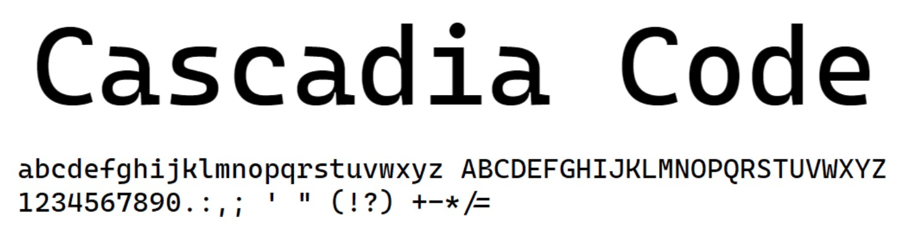
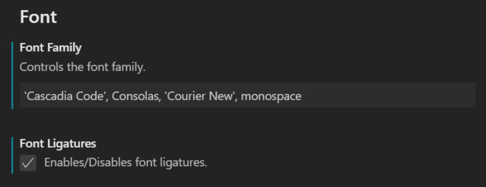
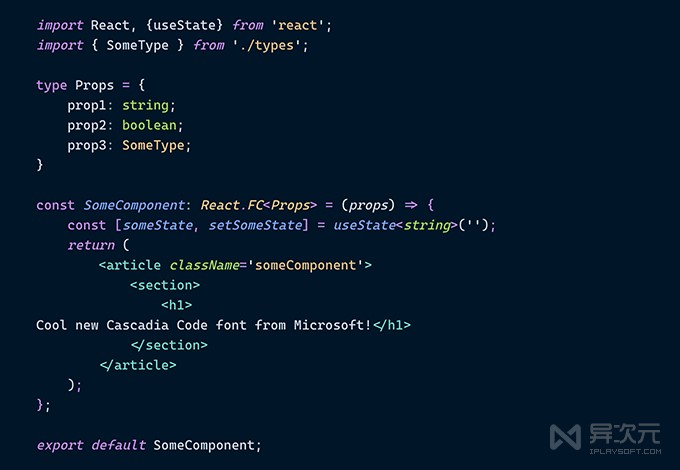
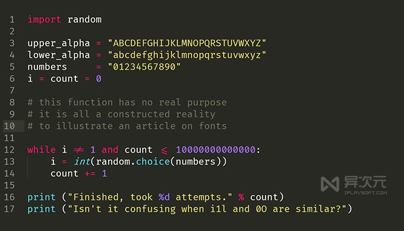
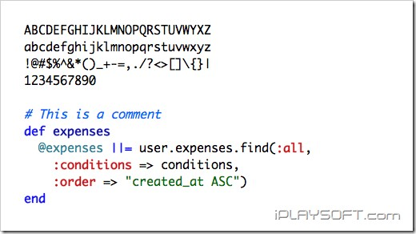
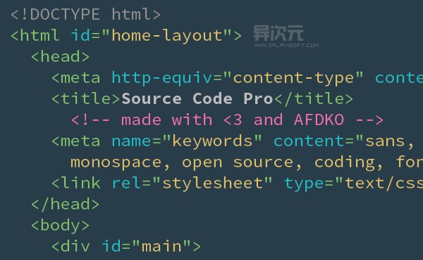
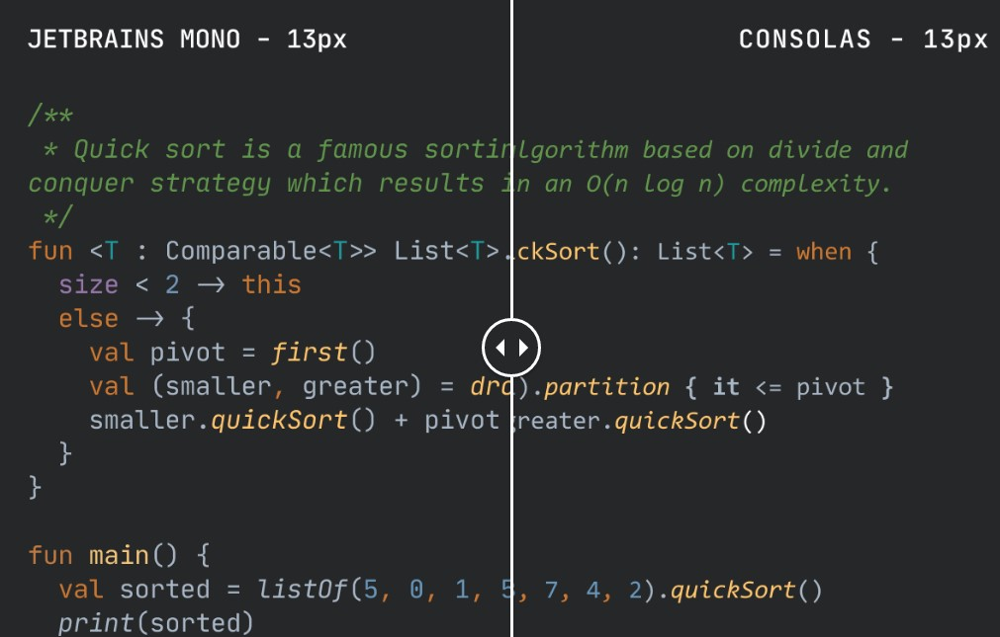

# 编程资源收集

> **以下资料均为引用网络资源，都是平时个人编程学习常用的资源，如有侵权即删**

## 在线文档

### Java综合资源

- [JavaGuide - Java 学习/面试指南](https://snailclimb.gitee.io/javaguide/#/)
- [《On Java 8》中文版，是事实上的《Java 编程思想》第5版](https://lingcoder.gitee.io/onjava8/#/)
- [深入浅出Java多线程](http://concurrent.redspider.group/)
- [Java工程师成神之路](http://hollischuang.gitee.io/tobetopjavaer/#/)
- [某在线培训学员整理的学习博客](https://blog.csdn.net/l6108003)

### 面试

- [JavaGuide面试突击版](https://snailclimb.gitee.io/javaguide-interview/#/)
- [LeetCode Cookbook](https://books.halfrost.com/leetcode/)
- [JavaInterview - 一些面试资料](https://github.com/OUYANGSIHAI/JavaInterview)

### 前端在线资源

- [Vue.js 官网](https://cn.vuejs.org/)
- [React.js 中文官网](https://zh-hans.reactjs.org/)
- [Ant Design 官网](https://ant-design.gitee.io/index-cn)
- [Ant Design Pro 官网](https://ant-design-pro.gitee.io/index-cn)
- [Ant Design Mobile 官网](https://mobile.ant.design/index-cn)
- [Ant Design Mobile 在线示例](https://mobile.ant.design/kitchen-sink/)
- [Lodash 一个一致性、模块化、高性能的 JavaScript 实用工具库](https://www.lodashjs.com/)
- [TypeScript 中文网](https://www.tslang.cn/)
- [webpack 官网](https://www.webpackjs.com/)
- [百度地图](http://lbsyun.baidu.com/)
- [MobX- 简单、可扩展的状态管理工具框架](https://cn.mobx.js.org/)
- [Eruda 手机网页前端调试面板](https://github.com/liriliri/eruda)

## 开源项目【github】

### freeCodeCamp

- Github 地址：[https://github.com/freeCodeCamp/freeCodeCamp](https://github.com/freeCodeCamp/freeCodeCamp)
- 介绍: 开放源码代码库和课程。与数百万人一起免费学习编程。网站：https://www.freeCodeCamp.org （一个友好的社区，您可以在这里免费学习编码。它由捐助者支持、非营利组织运营，以帮助数百万忙碌的成年人学习编程技术。这个社区已经帮助 10,000 多人获得了第一份开发人员的工作。这里的全栈 Web 开发课程是完全免费的，并且可以自行调整进度。这里还有数以千计的交互式编码挑战，可帮助您扩展技能。）

### devdocs

- Github 地址：https://github.com/freeCodeCamp/devdocs

### 前端开源项目

## 编程字体 ^o^

### Cascadia Code

微软开源了一套新的字体 Cascadia Code。下载地址：https://github.com/microsoft/cascadia-code

Cascadia Code 是微软在 5 月份的 Build 大会上宣布推出的等宽字体，微软介绍它是与新的终端 Windows Terminal 一起开发的，官方建议将其与终端应用和 VS、VS Code 等文本编辑器一起使用。

Cascadia Code 为命令行和代码编辑器提供了全新的体验，并且它还支持编程连字（Programming Ligatures），就是在编写代码的时候，可以组合字符创建新的字形，这对于代码的可读性和呈现后的用户友好度都是一种很好的机制，同时这也增强了 Windows Terminal 的现代外观。

需要注意的是，如果使用的是 VS Code，则必须在设置中启用连字功能才能生效。

字体预览

### Fira Code

由 Mozilla (FireFox 的东家) 推出的「Fira Code」就是一款编程连字字体，同样也是一款非常值得推荐使用的优秀代码等宽字体~！！！

下载地址：https://github.com/tonsky/FiraCode

### Monaco

Mac的默认字体，好像也只有Mac上有。小字号的时候表现不错，而且再大些也不寒碜。

### Source Code Pro

Source Code Pro 是由大名鼎鼎的 Adobe 公司发布的一款开源且完全免费的等宽编程字体，它非常适合用于阅读代码，支持 Linux、Mac OS X 和 Windows 等操作系统，而且无论商业或个人都可以免费使用，相当厚道。这款字体和微软的 Consolas 一样均定位于“编程字体”

下载地址：https://github.com/adobe-fonts/source-code-pro

### JetBrains Mono

JetBrains 推出了一款名为 "Mono" 的字体。下载地址：https://download.jetbrains.com/fonts/JetBrainsMono-1.0.0.zip

在设计 Mono 字体之初，团队充分考虑了长时间查阅代码可能导致的眼睛疲劳问题，以及受影响的因素，比如字母的大小和形状、空间量、自然等宽平衡、不必要的细节、连字、以及难以区分的符号或字母（l 和 I）和连字等。

它和 Consolas 字体的区别

Mono 字体有许多优点，但它支持的 143 门语言中没有中文，因此**对于中文的显示支持可能不会太好**、Mono 字体还是一款开源且免费的字体，使用者可免费用作任何商业或非商业用途。
