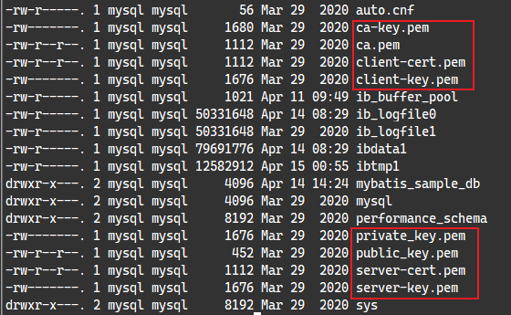
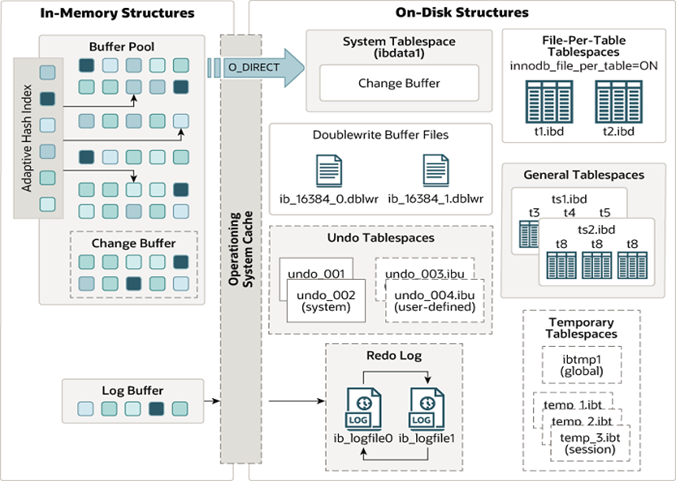

## 1. MySQL 数据库概述

MySQL 官网：https://www.mysql.com/

MySQL 5.7 版本官方文档：

- https://dev.mysql.com/doc/refman/5.7/en/
- https://dev.mysql.com/doc/mysql-errors/5.7/en/

### 1.1. 相关版本说明

MySQL官方提供了两种不同的版本：

- 社区版本（MySQL Community Server）：免费， MySQL不提供任何技术支持
- 商业版本（MySQL Enterprise Edition）：收费，可以使用30天，官方提供技术支持

### 1.2. MySQL 安装

MySQL 下载地址：https://downloads.mysql.com/archives/community/

此部分内容详见[《MySQL 安装与部署》文档](/数据库/MySQL/MySQL-安装与部署)

### 1.3. MySQL 数据库特点

- MySQL数据库是用C和C++语言编写的，以保证源码的可移植性
- 支持多个操作系统例如：Windows、Linux、Mac OS等等
- 支持多线程，可以充分的利用CPU资源
- 为多种编程语言提供API，包括C语言，Java，PHP。Python语言等
- MySQL优化了SQL算法，有效的提高了查询速度
- MySQL开放源代码且无版权制约，自主性强、使用成本低。
- MySQL历史悠久、社区及用户非常活跃，遇到问题，可以很快获取到帮助。

## 2. MySQL 体系架构


从上图可以看出，MySQL 最上层是连接组件。<font color=red>**服务器层是由连接池、管理工具和服务、SQL 接口、解析器、优化器、缓存、存储引擎、文件系统组成**</font>

- 连接池：由于每次建立建立需要消耗很多时间，连接池的作用就是将这些连接缓存下来，下次可以直接用已经建立好的连接，提升服务器性能。
- 管理工具和服务：系统管理和控制工具，例如备份恢复、Mysql 复制、集群等
- SQL 接口：接受用户的 SQL 命令，并且返回用户需要查询的结果。比如 `select from xx` 语句就是调用 SQL Interface
- 解析器: SQL 命令传递到解析器的时候会被解析器验证和解析。解析器主要功能：
    - 将 SQL 语句分解成数据结构，并将这个结构传递到后续步骤，以后 SQL 语句的传递和处理就是基于这个结构的
    - 如果在分解构成中遇到错误，那么就说明这个 sql 语句是不合理的
- 优化器：查询优化器，SQL 语句在查询之前会使用查询优化器对查询进行优化
- 缓存器：查询缓存，如果查询缓存有命中的查询结果，查询语句就可以直接去查询缓存中取数据。这个缓存机制是由一系列小缓存组成的。比如表缓存，记录缓存，key 缓存，权限缓存等。
- 存储引擎：存储引擎是底层物理结构和实际文件读写的实现。MySQL 数据库其中一个特点就是其**插件式的表存储引擎**。
- 文件系统：即存储数据的地方

### 2.1. 运行流程简图


### 2.2. 连接层


最上层是一些客户端和链接服务，包含本地 sock 通信和大多数基于客户端/服务端工具实现的类似于 TCP/IP 的通信。主要完成一些类似于连接处理、授权认证、及相关的安全方案。在该层上引入了线程池的概念，为通过认证安全接入的客户端提供线程。同样在该层上可以实现基于 SSL 的安全链接。

当 MySQL 启动（MySQL 服务器就是一个进程），等待客户端连接，每一个客户端连接请求，服务器都会新建一个线程处理（如果是线程池的话，则是分配一个空的线程），每个线程独立，拥有各自的内存处理空间。通过查询系统参数`max_connections`可以知道服务器最大的连接数。

```sql
mysql> show VARIABLES like '%max_connections%';
+-----------------+-------+
| Variable_name   | Value |
+-----------------+-------+
| max_connections | 151   |
+-----------------+-------+
1 row in set (0.02 sec)
```


连接到服务器，服务器也会为安全接入的每个客户端验证它所具有的操作权限。即用户名、IP、密码验证，一旦连接成功，连接器会到权限表里面查询，并验证是否具有执行某个特定查询的权限（例如，是否允许客户端对某个数据库某个表的某个操作）。这就意味着，一个用户成功建立连接后，即使再使用管理员账号修改该用户的权限，也不会影响已经存在连接的权限。修改完成后，只有再新建的连接才会使用新的权限设置。

### 2.3. Server 层(SQL 处理层)

#### 2.3.1. Server 层功能作用


第二层架构（Server 层）主要完成大多数的**核心服务功能**，如 SQL 接口，并完成缓存的查询，SQL 语句的解析和优化，部分内置函数的执行，所有跨存储引擎的功能（所谓跨存储引擎就是说每个引擎都需提供的功能（引擎需对外提供接口））如：存储过程、函数、触发器、视图等。该层具体的操作如下：

1. 如果是查询语句（`select`语句），首先会查询缓存是否已有相应结果，有则返回结果，无则进行下一步（如果不是查询语句，同样调到下一步）
2. 解析查询，创建一个内部数据结构（解析树），这个解析树主要用来SQL语句的语义与语法解析；
3. 优化 SQL 语句：例如重写查询，决定表的读取顺序，以及选择需要的索引等。这一阶段用户是可以查询的，查询服务器优化器是如何进行优化的，便于用户重构查询和修改相关配置，达到最优化。这一阶段还涉及到存储引擎，优化器会询问存储引擎，比如某个操作的开销信息、是否对特定索引有查询优化等。

#### 2.3.2. 查询缓存

当连接建立后执行查询语句时，会先查询缓存。**QC（query cache） 严格要求 2 次 SQL 请求要完全一样，包括 SQL 语句，连接的数据库、协议版本、字符集等因素都会影响**。之前执行过的语句及其结果可能会以 key-value 对的形式，被直接缓存在内存中。key 是查询的语句，value 是查询的结果。如果查询能够直接在这个缓存中找到 key，那么这个 value 就会被直接返回给客户端。

##### 2.3.2.1. 查询相关缓存的参数

```sql
-- 默认不开启
show variables like '%query_cache_type%';
-- 默认值 1M
show variables like '%query_cache_size%';
```

##### 2.3.2.2. 查询缓存参数配置

`query_cache_type`只能配置在 my.cnf 文件中，这大大限制了 qc 的作用。在生产环境建议不开启，除非经常有 sql 完全一模一样的查询。

```sql
-- 会报错,query_cache_type 只能配置在 my.cnf 文件中
SET GLOBAL query_cache_type = 1;
```

一般建议只在更新频率极低的表里使用查询缓存，比如系统配置表、字典表等。在 MySQL 手动指定是否开启缓存的功能，只需要将 my.cnf 参数 `query_cache_type` 设置成 DEMAND。具体配置如下：

```properties
# query_cache_type 有3个值 0-关闭查询缓存OFF，1-开启ON，2-（DEMAND）代表当sql语句中有SQL_CACHE关键词时才缓存
query_cache_type=2
```

以上配置默认的 SQL 语句都不使用查询缓存。而对于确定要使用查询缓存的语句，可以用 `SQL_CACHE` 关键字显式指定，例如：

```sql
select SQL_CACHE * from test where ID=5；
```

##### 2.3.2.3. MySQL 8.0 移除查询缓存功能

从 8.0 开始，MySQL 已经移除查询缓存功能。MySQL 的工程团队发现启用缓存的好处并不多。

1. 查询缓存的效果取决于缓存的命中率，只有命中缓存的查询效果才能有改善，因此无法预测其性能。
2. 查询缓存的另一个大问题是它受到单个互斥锁的保护。在具有多个内核的服务器上，大量查询会导致大量的互斥锁争用。
3. 查询缓存的失效非常频繁，只要有对一个表的更新，这个表上所有的查询缓存都会被清空。

通过基准测试发现，大多数工作负载最好禁用查询缓存(5.6 的默认设置)：按照官方所说的：造成的问题比它解决问题要多的多，弊大于利就直接砍掉了

#### 2.3.3. 分析器

分析器会对 SQL 语句进行“词法分析”，即识别 SQL 语句中字符串分别是什么，代表什么操作。根据词法分析的结果，语法分析器会根据语法规则，判断输入的 SQL 语句是否满足 MySQL 语法。如果语句不对则提示“You have an error in your SQL syntax”的错误，比如下面这个语句 from 写成了 "rom"。

```sql
mysql> select * fro test where id=1;
ERROR 1064 (42000): You have an error in your SQL syntax; check the manual that corresponds to your MySQL server version for the right syntax to use near 'fro test where id=1' at line 1
```

分析器对sql的分析过程步骤如下图：


SQL 语句经过分析器分析之后，会生成一个这样的语法树


#### 2.3.4. 优化器

经过了分析器，MySQL 知道了语句是执行什么操作。在开始执行之前，还要先经过优化器的处理。

优化器是在表里面有多个索引的时候，决定使用哪个索引；或者在一个语句有多表关联（join）的时候，决定各个表的连接顺序；以及一些mysql自己内部的优化机制。

#### 2.3.5. 执行器

开始执行的时候，要先判断一下当前登陆的用户对该表是否有执行查询的权限。如果没有，就会返回没有权限的错误(在工程实现上，如果命中查询缓存，会在查询缓存返回结果的时候，做权限验证)；如果有权限，就打开表继续执行。打开表的时候，执行器就会根据表的引擎定义，去使用这个引擎提供的接口。

### 2.4. 存储引擎层

MySQL 数据库区别于其他数据库的最重要的一个特点就是其插件式的表存储引擎。MySQL 插件式的存储引擎架构提供了一系列标准的管理和服务支持，这些标准与存储引擎本身无关，可能是每个数据库系统本身都必需的，如 SQL 分析器和优化器等，而存储引擎是底层物理结构和实际文件读写的实现，服务器通过API和存储引擎进行通信。

每个存储引擎开发者可以按照自己的意愿来进行开发。**不同的存储引擎具有不同的存储机制、索引技巧、锁定水平等功能**，这样使用者也可以根据自己的需要，来选取合适的存储引擎。存储引擎可以分为 MySQL 官方存储引擎和第三方存储引擎

> Tips: **数据库中的索引是在存储引擎层实现的**。

插件式存储引擎的好处是，每个存储引擎都有各自的特点，能够根据具体的应用建立不同存储引擎表。由于 MySQL 数据库的开源特性，用户可以根据 MySQL 预定义的存储引擎接口编写自己的存储引擎。若用户对某一种存储引擎的性能或功能不满意，可以通过修改源码来得到想要的特性。

> Notes: <font color=red>**MySQL 的核心就是存储引擎。值得注意的是，存储引擎是针对表！！**</font>官方建议在同一个数据库中，尽量所有表都使用同一个存储引擎，否则会出现一些奇怪的问题。

#### 2.4.1. MySQL 官方引擎概要

##### 2.4.1.1. InnoDB 存储引擎

InnoDB 是 MySQL 的默认事务型存储引擎，有行级锁定和外键约束。也是最重要、使用最广泛的存储引擎。它被设计用来处理大量的短期(short-lived)事务，短期事务大部分情况是正常提交的，很少会被回滚。InnoDB 的性能和自动崩溃恢复特性，使得它在非事务型存储的需求中也很流行。

在 MySQL 5.5 之后，InnoDB 是默认的 MySQL 存储引擎。主要特点：

- DML操作遵循ACID模型，支持事务；
- 行级锁，提高并发访问性能；
- 支持外键FOREIGN KEY约束，保证数据的完整性和正确性；

##### 2.4.1.2. MyISAM 存储引擎

在 MySQL 5.1 及之前的版本，MyISAM 是默认的存储引擎。MyISAM 提供了大量的特性，包括全文索引、压缩、空间函数（GIS）等，但 MyISAM 不支持事务、行级锁和外键，而且有一个毫无疑问的缺陷就是崩溃后无法安全恢复。但有插入数据快，空间和内存使用比较低等优点。

尽管MyISAM引擎不支持事务、不支持崩溃后的安全恢复，但它绝不是一无是处的。对于只读的数据，或者表比较小、可以忍受修复（repair）操作，则依然可以继续使用 MyISAM（但请不要默认使用 MyISAM，而是应当默认使用 InnoDB)。但是 MyISAM 对整张表加锁，而不是针对行。读取时会对需要读到的所有表加共享锁，写入时则对表加排他锁。MyISAM 很容易因为表锁的问题导致典型的的性能问题。

##### 2.4.1.3. Mrg_MyISAM 存储引擎

Merge 存储引擎，是一组 MyIsam 的组合，也就是说，他将 MyIsam 引擎的多个表聚合起来，但是他的内部没有数据，真正的数据依然是 MyIsam 引擎的表中，但是可以直接进行查询、删除更新等操作。

##### 2.4.1.4. Archive 存储引擎

Archive 存储引擎只支持 `INSERT` 和 `SELECT` 操作，在 MySQL 5.1 之前也不支持索引。Archive 引擎会缓存所有的写并利用 zlib 对插入的行进行压缩，所以比 MyISAM 表的磁盘 I/O 更少。但是每次 `SELECT` 查询都需要执行全表扫描。所以 Archive 表适合日志和数据采集类应用，这类应用做数据分析时往往需要全表扫描。或者在一些需要更快速的 `INSERT` 操作的场合下也可以使用。

Archive 引擎不是一个事务型的引擎，而是一个针对高速插入和压缩做了优化的简单引擎。

##### 2.4.1.5. Blackhole 存储引擎

Blackhole 引擎没有实现任何的存储机制，它会丢弃所有插入的数据，不做任何存储，Select 语句的内容永远是空。但是服务器会记录 Blackhole 表的日志，所以可以用于复制数据到备份数据库，或者只是简单地记录到日志。这种特殊的存储引擎可以在一些特殊的复制架构和日志审核时发挥作用。但这种引擎在应用方式上有很多问题，因此并不推荐。其使用场景有：

1. 验证 dump file 语法的正确性
2. 以使用 blackhole 引擎来检测 binlog 功能所需要的额外负载

```sql
CREATE TABLE `Blackhole` (
	`id` BIGINT (20) UNSIGNED NOT NULL,
	`fname` VARCHAR (100) NOT NULL,
	`lname` VARCHAR (100) NOT NULL,
	`age` TINYINT (3) UNSIGNED NOT NULL,
	`sex` TINYINT (1) UNSIGNED NOT NULL,
	PRIMARY KEY (`id`)
) ENGINE = Blackhole DEFAULT CHARSET = utf8
```

##### 2.4.1.6. CSV 引存储擎

CSV 引擎可以将普通的 CSV 文件(逗号分割值的文件）作为 MySQL 的表来处理，但这种表不支持索引。CSV 引擎可以在数据库运行时拷入或者拷出文件。可以将 Excel 等的数据存储为 CSV 文件，然后复制到 MySQL 数据目录下，就能在MySQL 中打开使用。同样，如果将数据写入到一个 CSV 引擎表，其他的外部程序也能立即从表的数据文件中读取 CSV 格式的数据。因此 CSV 引擎可以作为一种数据交换的机制，非常有用。

##### 2.4.1.7. Federated 存储引擎

Federated 引擎是访问其他 MySQL 服务器的一个代理，它会创建一个到远程 MySQL 服务器的客户端连接，并将查询传输到远程服务器执行，然后提取或者发送需要的数据。最初设计该存储引擎是为了和企业级数据库如 Microsoft SQL Server 和 Oracle 的类似特性竞争的，可以说更多的是一种市场行为。尽管该引擎看起来提供了一种很好的跨服务器的灵活性，但也经常带来问题，因此默认是禁用的。

##### 2.4.1.8. Memory 存储引擎

MEMORY 存储引擎的所有数据都在内存中，数据的处理速度快，但安全性不高。

如果需要快速地访问数据，并且这些数据不会被修改，重启以后丢失也没有关系，那么使用 Memory 表(以前也叫做 HEAP 表）是非常有用的。Memory 表至少比 MyISAM 表要快一个数量级，因为每个基于 MEMORY 存储引擎的表实际对应一个磁盘文件。该文件的文件名与表名相同，类型为 frm 类型。该文件中只存储表的结构。而其数据文件，都是存储在内存中，这样有利于数据的快速处理，提高整个表的效率，不需要进行磁盘 I/O。所以 Memory 表的结构在重启以后还会保留，但数据会丢失。Memroy 表在很多场景可以发挥好的作用:

- 用于查找(lookup）或者映射(mapping）表，例如将邮编和州名映射的表。
- 用于缓存周期性聚合数据(periodically aggregated data)的结果。
- 用于保存数据分析中产生的中间数据。

Memory 表支持 Hash 索引，因此查找操作非常快。虽然 Memory 表的速度非常快，但还是无法取代传统的基于磁盘的表。Memroy 表是表级锁，因此并发写入的性能较低。它不支持 BLOB 或 TEXT 类型的列，并且每行的长度是固定的，所以即使指定了 VARCHAR 列，实际存储时也会转换成 CHAR，这可能导致部分内存的浪费。

**优点**：

访问速度较快。

**缺点**：

1. 哈希索引数据不是按照索引值顺序存储，无法用于排序。
2. 不支持部分索引匹配查找，因为哈希索引是使用索引列的全部内容来计算哈希值的。
3. 只支持等值比较，不支持范围查询。
4. 当出现哈希冲突时，存储引擎需要遍历链表中所有的行指针，逐行进行比较，直到找到符合条件的行。

##### 2.4.1.9. NDB 集群引擎

使用 MySQL 服务器、NDB 集群存储引擎，以及分布式的、share-nothing 的、容灾的、高可用的 NDB 数据库的组合，被称为 MySQL 集群（(MySQL Cluster)。

#### 2.4.2. 值得了解的第三方引擎

##### 2.4.2.1. Percona 的 XtraDB 存储引擎

基于 InnoDB 引擎的一个改进版本，已经包含在 Percona Server 和 MariaDB 中，它的改进点主要集中在性能、可测量性和操作灵活性方面。XtraDB 可以作为 InnoDB 的一个完全的替代产品，甚至可以兼容地读写 InnoDB 的数据文件，并支持 InnoDB 的所有查询。

##### 2.4.2.2. TokuDB 引擎

TokuDB 存储引擎使用了一种新的叫做分形树(Fractal Trees)的索引数据结构。该结构是缓存无关的，与 B+树有些类似，在 Fractal Tree中，每一个 child 指针除了需要指向一个 child 节点外，还会带有一个 Message Buffer（FIFO 的队列），用来缓存更新操作。


例如，一次插入操作只需要落在某节点的 Message Buffer 就可以马上返回了，并不需要搜索到叶子节点。这些缓存的更新会在查询时或后台异步合并应用到对应的节点中。

因此 Fractal Trees 结构即使其大小超过内存性能也不会下降，也就没有内存生命周期和碎片的问题。TokuDB 是一种大数据（Big Data)存储引擎，因为其拥有很高的压缩比，可以在很大的数据量上创建大量索引。现在该引擎也被 Percona 公司收购。

> Tips：分形树，是一种写优化的磁盘索引数据结构。在一般情况下，分形树的写操作（Insert/Update/Delete）性能比较好，同时它还能保证读操作近似于B+树的读性能。据测试结果显示，TokuDB 分形树的写性能优于 InnoDB 的 B+树，读性能略低于 B+树。分形树核心思想是利用节点的 Message Buffer 缓存更新操作，充分利用数据局部性原理，将随机写转换为顺序写，这样极大的提高了随机写的效率。Fractal-tree 在事务实现上有优势，它主要适用于访问频率不高的数据或历史数据归档。

##### 2.4.2.3. Infobright

MySQL 默认是面向行的，每一行的数据是一起存储的，服务器的查询也是以行为单位处理的。而在大数据量处理时，面向列的方式可能效率更高，比如 HBASE 就是面向列存储的。

Infobright 是最有名的面向列的存储引擎。在非常大的数据量（数十 TB)时，该引擎工作良好。Infobright 是为数据分析和数据仓库应用设计的。数据高度压缩，按照块进行排序，每个块都对应有一组元数据。在处理查询时，访问元数据可决定跳过该块，甚至可能只需要元数据即可满足查询的需求。但该引擎不支持索引，不过在这么大的数据量级，即使有索引也很难发挥作用，而且块结构也是一种准索引 (quasi-index)。Infobright 需要对 MySQL 服务器做定制，因为一些地方需要修改以适应面向列存储的需要。如果查询无法在存储层使用面向列的模式执行，则需要在服务器层转换成按行处理，这个过程会很慢。Infobright 有社区版和商业版两个版本。

#### 2.4.3. 指定表的存储引擎

在创建表的时候，通过`engine`关键字指定存储引擎。语法结构如下：

```sql
create table xxx(...) engine=存储引擎名称;
```

#### 2.4.4. 表的存储引擎转换

有很多种方法可以将表的存储引擎转换成另外一种引擎。每种方法都有其优点和缺点。常用的有三种方法：

##### 2.4.4.1. ALTER TABLE

将表从一个引擎修改为另一个引擎最简单的办法是使用 `ALTER TABLE` 语句。

```sql
ALTER TABLE mytable ENGINE = InnoDB;
```

上面语句将 mytable 的引擎修改为 InnoDB。该语法可以适用任何存储引擎。但需要执行很长时间，在实现上，MySQL 会按行将数据从原表复制到一张新的表中，在复制期间可能会消耗系统所有的I/O 能力，同时原表上会加上读锁。所以，在繁忙的表上执行此操作要特别小心。如果转换表的存储引擎，将会失去和原引擎相关的所有特性。

##### 2.4.4.2. 导出与导入

还可以使用 mysqldump 工具将数据导出到文件，然后修改文件中 `CREATE TABLE` 语句的存储引擎选项，注意同时修改表名，因为同一个数据库中不能存在相同的表名，即使它们使用的是不同的存储引擎。

##### 2.4.4.3. CREATE 和 SELECT

先创建一个新的存储引擎的表，然后利用 `INSERT…SELECT` 语法来导数据:

```sql
CREATE TABLE innodb_table LIKE myisam_table;
ALTER TABLE innodb_table ENGINE=InnoDB;
INSERT INTO innodb_table SELECT * FROM myisam_table;
```

如果数据量很大，则可以考虑做分批处理，针对每一段数据执行事务提交操作。

#### 2.4.5. 检查 MySQL 的引擎

- 查询 MySQL 已提供哪些存储引擎

```sql
mysql> show engines;
+--------------------+---------+----------------------------------------------------------------+--------------+------+------------+
| Engine             | Support | Comment                                                        | Transactions | XA   | Savepoints |
+--------------------+---------+----------------------------------------------------------------+--------------+------+------------+
| InnoDB             | DEFAULT | Supports transactions, row-level locking, and foreign keys     | YES          | YES  | YES        |
| MRG_MYISAM         | YES     | Collection of identical MyISAM tables                          | NO           | NO   | NO         |
| MEMORY             | YES     | Hash based, stored in memory, useful for temporary tables      | NO           | NO   | NO         |
| BLACKHOLE          | YES     | /dev/null storage engine (anything you write to it disappears) | NO           | NO   | NO         |
| MyISAM             | YES     | MyISAM storage engine                                          | NO           | NO   | NO         |
| CSV                | YES     | CSV storage engine                                             | NO           | NO   | NO         |
| ARCHIVE            | YES     | Archive storage engine                                         | NO           | NO   | NO         |
| PERFORMANCE_SCHEMA | YES     | Performance Schema                                             | NO           | NO   | NO         |
| FEDERATED          | NO      | Federated MySQL storage engine                                 | NULL         | NULL | NULL       |
+--------------------+---------+----------------------------------------------------------------+--------------+------+------------+
```

- 查询 MySQL 当前默认的存储引擎

```sql
mysql> show variables like '%storage_engine%';
+----------------------------------+--------+
| Variable_name                    | Value  |
+----------------------------------+--------+
| default_storage_engine           | InnoDB |
| default_tmp_storage_engine       | InnoDB |
| disabled_storage_engines         |        |
| internal_tmp_disk_storage_engine | InnoDB |
+----------------------------------+--------+
```

#### 2.4.6. MyISAM、InnoDB 与 Memory 比较

MyISAM、InnoDB 与 Memory 区别汇总：

|    功能     |     InnoDB     | MyISAM |   Memory    |
| ---------- | :------------: | :----: | :---------: |
| 存储限制     |      64TB      | 256TB  | 依赖RAM的大小 |
| 事务        |       √        |   -    |      -      |
| 锁机制      |    行锁/表锁     |  表锁   |     表锁     |
| B+tree索引  |       √        |   √    |      √      |
| Hash索引    |       -        |   -    |      √      |
| 全文索引     | √(5.6版本后支持) |   √    |      -      |
| 集群索引     |       √        |   -    |      -      |
| 数据索引     |       √        |   -    |      √      |
| 数据压缩     |       -        |   √    |      -      |
| 空间使用率   |       高        |   低    |      -      |
| 内存使用     |       高        |   低    |     中等     |
| 批量插入速度 |       低        |   高    |      高      |
| 支持外键     |       √        |   -    |      -      |

**MyISAM 与 InnoDB 的一些其他区别说明**：

- **是否支持行级锁**：MyISAM 支持表级锁，即使操作一条记录也会锁住整个表，<font color=red>**不适合高并发的操作**</font>；InnoDB 支持行级锁和表级锁，默认是行级锁，操作时只锁某一行，不对其它行有影响，<font color=red>**适合高并发的操作**</font>。
- **缓存内容**：MyISAM 只缓存索引，不缓存真实数据；InnoDB 不仅缓存索引还要缓存真实数据，对内存要求较高，而且内存大小对性能有决定性影响。
- **是否支持事务和崩溃后的安全恢复**：MyISAM 不提供事务支持。而 InnoDB 提供事务支持，具有事务、回滚和崩溃修复能力。
- **是否支持外键**：MyISAM 不支持，而 InnoDB 支持。
- **是否支持 MVCC**：MyISAM 不支持，InnoDB 支持。应对高并发事务，MVCC 比单纯的加锁更高效。
- **是否有聚集索引**：MyISAM 不支持聚集索引；InnoDB 支持聚集索引。
- **数据存储的结构**：MyISAM 数据与索引分开文件存储，索引保存的是数据文件的指针；InnoDB 的聚集索引是数据和索引保存在同一个文件中。
- **查询全表总记录数的效率**：MyISAM 用一个变量保存了整个表的行数，查询表记录数时只需要读出该变量即可，速度很快；InnoDB 不保存表的具体行数，查询表总记录数时需要全表扫描。

#### 2.4.7. 选择合适的引擎

大部分情况下，InnoDB 都是正确的选择，所以在 MySQL 5.5 版本将 InnoDB 作为默认的存储引擎了。对于如何选择存储引擎，可以简单地归纳为一句话：“除非需要用到某些 InnoDB 不具备的特性，并且没有其他办法可以替代，否则都应该优先选择 InnoDB 引擎”。比如，MySQL 中只有 MyISAM 支持地理空间搜索。

如果不需要用到 InnoDB 的特性，同时其他引擎的特性能够更好地满足需求，也可以考虑一下其他存储引擎。举个例子，如果不在乎可扩展能力和并发能力，也不在乎崩溃后的数据丢失问题，却对 InnoDB 的空间占用过多比较敏感，这种场合下选择 MyISAM 就比较合适。

小结如下：

- InnoDB：是 Mysql 的默认存储引擎，支持事务、外键。如果应用对事务的完整性有比较高的要求，在并发条件下要求数据的一致性，数据操作除了插入和查询之外，还包含很多的更新、删除操作，那么 InnoDB 存储引擎是比较合适的选择。
- MyISAM：如果应用是以读操作和插入操作为主，只有很少的更新和删除操作，并且对事务的完整性、并发性要求不是很高，那么选择这个存储引擎是非常合适的。
- MEMORY：将所有数据保存在内存中，访问速度快，通常用于临时表及缓存。MEMORY 的缺陷就是对表的大小有限制，太大的表无法缓存在内存中，而且无法保障数据的安全性。

<font color=red>**建议不要混合使用多种存储引擎**</font>，否则可能带来一系列复杂的问题，以及一些潜在的 bug 和边界问题。存储引擎层和服务器层的交互已经比较复杂，更不用说混合多个存储引擎了。至少，混合存储对一致性备份和服务器参数配置都带来了一些困难。

### 2.5. SQL 语句的执行流程

#### 2.5.1. 查询语句执行流程

查询语句的执行流程如下：权限校验 -> 查询缓存 -> 分析器 -> 优化器 -> 权限校验 -> 执行器 -> 引擎。例如有查询语句如下：

```sql
select * from user where id > 1 and name = 'MooNkirA';
```

1. 首先检查权限，没有权限则返回错误；
2. MySQL8.0 以前会查询缓存，缓存命中则直接返回，没有则执行下一步；
3. 词法分析和语法分析。提取表名、查询条件，检查语法是否有错误；
4. 两种执行方案，先查 `id > 1` 还是 `name = 'MooNkirA'`，优化器根据自己的优化算法选择执行效率最好的方案；
5. 校验权限，有权限就调用数据库引擎接口，返回引擎的执行结果。

#### 2.5.2. 更新语句执行过程

更新语句执行流程如下：分析器 -> 权限校验 -> 执行器 -> 引擎 -> redo log(prepare 状态) -> binlog -> redo log(commit 状态)。例如有更新语句如下：

```sql
update user set name = 'MooNkirA' where id = 1;
```

1. 先查询到 id 为 1 的记录，有缓存会使用缓存。
2. 拿到查询结果，将 name 更新为『MooNkirA』，然后调用引擎接口，写入更新数据，innodb 引擎将数据保存在内存中，同时记录 redo log，此时 redo log 进入 prepare 状态。
3. 执行器收到通知后记录 binlog，然后调用引擎接口，提交 redo log 为 commit 状态。
4. 更新完成。

> Tips: 执行更新语句时，在记录完 redo log，不直接提交，而是先进入 prepare 状态。这是因为假设先写 redo log 直接提交，然后写 binlog，如果在写完 redo log 后，服务器挂了，此时 binlog 日志没有被写入，那么服务器重启后，会通过 redo log 恢复数据，但是此时 binlog 并没有记录该数据，后续进行机器备份的时候，就会丢失这一条数据，同时主从同步也会丢失这一条数据。

#### 2.5.3. SQL 执行流程图


## 3. 启动选项和参数

### 3.1. 配置参数文件

当 MySQL 实例启动时，数据库会先去读一个配置参数文件，用来寻找数据库的各种文件所在位置以及指定某些初始化参数。在默认情况下，MySQL 实例会在按一定的顺序中的指定位置读取配置，用户只需通过命令即可查看到相应的配置位置读取顺序。

```bash
mysql --help | grep my.cnf
```


> <font color=red>**注：都是后面配置文件中的配置项会覆盖前面配置文件中的相同的配置项**</font>

MySQL 实例可以不需要参数文件，这时所有的参数值取决于编译 MySQL 时指定的默认值和源代码中指定参数的默认值。MySQL 数据库的参数文件是以文本方式进行存储的。通过文本编辑软件即可进行参数的修改

### 3.2. 参数的查看和修改

在命令行中输入以下命令可查看数据库中的所有参数。

```sql
-- 查询数据库中的所有参数
SHOW VARIABLES;

-- 模糊查询数据库参数
SHOW VARIABLES LIKE '%xxx%';
```

> 从 MySQL 5.1 版本开始，还可以通过 information_schema 架构下的 `GLOBAL_VARIABLES` 视图来进行查找，推荐使用命令`show variables`，使用更为简单，且各版本的 MySQL 数据库都支持。

#### 3.2.1. MySQL 数据库中的参数的分类

从不同的角度来说，主要分成两类

从类型上：动态(dynamic)参数和静态(static)参数

- 动态参数意味着可以在 MySQL 实例运行中进行更改
- 静态参数说明在整个实例生命周期内都不得进行更改，即只读(read only)

从作用范围上：全局变量(GLOBAL)和会话变量(SESSION/LOCAL)

- 全局变量（GLOBAL）影响服务器的整体操作。
- 会话变量（SESSION/LOCAL）影响某个客户端连接的操作。

用 default_storage_engine 来作为示例说明，在服务器启动时会初始化一个名为 default_storage_engine，作用范围为 `GLOBAL` 的系统变量。之后每当有一个客户端连接到该服务器时，服务器都会单独为该客户端分配一个名为`default_storage_engine`，作用范围为`SESSION`的系统变量，该作用范围为`SESSION`的系统变量值按照当前作用范围为`GLOBAL`的同名系统变量值进行初始化。

#### 3.2.2. 动态参数值的修改

通过 `SET` 命令对动态的参数值进行修改。语法如下：

```bash
SET [global | session ] system_var_name= expr
SET [@@global. | @@session.] system_var_name= expr
```

示例：

```bash
SET read_ buffer_size=524288;
SET @@global.read_ buffer_size=524288;
```

### 3.3. MySQL官方手册（系统参数部分）

官方文档（5.7版本）地址：https://dev.mysql.com/doc/refman/5.7/en/server-system-variables.html

## 4. MySQL 数据目录结构分析

像 InnoDB、MyIASM 这样的存储引擎都是把表存储在磁盘上。

### 4.1. 数据目录的位置

通过以下命令可以查看当前 MySql 数据库存储数据的目录位置

```sql
mysql> show variables like 'datadir';
+---------------+----------------+
| Variable_name | Value          |
+---------------+----------------+
| datadir       | /var/lib/mysql |
+---------------+----------------+
```

> Notes: 存储目录位置可以通过配置文件进行修改。

### 4.2. 数据目录的文件

**数据目录中包含创建的数据库、表、视图和触发器等用户数据**，除了这些用户数据，为了程序更好的运行，MySQL 也会创建一些其他的额外数据

#### 4.2.1. 数据库的存储

在使用 `CREATE DATABASE` 语句创建一个数据库时，MySQL 会进行以下的处理：

1. 在数据目录下创建一个和数据库名同名的子目录（文件夹)
2. 在该与数据库名同名的子目录下创建一个名为`db.opt`的文件，这个文件中包含了该数据库的各种属性，例如该数据库的字符集和比较规则等等。


进入`datadir`数据目录查看，除了 `information_schema` 这个系统数据库（*比较特殊*）外，其他的数据库在数据目录下都有对应的子目录。

#### 4.2.2. 表的存储

MySQL 数据库表的信息可以分成：

1. **表结构的定义**：是定义了表每列的数据类型、约束条件、索引、字符集等等信息。InnoDB 和 MyIASM 这两种存储引擎都在数据目录下对应的数据库子目录下创建了一个专门用于存储描述表结构信息的文件，其文件名是：`表名.frm`
2. **表中的数据**：就是实际每个表的存储的数据。而不同的存储引擎保存的文件格式、数量也不一样。

#### 4.2.3. InnoDB 表数据的存储

InnoDB 的数据会放在一个表空间或者文件空间（英文名: table space 或者 filespace)的概念，这个表空间是一个抽象的概念，它可以对应文件系统上一个或多个真实文件〈不同表空间对应的文件数量可能不同)。每一个表空间可以被划分为很多个页，表数据就存放在某个表空间下的某些页里。表空间有好几种类型。

- **系统表空间(system tablespace)**

系统表空间可以对应文件系统上一个或多个实际的文件，默认情况下，InnoDB 会在数据目录下创建一个名为 ibdata1(在数据目录下)、大小为 12M 的文件，这个文件就是对应的系纳表空间在文件系统上的表示。


此文件是自扩展文件，即存储空间不够用时，它会自己增加文件大小。如果想让系统表空间对应文件系统上多个实际文件，可以在 MySQL 启动时配置对应的文件路径以及它们的大小，也可以把系统表空间对应的文件路径不配置到数据目录下，甚至可以配置到单独的磁盘分区上

<font color=red>**需要注意的一点是：在一个 MySQL 服务器中，系统表空间只有一份。从 MySQL5.5.7 到 MySQL5.6.6 之间的各个版本中，表中的数据都会被默认存储到这个系统表空间。**</font>

- **独立表空间(file-per-table tablespace)**

在 MySQL5.6.6 以及之后的版本中，InnoB 并不会默认的把各个表的数据存储到系统表空间中，而是为<font color=red>**每一个表建立一个独立表空间**</font>，也就是说用户创建了多少个表，就有多少个独立表空间。

使用独立表空间来存储表数据的话，会在该表所属数据库对应的子目录下创建一个表示该独立表空间的文件，文件名和表名相同，文件的扩展名是`.ibd`，即：`表名.ibd`


如上例，`consult_content.ibd`文件就用来存储`consult_content`表中的数据和索引。也可以指定使用系统表空间还是独立表空间来存储数据，这个功能由启动参数`innodb_file_per_table`控制。配置示例如下：

```
[server]
innodb_file_per_table=0
```

上面的配置意思是：当`imodb_file_per table`的值为0时，代表使用系统表空间；当`innodb_file pertable`的值为1时，代表使用独立表空间。需要注意的是`inmodb_file_per_table`参数只对新建的表起作用，对于已经分配了表空间的表并不起作用。

可以直接通过命令查询：

```sql
mysql> show variables like 'innodb_file_per_table';
+-----------------------+-------+
| Variable_name         | Value |
+-----------------------+-------+
| innodb_file_per_table | ON    |
+-----------------------+-------+
1 row in set (0.04 sec)
```

- **其他类型的表空间**

随着 MySQL 的发展，除了上述两种老牌表空间之外，现在还新提出了一些不同类型的表空间，比如通用表空间(general tablespace)，undo 表空间(undotablespace)、临时表空间（temporary tablespace)等。

#### 4.2.4. MyIASM 表数据的存储

在 MyISAM 存储引擎表中的数据和索引是分开存放的。所以在文件系统中也是使用不同的文件来存储数据文件和索引文件。与 InnoDB 不同的是，MyISAM 并没有表空间的概念，表数据都存放到对应的数据库子目录下。

```sql
-- 创建不同的是，MyISAM的表
create table a_myisam(c1 int) engine=MyISAM;
```


如上例所示：`a_myisam.MYD`是表的数据文件；`a_myisam.MYI`是表的索引文件。

### 4.3. 日志文件

服务器运行过程中，会产生各种各样的日志，比如常规的查询日志、错误日志、二进制日志、redo日志、Undo日志等等，日志文件记录了影响 MySQL 数据库的各种类型活动。

MySQL 常见的日志文件有：错误日志（error log）、慢查询日志（slow query log）、查询日志（query log）、二进制文件（bin log）。

#### 4.3.1. 错误日志

错误日志文件对 MySQL 的启动、运行、关闭过程进行了记录。遇到问题时应该首先查看该文件以便定位问题。该文件不仅记录了所有的错误信息，也记录一些警告信息或正确的信息。通过下面命令来查看错误日志文件的位置：

```sql
show variables like 'log_error';
```

默认日志文件名称：`主机名.err`

> Tips: 错误日志功能是默认开启的，而且无法被关闭。当 MySQL 不能正常启动时，第一个必须查找的文件应该就是错误日志文件

#### 4.3.2. 慢查询日志

慢查询日志可以帮助定位可能存在问题的 SQL 语句，从而进行 SQL 语句层面的优化。

慢查询日志记录了所有执行时间超过参数 `long_query_time` 设置值并且扫描记录数不小于 `min_examined_row_limit` 的所有的SQL语句的日志。`long_query_time` 默认为 10 秒，最小为 0， 精度可以到微秒。

慢查询日志相关配置

```properties
# 该参数用来控制慢查询日志是否开启，可取值：1|0，1 代表开启， 0 代表关闭
slow_query_log=1

 # 该参数用来指定慢查询日志的文件名。日志文件名称：`主机名-slow.log`
slow_query_log_file=slow_query.log

# 该选项用来配置查询的时间限制，超过这个时间将认为值慢查询，将需要进行日志记录，默认10s
long_query_time=10
```

#### 4.3.3. 查询日志

查询日志记录了用户对 MySQL 数据库的**所有操作**，包括启动和关闭 MySQL 服务、所有用户的连接开始时间和截止时间、发给 MySQL 数据库服务器的所有 SQL 指令等，如 select、show 等，无论 SQL 的语法正确还是错误、执行成功还是失败，MySQL 都会将其记录下来。*与之相比，二进制日志是不包含查询数据的SQL语句*。

##### 4.3.3.1. 查询日志配置

默认情况下，查询日志是未开启的。如果需要开启查询日志，可以设置以下配置：

```properties
# 该选项用来开启查询日志，可选值：0|1；0代表关闭，1代表开启
general_log=1

# 设置日志的文件名，如果没有指定， 默认日志文件名称：主机名.log
general_log_file=file_name
```

命令配置：

```sql
# 打开通用查询日志
SET GLOBAL general_log=on;
```

##### 4.3.3.2. 查询日志参数查看

查看 MySQL 是否开启了查询日志

```sql
mysql> show variables like '%general_log%';
+------------------+--------------+
| Variable_name    | Value        |
+------------------+--------------+
| general_log      | OFF          |
| general_log_file | MOONKIRA.log |
+------------------+--------------+
```

参数说明：

- `general_log`：是否开启日志参数，默认为OFF，处于关闭状态，因为开启会消耗系统资源并且占用磁盘空间。一般不建议开启，只在需要调试查询问题时开启。
- `general_log_file`：通用查询日志记录的位置参数。

从 MySQL 5.1 开始，可以将查询日志的记录放入 mysql 架构下的 `general_log` 表中

```sql
SELECT * FROM general_log;
```

#### 4.3.4. binlog（二进制归档日志）

> 详见后面章节

#### 4.3.5. redo log（重做日志）、undo log（撤销日志）

> redo log（重做日志）、undo log（撤销日志）是 Innodb 引擎级别的日志，主要用于实现事务，此部分内容详见[《MySQL数据库-事务》笔记](/数据库/MySQL/MySQL-事务)

### 4.4. 其他数据文件

MySQL数据目录除了以上的数据文件之外，还有运行程序的额外文件。*这些额外的文件可以在配置文件或者启动时另外指定存放目录*。主要包括这几种类型的文件：

- **服务器进程文件**：每运行一个 MySQL 服务器程序，都意味着启动一个进程。MySQL 服务器会把自己的进程 ID 写入到一个 pid 文件中。
- **socket文件**
- **默认/自动生成的 SSL 和 RSA 证书和密钥文件**



## 5. bin log（二进制归档日志）

binlog 二进制日志记录了对 MySQL 数据库所有执行过的修改操作，若操作本身没有导致数据库发生变化，该操作可能也会写入二进制文件。但是不包括 `select` 和 `show` 这类操作语句（因为这些操作对数据本身不会进行修改）。如果 MySQL 服务意外停止，可通过二进制日志文件排查，用户操作或表结构操作，从而来恢复数据库数据。

> Tips: 开启 binlog 记录功能，会对 MySQL 的性能造成影响，但是性能损失十分有限。根据 MySQL 官方手册中的测试指明，开启二进制日志会使性能下降 1%。但如果需要恢复数据或主从复制功能，则好处则大于对服务器的影响。

### 5.1. 二进制日志的作用

- 恢复（recovery）：某些数据的恢复需要二进制日志，例如，在一个数据库全备文件恢复后，用户可以通过二进制文件进行 point-in-time 的恢复
- 复制（replication）：其原理与恢复类似，通过复制和执行二进制日志使一台远程的 MySQL 数据库（一般称为 slave 或 standby）与一台 MySQL 数据库（一般称为 master 或 primary）进行实时同步
- 审计（audit）：用户可以通过二进制日志中的信息来进行审计，判断是否有对数据库进行注入的攻击

### 5.2. binlog 相关参数

#### 5.2.1. 查询 binlog 参数

`log-bin` 参数用来控制是否开启二进制日志。通过以下命令可以查询相关二进制日志的参数：

```sql
mysql> show variables like '%log_bin%';
+---------------------------------+------------------------------------------------------------+
| Variable_name                   | Value                                                      |
+---------------------------------+------------------------------------------------------------+
| log_bin                         | ON                                                         |
| log_bin_basename                | D:\development\MySQL\MySQL Server 8.0\Data\mysql-bin       |
| log_bin_index                   | D:\development\MySQL\MySQL Server 8.0\Data\mysql-bin.index |
| log_bin_trust_function_creators | OFF                                                        |
| log_bin_use_v1_row_events       | OFF                                                        |
| sql_log_bin                     | ON                                                         |
+---------------------------------+------------------------------------------------------------+
```

参数说明：

- `log_bin：binlog`：日志是否打开状态
- `log_bin_basename`：是 binlog 日志的基本文件名，后面会追加标识来表示每一个文件，binlog 日志文件会滚动增加
- `log_bin_index`：指定的是 binlog 文件的索引文件，这个文件管理了所有的 binlog 文件的目录。
- `sql_log_bin`：sql 语句是否写入 binlog 文件，ON 代表需要写入；OFF 代表不需要写入。如果想在主库上执行一些操作，但不复制到 slave 库上，可以通过修改参数 sql_log_bin 来实现。比如，模拟主从同步复制异常。

#### 5.2.2. 配置 binlog 参数

在 MySQL 5.7 版本中，binlog 默认是关闭的；8.0 版本默认是打开的。如果想要开启二进制日志的功能，需要修改 MySQL 的配置文件 my.ini(windows) 或 my.cnf(linux) 手动指定参数来启动，并重启数据库。

在配置文件中的[mysqld]部分增加如下配置：

```properties
# # 开启日志 log-bin 设置 binlog 的存放位置，可以是绝对路径，也可以是相对路径，此示例是相对路径，则binlog文件默认会放在data数据目录下
log-bin=mysql-bin
# Server Id 是数据库服务器id，随便写一个数都可以，这个id用来在mysql集群环境中标记唯一mysql服务器，集群环境中每台mysql服务器的id不能一样，不加启动会报错
server-id=1
# 其他配置
# 日志文件格式
binlog_format=row
# 执行自动删除距离当前以前N天的binlog日志文件，默认为0，表示不自动删除
expire_logs_days=15 
# 单个binlog日志文件的大小限制，默认为 1GB
max_binlog_size=200M
```

配置说明：

- `log-bin`：是否开启二进制日志。需要注意，该值是指定二进制日志文件的名称。如果不提供指定名称，那么数据库会使用默认的日志文件名（文件名为主机名，后缀名为二进制日志的序列号），且文件保存在数据库所在的目录（datadir下）。配置以后，就会在数据目录下产生类似于：bin_log.00001 即为二进制日志文件；bin_log.index 为二进制的索引文件，用来存储过往产生的二进制日志序号，通常情况下，不建议手动修改这个文件。
- `binlog_format`：设置日志文件格式。*可选值详见下面章节*
- `expire_logs_days`：设置执行自动删除距离当前以前该值的天数的 binlog 日志文件，默认值是0，表示不自动删除
- `max_binlog_size`：设置单个 binlog 日志文件的大小限制，默认值为 1GB

#### 5.2.3. binlog_format 日志格式

查看 binlog 日志的格式

```sql
mysql> show variables like 'binlog_format';
+---------------+-------+
| Variable_name | Value |
+---------------+-------+
| binlog_format | ROW   |
+---------------+-------+
```

- `STATEMENT`：该日志格式在日志文件中记录的都是 SQL 语句（statement），每一条对数据进行修改的 SQL 都会记录在日志文件中，通过 Mysql 提供的 mysqlbinlog 工具，可以清晰的查看到每条语句的文本。主从复制的时候，从库（slave）会将日志解析为原文本，并在从库重新执行一次。这种方式日志量小，节约IO开销，提高性能，但是对于一些执行过程中才能确定结果的函数，比如`UUID()`、`SYSDATE()`等函数如果随 sql 同步到 slave 机器去执行，则结果跟 master 机器执行的不一样。
- `ROW`：该日志格式在日志文件中记录的是每一行的数据变更，而不是记录 SQL 语句。比如执行 SQL 语句 `update tb_book set status='1'`，如果是 STATEMENT 日志格式，在日志中会记录一行 SQL 文件；如果是 ROW，由于是对全表进行更新，也就是每一行记录都会发生变更，ROW 格式的日志中会记录每一行的数据变更。但是由于很多操作，会导致大量行的改动(比如 `alter table`)，因此这种模式的文件保存的信息太多，日志量太大。这种方式可以解决函数、存储过程等在 slave 机器的复制问题，但性能不如Statement。
> Tips: 新版的 MySQL 中对 row 级别也做了一些优化，当表结构发生变化的时候，会记录语句而不是逐行记录。
- `MIXED`：混合了 STATEMENT 和 ROW 两种格式。在 MIXED 模式下，MySQL 会根据执行的每一条具体的 sql 语句来区分对待记录的日志形式，也就是在 Statement 和 Row 之间选择一种，如果 sql 里有函数或一些在执行时才知道结果的情况，会选择 Row，其它情况选择 Statement。<font color=red>**推荐使用此方式**</font>

#### 5.2.4. sync_binlog 写入磁盘机制

binlog 写入磁盘机制主要通过 `sync_binlog` 参数控制，默认值是 0。

```sql
mysql> show variables like '%sync_binlog%';
+---------------+-------+
| Variable_name | Value |
+---------------+-------+
| sync_binlog   | 1     |
+---------------+-------+
```

参数配置说明：

- 0：表示每次提交事务都只写到 page cache，由系统自行判断什么时候执行 fsync 系统函数写入磁盘。虽然性能得到提升，但是机器宕机时 page cache 里面的 binlog 会丢失。
- 1：表示每次提交事务都会执行 fsync 系统函数写入磁盘，这种方式最安全。

还有一种折中方式，可以设置为N(N>1)，表示每次提交事务都写到 page cache，但累积 N 个事务后才 fsync 写入磁盘，这种如果机器宕机会丢失 N 个事务的 binlog。

### 5.3. 删除 binlog 日志文件

语法：

```sql
-- 删除当前所有的 binlog 文件
reset master;
-- 删除指定日志文件之前的所有日志文件，下面这个是删除6之前的所有日志文件，当前这个文件不删除
purge master logs to 'mysql-binlog.000006';
-- 删除指定日期前的日志索引中binlog日志文件
purge master logs before '2023-01-21 14:00:00';
```

### 5.4. binlog 日志文件的重新生成

发生以下任一情况时，binlog 日志文件会重新生成：

- 服务器启动或重新启动
- 服务器刷新日志，执行命令 `flush logs`
- 日志文件大小达到 `max_binlog_size` 值，默认值为 1GB

### 5.5. 查看 binlog 日志文件

#### 5.5.1. 查询日志文件情况

```sql
-- 查看所有日志
show binlog events;

-- 查看最新的日志
show master status;
```

查看当前有多少 binlog 文件

```sql
mysql> show binary logs;
+------------------+-----------+-----------+
| Log_name         | File_size | Encrypted |
+------------------+-----------+-----------+
| mysql-bin.000001 |       157 | No        |
+------------------+-----------+-----------+
```

#### 5.5.2. 查看日志内容

可以用 mysql 自带的命令工具 `mysqlbinlog` 查看 binlog 日志内容。**注：不需要登录 mysql，如果在对应的命令工具所在目录，则需要配置系统变量**

```sql
# 查看bin-log二进制文件
mysqlbinlog --no-defaults -v --base64-output=decode-rows D:/dev/mysql-5.7.25-winx64/data/mysql-binlog.000007 

# 查看bin-log二进制文件（带查询条件）
mysqlbinlog --no-defaults -v --base64-output=decode-rows D:/dev/mysql-5.7.25-winx64/data/mysql-binlog.000007 start-datetime="2023-01-21 00:00:00" stop-datetime="2023-02-01 00:00:00" start-position="5000" stop-position="20000"
```

查出来的 binlog 日志文件内容如下：

```
/*!50530 SET @@SESSION.PSEUDO_SLAVE_MODE=1*/;
/*!50003 SET @OLD_COMPLETION_TYPE=@@COMPLETION_TYPE,COMPLETION_TYPE=0*/;
DELIMITER /*!*/;
# at 4
#230127 21:13:51 server id 1  end_log_pos 123 CRC32 0x084f390f  Start: binlog v 4, server v 5.7.25-log created 230127 21:13:51 at startup
# Warning: this binlog is either in use or was not closed properly.
ROLLBACK/*!*/;
# at 123
#230127 21:13:51 server id 1  end_log_pos 154 CRC32 0x672ba207  Previous-GTIDs
# [empty]
# at 154
#230127 21:22:48 server id 1  end_log_pos 219 CRC32 0x8349d010  Anonymous_GTID  last_committed=0        sequence_number=1       rbr_only=yes
/*!50718 SET TRANSACTION ISOLATION LEVEL READ COMMITTED*//*!*/;
SET @@SESSION.GTID_NEXT= 'ANONYMOUS'/*!*/;
# at 219
#230127 21:22:48 server id 1  end_log_pos 291 CRC32 0xbf49de02  Query   thread_id=3     exec_time=0     error_code=0
SET TIMESTAMP=1674825768/*!*/;
SET @@session.pseudo_thread_id=3/*!*/;
SET @@session.foreign_key_checks=1, @@session.sql_auto_is_null=0, @@session.unique_checks=1, @@session.autocommit=1/*!*/;
SET @@session.sql_mode=1342177280/*!*/;
SET @@session.auto_increment_increment=1, @@session.auto_increment_offset=1/*!*/;
/*!\C utf8 *//*!*/;
SET @@session.character_set_client=33,@@session.collation_connection=33,@@session.collation_server=33/*!*/;
SET @@session.lc_time_names=0/*!*/;
SET @@session.collation_database=DEFAULT/*!*/;
BEGIN
/*!*/;
# at 291
#230127 21:22:48 server id 1  end_log_pos 345 CRC32 0xc4ab653e  Table_map: `test`.`account` mapped to number 99
# at 345
#230127 21:22:48 server id 1  end_log_pos 413 CRC32 0x54a124bd  Update_rows: table id 99 flags: STMT_END_F
### UPDATE `test`.`account`
### WHERE
###   @1=1
###   @2='lilei'
###   @3=1000
### SET
###   @1=1
###   @2='lilei'
###   @3=2000
# at 413
#230127 21:22:48 server id 1  end_log_pos 444 CRC32 0x23355595  Xid = 10
COMMIT/*!*/;
# at 444

.... 省略
```

### 5.6. binlog 日志文件恢复数据

用 binlog 日志文件恢复数据本质是，重新执行之前记录在 binlog 文件里的 sql。示例如下：

先执行刷新日志的命令生成一个新的 binlog 文件 mysql-binlog.000008，从而让后续的修改操作日志都会记录在最新的这个文件里。

```sql
flush logs;
```

执行两条插入语句

```sql
INSERT INTO `test`.`account` (`id`, `name`, `balance`) VALUES ('4', 'MooN', '666');
INSERT INTO `test`.`account` (`id`, `name`, `balance`) VALUES ('5', 'MoonZero', '888');
-- 假设现在误操作执行了一条删除语句把刚新增的两条数据删掉了
delete from account where id > 3;
```

现在需要恢复被删除的两条数据，先查看binlog日志文件

```sql
mysqlbinlog --no-defaults -v --base64-output=decode-rows D:/dev/mysql-5.7.25-winx64/data/mysql-binlog.000008
```

文件内容如下：

```
SET @@SESSION.GTID_NEXT= 'ANONYMOUS'/*!*/;
# at 219
#230127 23:32:24 server id 1  end_log_pos 291 CRC32 0x4528234f  Query   thread_id=5     exec_time=0     error_code=0
SET TIMESTAMP=1674833544/*!*/;
SET @@session.pseudo_thread_id=5/*!*/;
SET @@session.foreign_key_checks=1, @@session.sql_auto_is_null=0, @@session.unique_checks=1, @@session.autocommit=1/*!*/;
SET @@session.sql_mode=1342177280/*!*/;
SET @@session.auto_increment_increment=1, @@session.auto_increment_offset=1/*!*/;
/*!\C utf8 *//*!*/;
SET @@session.character_set_client=33,@@session.collation_connection=33,@@session.collation_server=33/*!*/;
SET @@session.lc_time_names=0/*!*/;
SET @@session.collation_database=DEFAULT/*!*/;
BEGIN
/*!*/;
# at 291
#230127 23:32:24 server id 1  end_log_pos 345 CRC32 0x7482741d  Table_map: `test`.`account` mapped to number 99
# at 345
#230127 23:32:24 server id 1  end_log_pos 396 CRC32 0x5e443cf0  Write_rows: table id 99 flags: STMT_END_F
### INSERT INTO `test`.`account`
### SET
###   @1=4
###   @2='MooN'
###   @3=666
# at 396
#230127 23:32:24 server id 1  end_log_pos 427 CRC32 0x8a0d8a3c  Xid = 56
COMMIT/*!*/;
# at 427
#230127 23:32:40 server id 1  end_log_pos 492 CRC32 0x5261a37e  Anonymous_GTID  last_committed=1        sequence_number=2       rbr_only=yes
/*!50718 SET TRANSACTION ISOLATION LEVEL READ COMMITTED*//*!*/;
SET @@SESSION.GTID_NEXT= 'ANONYMOUS'/*!*/;
# at 492
#230127 23:32:40 server id 1  end_log_pos 564 CRC32 0x01086643  Query   thread_id=5     exec_time=0     error_code=0
SET TIMESTAMP=1674833560/*!*/;
BEGIN
/*!*/;
# at 564
#230127 23:32:40 server id 1  end_log_pos 618 CRC32 0xc26b6719  Table_map: `test`.`account` mapped to number 99
# at 618
#230127 23:32:40 server id 1  end_log_pos 670 CRC32 0x8e272176  Write_rows: table id 99 flags: STMT_END_F
### INSERT INTO `test`.`account`
### SET
###   @1=5
###   @2='MoonZero'
###   @3=888
# at 670
#230127 23:32:40 server id 1  end_log_pos 701 CRC32 0xb5e63d00  Xid = 58
COMMIT/*!*/;
# at 701
#230127 23:34:23 server id 1  end_log_pos 766 CRC32 0xa0844501  Anonymous_GTID  last_committed=2        sequence_number=3       rbr_only=yes
/*!50718 SET TRANSACTION ISOLATION LEVEL READ COMMITTED*//*!*/;
SET @@SESSION.GTID_NEXT= 'ANONYMOUS'/*!*/;
# at 766
#230127 23:34:23 server id 1  end_log_pos 838 CRC32 0x687bdf88  Query   thread_id=7     exec_time=0     error_code=0
SET TIMESTAMP=1674833663/*!*/;
BEGIN
/*!*/;
# at 838
#230127 23:34:23 server id 1  end_log_pos 892 CRC32 0x4f7b7d6a  Table_map: `test`.`account` mapped to number 99
# at 892
#230127 23:34:23 server id 1  end_log_pos 960 CRC32 0xc47ac777  Delete_rows: table id 99 flags: STMT_END_F
### DELETE FROM `test`.`account`
### WHERE
###   @1=4
###   @2='MooN'
###   @3=666
### DELETE FROM `test`.`account`
### WHERE
###   @1=5
###   @2='MoonZero'
###   @3=888
# at 960
#230127 23:34:23 server id 1  end_log_pos 991 CRC32 0x386699fe  Xid = 65
COMMIT/*!*/;
SET @@SESSION.GTID_NEXT= 'AUTOMATIC' /* added by mysqlbinlog */ /*!*/;
DELIMITER ;
# End of log file
```

找到两条插入数据的 sql，每条 sql 的上下都有 BEGIN 和 COMMIT，找到第一条 sql BEGIN 前面的文件位置标识 at 219(这是文件的位置标识)，再找到第二条 sql COMMIT 后面的文件位置标识 at 701，则可以根据文件位置标识来恢复数据，执行如下sql：

```bash
mysqlbinlog  --no-defaults --start-position=219 --stop-position=701 --database=test D:/dev/mysql-5.7.25-winx64/data/mysql-binlog.000009 | mysql -uroot -p123456 -v test
```

补充：根据时间来恢复数据的命令，找到第一条sql BEGIN前面的时间戳标记 SET TIMESTAMP=1674833544，再找到第二条sql COMMIT后面的时间戳标记 SET TIMESTAMP=1674833663，转成 datetime 格式，就可以恢复指定的时间段之间的数据：

```bash
mysqlbinlog  --no-defaults --start-datetime="2023-1-27 23:32:24" --stop-datetime="2023-1-27 23:34:23" --database=test D:/dev/mysql-5.7.25-winx64/data/mysql-binlog.000009 | mysql -uroot -p123456 -v test
```

### 5.7. 扩展：关于数据库备份与恢复配置建议

假设不小心将数据库所有数据都删除后要恢复数据，如果数据库之前没有备份，而所有的 binlog 日志都在的话，就从 binlog 第一个文件开始逐个恢复每个 binlog 文件里的数据。但这种一般不太可能实现，因为 binlog 日志比较大，通常都会定期删除的指定时间以前的 binlog 文件，所以一般不可能用 binlog 文件恢复整个数据库的。

<font color=red>**一般推荐的是每天(在凌晨后)需要做一次全量数据库备份，那么恢复数据库可以用最近的一次全量备份再加上备份时间点之后的 binlog 来恢复数据。**</font>

备份数据库一般可以使用 mysqldump 命令工具（*具体的使用及其参数作用详见后面章节*）。示例如下：

```bash
# 备份整个数据库
mysqldump -u root 数据库名>备份文件名;
# 备份整个表
mysqldump -u root 数据库名 表名字>备份文件名;
# 恢复整个数据库，test 为数据库名称，需要先建一个数据库 test
mysql -u root test < 备份文件名 
```

### 5.8. 其他小结

#### 5.8.1. bin log 和 redo log 的区别

1. bin log 会记录所有日志记录，包括 InnoDB、MyISAM 等存储引擎的日志；而 redo log 只记录 innoDB 自身的事务日志。
2. bin log 只在事务提交前写入到磁盘，一个事务只写一次；而在事务进行过程，会有 redo log 不断写入磁盘。
3. bin log 是逻辑日志，记录的是SQL语句的原始逻辑；而 redo log 是物理日志，记录的是在某个数据页上做了什么修改。

## 6. MySQL 中的默认系统库（了解扩展）（TODO mark: 补充中...）

MySQL 有几个系统数据库，这几个数据库包含了 MySQL 服务器运行过程中所需的一些信息以及一些运行状态信息

- **performance_schema**：这个数据库里主要保存 MySQL 服务器运行过程中的一些状态信息，为 MySQL 服务器运行时状态的一个性能监控信息数据库。包括统计最近执行了哪些语句，在执行过程的每个阶段都花费了多长时间，内存的使用情况等等信息。
- **information_schema**：这个数据库保存着 MySQL 服务器维护的所有其他数据库的信息元数据，包含了表、视图、触发器、列、索引字段类型及访问权限等等。这些信息并不是真实的用户数据，而是一些描述性信息。
- **sys**：这个数据库主要是通过视图的形式把 information_schema 和 performance_schema 结合起来，让程序员可以更方便的了解 MySQL 服务器的一些性能信息，进行性能调优和诊断。
- **mysql**：这个数据库核心，它存储了 MySQL 的用户账户和权限信息，一些存储过程、事件的定义信息，一些运行过程中产生的日志信息，一些帮助信息以及时区信息等。
-**test**：测试数据库。

### 6.1. performance_schema 系统库

#### 6.1.1. 简介

MySQL 的 `performance_schema` 系统库是运行在较低级别的用于监控 MySQL Server 运行过程中的资源消耗、资源等待等情况的一个功能特性，有以下的特点：

### 6.2. sys 系统库

> TODO: 待整理

### 6.3. information_schema 系统库

> TODO: 待整理

### 6.4. mysql 系统库（名称为mysql）

> TODO: 待整理

## 7. InnoDB 存储引擎架构

### 7.1. Innodb 底层原理流程图


### 7.2. 逻辑存储结构

InnoDB 的逻辑存储结构如下图所示：


- 表空间：InnoDB 存储引擎逻辑结构的最高层，ibd 文件其实就是表空间文件，在表空间中可以包含多个 Segment 段。 如果用户启用了参数 `innodb_file_per_table`(在8.0版本中默认开启)，则每张表都会有一个表空间（xxx.ibd），一个 mysql 实例可以对应多个表空间，用于存储记录、索引等数据。
- 段：表空间是由各个段组成的，分为数据段（Leaf node segment）、索引段（Non-leaf node segment）、回滚段（Rollback segment）等。InnoDB 是索引组织表，数据段就是 B+ 树的叶子节点， 索引段即为B+树的非叶子节点。段用来管理多个Extent（区）。InnoDB 中对于段的管理，都是引擎自身完成，不需要人为对其控制。
- 区：是表空间的单元结构，每个区的大小为 1M。 默认情况下，InnoDB 存储引擎页大小为16K，即一个区中一共有64个连续的页。
- 页：是组成区的最小单元，页也是 InnoDB 存储引擎磁盘管理的最小单元，每个页的大小默认为 16KB。为了保证页的连续性，InnoDB 存储引擎每次从磁盘申请 4-5 个区。
- 行：InnoDB 存储引擎是面向行的，也就是说数据是按行进行存放的，在每一行中除了定义表时所指定的字段以外，还包含两个隐藏字段
    - Trx_id：每次对某条记录进行改动时，都会把对应的事务id赋值给trx_id隐藏列。
    - Roll_pointer：每次对某条引记录进行改动时，都会把旧的版本写入到undo日志中，然后这个隐藏列就相当于一个指针，可以通过它来找到该记录修改前的信息。

### 7.3. 整体架构概述

MySQL5.5 版本开始，默认使用 InnoDB 存储引擎，它擅长事务处理，具有崩溃恢复特性，在日常开发中使用非常广泛。下面是 InnoDB 架构图，左侧为内存结构，右侧为磁盘结构。



### 7.4. 内存结构

在左侧的内存结构中，主要分为四大块： Buffer Pool、Change Buffer、Adaptive Hash Index、Log Buffer。

#### 7.4.1. Buffer Pool

InnoDB存储引擎基于磁盘文件存储，访问物理硬盘和在内存中进行访问，速度相差很大，为了尽可能弥补这两者之间的I/O效率的差值，就需要把经常使用的数据加载到缓冲池中，避免每次访问都进行磁盘I/O。

在InnoDB的缓冲池中不仅缓存了索引页和数据页，还包含了undo页、插入缓存、自适应哈希索引以及InnoDB的锁信息等等。

缓冲池 Buffer Pool，是主内存中的一个区域，里面可以缓存磁盘上经常操作的真实数据，在执行增删改查操作时，先操作缓冲池中的数据（若缓冲池没有数据，则从磁盘加载并缓存），然后再以一定频率刷新到磁盘，从而减少磁盘IO，加快处理速度。

缓冲池以Page页为单位，底层采用链表数据结构管理Page。根据状态，将Page分为三种类型：

- free page：空闲page，未被使用。
- clean page：被使用page，数据没有被修改过。
- dirty page：脏页，被使用page，数据被修改过，也中数据与磁盘的数据产生了不一致。

在专用服务器上，通常将多达80％的物理内存分配给缓冲池 。相关参数设置：`innodb_buffer_pool_size`

```sql
mysql> show variables like 'innodb_buffer_pool_size';
+-------------------------+---------+
| Variable_name           | Value   |
+-------------------------+---------+
| innodb_buffer_pool_size | 8388608 |
+-------------------------+---------+
```

#### 7.4.2. Change Buffer

Change Buffer，更改缓冲区（针对于非唯一二级索引页），在执行 DML 语句时，如果这些数据 Page 没有在 Buffer Pool 中，不会直接操作磁盘，而会将数据变更存在更改缓冲区 Change Buffer 中，在未来数据被读取时，再将数据合并恢复到 Buffer Pool 中，再将合并后的数据刷新到磁盘中。

以下是二级索引的结构图：


与聚集索引不同，二级索引通常是非唯一的，并且以相对随机的顺序插入二级索引。同样，删除和更新可能会影响索引树中不相邻的二级索引页，如果每一次都操作磁盘，会造成大量的磁盘IO。有了 ChangeBuffer 之后，就可以在缓冲池中进行合并处理，减少磁盘IO。

#### 7.4.3. Adaptive Hash Index

自适应 hash 索引，用于优化对 Buffer Pool 数据的查询。MySQL 的 innoDB 引擎中虽然没有直接支持 hash 索引，但是给我们提供了一个功能就是这个自适应 hash 索引。因为前面我们讲到过，hash 索引在进行等值匹配时，一般性能是要高于B+树的，因为 hash 索引一般只需要一次IO即可，而B+树，可能需要几次匹配，所以 hash 索引的效率要高，但是 hash 索引又不适合做范围查询、模糊匹配等。

InnoDB 存储引擎会监控对表上各索引页的查询，如果观察到在特定的条件下 hash 索引可以提升速度，则建立 hash 索引，称之为自适应 hash 索引。**自适应哈希索引，无需人工干预，是系统根据情况自动完成。**

#### 7.4.4. Log Buffer

Log Buffer：日志缓冲区，用来保存要写入到磁盘中的log日志数据（redo log 、undo log），默认大小为 16MB，日志缓冲区的日志会定期刷新到磁盘中。如果需要更新、插入或删除许多行的事务，增加日志缓冲区的大小可以节省磁盘 I/O。

日志缓冲区相关参数：

- innodb_log_buffer_size：缓冲区大小
- innodb_flush_log_at_trx_commit：日志刷新到磁盘时机，取值主要包含以下三个：
    - 日志在每次事务提交时写入并刷新到磁盘，默认值。
    - 每秒将日志写入并刷新到磁盘一次。
    - 日志在每次事务提交后写入，并每秒刷新到磁盘一次。

```sql
mysql> show variables like 'innodb_flush_log_trx_commit';
+-----------------------------+---------+
| Variable_name               | Value   |
+-----------------------------+---------+
| innodb_flush_log_trx_commit | 1       |
+-----------------------------+---------+
```

### 7.5. 磁盘结构

InnoDB 体系结构的右边部分，也就是磁盘结构：

1. System Tablespace：系统表空间是更改缓冲区的存储区域。如果表是在系统表空间而不是每个表文件或通用表空间中创建的，它也可能包含表和索引数据。(在MySQL5.x版本中还包含InnoDB数据字典、undolog等)。相关参数：`innodb_data_file_path`

```sql
mysql> show variables like 'innodb_data_file_path';
+-----------------------+------------------------+
| Variable_name         | Value                  |
+-----------------------+------------------------+
| innodb_data_file_path | ibdata1:12M:autoextend |
+-----------------------+------------------------+
```

系统表空间，默认的文件名叫 ibdata1。

2. File-Per-Table Tablespaces：开关参数 `innodb_file_per_table`，该参数默认开启。如果开启该开关，则每个表的文件表空间包含单个InnoDB表的数据和索引，并存储在文件系统上的单个数据文件中。

```sql
mysql> show variables like 'innodb_file_per_table';
+-----------------------+-------+
| Variable_name         | Value |
+-----------------------+-------+
| innodb_file_per_table | ON    |
+-----------------------+-------+
```

即没创建一个表，都会产生一个表空间文件，如图：


3. General Tablespaces：通用表空间，需要通过 `CREATE TABLESPACE` 语法创建通用表空间，在创建表时，可以指定该表空间。

- 创建表空间

```sql
-- 语法
CREATE TABLESPACE ts_name ADD DATAFILE 'file_name' ENGINE = engine_name;

-- 示例
create tablespace ts_testdb add datafile 'mytest.ibd' engine = innodb;
```

- 创建表时指定表空间

```sql
-- 语法
CREATE TABLE xxx ... TABLESPACE ts_name;

-- 示例
create table a(id int primary key auto_increment, name varchar(10)) engine=innodb tablespace ts_testdb;
```

4. Undo Tablespaces：撤销表空间，MySQL实例在初始化时会自动创建两个默认的undo表空间（初始大小16M），用于存储 undo log日志。
5. Temporary Tablespaces：InnoDB 使用会话临时表空间和全局临时表空间。存储用户创建的临时表等数据。
6. Doublewrite Buffer Files：双写缓冲区，innoDB引擎将数据页从Buffer Pool刷新到磁盘前，先将数据页写入双写缓冲区文件中，便于系统异常时恢复数据。


7. Redo Log：重做日志，是用来实现事务的持久性。该日志文件由两部分组成：重做日志缓冲（redo log buffer）以及重做日志文件（redo log）,前者是在内存中，后者在磁盘中。当事务提交之后会把所有修改信息都会存到该日志中，用于在刷新脏页到磁盘时，发生错误时，进行数据恢复使用。

以循环方式写入重做日志文件，涉及两个文件：


### 7.6. 后台线程


在 InnoDB 的后台线程中，分为4类，分别是：Master Thread 、IO Thread、Purge Thread、Page Cleaner Thread。

1. Master Thread：核心后台线程，负责调度其他线程，还负责将缓冲池中的数据异步刷新到磁盘中, 保持数据的一致性，还包括脏页的刷新、合并插入缓存、undo页的回收
2. IO Thread：在 InnoDB 存储引擎中大量使用了AIO来处理IO请求，这样可以极大地提高数据库的性能，而IO Thread主要负责这些IO请求的回调

|       线程类型        | 默认个数 |            职责            |
| -------------------- | -------- | ------------------------- |
| Read thread          | 4        | 负责读操作                 |
| Write thread         | 4        | 负责写操作                 |
| Log thread           | 1        | 负责将日志缓冲区刷新到磁盘   |
| Insert buffer thread | 1        | 负责将写缓冲区内容刷新到磁盘 |

通过以下的这条指令，查看到 InnoDB 的状态信息，其中就包含IO Thread信息。

```sql
show engine innodb status \G;
```


3. Purge Thread：主要用于回收事务已经提交了的undo log，在事务提交之后，undo log可能不用了，就用它来回收
4. Page Cleaner Thread：协助 Master Thread 刷新脏页到磁盘的线程，它可以减轻 Master Thread 的工作压力，减少阻塞

## 8. 扩展内容

### 8.1. 为什么 Mysql 更新数据时不直接刷新到磁盘

为什么 Mysql 不能直接更新磁盘上的数据而设置这么一套复杂的机制来执行 SQL 了？

当一个请求就直接对磁盘文件进行随机读写，然后更新磁盘文件里的数据性能可能相当差。因为磁盘随机读写的性能是非常差的，所以直接更新磁盘文件是不能让数据库抗住很高并发的。

Mysql 这套机制看起来复杂，但它可以保证每个更新请求都是更新内存 BufferPool，然后顺序写日志文件，同时还能保证各种异常情况下的数据一致性。更新内存的性能是极高的，然后顺序写磁盘上的日志文件的性能也是非常高的，要远高于随机读写磁盘文件。正是通过这套机制，才能让 MySQL 数据库在较高配置的机器上每秒可以抗下几干甚至上万的读写请求。
