## 1. 函数概述

在 MySQL 中，为了提高代码重用性和隐藏实现细节，MySQL 提供了很多内置函数。函数可以理解为封装好的模板程序或代码，可以直接被另一段程序调用的。函数主要可以分为以下几类：

- 聚合函数
- 数学函数
- 字符串函数
- 日期函数
- 控制流函数
- 窗口函数

> TODO: 实际使用时再追加

## 2. 聚合函数

### 2.1. GROUP_CONCAT() 函数

`GROUP_CONCAT()` 首先根据 `group by` 指定的列进行分组，并且用分隔符分隔，将同一个分组中的非 NULL 的值连接起来，返回一个字符串结果。语法：

```sql
group_concat([distinct] 字段名 [order by 排序字段 asc/desc] [separator '分隔符'])
```

参数说明：

- 使用 `distinct` 可以排除重复值
- 如果需要对结果中的值进行排序，可以使用 `order by` 子句
- `separator` 是一个字符串值，指定返回结果拼接的分隔符，默认为逗号

示例：

```sql
SELECT t.spec_id, GROUP_CONCAT(t.option_name) FROM tb_specification_option t GROUP BY t.spec_id;

-- 将所有员工的名字合并成一行
select group_concat(emp_name) from emp;
-- 指定分隔符合并
select department,group_concat(emp_name separator ';' ) from emp group by department;
-- 指定排序方式和分隔符
select department,group_concat(emp_name order by salary desc separator ';' ) from emp group by department;
```

表数据：

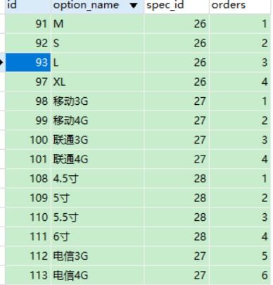

查询结果：

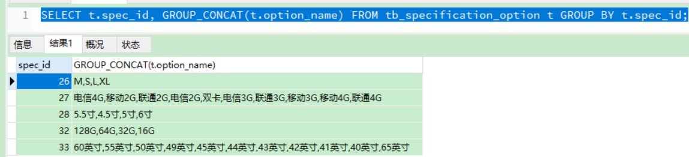

## 3. 数学函数

|     函数      |            功能说明            |
| :----------: | ----------------------------- |
|  `CEIL(x)`   | 向上取整                       |
|  `FLOOR(x)`  | 向下取整                       |
|  `MOD(x,y)`  | 返回`x/y`的模                  |
|   `RAND()`   | 返回0~1内的随机数               |
| `ROUND(x,y)` | 求参数x的四舍五入的值，保留y位小数 |

> Notes: MySQL中，数学函数如果发生错误，都会返回 `NULL`

### 3.1. ABS

```sql
ABS(X)
```

返回 X 的绝对值。

```sql
SELECT ABS(2); -- 返回 2
SELECT ABS(-32); -- 返回 32
```

### 3.2. CEIL

```sql
CEIL(X)
-- 或者
CEILING(X)
```

返回大于或等于 x 的最小整数

```sql
SELECT CEILING(1.23); -- 返回 2
SELECT CEIL(-1.23); -- 返回 -1
```

### 3.3. FLOOR

```sql
FLOOR(X)
```

返回不大于X的最大整数值

```sql
SELECT FLOOR(1.23); -- 返回 1
SELECT FLOOR(-1.23); -- 返回 -2
```

### 3.4. GREATEST

```sql
GREATEST(value1, value2,...)
```

当有2或多个参数时，返回值列表中最大值

```sql
SELECT GREATEST(34.0,3.0,5.0,767.0); -- 返回 767.0
SELECT GREATEST('B','A','C'); -- 返回 C
```

### 3.5. LEAST

```sql
LEAST(value1, value2,...)
```

在有两个或多个参数的情况下， 返回值为最小(最小值)参数

- 假如返回值被用在一个 INTEGER 语境中，或是所有参数均为整数值，则将其作为整数值进行比较。
- 假如返回值被用在一个 REAL 语境中，或所有参数均为实值，则将其作为实值进行比较。
- 假如任意一个参数是一个区分大小写的字符串，则将参数按照区分大小写的字符串进行比较。
- 在其它情况下，将参数作为区分大小写的字符串进行比较

```sql
SELECT LEAST(2,0); -- 返回 0
SELECT LEAST(34.0,3.0,5.0,767.0); -- 返回 3.0
SELECT LEAST('B','A','C'); -- 返回 'A'
```

### 3.6. MAX / MIN

```sql
-- 获取最大值
MAX([DISTINCT] expr)
-- 获取最小值
MIN([DISTINCT] expr)
```

返回字段 expression 中的最大值/最小值。

- `MIN()` 和 `MAX()` 的取值可以是一个字符串参数，返回的是最小或最大字符串值
- `DISTINCT`关键词可以被用来查找 expr 的不同值的最小或最大值，可以省略不写
- 若找不到匹配的行，`MIN()`和`MAX()`返回 `NULL`

```sql
SELECT student_name, MIN(test_score), MAX(test_score)
    FROM student
    GROUP BY student_name;
```

### 3.7. MOD

```sql
MOD(N,M)
-- 等价于
N % M
-- 等价于
N MOD M
```

模操作。返回 N 被 M 除后的余数。

```sql
SELECT MOD(234, 10); -- 返回 4
SELECT 253 % 7; -- 返回 1
SELECT MOD(29,9); -- 返回 2
SELECT 29 MOD 9; -- 返回 2
```

### 3.8. PI

```sql
PI()
```

返回圆周率(3.141593)，默认的显示小数位数是7位

```sql
SELECT PI(); -- 返回 3.141593
```

### 3.9. POW

```sql
POW(X,Y)
-- 或者
POWER(X,Y)
```

返回 X 的 Y 次方的结果值。

```sql
SELECT POW(2,2); -- 返回 4
SELECT POW(2,-2); -- 返回 0.25
```

### 3.10. RAND

```sql
RAND()
-- 指定一个整数参数 N ，则它被用作种子值，用来产生重复序列。
RAND(N)
```

返回一个随机浮点数，范围在0到1之间 (即其范围为 `0 ≤ v ≤ 1.0`)。若已指定一个整数参数 N，则它被用作种子值，用来产生重复序列。

```sql
SELECT RAND(); -- 返回 0.9233482386203 (随机)
SELECT RAND(20); -- 返回 0.15888261251047 (随机)
```

#### 3.10.1. 使用示例：随机样本

注：在 `ORDER BY` 语句中，不能使用一个带有 `RAND()` 值的列，原因是 `ORDER BY` 会计算列的多重时间。然而可按照如下的随机顺序检索数据行，多用于测试：

```sql
SELECT * FROM tbl_name ORDER BY RAND();
```

`ORDER BY RAND()`同 `LIMIT` 的结合从一组列中选择随机样本很有用。

### 3.11. ROUND

```sql
ROUND(X)
ROUND(X,D)
```

返回离 x 最接近的整数（遵循四舍五入）。有两个参数的情况时，返回 X ，其值保留到小数点后D位，而第D位的保留方式为四舍五入。若要接保留X值小数点左边的D 位，可将 D 设为负值。

```sql
SELECT ROUND(-1.23); -- 返回 -1
SELECT ROUND(1.58); -- 返回 2
SELECT ROUND(1.298, 1); -- 返回 1.3
SELECT ROUND(23.298, -1); -- 返回 20
```

MYSQL 的随机抽取实现方法。如：要从 tablename 表中随机提取一条记录，一般的写法就是：

```sql
SELECT * FROM tablename ORDER BY RAND() LIMIT 1
```

> Tips: 此方式效率不高，不推荐使用。

### 3.12. TRUNCATE

```sql
TRUNCATE(X,D)
```

返回数值 X 保留到小数点后 D 位的值。若 D 的值为 0，则结果不带有小数点或不带有小数部分。可以将 D 设为负数，若要截去(归零) X小数点左起第D位开始后面所有低位的值。（与 `ROUND` 最大的区别是不会进行四舍五入）

```sql
SELECT TRUNCATE(1.223,1); -- 返回 1.2
SELECT TRUNCATE(1.999,0); -- 返回 1
SELECT TRUNCATE(-1.999,1); -- 返回 -1.9
SELECT TRUNCATE(122,-2); -- 返回 100
-- 通过 concat() 函数拼接两个字符串，实现将小数转换成百分比格式
concat(truncate(0.55754 * 100,2),'%') -- 结果：55.75%
```

### 3.13. FORMAT

```sql
FORMAT(X, D)
```

将数值 X 设置为格式 `'#,###,###.##'`，以四舍五入的方式保留到小数点后 D 位，而返回结果为一个字符串。

```sql
select FORMAT(123456789.12345, 2); -- 结果：123,456,789.12
```

注：使用 mysql format 函数的时候数字超过以前之后得到的查询结果会以逗号分割，此时如果程序接收还是数字类型将会转换异常。所以如果属性是数字类型那么就使用这两个函数

```sql
select cast(字段, decimal(12,2))
convert(字段, decimal(12,2))
```

> Notes: *经测试，如果FORMAT函数的参数X如果数据库表字段类型是Bigint或者其他数字类型，内容长度超过17位是不会出现精度丢失；如果参数X是字符类型（varchar）的话，使用FORMAT函数后，超出17位后会进行四舍五入，精度丢失。*

## 4. 字符串函数

MySQL 中内置了很多字符串函数，常用的几个如下：

|            函数             |                       功能说明                        |
| :------------------------: | ---------------------------------------------------- |
|   `CONCAT(S1,S2,...Sn)`    | 字符串拼接，将S1，S2，... Sn拼接成一个字符串             |
|        `LOWER(str)`        | 将字符串str全部转为小写                                |
|        `UPPER(str)`        | 将字符串str全部转为大写                                |
|     `LPAD(str,n,pad)`      | 左填充，用字符串pad对str的左边进行填充，达到n个字符串长度 |
|     `RPAD(str,n,pad)`      | 右填充，用字符串pad对str的右边进行填充，达到n个字符串长度 |
|        `TRIM(str)`         | 去掉字符串头部和尾部的空格                              |
| `SUBSTRING(str,start,len)` | 返回从字符串str从start位置起的len个长度的字符串          |

### 4.1. CHAR_LENGTH/CHARACTER_LENGTH

```sql
CHAR_LENGTH(str)
-- 或
CHARACTER_LENGTH(str)
```

返回值为字符串 str 的长度，长度的单位为字符。

```sql
SELECT CHAR_LENGTH("RUNOOB") -- 返回 6
SELECT CHARACTER_LENGTH("RUNOOB") -- 返回 6
```

### 4.2. CONCAT

```sql
CONCAT(str1, str2,...)
```

将参数列表中的字符串合并为一个字符串。如有任何一个参数为NULL ，则返回值为 NULL。

```sql
mysql> SELECT CONCAT('My', 'S', 'QL');
+-------------------------+
| CONCAT('My', 'S', 'QL') |
+-------------------------+
| MySQL                   |
+-------------------------+

mysql> SELECT CONCAT('My', NULL, 'SQL');
+---------------------------+
| CONCAT('My', NULL, 'SQL') |
+---------------------------+
| NULL                      |
+---------------------------+

mysql> SELECT CONCAT(14.3);
+--------------+
| CONCAT(14.3) |
+--------------+
| 14.3         |
+--------------+
```

### 4.3. CONCAT_WS

```sql
CONCAT_WS(separator, str1, str2,...)
```

与`CONCAT`函数一样，用于拼接字符串，第一个参数是指定分隔符。分隔符的位置放在要连接的两个字符串之间。分隔符可以是一个字符串，也可以是其它参数。如果分隔符为 NULL，则结果为 NULL。

```sql
SELECT CONCAT_WS(',','First name','Second name','Last Name'); -- 返回  'First name,Second name,Last Name'
SELECT CONCAT_WS(',','First name',NULL,'Last Name'); -- 返回 'First name,Last Name'
SELECT CONCAT_WS(NULL,'First name','Second name','Last Name'); -- 返回 NULL
```

### 4.4. FIELD

```sql
FIELD(str, str1, str2, str3,...)
```

返回第一个字符串 str 在字符串列表(str1,str2,str3...)中的位置。在找不到 str 的情况下，返回值为0。

```sql
SELECT FIELD('ej', 'Hej', 'ej', 'Heja', 'hej', 'foo'); -- 返回 2
SELECT FIELD('fo', 'Hej', 'ej', 'Heja', 'hej', 'foo'); -- 返回 0
```

### 4.5. LTRIM

```sql
LTRIM(str)
```

去掉字符串 str 开始处的空格

```sql
SELECT LTRIM('  barbar'); -- 返回 'barbar'
```

### 4.6. RTRIM

```sql
RTRIM(str)
```

去掉字符串 str 结尾处的空格。

```sql
SELECT RTRIM('barbar   '); -- 返回 'barbar'
```

### 4.7. TRIM

```sql
TRIM(str)
```

去掉字符串 str 开始和结尾处的空格

```sql
SELECT TRIM('  bar   '); -- 返回 'bar'
SELECT TRIM(LEADING 'x' FROM 'xxxbarxxx'); -- 返回 'barxxx'
SELECT TRIM(BOTH 'x' FROM 'xxxbarxxx'); -- 返回 'bar'
SELECT TRIM(TRAILING 'xyz' FROM 'barxxyz'); -- 返回 'barx'
```

### 4.8. SUBSTRING / SUBSTR / MID

```sql
SUBSTRING(str, pos, len)
-- 或
SUBSTR(str, pos, len)
-- 或
MID(str, pos, len)
```

返回从字符串 str 的 pos 位置截取长度为 len 的子字符串。

> Notes: len 参数可以忽略，即截图 pos 位置后全部内容。**如果位数是负数 如-5则是从后倒数位数，到字符串结束或截取的长度**

```sql
SELECT SUBSTRING('Quadratically',5); -- 返回 'ratically'
SELECT SUBSTRING('foobarbar' FROM 4); -- 返回 'barbar'
SELECT SUBSTRING('Quadratically',5,6); -- 返回 'ratica'
SELECT SUBSTRING('Sakila', -3); -- 返回 'ila'
SELECT SUBSTRING('Sakila', -5, 3); -- 返回 'aki'
SELECT SUBSTRING('Sakila' FROM -4 FOR 2); -- 返回 'ki'
```

### 4.9. SUBSTRING_INDEX

```sql
SELECT SUBSTRING_INDEX(str, delim, count);
```

根据指定的关键字符截取字符串，参数说明：

- 参数str：被截取字段
- 参数delim：关键字（分隔符）
- 参数count：关键字出现的次数

```sql
SELECT SUBSTRING_INDEX('www.moon.com', '.', 2); -- 返回 www.moon
```

如果在字符串中找不到 delim 参数指定的值，就返回整个字符串，count 是正数时，是截取第几次出现的关键字**前**的字符；count是负数时，是截取第几次出现的关键字**后**的字符

```sql
substring_index('www.baidu.com', '.', 1); -- 结果是：www
substring_index('www.baidu.com', '.', 2); -- 结果是：www.baidu

/*
    也就是说，如果count是正数，那么就是从左往右数，第N个分隔符的左边的全部内容
    相反，如果是负数，那么就是从右边开始数，第N个分隔符右边的所有内容，如：
*/
substring_index('www.baidu.com', '.', -2); -- 结果为：baidu.com

/*
    如果要中间的的baidu？则有两个方向：
    从右数第二个分隔符的右边全部，再从左数的第一个分隔符的左边：
/*
substring_index(substring_index('www.baidu.com', '.', -2), ‘.’, 1);
```

#### 4.9.1. 将字符串按指定的分隔符转成多行数据

SQL案例：

```sql
-- 查询影片与主演（如果出演者Id定义为“A00001,A00002,..”这种形式，则前端查询列表则需要以下语句才能查询到对应的出演者信息）
SELECT * FROM jactor ta WHERE ta.id in (
SELECT
	SUBSTRING_INDEX(SUBSTRING_INDEX(t.actor_ids, ',', b.help_topic_id + 1), ',', -1)
FROM
	movie t
JOIN mysql.help_topic b ON b.help_topic_id < (
	LENGTH(t.actor_ids) - LENGTH(REPLACE(t.actor_ids, ',', '')) + 1
) WHERE t.id = '124');
```

on条件后面`(length(t.actor_ids) - length(replace(t.actor_ids,',',''))+1)`这个语法是得到被逗号分隔的字段一共有几个。为什么后面加1？可以这样理解，就是如果有3个逗号（分隔符），那个转换的内容就必然有4个，即确认了要转成的行数

提示：`mysql.help_topic`这张表只用到了它的 `help_topic_id`，可以看到这个 `help_topic_id` 是从0开始一直连续的，join 这张表只是为了确定数据行数。现在假设 `mysql.help_topic` 只有5条数据，那么最多可转成5行数据，若果现在主演的名字有6个就不能用 `mysql.help_topic` 这张表了。由此看出我们完全可以找其他表来替代 `mysql.help_topic`，只要满足表的id是连续的，且数据条数超过了你要转换的行数即可。

### 4.10. POSITION

```sql
POSITION(substr IN str)
```

从字符串 str 中获取 substr 的第一次出现的位置。如若 substr 不在 str 中，则返回值为0。

```sql
SELECT POSITION('b' in 'abc'); -- 返回 2
SELECT POSITION('e' in 'abc'); -- 返回 0
```

### 4.11. REPLACE

```sql
REPLACE(str, from_str, to_str)
```

将字符串 str 中的字符串 to_str 替代成字符串 from_str，并返回

```sql
SELECT REPLACE('www.mysql.com', 'w', 'Ww'); -- 返回 'WwWwWw.mysql.com'
```

### 4.12. REVERSE

```sql
REVERSE(str)
```

返回字符串 str 的反转顺序

```sql
SELECT REVERSE('abc'); -- 返回 'cba'
```

### 4.13. LEFT

```sql
left(str, length)
```

从左开始截取字符串str，返回前面 length 个字符。

```sql
SELECT LEFT('foobarbar', 4); -- 返回 'foob'
```

### 4.14. RIGHT

```sql
RIGHT(str,len)
```

从右开始截取字符串，返回字符串 str 的后 len 个字符。参数说明：

- 参数`str`：被截取字段
- 参数`length`：截取长度

```sql
SELECT RIGHT('foobarbar', 4); -- 返回 'rbar'
```

### 4.15. STRCMP

```sql
STRCMP(expr1, expr2)
```

比较字符串 expr1 和 expr2，如果 expr1 与 expr2 相等返回0，如果 expr1 > expr2 返回 1，如果 expr1 < expr2 返回 -1

```sql
SELECT STRCMP('text', 'text2'); -- 返回 -1
SELECT STRCMP('text2', 'text'); -- 返回 1
SELECT STRCMP('text', 'text'); -- 返回 0
```

### 4.16. UCASE / UPPER

```sql
UPPER(str)
-- 或
UCASE(str)
```

将字符串 str 所有字母转换为大写

```sql
mysql> SELECT UPPER('Hej');
+--------------+
| UPPER('Hej') |
+--------------+
| HEJ          |
+--------------+
```

### 4.17. LCASE / LOWER

```sql
LOWER(str)
-- 或
LCASE(str)
```

将字符串 str 的所有字母变成小写字母

```sql
mysql> SELECT LOWER('QUADRATICALLY');
+------------------------+
| LOWER('QUADRATICALLY') |
+------------------------+
| quadratically          |
+------------------------+
```

### 4.18. LPAD / RPAD 前后补位

LPAD / RPAD 函数是用于对字段内容补位(补零为例)，语法结构：

```sql
LPAD(str, len, padstr)
RPAD(str, len, padstr)
```

参数说明：

- str：需要补充的原数据
- len：补充后字符的总位数
- padstr：补充的内容

注意：如果字符串 str 的长度大于 len，则返回值被缩短成 len 长度的字符串返回。

示例

```sql
-- 前补内容(LPAD)
select LPAD(uid, 8, 0),username from uc_members where uid = '100015'; -- 结果：uid: 00100015   username:MooN

-- 后补内容(RPAD)
select RPAD(uid, 8, 0),username from uc_members where uid = '100015'; -- 结果：uid: 10001500   username:MooN

-- 原字符串被压缩
SELECT RPAD('hi',1,'?'); -- 返回结果：'h'

-- 修改企业员工的工号统一为5位数，目前不足5位数的全部在前面补0。比如：1号员工的工号应该为00001。
update emp set workno = lpad(workno, 5, '0');
```

### 4.19. LENGTH/CHAR_LENGTH/CHARACTER_LENGTH/BIT_LENGTH

- `LENGTH(str)`：用于函数获取某个字段数据长度，计算字段的长度规则是：一个汉字是算三个字符，一个数字或字母算一个字符
- `CHAR_LENGTH(str)`：返回值为字符串str 的长度，长度的单位为字符。一个多字节字符算作一个单字符。对于一个包含五个二字节字符集，`LENGTH`返回值为10，而`CHAR_LENGTH`的返回值为5
- `CHARACTER_LENGTH(str)`：与 `CHAR_LENGTH` 函数一样
- `BIT_LENGTH(str)`：返回2进制长度

```sql
SELECT LENGTH('www.moon.com'); -- 结果：12
```

#### 4.19.1. 查询某一个字段是否包含中文字符

在使用 mysql 时候，某些字段会存储中文字符，或是包含中文字符的串，查询出来的方法是：

```sql
SELECT col FROM table WHERE length(col) != char_length(col)
```

此现实原理：当字符集为 UTF-8，并且字符为中文时，`length()` 和 `char_length()` 两个函数返回的结果是不相同的。

- `length()`：计算字段的长度，一个汉字算3个字符，一个数字或者字母按1个字符
- `char_length()`：计算字段的长度，不论是汉字、数字还是字母，均按1个字符来算

## 5. 日期函数

|                 函数                 |                  功能说明                   |
| :---------------------------------: | ------------------------------------------ |
|             `CURDATE()`             | 返回当前日期                                 |
|             `CURTIME()`             | 返回当前时间                                 |
|               `NOW()`               | 返回当前日期和时间                            |
|            `YEAR(date)`             | 获取指定date的年份                           |
|            `MONTH(date)`            | 获取指定date的月份                           |
|             `DAY(date)`             | 获取指定date的日期                           |
| `DATE_ADD(date, INTERVAL exprtype)` | 返回一个日期/时间值加上一个时间间隔expr后的时间值 |
|       `DATEDIFF(date1,date2)`       | 返回起始时间date1和结束时间date2之间的天数      |

### 5.1. CURDATE / CURRENT_DATE

```sql
CURDATE()
CURRENT_DATE()
```

以`'YYYY-MM-DD'`的格式返回当前的日期，可以直接存到DATE字段中。

```sql
mysql> select curdate();
+------------+
| curdate()  |
+------------+
| 2022-07-29 |
+------------+

mysql> select CURRENT_DATE();
+-----------------+
| CURRENT_DATE()  |
+-----------------+
| 2022-07-29      |
+-----------------+
```

### 5.2. CURTIME

```sql
CURTIME()
```

以`'HH:MM:SS'`的格式返回当前的时间，可以直接存到TIME字段中。

```sql
mysql> select curtime();
+-----------+
| curtime() |
+-----------+
| 18:29:21  |
+-----------+
```

### 5.3. NOW

```sql
NOW()
```

以`'YYYY-MM-DD HH:MM:SS'`或`'YYYYMMDDHHMMSS'`的格式返回当前的日期和时间，可以直接存到DATETIME字段中。

```sql
mysql> SELECT NOW();
+---------------------+
| NOW()               |
+---------------------+
| 2022-07-29 17:24:59 |
+---------------------+
1 row in set (0.02 sec)
```

### 5.4. YEAR

```sql
YEAR(date)
```

获取指定date的年份

```sql
mysql> select YEAR(now());
+-------------+
| YEAR(now()) |
+-------------+
|        2022 |
+-------------+
```

### 5.5. MONTH

```sql
MONTH(date)
```

获取指定date的月份

```sql
mysql> select MONTH(now());
+--------------+
| MONTH(now()) |
+--------------+
|            7 |
+--------------+
```

### 5.6. DAY

```sql
DAY(date)
```

获取指定date的日期

```sql
mysql> select DAY(now());
+------------+
| DAY(now()) |
+------------+
|         29 |
+------------+
```

### 5.7. DATE_ADD

```sql
DATE_ADD(date, INTERVAL exprtype)
```

返回一个日期/时间值加上一个时间间隔expr后的时间值

```sql
mysql> select date_add(now(), INTERVAL 70 YEAR);
+-----------------------------------+
| date_add(now(), INTERVAL 70 YEAR) |
+-----------------------------------+
| 2092-07-29 18:35:38               |
+-----------------------------------+
```

### 5.8. DATEDIFF

```sql
DATEDIFF(date1,date2)
```

返回起始时间date1和结束时间date2之间的天数

```sql
mysql> select datediff('2021-10-01', '2021-12-01');
+--------------------------------------+
| datediff('2021-10-01', '2021-12-01') |
+--------------------------------------+
|                                  -61 |
+--------------------------------------+
```

### 5.9. 日期函数的对比

#### 5.9.1. NOW 和 CURRENT_DATE 的区别

- NOW 函数用于显示当前年份，月份，日期，小时，分钟和秒。
- CURRENT_DATE 函数仅显示当前年份，月份和日期。

## 6. 控制流程函数

流程函数也是很常用的一类函数，可以在 SQL 语句中实现条件筛选，从而提高语句的效率。

|                               函数                                |                       功能说明                        |
| :--------------------------------------------------------------: | ---------------------------------------------------- |
|                       `IF(value , t , f)`                        | 如果value为true，则返回t，否则返回f                      |
|                    `IFNULL(value1 , value2)`                     | 如果value1不为空，返回value1，否则返回value2             |
|     `CASE WHEN [ val1 ] THEN [res1] … ELSE [ default ] END`      | 如果val1为true，返回res1，... 否则返回default默认值      |
| `CASE [ expr ] WHEN [ val1 ] THEN [res1] … ELSE [ default ] END` | 如果expr的值等于val1，返回res1，... 否则返回default默认值 |

### 6.1. IF

```sql
IF(expr1, expr2, expr3)
```

如果expr1为true，则返回expr2，否则返回expr3

```sql
SELECT IF(1>2,2,3); -- 返回 3
SELECT IF(1<2,'yes ','no'); -- 返回 'yes'
SELECT IF(STRCMP('test','test1'),'no','yes'); -- 返回 'no'
```

### 6.2. IFNULL

```sql
IFNULL(expr1, expr2)
```

`IFNULL` 函数作用是，假如 `expr1` 不为 `NULL`，则返回值为 `expr1`，否则其返回值为 `expr2`。`IFNULL()` 函数的返回值是数字或是字符串取决于实际的sql

```sql
SELECT IFNULL(1, 0); -- 返回 1
SELECT IFNULL(NULL, 10); -- 返回 10
SELECT IFNULL(1/0, 10); -- 返回 10
SELECT IFNULL(1/0, 'yes'); -- 返回 'yes'
```

### 6.3. ISNULL

```sql
ISNULL(expr)
```

如 expr 为 `NULL`，那么 `ISNULL()` 的返回值为 1，否则返回值为 0。

```sql
SELECT ISNULL(1+1); -- 返回 0
SELECT ISNULL(1/0); -- 返回 1
```

### 6.4. NULLIF

```sql
NULLIF(expr1, expr2)
-- 效果等价于
CASE WHEN expr1 = expr2 THEN NULL ELSE expr1 END
```

如果 expr1 = expr2，则返回 NULL，否则返回 expr1。等价于下面的：

```sql
SELECT NULLIF(1,1); -- 返回 NULL
SELECT NULLIF(1,2); -- 返回 1
```

### 6.5. case when 语句

```sql
方式1:
CASE value
    WHEN compare-value1 THEN result1
    [WHEN compare-value2 THEN result2]
   ...
    [WHEN compare-valueN THEN resultN]
    [ELSE result]
END

-- 方式2:
CASE
    WHEN [condition1] THEN result1
    [WHEN [condition2] THEN result2]
    ...
    [WHEN [conditionN] THEN resultN]
    [ELSE result]
END
```

`CASE` 表示函数开始，`END` 表示函数结束。

- 方式1中，如果 value = compare-value1，则返回 result1，如果 value = compare-value2，则返回 result2，....
- 方式2中，如果 condition1 成立，则返回 result1，如果 condition2 成立，则返回 result2，....

如果没有匹配的结果值，则返回结果为 `ELSE` 后的结果，如果没有 `ELSE` 部分，则返回值为 `NULL`。而当有一个成立条件之后，后面的就不再执行了。

一个`CASE`表达式的默认返回值类型是任何返回值的相容集合类型，但具体情况视其所在语境而定。如果用在字符串语境中，则返回结果味字符串。如果用在数字语境中，则返回结果为十进制值、实值或整数值。

```sql
SELECT CASE 1 WHEN 1 THEN 'one'
    WHEN 2 THEN 'two' ELSE 'more' END; -- 返回 'one'
SELECT CASE WHEN 1>0 THEN 'true' ELSE 'false' END; -- 返回 'true'
SELECT CASE BINARY 'B'
    WHEN 'a' THEN 1 WHEN 'b' THEN 2 END; -- 返回 NULL

-- 方式1：值比较方式
SELECT
	*,
    CASE
    	payType
    	WHEN 1 THEN '微信支付'
    	WHEN 2 THEN '支付宝支付'
    	WHEN 3 THEN '银行卡支付'
    	ELSE '其他支付方式'
    END AS payTypeStr
FROM
	orders;
-- 方式2：条件表达式
SELECT
	*,
    CASE
    	WHEN payType = 1 THEN '微信支付'
    	WHEN payType = 2 THEN '支付宝支付'
    	WHEN payType = 3 THEN '银行卡支付'
    	ELSE '其他支付方式'
    END AS payTypeStr
FROM
	orders;
```

## 7. 窗口函数/分析函数（Window Functions，8.0版本新增）

### 7.1. 简述

MySQL 8.0 新增窗口函数，又被称为开窗函数、分析函数，与 Oracle 窗口函数类似，属于 MySQL 的一大特点。它可以用来实现若干新的查询方式。窗口函数与 `SUM()`、`COUNT()` 这种分组聚合函数类似，在聚合函数后面加上`over()`就变成窗口函数了，在括号里可以加上 `partition by` 等分组关键字指定如何分组，窗口函数即便分组也不会将多行查询结果合并为一行，而是将结果放回多行当中，即窗口函数不需要再使用`GROUP BY`。

非聚合窗口函数是相对于聚合函数来说的，区别如下：

- 聚合函数是对一组数据计算后返回单个值（即分组）
- 非聚合函数一次只会处理一行数据。
- 窗口聚合函数在行记录上计算某个字段的结果时，可将窗口范围内的数据输入到聚合函数中，并不改变行数。

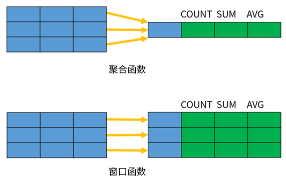

### 7.2. 窗口函数分类

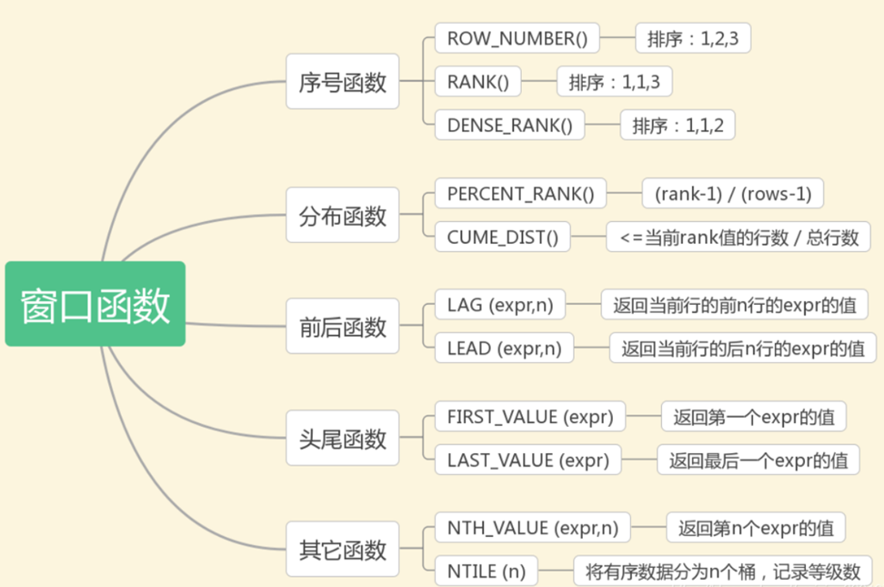

- 序号函数：`ROW_NUMBER()`、`RANK()`、`DENSE_RANK()`
- 分布函数：`PERCENT_RANK()`、`CUME_DIST()`
- 前后函数：`LAG()`、`LEAD()`
- 头尾函数：`FIRST_VALUE()`、`LAST_VALUE()`
- 其它函数：`NTH_VALUE()`、`NTILE()`

另外还有开窗聚合函数: `SUM`, `AVG`, `MIN`, `MAX`

### 7.3. 窗口函数定义语法(通用)

**语法结构**：

```sql
window_function (expr) OVER (
  PARTITION BY ...
  ORDER BY ...
  frame_clause
)
```

**参数解析**：

- `window_function` 是窗口函数的名称；
- `expr` 是函数的参数，有些函数不需要参数；
- `OVER` 子句包含三个选项：
    - `PARTITION BY`：分区选项。用于将数据行拆分成多个分区（组），它的作用类似于`GROUP BY`分组。如果省略了 `PARTITION BY`，所有的数据作为一个组进行计算
    - `ORDER BY`：排序选项。用于指定分区内的排序方式，与 `ORDER BY` 子句的作用类似
    - `frame_clause`：窗口大小选项。用于在当前分区内指定一个计算窗口，也就是一个与当前行相关的数据子集。

> Notes: 在聚合函数后面加上 `over()` 就变成窗口函数了，后面可以不用再加 `group by` 制定分组，因为在 `over` 里的 `partition` 关键字指明了如何分组计算，这种可以保留原有表数据的结构，不会像分组聚合函数那样每组只返回一条数据

### 7.4. 序号函数（ROW_NUMBER,RANK,DENSE_RANK）

序号函数有三个：`ROW_NUMBER()`、`RANK()`、`DENSE_RANK()`，可以用来实现分组排序，并添加序号。

**语法格式**：

```sql
row_number()|rank()|dense_rank() over (
  partition by ...
  order by ...
)
```

示例：

```sql
SELECT
	dname, ename, salary,
	-- row_number() 按指定的列表排序并添加序号，相同的值也按顺序给序号
	row_number() over ( PARTITION BY dname ORDER BY salary DESC ) AS 'rn1',
	-- rank() 按指定的列表排序并添加序号，相同的值给相同的序号，后面的值接相同序号的个数+1 继续给序号
	rank() over ( PARTITION BY dname ORDER BY salary DESC ) AS 'rn2',
	-- dense_rank() 按指定的列表排序并添加序号，相同的值给相同的序号，后面的值按序号+1 继续给序号
	dense_rank() over ( PARTITION BY dname ORDER BY salary DESC ) AS 'rn3'
FROM
	employee;
```

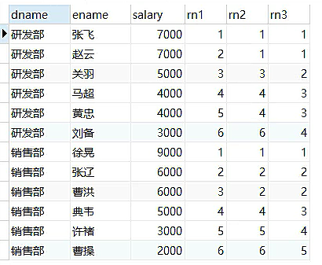

使用子查询的方式，获取分组的前3的记录

```sql
SELECT
	*
FROM
	( SELECT
		dname, ename, salary,
		dense_rank() over ( PARTITION BY dname ORDER BY salary DESC ) AS rn
	  FROM
		employee ) t
WHERE
	t.rn <= 3;
```


不加`partition by`表示全局排序

```sql
select
    dname, ename, salary,
    dense_rank() over(order by salary desc) as rn
from
    employee;
```

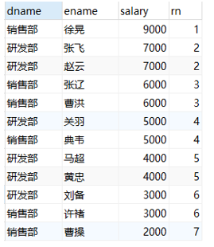

### 7.5. 开窗聚合函数（SUM,AVG,MIN,MAX）

在窗口中每条记录动态地应用聚合函数 `SUM()`、`AVG()`、`MAX()`、`MIN()`、`COUNT()`，可以动态计算在指定的窗口内的各种聚合函数值。

示例：

```sql
SELECT
	dname, ename, salary,
	sum( salary ) over ( PARTITION BY dname ORDER BY hiredate ) AS pv1
FROM
	employee;

SELECT
	dname, ename, salary,
	sum( salary ) over ( PARTITION BY dname ORDER BY hiredate rows BETWEEN unbounded preceding AND current ROW ) AS c1
FROM
	employee;

SELECT
	dname, ename, salary,
	sum( salary ) over ( PARTITION BY dname ORDER BY hiredate rows BETWEEN 3 preceding AND current ROW ) AS c1
FROM
	employee;

SELECT
	dname, ename, salary,
	sum( salary ) over ( PARTITION BY dname ORDER BY hiredate rows BETWEEN 3 preceding AND 1 following ) AS c1
FROM
	employee;

SELECT
	dname, ename, salary,
	sum( salary ) over ( PARTITION BY dname ORDER BY hiredate rows BETWEEN current ROW AND unbounded following ) AS c1
FROM
	employee;
```

### 7.6. 分布函数（CUME_DIST,PERCENT_RANK）

#### 7.6.1. CUME_DIST

`CUME_DIST` 函数用途：分组内小于、等于当前(rank值的行数/分组内总行数)

示例应用场景：查询小于等于当前薪资（salary）的比例

```sql
/*
	rn1: 没有partition,所有数据均为1组，总行数为12，
     第一行：小于等于3000的行数为3，因此，3/12=0.25
     第二行：小于等于4000的行数为5，因此，5/12=0.4166666666666667
	rn2: 按照部门分组，dname='研发部'的行数为6,
     第一行：研发部小于等于3000的行数为1，因此，1/6=0.16666666666666666
*/
SELECT
	dname, ename, salary,
	cume_dist() over ( ORDER BY salary ) AS rn1,-- 没有partition语句 所有的数据位于一组
	cume_dist() over ( PARTITION BY dept ORDER BY salary ) AS rn2
FROM
	employee;
```

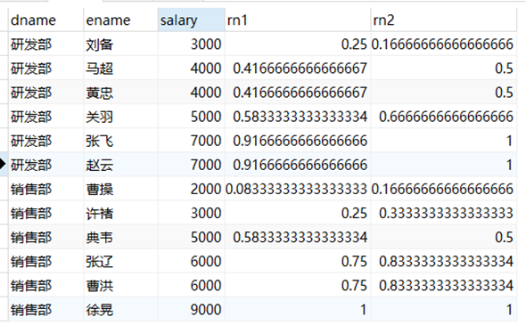

#### 7.6.2. PERCENT_RANK

`PERCENT_RANK` 函数用途：每行按照公式 `(rank-1) / (rows-1)` 进行计算。其中，`rank`为`RANK()`函数产生的序号，`rows`为当前窗口的记录总行数。

> 此函数很少应用场景

```sql
/*
 rn2:
  第一行: (1 - 1) / (6 - 1) = 0
  第二行: (1 - 1) / (6 - 1) = 0
  第三行: (3 - 1) / (6 - 1) = 0.4
*/
SELECT
	dname, ename, salary,
	rank() over ( PARTITION BY dname ORDER BY salary DESC ) AS rn,
	percent_rank() over ( PARTITION BY dname ORDER BY salary DESC ) AS rn2
FROM
	employee;
```

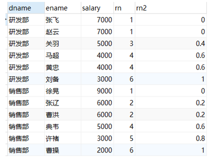

### 7.7. 前后函数（LAG,LEAD）

前后函数用途：返回位于当前行的前 n 行（`LAG(expr, n)`）或后 n 行（`LEAD(expr, n)`）的 `expr` 的值

示例应用场景：查询前1名同学的成绩和当前同学成绩的差值

```sql
-- lag 函数的用法
/*
last_1_time: 指定了往上第1行的值，default为'2000-01-01'
							 第一行，往上1行为null,因此取默认值 '2000-01-01'
							 第二行，往上1行值为第一行值，2021-11-01
							 第三行，往上1行值为第二行值，2021-11-02
last_2_time: 指定了往上第2行的值，为指定默认值
							 第一行，往上2行为null
							 第二行，往上2行为null
							 第四行，往上2行为第二行值，2021-11-01
							 第七行，往上2行为第五行值，2021-11-02
*/
SELECT
	dname, ename, hiredate, salary,
	lag( hiredate, 1, '2000-01-01' ) over ( PARTITION BY dname ORDER BY hiredate ) AS last_1_time,
	lag( hiredate, 2 ) over ( PARTITION BY dname ORDER BY hiredate ) AS last_2_time
FROM
	employee;
```

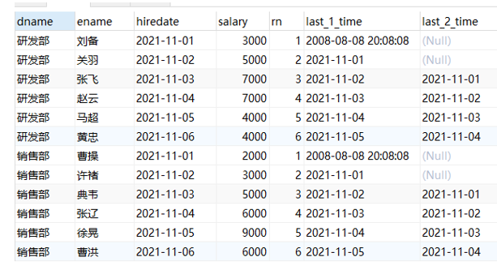

```sql
-- lead 函数的用法
SELECT
	dname, ename, hiredate, salary,
	lead( hiredate, 1, '2000-01-01' ) over ( PARTITION BY dname ORDER BY hiredate ) AS last_1_time,
	lead( hiredate, 2 ) over ( PARTITION BY dname ORDER BY hiredate ) AS last_2_time
FROM
	employee;
```

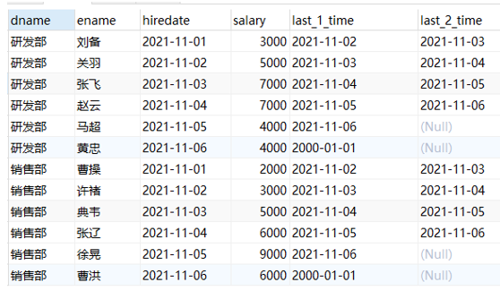

### 7.8. 头尾函数（FIRST_VALUE,LAST_VALUE）

头尾函数用途：返回第一个（`FIRST_VALUE(expr)`）或最后一个（`LAST_VALUE(expr)`）`expr` 的值

示例应用场景：截止到当前，按照日期排序查询第1个入职和最后1个入职员工的薪资

```sql
-- 注意,  如果不指定ORDER BY，则进行排序混乱，会出现错误的结果
SELECT
	dname, ename, hiredate, salary,
	first_value( salary ) over ( PARTITION BY dname ORDER BY hiredate ) AS FIRST,
	last_value( salary ) over ( PARTITION BY dname ORDER BY hiredate ) AS last
FROM
	employee;
```

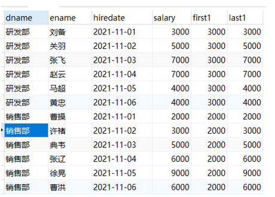

### 7.9. 其他函数（NTH_VALUE,NTILE）

#### 7.9.1. NTH_VALUE

`NTH_VALUE(expr,n)` 函数用途：返回窗口中第n个expr的值。expr可以是表达式，也可以是列名

示例应用场景：截止到当前薪资，显示每个员工的薪资中排名第2或者第3的薪资

```sql
SELECT
	dname, ename, hiredate, salary,
	nth_value( salary, 2 ) over ( PARTITION BY dname ORDER BY hiredate ) AS second_score,
	nth_value( salary, 3 ) over ( PARTITION BY dname ORDER BY hiredate ) AS third_score
FROM
	employee
```

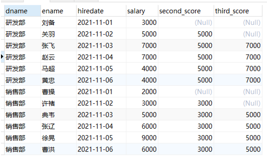

#### 7.9.2. NTILE

`NTILE(n)` 函数用途：将分区中的有序数据分为n个等级，记录等级数

应用场景：将每个部门员工按照入职日期分成3组

```sql
SELECT
	dname, ename, hiredate, salary,
	ntile( 3 ) over ( PARTITION BY dname ORDER BY hiredate ) AS rn
FROM
	employee;
```

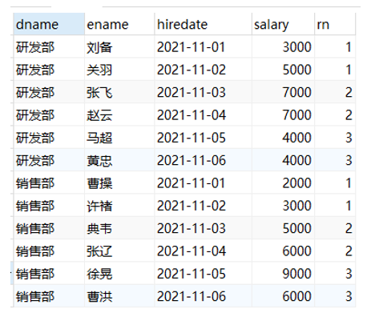
