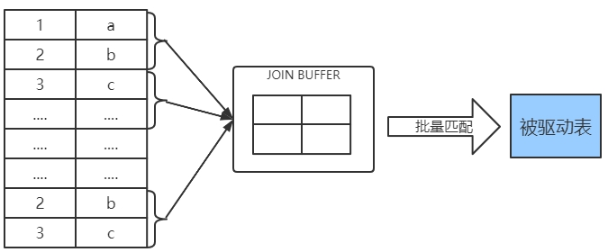
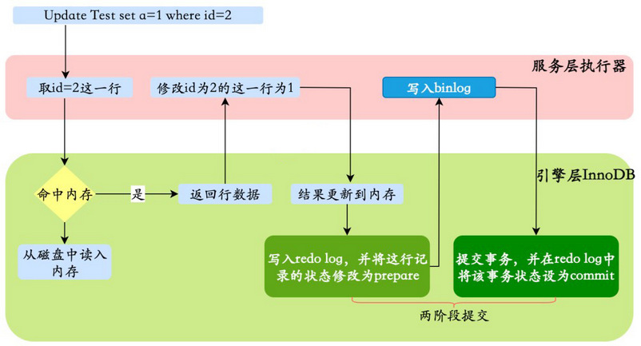
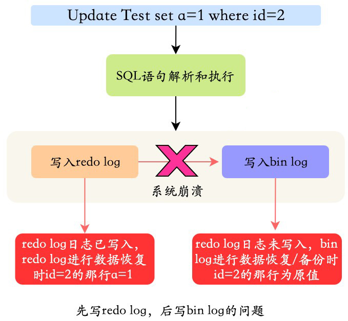
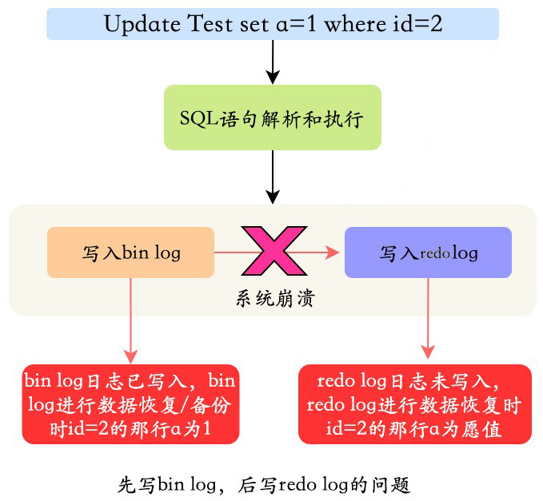

## 1. 单表访问之索引合并

MySQL 在一般情况下执行一个查询时最多只会用到单个二级索引，但存在有特殊情况，在这些特殊情况下也可能在一个查询中使用到多个二级索引，MySQL 中这种使用到多个索引来完成一次查询的执行方法称之为：索引合并（index merge），具体的索引合并算法有以下的3种：

### 1.1. 并集（Intersection）合并

某个查询可以使用多个二级索引，将从多个二级索引中查询到的结果取交集。

```sql
SELECT * FROM table WHERE index1 = 'a' AND index2 = 'b';
```

假设这个查询使用 Intersection 合并的方式执行的话，那执行过程是：

- 从`index1`相应的二级索引对应的B+树中取出`index1 = 'a'`的相关记录。
- 从`index2`相应的二级索引对应的B+树中取出`index2 = 'b'`的相关记录。

因为二级索引的组成结构都是由索引列+主键构成，所以可以计算出这两个结果集中主键的交集。然后再根据这个主键的交集去进行回表操作，也就是从聚簇索引中把指定的主键的完整行记录返回。

【问题】：不同的查询方式的执行成本比较

- **只读取一个二级索引的成本**：按照某个搜索条件读取一个二级索引，根据从该二级索引得到的主键值进行回表操作，然后再过滤其他的搜索条件
- **读取多个二级索引之后取交集成本**：按照不同的搜索条件分别读取不同的二级索引，将从多个二级索引得到的主键值取交集，然后进行回表操作

【解释】：虽然读取多个二级索引比读取一个二级索引消耗性能，但是大部分情况下读取二级索引的操作是顺序I/O，而回表操作是随机I/O，所以如果只读取一个二级索引时需要回表的记录数特别多，而读取多个二级索引之后取交集的记录数非常少，当节省的因为回表而造成的性能损耗比访问多个二级索引带来的性能损耗更高时，读取多个二级索引后取交集比只读取一个二级索引的成本更低。

MySQL 在以下特定的情况下才可能会使用到 Intersection 索引合并

#### 1.1.1. 情况一：等值匹配

- 二级索引列是等值匹配的情况
- 对于联合索引来说，在联合索引中的每个列都必须等值匹配，不能出现只匹配部分列的情况。

满足以上的情况，才可能会使用到索引合并

#### 1.1.2. 情况二：主键列可以是范围匹配

```sql
SELECT * FROM 表 WHERE 主键列 > 100 AND 索引列 = 'a';
```

对于 InnoDB 的二级索引来说，记录先是按照索引列进行排序，如果该二级索引是一个联合索引，那么会按照联合索引中的各个列依次排序。而二级索引的用户记录是由索引列 + 主键构成的，二级索引列的值相同的记录可能会有好多条，这些索引列的值相同的记录又是按照主键的值进行排序的

<font color=red>**之所以在二级索引列都是等值匹配的情况下才可能使用Intersection 索引合并，是因为在这种情况下根据二级索引查询出的结果集是按照主键值排序的**</font>。因为各个二级索引中查询的到的结果集按主键排好序，取交集的过程比较容易。按照有序的主键值去回表取记录有个专有名词，叫：Rowid Ordered Retrieval，简称 ROR。

如果从各个二级索引中查询出的结果集并不是按照主键排序的话，那就要先把结果集中的主键值排序完再来做上边的那个过程，就比较耗时了。

<font color=red>****不仅是多个二级索引之间可以采用 Intersection 索引合并，索引合并也可以有聚簇索引。在搜索条件中有主键的范围匹配的情况下也可以使用 Intersection 索引合并索引合并</font>。如上例，通过二级索引查询到相应的主键值集合，因为主键已经排序，所以很容易就匹配主键范围条件，取最终的结果集

#### 1.1.3. 索引并集合并小结

上边的情况一和情况二只是发生 Intersection 索引合并的必要条件，不是充分条件。也就是说即使情况一、情况二成立，也不一定发生 Intersection索引合并，这得看优化器的具体分析。优化器只有在单独根据搜索条件从某个二级索引中获取的记录数太多，导致回表开销太大，而通过 Intersection 索引合并后需要回表的记录数大大减少时才会使用 Intersection 索引合并。

### 1.2. Union 合并

查询时经常会把既符合某个搜索条件的记录取出来，也把符合另外的某个搜索条件的记录取出来，然后这些不同的搜索条件之间是`OR`关系。有时候`OR`关系的不同搜索条件会使用到不同的索引，如：

```sql
SELECT * FROM 表 WHERE 索引列1 = 'a' OR 索引列2 = 'b';
```

Union 是并集的意思，适用于使用不同索引的搜索条件之间使用`OR`连接起来的情况。与 Intersection 索引合并类似，MySQL 在某些特定的情况下才可能会使用到 Union 索引合并：

#### 1.2.1. 情况一：等值匹配

分析与Intersection 合并同理

#### 1.2.2. 情况二：主键列可以是范围匹配

分析与 Intersection 合并同理

#### 1.2.3. 情况三：使用 Intersection 索引合并的搜索条件

此情况是，搜索条件的某些部分使用 Intersection 索引合并的方式得到的主键集合和其他方式得到的主键集合取交集。比如：

```sql
SELECT * FROM order_exp WHERE insert_time = 'a' AND order_status = 'b' AND expire_time = 'c' OR (order_no = 'a' AND expire_time = 'b');
```

优化器可能采用这样的方式来执行这个查询：

- 先按照搜索条件 order_no = 'a' AND expire_time = 'b'从索引 idx_order_no 和 idx_expire_time 中使用 Intersection 索引合并的方式得到一个主键集合。
- 再按照搜索条件 insert_time = 'a' AND order_status = 'b' AND expire_time = 'c' 从联合索引 u_idx_day_status 中得到另一个主键集合。
- 采用 Union 索引合并的方式把上述两个主键集合取并集，然后进行回表操作，将结果返回给客户端。

#### 1.2.4. 索引并集合并小结

查询条件符合了以上情况也不一定就会采用 Union 索引合并，也得看优化器的具体分析。优化器只有在单独根据搜索条件从某个二级索引中获取的记录数比较少，通过 Union 索引合并后进行访问的代价比全表扫描更小时才会使用Union 索引合并。

### 1.3. Sort-Union 合并

Union 索引合并的使用条件必须保证各个二级索引列在进行等值匹配的条件下才可能被用到。有一些情况：

```sql
SELECT * FROM 表 WHERE 索引列1 < 'a' OR 索引列2 > 'z';
```

- 先根据索引列1从二级索引中获取到记录，并将记录上的主键进行排序
- 同样操作索引列2
- 两个二级索引主键值都是排好序后，后续的操作和 Union 索引合并方式就一样了

上述这种先按照二级索引记录的主键值进行排序，之后按照 Union 索引合并方式执行的方式称之为 Sort-Union 索引合并，很显然，这种 Sort-Union 索引合并比单纯的 Union 索引合并多了一步对二级索引记录的主键值排序的过程。

### 1.4. 联合索引替代 Intersection 索引合并

在使用 Intersection 索引合并的方式来处理的查询语句，是因为查询条件的列分别是索引，并且是各个单独的B+树。可以直接将其各个二级索引合并成一个联合索引

## 2. 连接查询的实现原理

> 连接查询的基础知识详见前面《连接查询》的章节

### 2.1. 嵌套循环连接 Nested-Loop Join (NLJ) 算法

- 两表连接查询：驱动表只会被访问一次，但被驱动表具体访问次数取决于对驱动表执行单表查询后的结果集中的记录条数。
- 内连接查询：选取哪个表为驱动表都没关系
- 外连接查询：驱动表是固定的，也就是说左（外）连接的驱动表就是左边的那个表，右（外）连接的驱动表就是右边的那个表。
- 3个表连接查询：那么首先两表连接得到的结果集作为新的驱动表，然后第三个表作为被驱动表

从上面可以看出，连接查询这个过程就像是一个嵌套的循环，所以这种驱动表只访问一次，但被驱动表却可能被多次访问，访问次数取决于对驱动表执行单表查询后的结果集中的记录条数的连接执行方式称之为嵌套循环连接（Nested-Loop Join），这是最简单，也是最笨拙的一种连接查询算法，时间复杂度是`O(N*M*L)`。

### 2.2. 使用索引加快连接速度

被驱动表其实就相当于一次单表查询，假设查询驱动表后的结果集中有N条记录，根据嵌套循环连接算法需要对被驱动表查询N次。

```sql
SELECT * FROM e1, e2 WHERE e1.m1 > 1 AND e1.m1 = e2.m2 AND e2.n2 < 'd';
```

如上示例，如果给被驱动表的连接列（即上例的m2列）建立索引，因为m2列的条件是等值查找，所以可能使用到`ref`类型的访问方法； 如果m2列是e2表的主键或者唯一二级索引列，那么使用`e2.m2 = 常数值`这样的条件从 e2 表中查找记录的过程的代价就是常数级别的。在单表中使用主键值或者唯一二级索引列的值进行等值查找的方式称之为`const`，而 MySQL 把在连接查询中对被驱动表使用主键值或者唯一二级索引列的值进行等值查找的查询执行方式称之为：`eq_ref`。

如果连接查询条件列与其他条件列都存在索引，需要从所有索引中选一个代价更低的去执行对被驱动表的查询。当然，建立了索引不一定使用索引，只有在二级索引+回表的代价比全表扫描的代价更低时才会使用索引。

有时候连接查询的查询列表和过滤条件中可能只涉及被驱动表的部分列，而这些列都是某个索引的一部分，这种情况下即使不能使用`eq_ref`、`ref`、`ref_or_null`或者`range`这些访问方法执行对被驱动表的查询的话，也可以使用索引扫描，也就是index(索引覆盖)的访问方法来查询被驱动表。

### 2.3. 基于块的嵌套循环连接 Block Nested-Loop Join (BNL)算法

扫描一个表的过程其实是先把这个表从磁盘上加载到内存中，然后从内存中比较匹配条件是否满足。当表数据量很大的时候，每次访问被驱动表，被驱动表的记录会被加载到内存中，在内存中的每一条记录只会和驱动表结果集的一条记录做匹配，之后就会被从内存中清除掉。然后再从驱动表结果集中拿出另一条记录，再一次把被驱动表的记录加载到内存中一遍，驱动表结果集中有多少条记录，就得把被驱动表从磁盘上加载到内存中多少次。这个 I/O 代价就非常大了，所以需想办法：尽量减少访问被驱动表的次数。

MySQL 提出了一个 join buffer 的概念，join buffer 就是执行连接查询前申请的一块固定大小的内存，先把若干条驱动表结果集中的记录装在这个 join buffer 中，然后**开始扫描被驱动表，每一条被驱动表的记录一次性和 join buffer 中的多条驱动表记录做匹配，**因为匹配的过程都是在内存中完成的，所以这样可以显著减少被驱动表的 I/O 代价。使用 join buffer 的过程如下图所示：



其中最好的情况是 join buffer 足够大，能容纳驱动表结果集中的所有记录。这种加入了 join buffer 的嵌套循环连接算法称之为**基于块的嵌套连接（Block Nested-Loop Join）算法**。

这个 join buffer 的大小是可以通过启动参数或者系统变量`join_buffer_size`进行配置，默认大小为 262144 字节（也就是 256KB），最小可以设置为 128 字节。

```sql
mysql> show variables like 'join_buffer_size';
+------------------+--------+
| Variable_name    | Value  |
+------------------+--------+
| join_buffer_size | 262144 |
+------------------+--------+
```

对于优化被驱动表的查询来说，最好是为被驱动表加上效率高的索引，如果实在不能使用索引，并且自己的机器的内存也比较大可以尝试调大`join_buffer_size`的值来对连接查询进行优化。

需要注意的是，驱动表的记录并不是所有列都会被放到 join buffer 中，只有查询列表中的列和过滤条件中的列才会被放到 join buffer 中，所以最好不要把`*`作为查询列表，只将需要的列放到查询列表就好了，这样还可以在 join buffer 中放置更多的记录。

## 3. 更新语句执行原理

更新语句的执行是 Server 层和引擎层配合完成，数据除了要写入表中，还要记录相应的日志。

### 3.1. 执行流程



1. 执行器先找引擎获取 ID=2 这一行。ID 是主键，存储引擎检索数据，找到这一行。如果 ID=2 这一行所在的数据页本来就在内存中，就直接返回给执行器；否则，需要先从磁盘读入内存，然后再返回。
2. 执行器拿到引擎给的行数据，把这个值加上 1，比如原来是 N，现在就是 N+1，得到新的一行数据，再调用引擎接口写入这行新数据。
3. 引擎将这行新数据更新到内存中，同时将这个更新操作记录到 redo log 里面，此时 redo log 处于 `prepare` 状态。然后告知执行器执行完成了，随时可以提交事务。
4. 执行器生成这个操作的 binlog，并把 binlog 写入磁盘。
5. 执行器调用引擎的提交事务接口，引擎把刚刚写入的 redo log 改成提交（`commit`）状态，更新完成。

从上图可以看出，MySQL 在执行更新语句的时候，在服务层进行语句的解析和执行，在引擎层进行数据的提取和存储；同时在服务层对 binlog 进行写入，在 InnoDB 内进行 redo log 的写入。

不仅如此，在对 redo log 写入时有两个阶段的提交，一是 binlog 写入之前`prepare`状态的写入；二是 binlog 写入之后`commit`状态的写入。

### 3.2. 为什么要两阶段提交？

假设不采用两阶段提交的方式，而是采用“单阶段”进行提交，即要么先写入 redo log，后写入 binlog；要么先写入 binlog，后写入 redo log。**这两种方式的提交都会导致原先数据库的状态和被恢复后的数据库的状态不一致**。

简单说，redo log 和 bin log 都可以用于表示事务的提交状态，而两阶段提交就是让这两个状态保持逻辑上的一致。

#### 3.2.1. 先写入 redo log，后写入 binlog

在写完 redo log 之后，数据此时具有`crash-safe`能力，因此系统崩溃，数据会恢复成事务开始之前的状态。但是，若在 redo log 写完时候，binlog 写入之前，系统发生了宕机。此时 binlog 没有对上面的更新语句进行保存，导致当使用 binlog 进行数据库的备份或者恢复时，就少了上述的更新语句。从而使得`id=2`这一行的数据没有被更新。



#### 3.2.2. 先写入 binlog，后写入 redo log

写完 binlog 之后，所有的语句都被保存，所以通过 binlog 复制或恢复出来的数据库中 id=2 这一行的数据会被更新为 a=1。但是如果在 redo log 写入之前，系统崩溃，那么 redo log 中记录的这个事务会无效，导致实际数据库中`id=2`这一行的数据并没有更新。


