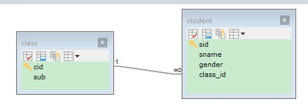

## 1. MySQL 关系模型

### 1.1. 数据库服务器、数据库和表的关系

**一般在实际开发中，一个项目就对应一个数据库**。

所谓数据库服务器，是指在机器上装了一个数据库管理程序，这个管理程序可以管理多个数据库，一般开发人员会针对每一个应用创建一个数据库。为保存应用中实体的数据，一般会在数据库创建多个表，以保存程序中实体的数据。

### 1.2. MySQL 数据库创建顺序与管理

创建的顺序：创建数据库 -> 创建数据表 -> 存储数据

一个数据库包含多个数据表。通过 SQL 语句对数据库(如：MySQL)进行管理。

### 1.3. 数据库中的主要对象

1. 表(Table)：在数据库中存储数据记录的容器，一个表中包含多行数据记录。
2. 视图(View)：是从一个或多个表导出的虚拟表，视图本身并不存储数据。
3. 索引(index)：是对数据库表中一列或多列的值进行排序的一种结构，使用索引可快速访问数据库表中的特定信息，类似于书籍的目录。
4. 存储过程(Procedure)：一组为了完成特定功能的 SQL 语句集，存储在数据库中，经过第一次编译后再次调用不需要再次编译，用户通过指定存储过程的名字并给出参数来执行它。
5. 触发器(Trigger)：触发器是一种特殊类型的存储过程，它在指定的表中的数据发生变化时自动生效。唤醒调用触发器以响应 INSERT、UPDATE 或 DELETE 语句。

### 1.4. 实体类与表的对应关系

1. 整个数据表可以看作为一个类
2. 数据表中的每一列代表具体类一个成员变量
3. 数据表的一行称之为一条纪录，对应一个类的对象

## 2. SQL 语言

SQL，全称 Structured Query Language，是结构化查询语言，用于一种访问和处理数据库的标准的计算机语言。是一套操作关系型数据库的统一标准

- 作用：用于存取数据、查询、更新和管理关系数据库系统。
- 关系型数据库：使用表格存储数据的数据库

### 2.1. SQL 特点

- 具有综合统一性，不同数据库的支持的 SQL 稍有不同
- 非过程化语言
- 语言简捷，用户容易接受
- 以一种语法结构提供两种使用方式

### 2.2. SQL 语法特点

- SQL 对关键字的大小写不敏感，但关键字建议使用大写
- SQL 语句可以以单行或者多行书写，以分号结束
- SQL 语句可以使用空格/缩进来增强语句的可读性

### 2.3. SQL 和数据库管理系统的关系

SQL 是一种用于操作数据库的语言，SQL 适用于所有关系型数据库。

MySQL、Oracle、SQLServer 是一个数据库软件，这些数据库软件支持标准 SQL，也就是通过 SQL 语言可以操作这些数据库软件，不过每一个数据库系统会在标准 SQL 的基础上扩展自己的 SQL 语法。大部分的 NoSQL 数据库有自己的操作语言，对S QL 支持的并不好。

### 2.4. SQL 语言的分类

SQL语句，根据其功能，主要分为四类：DDL、DML、DQL、DCL。

| 分类（简称） |            全称             |                      说明                      |
| ---------- | -------------------------- | --------------------------------------------- |
| DDL        | Data Definition Language   | 数据定义语言，用来定义数据库对象(数据库，表，字段)    |
| DML        | Data Manipulation Language | 数据操作语言，用来对数据库表中的数据进行增删改        |
| DQL        | Data Query Language        | 数据查询语言，用来查询数据库中表的记录               |
| DCL        | Data Control Language      | 数据控制语言，用来创建数据库用户、控制数据库的访问权限 |

#### 2.4.1. 数据定义语言：简称DDL(Data Definition Language)

- 用来创建，修改，删除数据库中的各种对象：数据库，表，列等。
- 【关键字】创建：`create`，更改：`alter`，移除：`drop`等

#### 2.4.2. 数据操作语言：简称DML(Data Manipulation Language)

- 用来修改、删除、添加数据的语句。
- 【关键字】插入：`insert`、删除：`delete`、更新：`update`

#### 2.4.3. 数据控制语言：简称DCL(Data Control Language)

- 用来创建用户，分配用户权限、删除用户的语句，数据库的访问权限和安全级别。
- 【包含两条命令】`grant`：授权；`revoke`：撒回

#### 2.4.4. 数据查询语言：简称DQL(Data Query Language)

- 用来执行查询操作的语句。
- 【关键字】`select`，`show`，`from`，`where`等

### 2.5. MySQL 的 SQL 语句三种注释

- 单行注释(MySQL特有)，`#` 号后可以不加空格

```sql
# 注释内容
```

- 单行注释（所有数据库共有的），`--` 符号后必须加一个空格

```sql
-- 注释内容
```

- 多行注释

```sql
/*
  多行注释内容
*/
```

## 3. MySQL 中的数据类型

MySQL 中的数据类型有很多，主要分为三类：数值类型、字符串类型、日期时间类型。详细的数据类型如下(红色字体为常用数据类型)

### 3.1. 数值类型

|       类型        | 大小(byte) |                                                          说明                                                           |
| :--------------: | :--------: | ---------------------------------------------------------------------------------------------------------------------- |
|    `TINYINT`     |     1      | <font color=red>很小的整数型，默认长度4</font>                                                                             |
|    `SMALLINT`    |     2      | 小的整型，默认长度6                                                                                                       |
|   `MEDIUMINT`    |     3      | 中等大小的整数，默认长度9                                                                                                  |
| `INT`或`INTEGER` |     4      | <font color=red>普通大小的整数（占4字节），默认长度11</font>                                                                 |
|     `BIGINT`     |     8      | 占用的8个字节，默认长度20                                                                                                  |
|   `FLOAT(m,d)`   |     4      | 单精度浮点型小数                                                                                                          |
|  `DOUBLE(m,d)`   |     8      | <font color=red>双精度浮点型小数 d代表小数位数，m代表总位数 (整数位=m-d);</font><br/>比如：DOUBLE(5.2)， 数值共5位，其中小数为2位。 |
|  `DECIMAL(m,d)`  |            | <font color=red>压缩严格的定点数，取值范围与double相同，但有效取值范围由M(精度)与D(标度)决定</font>                               |

> Tips: 当字段用记录年龄时，因为不会存在负数与数值的范围不会太大，可以设置为 `age tinyint unsigned`

### 3.2. 字符串类型

|      类型       | 大小(byte) |                                说明                                |
| :------------: | :--------: | ------------------------------------------------------------------ |
|   `CHAR(M)`    |   0-255    | `CHAR(x)`，定长的字符串。**性能较好**                                 |
|  `VARCHAR(M)`  |  0-65535   | <font color=red>可变长的字符串，注意数据不能超过X位数</font>**性能较差** |
|   `TINYBLOB`   |   0-255    | 不超过 255 个字符的二进制字符串                                        |
|     `BLOB`     |  0-65535   | <font color=red>二进制形式的长文本数据。（图片、视频、音频）</font>       |
|  `MEDIUMBLOB`  |   0-16M    | 二进制形式的中等长度文本数据                                           |
|   `LONGBLOB`   |    0-4G    | 二进制形式的长文本数据                                                |
|   `TINYTEXT`   |   0-255    | 短文本字符串                                                         |
|     `TEXT`     |  0-65535   | 长文本数据                                                          |
|  `MEDIUMTEXT`  |   0-16M    | 中等长度文本数据                                                     |
|   `LONGTEXT`   |    0-4G    | 极大文本数据                                                         |
| `VARBINARY(M)` |            | 允许长度0~M个字节的变长字节字符串                                       |
|  `BINARY(M)`   |            | 允许长度0~M个字节的定长字节字符串                                       |

### 3.3. 日期类型

|     类型     | 大小(byte) |                      范围                       |         格式         |                       说明                        |
| :---------: | :--------: | ---------------------------------------------- | ------------------- | ------------------------------------------------ |
|   `YEAR`    |     1      | 1901~2155                                      | YYYY                | 年份值                                            |
|   `TIME`    |     3      | -838:59:59~838:59:59                           | HH:MM:SS            | 时间值或持续时间                                    |
|   `DATE`    |     3      | 1000-01-01~9999-12-31                          | YYYY-MM-DD          | <font color=red>日期值(只有年月日，没有时分秒)</font> |
| `DATETIME`  |     8      | 1000-01-01 00:00:00~ 9999-12-31 23:59:59       | YYYY-MM-DD HH:MM:SS | <font color=red>混合日期和时间值</font>             |
| `TIMESTAMP` |     4      | 1970~01~01 00:00:01 UTC~2038-01-19 03:14:07UTC | YYYYMMDD HHMMSS     | <font color=red>混合日期和时间值，时间戳</font>       |

> Notes: 尽量使用 timestamp，空间效率高于 datetime，用整数保存时间戳通常不方便处理。若需要存储微秒，可以使用 bigint 存储。其中 `DATETIME` 类型与时区无关；`TIMESTAMP` 显示依赖于所指定得时区，默认在第一个列行的数据修改时可以自动得修改

### 3.4. 数据类型总结

#### 3.4.1. 数据类型相关注意事项

1. `char`、`varchar` 和 `text` 等字符串类型都可以存储路径，但使用 `\` 会被过滤，所以路径中用 `/` 或 `\\` 来代替，MySQL 就会不会自动过滤路径的分隔字符，完整的表示路径。
2. 一般情况下，数据库中不直接存储图片和音频文件，而是存储图片与文件的路径。如果存储文件，则选择 `blob` 类型。
3. MySQL 中 `int(10)` 中的 10 表示的是显示数据的长度；`char(10)` 的 10 表示的是存储数据的长度。

#### 3.4.2. 字段类型优先级选择

优先考虑数字类型，其次是日期或者二进制类型，最后是字符串类型，同级别得数据类型，应该优先选择占用空间小的数据类型

```
整形 > date,time > enum,char > varchar > blob,text
```

#### 3.4.3. char 和 vachar 的区别

`char` 与 `varchar` 都可以描述字符串，两者主要有以下区别：

- char 最大长度是 255 字符；varchar 最大长度是 65535 个字节。
- char 是定长字符串，指定长度多长，就占用多少个字符，和字段值的长度无关，不足的部分用隐藏空格填充；varchar 是变长字符串，指定的长度为最大占用长度。
- 相对而言，char 会浪费空间；varchar 会更加节省空间。
- 对于查找效率而言，char 的查找效率会更高些；varchar 查找效率会更低。因此 varchar 需要计算内容占用的长度，而 char 不需要，所以char 的效率稍高一些。

总结：`char` 的性能会更高些。当存储的字符串长度是固定时，优先选择 `char` 类型。

#### 3.4.4. BLOB 和 TEXT 的区别

- BLOB 类型是一个二进制对象，可以容纳可变数量的数据；
- TEXT 类型是一个不区分大小写的 BLOB 类型。

两种类型之间的主要的区别是：**BLOB 值进行排序和比较时区分大小写；对 TEXT 值不区分大小写**。

### 3.5. 关于 Null 类型的特别说明

MySQL 对 null 值的处理，有以下三种：

1. NULL 值代表一个未确定的值，每个 null 都是独一无二。MySQL 认为任何和 NULL 值做比较的表达式的值都为 NULL，包括 `select null = null;` 和 `select null != null;`

```sql
mysql> select null = null;
+-------------+
| null = null |
+-------------+
| NULL        |
+-------------+

mysql> select null != null;
+--------------+
| null != null |
+--------------+
| NULL         |
+--------------+
```

2. NULL 值在业务上就是代表没有，所有的 NULL 值和起来算一份
3. NULL 完全没有意义，所以在统计数量不会将其算进去

> 假设一个表中某个列 c1 的记录为(2, 1000, null, null)，在第一种情况下，表中 c1 的记录数为4，第二种表中 c1 的记录数为3，第三种表中 c1 的记录数为2。

MySQL 专门提供了一个 `innodb_stats_method` 的系统变量，专门针对统计索引列不重复值的数量时如何对待 NULL 值。此系统变量有三个候选值：

- `nulls_equal`：认为所有 NULL 值都是相等的。这个值也是 `innodb_stats_method` 的默认值。如果某个索引列中 NULL 值特别多的话，这种统计方式会让优化器认为某个列中平均一个值重复次数特别多，所以倾向于不使用索引进行访问。
- `nulls_unequal`：认为所有 NULL 值都是不相等的。如果某个索引列中 NULL 值特别多的话，这种统计方式会让优化器认为某个列中平均一个值重复次数特别少，所以倾向于使用索引进行访问。
- `nulls_ignored`：直接把 NULL 值忽略掉。

> 详见官网：https://dev.mysql.com/doc/refman/5.7/en/innodb-parameters.html#sysvar_innodb_stats_method
>
> 有迹象表明，在 MySQL5.7.22 以后的版本，对这个`innodb_stats_method`的修改不起作用，MySQL 把这个值在代码里写死为`nulls_equal`。也就是说 MySQL在进行索引列的数据统计行为又把 null 视为第二种情况（NULL 值在业务上就是代表没有，所有的 NULL 值和起来算一份），MySQL 对 Null 值的处理比较飘忽。所以总的来说，对于列的声明尽可能的不要允许为null。

## 4. MySQL 数据库的管理（DDL）

### 4.1. 查看数据库

查看所有数据库信息，分号结束。

```sql
show databases;
```

### 4.2. 查看正在使用的数据库

查看正在使用的数据库(这个命令一般在DOS下操作才需要使用)

```sql
select database();
```

### 4.3. 查看数据库定义

查看某个数据库在定义时的信息

```sql
show create database 数据库名;
```

示例：

```sql
show create database day21_1;
```

### 4.4. 创建数据库

在同一个数据库服务器中，不能创建两个名称相同的数据库，否则将会报错。

#### 4.4.1. 语法

```sql
create database [ if not exists ] 数据库名 [ default charset 字符集 ] [ collate 排序规则 ] ;
```

> Tips: 可以通过 `if not exists` 参数来解决创建两个数据库报错的问题，数据库不存在，则创建该数据库；如果存在，则不创建。

#### 4.4.2. 示例

使用默认的字符集创建数据库。创建数据库，数据库中数据的编码采用的是**安装数据库时指定的默认编码UTF-8**

```sql
create database 数据库名;
```

示例：

```sql
create database db1;
```

使用指定字符创建数据库

```sql
create database 数据库名 default character set 字符集;
```

示例：

```sql
create database db2 default character set utf8;
```

> Tips: <font color=red>**字符集名称是 `utf8` 而不是 `utf-8`**</font>

当指定的名称的数据库不存在时，才创建该数据库

```sql
CREATE DATABASE IF NOT EXISTS 数据库名;
```

#### 4.4.3. 使用图形化客户端创建


创建数据库时，填写数据库名、选择字符集、排序规则即可。建议字符集选择 `utf8mb4`、排序规则选择 `utf8mb4_general_ci`，因为一些特殊字符（如微信表情等）需要此字符集才能存储

### 4.5. 删除数据库

删除指定的数据库

```sql
drop database [ if exists ] 数据库名;
```

> Tips: 如果删除一个不存在的数据库，将会报错。此时，可以加上参数 `if exists`，如果数据库存在，再执行删除，否则不执行删除。<font color=red>**值得注意的是，删除没有确认信息，做删除处理时需要小心**</font>

示例：

```sql
drop database mydb;
```

### 4.6. 修改数据库默认字符集

修改数据库默认字符集

```sql
alter database 数据库名 default character set 字符集;
```

### 4.7. 切换 (选择要操作的) 数据库

要操作某一个数据库下的表时，需要通过以下指令，切换到指定的数据库，否则是不能操作的。

```sql
use 数据库名称;
```

### 4.8. 字符集与排序规则的选择

#### 4.8.1. Mysql 中的字符集

在 MySQL 中，常用的字符集有 UTF8、UTF8MB4、UTF16、UTF32 等

Unicode（统一码、万国码、单一码）是计算机科学领域里的一项业界标准，包括字符集、编码方案等。Unicode 是为了解决传统的字符编码方案的局限而产生的，它为每种语言中的每个字符设定了统一并且唯一的二进制编码，以满足跨语言、跨平台进行文本转换、处理的要求。UTF8、UTF16、UTF32 是 Unicode码 一种实现形式，都是属于 Unicode 编码。

UTF8 和 UTF8MB4 是常用的两种字符集，根据业务情况而决定选那种类型。UTF8MB4 兼容 UTF8，比 UTF8 能表示更多的字符。一般情况下 UTF8 就满足需求，如果考虑到以后扩展，比如考虑到以后存储 emoji 表情，则选择 UTF8MB4，否则只是浪费空间。个人建议还是选择 UTF8MB4

#### 4.8.2. 排序规则

UTF8MB4 常用的排序规则：utf8mb4_unicode_ci、utf8mb4_general_ci、utf8mb4_bin

**从准确性的角度比较**

- utf8mb4_unicode_ci 是基于标准的 Unicode 来排序和比较，能够在各种语言之间精确排序，不区分大小写
- utf8mb4_general_ci 没有实现 Unicode 排序规则，在遇到某些特殊语言或者字符集，排序结果可能不一致，不区分大小写

**从性能的角度比较**

- utf8mb4_general_ci 在比较和排序的时候更快
- utf8mb4_unicode_ci 在特殊情况下，Unicode 排序规则为了能够处理特殊字符的情况，实现了略微复杂的排序算法。相比选择哪一种 collation，使用者更应该关心字符集与排序规则在db里需要统一。
- utf8mb4_bin 将字符串每个字符用二进制数据编译存储，区分大小写，而且可以存二进制的内容。

> Tips: 总而言之，utf8mb4_general_ci 和 utf8mb4_unicode_ci 是最常使用的排序规则。utf8mb4_general_ci 校对速度快，但准确度稍差；utf8_unicode_ci 准确度高，但校对速度稍慢。两者都不区分大小写，选择那种类型按具体情况而定

#### 4.8.3. 校对规则（了解）

- character set：指定数据库默认的字符集
- collate：校对规则

**什么是校对规则(比较和排序规则)？**

它是一组规则，负责决定某一字符集下的字符进行比较和排序的结果。如：a,B,c,D，如果使用 utf-8 的编码，按照普通的字母顺序，而且不区分大小写。如果想使用字母的二进制比较和排序，则可以修改它的校对规则。

> - utf8_general_ci：按照普通的字母顺序，而且不区分大小写（比如：a B c D）
> - utf8_bin：按照二进制排序（比如：A 排在 a 前面，B D a c）

**查看字符集和校对规则:**

> 注意：SQL 语句中的字符串一般都是单引号括起。
>
> - `show character set;`
> - `show collation like 'utf8\_%';` -- 显示所有 utf-8
> - `show collation like 'gbk%';` -- 显示所有 GBK

指定数据库的默认字符集为 gbk 和校对规则 gbk_chinese_ci。例如：

```sql
create database db4 default character set gbk collate gbk_chinese_ci;
```

## 5. MySQL 表的管理（DDL）

### 5.1. 查看表结构

#### 5.1.1. 查看数据库所有表格清单

查看当前数据库中的所有表，显示表格的清单

```sql
show tables;
```

例如：切换到 sys 这个系统数据库，并查看系统数据库中的所有表结构。


#### 5.1.2. 查看指定表的建表语句

以sql格式返回，查看指定表格的建表语句。而有部分参数在创建表的时候，并未指定也会查询到，因为这部分是数据库的默认值，如：存储引擎、字符集等。

```sql
show create table 表名;
```


#### 5.1.3. 查看指定表的结构

以表格格式返回，查看指定表格的结构。可以查看到表的字段，字段的类型、是否可以为NULL，是否存在默认值等信息。

```sql
desc 表名;
```


#### 5.1.4. 查询当前数据库的所有表

查询当前数据库下所有表的状态与信息，包括表的引擎（Enginez）

```sql
show table status from 查询的数据库名称;
```

### 5.2. 创建表

**创建表完整语法格式：**

```sql
CREATE [TEMPORARY] TABLE [IF NOT EXISTS] tbl_name (
	字段名 数据类型(长度) [完整性约束条件],
	……………
	列名n 数据类型(长度) 约束
	[UNIQUE | FULLTEXT | SPATIAL] INDEX | KEY [索引名](字段名1 [(长度)] [ASC | DESC])
);
-- 注：最后一个定义属性后不能有“,”

-- ************************
UNIQUE：可选。表示索引为唯一性索引。
FULLTEXT；可选。表示索引为全文索引。
SPATIAL：可选。表示索引为空间索引。	如果不指定索引类型，则为普通索引
INDEX和KEY：用于指定字段为索引，两者选择其中之一就可以了，作用是一样的。
索引名：可选。给创建的索引取一个新名称。
字段名1：指定索引对应的字段的名称，该字段必须是前面定义好的字段。
长度：可选。指索引的长度，必须是字符串类型才可以使用。
ASC：可选。表示升序排列。
DESC：可选。表示降序排列。
```

示例：

```sql
-- 创建分类表
CREATE TABLE sort (
	sid INT,            -- 分类ID
	sname VARCHAR(100)  -- 分类名称
);
```

**关于整型长度的说明**

如果在建表时不指定字段 `int` 类型的长度时，系统则默认生成长度为 11 的字段。11 也是 `int` 类型的最大长度，其中第一位表示符号+或者-，后面十位表示数字。 如果指定了长度，该字段其实也是长度为 11 的字段，因为只要是 `int` 类型，系统都分配了长度 11 位。**在插入数据时，只要不超出`int`类型的最大范围即可**

> 注意事项：
>
> 1. 创建表之前，都需要先使用 `use 数据库名` 指定数据库
> 2. 创建表，可以将表名写成 `数据库名.表名`，这样就指定了在哪个数据库下创建表

### 5.3. 复制表

创建一个新表，复制旧表的结构(**没有内容，只有表结构**)

```sql
create table 新表名 like 旧表名;
```

<font color="purple">使用子查询可以复制整个表</font>

```sql
create table 新表名 as (select * from 要复制的表名);
```

### 5.4. 删除表

删除一个或者多个表格，语法：

```sql
DROP TABLE [ IF EXISTS ] 表名1, 表名2, 表名3, ……;
```

可选项 `IF EXISTS` 表示只有表名存在时才会删除该表，表名不存在，则不执行删除操作（**如果不加该参数项，删除一张不存在的表，执行将会报错**）。

示例：

```sql
-- 删除一个表格
drop table sort;

-- 删除多个表格，用逗号分隔可以删除多张表
drop table s1, s2, s3;

-- 如果tb_user表存在，则删除tb_user表
DROP TABLE IF EXISTS tb_user;
```

### 5.5. 修改表结构

#### 5.5.1. 添加字段 add

给指定的表添加一个或多个字段的语法：

```sql
ALTER TABLE 表名 ADD 字段名1 数据类型(长度) [ COMMENT 注释 ] [ 约束 ], ADD 字段名2 数据类型(长度) [ COMMENT 注释 ] [ 约束 ], ……;
```

示例：

```sql
-- 给指定表格添加一个字段
alter table student add gender varchar(2);

-- 给指定表格添加多个字段，每个字段都需要有add
alter table student add a int, add b int;

-- 为emp表增加一个新的字段“昵称”为nickname，类型为varchar(20)
ALTER TABLE emp ADD nickname varchar(20) COMMENT '昵称';
```

#### 5.5.2. 修改字段的类型(长度)或约束 modify

修改指定表格中的指定字段的类型(长度)或约束，语法：

```sql
ALTER TABLE 表名 MODIFY 字段名 修改后的类型(长度) 约束;
```

示例：

```sql
-- 修改字段长度
atler table student modify gender varchar(2);

-- 修改字段约束
ALTER TABLE sort MODIFY sname VARCHAR(50) NOT NULL;
```

> Notes: 修改字段是覆盖操作，如果字段原来有一些COMMENT、约束等等，修改时只指定字段的类型，那么COMMENT、约束等会信息会丢失。

#### 5.5.3. 修改字段名称 change

将指定表格中的旧字段名改成新字段名，类型(长度)与约束也是可以同步修改。语法：

```sql
ALTER TABLE 表名 CHANGE 旧字段名 新字段名 类型(长度) [ COMMENT 注释 ] [ 约束 ];
```

示例：

```sql
alter table student change gender sex varchar(2);

-- 将emp表的nickname字段修改为username，类型为varchar(30)
ALTER TABLE emp CHANGE nickname username varchar(30) COMMENT '昵称';
```

#### 5.5.4. 删除字段 drop

删除指定表中的字段。**可以多个，每个字段前都要加 `drop` 关键字**）

```sql
ALTER TABLE 表名 DROP 字段名1, DROP 字段名2, ……;
```

示例

```sql
alter table student drop a, drop b;
```

#### 5.5.5. 修改表名 rename

将指定的表格名称修改成新表格名称。有两种语法格式：

```sql
-- 格式1:
ALTER TABLE 旧表名 RENAME [ TO ] 新表名;

-- 格式2:
RENAME TABLE 旧表名 TO 新表名;
```

示例：

```sql
alter table student rename stu;

rename table sutdent to stu;
```

#### 5.5.6. 修改表的字符集

修改指定表格的字符集

```sql
ALTER TABLE 表名 CHARACTER SET 新字符集;
```

示例： 

```sql
alter table student character set gbk;
```

#### 5.5.7. 表建立索引

给指定的表建立索引

```sql
alter table 表名 add index(字段名);
```

## 6. MySQL 数据的管理与操作 （DML）

DML 英文全称是 Data Manipulation Language(数据操作语言)，用来对数据库中表的数据记录进行增、删、改操作。

- 添加数据（`INSERT`）
- 修改数据（`UPDATE`）
- 删除数据（`DELETE`）

### 6.1. 插入数据 insert

#### 6.1.1. INSERT INTO 基础插入

- 向表中插入一条数据（可以多条），指定所有列的值，语法：

```sql
INSERT [INTO] 表名 VALUES (值1, 值2, 值3 ……), (值1, 值2, 值3 ……), (值1, 值2, 值3 ……)……;
```

- 向表中插入一条数据（可以多条），指定部分列的值，语法：

```sql
INSERT [INTO] 表 (列名1, 列名2, 列名3..) VALUES (值1, 值2, 值3..), (值1, 值2, 值3..),……;
```

示例：

```sql
-- 向 student 表中插入所有列
INSERT INTO student VALUES(1, 'NewBoy', 20, '广州人', '男');

-- 向表中插入某些列，也可以一次插入多个列
INSERT INTO student(id,NAME,age,remark) VALUES(3,'jacky',27,'佛山人');
```

**注意事项：**

- 语句中的 `INTO` 可以省略
- 可以一次向表中插多个所有列，每行数据使用逗号分隔
- **插入的数据时，列名和值的顺序、数量、数据类型要保持一致**。在 `values` 中列出的数据位置必须与被加入的列的排列位置相对应。
- 数据的大小应在列的规定范围内，例如：不能将一个长度为 80 的字符串加入到长度为 40 的列中。
- **字符和日期型数据应包含在单引号中。双引号也可以但不推荐**。
- 不指定列或使用 `null`，表示插入空值。

#### 6.1.2. INSERT INTO SELECT 语句

将一张表的数据导入到另一张表中，可以使用 `INSERT INTO SELECT` 语句。语法：

```sql
insert into Table2(field1,field2,…) select value1,value2,… from Table1;

-- 或者
insert into Table2 select * from Table1;
```

> 注：上述语法要求保证目标表`Table2`必须存在。

#### 6.1.3. INSERT ... ON DUPLICATE KEY 数据存在时更新操作，不存在时进行插入操作

`INSERT ... ON DUPLICATE KEY UPDATE`这个语法的目的是为了解决重复性，当数据库中存在某个记录时，执行这条语句会更新它，而不存在这条记录时，会插入它。

相当于先判断一条记录是否存在，存在则`update`，否则`insert`。其全语法是：

```sql
INSERT INTO tablename ( field1, field2, field3,...)
VALUES
	( value1, value2, value3,...)
ON DUPLICATE KEY UPDATE field1 = value1,
	field2 = value2,
	field3 = value3,
	...;
```

*注：tablename是表名，field1，field2，field3等是字段名称，value1，value2，value3等是字段值。*

- 问题：这条语句判断该条记录是否存在的标准是什么？
- 规则：*如果你插入的记录导致一个UNIQUE索引或者primary key(主键)出现重复，那么就会认为该条记录存在，则执行update语句而不是insert语句，反之，则执行insert语句而不是更新语句。所以`ON DUPLICATE KEY UPDATE`是不能写where条件的*

特别需要注意的是：**如果行作为新记录被插入，则受影响行的值为1；如果原有的记录被更新，则受影响行的值为2，如果更新的数据和已有的数据一模一样，则受影响的行数是0，这意味着不会去更新，也就是说即使插入的表有的时间戳是自动记录最后一次的更新时间，这个时间戳也不会变动。**

例：

```sql
CREATE TABLE `t_stock_chg` (
	`f_market` varchar(64) NOT NULL COMMENT '市场',
	`f_stockID` varchar(10) NOT NULL DEFAULT '' COMMENT '股票代码',
	`f_updatetime` timestamp NOT NULL DEFAULT CURRENT_TIMESTAMP ON UPDATE CURRENT_TIMESTAMP COMMENT '插入时间戳',
	`f_name` varchar(16) DEFAULT NULL COMMENT '股票名称',
	PRIMARY KEY (`f_market`,`f_stockID`)
) ENGINE=InnoDB DEFAULT CHARSET=utf8
```

*注：这里的字段f_updatetime每次在更新数据时会自动更新，但是如果记录中存在某条数据，后来又更新它，而更新的数据和原数据一模一样，那么这个字段也不会更新，仍然是上一次的时间。此时`INSERT ... ON DUPLICATE KEY UPDATE`影响行数是0*。

#### 6.1.4. replace into 插入数据

`replace into` 跟 `insert` 功能类似，不同点在于：`replace into`首先尝试插入数据到表中

1. 如果发现表中已经有此行数据（根据主键或者唯一索引判断）则先删除此行数据，然后插入新的数据。
2. 如果表中没有此行数据，直接插入新数据。

要注意的是：**插入数据的表必须有主键或者是唯一索引！**否则的话，`replace into`会直接插入数据，这将导致表中出现重复的数据。

MySQL replace into 有三种形式：

1. `replace into tbl_name(col_name, ...) values(...)`
	- 第一种形式类似于insert into的用法
2. `replace into tbl_name(col_name, ...) select ...`
	- 第二种replace select的用法也类似于insert select，这种用法并不一定要求列名匹配，事实上，MYSQL甚至不关心select返回的列名，它需要的是列的位置。例如，`replace into tb1(name, title, mood) select rname, rtitle, rmood from tb2;`
	- 这个例子使用replace into从tb2中将所有数据导入tb1中
3. `replace into tbl_name set col_name=value, ...`
	- 第三种replace set用法类似于update set用法，使用一个例如“`SET col_name = col_name + 1`”的赋值，则对位于右侧的列名称的引用会被作为`DEFAULT(col_name)`处理。因此，该赋值相当于`SET col_name = DEFAULT(col_name) + 1`。

前两种形式用的多些。其中“into”关键字可以省略，不过最好加上“into”，这样意思更加直观。另外，对于那些没有给予值的列，MySQL将自动为这些列赋上默认值。

#### 6.1.5. insert ignore into 插入数据

`INSERT IGNORE` 与 `INSERT INTO` 的区别就是`INSERT IGNORE`会忽略数据库中已经存在的数据，如果数据库没有数据，就插入新的数据；如果有数据的话就跳过这条数据（即执行这条插入语句时不会报错，只有警告，数据实际没有插入）。这样就可以保留数据库中已经存在数据，达到在间隙中插入数据的目的。

例子

```sql
-- 先执行INSERT INTO，执行成功
INSERT INTO test(id, NAME, age) VALUES (1, 'aa', 18);
-- 再次执行该语句，肯定会报错。如下：
-- 查询：insert into test(id, name, age) values (1, 'aa', 18)
-- 错误代码： 1062
-- Duplicate entry '1' for key 'PRIMARY'

-- 执行INSERT IGNORE
INSERT IGNORE INTO test(id, NAME, age) VALUES (1, 'aa', 18);
-- 结果并没有报错，只是给出一个警告：
-- 查询：INSERT ignore INTO test(id, NAME, age) VALUES (1, 'aa', 18)
-- 共 0 行受到影响， 1 个警告

-- 换个主键id，重新执行INSERT IGNORE语句，执行成功：
INSERT IGNORE INTO test(id, NAME, age) VALUES (2, 'aa', 18);
```

*结论：执行INSERT时，如果不想报错(语法错误除外)，就用INSERT IGNORE，其它情况两者一样*

### 6.2. 修改数据 update

- 更新所有行的数据（**谨慎使用**），语法

```sql
update 表名 set 列名1=值, 列名2=值,……;
```

- 根据条件修改符合某些条件的一（多）个列数据，语法：

```sql
update 表名 set 列名1=值,列名2=值,…… [ WHERE 条件 ] ;
```

**语法的关键字：**

- `UPDATE`：语法可以用新值更新原有表行中的各列。
- `SET`：子句指示要修改哪些列和要给予哪些值。
- `WHERE`：子句指定应更新哪些行。如没有 `WHERE` 子句，则更新所有的行

示例：

```sql
-- 更新所有行数据
UPDATE student SET gender='男';

-- 修改id为2的行数据
UPDATE student SET age=28,remark='韶关人' WHERE id=2;
```

### 6.3. 删除数据 delete/truncate

#### 6.3.1. 删除数据 delete

- 删除表的所有记录，相当清空表的内容

```sql
DELETE FROM 表名;
```

- 删除部分符合条件的行数据

```sql
DELETE FROM 表名 [ WHERE 条件 ] ;
```

示例：

```sql
-- 删除整表
delete from student;

-- 删除id为3的记录
delete from student where id=3;
```

**注意事项：**

1. 自增长约束：**只删除表中的数据，不会影响表中的自增长约束，即 `auto_increment` 的字段还会在原来基础上增加**
2. 使用 `delete` 删除的数据，通过事务是可以回滚。
3. 使用 `where` 子句准备指定删除内容。**正常情况下，严禁执行不带`where`条件的删除语句**
4. 删除语句不能使用别名，如：`delete from student s where s.id=3;`会报语法错误。如果使用别名，正确的语法是：`delete s from student s where s.id=3;`

#### 6.3.2. 删除所有数据 truncate

删除表的所有数据，与 `delete` 删除操作的区别是，`truncate` 相当于先 `drop` 删除原表后，再重新创建一个表，后面不能带条件(`where/having`)

```sql
truncate [table] 表名;
```

示例：

```sql
truncate table student;
```

**注意事项：**

1. **既能删除表的数据，也能够把表的自增长约束重置为0**
2. 使用 `truncate` 删除的数据，不能进行回滚！
3. 语句后面不能带条件
4. 语句中的 `table` 关键字可以省略

#### 6.3.3. delete、truncate、drop 的区别？

- `delete`：删除所有数据时，不会影响自增长的值；可以通过事务回滚数据。
- `truncate`：属于 DDL 语句（数据定义语言），执行后会自动提交，不可以通过事务回滚数据；删除数据时，先直接`drop`表，然后新建一张表，自增长的值从默认值开始。
- `drop`：属于 DDL 语句（数据定义语言），执行后会自动提交；会删除表的结构被依赖的约束、触发器、索引。

> 一般来说，执行速度: `drop > truncate > delete`

## 7. MySQL 数据查询（DQL）

DQL 英文全称是 Data Query Language(数据查询语言)，数据查询语言，用来查询数据库中表的记录。查询关键字: `SELECT`

数据库管理系统一个重要功能就是数据查询，数据查询不应只是简单返回数据库中存储的数据，还应该根据需要对数据进行筛选以及确定数据以什么样的格式显示。

在一个正常的业务系统中，查询操作的频次是要远高于增删改等操作，而且在查询的过程中，可能还会涉及到条件、排序、分页等操作

### 7.1. 查询语法格式

mysql 查询数据有两种方式

#### 7.1.1. SELECT 语法

语法格式如下：

```sql
SELECT [all|distinct] |top 数字[percent]
    [ALL | DISTINCT | DISTINCTROW ]
    
	字段 as 常量 | 包含字段表达式 | 函数(如：sum, max) | 常量
FROM
	表或结果集
WHERE
	条件： 逻辑|空值|多条件|模糊|范围
GROUP BY
	字段
HAVING
	筛选条件
ORDER BY
	字段 ASC | DESC
LIMIT
    开始索引, 每页大小
```

**sql的执行顺序：`from -> where -> group by -> having -> select -> order by`**

#### 7.1.2. SELECT INTO 语法

`select into` 通常用来把旧表数据插入到新表中，请求格式如下:

```sql
SELECT
	字段等
INTO
    表名
FROM
	数据源
	其他子句
```

### 7.2. 查询数据 select

#### 7.2.1. 查询所有列

```sql
SELECT * FROM 表名;
```

> <font color=red>**Tips: `*` 号代表查询所有字段，在实际开发中尽量少用（不直观、影响效率）。**</font>

示例：

```sql
-- 查询 student 表所有数据
SELECT * FROM student;
```

#### 7.2.2. 查询指定列

```sql
SELECT 列名1, 列名2, ……… FROM 表名;
```

示例：

```sql
-- 查询 student 表的 NAME、gender 列
SELECT NAME,gender FROM student;
```

#### 7.2.3. 查询时指定列的别名

```sql
SELECT 列名1 AS 别名1, 列名2 AS 别名2,…… FROM 表名;
```

> Tips: `AS` 关键字可以省略

示例：

```sql
SELECT NAME AS '姓名',gender AS '性别' FROM student;

-- AS 可以省略
SELECT NAME '姓名',gender '性别' FROM student;
```

#### 7.2.4. 合并列查询

查询时可以对数值类型的列进行合并运算，并将结果新增一列。

```sql
select *,(数值类型的列名1+数值类型的列名2+……) as 别名 from 表名;
```

> 注意事项：
>
> - 合并列必须是数值类型
> - 合并非数值类型是没有意义，合并后也是输出数据类型的值

```sql
SELECT *, (math+english) '总成绩' FROM student;
-- 合并非数值类型
SELECT *, (math+NAME) '总成绩' FROM student;

-- 查询所有员工的薪资,年薪,以及姓名，也可以选择列后直接进行算术运算
SELECT uname,salary,(salary*12) AS '年薪' FROM users;
```

#### 7.2.5. 查询时添加常量列

使用`''`单引号包裹的内容会当成常量列，在查询时新增一列到原表。语法如下：

```sql
select *,'添加的内容' as 别名 from 表名;
```

示例：

```sql
SELECT *, 'JavaEE 就业班' AS '班级' FROM student;
```

```shell
+----+------+------+------+---------+--------+
| ID | NAME | AGE  | MATH | ENGLISH |  班级   |
+----+------+------+------+---------+--------+
| 1  | 张三  | 17   | 88   |  98     | JavaEE |
+----+------+------+------+---------+--------+
| 2  | 李四  | 19   | 99   |  86     | JavaEE |
+----+------+------+------+---------+--------+
| 2  | jack | 30   | 78   |  83     | JavaEE |
+----+------+------+------+---------+--------+
```

#### 7.2.6. 去除重复数据

查询时使用 `DISTINCT` 关键字可以去除重复数据。

- 根据某一列的内容去掉重复的值，只保留其中一个内容

```sql
select distinct 列名 from 表名;
```

示例：

```sql
SELECT DISTINCT address FROM student;
```

- 根据多列的内容去掉重复的值，要多个列的内容同时一致才去掉。

```sql
select distinct 列名1,列名2,…… from 表名;
```

示例：

```sql
SELECT DISTINCT(address) FROM student;
```

### 7.3. 条件查询 where

#### 7.3.1. 基础语法

where语句表条件过滤。满足条件操作，不满足不操作，多用于数据的查询与修改。

```sql
SELECT 字段列表 FROM 表名 WHERE 条件;
```

#### 7.3.2. MySQL支持4种运算符

- 算术运算符
- 比较运算符
- 逻辑运算符
- 位运算符

#### 7.3.3. 算术运算符

|  算术运算符   |       说明       |
| :----------: | ---------------- |
|     `+`      | 加法运算          |
|     `-`      | 减法运算          |
|     `*`      | 乘法运算          |
| `/` 或 `DIV` | 除法运算，返回商   |
| `%` 或 `MOD` | 求余运算，返回余数 |

```sql
-- 将每件商品的价格加10
select name,price + 10 as new_price from product;
-- 将所有商品的价格上调10%
select pname,price * 1.1 as new_price from product;
```

#### 7.3.4. 比较运算符

|       比较运算符       |                                            说明                                             |
| :-------------------: | ------------------------------------------------------------------------------------------ |
|          `=`          | 等于                                                                                        |
|     `<`  和  `<=`     | 小于和小于等于                                                                               |
|     `>`  和  `>=`     | 大于和大于等于                                                                               |
|         `<=>`         | 安全的等于，两个操作码均为 NULL 时，其所得值为1；而当一个操作码为NULL时，其所得值为0               |
|      `<>` 或`!=`      | 不等于                                                                                      |
| `IS NULL` 或 `ISNULL` | 判断一个值是否为  NULL                                                                       |
|     `IS NOT NULL`     | 判断一个值是否不为  NULL                                                                     |
|        `LEAST`        | 当有两个或多个参数时，返回最小值                                                               |
|      `GREATEST`       | 当有两个或多个参数时，返回最大值；若比较值中有一个null值，则返回null                              |
|  `BETWEEN .. AND ..`  | 判断一个值是否落在两个值之间，显示在某一区间的值(包头包尾)                                        |
|         `IN`          | 判断一个值是 IN 列表中的任意一个值                                                             |
|       `NOT IN`        | 判断一个值不是 IN 列表中的任意一个值                                                           |
|        `LIKE`         | 通配符匹配。模糊查询，Like语句中有两个通配符：<br/>`%`：用来匹配多个字符<br/> `_`：用来匹配一个字符 |
|       `REGEXP`        | 正则表达式匹配                                                                               |

> **注：mysql中用`<>`与`!=`都是可以的，但sqlserver中不识别`!=`，所以建议用`<>`；但是`!=`在sql2000中用到，则是语法错误，不兼容的**

示例：

```sql
-- 查询 math 字段值在 [80, 88] 区间的记录
SELECT * FROM student WHERE math>=80 AND math<=88;
-- 等价于上面
SELECT * FROM student WHERE math BETWEEN 80 AND 88; -- (包前包后)

-- 使用least求最小值
select least(10, 20, 30); -- 10
select least(10, null , 30); -- 当比较值中有一个null值，则直接返回null

-- 使用greatest求最大值
select greatest(10, 20, 30);
select greatest(10, null, 30); -- 当比较值中有一个null值，则直接返回null
```

##### 7.3.4.1. null 和空字符串的比较运算

**null 和 空字符串的区别：**

- `null`：没有数据。
- 空字符：有数据，数据就是空字符串。

**判断是否为空串**：

- `= ''`: 是空串。（注意：这里不是用`==`）
- `<> ''`: 不是空串

**判断是否为空(`null`)**：

- `is null`：判断是null
- `is not null`：判断不是null

```sql
SELECT * FROM student WHERE address IS NULL;
SELECT * FROM student WHERE address='';
SELECT * FROM student WHERE address IS NULL OR address='';
SELECT * FROM student WHERE address IS NOT NULL AND address<>'';
```

##### 7.3.4.2. 模糊查询：like

相关字符的含义：

- `%`：表示匹配多个任意字符(0到多个)
- `_`：表示匹配一个任意字符

语法：

```sql
select * from 表名 where 列名 like 条件;
```

示例：

```sql
-- 查询姓张的学生
SELECT * FROM student WHERE NAME LIKE '张%';
-- 查询姓名中包含'张'字的学生
SELECT * FROM student WHERE NAME LIKE '%张%';
-- 查询姓张，且姓名只有两个字的学生
SELECT * FROM student WHERE NAME LIKE '张__';
```

##### 7.3.4.3. 模糊查询：in

语法：

```sql
select * from 表名 where 列名 in (条件1,条件2,……);
```

示例：

```sql
SELECT * FROM student WHERE id IN (1,3); -- 这种效率更高
SELECT * FROM student WHERE id=1 OR id=3; -- 等价于上面的sql
```


#### 7.3.5. 逻辑运算符

|    逻辑运算符    |          说明          |
| :-------------: | --------------------- |
| `NOT` 或者 `!`  | 逻辑非，条件不成立      |
| `AND` 或者 `&&` | 逻辑与，多个条件同时成立 |
| `OR` 或者 `||`  | 逻辑或，多个条件任一成立 |
|      `XOR`      | 逻辑异或               |

示例：

```sql
SELECT * FROM student WHERE id=3 AND gender='男';
SELECT * FROM student WHERE id=3 OR gender='男';
```

#### 7.3.6. 位运算符(了解)

| 位运算符 |         说明         |
| :-----: | -------------------- |
|   `|`   | 按位或               |
|   `&`   | 按位与               |
|   `^`   | 按位异或             |
|  `<<`   | 按位左移             |
|  `>>`   | 按位右移             |
|   `~`   | 按位取反，反转所有比特 |

位运算符是在二进制数上进行计算的运算符。位运算会先将操作数变成二进制数，进行位运算。然后再将计算结果从二进制数变回十进制数。

```sql
select 3&5; -- 位与
select 3|5; -- 位或
select 3^5; -- 位异或
select 3>>1; -- 位左移
select 3<<1; -- 位右移
select ~3;   -- 位取反
```

### 7.4. 排序查询 order by

`order by` 语句的作用是根据指定的列内容排序，排序的列可以是表中的列名，也可以是 `select` 语句后指定的列名。

```sql
select
    字段名1，字段名2，……
from 
    表名
order by 
    字段名1 [asc|desc]，字段名2[asc|desc]……
```

**关键字解释**：

- `asc`：顺序（正序：数值：从小到大，字符串：字符 a-z）。不指定时默认`asc`
- `desc`：倒序（正序：数值：从大到小，字符串：字符 z-a）

**排序查询注意事项**：

- **`order by` 子句应位于 `select` 语句的结尾**。`LIMIT` 子句除外
- `order by`用于子句中可以支持单个字段，多个字段，表达式，函数，别名
- **`order by` 后面指定的列名或别名必须存在，否则查询出错。**

示例：

```sql
-- 1.使用价格排序(降序)
select * from product order by price desc;
-- 2.在价格排序(降序)的基础上，以分类排序(降序)
select * from product order by price desc,category_id asc;
-- 3.显示商品的价格(去重复)，并排序(降序)
select distinct price from product order by price desc;
```

#### 7.4.1. 以表中的列名排序

按表中的列名排序，如果不写(`asc`/`desc`)则默认是顺序(`asc`)

```sql
select * from 表名 order by 列名(别名) asc/desc;
```

示例：

```sql
-- 1) 对数学成绩从小到大排序后输出。
SELECT * FROM student ORDER BY math;
-- 2) 对总分按从高到低的顺序输出
SELECT *, (math+english) AS 总分 FROM student ORDER BY 总分 DESC;
```

#### 7.4.2. 以 select 语句后指定的列名排序

按新的列名排序，如果出现 `where` 条件查询，则 `ORDER BY` 子句应位于 `SELECT` 语句的结尾。

```sql
select *,(列名1+列名2+……) as 别名 from 表名 order by 别名 asc/desc;
```

示例：

```sql
-- 3) 姓张的学生成绩从小到大排序输出
SELECT *, (math+english) AS 总分 FROM student WHERE NAME LIKE '张%' ORDER BY 总分;
```

### 7.5. 聚合查询

#### 7.5.1. 定义与语法

聚合函数查询是纵向查询，它是对一列的值进行计算，然后返回一个单一的值。语法：

```sql
select 聚合函数名称(数值列名) from 表名;
```

> Notes: 
>
> - <font color=red>**聚合函数会排除空值(`null`)的数据**</font>。
> - 按聚合函数的结果来查询，列必须是数值列（`COUNT`函数除外），如果不是数值列，则结果为0

#### 7.5.2. 常用的聚合函数

|  聚合函数  |                             作用                              |
| :-------: | ------------------------------------------------------------ |
| `count()` | 统计指定列不为NULL的记录行数；                                  |
|  `sum()`  | 计算指定列的数值和，如果指定列类型不是数值类型，那么计算结果为0     |
|  `max()`  | 计算指定列的最大值，如果指定列是字符串类型，那么使用字符串排序运算； |
|  `min()`  | 计算指定列的最小值，如果指定列是字符串类型，那么使用字符串排序运算； |
|  `avg()`  | 计算指定列的平均值，如果指定列类型不是数值类型，那么计算结果为0     |

#### 7.5.3. 聚合查询示例

```sql
-- 1. 需求： 查询所有学生 english 的总分
SELECT SUM(english) FROM student;
-- 2. 需求： 查询所有学生 english 的平均分
SELECT AVG(english) FROM student;
-- 3. 需求：查询最高的 english 分数
SELECT MAX(english) FROM student;
-- 4. 需求：查询最低的 english 分数
SELECT MIN(english) FROM student;
-- 5. 需求： 一共几个学生
SELECT COUNT(*) FROM student;    -- 推荐使用
SELECT COUNT(id) FROM student;   -- 效率会比 count(*)效率稍高
-- 注意： 聚合函数，如果列的值 为null，会排除 null 值的数据
SELECT COUNT(address) FROM student;

-- 1 查询商品的总条数
select count(*) from product;
-- 2 查询价格大于200商品的总条数
select count(*) from product where price > 200;
-- 3 查询分类为'c001'的所有商品的总和
select sum(price) from product where category_id = 'c001';
-- 4 查询商品的最大价格
select max(price) from product;
-- 5 查询商品的最小价格
select min(price) from product;
-- 6 查询分类为'c002'所有商品的平均价格
select avg(price) from product where category_id = 'c002';
```

#### 7.5.4. 聚合查询对 NULL 值的处理

- `count` 函数对 `null` 值的处理逻辑是，如果`count`函数的参数为星号（`*`），则统计所有记录的个数。而如果参数为某字段，则统计不为`null`值的记录个数。
- `sum` 和 `avg` 函数是忽略 `null` 值的存在，就好象该条记录不存在一样。
- `max` 和 `min` 函数也同样忽略 `null` 值的存在。

### 7.6. 分页查询 limit

#### 7.6.1. 语法

`limit` 关键字，用于分页查询数据。语法：

```sql
-- 方式1: 显示前面指定的n条记录
select * from 表名 limit n;

-- 方式2: 分页显示，从起始索引m开始，查询指定n条的记录
select * from 表名 limit m, n;
```

参数说明：

- `m`：整数，表示从第几条索引开始，
- `n`：整数，表示查询多少条数据

> Notes：
>
> - **起始行数是从 0 开始**，计算公式：`起始索引 = (当前页-1) * 每页显示记录数`
> - **如果分页同时要进行排序，`limit` 语句要放在 `order by` 的后面。**
> - <font color=red>**分页查询是数据库的方言，不同的数据库有不同的实现**</font>，MySQL 中是 `LIMIT`

#### 7.6.2. 分页查询示例

```sql
SELECT * FROM student;
-- 需求： 查询第 1,2 条数据（第 1 页数据）
SELECT * FROM student LIMIT 0,2;
-- 需求： 查询第 3,4 条数据（第 2 页数据）
SELECT * FROM student LIMIT 2,2;
-- 需求： 查询第 5,6 条数据（第 3 页数据）
SELECT * FROM student LIMIT 4,2;
```

#### 7.6.3. 分页计算规律总结

观察分页的开始索引，其实是等差数列。如：`0,2,4`。因此开始索引的计算公式如下：

```
startIndex = (curPage-1)*pageSize
```

参数说明：

- `pageSize`：每页多少条
- `curPage`：当前页
- `startIndex`：查询的起始号

### 7.7. 分组查询 group by

#### 7.7.1. 语法规则

`group by` 关键字可以将查询结果按某个字段或多个字段进行分组。字段中值相等的为一组。语法：

```sql
SELECT 字段1,字段2… FROM 表名 [ WHERE 条件 ] GROUP BY 分组字段名 [HAVING 条件表达式][with rollup];
```

参数说明：

- `GROUP BY 分组字段名`：是指按照该字段的值进行分组。支持多字段分组，如：`group by columnA,columnB`
- `having 条件表达式`：分组后过滤条件，用来限制分组后的显示内容，满足条件表达式的结果将显示
- `with rollup`：关键字将会在所有记录的最后加上一条记录。该记录是上面所有记录的总和

示例：

```sql
-- 在分组查询的同时，统计人数。
SELECT gender,COUNT(*) '人数' FROM student GROUP BY gender;
```

**注：如果两个表关联，使用分组的话。group by 后面需要写上两个表的分组的列名，要以理解为，这样操作可以保持两个表的行数一致。**

```sql
SELECT
	m.courseid, c.`NAME`, round(avg(m.score)) avgscore
FROM
	t_mark m,
	t_course c
WHERE
	m.courseid = c.id
GROUP BY
	m.courseid,
	c.`NAME`
```

#### 7.7.2. 分组条件筛选 (having)

`having` 关键字作用：用来对分组信息进行过滤，用法与`where`一样。但分组之后对统计结果进行筛选的话必须使用 `having`，不能使用 `where`。

`where` 子句用来筛选 `FROM` 子句中指定的操作所产生的行；`group by` 子句用来分组 `WHERE` 子句的输出；`having` 子句用来从分组的结果中筛选行。

```sql
select * from 表名 group by 列名 having 筛选条件;
```

示例：

```sql
SELECT address,COUNT(address) '人数' FROM student GROUP BY address;
SELECT address,COUNT(address) '人数' FROM student GROUP BY address HAVING COUNT(address)>2;

-- 2.统计各个分类商品的个数,且只显示个数大于4的信息
select category_id ,count(*) from product group by category_id having count(*) > 1;
```

#### 7.7.3. where 和 having 的区别

- 执行时机不同：`where` 是分组之前进行过滤，不满足 `where` 条件，不参与分组；而 `having` 是分组之后对结果进行过滤。
- 判断条件不同：`where` 是对行记录进行筛选过滤，`where` 后**不能跟聚合函数**的(如:`count(*)`)；而 `having` 是对组信息进行筛选过滤，`having` 后**可以跟聚合函数**的。(如:`count(*)`)

> Notes: 执行顺序是 where -> 聚合函数 -> having

#### 7.7.4. with rollup 关键字

`with rollup` 关键字的作用是，在查询结果最后加上一条记录，并且该记录是上面所有分组记录的汇总。

```sql
mysql> SELECT sex, COUNT(sex) FROM employee GROUP BY sex WITH ROLLUP;
+------+------------+
| sex  | COUNT(sex) |
+------+------------+
| 女   | 1          |
| 男   | 3          |
| NULL | 4          |
+------+----------- +

mysql> SELECT sex, GROUP_CONCAT(name) FROM employee GROUP BY sex WITH ROLLUP;
+------+--------------------+
| sex  | GROUP_CONCAT(name) |
+------+--------------------+
| 女   | 李四                |
| 男   | 张三,王五,Aric       |
| NULL | 李四,张三,王五,Aric  |
+------+--------------------+
```

上面示例中，最后一条记录 `NULL` 就是上面各个分组记录的汇总。

#### 7.7.5. GROUP BY 使用规定

- **GROUP BY 子句必须出现在 WHERE 子句之后，ORDER BY 子句之前**。
- 使用 GROUP BY 子句进行分组，则 `SELECT` 子句之后，只能出现分组的字段和统计函数，其他的字段不能出现。
- 按照指定的列对象数据进行分组，查询的字段一般为分组字段与聚合函数（`COUNT()`、`SUM()`、`AVG()`、`MAX()`、`MIN()`）配合使用。如果 `group by` 不与上述函数一起使用，那么查询结果就是字段聚合的分组情况，字段中取值相同记录为一组，但只显示该组的第一条记录（这种使用意义不大）。
- 如果分组列中具有 NULL 值，则 NULL 将作为一个分组返回。如果列中有多行 NULL 值，它们将分为一组。
- GROUP BY 子句可以包含任意数目的列。这使得能对分组进行嵌套，为数据分组提供更细致的控制。

### 7.8. 正则表达式

正则表达式(regular expression)描述了一种字符串匹配的规则，正则表达式本身就是一个字符串，使用这个字符串来描述、用来定义匹配规则，匹配一系列符合某个句法规则的字符串。在开发中，正则表达式通常被用来检索、替换那些符合某个规则的文本。

MySQL通过 `REGEXP` 关键字支持正则表达式进行字符串匹配。

#### 7.8.1. 语法规则

|    模式     |                                             描述                                              |
| :--------: | -------------------------------------------------------------------------------------------- |
|    `^`     | 匹配输入字符串的开始位置。                                                                        |
|    `$`     | 匹配输入字符串的结束位置。                                                                        |
|    `.`     | 匹配除 "`\n`" 之外的任何单个字符。                                                                |
|  `[...]`   | 字符集合。匹配所包含的任意一个字符。例如，'`[abc]`' 可以匹配  "plain" 中的  'a'。                       |
|  `[^...]`  | 负值字符集合。匹配未包含的任意字符。例如，'`[^abc]`' 可以匹配  "plain" 中的 'p'。                       |
| `p1|p2|p3` | 匹配 p1 或 p2 或 p3。例如，'`z|food`' 能匹配 "z" 或 "food"。'`(z|f)ood`' 则匹配 "zood" 或  "food"。 |
|    `*`     | 匹配前面的子表达式零次或多次。例如，`zo*` 能匹配 "z" 以及 "zoo"。`*` 等价于`{0,}`。                     |
|    `+`     | 匹配前面的子表达式一次或多次。例如，'`zo+`' 能匹配   "zo" 以及 "zoo"，但不能匹配 "z"。`+` 等价于 `{1,}`。 |
|   `{n}`    | n 是一个非负整数。匹配确定的 n 次。例如，'`o{2}`' 不能匹配 "Bob" 中的 'o'，但是能匹配 "food" 中的两个 o。  |
|  `{n,m}`   | m 和 n 均为非负整数，其中`n <= m`。最少匹配 n 次且最多匹配 m 次。                                     |

#### 7.8.2. 示例

```sql
-- ^ 在字符串开始处进行匹配
SELECT  'abc' REGEXP '^a';

-- $ 在字符串末尾开始匹配
SELECT  'abc' REGEXP 'a$';
SELECT  'abc' REGEXP 'c$’;

-- . 匹配任意字符
SELECT  'abc' REGEXP '.b';
SELECT  'abc' REGEXP '.c';
SELECT  'abc' REGEXP 'a.';

-- [...] 匹配括号内的任意单个字符
SELECT  'abc' REGEXP '[xyz]';
SELECT  'abc' REGEXP '[xaz]';

-- [^...] 注意^符合只有在[]内才是取反的意思，在别的地方都是表示开始处匹配
SELECT  'a' REGEXP '[^abc]';
SELECT  'x' REGEXP '[^abc]';
SELECT  'abc' REGEXP '[^a]';

-- a* 匹配0个或多个a,包括空字符串。 可以作为占位符使用.有没有指定字符都可以匹配到数据
SELECT 'stab' REGEXP '.ta*b';
SELECT 'stb' REGEXP '.ta*b';
SELECT '' REGEXP 'a*';

-- a+  匹配1个或者多个a,但是不包括空字符
SELECT 'stab' REGEXP '.ta+b';
SELECT 'stb' REGEXP '.ta+b';

-- a?  匹配0个或者1个a
SELECT 'stb' REGEXP '.ta?b';
SELECT 'stab' REGEXP '.ta?b';
SELECT 'staab' REGEXP '.ta?b';

-- a1|a2  匹配a1或者a2，
SELECT 'a' REGEXP 'a|b';
SELECT 'b' REGEXP 'a|b';
SELECT 'b' REGEXP '^(a|b)';
SELECT 'a' REGEXP '^(a|b)';
SELECT 'c' REGEXP '^(a|b)';

-- a{m} 匹配m个a
SELECT 'auuuuc' REGEXP 'au{4}c';
SELECT 'auuuuc' REGEXP 'au{3}c';

-- a{m,n} 匹配m到n个a,包含m和n
SELECT 'auuuuc' REGEXP 'au{3,5}c';
SELECT 'auuuuc' REGEXP 'au{4,5}c';
SELECT 'auuuuc' REGEXP 'au{5,10}c';

-- (abc) abc作为一个序列匹配，不用括号括起来都是用单个字符去匹配，如果要把多个字符作为一个整体去匹配就需要用到括号，所以括号适合上面的所有情况。
SELECT 'xababy' REGEXP 'x(abab)y';
SELECT 'xababy' REGEXP 'x(ab)*y';
SELECT 'xababy' REGEXP 'x(ab){1,2}y';
```

### 7.9. 查询语句的执行顺序

DQL 语句在执行的顺序如下：


验证过程：

```sql
-- 查询年龄大于15的员工姓名、年龄，并根据年龄进行升序排序。
select name, age from emp where age > 15 order by age asc;
```

在查询时，给 emp 表起一个别名 e，然后在 select 及 where 中使用该别名。

```sql
select e.name, e.age from emp e where e.age > 15 order by age asc;
```

执行上述SQL语句后，可以正常的查询到结果，此时就说明：from 先执行生成了别名，然后 where 和 select 可以使用别名并执行。

若给 select 后面的字段起别名，然后在 where 中使用这个别名，然后看看是否可以执行成功。

```sql
select e.name ename, e.age eage from emp e where eage > 15 order by age asc;
```

执行上述SQL报错了：


由此可以得出结论：from 先执行，然后执行 where，再执行 select

接下来，再执行如下SQL语句，查看执行效果：

```sql
select e.name ename, e.age eage from emp e where e.age > 15 order by eage asc;
```

结果执行成功。那么也就验证了：order by 是在 select 语句之后执行的。

综上所述，DQL 语句的执行顺序为：`from -> where -> group by -> having -> select -> order by -> limit`

## 8. MySQL 的多表操作

实际开发中，一个项目通常需要很多张表才能完成，且这些表的数据之间存在一定的关系。

### 8.1. 多表关系

MySQL多表之间的关系可以概括为：一对一、一对多/多对一关系，多对多

#### 8.1.1. 一对一(1:1)

在实际的开发中应用不多，因为一对一可以创建成一张表。有两种建表原则：

1. 外键唯一：主表的主键和从表的外键（唯一），形成主外键关系，外键唯一，这其实是一种特殊的多对一的关系。
    - 注：如果是外键唯一这种方式，则需要外键的约束条件和主表的主键一致
2. 外键是主键：主表的主键和从表的主键，形成主外键关系

```sql
-- 一对一关系： 外键唯一
-- 简历表
create table jl(
	id int primary key,
	content varchar(200)
);
-- 学生表
create table s7(
	id int primary key,
	name varchar(20),
	jl_id int unique, -- 外键唯一
	constraint foreign key(jl_id) references jl(id)
);

-- 一对一关系：主键又是外键
-- 简历表：主表
create table jl(
	id int primary key,
	content varchar(200)
);
-- 学生表：从表
create table s7(
	id int primary key,
	name varchar(20),
	constraint foreign key(id) references jl(id)
);
```

> Tips: 其中设置从表的外键为唯一的(`UNIQUE`)是关键

#### 8.1.2. 一对多(1:n)(重点)

- 常见实例：客户和订单，分类和商品，部门和员工。
- 一对多建表原则：在从表(多方)创建一个字段，字段作为外键指向主表(一方)的主键。

```sql
-- 创建学科表格 主表
create table class(
	cid int,
	sub varchar(10) not null unique
)
-- 创建表完成之后添加主键
alter table class modify cid int primary key;

-- 创建学生表格 从表
create table student(
	sid int primary key auto_increment,
	sname varchar(10) not null,
	gender varchar(2) not null,
	class_id int,
	constraint foreign key(class_id) references class(cid) on update cascade
);

-- 创建后查看表清单
show tables;
desc class;
desc student;

-- 插入数据
insert into class values(001, 'java'), (002, 'iso'),(003, 'php');
select * from class;
insert into student(sname, gender, class_id) values
	('敌法师','男',2),
	('主宰','男',1),
	('痛苦女王','女',3),
	('露娜','女',1);
select * from student;
```

- 1:n表关系图：



#### 8.1.3. 多对多(n:n)

- 常见实例：学生和课程、用户和角色。
- 多对多关系建表原则
    - 需要创建第三张表，中间表中至少两个字段，这两个字段分别作为外键指向各自一方的主键。
- 多对多设计的关系表的关键：
    - 单独设置一张关系表(设置为联合主键)
- 语法例子

```sql
constraint primary key(s_id, c_id)
```

示例：

```sql
create table goods(
	gid int primary key auto_increment,
	gname varchar(20) not null unique
);

-- 插入商品
insert into goods(gname) values ('椅子'),('床'),('桌子'),	('苹果'),('香蕉'),('汽水'),('饼干');

-- 查看商品表
select * from goods;

-- 创建购买人表 主表
create table person(
	pid int primary key auto_increment,
	pname varchar(10) not null,
	age int not null
);

-- 插入购买人信息
insert into person(pname, age) values ('剑圣',28),('敌法师',26),('痛苦女王',23),('西门吹水',34),('潘银莲',21),('东施',23);

-- 查看购买人表
select * from person;

-- 创建关系表 从表
create table person_goods(
	p_id int,
	g_id int,
	constraint primary key (p_id,g_id),
	constraint foreign key(p_id) references person(pid),
	constraint foreign key(g_id) references goods(gid)
);

insert into person_goods values (1,2),(1,6),(2,4),(3,4),(3,5),(4,6),(5,7),(6,6),(5,6);

-- 查看关系表
select * from person_goods;

-- 修改关系表数据
delete from person_goods where p_id=2 and g_id=4;
update person_goods set p_id=2 where p_id=5 and g_id=6;
```

- n:n表关系图：


```sql
/*
  关卡2训练案例2
   1:完成学员 student 和 老师 teacher 表和课程表的设计
   2:多对多设计原则,引入中间表.
   操作步骤
	1: 完成学员和老师,课程以及中间表设计
	2: 使用 sql 脚本完成中间表设计以及联合主键,外键的引入.
	3: 录入相关数据.
*/
-- 创建学生表 stu
create table stu(
	sid int(4) zerofill primary key auto_increment,
	sname varchar(6) not null,
	age int
);
-- 创建老师表
create table teacher(
	tid int(4) zerofill primary key auto_increment,
	tname varchar(6) not null,
	age int
);
-- 创建课程表course
create table course(
	cid int(2) zerofill primary key auto_increment,
	cname varchar(20) not null unique
);

-- 创建关系表
create table stu_tea_cou(
	sid int(4) zerofill,
	tid int(4) zerofill,
	cid int(2) zerofill,
	-- 定义联合主键
	constraint primary key(sid,tid,cid),
	-- 定义主键对应各个表的主键
	constraint foreign key(sid) references stu(sid),
	constraint foreign key(tid) references teacher(tid),
	constraint foreign key(cid) references course(cid)
);

-- 使用内连接查询全部学生内容
-- SELECT * FROM ((表1 INNER JOIN 表2 ON 表1.字段号=表2.字段号)
-- 	INNER JOIN 表3 ON 表1.字段号=表3.字段号) INNER JOIN 表4 ON Member.字段号=表4.字段号;
select stu.*,course.cname as '学科名',stu_tea_cou.score as '得分',teacher.tname as '老师' from ((stu inner join stu_tea_cou on stu.sid=stu_tea_cou.sid)
	inner join course on course.cid=stu_tea_cou.cid)
	inner join teacher on teacher.tid=stu_tea_cou.tid;
```

- n:n表关系图（三个）


### 8.2. 多表连接查询

#### 8.2.1. 多表连接查询概述

单表查询是从一张表中查询数据，而**多表查询**就是从多张有关联的表中查询数据。

> Notes: N 张表的连接查询，至少要有 N-1 个连接条件

#### 8.2.2. 多表连接类型

- 交叉连接查询[产生笛卡尔积，了解]
- 内连接查询
- 左右(外)连接查询
- 子查询
- 表自关联
- 全表连接查询（MySql 不支持，Oracle 支持）

下图展示了 LEFT JOIN、RIGHT JOIN、INNER JOIN、OUTER JOIN 相关的 7 种用法


#### 8.2.3. 多表连接查询的步骤

1. 首先确定要查询的数据有哪些
2. 再确定要查询的数据来自哪些表
3. 最后确定表之间的连接条件

> Tips: **多表连接查询必须使用`表名(或表别名).列名`才进行查询，因为需要区分该列是属于哪个表的，一旦设置了别名后，就必须用`别名.列名`，用原来`表名.列名`会报错。**

### 8.3. 交叉连接查询（笛卡尔积）

#### 8.3.1. 交叉查询概述

- 当查询记录数等于多个表的记录数乘积时，该查询则称为交叉查询。
- 交叉查询的结果称为笛卡尔积，即多张表记录的乘积
- 在实际开发中，笛卡尔积的结果一般没有任何意义，一般都会在笛卡尔积基础上加上过滤条件，得出的结果才会有意义。

#### 8.3.2. 交叉查询格式

这种查询会产生笛卡尔积，就是两个表的所有记录的乘积。语法格式：

```sql
select 表名1.*,表名2.*,…… from 表名1,表名2,…… where 控制条件;
```

示例：

```sql
SELECT e.*, d.* FROM employee e, dept d;
```

图例：有 2 张表，1 张 R、1 张 S

- R 表有 ABC 三列，表中有三条记录。

|  A   |  B   |  C   |
| :--: | :--: | :--: |
|  a1  |  b1  |  c1  |
|  a2  |  b2  |  c2  |
|  a3  |  b3  |  c3  |

- S 表有 CD 两列，表中有三条记录。

|  C   |  D   |
| :--: | :--: |
|  c1  |  d1  |
|  c2  |  d2  |
|  c4  |  d3  |

- **交叉连接(笛卡尔积):` select r.*,s.* from r,s;`**

|  A   |  B   |  C   |  C   |  D   |
| :--: | :--: | :--: | :--: | :--: |
|  a1  |  b1  |  c1  |  c1  |  d1  |
|  a2  |  b2  |  c2  |  c1  |  d1  |
|  a3  |  b3  |  c3  |  c1  |  d1  |
|  a1  |  b1  |  c1  |  c2  |  d2  |
|  a2  |  b2  |  c2  |  c2  |  d2  |
|  a3  |  b3  |  c3  |  c2  |  d2  |
|  a1  |  b1  |  c1  |  c4  |  d3  |
|  a2  |  b2  |  c2  |  c4  |  d3  |
|  a3  |  b3  |  c3  |  c4  |  d3  |

### 8.4. 内连接查询( inner join …… on )

#### 8.4.1. 内连接概述

只有满足连接条件的记录才会被查询出来，实际开发使用频率最高。连接条件：主表的主键与从表的外键值进行相等匹配查询


```sql
SELECT
	< select_list >
FROM
	Table_A A
INNER JOIN Table_B B ON A. KEY = B. KEY
```

#### 8.4.2. 内连接语法格式

```sql
SELECT * FROM 表1 [INNER | CROSS] JOIN 表2 [ON 连接条件] [WHERE 普通过滤条件];
```

#### 8.4.3. 内连接查询的分类

- 隐式内连接：使用where语句(在笛卡尔积的基础上使用)
- 显式内连接：使用语法格式 `inner join …… on`（inner 可以省略）

在 MySQL 中，下边这几种内连接的写法都是等价的：

```sql
SELECT * FROM t1 JOIN t2;
SELECT * FROM t1 INNER JOIN t2;
SELECT * FROM t1 CROSS JOIN t2;
-- 上边的这些写法和直接把需要连接的表名放到 FROM 语句之后，用逗号,分隔开的写法是等价的
SELECT * FROM t1, t2;
```

> <font color=red>**注：在内连接查询中，`on`子语句与`where`子语句的作用是一样的。**</font>

#### 8.4.4. 内连接的驱动表与被驱动表

对于内连接来说，由于凡是不符合`ON`子句或`WHERE`子句中的条件的记录都会被过滤掉，其实也就相当于从两表连接的笛卡尔积中过滤了不符合条件的记录，所以对于内连接来说，驱动表和被驱动表是可以互换的，并不会影响最后的查询结果。

但是对于外连接来说，由于驱动表中的记录即使在被驱动表中找不到符合`ON`子句条件的记录时也要将其加入到结果集，所以此时驱动表和被驱动表的关系就很重要了，也就是说左外连接和右外连接的驱动表和被驱动表不能轻易互换。

#### 8.4.5. 显式内连接：使用 inner join ... on

- 显式内连接格式：

```sql
select 表名1.*,表名2.* from 表名1 inner join 表名2 on 表名1.列名=表名2.列名;
```

- 显式内连接，上面的列名分别是主从表的主键与从键，表名后面可以跟表别名，通常用表的首字母，后面使用**表别名.列名**

```sql
select s.sname,c.sub from student s inner join class c on s.class_id=c.cid;
```

图例：**内连接：`select r.*,s.* from r inner join s on r.c=s.c;`**

|  A   |  B   |  C   |  C   |  D   |
| :--: | :--: | :--: | :--: | :--: |
|  a1  |  b1  |  c1  |  c1  |  d1  |
|  a2  |  b2  |  c2  |  c2  |  d2  |

#### 8.4.6. 隐式内连接：使用 where 子句（笛卡尔积再过滤）

隐式内连接格式：

```sql
select 表名1.*,表名2.* from 表名1,表名2 where 表名1.列名=表名2.列名;
```

隐式内连接，上面的列名分别是主从表的主键与从键，表名后面可以跟表别名，通常用表的首字母，后面使用 `表别名.列名`

```sql
select s.sname,c.sub from student s,class c where s.class_id=c.cid;
```

#### 8.4.7. 扩展：内连接3个以上数据表

- **INNER JOIN 连接三个数据表的用法：**

```sql
-- 方式1：
SELECT
	*
FROM
	表1
INNER JOIN 表2
INNER JOIN 表3 ON 表1.字段号 = 表2.字段号
AND 表1.字段号 = 表3.字段号;

-- 方式2：
SELECT
	*
FROM
	(表1 INNER JOIN 表2 ON 表1.字段号 = 表2.字段号)
INNER JOIN 表3 ON 表1.字段号 = 表3.字段号;

-- 以上两种写法一样的效果。
```

- **INNER JOIN 连接四个数据表的用法：**

```sql
SELECT
	*
FROM
	表1
INNER JOIN 表2
INNER JOIN 表3
INNER JOIN 表4 ON 表1.字段号 = 表2.字段号
AND 表1.字段号 = 表3.字段号
AND 表1.字段号 = 表4.字段号;
```

- **INNER JOIN 连接五个数据表的用法：**

```sql
SELECT
	*
FROM
	表1
INNER JOIN 表2
INNER JOIN 表3
INNER JOIN 表4
INNER JOIN 表5 ON 表1.字段号 = 表2.字段号
AND 表1.字段号 = 表3.字段号
AND 表1.字段号 = 表4.字段号
AND 表1.字段号 = 表5.字段号;
```

*上面的表号根据实际情况确定，连接六个数据表的用法，根据上面类推*

**注意事项：**

- **如果连接n张表，其连接条件就是n-1个。**
- **使用内连接前，搞清楚需要输出那些字段，字段在那些表中，各自表的主外键的关系。**
- 在建立数据表时，如果一个表与多个表联接，那么这一个表中的字段必须是“数字”数据类型，而多个表中的相同字段必须是主键，而且是“自动编号”数据类型。否则，很难联接成功。

### 8.5. 左(外)连接( left join …… on )

#### 8.5.1. 左外连接概述

- **左外连接定义**：用左表的记录去匹配右表的记录，如果条件满足，则右边显示右表的记录；否则右表显示 `null`。**（左表和右表取决于定义在实际语句的位置）**
- **左外连接特点**：左边的表的记录一定会全部显示完整
- **左外连接的驱动表**：选取语句左侧的表


```sql
SELECT
	< select_list >
FROM
	Table_A A
LEFT JOIN Table_B B ON A. KEY = B. KEY
```

#### 8.5.2. 左外连接语法格式

```sql
SELECT * FROM 表1 LEFT [OUTER] JOIN 表2 ON 连接条件 [WHERE 普通过滤条件];
```

> Tips: 其中中括号里的`OUTER`关键字是可以省略的。

- 示例

```sql
select s.sname,c.sub from student s left join class c on s.class_id=c.cid;
```

图例：**左连接：`select r.*,s.* from r left join s on r.c=s.c;`**

|  A   |  B   |  C   |  C   |  D   |
| :--: | :--: | :--: | :--: | :--: |
|  a1  |  b1  |  c1  |  c1  |  d1  |
|  a2  |  b2  |  c2  |  c2  |  d2  |
|  a3  |  b3  |  c3  |      | null |

### 8.6. 右(外)连接( right join …… on )

#### 8.6.1. 右外连接概述

- **右外连接定义**：用右表的记录去匹配左表的记录，如果条件满足，则左边显示左表的记录；否则左边显示 null。**（左表和右表取决于定义在实际语句的位置）**
- **右外连接特点**：如果右外连接，右边的表的记录一定会全部显示完整
- **右外连接驱动表**：选取语句右侧的表


```sql
SELECT
	< select_list >
FROM
	Table_A A
RIGHT JOIN Table_B B ON A. KEY = B. KEY
```

#### 8.6.2. 右外连接语法格式

```sql
SELECT * FROM 表1 RIGHT [OUTER] JOIN 表2 ON 连接条件 [WHERE 普通过滤条件];
```

> 其中中括号里的`OUTER`关键字是可以省略的。

- 示例：

```sql
select s.sname,c.sub from student s right join class c on s.class_id=c.cid;
```

图例：**右外连接：`select r.*,s.* from r right join s on r.c=s.c;`**

|  A   |  B   |  C  |  C  |  D  |
| :--: | :--: | :-: | :-: | :-: |
|  a1  |  b1  | c1  | c1  | d1  |
|  a2  |  b2  | c2  | c2  | d2  |
| null | null |     | c4  | d3  |

### 8.7. 连接查询的过滤条件 on 与 where 的区别总结

在连接查询中，过滤条件分为两种`on`与`where`，根据过滤条件使用的不同的关键字有不同的语义

- **WHERE 子句中的过滤条件**：不论是内连接还是外连接，凡是不符合 `WHERE` 子句中的过滤条件的记录都不会被加入最后的结果集。
- **ON 子句中的过滤条件**：
    - 对于外连接的驱动表的记录来说，如果无法在被驱动表中找到匹配`ON`子句中的过滤条件的记录，那么该记录仍然会被加入到结果集中，对应的被驱动表记录的各个字段使用`NULL`值填充。
    - 对于内连接来说，MySQL 会把它和`WHERE`子句一样对待，也就是说：内连接中的`WHERE`子句和`ON`子句是等价的。

<font color=red>*一般情况下，都把只涉及单表的过滤条件放到`WHERE`子句中，把涉及两表的过滤条件都放到`ON`子句中，也一般把放到`ON`子句中的过滤条件也称之为连接条件。*</font>

### 8.8. 自连接查询

#### 8.8.1. 自关联表概述

一张表，自关联一对多，数据表的外键列引用自身的主键列，自关联一般针对多级关系的使用

> 省 --> 市 --> 区(县) --> 镇(街道)
>
> 老板 --> 总经理 --> 部门经理 --> 主管 --> 组长 --> 员工

#### 8.8.2. 自关联表格式（创建外键）

**创建表同时自关联主外键：**

```sql
create table 表名(
	主键名 int primary key auto_increment,
	其他列,
	外键名(parent_主键名，一般这么写) int,
	constraint foreign key(parent_主键名) references 表名(主键名);
);
```

**创建表后再关联主外键的格式：**

```sql
alter table 表名 add constraint foreign key(主键名) references 表名(parent_主键名);
```

**注：最顶层的 parent_id 是 null**


```sql
-- Code Dome:一张表，自关联一对多
CREATE TABLE AREA(
	id int PRIMARY KEY auto_increment,
	NAME VARCHAR(50),
	description VARCHAR(100),
	parent_id int
);

-- 自关联一对多
ALTER TABLE AREA ADD CONSTRAINT FOREIGN KEY (parent_id) REFERENCES AREA(id);
```

#### 8.8.3. 自连接查询的概念

自连接查询：在数据查询时需要进行对表自身进行关联查询，即一张表自己和自己关联，一张表当成多张表来用。

> 注意：
>
> - 自连接查询，本质还是使用到内连接或左连接或右连接。
> - <font color=red>**自连接查询其实不需要依赖自关联表的外键约束的创建，无自关联外键约束也是可以进行自连接查询**</font>
> - <font color=red>**注意自关联查询表时，必须给表起别名。**</font>

#### 8.8.4. 自连接查询的格式

1. 先创建自关联表
2. 使用内连接(左连接、右连接)

```sql
-- 自连接
-- 创建新员工表emp(员工工号,员工姓名,上级编号)
CREATE TABLE emp (
	id INT PRIMARY KEY,
	NAME VARCHAR (20),
	parent_id INT, -- 上级id
	CONSTRAINT FOREIGN KEY (parent_id) REFERENCES emp (id)
);

-- 使用显式内连接
SELECT
	e.NAME 员工姓名,
	b.NAME 上司姓名
FROM
	emp e
INNER JOIN emp b ON e.parent_id = b.id;

-- 连接条件
-- 查询员工姓名和对应的上司姓名，没有上司的员工姓名也要显示出来。
-- 左外连接
SELECT
	e. NAME 员工姓名,
	b. NAME 上司姓名
FROM
	emp e
LEFT JOIN emp b ON e.parent_id = b.id;  -- 连接条件
```

### 8.9. 联合查询 UNION [ALL]

#### 8.9.1. 概述

对于 union 查询，就是把多次查询的结果合并起来，形成一个新的查询结果集。语法格式如下：

```sql
SELECT 字段列表 FROM 表A ...
UNION [ ALL ]
SELECT 字段列表 FROM 表B ....;
```

#### 8.9.2. 基础使用示例

示例需求：将薪资低于 5000 的员工，和年龄大于 50 岁的员工全部查询出来

对于此需求，可以直接使用多条件查询，使用逻辑运算符 or 连接即可。也可以通过 `union`/`union all` 来联合查询

```sql
SELECT * FROM emp WHERE salary < 5000
UNION ALL
SELECT * FROM emp WHERE age > 50;
```


由结果可知，`union all` 查询出来的结果仅仅进行简单的合并，并未去重。

```sql
SELECT * FROM emp WHERE salary < 5000
UNION 
SELECT * FROM emp WHERE age > 50;
```


而 `union` 联合查询，会对查询出来的结果进行去重处理。

#### 8.9.3. 联合查询注意事项

对于联合查询的多张表的列数必须保持一致，字段类型也需要保持一致。否则在进行`union`/`union all`联合查询时，将会报错。如：


#### 8.9.4. union 与 union all 区别

- `union all`：直接合并多个结果集，不会去除重复记录。
- `union`：合并多个结果集，去除重复，所以执行效率会较差。

### 8.10. 全外连接查询（MySql 暂不支持，Oracle 支持、了解）

#### 8.10.1. full join 语法定义

```sql
select r.*,s.* from r full join s on r.c=s.c
```

|  A   |  B   |  C   |  C   |  D   |
| :--: | :--: | :--: | :--: | :--: |
|  a1  |  b1  |  c1  |  c1  |  d1  |
|  a2  |  b2  |  c2  |  c2  |  d2  |
|  a3  |  b3  |  c3  |      | null |
| null | null |      |  c4  |  d3  |

#### 8.10.2. 使用 union 关键字实现全表连接查询

语法格式：

```sql
select * from 表1 left outer join 表2 on 表1.字段名 = 表2.字段名
union
select * from 表2 right outer join 表1 on 表2.字段名 = 表1.字段名;
```

> 注：`union` 关键字会去掉两个结果集的重复记录

### 8.11. SQL 的其他 join 用法(网上资料)

#### 8.11.1. OUTER JOIN（外连接）


```sql
SELECT
	< select_list >
FROM
	Table_A A
FULL OUTER JOIN Table_B B ON A. KEY = B. KEY
```

#### 8.11.2. LEFT JOIN EXCLUDING INNER JOIN（左连接-内连接）


```sql
SELECT
	< select_list >
FROM
	Table_A A
LEFT JOIN Table_B B ON A. KEY = B. KEY
WHERE
	B. KEY IS NULL
```

#### 8.11.3. RIGHT JOIN EXCLUDING INNER JOIN（右连接-内连接）


```sql
SELECT
	< select_list >
FROM
	Table_A A
RIGHT JOIN Table_B B ON A. KEY = B. KEY
WHERE
	A. KEY IS NULL
```

#### 8.11.4. OUTER JOIN EXCLUDING INNER JOIN（外连接-内连接）


```sql
SELECT
	< select_list >
FROM
	Table_A A
FULL OUTER JOIN Table_B B ON A. KEY = B. KEY
WHERE
	A. KEY IS NULL
OR B. KEY IS NULL
```

### 8.12. straight_join 指定驱动表查询

#### 8.12.1. 概述

`straight_join` 关键字功能与 `join` 关键字类似，区别在于，`straight_join` 可以指定左边的表来驱动右边的表，改变 MySQL 优化器对于联表查询的执行顺序。

```sql
select * from t2 straight_join t1 on t2.a = t1.a;
```

以上语句代表指定 t2 表作为驱动表。

#### 8.12.2. 注意事项

`straight_join` 只适用于 `inner join` 的情况，并不适用于 `left join`，`right join`。（因为`left join`，`right join`已经指定了表的执行顺序，哪个表做为驱动表）

> Tips: 建议少使用此关键字，尽可能使用优化器去选择的执行顺序，因为大部分情况下人为指定的执行顺序并不一定会比优化引擎选择的要更优。

## 9. 子查询

### 9.1. 子查询概述

一条 SQL 语句(子查询)的查询结果做为另一条SQL语句(父语句)的条件或查询结果，这种操作则称为**子查询**。多条 SQL 语句嵌套使用，内部的 SQL 查询语句称为子查询。简单理解就是*包含select嵌套的查询*。

例如：在一个查询语句 A 里的某个位置也可以有另一个查询语句 B，这个出现在 A 语句的某个位置中的查询 B 就被称为**子查询**，A 也被称之为**外层查询**。

子查询外部的语句可以是`INSERT`/`UPDATE`/`DELETE`/`SELECT`的任何一个。

### 9.2. 子查询语法使用位置

子查询可以在一个外层查询的各种位置出现。

#### 9.2.1. SELECT 子句

出现在`select`语句中

```sql
SELECT (SELECT col FROM table LIMIT 1);
```

#### 9.2.2. FROM 子句

出现在`from`子句中，可以把子查询的查询结果当作是一个表，但这种表与正常的创建的表不一样，MySQL 把这种由子查询结果集组成的表称之为**派生表**。

```sql
SELECT m, n FROM (SELECT m2 + 1 AS m, n2 AS n FROM table2 WHERE m2 > 2) AS t;
```

#### 9.2.3. WHERE 或 ON 子句

子查询可放在外层查询的`WHERE`子句或者`ON`子句中

```sql
SELECT * FROM table1 WHERE m1 IN (SELECT m2 FROM table2);
```

> 示例查询表明想要将`(SELECT m2 FROM table2)`这个子查询的结果作为外层查询的`IN`语句参数，整个查询语句逻辑是找table1表中的某些记录，这些记录的 m1 列的值能在 table2 表的 m2 列找到匹配的值。

#### 9.2.4. ORDER BY 子句、GROUP BY 子句

子查询也可以出现ORDER BY 子句、GROUP BY 子句中。虽然语法支持，但没有意义。

### 9.3. 按返回的结果集区分子查询类型

子查询本身也算是一个查询，所以可以按照它们返回的不同结果集类型，可以把这些子查询分为不同的类型：

- 单行单列（标量子查询）：返回的是一个具体列的内容，可以理解为一个单值数据；
- 单行多列（行子查询）：返回一行数据中多个列的内容；
- 多行单列（列子查询）：返回多行记录之中同一列的内容，相当于给出了一个操作范围；
- 多行多列（表子查询）：查询返回的结果是一张临时表

#### 9.3.1. 标量子查询

只返回一个单一值的子查询称之为标量子查询。这些标量子查询可以作为一个单一值或者表达式的一部分出现在查询语句的各个地方。父查询可以使用 `=`、 `<`、 `>` 等比较运算符

```sql
SELECT (SELECT m1 FROM e1 LIMIT 1);
SELECT * FROM e1 WHERE m1 = (SELECT MIN(m2) FROM e2);
```

```sql
-- 先查询平均工资的值（单行子查询）
SELECT
	AVG(salary)
FROM
	employee;

-- 再使用父查询判断小于平均值的员工
SELECT
	NAME 姓名, salary 工资
FROM
	employee
WHERE
	salary < (
		SELECT
			AVG(salary)
		FROM
			employee
	);
```

#### 9.3.2. 单行（多列）子查询

返回一条记录的子查询，不过这条记录需要包含多个列（只包含一个列就成了标量子查询了）

```sql
SELECT * FROM e1 WHERE (m1, n1) = (SELECT m2, n2 FROM e2 LIMIT 1);
```

> sql语句的含义就是要从 e1 表中找一些记录，这些记录的 m1 和 n1 列分别等于子查询结果中的m2 和 n2 列。

#### 9.3.3. 单列（多行）子查询

多行子查询查询结果是多行单列的值，类似于一个数组（只包含一条记录就成了标量子查询了）。父查询使用 `in` 关键字的使用结果

```sql
-- 3) 查询大于 5000 的员工，来至于哪些部门，输出部门的名字
-- 先查询大于5000的员工名单（多行子查询）
SELECT
	NAME 姓名
FROM
	employee
WHERE
	salary > 5000;

-- 查询大于5000的员工的部门名字
SELECT
	d. NAME 部门名称
FROM
	dept d
WHERE
	d.id IN (
		SELECT
			e.dept_id
		FROM
			employee e
		WHERE
			salary > 5000
	);

-- 第2种方法使用内连接
SELECT
	e. NAME 员工姓名, e.salary 工资, d. NAME 部门名称
FROM
	employee e
INNER JOIN dept d ON e.dept_id = d.id
AND e.salary > 5000;

-- 4) 查询开发部与财务部所有的员工信息，分别使用子查询和表连接实现
-- 使用多行子查询。查询开发部与财务部的部门ID
SELECT
	d.id
FROM
	dept d
WHERE
	d. NAME IN ('开发部', '财务部');

-- 使用多行子查询
SELECT
	*
FROM
	employee e
WHERE
	e.dept_id IN (
		SELECT
			d.id
		FROM
			dept d
		WHERE
			d. NAME IN ('开发部', '财务部')
	);

-- 使用表连接查询
SELECT
	e.*, d. NAME
FROM
	employee e
INNER JOIN dept d ON e.dept_id = d.id
WHERE
	d. NAME IN ('开发部', '财务部');
```

**注：需要注意，如果在子查询定义过的别名，出了括号后，父查询就无法使用该别名，需要自己重新定义一个别名，如下例：**

```sql
-- 先找到上过关羽课的学生id，当子查询结果，再查找不在结果内的学生
SELECT
	s.sid 学号, s.sname 姓名
FROM
	stu s
WHERE
	s.sid NOT IN (
		SELECT
			s.sid
		FROM
			stu s
		INNER JOIN stu_cou sc
		INNER JOIN course c
		INNER JOIN teacher t ON s.sid = sc.sid
		AND sc.cid = c.cid
		AND c.cid = t.cid
		WHERE
			t.tname = '关羽'
	);
```

#### 9.3.4. 表（多行多列）子查询

表子查询返回结果是一个多行多列的值，类似于一张虚拟表。不能用于 where 条件，用于 select 子句中做为子表。

```sql
SELECT * FROM e1 WHERE (m1, n1) IN (SELECT m2, n2 FROM e2);
```

**注意事项：如果子查询和表连接可以同时实现结果时，子查询的效率低于表连接查询，优先考虑使用表连接。**

```sql
-- 5) 查询 2011 年以后入职的员工信息和部门信息，分别使用子查询和表连接实现
-- 使用多列子查询。查询2011年后入职人员的全部信息
SELECT
	*
FROM
	employee e
WHERE
	e.join_date > '2011-01-01';

-- 使用多列子查询
SELECT
	e.*, d. NAME
FROM
	dept d,
	(
		SELECT
			*
		FROM
			employee e
		WHERE
			e.join_date > '2011-01-01'
	) e
WHERE
	d.id = e.dept_id;

-- 使用内连接查询
SELECT
	e.*, d. NAME
FROM
	employee e
INNER JOIN dept d ON e.dept_id = d.id
WHERE
	e.join_date > '2011-01-01';
```

### 9.4. 按与外层查询关系来区分子查询类型

#### 9.4.1. 不相关子查询

如果子查询可以单独运行出结果，而不依赖于外层查询的值，就可以把这个子查询称之为不相关子查询。*上面示例基本上都是不相关子查询*

#### 9.4.2. 相关子查询

如果子查询的执行需要依赖于外层查询的值，就可以把这个子查询称之为相关子查询。

```sql
SELECT * FROM e1 WHERE m1 IN (SELECT m2 FROM e2 WHERE n1 = n2);
```

> 其中子查询`(SELECT m2 FROM e2 WHERE n1 = n2)`的查询条件n1是外层查询的列。也就是说子查询的执行需要依赖于外层查询的值，所以这个子查询就是一个相关子查询。

### 9.5. [NOT] IN/ANY/SOME/ALL/EXISTS 子查询

对于列子查询和表子查询来说，它们的结果集中包含很多条记录，这些记录相当于是一个集合，所以就不能单纯的和另外一个操作数使用操作符来组成布尔表达式了，MySQL 通过下面的语法来支持某个操作数和一个集合组成一个布尔表达式：

- `ALL` 关键字
- `ANY` 关键字
- `SOME` 关键字
- `IN`/`NOT IN` 关键字
- `EXISTS` 关键字

#### 9.5.1. IN 或者 NOT IN

语法格式：

```sql
select * from 表 where 字段名 [NOT] IN (子查询);
```

用来判断某个操作数在不在由子查询结果集组成的集合中

```sql
SELECT * FROM e1 WHERE (m1, n1) IN (SELECT m2, n2 FROM e2);
```

#### 9.5.2. ANY/SOME（ANY 和 SOME 是同义词）

语法格式：

```sql
select * from 表 where 字段名 比较操作符 ANY/SOME(子查询);
```

- `ANY`/`SOME` 关键字的作用是，只要子查询结果集中存在某个值和给定的操作数做比较操作，比较结果为`TRUE`，那么整个表达式的结果就为`TRUE`，否则整个表达式的结果就为`FALSE`
- `ANY`/`SOME` 可以与`=`、`>`、`>=`、`<`、`<=`、`<>`结合是来使用，分别表示等于、大于、大于等于、小于、小于等于、不等于其中的其中的任何一个数据。
- 表示制定列中的值要大于子查询中的任意一个值，即必须要大于子查询集中的最小值。同理可以推出其它的比较运算符的情况。
- `SOME`和`ANY`的作用一样，`SOME`可以理解为`ANY`的别名

示例：

```sql
SELECT * FROM e1 WHERE m1 > ANY(SELECT m2 FROM e2);
```

查询示例的意思就是，对于 e1 表的某条记录的 m1 列的值来说，如果子查询(SELECT m2 FROM e2)的结果集中存在一个小于 m1 列的值，那么整个布尔表达式的值就是 TRUE，否则为 FALSE，也就是说只要 m1 列的值大于子查询结果集中最小的值，整个表达式的结果就是TRUE，所以上边的查询本质上等价于这个查询：

```sql
SELECT * FROM e1 WHERE m1 > (SELECT MIN(m2) FROM e2);
```

另外，`=ANY`相当于判断子查询结果集中是否存在某个值和给定的操作数相等，它的含义和`IN`是相同的。

#### 9.5.3. ALL

语法格式：

```sql
select * from 表 where 字段名 比较操作符 ALL(子查询);
```

- `ALL`关键字作用是，子查询结果集中所有的值和给定的操作数做比较操作比较结果为TRUE，那么整个表达式的结果就为TRUE，否则整个表达式的结果就为FALSE。
- `ALL` 可以与`=`、`>`、`>=`、`<`、`<=`、`<>`结合是来使用，分别表示等于、大于、大于等于、小于、小于等于、不等于其中的其中的所有数据。
- `ALL` 表示指定列中的值必须要大于子查询集的每一个值，即必须要大于子查询集的最大值；如果是小于号即小于子查询集的最小值。同理可以推出其它的比较运算符的情况。

示例：

```sql
SELECT * FROM e1 WHERE m1 > ALL(SELECT m2 FROM e2);
```

查询示例的意思就是，对于 e1 表的某条记录的 m1 列的值来说，如果子查询`(SELECT m2 FROM e2)`的结果集中的所有值都小于 m1 列的值，那么整个布尔表达式的值就是 TRUE，否则为 FALSE，也就是说只要 m1 列的值大于子查询结果集中最大的值，整个表达式的结果就是 TRUE，所以上边的查询本质上等价于这个查询：

```sql
SELECT * FROM e1 WHERE m1 > (SELECT MAX(m2) FROM e2);
```

#### 9.5.4. EXISTS 子查询

##### 9.5.4.1. 基础使用

```sql
select * from 表A where exists(子查询语句);
```

`EXISTS` 的作用是，将主查询表A的每一行数据，放到子查询中作为筛选条件，然后根据子查询中的结果（true 或 false）来决定判断主查询的数据是否保留。如果仅仅需要判断子查询的结果集中是否有记录，而不在乎它的记录具体值，可以使用把 `EXISTS` 或者 `NOT EXISTS` 放在子查询语句前边。

- `EXISTS(subquery)` 只返回 TRUE 或 FALSE，因此子查询中的 `SELECT *` 也可以用 `SELECT 1` 替换，官方说法是实际执行时会忽略 `SELECT` 的清单，因此两者没有区别
- 该子查询如果“有数据结果”(至少返回一行数据)，则该`EXISTS()`的结果为“`true`”，外层查询执行
- 该子查询如果“没有数据结果”（没有任何数据返回），则该`EXISTS()`的结果为“`false`”，外层查询不执行
- `EXISTS` 后面的子查询不返回任何实际数据，只返回真或假，当返回真时 `where` 条件成立
- `EXISTS` 子查询的实际执行过程可能经过了优化，而不是逐条对比
- `EXISTS` 子查询也可以用 `JOIN` 来代替，但需要具体问题具体分析才能决定哪种方式最优

```sql
SELECT * FROM e1 WHERE EXISTS (SELECT 1 FROM e2);

-- 查询公司是否有大于60岁的员工，有则输出
select * from emp3 a where exists(select * from emp3 b where a.age > 60);

-- 查询有所属部门的员工信息
select * from emp3 a where exists(select * from dept3 b where a.dept_id = b.deptno);
```

对于子查询`(SELECT 1 FROM e2)`来说，如果并不关心这个子查询最后到底查询出的结果是什么，所以查询列表里填`*`、某个列名，或者其他内容都无所谓，真正关心的是子查询的结果集中是否存在记录。也就是说只要`(SELECT 1 FROM e2)`这个查询中有记录，那么整个`EXISTS`表达式的结果就为TRUE。

##### 9.5.4.2. in 和 exists 子查询的区别

mysql 中的 in 语句是把外表和内表作 hash 连接，而 exists 语句是对外表作 loop循环，每次loop循环再对内表进行查询。exists 语句在某些条件下的执行效率比 in 语句高：

1. 如果查询的两个表大小相当，那么用 in 和 exists 差别不大。
2. 如果两个表中一个较小，一个是大表，则子查询表大的用 exists，子查询表小的用 in。
3. not in 和 not exists 比较：如果查询语句使用了 not in，那么内外表都进行全表扫描，没有用到索引；而 not extsts 的子查询依然能用到表上的索引。所以无论那个表大，用 not exists 都比 not in 要快。

> Tips: 在实际开发中，特别是大数据量时，推荐使用 `EXISTS` 关键字

### 9.6. 子查询的注意事项

- 子查询语句一定要使用括号括起来，否则无法确定子查询语句什么时候结束。
- 在`SELECT`子句中的子查询必须是标量子查询，如果子查询结果集中有多个列或者多个行，都不允许放在`SELECT`子句中，在想要得到标量子查询或者行子查询，但又不能保证子查询的结果集只有一条记录时，应该使用`LIMIT 1`语句来限制记录数量。
- 对于`[NOT] IN/ANY/SOME/ALL`子查询来说，子查询中不允许有`LIMIT`语句，而且这类子查询中`ORDER BY`子句、`DISTINCT`语句、没有聚集函数以及`HAVING`子句的`GROUP BY`子句没有什么意义。因为子查询的结果其实就相当于一个集合，集合里的值排不排序等一点儿都不重要。
- 不允许在一条语句中增删改某个表的记录时同时还对该表进行子查询。

## 10. DCL语句使用(了解)

### 10.1. DCL概述

DCL 英文全称是 Data Control Language(数据控制语言)，用来管理数据库用户的创建和删除、控制用户的数据库访问权限。


### 10.2. 管理用户

#### 10.2.1. 查询用户

mysql的用户信息保存在 `mysql.user`

```
select * from mysql.user;
```

查询的结果如下:


其中 Host 代表当前用户访问的主机，如果为 localhost，仅代表只能够在当前本机访问，是不可以远程访问的。User 代表的是访问该数据库的用户名。在 MySQL 中需要通过 Host 和 User 来唯一标识一个用户。

#### 10.2.2. 创建用户

```sql
CREATE USER '用户名'@'主机名' IDENTIFIED BY '密码';
```

> Notes: 
>
> - 在 MySQL 中需要通过`用户名@主机名`的方式，来唯一标识一个用户。
> - “主机名”表示创建的用户使用的IP地址，可以设置为localhost(代表仅允许本机)或者`'%'`（代表允许所有IP地址登录）

```sql
-- 创建用户 moon, 只能够在当前主机localhost访问, 密码123456;
create user 'moon'@'localhost' identified by '123456';

-- 创建用户 zero, 可以在任意主机访问该数据库, 密码123456;
create user 'zero'@'%' identified by '123456';
```

#### 10.2.3. 修改用户密码

```sql
ALTER USER '用户名'@'主机名' IDENTIFIED WITH mysql_native_password BY '新密码';
```

示例：

```sql
alter user 'moon'@'%' identified with mysql_native_password by '1234';
```

#### 10.2.4. 删除用户

```sql
DROP USER '用户名'@'主机名';
```

示例：

```sql
drop user 'moon'@'localhost';
```

### 10.3. 用户权限控制

#### 10.3.1. 常用权限

MySQL 中定义了很多种权限，但是常用的就以下几种：

|         权限         |       说明        |
| ------------------- | ----------------- |
| ALL, ALL PRIVILEGES | 所有权限           |
| SELECT              | 查询数据           |
| INSERT              | 新增数据           |
| UPDATE              | 修改数据           |
| DELETE              | 删除数据           |
| ALTER               | 修改表            |
| DROP                | 删除数据库/表/视图 |
| CREATE              | 创建数据库/表      |

> 上述只是简单罗列了常见的几种权限描述，其他权限描述及含义，可以直接参考[MySQL 8.0 版本官方文档](https://dev.mysql.com/doc/refman/8.0/en/privileges-provided.html)

#### 10.3.2. 查询用户权限

```sql
SHOW GRANTS FOR '用户名'@'主机名';
```

示例：

```sql
-- 查询 'zero'@'%' 用户的权限
show grants for 'zero'@'%';
```

#### 10.3.3. 用户授权

创建用户之后，可以使用新用户进行登录，查看数据库只有系统自带的数据库，想要操作自己创建的数据库还需要root用户对新用户进行授权。语法：

```sql
GRANT 权限列表 ON 数据库名.表名 TO '用户名'@'主机名';
```

示例：

```sql
-- 授予zero用户temp_db数据库所有表的多个权限
grant delete,insert,update on temp_db.* from 'zero'@'*';

-- 授予zero用户temp_db数据库所有表的某个权限
grant delete on temp_db.* from 'zero'@'*';

-- 授予zero用户temp_db数据库所有表的所有权限
grant all on temp_db.* from 'zero'@'*';

-- 授予moon用户所有数据库所有表的所有权限
grant all on *.* from 'moon'@'localhost';
```

> Notes: 
>
> - 多个权限之间，使用英文逗号`,`分隔
> - 授权时，数据库名和表名均可使用`*`进行通配，代表所有

#### 10.3.4. 撤销权限

当需要限制新用户操作数据库的权限时，root 用户可以撤销已授予用户的某些权限。语法：

```sql
REVOKE 权限列表 ON 数据库名.表名 FROM '用户名'@'主机名';
```

示例：

```sql
-- 撤销zero用户temp_db数据库所有表的多个权限
revoke delete,insert,update on temp_db.* from 'zero'@'*';

-- 撤销zero用户temp_db数据库所有表的某个权限
revoke delete on temp_db.* from 'zero'@'*';

-- 撤销zero用户temp_db数据库所有表的所有权限
revoke all on temp_db.* from 'zero'@'*';
```

## 11. 数据的约束

### 11.1. 数据约束概述

约束（constraint），是作用于表中字段上的规则，实质就是对表中存储的数据进行限制，表在设计和创建的时候加入约束的目的就是为了保证表中的记录完整性、有效性和准确性。

数据完整性分为以下几类：

- 实体完整性：规定表的每一行在表中是惟一的实体。
- 域完整性：是指表中的列必须满足某种特定的数据类型约束，其中约束又包括取值范围、精度等规定。
- 参照完整性：是指两个表的主关键字和外关键字的数据应一致，保证了表之间的数据的一致性，防止了数据丢失或无意义的数据在数据库中扩散。
- 用户定义的完整性：不同的关系数据库系统根据其应用环境的不同，往往还需要一些特殊的约束条件。用户定义的完整性即是针对某个特定关系数据库的约束条件，它反映某一具体应用必须满足的语义要求。与表有关的约束：包括列约束(NOT NULL（非空约束）)和表约束(PRIMARY KEY、foreign key、check、UNIQUE) 。

#### 11.1.1. 约束种类

|   约束    |                       描述                       |      关键字       |
| -------- | ----------------------------------------------- | ---------------- |
| 默认约束   | 保存数据时，如果未指定该字段的值，则采用默认值         | `DEFAULT`        |
| 主键约束   | 主键是一行数据的唯一标识，要求非空且唯一              | `PRIMARY KEY`    |
| 唯一约束   | 保证该字段的所有数据都是唯一、不重复的                | `UNIQUE`         |
| 非空约束   | 限制该字段的数据不能为null                         | `NOT NULL`       |
| 检查约束   | 8.0.16 版本之后新增，保证字段值满足某一个条件         | `CHECK`          |
| 外键约束   | 用来让两张表的数据之间建立连接，保证数据的一致性和完整性 | `FOREIGN KEY`    |
| 自增长约束 |                                                 | `auto_increment` |
| 零填充约束 |                                                 | `zerofill`       |

> 扩展：还有一种叫“检查约束”，但 MySQL 不支持，Oracle 支持

#### 11.1.2. 约束添加时机

- 创建表结构的同时添加约束（推荐）
- 创建完表结构之后添加（不推荐）。如果创建完之后再添加约束，可能会添加失败。因为已有的数据可能不符合即将要添加的约束。

### 11.2. 默认值约束 (default)

默认约束，如果这个字段没有输入任何的值，则数据库使用默认的值

#### 11.2.1. 定义与语法

- 在创建表时，指定默认约束，关键字：`default`

```sql
create table 表名 (
  列名 数据类型(长度) default 默认值,
  ....
);
```

- 创建表后，修改字段的默认约束

```sql
alter table 表名 modify 字段名 数据类型(长度) default 默认值;
```

```sql
-- 创建一个学生表 s1，字段：(编号，姓名，地址（默认值是：广州)），插入 2 条记录，地址使用默认值。
create table st1 (
	id int,
	name varchar(10),
	-- 默认值
	address varchar(20) default '广州'
)
-- 写法一：只插入前面 2 列，第 3 列不写
insert into st1 (id,name) values (10, '猪八戒');
select * from st1;
-- 写法二：VALUES 前面的列名不写
insert into st1 values (20, '猪九戒',default);
-- 使用自己的值
insert into st1 values (10, '小猪', '珠海');
-- 如果第 3 列使用 NULL 的常量，会不会插入默认值呢？
insert into st1 values (10, '小猪', null);
```

#### 11.2.2. 删除默认约束

删除默认约束只需要将默认值修改为`null`即可

```sql
alter table 表名 modify column 字段名 数据类型(长度) default null;
```

### 11.3. 非空约束 (not null)

#### 11.3.1. 定义非空约束

非空约束：约束某一列的值不能为空(`null`)，**必须有值，但可以插入空字符**。对于使用了非空约束的字段，如果用户在添加数据时没有指定值，数据库系统就会报错。

- 在创建表时，指定非空约束，关键字：`not null`

```sql
create table 表名 (
  列名 数据类型(长度) not null,
  ....
);
```

- 创建表后，修改字段为非空约束

```sql
alter table 表名 modify 字段 数据类型(长度) not null;
```

示例：

```sql
-- 示例：创建表学生表 s2，字段(id，name, gender)，其中姓名不能为 null
create table s2 (
	id int,
	name varchar(10) not null, -- 非空
	gender char(1) default '男'
)
-- 不赋值：第 2 列不写 Column 'name' cannot be null
insert into s2 (id,name,gender) values (1,null,'女');
insert into s2 (id,gender) values (1,'女');
select * from s2;
```

#### 11.3.2. 删除非空约束

删除非空约束，其实就是使用`alter`关键字修改字段的约束，去掉`not null`即可

#### 11.3.3. Mysql 允许 null 与 default 值

分为下面4种情况：

1. 允许`null`，指定`default`值。
2. 允许`null`，不指定`default`，这个时候可认为`default`值就是`null`
3. 不允许`null`，指定`default`值，不能指定`default`值为`null`，否则报错 `Invalid default value for xxx`
4. 不允许`null`，不指定`default`值。这种情况，新增的时候，必须指定值。否则报错 `Field xxx doesn't have a default value`

### 11.4. 唯一约束 (unique)

#### 11.4.1. 定义与语法

唯一约束，是指所有记录中某一列的数据不允许出现重复值

- 在创建表时，指定唯一约束，关键字：`unique`

```sql
create table 表名 (
  列名 数据类型(长度) unique,
  ....
);
```

- 创建表后，修改字段为唯一约束

```sql
alter table 表名 add constraint 约束名 unique(列名);
```


```sql
-- 创建学生表 s3，列(id,name)，学生姓名这一列设置成唯一约束，即不能出现同名的学生。
create table s3 (
	id int,
	name varchar(10) unique -- 唯一约束
);
insert into s3 values (1,'Jack');
select * from s3;
-- 插入相同的名字： Duplicate entry 'Jack' for key 'name'
insert into s3 values (2,'Jack');
-- 问：出现多个 null 的时候会怎样？因为 null 是没有值，所以不存在重复的问题。
insert into s3 values(3,null);
insert into s3 values(4,null);
```

#### 11.4.2. 删除唯一约束

删除唯一约束的语法：

```sql
alter table 表名 drop index 唯一约束名;
```

> 注：如果创建唯一约束时没有指定名称，则字段名就是唯一约束名称。

#### 11.4.3. 注意事项

- 可以出现多个`null`，因为`null`是表示没有任何内容，就没有重复的说法
- 不可以出现多个空字符，因为空字符也是有内容，所以不能同时出现多个空字符

### 11.5. 主键约束 (primary key)

#### 11.5.1. 概念

MySQL 主键约束是一个列或者多个列的组合，用于唯一标识表中的一条数据，方便在RDBMS中尽快的找到某一行。每一张表都最多只能允许有一个主键。

主键约束相当于“唯一约束 + 非空约束”的组合，主键约束列不允许重复，也不允许出现空值。当创建主键的约束时，系统默认会在所在的列和列组合上建立对应的唯一索引。

**主键约束的关键字**：

- `primary key`：**保证列的数据非空，唯一**
- `primary key auto_increment`：**让主键列数据，实现自动增长**

**主键设计原则**：

- 主键列一般是选择对用户没有任何意义的数据。只是用于开发时标识当前记录。
- 主键列的值一般是由数据库或计算机生成。
- 主键值生成后，一般不建议修改

#### 11.5.2. 创建单列主键

创建单列主键有两种方式，一种是在定义字段的同时指定主键，一种是定义完字段之后指定主键

- 在创建表时创建主键，在字段后面加上 `primary key`，语法格式：

```sql
create table tablename(
	列名 数据类型(长度) primary key,
	.......
)
```

- 在创建表时创建主键，在表创建的最后来指定主键，语法格式：

```sql
create table tablename(
	.......,
	constraint 主键名称 primary key(列名)
)
```

> 注：上面语法中 `constraint 主键名称` 是可以省略

#### 11.5.3. 添加多列主键(联合主键）

联合主键，是由一张表中多个字段组成的。注意事项：

- 当主键是由多个字段组成时，不能直接在字段名后面声明主键约束。
- 一张表只能有一个主键，联合主键只算是一个主键。即有联合主键后，不能再创建单列主键
- 创建联合主键后，相关每个列的值都不能空

```sql
create table 表名(
   ...,
   constraint 主键名称 primary key (字段1, 字段2, …, 字段n)
);
```

> 注：上面语法中 `constraint 主键名称` 是可以省略

#### 11.5.4. 通过修改表结构添加主键

主键约束不仅可以在创建表的同时创建，也可以在修改表结构时添加。

```sql
alter table 表名 add primary key(字段1, 字段2, ....);
```

#### 11.5.5. 删除主键

一个表中不需要主键约束时，可以从表中将其删除。删除指定表格的主键语法：

```sql
alter table 表名 drop primary key;
```

示例：

```sql
-- 删除 sort 表的主键
alter table sort drop primary key;
```

> Tips: 因为表只有一个主键，所以删除时不需要指定主键名

#### 11.5.6. 设置主键自动增长

在 MySQL 中，当主键定义为自增长后，由数据库系统根据定义自动赋值。每增加一条记录，主键会自动以相同的步长进行增长。

- 一般主键是自增长的字段，不需要指定。
- 实现添加自增长语句，主键字段后加 `auto_increment` 关键字(只适用MySQL)

```sql
-- 创建分类表
CREATE TABLE sort (
	sid INT PRIMARY KEY auto_increment,  -- 分类ID
	sname VARCHAR(100)     -- 分类名称
);
```

### 11.6. 自增长字段 ( auto_increment )

#### 11.6.1. 自增长约束

- 创建表时，指定自增长约束的语法：

```sql
create table 表名(
  列名 数值类型(长度) primary key auto_increment,
  ....
);
```

- 创建表时，指定自增长字段初始值的语法：

```sql
create table 表名 (
  字段名 int primary key auto_increment,
  ....
) auto_increment = 初始值;
```

- 创建表后，修改自增长起始值：

```sql
alter table 表名 AUTO_INCREMENT = 新的起始值;
```

#### 11.6.2. 自增长约束特点

- 默认情况下，`auto_increment` 的初始值是 1，每新增一条记录，字段值自动加 1。
- 一个表中只能有一个字段使用 `auto_increment` 约束，且该字段必须有唯一索引，以避免序号重复（即为主键或主键的一部分）。
- `auto_increment` 约束的字段必须具备 `NOT NULL` 属性。
- `auto_increment` 约束的字段只能是整数类型（`TINYINT`、`SMALLINT`、`INT`、`BIGINT` 等。
- `auto_increment` 约束字段的最大值受该字段的数据类型约束，如果达到上限，`auto_increment` 就会失效。

#### 11.6.3. delete 和 truncate 删除后自增列的变化

- `delete` 数据之后自动增长从断点开始
- `truncate` 数据之后自动增长从默认起始值开始

### 11.7. 零填充

如果某一数值列的值不满指定的位数，可以设置在列的值前面使用零填充。在数据类型的后面使用 `zerofill` 关键字：

```sql
create table 表名 (
  列名 数值类型(长度) zerofill,
  ....
);
```

作用如果数据的位数是4位，则使用0进行填充整个4位。

> 注：当使用 `zerofill` 时，默认会自动加`unsigned`（无符号）属性，使用`unsigned`属性后，数值范围是原值的2倍，例如，有符号为-128~+127，无符号为0~256。

### 11.8. 外键约束

#### 11.8.1. 定义

MySQL 外键约束（FOREIGN KEY）是表的一个特殊字段，经常与主键约束一起使用。对于两个具有关联关系的表而言，相关联字段中主键所在的表就是主表（父表），外键所在的表就是从表（子表）。

外键用来建立主表与从表的关联关系，为两个表的数据建立连接，约束两个表中数据的一致性和完整性。

例如：左侧的 emp 表是员工表，里面存储员工的基本信息，包含员工的ID、姓名、年龄、职位、薪资、入职日期、上级主管ID、部门ID，在员工的信息中存储的是部门的ID dept_id，而这个部门的 ID 是关联的部门表 dept 的主键 id，那 emp 表的 dept_id 就是外键，关联的是另一张表的主键。


> Notes: 目前上述两张表，只是在逻辑上存在这样一层关系；在数据库层面，并未建立外键关联，所以是无法通过数据库本身来保证数据的一致性和完整性的。

#### 11.8.2. 特点

定义一个外键时，需要遵守下列规则：

- 为了避免大量重复的数据出现，数据冗余。就需要使用到外键约束。
- 从表的某一列值(外键列)和主表的主键值相关关联，外键列的值必须来源于主表的主键值
- 主表：约束别人，表结构不变；副表/从表：被别人约束
- 主表必须已经存在于数据库中，或者是当前正在创建的表。
- 主表必须定义主键。
- 主键不能包含空值，但允许在外键中出现空值。也就是说，只要外键的每个非空值出现在指定的主键中，这个外键的内容就是正确的。
- 在主表的表名后面指定列名或列名的组合。这个列或列的组合必须是主表的主键或候选键。
- 外键中列的数目必须和主表的主键中列的数目相同。
- 外键中列的数据类型必须和主表主键中对应列的数据类型相同。

**注：定义外键的时候，外键的约束比较和主键完全一致才能成功关联**

#### 11.8.3. 外键约束语法格式1(创建表时定义)

在 `create table` 语句中，通过 `foreign key` 关键字来指定外键，具体的语法格式如下：

```sql
constraint [外键名] foreign key(外键列名1, 外键列名2, ....) references 主表(主键列名1, 主键名列2, ...);
```

示例：

```sql
create table employee(
	id int primary key auto_increment,
	emp_name varchar(20),
	dept_id int, -- 部门 id
	-- 定义一个外键
	constraint employee_dept_fk foreign key(dept_id) references dept(id)
	-- 声明 外键名称 外键(员工表中的列) 引用 部门表(部门表 id 主键)
)
-- ******** 或者： *********
create table employee (
	id int primary key auto_increment,
	emp_name varchar(10),
	dept_id int, -- 这里有逗号，没有 constraint 和名字
	foreign key (dept_id) references dept(id)
	-- 外键，关联部门表(部门表的主键)
)
```

#### 11.8.4. 外键约束语法格式2(创建表后再定义)

外键约束也可以在修改表时添加，但是添加外键约束的前提是：从表中外键列中的数据必须与主表中主键列中的数据一致或者是没有数据。

```sql
alter table 表名 add constraint foreign key(外键名) references 主表(主键名);
```

示例：

```sql
-- 创建部门表
create table if not exists dept2(
  deptno varchar(20) primary key ,  -- 部门号
  name varchar(20) -- 部门名字
);
-- 创建员工表
create table if not exists emp2(
  eid varchar(20) primary key , -- 员工编号
  ename varchar(20), -- 员工名字
  age int,  -- 员工年龄
  dept_id varchar(20)  -- 员工所属部门

);
-- 创建外键约束
alter table emp2 add constraint dept_id_fk foreign key(dept_id) references dept2 (deptno);
```

#### 11.8.5. 在外键约束下的数据操作

- **外键约束设计插入数据的顺序**：先插入主表、再插入副表
- **外键约束设计更新数据的顺序**：先修改从表的外键数据，再修改主表的主键数据。
- **外键约束设计删除数据的顺序**：先修改从表的外键数据，再修改主表的主键数据。

#### 11.8.6. 删除外键约束

当一个表中不需要外键约束时，就需要从表中将其删除。外键一旦删除，就会解除主表和从表间的关联关系。语法：

```sql
alter table 表名 drop foreign key 外键约束名;
```

示例：

```sql
alter table emp2 drop foreign key dept_id_fk;
```

#### 11.8.7. 级联操作

在修改和删除主表的主键值时，同时更新或删除从表的外键值，称为级联操作。具体的删除/更新行为有以下几种:

|      行为      |                                                    说明                                                     |
| ------------- | ---------------------------------------------------------------------------------------------------------- |
| `NO ACTION`   | 当在父表中删除/更新对应记录时，首先检查该记录是否有对应外键，如果有则不允许删除/更新。(与`RESTRICT`一致)默认行为      |
| `RESTRICT`    | 当在父表中删除/更新对应记录时，首先检查该记录是否有对应外键，如果有则不允许删除/更新。(与`NO ACTION`一致)默认行为     |
| `CASCADE`     | 当在父表中删除/更新对应记录时，首先检查该记录是否有对应外键，如果有，则也删除/更新外键在子表中的记录。                |
| `SET NULL`    | 当在父表中删除对应记录时，首先检查该记录是否有对应外键，如果有则设置子表中该外键值为null（这就要求该外键允许取null）。 |
| `SET DEFAULT` | 父表有变更时，子表将外键列设置成一个默认的值 (Innodb不支持)                                                      |

##### 11.8.7.1. CASCADE

`CASCADE` 外键级联操作(更新和删除)的语法格式：

```sql
constraint foreign key(外键名) references 主表(主键名) ON UPDATE CASCADE ON DELETE CASCADE;
```

- **级联更新**：更新主表的主键值时自动更新从表的相关的外键值，关键字：`on update cascade`
- **级联删除**：删除主表的主键的记录时自动删除从表中的相关的数据，关键字：`on delete cascade`。**实际开发中，级联删除不常用，需要谨慎使用**

测试将修改父表id为1的记录修改为6，


原来在子表中 dept_id 值为1的记录都修改为6了，这就是cascade级联更新

> Tips: **在一般的业务系统中，不会修改一张表的主键值。**

测试删除父表id为6的记录


父表的数据删除成功了，相应子表中关联的记录也被级联删除了。

##### 11.8.7.2. SET NULL

`SET NULL` 外键级联操作(更新和删除)的语法格式：

```sql
constraint foreign key(外键名) references 主表(主键名) on update set null on delete set null;
```

- **级联更新**：更新主表的主键值时自动更新从表的相关的外键值，关键字：`on update set null`
- **级联删除**：删除主表的主键的记录时自动删除从表中的相关的数据，关键字：`on delete set null`。

测试删除主表id为1的数据


主表的记录是可以正常的删除，而子表 emp 的 dept_id 字段，原来 dept_id 为 1 的数据，现在都被置为NULL了。


以上就是 `SET NULL` 这种删除/更新行为的级联效果。

## 12. MySQL 扩展内容

### 12.1. DOS 命令行下汉字乱码的问题（了解）

#### 12.1.1. 查看字符集

语法：

```sql
show variables like 'character%';
```

参数解释：

- `show variables` 显示所有的全局变量
- `%` 代表通配符


#### 12.1.2. 修改字符集

DOS命令行默认的字符集是GBK，而数据库的字符集是UTF-8，要将数据库中下列三项的字符集也改成GBK。在命令行插入数据之前输入: `set names gbk;` 则等同于

```sql
set character_set_connection=gbk; -- 设置数据库连接使用的字符集
set character_set_results=gbk; -- 设置查询结果的字符集
set character_set_client=gbk; -- 设置客户端的字符集
```


注：上面只改变了本次运行时的数据库局部的字符集，重启后也会变回原来的模式。

### 12.2. 系统变量

#### 12.2.1. 简介

系统变量又分为**全局变量**与**会话变量**

- 全局变量在MYSQL启动的时候由服务器自动将它们初始化为默认值，这些默认值可以通过更改`my.ini`这个文件来更改。
- 会话变量在每次建立一个新的连接的时候，由MYSQL来初始化。MYSQL会将当前所有全局变量的值复制一份。来做为会话变量。也就是说，如果在建立会话以后，没有手动更改过会话变量与全局变量的值，那所有这些变量的值都是一样的。

全局变量与会话变量的区别就在于，对全局变量的修改会影响到整个服务器，但是对会话变量的修改，只会影响到当前的会话（也就是当前的数据库连接）。

有些系统变量的值是可以利用语句来动态进行更改的，但是有些系统变量的值却是只读的，对于那些可以更改的系统变量，可以利用`set`语句进行更改。

#### 12.2.2. 系统变量-全局变量

由系统提供，在整个数据库有效。

语法格式：

```sql
@@global.全局变量名称
```

示例：

```sql
-- 查看全局变量
show global variables;
-- 查看某全局变量
select @@global.auto_increment_increment;
-- 修改全局变量的值
set global sort_buffer_size = 40000;
set @@global.sort_buffer_size = 40000;
```

#### 12.2.3. 系统变量-会话变量

由系统提供，当前会话（连接）有效

语法格式：

```sql
@@session.会话变量名称
```

示例：

```sql
-- 查看会话变量
show session variables;
-- 查看某会话变量
select @@session.auto_increment_increment;
-- 修改会话变量的值
set session sort_buffer_size = 50000;
set @@session.sort_buffer_size = 50000;
```

### 12.3. MySQL 的 pymysql 操作

PyMySQL 是一个纯 Python 实现的 MySQL 客户端库，支持兼容 Python 3，用于代替 MySQLdb。

#### 12.3.1. 查询示例

```python
import pymysql

# 获取MySQL连接
conn = pymysql.connect(host='localhost', port=3306, user='root',password='123456',database='mydb17_pymysql', charset='utf8')
# 获取游标
cursor = conn.cursor()

# 执行SQL语句，返回值就是SQL语句在执行过程中影响的行数
sql = "select * from student;"

row_count = cursor.execute(sql)
print("SQL 语句执行影响的行数%d" % row_count)

# 取出结果集中一行,返回的结果是一行
# print(cursor.fetchone())

# 取出结果集中的所有数据,返回一行数据
for line in cursor.fetchall():
    print(line)
# 关闭游标
cursor.close()
# 关闭连接
conn.close()
```

#### 12.3.2. 增删改示例

```python
import pymysql

#获取MySQL连接
conn = pymysql.connect(host='localhost', port=3306, user='root',password='123456',database='mydb17_pymysql', charset='utf8')
# 获取游标
cursor = conn.cursor()

#插入数据
# sql = "insert into student values(%s,%s,%s)"
# data = (4, '晁盖', 34)
# cursor.execute(sql, data)  #sql和data之间以","隔开

# 修改数据
# sql = "update student set sname=%s where sid=%s"
# data = ('李逵', 4)
# cursor.execute(sql, data)

# 删除数据
sql = "delete from student where sid=%s"
data = (4)
cursor.execute(sql, data)

conn.commit()   # 提交，不然无法保存插入或者修改的数据(这个一定不要忘记加上)
# 关闭游标
cursor.close()
# 关闭连接
conn.close()
```

### 12.4. MySQL 中 Decimal 类型和 Float、Double 等区别

MySQL 中存在 float, double 等非标准数据类型，也有 decimal 这种标准数据类型。

其区别在于，float，double 等非标准类型，在DB中保存的是近似值，而 Decimal 则以字符串的形式保存数值。

float，double 类型是可以存浮点数（即小数类型），但是 float 有个坏处，当给定的数据是整数的时候，那么它就以整数处理。这样在存取货币值的时候自然遇到问题，default 值为 0.00 而实际存储是 0，同样存取货币为 12.00，实际存储是 12。

mysql 提供了1个数据类型：decimal，这种数据类型可以轻松解决上面的问题：decimal 类型被 MySQL 以同样的类型实现，这在 SQL92 标准中是允许的。它们用于保存对准确精度有重要要求的值，例如与金钱有关的数据。

### 12.5. MySQL 数据库的伪表 DUAL

与 Oracle 数据库的伪表 DUAL 一样的用法

### 12.6. 在 Unix 和 MySQL 时间戳之间进行转换

- `UNIX_TIMESTAMP` 是从 MySQL 时间戳转换为 Unix 时间戳的命令
- `FROM_UNIXTIME` 是从 Unix 时间戳转换为 MySQL 时间戳的命令

### 12.7. MySQL_fetch_array 和 MySQL_fetch_object 的区别

- `MySQL_fetch_array` – 将结果行作为关联数组或来自数据库的常规数组返回。
- `MySQL_fetch_object` – 从数据库返回结果行作为对象。
