## 1. 索引概述

### 1.1. 什么是索引

MySQL 官方对索引的定义为：索引（index）是帮助 MySQL 高效获取数据的数据结构（有序）。在数据之外，数据库系统还维护者满足特定查找算法的**数据结构**，这些数据结构以某种方式引用（指向）数据，这样就可以在这些数据结构上实现高级查找算法，**这种数据结构就是索引**。如下面的示意图所示：

- <font color=red>**索引的本质是：一种数据结构**</font>
- <font color=red>**索引的作用是：高效获取数据**</font>


左边是数据表，一共有两列七条记录，最左边的是数据记录的物理地址（注意逻辑上相邻的记录在磁盘上也并不是一定物理相邻的）。为了加快Col2的查找，可以维护一个右边所示的二叉查找树，<font color=red>**每个节点分别包含索引键值和一个指向对应数据记录物理地址的指针**</font>，这样就可以运用二叉查找快速获取到相应数据。

一般来说索引本身也很大，不可能全部存储在内存中，因此索引往往以索引文件的形式存储在磁盘上。索引是数据库中用来提高性能的最常用的工具。

### 1.2. 索引的优缺点

#### 1.2.1. 索引的优势

1. 类似于书籍的目录索引，提高数据检索的效率，降低数据库的IO成本。
2. 通过索引列对数据进行排序，降低数据排序的成本，降低CPU的消耗。

#### 1.2.2. 索引的代价（劣势）

1. **空间上的代价**

每建立一个索引都要为它建立一棵 B+ 树，每一棵 B+ 树的每一个节点都是一个数据页，一个页默认会占用 16KB 的存储空间，一棵很大的 B+ 树由许多数据页组成会占据很多的存储空间。

实际上索引也是一张表，该表中保存了主键与索引字段，并指向实体类的记录，所以索引列也是要占用空间的。

2. **时间上的代价**

虽然索引大大提高了查询效率，同时却也降低更新表的速度，如对表进行`INSERT`、`UPDATE`、`DELETE`等操作。因为更新表时，MySQL 不仅要保存数据，还要保存索引文件因每次更新添加了索引列的字段，都会调整因为更新所带来的键值变化后的索引信息，即需要修改各个 B+ 树索引。

B+ 树每层节点都是按照索引列的值从小到大的顺序排序而组成了双向链表。不论是叶子节点中的记录，还是非叶子内节点中的记录都是按照索引列的值从小到大的顺序而形成了一个单向链表。而增、删、改操作可能会对节点和记录的排序造成破坏，所以存储引擎需要额外的时间进行一些记录移位，页面分裂、页面回收的操作来维护好节点和记录的排序。如果我们建了许多索引，每个索引对应的 B+ 树都要进行相关的维护操作，这必然会对性能造成影响。

## 2. 索引的基础语法

InnoDB 和 MyISAM 会自动为主键或者声明为`UNIQUE`的列去自动建立B+树索引。如要给表中其他列创建索引则需要通过sql语句去指定

### 2.1. 查看索引

```sql
SHOW INDEX FROM table_name;
```

### 2.2. 创建/修改索引

#### 2.2.1. 语法

- 建表同时创建索引

```sql
CREATE TALBE 表名 (
    各种列的信息 ··· ,
    [KEY|INDEX] 索引名 (需要被索引的单个列或多个列)
)
```

- 单独创建索引

```sql
CREATE [UNIQUE] INDEX 索引名 ON 表名(字段名(length));
```

- 创建/修改索引

```sql
ALTER TABLE 表名 ADD [UNIQUE] INDEX [索引名] (字段名(length));
-- 可以同时创建多个索引
ALTER TABLE 表名 ADD [UNIQUE] INDEX [索引名] (字段名(length)), ADD [UNIQUE] INDEX [索引名] (字段名(length)), ...;
```

#### 2.2.2. 示例

```sql
-- 普通索引方式1-创建表的时候直接指定
create  table student(
    sid int primary key,
    card_id varchar(20),
    name varchar(20),
    gender varchar(20),
    age int,
    birth date,
    phone_num varchar(20),
    score double,
    index index_name(name) -- 给name列创建索引
);
-- 普通索引方式2-直接创建
create index index_gender on student(gender);

-- 普通索引方式3-修改表结构(添加索引)
alter table student add index index_age(age);

-- 唯一索引方式1-创建表的时候直接指定
create  table student2(
    sid int primary key,
    card_id varchar(20),
    name varchar(20),
    gender varchar(20),
    age int,
    birth date,
    phone_num varchar(20),
    score double,
    unique index_card_id(card_id) -- 给card_id列创建索引
);
-- 唯一索引方式2-直接创建
create unique index index_card_id on student2(card_id);

-- 唯一索引方式3-修改表结构(添加索引)
alter table student2 add unique index_phone_num(phone_num)

-- 创建索引的基本语法
create index indexname on table_name(column1(length),column2(length)); 
```

#### 2.2.3. 两种创建索引方式的区别

创建(修改) 索引有两种方式，分别使用 `CREATE` 与 `ALTER` 关键字。两种索引的区别：

1. `ALTER` 创建索引时可以省略索引名称，数据库会默认根据第一个索引列作为索引的名称；`CREATE` 创建索引时必须指定索引名称。
2. **`CREATE` 不能用于创建 Primary Key 索引**。
3. `ALTER` 方式允许一条语句**同时创建多个索引**；`CREATE` 方式一次**只能创建一个索引**。

### 2.3. 删除索引

```sql
-- 方式一
DROP INDEX [索引名] ON 表名;

-- 方式二
ALTER TABLE 表名 DROP [INDEX|KEY] 索引名;
```

值得注意的是：若删除表中涉及索引的某列，索引会受到影响。对于多列组合索引，如果删除其中的某一列，则该列会从对应的索引中被删除（即**删除列，不会删除索引**）；如果删除组成索引的所有列，则索引将被删除（即**不仅删除列，还删除相应的索引**）。

### 2.4. 大表添加索引的优化方案

如果一张表数据量级是千万级别以上，**给表添加索引的时候，是会对表加锁的**。如果不谨慎操作，有可能出现生产事故的。可以参考以下添加索引的方法进行优化：

1. 先创建一张跟原表 A 数据结构相同的新表 B。
2. 在新表 B 添加需要加上的新索引。
3. 把原表 A 数据导到新表 B。
4. `rename` 新表 B 为原表的表名 A，原表 A 换别的表名

## 3. 索引结构（从数据结构维度划分）

索引是在 MySQL 的存储引擎层中实现的，而不是在服务器层实现的。所以每种存储引擎的索引都不一定完全相同，也不是所有的存储引擎都支持所有的索引类型的。MySQL 目前提供了以下4种索引：

- **B-TREE 索引**：最常见的索引类型，大部分索引都支持 B 树索引。
- **HASH 索引**：只有 Memory 引擎支持，使用场景简单。
- **R-tree 索引（空间索引）**：空间索引是 MyISAM 引擎的一个特殊索引类型，主要用于地理空间数据类型，通常使用较少，了解即可。
- **Full-text（全文索引）**：全文索引也是 MyISAM 的一个特殊索引类型，主要用于全文索引，InnoDB 从 MySQL 5.6 版本开始支持全文索引。

<center><b>MyISAM、InnoDB、Memory 三种存储引擎对各种索引类型的支持</b></center>

|    索引     |   InnoDB引擎    | MyISAM引擎 | Memory引擎 |
| ----------- | -------------- | --------- | ---------- |
| BTREE索引   | 支持            | 支持       | 支持       |
| HASH 索引   | 不支持          | 不支持     | 支持       |
| R-tree 索引 | 不支持          | 支持       | 不支持     |
| Full-text   | 5.6 版本之后支持 | 支持       | 不支持     |

注：平常所说的索引，如果没有特别指明，都是指B+树（多路搜索树，并不一定是二叉的）结构组织的索引。其中**聚集索引、复合索引、前缀索引、唯一索引默认都是使用 B+tree 索引，统称为索引**

### 3.1. BTREE 结构

BTree又叫多路平衡搜索树，一颗m叉的BTree特性如下：

- 树中每个节点最多包含m个孩子。
- 除根节点与叶子节点外，每个节点至少有`[ceil(m/2)]`个孩子。
- 若根节点不是叶子节点，则至少有两个孩子。
- 所有的叶子节点都在同一层。
- 每个非叶子节点由n个key与n+1个指针组成，其中`[ceil(m/2)-1] <= n <= m-1`

以5叉BTree为例，由key的数量（即是`key=5`）根据公式`[ceil(m/2)-1] <= n <= m-1`推导可得知，所以`2 <= n <=4`。当`n>4`时，中间节点分裂到父节点，两边节点分裂。

> Tips: 树的度数指的是一个节点的子节点个数。

插入 C N G A H E K Q M F W L T Z D P R X Y S 数据为例，其演变过程如下：

1. 插入前4个字母 C N G A

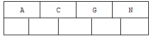

2. 插入H，`n>4`，中间元素G字母向上分裂到新的节点

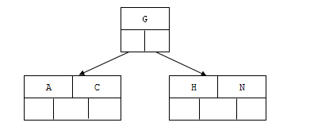

3. 插入E，K，Q不需要分裂

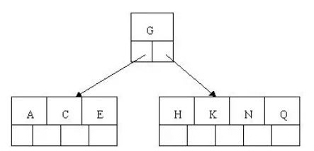

4. 插入M，中间元素M字母向上分裂到父节点G

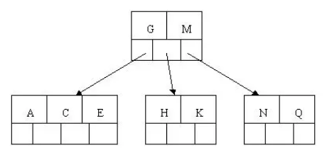

5. 插入F，W，L，T不需要分裂

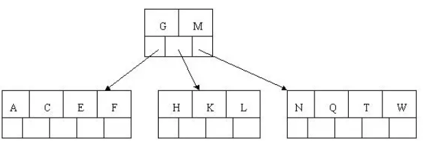

6. 插入Z，中间元素T向上分裂到父节点中

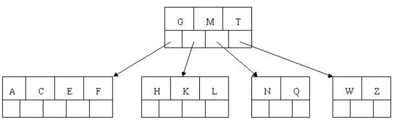

7. 插入D，中间元素D向上分裂到父节点中。然后插入P，R，X，Y不需要分裂

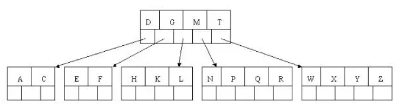

8. 最后插入S，NPQR节点`n>5`，中间节点Q向上分裂，但分裂后父节点DGMT的`n>5`，中间节点M向上分裂

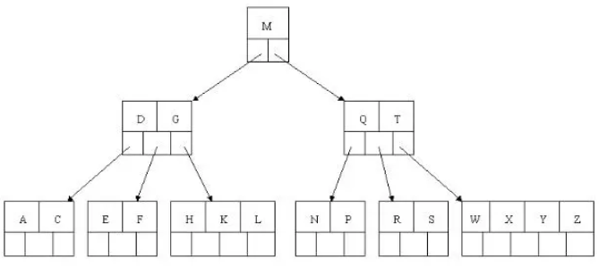

到此，该BTREE树就已经构建完成了，BTREE树和二叉树相比，查询数据的效率更高，因为对于相同的数据量来说，BTREE的层级结构比二叉树小，因此搜索速度快。

> Tips: 可通过数据结构可视化的网站来体验 BTREE 的数据结构演变过程。 https://www.cs.usfca.edu/~galles/visualization/BTree.html

### 3.2. B+TREE 结构

#### 3.2.1. B+TREE 简介

B+Tree 为 BTree 的变种，B+Tree 与 BTree 的区别为：

1. n 叉 B+Tree 最多含有 n 个 key，而 BTree 最多含有 n-1 个 key
2. B+Tree 的叶子节点保存所有的 key 信息，依 key 大小顺序排列
3. 所有的非叶子节点都可以看作是 key 的索引部分，不存储数据。只存储索引(冗余)是为了可以放更多的索引
4. 叶子节点包含所有索引字段
5. 所有叶子节点使用指针连接，提高区间访问的性能（MySQL 增加的特性）

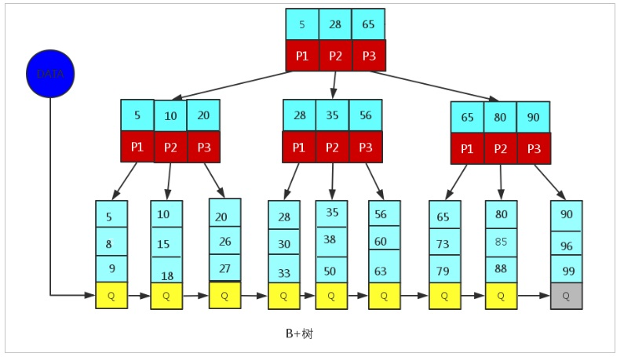

由于 B+Tree 只有叶子节点保存 key 信息，查询任何 key 都要从 root 节点走到叶子节点。所以 B+Tree 的查询效率更加稳定

> Tips: MySQL 在高版本里，会优化将索引都常驻内存中，提升查询的速度

#### 3.2.2. MySQL 中的 B+Tree

MySql 索引数据结构对经典的 B+Tree 进行了优化。在原 B+Tree 的基础上，**增加一个指向相邻叶子节点的链表指针，就形成了带有顺序指针的 B+Tree，提高区间访问的性能**。MySQL 中的 B+Tree 索引结构示意图如下：

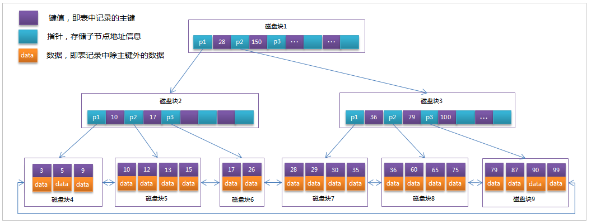

> Notes: 
>
> - <font color=red>**特别注意，一个索引对应一个B+Tree**</font>
> - 底层以上的部分，是索引部分，仅仅起到索引数据的作用，不存储数据。
> - 最底层部分是数据存储部分，在其叶子节点中要存储具体的数据。
> - 可通过数据结构可视化的网站来体验 BTREE 的数据结构演变过程。 https://www.cs.usfca.edu/~galles/visualization/BPlusTree.html

### 3.3. 磁盘和B+树的关系

关系型数据库都选择了B+树数据结构，这个和磁盘的特性有着非常大的关系。

#### 3.3.1. 磁盘结构

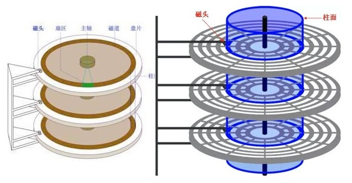

盘片被划分成一系列同心环，圆心是盘片中心，每个同心环叫做一个磁道，所有半径相同的磁道组成一个柱面。磁道被沿半径线划分成一个个小的段，每个段叫做一个扇区，每个扇区是磁盘的最小存储单元也是最小读写单元。现在磁盘扇区一般是 512 个字节~4k 个字节。

磁盘上数据必须用一个三维地址唯一标示：柱面号、盘面号、扇区号。读/写磁盘上某一指定数据需要下面步骤：

1. 首先移动臂根据柱面号使磁头移动到所需要的柱面上，这一过程被称为定位或查找。
2. 所有磁头都定位到磁道上后，这时根据盘面号来确定指定盘面上的具体磁道。
3. 盘面确定以后，盘片开始旋转，将指定块号的磁道段移动至磁头下。

经过上面步骤，指定数据的存储位置就被找到。这时就可以开始读/写操作。磁盘读取依靠的是机械运动，分为寻道时间、旋转延迟、传输时间三个部分，这三个部分耗时相加就是一次磁盘 IO 的时间，一般大概 9ms 左右。

为了提高效率，要尽量减少磁盘 I/O。为此，磁盘往往不是严格按需读取，而是每次都会预读，即使只需要一个字节，磁盘也会从这个位置开始，顺序向后读取一定长度的数据放入内存，这个称之为**预读**。这样做的理论依据是计算机科学中著名的局部性原理：**当一个数据被用到时，其附近的数据也通常会马上被使用。程序运行期间所需要的数据通常比较集中**。

磁盘顺序读取的效率很高（不需要寻道时间，只需很少的旋转时间）。

- 机械磁盘的顺序读的效率是随机读的 40 到 400 倍。顺序写是随机写的 10 到 100 倍
- SSD 盘顺序读写的效率是随机读写的 7 到 10 倍

#### 3.3.2. B+树结构在磁盘的存储

预读的长度一般为页（page）的整倍数。页是计算机管理存储器的逻辑块，硬件及操作系统往往将主存和磁盘存储区分割为连续的大小相等的块，**每个存储块称为一页**，页大小通常为 4k 当然也有 16K 的，主存和磁盘以页为单位交换数据。即可以理解为，<font color=red>**一页就是一个磁盘块，代表一次磁 I/O**</font>。

按照磁盘的这种性质，如果是一个页存放一个 B+树的节点，自然是可以存很多的数据的，比如 **InnoDB 默认定义的 B+树的节点大小是 16KB**，这就是说，假如一个 Key 是 8 个字节，那么一个节点可以存放大约 1000 个 Key，意味着 B+数可以有 1000 个分叉。同时 InnoDB 每一次磁盘 I/O，读取的都是 16KB 的整数倍的数据。也就是说 InnoDB 在节点的读写上是可以充分利用磁盘顺序 IO 的高速读写特性。

按照 B+树逻辑结构来说，在叶子节点一层，所有记录的主键按照从小到大的顺序排列，并且形成了一个双向链表。同一层的非叶子节点也互相串联，形成了一个双向链表。那么在实际读写的时候，很大的概率相邻的节点会放在相邻的页上，又可以充分利用磁盘顺序 I/O 的高速读写特性。所以<font color=red>**对 MySQL 优化的一大方向就是尽可能的多让数据顺序读写，少让数据随机读写**</font>。

### 3.4. Hash 结构

MySQL 中除了支持 B+Tree 索引，还支持一种索引类型 - Hash 索引。

#### 3.4.1. 结构

哈希索引就是采用一定的 hash 算法，将键值换算成新的 hash 值，映射到对应的槽位上，然后存储在 hash 表中。如果两个(或多个)键值，映射到一个相同的槽位上，他们就产生了 hash 冲突（也称为 hash 碰撞），可以通过链表来解决。

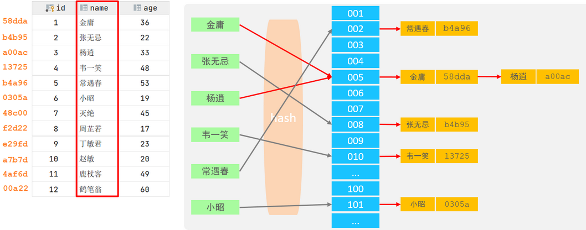

若数据产生较少的 hash 冲突，那么查找一个数据的时间复杂度就是O(1)，因此一般多用于精确查找。

#### 3.4.2. Hash 索引和B+树优劣比较

- Hash 索引只能用于对等比较(`=`，`in`)，不支持范围查询（`between`，`>`，`<` ，...）
- Hash 索引无法利用索引完成排序操作
- Hash 索引不支持模糊查询以及多列索引的最左前缀匹配。原理也是因为 hash 函数的不可预测。
- hash 索引结构不会存放行数据，因此任何时候都避免不了回表查询数据，而B+树在符合某些条件(聚簇索引，覆盖索引等)的时候可以只通过索引完成查询。
- Hash 索引查询效率高，通常(不存在hash冲突的情况)只需要一次检索就可以了，效率通常要高于 B+tree 索引。但性能不可预测，当某个键值存在大量重复的时候，发生hash碰撞，此时效率可能极差。而B+树的查询效率比较稳定，对于所有的查询都是从根节点到叶子节点，且树的高度较低。

因此在大多数情况下，直接选择 B+树索引可以获得稳定且较好的查询速度，而不需要使用hash索引。

#### 3.4.3. 存储引擎支持

在 MySQL 中，支持 hash 索引的是 Memory 存储引擎。而 InnoDB 中具有自适应 hash 功能，hash 索引是 InnoDB 存储引擎根据 B+Tree 索引在指定条件下自动构建的。

### 3.5. B+树作用与索引总结

- 在块设备上，通过 B+树可以有效的存储数据；
- 所有记录都存储在叶子节点上，非叶子(non-leaf)存储索引(keys)信息；而且记录按照索引列的值由小到大排好了序。
- B+树含有非常高的扇出（fanout），通常超过 100，在查找一个记录时，可以有效的减少 IO 操作；

> Tips:
>
> - 『扇出』是每个索引节点(Non-LeafPage)指向每个叶子节点(LeafPage)的指针；
> - 扇出数 = 索引节点(Non-LeafPage)可存储的最大关键字个数 + 1

#### 3.5.1. 为什么 InnoDB 存储引擎选择使用 B+tree 索引结构

1. 相对于二叉树，B+tree 层级更少，搜索效率高。
2. 由于 B+tree 的数据都存储在叶子结点中，叶子结点均为索引，只需要扫描一遍叶子结点即可；但是 BTree 因为其分支结点同样存储着数据，在查找具体的数据时，需要进行一次中序遍历按序来扫。所以 B+tree 更加适合在区间查询的情况，而在数据库中基于范围的查询是非常频繁的，所以通常 B+tree 更适用于数据库索引。
3. 对于 BTree，无论是叶子节点还是非叶子节点，都会保存数据，这样导致一页中存储的键值减少，指针跟着减少，要同样保存大量数据，只能增加树的高度，导致性能降低；而 B+tree 的节点只存储索引 key 值，具体信息的地址存在于叶子节点的地址中。这就使以页为单位的索引中可以存放更多的节点，减少更多的I/O支出。
4. B+tree 的查询效率更加稳定，任何关键字的查找必须走一条从根结点到叶子结点的路。所有关键字查询的路径长度相同，让每一个数据的查询效率相当。
5. 相对 Hash 索引，B+tree 支持范围匹配及排序操作

## 4. 索引分类（从应用维度划分）

- **普通索引**
- **唯一索引**
- **主键索引**，默认自动创建，一张表只能存在一个。
- **复合（组合、联合）索引**
- **前缀索引**
- **全文索引**
- **空间索引**

MySQL 8.x 中实现的索引新特性：

- **隐藏索引**：也称为不可见索引，不会被优化器使用，但是仍然需要维护，通常会软删除和灰度发布的场景中使用。主键不能设置为隐藏（包括显式设置或隐式设置）。
- **降序索引**：之前的版本就支持通过 desc 来指定索引为降序，但实际上创建的仍然是常规的升序索引。直到 MySQL 8.x 版本才开始真正支持降序索引。另外，在 MySQL 8.x 版本中，不再对 GROUP BY 语句进行隐式排序。
- **函数索引**：从 MySQL 8.0.13 版本开始支持在索引中使用函数或者表达式的值，也就是在索引中可以包含函数或者表达式。

### 4.1. 普通索引

MySQL 中基本索引类型，没有什么限制，一张表允许创建多个普通索引，并且允许在定义索引的列中插入重复值和空值，唯一作用就是为了快速查询数据。

### 4.2. 唯一索引

唯一索引与普通索引类似，不同点是：**索引列的值必须唯一，但允许有空值（Null）**。

唯一索引也是一种约束。唯一索引的**索引列不能出现重复的数据，但是允许数据为空值（NULL）**，一张表允许创建多个唯一索引。如果是组合唯一索引，则列值的组合必须唯一。

建立唯一索引的目的大部分时候都是为了该属性列的数据的唯一性，而不是为了查询效率。

### 4.3. 主键索引

在 MySQL 的 InnoDB 的表中，每张表都会有主键。在创建表时，如果没有显示的指定表的主键时，InnoDB 会自动先检查表中是否有唯一索引且不允许存在 null 值的字段，如果有，则选择该字段为默认的主键，否则 InnoDB 将会自动创建一个 6Byte 的自增主键。而 MySQL 会自动在主键列上建立一个索引，这就是**主键索引**。

主键是具有唯一性并且不允许为 NULL，所以<font color=red>**主键索引是一种特殊的唯一索引**</font>。

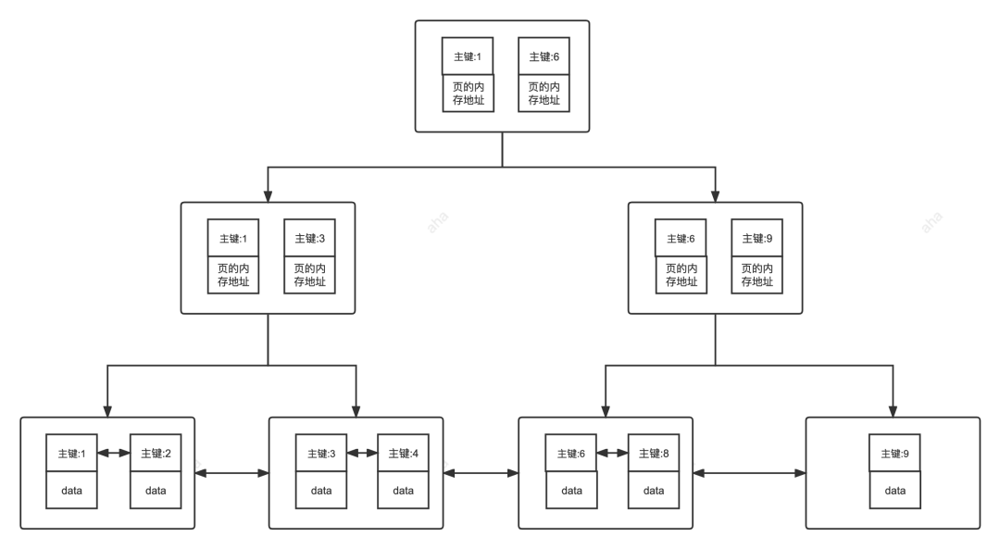

#### 4.3.1. 复合主键/联合主键

复合主键（联合主键）是指表的主键含有一个以上的字段的组合，不使用无业务含义的自增id作为主键。复合（联合）主键的意义：用多个字段来确定一条记录，但这些字段都不是唯一的，可以分别重复。但**多个字段联合的主键是唯一的**。

举个例子，在表中创建了一个ID字段，自动增长，并设为主键，这个是没有问题的，因为“主键是唯一的索引”，ID自动增长保证了唯一性，所以可以。此时，再创建一个字段name，类型为varchar，也设置为主键，就会发现，在表的多行中是可以填写相同的name值的

总结：<font color=red>**当表中只有一个主键时，它是唯一的索引；当表中有多个主键时，称为复合主键，复合主键联合保证唯一索引。某几个主键字段值可以分别出现重复，只要不是有多条记录的所有主键值完全一样，就不算重复。**</font>

#### 4.3.2. 主键索引与唯一索引的区别

- 主键索引是不允许为 Null 值并且唯一。
- 唯一约束的列可以在允许为 null 值（*因为 MySQL 定义所有的 Null 均不是同一个值*），唯一索引主要是用来防止数据重复插入。

### 4.4. 组合（复合、联合）索引

组合索引也叫复合索引，指的是在建立索引的时候使用多个字段（*例如同时使用身份证和手机号建立索引*），同样的可以建立为普通索引或者是唯一索引。

> Tips: 使用组合索引时需遵循最左前缀原则。任何标准表最多可以创建 16 个索引列。（*待验证是否正确*）

### 4.5. 前缀索引

前缀索引只适用于字符串类型的数据。前缀索引是对文本的前几个字符创建索引，因为只取前几个字符，所以相比普通索引建立的数据更小，。

### 4.6. 全文索引

#### 4.6.1. 概述

全文索引的关键字是 `fulltext`。全文索引主要用来查找文本中的关键字，而不是直接与索引中的值相比较，它更像是一个搜索引擎，基于相似度的查询，而不是简单的`where`语句的参数匹配。

用 `like + %` 就可以实现模糊匹配了，为什么还要全文索引？`like + %` 在文本比较少时是合适的，但是对于大量的文本数据检索，是不可想象的。全文索引在大量的数据面前，能比 `like + %` 快 N 倍，速度不是一个数量级，但是全文索引可能存在精度问题。

#### 4.6.2. 注意事项

- MySQL 5.6 以前的版本，只有 MyISAM 存储引擎支持全文索引
- MySQL 5.6 及以后的版本，MyISAM 和 InnoDB 存储引擎均支持全文索引
- 只有字段的数据类型为 `char`、`varchar`、`text` 及其系列才可以建全文索引
- 在数据量较大时候，现将数据放入一个没有全局索引的表中，然后再用 `create index` 创建 `fulltext` 索引，要比先为一张表建立 `fulltext` 然后再将数据写入的速度快很多；

#### 4.6.3. 最小搜索长度和最大搜索长度

MySQL 中的全文索引，有两个变量，最小搜索长度和最大搜索长度，对于长度小于最小搜索长度和大于最大搜索长度的词语，都不会被索引。通俗点就是说，想对一个词语使用全文索引搜索，那么这个词语的长度必须在以上两个变量的区间内。这两个的默认值可以使用以下命令查看:

```sql
show variables like '%ft%';
```

部分参数解析

|          参数名称          | 默认值 | 最小值 | 最大值 |                            作用                             |
| :----------------------: | :---: | :---: | :---: | ----------------------------------------------------------- |
|     ft_min_word_len      |   4   |   1   | 3600  | MyISAM  引擎表全文索引包含的最小词长度                           |
| ft_query_expansion_limit |  20   |   0   | 1000  | MyISAM引擎表使用  with  query expansion 进行全文搜索的最大匹配数 |
| innodb_ft_min_token_size |   3   |   0   |  16   | InnoDB  引擎表全文索引包含的最小词长度                           |
| innodb_ft_max_token_size |  84   |  10   |  84   | InnoDB  引擎表全文索引包含的最大词长度                           |

#### 4.6.4. 全文索引创建语法

语法格式：

```sql
-- 创建表的时候添加全文索引
create table 表名 (
     ...
     fulltext (字段名) -- 创建全文检索
);

-- 修改表结构添加全文索引
alter table 表名 add fulltext index_content(字段名);

-- 直接添加全文索引
create fulltext index index_content on 表名(字段名);
```

示例：

```sql
create table t_article (
     id int primary key auto_increment ,
     title varchar(255) ,
     content varchar(1000) ,
     writing_date date,
     fulltext (content) -- 创建全文检索
);

alter table t_article add fulltext index_content(content);

create fulltext index index_content on t_article(content);
```

#### 4.6.5. 使用全文索引

使用全文索引和常用的模糊匹配使用 `like + %` 不同，全文索引有自己的语法格式，使用 `match` 和 `against` 关键字，格式:

```sql
match (col1,col2,...)  against(expr [search_modifier])
```

示例：

```sql
select * from t_article where match(content) against('yo'); -- 没有结果 单词数需要大于等于3 
select * from t_article where match(content) against('you'); -- 有结果
```

### 4.7. 空间索引(少用，了解)

MySQL 在 5.7 之后的版本支持了空间索引，而且支持 OpenGIS 几何数据模型。空间索引是对空间数据类型的字段建立的索引，MYSQL 中的空间数据类型有4种，分别是 GEOMETRY、POINT、LINESTRING、POLYGON。

|    类型     |   含义   |       说明       |
| ---------- | ------- | --------------- |
| Geometry   | 空间数据 | 任何一种空间类型   |
| Point      | 点      | 坐标值           |
| LineString | 线      | 有一系列点连接而成 |
| Polygon    | 多边形   | 由多条线组成      |

MYSQL 使用 SPATIAL 关键字进行扩展，使得能够用于创建正规索引类型的语法创建空间索引。

语法：

```sql
create table 表名 (
  ...
  spatial key geom_index(列名)
);
```

> Notes: 创建空间索引的列，必须将其声明为 NOT NULL。

## 5. InnoDB 中的索引（按照底层存储方式划分）

MySQL 的 InnoDB 引擎中的索引也是按照 B+树来组织的。最终会在磁盘中保存为 `.ibd` 格式的文件，里面包含了该表的索引和数据。以物理存储维度主要分为两种：**聚集索引**和**非聚集索引**。

### 5.1. 聚集索引/聚簇索引（Clustered Index）

#### 5.1.1. 聚簇索引介绍

聚簇索引（Clustered Index）是以主键创建的索引，在叶子节点存储的是表中的数据。即索引结构和数据一起存放的索引，并不是一种单独的索引类型。如果表没有定义主键，MySQL 会选择一个不允许为 NULL 的唯一性索引建立聚集索引。如果也没有合适的唯一性索引，MySQL 也会创建一个隐含列 RowID 来做主键（此隐藏的主键长度为6个字节，值会随着数据的插入自增），然后用这个主键来建立聚集索引。

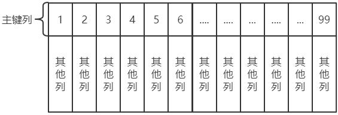

InnoDB 中的主键索引就属于聚簇索引。MySQL 会将表的主键用来构造一棵 B+树，每个非叶子节点存储索引（主键），并且将整张表的行记录数据存放在该 B+树的叶子节点（叶子节点就是数据页，数据页上存放的是完整的每行记录）中。

聚簇索引特点是：<font color=red>**索引即数据，数据即索引。由于聚集索引是利用表的主键构建的，因此每张表只能拥有一个聚集索引**</font>。

#### 5.1.2. 聚簇索引的优缺点

优点：

- **查询速度快**：因为整个 B+树本身就是一颗多叉平衡树，叶子节点也都是有序的，定位到索引的节点，就相当于定位到了数据。因为聚集索引能获取完整的整行数据，相比于非聚簇索引，聚簇索引少了一次读取数据的 IO 操作。
- **对排序查找和范围查找优化**：对于主键的排序查找和范围查找速度非常快。因为聚集索引叶子节点的存储是逻辑上连续的，使用双向链表连接，叶子节点按照主键的顺序排序。

缺点：

- **依赖于有序的数据**：因为 B+树是多路平衡树，如果索引的数据不是有序的，那么就需要在插入时排序，如果数据是整型还好，否则类似于字符串或 UUID 这种又长又难比较的数据，插入或查找的速度会比较慢。
- **更新代价大**：如果对索引列的数据被修改时，那么对应的索引也将会被修改，而且聚簇索引的叶子节点还存放着数据，修改代价肯定是较大的，所以对于主键索引来说，主键一般都是不可被修改的。

### 5.2. 非聚簇索引

#### 5.2.1. 非聚簇索引简介

非聚集索引就是以非主键创建的索引，在叶子节点存储的是主键和索引列。

#### 5.2.2. 非聚簇索引的优缺点

优点：

- **更新代价比聚簇索引要小**：非聚簇索引的更新代价就没有聚簇索引那么大了，非聚簇索引的叶子节点是不存放数据的

缺点：

- **依赖于有序的数据**：跟聚簇索引一样，非聚簇索引也依赖于有序的数据
- **可能会二次查询(回表)**：这应该是非聚簇索引最大的缺点了。当查到索引对应的指针或主键后，可能还需要根据指针或主键再到数据文件或表中查询。

#### 5.2.3. 聚集索引和非聚集索引的结构对比

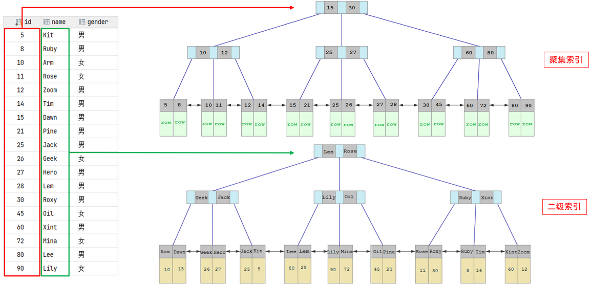

- 聚集索引的叶子节点下挂的是这一行的数据 。
- 二级索引的叶子节点下挂的是该字段值对应的主键值。

#### 5.2.4. 回表

当通过辅助索引来寻找数据时，InnoDB 存储引擎会遍历辅助索引并通过叶级别的指针获得指向主键索引的主键，然后再通过主键索引（聚集索引）来找到一个完整的行记录。这个过程也被称为回表。

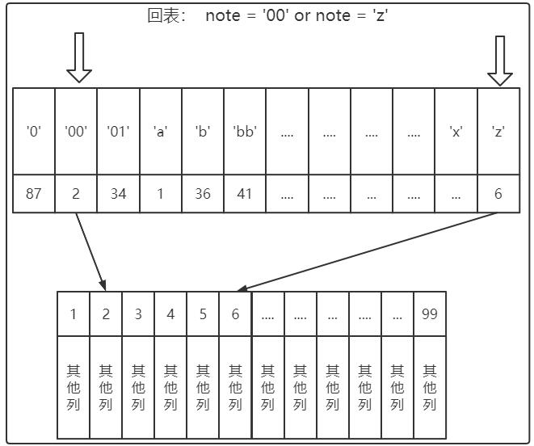

> 根据辅助索引的值查询一条完整的用户记录需要使用到 2 棵 B+树 -> 一次辅助索引，一次聚集索引。

辅助索引叶子节点不会像聚集索引一样，不会将完整的行记录放到叶子节点中。虽然如果将完整行记录放到叶子节点是可以不用回表，但相当于每建立一棵 B+树都需要把所有的记录再都拷贝一份，太过占用存储空间。而且每次对数据的变化要在所有包含数据的索引中全部都修改一次，性能也非常低下。

回表查询会增加额外的磁盘访问开销和数据传输开销，降低查询的性能。回表的记录越少，性能提升就越高，需要回表的记录越多，使用二级索引的性能就越低，甚至让某些查询宁愿使用全表扫描也不使用二级索引。

至于采取何种扫描方式是由查询优化器决定。查询优化器会事先对表中的记录计算一些统计数据，然后再利用这些统计数据根据查询的条件来计算一下需要回表的记录数，需要回表的记录数越多，就越倾向于使用全表扫描，反之倾向于使用二级索引+回表的方式。

下面分析一下，执行如下的SQL语句时，具体的查找的过程：

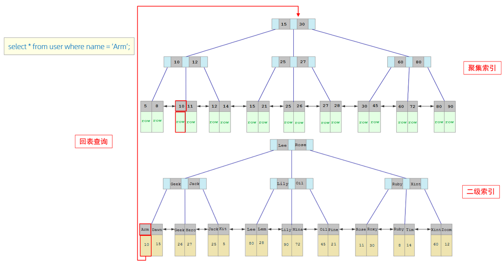

1. 由于是根据 name 字段进行查询，所以先根据 `name='Arm'` 到 name 字段的二级索引中进行匹配查找。但是在二级索引中只能查找到 Arm 对应的主键值 10。
2. 由于查询返回的是整行的数据，因此还需要根据主键值10，到聚集索引中查找10对应的记录，最终找到10对应的行row。
3. 最终拿到这一行的数据，直接返回即可。

#### 5.2.5. 辅助索引/二级索引（Secondary Index）

聚簇索引只能在搜索条件是主键值时才能发挥作用，因为B+树中的数据都是按照主键进行排序的。如果以别的列作为搜索条件时，通常会给这些列建立索引，这些索引被称为辅助索引/二级索引。唯一索引，普通索引，前缀索引等索引均属于二级索引。

辅助索引(Secondary Index，也称二级索引、非聚集索引)，叶子节点并不包含行记录的全部数据。叶子节点除了包含键值以外，每个叶子节点中的索引行中还包含了一个书签(bookmark)。该书签用来告诉 InnoDB 存储引擎哪里可以找到与索引相对应的行数据。因此 InnoDB 存储引擎的辅助索引的书签就是相应行数据的聚集索引键。

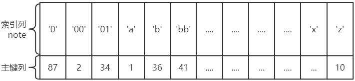

辅助索引的存在并不影响数据在聚集索引中的组织，因此每张表上可以有多个辅助索引。

#### 5.2.6. 联合索引/复合索引

构建索引可以包含多个字段，将表上的多个列组合起来进行索引，称之为联合索引或者复合索引。

<font color=red>**值得注意的是：联合索引只会建立1棵B+树；而对多个列分别建立索引（辅助索引）则会分别以每个列则建立B+树，有几个列就有几个B+树**</font>。

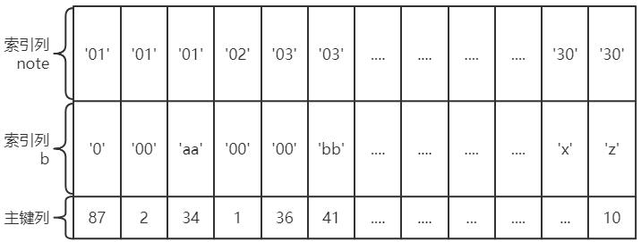

联合索引的结构是按定义时的列的顺序，逐个排序建立索引。如`index(note,b)`在索引构建如下：

1. 先把各个记录按照 note 列进行排序
2. 在记录的 note 列相同的情况下，采用 b 列进行排序
3. 最终叶子节点存储聚集索引的主键列

### 5.3. 覆盖索引/索引覆盖

InnoDB 存储引擎支持覆盖索引(covering index，或称索引覆盖)，即从辅助索引中字段包含了需要查询的字段，那可以直接得到查询的记录，而不需要**回表**查询聚集索引中的记录。使用覆盖索引的一个好处是辅助索引不包含整行记录的所有信息，故其大小要远小于聚集索引，因此可以减少大量的 IO 操作。

> <font color=red>**注意：覆盖索引并不是索引类型的一种**</font>。

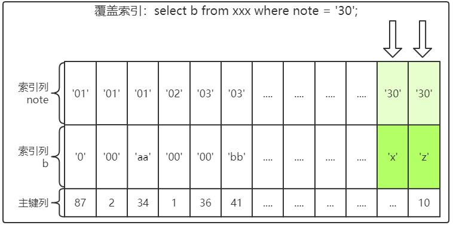

不是所有类型的索引都可以成为覆盖索引。覆盖索引要存储索引列的值，而哈希索引、全文索引不存储索引列的值，所以 MySQL 使用 b+树索引做覆盖索引。

### 5.4. 自适应哈希索引

B+树的查找次数，取决于 B+树的高度，在生产环境中，B+树的高度一般为 3~4 层，故需要 3~4 次的 IO 查询。

InnoDB 存储引擎内部自己去监控索引表，如果监控到某个索引经常用，那么就认为是热数据，然后内部自己创建一个 hash 索引，称之为自适应哈希索引( Adaptive Hash Index,AHI)，创建以后，如果下次又查询到这个索引，那么直接通过 hash 算法推导出记录的地址，直接一次就能查到数据，比重复去B+tree 索引中查询三四次节点的效率高了不少。

InnoDB 存储引擎使用的哈希函数采用除法散列方式，其冲突机制采用链表方式。注意，对于自适应哈希索引仅是数据库自身创建并使用的，用户并不能对其进行干预。查询当前自适应哈希索引的使用状况的命令如下：

```sql
show engine innodb status\G;
```

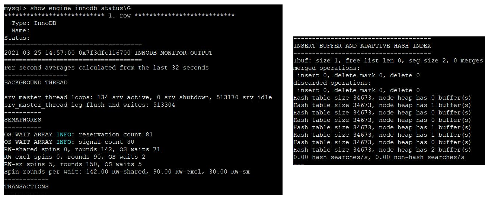

哈希索引只能用来搜索等值的查询，如`SELECT* FROM table WHERE indexcol=xxx`。而对于其他查找类型，如范围查找，是不能使用哈希索引。

> 由于 AHI 是由 InnoDB 存储引擎控制的，因此这里的信息只供我们参考。不过我们可以通过观察 SHOW ENGINE INNODB STATUS 的结果及参数 innodb_adaptive_hash_index 来考虑是禁用或启动此特性，默认 AHI 为开启状态。
>
> 什么时候需要禁用呢？如果发现监视索引查找和维护哈希索引结构的额外开销远远超过了自适应哈希索引带来的性能提升就需要关闭这个功能。
>
> 同时在 MySQL 5.7 中，自适应哈希索引搜索系统被分区。每个索引都绑定到一个特定的分区，每个分区都由一个单独的 latch 锁保护。分区由innodb_adaptive_hash_index_parts 配置选项控制 。在早期版本中，自适应哈希索引搜索系统受到单个 latch 锁的保护，这可能成为繁重工作负载下的争用点。innodb_adaptive_hash_index_parts 默认情况下，该 选项设置为 8。最大设置为 512。禁用或启动此特性和调整分区个数是 DBA 的工作，我们了解即可。

### 5.5. 全文检索之倒排索引

全文检索（Full-Text Search）：是将存储于数据库中的整本书或整篇文章中的任意内容信息查找出来的技术。它可以根据需要获得全文中有关章、节、段、句、词等信息，也可以进行各种统计和分析。比较熟知的如 Elasticsearch、Solr 等就是全文检索引擎，底层都是基于 Apache Lucene 的。

倒排索引就是，将文档中包含的关键字全部提取处理，然后再将关键字和文档之间的对应关系保存起来，最后再对关键字本身做索引排序。用户在检索某一个关键字是，先对关键字的索引进行查找，再通过关键字与文档的对应关系找到所在文档。

> *注：具体如何使用 InnoDB 存储引擎的全文检索，查阅相关官方文档或者书籍*

### 5.6. InnoDB 索引的限制

> 参考官方文档：https://dev.mysql.com/doc/refman/8.0/en/innodb-limits.html

- 一个表最多可包含 1017 列。虚拟生成的列也包含在此限制内。
- <font color=red>**一个表最多可包含 64 个二级索引**</font>。
- 索引键前缀长度限制为 3072 字节。尝试使用超过限制的索引键前缀长度会返回错误。
    - 对于使用 REDUNDANT 或 COMPACT 行格式的 InnoDB 表，索引键前缀长度限制为 767 字节。假设使用 utf8mb4 字符集，每个字符最多 4 字节，那么 TEXT 或 VARCHAR 列的列前缀索引长度超过 191 个字符时，就可能会达到此限制。
    - 如果在创建 MySQL 实例时通过指定 innodb_page_size 选项将 InnoDB 页面大小减小到 8KB 或 4KB，那么索引键的最大长度会根据 16KB 页面大小的 3072 字节限制按比例降低。也就是说，当页面大小为 8KB 时，索引键的最大长度为 1536 字节；当页面大小为 4KB 时，索引键的最大长度为 768 字节。
- <font color=red>**多列索引最多允许 16 列**</font>。超过限制将返回错误。

```sql
ERROR 1070 (42000): Too many key parts specified; max 16 parts allowed
```

## 6. 索引在查询中使用的原理

1. <font color=red>**一个索引对应一个B+树，索引让查询可以快速定位和扫描到需要的数据记录上，加快查询的速度。**</font>
2. <font color=red>**一个`select`查询语句在执行过程中一般最多能使用一个二级索引，即使在`where`条件中用了多个二级索引。**</font>

### 6.1. 扫描区间

对于某个查询来说，最简单粗暴的执行方案就是扫描表中的所有记录，判断每一条记录是否符合搜索条件。如果符合，就将其发送到客户端，否则就跳过该记录。这就是**全表扫描**。

对于使用 InnoDB 存储引擎的表来说，全表扫描意味着从聚簇索引第一个叶子节点的第一条记录开始，沿着记录所在的单向链表向后扫描，直到最后一个叶子节点的最后一条记录。虽然全表扫描是一种很笨的执行方案，但却是一种万能的执行方案，所有的查询都可以使用这种方案来执行，只是效率不高。

有了索引，利用 B+树查找索引列值等于某个值的记录，这样可以明显减少需要扫描的记录数量。由于 B+树叶子节点中的记录是按照索引列值由小到大的顺序排序的，所以即使只扫描某个区间或者某些区间中的记录也可以明显减少需要扫描的记录数量。

```sql
SELECT * FROM order_exp WHERE id >= 3 AND id<= 99;
```

以上语句是查找 id 值在`[3,99]`区间中的所有聚簇索引记录。以通过聚簇索引对应的 B+树快速地定位到 id 值为 3 的那条聚簇索引记录，然后沿着记录所在的单向链表向后扫描,直到某条聚簇索引记录的 id 值不在`[3,99]`区间中为止。

与全表扫描相比，扫描 id 值在[3,99]区间中的记录已经很大程度地减少了需要扫描的记录数量，所以提升了查询效率。其实所谓的全表扫描，可以理解为扫描的区间是[负无穷，正无穷]或者[第一条记录，最后一条记录]。

```sql
SELECT * FROM order_exp WHERE order_no < 'DD00_10S' AND expire_time > '2021-03-22 18:28:28' AND order_note > '7 排';
```

上述语句中，order_no 和 expire_time 都有索引，order_note 没有索引。这个不会出现两个扫描区间。一个`select`查询语句在执行过程中一般最多能使用一个二级索引。

无论用哪个索引执行查询，都需要获取到索引中的记录后，进行回表，获取到完整的用户记录后再根据判定条件判断这条记录是否满足 SQL 语句的要求。

### 6.2. 范围区间扫描

对于B+树索引来说，只要索引列和常数使用`=`、`<=>`、`IN`、`NOT IN`、`IS NULL`、`IS NOT NULL`、`>`、`<`、`>=`、`<=`、`BETWEEN`、`!=`（不等于也可以写成`<>`）或者 `LIKE` 操作符连接起来，就可以产生一个区间。

1. `IN` 操作符的效果和若干个等值匹配操作符`=`之间用`OR`连接起来是一样的，也就是说会产生多个单点区间，比如下边这两个语句的效果是一样的：

```sql
SELECT * FROM order_exp WHERE insert_time IN (2021-03-22 18:23:42, yyyy);
SELECT * FROM order_exp WHERE insert_time= 2021-03-22 18:23:42 OR insert_time = yyyy;
```

2. `!=` 一般会产生的两个扫描区间，即[第一条记录, 不等于表达式的值]和[不等于表达式的值, 最后一条记录]

```sql
SELECT * FROM order_exp WHERE order_no != 'DD00_9S';
```

3. `LIKE` 操作符比较特殊，只有在匹配完整的字符串或者匹配字符串前缀时才产生合适的扫描区间。

对于某个索引列来说，字符串前缀相同的记录在由记录组成的单向链表中肯定是相邻的。比如有一个搜索条件是 `note LIKE 'b%'`，对于二级索引 idx_note 来说，所有字符串前缀为`'b'`的二级索引记录肯定是相邻的。这也就意味着只要定位到 idx_note 值的字符串前缀为`'b'`的第一条记录，就可以沿着记录所在的单向链表向后扫描，直到某条二级索引记录的字符串前缀不为`'b'`为止。

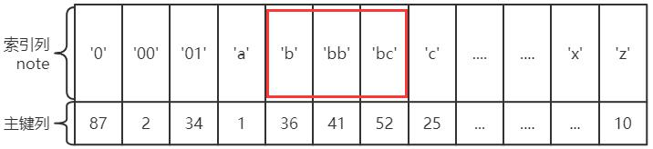

### 6.3. 所有搜索条件都可以使用某个索引的情况

每个搜索条件都可以使用到某个索引

```sql
-- AND 的方式连接
SELECT * FROM order_exp WHERE order_no > 'DD00_6S' AND order_no > 'DD00_9S';
-- OR 的方式连接
SELECT * FROM order_exp WHERE order_no > 'DD00_6S' OR order_no > 'DD00_9S';
```

`AND`连接搜索条件时，取交集；`OR`连接搜索条件时，取并集；

### 6.4. 有的搜索条件无法使用索引的情况

```sql
SELECT * FROM order_exp WHERE expire_time> '2021-03-22 18:35:09' AND order_note = 'abc';
```

上面示例这个查询语句中能利用的索引只有 idx_expire_time 一个，而 idx_expire_time 这个二级索引的记录中又不包含 order_note 这个字段，所以在使用二级索引 idx_expire_time 定位记录的阶段用不到 `order_note = 'abc'`这个条件，而范围区间是为了到索引中取记录中提出的概念，所以在确定范围区间的时候不需要考虑 `order_note = 'abc'`这个条件。即可以将语句简化成：

```sql
SELECT * FROM order_exp WHERE expire_time > '2021-03-22 18:35:09';
```

如果使用`or`连接搜索条件：

```sql
SELECT * FROM order_exp WHERE expire_time > '2021-03-22 18:35:09' OR order_note = 'abc';
```

一个使用到索引的搜索条件和没有使用该索引的搜索条件使用`OR`连接起来后是无法使用该索引的。因为索引expire_time列不包含非索引的order_note字段，所以无法判断非索引的order_note字段是否满足搜索条件，又因为是`OR`条件连接，所以必须要在主键索引中从第一条记录到最后一条记录逐条判定非索引的order_note字段是否满足条件。即可以将语句简化成：

```sql
SELECT * FROM order_exp ;
```

### 6.5. 复杂搜索条件下找出范围匹配的区间

当搜索条件可能特别复杂时。比如：

```sql
SELECT * FROM order_exp
WHERE (order_no > 'DD00_9S' AND expire_time = '2021-03-22 18:35:09' )
    OR (order_no < 'DD00_6S' AND order_no > 'DD00_9S')
    OR (order_no LIKE '%0S' AND order_no > 'DD00_12S' AND (expire_time < '2021-03-22 18:28:28' OR order_note = 'abc')) ;
```

首先查看 WHERE 子句中的搜索条件都涉及到了哪些列，哪些列可能使用到索引。这个查询的搜索条件涉及到了 order_no、expire_time、order_note 这 3 个列，然后 order_no 列有二级索引 idx_order_no，expire_time 列有二级索引idx_expire_time。对于那些可能用到的索引，分析它们的范围区间。

- **使用 idx_order_no 执行查询**

分析时可以先那些用不到该索引的搜索条件暂时移除掉。把所有用不到的搜索条件视为True来进行中间替换，

```sql
-- 使用true代替无使用索引的搜索条件
(order_no > 'DD00_9S' AND TRUE ) OR
(order_no < 'DD00_6S' AND order_no > 'DD00_9S') OR
(TRUE AND order_no > 'DD00_12S' AND (TRUE OR TRUE))

-- 再次化简
(order_no > 'DD00_9S') OR
(order_no < 'DD00_6S' AND order_no > 'DD00_9S') OR
(order_no > 'DD00_12S')

-- 替换掉永远为 TRUE 或 FALSE 的条件
(order_no > 'DD00_9S') OR (order_no > 'DD00_12S')
```

最后搜索条件是使用`OR`操作符连接起来的，意味着要取并集，所以最终的结果化简的到的区间就是：`order_no > 'DD00_12S'`。也就是说：上边那个复杂搜索条件的查询语句如果使用 idx_order_no 索引执行查询的话，需要把满足`order_no > 'DD00_12S'`的二级索引记录都取出来，然后拿着这些记录的 id 再进行回表，得到完整的用户记录之后再使用其他的搜索条件进行过滤。记住，说的是如果使用 idx_order_no 索引执行查询，不代表 MySQL 一定会使用，因为MySQL 需要做整体评估，才能确定是否使用这个索引还是别的索引，或者是干脆全表扫描。

- **使用 idx_expire_time 执行查询**

把那些用不到该索引的搜索条件暂时使用 TRUE 条件替换掉，其中有关 order_no 和 order_note 的搜索条件都需要被替换掉，替换结果就是：

```sql
(TRUE AND expire_time = '2021-03-22 18:35:09' ) OR
(TRUE AND TRUE) OR
(TRUE AND TRUE AND (expire_time < '2021-03-22 18:28:28' OR TRUE))

-- 替换掉永远为 TRUE 或 FALSE 的条件
expire_time = '2021-03-22 18:35:09' OR TRUE

-- 最终结果
TRUE
```

这个结果也就意味着如果我们要使用 idx_expire_time 索引执行查询语句的话，需要扫描 idx_expire_time 二级索引的所有记录，然后再回表，这种情况下为啥 MySQL 不直接全表扫描呢？所以一定不会使用 idx_expire_time 索引的。

### 6.6. 使用联合索引执行查询时对应的扫描区间

联合索引的索引列包含多个列，B+树每一层页面以及每个页面中的记录采用的排序规则较为复杂，以 order_exp 表的 u_idx_day_status 联合索引为例，它采用的排序规则如下所示：

- 先按照 insert_time 列的值进行排序
- 在 insert_time 列的值相同的情况下，再按照 order_status 列的值进行排序
- 在 insert_time 和 order_status 列的值都相同的情况下，再按照 expire_time 列的值进行排序

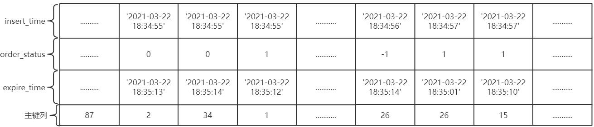

以下用几个查询示例来说明：

```sql
SELECT * FROM order_exp WHERE insert_time = '2021-03-22 18:34:55';
```

> 由于二级索引记录是先按照 insert_time 列的值进行排序的，所以所有符合`insert_time = '2021-03-22 18:34:55'`条件的记录肯定是相邻的，可以定位到第一条符合`insert_time = '2021-03-22 18:34:55'`条件的记录，然后沿着记录所在的单向链表向后扫描，直到某条记录不符合`insert_time = '2021-03-22 18:34:55'`条件为止(当然，对于获取到的每一条二级索引记录都要执行回表操作)。
>
> 扫描区间就是`['2021-03-22 18:34:55', '2021-03-22 18:34:55']`，形成这个扫描区间的条件就是 `insert_time = '2021-03-22 18:34:55'`。


```sql
SELECT * FROM order_exp WHERE insert_time = '2021-03-22 18:34:55' AND order_status = 0;
```

> 由于二级索引记录是先按照 insert_time 列的值进行排序的；在 insert_time 列的值相等的情况下，再按照 order_status 列进行排序。所以符合 `insert_time = '2021-03-22 18:34:55' AND order_status = 0` 条件的二级索引记录肯定是相邻的，我们可以定位到第一条符合 `insert_time='2021-03-22 18:34:55' AND order_status=0` 条件的记录，然后沿着记录所在的链表向后扫描，直到某条记录不符合`insert_time='2021-03-22 18:34:55'`条件或者`order_status=0`条件为止。
>
> 形成扫描区间`[('2021-03-22 18:34:55', 0), ('2021-03-22 18:34:55', 0)]`，形成这个扫描区间的条件就是 `insert_time = '2021-03-22 18:34:55' AND order_status = 0`。

```sql
SELECT * FROM order_exp WHERE insert_time = '2021-03-22 18:34:55' AND order_status = 0 AND expire_time = '2021-03-22 18:35:13';
```

> 由于二级索引记录是先按照 insert_time 列的值进行排序的；在 insert_time 列的值相等的情况下，再按照 order_status 列进行排序；在 insert_time 和order_status 列的值都相等的情况下，再按照 expire_time 列进行排序。所以符合insert_time = '2021-03-22 18:34:55' AND order_status = 0 AND expire_time = '2021-03-22 18:35:13'条件的二级索引记录肯定是相邻的，我们可以定位到第一条符合 insert_time='2021-03-22 18:34:55' AND order_status=0 AND expire_time='2021-03-22 18:35:13'条件的记录，然后沿着记录所在的链表向后扫描，直到某条记录不符合 insert_time='2021-03-22 18:34:55'条件或者order_status=0 条件或者 expire_time='2021-03-22 18:35:13'条件为止。
>
> 如果使用 u_idx_day_status 索引执行查询时，可以形成扫描区间`[('2021-03-22 18:34:55', 0, '2021-03-22 18:35:13'), ('2021-03-22 18:34:55', 0, '2021-03-22 18:35:13')]`，形成这个扫描区间的条件就是`insert_time = '2021-03-22 18:34:55' AND order_status = 0 AND expire_time = '2021-03-22 18:35:13'`。

```sql
SELECT * FROM order_exp WHERE insert_time < '2021-03-22 18:34:55';
```

> 由于二级索引记录是先按照 insert_time 列的值进行排序的，所以所有符合`insert_time < '2021-03-22 18:34:55'`条件的记录肯定是相邻的，我们可以定位到第一条符合`insert_time < '2021-03-22 18:34:55'`条件的记录(其实就是u_idx_day_status 索引第一个叶子节点的第一条记录)，然后沿着记录所在的链表向前扫描，直到某条记录不符合 `insert_time < '2021-03-22 18:34:55'`为止。
>
> 使用 u_idx_day_status 索引执行查询时，形成扫描区间`(第一条记录, '2021-03-22 18:34:55')`，形成这个扫描区间的条件就是`insert_time < '2021-03-22 18:34:55'`。

```sql
SELECT * FROM order_exp WHERE insert_time = '2021-03-22 18:34:55' AND order_status >= 0;
```

> 由于二级索引记录是先按照 insert_time 列的值进行排序的；在 insert_time 列的值相等的情况下，再按照 order_status 列进行排序。也就是说在符合 insert_time = '2021-03-22 18:34:55'条件的二级索引记录中，是按照 order_status 列的值进行排序的，那么此时符合 `insert_time = '2021-03-22 18:34:55' AND order_status >= 0;`条件的二级索引记录肯定是相邻的。我们可以定位到第一条符合 `insert_time = '2021-03-22 18:34:55' AND order_status >= 0;`条件的记录，然后沿着记录所在的链表向后扫描，直到某条记录不符合 `insert_time='2021-03-22 18:34:55'`条件或者`order_status >= 0`条件为止。
>
> 使用 u_idx_day_status 索引执行查询时，形成扫描区间，条件就是`insert_time = '2021-03-22 18:34:55' AND order_status >= 0;`

```sql
SELECT * FROM order_exp WHERE order_status = 1;
```

> 由于二级索引记录不是直接按照 order_status 列的值排序的，所以符合`order_status = 1`的二级索引记录可能并不相邻，也就意味着不能通过这个`order_status = 1`搜索条件来减少需要扫描的记录数量。在这种情况下，是不会使用 u_idx_day_status 索引执行查询的。

```sql
SELECT * FROM order_exp WHERE insert_time = '2021-03-22 18:34:55' AND expire_time = '2021-03-22 18:35:12';
```

> 由于二级索引记录是先按照 insert_time 列的值进行排序的，所以符合`insert_time = '2021-03-22 18:34:55'`条件的二级索引记录肯定是相邻的，但是对于符合 `insert_time = '2021-03-22 18:34:55'`条件的二级索引记录来说，并不是直接按照 expire_time 列进行排序的，也就是说我们不能根据搜索条件`expire_time = '2021-03-22 18:35:12'`来进一步减少需要扫描的记录数量。那么如果使用u_idx_day_status索引执行查询的话，可以定位到第一条符合`insert_time='2021-03-22 18:34:55'`条件的记录，然后沿着记录所在的单向链表向后扫描，直到某条记录不符合`insert_time = '2021-03-22 18:34:55'`条件为止。
>
> 使用 u_idx_day_status 索引执行查询时，对应的扫描区间其实是`['2021-03-22 18:34:55', '2021-03-22 18:34:55']`，形成该扫描区间的搜索条件是`insert_time = '2021-03-22 18:34:55'`，与`expire_time = '2021-03-22 18:35:12'`无关。

```sql
SELECT * FROM order_exp WHERE insert_time < '2021-03-22 18:34:57' AND order_status = 1;
```

> 由于二级索引记录是先按照 insert_time 列的值进行排序的，所以符合`insert_time < '2021-03-22 18:34:57'`条件的二级索引记录肯定是相邻的，但是对于符合`insert_time < '2021-03-22 18:34:57'`条件的二级索引记录来说，并不是直接按照order_status列进行排序的，也就是说我们不能根据搜索条件`order_status = 0`来进一步减少需要扫描的记录数量。
>
> 使用 u_idx_day_status 索引执行查询的话，可以定位到第一条符合 insert_time 的记录，其实就是u_idx_day_status索引第一个叶子节点的第一条记录，所以在使用u_idx_day_status索引执行查询的过程中，对应的扫描区间其实是`[第一条记录,'2021-03-22 18:34:57')`。

## 7. MyISAM 中的索引（了解）

### 7.1. 简介

MyISAM 存储引擎中的索引方案，虽然也使用树形结构，但是却将索引和数据分开存储的。


MyISAM 将表中的记录按照记录的插入顺序单独存储在一个文件中，称之为数据文件。这个文件并不划分为若干个数据页，有多少记录就往这个文件中存多少条记录。可以通过行号而快速访问到一条记录。

由于在插入数据的时候并没有刻意按照主键大小排序，所以并不能在这些数据上使用二分法进行查找。

使用 MyISAM 存储引擎的表会把索引信息另外存储到一个称为索引文件的另一个文件中。MyISAM 会单独为表的主键创建一个索引，只不过在索引的叶子节点中存储的不是完整的用户记录，而是主键值+行号的组合。也就是先通过索引找到对应的行号，再通过行号去找对应的记录。*这一点和 InnoDB 是完全不相同的，在 InnoDB 存储引擎中，只需要根据主键值对聚簇索引进行一次查找就能找到对应的记录*，而**在 MyISAM 中却需要进行一次回表操作，意味着 MyISAM 中建立的索引相当于全部都是二级索引**。

如有需要，也可以对其它的列分别建立索引或者建立联合索引，原理和 InnoDB 中的索引差不多，不过在叶子节点处存储的是相应的列+行号。这些索引也全部都是二级索引。

### 7.2. MyISAM 索引与 InnoDB 索引的区别

- InnoDB 索引是聚簇索引；MyISAM 索引是非聚簇索引。
- InnoDB 的主键索引的叶子节点存储着行数据，因此主键索引非常高效；MyISAM 索引的叶子节点存储的是行数据地址，需要再寻址一次才能得到数据。即在 InnoDB 存储引擎中，根据主键值对聚簇索引进行一次查找就能找到对应的记录，而在 MyISAM 则需要进行一次回表操作，意味着 MyISAM 中建立的索引相当于全部都是二级索引（非聚簇索引）。
- InnoDB 的非聚簇索引的叶子节点存储的是主键和其他带索引的列数据；而 MyISAM 索引记录的是地址 。换句话说，InnoDB 的所有非聚簇索引都引用主键作为 data 域，因此查询时做到覆盖索引会非常高效。
- InnoDB 的数据文件本身就是索引文件；而 MyISAM 索引文件和数据文件是分离的 ，索引文件仅保存数据记录的地址。
    - MyISAM 的表在磁盘上存储的文件中：`*.sdi`（描述表结构）、`*.MYD`（数据），`*.MYI`（索引）
    - InnoDB 的表在磁盘上存储的文件中：`.ibd`（表结构、索引和数据都存在一起）
- MyISAM 的回表操作十分快速，因为是通过地址偏移量直接到文件中取数据的；而 InnoDB 是通过获取主键之后再去聚簇索引里找记录，速度比不上直接用地址去访问。
- InnoDB 要求表必须有主键。如果没有显式指定，则 MySQL 系统会自动选择一个可以非空且唯一标识数据记录的列作为主键。如果不存在这种列，则 MySQL 自动为 InnoDB 表生成一个隐含字段作为主键，这个字段长度为6个字节，类型为长整型；而 MyISAM 可以没有主键。
