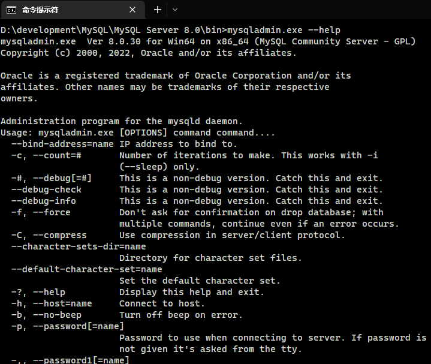
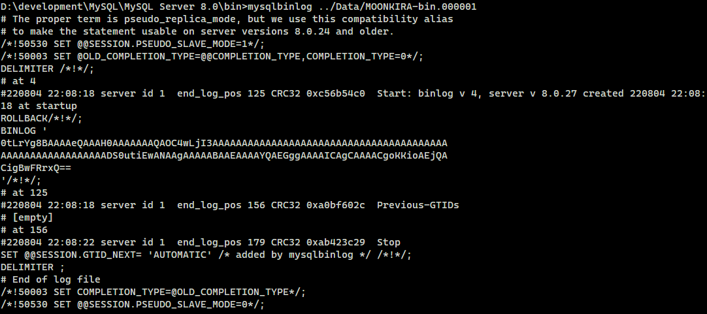
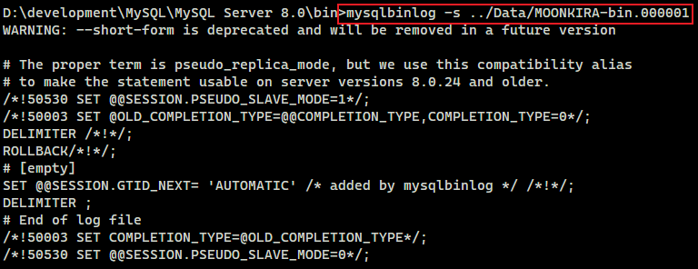
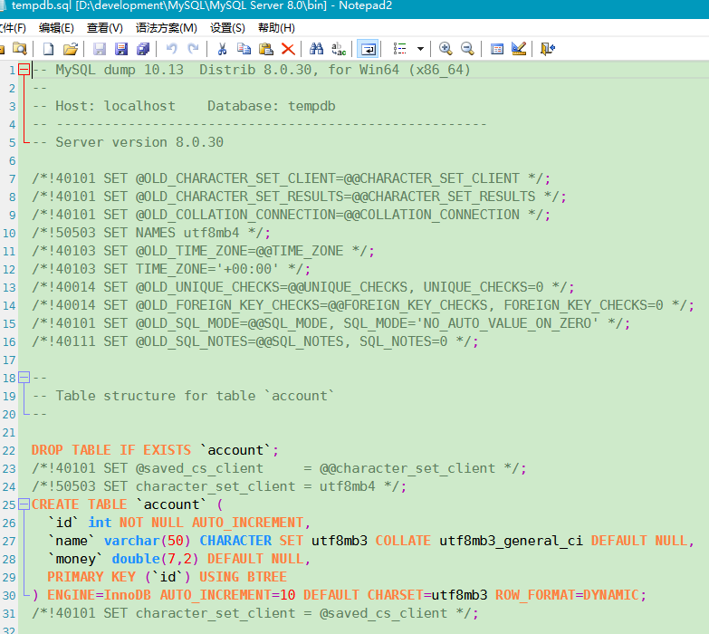
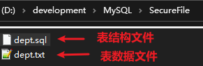
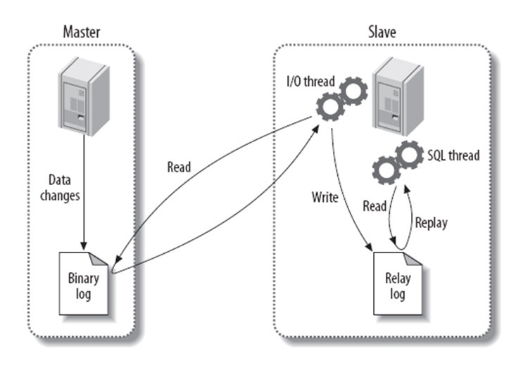
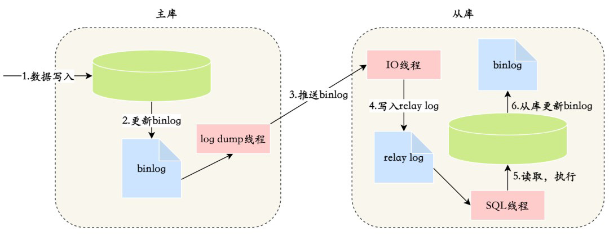

> MySQL 运维篇

## 1. MySQL 常用工具

### 1.1. mysql 客户端工具

#### 1.1.1. 命令格式

此 mysql 并非指 mysql 服务，而是指 mysql 的客户端工具。命令语法如下：

```bash
mysql [options] [database]
```

命令选项说明：

| 选项（短） |      选项（长）       |       说明       |
| -------- | ------------------- | --------------- |
| `-u`     | `--user=name`       | 指定用户名        |
| `-p`     | `--password[=name]` | 指定密码          |
| `-h`     | `--host=name`       | 指定服务器IP或域名 |
| `-P`     | `--port=port`       | 指定连接端口       |
| `-e`     | `--execute=name`    | 执行SQL语句并退出  |

#### 1.1.2. 基础使用示例

示例：`-e` 选项可以在 Mysql 客户端执行 SQL 语句，而不用连接到 MySQL 数据库再执行，此方式对于一些批处理脚本尤其方便。

```bash
mysql -uroot –p123456 db01 -e "select * from stu";
```

```sql
MySQL Server 8.0\bin>mysql -h127.0.0.1 -P3306 -uroot -p123456 tempdb -e "select * from dept"
mysql: [Warning] Using a password on the command line interface can be insecure.
+----+----------+
| id | name     |
+----+----------+
|  1 | 研发部    |
|  2 | 市场部    |
|  3 | 财务部    |
|  4 | 销售部    |
|  5 | 总经办    |
|  6 | 人事部    |
+----+----------+
```

> Notes: 执行完毕，并未进入 MySQL 客户端命令行。但一般不建议这样使用，因为会暴露数据库用户密码。

#### 1.1.3. mysql 命令加载（导入）表数据

可以通过 mysql 命令，直接加载（导入）表数据。语法格式：

```bash
mysql -u用户名 -p密码 数据库名 < 数据文件的路径
```

### 1.2. mysqladmin 管理操作的客户端

mysqladmin 是一个执行管理操作的客户端程序。可以用它来检查服务器的配置和当前状态、创建并删除数据库等。

通过帮助文档查看选项：

```bash
mysqladmin --help
```



命令语法如下：

```bash
mysqladmin [options] command ...
```

命令选项说明：

| 选项（短） |      选项（长）       |       说明        |
| --------- | ------------------- | ----------------- |
| `-u`      | `--user=name`       | 指定用户名         |
| `-p`      | `--password[=name]` | 指定密码           |
| `-h`      | `--host=name`       | 指定服务器IP或域名 |
| `-P`      | `--port=port`       | 指定连接端口       |

示例：

```bash
mysqladmin -uroot –p1234 drop 'test01'
mysqladmin -uroot –p1234 version
```


### 1.3. mysqlbinlog 日志管理工具

由于服务器生成的二进制日志文件以二进制格式保存，所以如果想要检查这些文本的文本格式，就需要使用 mysqlbinlog 日志管理工具。命令语法如下：

```bash
mysqlbinlog [options] log-files1 log-files2 ...
```

命令选项说明：

| 选项（短） |                    选项（长）                     |                  说明                  |
| --------- | ----------------------------------------------- | -------------------------------------- |
| `-d`      | `--database=name`                               | 指定数据库名称，只列出指定的数据库相关操作 |
| `-o`      | `--offset=#`                                    | 忽略掉日志中的前n行命令                  |
| `-r`      | `--result-file=name`                            | 将输出的文本格式日志输出到指定文件         |
| `-s`      | `--short-form`                                  | 显示简单格式，省略掉一些信息              |
|           | `--start-datatime=date1 --stop-datetime=date2 ` | 指定日期间隔内的所有日志                 |
|           | `--start-position=pos1 --stop-position=pos2`    | 指定位置间隔内的所有日志                 |

示例：查看 binlog.000001这个二进制文件中的数据信息



上述查看到的二进制日志文件数据信息量太多了，不方便查询。可以加上一个参数 `-s` 来显示简单格式。



### 1.4. mysqlshow 对象查找工具

mysqlshow 客户端对象查找工具，用来很快地查找存在哪些数据库、数据库中的表、表中的列或者索引。

命令语法如下：

```bash
mysqlshow [options] [db_name [table_name [col_name]]]
```

命令选项说明：

| 选项（短） | 选项（长）  |                     说明                     |
| --------- | --------- | -------------------------------------------- |
|           | `--count` | 显示数据库及表的统计信息（数据库、表，均可以不指定） |
| `-i`      |           | 显示指定数据库或者指定表的状态信息                |

示例1：查询每个数据库的表的数量及表中记录的数量

```sql
MySQL Server 8.0\bin>mysqlshow -uroot -p123456 --count
mysqlshow: [Warning] Using a password on the command line interface can be insecure.
+------------------------+--------+--------------+
|       Databases        | Tables |  Total Rows  |
+------------------------+--------+--------------+
| activiti_sample        |     25 |           18 |
| apolloconfigdb         |     16 |         5154 |
| apolloconfigdbpro      |     15 |           60 |
| apolloportaldb         |     14 |         2967 |
| information_schema     |     79 |        24620 |
| jav_db                 |      4 |        23543 |
| jav_db_test            |      4 |           24 |
| mybatis_plus_sample_db |      5 |           30 |
| mysql                  |     37 |         5343 |
| nacos                  |     12 |           20 |
| performance_schema     |    111 |       262769 |
| sys                    |    101 |         7477 |
| tempdb                 |     28 |     10010851 |
+------------------------+--------+--------------+
```

示例2：查看数据库 tempdb 的统计信息

```sql
MySQL Server 8.0\bin>mysqlshow -uroot -p123456 tempdb --count
mysqlshow: [Warning] Using a password on the command line interface can be insecure.
Database: tempdb
+---------------------+----------+------------+
|       Tables        | Columns  | Total Rows |
+---------------------+----------+------------+
| account             |        3 |          7 |
| course              |        2 |          4 |
| dept                |        2 |          6 |
| emp                 |        8 |         17 |
| employee            |        5 |          6 |
| order_exp           |        7 |      10567 |
| order_exp_cut       |        7 |          2 |
| s1                  |        7 |          3 |
| s2                  |        7 |          3 |
| salgrade            |        3 |          8 |
| score               |        3 |          5 |
| student             |        3 |          4 |
| student_course      |        3 |          6 |
| tb_sku              |       17 |   10000000 |
| tb_stu_course_view  |        3 |          6 |
| tb_user             |        9 |         24 |
| tb_user_view        |        7 |         24 |
| teacher             |        3 |          5 |
| user                |        3 |          3 |
+---------------------+----------+------------+
```

示例3：查看数据库 tempdb 中的 course 表的信息

```sql
MySQL Server 8.0\bin>mysqlshow -uroot -p123456 tempdb course --count
mysqlshow: [Warning] Using a password on the command line interface can be insecure.
Database: tempdb  Table: course  Rows: 4
+-------+-------------+--------------------+------+-----+---------+----------------+---------------------------------+----------+
| Field | Type        | Collation          | Null | Key | Default | Extra          | Privileges                      | Comment  |
+-------+-------------+--------------------+------+-----+---------+----------------+---------------------------------+----------+
| id    | int         |                    | NO   | PRI |         | auto_increment | select,insert,update,references |  主键ID   |
| name  | varchar(10) | utf8mb4_general_ci | YES  |     |         |                | select,insert,update,references |  课程名称 |
+-------+-------------+--------------------+------+-----+---------+----------------+---------------------------------+----------+
```

示例4：查看数据库 tempdb 中的 course 表的 id 字段的信息

```sql
MySQL Server 8.0\bin>mysqlshow -uroot -p123456 tempdb course id --count
mysqlshow: [Warning] Using a password on the command line interface can be insecure.
Database: tempdb  Table: course  Rows: 4  Wildcard: id
+-------+------+-----------+------+-----+---------+----------------+---------------------------------+---------+
| Field | Type | Collation | Null | Key | Default | Extra          | Privileges                      | Comment |
+-------+------+-----------+------+-----+---------+----------------+---------------------------------+---------+
| id    | int  |           | NO   | PRI |         | auto_increment | select,insert,update,references | 主键ID  |
+-------+------+-----------+------+-----+---------+----------------+---------------------------------+---------+
```

### 1.5. mysqldump 数据备份迁移工具

mysqldump 客户端工具用来备份数据库或在不同数据库之间进行数据迁移。备份内容包含创建表，及插入表的 SQL 语句。命令语法如下：

```bash
mysqldump [options] db_name [tables]

mysqldump [options] --database/-B db1 [db2 db3...]

mysqldump [options] --all-databases/-A
```

连接选项说明：

| 选项（短） |      选项（长）       |       说明       |
| --------- | ------------------- | --------------- |
| `-u`      | `--user=name`       | 指定用户名        |
| `-p`      | `--password[=name]` | 指定密码          |
| `-h`      | `--host=name`       | 指定服务器IP或域名 |
| `-P`      | `--port=port`       | 指定连接端口       |

输出选项说明：

| 选项（短） |       选项（长）        |                                    说明                                    |
| --------- | --------------------- | ------------------------------------------------------------------------- |
|           | `--add-drop-database` | 在每个数据库创建语句前加上 drop database 语句                                  |
|           | `--add-drop-table`    | 在每个表创建语句前加上 drop table 语句，默认开启；不开启 (--skip-add-drop-table) |
| `-n`      | `--no-create-db`      | 不包含数据库的创建语句                                                        |
| `-t`      | `--no-create-info`    | 不包含数据表的创建语句                                                        |
| `-d`      | `--no-data`           | 不包含数据                                                                  |
| `-T`      | `--tab=name`          | 自动生成两个文件：一个.sql文件，创建表结构的语句；一个.txt文件，数据文件            |

#### 1.5.1. 备份整个数据库

示例：备份 tempdb 数据库

```bash
mysqldump -uroot -p123456 tempdb > tempdb.sql
```



备份出来的数据包含：

- 删除表的语句
- 创建表的语句
- 数据插入语句

如果在数据备份时，不需要创建表，或者不需要备份数据，只需要备份表结构，都可以通过对应的参数来实现。

#### 1.5.2. 备份数据库中表数据

示例：备份 tempdb 数据库中的表数据，不备份表结构(`-t`)

```bash
mysqldump -uroot -p123456 -t tempdb > tempdb.sql
```

打开 tempdb.sql 查看备份的数据，只有 insert 语句，没有备份表结构。

#### 1.5.3. 数据库的表结构与数据分开备份

示例：将 tempdb 数据库的表结构与数据分开备份(`-T`)

```sql
MySQL Server 8.0\bin>mysqldump -uroot -p123456 -T E:/ tempdb dept
mysqldump: [Warning] Using a password on the command line interface can be insecure.
mysqldump: Got error: 1290: The MySQL server is running with the --secure-file-priv option so it cannot execute this statement when executing 'SELECT INTO OUTFILE'
```

执行上述指令时会出错，数据不能完成备份。原因是因为指定的数据存放目录 `E:/`，MySQL 认为是不安全的，需要存储在 MySQL 信任的目录下。可以通过系统变量 `secure_file_priv` 查看信任的目录。执行结果如下：

```sql
mysql> show variables like '%secure_file_priv%';
+------------------+----------------------------------+
| Variable_name    | Value                            |
+------------------+----------------------------------+
| secure_file_priv | D:\development\MySQL\SecureFile\ |
+------------------+----------------------------------+
```

修改数据保存的目录后(如果目录有空格，执行命令会报错，修改my.ini文件使用无空格的目录吧-_-!)，再执行命令：

```sql
mysqldump -uroot -p123456 -T D:\development\MySQL\SecureFile\ tempdb dept
```



上述的两个文件 dept.sql 中记录的就是表结构文件，而 dept.txt 就是表数据文件，但是需要注意表数据文件，并不是记录一条条的insert语句，而是按照一定的格式记录表结构中的数据。如下：


### 1.6. mysqlimport 文本数据导入工具

mysqlimport 是客户端数据导入工具，用来导入 `mysqldump` 命令加 `-T` 参数后导出的文本文件。命令语法如下：

```bash
mysqlimport [options] db_name textfile1 [textfile2...]
```

示例：

```sql
mysqlimport -uroot -p123456 test /tmp/dept.txt
```

### 1.7. source 脚本数据导入工具

如果需要导入 sql 文件，可以使用 MySQL 客户端的 `source` 指令将 sql 文件导入到当前数据库中。命令语法如下：

```bash
use 数据库名;
-- 指定导入文件的路径
source /root/xxxxx.sql
```

> Notes: **需要先选择数据库**

### 1.8. 图形化客户端（SQLyog）备份与恢复

> *以 SQLyog 客户端为例，其他图形化客户端参考同样的操作思路*

#### 1.8.1. SQL备份（导出）

选中数据库，右键 -> 『备份/导出』 -> 以SQL转储文件备份数据库，指定导出路径，保存成 `.sql` 文件即可。

#### 1.8.2. SQL恢复（导入）

数据库列表区域右键『从 SQL 转储文件导入数据库』，指定要执行的 SQL 文件，执行即可

## 2. Mysql 全局配置参数最佳实践

针对服务端进行优化，需要对配置文件 my.ini 或 my.cnf 的设置一些全局参数，以下配置项默认在配置文件的 [mysqld] 标签下。

以下示例配置假设服务器配置为：

- CPU：32核
- 内存：64G
- DISK：2T SSD

### 2.1. 最大连接数

连接的创建和销毁都需要系统资源，比如内存、文件句柄，业务说的支持多少并发，指的是每秒请求数，也就是QPS。一个连接最少占用内存是256K，最大是64M，如果一个连接的请求数据超过64MB（比如排序），就会申请临时空间，放到硬盘上。

如果3000个用户同时连上mysql，最小需要内存`3000*256KB=750M`，最大需要内存`3000*64MB=192G`。如果 innodb_buffer_pool_size 是40GB，给操作系统分配4G，给连接使用的最大内存不到20G，如果连接过多，使用的内存超过20G，将会产生磁盘SWAP，此时将会影响性能。连接数过高，不一定带来吞吐量的提高，而且可能占用更多的系统资源。以下是参考配置值：

```properties
max_connections=3000
```

### 2.2. 用户连接的最大数量

此配置是设置允许用户连接的最大数量，与`max_connections`相减后，剩余连接数用作DBA管理。以下是参考配置值：

```properties
max_user_connections=2980
```

### 2.3. 暂存连接数量

MySQL 能够暂存的连接数量。如果 MySQL 的连接数达到 `max_connections` 配置项的值时，新的请求将会被存在堆栈中，等待某一连接释放资源，该堆栈数量即 `back_log`，如果等待连接的数量超过`back_log`，将被拒绝。以下是参考配置值：

```properties
back_log=300
```

### 2.4. 空闲连接超时时间

`wait_timeout` 配置项是指 app 应用通过 jdbc 连接 mysql 进行操作完毕后，空闲多少时间后断开连接，单位是秒。默认是28800秒（即8个小时）。以下是参考配置值：

```properties
wait_timeout=300
```

`interactive_timeout` 配置项是指 MySQL Client 操作完毕后，空闲多少时间后断开连接，单位是秒。默认是28800秒（即8个小时）。以下是参考配置值：

```properties
interactive_timeout=300
```

### 2.5. innodb 线程的并发数

`innodb_thread_concurrency` 参数用来设置 innodb 线程的并发数，默认值为0表示不被限制，一般设置与服务器的CPU核心数相同或是CPU的核心数的2倍，如果超过配置并发数，则需要排队，这个值不宜太大，不然可能会导致线程之间锁争用严重，影响性能。以下是参考配置值：

```properties
innodb_thread_concurrency=64
```

### 2.6. innodb 存储引擎 buffer pool 缓存大小

`innodb_buffer_pool_size` 配置项用于设置 innodb 存储引擎 buffer pool 缓存大小，一般为物理内存的60%-70%。。以下是参考配置值：

```properties
 innodb_buffer_pool_size=40G
```

### 2.7. 行锁锁定时间

`innodb_lock_wait_timeout` 配置项用于设置行锁锁定时间，默认50s，根据公司业务定，没有标准值。以下是参考配置值：

```properties
innodb_lock_wait_timeout=10
```

### 2.8. redo log 的写入策略

`innodb_flush_log_at_trx_commit` 配置项用于的控制制 redo log 的写入策略。以下是参考配置值：

```properties
innodb_flush_log_at_trx_commit=1
```

### 2.9. binlog 写入磁盘机制

`sync_binlog` 配置项是指 binlog 写入磁盘机制的策略。以下是参考配置值：

```properties
sync_binlog=1
```

### 2.10. 排序缓冲区大小

每个需要排序的线程分配该大小的一个缓冲区。增加该值可以加速 ORDER BY 或 GROUP BY 操作。

sort_buffer_size 配置项是指定排序缓冲区的大小，是一个 connection 级的参数，在每个 connection（session）第一次需要使用这个 buffer 的时候，一次性分配设置的内存。sort_buffer_size 并不是越大越好，由于是 connection 级的参数，过大的设置+高并发可能会耗尽系统的内存资源。例如：500个连接将会消耗`500*sort_buffer_size(4M)=2G`。

以下是参考配置值：

```properties
sort_buffer_size=4M
```

### 2.11. 关联缓存区大小

join_buffer_size 配置项用于表关联缓存的大小，和 `sort_buffer_size` 一样，该参数对应的分配内存也是每个连接独享。以下是参考配置值：

```properties
join_buffer_size=4M
```

## 3. 主从复制

### 3.1. 概述

主从同步使得数据可以从一个数据库服务器复制到其他服务器上，在复制数据时，一个服务器充当主服务器（master），其余的服务器充当从服务器（slave）。

因为复制是异步进行的，所以从服务器不需要一直连接着主服务器，从服务器甚至可以通过拨号断断续续地连接主服务器。通过配置文件，可以指定复制所有的数据库，某个数据库，甚至是某个数据库上的某个表。

**主从复制的优点**：

1. **高可用性**：当主数据库发生故障时，可以快速切换到从数据库作为新的主数据库，实现故障切换，从而提高系统的可用性。
2. **读写分离**：可以将读操作分发到从数据库上，使数据库能支撑更大的并发，减轻主数据库的负载，提高整体的读性能。
3. **数据备份**：从数据库可以作为主数据库的备份，用于恢复数据和灾难恢复，保证数据的安全。
4. **分析数据**：在主服务器上生成实时数据，而在从服务器上分析这些数据，从而提高主服务器的性能。

需要注意的是，主从复制并不适用于所有的场景，它具有一些限制和注意事项：

1. 主从复制不是强一致性，只能保证最终一致。
2. master 配合 binlog 复制会影响性能，所以尽量不要在 master 上挂太多的 slave，如果对时间要求不高，可以在 slave 上挂 slave。
3. 会存在主从延迟的问题

因此在使用主从复制时，需要仔细考虑系统需求和架构，并进行适当的监控和维护。

### 3.2. 主从复制配置流程

主从复制的设置步骤如下：

1. **配置主数据库**：在主数据库上启用二进制日志，设置一个唯一的服务器 ID，并在需要复制的数据库中创建一个专门用于复制的账户。
2. **配置从数据库**：在从数据库上设置一个唯一的服务器 ID，并配置连接主数据库的相关参数，如主数据库的 IP 地址、账户信息等。
3. **启动主从复制**：在从数据库上启动复制进程，连接到主数据库并开始复制主数据库的数据。

一旦主从复制设置完成，主数据库上的写操作将自动复制到从数据库上，从而实现数据的同步复制。应用程序可以通过读写分离的方式，将读操作发送到从数据库上，以提高系统的读性能。

### 3.3. 主从复制过程





> 日志名词解释：
>
> - Binary log：主数据库的二进制日志
> - Relay log：从服务器的中继日志

有3个线程以及之间的关联，基本原理流程如下：

- 第一步：master 在每个事务更新数据完成之前，开启 binlog 线程，将所有改变数据库的操作记录串行地写入到 master 的 binlog 文件中。
- 第二步：salve 开启一个 I/O Thread，该线程在 master 打开一个普通连接，主要工作是 binlog dump process。如果读取的进度已经跟上了 master，就进入睡眠状态并等待 master 产生新的事件。I/O 线程最终的目的是将 master 的 binlog 内容写入到自己的 relay log（中继日志）中。
- 第三步：salve 开启一个 SQL Thread，会读取 relay log（中继日志），并顺序执行该日志中的 SQL 事件，从而与主数据库中的数据保持一致。

### 3.4. 数据复制方式

由于 **MySQL 默认的复制方式是异步的**，主库把日志发送给从库后不关心从库是否已经处理成功。假设主库挂了，从库处理失败了，此时从库升为主库后，日志就丢失了。因此有以下两种同步方式：

- **全同步复制**：主库写入 binlog 后强制同步日志到从库，所有的从库都执行完成后才返回给客户端，显然此方式的性能十分低。
- **半同步复制**：与全同步复制不同是，从库写入日志成功后返回 ACK 确认给主库，主库收到至少一个从库的确认就认为写操作完成。

### 3.5. 主从延迟

#### 3.5.1. 产生原因

主从延迟：主库和备库在执行同一个事务的时候出现时间差的问题，主要原因有：

- 一个服务器开放 N 个链接给客户端来连接的，这样有会有大并发的更新操作，但是从服务器的里面读取 binlog 的线程仅有一个，当某个 SQL 在从服务器上执行的时间稍长或者由于某个 SQL 要进行锁表就会导致，主服务器的 SQL 大量积压，未被同步到从服务器里。
- 有些部署条件下，备库所在机器的性能要比主库性能差。
- 备库的压力较大。
- 大事务，一个主库上语句执行 10 分钟，那么这个事务可能会导致从库延迟 10 分钟。

#### 3.5.2. 解决方案

解决主从复制延迟有几种常见的方法：

1. **写操作后的读操作指定发给数据库主服务器**。例如，注册账号完成后，登录时读取账号的读操作也发给数据库主服务器。但这种方式和业务强绑定，对业务的侵入和影响较大。
2. **读从机失败后再读一次主机**。这就是通常所说的『二次读取』，二次读取和业务无绑定，只需要对底层数据库访问的 API 进行封装即可，实现代价较小。不足之处在于如果有很多二次读取，将大大增加主机的读操作压力。例如，黑客暴力破解账号，会导致大量的二次读取操作，主机可能顶不住读操作的压力从而崩溃。
3. **关键业务读写操作全部指向主机，非关键业务采用读写分离**。例如，对于一个用户管理系统来说，注册与登录的业务读写操作全部访问主机，用户的介绍、爰好、等级等业务，可以采用读写分离。因为即使用户修改了自己的自我介绍后查询时还是旧的数据，业务影响与不能登录功能，还可以接受。

## 4. 读写分离（待整理）

> Tips: 待整理
