## 1. Oracle 的基本概念

ORACLE 数据库系统是美国 ORACLE 公司（甲骨文）提供的以分布式数据库为核心的一组软件产品，是目前最流行的客户/服务器(CLIENT/SERVER)或 B/S 体系结构的数据库之一。

**Oracle默认的端口号是：1521**

### 1.1. 在虚拟机中安装Oracle

在安装完成前将scott和hr的两个账号解锁，可以设置新口令，如果使用默认的口令是:tiger

在虚拟机中验证Oracle是否安装成功

1. 打开“运行”，输入cmd，进行命令行。输入sqlplus system/口令密码
2. 登陆成功后可以查询Oracle里面的表格测试一下

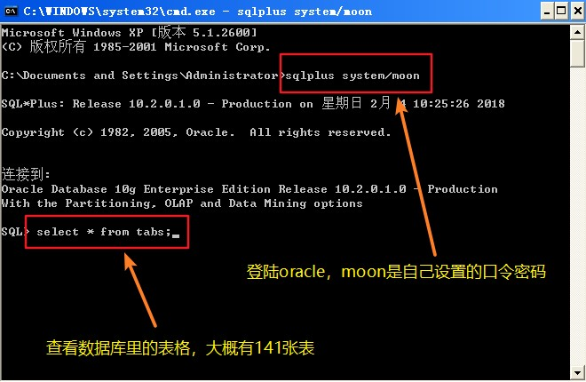

### 1.2. 虚拟网卡设置

本机和虚拟机之间能相互访问，它们的 IP 段必须相同，配置方式如下

1. 为虚拟机添加虚拟网卡

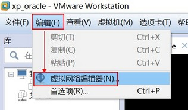

2. 开启修改权限，点击下图的“更改设置”

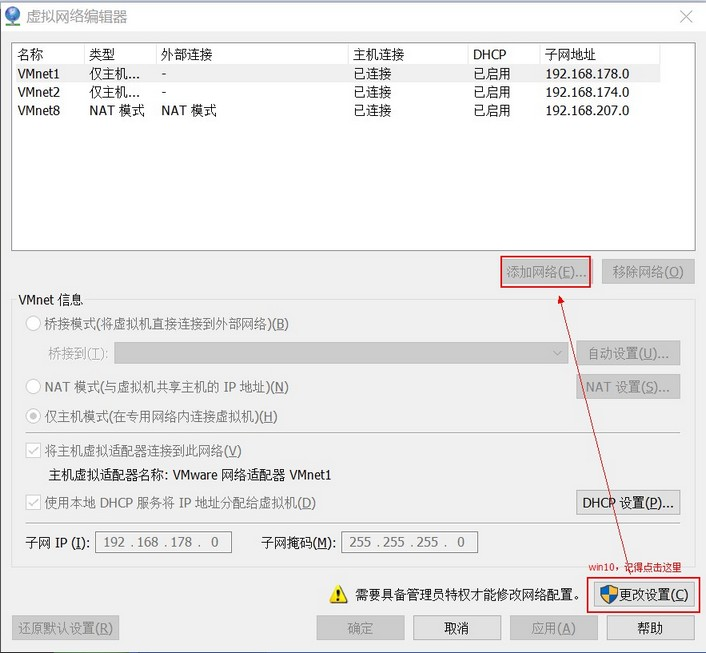

3. 点击添加网络

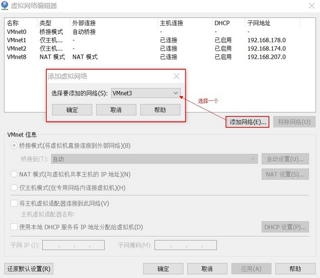

4. 添加后会自动分配子网IP，不用修改。点击应用、确定

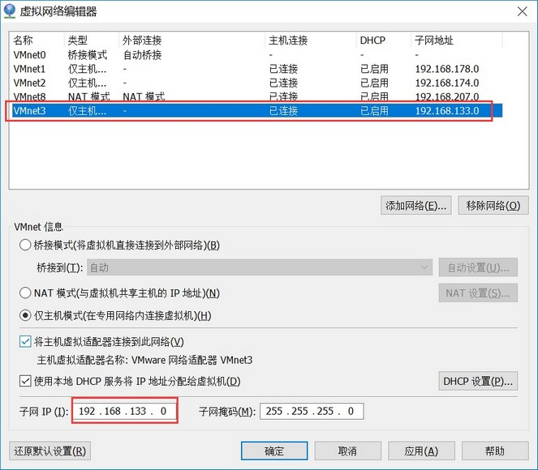

5. 添加完成后本机的网络上会多出一个网络适配器，根据虚拟机中的子网IP设置此IP地址

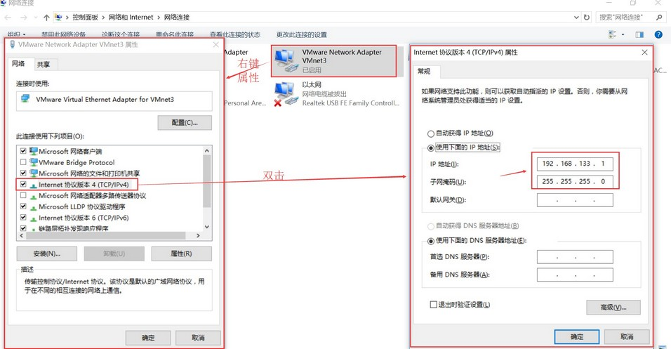

6. 自定义虚拟机的网络适配器，自定义为刚才手动添加的那个网络适配器

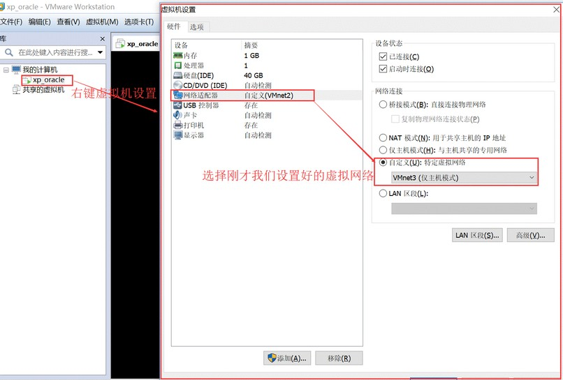

7. 回到XP虚拟机中设置IP，记得要与上述中的虚拟网络设置成同一网段的即可，比如我们设置为192.168.133.10

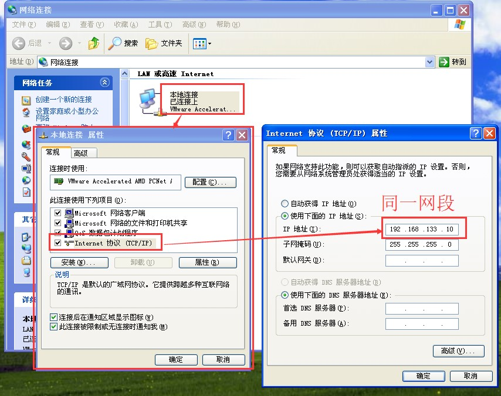

8. 修改Oracle的两个核心文件，进入虚拟机找到Oracle的安装目录

    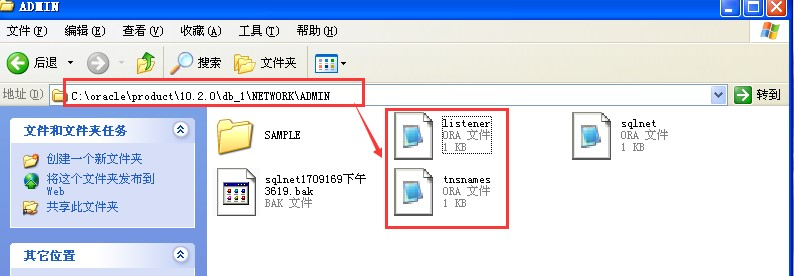  
    - 打开listener.ora把红色框的内容改为我们刚才设置的虚拟机的ip地址: 192.168.133.10  
    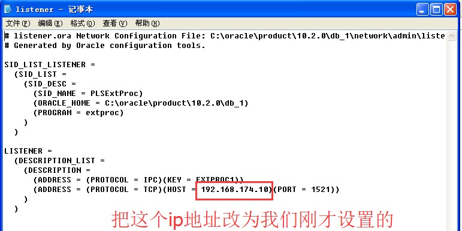
    - 打开tnsname.ora把红色框的内容改为虚拟机的IP: 192.168.133.10  
    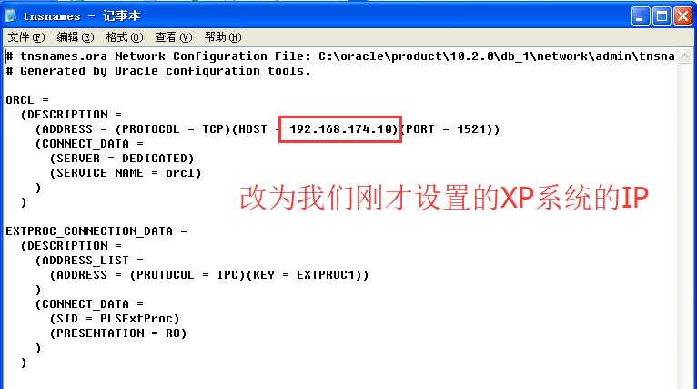

9. 重启Oracle的两个服务

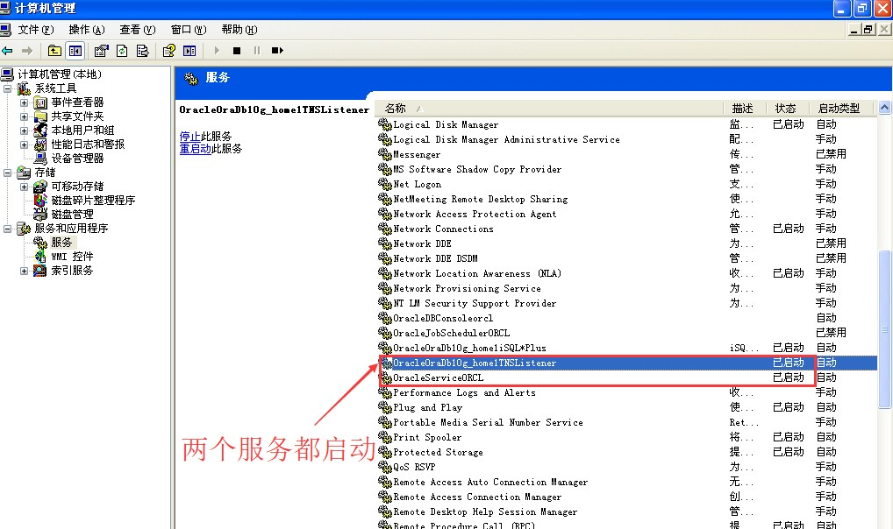

配置好测试一下是否ping通

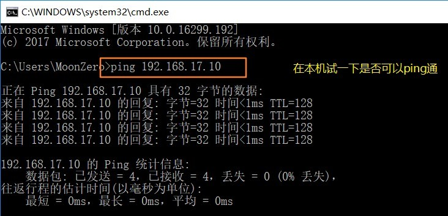

### 1.3. PLSQL Developer 客户端工具的安装

参考文档：G:\Java编程工具资料\数据库\Oracle数据库安装视频教程\02、测试sqlplus客户端连接服务器.doc

命令行输入

```shell
sqlplus system/moon@192.168.17.10:1521/orcl
```

- 格式：`sqlplus system/密码@远程IP:1521/orcl`
- 注：moon是自己设置的口令密码，**orcl是安装oracle时填写的全局数据库名！！！！！**

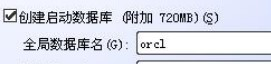

### 1.4. 安装 PLSQL Developer 客户端

参考文档：G:\Java编程工具资料\数据库\Oracle数据库安装视频教程\03、安装PLSQL并测试连接.doc

### 1.5. 中文乱码的处理

1. 查看服务器端编码

```sql
select userenv('language') from dual;
-- 实际查到的结果为：AMERICAN_AMERICA.ZHS16GBK
```

2. 执行语句 `select * from V$NLS_PARAMETERS`
    - 查看第一行中PARAMETER项中为NLS_LANGUAGE对应的VALUE项中是否和第一步得到的值一样。如果不是，需要设置环境变量。
    - 否则PLSQL客户端使用的编码和服务器端编码不一致，插入中文时就会出现乱码。
3. 设置环境变量
    - 计算机 --> 属性 --> 高级系统设置 --> 环境变量 --> 新建
    - 设置变量名：`NLS_LANG`
    - 变量值：第1步查到的值: `AMERICAN_AMERICA.ZHS16GBK`
4. 重新启动PLSQL，插入数据正常

### 1.6. 本次安装oracle相关信息

- system口令：moon
- SCOTT的口令:123456
- HR的口令:123456
- oracle连接的虚拟网络
    - 子网IP:192.168.187.0	；子网掩码:255.255.255.0
    - win10设置VMware Network Adapter VMnet5：
        - 子网IP:192.168.187.1；子网掩码:255.255.255.0
    - 虚拟机XP系统设置
        - 子网IP:192.168.187.10；子网掩码:255.255.255.0

## 2. Oracle 数据库的体系结构

- 数据库：一个操作系统只有一个 oracle 数据库
- 实例：数据库的后台的一系列进程，一个计算机只有一个实例
- 数据文件（dbf）：数据库软件操作的
- 表空间：一个表空间可以有多个数据文件，但是一个数据文件只属于一个表空间
- 用户：用户操作表空间

### 2.1. 数据库：database

Oracle 数据库是数据的物理存储。这就包括（数据文件 ORA 或者 DBF、控制文件、联机日志、参数文件）。其实 Oracle 数据库的概念和其它数据库不一样，**一个操作系统只有一个oracle数据库**。可以看作是 Oracle 就只有一个大数据库

### 2.2. 实例（Oracle Instance）

**一个计算机只有一个 Oracle 实例**。

一个 Oracle 实例（Oracle Instance）有一系列的后台进程（Backguound Processes)和内存结构（Memory Structures)组成。一个数据库可以有 n 个实例。

### 2.3. 数据文件（dbf）

数据文件(.dbf)，由数据库软件操作的。

数据文件是数据库的物理存储单位。数据库的数据是存储在表空间中的，真正是在某一个或者多个数据文件中。而一个表空间可以由一个或多个数据文件组成，一个数据文件只能属于一个表空间。一旦数据文件被加入到某个表空间后，就不能删除这个文件，**如果要删除某个数据文件，只能删除其所属于的表空间才行**。

- **数据块**：最小的存储单位。
- **段**：一组具有特定用途的数据块，如表段和索引段。
- **区（Extent）**：由连续数据块组成，用于存储特定的段。

### 2.4. 表空间

表空间是 Oracle 对物理数据库上相关数据文件（ORA 或者 DBF 文件）的逻辑映射。一个数据库在逻辑上被划分成一到若干个表空间，每个表空间包含了在逻辑上相关联的一组结构。每个数据库至少有一个表空间(称之为 system 表空间)。每个表空间由同一磁盘上的一个或多个数据文件组成，这些文件叫数据文件(datafile)。**一个数据文件只能属于一个表空间**。

### 2.5. 用户

#### 2.5.1. 概述

用户是在实例下建立的。不同实例中可以建相同名字的用户。

> 注：表的数据，是有用户放入某一个表空间的，而这个表空间会随机把这些表数据放到一个或者多个数据文件中。

由于 oracle 的数据库不是普通的概念，oracle 是有用户和表空间对数据进行管理和存放的。但是表不是有表空间去查询的，而是由用户去查的。因为不同用户可以在同一个表空间建立同一个名字的表！这里区分就是用户了！

#### 2.5.2. SCOTT 用户和 HR 用户

SCOTT 与 HR 就是初始的普通用户，这些用户下面都默认存在了表结构。scott用户与hr用户的表结构：

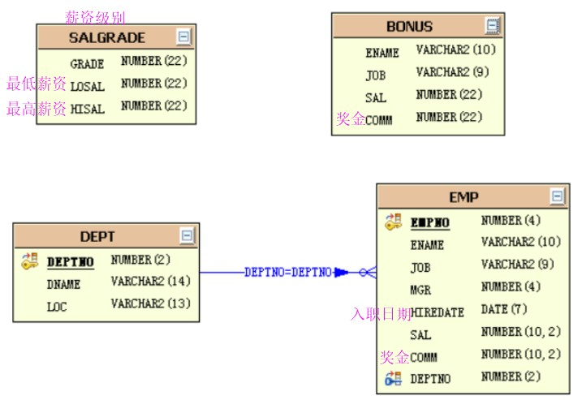

## 3. Oracle 的 SQL 语法

### 3.1. SQL 简介

结构化查询语言(Structured Query Language)简称 SQL。结构化查询语言是一种数据库查询和程序设计语言，用于存取数据以及查询、更新和管理关系数据库系统；同时也是数据库脚本文件的扩展名

- DML(数据库操作语言): 其语句包括动词 `INSERT`，`UPDATE` 和 `DELETE`。它们分别用于添加，修改和删除表中的行。也称为动作查询语言。
- DDL(数据库定义语言): 其语句包括动词 `CREATE` 和 `DROP`。在数据库中创建新表或删除表（`CREAT TABLE` 或 `DROP TABLE`）；为表加入索引等。DDL 包括许多与人数据库目录中获得数据有关的保留字。它也是动作查询的一部分。
- DCL(数据库控制语言):它的语句通过 `GRANT` 或 `REVOKE` 获得许可，确定单个用户和用户组对数据库对象的访问。某些 `RDBMS` 可用 `GRANT` 或 `REVOKE` 控制对表单个列的访问。

### 3.2. Oracle 语法注意事项

#### 3.2.1. Oracle 语句大小写问题

oracle中分为两种情况，单纯的sql语句不区分大小写，但是如果查询某个字符的话就需要区分大小写。

1. 如以下情况，是不区分大小写的，查询结果都是一致的：

```sql
select * from emp;
SELECT * FROM EMP;
```

2. 如在emp表中查询ename为"SMITH"（不含引号）的信息，就必须注意大小写：

```sql
select * from emp where ename='SMITH';
```

#### 3.2.2. dual 伪表

***dual：是oracle提供的一张伪表，用于补全sql语法***

```sql
select upper('abc');  // 执行会报错
select upper('abc') from dual;  // 这样才可以执行
```

## 4. Oracle 查询操作

### 4.1. Oracle 完整的查询 SQL 语法

```sql
select
    *|指定的列名
from
    表名
where
    条件
group by
    分组
having
    条件
order by
    排序
```

### 4.2. Select 语句的语法格式

```sql
select *|{[distinct column|expression [aliad],……]}
		from table;
```

#### 4.2.1. 查询语法

```sql
select *|列名 from 表名
```

示例

```sql
-- 查询所有
select * from emp;
-- 查询部分列
select ename,job from emp;
```

#### 4.2.2. 别名用法

在查询的结果列中可以使用别名，<font color=red>**后面的中文只能用双引号**</font>，一般的别名都不用中文

```sql
select 列名 别名, 列名 别名, …… from 表名;
```

<font color=red>**别名中，有没有双引号的区别就在于别名中有没有特殊的符号或者关键字**</font>。示例如下：

```sql
-- 别名用法
select ename "员工名称", job "工作内容" from emp;
```

#### 4.2.3. 消除重复的数据

使用 `distinct` 可以消除重复的行，如果查询多列的必须保证多列都重复才能去掉重复

```sql
select distinct *|列名, ... from 表名;
```

示例：

```sql
-- 消除重复的数据
select distinct ename from emp;
```

#### 4.2.4. 查询中四则运算

sql 中支持四则运算【`+`，`-`，`*`，`/`】

Code Dome:

```sql
--查询员工的年薪:空值是oracle里面最大的
select ename, sal*12 from emp;
-- 这里有点问题：如果comm是空的，那么所有数据都是空的
select ename, sal*12+comm from emp;
--nvl函数，判断空值用的 第一个参是值，第二参数：如果第一个参数是null，那么就用第二个参数来替换
select ename, sal*12+nvl(comm, 0) from emp;
```

### 4.3. 空值

空值是无效的，未指定的，未知的或不可预知的值。空值不是空格或者0。注意事项如下：

1. 包含 `null` 的表达式都为 `null`
2. 空值永远不等于空值
3. 空值是oracle里面最大的

### 4.4. 连接符 ||

字符串的连接使用“`||`”。示例如下：

```sql
-- 使用||拼接字符
select 'abc' || 'def' || 'ghi'  from dual;
```

### 4.5. 使用 where 语句对结果进行过滤语法

```sql
select *|{[distinct column|expression [aliad],……]}
from table
[where condition(s)]
```

### 4.6. 运算符

#### 4.6.1. 比较运算符

|   操作符    |      含义      |
| :--------: | ------------- |
|    `=`     | 等于(不是`==`) |
|    `>`     | 大于           |
|    `>=`    | 大于等于       |
|    `<`     | 小于           |
|    `<=`    | 小于等于       |
| `<>`或`!=` | 不等于         |

> <font color=red>**注：赋值使用 `:=` 符号**</font>

```sql
-- 查询薪资大于1500 
select * from emp where sal > 1500;

-- 查询薪资大于600，并且有奖金的员工
select * from emp where sal > 600 and comm > 0;

-- 查询薪资大于等于1500 并且小于等于3000
select * from emp where sal >= 1500 and sal <= 3000;
```

#### 4.6.2. 其他比较运算符

|       操作符       |         含义         |
| :---------------: | -------------------- |
| `between … and …` | 在两个值之间(包含边界) |
|     `in(set)`     | 等于值列表中的一个     |
|      `like`       | 模糊查询              |
|     `is null`     | 空值                 |

```sql
-- 范围查询： between xx and XXX;   包括边界值
select * from emp where sal between 1500 and 3000;
```

#### 4.6.3. 逻辑运算符

| 操作符 |    含义     |
| :---: | ----------- |
| `and` | 逻辑并（与） |
| `or`  | 逻辑或       |
| `not` | 逻辑否       |

### 4.7. where 语句

#### 4.7.1. 非空和空的限制

只要字段中存在内容表示不为空，如果不存在内容就是 `null`，语法：

```sql
-- 列不为空
列名 IS NOT NULL
-- 列为空
列名 IS NULL
```

示例：

```sql
-- 查询薪资大于600，并且有奖金的员工
select * from emp where sal > 600 and comm is not null and comm > 0;
```

#### 4.7.2. 范围限制

指定了查询范围，那么 sql 可以使用 `IN` 关键字。语法：

```sql
-- 列的值在某个范围内
列名 IN (值1, 值2, ....)
-- 列的值不在某个范围内
列名 NOT IN (值1, 值2,...)
```

其中的值不仅可以是数值类型也可以是字符串

```sql
-- in操作 ：在某个数据内
select * from emp where deptno in(10, 20);
```

#### 4.7.3. 模糊查询

在 `LIKE` 关键字中主要使用以下两种通配符

- `%`：可以匹配任意长度的内容
- `_`：可以匹配一个长度的内容

在 LIKE 中如果没有关键字表示查询全部

```sql
-- 模糊查询 like
-- 查询名字中有个M 字符的
select * from emp where ename like '%M%';
-- 查询名字中第二个字母是M 字符的
select * from emp where ename like '_M%';
```

### 4.8. 使用 order by 对结果排序

#### 4.8.1. 排序语法

在 sql 中可以使用 `ORDER BY` 对查询结果进行排序。语法如下：

```sql
SELECT * |列名
    FROM 表名
    {WEHRE 查询条件}
    ORDER BY 列名 1 ASC|DESC，列名 2...ASC|DESC
```

`ORDER BY 列名`，默认的排序规则是升序排列，可以不指定 `ASC`，如果按着降序排列必须指定 `DESC`。如果存在多个排序字段可以用逗号分隔

> <font color=red>**注意：`ORDER BY` 语句要放在 sql 的最后执行**</font>

```sql
-- 工资从小到大排列
select * from emp order by sal asc;
-- 如果存在多个排序字段可以用逗号分隔
select * from emp order by sal asc, hiredate desc;
-- 如果出现Null就要注意
select * from emp where sal > 400 order by comm asc nulls first;
select * from emp where sal > 400 order by comm desc nulls last;
```

#### 4.8.2. 排序中的空值问题

当排序时有可能存在 `null` 时就会产生问题，可以用 `nulls first` , `nulls last` 来指定 `null` 值显示的位置

```sql
select * from emp order by sal nulls first;
select * from emp order by sal desc nulls last;
```

### 4.9. Oracle 分页查询

#### 4.9.1. Oracle 的伪列

分页操作需要伪列 `rownum`。

注意：不能使用大于号，如`rownum>6`，因为是每查询一行分配一个`rownum`，后面的还没有分配，所以得到的查询永远结果为空

#### 4.9.2. Oracle 分页的语法

```sql
select *
from (select rownum as xx,e.*
		from emp e) t
where xx >startIndex and xx <= maxResult;
```

**相关参数**：

- `startIndex = (currentPage-1)*pageSize`
- `maxResult = (currentPage-1)*pageSize + pageSize`
    - `startIndex`: 开始页数
    - `currentPage`: 当前页
    - `pageSize`: 每页大小
    - `maxResult`: 最大页数

#### 4.9.3. 示例

```sql
-- =======对员工表的工资排序【降序】之后，取出第二页每页3条记录
-- 先将表按工资进行排序
select * from emp
       order by sal desc,empno;
-- 以上面查询结果做为新表，增加rownum列
select rownum rnum,t.*
       from (select * from emp
       order by sal desc,empno) t;
-- 再以上面查询结果做为新表，以rownum做为查询索引
select *
   from (
        select rownum rnum,t.*
        from (
             select * from emp
             order by sal desc,empno
             ) t
        ) e
   where e.rnum>3 and e.rnum<=6;
```

### 4.10. 多表查询

#### 4.10.1. Oracle 的连接条件的类型

- 等值连接
- 不等值连接
- 外连接
- 自连接

#### 4.10.2. 多表连接基本查询

使用一张以上的表做查询就是多表查询。语法：

```sql
SELECT {DISTINCT} *|列名.. FROM 表名 别名，表名 1 别名
	{WHERE 限制条件ORDER BY 排序字段 ASC|DESC...}
```

这种多表查询也<font color=violet>相当于内连接</font>

示例：

```sql
-- 多表查询（笛卡尔积）
select * from emp,dept;

-- 多表关联查询
select * from emp e,dept d where e.deptno=d.deptno;
select e.empno,e.ename,d.deptno,d.dname,d.loc from emp e,dept d where e.deptno=d.deptno;

-- 自关联查询
-- 需求：查询出每个员工的上级领导
-- emp表中的mgr字段是当前雇员的上级领导的编号，所以该字段对emp表产生了自身关联，可以使用mgr字段和empno来关联
select e.empno,e.ename,e.mgr,e1.empno,e1.ename from emp e,emp e1 where e.mgr=e1.empno;

-- 需求：在上一个例子的基础上查询该员工的部门名称
-- 只要在上一个例子基础上再加一张表dept的关联，使用deptno来做关联字段
select e.empno,e.ename,e.mgr,e1.empno,e1.ename,e.deptno,d.dname
       from emp e,emp e1,dept d 
       where e.mgr=e1.empno
       and e.deptno=d.deptno;
-- 需求：查询出每个员工编号，姓名，部门名称，工资等级和他的上级领导的姓名，工资等级
select e.empno,e.ename,e.mgr,e.deptno,decode(s.grade,
             '1','等级1',
             '2','等级2',
             '3','等级3',
             '4','等级4',
             '5','等级5',
             '?') as "员工薪级",
       d.dname,e1.empno,e1.ename,
             case s1.grade
               when 1 then '等级1'
               when 2 then '等级2'
               when 3 then '等级3'
               when 4 then '等级4'
               else '等级5'
             end
             as "领导薪级" 
       from emp e,emp e1,dept d,salgrade s,salgrade s1
       where e.mgr=e1.empno
       and e.deptno=d.deptno
       and e.sal between s.losal and s.hisal
       and e1.sal between s1.losal and s1.hisal;
```

#### 4.10.3. 外连接（左右连接）

**右连接**

用右表的记录去匹配左表的记录，如果条件满足，则左边显示左表的记录；否则左边显示 null。（左表和右表取决于定义在实际语句的位置）

**右连接特点**：如果右外连接，右边的表的记录一定会全部显示完整

**左连接**

用左表的记录去匹配右表的记录，如果条件满足，则右边显示右表的记录；否则右表显示 null。（左表和右表取决于定义在实际语句的位置）

**左连接特点**：左边的表的记录一定会全部显示完整

<font color=red>**外连接查询：判断以哪个表为基准表，如果是基准表，那么它的数据全部显示。使用(`+`)表示左连接或者右连接，等价于 `left join` 或者 `right join`**</font>

因为（`+`）这种形式是 oracle 数据库独有的，所以优先掌握 `left join` 或 `right join` 方式的写法。想让哪个表为基准表，那么将(`+`)号放到对面一方。示例：

```sql
-- 右连接，特点：右表记录一定会全部显示完整
-- 需求：当我们在做基本连接查询的时候，查询出所有的部门下的员工
-- 编号为 40 的部门下没有员工，但是要求把该部门也展示出来
select * from emp e,dept d where e.deptno(+)=d.deptno;
-- 等价于：
select * from emp e right join dept d on e.deptno=d.deptno;

-- 左连接，特点：左表记录一定会全部显示完整
-- 需求：查询出所有员工的上级领导
--  KING 的上级领导没有被展示，需要使用外连接把他查询出来
select e.empno,e.ename,e.mgr,e1.empno,e1.ename
       from emp e,emp e1
       where e.mgr=e1.empno(+);
-- 等价于：
select e.empno,e.ename,e.mgr,e1.empno,e1.ename
       from emp e left join emp e1
       on e.mgr=e1.empno;
```

### 4.11. 子查询

#### 4.11.1. 子查询概述

一条 SQL 语句(子查询)的查询结果做为另一条查询语句(父查询)的条件或查询结果，这种操作则称为子查询。

多条 SQL 语句嵌套使用，内部的 SQL 查询语句称为子查询。

#### 4.11.2. 子查询的语法

```sql
select select_list
	from table
	where expr operator
		(select select_list
			from table);
```

注意：

- <font color=red>**子查询 (内查询) 在主查询之前一次执行完成。**</font>
- <font color=red>**子查询的结果被主查询使用 (外查询)。**</font>

#### 4.11.3. 子查询的类型

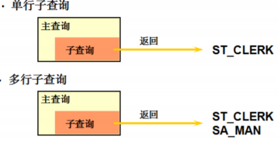

#### 4.11.4. 单行子查询

只返回一条记录。单行操作符

```sql
-- 单行子查询
select ename,job,sal from emp 
       where job=
             (select job 
              from emp
              where empno=7566)
       and sal>
              (select sal 
              from emp
              where empno=7782);
-- 使用聚合函数作为子查询条件
select deptno,min(sal) from emp
       group by deptno
       having min(sal)> 
              (select min(sal)
               from emp
               where deptno=20);
-- 需求：查询出比雇员7654的工资高，同时从事和7788的工作一样的员工
select e1.ename,e1.job,e1.sal
       from emp e1
       where e1.sal>
             (select e2.sal from emp e2
             where e2.empno=7654)
       and e1.job=
             (select e3.job from emp e3
             where e3.empno=7788);
-- 需求：查询每个部门的最低工资和最低工资的雇员和部门名称
select e.ename,s.minsal,d.dname
       from emp e,
       (select e1.deptno,min(e1.sal) minsal
       from emp e1
       group by e1.deptno) s,
       dept d
       where e.deptno=d.deptno
       and e.sal=s.minsal;
```

#### 4.11.5. 多行子查询

返回了多条记录，多行操作符

#### 4.11.6. 子查询中的 null 值问题

多行子查询中 `null` 值需要注意的问题：查询结果为空，不会报错。

单行子查询中的 `null` 值问题

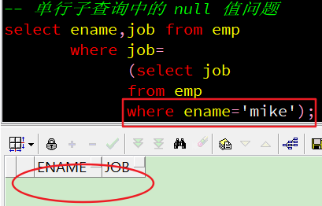

多行子查询中的 null 值问题

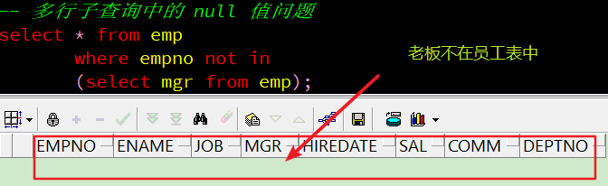

#### 4.11.7. Exists 用法

语法：

```sql
exists(sql 查询语句)
```

函数的效果是：sql 查询语句为空，则返回值是 `false`；sql 查询语句有值，则返回值就是 `true`

示例：

```sql
select * from emp where exists (select * from dept where deptno=1);
-- 等同于：select * from emp where 1=2
select * from emp where exists (select * from dept where deptno=10);
-- 等同于：select * from emp where 1=1
-- 范例：查询有员工的部门
select * from dept d where exists (select * from emp e where e.deptno = d.deptno);
-- 使用in替换
select * from dept d where d.deptno in (select  distinct deptno from emp);
```

> <font color=red>如果是大数据量【百万级】的查询，建议使用 `exists`，使用 `in` 的话会全表查询</font>

#### 4.11.8. Oracle 中的伪列

oracle提供的两个伪列

- `ROWNUM`：表示行号，实际上只是一个列，但是这个列是一个伪列，此列可以在每张表中出现。【先查询数据，再分配序号。找出一条数据，分配一个`rownum`】
- `ROWID`：表中每行数据指向磁盘上的物理地址

### 4.12. Oracle 查询综合示例

#### 4.12.1. Oracle查询练习

- 找到员工表中工资最高的前三名

```sql
-- 先排序
select e.empno,e.ename,e.sal
       from emp e
       order by e.sal desc nulls last,e.empno asc;
-- 使用伪列rownum
select rownum,t.empno,t.ename,t.sal
       from (select e.empno,e.ename,e.sal
            from emp e
            order by e.sal desc nulls last,e.empno asc) t
       where rownum <= 3;
```

- 找到员工表中薪水大于本部门平均薪水的员工

```sql
-- 先查询每个部门的平均薪水
select e.empno,e.ename,e.sal,t.avgsal
       from emp e,(select deptno,avg(sal) avgsal
              from emp
              group by deptno) t
       where e.sal > t.avgsal
       and e.deptno=t.deptno
       order by e.empno asc;
```

- 统计每年入职的员工个数

```sql
-- TO_CHAR 函数对日期的转换成字符串
select e.hdate,count(*)
       from (select to_char(hiredate, 'yyyy') hdate from emp) e
       group by e.hdate
       order by e.hdate asc;

-- 把上面的当成一张表，这里的聚合函数是为了补全语法
select sum(t.dcount) as "Total",
       sum(decode(hdate,'1980',dcount)) as "1980",
       sum(decode(hdate,'1981',dcount)) as "1981",
       sum(decode(hdate,'1982',dcount)) as "1982",
       sum(decode(hdate,'1987',dcount)) as "1987"
from (select e.hdate,count(*) dcount
       from (select to_char(hiredate, 'yyyy') hdate from emp) e
       group by e.hdate) t;
```

#### 4.12.2. Oracle 综合查询

```sql
-- 建表语句和插入数据
-- 案例【1.1】查询学员列表，显示学员姓名，电话，班级名称
select stu.name "学员姓名",stu.tele "电话",cla.name "班级名称"
       from T_STUDENT stu,T_CLASS cla
       where stu.classid=cla.id;

-- 案例【1.2】查询学员成绩列表，显示班级类型名称，班级名称，学员姓名，课程名称，考试分数
select ct.name "班级类型名称",cla.name "班级名称",stu.name "学员姓名",course.name "课程名称",mark.score "考试分数"
    from T_STUDENT stu,T_CLASS cla,T_CLASS_TYPE ct,T_COURSE course,T_MARK mark
    where stu.classid=cla.id
    and cla.type=ct.id
    and stu.id=mark.studentid
    and course.id=mark.courseid
    and course.type=ct.id;

-- 案例【1.3】查询学员成绩列表，显示学员姓名，考试分数，如果该学员没有考试记录也要列出姓名
-- 方式1
select s.name "学员姓名",m.score "分数"
       from T_STUDENT s
       left join T_MARK m
       on s.id=m.studentid;
-- 方式2 oracle特有方式
select s.name "学员姓名",m.score "分数"
       from T_STUDENT s,T_MARK m
       where s.id=m.studentid(+);

-- 案例【1.4】统计每门课程的平均分
select courseid,round(avg(score)) "AVGSCORE" from T_MARK group by courseid;

-- 案例【1.5】上例的基础上显示课程名称
select m.courseid,c.name,round(avg(m.score)) "AVGSCORE"
       from T_MARK m,T_COURSE c
       where m.courseid=c.id
       group by m.courseid,c.name;

-- 案例【1.6】继续在上例的基础上统计平均分大于60且小于80的课程，并按平均分由高到低排序
select * from
       (select m.courseid,c.name,round(avg(m.score)) "AVGSCORE"
       from T_MARK m,T_COURSE c
       where m.courseid=c.id
       group by m.courseid,c.name) t
       where t.AVGSCORE > 60
       and t.AVGSCORE < 80
       order by t.AVGSCORE desc;

-- 案例【1.7】查询唐浩然的同班同学
-- 先查询所在班级
select classid from T_STUDENT
       where name='唐浩然';
-- 以上表做为基础条件，再查询学生表，
select * from T_STUDENT
       where classid=(
             select classid from T_STUDENT
             where name='唐浩然'
       )
       and name <> '唐浩然';

-- 案例【1.8】查询唐浩然的同班同学并且学历一样的同学
-- 查询学历
select edu from T_STUDENT
       where name='唐浩然';

-- 以上面查询学历做为子查询条件
select * from T_STUDENT
       where classid=(
             select classid from T_STUDENT
             where name='唐浩然')
       and name <> '唐浩然'
       and edu=(
           select edu from T_STUDENT
           where name='唐浩然');

-- 案例【1.9】查询每门科目最高分数
-- 方式1
select c.name,max(m.score) maxscore from T_COURSE c,T_MARK m
       where c.id=m.courseid
       group by m.courseid,c.name;

-- 方式2,子查询方式
select courseid,max(score) maxscore
       from T_MARK
       group by courseid;
-- 以上表做为子表
select c.name,m.maxscore
       from T_COURSE c,(
            select courseid,max(score) maxscore
            from T_MARK
            group by courseid) m
        where c.id=m.courseid;

-- 案例【2.0】分数在90分以上的同学
-- 查询90分以上所有学生的ID，并去重
select distinct STUDENTID from T_MARK where SCORE > 90;
-- 以上表做为子查询条件
select * from T_STUDENT
       where ID in (
             select distinct STUDENTID
             from T_MARK
             where SCORE > 90);

-- 案例【2.1】查询曾经缺考的同学
-- 查询有参数考试的学生
select distinct STUDENTID from T_MARK;
-- 以上表子查询条件
select * from T_STUDENT
       where ID not in (
             select distinct STUDENTID
             from T_MARK);

-- 案例【2.2】查询成绩排名表的第二页（按每页5条数据）
-- 先按成绩排名查询
select * from T_MARK
       order by score desc;
-- 以上面查询的表为基础，添加rownum
select rownum "R",t.* from (
       select * from T_MARK
       order by score desc) t;
-- 以上表为基础，进行分页查询
select * from (
       select rownum "R",t.* from (
              select * from T_MARK
              order by score desc) t)
       where r>5 and r<=10;
```

### 4.13. 集合运算

#### 4.13.1. 什么是集合运算

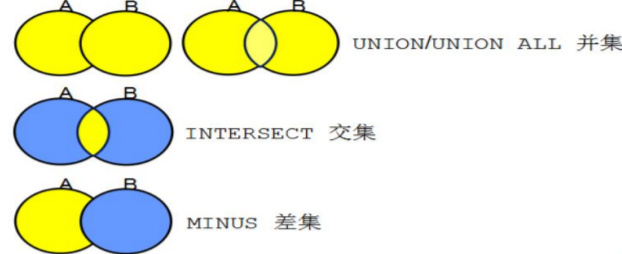

- `union`/`union all` 并集
    - `union all` 合并多个结果集
    - `union` 合并多个结果集，去除重复
- `intersect` 交集
- `minus` 差集

#### 4.13.2. 并集，类似于or

范例：工资大于 1500，或者是 20 号部门下的员工（并集）

```sql
-- 并集
select *
from emp
where sal>1500 or deptno=20;

-- or 关键字效率会很低，全表查询，索引用不了
-- 方式2
select * from emp where sal > 1500
union -- 使用union all包括重复部分
select * from emp where deptno = 20;
```

#### 4.13.3. 交集，类似于and

范例：工资大于 1500，并且是 20 号部门下的员工（交集）

```sql
-- 交集
-- 方式1
select *
from emp
where sal>1500 and deptno=20;
-- 方式2
select * from emp where sal > 1600
intersect
select * from emp where deptno = 20;
```

#### 4.13.4. 差集

范例：1981 年入职的普通员工（不包括总裁和经理）（差集）

```sql
-- 差集
select * from emp where to_char(hiredate,'yyyy')='1981' -- a
minus
select * from emp where job='MANAGER' or job = 'PRESIDENT'; -- b
-- 如果a minus b,a 中没有在b 中的数据，全部显示
```

#### 4.13.5. 集合运算的特征

<font color=red>*集合运算两边查询的字段数量、字段类型、顺序必须一致*</font>

### 4.14. 递归查询【了解】

语法：

```sql
select * from 表名
start with 条件一 --开始查询位置
connect by 条件二  --指定查询当前的关系
```

`connect by` 条件二中使用到关键字`prior`：从哪个方向进行检索。如以下示例：

```sql
-- 查询员工的领导
select * from emp
start with empno=7369
-- prior:从哪个方向进行检索
connect by empno=prior mgr;

-- 查询领导的下属是那些
select * from emp
start with empno=7566
connect by mgr=prior empno;
```

## 5. SQL 函数

### 5.1. 定义

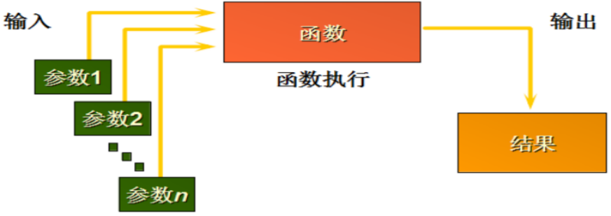

注意：函数可以没有参数，但必须要有返回值

### 5.2. 函数的类型

- 单行函数
- 多行函数

<font color=red>**注意：无论是单行函数还是多行函数，返回的结果都是一个**</font>

### 5.3. 单行函数

#### 5.3.1. 单行函数分类

1. 字符函数
2. 数值函数
3. 日期函数
4. 转换函数
5. 通用函数

#### 5.3.2. 字符函数

**字符控制函数**

- `concat(参数1, 参数2)`：用于字符串的连接，也可以使用 `||` 连接字符串。建议使用“`||`”
    - `concat(参数1, 参数2)`：只能用有两个参数
    - 使用“`||`”可以拼接多个参数
- `substr(s, p1, p2)`：字符串的截取。
    - 第1个参数 s 是源字符串
    - 第2个参数 p1 是开始索引，开始的索引使用 1 和 0 效果相同，第二个字符的索引是2
    - 第3个参数 p2 是截取的长度
- `length`/`lengthb`：获取字符串的长度
- `instr`
- `lpad`/`rpad`
- `trim`
- `replace`：字符串替换，第一个参数是源字符串，第二个参数被替换的字符串，第三个是替换字符串

**大小写控制函数**

|   关键字   |       作用       |
| :-------: | ---------------- |
|  `lower`  | 将结果转成小写字母 |
|  `upper`  | 将结果转成大写字母 |
| `initcap` |                  |

示例：

```sql
-- 字符串拼接(只能是两个拼接)
select concat('abc','zxy') from dual;
-- 字符串拼接（三个拼接）建议使用||
select concat(123,concat('abc','zxy')) from dual;

-- 大小写
select lower('MOON') from dual;
select upper('moon') from dual;

-- 查询用户名称小写的
select lower(ename) from emp;

-- 字符串长度
select length('abc123') as "字符长度" from dual;

-- 截取字符串
/*
   substr(v1,p1,p2)
           v1:要截取的字符串
           p1: 从哪里开始截取,0 和 1 都是一样的，都是开始下标
           p2: 截取的长度
*/
select substr('moonzero',0,3) from dual;
select substr('moonzero',1,3) from dual;
select substr('moonzero',2,3) from dual;

-- 字符串替换，第一个参数是源字符串，第二个参数被替换的字符串，第三个是替换字符串
select replace ('moonzero','oo','00') from dual;
```

#### 5.3.3. 数值函数

用于操作数字

##### 5.3.3.1. round：四舍五入

```sql
round(数字, 保留的小数位)
```

如果不写参数，默认情况下，只保留整数位

##### 5.3.3.2. trunc：截断，直接截断字符，不会进行四舍五入

```sql
trunc(数字, 保留的小数位)
```

如果不写保留的小数位，默认是直接切断只保留整数位

##### 5.3.3.3. mod：求余

```sql
mod(被除数，除数)
```

##### 5.3.3.4. 示例

```sql
--操作数字
-- 四舍五入
--只保留整数位(不写参数，默认只保留整数位)
select round(58.8888) from dual;
-- 第二个参数，保留两位小数
select round(58.8888, 2) from dual;
select round(58.8838, 2) from dual;
-- 直接截断
select trunc(58.8888, 2) from dual;
-- 求余
select mod(1200, 500) from dual;
```

#### 5.3.4. 日期函数

`sysdate`：当前数据库所在服务器的时间

##### 5.3.4.1. Oracle的日期

Oracle 中的日期型数据实际含有两个值:日期和时间

默认的日期格式是 `DD-MON-RR`

##### 5.3.4.2. 日期的数学运算

1. 在日期上加上或减去一个数字结果仍为日期。两个日期相减返回日期之间相差的天数，可以用数字除 24
2. 获得两个时间段中的月数：`MONTHS_BETWEEN(date, date)`
3. 获得几个月后的日期：`ADD_MONTHS(sysdate, num)`

##### 5.3.4.3. 示例

```sql
-- sysdate : 当前数据库所在服务器的时间
select sysdate from dual;

-- 查询员工入职的天数
select * from emp;
select ename,round(sysdate - hiredate) "入职天数" from emp;
-- 在上面的基础上，算一下入职的周数
select ename,round((sysdate - hiredate)/7) "入职周数" from emp;
-- 计算入职的月数
select ename,round(months_between(sysdate,hiredate)) "入职月数" from emp;
-- 获得几个月后的日期
select add_months(sysdate, 3) from dual;
```

#### 5.3.5. 转换函数

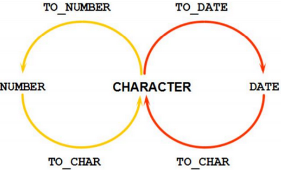

##### 5.3.5.1. TO_CHAR 函数对日期的转换成字符串

```sql
to_char(date, 'format_model')
```

日期的格式：

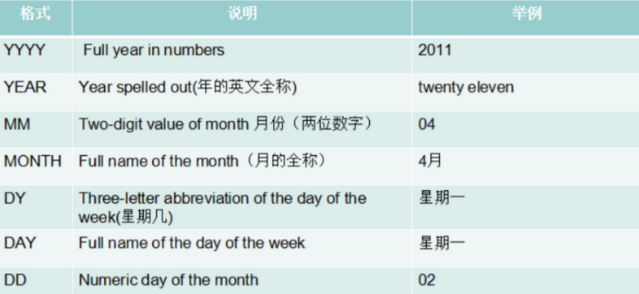

> 注：在设置`'yyyy-mm-dd'`格式后，10 以下的月份前面被被补了前导零，可以使用 `fm` 去掉前导零

##### 5.3.5.2. TO_CHAR 函数对数字的转换成字符串

```sql
to_char(number, 'format_model')
```

数字转换的格式：

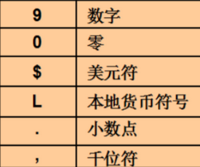

##### 5.3.5.3. TO_NUMBER 和 TO_DATE 函数

使用`TO_NUMBER`函数将字符转换成数字，转换后的数字可以进行运算

```sql
to_number(char[, 'format_model'])
```

使用TO_DATE函数将字符转换成日期

```sql
to_date(char[, 'format_model'])
```

Code Dome:

```sql
-- 把时间转成字符串,10以下的月前面被被补了前导零，可以使用 fm 去掉前导零
select to_char(sysdate, 'yyyy/mm/dd') from dual;
select to_char(sysdate, 'fmyyyy/mm/dd') from dual;
--  把字符串转成时间
select to_date('2018/9/10', 'yyyy/mm/dd') from dual;
-- 把数字转成字符
select to_char(123) from dual;
-- 把字符串转成数字,转换后可以进行运算
select to_number('123')+to_number('321') from dual;
```

#### 5.3.6. 通用函数

##### 5.3.6.1. 通用函数的定义

适用于任何数据类型，同时也适用于空值的函数

##### 5.3.6.2. 常用的通用函数

```sql
-- 如果expr1为空，则输出expr2。前后的数据类型要一致。
nvl(expr1, expr2)
nvl2(expr1, expr2, expr3)
nullif(expr1, expr2)
coalesce(expr1, expr2,……, exprn)
```

Code Dome:

```sql
-- nvl（p1,p2） ,如果p1为空，就输出p2,前后的数据类型要一直
select ename,nvl(comm, 0) from emp;
```

#### 5.3.7. 条件表达式

##### 5.3.7.1. 条件表达式定义

在 SQL 语句中使用 `IF-THEN-ELSE`

##### 5.3.7.2. 实现方式1：case 表达式

`CASE` 表达式：SQL99 的语法，类似 Basic，比较繁琐。语法如下：

```sql
case expr when comparison_expr1 then return_expr1
		[when comparison_expr2 then return_expr2
			……
		when comparison_exprn then return_exprn
		else else_expr]
end
```

##### 5.3.7.3. 实现方式2：decode 函数（推荐）

`DECODE` 函数：Oracle 自己的语法，类似 Java，比较简洁。语法如下：

```sql
decode(条件,值1,翻译值1,值2,翻译值2,...值n,翻译值n,缺省值)
```

- 作用：根据条件返回相应值
- 参数：c1, c2, ...,cn,字符型/数值型/日期型，必须类型相同或 `null`
- 注：值1……n 不能为条件表达式，这种情况只能用`case when then end`解决

##### 5.3.7.4. 示例

```sql
-- 条件表达式
select ename,deptno from emp;
-- 使用DECODE 函数
select ename,deptno,
       decode(deptno,10,'开发部',20,'销售部',30,'运维部','大Boss')
       from emp;
-- 使用CASE 表达式
select ename,deptno,
       case deptno
         when 10 then '开发部'
         when 20 then '销售部'
         when 30 then '运维部'
         else '大Boss'
       end
       from emp;
```

### 5.4. 多行函数

#### 5.4.1. 多行函数的定义

也叫组函数、分组函数，即聚合查询。分组函数作用于一组数据，并对一组数据返回一个值。

<font color=red>在where条件中不能写聚合函数，只能写在having中</font>

<font color=red>组函数会忽略空值；`NVL` 函数使分组函数无法忽略空值</font>

#### 5.4.2. 常用的多行函数

| 函数名称 |   作用    |
| :-----: | --------- |
|  `avg`  | 查询平均值 |
| `count` | 统计记录数 |
|  `max`  | 最大值查询 |
|  `min`  | 最小值查询 |
|  `sum`  | 求和函数   |

> <font color=red>**注：所有的聚合函数都不统计`null`值**</font>

`count(字段)` 是根据字段统计所有行，如果字段为 `null`，不进行统计

<font color=red>**`count(1)` 与 `count(*)` 效果完全一样，但 `count(1)` 效率更高。`count(1)` 就是将所有行都看成“1”，不行的数据，所以查询效率更高**</font>

#### 5.4.3. 分组数据

可以使用 `group by` 子句将表中的数据分成若干组。语法格式：

```sql
select *|{[distinct column|expression [aliad],……]}
	from table
	[where condition(s)]
	[group by group_by_expression]
	[order by column]
```

> <font color=red>**注意：如果两个表关联使用分组查询，`group by` 后面的跟的条件是两个表的分组条件的列名。**</font>

#### 5.4.4. 过滤分组数据

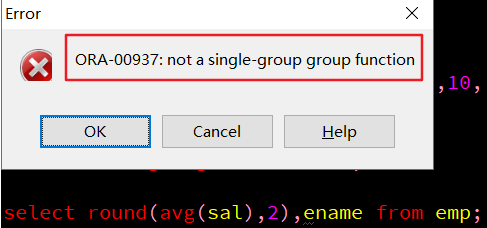

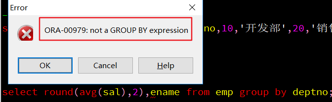

报了一个 ORA-00937 的错误

> 注意：
>
> 1. 如果使用分组函数，SQL 只可以把 `GOURP BY` 分组条件字段和分组函数查询出来，不能有其他字段。
> 2. 如果使用分组函数，不使用 `GROUP BY` 只可以查询出来分组函数的值

#### 5.4.5. WHERE 和 HAVING 的区别

<font color=red>**最大区别在于：`where` 后面不能有聚合函数**</font>

```sql
-- 计算所有员工数
select count(*) from emp;

-- 把所有员工的工资加起来
select sum(sal) from emp;

-- 计算部门的平均工资
select round(avg(sal),2),decode(deptno,10,'开发部',20,'销售部',30,'运维部','大Boss')
       from emp
       group by deptno;

-- 计算部门的平均工资大于2000
select round(avg(sal)),decode(deptno,10,'开发部',20,'销售部',30,'运维部','大Boss')
       from emp
       group by deptno
       having avg(sal) > 2000;
```

## 6. 使用 DDL 语句管理表

### 6.1. 创建表空间

<font color=red>表空间：ORACLE 数据库的逻辑单元，oracle面向的是表空间。</font>

- 一个实例（数据库）对应多个表空间
- 一个表空间可以与多个数据文件（物理结构）关联一个数据库下可以建立多个表空间
- 一个表空间可以建立多个用户、一个用户下可以建立多个表。

<font color=red>*我们(用户)操作表空间，真正存储数据，存到.dbf文件*</font>

> <font color=red>**注：创建表空间需要dba权限，创建表空间的语法顺序不能调换**</font>

创建表空间语法与相关参数：

|             参数              |                  说明                  |
| :--------------------------: | ------------------------------------- |
| `create tablespace 表空间名称` | 创建表空间                              |
|          `datafile`           | 指定表空间对应的存储位置和数据文件          |
|            `size`             | 后定义的是表空间的初始大小                |
|        `autoextend on`        | 开启自动扩展，当表空间存储都占满时，自动扩展 |
|            `next`             | 指定的是下一次扩展的文件大小               |

创建表空间示例:

```sql
-- 创建表空间
create tablespace moonzero
datafile 'c:\test.dbf'
size 100m
autoextend on
next 10m
```

### 6.2. 用户

#### 6.2.1. 创建用户

```sql
-- 创建用户
create user moon
identified by moon
default tablespace moonzero
```

相关参数：

- `create user`：创建用户
- `identified by`：设置用户的密码，不能是纯数字，经过测试，*如果想使用纯数字，必须使用双引号，如："123456"*
- `default tablespace`：用户管理（使用）的表空间名称

oracle 数据库与其它数据库产品的区别在于，表和其它的数据库对象都是存储在用户下的

#### 6.2.2. 用户赋权限

新创建的用户没有任何权限，登陆后会提示没有权限，需要进行授权。

Oracle 中已存在三个重要的角色：connect 角色，resource 角色，dba 角色。

- CONNECT 角色： --是授予最终用户的典型权利，最基本的
    - ALTER SESSION --修改会话
    - CREATE CLUSTER --建立聚簇
    - CREATE DATABASE LINK --建立数据库链接
    - CREATE SEQUENCE --建立序列
    - CREATE SESSION --建立会话
    - CREATE SYNONYM --建立同义词
    - CREATE VIEW --建立视图
- RESOURCE 角色： --是授予开发人员的
    - CREATE CLUSTER --建立聚簇
    - CREATE PROCEDURE --建立过程
    - CREATE SEQUENCE --建立序列
    - CREATE TABLE --建表
    - CREATE TRIGGER --建立触发器
    - CREATE TYPE --建立类型
- DBA 角色：拥有全部特权，是系统最高权限，只有 DBA 才可以创建数据库结构，并且系统权限也需要 DBA 授出，且 DBA 用户可以操作全体用户的任意基表，包括删除

进入 system 用户下给用户赋予权限（connect，resource，dba），否则无法正常登陆

```sql
grant dba to 用户名
```

#### 6.2.3. 回收权限

```sql
revoke connect,resource from 用户名;
```

多个权限，使用“`,`”分隔

### 6.3. Oracle 数据类型

#### 6.3.1. 字符串

|     数据类型      |                                           说明                                           |
| :--------------: | --------------------------------------------------------------------------------------- |
|   `char(size)`   | 定长的字符串数据；<br/>例：`name char(10)`: 存储'xxxx',实际占用10个字符，不够10个使用空格补全     |
| `varchar2(size)` | 可变长的字符串数据，最大长度是4000字节；<br/>例：`name varchar2(10)`: 存储'xxxx'，实际占用4个字符 |
|      `long`      | 存储字符串数据，最大为2G                                                                    |

#### 6.3.2. 数字

|     数据类型     |                                             说明                                             |
| :-------------: | ------------------------------------------------------------------------------------------- |
| `number(p1,p2)` | 标识数字类型，可变长数值数据<br/>参数p1：指定数字的总长度（注：总长度包括小数位）<br/>参数p2：指定几位小数 |

#### 6.3.3. 日期

|   数据类型   |                     说明                     |
| :---------: | -------------------------------------------- |
|   `date`    | 日期类型数据，区分到时分秒，类似mysql的`datatime` |
| `timestamp` | 时间撮，区分到秒的后9位                         |

#### 6.3.4. 大数据类型

| 数据类型 |           说明            |
| :-----: | ------------------------ |
| `clob`  | 存储字符数据，最大可达到4G   |
| `blob`  | 存储二进制数据，最大可达到4G |

#### 6.3.5. 其它类型

|      数据类型       |               说明                |
| :----------------: | -------------------------------- |
| `raw and long raw` | 原始的二进制数据                    |
|      `bfile`       | 存储外部文件的二进制数据，最大可达到4G |
|      `rowid`       | 行地址                            |

### 6.4. uuid 生成值

`sys_guid()` 函数，用于生成不同的uuid

```sql
select sys_guid() from dual;
```

### 6.5. 创建表

创建表语法：

```sql
create table [schema.]table
		(column datatype [default expr][,…]);
```

使用子查询创建表的语法：

```sql
create TABLE table
		[(column, column,……)]
as subquery;
```

示例:

```sql
-- 创建表
create table person(
       pid number(10),
       name varchar2(10),
       gender number(1) default 1,
       birthday date
);
-- 插入数据，插入数据后，记得要点击提交
insert into person values (1,'剑圣',1,to_date('2018-2-2', 'yyyy-mm-dd'));
```

### 6.6. 修改表

在 sql 中使用 `alter` 可以修改表

- 添加语法：

```sql
ALTER TABLE 表名称 ADD(列名 1 类型 [DEFAULT 默认值]，列名 1 类型 [DEFAULT 默认值]...)
```

- 修改语法：

```sql
ALTER TABLE 表名称 MODIFY(列名 1 类型 [DEFAULT 默认值]，列名 1 类型 [DEFAULT 默认值]...)
```

- 修改列名语法:

```sql
ALTER TABLE 表名称 RENAME COLUMN 列名 1 TO 列名 2
```

- 删除列语法：

```sql
alter table 表名称 drop column 列名
```

示例：

```sql
-- 在 person 表中增加列 address
alter table person add(address varchar2(10));
-- 把 person 表的 address 列的长度修改成 20 长度
alter table person modify(address varchar2(20));
-- 修改列名
alter table person rename column ddd to address;
```

### 6.7. 删除表

语法：

```sql
DROP TABLE 表名;
```

### 6.8. 复制整个表

使用子查询可以复制整个表

```sql
create table 新表名 as (select * from 要复制的表名);
```

### 6.9. 约束

在数据库开发中，约束是必不可少，使用约束可以更好的保证数据的完整性。在 Oracle 数据库中。约束的类型包括：

- 主键约束（Primary Key）
- 非空约束（Not Null）
- 唯一约束（Unique）
- 外键约束（Foreign Key）
- 检查性约束（Check）

#### 6.9.1. 主键约束

主键约束都是在 id 上使用，而且本身已经默认了内容不能为空，可以在建表的时候指定。关键字：`primary key`

指定主键约束的名字的语法：

```sql
constraint person_pk_pid primary key(pid)
```

示例：

```sql
create table person(
       pid number(10),
       name varchar2(10),
       gender number(1) default 1,
       birthday date,
       constraint person_pk_pid primary key(pid)
);
```

#### 6.9.2. 非空约束

使用非空约束，可以使指定的字段不可以为空。

关键字：`not null`

#### 6.9.3. 唯一约束（unique）

表中的一个字段的内容是唯一的。关键字：`unique`

唯一约束的名字也可以自定义

```sql
constraint person_name_uk unique(name)
```

#### 6.9.4. 检查约束

使用检查约束可以来约束字段值的合法范围。关键字：`check(列名 in(值1,值2,...))`

检查约束也可以自定义

```sql
constraint person_gender_ck check(gender in (1,2))
```

#### 6.9.5. 外键约束

外键是两张表的约束，可以保证关联数据的完整性

外键关联注意：

- 外键一定是主表的主键，外键的位置在从表中
- <font color=red>删表时一定先删子表再删主表</font>，如果直接删主表会出现由于约束存在无法删除的问题
- 可以强制删除主表 `drop table 主表名 cascade constraint;`【不建议使用】
- 删除主表的数据可以先删除子表的关联数据，再删主表，也可以使用级联删除
- 级联删除在外键约束上要加上 `on delete cascade`【不建议使用】

```sql
constraint order_detail_order_id_fk foreign key(order_id)
	references orders(order_id) on delete cascade
```

## 7. 使用 DML 语句处理数据

### 7.1. 插入数据

语法：

```sql
insert into 表名[(列名 1，列名 2，...)] values (值 1，值 2，...)
```

**简单写法（不建议）**

```sql
insert into 表名 values(值 1，值 2，...)
```

注意：使用简单的写法必须按照表中的字段的顺序来插入值，而且如果有为空的字段使用 null

### 7.2. 更新数据

语法：

```sql
-- 全部修改：
UPDATE 表名 SET 列名 1=值 1，列名 2=值 2，....
-- 局部修改：
UPDATE 表名 SET 列名 1=值 1，列名 2=值 2，....WHERE 修改条件；
```

Code Dome:

```sql
-- 在 update 中使用子查询：
-- 例如：给 NEW YORK 地区的所有员工涨 100 员工资
update emp set sal=sal+100
       where deptno in (
             select deptno from dept where loc='NEW YORK');
```

### 7.3. ORACLE 如果数据存在则执行更新，不存在则执行插入的方法

MERGE语句是Oracle9i新增的语法，用来合并 `UPDATE` 和 `INSERT` 语句。通过MERGE语句，根据一张表或子查询的连接条件对另外一张表进行查询，连接条件匹配上的进行 `UPDATE`，无法匹配的执行`INSERT`。

这个语法仅需要一次全表扫描就完成了全部工作，执行效率要高于 `INSERT＋UPDATE`。

语法：

```sql
MERGE <hint> INTO <table_name> -- 表名称
USING <table_view_or_query> -- 表查询信息
ON (<condition>) -- 条件
WHEN MATCHED THEN <update_clause> -- 更新操作
DELETE <where_clause> -- 删除操作
WHEN NOT MATCHED THEN <insert_clause> -- 插入操作
[LOG ERRORS <log_errors_clause> <reject limit <integer | unlimited>];
```

示例：

```sql
-- 例子1：
MERGE INTO USERINFO a
USING (
  SELECT '1' as UNAME
  FROM dual
  ) b
ON (a.UNAME = b.UNAME)
WHEN MATCHED THEN
  UPDATE SET a.ADDR = 'ddd', a.UTC = 1234567
WHEN NOT MATCHED THEN
  INSERT (a.ADDR, a.UTC, a.UNAME) VALUES ('aaa', 7654321, '1');

-- 例子2：
MERGE INTO T T1
USING (SELECT '1001' AS a,2 AS b FROM dual) T2
ON ( T1.a=T2.a)
WHEN MATCHED THEN
    UPDATE SET T1.b = T2.b
WHEN NOT MATCHED THEN
    INSERT (a,b) VALUES(T2.a,T2.b);
```

### 7.4. 删除数据

语法:

```sql
delete from 表名 where 删除条件;
```

在删除语句中如果不指定删除条件的话就会删除所有的数据

<font color=red>***truncate table 实现数据删除，摧毁表结构，再重建，效率最高。*</font>

**比较 `truncat` 与 `delete` 实现数据删除**

- `delete` 删除的数据可以 `rollback`，也可以闪回
- `delete` 删除可能产生碎片，并且不释放空间
- `truncate` 是先摧毁表结构，再重构表结构

<font color=red>**注意：插入、更新和删除会引起数据的变化。我们就必须考虑数据的完整性。**</font>

### 7.5. Oracle 中的事务

oracle 的事务对数据库的变更的处理，必须做提交事务才能让数据真正的插入到数据库中，在同样在执行完数据库变更的操作后还可以把事务进行回滚，这样就不会插入到数据库。如果事务提交后则不可以再回滚。

- 提交：`commit`
- 回滚：`rollback to 保存点`

Oracle 中事务的保存点（`savepoint`）：回滚到某个保存点，这个保存点之前的数据插入，之后回滚。

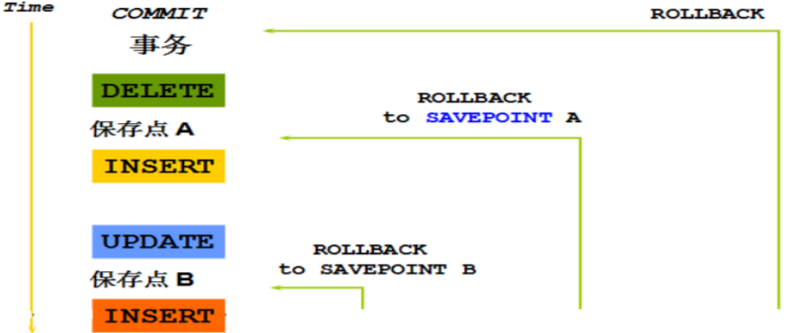

事务的隔离级别和隔离性：

- Oracle 支持的 3 种事务隔离级别：`READ COMMITED`, `SERIALIZABLE`，`READ ONLY`。
- Oracle 默认的事务隔离级别为: `READ COMMITED`。

Oracle事务示例:

```sql
-- 事务保存点：savepoint
-- savepoint sp1;
insert into person values(3,'幽鬼',2,null,'dota2');
-- 设置保存点,保存点之前提交，保存点之后的回滚
savepoint sp1;
insert into person values(2,'插入不进去的',3,null,'xxoo');
rollback to sp1;
commit;
```

## 8. 管理其他数据库对象

### 8.1. 视图

视图，专门用于查询，里面不存储数据，数据都来源于真正的表。

<font color=red>**注：创建视图需要dba权限**</font>

视图的好处：

1. <font color=red>**视图就是封装了一条复杂查询的语句**</font>。视图是一个虚表。最大的优点就是简化复杂的查询。
2. 用视图可以屏蔽一些敏感数据。

#### 8.1.1. 创建视图的语法1

```sql
create [or replace] [force|noforce] view视图名称
	[(alias[, alias]...)]
as 查询语句
[with check option [constraint constraint]]
[with read only [constraint constraint]];
```

创建视图示例:

```sql
-- 创建视图（权限不够，可以使用system开通全部特权，是系统最高权限）
create view empvd20 as select * from emp t where t.deptno=20;
-- 视图创建完毕就可以使用视图来查询（这个名字的虚表），查询出来的都是 20 部门的员工
select * from empvd20;
```

#### 8.1.2. 创建视图的语法2

```sql
create or replace view 视图名称 as 查询语句
```

使用语法2来创建视图，如果视图已经存在，这样已有的视图会被覆盖。

<font color=red>*不建议通过视图对表中的数据进行修改，因为会受到很多的限制。*</font>

#### 8.1.3. 创建视图的语法3

```sql
create or replace view 视图名称 as 查询语句 with read only
```

创建只读视图

### 8.2. 序列【了解】

#### 8.2.1. 概述

序列（Sequence）在 Oracle 中是一个数据库对象，用于生成唯一的数值。用途包括：

- **生成唯一标识符**：用于自动生成唯一的行标识符。
- **自动编号**：在插入记录时自动产生编号。

在很多数据库中都存在一个自动增长的列，但如果现在要想在 oracle 中完成自动增长的功能，则只能依靠序列完成所有的自动增长操作，需要用户手工完成处理。并且 Oracle 将序列值装入内存可以提高访问效率。

#### 8.2.2. 创建和使用序列【了解】

创建序列语法：

```sql
create sequence sequence(序列名称)
		[increment by n]		-- 步长值，每次增加的数值
		[start with n]		-- 初始值
		[{maxvalue n | nomaxvalue}]		-- 使用最大值，必须循环
		[{minvalue n | nominvalue}]
		[{cache n | nocache}]		-- 缓存n个值，默认值20
		[{cycle | nocycle}];		-- 循环，循环结束都从1开始
```

序列创建完成之后，所有的自动增长应该由用户自己处理，所以通过序列中提供两个属性，可进行以下的操作：

- `nextval`：取得序列的下一个内容
- `currval`：取得序列的当前内容

**创建序列: 在插入数据时需要自增的主键中可以这样使用**

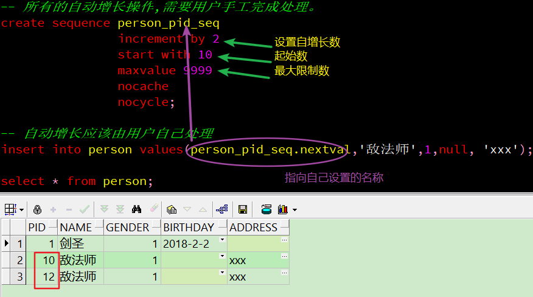

**序列可能产生裂缝的原因(中间跳过了数字)**：

- 回滚
- 系统异常
- 多个表共用一个序列

### 8.3. 索引

<font color=red>**索引是用于加速数据存取的数据对象，提高检索数据效率**</font>。合理的使用索引可以大大降低 i/o 次数,从而提高数据访问性能。

#### 8.3.1. 单列索引

单列索引是基于单个列所建立的索引。语法：

```sql
create index 索引名 on 表名(列名)
```

#### 8.3.2. 复合索引

语法：

```sql
create index 索引名 on 表名(列名1, 列名2)
```

复合索引是基于两个列或多个列的索引。在同一张表上可以有多个索引，但是要求列的组合必须不同，如：

```sql
create index idx1 on 表名(a列,b列);
create index idx1 on 表名(b列,a列);
```

示例：

```sql
-- 范例：给 person 表的 name 建立索引
create index pname_index on person(name);
-- 范例：给 person 表创建一个 name 和 gender 的索引
create index pname_gender_index on person(name,gender);
```

#### 8.3.3. 索引使用原则

1. 在数据量大表中使用索引
2. 在经常使用字段上加索引
3. 触发复合索引【联合】条件（name,address）--必须有优先查询索引列

```sql
select * from person where name='11';  会触发索引
select * from person where name ='11' and address ='22'; 会触发
select * from person where name ='11' or address ='22'; 不会触发
select * from person where address ='22'; 不会触发
```

4. 一般在不经常修改，添加，删除的表上添加索引。因为这些操作会引起索引重构

### 8.4. 同义词【了解】

同义词：给其他用户下的表起别名，在本用户下直接查询别名。属于跨库查询。

定义同义词需要dba权限。语法：

```sql
create [public] synonym 同义词名称 for 用户.表名;
```

示例：

```sql
create public synonym emp for scott.emp;
```

**同义词作用**：

- 可以很方便的访问其它用户的数据库对象
- 缩短了对象名字的长度

## 9. 数据的导入导出

### 9.1. 使用 cmd 命令整库导出与导入

在安装了 oracle 的电脑上执行。**整库导出命令**：

```bash
exp system/密码 full=y
```

添加参数 `full=y` 表示整库导出。执行命令后会在当前目录下生成一个叫 `EXPDAT.DMP`，此文件为备份文件。

如果想指定备份文件的名称，则添加 `file` 参数即可，命令如下

```bash
exp system/密码 file=C:\文件名.dmp full=y
```

**整库导入命令**：

```bash
imp system/密码 full=y
```

此命令如果不指定 `file` 参数，则默认用备份文件 `EXPDAT.DMP` 进行导入

**如果指定 `file` 参数，则按照 `file` 指定的备份文件进行恢复**

```bash
imp system/密码 full=y file= C:\文件名.dmp
```

执行导入命令前需确保 oracle 数据库中无即将导入的对象，否则将报以下提示：

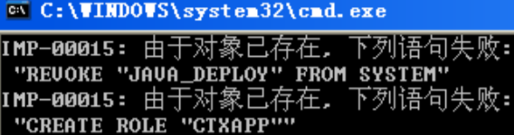

### 9.2. 使用 cmd 命令按用户导出与导入

**按用户导出**

```bash
exp 用户名/密码 owner=用户名 file= c:\文件名.dmp
```

**按用户导入**

```bash
imp 用户名/密码 file= c:\文件名.dmp fromuser=用户名1 touser=用户名2
```

### 9.3. 使用 cmd 命令按表导出与导入

**按表导出**

```bash
exp 用户名/密码 file=文件名.dmp tables=导入的表名
```

用 `tables` 参数指定需要导出的表，如果有多个表用逗号分割即可

**按表导入**

```bash
imp 用户名/密码 file=文件名.dmp fromuser=用户名1 touser=用户名2 tables=导入的表名
```

### 9.4. 使用 PLSQL Developer 导出数据

1. Tools → Export User Objects...选项，导出 .sql 文件。说明：此操作导出的是建表语句
2. Tools → Export Tables...导出表结构及数据

PL/SQL 工具包含三种方式导出 Oracle 表结构及数据，三种方式分别为：Oracle Export 、SQL Inserts、PL/SQL Developer,下面分别简单介绍下区别：

- 第一种方式导出.dmp 格式的文件，.dmp 是二进制文件，可跨平台，还能包含权限，效率不错，用的最为广泛。
- 第二种方式导出.sql 格式的文件，可用文本编辑器查看，通用性比较好，效率不如第一种，适合小数据量导入导出。尤其注意的是表中不能有大字段（blob,clob,long），如果有，会提示不能导出(提示如下： table contains one or more LONG columns cannot export in sql format,user Pl/sql developer format instead)。
- 第三种方式导出.pde 格式的文件，.pde 为 PL/SQL Developer 自有的文件格式，只能用 PL/SQL Developer 工具导入导出，不能用文本编辑器查看。

### 9.5. 使用 PLSQL Developer 导入数据

导入数据之前最好把以前的表删掉，当然导入另外的数据库数据除外

1. Tools → Import Tables...
2. 根据对应格式，在不同界面选择即将导入的文件。

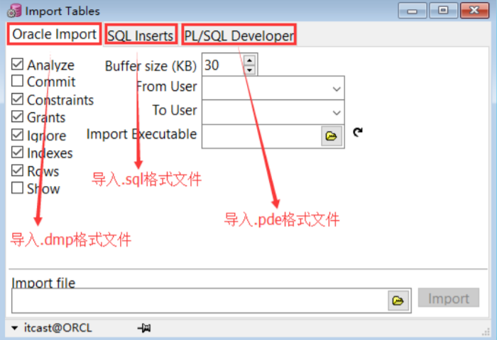

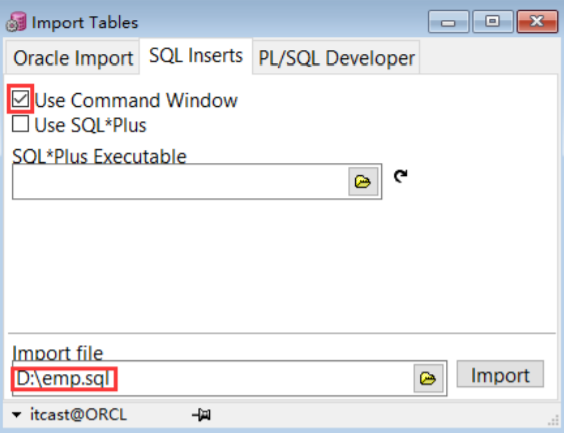

## 10. PL/SQL 编程语言

### 10.1. PL/SQL 概述

PL/SQL（Procedure Language/SQL），是一组逻辑相关的PL/SQL程序单元的集合，如过程和函数。PLSQL 是 Oracle 对 sql 语言的过程化扩展，指在 SQL 命令语言中增加了过程处理语句（如分支、循环等），使 SQL 语言具有过程处理能力。把 SQL 语言的数据操纵能力与过程语言的数据处理能力结合起来，使得 PLSQL 面向过程但比过程语言简单、高效、灵活和实用。其优势包括：

1. **模块化**：便于组织和管理复杂的PL/SQL代码。
2. **性能**：可以提高代码执行效率。
3. **封装性**：提供了更好的数据隐藏和封装。

### 10.2. PL/SQL 的语法

```sql
declare
	说明部分 (变量说明，光标申明，异常（例外）说明)
begin
	语句序列 (DML语句)...
	pl/SQL程序体
exception
	异常(例外)处理语句
end;
```

注：

1. 如果不需要声明变量，`declare`可以省略
2. 变量不能在`begin`内定义，必须在`declare`里声明

### 10.3. 常量和变量的定义

变量的类型(char, varchar2, date, number, boolean, long)

|          说明变量例子          |                                      说明                                       |
| :--------------------------: | ------------------------------------------------------------------------------ |
|     `my_char char(15);`      | 说明变量名，数据类型和长度后用分号结束说明语句                                        |
| `my_boolean boolean :=true;` | 定义boolean类型的变量，并赋值(`:=`)                                                |
|   `my_number number(7,2);`   | 定义数字类型的变量                                                                |
|  `my_name emp.enmae%type;`   | 引用型变量，即my_name的类型与emp表中ename列类型一样<br/>**在sql中使用 `into` 来赋值** |
|    `emp_rec emp%rowtype;`    | 记录型变量，即为表格中的一条记录。类似一个对象<br/>**在sql中使用 `into` 来赋值**        |

> 注：在控制台输入的语法：在`declare`中定义变量时后写上【`:=&xx;`】，xx随便写，一般xx名字跟变量名一样

示例：

```sql
-- 引用变量
declare
   -- 声明引用变量，即emprec的类型与emp表中ename列类型一样
   emprec emp.ename%type;
begin
  -- 在sql中使用into赋值
  select e.ename into emprec from emp e where e.empno=7369;
  -- 输出引用变量
  dbms_output.put_line(emprec);
end;

-- 记录型变量
declare
   -- 声明记录型变量
   p emp%rowtype;
begin
   -- 对记录型变量赋值
   select * into p from emp e where e.empno=7369;
   -- 输出记录型变量的属性值
   dbms_output.put_line(p.ename || '===' || p.sal);
end;
```

#### 10.3.1. 定义RECORD类型

与`%rowtype`不一样，`%rowtype`与表的字段类型一致，record是直接定义一个类型。语法：

```sql
type xxx is record(
	x1 in/out varchar,
	x2 in/out number,
	x3 表.字段名%type,
	x4 表.字段名%type,
	...
);
```

### 10.4. if 分之语句

语法1：

```sql
if 条件 then 语句1;
end if;
```

语法2：

```sql
if 条件 then 语句1;
else 语句2;
end if;
```

语法3：注意`elsif`中`els`没有`e`

```sql
if 条件 then 语句1;
elsif 条件 then 语句2;
else 语句3;
end if;
```

三种if语句示例:

```sql
-- 范例 1：如果从控制台输入 1 则输出我是 1
declare
   -- 声明数字类型变量，&num定义输入值，:=输入值后给pnum赋值
   pnum number :=&num;
begin
   if pnum = 1 then
      dbms_output.put_line('我是1');
   end if;
end;

-- 范例 2：如果从控制台输入 1 则输出我是 1 否则输出我不是 1
declare
   -- 声明数字类型变量
   pnum number :=&num;
begin
   if pnum = 1 then
      dbms_output.put_line('我是1');
   else
     dbms_output.put_line('我不是1');
   end if;
end;

-- 范例 3:判断人的不同年龄段 18 岁以下是未成年人，18 岁以上 40 以下是成年人，40 以上是老年人
declare
   -- 声明数字类型变量
   page number :=&num;
begin
   -- 使用多重if判断
   if page<18 then
     dbms_output.put_line('未成年人');
   elsif page>=18 and page<40 then
     dbms_output.put_line('成年人');
   elsif page>=40 then
     dbms_output.put_line('老年人');
   end if;
end;
```

### 10.5. loop 循环语句

`while`循环语法：类似java中的`while`循环

```sql
while 循环条件
loop
	...循环内容;
end loop;
```

`loop`循环语法：类似java中的`do-while`

```sql
loop
	...循环内容;
exit [when 退出条件];
end loop;
```

`for`循环语法：注意`in`后面是两个【`.`】。类似java中的`for`循环

```sql
for 变量 in 1..n
loop
	...循环内容;
end loop;
```

三种循环方式示例:

```sql
-- 范例:使用语法 1 输出 1 到 10 的数字
declare
   -- 声明数字类型变量，:=给变量赋值
   i number :=1;
begin
   while i<=10
   loop
     dbms_output.put_line(i);
     i := i + 1;
   end loop;
end;

-- 范例:使用语法 2 输出 1 到 10 的数字
declare
   i number := 1;
begin
   loop
     dbms_output.put_line(i);
     i := i + 1;
     exit when i > 10;
   end loop;
end;

-- 范例:使用语法 3 输出 1 到 10 的数字（declare可以省略）
begin
  for i in 1..10
  loop
    dbms_output.put_line(i);
  end loop;
end;
```

### 10.6. 数组

明确一个概念：Oracle中本是没有数组的概念的，数组其实就是一张表(Table),每个数组元素就是表中的一个记录。

使用数组时，用户可以使用 Oracle 已经定义好的数组类型，或可根据自己的需要定义数组类型。

#### 10.6.1. 使用 Oracle 自带的数组类型

使用时需要进行初始化，语法格式：`变量名 array;`

```sql
create or replace procedure test(y out array) is
  x array;
begin
  x := new array();
  y := x;
end;
```

#### 10.6.2. 自定义的数组类型

自定义数据类型时，建议通过创建 `Package` 的方式实现，以便于管理

### 10.7. 游标（光标 Cursor）

在pl/sql中会用到多条记录（类似java程序中的集合概念），<font color=red>**使用游标可以存储查询返回的多条数据，结果集**</font>。

游标的定义语法：

```sql
cursor 游标名 [(参数名 数据类型,参数名 数据类型,...)] is select 语句;
```

示例：

```sql
cursor c1 is select ename from emp;
-- 带参数：
cursor c(dno my_emp.deptno%type) is
	select e.empno from my_emp e where e.deptno = dno;
```

游标的使用语句：

```sql
open 游标名;
loop
	fetch 游标名 into 变量名;
	exit when 游标名%notfound;
end loop;
close 游标名;
```

游标的使用步骤（例子）:

1. 打开游标：`open c1;` (打开游标执行查询)
2. 取一行游标的值：`fetch c1 into 变量;` (取一行到变量中，指针自动往下移，类型java程序中的迭代器iterator)
3. 关闭游标：`close c1;`(关闭游标释放资源)
4. 游标的结束方式：`exit when c1%notfound`

> 注意：
>
> - 游标结束的条件要放在取出游标值后面，否则最好一个值会输出两次
> - 上面的 【变量】 必须与 emp 表中的指定的列类型一致：
> - 定义：pjob emp.empjob%type;

Code Dome:

```sql
-- 范例 1：使用游标方式输出 emp 表中的员工编号和姓名
-- 方法1：
declare
   -- 定义游标
   cursor c is select empno,ename from emp;
   -- 声明引用变量，与emp表中的员工编号和姓名类型一致
   pid emp.empno%type;
   pname emp.ename%type;
begin
  -- 打开游标
  open c;
  -- 使用循环将游标的值取出
  loop
    -- 多个变量使用逗号分隔，顺序要与定义游标的语句一致
    fetch c into pid,pname;
    -- 设置循环结束条件
    exit when c%notfound;
    dbms_output.put_line(pid || ' === ' || pname);
  end loop;
  -- 关闭游标
  close c;
end;

-- 教材方法2：
declare
   -- 定义游标
   cursor c is select * from emp;
   -- 声明记录型变量
   pemp emp%rowtype;
begin
   -- 打开游标
   open c;
   -- 使用循环读取游标的记录
   loop
     -- 从游标读取值
     fetch c into pemp;
     -- 设置循环结束条件
     exit when c%notfound;
     dbms_output.put_line(pemp.empno || ' === ' || pemp.ename);
    end loop;
   -- 关闭游标
   close c;
end;

-- 范例 2：写一段 PL/SQL 程序，为部门号为 10 的员工涨工资。
-- 方式1：自己的做法
declare
   -- 定义游标，存储查询所有部门号为10的员工
   cursor c is select e.empno from my_emp e where e.deptno=10;
   -- 声明引用型变量
   pno my_emp.empno%type;
begin
   -- 打开游标
   open c;
   -- 使用循环读取游标中的值
   loop
     -- 从游标读取值
     fetch c into pno;
     -- 设置结束循环条件
     exit when c%notfound;
     -- 执行sql语句
     update my_emp e set e.sal=e.sal+100 where e.empno=pno;
   end loop;
   commit;
   -- 关闭游标
   close c;
end;

-- 方式2：教材做法
declare
  -- 定义游标，存储查询所有部门号为10的员工
  cursor c(dno my_emp.deptno%type) is
      select e.empno from my_emp e where e.deptno = dno;
  -- 声明引用型变量
  pno my_emp.empno%type;
begin
  -- 打开游标
  open c(10);
  -- 使用循环读取游标中的值
  loop
    -- 从游标读取值
    fetch c into pno;
    -- 设置结束循环条件
    exit when c%notfound;
    -- 执行sql语句
    update my_emp e set e.sal=e.sal+2 where e.empno=pno;
  end loop;
  commit;
  -- 关闭游标
  close c;
end;
```

### 10.8. 异常【例外】

异常是程序设计语言提供的一种功能，用来增强程序的健壮性和容错性。异常语法：

```sql
declare
	声明语句;
begin
	执行语句（出现异常）;
exception
	when 系统定义异常1 then 执行语句;
	when 系统定义异常2 then 执行语句;
		...
end;
```

**系统定义异常**

- `no_data_found` (没有找到数据)
- `too_many_rows` (`select ...into` 语句匹配多个行)
- `zero_divide` (被零除)
- `value_error` (算术或转换错误)
- `timeout_on_resource` (在等待资源时发生超时)

系统定义异常示例:

```sql
-- 范例 1：写出被 0 除的异常的 plsql 程序
declare
   -- 声明变量
   pnum number;
begin
   -- 模拟异常
   pnum := 1/0;
exception
   when zero_divide then
     dbms_output.put_line('被0除');
   when value_error then
     dbms_output.put_line('数值转换错误');
   when others then
     dbms_output.put_line('其他错误');
end;
```

用户也可以自定义异常，在声明中来定义异常：

```sql
declare
	-- 定义异常
	no_data_found exception;
begin
	执行语句;
	--如果遇到异常我们要抛出
	if c%notfound then raise no_data_found;
exception
	when no_data_found then 执行语句;
	when others then 执行语句;
end;
```

自定义异常:

```sql
-- 范例 2：查询部门编号是 50 的员工
declare
   -- 定义异常
   no_data_found exception;
   cursor c is select e.ename from emp e where e.deptno=50;
   pename emp.ename%type;
begin
  -- 开启游标
  open c;
  -- 获取值
  fetch c into pename;
  if c%notfound then raise no_data_found;
  end if;
  close c;
exception
  when no_data_found then
    dbms_output.put_line('没有找到该员工');
  when others then
    dbms_output.put_line('其他错误');
end;
```

## 11. 存储过程

### 11.1. 存储过程概述

存储过程（Stored Procedure）是在大型数据库系统中，一组为了完成特定功能的 SQL 语句集，经编译后存储在数据库中，用户通过指定存储过程的名字并给出参数（如果该存储过程带有参数）来执行它。存储过程是数据库中的一个重要对象，任何一个设计良好的数据库应用程序都应该用到存储过程

<font color=red>**存储过程：封装了一系列了sql语句，事先编译好，存储在数据库端，供其他程序员调用**</font>

<font color=red>**好处：效率高**</font>

- 创建好的存储过程会存在当前用户的`Procedures`中
- 创建好的存储函数会存在当前用户的`Functions`中

### 11.2. 创建存储过程语法

```sql
create [or replace] procedure 过程名[(参数名1 in/out 数据类型1, 参数名2 in/out 数据类型2, ......)]
as/is
	在存储过程中定义的变量
begin
	PLSQL 子程序体，封装多条sql语句；
end;
```

> <font color=red>注：如果参数是输入类型*in*，可以省略不写</font>

### 11.3. 调用存储过程

方式1：不推荐，不能接收存储过程`out`的参数

```sql
call 过程名(参数1, 参数2, ......);
```

<font color=red>方式2：可以接收存储过程`out`的参数，注意传递的参数顺序必须按定义存储过程参数的顺序【推荐】</font>

```sql
declare
	声明变量，如果没有可以省略不写
begin
	过程名(参数1, 参数2, ......);
end;
```

<font color=red>方式3：调用存储过程时，传递参数的方式写法不一样，此方式的好处是指定值对应变量顺序可变【推荐】</font>

```sql
declare
	声明变量，如果没有可以省略不写
begin
	过程名(定义的输入/输出参数名1=>值1,
			定义的输入/输出参数名2=>值2,
			定义的输入/输出参数名3=>值3, ......);
end;
```

示例：

```sql
-- 给某个员工涨工资，打印出涨前涨后的工资
create or replace procedure pro_emp_sal (eno number, money number)
as
       -- 在存储过程定义变量
       -- 声明数字类型变量，存储涨前和涨后的工资
       psal number;
begin
       -- 封装的sql语句
       -- 查询涨前工资
       select sal into psal from my_emp where empno=eno;
       dbms_output.put_line('涨前工资'||psal);
       -- 修改工资
       update my_emp set sal=sal+money where empno=eno;
       commit;
       -- 查询涨后工资
       select sal into psal from my_emp where empno=eno;
       dbms_output.put_line('涨后工资'||psal);
end;

-- 调用存储过程
-- 方式1：不推荐，不能接收存储过程out的参数
call pro_emp_sal(7788, 100);

-- 方式2：可以接收存储过程out的参数【推荐】
declare
  -- 声明变量，如果没有可以省略不写
begin
  pro_emp_sal(7788, 2);
end;
```

### 11.4. 创建包与体的存储过程

#### 11.4.1. 定义

包用于组合逻辑相关的过程和函数，它由包规范和包体两个部分组成。包规范用于定义公用的常量、变量、过程和函数，创建包规范可以使用CREATE PACKAGE命令，创建包体可以使用CREATE PACKAGE BODY

#### 11.4.2. 语法

创建包规范

```sql
create or replace package PCKG_包名 is

	定义一些全局的常量，或者是游标类型，如：
	xxx_xxx_xxx   constant number :=  100;
	xxx_xxx_xxx   constant varchar2(30) :=  ''
	Type 游标名 is ref cursor;

	procedure PROC_存储过程名 (参数名1 in/out 数据类型1, 参数名2 in/out 数据类型2, ......);
	function FUNC_存储函数名 (参数1 in|out 数据类型1, 参数2 in|out 数据类型2, ...) return 数据类型;

end PCKG_包名;
/
create or replace package body PCKG_包名
is

	procedure PROC_存储过程名 (参数名1 in/out 数据类型1, 参数名2 in/out 数据类型2, ......)
	is/as
		v_变量名 数据类型;
	begin
		业务逻辑;
	end;

	function FUNC_存储函数名 (参数1 in|out 数据类型1, 参数2 in|out 数据类型2, ...) return 数据类型 
	is/as
		v_变量名 数据类型;
	begin
		业务逻辑;
	end;

end PCKG_包名;
/
```

### 11.5. 关于oracle存储过程的若干问题备忘

1. 在oracle的存储过程中，数据表别名不能加`as`。也许，是怕和oracle中的存储过程中的关键字`as`冲突的问题吧

```sql
selecta.appname from appinfo a;     -- 正确
selecta.appname from appinfo as a;  -- 错误
```

2. 在存储过程中，`select` 某一字段时，后面必须紧跟 `into`，如果 `select` 整个记录，利用游标的话就另当别论了
3. 在利用 `select...into...` 语法时，必须先确保数据库中有该条记录，否则会报出"no datafound"异常。
	可以在该语法之前，先利用 `select count(*) from` 查看数据库中是否存在该记录，如果存在，再利用 `select...into...`
4. 在存储过程中，别名不能和字段名称相同，否则虽然编译可以通过，但在运行阶段会报错

### 11.6. Oracle中的Packages与Packagebodies

#### 11.6.1. package的作用

可以简化应用设计、提高应用性能、实现信息隐藏、子程序重载

#### 11.6.2. packages 与 packagebodies比较

定义:`packae`是一种将过程、函数和数据结构捆绑在一起的容器；

由两个部分组成：外部可视包规范，包括函数头，过程头，和外部可视数据结构；

另一部分是包主体(`package body`),包主体包含了所有被捆绑的过程和函数的声明、执行、异常处理部分。

简单说就是<font color=red>**`packages` 中只有各个方法的定义，`bodies`中涉及具体的实现.**</font>

所以 `packages` 和 `packagebodies` 是一体的，必须同时存在。如果要外部调用的，就在`package`里声明一下，包内调用的，只要在`body`里写就行了。

`package`可包括`function`，`procedure`。

需要先创建`package`(也就是包的定义)，再创建`body`。

增加包中的过程或者修改包中过程的输入参数个数等也是要先改`package`再改`body`

## 12. 存储函数

### 12.1. 存储函数概述

与存储过程类似，封装一些sql语句，事先编译好，存在数据库端，供其他程序员调用。

### 12.2. 存储函数语法

```sql
create [or replace] function 函数名(参数1 in|out 数据类型1, 参数2 in|out 数据类型2, ...) return 数据类型
as|is
	-- 定义变量
	结果变量 数据类型;
begin
	-- 变量必须跟函数返回类型一致
	return 结果变量;
end[函数名];
```

<font color=red>*注：如果参数是输入类型`in`，可以省略不写。黄色部分需要注意，与存储过程不一样，函数必须有一个返回值*</font>

过程：

```sql
public void methodName(params....){}
```

函数：

```sql
public String methodName(params....){return "";}
```

### 12.3. 调用存储函数

```sql
declare
	-- 声明变量，如果没有可以省略不写
	接收返回值变量 变量类型（与返回值类型一致）;
begin
	返回值变量 := 函数名(参数1, 参数2, ......);
end;
```

**存储函数与存储过程使用`out`参数返回值**:

```sql
-- 使用存储函数查询某个员工的年薪
create or replace function fun_total_sal(pno number)
return number
as
   -- 定义一个number类型变量接收查询结果
   totalSal number;
begin
   -- 使用判空函数判断是否有奖金
   select sal*12+nvl(comm, 0) into totalSal from my_emp where empno=pno;
   -- 返回查询结果
   return totalSal;
end;

-- 调用函数
declare
   -- 定义数字类型变量接收返回值
   t number;
begin
   -- 调用存储函数，获取函数中返回值
   t := fun_total_sal(7788);
   dbms_output.put_line(t);
end;


-- 使用存储过程来完成：查询某个员工的年薪
-- 可以利用 out 参数，在过程和函数中实现返回多个值
create or replace procedure pro_total_sal(pno number, totalSal out number)
as
   -- 无声明的变量
begin
   -- 将查询到结果赋值给out参数
   select sal*12+nvl(comm, 0) into totalSal from my_emp where empno=pno;
end;

-- 调用存储过程
declare
   -- 定义一个变量接收年薪
   t number;
begin
   -- 调用过程，将定义的变量作为参数传递到out参数位置
   pro_total_sal(7788,t);
   -- 打印输出out参数
   dbms_output.put_line('员工的年薪是：' || t);
end;
```

### 12.4. 存储过程和存储函数的区别

1. 过程和函数最大的区别是：
    - 函数（function）总是向调用者返回数据，并且一般只返回一个值；
    - 存储过程（procedure）不直接返回数据，但可以改变输出参数的值，这可以近似看作能返回值，且存储过程输出参数的值个数没有限制。
    - 但过程和函数都可以通过 `out` 指定一个或多个输出参数。我们可以利用 `out` 参数，在过程和函数中实现返回多个值
2. 存储过程一般是作为一个独立的部分来执行（`CALL`语句执行），而函数可以作为查询语句的一个部分来调用（`SELECT`调用）。SQL语句中不可用存储过程，而可以使用函数

以下需要注意的地方是：

1. 定义函数或者存储过程时，`IN`/`OUT`表示调用函数时，传进来或传出去的参数。如果没有说明`in`/`out`，则默认为`in`；
2. 定义的函数必须要有`return`子句，其后紧跟着返回值得类型；
3. 实际调用函数或存储过程时，在`declare`中声明的变量至少应该对应创建的函数或存储过程中的`OUT`参数和`return`参数合起来的个数；
4. 可以建立不带参数（即没有返回的参数）、没有变量的存储过程。
5. 执行方式略有不同，存储过程的执行方式有两种（1.使用`call`；2.使用`begin`和`end`），函数除了存储过程的两种方式外，还可以当做表达式使用，例如放在`select`中（`select f1() form dual;`）。

过程与函数区别：1、语法不同，函数必须有返回值；2、函数可以用在`select`部分:

```sql
-- 编写函数：根据部门编号查询部门名称
create or replace function findDNameByDNo(dno number) return varchar2
is
   -- 定义返回值
   dNameStr dept.dname%type;
begin
   -- 接收查询返回值
   select dname into dNameStr from dept where deptno=dno;
   -- 返回查询结果
   return dNameStr;
end;

-- 调用存储函数
declare
   -- 声明返回值
   pname dept.dname%type;
begin
   -- 获取查询返回值，并输出结果
   pname := findDNameByDNo(20);
   dbms_output.put_line(pname);
end;

-- 在select语句中使用函数
select ename,deptno,findDNameByDNo(deptno) from emp;
```

## 13. Java程序调用存储过程

### 13.1. java 连接 oracle 的 jar 包

在oracle的安装目录:\oracle\product\10.2.0\db_1\jdbc\lib

找到 jar 包：ojdbc14.jar

### 13.2. 数据库连接字符串

数据库的连接要素可以在 hibernate-release-5.0.12.Final\project\etc\hibernate.propertie 找到

<font color=red>**orcl是安装oracle时填写的全局数据库名！！！！！**</font>

```java
String driver="oracle.jdbc.OracleDriver";
String url="jdbc:oracle:thin:@192.168.17.10:1521:orcl";
String username="scott";
String password="123456";
```

### 13.3. Connection 接口获取 CallableStatement

```java
CallableStatement prepareCall(String sql)
```

创建一个 `CallableStatement` 对象来调用数据库存储过程。`CallableStatement` 对象提供了设置其 `IN` 和 `OUT` 参数的方法，以及用来执行调用存储过程的方法。

`prepareCall(String sql)`方法中的sql参数：

```sql
{?= call <procedure-name>[(<arg1>,<arg2>, ...)]}
```

- 用于调用存储函数，第1个“?”是存储函数的返回值
- `procedure-name`：存储函数的名字
- `arg1,arg2...`：函数的形式参数

```sql
{call <procedure-name>[(<arg1>,<arg2>, ...)]}
```

- 用于调用存储过程
- `procedure-name`：存储过程的名字
- `arg1,arg2...`：过程的形式参数

### 13.4. CallableStatement 接口

用于执行 SQL 存储过程的接口。JDBC API 提供了一个存储过程 SQL 转义语法，该语法允许对所有 RDBMS 使用标准方式调用存储过程。

此转义语法有一个包含结果参数的形式和一个不包含结果参数的形式。如果使用结果参数，则必须将其注册为 `OUT` 参数。其他参数可用于输入、输出或同时用于二者。

参数是根据编号按顺序引用的，第一个参数的编号是 1。

`CallableStatement` 常用方法

```java
void setString(String parameterName, String x)
```

设置String类型的参数。

- `parameterIndex`：sql语句`?`参数的索引

```java
void setInt(int parameterIndex, int x)
```

设置int类型的参数。

- `parameterIndex`：sql语句`?`参数的索引

```java
boolean execute()
```

执行 SQL 语句，该语句可以是任何种类的 SQL 语句。

```java
void registerOutParameter(int parameterIndex, int sqlType)
```

按顺序位置 parameterIndex 将 OUT 参数注册为 JDBC 类型 sqlType。所有 OUT 参数都必须在执行存储过程前注册。

- 参数`sqlType`：使用oracle的驱动中类OracleTypes的常量

```java
Object getObject(int parameterIndex)
```

获取指定参数存储过程返回的值。如果值为 SQL NULL，则驱动程序返回一个 Java null。

此方法返回一个 Java 对象，其类型对应于使用 registerOutParameter 方法为此参数注册的 JDBC 类型。

### 13.5. JDBC调用Oracle对象-表

```java
/**
 * jdbc:调用oracle数据库，查询emp表的数据打印到控制台
 */
public class JdbcOracleDemo01 {
	// 定义数据库连接4要素
	private String driver = "oracle.jdbc.driver.OracleDriver";
	private String url = "jdbc:oracle:thin:@192.168.187.10:1521:orcl";
	private String username = "scott";
	private String password = "123456";

	@Test
	public void testOracle() throws Exception {
		// 加载oracle驱动
		Class.forName(driver);

		// 设置数据库连接其他要素，获取连接对象
		Connection conn = DriverManager.getConnection(url, username, password);

		// 获取预编译对象
		PreparedStatement pstm = conn.prepareStatement("select * from emp");

		// 执行
		ResultSet rs = pstm.executeQuery();

		// 输出查询结果
		while (rs.next()) {
			System.out.println("员工姓名：" + rs.getString("ename") + " ,员工工作：" + rs.getString("job"));
		}

		// 关闭资源
		if (pstm != null) {
			pstm.close();
		}
		if (conn != null) {
			conn.close();
		}

	}
}
```

### 13.6. JDBC调用Oracle对象-过程：无返回

```java
/**
 * jdbc:调用oracle数据库 的存储过程 ： 没有返回值
 */
public class JdbcOracleDemo2 {
	// 定义数据库连接4要素
	private String driver = "oracle.jdbc.driver.OracleDriver";
	private String url = "jdbc:oracle:thin:@192.168.187.10:1521:orcl";
	private String username = "scott";
	private String password = "123456";

	@Test
	public void testOracle() throws Exception {
		// 加载oracle驱动
		Class.forName(driver);

		// 设置数据库连接其他要素，获取连接对象
		Connection conn = DriverManager.getConnection(url, username, password);

		// 存储过程:create or replace procedure pro_emp_sal (eno number, money number)
		// 获取CallableStatement对象，用于调用执行存储过程(没有返回)
		CallableStatement callSt = conn.prepareCall("{call pro_emp_sal(?,?)}");

		// 设置参数，第1个参数是?的索引，第2个参数是设置的值
		callSt.setInt(1, 7788);
		callSt.setInt(2, 100);

		// 执行
		callSt.execute();

		// 关闭资源
		if (callSt != null) {
			callSt.close();
		}
		if (conn != null) {
			conn.close();
		}
	}
}
```

```sql
******对应的存储过程*****
create or replace procedure pro_emp_sal (eno number, money number)
as
       -- 在存储过程定义变量
       -- 声明数字类型变量，存储涨前和涨后的工资
       psal number;
begin
       -- 封装的sql语句
       -- 查询涨前工资
       select sal into psal from my_emp where empno=eno;
       dbms_output.put_line('涨前工资'||psal);
       -- 修改工资
       update my_emp set sal=sal+money where empno=eno;
       commit;
       -- 查询涨后工资
       select sal into psal from my_emp where empno=eno;
       dbms_output.put_line('涨后工资'||psal);
end;
```

### 13.7. JDBC调用Oracle对象-过程：有返回

```java
/**
 * jdbc:调用oracle数据库 的存储过程 ： 有返回值
 */
public class JdbcOracleDemo3 {
	// 定义数据库连接4要素
	private String driver = "oracle.jdbc.driver.OracleDriver";
	private String url = "jdbc:oracle:thin:@192.168.187.10:1521:orcl";
	private String username = "scott";
	private String password = "123456";

	@Test
	public void testOracle() throws Exception {
		// 加载oracle驱动
		Class.forName(driver);

		// 设置数据库连接其他要素，获取连接对象
		Connection conn = DriverManager.getConnection(url, username, password);

		// 存储过程:create or replace procedure pro_total_sal(pno number, totalSal out number)
		// 获取CallableStatement对象，用于调用执行存储过程(有返回参数)
		CallableStatement callSt = conn.prepareCall("{call pro_total_sal(?,?)}");

		// 设置参数，第1个参数是?的索引，第2个参数是设置的值
		callSt.setInt(1, 7788);

		// 第2个?是返回值，如果使用结果参数，则必须将其注册为OUT参数
		callSt.registerOutParameter(2, OracleTypes.NUMBER);

		// 执行
		callSt.execute();

		// 获取返回值，方法参数为?符号的位置
		Object obj = callSt.getObject(2);
		System.out.println(obj);

		// 关闭资源
		if (callSt != null) {
			callSt.close();
		}
		if (conn != null) {
			conn.close();
		}
	}
}
```

```sql
******对应的存储过程*****
create or replace procedure pro_total_sal(pno number, totalSal out number)
as
       -- 无声明的变量
begin
       -- 将查询到结果赋值给out参数
       select sal*12+nvl(comm, 0) into totalSal from my_emp where empno=pno;
end;
```

### 13.8. JDBC调用Oracle对象-函数

```java
/**
 * jdbc:调用oracle数据库 的存储函数 ：肯定有返回值
*/
public class JdbcOracleDemo4 {
	// 定义数据库连接4要素
	private String driver = "oracle.jdbc.driver.OracleDriver";
	private String url = "jdbc:oracle:thin:@192.168.187.10:1521:orcl";
	private String username = "scott";
	private String password = "123456";

	@Test
	public void testOracle() throws Exception {
		// 加载oracle驱动
		Class.forName(driver);

		// 设置数据库连接其他要素，获取连接对象
		Connection conn = DriverManager.getConnection(url, username, password);

		// 存储函数:create or replace function fun_total_sal(pno number)
		// 获取CallableStatement对象，用于调用执行存储函数(肯定有返回值)
		CallableStatement callSt = conn.prepareCall("{?= call fun_total_sal(?)}");

		// 设置参数，第1个参数是?的索引，第2个参数是设置的值
		// 注意参数的位置是2
		callSt.setInt(2, 7788);

		// 第1个?是返回值，如果使用结果参数，则必须将其注册为OUT参数
		callSt.registerOutParameter(1, OracleTypes.NUMBER);

		// 执行
		callSt.execute();

		// 获取返回值，参数是返回值的位置索引
		Object obj = callSt.getObject(1);
		System.out.println(obj);

		// 关闭资源
		if (callSt != null) {
			callSt.close();
		}
		if (conn != null) {
			conn.close();
		}
	}
}
```

```sql
******对应的存储函数*****
-- 使用存储函数查询某个员工的年薪
create or replace function fun_total_sal(pno number)
return number
as
   -- 定义一个number类型变量接收查询结果
   totalSal number;
begin
   -- 使用判空函数判断是否有奖金
   select sal*12+nvl(comm, 0) into totalSal from my_emp where empno=pno;
   -- 返回查询结果
   return totalSal;
end;
```

### 13.9. JDBC调用存储过程返回：多个结果

sys_refcursor

- 优点一：sys_refcursor，可以在存储过程中作为参数返回一个table格式的结构集（把它认为是table类型，容易理解，其实是一个游标集）， cursor 只能用在存储过程，函数，包等的实现体中，不能做参数使用。
- 优点二：sys_refcursor可以使用在包中做参数，进行数据库面向对象开放。

获取sys_refcursor游标集的返回结果

- 将`CallableStatement`强制成子类`OracleCallableStatement`
- 使用`java.sql.ResultSet getCursor(int arg0)` 方法获取游标集的结果

```java
/**
 * jdbc:调用oracle数据库 的存储过程 ：有多个值的情况
 */
public class JdbcOracleDemo5 {
	// 定义数据库连接4要素
	private String driver = "oracle.jdbc.driver.OracleDriver";
	private String url = "jdbc:oracle:thin:@192.168.187.10:1521:orcl";
	private String username = "scott";
	private String password = "123456";

	@Test
	public void testOracle() throws Exception {
		// 加载oracle驱动
		Class.forName(driver);

		// 设置数据库连接其他要素，获取连接对象
		Connection conn = DriverManager.getConnection(url, username, password);

		// 存储过程:create or replace procedure get_dept_emp_list(dno in number, emplist out sys_refcursor)
		// 获取CallableStatement对象，用于调用执行存储过程(多个返回值)
		CallableStatement callSt = conn.prepareCall("{call get_dept_emp_list(?,?)}");

		// 设置参数，第1个参数是?的索引，第2个参数是设置的值
		callSt.setInt(1, 20);

		// 第2个?是返回值，如果使用结果参数，则必须将其注册为OUT参数,类型是cursor
		callSt.registerOutParameter(2, OracleTypes.CURSOR);

		// 执行
		callSt.execute();

		// 获取返回值,强制成子类
		OracleCallableStatement ocs = (OracleCallableStatement) callSt;
		// 使用子类的返回结果集的方法,getCursor的参数是?占位符的索引
		ResultSet rs = ocs.getCursor(2);
		// 循环读取结果集
		while (rs.next()) {
			System.out.println("姓名：" + rs.getString("ename") + "   ==   工作：" + rs.getString("job"));
		}

		// 关闭资源
		if (callSt != null) {
			callSt.close();
		}
		if (conn != null) {
			conn.close();
		}
	}
}
```

```sql
******对应的存储过程*****
-- 查询某个部门的员工信息
create or replace procedure get_dept_emp_list(dno in number, emplist out sys_refcursor)
as

begin
    -- sys_refcursor相当于一个游标集
    open emplist for select * from emp where deptno = dno;
end;
```

## 14. 触发器【了解】

触发器，监视器，监视表中记录，当对表中记录进行操作(增删改)触发器工作。

数据库触发器是一个与表相关联的、存储的 PL/SQL 程序。每当一个特定的数据操作语句(`insert`,`update`,`delete`)在指定的表上发出时，Oracle 自动地执行触发器中定义的语句序列。

### 14.1. 触发器作用

- 数据确认
    - 示例：员工涨后的工资不能少于涨前的工资
- 实施复杂的安全性检查
    - 示例：禁止在非工作时间插入新员工
- 做审计，跟踪表上所做的数据操作等
- 数据的备份和同步

### 14.2. 触发器的类型

- 行级触发器（FOR EACH ROW）：触发语句作用的每一条记录都被触发。在行级触发器中使用 old 和 new 伪记录变量，识别值的状态。
- 语句级触发器：在指定的操作语句操作之前或之后执行一次，不管这条语句影响了多少行。
- BEFORE 和 AFTER 触发器：分别在操作执行前后触发。

### 14.3. 触发器的语法

```sql
CREATE [or REPLACE] trigger 触发器名
	{BEFORE | AFTER}
	{DELETE | INSERT | UPDATE [OF 列名]}
	ON 表名
	[FOR EACH ROW [WHEN(条件) ] ]
declare
	......
begin
	PLSQL 块
end [触发器名];
```

在触发器中触发语句与伪记录变量的值

|  触发语句  |         :old         |         :new         |
| :------: | -------------------- | -------------------- |
| `insert` | 所有字段都是空(`null`) | 将要插入的数据         |
| `update` | 更新以前该行的值       | 更新后的值             |
| `delete` | 删除以前该行的值       | 所有字段都是空(`null`) |

示例：

```sql
-- =============================== 触发器 ===============================
/*
触发器：监视器，监视表中记录，当对表中记录进行操作（增删改）触发器工作

--行级触发器：for each row 使用：:old, :new

语法：
create or replace trigger 触发器名称
after|before
insert|update|delete
on 表名
declare

begin

end;
*/
-- 当插入一条数据之后，输出一句“插入成功了....”
create or replace trigger emp_insert_log
after
insert
on my_emp
declare

begin
       dbms_output.put_line('插入成功了....');
end;

-- 测试
insert into my_emp (empno,ename,deptno) values (9999,'johnny','10');

-- =============================== 触发器应用 ===============================
/*
实现跟MySQL数据中主键自增效果
insert into emp(ename) values(’zhangsna‘);

oracle:
insert into emp(empno,ename) values(sequence.nextval,’zhangsna‘);
*/

-- 配合序列使用
create sequence s_my_emp_id;

-- 创建触发器
create or replace trigger emp_insertRow_before
before
insert
on my_emp
for each row
declare

begin
  -- 给将要添加记录，从某个序列中查询到一个值----设置主键值
  select s_my_emp_id.nextval into :new.empno from dual;
end;


-- 测试
insert into my_emp (ename) values ('jack');
```

## 15. Oracle 其他知识

### 15.1. 系统表user_tables/all_tables/dba_tables

- user_tables、all_tables、dba_tables关系：
    - user_tables：可查询当前用户的表；
    - all_tables：可查询所有的(当前用户有权限)表；（只要对某个表有任何权限，即可在此视图中看到表的相关信息）
    - dba_tables：可查询包括系统表在内的所有表。需要DBA权限才能查询
- 以上3个视图中，user_tables的范围最小，all_tables看到的东西稍多一些，而dba_tables看到最多的信息

### 15.2. 数据库锁表

`for update`：会对所查询到得结果集进行加锁，不允许其他程序修改
`for update nowait`：也会对所查询到得结果集进行加锁，别的线程对结果集进行操作时会报错ORA-00054，提示：内容是资源正忙，但指定以 NOWAIT 方式获取资源。
`select t.*,t.rowid from 表名`：用ROWID来定位记录是最快的，比索引还快，不加锁查询。不会锁表

### 15.3. Oracle 的表分区

表分区是 Oracle 数据库中一种将表和索引分解为更小、更易管理的部分的技术。其优势包括：

1. **性能提升**：可以提高查询性能，特别是对于大型表。
2. **可管理性**：分区表更容易管理和维护。
3. **高可用性**：分区有助于提高数据的可用性和恢复性能。

### 15.4. Oracle 的索引组织表和堆组织表

索引组织表（IOT）和堆组织表在 Oracle 中的区别主要包括：

- **存储结构**：IOT 是基于索引的表结构，数据按主键顺序存储；堆组织表则是数据在物理存储上无特定顺序。
- **性能**：IOT 在某些查询上性能更好，特别是主键查找。
- **使用场景**：IOT 适用于主键访问模式频繁的场景，而堆组织表适用于更广泛的场景。

### 15.5. V$ 视图和 DBA_ 视图

`V$`视图和`DBA_`视图在 Oracle 中用于提供数据库的动态和静态信息：

- `V$视图`：提供数据库的动态性能和统计信息，如 `V$SESSION` 和 `V$SQL`。
- `DBA_视图`：提供数据库的全局静态信息，如 DBA_TABLES 和 DBA_USERS。
