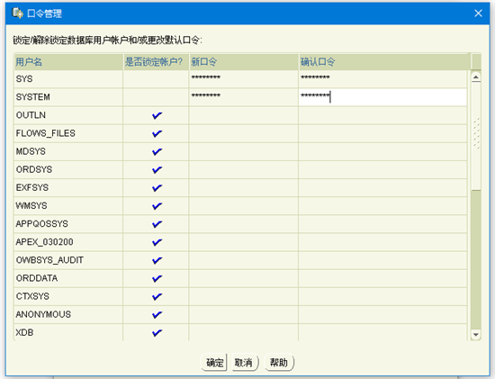
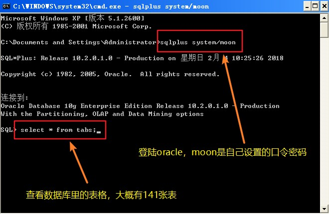
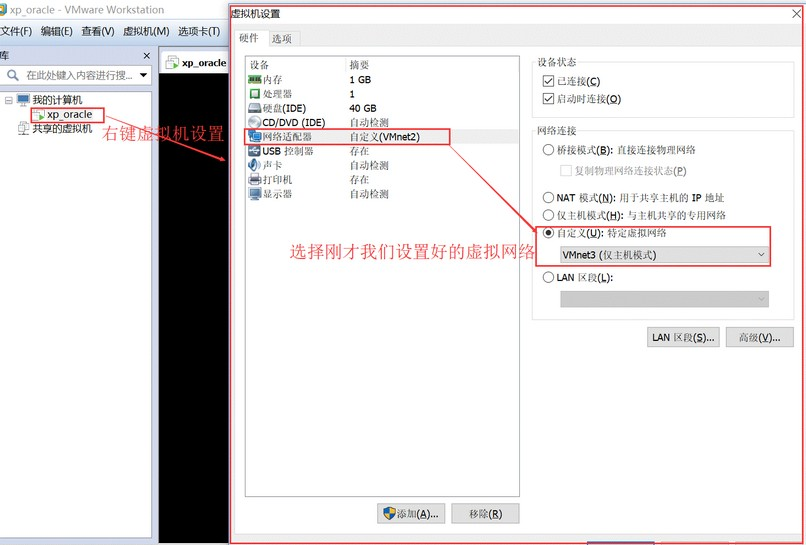
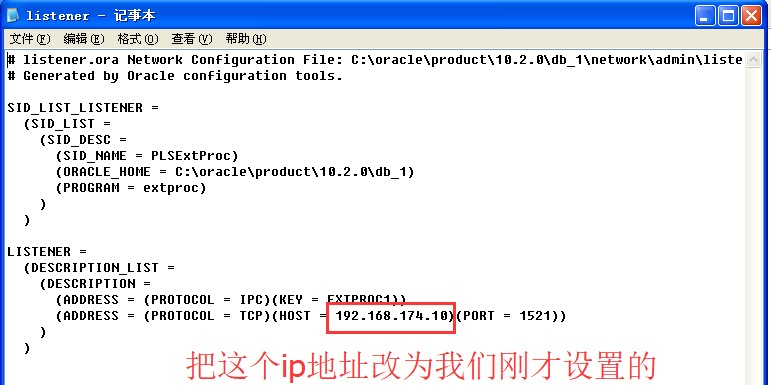
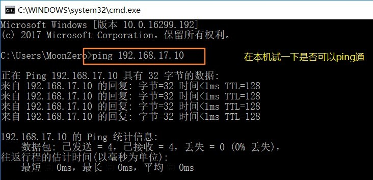

## 1. Oracle 11g 安装教程

### 1.1. Oracle 11g 下载

到 Oracle 官方网站下载 Oracle 数据库。官网下载地址：https://www.oracle.com/cn/database/technologies/oracle-database-software-downloads.html

下载的时候注意选对版本，因为是要在 Windows 10 64 位电脑上进行安装，所以选择 Windows X64 的版本，如下图：


### 1.2. Oracle 11g 安装步骤

Oracle 11g 下载完成后，解压到一个空的文件夹，然后双击 setup.exe 文件，开始安装 Oracle 数据库。


执行安装程序后会出现命令提示行，等待片刻之后就会出现启动画面。

1. 此步骤中，可以提供的电子邮件，以获取有关 Oracle 安全问题的更新信息。但为了方便，也可不提供电子邮件。


确认不提供电子邮件，点击 【是(Y)】继续。


2. 步骤中有三个选项，如下图所示。选择第一个【创建和配置数据库】，然后单击【下一步】按钮。


3. 如果要在笔记本电脑或桌面上安装 Oracle 数据库，请选择第一个选项【桌面类】，否则选择第二个选项，然后单击【下一步】按钮。


4. 此步骤允许要求输入完整的数据库安装文件夹。可以更改 Oracle 基本文件夹，其他文件夹将相应更改。填写上管理员密码，之后单击【下一步】按钮。


5. 在安装 Oracle 数据库组件之前执行先决条件检查。


6. 此步骤将显示上一步骤检查的摘要信息，单击【完成】按钮开始安装 Oracle 数据库。


7. 此步骤将文件复制到相应的文件夹并安装 Oracle 组件和服务。


7.1. 完成后，安装程序将显示“数据库配置助理”对话框 


7.2. 单击【口令管理】按钮设置不同用户的密码，这里将 SYS，SYSTEM 和 HR 用户解锁并设置相应的密码 ，完成后，点击【确定】。



8. 安装过程完成后，单击【关闭】按钮来关闭安装程序。到此，Oracle 11g 已经成功安装好了。


### 1.3. 验证安装情况

如果上面安装步骤正常通过，在【开始】->【所有应用】将看到 Oracle 文件夹如下：


首先，启动 SQL Plus，它是一个可用于与 Oracle 数据库交互的命令行界面工具。然后，在命令提示符中输入用户和登录密码，如提示连接成功，证明 Oracle 11g 安装完毕。


### 1.4. 安装问题

安装时遇到 oracle 安装最后一步出错的解决方法


### 1.5. Oracle11g 卸载

#### 1.5.1. 卸载流程

1. **关闭 oracle 所有的服务**。
    - Window7 用户可以在 windows的任务管理器 -> 服务内关闭以 oracle 开头的所有服务；
    - xp 用户可以在我的电脑右击 -> 管理 -> 服务和应用程序 -> 服务，找到所有以 oracle 开头的服务，右击关闭。
2. 打开注册表：`regedit`。打开路径：`HKEY_LOCAL_MACHINE\SYSTEM\CurrentControlSet\Services\`，删除该路径下的所有以 oracle 开始的服务名称，这个键是标识 Oracle 在 windows 下注册的各种服务！
3. 找到路径：`HKEY_LOCAL_MACHINE\SOFTWARE\ORACLE`，删除该 oracle 目录，该目录下注册着 Oracle 数据库的软件安装信息。
4. 删除注册的 oracle 事件日志，打开注册表 `HKEY_LOCAL_MACHINE\SYSTEM\CurrentControlSet\Services\Eventlog\Application`，删除注册表的以 oracle 开头的所有项目。
5. 删除环境变量 path 中关于 oracle 的内容。（这一步好像不做也可以）
    1. 鼠标右键右单击“我的电脑 -> 属性 -> 高级 -> 环境变量 -> PATH 变量。
    2. 删除 Oracle 在该值中的内容。注意，path 中记录着一堆操作系统的目录，在 windows 中各个目录之间使用分号（`;`）隔开的，删除时注意。
    > 建议：删除 PATH 环境变量中关于 Oracle 的值时，将该值全部拷贝到文本编辑器中，找到对应的 Oracle 的值，删除后，再拷贝修改的串，粘贴到 PATH 环境变量中，这样相对而言比较安全。
6. 重新启动操作系统。以上1~5个步骤操作完毕后，重新启动操作系统。
7. 重启操作系统后各种 Oracle 相关的进程都不会加载了。删除 oracle 的安装目录，在这里就体现到了上面新建一个单独目录的好处了。可以直接把自定义的那个 oracle 文件夹直接删除。（数据库的东西好像删除起来也是很慢的）。如果没有按照自定义的话，找到默认的那个安装目录，删除。
8. 删除开始菜单中的 oracle 项。

#### 1.5.2. 补充网上完全卸载 Oracle 方法

软件环境：Windows XP + Oracle 10g

1. Oracle 安装路径为：`d:\Oracle1`、如果数据库配置了自动存储管理(ASM)，应该先删除聚集同步服务 CSS（cluster Synchronization Services)。删除 CSS 服务的方法是在 DOS 命令行中执行如下命令，在“服务”窗口中停止 Oracle 的所有服务。

```bash
localconfig delete2
```

2. 在“开始”菜单中依次选择“程序” -> “Oracle-OraDb10g_home1" -> "Oracle Installation Products” -> "Universal Installer"，打开 Oracle Universal Installer(OUI) 窗口
3. 单击“卸载产品”按钮，打开“产品清单”窗口，选中要删除的 Oracle 产品，单击“删除”按钮，打开“确认删除”对话框。
4. 在“确认删除”对话框中单击“是”按钮，开始删除选择的 Oracle 产品。
5. 删除自动存储管理（ASM），在 DOS 命令行中执行如下命令：

```bash
oracle -delete -asmsid +asm7
```

6. 运行 `regedit` 命令，打开注册表窗口。删除注册表中与 Oracle 相关的内容，具体如下：
    1. 删除 `HKEY_LOCAL_MACHINE/SOFTWARE/ORACLE` 目录。
    2. 删除 `HKEY_LOCAL_MACHINE/SYSTEM/CurrentControlSet/Services` 中所有以 oracle 或 OraWeb 为开头的键。
    3. 删除 `HKEY_LOCAL_MACHINE/SYSETM/CurrentControlSet/Services/Eventlog/application` 中所有以 oracle 开头的键。
    4. 删除 `HKEY_CLASSES_ROOT` 目录下所有以 Ora、Oracle、Orcl 或 EnumOra 为前缀的键。
    5. 删除 `HKEY_CURRENT_USER/SOFTWARE/Microsoft/windows/CurrentVersion/Explorer/MenuOrder/Start Menu/Programs` 中所有以 oracle 开头的键。
    6. 删除 `HKDY_LOCAL_MACHINE/SOFTWARE/ODBC/ODBCINST.INI` 中除 Microsoft ODBC for Oracle 注册表键以外的所有含有 Oracle 的键。其中有些注册表项可能已经在卸载 Oracle 产品时被删除。
    7. 删除环境变量中的 `PATHT CLASSPATH` 中包含 Oracle 的值。
    8. 删除“开始” -> “程序”中所有 Oracle 的组和图标。
    9. 删除所有与 Oracle 相关的目录，包括：
        1. `c:\Program file\Oracle` 目录。
        2. ORACLE_BASE 目录。
        3. `c:\Documents and Settings\系统用户名`、`LocalSettings\Temp` 目录下的临时文件。

## 2. Oracle 12C 安装教程

Oracle 12c，全称 Oracle Database 12c，是 Oracle 11g 的升级版，新增了很多新的特性。

### 2.1. Oracle 12C 下载

Oracle 的官方中文网站，选择相应的版本。下载地址：https://www.oracle.com/cn/database/technologies/oracle-database-software-downloads.html

注意：下载时，根据电脑系统选择相应的版本，如下图，因为是WIN 10 64位系统，因此选择第一个下载。


将下载下来的压缩包解压，得到以下文件：


双击 setup.exe 文件进行安装了。

### 2.2. Oracle 12C 安装步骤

1. 安装程序要求提供电子邮件地址以获取最新的安全问题和更新。可以单击下一步按钮跳过。


2. Oracle 安装程序会询问是要创建和配置数据库，仅安装数据库软件还是仅升级现有数据库。因为首次安装 Oracle 数据库，请选择第一个选项 (Create and configure a database)，然后单击下一步按钮。


3. 安装程序允许选择系统类型。因为是在桌面计算机上安装 Oracle，而不是服务器，因此，这里选择第一个选项：桌面类 ( Desktop class )，然后单击下一步按钮。


4. 在这一步骤中，允许指定要安装和配置 Oracle Home 以增强安全性的 Windows 用户帐户。选择第三个选项：“使用 Windows 内置帐户( Use Windows Built-in Account )”


5. 在此步骤中，选择要安装 Oracle 数据库的文件夹，全局数据库名称和密码，可插拔数据库名称。


6. 安装程序执行前提条件检查。


7. 安装程序会显示信息的摘要，例如全局设置，数据库信息等。如果一切正常，可查看信息并单击安装按钮。


7.1. 确认安装


7.2. 即将要安装的信息概述：


8. 安装程序开始安装 Oracle 数据库。

 

9. 安装成功完成后，安装程序会通知提示安装完成，如下面截图所示。单击关闭按钮关闭窗口。


### 2.3. 连接到 Oracle 数据库（SQL developer）

1. 启动由 Oracle 数据库提供的 SQL developer 应用程序。


2. 右键单击连接节点，然后选择“新建连接…(New Connection …)”菜单项以创建 新连接。


3. 输入在安装过程中提供的信息，如以下屏幕截图所示。单击连接按钮连接到 Oracle 数据库。


成功登陆后，在 SQL developer 将显示所有对象。


## 3. 在虚拟机中安装 Oracle

在安装完成前将 scott 和 hr 的两个账号解锁，可以设置新口令，如果使用默认的口令是:tiger

在虚拟机中验证 Oracle 是否安装成功

1. 打开“运行”，输入 cmd，进行命令行。输入 sqlplus system/口令密码
2. 登陆成功后可以查询 Oracle 里面的表格测试一下



## 4. 虚拟网卡设置

本机和虚拟机之间能相互访问，它们的 IP 段必须相同，配置方式如下

1. 为虚拟机添加虚拟网卡


2. 开启修改权限，点击下图的“更改设置”


3. 点击添加网络


4. 添加后会自动分配子网IP，不用修改。点击应用、确定


5. 添加完成后本机的网络上会多出一个网络适配器，根据虚拟机中的子网IP设置此IP地址


6. 自定义虚拟机的网络适配器，自定义为刚才手动添加的那个网络适配器



7. 回到XP虚拟机中设置IP，记得要与上述中的虚拟网络设置成同一网段的即可，比如我们设置为192.168.133.10


8. 修改Oracle的两个核心文件，进入虚拟机找到Oracle的安装目录

  

8.1. 打开listener.ora把红色框的内容改为我们刚才设置的虚拟机的ip地址: 192.168.133.10  



8.2. 打开tnsname.ora把红色框的内容改为虚拟机的IP: 192.168.133.10  


9. 重启Oracle的两个服务


配置好测试一下是否ping通



## 5. 个人测试本地安装 oracle 相关信息

- system口令：moon
- SCOTT的口令:123456
- HR的口令:123456
- oracle连接的虚拟网络
    - 子网IP:192.168.187.0；子网掩码:255.255.255.0
    - win10设置VMware Network Adapter VMnet5：
        - 子网IP:192.168.187.1；子网掩码:255.255.255.0
    - 虚拟机XP系统设置
        - 子网IP:192.168.187.10；子网掩码:255.255.255.0
