## 1. SQL Plus

### 1.1. 概述

SQL Plus 是交互式查询工具，在安装 Oracle 数据库服务器或客户端时会自动安装。SQL Plus 有一个命令行界面，允许连接到 Oracle 数据库服务器并交互执行语句。

### 1.2. sqlplus 客户端工具的安装

> 参考文档：\Oracle数据库安装视频教程\02、测试sqlplus客户端连接服务器.doc

命令行输入

```shell
sqlplus system/moon@192.168.17.10:1521/orcl
```

- 格式：`sqlplus system/密码@远程IP:1521/orcl`
- 注：moon是自己设置的口令密码，**orcl是安装oracle时填写的全局数据库名！！！！！**


### 1.3. 使用 SQL Plus 连接 Oracle 数据库服务器

在终端输入 sqlplus 命令，以此来在 Linux 或 Window 中启动 SQL Plus。

```bash
sqlplus
```

以 Windows 10 系统为例，在 Windows 的“开始”菜单的“程序”文件夹中找到 SQL Plus 程序，如下所示：

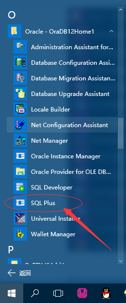

启动 SQLPlus 图标时，会提示输入用户名和密码。输入在安装 Oracle 数据库服务器期间设置的用户名和密码。假设要使用 sys 帐户连接到本地 Oracle 数据库服务器，请输入以下信息。按下 Enter 后，应该看到一条消息，后面跟着 `SQL>` 命令行，如下所示：

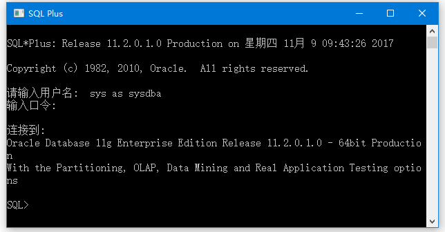

在 Oracle 12c 中，当连接到数据库服务器时，默认数据库是名为 `CDB$ROOT` 的 ROOT 容器数据库。要显示数据库名称，可使用 `SHOW` 命令：

```sql
SQL> SHOW con_name;

CON_NAME
------------------------------
CDB$ROOT
```

如果要切换到可插拔数据库，可使用 `ALTER SESSION` 语句将当前数据库设置为可插入数据库，例如要连接到 PDBORDL 数据库：

```sql
SQL> ALTER SESSION SET CONTAINER = PDBORDL;

Session altered.
```

要断开用户与 Oracle 数据库服务器的连接，可使用 `EXIT` 命令：

```sql
SQL> EXIT
```

要将 OT 用户连接到位于 PDBORCL 可插拔数据库中的示例数据库，输入以下命令：

```sql
sqlplus OT@PDBORCL
```

SQL Plus 会提示输入 OT 用户的密码。输入密码后，将连接到 Oracle 数据库服务器中的 PDBORCL 数据库。

## 2. SQL Developer

### 2.1. 概述

SQL Developer 是一个用于在 Oracle 数据库中使用 SQL 的免费 GUI 工具。与 SQL Plus 程序一样，在安装 Oracle 数据库服务器或客户端时自动安装。

要启动 SQL Developer 程序，请单击开始菜单中Oracle程序文件夹中的SQL Developer图标

### 2.2. 使用 SQL Developer 连接 Oracle 数据库服务器

单击开始菜单中 Oracle 程序文件夹中的 SQL Developer 图标启动。

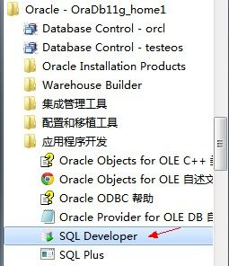

SQL Developer 不能用于创建 Oracle 数据库，只能用来连接已创建的数据库，一般都是使用 Database Configuration Assistant（简称 DBCA）来创建数据库，如下图所示：

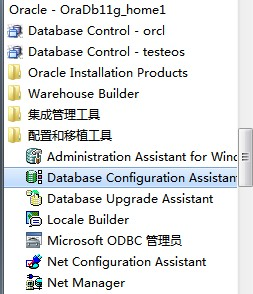

在 SQL Developer 中点击左上角的“绿色加号”，新建一个连接：

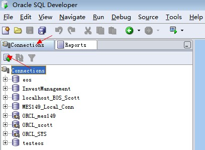

创建数据库连接

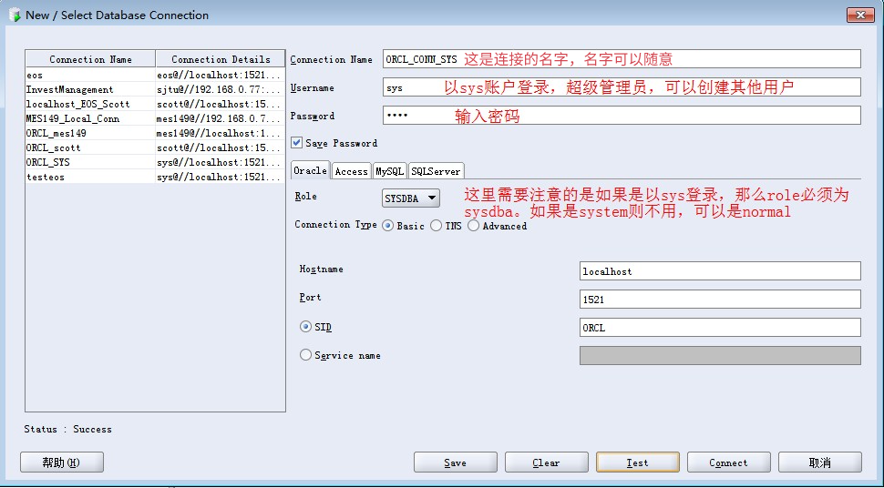

填写完配置以后可以点击【Test】按钮来测试数据库连接是否正确，如上图所示，左下角有“Status：Success”则表明数据库连接正确

### 2.3. 创建新用户

为 ORCL 这个数据库创建新用户：

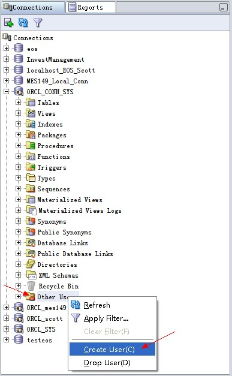

填写用户名和密码，以及为用户指定表空间。

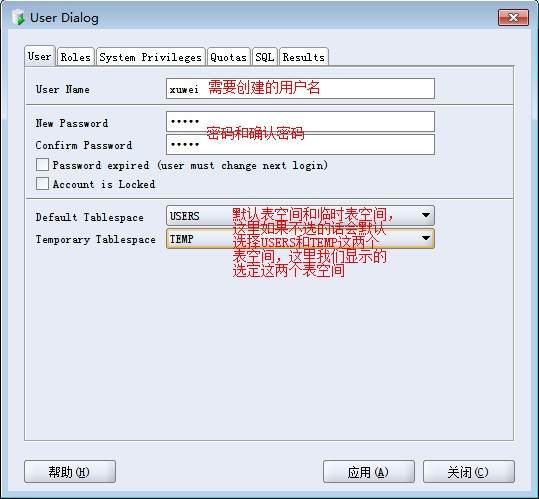

为用户分配权限

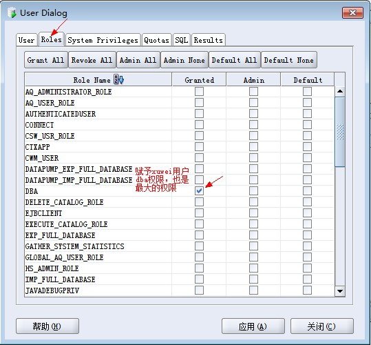

查看创建用户和分配权限所对应的 sql 代码

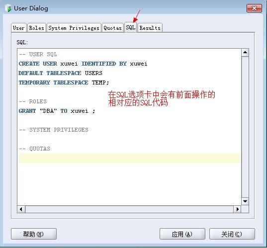

使用新账户创建数据库连接

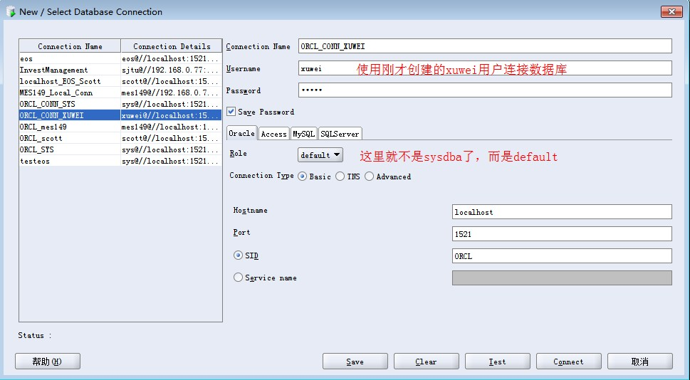

## 3. 安装 PLSQL Developer 客户端

> 参考文档：\Oracle数据库安装视频教程\03、安装PLSQL并测试连接.doc

### 3.1. 中文乱码的处理

1. 查看服务器端编码

```sql
select userenv('language') from dual;
-- 实际查到的结果为：AMERICAN_AMERICA.ZHS16GBK
```

2. 执行语句 `select * from V$NLS_PARAMETERS`
    - 查看第一行中 PARAMETER 项中为 NLS_LANGUAGE 对应的 VALUE 项中是否和第一步得到的值一样。如果不是，需要设置环境变量。
    - 否则 PLSQL 客户端使用的编码和服务器端编码不一致，插入中文时就会出现乱码。
3. 设置环境变量
    - 计算机 --> 属性 --> 高级系统设置 --> 环境变量 --> 新建
    - 设置变量名：`NLS_LANG`
    - 变量值：第1步查到的值: `AMERICAN_AMERICA.ZHS16GBK`
4. 重新启动 PLSQL，插入数据正常
