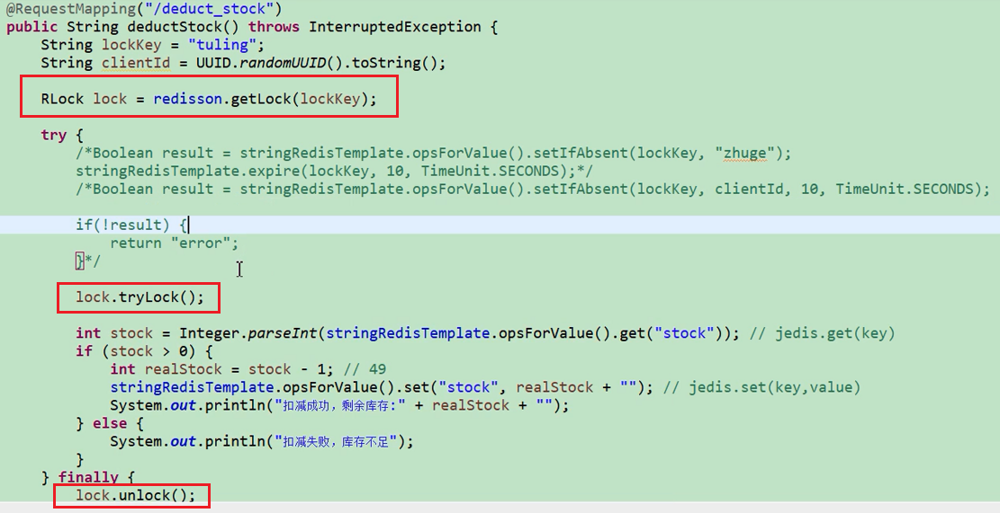

## 1. （待整理）实现限流

> TODO: 待整理

## 2. (待整理)解决分布式锁的框架-redisson

redisson官网：https://redisson.org/

### 2.1. 简介

与Jedis很相似的用于操作Redis的框架，其中实现一个功能是在高并发的情况，给Redis加上锁，并且在线程的执行过程中，判断当前线程是否已经执行结束，会自动给当前的锁增加存活时间，以便让当前线程完全执行后，再去释放锁。

分布式锁-案例：

## 3. （待研究）分布式锁 - RedLock

Redlock 是官方权威提出的基于 Redis 实现分布式锁的方式，此种方式比原先的单节点的方法更安全。它可以保证以下特性：

1. 安全特性：互斥访问，即永远只有一个 client 能拿到锁
2. 避免死锁：最终 client 都可能拿到锁，不会出现死锁的情况，即使原本锁住某资源的 client 挂掉了
3. 容错性：只要大部分 Redis 节点存活就可以正常提供服务
