## 1. （待整理）实现限流

> TODO: 待整理

## 2. Redis 实现分布式锁

> 可参考 Redis 官网的分布式锁的实现这篇文章  https://redis.io/docs/manual/patterns/distributed-locks/

### 2.1. 本地锁的问题

例如微服务被拆分成了四个微服务。前端请求进来时，会被转发到不同的微服务。假如前端接收了 10 W 个请求，每个微服务接收 2.5 W 个请求，假如缓存失效了，每个微服务在访问数据库时加锁，通过锁（`synchronzied` 或 `lock`）来锁住自己的线程资源，从而防止缓存击穿。

这种本地加锁的方式，在分布式情况下会带来数据不一致的问题：比如服务 A 获取数据后，更新缓存 key = 100，服务 B 不受服务 A 的锁限制，并发去更新缓存 key = 99，最后的结果可能是 99 或 100，但这是一种未知的状态，与期望结果不一致。流程图如下所示：

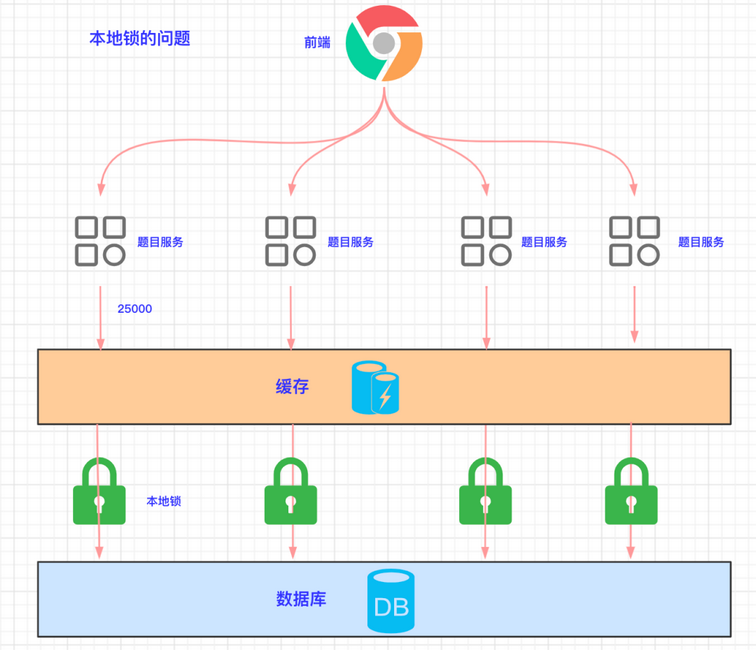

### 2.2. 分布式锁概述

分布式锁是指，支持**分布式集群环境**下的锁。在查询 DB 时，只有一个线程能访问，其他线程都需要等待第一个线程释放锁资源后，才能继续执行。

#### 2.2.1. 分布式锁的基本原理图

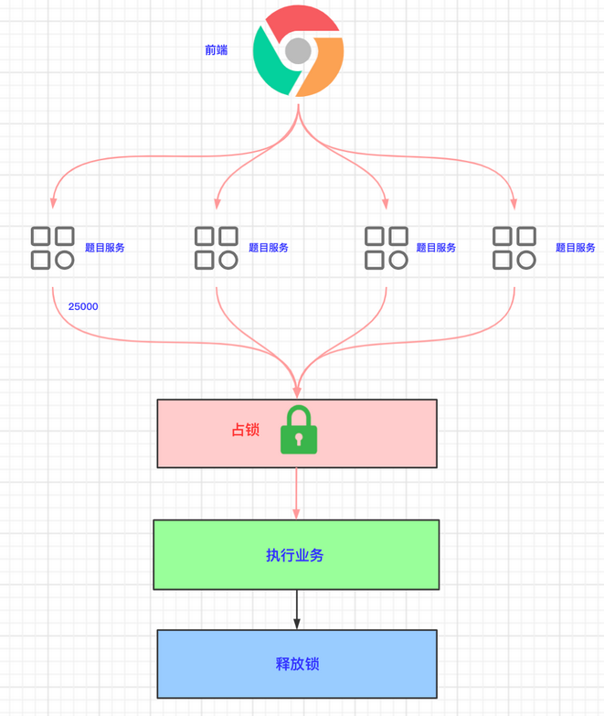

#### 2.2.2. Redis 的 SETNX 命令

Redis 实现分布式锁的几种方案，都是利用 `SETNX` 命令（设置 key 等于某 value）。只是不同方案传的参数个数不一样，以及考虑了异常情况。

`setnx` 是 SET if not exists 的简写。意思就是当 key 不存在时，直接设置 key 的值；如果存在时，则什么都不做。Redis 命令行语法如下：

```bash
set <key> <value> NX
```

- 获取锁：返回 OK，表示设置成功。重复执行该命令，返回 nil 表示设置失败。

```shell
# 添加锁，NX是互斥、EX是设置超时时间
SET lock value NX EX 10
```

> Notes: 直接使用 `setnx` 命令与上例比较，`setnx` 是相当于两条命令，而上例为单条命令，可以保证原子性。

- 释放锁：

```shell
# 释放锁，删除即可
DEL key
```

#### 2.2.3. Redis 分布式锁实现流程图

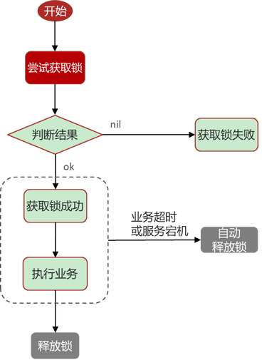

### 2.3. 方案1

#### 2.3.1. 实现流程

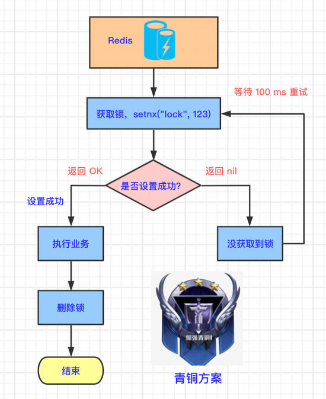

- 多个并发线程都到 Redis 中执行 setnx 命令申请锁，假设线程 A 执行成功，说明当前线程 A 获得了锁。
- 其他线程执行 setnx 命令都会是失败的，所以需要等待线程 A 释放锁。
- 线程 A 执行完自己的业务后，删除锁。
- 其他线程继续执行 setnx 命令抢占锁。因为线程 A 已经删除了锁，所以又有其他线程可以抢占到锁。

#### 2.3.2. 示例代码

```java
// 1.先抢占锁
Boolean lock = redisTemplate.opsForValue().setIfAbsent("lock", "123");
if (lock) {
	// 2.抢占成功，执行业务
	List<TypeEntity> typeEntityListFromDb = getDataFromDB();
	// 3.解锁
	redisTemplate.delete("lock");
	return typeEntityListFromDb;
} else {
	// 4.休眠一段时间
	sleep(100);
	// 5.抢占失败，等待锁释放
	return getTypeEntityListByRedisDistributedLock();
}
```

> Tips: 因为该程序存在递归调用，可能会导致栈空间溢出，所以需要休眠一段时间。

#### 2.3.3. 方案的缺陷

- 缺陷：如果线程执行 setnx 占锁成功，但业务代码出现异常或者服务器宕机，没有执行主动删除锁的逻辑，就造成了死锁。
- 改进：设置锁的自动过期时间，过一段时间后，自动删除锁，这样其他线程就能获取到锁。

### 2.4. 方案2

针对前面方案的问题，可以设置锁的自动过期时间，过一段时间后，自动删除锁，这样其他线程就能获取到锁了。

#### 2.4.1. 技术原理图

在占锁成功后，设置锁的过期时间，这两步是分步执行的。如下图：

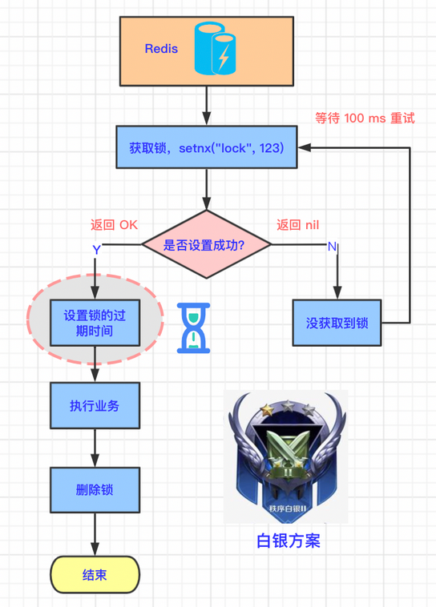

#### 2.4.2. 示例代码

```java
// 1.先抢占锁
Boolean lock = redisTemplate.opsForValue().setIfAbsent("lock", "123");
if (lock) {
	// 2.在 10s 以后，自动清理 lock
	redisTemplate.expire("lock", 10, TimeUnit.SECONDS);
	// 3.抢占成功，执行业务
	List<TypeEntity> typeEntityListFromDb = getDataFromDB();
	// 4.解锁
	redisTemplate.delete("lock");
	return typeEntityListFromDb;
}
```

#### 2.4.3. 如何合理的控制分布式锁有效时长

- 根据业务执行时间预估
- 给锁续期

#### 2.4.4. 方案的缺陷

- 缺陷：因为占锁和设置过期时间是分两步执行的，所以如果在这两步之间发生了异常，则锁的过期时间根本就没有设置成功。所有一样存在**“锁永远不能过期”**的问题。
- 改进：占锁和设置锁过期时间保证原子操作。

### 2.5. 方案3

#### 2.5.1. 原子指令

针对前面方案的问题，可以考虑使用事务的原子性（Atom）。原子性是指，多条命令要么都成功执行，要么都不执行。将两步操作放在一步中执行：占锁+设置锁过期时间。具体命令如下：

```bash
# 设置某个 key 的值并设置多少毫秒或秒过期。
set <key> <value> PX <多少毫秒/秒> NX
# 然后可以通过如下命令查看 key 的变化
ttl <key>
```

#### 2.5.2. 技术原理图

此方案中，获取锁的时候，也需要设置锁的过期时间，但变成了原子操作，要么都成功执行，要么都不执行。如下图所示：

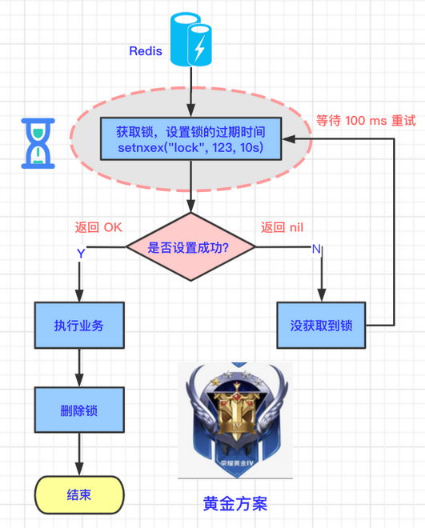

#### 2.5.3. 示例代码

设置 lock 的值等于 123，过期时间为 10 秒。如果 10 秒 以后，lock 还存在，则清理 lock。改动如下：

```java
// 1.先抢占锁
Boolean lock = redisTemplate.opsForValue().setIfAbsent("lock", "123", 10, TimeUnit.SECONDS);
```

#### 2.5.4. 方案的缺陷

- 缺陷：存在**线程未完成业务前，锁自动解除**的问题。例如，线程 A 处理任务所需要的时间大于锁自动清理（开锁）的时间，此时会自动开锁，而又有其他线程抢占到了锁。当线程 A 完成任务后，会把其他线程抢占到的锁给主动释放，从而造成线程安全问题。
- 改进：每次占用的锁，随机设为较大的值，主动删除锁时，比较锁的值和自己设置的值是否相等。

### 2.6. 方案4

针对上面方案的缺陷，可以给每个锁设置不同的编号。

#### 2.6.1. 技术原理图

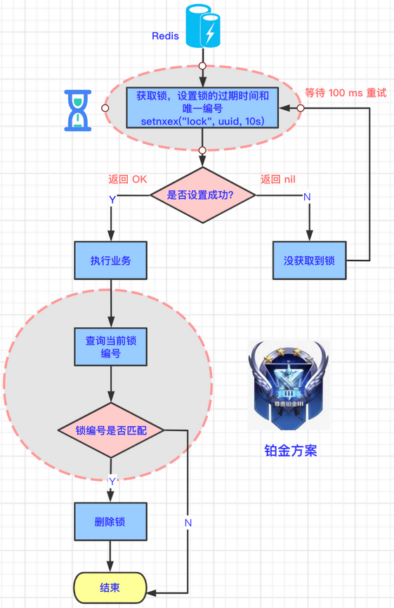

1. 生成随机唯一 id，给锁加上唯一值。
2. 抢占锁，并设置过期时间为 10 s，且锁具有随机唯一 id。
3. 抢占成功，执行业务。
4. 执行完业务后，获取当前锁的值。
5. 如果锁的值和设置的值相等，则清理自己的锁。

#### 2.6.2. 代码示例

```java
// 1.生成唯一 id
String uuid = UUID.randomUUID().toString();
// 2. 抢占锁
Boolean lock = redisTemplate.opsForValue().setIfAbsent("lock", uuid, 10, TimeUnit.SECONDS);
if (lock) {
    System.out.println("抢占成功：" + uuid);
    // 3.抢占成功，执行业务
    List<TypeEntity> typeEntityListFromDb = getDataFromDB();
    // 4.获取当前锁的值
    String lockValue = redisTemplate.opsForValue().get("lock");
    // 5.如果锁的值和设置的值相等，则清理自己的锁
    if (uuid.equals(lockValue)) {
        System.out.println("清理锁：" + lockValue);
        redisTemplate.delete("lock");
    }
    return typeEntityListFromDb;
} else {
    System.out.println("抢占失败，等待锁释放");
    // 4.休眠一段时间
    sleep(100);
    // 5.抢占失败，等待锁释放
    return getTypeEntityListByRedisDistributedLock();
}
```

#### 2.6.3. 方案的缺陷

- 缺陷：获取锁、比较锁的值、删除锁，这三步是非原子性的。执行业务逻辑时有可能锁自动过期了，被其他客户端抢占了锁，导致删锁时把其他客户端占用的锁删了。
- 改进：使用 Lua 脚本进行获取锁、比较锁、删除锁的原子操作。

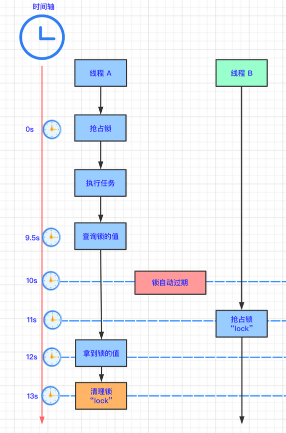

- 时刻：0s。线程 A 抢占到了锁。
- 时刻：9.5s。线程 A 向 Redis 查询当前 key 的值。
- 时刻：10s。锁自动过期。
- 时刻：11s。线程 B 抢占到锁。
- 时刻：12s。线程 A 在查询途中耗时长，终于拿多锁的值。
- 时刻：13s。线程 A 还是拿自己设置的锁的值和返回的值进行比较，值是相等的，清理锁，但是这个锁其实是线程 B 抢占的锁。

### 2.7. 方案5

上面的方案中，线程 A 查询锁和删除锁的逻辑不是原子性的，所以将查询锁和删除锁这两步作为原子指令操作即可。

#### 2.7.1. 技术原理图

如下图所示，红色圈部分是此方案的不同之处。用脚本进行删除，达到原子操作。

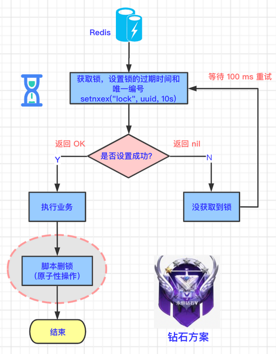

#### 2.7.2. 代码示例

先编写 Redis 专属脚本：先获取 KEYS[1] 的 value，判断 KEYS[1] 的 value 是否和 ARGV[1] 的值相等，如果相等，则删除 KEYS[1]。

```lua
if redis.call("get",KEYS[1]) == ARGV[1]
then
    return redis.call("del",KEYS[1])
else
    return 0
end
```

在 Java 项目中，分两步：先定义脚本；用 `redisTemplate.execute` 方法执行脚本。

```java
// 脚本解锁
String script = "if redis.call('get',KEYS[1]) == ARGV[1] then return redis.call('del',KEYS[1]) else return 0 end";
redisTemplate.execute(new DefaultRedisScript<Long>(script, Long.class), Arrays.asList("lock"), uuid);
```

上面的代码中，KEYS[1] 对应 `lock`，ARGV[1] 对应 `uuid`，含义就是如果 lock 的 value 等于 uuid 则删除 lock。而这段 Redis 脚本是由 Redis 内嵌的 Lua 环境执行的，所以又称作 Lua 脚本。

#### 2.7.3. 方案的缺陷

- 缺陷：还有一些细节问题未解决。
- 改进：使用 Redission 分布式锁。

## 3. (待整理)Redisson - 解决分布式锁的框架

> 参考：[最强分布式锁工具：Redisson](https://mp.weixin.qq.com/s?__biz=MzI4Njc5NjM1NQ==&mid=2247524395&idx=2&sn=5357b988568960a606a72b3813b84190&chksm=ebd55f07dca2d611f34079beb551b1d858454d2759d4e8b9f3818b477cd28d84740fa31dc550&scene=21#wechat_redirect)

### 3.1. Redisson 简介

> 官网：https://redisson.org/

Redisson 是与 Jedis 很相似的用于操作 Redis 的框架，其中实现一个功能是在高并发的情况，给 Redis 加上锁，并且在线程的执行过程中，判断当前线程是否已经执行结束，会自动给当前的锁增加存活时间，以便让当前线程完全执行后，再去释放锁。

### 3.2. Redisson 实现分布式锁

#### 3.2.1. 执行流程

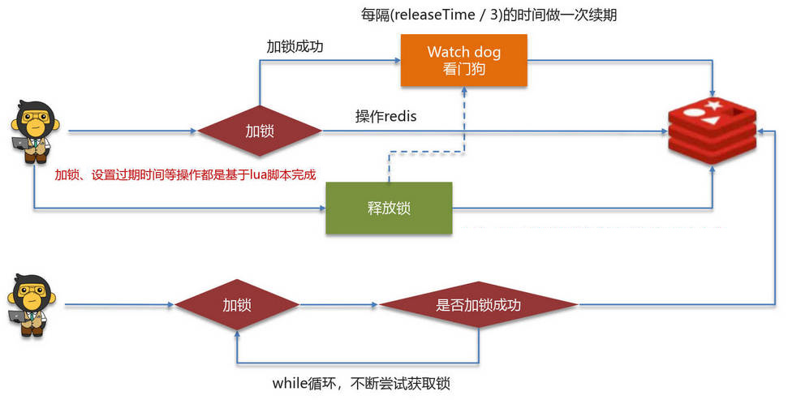

在 redisson 中需要手动加锁，并且可以控制锁的失效时间和等待时间。在 redisson 中引入了一个看门狗机制，当锁住的一个业务还没有执行完成的时候，会自动每隔一段时间就检查当前业务是否还持有锁，如果持有就增加加锁的持有时间，当业务执行完成之后需要使用释放锁就可以了。

redisson 还实现了在高并发下，一个业务有可能会执行很快，先线程1持有锁的时候，线程2来了以后并不会马上拒绝，它会自旋不断尝试获取锁；如果线程1释放之后，线程2就可以马上持有锁，性能也得到了提升。

#### 3.2.2. 分布式锁的可重入性

Redisson 实现的分布式锁是可重入的，此设计为了避免死锁的产生。

可重入的具体实现是，在内部判断是否是当前线程持有的锁，如果是当前线程持有的锁就会计数，如果释放锁就会在计算上减1。在存储数据的时候采用的 hash 结构<font color=red>**记录线程id 和重入次数**</font>。

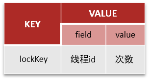

> 其中键可以按照业务进行定制，hash 结构的值的小 key 是当前线程的唯一标识，value 是当前线程重入的次数。

示例：

```java
public void add1() {
    RLock lock = redissonClient.getLock("moon_lock");
    boolean isLock = lock.tryLock();
    // 执行业务
    add2();
    // 释放锁
    lock.unlock();
}

public void add2() {
    RLock lock = redissonClient.getLock("moon_lock");
    boolean isLock = lock.tryLock();
    // 执行业务
    // 释放锁
    lock.unlock();
}
```

#### 3.2.3. 分布式锁的主从一致性问题

redisson 实现的分布式锁无法解决主从一致性问题。比如，当线程1加锁成功后，master 节点数据会异步复制到 slave 节点，此时当前持有 Redis 锁的 master 节点宕机，slave 节点被提升为新的 master 节点，假如现在来了一个线程2，再次加锁，会在新的 master 节点上加锁成功，此时就会出现两个节点同时持有一把锁的问题。

可以利用 redisson 提供的 RedLock（红锁）来解决主从一致性问题。它的主要作用是，不只在一个 redis 实例上创建锁，而是在多个 redis 实例(n / 2 + 1)上创建锁，并且要求在大多数 redis 节点上都成功创建锁，红锁中要求是 redis 的节点数量要过半。这样就能避免线程1 加锁成功后 master 节点宕机导致线程2 成功加锁到新的 master 节点上的问题了。

但是使用了红锁，因为需要同时在多个节点上都添加锁，性能就变的很低了，并且运维维护成本也非常高，所以，一般在项目中也不会直接使用红锁，并且官方也暂时废弃了这个红锁。

> Tips: Redis 是支持高可用的，若要实现强一致性，则非常影响性能。所以强一致性要求高的业务，建议使用 zookeeper 实现的分布式锁，它是可以保证强一致性的。

### 3.3. 使用示例

分布式锁-案例：


## 4. （待研究）分布式锁 - RedLock

> 参考 Redis 作者推荐的分布式集群情况下的方式，[《Is Redlock safe?》](http://antirez.com/news/101)

Redlock 是官方权威提出的基于 Redis 实现分布式锁的方式，此种方式比原先的单节点的方法更安全。它可以保证以下特性：

1. 安全特性：互斥访问，即永远只有一个 client 能拿到锁
2. 避免死锁：最终 client 都可能拿到锁，不会出现死锁的情况，即使原本锁住某资源的 client 挂掉了
3. 容错性：只要大部分 Redis 节点存活就可以正常提供服务

## 5. (待实现)分布式全局唯一 ID

> TODO: 待实现
