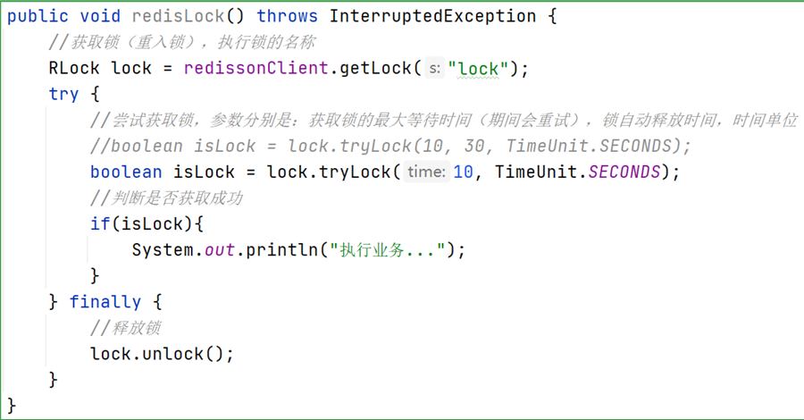

## 1. （待整理）实现限流

> TODO: 待整理

## 2. (待整理)解决分布式锁的框架 - Redisson

### 2.1. redis 实现分布式锁概述

Redis 实现分布式锁主要利用 `setnx` 命令。`setnx` 是 SET if not exists(如果不存在，则直接 SET)的简写。

- 获取锁：

```shell
# 添加锁，NX是互斥、EX是设置超时时间
SET lock value NX EX 10
```

> Notes: 直接使用 `setnx` 命令与上例，而 `setnx` 是相当于两条命令，而上例为单条命令，可以保证原子性。

- 释放锁：

```shell
# 释放锁，删除即可
DEL key
```

#### 2.1.1. 分布式锁流程图


#### 2.1.2. Redis 如何合理的控制分布式锁有效时长

- 根据业务执行时间预估
- 给锁续期

### 2.2. Redisson 简介

> 官网：https://redisson.org/

Redisson 是与 Jedis 很相似的用于操作 Redis 的框架，其中实现一个功能是在高并发的情况，给 Redis 加上锁，并且在线程的执行过程中，判断当前线程是否已经执行结束，会自动给当前的锁增加存活时间，以便让当前线程完全执行后，再去释放锁。

### 2.3. Redisson 实现分布式锁

#### 2.3.1. 执行流程


#### 2.3.2. 分布式锁的可重入性

Redisson 实现的分布式锁是可重入的，此设计为了避免死锁的产生。

可重入的具体实现是，在内部判断是否是当前线程持有的锁，如果是当前线程持有的锁就会计数，如果释放锁就会在计算上减1。在存储数据的时候采用的 hash 结构<font color=red>**记录线程id 和重入次数**</font>，大 key 可以按照自己的业务进行定制，其中小 key 是当前线程的唯一标识，value 是当前线程重入的次数。


### 2.4. 使用示例

分布式锁-案例：




## 3. （待研究）分布式锁 - RedLock

Redlock 是官方权威提出的基于 Redis 实现分布式锁的方式，此种方式比原先的单节点的方法更安全。它可以保证以下特性：

1. 安全特性：互斥访问，即永远只有一个 client 能拿到锁
2. 避免死锁：最终 client 都可能拿到锁，不会出现死锁的情况，即使原本锁住某资源的 client 挂掉了
3. 容错性：只要大部分 Redis 节点存活就可以正常提供服务
