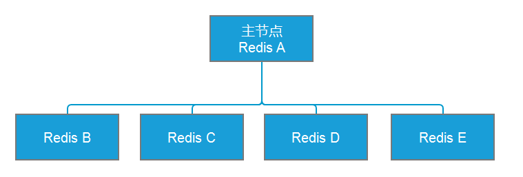
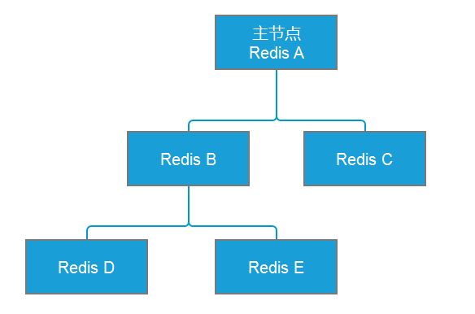
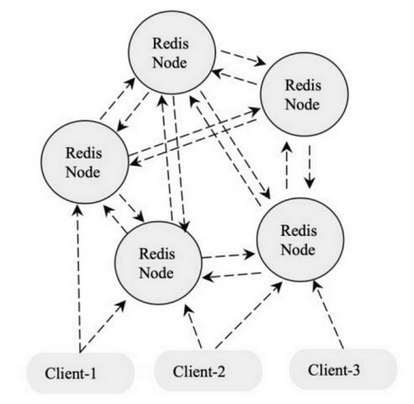

## 1. Redis 的部署方案简述

Redis 的部署分为：Redis 单机版安装、Redis 主从模式安装、Redis 哨兵模式安装和 Redis Cluster（集群模式）安装。

- **单机版**：单机部署，单机redis能够承载的 QPS 大概就在上万到几万不等。实际生产这种部署方式很少使用，一般都是用于本地测试开发。存在的问题：
    1. 内存容量有限
    2. 处理能力有限
    3. 无法高可用
- **主从模式**：一主多从，主负责写，并且将数据复制到其它的 slave 节点，从节点负责处理所有的读请求。这样也可以很轻松实现水平扩容，支撑读高并发。master 节点挂掉后，需要手动指定新的 master，可用性不高，基本不用。
- **哨兵模式**：通过哨兵机制（Sentinel）可以自动切换主从节点，因此解决了主从复制存在不能自动故障转移、达不到高可用的问题。master 节点挂掉后，哨兵进程会主动选举新的 master，可用性高，但是每个节点存储的数据是一样的，浪费内存空间。数据量不是很多，集群规模不是很大，需要自动容错容灾的时候使用。
- **Redis cluster**：服务端分片技术，3.0版本开始正式提供。Redis Cluster 并没有使用一致性 hash，而是采用slot(槽)的概念，一共分成16384个槽。将请求发送到任意节点，接收到请求的节点会将查询请求发送到正确的节点上执行。主要是针对海量数据+高并发+高可用的场景，如果是海量数据，那么建议使用 Redis cluster，所有主节点的容量总和就是 Redis cluster 可缓存的数据容量。

## 2. Redis 单机模式

### 2.1. windows 单机版

#### 2.1.1. 直接运行 Redis 服务

> Windows 版本的 redis 下载地址：https://github.com/MicrosoftArchive/redis/tags

下载 Redis-x64-3.2.100 版本，解压 Redis-x64-3.2.100.zip 到无中文与空格的目录中。

进入 cmd 命令行，进入 Redis-x64-3.2.100 目录，运行以下命令。（*注：如果使用powershell打开，需要在命令前增加“`./`”*）

```bash
redis-server redis.windows.conf
```

出现下图说明，redis启动成功


#### 2.1.2. 将 Redis 注册为服务

- 进入 cmd 命令行，进入 redis 所在目录，运行以下命令（*注：如果使用powershell打开，需要在命令前增加“./”*）

```bash
redis-server --service-install redis.windows-service.conf --loglevel verbose
```

- 成功执行命令后，刷新服务，会看到多了一个redis服务


- 进入redis所在目录，输入常用的redis服务命令

```bash
redis-server.exe --service-uninstall    # 卸载服务
redis-server.exe --service-start    # 开启服务
redis-server.exe --service-stop    # 停止服务
```

### 2.2. linux 单机版

#### 2.2.1. 安装（压缩包安装）

> - 参考文档：
>   - E:\07-编程工具资料\04-数据库\Redis\Redis安装和使用.docx
>   - E:\07-编程工具资料\04-数据库\Redis\Redis安装.doc

1. **安装 redis 的依赖环境**

```bash
[root@localhost src]# yum -y install gcc automake autoconf libtool make
```

2. **上传安装包**

获取到安装包，使用 `rz` 命令（需要系统支持）并将它上传到 linux 的 `/usr/local/src/` 目录下

```bash
[root@localhost src]# ls
redis-5.0.4.tar.gz
```

3. **解压**

解压安装包，得到一个redis-5.0.4目录

```bash
[root@localhost src]# tar -zxvf redis-5.0.4.tar.gz
[root@localhost src]# ls
redis-5.0.4 redis-5.0.4.tar.gz
```

4. **编译**

进入 redis 目录，在目录下执行 `make` 命令

```bash
[root@localhost src]# cd redis-5.0.4
[root@localhost redis-5.0.4]# make
```

5. **安装**

执行安装命令，注意此处指定了安装目录为 `/usr/local/redis`

```bash
[root@localhost redis-5.0.4]# make PREFIX=/usr/local/redis install
```

6. **复制配置文件**

将配置文件复制到 redis 的安装目录的bin目录下

```bash
[root@localhost redis-5.0.4]# cd /usr/local/redis/bin/
[root@localhost bin]# ls
redis-benchmark redis-check-aof redis-check-rdb redis-cli redis-sentinelredis-server
[root@localhost bin]# cp /usr/local/src/redis-5.0.4/redis.conf ./
[root@localhost bin]# ls
redis-benchmark redis-check-aof redis-check-rdb redis-cli redis.conf redis-sentinel redis-server
```

7. **修改redis的配置文件**

修改 redis 的配置文件，将注解绑定和保护模式关闭，方便从客户端连接测试

```bash
[root@localhost bin]# vim redis.conf
```


8. **启动redis服务**

```bash
[root@localhost bin]# ./src/redis-server redis.conf &
```

#### 2.2.2. 可执行相关文件

|     可执行文件     |           作用           |
| ---------------- | ----------------------- |
| redis-server     | 启动 redis               |
| redis-cli        | redis 命令行客户端         |
| redis-benchmark  | 基准测试工具               |
| redis-check-aof  | AOF 持久化文件检测和修复工具 |
| redis-check-dump | RDB 持久化文件检测和修复工具 |
| redis-sentinel   | 启动哨兵                  |

#### 2.2.3. redis-server 服务端启动

默认配置：redis-server，日志输出版本信息，端口：6379

- 启动方式1（不建议），`--port` 指定端口号

```bash
redis-server --port 6380
```

- 启动方式2，以配置文件方式启动

```bash
redis-server /opt/redis/redis.conf
```

- 启动方式3：修改 redis.conf 配置文件，增加 `daemonize yes` 配置以后端模式启动。启动时，指定配置文件。


```bash
./redis-server redis.conf
```

#### 2.2.4. redis-cli 客户端启动与停止

1. 交互式启动。`-h`用于指定服务器ip，默认是`127.0.0.1`；`-p`用于指定服务的端口，默认是 6379；`-a`用于指定密码

```bash
redis-cli -h {host} -p {prot} -a {password}
```

2. 命令式启动，直接连接并且操作

```bash
redis-cli -h 127.0.0.1 -p 6379 get hello
```

3. 停止 redis 服务

```bash
# 使用客户端登陆
redis-cli -a 123456
# 关闭前生成持久化文件
shutdown nosave|save
```

使用以上命令断开连接，持久化文件生成，相对安全。还可以用 `kill -9 pid` 命令关闭，但此方式不会做持久化，还会造成缓冲区非法关闭，可能会造成 AOF 和丢失数据，所以不推荐。

#### 2.2.5. redis-cli 客户端监控命令

打开 redis-cli 客户端后，输入以下命令打开 redis 服务的数据监控

```bash
monitor
```

## 3. Redis 主从模式

### 3.1. 概述

部署 Redis 主从结构，是为了 Redis 服务的高可用。Redis 的复制功能是支持多个数据库之间的数据同步，主从的所存取数据是一样的。在复制的概念中，数据库分为两类，一类是主数据库（master），另一类是从数据库（slave）。

- 主数据库主要用于执行读写操作，当写操作导致数据变化时会自动将数据同步给从数据库。
- 从数据库一般只用于读操作，并接受主数据库同步过来的数据。

<font color=red>**一个主数据库可以拥有多个从数据库，而一个从数据库只能拥有一个主数据库，从库还可以作为其他数据库的主库**</font>。

### 3.2. 常用的主从结构

- **一主一从**：用于主节点故障转移从节点，当主节点的“写”命令并发高且需要持久化，可以只在从节点开启AOF（主节点不需要）


- **一主多从**：针对“读”较多的场景，“读”由多个从节点来分担，但节点越多，主节点同步到多节点的次数也越多，影响带宽，也加重主节点的稳定



- **树状主从**：一主多从的缺点（主节点推送次数多压力大）可用些方案解决，主节点只推送一次数据到从节点1，再由从节点2推送到11，减轻主节点推送的压力



### 3.3. 主从数据复制的原理

Redis 提供了复制功能，可以实现在主数据库（Master）中的数据更新后，自动将更新的数据同步到从数据库（Slave）。一个主数据库可以拥有多个从数据库，而一个从数据库只能拥有一个主数据库。主从数据复制原理图如下：


1. 一个从数据库在启动后，会向主数据库发送 SYNC 命令。
2. 主数据库在接收到 SYNC 命令后会开始在后台保存快照（即 RDB 持久化的过程），并将保存快照期间客户端（client）接收到的命令缓存起来。在该持久化过程中会生成一个`.rdb`快照文件。
3. 在主数据库快照执行完成后，Redis 会将快照文件和客户端（client）所有缓存的命令以`.rdb`快照文件的形式发送给从数据库。
4. 从数据库收到主数据库的`.rdb`快照文件后，载入该快照文件到本地磁盘。
5. 从数据库执行载入后的`.rdb`快照文件，再将数据从本地磁盘加载到内存中。以上过程被称为**复制初始化**。
6. 在复制初始化结束后，主数据库在每次收到写命令时都会将命令同步给从数据库，从而保证主从数据库的数据一致。
7. 如果从节点跟主节点之间网络出现故障，连接断开了，会自动重连，连接之后主节点仅会将部分缺失的数据同步给从节点。

### 3.4. 主从复制配置

Redis 开启复制功能时，主数据库无须进行任何配置，而从数据库需要在配置文件中增加以下内容：

```properties
# slaveof master_address master_port
slaveof 127.0.0.1 9000
# 如果 master 有密码，则需要设置 masterauth
masterauth=123456
```

在上述配置中，`slaveof` 后面的配置分别为**主数据库的IP地址**和**端口**，在主数据库开启了密码认证后需要将 `masterauth` 设置为主数据库的密码，在配置完成后重启 Redis，主数据库上的数据就会同步到从数据库上。

## 4. Redis 哨兵模式

### 4.1. 概述

在主从架构中，当主数据库遇到异常中断服务后，开发者可以通过手动的方式选择一个从数据库来升格为主数据库，以使得系统能够继续提供服务。然而整个过程相对麻烦且需要人工介入，难以实现自动化。

Redis 2.8 开始在主从模式上添加了一个哨兵工具，实现自动化监控集群的运行状态和故障恢复功能。哨兵是一个独立运行的进程，通过发送命令让 Redis 服务器返回其运行状态，监控 redis 主、从数据库是否正常运行。

客户端连接 Redis 的时候，首先会连接哨兵，哨兵会返回客户端 Redis 主节点的地址，让客户端连接上 Redis 并进行后续的操作。在哨兵监测到 Master 库宕机时会自动推选出某个表现良好的 Slave 库切换成新的 Master 库，然后通过发布与订阅模式通知其他从服务器修改配置文件，完成主备热切。


#### 4.1.1. 高可用

高可用，它与被认为是不间断操作的容错技术有所不同。是目前企业防止核心系统因故障而无法工作的最有效保护手段。高可用一般指服务的冗余，一个服务挂了，可以自动切换到另外一个服务上，不影响客户体验

#### 4.1.2. 主从如何进行故障转移

当主节点(master)故障，从节点 slave-1 端执行 slaveof no one 后变成新主节点。其它的节点成为新主节点的从节点，并从新节点复制数据。

主从模式下的故障转移需要人工干预，无法实现高可用。

### 4.2. 搭建哨兵集群（待整理）

> TODO: 待整理

### 4.3. 哨兵机制(sentinel)实现高可用原理

当主节点出现故障时，由 Redis Sentinel 会自动完成故障发现和转移，并通知应用方，实现高可用性。其工作原理如下：

- 每个 Sentinel 以每秒钟一次的频率向它所知道的 Master，Slave 以及其他 Sentinel 实例发送一个 PING 命令。
- 如果一个实例距离最后一次有效回复 PING 命令的时间超过指定值，则该实例会被 Sentine 标记为主观下线。
- 如果一个 Master 被标记为主观下线，则正在监视这个 Master 的所有 Sentinel 要以每秒一次的频率确认 Master 是否真正进入主观下线状态。
- 当有足够数量的 Sentinel（大于等于配置文件指定值）在指定的时间范围内确认 Master 的确进入了主观下线状态，则 Master 会被标记为客观下线。若没有足够数量的 Sentinel 同意 Master 已经下线，Master 的客观下线状态就会被解除。若 Master 重新向 Sentinel 的 PING 命令返回有效回复，Master 的主观下线状态就会被移除。
- 哨兵节点会选举出哨兵 leader，负责故障转移的工作。
- 哨兵 leader 会推选出某个表现良好的从节点成为新的主节点，然后通知其他从节点更新主节点信息。

## 5. Redis cluster

哨兵模式解决了主从复制不能自动故障转移、达不到高可用的问题，但还是存在<u>**无法扩展主节点的写能力、存储容量受限于 master 节点能够承载的上限的问题**</u>。并且使用哨兵，redis 每个实例存储的内容都是全量、完整的数据，这样会造成内存的浪费。为了最大化利用内存与扩展写能力，可以采用 Redis cluster（集群）模式。

### 5.1. 概述

 Redis cluster（集群）模式，实现在多个 Redis 节点之间的数据分片（分布式存储）和数据复制。『数据分片』即每台 redis 分别存储不同的内容，共有16384个 slot。每个 redis 分得一些 slot，通过算法`hash_slot = crc16(key) mod 16384` 找到对应 slot，从而知道数据是存在那个 redis 节点中。

- 基于 Redis 集群的数据自动分片能力，能够方便地对 Redis 集群进行横向扩展，以提高 Redis 集群的吞吐量。
- 基于 Redis 集群的数据复制能力，在集群中的一部分节点失效或者无法进行通信时，Redis 仍然可以基于副本数据对外提供服务，这提高了集群的可用性。



> Tips: Redis 集群目前无法做数据库选择，默认在 0 数据库。

### 5.2. 搭建分片集群（待整理）

> TODO: 待整理

### 5.3. Redis cluster 实现原理

Redis cluster 采用<font color=red>**虚拟槽分区**</font>，所有的键根据哈希函数映射到0～16383个整数槽内，每个节点负责维护一部分槽以及槽所映射的键值数据。


哈希槽是以过以下步骤，映射到 Redis 实例上：

1. 对键值对的 key 使用 `crc16` 算法计算一个结果
2. 将结果对 16384 取余，得到的值表示 key 对应的哈希槽
3. 根据该槽信息定位到对应的实例

#### 5.3.1. 哈希分区各类算法

- 节点取余分区。使用特定的数据，如 Redis 的键或用户 ID，对节点数量 N 取余：`hash(key)%N` 计算出哈希值，用来决定数据映射到哪一个节点上。优点是简单性。扩容时通常采用翻倍扩容，避免数据映射全部被打乱导致全量迁移的情况。
- 一致性哈希分区。为系统中每个节点分配一个 token，范围一般在0~232，这些 token 构成一个哈希环。数据读写执行节点查找操作时，先根据 key 计算 hash 值，然后顺时针找到第一个大于等于该哈希值的 token 节点。这种方式相比节点取余最大的好处在于加入和删除节点只影响哈希环中相邻的节点，对其他节点无影响。
- 虚拟槽分区，所有的键根据哈希函数映射到 0~16383 整数槽内，计算公式：`slot=CRC16(key)&16383`。每一个节点负责维护一部分槽以及槽所映射的键值数据。**Redis Cluser 采用虚拟槽分区算法**。

### 5.4. Redis cluster 优劣分析

优点：

- 无中心架构，**支持动态扩容**。
- 数据按照 slot 存储分布在多个节点，节点间数据共享，**可动态调整数据分布**。
- **高可用性**。部分节点不可用时，集群仍可用。集群模式能够实现自动故障转移（failover），节点之间通过 gossip 协议交换状态信息，用投票机制完成 Slave 到 Master 的角色转换。

缺点：

- **不支持批量操作**（pipeline）。
- 数据通过异步复制，**不保证数据的强一致性**。
- **事务操作支持有限**，只支持多 key 在同一节点上的事务操作，当多个 key 分布于不同的节点上时无法使用事务功能。
- key 作为数据分区的最小粒度，不能将一个很大的键值对象如 hash、list 等映射到不同的节点。
- **不支持多数据库空间**，单机下的 Redis 可以支持到 16 个数据库，集群模式下只能使用 1 个数据库空间。

## 6. Redis 集群总结

### 6.1. Redis 的三种主流集群方案总结

Redis 有三种集群模式：**主从模式**、**哨兵模式**和**集群模式**。

Redis集群遵循如下原则：

- 所有 Redis 节点彼此都通过 PING-PONG 机制互联，内部使用二进制协议优化传输速度和带宽。
- 在集群中超过半数的节点检测到某个节点 Fail 后将该节点设置为 Fail 状态。
- 客户端与 Redis 节点直连，客户端连接集群中任何一个可用节点即可对集群进行操作。
- Redis-Cluster 把所有的物理节点都映射到 0～16383 的 slot（槽）上，Cluster 负责维护每个节点上数据槽的分配。Redis 的具体数据分配策略为：在 Redis 集群中内置了16384个散列槽；在需要在Redis集群中放置一个Key-Value时，Redis 会先对 Key 使用 CRC16 算法算出一个结果，然后把结果对 16384 求余数，这样每个Key都会对应一个编号为0～16383的散列槽；Redis 会根据节点的数量大致均等地将散列槽映射到不同的节点。

### 6.2. 扩展：Redis 其他集群方案

1. Twemproxy：它类似于一个代理方式，使用方法和普通 redis 无任何区别，设置好它下属的多个 redis 实例后，使用时在本需要连接 redis 的地方改为连接 twemproxy，它会以一个代理的身份接收请求并使用一致性 hash 算法，将请求转接到具体 redis，将结果再返回 twemproxy。使用方式简便(相对 redis 只需修改连接端口)，对旧项目扩展的首选。但存在也有问题：twemproxy 自身单端口实例的压力，使用一致性 hash 后，对 redis 节点数量改变时候的计算值的改变，数据无法自动移动到新的节点。
2. codis：目前用的最多的集群方案，基本和 twemproxy 一致的效果，但它支持在节点数量改变情况下，旧节点数据可恢复到新 hash 节点。
3. 在业务代码层实现，对于几个毫无关联的 redis 实例，在代码层对 key 进行 hash 计算，然后去对应的 redis 实例操作数据。这种方式对 hash 层代码要求比较高，考虑部分包括，节点失效后的替代算法方案，数据震荡后的自动脚本恢复，实例的监控等等。

#### 6.2.1. Twemproxy 概述

Twemproxy 是 Twitter 维护的（缓存）代理系统，代理 Memcached 的 ASCII 协议和 Redis 协议。它是单线程程序，使用 c 语言编写，运行起来非常快。它是采用 Apache 2.0 license 的开源软件。

Twemproxy 支持自动分区，如果其代理的其中一个 Redis 节点不可用时，会自动将该节点排除（这将改变原来的 keys-instances 的映射关系，所以应该仅在把 Redis 当缓存时使用 Twemproxy）。

Twemproxy 本身不存在单点问题，因为可以启动多个 Twemproxy 实例，然后让客户端去连接任意一个 Twemproxy 实例。Twemproxy 是 Redis 客户端和服务器端的一个中间层，由它来处理分区功能应该不算复杂，并且应该算比较可靠的。

## 7. Redis 图形化客户端

### 7.1. iredis 命令行工具

iredis，用 `|` 将 redis 通过 pipe 用 shell 的其他工具，比如 jq/fx/rg/sort/uniq/cut/sed/awk 等处理可以实现json格式化。还能自动补全，高亮显示，功能很多。

> 官网：https://iredis.io/

### 7.2. Redis Desktop Manager

Redis Desktop Manager，界面比较简洁，功能很全。key 的显示可以支持按冒号分割的键名空间，除了基本的五大数据类型之外，还支持 redis 5.0 新出的 Stream 数据类型。在 value 的显示方面。支持多达9种的数据显示方式。

> 最新官网（需要登陆）：https://resp.app/
> 
> 旧官网：https://redisdesktop.com/download

下载 redis-desktop-manager-0.9.2.806.exe，安装后启动redis客户端。【据说0.9.3（最后一个免费版本），待测试】

配置redis链接：选择连接到Redis服务器，配置主机地址与端口号

### 7.3. medis

> http://getmedis.com/


免费 redis 可视化工具，界面布局简洁，跨平台支持。对 key 有颜色鲜明的图标标识。在 key 的搜索上挺方便的，可以模糊搜索出匹配的 key，渐进式的 scan，无明显卡顿。在搜索的体验上还是比较出色的。

缺点是不支持 key 的命名空间展示，不支持 redis 5.0 的 stream 数据类型，命令行比较单一，不支持自动匹配和提示。支持的 value 的展现方式也只有3种

### 7.4. Another Redis Desktop Manager

> https://github.com/qishibo/AnotherRedisDesktopManager

一款比较稳定简洁免费的 redis UI 可视化工具，基本的功能都有。有监控统计，支持暗黑主题，还支持集群的添加。

缺点是没什么亮点，UI 很简单，不支持 stream 数据类型。命令行模式也比较单一。value 展示支持的类型也只有3种。
