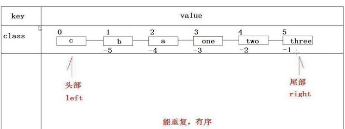

## 1. 全局命令 - 键(Key)的通用操作

Redis 对键(Key)的操作是通用的，不管 value 是五种类型中的哪一种类型，都可以用的操作

### 1.1. KEYS 查询键

#### 1.1.1. 基础使用

```bash
keys pattern
```

获取所有与`pattern`匹配的`key`，`*`表示任意0个或多个字符，`?`表示任意一个字符。

比如：

- `KEYS *` 匹配数据库中所有 `key`
- `KEYS h?llo` 匹配 `hello`，`hallo` 和 `hxllo` 等
- `KEYS h*llo` 匹配 `hllo` 和 `heeeeello` 等
- `KEYS h[ae]llo` 匹配 `hello` 和 `hallo` ，但不匹配 `hillo`

示例：

```bash
redis> MSET one 1 two 2 three 3 four 4  # 一次设置 4 个 key
OK

redis> KEYS *o*
1) "four"
2) "two"
3) "one"

redis> KEYS t??
1) "two"

redis> KEYS t[w]*
1) "two"

redis> KEYS *  # 匹配数据库内所有 key
1) "four"
2) "three"
3) "two"
4) "one"
```

#### 1.1.2. keys 命令存在的问题

因为 Redis 是单线程的。keys 指令会导致线程阻塞一段时间，直到执行完毕，服务才能恢复。所以值得注意的是，<font color=red>**如果存在大量键，线上禁止使用此指令**</font>

### 1.2. SCAN 迭代集合元素

#### 1.2.1. 基础使用

```bash
SCAN cursor [MATCH pattern] [COUNT count]
```

`SCAN` 命令及其相关的命令(`SSCAN`、`HSCAN`、`ZSCAN`)都用于增量地迭代（incrementally iterate）一集元素（a collection of elements）：

- `SCAN` 命令用于迭代当前数据库中的数据库键。
- `SSCAN` 命令用于迭代集合键中的元素。
- `HSCAN` 命令用于迭代哈希键中的键值对。
- `ZSCAN` 命令用于迭代有序集合中的元素（包括元素成员和元素分值）。

以上列出的四个命令都支持增量式迭代，它们每次执行都只会返回少量元素，所以这些命令可以用于生产环境，而不会出现像在大量键的情况下 `KEYS` 命令造成阻塞的问题。

#### 1.2.2. SCAN 命令优缺点

`scan` 的优点是：该命令采用渐进式遍历的方式来解决 `keys` 命令可能带来的阻塞问题，每次 `scan` 命令的时间复杂度是 `O(1)`，但是要真正实现 `keys` 的功能，需要执行多次 `scan`。

`scan` 的缺点是：在执行命令的过程中，如果有键的变化（增加、删除、修改），遍历过程可能会出现，新增的键可能没有遍历到、遍历出了重复的键等情况。即 `scan` 命令并不能保证完整的遍历出来所有的键。

### 1.3. DBSIZE 查询键总数

```bash
dbsize
```

查询目前存在的键的总数量。

示例：

```bash
redis> DBSIZE
(integer) 5
```

### 1.4. EXISTS 检查键是否存在

```bash
exists key
```

判断该key是否存在，返回`1`表示存在，`0`表示不存在

```bash
redis> SET db "redis"
OK

redis> EXISTS db
(integer) 1

redis> DEL db
(integer) 1

redis> EXISTS db
(integer) 0
```

### 1.5. DEL 删除键

```bash
DEL key [key …]
```

删除给定的一个或多个 `key`。并返回被删除 `key` 的数量，如果删除不存在键返回0。**无论值是什么数据结构类型，`del`命令都可以将其删除**

```bash
#  删除单个 key
redis> DEL name
(integer) 1

# 删除一个不存在的 key
redis> DEL phone # 失败，没有 key 被删除
(integer) 0

# 同时删除多个 key
redis> DEL name type website
(integer) 3
```

### 1.6. EXPIRE 设置过期时间（秒级别）

```bash
expire key
```

为给定 key 设置生存时间(单位：秒)，当 key 过期时(生存时间为 0 )，它会被自动删除这个key。

```bash
redis> EXPIRE cache_page 30  # 设置过期时间为 30 秒
(integer) 1

redis> EXPIRE cache_page 30000   # 如果在过期之前，再次使用EXPIRE命令，则更新过期时间
(integer) 1
```

### 1.7. TTL 查询剩余生存时间（秒级别）

```bash
ttl key
```

获取该key所剩余的超时时间（TTL, time to live），返回值类型如下：

- 当 `key` 不存在时，返回`-2`
- 当 `key` 存在但没有设置剩余生存时间时，返回`-1`
- 当 `key` 存在且有设置剩余时间，则以秒为单位，返回大于等于`0`的整数（即 `key` 的剩余生存时间）

> 注：在 Redis 2.8 以前，当 `key` 不存在，或者 `key` 没有设置剩余生存时间时，命令都返回`-1`

```bash
# 不存在的 key
redis> TTL key
(integer) -2

# key 存在，但没有设置剩余生存时间
redis> TTL key
(integer) -1

# 有剩余生存时间的 key
redis> TTL key
(integer) 10084
```

### 1.8. EXPIREAT 设置生存时间（秒级别时间戳）

```bash
EXPIREAT key timestamp
```

`EXPIREAT` 的作用和 `EXPIRE` 类似，都用于为 `key` 设置生存时间。不同在于 `EXPIREAT` 命令接受的时间参数是 UNIX 时间戳(unix timestamp)。

如果生存时间设置成功，返回`1`；当`key`不存在或没办法设置生存时间，返回`0`。

```bash
redis> EXPIREAT cache 1355292000     # 这个 key 将在 2021.12.12 过期
(integer) 1
```

### 1.9. PEXPIRE 设置生存时间（毫秒级别）

```bash
PEXPIRE key milliseconds
```

这个命令和 `EXPIRE` 命令的作用类似，但是它以毫秒为单位设置 `key` 的生存时间，而`EXPIRE`命令以秒为单位。设置成功，返回`1`；`key`不存在或设置失败，返回`0`

```bash
redis> PEXPIRE mykey 1500
(integer) 1

redis> TTL mykey    # TTL 的返回值以秒为单位
(integer) 2

redis> PTTL mykey   # PTTL 可以给出准确的毫秒数
(integer) 1499
```

### 1.10. PEXPIREAT 设置生存时间（毫秒级别时间戳）

```bash
PEXPIREAT key milliseconds-timestamp
```

这个命令和 `expireat` 命令类似，但它以毫秒为单位设置 `key` 的过期 unix 时间戳，而 `expireat` 命令则以秒为单位。如果生存时间设置成功，返回`1`。 当 `key` 不存在或没办法设置生存时间时，返回`0`

```bash
redis> PEXPIREAT mykey 1555555555005
(integer) 1

redis> TTL mykey           # TTL 返回秒
(integer) 223157079

redis> PTTL mykey          # PTTL 返回毫秒
(integer) 223157079318
```

### 1.11. PTTL 查询剩余生存时间（毫秒级别）

```bash
PTTL key
```

这个命令类似于 `TTL` 命令，但它以毫秒为单位返回 `key` 的剩余生存时间，而 `TTL` 命令则以秒为单位。返回值类型如下：

- 当 `key` 不存在时，返回`-2`
- 当 `key` 存在但没有设置剩余生存时间时，返回`-1`
- 当 `key` 存在且有设置剩余时间，则以毫秒为单位，返回大于等于`0`的整数（即 `key` 的剩余生存时间）

> 注：在 Redis 2.8 以前，当 `key` 不存在，或者 `key` 没有设置剩余生存时间时，命令都返回`-1`

### 1.12. PERSIST 移除生存时间

```bash
PERSIST key
```

移除给定 `key` 的生存时间，相当于将这个`key`从“易失的”(带生存时间的key)转换成“持久的”(一个不带生存时间、永不过期的key)。当生存时间移除成功时，返回`1`； 如果 `key` 不存在或 `key` 没有设置生存时间，返回`0`。

```bash
redis> EXPIRE mykey 10  # 为 key 设置生存时间
(integer) 1

redis> TTL mykey
(integer) 10

redis> PERSIST mykey    # 移除 key 的生存时间
(integer) 1

redis> TTL mykey
(integer) -1
```

### 1.13. TYPE 键存储的数据结构类型

```bash
TYPE key
```

返回 `key` 所储存的值的数据结构类型(*以字符串形式返回*)。返回值：

- `none` (key不存在)
- `string` (字符串)
- `list` (列表)
- `set` (集合)
- `zset` (有序集)
- `hash` (哈希表)
- `stream` (流)

```bash
# 字符串
redis> SET weather "sunny"
OK
redis> TYPE weather
string

# 列表
redis> LPUSH book_list "programming in scala"
(integer) 1
redis> TYPE book_list
list

# 集合
redis> SADD pat "dog"
(integer) 1
redis> TYPE pat
set
```

### 1.14. RANDOMKEY 随机获取一个key

```bash
RANDOMKEY
```

从当前数据库中随机返回(不删除)一个`key`。当数据库不为空时，返回一个`key`。当数据库为空时，返回`nil`

```bash
redis> RANDOMKEY
"food"
redis> RANDOMKEY
(nil)
```

### 1.15. RENAME 重命名

```bash
RENAME key newkey
```

将 `key` 重命名为 `newkey`。返回值如下：

- 当`key`重命名成功时提示`OK`
- 当 `key` 和 `newkey` 相同，或者 `key` 不存在时，返回一个错误

> 特别注意：
>
> - 当`newkey`已经存在时，`RENAME`命令会覆盖旧值。为了防止被强行`rename`，Redis提供了`renamenx`命令，确保只有`newKey`不存在时候才被覆盖。
> - 通过测试可知，由于重命名键期间会执行`del`命令删除旧的键，如果键对应的值比较大，会存在阻塞Redis的可能性

```bash
# key 存在且 newkey 不存在
redis> RENAME message greeting
OK
redis> EXISTS message               # message 不复存在
(integer) 0
redis> EXISTS greeting              # greeting 取而代之
(integer) 1

# 当 key 不存在时，返回错误
redis> RENAME fake_key never_exists
(error) ERR no such key

# newkey 已存在时， RENAME 会覆盖旧 newkey
redis> SET name "moon"
OK
redis> SET name2 "kira"
OK
redis> RENAME name name2
OK
redis> GET name
(nil)
redis> GET name2      # 原来的值 kira 被覆盖了
"moon"
```

### 1.16. SELECT 切换数据库

```bash
SELECT index
```

切换到指定的数据库，数据库索引号 `index` 用数字值指定。

一个 Redis 服务器可以包括多个数据库，客户端可以指连接 Redis 中的的哪个数据库，就好比一个mysql服务器中创建多个数据库，客户端连接时指定连接到哪个数据库。Redis 实例最多可提供 16 个数据库，索引值从`0`到`15`，客户端默认连接索引值为`0`的数据库，也可以通过`select`命令选择哪个数据库。如果选择 16 时会报错，说明没有编号为 16 的数据库。

```bash
redis> SELECT 1   # 使用 1 号数据库
OK
```

### 1.17. MOVE 迁移键

```bash
MOVE key db
```

将当前数据库的 `key` 移动到给定的数据库 `db` 当中。移动成功返回`1`，失败则返回`0`

如果当前数据库(源数据库)和给定数据库(目标数据库)有相同名字的给定 `key` ，或者 `key` 不存在于当前数据库，那么 `MOVE` 命令没有任何效果。因此，也可以利用这一特性，将 `MOVE` 命令当作锁(locking)原语(primitive)。

```bash
# key 存在于当前数据库
redis> SELECT 0                             # redis默认使用数据库 0，为了清晰起见，这里再显式指定一次。
OK
redis> MOVE song 1                          # 将 song 移动到数据库 1
(integer) 1
redis> EXISTS song                          # song 已经被移走
(integer) 0
redis> SELECT 1                             # 使用数据库 1
OK
redis:1> EXISTS song                        # 证实 song 被移到了数据库 1 (注意命令提示符变成了"redis:1"，表明正在使用数据库 1)
(integer) 1

# 当 key 不存在的时候
redis:1> EXISTS fake_key
(integer) 0
redis:1> MOVE fake_key 0                    # 试图从数据库 1 移动一个不存在的 key 到数据库 0，失败
(integer) 0
redis:1> select 0                           # 使用数据库0
OK
redis> EXISTS fake_key                      # 证实 fake_key 不存在
(integer) 0


# 当源数据库和目标数据库有相同的 key 时
redis:1> SELECT 0                           # 使用数据库0，并试图将 favorite_fruit 移动到数据库 1
OK
redis> MOVE favorite_fruit 1                # 因为两个数据库有相同的 key，MOVE 失败
(integer) 0
redis> GET favorite_fruit                   # 数据库 0 的 favorite_fruit 没变
"banana"
redis> SELECT 1
OK
redis:1> GET favorite_fruit                 # 数据库 1 的 favorite_fruit 也是
"apple"
```

### 1.18. 其他小结

#### 1.18.1. KEYS 与 DBSIZE 命令小结

- `dbsize` 命令在计算键总数时不会遍历所有键，而是直接获取 Redis 内置的键总数变量，所以`dbsize`命令的时间复杂度是O(1)。
- `keys` 命令会遍历所有键，所以它的时间复杂度是`o(n)`，当 Redis 保存了大量键时线上环境禁止使用`keys`命令。

#### 1.18.2. 关于使用 Redis 相关过期命令时注意点

- 如果使用 `expire key` 命令时相应的键不存在，返回结果为 0
- 如果过期时间为负值，键会立即被删除，效果与使用 `del `命令一样
- `persist` 命令可以将键的过期时间清除
- 对于字符串类型的键，执行 `set` 命令后，会重置过期时间（如果没有设置则重置为不过期），这个问题很容易在开发中被忽视。
- Redis 不支持二级数据结构（例如哈希、列表）内部元素的过期功能，例如不能对列表类型的一个元素做过期时间设置。
- 如果关了 Redis 服务器端，在默认情况下从控制台插入的 `key=value` 键值对数据，就算 key 时间未到，也会自动销毁。

## 2. String 类型命令（重点）

字符串类型是 Redis 中最为基础的数据存储类型，它在 Redis 中是二进制安全的，这便意味着该类型**存入和获取的数据相同**。字符串类型的值实际可以是简单的字符串、复杂的字符串(例如 JSON、XML)、数字(整数、浮点数)，甚至是二进制(图片、音频、视频)，在 Redis 中字符串类型的 Value 最多可以容纳的数据长度是 512M。

> 注：Redis 所有类型的键都是字符串类型，而且其他几种数据结构都是在字符串类型基础上构建的。

### 2.1. SET 赋值

```bash
SET key value [EX seconds] [PX milliseconds] [NX|XX]
```

设定`key`持有指定的字符串`value`，如果该`key`存在则进行覆盖操作，无视类型。返回结果为`OK`代表设置成功。

<font color=red>**当 `SET` 命令对一个带有生存时间（TTL）的键进行设置之后，该键原有的生存时间将被清除。**</font>

**可选参数**：

从 Redis 2.6.12 版本开始，`SET`命令的行为可以通过一系列参数来修改：

- `EX seconds`：将键的过期时间设置为`seconds`秒。执行`SET key value EX seconds`的效果等同于执行`SETEX key seconds value`
- `PX milliseconds`：将键的过期时间设置为`milliseconds`毫秒。执行`SET key value PX milliseconds`的效果等同于执行`PSETEX key milliseconds value`
- `NX`：只在键不存在时，才对键进行设置操作。执行`SET key value NX`的效果等同于执行`SETNX key value`
- `XX`：只在键已经存在时，才对键进行设置操作

> note：因为`SET`命令可以通过参数来实现`SETNX`、`SETEX`以及`PSETEX`命令的效果，所以 Redis 将来的版本可能会移除并废弃`SETNX`、`SETEX`和`PSETEX`这三个命令。

**返回值**：

- 在 Redis 2.6.12 版本以前，`SET` 命令总是返回`OK`
- 从 Redis 2.6.12 版本开始，`SET` 命令只在设置操作成功完成时才返回`OK`；如果命令使用了`NX`或者`XX`选项，但是因为条件没达到而造成设置操作未执行，那么命令将返回空批量回复（NULL Bulk Reply）

**代码示例**：

```bash
# 对不存在的键进行设置：
redis> SET key "value"
OK
redis> GET key
"value"

# 对已存在的键进行设置：
redis> SET key "new-value"
OK
redis> GET key
"new-value"

# 使用 EX 选项：
redis> SET key-with-expire-time "hello" EX 10086
OK
redis> GET key-with-expire-time
"hello"
redis> TTL key-with-expire-time
(integer) 10069

# 使用 PX 选项：
redis> SET key-with-pexpire-time "moto" PX 123321
OK
redis> GET key-with-pexpire-time
"moto"
redis> PTTL key-with-pexpire-time
(integer) 111939

# 使用 NX 选项：
redis> SET not-exists-key "value" NX
OK      # 键不存在，设置成功
redis> GET not-exists-key
"value"
redis> SET not-exists-key "new-value" NX
(nil)   # 键已经存在，设置失败
redis> GEt not-exists-key
"value" # 维持原值不变

# 使用 XX 选项：
redis> EXISTS exists-key
(integer) 0
redis> SET exists-key "value" XX
(nil)   # 因为键不存在，设置失败
redis> SET exists-key "value"
OK      # 先给键设置一个值
redis> SET exists-key "new-value" XX
OK      # 设置新值成功
redis> GET exists-key
"new-value"
```

### 2.2. SETNX 不存在时赋值

```bash
SETNX key value
```

只在键`key`不存在的情况下，将键`key`的值设置为`value`。若键`key`已经存在，则`SETNX`命令不做任何动作。设置成功时返回`1`，设置失败时返回`0`

> `SETNX`是『SET if Not exists』(如果不存在，则`SET`)的简写。

```bash
redis> EXISTS job                # job 不存在
(integer) 0
redis> SETNX job "programmer"    # job 设置成功
(integer) 1
redis> SETNX job "code-farmer"   # 尝试覆盖 job ，失败
(integer) 0
redis> GET job                   # 没有被覆盖
"programmer"
```

> note: 由于Redis的单线程命令处理机制，如果有多个客户端同时执行`setnx key value`，根据`setnx`的特性只有一个客户端能设置成功，`setnx`可以作为分布式锁的一种实现方案。

### 2.3. SETEX 赋值并设置生存时间(秒级别)

```bash
SETEX key seconds value
```

将键 `key` 的值设置为 `value`，并将键 `key` 的生存时间设置为 `seconds` 秒钟。如果键 `key` 已经存在， 那么 `SETEX` 命令将覆盖已有的值。设置成功时返回`OK`。 当 `seconds` 参数不合法时，命令将返回一个错误。

`SETEX` 命令效果相当于以下命令：

```bash
SET key value
EXPIRE key seconds  # 设置生存时间
```

`SETEX` 与以上两条命令组合的区别在于 `SETEX` 是一个原子（atomic）操作，它可以在同一时间内完成设置值和设置过期时间这两个操作，因此 `SETEX` 命令在储存缓存的时候非常实用。

**代码示例**：

```bash
# 在键 key 不存在的情况下执行 SETEX ：
redis> SETEX cache_user_id 60 10086
OK
redis> GET cache_user_id  # 值
"10086"
redis> TTL cache_user_id  # 剩余生存时间
(integer) 49

# 键 key 已经存在， 使用 SETEX 覆盖旧值：
redis> SET cd "timeless"
OK
redis> SETEX cd 3000 "goodbye my love"
OK
redis> GET cd
"goodbye my love"
redis> TTL cd
(integer) 2997
```

### 2.4. PSETEX 赋值并设置生存时间(毫秒级别)

```bash
PSETEX key milliseconds value
```

`PSETEX` 和 `SETEX` 命令相似，但它以毫秒为单位设置 `key` 的生存时间，而 `SETEX` 命令则以秒为单位进行设置。在设置成功时返回`OK`

**代码示例**：

```bash
redis> PSETEX mykey 1000 "Hello"
OK
redis> PTTL mykey
(integer) 999
redis> GET mykey
"Hello"
```


### 2.5. GET 取值

```bash
GET key
```

返回与键 `key` 相关联的字符串值。返回值情况如下：

- 如果键 `key` 不存在， 那么返回特殊值 `nil`；否则，返回键 `key` 的值
- 如果键 `key` 的值并非字符串类型，那么返回一个错误，因为 `GET` 命令只能用于字符串值。

**代码示例**：

```bash
# 对不存在的键 key 或是字符串类型的键 key 执行 GET 命令：
redis> GET db
(nil)
redis> SET db redis
OK
redis> GET db
"redis"

# 对不是字符串类型的键 key 执行 GET 命令：
redis> LPUSH db redis mongodb mysql
(integer) 3
redis> GET db
(error) ERR Operation against a key holding the wrong kind of value
```

### 2.6. GETSET 先取值再赋值

```bash
GETSET key value
```

将键 `key` 的值设为 `value`，并返回键 `key` 在被设置之前的旧值。返回值情况如下：

- 返回给定键 `key` 的旧值
- 如果键 `key` 没有旧值，也即是说，键 `key` 在被设置之前并不存在，那么命令返回 `nil`
- 如果键 `key` 存在但不是字符串类型时，命令返回一个错误

**代码示例**：

```bash
redis> GETSET db mongodb    # 没有旧值，返回 nil
(nil)
redis> GET db
"mongodb"
redis> GETSET db redis      # 返回旧值 mongodb
"mongodb"
redis> GET db
"redis"
```

### 2.7. MSET 批量赋值

```bash
MSET key value [key value …]
```

同时为多个键批量设置值。`MSET` 命令总是返回`OK`。如果某个给定键已经存在，那么 `MSET` 将使用新值去覆盖旧值。如果不想覆盖旧值，则使用`MSETNX`，此命令只会在所有给定键都不存在的情况下进行设置。

`MSET` 是一个原子性(atomic)操作，所有给定键都会在同一时间内被设置，不会出现某些键被设置了但是另一些键没有被设置的情况。

**代码示例**：

```bash
# 同时对多个键进行设置：
redis> MSET date "2021.3.30" time "11:00 a.m." weather "sunny"
OK

redis> MGET date time weather
1) "2021.3.30"
2) "11:00 a.m."
3) "sunny"

# 覆盖已有的值：
redis> MGET k1 k2
1) "hello"
2) "world"

redis> MSET k1 "good" k2 "bye"
OK

redis> MGET k1 k2
1) "good"
2) "bye"
```

### 2.8. MGET 批量取值

```bash
MGET key [key …]
```

返回给定的一个或多个字符串键的值。`MGET` 命令结果是返回一个列表，列表中包含了所有给定键的值，是按照传入键的顺序返回。如果给定的字符串键里面，有某个键不存在，那么这个键的值将以特殊值 `nil` 表示。

**代码示例**：

```bash
redis> MGET redis mongodb mysql     # 不存在的 mysql 返回 nil
1) "redis.com"
2) "mongodb.org"
3) (nil)
```

> note:
>
> 批量操作命令可以有效提高效率，假如没有`mget`这样的命令，要执行n次`get`命令具体耗时是：`n次get时间=n次网络时间+n次命令时间`
>
> 使用`mget`命令后，要执行n次`get`命令操作具体耗时是：`n次get时间=1次网络时间+n次命令时间`
>
> Redis可以支撑每秒数万的读写操作，但是这指的是Redis服务端的处理能力，对于客户端来说，一次命令除了命令时间还是有网络时间，假设网络时间为1毫秒，命令时间为0.1毫秒(按照每秒处理1万条命令算)，那么执行1000次`get`命令需要1.1秒(`1000*1+1000*0.1=1100ms`)，1次`mget`命令的需要0.101秒(`1*1+1000*0.1=101ms`)。

### 2.9. INCR 数字递增

```bash
INCR key
```

为键 `key` 储存的数字值加1。`INCR` 命令会返回键 `key` 在执行加1操作之后的值。存在以下3种情况：

- 如果键 `key` 不存在，那么它的值会先被初始化为`0`，然后再执行 `INCR` 命令。
- 如果键 `key` 存在并且储存的值为数字，则在原数值加1后替换原来的值，并返回加1后的结果
- 如果键 `key` 储存的值不能被解释为数字，那么 `INCR` 命令将返回一个错误。

> note:
>
> - 本操作的值限制在 64 位(bit)有符号数字表示之内。
> - `INCR` 命令是一个针对字符串的操作。因为 Redis 并没有专用的整数类型，所以键 `key` 储存的值在执行 `INCR` 命令时会被解释为十进制64位有符号整数。

**代码示例**：

```bash
redis> SET page_view 20
OK
redis> INCR page_view
(integer) 21
redis> GET page_view    # 数字值在 Redis 中以字符串的形式保存
"21"
```

### 2.10. DECR 数字递减

```bash
DECR key
```

为键 `key` 储存的数字值减1。`DECR` 命令会返回键 `key` 在执行减1操作之后的值。存在以下3种情况：

- 如果键 `key` 不存在，那么它的值会先被初始化为`0`，然后再执行 `DECR` 命令。
- 如果键 `key` 存在并且储存的值为数字，则在原数值减1后替换原来的值，并返回减1后的结果
- 如果键 `key` 储存的值不能被解释为数字，那么 `DECR` 命令将返回一个错误。

> note: 本操作的值限制在 64 位(bit)有符号数字表示之内。

```bash
# 对储存数字值的键 key 执行 DECR 命令：
redis> SET failure_times 10
OK
redis> DECR failure_times
(integer) 9

# 对不存在的键执行 DECR 命令：
redis> EXISTS count
(integer) 0
redis> DECR count
(integer) -1
```

### 2.11. INCRBY/DECRBY  数字递增/递减指定指定值

```bash
# 递增指定值
INCRBY key increment
# 递减指定值
DECRBY key decrement
```

为键 `key` 储存的数字值加上增量 `increment`/减去减量`decrement`，并返回该值。存在以下3种情况：

- 如果键 `key` 不存在，那么它的值会先被初始化为`0`，然后再执行 `INCRBY`/`DECRBY` 命令。
- 如果键 `key` 存在并且储存的值为数字，则在原数值加上`increment`值/减去`decrement`值后替换原来的值，并返回结果
- 如果键 `key` 储存的值不能被解释为数字，那么 `INCRBY`/`DECRBY` 命令将返回一个错误。

> note: 本操作的值限制在 64 位(bit)有符号数字表示之内。

```bash
# 键存在，并且值为数字：
redis> SET rank 50
OK
redis> INCRBY rank 20
(integer) 70
redis> GET rank
"70"

# 键不存在：
redis> EXISTS counter
(integer) 0
redis> INCRBY counter 30
(integer) 30
redis> GET counter
"30"

# 键存在，但值无法被解释为数字：
redis> SET book "long long ago..."
OK
redis> INCRBY book 200
(error) ERR value is not an integer or out of range

# 对已经存在的键执行 DECRBY 命令：
redis> SET count 100
OK
redis> DECRBY count 20
(integer) 80

# 对不存在的键执行 DECRBY 命令：
redis> EXISTS pages
(integer) 0
redis> DECRBY pages 10
(integer) -10
```

### 2.12. APPEND 字符追加

```bash
APPEND key value
```

`append` 指令可以向字符串尾部追加值。返回值为追加 `value` 之后，键 `key` 的值的长度。

- 如果键 `key` 已经存在并且它的值是一个字符串，`APPEND` 命令将把 `value` 追加到键 `key` 现有值的末尾。
- 如果键 `key` 不存在，`APPEND` 就简单地将键 `key` 的值设为 `value`，就像执行 `SET key value` 一样。

```bash
# 对不存在的 key 执行 APPEND ：
redis> EXISTS myphone               # 确保 myphone 不存在
(integer) 0
redis> APPEND myphone "nokia"       # 对不存在的 key 进行 APPEND ，等同于 SET myphone "nokia"
(integer) 5                         # 字符长度

# 对已存在的字符串进行 APPEND ：
redis> APPEND myphone " - 1110"     # 长度从 5 个字符增加到 12 个字符
(integer) 12
redis> GET myphone
"nokia - 1110"
```

### 2.13. STRLEN 字符串长度

```bash
STRLEN key
```

返回键 `key` 储存的字符串值的长度。当键 `key` 不存在时，命令返回0。当 `key` 储存的不是字符串值时，返回一个错误。

```bash
# 获取字符串值的长度：
redis> SET mykey "Hello world"
OK
redis> STRLEN mykey
(integer) 11

# 不存在的键的长度为 0 ：
redis> STRLEN nonexisting
(integer) 0

# 中文字符串
redis> SET chinese "中文"
OK
redis> STRLEN chinese
(integer) 6
```

> <font color=red>**注意：每个中文占 3 个字节**</font>

### 2.14. GETSET 设置并返回原值

```bash
GETSET key value
```

`getset` 和 `set` 一样会设置值，将键 `key` 的值设为 `value`，但 `GETSET` 命令会返回键 `key` 在被设置之前的旧值。存在以下特殊情况：

- 当键 `key` 在被设置之前并不存在，返回 `nil`
- 当键 `key` 存在但不是字符串类型时，返回一个错误

```bash
redis> GETSET db mongodb    # 没有旧值，返回 nil
(nil)
redis> GET db
"mongodb"
redis> GETSET db redis      # 返回旧值 mongodb
"mongodb"
redis> GET db
"redis"
```

### 2.15. SETRANGE 设置指定位置的字符

```bash
SETRANGE key offset value
```

从偏移量 `offset` 开始， 用 `value` 参数覆写(overwrite)键 `key` 储存的字符串值，并返回被修改之后，字符串值的长度。不存在的键 `key` 当作空白字符串处理。**值的下标是从0开始计算**。

`SETRANGE` 命令会确保字符串足够长以便将 `value` 设置到指定的偏移量上， 如果键 `key` 原来储存的字符串长度比偏移量小(比如字符串只有`5`个字符长，但设置的`offset`是`10`)，那么原字符和偏移量之间的空白将用零字节(zerobytes, `"\x00"`)进行填充。

> Warning: 当生成一个很长的字符串时， Redis 需要分配内存空间， 该操作有时候可能会造成服务器阻塞(block)。

```bash
# 对非空字符串执行 SETRANGE 命令：
redis> SET greeting "hello world"
OK
redis> SETRANGE greeting 6 "Redis"
(integer) 11
redis> GET greeting
"hello Redis"

# 对空字符串/不存在的键执行 SETRANGE 命令：
redis> EXISTS empty_string
(integer) 0
redis> SETRANGE empty_string 5 "Redis!"   # 对不存在的 key 使用 SETRANGE
(integer) 11
redis> GET empty_string                   # 空白处被"\x00"填充
"\x00\x00\x00\x00\x00Redis!"
```

### 2.16. GETRANGE 截取字符串

```bash
GETRANGE key start end
```

返回键 `key` 储存的字符串值的指定部分，字符串的截取范围由 `start` 和 `end` 两个偏移量决定(包括 `start` 和 `end` 在内)。负数偏移量表示从字符串的末尾开始计数，`-1` 表示最后一个字符，`-2` 表示倒数第二个字符，以此类推。

`GETRANGE` 通过保证子字符串的值域(range)不超过实际字符串的值域来处理超出范围的值域请求。

> note: `GETRANGE` 命令在 Redis 2.0 之前的版本里面被称为 `SUBSTR` 命令

```bash
redis> SET greeting "hello, my friend"
OK
redis> GETRANGE greeting 0 4          # 返回索引0-4的字符，包括4。
"hello"
redis> GETRANGE greeting -1 -5        # 不支持回绕操作
""
redis> GETRANGE greeting -3 -1        # 负数索引
"end"
redis> GETRANGE greeting 0 -1         # 从第一个到最后一个
"hello, my friend"
redis> GETRANGE greeting 0 1008611    # 值域范围不超过实际字符串，超过部分自动被符略
"hello, my friend"
```

### 2.17. 命令的时间复杂度

字符串这些命令中，除了`del`、`mset`、`mget`支持多个键的批量操作，时间复杂度和键的个数相关，为`O(n)`，`getrange`和字符串长度相关，也是`O(n)`，其余的命令基本上都是`O(1)`的时间复杂度，所以操作速度非常快

## 3. Hash 类型命令

Redis中的Hash类型可以看成具有String Key和String Value的map容器。所以该类型非常适合于存储值对象的信息。如Username、Password和Age等。如果Hash中包含很少的字段，那么该类型的数据也将仅占用很少的磁盘空间。每一个Hash可以存储4294967295个键值对。

### 3.1. 赋值

- `hset key field value`：为指定的key设定field/value对（键值对）。
- `hmset key field value [field2 value2 …]`：设置key中的多个filed/value

### 3.2. 取值

- `hget key field`：	返回指定的key中的field的值
- `hmget key fileds`：获取key中的多个filed的值
- `hgetall key`：获取key中的所有filed-vaule

### 3.3. 删除

- `hdel key field [field … ]`：可以删除一个或多个字段，返回值是被删除的字段个数，当value都删除后，key也会删除了
- `del key`：删除对应的key的整个Hash

### 3.4. 增加数字

```bash
hincrby key field increment
```

- 设置 key 中 filed 的值增加 increment。如：`hincrby age 20 increment`，age 增加 20

### 3.5. 其他命令

- `hexists key field`：判断指定的key中的filed是否存在
- `hlen key`：获取key所包含的field的数量
- `hkeys key`：获得所有的key
- `hvals key`：获得所有的value

## 4. List 类型命令

在Redis中，list类型是按照插入顺序排序的字符串链表。我们可以在其头部（left）和尾部（right）添加新的元素。在插入时，如果该key不存在，Redis将为该key创建一个新的链表。与此相反，如果链表中的所有元素都被删除了，那么该key也将会被从数据库中删除。list中可以包含的最大元素数据量4294967295（十亿以上）。

在 java 中 List 接口有常用的有 ArrayList、LinkedList，而在 redis 中的 list 就类似于 java 中的 LinkedList。

### 4.1. 两端添加

```bash
lpush key value1 value2 ...
```

- 在指定的 key 对应的 list 的头部插入所有的 value，如果该 key 不存在，该命令在插入之前创建一个与该 key 对应的空链表，再从头部插入数据。插入成功，返回元素的个数。

```bash
rpush key value1 value2 ...
```

- 在指定的 key 对应的 list 的尾部插入所有的 value，如果该 key 不存在，该命令在插入之前创建一个与该 key 对应的空链表，再从尾部插入数据。插入成功，返回元素的个数。

### 4.2. 查看列表

- `lrange key start end`：获取链表中从start到end的元素的值，start和end从0开始计数，如果为负数，-1表示倒数第一个元素，-2表示倒数第二个元素，以此类推。
- 查看所有列表：(0~-1就可以查看所有值)。例：`lrange key 0 -1`



### 4.3. 两边弹出

```bash
lpop key
```

- 返回并弹出指定的key对应链表中头部（left）第一个元素，如果该key不存在，返回nil。

```bash
rpop key
```

- 返回并弹出指定的key对应链表中尾部（right）第一个元素，如果该key不存在，返回nil。

### 4.4. 获取列表中元素的个数

```bash
llen key
```

- 返回指定 key 对应链表中元素的个数。命令的 `l` 代表 list，`len` 代表 length

## 5. Set 类型命令

Redis 中，可以将set类型看作是没有排序的字符集合，set中可以包含的最大元素数据量4294967295（十亿以上）。

**和list不同，set集合不允许出现重复元素，如果多次添加相同元素，set中仅保留一份。**

### 5.1. 添加/删除元素

- `sadd key value1 value2……`：向set中添加数据，如果该key的值已存在，则不会重复添加，返回添加成功个数
- `srem key value1 value2……`：删除set中指定的成员，返回删除成功个数

### 5.2. 获得集体中的元素

`smembers key`：获取set集合中所有元素

- 直接删除key，那么key对应的list-set-sortedset都会删除；
- 如果key对应的所有值删除了，那么key也会自动被删除

### 5.3. 判断元素是否在集合中存在

- `sismember key value`：判断key中指定的元素是否在该set集合中存在。存在则返回1，不存在则返回0

## 6. SortedSet 类型命令

SortedSet 和 Set 类型极为类似，它们都是字符串的集合，都不允许重复的元素出现在一个 Set 中。它们之间的主要区别是**SortedSet 中每一个元素都会有一个分数（score）与之关联，Redis 正是通过分数来为集合中的元素进行从小到大的排序（默认）。**

<font color=red>**SortedSet 集合中的元素必须是唯一的，但分数（score）却是可以重复。**</font>

### 6.1. 添加元素

```bash
zadd key score value score value score value
```

- 将所有元素以及对应的分数，存放到 sortedset 集合中，如果该元素已存在则会用新的分数替换原来的分数。返回值是新加入到集合中的元素个数，不包含之前已经存在的元素。

### 6.2. 查询元素（从小到大）

```bash
zrange key start end
```

- 获取集合中下标为 start 到 end 的元素，不带分数排序之后的 SortedSet 与 list 的位置是一样，位置从左到右是正数，从0开始，位置从右到左是负数，从-1开始，-1是倒数第一个元素，-2倒数第二个元素

```bash
zrange key start end withscores
```

- 获取集合中下标为 start 到 end 的元素，带分数按分数从小到大排序。如果相同用户的话，不会再将用户名插入集合中，但分数可以替换原来的分数

### 6.3. 查询元素（从大到小）

```bash
zrevrange key start end
```

- 按照元素分数从大到小，获取集合中下标为start到end的元素，不带分数

```bash
zrevrange key start end withscores
```

- 按照元素分数从大到小，获取集合中下标为start到end的元素，带分数

### 6.4. 获取元素分数

```bash
zscore key member
```

- 返回指定元素的分数

### 6.5. 获取元素数量

```bash
zcard key
```

- 获取集合中元素数量

### 6.6. 删除元素

```bash
zrem key member member member
```

- 从集合中删除指定的元素

### 6.7. 按照分数范围删除元素

```bash
zremrangebyscore key min max
```

- 按照分数范围删除元素

## 7. Redis 其他命令（了解）

### 7.1. pipeline 批命令

Redis 客户端执行一条命令分4个过程：发送命令、命令排队、命令执行、返回结果。使用 `pipeline` 可以批量请求，批量返回结果，将多次 IO 往返的时间缩减为一次，执行速度比逐条执行要快。使用时有以下注意事项：

- 使用 `pipeline` 执行的指令之间没有因果相关性。因为 `pipeline` 命令是非原子性，即 `pipeline` 命令中途异常退出，之前执行成功的命令不会回滚。
- 使用 `pipeline` 组装的命令个数不能太多，不然数据量过大，增加客户端的等待时间，还可能造成网络阻塞，可以将大量命令的拆分多个小的 `pipeline` 命令完成。

原生批命令（`mset`和`mget`）与 `pipeline` 对比：

1. 原生批命令是原子性；`pipeline` 是非原子性。
2. 原生批命令只有一个命令；但 `pipeline` 支持多命令。

### 7.2. 服务器命令

- `ping`，测试连接是否存活。*停止 redis 服务器再测试此命令*：

```bash
redis 127.0.0.1:6379> ping
Could not connect to Redis at 127.0.0.1:6379: Connection refused
```

- `echo`，在命令行打印一些内容。
- `quit`，退出连接。
- `info`，获取服务器的信息和统计。
- `flushdb`，删除当前选择数据库中的所有key。
- `flushall`，删除所有数据库中的所有key。

### 7.3. 消息订阅与发布

- `subscribe`：订阅指定的一个频道的信息。例如，`subscribe mychat`，订阅“mychat”这个频道
- `psubscribe`：订阅一个或多个符合指定模式的频道。例如，`psubscribe s*`：批量订阅以“s”开头的频道
- `unsubscribe`：取消订阅指定的频道
- `pubsub`：查看订阅与发布系统的状态
- `publish`：在指定的频道中发布消息。例如，`publish mychat 'today is a newday'`

### 7.4. redis 事务

#### 7.4.1. multi 开启事务

```bash
multi
```

- 开启事务，用于标记事务的开始，其后执行的命令都将被存入命令队列，直到执行 `EXEC` 命令时，这些命令才会被原子的执行，类似与关系型数据库中的：begin transaction

#### 7.4.2. exec 提交事务

```bash
exec
```

- 提交事务，会执行所有事务块内的命令。类似与关系型数据库中的：commit

示例：

```bash
127.0.0.1:6379> multi
OK

127.0.0.1:6379> set a 1
QUEUED

127.0.0.1:6379> set b 1 2
QUEUED

127.0.0.1:6379> set c 3
QUEUED

127.0.0.1:6379> exec
1) OK
2) (error) ERR syntax error
3) OK
```

#### 7.4.3. discard 事务回滚

```bash
discard
```

- 事务回滚，清空事务队列，并放弃执行事务块内的所有命令，并且客户端会从事务状态中退出。类似与关系型数据库中的：rollback

#### 7.4.4. watch 监听键

```bash
watch keyName
```

- 监视一个（或多个）key，如果在事务执行之前这个（或这些）key 被其他命令改动，那么事务将被打断（类似于乐观锁）。另外执行 `EXEC` 命令之后，也会自动取消监控。

使用示例：

```bash
127.0.0.1:6379> watch name
OK

127.0.0.1:6379> set name 1
OK

127.0.0.1:6379> multi
OK

127.0.0.1:6379> set name 2
QUEUED

127.0.0.1:6379> set gender 1
QUEUED

127.0.0.1:6379> exec
(nil)

127.0.0.1:6379> get gender
(nil)
```

示例命令实现说明：

1. `watch name` 开启了对 `name` 这个 key 的监控
2. 修改 `name` 的值
3. 开启事务 a
4. 在事务 a 中设置了 `name` 和 `gender` 的值
5. 使用 `EXEC` 命令进提交事务
6. 使用命令 `get gender` 发现不存在，即事务 a 没有执行

#### 7.4.5. unwath 取消所有控制

```bash
unwath
```

- 取消 `watch` 命令对所有 key 的监控，所有监控锁将会被取消。

## 8. LUA 脚本

### 8.1. 概述

Redis 通过 LUA 脚本创建具有原子性的命令：当 lua 脚本命令正在运行的时候，不会有其他脚本或 Redis 命令被执行，实现组合命令的原子操作。

lua 脚本作用：

1. Lua 脚本在 Redis 中是原子执行的，执行过程中间不会插入其他命令。
2. Lua 脚本可以将多条命令一次性打包，有效地减少网络开销。

### 8.2. Lua 脚本的使用

在 Redis 中执行 Lua 脚本有两种方法：`eval` 和 `evalsha`。`eval` 命令使用内置的 Lua 解释器，对 Lua 脚本进行求值。

```bash
// 第一个参数是lua脚本，第二个参数是键名参数个数，剩下的是键名参数和附加参数
127.0.0.1:6379> eval "return {KEYS[1],KEYS[2],ARGV[1],ARGV[2]}" 2 key1 key2 first second
1) "key1"
2) "key2"
3) "first"
4) "second"
```
### 8.3. 应用场景

#### 8.3.1. 限制接口访问频率(未验证正确性)

在 Redis 维护一个接口访问次数的键值对，key 是接口名称，value 是访问次数。每次访问接口时，会执行以下操作：

- 通过 aop 拦截接口的请求，对接口请求进行计数，每次进来一个请求，相应的接口访问次数 count 加 1，存入 redis。
- 如果是第一次请求，则会设置 `count=1`，并设置过期时间。因为这里 `set()` 和 `expire()` 组合操作不是原子操作，所以需要引入 lua 脚本实现原子操作，避免并发访问问题。
- 如果给定时间范围内超过最大访问次数，则会抛出异常。

```java
private String buildLuaScript() {
    return "local c" +
            "\nc = redis.call('get',KEYS[1])" +
            "\nif c and tonumber(c) > tonumber(ARGV[1]) then" +
            "\nreturn c;" +
            "\nend" +
            "\nc = redis.call('incr',KEYS[1])" +
            "\nif tonumber(c) == 1 then" +
            "\nredis.call('expire',KEYS[1],ARGV[2])" +
            "\nend" +
            "\nreturn c;";
}

@Test
public void testLua() {
    String luaScript = buildLuaScript();
    RedisScript<Number> redisScript = new DefaultRedisScript<>(luaScript, Number.class);
    Number count = redisTemplate.execute(redisScript, keys, limit.count(), limit.period());
}
```

> Notes: 这种接口限流的实现方式只是示例，实现比较简单，问题也比较多，一般不会使用，接口限流用的比较多的是令牌桶算法和漏桶算法。
