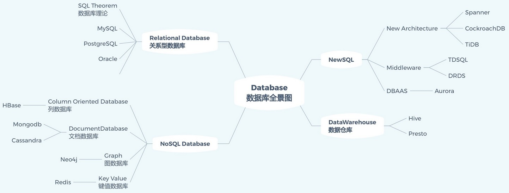
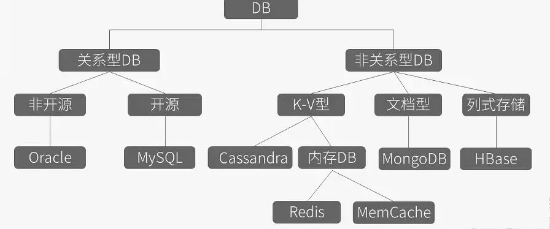

## 1. 数据库技术

### 1.1. 概述

数据库（DB）是一个以某种组织方式存储在磁盘上的数据的集合。简单理解就是用来存储数据的仓库。

- 数据库 DataBase（DB）：存储数据的仓库，数据是有组织的进行存储。
- 数据库管理系统 DataBase Management System (DBMS)：操纵和管理数据库的大型软件。

### 1.2. 数据库的分类

### 1.3. 不同的数据存储方式

数据存储在集合（内存）中

- 优点：读写速度快
- 缺点：不能永久存储

数据存储在文件中

- 优点：可以永久存储
- 缺点：频繁的IO操作效率低，查询数据很不方便。

数据存储在数据库中

- 优点：可以永久存储。查询速度快，查询数据很方便
- 缺点：要使用 SQL 语言执行增删改查操作

## 2. 关系型数据库

> [关系型数据库 - 百度百科](https://baike.baidu.com/item/%E5%85%B3%E7%B3%BB%E5%9E%8B%E6%95%B0%E6%8D%AE%E5%BA%93/8999831)

### 2.1. 概念

关系型数据库，是指采用了关系模型来组织数据的数据库，其以行和列的形式存储数据，以便于用户理解，关系型数据库这一系列的行和列被称为表，一组表组成了数据库。用户通过查询来检索数据库中的数据，而查询是一个用于限定数据库中某些区域的执行代码。关系模型可以简单理解为二维表格模型，而一个关系型数据库就是由二维表及其之间的关系组成的一个数据组织。

### 2.2. SQL 语言

SQL (Structured Query Language)：操作关系型数据库的编程语言，定义了一套操作关系型数据库统一标准

### 2.3. 常见的关系型数据库管理系统

- MySQL：开源免费的中小型数据库，后来 Sun 公司收购了 MySQL，而 Oracle 又收购了Sun公司。从 MySQL 6.x 版本开始推出了收费版本，但也提供了免费的社区版本。
- Oracle：收费的大型数据库，Oracle 公司的产品。Oracle 收购 SUN 公司，收购 MYSQL。
- DB2：IBM公司的大型数据库产品，收费的。常应用在银行系统中.
- SQL Server：MicroSoft 公司收费的中型的数据库。C#、.net 等语言常使用。
- PostgreSQL：开源免费的功能最强大的中小型开源数据库
- SyBase：已经淡出历史舞台。提供了一个非常专业数据建模的工具 PowerDesigner。
- SQLite：嵌入式的微型数据库，应用在手机端。Android 内置的数据库采用的就是该数据库。
- MariaDB：开源免费的中小型数据库。是 MySQL 数据库的另外一个分支、另外一个衍生产品，与 MySQL 数据库有很好的兼容性。

Java 目前应用最多的数据库是：MySQL，Oracle。不论使用以上哪一个关系型数据库，最终在操作时，都是使用 SQL 语言来进行统一操作，因为 SQL 语言，是操作关系型数据库的**统一标准**。例如学习 MySQL，同样可以应用到别的关系型数据库，如：Oracle、DB2、SQLServer。

## 3. NoSQL 数据库

### 3.1. 什么是 NoSQL

NoSQL(NoSQL = Not Only SQL)，意即“不仅仅是SQL”，是一项全新的数据库理念，泛指非关系型的数据库。

关系型数据库指的是，表与表之间有主外键，这种表之间有关系的数据，我们叫做关系型数据库。

### 3.2. 为什么需要 NoSQL

随着互联网 web 2.0 网站的兴起，非关系型的数据库现在成了一个极其热门的新领域，非关系数据库产品的发展非常迅速。而传统的关系数据库在应付 web 2.0 网站，特别是超大规模和高并发的 SNS 类型的 web 2.0 纯动态网站已经显得力不从心，暴露了很多难以克服的问题，例如：

1. **High performance - 对数据库高并发读写的需求**：web 2.0 网站要根据用户个性化信息来实时生成动态页面和提供动态信息，所以基本上无法使用动态页面静态化技术，因此数据库并发负载非常高，往往要达到每秒上万次读写请求。关系数据库应付上万次 SQL 查询还勉强顶得住，但是应付上万次 SQL 写数据请求，硬盘 IO 就已经无法承受了。其实对于普通的 BBS 网站，往往也存在对高并发写请求的需求，例如网站的实时统计在线用户状态，记录热门帖子的点击次数，投票计数等，因此这是一个相当普遍的需求。
2. **Huge Storage - 对海量数据的高效率存储和访问的需求**：类似 Facebook，Twitter，Friendfeed 这样的 SNS 网站，每天用户产生海量的用户动态，以 Friendfeed 为例，一个月就达到了 2.5 亿条用户动态，对于关系数据库来说，在一张 2.5 亿条记录的表里面进行 SQL 查询，效率是极其低下乃至不可忍受的。再例如大型 web 网站的用户登录系统，例如腾讯，盛大，动辄数以亿计的帐号，关系数据库也很难应付。
3. **High Scalability && High Availability - 对数据库的高可扩展性和高可用性的需求**：在基于 web 的架构当中，数据库是最难进行横向扩展的，当一个应用系统的用户量和访问量与日俱增的时候，你的数据库却没有办法像 web server 和 app server 那样简单的通过添加更多的硬件和服务节点来扩展性能和负载能力。对于很多需要提供 24 小时不间断服务的网站来说，对数据库系统进行升级和扩展是非常痛苦的事情，往往需要停机维护和数据迁移，为什么数据库不能通过不断的添加服务器节点来实现扩展呢？

**NoSQL数据库的产生就是为了解决大规模数据集合多重数据种类**带来的挑战，尤其是大数据应用难题。

### 3.3. 主流 NoSQL 产品分类

NoSQL 数据库的四大分类如下：

**键值(Key-Value)存储数据库**、

- 相关产品： Tokyo Cabinet/Tyrant、**Redis**、Voldemort、Berkeley DB
- 典型应用： 内容缓存，主要用于处理大量数据的高访问负载。
- 数据模型： 一系列键值对
- 优势： 快速查询
- 劣势： 存储的数据缺少结构化
    
**列存储数据库**

- 相关产品：Cassandra, HBase, Riak
- 典型应用：分布式的文件系统
- 数据模型：以列簇式存储，将同一列数据存在一起
- 优势：查找速度快，可扩展性强，更容易进行分布式扩展
- 劣势：功能相对局限

**文档型数据库**

- 相关产品：CouchDB、**MongoDB**
- 典型应用：Web应用（与Key-Value类似，Value是结构化的）
- 数据模型： 一系列键值对
- 优势：数据结构要求不严格
- 劣势： 查询性能不高，而且缺乏统一的查询语法

**图形(Graph)数据库**

- 相关数据库：Neo4J、InfoGrid、Infinite Graph
- 典型应用：社交网络
- 数据模型：图结构
- 优势：利用图结构相关算法。
- 劣势：需要对整个图做计算才能得出结果，不容易做分布式的集群方案。

### 3.4. NoSQL 特点

在大数据存取上具备关系型数据库无法比拟的性能优势，例如：

1. 易扩展。NoSQL 数据库种类繁多，但是一个共同的特点都是去掉关系数据库的关系型特性。数据之间无关系，这样就非常容易扩展。也无形之间，在架构的层面上带来了可扩展的能力。
2. 大数据量，高性能。NoSQL 数据库都具有非常高的读写性能，尤其在大数据量下，同样表现优秀。这得益于它的无关系性，数据库的结构简单。
3. 灵活的数据模型。NoSQL 无需事先为要存储的数据建立字段，随时可以存储自定义的数据格式。而在关系数据库里，增删字段是一件非常麻烦的事情。如果是非常大数据量的表，增加字段简直就是一个噩梦。这点在大数据量的 Web2.0 时代尤其明显。
4. 高可用。NoSQL 在不太影响性能的情况，就可以方便的实现高可用的架构。比如 Cassandra，HBase 模型，通过复制模型也能实现高可用。

综上所述，NoSQL 的非关系特性使其成为了后 Web2.0 时代的宠儿，助力大型 Web2.0 网站的再次起飞，是一项全新的数据库革命性运动。

## 4. 关系型数据库表设计规范化

### 4.1. 数据库设计步骤

1. 收集信息：与该系统有关人员进行交流、座谈，充分了解用户需求，理解数据库需要完成的任务
2. 标识实体（Entity）：标识数据库要管理的关键对象或实体，实体一般是名词
3. 标识每个实体的属性（Attribute）
4. 标识实体之间的关系（Relationship）

### 4.2. 什么是范式(NF)

良好的表结构设计是高性能的基石，应该根据系统将要执行的业务查询来设计，这往往需要权衡各种因素。糟糕的表结构设计，直接影响到数据库的性能，并需要花费大量不必要的优化时间，往往还没有什么效果。在数据库表设计上有个很重要的设计准则，称为**范式设计**。

范式来自英文 Normal Form，简称 NF，是一套用来设计数据库的规则，在关系型数据库中这些规则就称为范式。好的数据库设计对数据的存储性能和后期的程序开发，都会产生重要的影响。建立科学的，规范的数据库就需要满足一些规则来优化数据的设计和存储。

要想设计—个好的关系，必须使关系满足一定的约束条件，此约束已经形成了规范，分成几个等级，一级比一级要求得严格。满足这些规范的数据库是简洁的、结构明晰的，同时，不会发生插入(insert)、删除(delete)和更新(update)操作异常。

### 4.3. 范式分类

目前关系数据库有六种范式：第一范式（1NF）、第二范式（2NF）、第三范式（3NF）、巴斯-科德范式（BCNF）、第四范式(4NF）和第五范式（5NF，又称完美范式）。

满足最低要求的范式是第一范式（1NF）。在第一范式的基础上进一步满足更多规范要求的称为第二范式（2NF），其余范式以次类推。**一般说来，数据库只需满足第三范式(3NF）就行了**。

#### 4.3.1. 第一范式(1NF)

- 第一范式是数据库设计最基本的要求。
- 要求数据库表的每一列都是不可再分割的原子性数据项。
- **第一范式每一列不可再拆分，称为原子性**。

不能是集合、数组、记录等非原子数据项。即实体中的某个属性有多个值时，必须拆分为不同的属性。在符合第一范式（1NF）表中每个列的值只能是表的一个属性或一个属性的一部分。

#### 4.3.2. 第二范式(2NF)

要先满足第一范式前提下，表中必须有主键，其他非主键列要完全依赖于主键，而不能只依赖于一部分。简单来说，**一张表只描述一件事情**。

第二范式（2NF）要求数据库表中的每个实例或记录必须可以被唯一地区分。选取一个能区分每个实体的属性或属性组，作为实体的唯一标识。例如在员工表中的身份证号码即可实现每个员工的区分，该身份证号码即为候选键，任何一个候选键都可以被选作主键。在找不到候选键时，可额外增加属性以实现区分。

第二范式（2NF）要求实体的属性完全依赖于主关键字。所谓完全依赖是指不能存在仅依赖主关键字一部分的属性。如果存在，那么这个属性和主关键字的这一部分应该分离出来形成一个新的实体，新实体与原实体之间是一对多的关系。为实现区分通常需要为表加上一个列，以存储各个实例的唯一标识。**简而言之，第二范式就是在第一范式的基础上属性完全依赖于主键**。

#### 4.3.3. 第三范式(3NF)

**在满足第二范式的前提下，表中的每一列都直接依赖于主键，而不是通过其它的列来间接依赖于主键（不存在传递依赖）**。

所谓传递依赖是指如果存在“A(主键字段) -> B(非主键字段) -> C(非主键字段)”的决定关系，则C依赖A。

**第三范式（3NF）是第二范式（2NF）的一个子集，即满足第三范式（3NF）必须满足第二范式（2NF）。**

例如：存在一个部门信息表，其中每个部门有部门编号（dept_id）、部门名称、部门简介等信息。那么在员工信息表中列出部门编号后就不能再将部门名称、部门简介等与部门有关的信息再加入员工信息表中。如果不存在部门信息表，则根据第三范式（3NF）也应该构建它，否则就会有大量的数据冗余。

**简而言之，第三范式就是属性不依赖于其它非主键属性，也就是在满足 2NF 的基础上，任何非主属性不得传递依赖于主属性**。

像：a -> b -> c  属性之间含有这样的关系，是不符合第三范式的。

### 4.4. 范式说明

真正的数据库范式定义上，相当难懂，比如第二范式（2NF）的定义“若某关系 R 属于第一范式，且每一个非主属性完全函数依赖于任何一个候选码，则关系 R 属于第二范式。”，这里面有着大堆专业术语的堆叠，比如“函数依赖”、“码”、“非主属性”、与“完全函数依赖”等等，而且有完备的公式定义，深入研究可参考书籍：《数据库系统概念（第5版）》

### 4.5. 反范式设计

#### 4.5.1. 反范式化设计概念

反范式化就是为了性能和读取效率得考虑，而适当得对数据库设计范式得要求进行违反，允许存在少量得冗余。即反范式化就是使用空间来换取时间。

#### 4.5.2. 反范式实际应用示例

##### 4.5.2.1. 性能提升-缓存和汇总

最常见的反范式化数据的方法是复制或者缓存，在不同的表中存储相同的特定列。

缓存衍生值也是有用的。如果需要显示每个用户发了多少消息，可以每次执行一个对用户发送消息进行`count`的子查询来计算并显示它，也可以在`user`表用户中建一个消息发送数目的专门列，每当用户发新消息时更新这个值。

有需要时创建一张完全独立的汇总表或缓存表也是提升性能的好办法。“缓存表”来表示存储那些可以比较简单地从其他表获取（但是每次获取的速度比较慢）数据的表（例如，逻辑上冗余的数据)。而“汇总表”时,则保存的是使用`GROUP BY`语句聚合数据的表。

在使用缓存表和汇总表时，有个关键点是如何维护缓存表和汇总表中的数据，常用的有两种方式，实时维护数据和定期重建，这个取决于应用程序，不过一般来说，缓存表用实时维护数据更多点，往往在一个事务中同时更新数据本表和缓存表，汇总表则用定期重建更多，使用定时任务对汇总表进行更新。

##### 4.5.2.2. 性能提升-计数器表

比如网站点击数、用户的朋友数、文件下载次数等。对于高并发下的处理，首先可以创建一张独立的表存储计数器，这样可使计数器表小且快，并且可以使用一些更高级的技巧。

比如假设有一个计数器表，只有一行数据，记录网站的点击次数，网站的每次点击都会导致对计数器进行更新，问题在于，对于任何想要更新这一行的事务来说，这条记录上都有一个全局的互斥锁(mutex)。这会使得这些事务只能串行执行，会严重限制系统的并发能力。

**改进方案：可以将计数器保存在多行中，每次随机选择一行进行更新。在具体实现上，可以增加一个槽（slot)字段，然后预先在这张表增加 100 行或者更多数据，当对计数器更新时，选择一个随机的槽（slot)进行更新即可**。

**这种解决思路其实就是写热点的分散，在 JDK 的 JDK1.8 中新的原子类`LongAdder`也是这种处理方式**，而在实际的缓冲中间件Redis等的使用、架构设计中，可以采用这种写热点的分散的方式，当然架构设计中对于写热点还有削峰填谷的处理方式，这种在 MySQL 的实现中也有体现

##### 4.5.2.3. 反范式设计-分库分表中的查询

例如，用户购买了商品，需要将交易记录保存下来，那么如果按照买家的纬度分表，则每个买家的交易记录都被保存在同一表中，这样可以很快、很方便地査到某个买家的购买情况，但是某个商品被购买的交易数据很有可能分布在多张表中，査找起来比较麻烦。反之，按照商品维度分表，则可以很方便地査找到该商品的购买情况，但若要査找到买家的交易记录，则会比较麻烦

常见的解决方式如下：

1. 在多个分片表查询后合并数据集，这种方式的效率很低
2. 记录两份数据，一份按照买家纬度分表，一份按照商品维度分表
3. 通过搜索引擎解决，但如果实时性要求很高，就需要实现实时搜索

在某电商交易平台下，可能有买家査询自己在某一时间段的订单，也可能有卖家査询自已在某一时间段的订单，如果使用了分库分表方案，则这两个需求是难以满足的

因此通用的解决方案是，在交易生成时生成一份按照买家分片的数据副本和一份按照卖家分片的数据副本，查询时分别满足之前的两个需求，因此，查询的数据和交易的数据可能是分别存储的，并从不同的系统提供接口

### 4.6. 数据库设计小结

三大范式只是一般设计数据库的基本理念，可以建立冗余较小、结构合理的数据库。

如果有特殊情况，当然要特殊对待，**数据库设计最重要的是看需求跟性能，需求 > 性能 > 表结构**。所以不能一味的去追求范式建立数据库。

- 1NF:字段不可分（*原子性 字段不可再分*）;
- 2NF:有主键，非主键字段依赖主键（*唯一性 一个表只说明一个事物*）;
- 3NF:非主键字段不能相互依赖（*每列都与主键有直接关系，不存在传递依赖*）;

**范式化设计优点**：

- 范式化的更新操作通常比反范式化要快
- 当数据较好地范式化时，就只有很少或者没有重复数据，所以只需要修改更少的数据
- 范式化的表通常更小，可以更好地放在内存里，所以执行操作会更快
- 很少有多余的数据意味着检索列表数据时更少需要`DISTINCT`或者`GROUP BY`语句。在非范式化的结构中必须使用`DISTINCT`或者`GROUP BY`才能获得一份唯一的列表，但是如果是一张单独的表，很可能则只需要简单的查询这张表就行了

**范式化设计缺点**：

- 通常需要关联表查询。稍微复杂一些的查询语句在符合范式的表上都可能需要至少一次关联，也许更多
- 可能使一些索引策略无效

**反范式化设计优点**：

- 反范式设计可以减少表的关联
- 可以更好的进行索引优化

**反范式化设计缺点**：

- 存在数据冗余及数据维护异常
- 对数据的修改需要更多的成本

## 5. 关系型数据库、表、字段等命名规则

### 5.1. 数据库命名规则

根据项目的实际意思来命名。

### 5.2. 数据表命名规则

1. 数据表的命名大部分都是以名词的复数形式并且都为小写；
2. 尽量使用前缀 `table_`；
3. 如果数据表的表名是由多个单词组成，则尽量用下划线连接起来；但是不要超过30个字符，一旦超过30个字符，则使用缩写来缩短表名的长度；
4. 具备统一前缀，对相关功能的表应当使用相同前缀，如 `acl_xxx`，`house_xxx`，`ppc_xxx`；其中前缀通常为这个表的模块或依赖主实体对象的名字，通常来讲表名为：`业务_动作_类型`，或是`业务_类型`；
5. 数据表必须有主键，且建议均使用 `auto_increment` 的 id 作为主键（与业务无关），和业务相关的要做为唯一索引；

### 5.3. 字段命名规则

1. 首先命名字段尽量采用小写，并且是采用有意义的单词；
2. 使用前缀，前缀尽量用 `表的前四个字母+下划线` 组成"；
3. 如果字段名由多个单词组成，则使用下划线来进行连接，一旦超过30个字符，则用缩写来缩短字段名的长度；

### 5.4. 视图命名规则

1. 尽量使用前缀 `view_`；
2. 如果创建的视图牵扯多张数据表，则一定列出所有表名，如果长度超过30个字符时可以简化表名，中间用下划线来连接；

### 5.5. 主键命名规则

1. 主键用 `pk_` 开头，后面跟上该主键所在的表名；
2. 不能超过30个字符，尽量使用小写英文单词；

## 6. 参考资源

- [Database Series（数据库·实践笔记）](https://github.com/wx-chevalier/Database-Notes) - 深入浅出数据库存储：数据库理论、关系型数据库、文档型数据库、键值型数据库、New SQL、搜索引擎、数据仓库与 OLAP、大数据与数据中台。
