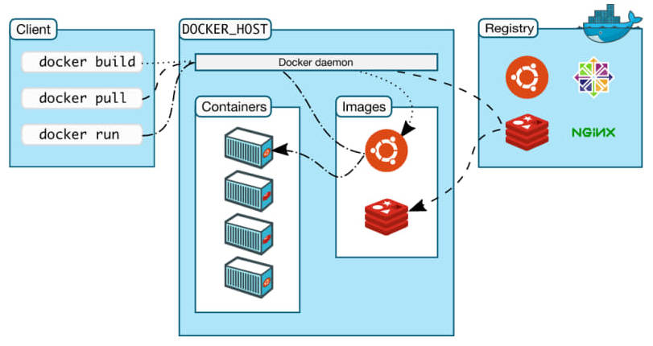
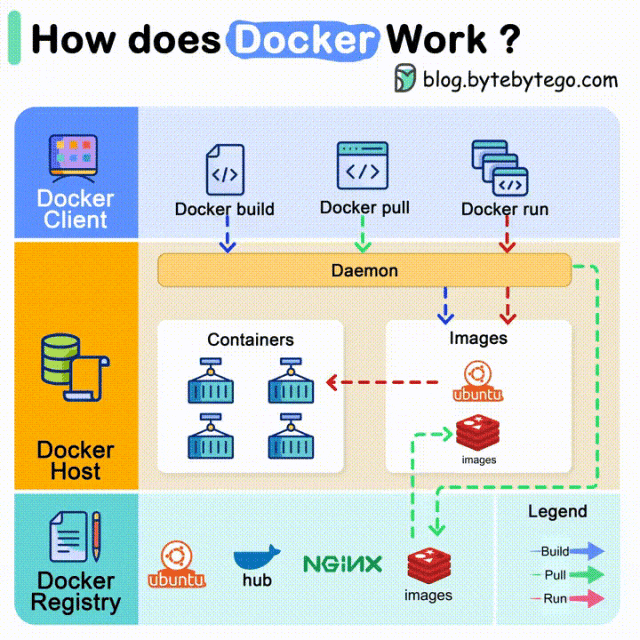
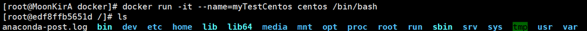
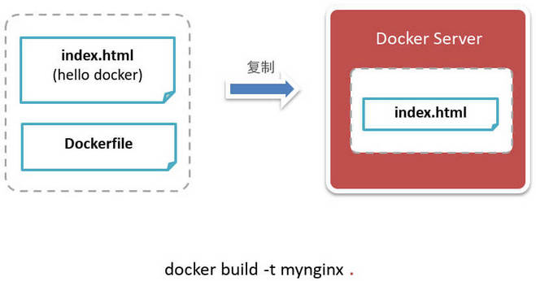

## 1. Docker 简介

### 1.1. Docker 容器技术概述

应用容器引擎 - 容器部署解决方案

> Docker 官网：https://www.docker.com/

### 1.2. 虚拟化与 Docker 容器

容器技术与管理程序虚拟化（hypervisor virtualization，HV）技术有所不同：

- 传统虚拟化方式是硬件层面实现虚拟化，管理程序虚拟化通过中间层将一台或者多台独立的机器虚拟运行在物理硬件之上，需要有额外的虚拟机管理应用和虚拟机操作系统层。


- Docker 容器是直接运行在操作系统内核层面上实现虚拟化，直接利用本地主机的操作系统，因此更加轻量级。因此，容器虚拟化也被称为“操作系统级虚拟化”，容器技术可以让多个独立的用户空间运行在同一台宿主机上。


下面的图片比较了 Docker 和传统虚拟化方式的不同之处，可见<font color="red">**容器是在操作系统层面上实现虚拟化，直接复用本地主机的操作系统，而传统方式则是在硬件层面实现**</font>。与传统的虚拟机相比，Docker 优势体现为启动速度快、占用体积小。


### 1.3. Docker 特点

1. **上手快**。用户只需要几分钟，就可以把自己的程序“Docker 化”。Docker 依赖于“写时复制”（copy-on-write）模型，使修改应用程序也非常迅速，可以说达到“随心所致，代码即改”的境界。随后，就可以创建容器来运行应用程序了。
2. **快速启动**。Docker 容器应用直接运行于宿主内核，无需启动完整的操作系统，大多数 Docker 容器只可以秒级、甚至毫秒级启动。
3. **职责的逻辑分类**。使用 Docker，开发人员只需要关心容器中运行的应用程序，而运维人员只需要关心如何管理容器。Docker 设计的目的就是要加强开发人员写代码的开发环境与应用程序要部署的生产环境一致性。从而降低那种“开发时一切正常，肯定是运维的问题（测试环境都是正常的，上线后出了问题就归结为肯定是运维的问题）”
4. **快速高效的开发生命周期**。Docker 的目标之一就是缩短代码从开发、测试到部署、上线运行的周期，让你的应用程序具备可移植性，易于构建，并易于协作。（通俗一点说，Docker 就像一个盒子，里面可以装很多物件，如果需要这些物件的可以直接将该大盒子拿走，而不需要从该盒子中一件件的取。）
5. **鼓励使用面向服务的架构**。Docker 还鼓励面向服务的体系结构和微服务架构。Docker 推荐单个容器只运行一个应用程序或进程，这样就形成了一个分布式的应用程序模型，在这种模型下，应用程序或者服务都可以表示为一系列内部互联的容器，从而使分布式部署应用程序，扩展或调试应用程序都变得非常简单，同时也提高了程序的内省性。（当然，可以在一个容器中运行多个应用程序）
6. **高效利用系统资源**。容器不需要进行硬件虚拟，不需要运行完整操作系统，容器对系统资源的利用率更高。 由于去除了管理程序的开销，Docker 容器拥有很高的性能，同时同一台宿主机中也可以运行更多的容器，使用户尽可能的充分利用系统资源。
7. **多环境一致**。
8. **快速迁移**。
9. **轻松扩展**。海量官方镜像，直接可用也可作为自定制的基础。

### 1.4. Docker 组件

#### 1.4.1. Docker 客户端和服务器

Docker 是一个客户端-服务器（C/S）架构程序。Docker 客户端只需要向 Docker 服务器或者守护进程发出请求，服务器或者守护进程将完成所有工作并返回结果。Docker 提供了一个命令行工具 Docker 以及一整套 RESTful API。

可以在同一台宿主机上运行 Docker 守护进程和客户端，也可以从本地的 Docker 客户端连接到运行在另一台宿主机上的远程 Docker 守护进程。


#### 1.4.2. Docker 镜像

镜像是构建 Docker 的基石。用户基于镜像来运行自己的容器。镜像也是 Docker 生命周期中的“构建”部分。镜像是基于联合文件系统的一种层式结构，由一系列指令一步一步构建出来。例如：

- 添加一个文件；
- 执行一个命令；
- 打开一个窗口。

也可以将镜像当作容器的“源代码”。镜像体积很小，非常“便携”，易于分享、存储和更新。

#### 1.4.3. Docker 容器

Docker 可以帮助构建和部署容器，只需要把自己的应用程序或者服务打包放进容器即可。容器是基于镜像启动起来的，容器中可以运行一个或多个进程。一旦容器启动完成后，就可以登录到容器中安装需要的软件或者服务。

- 镜像是 Docker 生命周期中的构建或者打包阶段
- 容器则是启动或者执行阶段

<font color=red>**Docker 容器就是：一个镜像格式、一些列标准操作、一个执行环境。镜像是静态的定义，容器是镜像运行时的实例。**</font>

Docker 在执行上述操作时，并不关心容器中到底装了什么，它不管是 web 服务器，还是数据库，或者是应用程序服务器什么的。所有的容器都按照相同的方式将内容“装载”进去。

Docker 也不关心容器在什么环境运行：可以在自己的笔记本中构建容器，上传到 Registry，然后下载到一个物理的或者虚拟的服务器来测试，在把容器部署到具体的主机中。像标准集装箱一样，Docker 容器方便替换，可以叠加，易于分发，并且尽量通用。

使用 Docker，可以快速的构建一个应用程序服务器、一个消息总线、一套实用工具、一个持续集成（CI）测试环境或者任意一种应用程序、服务或工具。可以在本地构建一个完整的测试环境，也可以为生产或开发快速复制一套复杂的应用程序栈。

#### 1.4.4. Registry（注册中心）

- Docker 用 Registry 来保存用户构建的镜像。
- Registry 分为公共和私有两种。Docker 公司运营公共的 Registry 叫做 Docker Hub。用户可以在 Docker Hub 注册账号，分享并保存自己的镜像（说明：在 Docker Hub 下载镜像巨慢，可以自己构建私有的 Registry）。

> 公共 Registry 网址：https://hub.docker.com

### 1.5. Docker 构架与工作原理



Docker 包含三个主要组件：

- Docker Client，这是用户交互的界面。它与 Docker 守护程序进行通信。
- Docker Host，在这里，Docker 守护程序监听 Docker API 请求并管理各种 Docker 对象，包括镜像、容器、网络和 volume。
- Docker Registries，这是 Docker 镜像存储的地方。例如，Docker Hub 是一个经常被用到的公共注册中心。



## 2. Linux 版本 Docker 安装与启动

### 2.1. 安装环境说明

Docker 官方建议在 Ubuntu 中安装，因为 Docker 是基于 Ubuntu 发布的，而且一般 Docker 出现的问题 Ubuntu 是最先更新或者打补丁的。在很多版本的 CentOS 中是不支持更新最新的一些补丁包的。

如果将 Docker 安装到 CentOS 上。需注意：建议安装在 CentOS 7.x 以上的版本，在 CentOS 6.x 的版本中，安装前需要安装其他很多的环境而且 Docker 很多补丁不支持更新。

### 2.2. 安装 Docker 

1. 将 linux 系统的 yum 包更新到最新

```shell
sudo yum update
```

2. 安装需要的软件包， yum-util 提供 yum-config-manager 功能，另外两个是 devicemapper 驱动依赖的

```shell
sudo yum install -y yum-utils device-mapper-persistent-data lvm2
```

3. 设置 yum 源为阿里云。不设置则连接国外服务器下载镜像

```shell
sudo yum-config-manager --add-repo http://mirrors.aliyun.com/docker-ce/linux/centos/docker-ce.repo
```

4. 安装 docker

```shell
sudo yum install docker-ce
```

_注：docker 在 13.0 版本之后分成两个版本，企业版本（ee）需要收费，所以此处安装的是社区版（ce）_

**之前的教程是使用 yum 命令在线安装：`yum -y install docker`**

5. 安装后查看 docker 版本

```shell
docker -v
```

### 2.3. 卸载 Docker

- 使用 rpm 命令查询 docker 的安装情况

```shell
rpm -qa | grep docker
```

- 根据上面的查询情况，输入`rpm -e --nodeps 要卸载的软件名称`

```shell
rpm -e --nodeps docker-client-1.13.1-94.gitb2f74b2.el7.centos.x86_64
rpm -e --nodeps docker-common-1.13.1-94.gitb2f74b2.el7.centos.x86_64
rpm -e --nodeps docker-1.13.1-94.gitb2f74b2.el7.centos.x86_64
```

### 2.4. 启动与停止 Docker

`systemctl`命令是系统服务管理器指令，它是`service`和` chkconfig` 两个命令组合。

- 启动 docker

```shell
systemctl start docker
```

- 停止 docker

```shell
systemctl stop docker
```

- 重启 docker

```shell
systemctl restart docker
```

- 查看 docker 状态，查看相关信息时注意`Active: active (running)`

```shell
systemctl status docker
```

```shell
[root@MoonKirA /]# systemctl status docker
● docker.service - Docker Application Container Engine
   Loaded: loaded (/usr/lib/systemd/system/docker.service; disabled; vendor preset: disabled)
   Active: active (running) since 日 2018-09-02 14:56:15 CST; 1min 52s ago
     Docs: http://docs.docker.com
     …………
```

- 开机启动

```shell
systemctl enable docker
```

- 查看 docker 概要信息

```shell
docker info
```

- 查看 docker 帮助文档

```shell
docker --help
```

## 3. 其他系统 Docker 安装

### 3.1. Windows 版本 Docker 安装

下载地址：https://hub.docker.com/editions/community/docker-ce-desktop-windows/

系统环境要求：

- 64位系统
- 4GB 内存
- BIOS 必须开启硬件虚拟化的支持

安装后测试：

```bash
> docker --version
Docker version 19.03.5, build 633a0ea
```

### 3.2. Mac 版本 Docker 安装

下载地址：https://hub.docker.com/editions/community/docker-ce-desktop-mac/

系统环境要求：

- 硬件需 2010 年之后的
- 系统版本需 10.13+
- 至少 4GB 内存
- 不可以安装 VirtualBox 4.3.30 之前的版本

安装后测试：

```bash
> docker --version
Docker version 19.03.5, build 633a0ea
```

## 4. Docker 镜像操作命令

### 4.1. 什么是 Docker 镜像（Image）

Docker 镜像是由文件系统叠加而成（是一种文件的存储形式）。最底端是一个文件引导系统，即 bootfs，这很像典型的 Linux/Unix 的引导文件系统。Docker 用户几乎永远不会和引导系统有什么交互。实际上，当一个容器启动后，它将会被移动到内存中，而引导文件系统则会被卸载，以留出更多的内存供磁盘镜像使用。Docker 容器启动是需要的一些文件，而这些文件就可以称为 Docker 镜像。


从下载过程中可以看到<font color=red>**镜像是由多层存储构成**</font>。下载也是一层层的去下载，<font color=red>**并非单一文件**</font>。

```bash
> docker pull ubuntu
Using default tag: latest
latest: Pulling from library/ubuntu
5bed26d33875: Pull complete
f11b29a9c730: Pull complete
930bda195c84: Pull complete
78bf9a5ad49e: Pull complete
Digest: sha256:bec5a2727be7fff3d308193cf
Status: Downloaded newer image for ubuntu:latest
docker.io/library/ubuntu:latest
```

### 4.2. 查看当前已有镜像

列出本地本机上 docker 已有的所有镜像

```shell
docker images
```

查询列表说明：

- REPOSITORY：镜像所在的仓库名称
- TAG：镜像标签
- IMAGE ID：镜像 ID
- CREATED：镜像的创建日期（不是获取该镜像的日期）
- SIZE：镜像大小

<font color="red">**说明：这些镜像都是存储在 Docker 宿主机的/var/lib/docker 目录下**</font>

为了区分同一个仓库下的不同镜像，Docker 提供了一种称为标签（Tag）的功能。每个镜像在列出来时都带有一个标签，例如 12.10、12.04 等等。每个标签对组成特定镜像的一些镜像层进行标记（比如，标签 12.04 就是对所有 Ubuntu12.04 镜像层的标记）。这种机制使得同一个仓库中可以存储多个镜像。--- 版本号

在运行同一个仓库中的不同镜像时，可以通过在仓库名后面加上一个冒号和标签名来指定该仓库中的某一具体的镜像，例如`docker run --name custom_container_name –i –t docker.io/ubunto:12.04 /bin/bash`，表明从镜像 Ubuntu:12.04 启动一个容器，而这个镜像的操作系统就是 Ubuntu:12.04。在构建容器时指定仓库的标签也是一个好习惯。

还可以指定特定格式显示，例如下例以表格等距显示，有标题行，自定义列：

```bash
> docker image ls --format "table {{.ID}}\t{{.Repository}}\t{{.Tag}}"
IMAGE ID REPOSITORY TAG
4e5021d210f6 ubuntu latest
e935122ab143 prom/prometheus latest
e8b174eeb4d4 grafana/grafana latest
a64a4ae7bc1f rabbitmq 3.8.2-management
2ddef5390d3a nacos/nacos-server latest
```

只显示镜像ID：

```bash
> docker images -q
```

### 4.3. 搜索镜像

如果需要从网络中查找需要的镜像，可以通过以下命令搜索

```shell
docker search 镜像名称
```

查询的结果列说明：

- INDEX：索引名称
- <font color=red>**NAME：镜像名称**</font>
- DESCRIPTION：镜像描述
- STARS：(星级)用户评价，反应一个镜像的受欢迎程度
- OFFICIAL：是否官方
- AUTOMATED：自动构建，表示该镜像由 Docker Hub 自动构建流程创建的

### 4.4. 拉取镜像

#### 4.4.1. 命令格式

```bash
docker pull [选项] [Docker Registry 地址[:端口号]/]仓库名[:标签]
```

#### 4.4.2. 从 Docker Hub 拉取

Docker 镜像首页，包括官方镜像和其它公开镜像。Docker Hub 上最受欢迎的 10 大镜像（通过 Docker registry API 获取不了镜像被 pull 的个数，只能通过镜像的 stars 数量，来衡量镜像的流行度。毫无疑问，拥有最高 stars 数量的库都是官方库）。

- 国内下载 Docker HUB 官方的相关镜像比较慢，可以使用国内（docker.io）的一些镜像加速器，镜像保持和官方一致，速度快，推荐使用。Mirror 与 Private Registry 的区别：
  - Private Registry（私有仓库）是开发者或者企业自建的镜像存储库，通常用来保存企业内部的 Docker 镜像，用于内部开发流程和产品的发布、版本控制。
  - Mirror 是一种代理中转服务，我们(比如 daocloud)提供的 Mirror 服务，直接对接 Docker Hub 的官方 Registry。Docker Hub 上有数以十万计的各类 Docker 镜像。
- 在使用 Private Registry 时，需要在 Docker Pull 或 Dockerfile 中直接键入 Private Registry 的地址，通常这样会导致与 Private Registry 的绑定，缺乏灵活性。
- 使用 Mirror 服务，只需要在 Docker 守护进程（Daemon）的配置文件中加入 Mirror 参数，即可在全局范围内透明的访问官方的 Docker Hub，避免了对 Dockerfile 镜像引用来源的修改。
- 简单来说，Mirror 类似 CDN，本质是官方的 cache；Private Registry 类似私服，跟官方没什么关系。对用户来说，由于用户是要拖 docker hub 上的 image，对应的是 Mirror。yum/apt-get 的 Mirror 又有点不一样，它其实是把官方的库文件整个拖到自己的服务器上做镜像，并定时与官方做同步；而 Docker Mirror 只会缓存曾经使用过的 image。

使用命令拉取 centos：

```shell
docker pull centos:7
# 说明：docker pull 镜像名称｜镜像名称中一部分
```

#### 4.4.3. ustc 镜像的配置

> 网站：https://lug.ustc.edu.cn/wiki/mirrors/help/docker

ustc 是老牌的 linux 镜像服务提供者了，还在遥远的 ubuntu 5.04 版本的时候就在用。ustc 的 docker 镜像加速器速度很快。ustc docker mirro 不需要注册，是真正的公共服务。

1. 编辑该文件

```shell
vim /etc/docker/daemon.json
```

2. 在该文件中输入如下内容，配置国内的镜像地址

```json
{
  "registry-mirrors": ["https://docker.mirrors.ustc.edu.cn"]
}
```

> 注意：一定要重启 docker 服务`systemctl restart docker`。如果重启 docker 后无法加速，可以重新启动 OS

#### 4.4.4. 其他国内镜像加速器列表

|     镜像加速器      |                        加速器地址                         |
| ----------------- | ------------------------------------------------------- |
| Docker 中国官方镜像 | https://registry.docker-cn.com                          |
| DaoCloud          | http://f1361db2.m.daocloud.io （登录，系统分配）           |
| 阿里云             | https://<your_code>.mirror.aliyuncs.com （登录，系统分配） |
| 七牛云             | https://reg-mirror.qiniu.com                            |
| 网易云             | https://hub-mirror.c.163.com                            |
| 腾讯云             | https://mirror.ccs.tencentyun.com                       |

以 Linux 环境下配置 Docker 官方加速器为例：

```bash
sudo mkdir -p /etc/docker

sudo tee /etc/docker/daemon.json <<-'EOF'
    {
        "registry-mirrors": [
            "https://registry.docker-cn.com"
        ]
    }
EOF

sudo systemctl daemon-reload
sudo systemctl restart docker
```

### 4.5. 删除镜像

命令格式：

```bash
docker image rm [选项] <镜像1> [<镜像2> ...]
```

> Tips: 镜像ID简化：可以使用 ID 的**前 3 位**来代替，方便输入。

- 按镜像 ID 删除镜像

```shell
docker rmi IMAGE_ID(镜像ID)
```

- 删除所有镜像

```shell
docker rmi `docker images -q`
```

- 列出镜像的同时，直接删除镜像，例如：

```shell
# 删除 ubuntu 镜像
docker image rm $(docker image ls -q ubuntu)

# 删除悬挂镜像
docker image rm $(docker images -f dangling=true)
```

- 清理所有悬挂镜像

```shell
docker image prune
```

> Notes: <font color="red">**删除镜像前，需要将当前镜像所创建的容器删除，否则会警告，不能删除错镜像**</font>

### 4.6. 悬挂镜像


名称为 `<none>` 的镜像称为“悬挂镜像”。例如某个版本有了新镜像，本地旧镜像名称就被撤销了，产生此类镜像。

```bash
> docker images -f dangling=true
REPOSITORY    TAG    IMAGE ID         CREATED        SIZE
<none>        <none> 00285df0df87     1 days ago     34 MB
```

## 5. Docker 容器操作命令

### 5.1. 镜像创建启动容器

创建容器命令：`docker run`

```bash
docker run [OPTIONS] IMAGE[:TAG|@DIGEST] [COMMAND] [ARG...]
```

命令示例：

```bash
> docker run ubuntu:16.04 /bin/echo 'Hello world'
Hello world

> docker run -t -i ubuntu:16.04 /bin/bash
root@b6bb71fb6ef4:/#
```

#### 5.1.1. 关键参数说明

- `-i`：表示运行容器，让容器的标准输入保持打开
- `-t`：表示容器启动后会进入其命令行。加入这两个参数后，容器创建就能登录进去。即分配一个伪终端。
- `--name`：为创建的容器命名。
- `-v`：表示目录映射关系。前者是宿主机目录，后者是容器的目录。可以使用多个`-v`做多个目录或文件映射。注意：最好做目录映射，在宿主机上做修改，然后共享到容器上。
- `-d`：创建一个守护式容器在后台运行（这样创建容器后不会自动登录容器，如果只加`-i -t`两个参数，创建后就会自动进去容器）。
- `-p`：表示端口映射关系。前者是宿主机端口，后者是容器内的映射端口。可以使用多个`-p`做多个端口映射
- `-e`：设置环境变量

命令示例：

```bash
> docker run --name some-redis -p 6379:6379 -d redis

> docker run -p 3306:3306 --name mysql5.7 \
        -v /data/mysqldata:/var/lib/mysql \
        -e MYSQL_ROOT_PASSWORD=123456 \
        -d mysql:5.7

> docker run -t -i ubuntu:16.04 /bin/bash
root@b6bb71fb6ef4:/# ls
bin boot dev etc home lib lib64 media mnt opt proc root
```

#### 5.1.2. 交互式容器（exit 退出时，容器停止）

- 创建一个交互式容器语法

```shell
# 语法
docker run -it --name=容器名称 镜像名称:标签 /bin/bash

# 例子：使用centos7镜像创建容器，并取名为mycentos
docker run -it --name=mycentos centos /bin/bash
```



- 通过`docker ps`命令查看，发现可以看到启动的容器，状态为启动状态
- 用`exit`命令退出当前容器
- 用`docker ps -a`命令查看，发现容器已经停止

#### 5.1.3. 守护式容器（后台运行。使用 exit 退出时，容器不会停止）

- 创建一个守护式容器：如果对于一个需要长期运行的容器来说，我们可以创建一个守护式容器。命令如下（**容器名称不能重复**）：

```shell
# 语法
docker run -id --name=容器名称 镜像名称:标签

# 例子：使用centos7镜像创建容器，并取名为mycentos2
docker run -id --name=mycentos2 centos
```

#### 5.1.4. 目录挂载

在创建容器的时候，将宿主机的目录与容器内的目录进行映射，这样就可以通过修改宿主机某个目录的文件从而去影响容器（相当于共享目录一样）。目录挂载语法：

```bash
docker run -id -v 宿主机目录:容器目录 --name=容器名称 镜像名称:TAG
```

示例：
```bash
docker run -id -v /usr/local/web:/usr/local/web --name=mycentos3 centos

# 操作宿主机：
cd /usr/local/web
# 加入内容
vim 1.txt
# 登陆到mycentos3容器中，/usr/local/web可以看到对应的文件与内容
```

在上文件到挂载的目录时，如果共享的是多级的目录，会出现权限不足的提示。这是因为 CentOS7 中的安全模块 selinux 把权限禁掉了，需要添加参数 `--privileged=true` 来解决挂载的目录没有权限的问题

```bash
docker run -id -v /usr/local/web:/usr/local/web --privileged=true --name=mycentos4 centos
```

### 5.2. 登录守护式容器

登录守护式容器，语法：

```bash
# 语法
docker exec -it  容器名称|容器id  /bin/bash
```

进入容器示例：

```bash
# 方式1：使用容器的 name 登陆
docker exec -it mycentos2 /bin/bash

# 方式2：使用容器的id登陆
docker exec -it 5f4465d7430c /bin/bash
```

例如后台运行了 MySQL 容器，现在想进入容器，并登陆 MySQL 客户端：

```bash
# 启动 MySQL 容器
> docker run -p 3306:3306 --name mysql5.7 \
    -v /data/mysqldata:/var/lib/mysql \
    -e MYSQL_ROOT_PASSWORD=123456 \
    -d mysql:5.7

# 进入 MySQL 容器
> docker exec -it mysql5.7 bash

# 登录 MySQL
> mysql -u root -p
```

### 5.3. 查看容器

- 查看正在运行容器（不显示已经停止的容器）

```bash
docker ps
```

- 查看所有的容器（包含已经停止的容器）

```bash
docker ps –a
```

- 查看最后一次运行的容器

```bash
docker ps –l
```

- 查看停止的容器

```bash
docker ps -f status=exited`
```

### 5.4. 停止容器

停止容器语法：

```bash
docker stop 容器名称|容器ID
```

示例

```bash
# 方式1：根据容器名称
docker stop mycentos2
# 方式2：根据容器ID
docker stop 5f4465d7430c
```

### 5.5. 启动容器

启动容器语法

```bash
docker start 容器名称|容器ID
```

启动容器示例：

```bash
# 方式1：根据容器名称
docker start mycentos2
# 方式2：根据容器ID
docker start 5f4465d7430c
```

### 5.6. 重启容器

重新启动容器语法：

```bash
docker restart 容器名称|容器ID
```

重新启动容器示例：

```bash
# 方式1：根据容器名称
docker restart mycentos2
# 方式2：根据容器ID
docker restart 5f4465d7430c
```

### 5.7. 删除容器

<font color=red>**注意：只能删除处于终止状态的容器**</font>

删除指定的容器的语法：

```bash
docker rm 容器名称|容器ID
```

删除容器示例：

```bash
# 方式1：根据容器名称
docker rm mycentos2
# 方式2：根据容器ID
docker rm 2095a22bee70
```

删除所有终止状态的容器：

```bash
docker container prune
```

删除所有容器：

```bash
# 先停止所有容器
$ docker stop $(docker ps -a -q)
# 删除
$ docker rm $(docker ps -a -q)
```

批量删除部分容器：

```bash
> docker stop $(docker ps | grep rock | awk '{print $1}')
> docker rm $(docker ps -a| grep rock | awk '{print $1}')
```

强制删除容器（**慎用**），增加 `-f` 参数即可：

```bash
docker rm -f 容器ID
```

### 5.8. 文件拷贝

使用`docker cp`命令将宿主机中的文件拷贝到容器内。**注意：需要后台运行目标容器，在宿主中使用命令**。

从宿主机复制文件到容器语法：

```bash
docker cp 需要拷贝的文件或目录 容器名称:容器目录
```

从宿主机复制文件到容器示例：

```bash
docker cp anaconda-ks.cfg mycentos:/usr/local
```

从容器复制文件到宿主机（是复制到当前停留的宿主机目录中）语法：

```bash
docker cp 容器名称:容器目录 需要拷贝的文件或目录
```

从容器复制文件到宿主机wgi /iegm

```bash
docker cp mycentos:/usr/local/anaconda-ks.cfg 1.cfg
```

### 5.9. 查看容器 IP

查看容器运行的各种数据：

```shell
# 语法：
docker inspect 容器名称|容器ID

# 直接执行下面的命令直接输出IP地址
docker inspect --format='{{.NetworkSettings.IPAddress}}'  容器名称|容器ID
```


### 5.10. 导入导出容器

在生产环境中，很多时候是无法连接外网的，所以有时候需要用到容器的导入和导出。

容器导出：

```shell
docker export 7691a814370e > ubuntu.tar
```

> Tips: 导出容器的时候，容器无需关闭。

导入容器：

```shell
docker load < ubuntu.tar
```

### 5.11. 查看容器错误日志

```shell
# 实时查看docker容器名为user-uat的最后10行日志
docker logs -f -t --tail 10 user-uat

# 查看指定时间后的日志，只显示最后100行：
docker logs -f -t --since="2018-02-08" --tail=100 user-uat

# 查看最近30分钟的日志:
docker logs --since 30m user-uat

# 查看某时间之后的日志：
docker logs -t --since="2018-02-08T13:23:37" user-uat

# 查看某时间段日志：
docker logs -t --since="2018-02-08T13:23:37" --until "2018-02-09T12:23:37" user-uat

# 将错误日志写入文件：
docker logs -f -t --since="2018-02-18" user-uat | grep error >> logs_error.txt
```

## 6. 部署应用

### 6.1. MySQL 部署

#### 6.1.1. 拉取 MySQL 镜像

拉取的 MySQL 版本名称，通过`docker search 镜像名称`查询到

```shell
docker pull centos/mysql-57-centos7
```

#### 6.1.2. 创建 MySQL 容器

```shell
# 语法：
docker run -id --name=容器名称 -p 宿主机端口:容器运行的端口 -e MYSQL_ROOT_PASSWORD=MySQL登陆名称 mysql镜像名称

# 例：
docker run -id --name=moon_mysql -p 33306:3306 -e MYSQL_ROOT_PASSWORD=123456 centos/mysql-57-centos7
```

- 参数说明：
  - `-p`：代表端口映射，格式为“宿主机映射端口:容器运行端口”
  - `-e`：代表添加环境变量`MYSQL_ROOT_PASSWORD`是 root 用户的登录密码

#### 6.1.3. 远程登陆 mysql

连接宿主机的 IP（练习时使用：192.168.12.132），端口为上面映射端口 33306

### 6.2. tomcat 部署

#### 6.2.1. 拉取 tomcat 镜像

```shell
docker pull tomcat
```

#### 6.2.2. 创建 tomcat 容器

创建容器用于部署 cas.war 项目，`-p`表示地址映射

```shell
docker run -id --name=moon_tomcat -p 9000:8080 -v /usr/local/web:/usr/local/tomcat/webapps --privileged=true tomcat
```

#### 6.2.3. 部署 web 应用

##### 6.2.3.1. 案例 1：部署 cas 单点登陆项目

将 cas.war 上传到/usr/local/web 中，tomcat 运行会自动将 war 包解压。使用http://192.168.12.132:9000/cas访问测试

##### 6.2.3.2. 案例 2：部署 ssm 项目，连接 mysql 容器

上传 G:\IT 资料库\Docker-学习资料（视频+资料）\资料\ssm 项目到/usr/local/web 下

修改数据库配置文件 c3p0.properties：(docker inspect ssm_mysql 查看 ip)


```properties
c3p0.driverClass=com.mysql.jdbc.Driver
c3p0.jdbcUrl=jdbc:mysql://172.17.0.4:3306/ssm_db
c3p0.user=root
c3p0.password=123456
c3p0.maxPoolSize=20
c3p0.minPoolSize=2
c3p0.initialPoolSize=2
```

测试：地址栏输入http://192.168.12.132:9000/ssm

<font color="red">**注意：docker 容器之间通信需要用容器的 IP**</font>

### 6.3. Nginx 部署

#### 6.3.1. 拉取 Nginx 镜像

```shell
docker pull nginx
```

#### 6.3.2. 创建 Nginx 容器

```shell
docker run -id --name=moon_nginx -p 80:80 nginx
```

#### 6.3.3. 测试 nginx

- 上传静态页面【\1-3 Docker 容器化-课堂资料\资源\dist】到 linux 系统中任意目录上
- 进入 nginx 容器中，查看 nginx 配置文件相关信息

```shell
# 进入nginx容器
docker exec -it moon_nginx /bin/bash
# 进入nginx配置所在目录
cd /etc/nginx
# 查看nginx配置文件，看到里面有一句【include /etc/nginx/conf.d/*.conf;】。就是说可以可以单独引入其他配置
cat nginx.conf
# 进行目录查看
cd /etc/nginx/conf.d
cat default.conf
```

- 查看到 nginx 的欢迎页面所在位置是【/usr/share/nginx/html】；所以就可以将上传的目录名称改成 html，再拷贝到 nginx 容器一样的位置覆盖即可

```shell
# 退出容器，修改上传的目录名称
mv dist html
# 复制到容器中
docker cp html moon_nginx:/usr/share/nginx/
```

- 浏览器地址栏输入：http:/192.168.12.132/。可以直接访问静态页面

#### 6.3.4. 配置反向代理（如果需要修改，参考以下案例）

官方的 nginx 镜像，nginx 配置文件 nginx.conf 在/etc/nginx/目录下。

在容器内编辑配置文件不方便，我们可以先将配置文件从容器内拷贝到宿主机，编辑修改后再拷贝回去。

1. 从容器拷贝配置文件到宿主机：

```shell
docker cp moon_nginx:/etc/nginx/nginx.conf nginx.conf
```

2. 编辑 nginx.conf，添加反向代理配置

```shell
# 查看tomcat容器的IP
docker inspect moon_tomcat

# 修改增加nginx.conf文件，增加配置
upstream ssm {
	server 172.17.0.5:8080;
}
server {
	listen 80;
	server_name ssm.taotao.com;
	location / {
		proxy_pass http://ssm;
		index index.html index.htm;
	}
}
```

3. 将修改后的配置文件拷贝到容器：

```shell
docker cp nginx.conf moon_nginx:/etc/nginx/nginx.conf
```

4. 重新启动容器

```shell
docker restart moon_nginx
```

5. 设置域名指向：`192.168.12.130 ssm.taotao.com`
6. 浏览器测试：http://ssm.taotao.com/ssm

### 6.4. Redis 部署

#### 6.4.1. 拉取 Redis 镜像

```shell
docker pull redis
```

#### 6.4.2. 创建 Redis 容器

```shell
docker run -id --name=moon_redis -p 6379:6379 redis
```

#### 6.4.3. 客户端测试

本地电脑 windows 下连接 redis 容器，输入连接主机 ip：192.168.12.132，端口：6379

_注：如果连接不成功，查看是否端口没有开放。输入`/sbin/iptables -I INPUT -p tcp --dport 6379 -j ACCEPT`命令，开放端口_

## 7. 备份与迁移

### 7.1. 容器保存为镜像

```shell
# 语法：
docker commit 容器名称 新的镜像名称

# 例：将配置好的容器nginx保存为镜像
docker commit moon_nginx mynginx_image
```

_说明：保存后查看镜像，新的镜像的内容就是当前容器的内容，接下来可以用此新的镜像再次运行创建新的容器，新的容器里的配置都是配置后的内容_

### 7.2. 镜像备份

将镜像保存为 tar 文件

```shell
# 语法：
docker save -o 文件名称.tar 镜像名称

# 例：将mynginx_image的镜像保存成mynginx.tar文件
docker save -o mynginx.tar mynginx_image
```

注：参数`-o`：代表输出到的文件

执行后，运行 ll 命令即可看到打成的 tar 包

### 7.3. 镜像恢复与迁移

```shell
# 语法
docker load -i 文件名称.tar

# 例：首先先删除掉mynginx_image镜像
docker rmi mynginx_image
# 然后执行此命令进行恢复
docker load -i mynginx.tar
```

注：参数`-i`：代表输入的文件

执行后再次查看镜像 docker images，可以看到镜像已经恢复。

## 8. Dockerfile 构建镜像

### 8.1. Dockerfile 简介

Dockerfile 是由一系列命令和参数构成的脚本，这些命令应用于基础镜像并最终创建一个新的镜像。

- 对于开发人员：可以为开发团队提供一个完全一致的开发环境。
- 对于测试人员：可以直接拿开发时所构建的镜像或者通过 Dockerfile 文件构建一个新的镜像开始工作。
- 对于运维人员：在部署时，可以实现应用的无缝移植。

### 8.2. Dockerfile 基础结构


### 8.3. Dockerfile 常用命令

|                命令                 |                              作用                              |
| ---------------------------------- | ------------------------------------------------------------- |
| FROM image_name:tag                | 定义了使用哪个基础镜像启动构建流程                                  |
| MAINTAINER user_name               | 声明镜像的创建者                                                 |
| ENV key value                      | 设置环境变量 (可以写多条)                                         |
| RUN command                        | 构建镜像过程中运行的 Shell 命令。是 Dockerfile 的核心部分(可以写多条) |
| ADD source_dir/file dest_dir/file  | 将宿主机的文件复制到容器内，如果是一个压缩文件，将会在复制后自动解压     |
| COPY source_dir/file dest_dir/file | 和 ADD 相似，但是如果有压缩文件并不能解压                           |
| WORKDIR path_dir                   | 设置工作目录                                                    |
| CMD、ENTRYPOINT                    | 启动容器执行命令                                                 |

#### 8.3.1. FROM 基础镜像

从镜像仓库拿一个镜像，作为此次构建镜像的基石。例：

```dockerfile
FROM centos:6
```

#### 8.3.2. RUN 执行命令

构建镜像过程中运行的 Shell 命令，是 Dockerfile 的核心部分(可以写多条)

```dockerfile
RUN ["yum", "install", "httpd"]
RUN yum install httpd
RUN buildDeps='gcc libc6-dev make' \
        && apt-get update \
        && apt-get install -y
```

#### 8.3.3. CMD、ENTRYPOINT 启动容器执行命令

此两个命令均为容器启动时执行，两者相同点是：

- 容器启动时执行
- 各自都只能有一个生效，有多个时，只有最后一个生效

不同点是：

- CMD 指定的命令可以被 docker run 中指定的命令覆盖，而 ENTRYPOINT 不会，会作为自己命令的参数
- CMD 可以不指定命令，只有参数，这时可以作为 ENTRYPOINT 的默认参数，而且可以在 docker run 时替换

#### 8.3.4. COPY/ADD 拷贝文件或目录到镜像

ADD 含义同 COPY，区别是 ADD 有增强功能：自动解压。

```dockerfile
COPY index.jsp /var/www
ADD webapp.zip /var/www
```

#### 8.3.5. WORKDIR 指定工作目录

指定当前的工作路径，类似 shell 中的 `cd` 命令，RUN、CMD、ENTRYPOINT、COPY、AND 都基于此路径，也是用户进入容器后的默认路径。

```dockerfile
WORKDIR /home
```

#### 8.3.6. EXPOSE 暴露端口

声明容器打算使用什么端口

```dockerfile
EXPOSE 80 8080
```

#### 8.3.7. ENV 环境变量

设置容器内的环境变量，其他指令可以直接引用

```dockerfile
ENV VERSION=3.0 DEBUG=true
ENV MYSQL_PASSWORD 123456
```

### 8.4. 构建上下文

命令格式：

```bash
docker build -t 构建镜像的名称
```



### 8.5. 使用脚本创建镜像示例

1. 创建目录

```bash
mkdir –p /usr/local/dockerjdk8
```

2. 下载 jdk-8u171-linux-x64.tar.gz 并上传到服务器（虚拟机）中的/usr/local/dockerjdk8 目录
3. 创建文件 Dockerfile。（注：名字必须是 Dockerfile，并且首字母大写）

```bash
vi Dockerfile
```

```dockerfile
# 依赖镜像名称和ID
FROM centos:7
#指定镜像创建者信息
MAINTAINER MoonKirA
#切换工作目录
WORKDIR /usr
RUN mkdir /usr/local/java
#ADD 是相对路径jar,把java添加到容器中
ADD jdk-8u171-linux-x64.tar.gz /usr/local/java/
#配置java环境变量
ENV JAVA_HOME /usr/local/java/jdk1.8.0_171
ENV JRE_HOME $JAVA_HOME/jre
ENV CLASSPATH
$JAVA_HOME/lib/dt.jar:$JAVA_HOME/lib/tools.jar:$JRE_HOME/lib:$CLASSPATH
ENV PATH $JAVA_HOME/bin:$PATH
```

4. 执行命令构建镜像

```bash
docker build -t='jdk1.8'
```

5. 查看镜像是否建立完成

```bash
docker images
```

## 9. Docker Compose 容器编排

### 9.1. 概述

支撑一套服务应用环境通常需要启动多个容器，例如 Tomcat 容器、MySQL 容器、Redis 容器...如果逐个启动、停止，繁琐、易出错。

**Docker Compose 就是实现一键启动、停止应用相关的整套容器编排脚本**。Docker Compose 适用于开发环境和测试环境，生产还是使用专业的部署工具，如 k8s 等。

### 9.2. Docker Compose 安装

docker compose 下载地址：https://github.com/docker/compose/releases

安装命令：

```bash
# 下载
> curl -L https://github.com/docker/compose/releases/download/1.25.4/docker-compose-`uname -s`-`uname -m` -o /usr/local/bin/docker-compose

# 授权
> chmod +x /usr/local/bin/docker-compose
```

> Tips: 使用 `curl` 命令可能因为网络环境原因无法下载，可以直接到github仓库手动下载

### 9.3. Docker Compose 应用（待整理）

> TODO: 待整理

## 10. Docker 私有仓库

### 10.1. 私有仓库搭建与配置

1. 拉取私有仓库镜像

```bash
docker pull registry
```

2. 启动私有仓库容器

```bash
docker run -id --name=moon_registry -p 5000:5000 registry
```

3. 打开浏览器 输入地址 `http://192.168.12.132:5000/v2/_catalog` 看到 `{"repositories":[]}` 表示私有仓库搭建成功并且内容为空
4. 修改 daemon.json

```bash
vi /etc/docker/daemon.json
```

添加以下内容（如果已配置其他内容，则在上面的内容后面增加逗号，写下以下 key-value 格式的内容），保存退出

```json
{
    "insecure-registries":["192.168.12.132:5000"]
}
```

此步用于让 docker 信任私有仓库地址

5. 重启 docker 服务

```bash
systemctl restart docker
```

### 10.2. 镜像上传至私有仓库

1. 标记此镜像为私有仓库的镜像

```bash
docker tag jdk1.8 192.168.184.141:5000/jdk1.8
```

2. 再次启动私服容器

```bash
docker start moon_registry
```

3. 上传标记的镜像

```bash
docker push 192.168.184.141:5000/jdk1.8
```

## 11. Docker 扩展知识

### 11.1. 参考资料

- [Docker 项目如何使用 Dockerfile 构建镜像](https://mp.weixin.qq.com/s/T3U1Zdv5xuGoRRzje_in1Q)

### 11.2. Dockerfile 的最佳实践和未来趋势

#### 11.2.1. 最佳实践

1. **保持镜像尽可能小**：选择合适的基础镜像，例如 Alpine Linux，因为它非常小巧。在构建过程中，只安装必要的包和依赖。
2. **使用多阶段构建**：多阶段构建可以帮助减小最终镜像的大小，通过在一个阶段构建应用，然后在另一个阶段只复制必要的文件。
3. **避免安装不必要的软件包**：只安装运行应用所必需的软件包，减少安全漏洞的风险。
4. **使用 .dockerignore 文件**：类似 .gitignore，可以避免不必要的文件被复制到镜像中。
5. **利用构建缓存**：合理安排 Dockerfile 指令顺序，使得频繁变动的层放在后面，以利用 Docker 的构建缓存。
6. **安全性**：尽可能使用非 root 用户运行应用，减少安全风险。
7. **明确标记**：使用 LABEL 指令为镜像添加元数据，比如维护者信息、版本号等。

#### 11.2.2. 未来趋势

1. **与云原生技术的整合**：随着云原生技术的发展，Docker 和 Kubernetes 将更加紧密地协同工作，Dockerfile 在构建云原生应用中将发挥更大的作用。
2. **安全性关注增加**：随着安全意识的提高，未来 Dockerfile 的编写将更加注重安全性，比如通过更安全的基础镜像和更严格的安全扫描。
3. **自动化和智能化**：可能会出现更多工具来自动化生成和优化 Dockerfile，甚至在某些情况下，AI 可能参与 Dockerfile 的生成和优化过程。
4. **更紧密的 DevOps 集成**：Dockerfile 的设计和应用将更加贴近 DevOps 流程，特别是在持续集成和持续部署方面，它将成为自动化管道的核心组件。
5. **可复用性和模块化**：随着容器化技术的成熟，Dockerfile 的可复用性和模块化将越来越受到重视。我们可能会看到更多针对特定应用或服务的预制 Dockerfile 模板。
6. **性能优化**：Dockerfile 的未来版本可能会集成更多性能优化的特性，比如更高效的层压缩和缓存机制，以减少构建和部署时间。

通过遵循这些最佳实践并关注未来的趋势，可以更有效地利用 Dockerfile 来构建、测试和部署应用。Dockerfile 不仅是一个工具，它还代表了一种思维方式，即如何更好地在不同环境中一致地部署和管理应用。随着技术的不断进步，Dockerfile 和容器技术将继续演化，为软件开发和部署带来更多的便利和创新。
