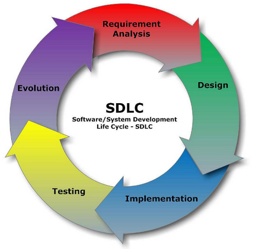
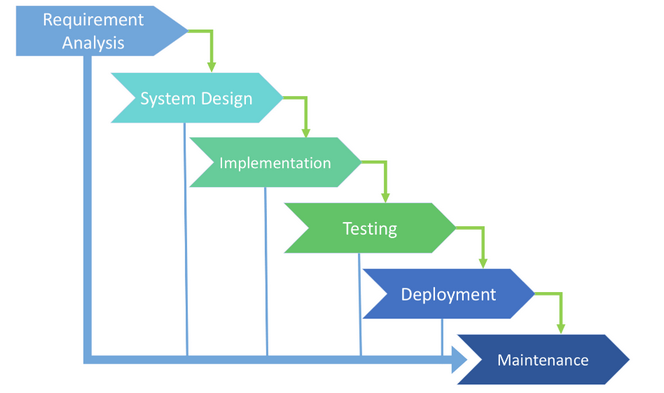
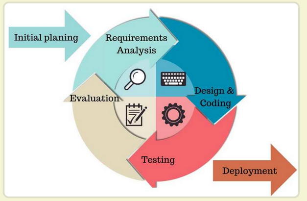
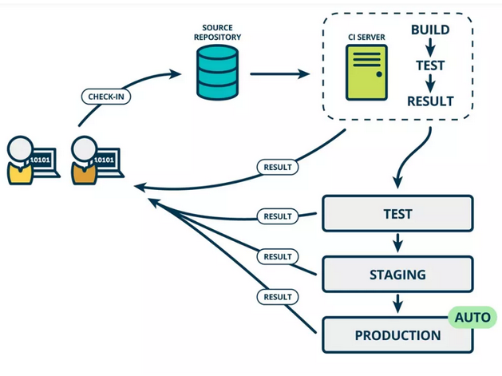
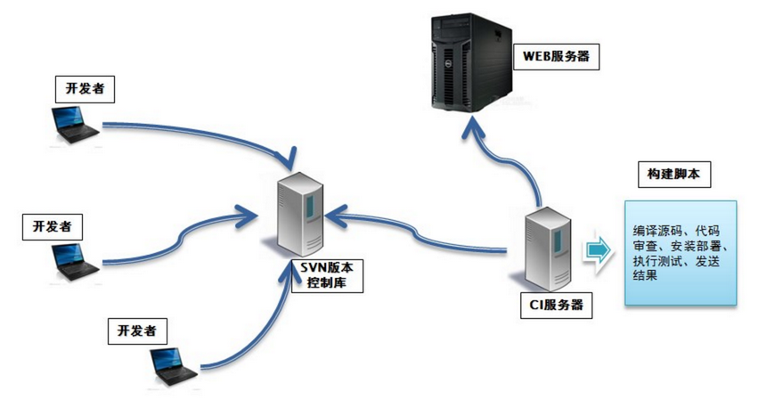
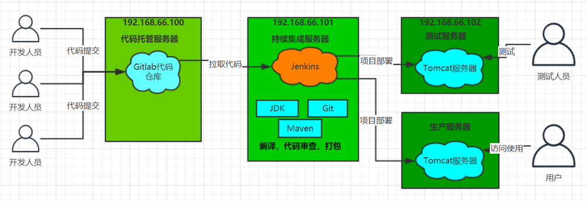

## 1. 软件开发模式

### 1.1. 软件开发生命周期

软件开发生命周期又叫做SDLC（Software Development Life Cycle），它是集合了计划、开发、测试和部署过程的集合。如下图所示：

- **需求分析**：这是生命周期的第一阶段，根据项目需求，团队执行一个可行性计划的分析。项目需求可能是公司内部或者客户提出的。这阶段主要是对信息的收集，也有可能是对现有项目的改善和重新做一个新的项目。还要分析项目的预算多长，可以从哪方面受益及布局，这也是项目创建的目标。
- **设计**：第二阶段就是设计阶段，系统架构和满意状态（就是要做成什么样子，有什么功能），和创建一个项目计划。计划可以使用图表，布局设计或者文者的方式呈现。
- **实现**：第三阶段就是实现阶段，项目经理创建和分配工作给开者，开发者根据任务和在设计阶段定义的目标进行开发代码。依据项目的大小和复杂程度，可以需要数月或更长时间才能完成。
- **测试**：测试人员进行代码测试 ，包括功能测试、代码测试、压力测试等。
- **进化**：最后进阶段就是对产品不断的进化改进和维护阶段，根据用户的使用情况，可能需要对某功能进行修改，bug修复，功能增加等。

### 1.2. 软件开发瀑布模型

瀑布模型是最著名和最常使用的软件开发模型。瀑布模型就是一系列的软件开发过程。它是由制造业繁衍出来的。一个高度化的结构流程在一个方向上流动，有点像生产线一样。在瀑布模型创建之初，没有其它开发的模型，有很多东西全靠开发人员去猜测，去开发。<u>这样的模型仅适用于那些简单的软件开发， 但是已经不适合现在的开发了</u>。

下图对软件开发模型的一个阐述。

优势：

- 简单易用和理解
- 当前一阶段完成后，只需要去关注后续阶段
- 为项目提供了按阶段划分的检查节点

劣势：

- 各个阶段的划分完全固定，阶段之间产生大量的文档，极大地增加了工作量
- 由于开发模型是线性的，用户只有等到整个过程的末期才能见到开发成果，从而增加了开发风险
- 瀑布模型的突出缺点是不适应用户需求的变化

### 1.3. 软件的敏捷开发

#### 1.3.1. 敏捷开发的概念

敏捷开发（Agile Development）的核心是迭代开发（Iterative Development）与增量开发（Incremental Development）。

#### 1.3.2. 迭代开发的概念

对于大型软件项目，传统的开发方式是采用一个大周期（比如一年）进行开发，整个过程就是一次"大开发"；迭代开发的方式则不一样，它将开发过程拆分成多个小周期，即一次"大开发"变成多次"小开发"，每次小开发都是同样的流程，所以看上去就好像重复在做同样的步骤。

举例来说，SpaceX 公司想造一个大推力火箭，将人类送到火星。但是，它不是一开始就造大火箭，而是先造一个最简陋的小火箭 Falcon 1。结果，第一次发射就爆炸了，直到第四次发射，才成功进入轨道。然后，开发了中型火箭 Falcon 9，九年中发射了70次。最后，才开发 Falcon 重型火箭。如果 SpaceX 不采用迭代开发，它可能直到现在还无法上天。

#### 1.3.3. 增量开发的概念

软件的每个版本，都会新增一个用户可以感知的完整功能。也就是说，按照新增功能来划分迭代。

举例来说，房产公司开发一个10栋楼的小区。如果采用增量开发的模式，该公司第一个迭代就是交付一号楼，第二个迭代交付二号楼......每个迭代都是完成一栋完整的楼。而不是第一个迭代挖好10栋楼的地基，第二个迭代建好每栋楼的骨架，第三个迭代架设屋顶......

#### 1.3.4. 敏捷开发如何迭代

虽然敏捷开发将软件开发分成多个迭代，但是也要求，每次迭代都是一个完整的软件开发周期，必须按照软件工程的方法论，进行正规的流程管理。

#### 1.3.5. 敏捷开发的好处

- **早期交付**：敏捷开发的第一个好处，就是早期交付，从而大大降低成本。 
- **降低风险**：及时了解市场需求，降低产品不适用的风险。

## 2. 持续集成

### 2.1. 持续集成的概念

持续集成（Continuous integration，简称 CI）指的是，频繁地（一天多次）将代码集成到主干。

**持续集成的目的，就是让产品可以快速迭代，同时还能保持高质量**。它的核心措施是，代码集成到主干之前，必须通过自动化测试。只要有一个测试用例失败，就不能集成。

通过持续集成，团队可以快速的从一个功能到另一个功能。简而言之，敏捷软件开发很大一部分都要归功于持续集成。

### 2.2. 持续集成的流程

根据持续集成的设计，代码从提交到生产，整个过程有以下几步：

1. **提交**：流程的第一步，是开发者向代码仓库提交代码。所有后面的步骤都始于本地代码的一次提交（commit）。
2. **测试（第一轮）**：代码仓库对 commit 操作配置了钩子（hook），只要提交代码或者合并进主干，就会跑自动化测试。
3. **构建**：通过第一轮测试，代码就可以合并进主干，就算可以交付了。交付后，就先进行构建（build），再进入第二轮测试。所谓构建，指的是将源码转换为可以运行的实际代码，比如安装依赖，配置各种资源（样式表、JS脚本、图片）等等。
4. **测试（第二轮）**：构建完成，就要进行第二轮测试。如果第一轮已经涵盖了所有测试内容，第二轮可以省略，当然，这时构建步骤也要移到第一轮测试前面。
5. **部署**：过了第二轮测试，当前代码就是一个可以直接部署的版本（artifact）。将这个版本的所有文件打包（`tar filename.tar *`）存档，发到生产服务器。
6. **回滚**：一旦当前版本发生问题，就要回滚到上一个版本的构建结果。最简单的做法就是修改一下符号链接，指向上一个版本的目录。

### 2.3. 持续集成的组成要素

- 一个自动构建过程，从检出代码、编译构建、运行测试、结果记录、测试统计等都是自动完成的，无需人工干预。
- 一个代码存储库，即需要版本控制软件来保障代码的可维护性，同时作为构建过程的素材库，一般使用 SVN 或 Git。
- 一个持续集成服务器，Jenkins 就是一个配置简单和使用方便的持续集成服务器。

### 2.4. 持续集成的好处

1. 降低风险，由于持续集成不断去构建，编译和测试，可以很早期发现问题，所以修复的代价就少；
2. 对系统健康持续检查，减少发布风险带来的问题；
3. 减少重复性工作；
4. 持续部署，提供可部署单元包；
5. 持续交付可供使用的版本；
6. 增强团队信心；

## 3. Jenkins

### 3.1. 简介

Jenkins 是一款流行的开源持续集成（Continuous Integration）工具，广泛用于项目开发，具有自动化构建、测试和部署等功能。

- 官方网站：https://www.jenkins.io/
- 官方中文：https://www.jenkins.io/zh/

### 3.2. Jenkins 的特征

- 开源的 Java 语言开发持续集成工具，支持持续集成，持续部署。
- 易于安装部署配置：可通过 yum 安装，或下载 war 包以及通过 docker 容器等快速实现安装部署，可方便 web 界面配置管理。
- 消息通知及测试报告：集成 RSS/E-mail。通过 RSS 发布构建结果或当构建完成时通过 e-mail 通知，生成 JUnit/TestNG 测试报告。
- 分布式构建：支持 Jenkins 能够让多台计算机一起构建/测试。
- 文件识别：Jenkins 能够跟踪哪次构建生成哪些 jar，哪次构建使用哪个版本的 jar 等。
- 丰富的插件支持：支持扩展插件，可以开发适合自己团队使用的工具，如 git，svn，maven，docker 等。

### 3.3. Jenkins 持续集成流程说明

1. 首先，开发人员每天进行代码提交，提交到 Git 仓库
2. 然后，Jenkins 作为持续集成工具，使用 Git 工具到 Git 仓库拉取代码到集成服务器，再配合 JDK，Maven 等软件完成代码编译，代码测试与审查，测试，打包等工作，在这个过程中每一步出错，都重新再执行一次整个流程。
3. 最后，Jenkins 把生成的 jar 或 war 包分发到测试服务器或者生产服务器，测试人员或用户就可以访问应用。

## 4. Jenkins 安装

### 4.1. 系统要求

机器最低推荐配置要求：

- 256 MB 可用内存，建议大于 512 MB
- 1GB可用磁盘空间，作为一个 Docker 容器运行 jenkins 则推荐10 GB 可用的硬盘空间

为小团队推荐的硬件配置:

- 1GB+可用内存
- 50 GB+ 可用磁盘空间

需要安装以下软件配置：

- Java 8 ( JRE 或者 JDK 都可以)
- Docker（访问官网提供的 [Docker 链接](https://www.jenkins.io/zh/solutions/docker/)，下载适合平台的 Docker）

> 注意: 如果使用 Docker 容器部署运行 Jenkins，则非必需安装 Java 8

### 4.2. 测试环境服务器列表

本次学习环境虚拟机统一采用 CentOS 7

|   环境名称    | IP地址（待调整）  |                  安装软件（待调整）                   |
| ------------ | -------------- | -------------------------------------------------- |
| 代码托管服务器 | 192.168.66.100 | Gitlab-12.4.2                                      |
| 持续集成服务器 | 192.168.66.101 | Jenkins-2.190.3，JDK1.8，Maven3.6.2，Git，SonarQube |
| 应用测试服务器 | 192.168.66.102 | JDK1.8，Tomcat8.5                                  |

### 4.3. Gitlab 代码托管服务器安装

> 此部分内容详见[《GitLab 代码托管服务器》笔记](/DevOps/版本管理工具/GitLab)

### 4.4. Jenkins war 包

下载 Jenkins 的 Web 应用程序 ARchive（WAR）文件版本，可以安装在任何支持 Java 的操作系统或平台上。

要下载并运行 Jenkins 的 WAR 文件版本，请执行以下操作:

1. 将最新的稳定 Jenkins WAR 包，下载到本地计算机上的相应目录。
2. 在下载的目录内打开一个终端/命令提示符窗口。
3. 运行命令 `java -jar jenkins.war`
4. 浏览 http://localhost:8080 并等到 *Unlock Jenkins* 页面出现。
5. 继续使用后面步骤设置向导。

> 最新的稳定 Jenkins WAR 包下载地址：http://mirrors.jenkins.io/war-stable/latest/jenkins.war

> Notes: 可以通过 `--httpPort` 选项指定更改运行时端口。例如，可以使用以下命令通过端口 9090 访问 Jenkins：`java -jar jenkins.war --httpPort=9090`

