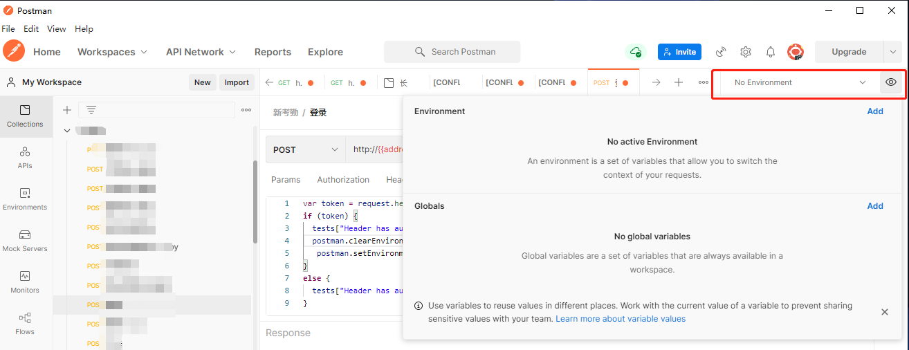
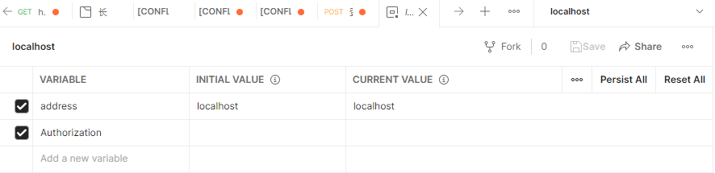
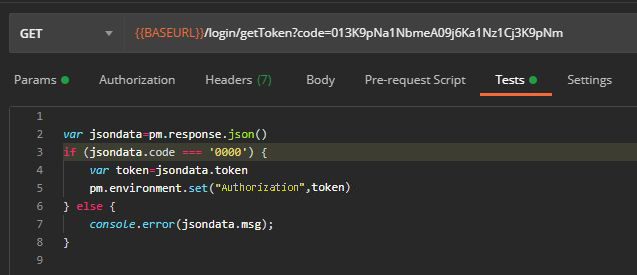
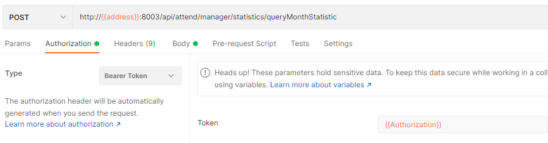

## 1. Postman 概述

Postman 是一款功能强大的、支持 HTTP 协议的接口调试与测试工具，可以完成各种 HTTP 请求的功能测试，使用简单且易用性好。无论是开发人员进行接口调试，还是测试人员做接口测试，Postman 都是的首选工具之一。

- post请求参数设置
    - form-data：将表单的数据转为键值对，并且可以包括文件
    - x-www-form-urlencoded: content-type为application/x-www-from-urlencoded，将表单的数据转为键值对
    - raw：请求text、json、xml、html，比如如果请求json数据则使用此格式
    - binary：content-type为application/octet-stream，可用于上传文件。

### 1.1. 官网

> 官网地址：https://www.postman.com/

### 1.2. 安装

postman 在 2018 年之后就不再支持浏览器版本，想要使用它就必须先下载客户端再安装使用，下面以 Windows 系统为例进行安装。

双击下载的安装包，进入到安装界面，直到用户登录和注册界面。若个人使用，选择跳过即可，这时会进入到 postman 主界面，安装成功。

## 2. 使用技巧

### 2.1. 调用登陆接口后自动设置 token

在使用 postman 调试接口的时候，通常会遇到一个问题，除了登录和其他某些特殊接口以外，几乎所有的接口都需要带上登录态信息和其他额外公共请求参数，比如 token 或者其他网关请求头。但是每次登录接口返回的 token 又是随机的，那么每次去调试其他接口的时候都要从登录接口的返回体里复制 token 粘贴到其他请求体或者请求头里面去，

其实，Postman 支持配置变量，将登录 Token 配置为变量，每次登陆后通过接口测试的 Test 脚本来更新该变量值，从而可以实现自动填充 Token。具体步骤如下：

1. **创建集合，将请求组合到统一文件夹，并为其配置全局变量**。



通过右上角配置变量，可以添加环境变量(Environment) 或者全局变量(Global)，由于所有项目授权方式不一样，所以建议使用可以替换的环境变量。例如，可以创建一个 `localhost` 的环境变量，设定两个值，一个是 `address` 作为地址的变量，一个是 `Authorization` 作为 token 的变量。其中 `address` 可以进行预设，`Authorization` 需要通过登录接口实时获取。



2. **编写登录接口 Tests 脚本**。在登录接口成功后设置 token 全局变量的值，后续接口直接访问全局变量即可。代码如下（*注：代码只用于举例，需要根据具体的接口逻辑来改写*）：

```js
// 获取登录接口的返回数据
var jsondata = pm.response.json()
// 判断登录是否成功
if (jsondata.code === '0000') {
    // 获取 token 并设置到环境变量 token 的值
    var token = jsondata.token
    pm.environment.set("Authorization", token)
} else {
    console.error(jsondata.msg);
}
```



3. **设置 Authorization**。在创建需要测试接口后，在 Authorization 标签中，左侧选择合适的 token 类型，比如 JWT token 使用的是 Bearer Token 会自动在 token 前添加 Bearer，然后在右侧使用 `{{}}` 双括号的方式引用变量。



> Tips: 这里还使用了 `address` 来替换 url 的地址，只要把 `address` 修改为不同的环境的值，就可以很方便测试相应的环境。

## 3. 参考资料

- [一文全面解析 Postman 工具](https://mp.weixin.qq.com/s/kyCeJw03UIOgExi_RzQg7g)