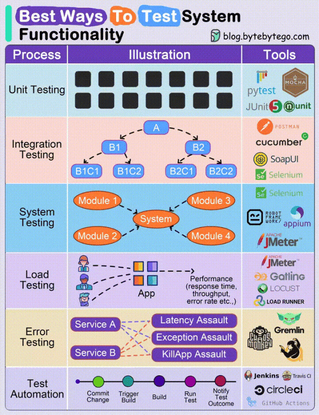

## 1. 程序测试

测试系统功能是为了确保系统或软件的各个部分都能按照设计和需求正常工作的一个过程。

这个过程可以帮助开发人员和测试人员发现和修复系统中的缺陷、错误或其他问题，确保其稳定性、性能和可靠性。此外，它也确保软件能够满足用户的需求和预期。

下图对于各种类型最佳测试方式的总结：

1. 单元测试：确保代码的各个单元能够独立地正常工作。
2. 集成测试：确保系统的各个部分能够和谐地协同工作。
3. 系统测试：全面检测系统是否满足用户的需求和期望的性能。
4. 负载测试：检测系统在高负载情况下的表现，并找出性能问题。
5. 错误测试：观察软件如何处理非法输入和出现的错误情况。
6. 自动化测试：为了提高效率、确保测试的重复性并减少出错，自动执行测试流程。

## 2. 单元测试

> 摘录维基百科：在计算机编程中，单元测试又称为模块测试，是针对程序模块来进行正确性检验的测试工作。程序单元是应用的最小可测试部件。在过程化编程中，一个单元就是单个程序、函数、过程等；对于面向对象编程，最小单元就是方法，包括基类、抽象类、或者派生类中的方法。

单元测试（Unit Testing）顾名思义就是测试一个单元，这里的单元通常指一个函数或类，区别于集成测试中的模块和系统。集成测试的测试过程通常存在跨系统模块的调用，是一种端到端的测试；而单元测试关注对象的颗粒度较小，用来保障一个类或者函数是否按照预期正确的执行。

简单来说，在 Java 中，一个类就是一个单元。开发者编写的一小段代码，用来检验某个类中的某个方法是否正确执行。可以让符合条件的方法独立运行(不依赖 main 方法)。
