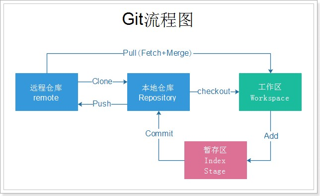
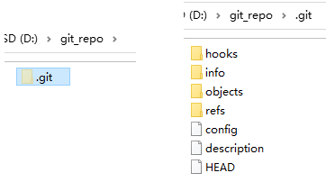
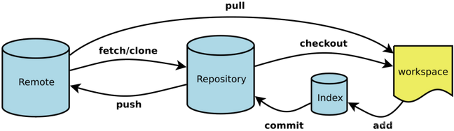
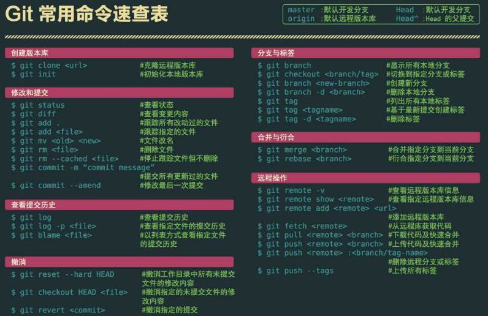
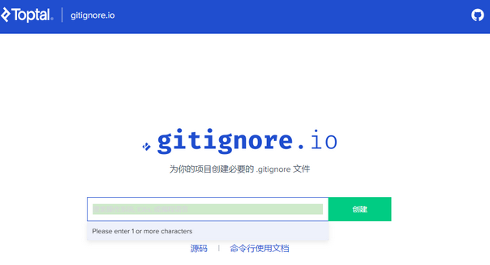
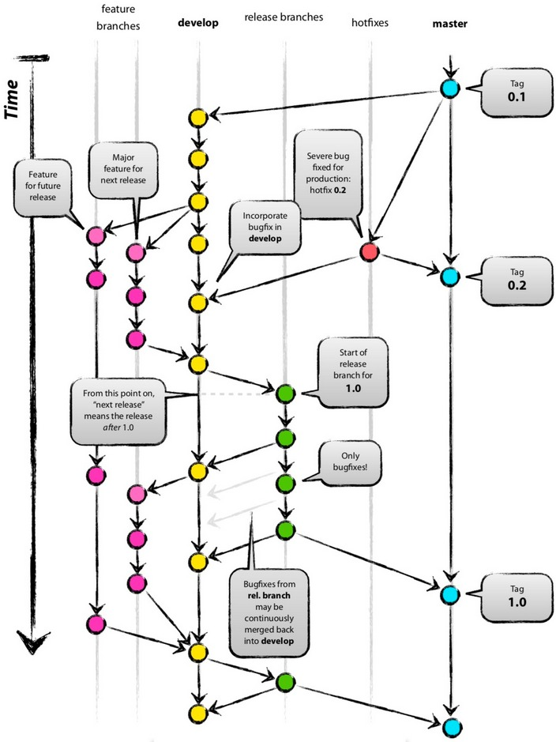

# Git 基础笔记

## 1. Git 概述

### 1.1. Git 简介与特点

Git是分布式的版本控制工具，其特点如下：

- 速度快
- 简单的设计
- 对非线性开发模式的强力支持（允许上千个并行开发的分支）
- 完全分布式
- 有能力高效管理类似 Linux 内核一样的超大规模项目（速度快和数据多）

### 1.2. Git 与 SVN 对比

#### 1.2.1. SVN

SVN是<font color=red>**集中式版本控制软件**</font>，版本库是集中放在中央服务器的。每个程序员使用自己电脑，首先要从中央服务器哪里得到最新的版本，编程完将完成的代码推送到中央服务器。集中式版本控制系统是必须联网才能工作

标准的集中式版本控制工具管理方式：


集中管理方式在一定程度上看到其他开发人员在干什么，而管理员也可以很轻松掌握每个人的开发权限。但是相较于其优点而言，集中式版本控制工具缺点很明显：

1. 服务器单点故障，一旦宕机无法提交代码，即容错性较差
3. 离线无法提交代码，无法及时记录开发人员的提交行为

<font color=red>每天都同步一次即可，需要手动同步上传代码</font>

#### 1.2.2. Git

Git是<font color=red>**分布式版本控制软件**</font>，它可以没有中央服务器，每个人的电脑就是一个完整的版本库。工作的时候就不需要联网了，因为版本都是在自己的电脑上。当多人开发时，只需把各自的修改推送到远程仓库，就可以所有成员都可以看到修改了。

分布式版本控制工具管理方式：


#### 1.2.3. 总结

1. svn 是集中式版本控制工具，git 是分布式版本控制工具
2. svn 不支持离线提交，git 支持离线提交代码

### 1.3. Git 工作流程

1. 从远程仓库中克隆 Git 资源作为本地仓库。
2. 从本地仓库中checkout代码然后进行代码修改
3. 在提交前先将代码提交到暂存区。
4. 提交修改。提交到本地仓库。本地仓库中保存修改的各个历史版本。
5. 在修改完成后，需要和团队成员共享代码时，可以将代码push到远程仓库。

Git 的工作流程图



### 1.4. Git 相关概念

**相关名词**

- 本地仓库：是在开发人员自己电脑上的Git仓库，存放开发者的代码(.git 隐藏文件夹就是本地仓库)
- 远程仓库：是在远程服务器上的Git仓库，存放代码(可以是github.com或者gitee.com 等开源代码仓库，或者自家公司的服务器)
- 工作区: 本地编写代码(文档)的地方
- 暂存区: 在本地仓库中的一个特殊的文件(index) 叫做暂存区，临时存储开发者即将要提交的文件


**相关操作**

- `Clone`：克隆，就是将远程仓库复制到本地仓库
- `Push`：推送，就是将本地仓库代码上传到远程仓库
- `Pull`：拉取，就是将远程仓库代码下载到本地仓库，并将代码克隆到本地工作区

## 2. Git 安装

> 此部分内容详见[《Git 笔记 - 安装篇》](/DevOps/版本管理工具/Git-02-安装)

## 3. Git 本地仓库

### 3.1. 创建版本库

什么是版本库呢？版本库又名仓库，英文名 repository，可以简单理解成一个目录，这个目录里面的所有文件都可以被 Git 管理起来，每个文件的修改、删除，Git 都能跟踪，以便任何时刻都可以追踪历史，或者在将来某个时刻可以“还原”。由于 git 是分布式版本管理工具，所以 git 在不需要联网的情况下也具有完整的版本管理能力。

创建一个版本库非常简单，可以使用 git bash 命令窗口也可以使用其他图形化客户端。

1. 创建一个空目录（如 `D:\git_repo`）
2. 在当前目录中点击右键中选择【Git Bash Here】来启动


3. 输入 `git init` 命令创建仓库


### 3.2. 仓库内容介绍

初始化的仓库，会生成一个 `.git` 的隐藏目录，里面相关 git 的配置、钩子、记录等等信息



- 版本库：`.git` 目录就是版本库，提交的文件都需要保存到版本库中。
- 工作目录：包含 `.git` 文件夹的目录，也就是 `.git` 目录的上一级目录就是工作目录。只有工作目录中的文件才能保存到版本库中。

> Notes: 一个git版本库一般只存放一个项目（一个项目对应一个文件夹）。

## 4. Git 远程仓库

在本地创建了一个 Git 仓库，又想让其他人来协作开发，此时就可以把本地仓库同步到远程仓库，同时还增加了本地仓库的一个备份。

市面上常用的远程仓库有 github、gitee、gitlab 等等

> Notes: 此部分的内容详见[《GitHub 笔记》](/DevOps/版本管理工具/GitHub)

## 5. 分支 (branch)（整理中）

### 5.1. 分支的概念

几乎所有的版本控制系统都以某种形式支持分支。使用分支意味着可以把开发者本地工作区从开发主线上分离开来，避免影响开发主线。多线程开发，可以同时开启多个任务的开发，多个任务之间互不影响。

### 5.2. 创建分支

## 6. 标签 (tag)（整理中）

### 6.1. 标签的概念

如果项目达到一个重要的阶段，并希望永远记住那个特别的提交快照，可以给它打上标签(tag)

比如说，想为项目发布一个"1.0"版本。可以给最新一次提交打上（HEAD）"v1.0"的标签。标签可以理解为项目里程碑的一个标记，一旦打上了这个标记则，表示当前的代码将不允许提交

### 6.2. 标签的创建（图形化界面操作）

标签的创建和分支的创建操作几乎一样


### 6.3. 标签的切换与删除


## 7. Git 命令

掌握并熟练使用了命令行模式操作 git 的话，会发现某些操作命令行比窗口化操作要简单。一般来说，日常使用 git 只要记住下图6个命令，就可以了。



> Notes: <font color=red>以下章节的命令中，`[]` 包裹的代表可以省略</font>

### 7.1. 常用命令速查表



### 7.2. Git 配置命令

Git 的设置文件为 `.gitconfig`，它可以在用户主目录下（全局配置），也可以在项目目录下（项目配置）。在安装好后首次使用前，需要先进行全局配置。通过相关的命令设置全局信息会保存在 `~/.gitconfig` 文件中。

#### 7.2.1. 配置全局的用户信息

在空白位置打开右键菜单，点击【Git Bash Here】，打开Git命令行窗口。输入以下命令配置提交时全局的用户名与邮箱

```bash
$ git config --global user.name "用户名"
$ git config --global user.email "邮箱地址"
```

> Tips: `--global` 可以省略

#### 7.2.2. 编辑 Git 配置文件

```bash
$ git config -e [--global]
```

#### 7.2.3. 查看配置信息

```bash
# 查看当前 git 全部的配置信息
$ git config --list
# 查看当前 git 指定的配置信息
$ git config [--global] user.name
```

查看指定的设置值


### 7.3. 常用操作命令

#### 7.3.1. 本地仓库初始化

执行以下命令，初始化 git 仓库，即由 git 来管理此目录

```bash
# 在空的目录中
$ git init

# 新建一个目录，将其初始化为 Git 代码库
$ git init [project-name]

# 初始化仓库不带工作区
$ git init --bare
```

> 执行之后会在项目目录下创建【`.git`】的隐藏目录，这个目录是Git所创建的，不能删除，也不能随意更改其中的内容。

#### 7.3.2. 查看仓库当前状态

用于查询当前仓库中有那些文件存在变动

```bash
# 查看状态
$ git status
# 查看状态 使输出信息更加简洁
git status –s
```

#### 7.3.3. 添加文件到缓存区

`git add` 指令，用于添加单个（多个）文件到缓存区。

添加单个文件

```bash
$ git add 文件名
```

同时添加多个文件

```bash
$ git add 文件名1 文件名2 文件名3 …
```

添加指定目录到暂存区，包括子目录

```bash
$ git add 目录名称
```

添加当前目录中所有文件到缓存区。

```bash
$ git add .
```

添加每个变化前，都会要求确认。对于同一个文件的多处变化，可以实现分次提交

```bash
$ git add -p
```

#### 7.3.4. 取消缓存区的文件

将暂存区的文件取消暂存指定的文件(取消 `add`)

```bash
$ git reset 文件名
```

#### 7.3.5. 删除本地工作区文件

删除工作区文件，并且将这次删除放入暂存区

```bash
$ git rm <文件名1> <文件名2>...
```

停止追踪指定文件，但该文件会保留在工作区

```bash
$ git rm --cached <文件名>
```

#### 7.3.6. 修改文件名

修改文件名称，并且将这个改名后文件放入暂存区

```bash
$ git mv <file-original> <file-renamed>
```

#### 7.3.7. 提交至版本库

`git commit` 指令，将当前缓存区的内容提交到版本库。

- `-m` 参数用于指定本次提交的注释。**注意：注释的内容必须使用`""`英文双引号包裹**
- `<文件名>` 非必需，可以指定提交某个文件

```bash
# 提交指定的文件到与注释信息到版本库
$ git commit -m "注释内容" <文件名>

# 提交暂存区的指定文件到版本库
$ git commit [file1] [file2] ... -m [message]

# 提交工作区自上次commit之后的变化，直接到版本库
$ git commit -a

# 提交时显示所有diff信息
$ git commit -v

# 使用一次新的commit，替代上一次提交。如果代码没有任何新变化，则用来改写上一次commit的提交信息
$ git commit --amend -m [message]

# 重做上一次commit，并包括指定文件的新变化
$ git commit --amend [file1] [file2] ...
```

#### 7.3.8. 回退本工作区库误删文件

```bash
$ git checkout head <文件名>
```1.1.1. 
#### 7.3.9. 查看版本

`git log` 指令，用于查看当前git的提交记录（版本）

```bash
$ git log
```

参数 `--pretty=oneline`，将每个git的提交记录在一行显示

```bash
$ git log --pretty=oneline
```

#### 7.3.9. 版本回退

`git reset` 指令用于版本的回退

```bash
$ git reset --hard 提交编号
```

> 注：”提交编号“是通过 `git log` 指令查看
>
> 在使用回退指令的时候 commit id 可以不用写全，git会自动识别，但是至少需要写前4位字符

#### 7.3.10. 查看历史版本

如果发生版本回退的操作，此时使用`git log`就无法查询回退到此版本之前的操作记录，所以需要使用 `git reflog` 指令来查看历史操作，获取最新的 commit id

```bash
$ git reflog
```

### 7.4. 远程仓库操作命令

#### 7.4.1. 克隆远程仓库到本地

`clone` 指令用于克隆远程仓库到本地

```bash
$ git clone 远程Git仓库地址
```

> 注：远程仓库分两种，基于http/https协议或者基于ssh协议

#### 7.4.2. 查看远程

查看远程，列出指定的每一个远程服务器的简写

```bash
$ git remote
```

查看远程，列出简称和地址

```bash
$ git remote -v
```

查看远程仓库详细地址

```bash
$ git remote show <仓库简称>
```

#### 7.4.3. 添加/移除远程仓库

添加远程仓库

```bash
$ git remote add <shortname> <url>
```

移除远程仓库和本地仓库的关系(只是从本地移除远程仓库的关联关系，并不会真正影响到远程仓库)

```bash
$ git remote rm <shortname>
```

#### 7.4.4. 推送到远程仓库

`push` 指令用于将修改的版本推送到远程仓库某个分支

```bash
$ git push [remote-name] [branch-name]
```

基于http/https协议的远程仓库，首次提交时可能会出现403无权限的错误，需要修改【.git/config】文件内容，增加相应远程仓库的有效的用户名与密码

```
# 原配置
[remote "origin"]
	url = https://github.com/用户名/仓库名.git

# 修改为
[remote "origin"]
	url = https://用户名:密码@github.com/用户名/仓库名.git
```

> 注：推送到基于ssh协议的远程仓库，在push的时候并没有提示要求输入帐号密码，因为公私玥已经实现了用户身份鉴权，也不需要修改此配置文件。

#### 7.4.5. 远程仓库拉取版本

##### 7.4.5.1. 手动拉取与合并

从远程仓库拉取 (拉取到.git 目录，不会合并到工作区，工作区发生变化)

```bash
$ git fetch <shortname> <分支名称>
```

手动合并。把某个版本的某个分支合并到当前工作区

```bash
$ git merge <shortname>/<分支名称>
```

##### 7.4.5.2. 自动拉取与合并工作区

`pull` 指令用于拉取远程仓库的版本记录。(拉取到 .git 目录，合并到工作区，工作区不发生变化。相当于 `fetch` + `merge`)

```bash
$ git pull <shortname> <分支名称>
```

> 拉取时如果出现版本冲突，需要手动进行冲突的合并

注意：如果当前本地仓库不是从远程仓库克隆，而是本地创建的仓库，并且仓库中存在文件，此时再从远程仓库拉取文件的时候会报错（fatal: refusing to merge unrelated histories），解决此问题可以在 `git pull` 命令后加入参数 `--allow-unrelated-histories`

```bash
# 强制拉取合并
$ git pull <shortname> <分支名称> --allow-unrelated-histories
```

### 7.5. 分支管理命令

默认分支名称为 master。*2020年Github开始修改为 main*

#### 7.5.1. 查看分支

```bash
$ git branch
```

> 注意：当前的分支前面有个标记“`*`”。

列出所有远程分支

```bash
$ git branch -r
```

列出所有本地分支和远程分支

```bash
$ git branch -a
```

#### 7.5.2. 创建分支

```bash
$ git branch <分支名>
```

#### 7.5.3. 切换分支

```bash
$ git checkout <分支名>
```

#### 7.5.4. 删除分支

```bash
$ git branch -d <分支名>
```

> 注意：在删除分支的时候，一定要先退出要删除的分支（或切换到其他分支），然后才能删除该分支。或者如果分支已经修改过，则不允许删除。

强制删除分支（慎用）

```bash
$ git branch -D <分支名>
```

#### 7.5.5. 合并分支

```bash
$ git merge 被合并的分支名
```

合并分支需要先使用 `checkout` 切换到待合并到的分支，然后再使用 `merge` 指令指定要合并的分支。<font color=red>**需要注意：合并所有分支之后，需要使用 `push` 指令推送到远程仓库中**</font>

#### 7.5.6. 提交分支至远程仓库

```bash
$ git push <仓库简称> <分支名称>
```

#### 7.5.7. 删除远程仓库分支

```bash
$ git push origin –d 分支名称
```

### 7.6. 标签（tag）命令

#### 7.6.1. 查看 tag 信息

列出所有tag

```bash
$ git tag
```

查看tag详细信息

```bash
$ git show [tagName]
```

#### 7.6.2. 新建一个 tag

```bash
$ git tag [tagName]
```

#### 7.6.3. 提交指定 tag

```bash
$ git push [仓库简称] [tagName]
```

#### 7.6.4. 新建一个分支指向某个 tag

```bash
$ git checkout -b [branch] [tag]
```

#### 7.6.5. 删除本地 tag

```bash
$ git tag -d [tag]
```

#### 7.6.6. 删除远程 tag (注意 空格)

**注意空格**

```bash
$ git push origin :refs/tags/[tag]
```

### 7.7. 其他命令

生成一个可供发布的压缩包

```bash
$ git archive
```

## 8. Git 仓库的特殊文件

### 8.1. .gitkeep 文件

`.gitkeep`文件是用来保证当前目录即使为空，也会上传到github上

### 8.2. .gitignore 忽略规则文件（待整理）

`.gitignore` 的文件用于声明忽略文件或不忽略文件的规则，**规则对当前目录及其子目录生效**。

> 注意：该文件因为没有文件名，没办法直接在windows目录下直接创建（*win10系统后来一些版本可以直接创建没有文件名的文件*），可以通过命令行 Git Bash 来 `touch` 指令来创建。

#### 8.2.1. 忽略文件语法规范

- 忽略所有 `.a` 的文件

```
*.a
```

- 否定忽略 `lib.a`，尽管已经在前面忽略了所有 `.a` 文件

```
!lib.a
```

- 忽略 `build/` 文件夹下的所有文件

```
/build/
```

- 忽略指定目录下的所有 `.txt` 文件（不包含其子目录）。例如：`/doc/notes.txt`，但不包括 `doc/server/arch.txt`

```
/doc/*.txt
```

- 忽略所有在 doc 目录及其子目录的 `.pdf` 文件

```
doc/**/*.pdf
```

#### 8.2.2. Gitignore 参考模板

初用 Git 的工程师，都有着一个苦恼，每次都得针对不同项目、不同语言类型来重复写 .gitignore，以忽略一些无需纳入 Git 管理的文件。[Gitignore](https://github.com/github/gitignore)项目就是帮工程师解决这个问题的。每次需要为项目创建 .gitignore 文件时，只需要打开这个项目，针对你当前所用编程语言或框架，去寻找对应 .gitignore 模板替换即可。

如果觉得挨个模板查阅很费劲，推荐一个网站：[gitignore.io](https://www.toptal.com/developers/gitignore)，支持一键搜索你所需的 gitignore 模板。



### 8.3. .gitconfig 配置文件

在 OS X 和 Linux 下，Git 的配置文件储存在 `~/.gitconfig`。在 windows 系统中，存储在`%HOMEPATH%\.gitconfig`

# Git 扩展知识

## 1. git 分支命名规范

**Git 常用分支命名**

|   分支   |      命名       |                         说明                         |
| :------: | :-------------: | ---------------------------------------------------- |
|  主分支  | `master`/`main` | 主分支，所有提供给用户使用的正式版本，都在这个主分支上发布 |
| 开发分支 | `dev`/`develop` | 开发分支，永远是功能最新最全的分支                       |
| 功能分支 |   `feature-*`   | 新功能分支，某个功能点正在开发阶段                       |
| 发布版本 |   `release-*`   | 发布定期要上线的功能                                   |
| 修复分支 |     `bug-*`     | 修复线上代码的 bug                                     |

**git 常用分支说明**

- `master`
    - 主分支，永远是可用的、稳定的、可直接发布的版本，不能直接在该分支上开发。只有计划发布的版本功能在`develop`分支上全部完成，而且测试没有问题了才会合并到`master`上。
- `develop`
    - 开发主分支，代码永远是最新，所有新功能以这个分支来创建自己的开发分支，该分支只做只合并操作，不能直接在该分支上开发
    - 例如要开发一个注册功能，那么就会从`develop`分支上创建一个`feature`分支`fb-register`，在`fb-register`分支上将注册功能完成后，将代码合并到`develop`分支上。这个`fb-register`就完成了它的使命，可以删除了。如果再需要开发一个登录功能，按刚刚上述操作流程再次进行
- `feature-xxx`
    - 功能开发分支，在`develop`上创建分支，以自己开发功能模块命名，功能测试正常后合并到`develop`分支
- `release`
    - 预分布分支，在合并好`feature`分支的`develop`分支上创建，主要是用来测试bug的分支，修改好bug并确定稳定之后合并到`develop`和`master`分支，然后发布`master`分支
- `release-fix`
    - 功能bug修复分支，在`release`上创建分支修复，修复好测试出来的bug之后合并回`release`分支。
- `hotfix-xxx`
    - 紧急bug修改分支，项目上线之后可以会遇到一些环境问题需要紧急修复，在`master`分支上创建，流程跟`release`分支相似，修复完成后合并到`develop`和`master`分支

**开发项目时git分支管理流程图**



***注意事项：***

- 一个分支尽量开发一个功能模块，不要多个功能模块在一个分支上开发。
- 开发过程中，如果组员A开发的功能依赖组员B正在开发的功能，可以待组员B开发好相关功能之后，组员A直接pull组员B的分支下来开发，不需要先将组员B的分支merge到develop分支。
- feature 分支在申请合并之前，最好是先 pull 一下 develop 主分支下来，看一下有没有冲突，如果有就先解决冲突后再申请合并。

## 2. git提交规范

### 2.1. 中文式提交格式参考

```
<新功能|bug修复|文档改动|格式化|重构|测试代码>: (影响范围) <主题>
# 解释为什么要做这些改动
issue #?
```

### 2.2. 提交类型

关于 commit 时类别，一般通用的如下

- feat：新功能（feature）
- fix：修复bug
- docs：文档（documentation）变动
- style：格式（不影响代码运行的变动），如格式化，缺失分号等，但不包括生产时紧急的bug修复
- refactor：重构（即不是新增功能，也不是修改bug的代码变动）
- perf：代码优化
- test：增加测试
- build：构建工具或外部依赖的更改，比如后端maven，前端package，json等
- ci：更改项目级的配置文件或脚本
- chore：构建过程或辅助工具的变动，除上面之外的修改
- revert：撤销先前的提交

### 2.3. 提交注释示例

```
<类型>: <主题>

# 解释为什么要做这些改动（限制每行72个字）

# ----------------------------------------------
# 注意：
# 提交模板的内容，如果最左侧带"#"，内容不会提交到git中
# 主题和内容以一个空行分隔
# 主题限制为最大50个字
# 主题行结束不用标点
# 内容每行72个字
# 内容用于解释为什么和是什么，而不是怎么做
# ----------------- 例子 -------------------------
# feat: 增加账号激活功能
#
# 因为账号初始化时......
# ......
# 所以......
# ---------------- 例子结束 -----------------------
```

## 3. 免费源代码托管网站

### 3.1. GitHub

> 官网：https://github.com/

### 3.2. 码云（Gitee）

> 网址：https://gitee.com/

开源中国旗下的代码托管平台：码云（Gitee）。是开源中国社区团队（深圳市奥思网络科技有限公司）推出的基于Git的免费代码托管平台，并且为开发者提供云端软件开发协作平台。无论是个人、团队、或者是企业，都能够用码云实现代码托管、项目管理与协作开发。

码云提供开源软件服务和企业服务，是最为接近GitHub功能的国产开发平台。码云上目前已经有超过10万家企业/机构入驻，其中不乏招商银行、比亚迪汽车等大牌厂商。码云近期也通过了通过 ISO27001:2013 信息安全管理体系认证及 ISO9001:2015 质量管理体系认证，可以说是国内比较先发、规模比较领先的代码托管平台。

7 月 14 日，工业和信息化部技术发展司公布了 「2020 年开源托管平台项目」的招标结果，由深圳市奥思网络科技有限公司（开源中国）牵头，与国家工业信息安全发展研究中心等 10 家单位组成的联合体中标该项目，联合体将依托码云建设中国独立的开源托管平台。

### 3.3. Coding.net

> 网址：https://coding.net/

Coding.net是深圳市腾云扣钉科技有限公司推出的产品。与GitHub和码云的定位不同，Coding.net重点面向团队和企业的代码协作开发服务，而没有将开源软件作为重点。Coding.net的特色包括在最开始就主推Web IDE的开发模式，通过与腾讯云的合作，提供了免费及时部署调试的环境，形成了差异化的竞争。

Coding.net的项目管理包含任务、讨论、文件等功能，支持多成员协作，并且深度集成了代码仓库的操作与状态。此外，还提供社会化协作功能，支持移动客户端。

随着Github免费策略的推进，CODING 也已经顺势开放所有基础功能（项目协同、代码托管、CI/CD 等）免费使用，不限成员数，帮助国内开发者零成本开始研发协作。

### 3.4. Agit.ai

> 网址：https://agit.ai/

国内人工智能开发者绝对不能错过的平台：Agit.ai。是阿吉特云计算有限公司（澳门）推出的产品，其定位上更为国际化。Agit.ai的界面是熟悉的GitHub风格，并且同样也是面向开源软件。从平台更新历史上看，Agit.ai是2020年7月上线的新平台，在项目管理和其他协同开发功能上具备基本的Git服务，但与码云还是略有差距，积累的开源仓库也不够丰富。

但Agit.ai独特的定位让人眼前一亮。如同其首页文字所述，Agit.ai专门面向AI开发人员。AI开发有何不同？Agit.ai提供了仓库代码运行服务，可直接选择算力启动AI算法的训练，并支持在线Tensorboard观察训练过程。另外，Agit.ai目前的算力是免费使用，其中还包括了有4块GPU卡的算力（不知道这样的算力羊毛能薅多久）。

Agit.ai为开发者提供集成了Tensorflow、Pytorch、Ray等常用AI库的开发环境镜像，以及一键式运行的的分布式计算资源，每一个为了环境搭建而苦恼的算法攻城狮，看到之后都应该会倍感欣慰。独特的匿名分享功能简直就是为了论文投稿的双盲评审而生，也可以从中看到浓浓的学术背景。

### 3.5. BitBucket

> 网址：https://bitbucket.org/

它可以免费提供无限制的私人和公共仓库，可以为最多五个会员使用。它的功能包括，代码搜索、BitBucket 管道、合并请求、智能镜像、问题单跟踪、灵活的部署模式、IP 白名单以及保护工作成果的分支权限。

值得注意的是，它让用户可以使用任何 Git 客户端或 Git 命令行来推送文件。并且 BitBucket 可以部署在云端、数据中心或本地服务器上。

## 4. fatal detected dubious ownership in repository at 解决办法

问题描述：在git仓库中执行 `git pull` 命令时，提示：`fatal: detected dubious ownership in repository`。这是因为 git 担心的权限安全策略导致的报错，可以按提示把某个（或多个）目录添加到信任列表

```shell
git config --global --add safe.directory D:/www/your-project
git config --global --add safe.directory D:/www/other-project
```

也可以通过加通配符为`*`，将所有文件夹都添加到信任列表。需要注意，该处理方法一般适用于只有本人一个用户使用的电脑，确保无其它用户，否则存在安全问题。

```shell
git config --global --add safe.directory "*"
```

## 5. git 钩子

### 5.1. 本地禁止提交(commit)到 master 分支

一般 master 分支只能从其他分支合并代码，为了防止意外提交和开发者随意提交到 master 分支。可以通过提交前钩子来禁止提交到 master 分支，在 git 项目目录下添加 `.git/hooks/pre-commit` 文件，添加内容如下：

```
#!/bin/sh
branch=$(git rev-parse --symbolic --abbrev-ref HEAD)
if [ "master" == "$branch" ]; then
  echo ".git/hooks: 不能commit到 $branch 分支"
  exit 1
fi
```

## 6. Git 命令进阶 - 经典操作场景

### 6.1. 提交操作(commit )

#### 6.1.1. 查看提交的历史

如果使用 `git commit -a` 提交了一次变化(changes)，而又不确定到底这次提交了哪些内容。此时就可以用下面的命令显示当前HEAD上的最近一次的提交(commit):

```shell
(main)$ git show
# 或者
$ git log -n1 -p
```

#### 6.1.2. 修改提交信息(commit message)

如果提交信息(`commit message`)写错了且这次提交(commit)还没有推送(push)，可以通过下面的方法来修改提交信息(`commit message`)：

```bash
$ git commit --amend --only
```

再次打开默认编辑器, 在这里可以重新编辑信息。另外也可以用以下一条命令一次完成：

```bash
$ git commit --amend --only -m 'xxxxxxx'
```

如果已经推送(push)了这次提交(commit)，则可以修改这次提交(commit)然后强推(`force push`)，但是不推荐这么做。

#### 6.1.3. 修改提交(commit)里的用户名和邮箱

如果只是单个提交(commit)，则通过以下命令修改：

```bash
$ git commit --amend --author "New Authorname <authoremail@mydomain.com>"  
```

> 如果需要修改所有历史，参考 'git filter-branch'的指南页.

#### 6.1.4. 从一个提交(commit)里移除一个文件

通过下面的方法，从一个提交(commit)里移除一个文件：

```bash
$ git checkout HEAD^ myfile
$ git add -A
$ git commit --amend
```

这将非常有用，当有一个开放的补丁(`open patch`)，往上面提交了一个不必要的文件，需要强推(`force push`)去更新这个远程补丁。

#### 6.1.5. 删除最后一次提交(commit)

如果需要删除已推送了的提交(`pushed commits`)，可以使用下面的方法。可是，这会不可逆的改变提交的历史，也会搞乱那些已经从该仓库拉取(pulled)了的人的历史。简而言之，如果不是很确定，千万不要这么做。

```bash
$ git reset HEAD^ --hard
$ git push -f [remote] [branch]
```

如果还没有推送到远程，把Git重置(reset)到最后一次提交前的状态就可以了(同时保存暂存的变化):

```bash
(my-branch*)$ git reset --soft HEAD@{1}
```

以上只能用在没有推送之前。如果已经推送了，唯一安全能做的是 `git revert SHAofBadCommit`， 那会创建一个新的提交(commit)用于撤消前一个提交的所有变化(changes)；或者如果推送的这个分支是rebase-safe的 (例如：其它开发者不会从这个分支拉取)，则只需要使用 `git push -f`。

#### 6.1.6. 删除任意提交(commit)

> Notes: <font color=red>**同样的警告，不到万不得已的时候不要这么做。**</font>

```bash
$ git rebase --onto SHA1_OF_BAD_COMMIT^ SHA1_OF_BAD_COMMIT
$ git push -f [remote] [branch]  
```

或者做一个 交互式rebase 删除那些想要删除的提交(commit)里所对应的行。

#### 6.1.7. 尝试推一个修正后的提交(amended commit)到远程，但是报错：

```
To https://github.com/yourusername/repo.git  
! [rejected]        mybranch -> mybranch (non-fast-forward)  
error: failed to push some refs to 'https://github.com/tanay1337/webmaker.org.git'  
hint: Updates were rejected because the tip of your current branch is behind  
hint: its remote counterpart. Integrate the remote changes (e.g.  
hint: 'git pull ...') before pushing again.  
hint: See the 'Note about fast-forwards' in 'git push --help' for details.  
```

注意，rebasing(见下面)和修正(amending)会用一个**新的提交(commit)代替旧的**，所以如果之前已经往远程仓库上推过一次修正前的提交(commit)，那现在就必须强推(`force push`) (`-f`)。注意*总是*确保指明一个分支!

```bash
(my-branch)$ git push origin mybranch -f
```

一般来说，**要避免强推**。最好是创建和推(push)一个新的提交(commit)，而不是强推一个修正后的提交。后者会使那些与该分支或该分支的子分支工作的开发者，在源历史中产生冲突。

#### 6.1.8. 做了一次硬重置(hard reset)，想找回之前内容

如果意外的做了 `git reset --hard`，通常能找回之前提交(commit)，因为Git对每件事都会有日志，且都会保存几天。

```bash
(main)$ git reflog
```

将会看到一个过去提交(commit)的列表和一个重置的提交。选择想要回到的提交(commit)的SHA，再重置一次：

```bash
(main)$ git reset --hard SHA1234
```

### 6.2. 暂存(Staging)

#### 6.2.1. 把暂存的内容添加到上一次的提交(commit)

```bash
(my-branch*)$ git commit --amend
```

#### 6.2.2. 暂存一个新文件的一部分，而不是这个文件的全部

如果想暂存一个文件的一部分，可这样做：

```bash
$ git add --patch filename.x
```

`-p` 简写。这会打开交互模式，将能够用 `s` 选项来分隔提交(commit)；然而如果这个文件是新的，会没有这个选择，添加一个新文件时可以使用以下操作：

```bash
$ git add -N filename.x
```

然后需要使用 `e` 选项来手动选择需要添加的行，执行 `git diff --cached` 将会显示哪些行暂存了哪些行只是保存在本地了。

#### 6.2.3. 在一个文件里的变化(changes)加到两个提交(commit)里

`git add` 会把整个文件加入到一个提交；`git add -p` 允许交互式的选择想要提交的部分。

#### 6.2.4. 把暂存的内容变成未暂存，把未暂存的内容暂存起来

多数情况下，应该将所有的内容变为未暂存，然后再选择想要的内容进行commit。但假定需要这么做，可以创建一个临时的commit来保存已暂存的内容，然后暂存那些未暂存的内容并进行stash。然后reset最后一个commit将原本暂存的内容变为未暂存，最后stash pop回来。

```bash
$ git commit -m "WIP"
$ git add .  
$ git stash  
$ git reset HEAD^  
$ git stash pop --index 0  
```

> Notes: 
>
> 1. 这里使用`pop`仅仅是因为想尽可能保持幂等。
> 2. 假如不加上`--index`，会把暂存的文件标记为存储。

### 6.3. 未暂存(Unstaged)的内容

#### 6.3.1. 把未暂存的内容移动到一个新分支

```bash
$ git checkout -b my-branch
```

#### 6.3.2. 把未暂存的内容移动到另一个已存在的分支

```bash
$ git stash
$ git checkout my-branch
$ git stash pop
```

#### 6.3.3. 丢弃本地未提交的变化(uncommitted changes)

如果只是想重置源(origin)和本地(local)之间的一些提交(commit)，使用以下命令：

```bash
# one commit  
(my-branch)$ git reset --hard HEAD^
# two commits  
(my-branch)$ git reset --hard HEAD^^
# four commits  
(my-branch)$ git reset --hard HEAD~4
# or  
(main)$ git checkout -f
```

重置某个特殊的文件，可以用文件名做为参数：

```bash
$ git reset filename
```

#### 6.3.4. 丢弃某些未暂存的内容

如果想丢弃工作拷贝中的一部分内容，而不是全部。签出(checkout)不需要的内容，保留需要的。

```bash
$ git checkout -p
# Answer y to all of the snippets you want to drop
```

另外一个方法是使用 `stash`，Stash 所有要保留下的内容，重置工作拷贝，重新应用保留的部分。

```bash
$ git stash -p
# Select all of the snippets you want to save
$ git reset --hard
$ git stash pop
```

或者 stash 不需要的部分，然后 stash drop。

```bash
$ git stash -p
# Select all of the snippets you don't want to save
$ git stash drop
```

### 6.4. 分支(Branches)

#### 6.4.1. 从错误的分支拉取了内容，或把内容拉取到了错误的分支

这是另外一种使用 `git reflog` 情况，找到在这次错误拉(pull) 之前HEAD的指向。

```bash
(main)$ git reflog
ab7555f HEAD@{0}: pull origin wrong-branch: Fast-forward
c5bc55a HEAD@{1}: checkout: checkout message goes here
```

重置分支到所需的提交(desired commit)：

```bash
$ git reset --hard c5bc55a
```

#### 6.4.2. 扔掉本地的提交(commit)，让本地分支与远程的保持一致

先确认没有推送(push)本地的内容到远程。使用`git status` 命令显示领先(ahead)源(origin)多少个提交：

```bash
(my-branch)$ git status  
# On branch my-branch  
# Your branch is ahead of 'origin/my-branch' by 2 commits.  
#   (use "git push" to publish your local commits)  
#
```

另一种方法：

```bash
(main)$ git reset --hard origin/my-branch
```

#### 6.4.3. 提交到一个新分支，但错误的提交到了 main/master

在main下创建一个新分支，不切换到新分支，仍在main下:

```bash
(main)$ git branch my-branch
```

把 main 分支重置到前一个提交：

```bash
(main)$ git reset --hard HEAD^
```

> Tips: `HEAD^` 是 `HEAD^1` 的简写，可以通过指定要设置的`HEAD`来进一步重置。

或者，如果不想使用 `HEAD^`，找到想重置到的提交(commit) 的 hash(`git log` 能够完成)，然后重置到这个hash。使用`git push` 同步内容到远程。

例如，main 分支想重置到的提交的 hash 为`a13b85e`：

```bash
(main)$ git reset --hard a13b85e
HEAD is now at a13b85e
```

签出(checkout)刚才新建的分支继续工作：

```bash
(main)$ git checkout my-branch
```

#### 6.4.4. 保留来自另外一个ref-ish的整个文件

假设正在做一个原型方案(原文为working spike (see note))，有成百的内容，每个都工作得很好。现在，提交到了一个分支，保存工作内容：

```bash
(solution)$ git add -A && git commit -m "Adding all changes from this spike into one big commit."
```

当想要把它放到一个分支里 (可能是`feature` 或者 `develop`)，关心是保持整个文件的完整，想要一个大的提交分隔成比较小。假设：

- 分支 `solution`，拥有原型方案，领先 `develop` 分支
- 分支 `develop`，在这里应用原型方案的一些内容

可以通过把内容拿到 `develop` 分支里，来解决这个问题：

```bash
(develop)$ git checkout solution -- file1.txt
```

这会把这个文件内容从分支 `solution` 拿到分支 `develop` 里来：

```
# On branch develop  
# Your branch is up-to-date with 'origin/develop'.  
# Changes to be committed:  
#  (use "git reset HEAD <file>..." to unstage)  
#  
#        modified:   file1.txt 
```

然后正常提交

#### 6.4.5. 把几个提交(commit)提交到了同一个分支，而这些提交应该分布在不同的分支里

假设有一个`main`分支，执行`git log`，看到做过两次提交：

```bash
(main)$ git log  
  
commit e3851e817c451cc36f2e6f3049db528415e3c114  
Author: Alex Lee <alexlee@example.com>  
Date:   Tue Jul 22 15:39:27 2014 -0400  
  
    Bug #21 - Added CSRF protection  
  
commit 5ea51731d150f7ddc4a365437931cd8be3bf3131  
Author: Alex Lee <alexlee@example.com>  
Date:   Tue Jul 22 15:39:12 2014 -0400  
  
    Bug #14 - Fixed spacing on title  
  
commit a13b85e984171c6e2a1729bb061994525f626d14  
Author: Aki Rose <akirose@example.com>  
Date:   Tue Jul 21 01:12:48 2014 -0400  
  
    First commit 
```

先用提交hash(commit hash)标记bug (`e3851e8` for #21, `5ea5173` for #14).

首先把`main`分支重置到正确的提交(`a13b85e`)：

```bash
(main)$ git reset --hard a13b85e
HEAD is now at a13b85e
```

对 `bug #21` 创建一个新的分支：

```bash
(main)$ git checkout -b 21
(21)$
```

接着，用` _cherry-pick_ `把对`bug #21`的提交放入当前分支。这意味着将应用(apply)这个提交(commit)，仅仅这一个提交(commit)，直接在HEAD上面。

```bash
(21)$ git cherry-pick e3851e8
```

此时这里可能会产生冲突，参见交互式 rebasing 章 **冲突节** 解决冲突。然后为 `bug #14` 创建一个新的分支, 也基于`main`分支

```bash
(21)$ git checkout main
(main)$ git checkout -b 14
(14)$
```

最后为 `bug #14` 执行 `cherry-pick`:

```bash
(14)$ git cherry-pick 5ea5173
```

#### 6.4.6. 删除上游(upstream)分支被删除了的本地分支

一旦在 github 上面合并(merge)了一个`pull request`，就可以删除 fork 里被合并的分支。如果不准备继续在这个分支里工作，删除这个分支的本地拷贝会更干净，使不会陷入工作分支和一堆陈旧分支的混乱之中。

```bash
$ git fetch -p
```

#### 6.4.7. 不小心删除了分支

如果定期推送到远程，多数情况下应该是安全的，但有些时候还是可能删除了还没有推到远程的分支。下面模拟这种场景，先创建一个分支和一个新的文件

```bash
(main)$ git checkout -b my-branch
(my-branch)$ git branch
(my-branch)$ touch foo.txt
(my-branch)$ ls
README.md foo.txt
```

添加文件并做一次提交

```bash
(my-branch)$ git add .  
(my-branch)$ git commit -m 'foo.txt added'  
(my-branch)$ foo.txt added  
 1 files changed, 1 insertions(+)  
 create mode 100644 foo.txt  
(my-branch)$ git log  
  
commit 4e3cd85a670ced7cc17a2b5d8d3d809ac88d5012  
Author: siemiatj <siemiatj@example.com>  
Date:   Wed Jul 30 00:34:10 2014 +0200  
  
    foo.txt added  
  
commit 69204cdf0acbab201619d95ad8295928e7f411d5  
Author: Kate Hudson <katehudson@example.com>  
Date:   Tue Jul 29 13:14:46 2014 -0400  
  
    Fixes #6: Force pushing after amending commits
```

现在切回到主(main)分支，删除`my-branch`分支

```bash
(my-branch)$ git checkout main
Switched to branch 'main'
Your branch is up-to-date with 'origin/main'.
(main)$ git branch -D my-branch
Deleted branch my-branch (was 4e3cd85).
```

而`reflog`是一个升级版的日志，它存储了仓库(repo)里面所有动作的历史。

```bash
(main)$ git reflog
69204cd HEAD@{0}: checkout: moving from my-branch to main
4e3cd85 HEAD@{1}: commit: foo.txt added
69204cd HEAD@{2}: checkout: moving from main to my-branch
```

有一个来自删除分支的提交hash(commit hash)，接下来恢复删除了的分支。

```bash
(main)$ git checkout -b my-branch-help
Switched to a new branch 'my-branch-help'
(my-branch-help)$ git reset --hard 4e3cd85
HEAD is now at 4e3cd85 foo.txt added
(my-branch-help)$ ls
README.md foo.txt 
```

Git的 `reflog` 在rebasing出错的时候也是同样有用的。

#### 6.4.8. 删除一个分支

删除一个远程分支：

```bash
(main)$ git push origin --delete my-branch
# 或者
(main)$ git push origin :my-branch
```

删除一个本地分支

```bash
(main)$ git branch -D my-branch
```

#### 6.4.9. 从别人正在工作的远程分支签出(checkout)一个分支

从远程拉取(fetch) 所有分支：

```bash
(main)$ git fetch --all
```

假设想要从远程的`daves`分支签出到本地的`daves`

```bash
(main)$ git checkout --track origin/daves
Branch daves set up to track remote branch daves from origin.
Switched to a new branch 'daves'
```

(`--track` 是 `git checkout -b [branch] [remotename]/[branch]` 的简写)。这样就得到了一个`daves`分支的本地拷贝, 任何推过(pushed)的更新，远程都能看到.

### 6.5. Rebasing 和合并(Merging)

#### 6.5.1. 撤销rebase/merge

可以合并(merge)或rebase了一个错误的分支, 或者完成不了一个进行中的rebase/merge。Git 在进行危险操作的时候会把原始的HEAD保存在一个叫``ORIG_HEAD`的变量里, 所以要把分支恢复到rebase/merge前的状态是很容易的。

```bash
(my-branch)$ git reset --hard ORIG_HEAD
```

#### 6.5.2. 已经rebase过, 但是我不想强推(force push)

如果想把这些变化(changes)反应到远程分支上，就必须得强推(`force push`)。是因快进(`Fast forward`)了提交，改变了Git历史, 远程分支不会接受变化(changes)，除非强推(force push)。

这就是许多人使用 merge 工作流，而不是 rebasing 工作流的主要原因之一，开发者的强推(force push)会使大的团队陷入麻烦。使用时需要注意，一种安全使用 rebase 的方法是，不要把你的变化(changes)反映到远程分支上，而是按下面的做:

```bash
(main)$ git checkout my-branch
(my-branch)$ git rebase -i main
(my-branch)$ git checkout main
(main)$ git merge --ff-only my-branch
```

#### 6.5.3. 组合(combine)几个提交(commit)

假设工作分支将会做对于 `main` 的 pull-request。一般情况下不关心提交(commit)的时间戳，只想组合**所有**提交(commit) 到一个单独的里面, 然后重置(reset)重提交(recommit)。确保主(main)分支是最新的和本地变化都已经提交了，然后

```bash
(my-branch)$ git reset --soft main
(my-branch)$ git commit -am "New awesome feature"
```

如果想要更多的控制，想要保留时间戳，则需要做交互式rebase (interactive rebase)

```bash
(my-branch)$ git rebase -i main
```

如果没有相对的其它分支， 将不得不相对自己的`HEAD` 进行 rebase。例如：想组合最近的两次提交(commit)，将相对于`HEAD~2` 进行rebase，组合最近3次提交(commit)，相对于`HEAD~3`, 等等

```bash
(main)$ git rebase -i HEAD~2
```

在执行了交互式 rebase的命令(interactive rebase command)后，将在编辑器里看到类似下面的内容

```
pick a9c8a1d Some refactoring  
pick 01b2fd8 New awesome feature  
pick b729ad5 fixup  
pick e3851e8 another fix  
  
# Rebase 8074d12..b729ad5 onto 8074d12  
#  
# Commands:  
#  p, pick = use commit  
#  r, reword = use commit, but edit the commit message  
#  e, edit = use commit, but stop for amending  
#  s, squash = use commit, but meld into previous commit  
#  f, fixup = like "squash", but discard this commit's log message  
#  x, exec = run command (the rest of the line) using shell  
#  
# These lines can be re-ordered; they are executed from top to bottom.  
#  
# If you remove a line here THAT COMMIT WILL BE LOST.  
#  
# However, if you remove everything, the rebase will be aborted.  
#  
# Note that empty commits are commented out
```

所有以 `#` 开头的行都是注释，不会影响 rebase。然后可以用任何上面命令列表的命令替换 `pick`，也可以通过删除对应的行来删除一个提交(commit)。

例如如果想**单独保留最旧(first)的提交(commit)，组合所有剩下的到第二个里面**，就应该编辑第二个提交(commit)后面的每个提交(commit) 前的单词为 `f`：

```bash
pick a9c8a1d Some refactoring  
pick 01b2fd8 New awesome feature  
f b729ad5 fixup  
f e3851e8 another fix
```

如果想组合这些提交(commit)**并重命名这个提交(commit)**，应该在第二个提交(commit)旁边添加一个`r`，或者更简单的用`s` 替代 `f`：

```
pick a9c8a1d Some refactoring  
pick 01b2fd8 New awesome feature  
s b729ad5 fixup  
s e3851e8 another fix
```

可以在接下来弹出的文本提示框里重命名提交(commit)

```
Newer, awesomer features  
  
# Please enter the commit message for your changes. Lines starting  
# with '#' will be ignored, and an empty message aborts the commit.  
# rebase in progress; onto 8074d12  
# You are currently editing a commit while rebasing branch 'main' on '8074d12'.  
#  
# Changes to be committed:  
# modified:   README.md  
# 
```

如果成功了，应该看到类似下面的内容：

```bash
(main)$ Successfully rebased and updated refs/heads/main.
```

##### 6.5.3.1. 安全合并(merging)策略

`--no-commit` 执行合并(merge)但不自动提交，给用户在做提交前检查和修改的机会。`no-ff` 会为特性分支(feature branch)的存在过留下证据，保持项目历史一致。

```bash
(main)$ git merge --no-ff --no-commit my-branch
```

##### 6.5.3.2. 将一个分支合并成一个提交(commit)

```bash
(main)$ git merge --squash my-branch
```

##### 6.5.3.3. 组合(combine)未推的提交(unpushed commit)

有时候在将数据推向上游之前，有几个正在进行的工作提交(commit)。这时候不希望把已经推(push)过的组合进来，因为其他人可能已经有提交(commit)引用它们了。

```bash
(main)$ git rebase -i @{u}
```

这会产生一次交互式的rebase(interactive rebase)，只会列出没有推(push)的提交(commit)，在这个列表时进行reorder/fix/squash 都是安全的。

#### 6.5.4. 检查是否分支上的所有提交(commit)都合并(merge)过了

检查一个分支上的所有提交(commit)是否都已经合并(merge)到了其它分支，应该在这些分支的head(或任何 commits)之间做一次diff

```bash
(main)$ git log --graph --left-right --cherry-pick --oneline HEAD...feature/120-on-scroll
```

这会说明在一个分支里有而另一个分支没有的所有提交(commit)，和分支之间不共享的提交(commit)的列表。另一个做法可以是：

```bash
(main)$ git log main ^feature/120-on-scroll --no-merges
```

#### 6.5.5. 交互式rebase(interactive rebase)可能出现的问题

##### 6.5.5.1. 这个rebase 编辑屏幕出现'noop'

如果看到的是这样：

```
noop
```

这意味着 rebase 的分支和当前分支在同一个提交(commit)上，或者*领先(ahead)*当前分支。可以尝试：

- 检查确保主(main)分支没有问题
- rebase  `HEAD~2` 或者更早

##### 6.5.5.2. 有冲突的情况

如果不能成功的完成 rebase，可能必须要解决冲突。首先执行 `git status` 找出哪些文件有冲突:

```bash
(my-branch)$ git status  
On branch my-branch  
Changes not staged for commit:  
  (use "git add <file>..." to update what will be committed)  
  (use "git checkout -- <file>..." to discard changes in working directory)  
  
 modified:   README.md  
```

在这个例子里面, `README.md` 有冲突。打开这个文件找到类似下面的内容：

```
 <<<<<<< HEAD  
   some code  
   =========  
   some code  
   >>>>>>> new-commit
```

需要解决新提交的代码(示例里, 从中间`==`线到`new-commit`的地方)与`HEAD` 之间不一样的地方。有时候这些合并非常复杂，应该使用可视化的差异编辑器(visual diff editor):

```bash
(main*)$ git mergetool -t opendiff  
```

在解决完所有冲突和测试过后，`git add` 变化了的(changed)文件，然后用`git rebase --continue` 继续rebase。

```bash
(my-branch)$ git add README.md  
(my-branch)$ git rebase --continue  
```

如果在解决完所有的冲突过后，得到了与提交前一样的结果，可以执行`git rebase --skip`。

任何时候想结束整个rebase 过程，回来rebase前的分支状态,，可以做：

```bash
(my-branch)$ git rebase --abort  
```

### 6.6. Stash

#### 6.6.1. 暂存所有改动

暂存工作目录下的所有改动：

```ba
$ git stash
```

也可以使用`-u`来排除一些文件

```bash
$ git stash -u
```

#### 6.6.2. 暂存指定文件

只暂存某一个文件

```bash
$ git stash push working-directory-path/filename.ext
```

暂存多个文件

```bash
$ git stash push working-directory-path/filename1.ext working-directory-path/filename2.ext
```

#### 6.6.3. 暂存时记录消息

可以在`list`时看到它

```bash
$ git stash save <message>
# 或者
$ git stash push -m <message>
```

#### 6.6.4. 指定暂存

首先可以查看 `stash`记录

```bash
$ git stash list
```

然后可以`apply`某个`stash`

```bash
$ git stash apply "stash@{n}"
```

这里的 `n` 是 `stash` 在栈中的位置，最上层的`stash`会是0。除此之外，也可以使用时间标记(假如你能记得的话)。

```bash
$ git stash apply "stash@{2.hours.ago}"
```

#### 6.6.5. 暂存时保留未暂存的内容

需要手动 create 一个`stash commit`，然后使用`git stash store`。

```bash
$ git stash create
$ git stash store -m "commit-message" CREATED_SHA1
```

### 6.7. 杂项(Miscellaneous Objects)

#### 6.7.1. 克隆所有子模块

```bash
$ git clone --recursive git://github.com/foo/bar.git
```

如果已经克隆了:

```bash
$ git submodule update --init --recursive
```

#### 6.7.2. 删除标签(tag)

```bash
$ git tag -d <tag_name>
$ git push <remote> :refs/tags/<tag_name>
```

#### 6.7.3. 恢复已删除标签(tag)

如果想恢复一个已删除标签(tag)，可以按照下面的步骤：

1. 需要找到无法访问的标签(unreachable tag)：

```bash
$ git fsck --unreachable | grep tag
```

2. 记下这个标签(tag)的hash，然后用 Git 的 `update-ref`

```bash
$ git update-ref refs/tags/<tag_name> <hash>
```

#### 6.7.4. 已删除补丁(patch)

如果某人在 GitHub 上发了一个`pull request`，但是然后他删除了他自己的原始 fork，这样将没法克隆他们的提交(commit)或使用 `git am`。在这种情况下，最好手动的查看他们的提交(commit)，并把它们拷贝到一个本地新分支，然后做提交。

做完提交后，再修改作者（*参见“变更作者”章节*）。然后应用变化，再发起一个新的`pull request`。

### 6.8. 跟踪文件(Tracking Files)

#### 6.8.1. 改变一个文件名字的大小写，而不修改内容

```bash
(main)$ git mv --force myfile MyFile
```

#### 6.8.2. 从 Git 删除一个文件，但保留该文件

```bash
(main)$ git rm --cached log.txt
```

### 6.9. 配置(Configuration)

#### 6.9.1. 给一些 Git 命令添加别名(alias)

在 OS X 和 Linux 下，Git的配置文件储存在 `~/.gitconfig`。在`[alias]` 部分添加了一些快捷别名(和一些容易拼写错误的)，如下：

```
[alias]  
    a = add  
    amend = commit --amend  
    c = commit  
    ca = commit --amend  
    ci = commit -a  
    co = checkout  
    d = diff  
    dc = diff --changed  
    ds = diff --staged  
    f = fetch  
    loll = log --graph --decorate --pretty=oneline --abbrev-commit  
    m = merge  
    one = log --pretty=oneline  
    outstanding = rebase -i @{u}  
    s = status  
    unpushed = log @{u}  
    wc = whatchanged  
    wip = rebase -i @{u}  
    zap = fetch -p  
```

#### 6.9.2. 缓存一个仓库(repository)的用户名和密码

有一个仓库需要授权，此时可以缓存用户名和密码，而不用每次推/拉(push/pull)的时候都输入，可以使用 Credential helper 来实现。

```bash
$ git config --global credential.helper cache
# Set git to use the credential memory cache
$ git config --global credential.helper 'cache --timeout=3600'
# Set the cache to timeout after 1 hour (setting is in seconds)
```

#### 6.9.3. reflog

如果 `重置(reset)` 了一些东西，或者合并了错误的分支，又或强推了后找不到自己的提交(commit)了，想回到以前的某个状态。

这就是 `git reflog` 的目的，`reflog` 记录对分支顶端(the tip of a branch)的任何改变，即使那个顶端没有被任何分支或标签引用。基本上，每次HEAD的改变，一条新的记录就会增加到`reflog`。遗憾的是，这只对本地分支起作用，且它只跟踪动作 (例如，不会跟踪一个没有被记录的文件的任何改变)。

```bash
(main)$ git reflog
0a2e358 HEAD@{0}: reset: moving to HEAD~2
0254ea7 HEAD@{1}: checkout: moving from 2.2 to main
c10f740 HEAD@{2}: checkout: moving from main to 2.2
```

上面的 reflog 展示了从 main 分支签出(checkout)到2.2 分支，然后再签回。还有一个硬重置(hard reset)到一个较旧的提交。最新的动作出现在最上面以 `HEAD@{0}`标识.

如果事实证明不小心回移(move back)了提交(commit)，reflog 会包含不小心回移前 main 上指向的提交(0254ea7)。

```bash
$ git reset --hard 0254ea7
```

然后使用`git reset`就可以把main改回到之前的commit，这提供了一个在历史被意外更改情况下的安全网。
