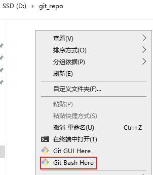

# Git 基础笔记

## 1. Git 概述

### 1.1. Git 简介与特点

Git是分布式的版本控制工具，其特点如下：

- 速度快
- 简单的设计
- 对非线性开发模式的强力支持（允许上千个并行开发的分支）
- 完全分布式
- 有能力高效管理类似 Linux 内核一样的超大规模项目（速度快和数据多）

### 1.2. Git 与 SVN 对比

#### 1.2.1. SVN

SVN是<font color=red>**集中式版本控制软件**</font>，版本库是集中放在中央服务器的。每个程序员使用自己电脑，首先要从中央服务器哪里得到最新的版本，编程完将完成的代码推送到中央服务器。集中式版本控制系统是必须联网才能工作

标准的集中式版本控制工具管理方式：


集中管理方式在一定程度上看到其他开发人员在干什么，而管理员也可以很轻松掌握每个人的开发权限。但是相较于其优点而言，集中式版本控制工具缺点很明显：

1. 服务器单点故障，一旦宕机无法提交代码，即容错性较差
3. 离线无法提交代码，无法及时记录开发人员的提交行为

<font color=red>每天都同步一次即可，需要手动同步上传代码</font>

#### 1.2.2. Git

Git是<font color=red>**分布式版本控制软件**</font>，它可以没有中央服务器，每个人的电脑就是一个完整的版本库。工作的时候就不需要联网了，因为版本都是在自己的电脑上。当多人开发时，只需把各自的修改推送到远程仓库，就可以所有成员都可以看到修改了。

分布式版本控制工具管理方式：


#### 1.2.3. 总结

1. svn 是集中式版本控制工具，git 是分布式版本控制工具
2. svn 不支持离线提交，git 支持离线提交代码

### 1.3. Git 工作流程

1. 从远程仓库中克隆 Git 资源作为本地仓库。
2. 从本地仓库中checkout代码然后进行代码修改
3. 在提交前先将代码提交到暂存区。
4. 提交修改。提交到本地仓库。本地仓库中保存修改的各个历史版本。
5. 在修改完成后，需要和团队成员共享代码时，可以将代码push到远程仓库。

Git 的工作流程图


### 1.4. Git 相关概念

**相关名词**

- 本地仓库：是在开发人员自己电脑上的Git仓库，存放开发者的代码(.git 隐藏文件夹就是本地仓库)
- 远程仓库：是在远程服务器上的Git仓库，存放代码(可以是github.com或者gitee.com 等开源代码仓库，或者自家公司的服务器)
- 工作区: 本地编写代码(文档)的地方
- 暂存区: 在本地仓库中的一个特殊的文件(index) 叫做暂存区，临时存储开发者即将要提交的文件


**相关操作**

- `Clone`：克隆，就是将远程仓库复制到本地仓库
- `Push`：推送，就是将本地仓库代码上传到远程仓库
- `Pull`：拉取，就是将远程仓库代码下载到本地仓库，并将代码克隆到本地工作区

## 2. Git 安装

> 此部分内容详见[《Git 笔记 - 安装篇》](/DevOps/版本管理工具/Git-02-安装)

## 3. Git 本地仓库

### 3.1. 创建版本库

什么是版本库呢？版本库又名仓库，英文名 repository，可以简单理解成一个目录，这个目录里面的所有文件都可以被 Git 管理起来，每个文件的修改、删除，Git 都能跟踪，以便任何时刻都可以追踪历史，或者在将来某个时刻可以“还原”。由于 git 是分布式版本管理工具，所以 git 在不需要联网的情况下也具有完整的版本管理能力。

创建一个版本库非常简单，可以使用 git bash 命令窗口也可以使用其他图形化客户端。

1. 创建一个空目录（如 `D:\git_repo`）
2. 在当前目录中点击右键中选择【Git Bash Here】来启动



3. 输入 `git init` 命令创建仓库


### 3.2. 仓库内容介绍

初始化的仓库，会生成一个 `.git` 的隐藏目录，里面相关 git 的配置、钩子、记录等等信息


- 版本库：`.git` 目录就是版本库，提交的文件都需要保存到版本库中。
- 工作目录：包含 `.git` 文件夹的目录，也就是 `.git` 目录的上一级目录就是工作目录。只有工作目录中的文件才能保存到版本库中。

> Notes: 一个git版本库一般只存放一个项目（一个项目对应一个文件夹）。

## 4. Git 远程仓库

在本地创建了一个 Git 仓库，又想让其他人来协作开发，此时就可以把本地仓库同步到远程仓库，同时还增加了本地仓库的一个备份。

市面上常用的远程仓库有 github、gitee、gitlab 等等

> Notes: 此部分的内容详见[《GitHub 笔记》](/DevOps/版本管理工具/GitHub)

## 5. 分支 (branch)（整理中）

### 5.1. 分支的概念

几乎所有的版本控制系统都以某种形式支持分支。使用分支意味着可以把开发者本地工作区从开发主线上分离开来，避免影响开发主线。多线程开发，可以同时开启多个任务的开发，多个任务之间互不影响。

### 5.2. 创建分支

## 6. 标签 (tag)（整理中）

### 6.1. 标签的概念

如果项目达到一个重要的阶段，并希望永远记住那个特别的提交快照，可以给它打上标签(tag)

比如说，想为项目发布一个"1.0"版本。可以给最新一次提交打上（HEAD）"v1.0"的标签。标签可以理解为项目里程碑的一个标记，一旦打上了这个标记则，表示当前的代码将不允许提交

### 6.2. 标签的创建（图形化界面操作）

标签的创建和分支的创建操作几乎一样


### 6.3. 标签的切换与删除


## 7. Git 命令

掌握并熟练使用了命令行模式操作 git 的话，会发现某些操作命令行比窗口化操作要简单

### 7.1. Git 配置

在安装好后首次使用前，需要先进行全局配置

#### 7.1.1. 配置全局的用户信息

在空白位置打开右键菜单，点击【Git Bash Here】，打开Git命令行窗口。输入以下命令配置全局的用户名与邮箱

```bash
$ git config --global user.name "用户名"
$ git config --global user.email "邮箱地址"
```

也可以直接查看设置值


#### 7.1.2. 查看配置信息

```bash
# 查看配置信息
$ git config --list
$ git config user.name
```

> 注：通过上面的命令设置的信息会保存在`~/.gitconfig`文件中

### 7.2. 命令行 - Git 常用操作

#### 7.2.1. 本地仓库初始化

在空的目录中，执行以下命令，初始化git仓库，即由git来管理此目录

```bash
$ git init
```

> 执行之后会在项目目录下创建【`.git`】的隐藏目录，这个目录是Git所创建的，不能删除，也不能随意更改其中的内容。

初始化仓库不带工作区

```bash
$ git init --bare
```

#### 7.2.2. 查看仓库当前状态

用于查询当前仓库中有那些文件存在变动

```bash
# 查看状态
$ git status
# 查看状态 使输出信息更加简洁
git status –s
```

#### 7.2.3. 添加文件到缓存区

`git add` 指令，用于添加单个（多个）文件到缓存区。

添加单个文件

```bash
$ git add 文件名
```

同时添加多个文件

```bash
$ git add 文件名1 文件名2 文件名3 …
```

添加当前目录中所有文件到缓存区。

```bash
$ git add .
```

#### 7.2.4. 取消缓存区的文件

将暂存区的文件取消暂存指定的文件(取消 `add`)

```bash
$ git reset 文件名
```

#### 7.2.5. 提交至版本库

`git commit` 指令，将当前缓存区的内容提交到版本库。

- `-m` 参数用于指定本次提交的注释。**注意：注释的内容必须使用`""`英文双引号包裹**
- `<文件名>` 非必需，可以指定提交某个文件

```bash
$ git commit -m "注释内容" <文件名>
```

#### 7.2.6. 删除本地工作区文件

```bash
$ git rm <文件名>
```

#### 7.2.7. 回退本工作区库误删文件

```bash
$ git checkout head <文件名>
```

#### 7.2.8. 查看版本

`git log` 指令，用于查看当前git的提交记录（版本）

```bash
$ git log
```

参数 `--pretty=oneline`，将每个git的提交记录在一行显示

```bash
$ git log --pretty=oneline
```

#### 7.2.9. 版本回退

`git reset` 指令用于版本的回退

```bash
$ git reset --hard 提交编号
```

> 注：”提交编号“是通过 `git log` 指令查看
>
> 在使用回退指令的时候 commit id 可以不用写全，git会自动识别，但是至少需要写前4位字符

#### 7.2.10. 查看历史版本

如果发生版本回退的操作，此时使用`git log`就无法查询回退到此版本之前的操作记录，所以需要使用 `git reflog` 指令来查看历史操作，获取最新的 commit id

```bash
$ git reflog
```

### 7.3. 命令行 - git 远程仓库操作

#### 7.3.1. 查看远程

查看远程，列出指定的每一个远程服务器的简写

```bash
$ git remote
```

查看远程，列出简称和地址

```bash
$ git remote -v
```

查看远程仓库详细地址

```bash
$ git remote show <仓库简称>
```

#### 7.3.2. 添加/移除远测仓库

添加远程仓库

```bash
$ git remote add <shortname> <url>
```

移除远程仓库和本地仓库的关系(只是从本地移除远程仓库的关联关系，并不会真正影响到远程仓库)

```bash
$ git remote rm <shortname>
```

#### 7.3.3. 克隆远程仓库到本地

`clone` 指令用于克隆远程仓库到本地

```bash
$ git clone 远程Git仓库地址
```

> 注：远程仓库分两种，基于http/https协议或者基于ssh协议

#### 7.3.4. 推送到远程仓库

`push` 指令用于将修改的版本推送到远程仓库某个分支

```bash
$ git push [remote-name] [branch-name]
```

基于http/https协议的远程仓库，首次提交时可能会出现403无权限的错误，需要修改【.git/config】文件内容，增加相应远程仓库的有效的用户名与密码

```
# 原配置
[remote "origin"]
	url = https://github.com/用户名/仓库名.git

# 修改为
[remote "origin"]
	url = https://用户名:密码@github.com/用户名/仓库名.git
```

> 注：推送到基于ssh协议的远程仓库，在push的时候并没有提示要求输入帐号密码，因为公私玥已经实现了用户身份鉴权，也不需要修改此配置文件。

#### 7.3.5. 远程仓库拉取版本

##### 7.3.5.1. 手动拉取与合并

从远程仓库拉取 (拉取到.git 目录，不会合并到工作区，工作区发生变化)

```bash
$ git fetch <shortname> <分支名称>
```

手动合并。把某个版本的某个分支合并到当前工作区

```bash
$ git merge <shortname>/<分支名称>
```

##### 7.3.5.2. 自动拉取与合并工作区

`pull` 指令用于拉取远程仓库的版本记录。(拉取到 .git 目录，合并到工作区，工作区不发生变化。相当于 `fetch` + `merge`)

```bash
$ git pull <shortname> <分支名称>
```

> 拉取时如果出现版本冲突，需要手动进行冲突的合并

注意：如果当前本地仓库不是从远程仓库克隆，而是本地创建的仓库，并且仓库中存在文件，此时再从远程仓库拉取文件的时候会报错（fatal: refusing to merge unrelated histories），解决此问题可以在 `git pull` 命令后加入参数 `--allow-unrelated-histories`

```bash
# 强制拉取合并
$ git pull <shortname> <分支名称> --allow-unrelated-histories
```

### 7.4. 命令行 - 分支管理命令

默认分支名称为 master。*2020年Github开始修改为 main*

#### 7.4.1. 查看分支

```bash
$ git branch
```

> 注意：当前的分支前面有个标记“`*`”。

列出所有远程分支

```bash
$ git branch -r
```

列出所有本地分支和远程分支

```bash
$ git branch -a
```

#### 7.4.2. 创建分支

```bash
$ git branch <分支名>
```

#### 7.4.3. 切换分支

```bash
$ git checkout <分支名>
```

#### 7.4.4. 删除分支

```bash
$ git branch -d <分支名>
```

> 注意：在删除分支的时候，一定要先退出要删除的分支（或切换到其他分支），然后才能删除该分支。或者如果分支已经修改过，则不允许删除。

强制删除分支（慎用）

```bash
$ git branch -D <分支名>
```

#### 7.4.5. 合并分支

```bash
$ git merge 被合并的分支名
```

合并分支需要先使用 `checkout` 切换到待合并到的分支，然后再使用 `merge` 指令指定要合并的分支。<font color=red>**需要注意：合并所有分支之后，需要使用 `push` 指令推送到远程仓库中**</font>

#### 7.4.6. 提交分支至远程仓库

```bash
$ git push <仓库简称> <分支名称>
```

#### 7.4.7. 删除远程仓库分支

```bash
$ git push origin –d 分支名称
```

### 7.5. 命令行 - 标签 tag

#### 7.5.1. 查看 tag 信息

列出所有tag

```bash
$ git tag
```

查看tag详细信息

```bash
$ git show [tagName]
```

#### 7.5.2. 新建一个 tag

```bash
$ git tag [tagName]
```

#### 7.5.3. 提交指定 tag

```bash
$ git push [仓库简称] [tagName]
```

#### 7.5.4. 新建一个分支指向某个 tag

```bash
$ git checkout -b [branch] [tag]
```

#### 7.5.5. 删除本地 tag

```bash
$ git tag -d [tag]
```

#### 7.5.6. 删除远程 tag (注意 空格)

**注意空格**

```bash
$ git push origin :refs/tags/[tag]
```

# Git 扩展知识

## 1. git上的分支命名规范

### 1.1. git常用分支说明

- `master`
    - 主分支，永远是可用的、稳定的、可直接发布的版本，不能直接在该分支上开发。只有计划发布的版本功能在`develop`分支上全部完成，而且测试没有问题了才会合并到`master`上。
- `develop`
    - 开发主分支，代码永远是最新，所有新功能以这个分支来创建自己的开发分支，该分支只做只合并操作，不能直接在该分支上开发
    - 例如要开发一个注册功能，那么就会从`develop`分支上创建一个`feature`分支`fb-register`，在`fb-register`分支上将注册功能完成后，将代码合并到`develop`分支上。这个`fb-register`就完成了它的使命，可以删除了。如果再需要开发一个登录功能，按刚刚上述操作流程再次进行
- `feature-xxx`
    - 功能开发分支，在`develop`上创建分支，以自己开发功能模块命名，功能测试正常后合并到`develop`分支
- `release`
    - 预分布分支，在合并好`feature`分支的`develop`分支上创建，主要是用来测试bug的分支，修改好bug并确定稳定之后合并到`develop`和`master`分支，然后发布`master`分支
- `release-fix`
    - 功能bug修复分支，在`release`上创建分支修复，修复好测试出来的bug之后合并回`release`分支。
- `hotfix-xxx`
    - 紧急bug修改分支，项目上线之后可以会遇到一些环境问题需要紧急修复，在`master`分支上创建，流程跟`release`分支相似，修复完成后合并到`develop`和`master`分支

**开发项目时git分支管理流程图**


***注意事项：***

- 一个分支尽量开发一个功能模块，不要多个功能模块在一个分支上开发。
- 开发过程中，如果组员A开发的功能依赖组员B正在开发的功能，可以待组员B开发好相关功能之后，组员A直接pull组员B的分支下来开发，不需要先将组员B的分支merge到develop分支。
- feature 分支在申请合并之前，最好是先 pull 一下 develop 主分支下来，看一下有没有冲突，如果有就先解决冲突后再申请合并。

### 1.2. git分支命名规范

|   分支   |      命名       | 说明                                                       |
| :------: | :-------------: | ---------------------------------------------------------- |
|  主分支  | `master`/`main` | 主分支，所有提供给用户使用的正式版本，都在这个主分支上发布 |
| 开发分支 | `dev`/`develop` | 开发分支，永远是功能最新最全的分支                         |
| 功能分支 |   `feature-*`   | 新功能分支，某个功能点正在开发阶段                         |
| 发布版本 |   `release-*`   | 发布定期要上线的功能                                       |
| 修复分支 |     `bug-*`     | 修复线上代码的 bug                                         |

## 2. git提交规范

### 2.1. 中文式提交格式参考

```
<新功能|bug修复|文档改动|格式化|重构|测试代码>: (影响范围) <主题>
# 解释为什么要做这些改动
issue #?
```

### 2.2. 提交类型

- 关于commit时类别，一般通用的如下
    - feat：新功能（feature）
    - fix：修复bug
    - docs：文档（documentation）变动
    - style：格式（不影响代码运行的变动），如格式化，缺失分号等，但不包括生产时紧急的bug修复
    - refactor：重构（即不是新增功能，也不是修改bug的代码变动）
    - perf：代码优化
    - test：增加测试
    - build：构建工具或外部依赖的更改，比如后端maven，前端package，json等
    - ci：更改项目级的配置文件或脚本
    - chore：构建过程或辅助工具的变动，除上面之外的修改
    - revert：撤销先前的提交

### 2.3. 提交注释示例

```
<类型>: <主题>

# 解释为什么要做这些改动（限制每行72个字）

# ----------------------------------------------
# 注意：
# 提交模板的内容，如果最左侧带"#"，内容不会提交到git中
# 主题和内容以一个空行分隔
# 主题限制为最大50个字
# 主题行结束不用标点
# 内容每行72个字
# 内容用于解释为什么和是什么，而不是怎么做
# ----------------- 例子 -------------------------
# feat: 增加账号激活功能
#
# 因为账号初始化时......
# ......
# 所以......
# ---------------- 例子结束 -----------------------
```

## 3. git 仓库的特殊文件

### 3.1. `.gitkeep`文件

`.gitkeep`文件是用来保证当前目录即使为空，也会上传到github上

### 3.2. .gitignore 忽略规则文件（待整理）

`.gitignore` 的文件用于声明忽略文件或不忽略文件的规则，**规则对当前目录及其子目录生效**。

> 注意：该文件因为没有文件名，没办法直接在windows目录下直接创建（*win10系统后来一些版本可以直接创建没有文件名的文件*），可以通过命令行 Git Bash 来 `touch` 指令来创建。

#### 3.2.1. 忽略文件语法规范

- 忽略所有 `.a` 的文件

```
*.a
```

- 否定忽略 `lib.a`，尽管已经在前面忽略了所有 `.a` 文件

```
!lib.a
```

- 忽略 `build/` 文件夹下的所有文件

```
/build/
```

- 忽略指定目录下的所有 `.txt` 文件（不包含其子目录）。例如：`/doc/notes.txt`，但不包括 `doc/server/arch.txt`

```
/doc/*.txt
```

- 忽略所有在 doc 目录及其子目录的 `.pdf` 文件

```
doc/**/*.pdf
```

## 4. 免费源代码托管网站

### 4.1. GitHub

> 官网：https://github.com/

### 4.2. 码云（Gitee）

> 网址：https://gitee.com/

开源中国旗下的代码托管平台：码云（Gitee）。是开源中国社区团队（深圳市奥思网络科技有限公司）推出的基于Git的免费代码托管平台，并且为开发者提供云端软件开发协作平台。无论是个人、团队、或者是企业，都能够用码云实现代码托管、项目管理与协作开发。

码云提供开源软件服务和企业服务，是最为接近GitHub功能的国产开发平台。码云上目前已经有超过10万家企业/机构入驻，其中不乏招商银行、比亚迪汽车等大牌厂商。码云近期也通过了通过 ISO27001:2013 信息安全管理体系认证及 ISO9001:2015 质量管理体系认证，可以说是国内比较先发、规模比较领先的代码托管平台。

7 月 14 日，工业和信息化部技术发展司公布了 「2020 年开源托管平台项目」的招标结果，由深圳市奥思网络科技有限公司（开源中国）牵头，与国家工业信息安全发展研究中心等 10 家单位组成的联合体中标该项目，联合体将依托码云建设中国独立的开源托管平台。

### 4.3. Coding.net

> 网址：https://coding.net/

Coding.net是深圳市腾云扣钉科技有限公司推出的产品。与GitHub和码云的定位不同，Coding.net重点面向团队和企业的代码协作开发服务，而没有将开源软件作为重点。Coding.net的特色包括在最开始就主推Web IDE的开发模式，通过与腾讯云的合作，提供了免费及时部署调试的环境，形成了差异化的竞争。

Coding.net的项目管理包含任务、讨论、文件等功能，支持多成员协作，并且深度集成了代码仓库的操作与状态。此外，还提供社会化协作功能，支持移动客户端。

随着Github免费策略的推进，CODING 也已经顺势开放所有基础功能（项目协同、代码托管、CI/CD 等）免费使用，不限成员数，帮助国内开发者零成本开始研发协作。

### 4.4. Agit.ai

> 网址：https://agit.ai/

国内人工智能开发者绝对不能错过的平台：Agit.ai。是阿吉特云计算有限公司（澳门）推出的产品，其定位上更为国际化。Agit.ai的界面是熟悉的GitHub风格，并且同样也是面向开源软件。从平台更新历史上看，Agit.ai是2020年7月上线的新平台，在项目管理和其他协同开发功能上具备基本的Git服务，但与码云还是略有差距，积累的开源仓库也不够丰富。

但Agit.ai独特的定位让人眼前一亮。如同其首页文字所述，Agit.ai专门面向AI开发人员。AI开发有何不同？Agit.ai提供了仓库代码运行服务，可直接选择算力启动AI算法的训练，并支持在线Tensorboard观察训练过程。另外，Agit.ai目前的算力是免费使用，其中还包括了有4块GPU卡的算力（不知道这样的算力羊毛能薅多久）。

Agit.ai为开发者提供集成了Tensorflow、Pytorch、Ray等常用AI库的开发环境镜像，以及一键式运行的的分布式计算资源，每一个为了环境搭建而苦恼的算法攻城狮，看到之后都应该会倍感欣慰。独特的匿名分享功能简直就是为了论文投稿的双盲评审而生，也可以从中看到浓浓的学术背景。

### 4.5. BitBucket

> 网址：https://bitbucket.org/

它可以免费提供无限制的私人和公共仓库，可以为最多五个会员使用。它的功能包括，代码搜索、BitBucket 管道、合并请求、智能镜像、问题单跟踪、灵活的部署模式、IP 白名单以及保护工作成果的分支权限。

值得注意的是，它让用户可以使用任何 Git 客户端或 Git 命令行来推送文件。并且 BitBucket 可以部署在云端、数据中心或本地服务器上。
