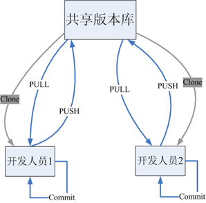

## 1. Git 概述

### 1.1. Git 简介与特点

Git是分布式的版本控制工具，其特点如下：

- 速度快
- 简单的设计
- 对非线性开发模式的强力支持（允许上千个并行开发的分支）
- 完全分布式
- 有能力高效管理类似 Linux 内核一样的超大规模项目（速度快和数据多）

### 1.2. Git 与 SVN 对比

#### 1.2.1. SVN

SVN是<font color=red>**集中式版本控制软件**</font>，版本库是集中放在中央服务器的。每个程序员使用自己电脑，首先要从中央服务器哪里得到最新的版本，编程完将完成的代码推送到中央服务器。集中式版本控制系统是必须联网才能工作

标准的集中式版本控制工具管理方式：


集中管理方式在一定程度上看到其他开发人员在干什么，而管理员也可以很轻松掌握每个人的开发权限。但是相较于其优点而言，集中式版本控制工具缺点很明显：

1. 服务器单点故障，一旦宕机无法提交代码，即容错性较差
3. 离线无法提交代码，无法及时记录开发人员的提交行为

<font color=red>每天都同步一次即可，需要手动同步上传代码</font>

#### 1.2.2. Git

Git是<font color=red>**分布式版本控制软件**</font>，它可以没有中央服务器，每个人的电脑就是一个完整的版本库。工作的时候就不需要联网了，因为版本都是在自己的电脑上。当多人开发时，只需把各自的修改推送到远程仓库，就可以所有成员都可以看到修改了。

分布式版本控制工具管理方式：



#### 1.2.3. 总结

1. svn 是集中式版本控制工具，git 是分布式版本控制工具
2. svn 不支持离线提交，git 支持离线提交代码

### 1.3. Git 工作流程

1. 从远程仓库中克隆 Git 资源作为本地仓库。
2. 从本地仓库中checkout代码然后进行代码修改
3. 在提交前先将代码提交到暂存区。
4. 提交修改。提交到本地仓库。本地仓库中保存修改的各个历史版本。
5. 在修改完成后，需要和团队成员共享代码时，可以将代码push到远程仓库。

Git 的工作流程图


### 1.4. Git 相关概念

**相关名词**

- 本地仓库：是在开发人员自己电脑上的Git仓库，存放开发者的代码(.git 隐藏文件夹就是本地仓库)
- 远程仓库：是在远程服务器上的Git仓库，存放代码(可以是github.com或者gitee.com 等开源代码仓库，或者自家公司的服务器)
- 工作区: 本地编写代码(文档)的地方
- 暂存区: 在本地仓库中的一个特殊的文件(index) 叫做暂存区，临时存储开发者即将要提交的文件


**相关操作**

- `Clone`：克隆，就是将远程仓库复制到本地仓库
- `Push`：推送，就是将本地仓库代码上传到远程仓库
- `Pull`：拉取，就是将远程仓库代码下载到本地仓库，并将代码克隆到本地工作区

## 2. Git 安装

> 此部分内容详见[《Git 笔记 - 安装篇》](/DevOps/版本管理工具/Git-安装)

## 3. Git 本地仓库

### 3.1. 创建版本库

什么是版本库呢？版本库又名仓库，英文名 repository，可以简单理解成一个目录，这个目录里面的所有文件都可以被 Git 管理起来，每个文件的修改、删除，Git 都能跟踪，以便任何时刻都可以追踪历史，或者在将来某个时刻可以“还原”。由于 git 是分布式版本管理工具，所以 git 在不需要联网的情况下也具有完整的版本管理能力。

创建一个版本库非常简单，可以使用 git bash 命令窗口也可以使用其他图形化客户端。

1. 创建一个空目录（如 `D:\git_repo`）
2. 在当前目录中点击右键中选择【Git Bash Here】来启动


3. 输入 `git init` 命令创建仓库


### 3.2. 仓库内容介绍

初始化的仓库，会生成一个 `.git` 的隐藏目录，里面相关 git 的配置、钩子、记录等等信息


- 版本库：`.git` 目录就是版本库，提交的文件都需要保存到版本库中。
- 工作目录：包含 `.git` 文件夹的目录，也就是 `.git` 目录的上一级目录就是工作目录。只有工作目录中的文件才能保存到版本库中。

> Notes: 一个git版本库一般只存放一个项目（一个项目对应一个文件夹）。

## 4. Git 远程仓库

在本地创建了一个 Git 仓库，又想让其他人来协作开发，此时就可以把本地仓库同步到远程仓库，同时还增加了本地仓库的一个备份。

市面上常用的远程仓库有 github、gitee、gitlab 等等

> Notes: 此部分的内容详见[《GitHub 笔记》](/DevOps/版本管理工具/GitHub)

## 5. 分支 (branch)（整理中）

### 5.1. 分支的概念

几乎所有的版本控制系统都以某种形式支持分支。使用分支意味着可以把开发者本地工作区从开发主线上分离开来，避免影响开发主线。多线程开发，可以同时开启多个任务的开发，多个任务之间互不影响。

### 5.2. 创建分支

## 6. 标签 (tag)（整理中）

### 6.1. 标签的概念

如果项目达到一个重要的阶段，并希望永远记住那个特别的提交快照，可以给它打上标签(tag)

比如说，想为项目发布一个"1.0"版本。可以给最新一次提交打上（HEAD）"v1.0"的标签。标签可以理解为项目里程碑的一个标记，一旦打上了这个标记则，表示当前的代码将不允许提交

### 6.2. 标签的创建（图形化界面操作）

标签的创建和分支的创建操作几乎一样


### 6.3. 标签的切换与删除


## 7. Git 命令

掌握并熟练使用了命令行模式操作 git 的话，会发现某些操作命令行比窗口化操作要简单。一般来说，日常使用 git 只要记住下图6个命令，就可以了。


> Notes: <font color=red>以下章节的命令中，`[]` 包裹的代表可以省略</font>

### 7.1. 常用命令速查表


### 7.2. config - 配置命令

Git 的设置文件为 `.gitconfig`，它可以在用户主目录下（全局配置），也可以在项目目录下（项目配置）。在安装好后首次使用前，需要先进行全局配置。通过相关的命令设置全局信息会保存在 `~/.gitconfig` 文件中。

#### 7.2.1. 配置全局的用户信息

在空白位置打开右键菜单，点击【Git Bash Here】，打开Git命令行窗口。输入以下命令配置提交时全局的用户名与邮箱

```bash
$ git config --global user.name "用户名"
$ git config --global user.email "邮箱地址"
```

> Tips: `--global` 可以省略

#### 7.2.2. 编辑 Git 配置文件

```bash
$ git config -e [--global]
```

> Notes: `--global` 表示编辑全局配置，省略则表示编辑当前仓库的配置。

#### 7.2.3. 查看配置信息

```bash
# 查看当前 git 全部的配置信息
$ git config --list

# 查看当前 git 指定的配置信息
$ git config [--global] user.name
```

### 7.3. 基础操作命令

#### 7.3.1. init - 本地仓库初始化

执行以下命令，初始化 git 仓库，即由 git 来管理此目录

```bash
# 在空的目录中
$ git init

# 新建一个目录，将其初始化为 Git 代码库
$ git init [project-name]

# 初始化仓库不带工作区
$ git init --bare
```

> 执行之后会在项目目录下创建【`.git`】的隐藏目录，这个目录是Git所创建的，不能删除，也不能随意更改其中的内容。

#### 7.3.2. add - 添加文件到缓存区

`git add` 指令，用于添加单个（多个）文件到缓存区。

添加单个文件

```bash
$ git add 文件名
```

同时添加多个文件

```bash
$ git add 文件名1 文件名2 文件名3 …
```

添加指定目录到暂存区，包括子目录

```bash
$ git add 目录名称
```

添加当前目录中所有文件到缓存区。

```bash
$ git add .
```

添加每个变化前，都会要求确认。对于同一个文件的多处变化，可以实现分次提交

```bash
$ git add -p
```

#### 7.3.3. reset - 取消缓存区的文件

将暂存区的文件取消暂存指定的文件(取消 `add`)

```bash
$ git reset 文件名
```

#### 7.3.4. rm - 删除本地工作区文件

删除工作区文件，并且将这次删除放入暂存区

```bash
$ git rm <文件名1> <文件名2>...
```

停止追踪指定文件，但该文件会保留在工作区

```bash
$ git rm --cached <文件名>
```

#### 7.3.5. mv - 修改文件名

修改文件名称，并且将这个改名后文件放入暂存区

```bash
$ git mv <file-original> <file-renamed>
```

#### 7.3.6. commit - 提交至版本库

`git commit` 指令，将当前缓存区的内容提交到版本库。

- `-m` 参数用于指定本次提交的注释。**注意：注释的内容必须使用`""`英文双引号包裹**
- `<文件名>` 非必需，可以指定提交某个文件

```bash
# 提交指定的文件到与注释信息到版本库
$ git commit -m "注释内容" <文件名>

# 提交暂存区的指定文件到版本库
$ git commit [file1] [file2] ... -m [message]

# 提交工作区自上次commit之后的变化，直接到版本库
$ git commit -a

# 提交时显示所有diff信息
$ git commit -v

# 使用一次新的commit，替代上一次提交。如果代码没有任何新变化，则用来改写上一次commit的提交信息
$ git commit --amend -m [message]

# 重做上一次commit，并包括指定文件的新变化
$ git commit --amend [file1] [file2] ...
```

### 7.4. 查看信息命令

#### 7.4.1. status - 查看仓库当前状态

用于查询当前仓库中有那些文件存在变动

```bash
# 查看状态
$ git status
# 查看状态 使输出信息更加简洁
git status –s
```

#### 7.4.2. log - 查看版本记录

`git log` 指令，用于查看当前分支 git 的提交记录（版本）

```bash
# 显示当前分支的版本历史
$ git log
```

参数 `--pretty`，用于指定显示的格式。

```bash
# 将每个 git 的提交记录在一行显示
$ git log --pretty=oneline

# 指定其他显示格式
$ git log [tag] HEAD --pretty=format:%s
```

其他使用方式

```bash
# 显示commit历史，以及每次commit发生变更的文件
$ git log --stat

# 搜索提交历史，根据关键词
$ git log -S [keyword]

# 显示某个commit之后的所有变动，其"提交说明"必须符合搜索条件
$ git log [tag] HEAD --grep feature

# 显示某个文件的版本历史，包括文件改名
$ git log --follow [file]
$ git whatchanged [file]

# 显示过去5次提交
$ git log -5 --pretty --oneline
```

#### 7.4.3. reflog - 查看历史版本

如果发生版本回退的操作，此时使用`git log`就无法查询回退到此版本之前的操作记录，所以需要使用 `git reflog` 指令来查看历史操作，获取最新的 commit id

```bash
$ git reflog
```

#### 7.4.4. 显示修改信息

```bash
# 显示所有提交过的用户，按提交次数排序
$ git shortlog -sn

# 显示指定文件是什么人在什么时间修改过
$ git blame [file]

# 显示某次提交的元数据和内容变化
$ git show [commit]

# 显示某次提交发生变化的文件
$ git show --name-only [commit]

# 显示某次提交时，某个文件的内容
$ git show [commit]:[filename]
```

#### 7.4.5. diff - 查看文件差异

```bash
# 显示指定文件相关的每一次diff
$ git log -p [file]

# 显示暂存区和工作区的差异
$ git diff

# 显示暂存区和上一个commit的差异
$ git diff --cached [file]

# 显示工作区与当前分支最新commit之间的差异
$ git diff HEAD

# 显示两次提交之间的差异
$ git diff [first-branch]...[second-branch]

# 显示今天修改的代码行数
$ git diff --shortstat "@{0 day ago}"
```

### 7.5. 远程仓库操作命令

#### 7.5.1. clone - 克隆远程仓库到本地

`clone` 指令用于克隆远程仓库到本地

```bash
$ git clone 远程Git仓库地址
```

> 注：远程仓库分两种，基于http/https协议或者基于ssh协议

#### 7.5.2. remote - 查看远程仓库

查看远程，列出指定的每一个远程服务器的简写

```bash
$ git remote
```

查看远程，列出简称和地址

```bash
$ git remote -v
```

查看远程仓库详细地址

```bash
$ git remote show <仓库简称>
```

#### 7.5.3. remote add - 添加远程仓库

添加远程仓库

```bash
$ git remote add <shortname> <url>
```

#### 7.5.4. remote rm - 移除远程仓库

移除远程仓库和本地仓库的关系(只是从本地移除远程仓库的关联关系，并不会真正影响到远程仓库)

```bash
$ git remote rm <shortname>
```

#### 7.5.5. 拉取远程仓库版本

##### 7.5.5.1. fetch - 手动拉取与合并

从远程仓库拉取 (拉取到.git 目录，不会合并到工作区，工作区发生变化)

```bash
$ git fetch <remote> <分支名称>
```

手动合并。把某个版本的某个分支合并到当前工作区

```bash
$ git merge <remote>/<分支名称>
```

##### 7.5.5.2. pull - 自动拉取与合并工作区

`pull` 指令用于拉取远程仓库的版本记录。(拉取到 .git 目录，合并到工作区，工作区不发生变化。相当于 `fetch` + `merge`)

```bash
$ git pull <shortname> <分支名称>
```

> 拉取时如果出现版本冲突，需要手动进行冲突的合并

注意：如果当前本地仓库不是从远程仓库克隆，而是本地创建的仓库，并且仓库中存在文件，此时再从远程仓库拉取文件的时候会报错（fatal: refusing to merge unrelated histories），解决此问题可以在 `git pull` 命令后加入参数 `--allow-unrelated-histories`

```bash
# 强制拉取合并
$ git pull <shortname> <分支名称> --allow-unrelated-histories
```

#### 7.5.6. push - 推送到远程仓库

`push` 指令用于将修改的版本推送到远程仓库某个分支

```bash
$ git push [remote-name] [branch-name]
```

基于http/https协议的远程仓库，首次提交时可能会出现403无权限的错误，需要修改【.git/config】文件内容，增加相应远程仓库的有效的用户名与密码

```
# 原配置
[remote "origin"]
	url = https://github.com/用户名/仓库名.git

# 修改为
[remote "origin"]
	url = https://用户名:密码@github.com/用户名/仓库名.git
```

> 注：推送到基于ssh协议的远程仓库，在push的时候并没有提示要求输入帐号密码，因为公私玥已经实现了用户身份鉴权，也不需要修改此配置文件。

强行推送当前分支到远程仓库(有冲突也推送)

```bash
$ git push [remote] --force
```

推送所有分支到远程仓库

```bash
$ git push [remote] --all
```

### 7.6. 版本回退与撤销命令

#### 7.6.1. checkout 恢复工作区

```bash
$ git checkout<文件名>
# 恢复暂存区的指定文件到工作区
$ git checkout head [file]

# 恢复某个commit的指定文件到暂存区和工作区
$ git checkout [commit] [file]

# 恢复暂存区的所有文件到工作区
$ git checkout .
```

#### 7.6.2. reset 版本回退

`git reset` 指令用于版本的回退

```bash
# 重置暂存区的指定文件，与上一次commit保持一致，但工作区不变
$ git reset [file]

# 重置暂存区与工作区，与上一次commit保持一致
$ git reset --hard

# 重置当前分支的指针为指定commit，同时重置暂存区，但工作区不变
$ git reset [commit]

# 重置当前分支的HEAD为指定commit，同时重置暂存区和工作区，与指定commit一致
$ git reset --hard [commit]

# 重置当前HEAD为指定commit，但保持暂存区和工作区不变
$ git reset --keep [commit]
```

> Notes: 
>
> - `commit` 参数是指“提交编号”，可以通过 `git log` 指令查看
> - 在使用回退指令的时候 commit id 可以不用写全，git 会自动识别，但是至少需要写前 4 位字符

#### 7.6.3. revert

新建一个 commit，用来撤销指定 commit。后者的所有变化都将被前者抵消，并且应用到当前分支

```bash
$ git revert [commit]
```

#### 7.6.4. stash

暂时将未提交的变化移除，稍后再移入

```bash
$ git stash
$ git stash pop
```

### 7.7. branch - 分支管理命令

默认分支名称为 master。*2020年Github开始修改为 main*

#### 7.7.1. 查看分支

```bash
$ git branch
```

> 注意：当前的分支前面有个标记“`*`”。

列出所有远程分支

```bash
$ git branch -r
```

列出所有本地分支和远程分支

```bash
$ git branch -a
```

#### 7.7.2. 创建分支

新建一个分支，但依然停留在当前分支

```bash
$ git branch <分支名>
```

新建一个分支，并切换到该分支

```bash
$ git checkout -b <分支名>
```

新建一个分支，指向指定 commit

```bash
$ git branch [branch] [commit]
```

新建一个分支，与指定的远程分支建立追踪关系

```bash
$ git branch --track [branch] [remote-branch]
```

#### 7.7.3. 切换分支

使用 `checkout` 命令切换分支

```bash
# 切换到指定分支，并更新工作区
$ git checkout <分支名>

# 切换到上一个分支
$ git checkout -
```

#### 7.7.4. 分支追踪

在现有分支与指定的远程分支之间建立追踪关系。

```bash
$ git branch --set-upstream [branch] [remote-branch]
```

#### 7.7.5. 删除分支

删除本地仓库的分支

```bash
$ git branch -d <分支名>
```

> Notes: **在删除分支的时候，一定要先退出要删除的分支（或切换到其他分支），然后才能删除该分支。或者如果分支已经修改过，则不允许删除。**

强制删除分支（**慎用**）

```bash
$ git branch -D <分支名>
```

删除远程仓库分支

```bash
# 简写
$ git push origin –d 分支名称
# 全写
$ git push origin --delete [branch-name]
# 直接根据远程分支的全称来删除
$ git branch -dr [remote/branch]
```

#### 7.7.6. 合并分支

合并指定分支到当前分支。合并分支前需要先使用 `checkout` 切换到待合并到的分支，然后再使用 `merge` 指令指定要合并的分支。

```bash
$ git merge <被合并的分支名>
```

> Notes: <font color=red>**合并本地所有分支之后，需要使用 `push` 指令推送到远程仓库中**</font>

选择一个 commit，合并进当前分支

```bash
$ git cherry-pick [commit]
```

#### 7.7.7. 提交分支至远程仓库

```bash
$ git push <仓库简称> <分支名称>
```

### 7.8. tag - 标签管理命令

#### 7.8.1. 查看 tag 信息

列出所有 tag

```bash
$ git tag
```

查看 tag 详细信息

```bash
$ git show [tagName]
```

#### 7.8.2. 新建 tag

在当前 commit 中新建一个标签（tag）

```bash
$ git tag [tagName]
```

在指定 commit 中新建一个标签（tag）

```bash
$ git tag [tag] [commit]
```

#### 7.8.3. 新建一个分支指向某个 tag

```bash
$ git checkout -b [branch] [tag]
```

#### 7.8.4. 删除本地 tag

```bash
$ git tag -d [tag]
```

#### 7.8.5. 删除远程 tag

```bash
$ git push origin :refs/tags/[tagName]
```

> Notes: **注意空格**


#### 7.8.6. 提交 tag

提交指定标签（tag）

```bash
$ git push [remote] [tagName]
```

> Notes: `[remote]` 是指远程仓库简称

提交所有标签（tag）

```bash
$ git push [remote] --tags
```

#### 7.8.7. 新建分支指向某个 tag

新建一个分支，并指向某个 tag

```bash
$ git checkout -b <分支名称> <标签名称>
```

### 7.9. 其他命令

生成一个可供发布的压缩包

```bash
$ git archive
```

## 8. Git 仓库的特殊文件

### 8.1. .gitkeep 文件

`.gitkeep`文件是用来保证当前目录即使为空，也会上传到 github 上

### 8.2. .gitignore 忽略规则文件（待整理）

`.gitignore` 的文件用于声明忽略文件或不忽略文件的规则，**规则对当前目录及其子目录生效**。

> 注意：该文件因为没有文件名，没办法直接在windows目录下直接创建（*win10系统后来一些版本可以直接创建没有文件名的文件*），可以通过命令行 Git Bash 来 `touch` 指令来创建。

#### 8.2.1. 忽略文件语法规范

- 忽略所有 `.a` 的文件

```
*.a
```

- 否定忽略 `lib.a`，尽管已经在前面忽略了所有 `.a` 文件

```
!lib.a
```

- 忽略 `build/` 文件夹下的所有文件

```
/build/
```

- 忽略指定目录下的所有 `.txt` 文件（不包含其子目录）。例如：`/doc/notes.txt`，但不包括 `doc/server/arch.txt`

```
/doc/*.txt
```

- 忽略所有在 doc 目录及其子目录的 `.pdf` 文件

```
doc/**/*.pdf
```

#### 8.2.2. Gitignore 参考模板

初用 Git 的工程师，都有着一个苦恼，每次都得针对不同项目、不同语言类型来重复写 .gitignore，以忽略一些无需纳入 Git 管理的文件。[Gitignore](https://github.com/github/gitignore)项目就是帮工程师解决这个问题的。每次需要为项目创建 .gitignore 文件时，只需要打开这个项目，针对你当前所用编程语言或框架，去寻找对应 .gitignore 模板替换即可。

如果觉得挨个模板查阅很费劲，推荐一个网站：[gitignore.io](https://www.toptal.com/developers/gitignore)，支持一键搜索你所需的 gitignore 模板。


### 8.3. .gitconfig 配置文件

在 OS X 和 Linux 下，Git 的配置文件储存在 `~/.gitconfig`。在 windows 系统中，存储在`%HOMEPATH%\.gitconfig`

# Git 扩展知识

## 1. git 分支命名规范

**Git 常用分支命名**

|   分支   |       命名       |                         说明                         |
| :-----: | :-------------: | ---------------------------------------------------- |
|  主分支  | `master`/`main` | 主分支，所有提供给用户使用的正式版本，都在这个主分支上发布 |
| 开发分支 | `dev`/`develop` | 开发分支，永远是功能最新最全的分支                       |
| 功能分支 |   `feature-*`   | 新功能分支，某个功能点正在开发阶段                       |
| 发布版本 |   `release-*`   | 发布定期要上线的功能                                   |
| 修复分支 |     `bug-*`     | 修复线上代码的 bug                                     |

**git 常用分支说明**

- `master`
    - 主分支，永远是可用的、稳定的、可直接发布的版本，不能直接在该分支上开发。只有计划发布的版本功能在`develop`分支上全部完成，而且测试没有问题了才会合并到`master`上。
- `develop`
    - 开发主分支，代码永远是最新，所有新功能以这个分支来创建自己的开发分支，该分支只做只合并操作，不能直接在该分支上开发
    - 例如要开发一个注册功能，那么就会从`develop`分支上创建一个`feature`分支`fb-register`，在`fb-register`分支上将注册功能完成后，将代码合并到`develop`分支上。这个`fb-register`就完成了它的使命，可以删除了。如果再需要开发一个登录功能，按刚刚上述操作流程再次进行
- `feature-xxx`
    - 功能开发分支，在`develop`上创建分支，以自己开发功能模块命名，功能测试正常后合并到`develop`分支
- `release`
    - 预分布分支，在合并好`feature`分支的`develop`分支上创建，主要是用来测试bug的分支，修改好bug并确定稳定之后合并到`develop`和`master`分支，然后发布`master`分支
- `release-fix`
    - 功能bug修复分支，在`release`上创建分支修复，修复好测试出来的bug之后合并回`release`分支。
- `hotfix-xxx`
    - 紧急bug修改分支，项目上线之后可以会遇到一些环境问题需要紧急修复，在`master`分支上创建，流程跟`release`分支相似，修复完成后合并到`develop`和`master`分支

**开发项目时git分支管理流程图**


***注意事项：***

- 一个分支尽量开发一个功能模块，不要多个功能模块在一个分支上开发。
- 开发过程中，如果组员A开发的功能依赖组员B正在开发的功能，可以待组员B开发好相关功能之后，组员A直接pull组员B的分支下来开发，不需要先将组员B的分支merge到develop分支。
- feature 分支在申请合并之前，最好是先 pull 一下 develop 主分支下来，看一下有没有冲突，如果有就先解决冲突后再申请合并。

## 2. git提交规范

### 2.1. 中文式提交格式参考

```
<新功能|bug修复|文档改动|格式化|重构|测试代码>: (影响范围) <主题>
# 解释为什么要做这些改动
issue #?
```

### 2.2. 提交类型

关于 commit 时类别，一般通用的如下

- feat：新功能（feature）
- fix：修复bug
- docs：文档（documentation）变动
- style：格式（不影响代码运行的变动），如格式化，缺失分号等，但不包括生产时紧急的bug修复
- refactor：重构（即不是新增功能，也不是修改bug的代码变动）
- perf：代码优化
- test：增加测试
- build：构建工具或外部依赖的更改，比如后端maven，前端package，json等
- ci：更改项目级的配置文件或脚本
- chore：构建过程或辅助工具的变动，除上面之外的修改
- revert：撤销先前的提交

### 2.3. 提交注释示例

```
<类型>: <主题>

# 解释为什么要做这些改动（限制每行72个字）

# ----------------------------------------------
# 注意：
# 提交模板的内容，如果最左侧带"#"，内容不会提交到git中
# 主题和内容以一个空行分隔
# 主题限制为最大50个字
# 主题行结束不用标点
# 内容每行72个字
# 内容用于解释为什么和是什么，而不是怎么做
# ----------------- 例子 -------------------------
# feat: 增加账号激活功能
#
# 因为账号初始化时......
# ......
# 所以......
# ---------------- 例子结束 -----------------------
```

## 3. 免费源代码托管网站

### 3.1. GitHub

> 官网：https://github.com/

### 3.2. 码云（Gitee）

> 网址：https://gitee.com/

开源中国旗下的代码托管平台：码云（Gitee）。是开源中国社区团队（深圳市奥思网络科技有限公司）推出的基于Git的免费代码托管平台，并且为开发者提供云端软件开发协作平台。无论是个人、团队、或者是企业，都能够用码云实现代码托管、项目管理与协作开发。

码云提供开源软件服务和企业服务，是最为接近GitHub功能的国产开发平台。码云上目前已经有超过10万家企业/机构入驻，其中不乏招商银行、比亚迪汽车等大牌厂商。码云近期也通过了通过 ISO27001:2013 信息安全管理体系认证及 ISO9001:2015 质量管理体系认证，可以说是国内比较先发、规模比较领先的代码托管平台。

7 月 14 日，工业和信息化部技术发展司公布了 「2020 年开源托管平台项目」的招标结果，由深圳市奥思网络科技有限公司（开源中国）牵头，与国家工业信息安全发展研究中心等 10 家单位组成的联合体中标该项目，联合体将依托码云建设中国独立的开源托管平台。

### 3.3. Coding.net

> 网址：https://coding.net/

Coding.net是深圳市腾云扣钉科技有限公司推出的产品。与GitHub和码云的定位不同，Coding.net重点面向团队和企业的代码协作开发服务，而没有将开源软件作为重点。Coding.net的特色包括在最开始就主推Web IDE的开发模式，通过与腾讯云的合作，提供了免费及时部署调试的环境，形成了差异化的竞争。

Coding.net的项目管理包含任务、讨论、文件等功能，支持多成员协作，并且深度集成了代码仓库的操作与状态。此外，还提供社会化协作功能，支持移动客户端。

随着Github免费策略的推进，CODING 也已经顺势开放所有基础功能（项目协同、代码托管、CI/CD 等）免费使用，不限成员数，帮助国内开发者零成本开始研发协作。

### 3.4. Agit.ai

> 网址：https://agit.ai/

国内人工智能开发者绝对不能错过的平台：Agit.ai。是阿吉特云计算有限公司（澳门）推出的产品，其定位上更为国际化。Agit.ai的界面是熟悉的GitHub风格，并且同样也是面向开源软件。从平台更新历史上看，Agit.ai是2020年7月上线的新平台，在项目管理和其他协同开发功能上具备基本的Git服务，但与码云还是略有差距，积累的开源仓库也不够丰富。

但Agit.ai独特的定位让人眼前一亮。如同其首页文字所述，Agit.ai专门面向AI开发人员。AI开发有何不同？Agit.ai提供了仓库代码运行服务，可直接选择算力启动AI算法的训练，并支持在线Tensorboard观察训练过程。另外，Agit.ai目前的算力是免费使用，其中还包括了有4块GPU卡的算力（不知道这样的算力羊毛能薅多久）。

Agit.ai为开发者提供集成了Tensorflow、Pytorch、Ray等常用AI库的开发环境镜像，以及一键式运行的的分布式计算资源，每一个为了环境搭建而苦恼的算法攻城狮，看到之后都应该会倍感欣慰。独特的匿名分享功能简直就是为了论文投稿的双盲评审而生，也可以从中看到浓浓的学术背景。

### 3.5. BitBucket

> 网址：https://bitbucket.org/

它可以免费提供无限制的私人和公共仓库，可以为最多五个会员使用。它的功能包括，代码搜索、BitBucket 管道、合并请求、智能镜像、问题单跟踪、灵活的部署模式、IP 白名单以及保护工作成果的分支权限。

值得注意的是，它让用户可以使用任何 Git 客户端或 Git 命令行来推送文件。并且 BitBucket 可以部署在云端、数据中心或本地服务器上。

## 4. git 钩子

### 4.1. 本地禁止提交(commit)到 master 分支

一般 master 分支只能从其他分支合并代码，为了防止意外提交和开发者随意提交到 master 分支。可以通过提交前钩子来禁止提交到 master 分支，在 git 项目目录下添加 `.git/hooks/pre-commit` 文件，添加内容如下：

```
#!/bin/sh
branch=$(git rev-parse --symbolic --abbrev-ref HEAD)
if [ "master" == "$branch" ]; then
  echo ".git/hooks: 不能commit到 $branch 分支"
  exit 1
fi
```

## 5. 减小 Git 仓库 .git 文件大小（待测试）

> 后面待测试与修改，参考：https://blog.csdn.net/LOI_QER/article/details/107911115

### 5.1. 起因

使用 git 储存本地音频、相片时，其中很多文件超过 10Mb，更有很多超过 50Mb，这些文件都添加到 git 的历史记录中`(git add . && git commit`)，就算后面删除了这些文件本身，但其提交记录永久的留在了 .git 中，被 git 保存为了 Blob 对象储存起来了，导致 .git 目录超过 35 Gb，占用过多硬盘空间，所以需要进行“瘦身”。

### 5.2. git gc 修剪历史提交

当运行 `git gc` 命令时，Git 会收集所有松散对象并将它们存入 packfile，合并这些 packfile 进一个大的 packfile，然后将不被任何 `commit` 引用并且已存在一段时间 (数月) 的对象删除。 此外， Git 还会将所有引用 (references) 并入一个单独文件。

1. 在仓库根目录，运行 `gc` ，生成 `pack` 文件（后面的 `--prune=now` 表示对之前的所有提交做修剪，有的时候仅仅 `gc` 一下 `.git` 文件就会小很多）

```bash
$ git gc --prune=now
```

2. 找出最大的三个文件（看自己需要）

```bash
$ git verify-pack -v .git/objects/pack/*.idx | sort -k 3 -n | tail -3
# 示例输出：
#1debc758cf31a649c2fc5b0c59ea1b7f01416636 blob   4925660 3655422 14351
#c43a8da9476f97e84b52e0b34034f8c2d93b4d90 blob   154188651 152549294 12546842
#2272096493d061489349e0a312df00dcd0ec19a2 blob   155414465 153754005 165096136
```

3. 查看那些大文件究竟是谁（c43a8da 是上面大文件的hash码）

```bash
$ git rev-list --objects --all | grep c43a8da
# c43a8da9476f97e84b52e0b34034f8c2d93b4d90 data/bigfile
```

4. 移除对该文件的引用（也就是 data/bigfile）

```bash
$ git filter-branch --force --index-filter "git rm --cached --ignore-unmatch 'data/bigfile'"  --prune-empty --tag-name-filter cat -- --all
```

5. 进行 `repack`

```bash
$ git for-each-ref --format='delete %(refname)' refs/original | git update-ref --stdin
$ git reflog expire --expire=now --all
$ git gc --prune=now
```

6. 查看 `pack` 的空间使用情况

```bash
$ git count-objects -v
```

## 6. Git 常见问题解决方法汇总

### 6.1. fatal detected dubious ownership in repository 解决办法

问题描述：在git仓库中执行 `git pull` 命令时，提示：`fatal: detected dubious ownership in repository`。这是因为 git 担心的权限安全策略导致的报错，可以按提示把某个（或多个）目录添加到信任列表

```shell
git config --global --add safe.directory D:/www/your-project
git config --global --add safe.directory D:/www/other-project
```

也可以通过加通配符为`*`，将所有文件夹都添加到信任列表。需要注意，该处理方法一般适用于只有本人一个用户使用的电脑，确保无其它用户，否则存在安全问题。

```shell
git config --global --add safe.directory "*"
```

### 6.2. git 显示和提交中文乱码

#### 6.2.1. git status 无法显示中文

使用 `git status` 查看有改动但未提交的文件时总只显示数字串，显示不出中文文件名。这是因为在默认设置下，中文文件名在工作区状态输出，中文名不能正确显示，而是显示为八进制的字符编码。


**解决办法**：将 git 配置文件 `core.quotepath` 项设置为 false。其中，`quotepath` 表示引用路径，加上`--global`参数表示全局配置。在 git bash 终端输入命令：

```bash
git config --global core.quotepath false
```

#### 6.2.2. git bash 终端显示中文乱码

git bash 终端需要设置成中文和utf-8编码，才能正确显示中文。

在 git bash 的界面中右击空白处，弹出菜单，选择【选项】->【文本】->【本地Locale】，设置为`zh_CN`，字符集选框选为`UTF-8`。


> Tips: 英文界面显示则是：【Options】->【Text】->【Locale】改为 `zh_CN`，Character set 改为 `UTF-8`

#### 6.2.3. 修改配置文件方式解决中文乱码

还可以通过直接修改配置文件的方式来解决中文乱码问题。进入 git 的安装目录，编辑 etc\gitconfig 文件，在文件末尾增加以下内容：

```properties
[gui]  
    encoding = utf-8  
    # 代码库统一使用utf-8  
[i18n]  
    commitencoding = utf-8  
    # log编码  
[svn]  
    pathnameencoding = utf-8  
    # 支持中文路径  
[core]
    quotepath = false 
    # status引用路径不再是八进制（反过来说就是允许显示中文了）
```

> Tips: 也有些 windows 系统是存放在`C:\Users\Administrator\.gitconfig`路径或`安装盘符:\Git\mingw64\etc\gitconfig`

编辑 etc\git-completion.bash 文件末尾增加以下内容：

```properties
# 让ls命令能够正常显示中文
alias ls='ls --show-control-chars --color=auto' 
```

编辑 etc\inputrc 文件，修改 `output-meta` 和 `convert-meta` 属性值：

```properties
set output-meta on  # bash可以正常输入中文  
set convert-meta off
```

编辑 profile 文件，在文件末尾添加如下内容：

```properties
export LESSHARESET=utf-8
```

> Notes: 注意以上内容配置时，删除`#`号的注释

### 6.3. Git 在跨平台 CRLF 和 LF 的解决方案

- mac 与 Unix 系统的换行使用 LF
- windows 系统换行使用 CRLF

因为不同系统的换行不一致，在多人协作共同开发的时候，可能导致提交代码时候产生问题。当使用git库提交代码的时候，不同的开发环境如果都是按照自己系统的方式任意修改换行类型，难免会让代码库整体混乱或者产生许多没有必要的代码更新。

Git 可以可以使用 `core.autocrlf` 命令设置在 push 时自动地把行结束符 CRLF 转换成 LF，而在 pull 代码时把 LF 转换成 CRLF。如果是在 Windows 系统上，把它设置成 `true`，这样当签出代码时，LF 会被转换成 CRLF

```bash
git config --global core.autocrlf true
```

将 `core.autocrlf` 设置成 `input`，在 push 时把 CRLF 转换成 LF，pull 时不转换

```bash
git config --global core.autocrlf input
```

将 `core.autocrlf` 设置成 `false`，则在本地和代码库中都保留 CRLF，无论 pull 还是 push 都不变

```bash
git config --global core.autocrlf false
```

