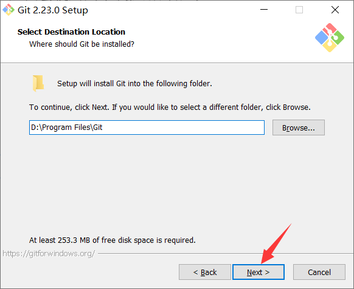
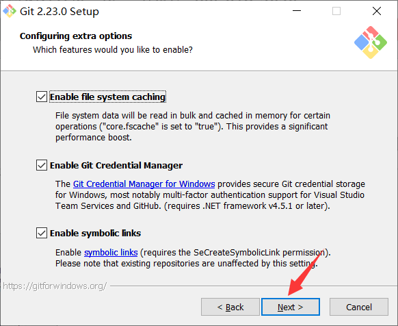
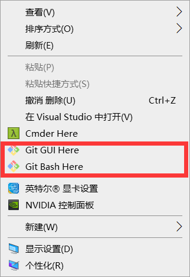

## 1. Git 下载网址

Git 下载网址：https://git-scm.com/download

> 笔记使用的版本：
>
> - window版本：Git-2.16.2-64-bit.exe
> - linux版本：git-2.16.2.tar.gz


## 2. window 系统安装 Git 服务器

> 示例使用Git-2.23.0-64-bit.exe

- 选择软件的安装位置



- 选择需安装的组件（默认即可，直接下一步）


- 选择使用的编辑器（默认即可，直接下一步）


- 环境变量调整


- 选择使用OpenSSH


- 使用OpenSSL库


- 配置命令行会话（默认即可）


- 配置终端（默认即可）


- 配置额外的选项（默认即可）




- 安装完成


- 验证是否安装成功。打开右键菜单，若出现“Git GUI Here”、“Git Bash Here”则代表安装成功



或者命令窗口，输入`git --version`查看git的版本


## 3. Linux 系统搭建 Git 服务器

### 3.1. Git 服务器概述

远程仓库实际上和本地仓库没啥不同，纯粹为了7x24小时开机并交换大家的修改。GitHub就是一个免费托管开源代码的远程仓库。但一般公司都是搭建一台Git服务器作为私有仓库使用。

搭建Git服务器需要准备一台运行 Linux 的机器，目前个人使用 CentOS 7.4 系统

> 有安装所有软件的linux系统，用户名：root  密码：123456

### 3.2. 安装依赖环境

```bash
yum -y install curl-devel expat-devel  openssl-devel zlib-devel 
yum -y install gcc gcc-c++ perl-ExtUtils-MakeMaker
```

yum（全称为 Yellow dog Updater, Modified）是一个在 Fedora 和 RedHat 以及 SUSE 中的 Shell 前端软件包管理器。基於RPM包管理，能够从指定的服务器自动下载RPM包并且安装，可以自动处理依赖性关系，并且一次安装所有依赖的软体包，无须繁琐地一次次下载、安装。

**yum 常用命令**如下：

- 仅安装指定的软件

```bash
yum install 软件包名
```

- 仅更新指定的软件

```bash
yum update 软件包名
```

- 用YUM删除软件包

```bash
yum remove 软件包名
```

- 列出所有可安装的软件包

```bash
yum list
```

- 列出所有可更新的软件包

```bash
yum list updates
```

- 列出所有已安装的软件包

```bash
yum list installed
```

- 使用 YUM 查找软件包

```bash
yum search 软件包名
```

### 3.3. git 服务器安装步骤

- 使用 rz 命令上传 git-2.13.3.tar.gz 安装包

```bash
[root@centOS ~]# rz
```

> Tips: 如果 `rz` 命令无法使用，是因为没有安装相关的插件，使用 `yum install lrzsz -y` 命令安装后即可使用

- 压缩安装包

```bash
[root@centOS ~]# tar -zxvf git-2.16.2.tar.gz
```

- 删除安装包（非必须，如像我一样有洁癖的-_-）

```bash
[root@centOS ~]# rm -rf git-2.16.2.tar.gz
```

- 进入 git 解压后的文件夹的 configure 目录

```bash
[root@centOS ~]# cd git-2.16.2/configure
```

- 编译与安装

```bash
[root@centOS git-2.16.2]# make
[root@centOS git-2.16.2]# make install
```

- 查看git版本

```bash
[root@centOS git-2.16.2]# git --version
git version 2.16.2
```

- 添加用户

```bash
[root@centOS git-2.16.2]# useradd git
```

- 设置密码，输入两次密码，密码为 `git`

```bash
[root@centOS git-2.16.2]# passwd git
```


- 初始化git空仓库

```bash
[root@centOS git-2.16.2]# git init --bare /home/git/mytest.git
已初始化空的 Git 仓库于 /home/git/mytest.git/
```

- 授予 git 用户为 `/home/git` 目录及子目录的拥有者

```bash
[root@centOS git-2.16.2]# chown -R git:git /home/git
```

> Notes: <font color=red>**每次创建新的仓库都需要授予git用户为拥有者**</font>

最终完成效果：


### 3.4. 连接服务器

私有 git 服务器搭建完成后就可以像连接 Github 一样使用了，但是因为 git 服务器并没有配置密钥登录，所以每次连接时需要输入密码。

#### 3.4.1. 使用命令连接

- 添加远程库：

```bash
git remote add mytest ssh://git@192.168.217.128/home/git/mytest.git
```

- 同步本地库到远程库：

```bash
git push -u mytest master
```

> Notes: 其他操作部分参考其他 Git 笔记的基础篇与客户端使用篇

#### 3.4.2. 使用 TortoiseGit 上传项目

添加远程库：设置远端后，再右击项目选择【同步】

 

输入设置的密码: `git` （安装示例时指定的）


#### 3.4.3. 使用 TortoiseGit 下载项目

在需要下载项目的工作空间，右键


下载也需要输入远程仓库的密码：git


