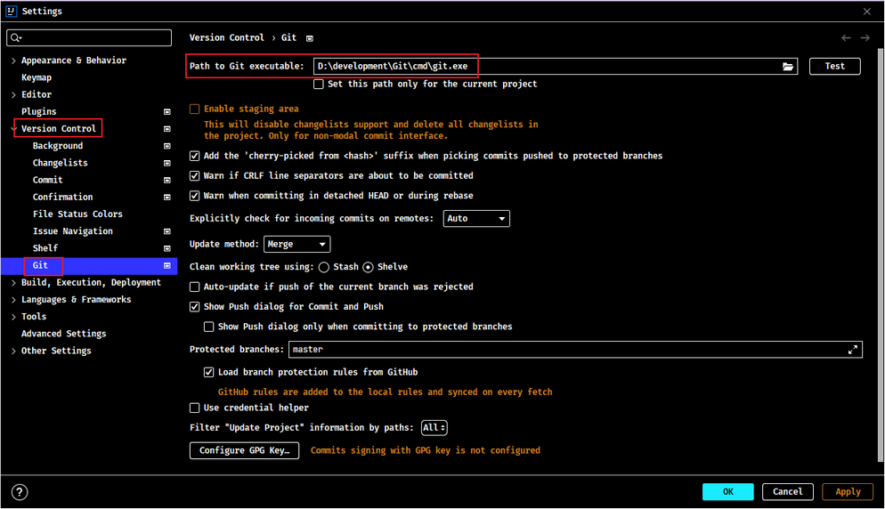

## 1. Git 相关图形化客户端

- Git 第三方 GUI Clients 官方推荐整理：https://git-scm.com/downloads/guis
- Sourcetree 网址：https://www.sourcetreeapp.com/
    - 使用教程：http://blog.cocoachina.com/article/71732
- GitHub Desktop 网址：https://desktop.github.com/
- TortoiseGit 网址：https://tortoisegit.org/
- Git Extensions 网址：https://gitextensions.github.io/

## 2. IDEA 集成 Git 客户端

### 2.1. 初始化配置 Git

1. 点击【File】菜单->【Settings】


2. 选择【Version Control】->【Git】->在【Path to Git executable】中指定 git.exe 存放目录



3. 点击【Test】按钮进行测试


### 2.2. 创建本地仓库

1. 选择【VCS】->【Import into Version Control】->【Create Git Repository】或者


2. 选择工程所在的目录后，即可创建本地仓库了


3. 创建成功后，就会出现相关的 git 操作菜单


### 2.3. Commit 提交代码

1. 右键选择【Git】->【Commit file...】，将当前项目代码提交到本地仓库

 

或者点击 git 后边的对勾


> 注意：项目中的配置文件不需要提交到本地仓库中，提交时需要忽略掉。在项目目录中创建忽略的文件`.gitignore`，文件内容如下：

```java
.idea
target
*.iml

.classpath
.project
.settings
Bin
```

2. 在提交框中，可以选择要提交的文件、填写提交信息、查看文件差异。


3. 成功提交后，可以在底部的 Git 工具窗口查看提交的记录


### 2.4. 版本切换

- 方式一：选择控制台【Git】(旧版本的idea叫“Version Control”)->【Log】->【Reset Current Branch...】->【Reset】。


可以选择不同的回退方法，详情查看每个选项的说明


这种**切换的特点是会抛弃原来的提交记录**


- 方式二：选择控制台【Git】->【Log】->【Revert Commit】->【Merge】-> 处理代码 -> commit。


    

这种**切换的特点是会当成一个新的提交记录，之前的提交记录也都保留**。Revert 操作会当成一个新的提交记录，如果后悔了“回退”这个操作，也可以回退到没有回退之前的版本，因为历史记录还保留提交记录。


### 2.5. 分支管理

#### 2.5.1. 创建分支

选择【VCS】(旧版本idea)->【Git】->【Branches】->【New Branch】-> 给分支起名字 ->【Creat】


#### 2.5.2. 切换分支

- 选择右下角 Git 分支的名称按钮 -> 选择要切换的分支 ->【Checkout】


#### 2.5.3. 合并分支

选择 Git(VCS)->【Merge...】


选择要合并的分支 -> merge


> Tips: 如果合并时出现代码冲突，需要处理冲突后再合并。

#### 2.5.4. 删除分支

点击右下角分支名称 -> 选中要删除的分支 ->【Delete】


### 2.6. 克隆远程仓库到本地仓库

- 第一种方式(主窗口)：【Get from VSC】-> 选择【Version control: Git】-> 指定远程仓库的路径 -> 指定本地存放的路径 -> clone


- 第二种方式(主菜单)：【Git】->【Clone...】-> 指定远程仓库的路径与本地存放的路径 -> clone


### 2.7. 推送(push)本地仓库到远程仓库

1. 【Git】(VCS)->【Push...】


2. 选择相应的分支，点击【Push】按钮，推送到远程仓库


如果不是克隆远程仓库创建的，此时就需要点击 Define remote，设置 git 服务器远端地址。设置后，点击 Push 推送到远程仓库


### 2.8. 更新(pull)远端仓库代码到本地仓库

选择菜单栏或者右键项目，选择【Pull...】，更新远程仓库


### 2.9. 协同开发

模拟两个程序员同步代码与更新代码。


使用右边工具栏菜单：


#### 2.9.1. 获取代码

点击 pull 图标获取远程仓库代码


#### 2.9.2. 推送代码

点击 push 图标推送代码到远程仓库


#### 2.9.3. 解决冲突

两个程序员修改了同一个文件中的同一行代码，提交时

 

处理冲突:


> Notes: <font color=red>**还需要重新push代码到远程仓库。**</font>

### 2.10. idea 取消项目与 git 仓库的关联

选择【file】->【settings】->【version control】，选择项目目录，再点“减号”即可解除 git 仓库的关联，然后去项目目录下删除`.git`这个文件夹即可


## 3. Git 客户端 SourceTree 使用教程（待整理）

> 参考：https://www.cnblogs.com/Can-daydayup/p/13128633.html
