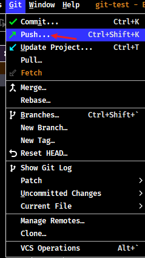
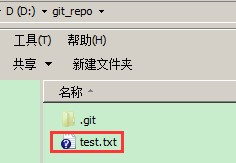
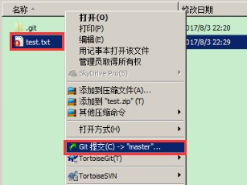
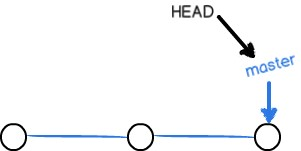
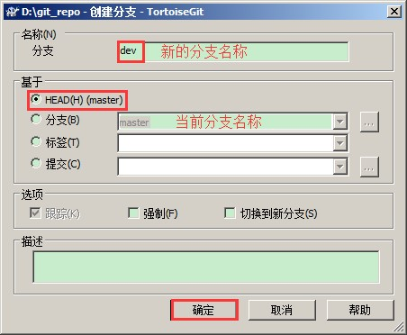
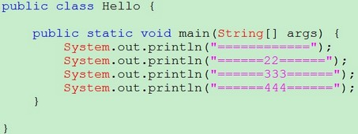

## 1. Git 相关图形化客户端

- Git 第三方 GUI Clients 官方推荐整理：https://git-scm.com/downloads/guis
- Sourcetree
- GitHub Desktop 网址：https://desktop.github.com/
- TortoiseGit
- Git Extensions 网址：https://gitextensions.github.io/

## 2. IDEA 集成 Git 客户端

### 2.1. 初始化配置 Git

1. 点击【File】菜单->【Settings】


2. 选择【Version Control】->【Git】->在【Path to Git executable】中指定 git.exe 存放目录


3. 点击【Test】按钮进行测试


### 2.2. 创建本地仓库

1. 选择【VCS】->【Import into Version Control】->【Create Git Repository】或者


2. 选择工程所在的目录后，即可创建本地仓库了


3. 创建成功后，就会出现相关的 git 操作菜单


### 2.3. Commit 提交代码

1. 右键选择【Git】->【Commit file...】，将当前项目代码提交到本地仓库

 

或者点击 git 后边的对勾


> 注意：项目中的配置文件不需要提交到本地仓库中，提交时需要忽略掉。在项目目录中创建忽略的文件`.gitignore`，文件内容如下：

```java
.idea
target
*.iml

.classpath
.project
.settings
Bin
```

2. 在提交框中，可以选择要提交的文件、填写提交信息、查看文件差异。


3. 成功提交后，可以在底部的 Git 工具窗口查看提交的记录


### 2.4. 版本切换

- 方式一：选择控制台【Git】(旧版本的idea叫“Version Control”)->【Log】->【Reset Current Branch...】->【Reset】。


可以选择不同的回退方法，详情查看每个选项的说明


这种**切换的特点是会抛弃原来的提交记录**


- 方式二：选择控制台【Git】->【Log】->【Revert Commit】->【Merge】-> 处理代码 -> commit。


    

这种**切换的特点是会当成一个新的提交记录，之前的提交记录也都保留**。Revert 操作会当成一个新的提交记录，如果后悔了“回退”这个操作，也可以回退到没有回退之前的版本，因为历史记录还保留提交记录。


### 2.5. 分支管理

#### 2.5.1. 创建分支

选择【VCS】(旧版本idea)->【Git】->【Branches】->【New Branch】-> 给分支起名字 ->【Creat】


#### 2.5.2. 切换分支

- 选择右下角 Git 分支的名称按钮 -> 选择要切换的分支 ->【Checkout】


#### 2.5.3. 合并分支

选择 Git(VCS)->【Merge...】


选择要合并的分支 -> merge


> Tips: 如果合并时出现代码冲突，需要处理冲突后再合并。

#### 2.5.4. 删除分支

点击右下角分支名称 -> 选中要删除的分支 ->【Delete】


### 2.6. 克隆远程仓库到本地仓库

- 第一种方式(主窗口)：【Get from VSC】-> 选择【Version control: Git】-> 指定远程仓库的路径 -> 指定本地存放的路径 -> clone


- 第二种方式(主菜单)：【Git】->【Clone...】-> 指定远程仓库的路径与本地存放的路径 -> clone


### 2.7. 推送(push)本地仓库到远程仓库

1. 【Git】(VCS)->【Push...】



2. 选择相应的分支，点击【Push】按钮，推送到远程仓库


如果不是克隆远程仓库创建的，此时就需要点击 Define remote，设置 git 服务器远端地址。设置后，点击 Push 推送到远程仓库


### 2.8. 更新(pull)远端仓库代码到本地仓库

选择菜单栏或者右键项目，选择【Pull...】，更新远程仓库


### 2.9. 协同开发

模拟两个程序员同步代码与更新代码。


使用右边工具栏菜单：


#### 2.9.1. 获取代码

点击 pull 图标获取远程仓库代码


#### 2.9.2. 推送代码

点击 push 图标推送代码到远程仓库


#### 2.9.3. 解决冲突

两个程序员修改了同一个文件中的同一行代码，提交时

 

处理冲突:


> Notes: <font color=red>**还需要重新push代码到远程仓库。**</font>

### 2.10. idea 取消项目与 git 仓库的关联

选择【file】->【settings】->【version control】，选择项目目录，再点“减号”即可解除 git 仓库的关联，然后去项目目录下删除`.git`这个文件夹即可


## 3. SourceTree（待整理）

> Sourcetree 网址：https://www.sourcetreeapp.com/

### 3.1. 参考资料

> Git 客户端 SourceTree 使用教程参考：
>
> - https://www.cnblogs.com/Can-daydayup/p/13128633.html
> - http://blog.cocoachina.com/article/71732

## 4. TortoiseGit

> TortoiseGit 网址：https://tortoisegit.org/

### 4.1. windows 版本安装

#### 4.1.1. 安装步骤

使用版本：TortoiseGit-2.6.0.0-64bit.msi


配置语言包：


由于目前只有英文语言包，默认即可继续下一步，配置目录。


配置开发者姓名及邮箱，每次提交代码时都会把此信息包含到提交的信息中。Email随便填写即可


**选择 OpenSSH 协议**，点击“完成”按钮完成配置。


完整完毕后在系统右键菜单中会出现 git 的菜单项。


#### 4.1.2. 安装中文语言包

安装中文语言包并不是必选项，可以根据个人情况来选择安装。安装包：TortoiseGit-LanguagePack-x.x.x.x-64bit-zh_CN.msi


直接“下一步”完整完毕。鼠标右键选择 Settings


语言包安装完毕后可以在 TortoiseGit 的设置中调整语言


### 4.2. 创建 Git 本地仓库

使用 TortoiseGit 时只需要在目录中点击右键菜单选择“在这里创建版本库”


 

版本库创建成功，会在此目录下创建一个 `.git` 的隐藏目录，如下所示：


### 4.3. 添加文件

在 D:\git_repo 目录下创建一个 test.txt 文件



> Tips: 安装完客户端后，需要重启电脑才可以看到相应的图标


成功添加后，文本文件变为带『+』号的图标：


### 4.4. 提交文件

在 mytest.txt 上再次点击右键选择“提交”，此时将文件保存至版本库中。


 

### 4.5. 修改文件

#### 4.5.1. 提交修改

被版本库管理的文件不可避免的要发生修改，此时只需要直接对文件修改即可。修改完毕后需要将文件的修改提交到版本库。

修改后的 test.txt（修改后图标变成红色感叹号）文件上点击右键，然后选择“提交”，和之前的提交方式一样。



#### 4.5.2. 查看修改日志

在开发过程中可能会经常查看代码的修改历史，或者叫做查看代码的修改日志。用来查看某个版本是谁修改的，什么时间修改的，修改了哪些内容。可以在文件上点击右键选择“显示日志”来查看文件的修改历史。

 

#### 4.5.3. 比较差异

当文件内容修改后，需要和修改之前对比一下修改了哪些内容此时可以使用“比较差异功能”


**与当前版本比较差异**：


**与上一个版本比较差异**：


#### 4.5.4. 还原修改

当文件修改后不想把修改的内容提交，还想还原到未修改之前的状态。此时可以使用“还原”功能。


 

> Notes: <font color=red>**此操作会撤销所有未提交的修改，所以当做还原操作是需要慎重！！！**</font>

#### 4.5.5. 检查已修改

当项目提交之前先检查哪些文件发生了改变，再比较差异，决定是否提交。

 

### 4.6. 重命名文件

右键文件选择『更名...』


修改完成后提交


### 4.7. 删除文件

需要删除无用的文件时可以使用 git 提供的删除功能直接将文件从版本库中删除。


- 删除：git 版本库与工作区本地副本一起删除。
- 删除并保留本地副本：只删除 git 版本库中的文件，保留工作区本地副本

> Tips: **删除文件以后，需要再次提交**

### 4.8. Java工程提交到版本库

- 第一步：创建 java 工程后，复制到工作目录中


- 第二步：忽略不需要的文件或文件夹。在此工程中，并不是所有文件都需要保存到版本库中的例如 eclipse 的相关配置 `.settings` 目录及目录下的文件就可以忽略。
    - 方式一：在 Git 工作区的根目录下创建一个特殊的 `.gitignore` 文件，然后把要忽略的文件名填进去，Git 就会自动忽略这些文件。
    - 方式二：如果使用 TortoiseGit 的话可以使用菜单项直接进行忽略。


按上面步骤再把 bin、.classpath、.project 都添加到忽略列表中。完成后在此文件夹内会多出一个 .gitignore 文件，这个文件就是忽略文件，当然也可以手工编辑。其中的内容就是把 bin 目录忽略掉。

  

- 第三步：将工程添加到暂存区


  

- 第四步：提交代码。将代码添加到 master 分支上，其中 `.gitignore` 文件也需要添加到暂存区，然后提交到版本库。

### 4.9. 导出指定版本

第一步：显示所有版本日志信息


第二步：选中指定版本


第三步：导出指定版本为zip文件


### 4.10. 还原文件到指定版本

第一步：选中指定版本号与需要还原的文件


第二步：还原选中的文件即可


### 4.11. Github 远程仓库操作

#### 4.11.1. 同步 Github 仓库

第一步：查看网络中的SSH客户端：ssh.exe


第二步：添加远端


- URL：远程仓库的地址
- 推送 URL：也是相同的
- Putty 密钥：选择刚才生成的密钥中的私钥(<font color=red>**可以不选择**</font>)

第三步：同步，在本地仓库的文件夹中单击右键，选择“Git同步”


#### 4.11.2. 克隆 Github 仓库

在任意目录点击右键：


#### 4.11.3. 拉取 Github 代码

使用 TortoiseGit 可以从右键菜单中点击【拉取】（pull）或者【获取】（fetch）


### 4.12. 分支管理

在每次的提交，Git 都把它们串成一条时间线，这条时间线就是一个分支。截止到目前，只有一条时间线，在 Git 里，这个分支叫主分支，即 master 分支。HEAD 指针用来指向目前操作的 master 分支，master 分支才是提交的。



#### 4.12.1. 创建分支

在本地仓库文件夹中点击右键，然后从菜单中选择“创建分支”：

 

#### 4.12.2. 切换分支

如果想创建完毕后直接切换到新分支可以勾选“切换到新分支”选项或者从菜单中选择“切换/检出”来切换分支：


分支切换到 dev 后就可以对工作区的文件进行修改，然后提交到 dev 分支，原来的 master 分支不受影响。例如修改 Hello.java 中的内容，然后提交到 dev 分支。


切换到 master 分支后还是原来的内容：



#### 4.12.3. 合并分支

将 dev 分支合并到 master 分支，需先切换到 master 分支。再从右键菜单中选择合并。


再查看 Hello.java 类的内容就已经更新了：


### 4.13. 解决冲突

两个分支中编辑的内容都是相互独立互不干扰的，那么如果在两个分支中都对同一个文件进行编辑，然后再合并，就有可能会出现冲突。

例如在 master 分支中对 Hello.java 进行编辑：


    两个分支中编辑的内容都是相互独立互不干扰的，那么如果在两个分支中都对同一个文件进行编辑，然后再合并，就有可能会出现冲突。
例如在master分支中对Hello.java进行编辑：


然后提交到版本库。最后进行分支合并，将 dev 分支合并到 master 分支。需要先切换到 master 分支然后进行分支合并。


此时出现版本冲突。


冲突需要手动解决，如下图解决完毕：


在冲突文件上单机右键选择“解决冲突”菜单项：


把冲突解决完毕的文件提交到版本库就可以。


## 5. Eclipse 集成 Git 客户端

### 5.1. 安装 egit 插件

说明：若 Eclipse 版本自带此 egit 插件，则无须安装。

### 5.2. 提交代码到本地仓库

#### 5.2.1. 项目加入忽略文件

加入检入时需要忽略的文件 `.gitignore`，文件内容如下：

```
.classpath
.project
.settings
target
bin
```

#### 5.2.2. 分享项目选择使用Git


#### 5.2.3. 将项目移到工作目录

第一步：创建新的本地仓库


第二步：将工程移到工作目录


#### 5.2.4. 提交代码到暂存区

第一步：切换到 java 视图


第二步：添加代码到 git 暂存区


#### 5.2.5. Commit 提交代码

 

### 5.3. push 分支代码到远程仓库

 


> Notes: <font color=red>当需要选择不同分支同步代码到远程仓库时使用。一般第一次同步代码用得比较多。</font>

设置 git 服务器地址：


 

### 5.4. push 同步代码到远程仓库

 

### 5.5. pull 更新代码到本地仓库

 

注意：Commit 提交的作用是把代码提交到本地。Push 的作用是把本地的代码提交到远程的 git 服务器。

### 5.6. clone 克隆远程仓库到本地

第一步：进入 git 仓库界面


第二步：填写远程仓库Location、Connection、Authentication信息


第三步：分支选择


第四步：设置本地仓库信息


### 5.7. 导入项目到 Eclipse

 

填写项目名称：


转换成对应的 Eclipse 项目


### 5.8. 协同开发

开启两个 Eclipse，模拟两个程序员同步代码与更新代码。


### 5.9. 解决冲突

第一步：两个程序员修改了同一个文件中的同一行代码，提交时


第二步：选择 pull 更新代码到本地仓库


第三步：处理冲突


把解决冲突后的代码先执行 Add to Index


处理完成后，先 Commit 到本地仓库，再 Push 到远程仓库。
