# GitHub 基础使用笔记

> 官网：https://github.com/

## 1. 创建 GitHub 仓库

### 1.1. 注册账号

使用邮箱注册即可

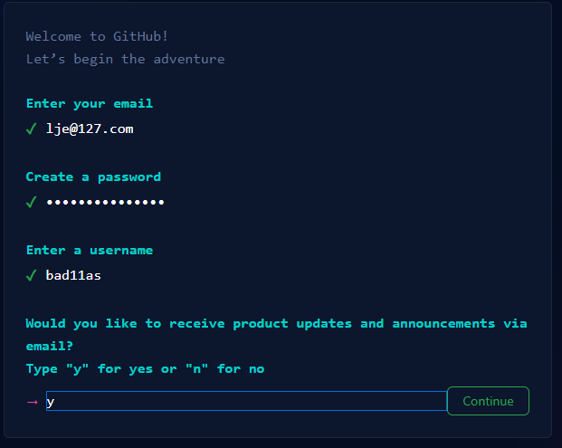

### 1.2. 创建仓库

登录 github，选择【New repository】，创建一个仓库

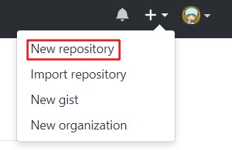

填写仓库相关的信息

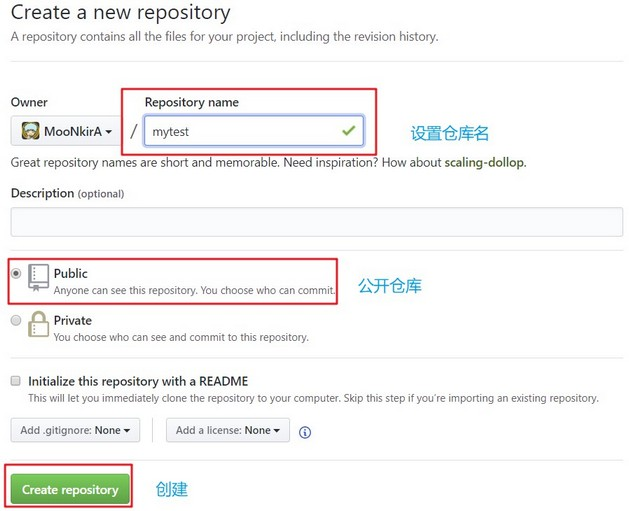

点击【create repository】按钮仓库就创建成功

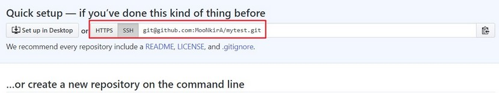

Github 支持两种协议【https】和【ssh】。如果使用 https 很简单基本不需要配置就可以使用，但是每次提交代码和下载代码时都需要输入用户名和密码。而且如果是公司配置的私有 git 服务器一般不提供 https 方式访问，都采用 ssh

### 1.3. SSH 密钥生成

SSH是英文Secure Shell的简写形式。通过使用SSH，它可以把所有传输的数据进行加密，这样可以防止DNS欺骗和IP欺骗。最早的时候，互联网通信都是明文通信，一旦被截获，内容就暴露无疑。1995年，芬兰学者Tatu Ylonen设计了SSH协议，将登录信息全部加密，成为互联网安全的一个基本解决方案，迅速在全世界获得推广，目前已经成为Linux系统的标准配置。

在 windows 系统下，可以使用 Git Bash.exe 来生成密钥，在任意目录下右键菜单点击【Git Bash Here】。

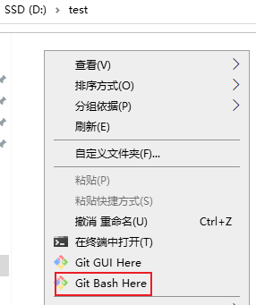

执行命令 `ssh-keygen -t rsa`，生成公钥和私钥

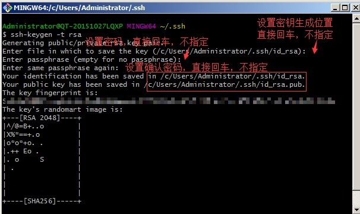

生成的密钥对在 `c:/users/当前用户/.ssh` 目录中

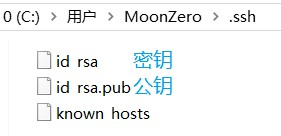

### 1.4. ssh 密钥配置

密钥生成后，需要在 github 上配置 ssh 的公钥，本地才可以使用 ssh 方式进行代码拉取与提交。

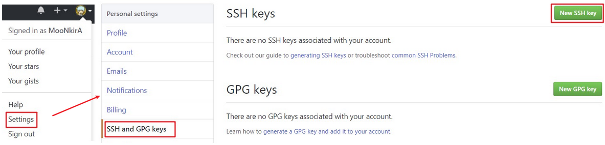

使用文本编辑器打开刚刚生成的公钥(id_rsa.pub)，在 key 部分将 id_rsa.pub 文件内容添加进去，然后点击【Add SSH key】按钮完成配置


## 2. 常用词的含义

- watch：会持续收到该项目的动态
- fork，复制某个项目到自己的Github仓库中
- star，可以理解为点赞
- clone，将项目下载至本地
- follow，关注你感兴趣的作者，会收到他们的动态

## 3. Github 搜索技巧

### 3.1. 通过 in 关键词限制搜索范围

- `xxx in:name` ：项目名包含xxx的
- `xxx in:description` ：项目描述包含xxx的
- `xxx in:readme` ：项目的readme文件中包含xxx的

当然也可以通过 `xxx in:name,desciption` 来组合使用

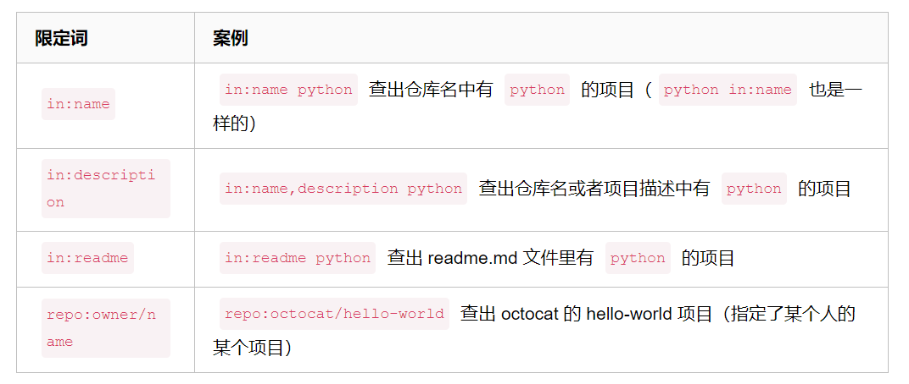

### 3.2. 查找某个用户或组织的项目

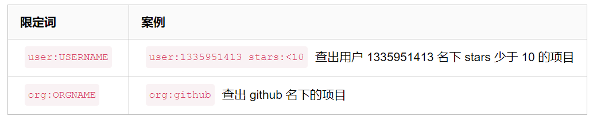

### 3.3. 通过辅助限定词查询项目

可以通过限制 `项目大小(size)`、`拥护者数(followers)`、`fork数(forks)`、`stars数(stars)`、`创建时间(created)`、`更新时间(pushed)`、`项目所用语言(language)`、`topic标签(topic)`、`topic标签数(topics)`...来筛选项目

辅助限定词可以多个并用，用空格隔开，可以搭配限定词使用，也可单独使用。通过通配符 `>`、`<`、`=` 指定搜索区间，区间范围内可通过`num1..num2`，具体操作如下：

- 要查找stars数不小于666的springboot项目，搜索：`in:name springboot  stars:>=666`
- forks大于等于500，搜索：`springboot forks:>500`
- 查找fork在100到200之间且stars数在80到100之间的springboot项目，搜索：`springboot forks:100..200 stars:80..100`
- 查出项目大小小于 1MB 的项目，搜索：`size:<=1000`
- 查出项目名字中有 python 且小于 1MB 的项目，搜索：`in:name python size:<=1000`

具体限制词如下：


### 3.4. awesome + 关键字

搜索和关键字匹配的优秀项目

输入`awesome springboot`，搜索优秀的springboot相关的项目，包括框架、教程等

### 3.5. 分享项目中某一行的代码

只需要在具体的网址后面拼接`#Lxx`(xx为行数)

如：需要分享这个类中的@SprintBootApplication注解，值需要在后面拼接上#L6 即可

```
https://github.com/lxy-go/SpringBoot/.../JpaApplication.java#L6
```

浏览器访问时发现高亮显示了

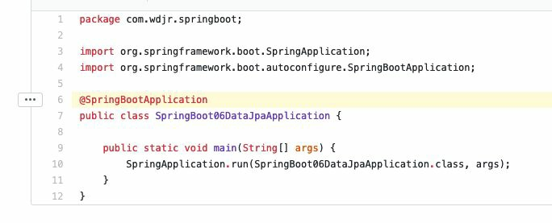

当然也可以段落进行高亮显示

```
https://github.com/lxy-go/SpringBoot/blob/master/SpringBoot/DataJpaApplication.java#L6-L10
```

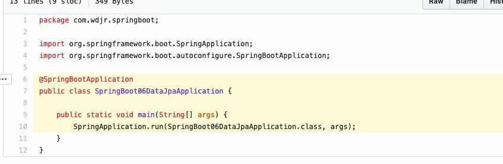

### 3.6. 项目内搜索

打开想要搜索的项目，然后按一下【`T`】键。会跳转至一个新的网页，


如想要搜索该项目的配置文件 application.yml

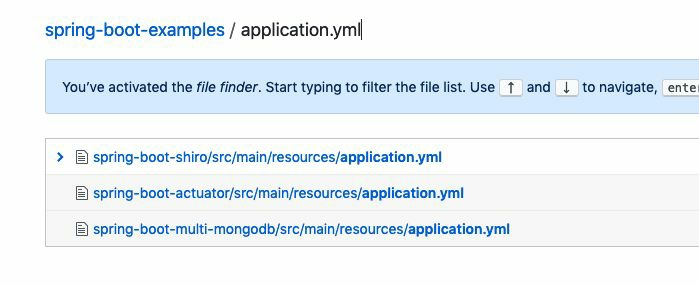

类似的页面内快捷键还有很多，常用的还有【`L`】, 在文件内跳转到多少行。更多快捷键可以查看官方文档：https://help.github.com/en/articles/using-keyboard-shortcuts

### 3.7. 搜索某个地区内的大佬

可以通过`location:地区`进行检索，在具体可以通过`language:语言`缩小检索范围

如搜索地区在北京的Java方向的用户，输入：`location:beijing language:java`

## 4. 推荐一些Github插件（chrome浏览器插件）

### 4.1. Octotree

平时浏览github代码时，每个文件都需要点击才能查看，用了这个插件可以将项目的目录结构以树形结构显示，点击之后会自动跳转到相应的目录。墙裂推荐！

### 4.2. OctoLinker

该插件作用是：在浏览代码像ide那样可以链接跳转。只需要ctrl+点击变量名即可。

### 4.3. Sourcegraph

一个可以在github上浏览和搜索代码的工具，安装好插件之后会出现一个view Repository的按钮。

点击进去之后，可以随意在项目中搜索，可以查看变量和方法，以及进行跳转等等。

## 5. GitHub项目定时发布最新Hosts

项目地址：https://github.com/521xueweihan/GitHub520

该项目会自动发布在指定的地址上，结合软件使用，可以完全自动化，无需持续更新

### 5.1. 手动修改

hosts 文件在每个系统的位置如下：

- Windows 系统：C:\Windows\System32\drivers\etc\hosts
- Linux 系统：/etc/hosts
- Mac（苹果电脑）系统：/etc/hosts
- Android（安卓）系统：/system/etc/hosts
- iPhone（iOS）系统：/etc/hosts

```
# GitHub520 Host Start
185.199.108.154               github.githubassets.com
199.232.68.133                camo.githubusercontent.com
199.232.68.133                github.map.fastly.net
199.232.69.194                github.global.ssl.fastly.net
140.82.113.4                  github.com
140.82.113.5                  api.github.com
199.232.68.133                raw.githubusercontent.com
199.232.68.133                user-images.githubusercontent.com
199.232.68.133                favicons.githubusercontent.com
199.232.68.133                avatars5.githubusercontent.com
199.232.68.133                avatars4.githubusercontent.com
199.232.68.133                avatars3.githubusercontent.com
199.232.68.133                avatars2.githubusercontent.com
199.232.68.133                avatars1.githubusercontent.com
199.232.68.133                avatars0.githubusercontent.com
# Star me GitHub url: https://github.com/521xueweihan/GitHub520
# GitHub520 Host End

数据更新时间：2020-07-25T20:14:26+08:00
```

### 5.2. 激活生效

大部分情况下是直接生效，如未生效可尝试下面的办法，刷新 DNS：

1. Windows：在 CMD 窗口输入：`ipconfig /flushdns`
2. Linux 命令：`sudo rcnscd restart`
3. Mac 命令`：sudo killall -HUP mDNSResponder`

Tips： 上述方法无效可以尝试重启机器。

### 5.3. 自动修改方式

Tip：推荐 SwitchHosts 工具管理 hosts。以 SwitchHosts 为例，自动修改配置参考下面：

- Title: 随意
- Type: Remote
- URL: https://gitee.com/xueweihan/codes/6g793pm2k1hacwfbyesl464/raw?blob_name=GitHub520.yml
- Auto Refresh: 最好选 1 hour

## 6. 解决GitHub Pages访问不了

GitHub正常访问，但GitHub Pages无法访问。尝试过修改hosts域名的映射，没有作用。后来直接修改网卡的DNS服务器地址为`114.114.114.114`可访问（*不确保百分百有效*）

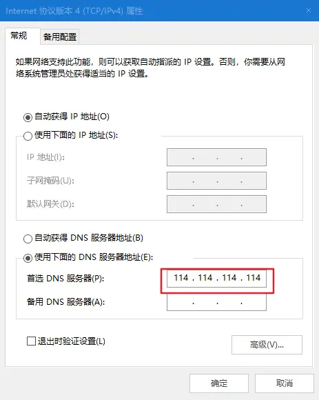

## 7. 一键生成 Github 简历

通过 http://resume.github.io/ 这个网站可以一键生成一个在线的 Github 简历。

## 8. 个性化 Github 首页

创建一个和你的 Github 账户同名的仓库，然后自定义README.md的内容，该内容就展示在主页上。

通过 `github-readme-stats` 这个开源项目，可以在 README 中展示动态生成的 GitHub 统计信息。

## 9. 自定义项目徽章

通过 https://shields.io/ 这个网站生成的，还可以动态读取你项目的状态并生成对应的徽章。

## 10. Github 表情

表情素材参考：www.webfx.com/tools/emoji-cheat-sheet/

## 11. 自动为 Markdown 文件生成目录

如果想为 Github 上的 Markdown 文件生成目录的话，通过 VS Code 的 Markdown Preview Enhanced 这个插件就可以了。

生成的目录后，可以直接点击目录中的链接即可跳转到文章对应的位置，可以优化阅读体验。
