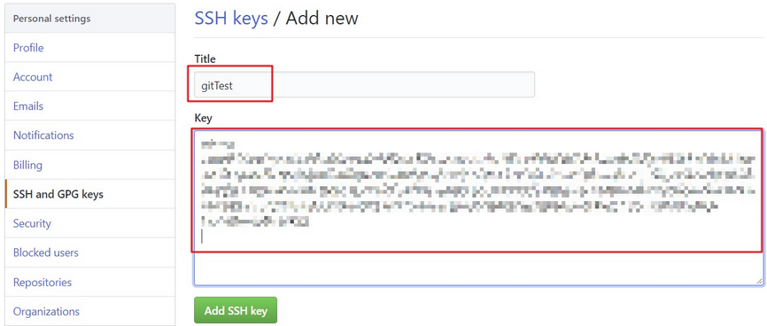

## 1. GitHub 概述

> 官网：https://github.com/

GitHub 全球最大的开源社区，是一个面向开源及私有软件项目的托管平台。

## 2. 创建 GitHub 仓库

### 2.1. 注册账号

使用邮箱注册即可


### 2.2. 创建仓库

登录 github，选择【New repository】，创建一个仓库


填写仓库相关的信息


点击【create repository】按钮仓库就创建成功


Github 支持两种协议【https】和【ssh】。如果使用 https 很简单基本不需要配置就可以使用，但是每次提交代码和下载代码时都需要输入用户名和密码。而且如果是公司配置的私有 git 服务器一般不提供 https 方式访问，都采用 ssh

### 2.3. SSH 密钥生成

SSH是英文Secure Shell的简写形式。通过使用SSH，它可以把所有传输的数据进行加密，这样可以防止DNS欺骗和IP欺骗。最早的时候，互联网通信都是明文通信，一旦被截获，内容就暴露无疑。1995年，芬兰学者Tatu Ylonen设计了SSH协议，将登录信息全部加密，成为互联网安全的一个基本解决方案，迅速在全世界获得推广，目前已经成为Linux系统的标准配置。

在 windows 系统下，可以使用 Git Bash.exe 来生成密钥，在任意目录下右键菜单点击【Git Bash Here】。


执行命令 `ssh-keygen -t rsa`，生成公钥和私钥


生成的密钥对在 `c:/users/当前用户/.ssh` 目录中


### 2.4. 配置指定 SSH 密钥（非必须）

编辑 SSH 的配置文件 `~/.ssh/config`，并加入以下配置：

```
Host github.com
    HostName github.com
    User git
    IdentityFile /root/.ssh/xxx
    IdentitiesOnly yes
```

参数解析：

- `Host github.com` 用于指定该密钥的主机名，这里必须使用代码库的主机名 github.com。
- `HostName github.com` 指定主机对应的具体域名，与 Host 保持一致。Host 和 HostName 可以不同，但是 Host 必须与代码库的主机名匹配，也就是 Git 在需要时会使用代码库的主机名来在 SSH 配置文件中查找匹配的 Host，找到后就使用该配置，访问的具体域名将采用 HostName。
- `User git` 说明该配置的用户必须是 git。
- `IdentityFile /root/.ssh/xxx` 这一行非常关键，需要指定要使用那个 SSH 密钥文件，这里的密钥文件一定是私钥文件，不是有 pub 后缀的那个。
- `IdentitiesOnly yes` 请配置为 yes。

### 2.5. ssh 密钥配置

密钥生成后，需要在 github 上配置 ssh 的公钥，本地才可以使用 ssh 方式进行代码拉取与提交。


使用文本编辑器打开刚刚生成的公钥(id_rsa.pub)，在 key 部分将 id_rsa.pub 文件内容添加进去，然后点击【Add SSH key】按钮完成配置



## 3. 常用词的含义

- watch：会持续收到该项目的动态
- fork，复制某个项目到自己的Github仓库中
- star，可以理解为点赞
- clone，将项目下载至本地
- follow，关注你感兴趣的作者，会收到他们的动态

## 4. Github 搜索技巧

### 4.1. 通过 in 关键词限制搜索范围

语法：

- `in:name xxx`：项目名包含xxx的
- `in:description xxx`：项目描述包含xxx的
- `in:readme xxx`：项目的readme文件中包含xxx的

也可以通过 `in:name,desciption xxx` 来组合使用。示例：

```
# 查出仓库名中有『python』的项目
in:name python
# 与 in:name python 一样效果
python in:name
# 查询仓库名或者项目描述中有『python』的项目
in:name,desciption python
# 查询readme.md文件中包含『python』的项目
in:readme python
# 查询 octocat 的 hello-world 项目（指定了某个人的某个项目）
repo:octocat/hello-world
```

### 4.2. 通过辅助限定词查询项目

可以通过限制 `项目大小(size)`、`拥护者数(followers)`、`fork数(forks)`、`stars数(stars)`、`创建时间(created)`、`更新时间(pushed)`、`项目所用语言(language)`、`topic标签(topic)`、`topic标签数(topics)`...来筛选项目

辅助限定词可以多个并用，用空格隔开，可以搭配限定词使用，也可单独使用。通过通配符 `>`、`<`、`=` 指定搜索区间，区间范围内可通过`num1..num2`。

#### 4.2.1. 根据 stars 或 fork 数量去查找

语法：

- `stars:>xxx` stars 数大于 xxx
- `stars:a..b` stars 数在 a 与 b 之间
- `forks:>xxx` forks 数大于 xxx
- `forks:a..b` forks 数在 a 与 b 之间

示例：

```
# 查找star数大于等于5000的springboot项目
spring boot stars:>=5000
# 查找fork数大于500的springcloud项目
spring cloud forks:>500
# 查找fork在100到200之间并且stars数在80到100之间的springboot项目
spring boot forks:100..200 stars:80..100
# 通过指定名称来进一步缩小范围，Star数量过滤，要求Star数量大于3000
in:name spring boot starts:>3000
```

#### 4.2.2. 按照地区和语言进行搜索

语法：

- `location:地区名称` 查询指定地区的项目
- `language:语言` 查询指定语言的项目

示例：

```
# 搜索语言为javaScript 的项目
language:javaScript
# 搜索包含 moon 关键字的 javaScript 语言项目
language:javaScript moon
# 地区为 china 的项目
location:China
# 组合使用，索地区在北京的Java方向的用户
location:beijing language:java
```

#### 4.2.3. 根据仓库大小搜索

语法：

- `size:> 数字`

> Notes: 其中数字的单位是Kb

示例：

```
# 搜索项目大小等于 1MB 的项目
size:1000
# 搜索项目大小小于 1MB 的项目
size:<=1000
# 搜索项目名字中有 python 且小于 1MB 的项目
in:name python size:<=1000
# 搜索仓库大小在50kb到120kb之间的项目
size:50..120
```

#### 4.2.4. 根据仓库更新与创建时间进行搜索

语法：

- `pushed:> YYYY-MM-DD` 最后上传日期大于YYYY-MM-DD
- `created:> YYYY-MM-DD` 创建日期大于YYYY-MM-DD

示例：

```
# 搜索2020年最新更新的 Spring Boot 项目
pushed:>2020-01-03 Spring Boot
# 搜索仓库中包含 wechat 关键字并且是在2023年之前创建的项目（也支持时分秒，支持大于小于区间等）
created:<2023-01-01 wechat
```

#### 4.2.5. 根据某个人或组织进行搜索

语法：

- `user:{USERNAME}`：查询指定用户的内容
- `org:{ORGNAME}`：查询指定组织的内容
- `followers:>=xxx` 查找关注者数量超过xxx的开发者

示例：

```bash
# 查询用户为 1335951413 的 stars 少于 10 的项目
user:1335951413 stars:<10
# 查询 spring 组织名下的项目
org:spring
# 搜索follow都大于1000的项目（支持大于小于区间等）
followers:>1000
```

#### 4.2.6. 根据仓库的 LICENSE 搜索

开源项目的 License（项目授权协议） 有的开源项目作者明确禁止商用。“非常友好”的协议，比较出名的有这几种：BSD、MPL（Mozilla）、Apache、MIT。这些协议不但允许项目的使用者使用开源库，有些还允许对开源库进行修改并重新分发。以下是详细介绍了各个License的区别：

> http://choosealicense.com/licenses/

语法：

- `license:对应协议`

示例：

```
# 搜索开源协议是为 Apache License 2 的代码
license:apache-2.0 Spring Boot
```

#### 4.2.7. 其他条件搜索

语法：

- `topic:主题名称` 包含指定主题的项目（项目描述下面的内容，相关于标签、分类）
- `topics:n` 指定主题数量的项目（支持大于小于区间等）
- `archived:true/false` 是否已封存的项目（已经不再维护了项目）
- `is:public/private` 是公开还是私有的项目（私有的其他人是无法搜索，因此这个是用来搜索自己的私有项目）

示例：

```
# 搜索含有 moon 这个 topic 的项目
topic:moon
# 搜索有5个以上 topic 的项目
topics:>5
# 搜索已经封存并且含有 java 关键字的项目
archived:true java
# 搜索仓库中所有spring组织公开的项目
is:public org:spring
# 搜索包含 spring 关键字的私有项目（自己或者是成员的私有项目）
is:private spring
```

### 4.3. awesome + 关键字

Awesome 似乎已经成为不少 GitHub 项目喜爱的命名之一，Awesome 往往整合了大量的同一领域的资料。

通过搜索和关键字匹配的优秀项目。如：`awesome springboot`，搜索优秀的 springboot 相关的项目，包括框架、教程等

### 4.4. 分享项目中某一行的代码

只需要在具体的网址后面拼接`#Lxx`(xx为行数)

如：需要分享这个类中的@SprintBootApplication注解，值需要在后面拼接上#L6 即可

```
https://github.com/lxy-go/SpringBoot/.../JpaApplication.java#L6
```

浏览器访问时发现高亮显示了


当然也可以段落进行高亮显示

```
https://github.com/lxy-go/SpringBoot/blob/master/SpringBoot/DataJpaApplication.java#L6-L10
```


### 4.5. 项目内搜索

打开想要搜索的项目，然后按一下【`T`】键。会跳转至一个新的网页，


如想要搜索该项目的配置文件 application.yml


类似的页面内快捷键还有很多，常用的还有【`L`】, 在文件内跳转到多少行。更多快捷键可以查看官方文档：https://help.github.com/en/articles/using-keyboard-shortcuts

### 4.6. 热门搜索（GitHub Trend 和 GitHub Topic）

GitHub Trend 页面总结了每天/每周/每月周期的热门 Repositories 和 Developers，可以看到在某个周期处于热门状态的开发项目和开发者

> https://github.com/trending

GitHub Topic 展示了最新和最流行的讨论主题，在这里不仅能够看到开发项目，还能看到更多非开发技术的讨论主题

> https://github.com/topics

## 5. 推荐一些 Github 插件（chrome浏览器插件）

### 5.1. Octotree

平时浏览github代码时，每个文件都需要点击才能查看，用了这个插件可以将项目的目录结构以树形结构显示，点击之后会自动跳转到相应的目录。墙裂推荐！

### 5.2. OctoLinker

该插件作用是：在浏览代码像ide那样可以链接跳转。只需要ctrl+点击变量名即可。

### 5.3. Sourcegraph

一个可以在github上浏览和搜索代码的工具，安装好插件之后会出现一个view Repository的按钮。

点击进去之后，可以随意在项目中搜索，可以查看变量和方法，以及进行跳转等等。

## 6. GitHub 项目定时发布最新 Hosts

项目地址：https://github.com/521xueweihan/GitHub520

该项目会自动发布在指定的地址上，结合软件使用，可以完全自动化，无需持续更新

### 6.1. 手动修改

hosts 文件在每个系统的位置如下：

- Windows 系统：C:\Windows\System32\drivers\etc\hosts
- Linux 系统：/etc/hosts
- Mac（苹果电脑）系统：/etc/hosts
- Android（安卓）系统：/system/etc/hosts
- iPhone（iOS）系统：/etc/hosts

```
# GitHub520 Host Start
185.199.108.154               github.githubassets.com
199.232.68.133                camo.githubusercontent.com
199.232.68.133                github.map.fastly.net
199.232.69.194                github.global.ssl.fastly.net
140.82.113.4                  github.com
140.82.113.5                  api.github.com
199.232.68.133                raw.githubusercontent.com
199.232.68.133                user-images.githubusercontent.com
199.232.68.133                favicons.githubusercontent.com
199.232.68.133                avatars5.githubusercontent.com
199.232.68.133                avatars4.githubusercontent.com
199.232.68.133                avatars3.githubusercontent.com
199.232.68.133                avatars2.githubusercontent.com
199.232.68.133                avatars1.githubusercontent.com
199.232.68.133                avatars0.githubusercontent.com
# Star me GitHub url: https://github.com/521xueweihan/GitHub520
# GitHub520 Host End

数据更新时间：2020-07-25T20:14:26+08:00
```

### 6.2. 激活生效

大部分情况下是直接生效，如未生效可尝试下面的办法，刷新 DNS：

1. Windows：在 CMD 窗口输入：`ipconfig /flushdns`
2. Linux 命令：`sudo rcnscd restart`
3. Mac 命令`：sudo killall -HUP mDNSResponder`

Tips： 上述方法无效可以尝试重启机器。

### 6.3. 自动修改方式

Tip：推荐 SwitchHosts 工具管理 hosts。以 SwitchHosts 为例，自动修改配置参考下面：

- Title: 随意
- Type: Remote
- URL: https://gitee.com/xueweihan/codes/6g793pm2k1hacwfbyesl464/raw?blob_name=GitHub520.yml
- Auto Refresh: 最好选 1 hour

## 7. Github 扩展内容

### 7.1. 解决 GitHub Pages 访问不了

GitHub正常访问，但GitHub Pages无法访问。尝试过修改hosts域名的映射，没有作用。后来直接修改网卡的DNS服务器地址为`114.114.114.114`可访问（*不确保百分百有效*）


### 7.2. 一键生成 Github 简历

通过 http://resume.github.io/ 这个网站可以一键生成一个在线的 Github 简历。

### 7.3. 个性化 Github 首页

创建一个和你的 Github 账户同名的仓库，然后自定义README.md的内容，该内容就展示在主页上。

通过 `github-readme-stats` 这个开源项目，可以在 README 中展示动态生成的 GitHub 统计信息。

### 7.4. 自定义项目徽章

通过 https://shields.io/ 这个网站生成的，还可以动态读取你项目的状态并生成对应的徽章。

### 7.5. Github 表情

表情素材参考：https://www.webfx.com/tools/emoji-cheat-sheet/

### 7.6. 自动为 Markdown 文件生成目录

如果想为 Github 上的 Markdown 文件生成目录的话，通过 VS Code 的 Markdown Preview Enhanced 这个插件就可以了。

生成的目录后，可以直接点击目录中的链接即可跳转到文章对应的位置，可以优化阅读体验。

### 7.7. Github 项目无法通过 ssh 连接，无法 push pull

#### 7.7.1. 问题描述

2024年01月20日，最近这两天 github 遇到问题，就是以前正常使用的 git 项目，现在无法 push 或 pull 了。错误提示如下：

```
ssh: connect to host github.com port 22: Connection timed out
fatal: Could not read from remote repository.

Please make sure you have the correct access rights
and the repository exists.
```

#### 7.7.2. 解决方法

解决方案是修改 SSH 配置文件，通过端口 443 以 SSH 方式登录 git@ssh.github.com，则可以覆盖 SSH 设置，强制通过该服务器和端口连接 GitHub.com。（可以参考官方说明，[Using SSH over the HTTPS port](https://docs.github.com/en/authentication/troubleshooting-ssh/using-ssh-over-the-https-port)）

要测试是否可以通过 HTTPS 端口传输 SSH，运行以下命令：

```bash
$ ssh -T -p 443 git@ssh.github.com
> Hi USERNAME! You've successfully authenticated, but GitHub does not provide shell access.
```

如果运行不成功，则在 `~/.ssh/config` 中添加以下配置，以前的项目就都能正常使用了。

```
Host github.com
    Hostname ssh.github.com
    Port 443
    User git
```

再次连接到 GitHub.com 来测试是否正常工作：

```bash
$ ssh -T git@github.com
> Hi USERNAME! You've successfully authenticated, but GitHub does not provide shell access.
```

改用端口 443 后，第一次与 GitHub 交互时，可能会收到一条警告信息，称在已知主机中找不到该主机，或以其他名称找到了该主机。

```bash
> The authenticity of host '[ssh.github.com]:443 ([140.82.112.36]:443)' can't be established.
> ED25519 key fingerprint is SHA256:+DiY3wvvV6TuJJhbpZisF/zLDA0zPMSvHdkr4UvCOqU.
> This host key is known by the following other names/addresses:
>     ~/.ssh/known_hosts:32: github.com
> Are you sure you want to continue connecting (yes/no/[fingerprint])?
```

假设 SSH 指纹与 GitHub 公布的指纹之一相符，输入 “yes” 即可。

后面要克隆版本库，可以运行以下命令（主要增加 443 端口号）：

```bash
git clone ssh://git@ssh.github.com:443/YOUR-USERNAME/YOUR-REPOSITORY.git
```
