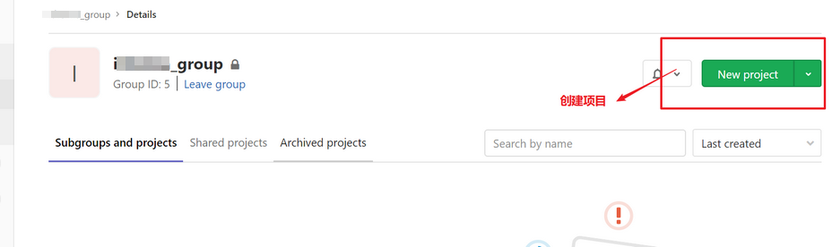

## 1. GitLab


GitLab 是一个用于仓库管理系统的开源项目，使用 Git 作为代码管理工具，并在此基础上搭建起来的web服务。

GitLab 和 GitHub 一样属于第三方基于 Git 开发的作品，免费且开源（基于 MIT 协议），与 Github 类似，可以注册用户，任意提交代码，添加 SSHKey 等等。不同的是，GitLab 是可以部署到自己的服务器上，数据库等一切信息都掌握在自己手上，适合团队内部协作开发，实际项目中是不可能把团队内部的源码放在别人的服务器上。简单来说可把 GitLab 看作个人版的 GitHub。

> 官网： https://about.gitlab.com/

## 2. Gitlab 安装

### 2.1. 运行环境说明

安装所需最小配置：内存至少 4G

> 官方说明： https://docs.gitlab.cn/jh/install/requirements.html

### 2.2. ssh 版安装

> 官方安装文档：https://gitlab.cn/install/?version=ce

- 安装相关依赖

```bash
yum -y install policycoreutils openssh-server openssh-clients postfix
# 待确认是否需要安装以下依赖
sudo yum install -y curl policycoreutils-python openssh-server perl
```

- 启动 ssh 服务，并设置为开机启动

```bash
systemctl enable sshd && sudo systemctl start sshd
```

- 设置 postfix 开机自启，并启动，postfix 支持 gitlab 发信功能

```bash
systemctl enable postfix && systemctl start postfix
```

- 开放 ssh 以及 http 服务，然后重新加载防火墙列表

```bash
firewall-cmd --add-service=ssh --permanent
firewall-cmd --add-service=http --permanent
firewall-cmd --reload
```

> Tips: 如果关闭防火墙就不需要做以上配置

- 安装方式1：在线下载 gitlab 包，并且安装。也可以手动下载安装包后上传到服务器进行安装。

```bash
# 在线下载安装包：
wget https://mirrors.tuna.tsinghua.edu.cn/gitlab-ce/yum/el6/gitlab-ce-12.4.2-ce.0.el6.x86_64.rpm

# 安装：
rpm -i gitlab-ce-12.4.2-ce.0.el6.x86_64.rpm
```

- 安装方式2：先配置镜像，再下载安装

```bash
# 配置镜像
curl -fsSL https://packages.gitlab.cn/repository/raw/scripts/setup.sh | /bin/bash
# 安装
sudo EXTERNAL_URL="http://192.168.44.103" yum install -y gitlab-jh
```

> Tips: 除非在安装过程中指定了自定义密码，否则将随机生成一个密码并存储在 `/etc/gitlab/initial_root_password` 文件中(出于安全原因，24 小时后，此文件会被第一次 `gitlab-ctl reconfigure` 自动删除，因此若使用随机密码登录，建议安装成功初始登录成功之后，立即修改初始密码）。使用此密码和用户名 `root` 登录。

- 修改 gitlab 配置

```bash
vi /etc/gitlab/gitlab.rb
```

修改 gitlab 访问地址和端口，默认为80，修改为82。具体内容如下：

```
external_url 'http://192.168.66.100:82'
nginx['listen_port'] = 82
```

- 重载配置及启动 gitlab

```bash
gitlab-ctl reconfigure
gitlab-ctl restart
```

- 把端口添加到防火墙

```bash
firewall-cmd --zone=public --add-port=82/tcp --permanent
firewall-cmd --reload
```

启动成功后，看到以下修改管理员 root 密码的页面，修改密码后，然后登录即可


### 2.3. docker 版安装

#### 2.3.1. 安装前置说明

> 官方参考文档：https://docs.gitlab.cn/jh/install/docker.html

安装所需最小配置

- 内存至少 4G
- 系统内核至少在 3.10 以上，可使用 `uname -r` 命令查看系统内核版本

#### 2.3.2. 安装 docker

1. 更新 yum 源

```bash
yum update
```

2. 安装依赖

```bash
yum install -y yum-utils device-mapper-persistent-data lvm2
```

3. 添加镜像

```bash
# 国外镜像
yum-config-manager --add-repo https://download.docker.com/linux/centos/docker-ce.repo
# 阿里镜像 https://mirrors.aliyun.com/docker-ce/linux/centos/gpg
yum-config-manager --add-repo http://mirrors.aliyun.com/docker-ce/linux/centos/docker-ce.repo
```

4. 查看源中可使用版本

```bash
yum list docker-ce --showduplicates | sort -r
```

5. 安装指定版本

```bash
yum install docker
```

6. 配置开机启动项

```bash
systemctl start docker
systemctl enable docker
```

7. 查看 docker 版本

```bash
docker version
```

#### 2.3.3. 使用容器安装 gitlab

- 添加容器

```shell
docker run --detach \
  --hostname 192.168.44.103 \
  --publish 443:443 --publish 80:80 \
  --name gitlab \
  --restart always \
  --volume $GITLAB_HOME/config:/etc/gitlab:Z \
  --volume $GITLAB_HOME/logs:/var/log/gitlab:Z \
  --volume $GITLAB_HOME/data:/var/opt/gitlab:Z \
  --shm-size 256m \
  registry.gitlab.cn/omnibus/gitlab-jh:latest
```

- 启动容器

```bash
docker start gitlab
```

- 查看已存在的容器

```bash
docker ps -a
```

- 进入容器

```bash
docker exec -it  gitlab /bin/bash
```

#### 2.3.4. 管理员账号登录

用户名是 `root`，密码存在下面文件中，登录后需要改密码不然24小时之后会失效

```bash
cat /etc/gitlab/initial_root_password
```

#### 2.3.5. 测试访问

启动后访问（根据具体虚拟机的地址）。当首次运行出现 502 错误的时候排查两个原因

1. 虚拟机内存至少需要 4g
2. 稍微再等等刷新一下可能就好了

## 3. Gitlab 基础使用

### 3.1. gitlab 常用命令

- 启动所有 gitlab 组件

```bash
gitlab-ctl start
```

- 停止所有 gitlab 组件

```bash
gitlab-ctl stop
```

- 重启所有 gitlab 组件

```bash
gitlab-ctl restart
```

- 查看服务状态

```bash
gitlab-ctl status
```

- 启动服务

```bash
gitlab-ctl reconfigure
```

- 修改默认的配置文件

```bash
vi /etc/gitlab/gitlab.rb
```

- 查看日志

```bash
gitlab-ctl tail
```

### 3.2. 创建组

使用管理员 root 创建组，一个组里面可以有多个项目分支，可以将开发添加到组里面进行设置权限，不同的组就是公司不同的开发项目或者服务模块，不同的组添加不同的开发即可实现对开发设置权限的管理。


### 3.3. 创建用户

#### 3.3.1. 新建操作

创建用户的时候，可以选择 `Regular` 或 `Admin` 类型。


创建完用户后，立即修改密码


#### 3.3.2. 将用户添加到组中

选择某个用户组，进行 Members 管理组的成员


选择当前用户在组内的角色。*角色权限说明详见下个小节*


#### 3.3.3. Gitlab 用户在组里面的5种不同权限

- Guest：可以创建issue、发表评论，不能读写版本库
- Reporter：可以克隆代码，不能提交，QA、PM 可以赋予这个权限
- Developer：可以克隆代码、开发、提交、push，普通开发可以赋予这个权限
- Maintainer：可以创建项目、添加 tag、保护分支、添加项目成员、编辑项目，核心开发可以赋予这个权限
- Owner：可以设置项目访问权限、Visibility Level、删除项目、迁移项目、管理组成员，开发组组长可以赋予这个权限

### 3.4. 在用户组中创建项目

以刚才创建的新用户身份登录到 Gitlab，然后在用户组中创建新的项目



填写项目的基本信息后，点击【Create project】


## 4. 上传源码到 Gitlab 仓库

以 IDEA 开发工具为示例，将已经准备好一个简单的 Web 应用代码上传到Gitlab的项目仓库中。

- 项目结构说明。建立了一个非常简单的 web 应用，只有一个 index.jsp 页面，如果部署好，可以访问该页面就成功啦！


- IDEA 开启版本控制


- 先将代码 Add 到本地缓存区


- 再 Commit 到本地仓库

 

- 推送到 Gitlab 项目仓库中

 

- 到 Gitlab 的项目中拷贝 url 地址


- 输入 gitlab 的用户名和密码，然后就可以把代码推送到远程仓库


- 刷新 gitlab 项目


