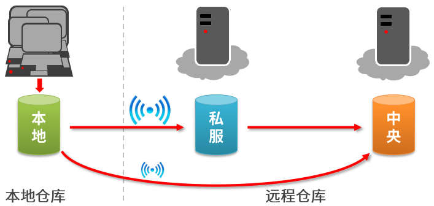
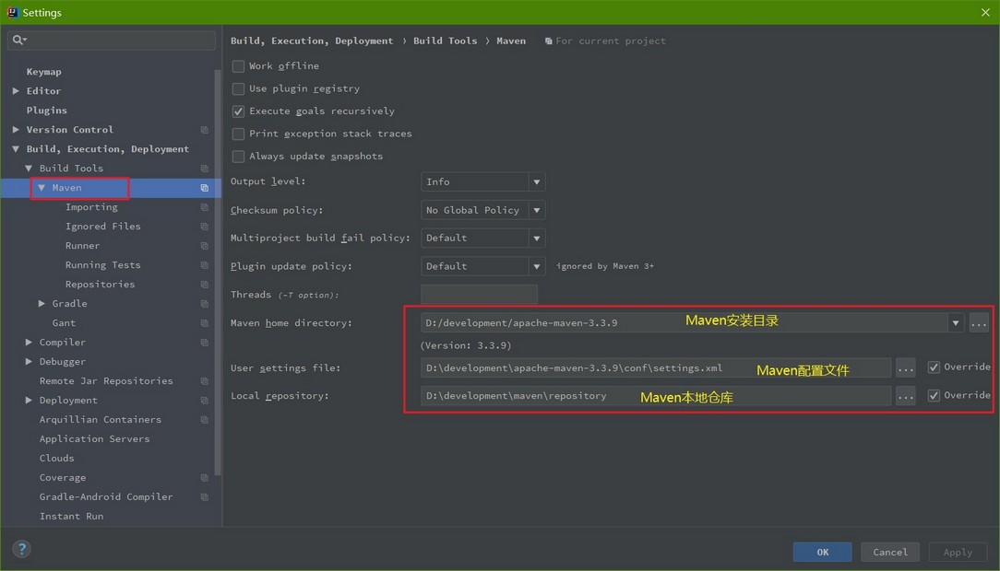
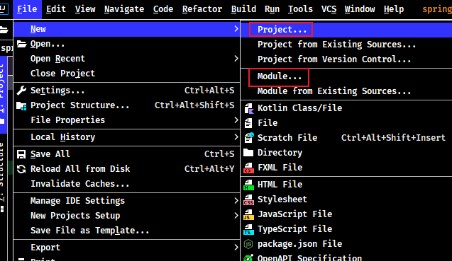
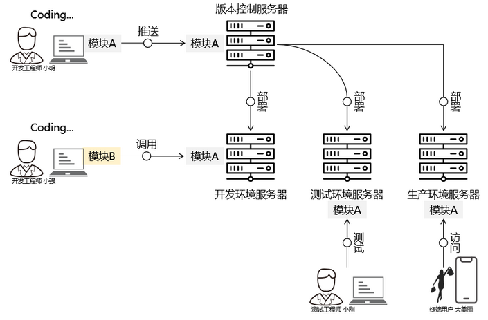

## 1. 概述

> Maven 官网：https://maven.apache.org/

### 1.1. Maven 是什么

Maven 的 Apache 公司开源项目，是项目依赖管理、构建工具。

Maven 是用于建立 jar 包仓库，使用依赖管理，就是对 jar 包统一管理，maven 项目中如果需要使用一个 jar 包，只需要在 maven 项目中配置需要 jar 包坐标信息，maven 程序根据 jar 包坐标的信息去 jar 包仓库中查找 jar 包

Maven 采用 Project Object Modle（POM、项目对象模型）概念来管理项目，即将项目开发和管理过程抽象成一个项目对象模型(POM)，所有的项目配置信息都定义在 pom.xml 文件中。

**Maven 的两大核心**：

- **项目构建**：项目在编码完成后，对项目进行编译、测试、打包、部署等一系列的操作都通过**命令**来实现
- **依赖管理**：对 jar 包管理过程

### 1.2. 什么是项目构建

项目构建是一个项目从编写源代码到编译、测试、运行、打包、部署、运行的过程

#### 1.2.1. 传统项目构建过程

传统的使用 IDE 构建项目过程如下：

1. 在 IDE 中创建一个 java web 工程
2. 在工程中编写源代码及配置文件等
3. 对源代码进行编译，java 文件编译成 class 文件
4. 执行 Junit 单元测试
5. 将工程打成 war 包部署至 tomcat 运行

#### 1.2.2. maven 项目构建过程

maven 将项目构建的过程进行标准化，每个阶段使用一个命令完成


上图中部分阶段对应命令如下：

- 清理阶段对应 maven 的命令是 `clean`，清理输出的 class 文件
- 编译阶段对应 maven 的命令是 `compile`，将 java 代码编译成 class 文件。
- 打包阶段对应 maven 的命令是 `package`，java 工程可以打成 jar 包，web 包可以打成 war 包
- 运行一个 maven 工程（web工程）需要一个命令：`tomat:run`


### 1.3. 使用 maven 构建工程的优点

1. 一步构建。maven 对项目构建的过程进行标准化，通过一个命令即可完成构建、运行的过程，方便快速。
2. 依赖管理。maven 工程不用手动导 jar 包，通过在 pom.xml 中定义坐标从 maven 仓库自动下载，方便且不易出错
3. maven 的跨平台，可在 window、linux 上使用
4. 使用 maven 可以分模块化的构建项目
5. maven 对每个构建阶段都遵循规范开发，有利于提高大型团队的协作开发效率，降低项目的维护成本，大公司都会考虑使用 maven 来构建项目

## 2. Maven 的安装与配置

Maven 3.3+ 环境要求：需要使用 JDK 1.7+，它的运行依赖JDK。因此需要本地系统先安装 JDK，并使用 `java -version` 命令检查本机的 JDK 安装版本信息。

### 2.1. 下载 Maven 安装包

- 官方最新版本下载地址：https://maven.apache.org/download.cgi
- 历史版本下载地址：https://archive.apache.org/dist/maven/maven-3/
- Maven Releases History（Maven 历史版本）：https://maven.apache.org/docs/history.html

### 2.2. Maven 的目录结构

下载 maven 的压缩包 `apache-maven-3.x.x-bin.zip`，解压到本地磁盘（解压目录不要有中文、空格）。maven 目录结构如下：


- 【bin】：含有mvn运行的脚本。其中 mvn.bat（以run方式运行项目）、mvnDebug.bat（以debug方式运行项目）
- 【boot】：maven运行需要 plexus-classworlds 类加载器框架
- 【conf】：包含 settings.xml 配置文件，整个maven工具核心配置文件。settings.xml 中默认的用户库: `${user.home}/.m2/repository`。通过maven下载的jar包都会存储到此仓库中。可以手动修改指定的保存路径。
- 【lib】：maven 运行依赖 jar 包

### 2.3. 配置环境变量

> 电脑上需先安装java环境，至少 JDK1.7+ 版本（将`JAVA_HOME/bin`配置环境变量path）。

如果需要使用 maven 命令行，就必须配置环境变量。注：maven环境变量的配置是可选，如果使用eclipse/idea关联运行项目，可以需要配置也能正常使用。但建议还是配置使用比较方便。

- 配置 Maven 环境变量：`MAVEN_HOME`，值为本机 Maven 根目录路径。


- 在 path 系统变量中，增加 `%MAVEN_HOME%\bin`


- *可选配置（注意：可以不配置）*。配置 MAVEN_OPTS 的环境变量，值为 `-Xms256m -Xmx512m`


### 2.4. 验证是否安装成功

查询 maven 的版本信息，用于检验 maven 是否配置成功。打开命令行，输入以下命令：

```bash
mvn -v
```


### 2.5. Maven 全局核心配置

#### 2.5.1. 全局 setting 与用户 setting

maven 仓库地址、私服等配置信息需要在 setting.xml 文件中配置，分为<font color=red>全局配置</font>和<font color=red>用户配置</font>。

- 在 maven 安装目录下的有 `conf/setting.xml` 文件，此 setting.xml 文件用于 maven 的所有 project 项目，它作为 maven 的全局配置。
- 如需要个性配置则需要在用户配置中设置，用户配置的 setting.xml 文件默认的位置在：`${user.dir}/.m2/settings.xml` 目录中，`${user.dir}` 指 windows 中的用户目录。

maven 会先找用户配置，如果找到则以用户配置文件为准，否则使用全局配置文件。


#### 2.5.2. 配置本地仓库

配置本地仓库目的：让 maven 程序知道仓库具体位置。windows 系统本地仓库默认值：`%HOMEPATH%/.m2/repository`。配置方式如下：

1. 打开 `apache-maven-x.x.x\conf\settings.xml` 文件
2. 在 `<localRepository>` 标签中配置本地仓库路径

```xml
<!-- localRepository
| The path to the local repository maven will use to store artifacts.
|
| Default: ${user.home}/.m2/repository
<localRepository>/path/to/local/repo</localRepository>
-->
<!-- 配置本地仓库位置 -->
<localRepository>D:\development\maven\repository</localRepository>
```

> Notes: `<localRepository>` 标签内容在注释里，需要将内容复制到外面进行修改。配置的本地仓库目录，需要先手动创建一个空的目录。仓库目录的名称不能包含中文与空格。

#### 2.5.3. 配置阿里云云效 Maven 镜像仓库

因为中央仓库的服务是在国外，访问中央仓库比较慢。但可以修改全局配置，访问阿里云的公共库。

阿里云 Maven 中央仓库为阿里云云效提供的公共代理仓库，几乎包含全部中央库的 jar 包，使用阿里云 Maven 中央仓库作为下载源，速度更快更稳定。官方说明文档：https://developer.aliyun.com/mvn/guide

修改 maven 的 `\apache-maven-3.x.x\conf\settings.xml` 配置文件，在 `<mirrors>` 标签体内增加阿里云仓库的镜像地址：

```xml
<!-- 阿里云仓库地址(老版) -->
<mirror>
	<id>nexus</id>
	<mirrorOf>*</mirrorOf>
	<url>https://maven.aliyun.com/nexus/content/groups/public/</url>
</mirror>

<!-- 阿里云Maven中央仓库 (最新)
	https://maven.aliyun.com/mvn/guide
-->
<mirror>
  <!-- 镜像的唯一标识符，用于区分不同的 mirror 元素（名称随意，不重复即可） -->
  <id>nexus-aliyun</id>
  <!-- 对哪种仓库进行镜像，即指定替代哪种仓库 -->
  <mirrorOf>public</mirrorOf>
  <!-- 镜像名称（不配置也可以） -->
  <name>阿里云公共仓库</name>
  <!-- 镜像url -->
  <url>https://maven.aliyun.com/repository/public</url>
</mirror>
```


#### 2.5.4. 配置 Maven 工程的基础 JDK 版本

按默认配置运行的 maven 项目，默认使用的 JDK 版本是 1.5。可以通过修改 settings.xml 配置文件，在 `<profiles>` 标签增加以下 `<profile>` 子标签内容，指定 JDK 版本。

```xml
<profiles>
    <!-- 指定 JDK 默认版本 -->
	<profile>
		<id>jdk-1.8</id>
		<activation>
			<!-- 指定为默认激活 -->
			<activeByDefault>true</activeByDefault>
			<!-- 指定 JDK 的版本 -->
			<jdk>1.8</jdk>
		</activation>
		<properties>
			<maven.compiler.source>1.8</maven.compiler.source>
			<maven.compiler.target>1.8</maven.compiler.target>
			<maven.compiler.compilerVersion>1.8</maven.compiler.compilerVersion>
		</properties>
	</profile>
</profiles>
```

## 3. Maven 项目的核心概念

### 3.1. Maven 的概念模型

Maven 包含了一个项目对象模型(Project Object Model)，一组标准集合，一个项目生命周期(Project Lifecycle)，一个依赖管理系统(Dependency Management System)，和用来运行定义在生命周期阶段(phase)中插件(plugin)目标(goal)的逻辑


### 3.2. Maven 仓库

#### 3.2.1. 仓库的类型

<font color=red>本地仓库</font>

- 用来存储从远程仓库或中央仓库下载的插件和 jar 包，项目使用一些插件或 jar 包，优先从本地仓库查找
- 默认本地仓库位置在 `${user.dir}/.m2/repository`，`${user.dir}`表示 windows 用户目录

<font color=red>远程仓库（私服）</font>

- 如果本地需要插件或者 jar 包，本地仓库没有，默认去远程仓库下载
- 远程仓库可以在互联网内也可以在局域网内
- 私服在一定范围内共享资源，仅对内部开放，不对外共享。可以保存具有版权的资源，包含购买或自主研发的 jar。因为中央仓库中的 jar 都是开源的，不能存储具有版权的资源。

<font color=red>中央仓库</font>

在maven软件中内置一个远程仓库地址，它是[中央仓库](https://repo1.maven.org/maven2)，服务于整个互联网，它是由Maven团队自己维护，里面存储了非常全的jar包，它包含了世界上大部分流行的开源项目构件

#### 3.2.2. 相关仓库服务器网址

- 中央仓库的网址：https://repo1.maven.org/maven2/
- maven 坐标查找的网站：https://mvnrepository.com/

#### 3.2.3. 项目查找 jar 顺序

1. 先查找本地仓库
2. 再查找私服或者外网中央仓库
3. 如果在私服查找不到，再到中央仓库查找



**过程详解**：

maven 的工作需要从仓库下载一些 jar 包，如下图所示，本地的项目A、项目B等都会通过 maven 软件从远程仓库（可以理解为互联网上的仓库）下载 jar 包并存在本地仓库，本地仓库就是本地文件夹，当第二次需要此 jar 包时则不再从远程仓库下载，因为本地仓库已经存在了，可以将本地仓库理解为缓存，有了本地仓库就不用每次从远程仓库下载了。

### 3.3. Maven 的坐标

#### 3.3.1. 定义

坐标(GAV)：是 Maven 作为<font color=red>**查找定位 jar 包（项目/组件）的唯一依据**</font>。例如：`struts2-core-2.3.24.jar`

坐标的规则：`Apache(公司名称)+struts2(项目名称)+2.3.24(版本信息)`

#### 3.3.2. Maven 坐标主要组成

- `groupId`：定义当前 Maven 工程隶属项目、组织（通常是域名反转，如：org.mybatis）
- `artifactId`：定义实际项目中的一个项目（模块）名称
- `version`：定义当前项目的版本号，也可以增加以下后缀来说明目前版本的性质
    - `SNAPSHOT` 表示快照版本，正在迭代过程中，不稳定的版本
    - `RELEASE` 表示正式版本

```xml
<groupId>com.moon</groupId>
<artifactId>java-stack-maven</artifactId>
<version>1.0-SNAPSHOT</version>
```

#### 3.3.3. 坐标和仓库中 jar 包存储路径的对应关系

示例坐标：

```xml
<groupId>com.moon</groupId>
<artifactId>maven-demo</artifactId>
<version>1.0</version>
```

上面坐标对应的 jar 包在 Maven 本地仓库中的位置是：`Maven本地仓库根目录\com\moon\maven-demo\1.0\maven-demo-1.0.jar`

### 3.4. 项目对象模型 (POM)

POM：Project Object Model（项目对象模型）。POM 表示将工程抽象为一个模型，再用程序中的对象来描述这个模型。*在开发过程中，最基本的做法就是将现实生活中的事物抽象为模型，然后封装模型相关的数据作为一个对象，这样就可以在程序中计算与现实事物相关的数据。*

POM 理念集中体现在，每个 Maven 工程根目录下都有一个对应的核心配置文件：pom.xml，通过 pom.xml 文件定义项目的坐标、项目依赖、项目信息、插件目标等。

> Notes: 与 POM 相类似的是，DOM：Document Object Model（文档对象模型）。它们都是模型化思想的具体体现。

### 3.5. 依赖管理系统(Dependency Management System)

通过 maven 的依赖管理对项目所依赖的 jar 包进行统一管理。比如：项目依赖 junit 4.9，通过在 pom.xml 中定义 junit 的依赖即使用 junit 4.9，如下所示是 junit 4.9 的依赖定义：

```xml
<!-- 依赖关系 -->
<dependencies>
	<!-- 此项目运行使用junit，所以此项目依赖junit -->
	<dependency>
		<!-- junit的项目名称 -->
		<groupId>junit</groupId>
		<!-- junit的模块名称 -->
		<artifactId>junit</artifactId>
		<!-- junit版本 -->
		<version>4.9</version>
		<!-- 依赖范围：单元测试时使用junit -->
		<scope>test</scope>
	</dependency>
</dependencies>
```

### 3.6. 一个项目生命周期(Project Lifecycle)

使用maven完成项目的构建，项目构建包括：清理、编译、测试、部署等过程，maven将这些过程规范为一个生命周期，如下所示是生命周期的各各阶段：


maven 通过执行一些简单命令即可实现上边生命周期的各各过程，比如执行 `mvn compile` 执行编译、执行 `mvn clean` 执行清理

### 3.7. 一组标准集合

maven 将整个项目管理过程定义一组标准，比如：通过 maven 构建工程有标准的目录结构，有标准的生命周期阶段、依赖管理有标准的坐标定义等。

### 3.8. 插件(plugin)目标(goal)

maven 管理项目生命周期过程都是基于插件完成的。

## 4. Maven 项目的创建

### 4.1. 使用命令行方式创建

直接通过命令行使用 maven 提供的插件创建 maven 项目。语法如下：

```bash
mvn archetype:generate
    -DgroupId={项目包名称}
    -DartifactId={项目名称}
    -DarchetypeArtifactId={模块名称，取值：maven-archetype-quickstart | maven-archetype-webapp 等}
    -Dversion={项目版本号}
    -DinteractiveMode=false
```


> Tips: 如果使用命令时，不指定相关的参数，则会需要创建工程的过程中来输入相关的工程名称、版本号等等信息。

- 创建 java 工程示例：

```bash
mvn archetype:generate -DgroupId=com.moon -DartifactId=java-project-demo -DarchetypeArtifactId=maven-archetype-quickstart -Dversion=1.0.0-SNAPSHOT -DinteractiveMode=false
```

- 创建 web 工程示例：

```bash
mvn archetype:generate -DgroupId=com.moon -DartifactId=web-project-demo -DarchetypeArtifactId=maven-archetype-webapp -Dversion=1.0.0-SNAPSHOT -DinteractiveMode=false
```

> *注：最好在空的目录下创建，目录中不能有pom.xml文件*

示例创建的工程的效果（下面有些目录是自己手动补全，使用骨架命令生成的目录结构不全）：


### 4.2. 使用 IDEA 创建

#### 4.2.1. 配置 idea 中的 maven 环境

- 指定maven的安装目录与仓库目录



- 构建索引。	在 【Settings】 -> 【Maven】 -> 【Repositories】，点击 update 按钮，更新索引


#### 4.2.2. 创建 maven 项目

选择 【File】 -> 【New】 -> 【Project...】/【Module...】 创建项目/模块



1. 可以勾选【Create from archetype】，再选择相应的骨架创建即可
2. 也可以不勾选骨架，直接创建空的 Maven 项目


#### 4.2.3. 创建 web 项目（待整理）

> TODO: 待补充整理！

### 4.3. 使用 eclipse 创建（待整理）

> TODO: 待补充整理！

### 4.4. Maven 约定的标准目录结构

使用 maven 创建的工程称它为 maven 工程，maven 工程具有一定的目录规范，如下：

```
MavenProject
|
|-- src
|    ├── main
|    |    ├── java       # 存放项目的.java文件
|    |    |-- resources  # 存放项目资源文件，如spring,mybatis配置文件（此两个 java 与 resources 源码包，会打入jar包或war包，实现运行有效）
|    |    └── webapp     # webapp 目录是 web 工程的主目录
|    |          └── WEB-INF
|    |                 └── web.xml
|    └── test
|         ├── java       # 存放所有单元测试.java文件，如JUnit测试类
|         └── resources  # 测试资源文件（以上 java 与 resources 两个测试包，不会打包，测试有效，实现运行无效）
|
├── target      # 项目构建操作输出结果的位置，编译后的 .class、.jar、.war 文件会输出到此目录
└── pom.xml     # 项目对象模型 —— maven项目核心配置文件
```


- **约定目录结构的意义**

Maven 为了让构建过程能够尽可能自动化完成，所以必须约定目录结构的作用。例如：Maven 执行编译操作，必须先去 Java 源程序目录读取 Java 源代码，然后执行编译，最后把编译结果存放在 target 目录。

- **约定大于配置**

如果每次创建工程都要针对各个目录的位置进行详细的配置，是相关麻烦的事情。因此标准的 Maven 工程目录结构没有采用配置的方式，而是**基于约定**。目前开发领域的技术发展趋势就是：<font color=red>**约定大于配置，配置大于编码**</font>。

### 4.5. Maven 核心配置文件 pom.xml

- project：任何要build的事物，Maven都认为它们是工程。这些工程被定义为工程对象模型（POM，Poject Object Model）。一个工程可以依赖其它工程，一个工程也可以由多个子工程构成。
- POM：pom(pom.xml)是Maven的核心文件，它是指示Maven如何工作的元数据文件，类似于Ant的build.xml文件。pom.xml文件位于每个工程的根目录下。
- Plug-in：Maven 是由插件组织的，它的每一个功能都由插件提供。插件提供goal，并根据在pom中找到元数据去完成工作

示例基础 pom.xml 文件解读

```xml
<?xml version="1.0" encoding="UTF-8"?>
<!-- project 标签：根标签，表示当前工程的配置、管理 -->
<project xmlns="http://maven.apache.org/POM/4.0.0"
         xmlns:xsi="http://www.w3.org/2001/XMLSchema-instance"
         xsi:schemaLocation="http://maven.apache.org/POM/4.0.0 http://maven.apache.org/xsd/maven-4.0.0.xsd">

    <!-- modelVersion 标签：从 Maven 2 开始固定是 4.0.0。表示当前 pom.xml 所采用的标签结构 -->
    <modelVersion>4.0.0</modelVersion>
    <!-- 项目名称，定义为组织名+项目名，类似包名 -->
    <groupId>com.moon</groupId>
    <!-- 模块名称 -->
    <artifactId>01-maven-helloWorld</artifactId>
    <!-- 当前项目版本号，snapshot 为快照版本即非正式版本，release 为正式发布版本 -->
    <version>0.0.1-SNAPSHOT</version>
    <!--
        <packaging>：打包类型
        jar：表示此工程是一个 Java 工程。执行 package 命令会打成 jar 包，默认值
        war：表示此工程是一个 Web 工程。执行 package 命令会打成 war 包
        pom：用于 maven 工程的继承，通常父工程设置为 pom
     -->
    <packaging>war</packaging>

    <!-- maven 工程使用的属性 -->
    <properties>
        <!-- 示例：工程构建过程中读取源码时使用的字符集 -->
        <project.build.sourceEncoding>UTF-8</project.build.sourceEncoding>
    </properties>

    <!-- jdk编译版本1.5，在pom.xml中添加插件 -->
    <!-- 添加项目jdk编译插件 -->
    <build>
        <plugins>
            <!-- 设置编译版本为自己本机的版本 -->
            <plugin>
                <groupId>org.apache.maven.plugins</groupId>
                <artifactId>maven-compiler-plugin</artifactId>
                <configuration>
                    <source>1.8</source>
                    <target>1.8</target>
                    <encoding>UTF-8</encoding>
                </configuration>
            </plugin>
        </plugins>
    </build>

    <!-- 在 dependencies 标签中配置工程相关的依赖，可以包含多个 dependency 子标签 -->
    <dependencies>
        <!-- dependency 标签指定一个具体的依赖信息 -->
        <dependency>
            <groupId>javax.servlet</groupId>
            <artifactId>servlet-api</artifactId>
            <version>2.5</version>
            <scope>provided</scope>
        </dependency>
        <dependency>
            <groupId>javax.servlet</groupId>
            <artifactId>jsp-api</artifactId>
            <version>2.0</version>
            <scope>provided</scope>
        </dependency>
    </dependencies>

</project>
```

> Tips: 更多 POM 配置与介绍详见[《Maven POM 配置》笔记](/DevOps/项目构建工具/Maven03-POM)

## 5. maven 命令

进入项目根目录，通过（cmd）命令行界面进行操作。如果配置系统的环境变量，即可在任意目录中使用 `mvn` 的命令。

### 5.1. maven 命令格式与参数

maven 命令的格式为 `mvn [plugin-name]:[goal-name]`，可以接受的参数如下。

- `-D` 指定参数，如 `-Dmaven.test.skip=true` 跳过单元测试
- `-P` 指定 Profile 配置，可以用于区分环境
- `-e` 显示maven运行出错的信息
- `-o` 离线执行命令，即不去远程仓库更新包
- `-X` 显示maven允许的debug信息
- `-U` 强制去远程更新snapshot的插件或依赖，默认每天只更新一次。

### 5.2. 构建项目命令执行前提

运行 Maven 中构建操作相关的命令时，必须进入到 pom.xml 所在的目录。如果没有在 pom.xml 所在的目录运行 Maven 的构建命令，那么会看到下面的错误信息：

```bash
The goal you specified requires a project to execute but there is no POM in this directory
```

> Tips: `mvn -v` 命令和构建操作无关，只要正确配置了 Maven 环境变量，在任何目录下执行都可以。而构建相关的命令要在 pom.xml 所在目录下运行。*操作哪个工程，就进入该工程的 pom.xml 所在目录*

### 5.3. maven 常用构建项目的命令

#### 5.3.1. clean（清理）

```bash
mvn clean
```

清理项目根目录下 target 目录，即清理编译后的 class 文件

#### 5.3.2. compile（编译）

```bash
mvn compile
```

maven 工程中主程序的编译命令，作用是将 `src/main/java` 的文件编译后的 class 文件输出到 `target/classes` 目录下

```bash
mvn test-compile
```

maven 工程中测试程序的编译命令，作用是将 `src/test/java` 的文件编译后的 class 文件输出到 `target/test-classes` 目录下

#### 5.3.3. test（单元测试）

```bash
mvn test
```

将项目根目录中 `src/test/java` 目录下的单元测试类全部执行。单元测试类名有要求：`XxxxTest.java`，如果不是以 `Test` 结尾，则无法被执行。

#### 5.3.4. package（打包）

```bash
mvn package
```

程序会根据 pom.xml 配置文件中的 `<packaging>` 标签中定义该工程的打包方式（pom/jar/war，默认是jar包），打包成不同类型的包:

- web project -> war包
- java project -> jar包

打包后生成的文件默认保存在工程根目录下 taget 目录

#### 5.3.5. install（安装）

```bash
mvn install
```

执行 install 将 maven 打成 jar 包或 war 包发布到本地仓库，安装的路径是根据它的坐标生成的。解决本地多个项目公用一个 jar 包。

> Tips: 另外，安装操作还会将原 pom.xml 文件转换为 XXX.pom 文件一起存入本地仓库。所以在 Maven 的本地仓库中的查看一个 jar 包对应 XXX.pom 文件，其实就是原始的 pom.xml 文件，它们是名字发生了改变，本质上是同一个文件。

#### 5.3.6. deploy（部署）

```bash
mvn deploy
```

将项目部署到私服上

### 5.4. 常用命令汇总

- 创建 maven 项目：`mvn archetype:create`
- 指定 group：`-DgroupId=packageName`
- 指定 artifact：`-DartifactId=projectName`
- 创建web项目：`-DarchetypeArtifactId=maven-archetype-webapp`
- 创建maven项目：`mvn archetype:generate`
- 验证项目是否正确：`mvn validate`
- maven 打包：`mvn package`
- 只打jar包：`mvn jar:jar`
- 生成源码jar包：`mvn source:jar`
- 产生应用需要的任何额外的源代码：`mvn generate-sources`
- 编译源代码：`mvn compile`
- 编译测试代码：`mvn test-compile`
- 运行测试：`mvn test`
- 运行检查：`mvn verify`
- 清理maven项目：`mvn clean`
- 生成 eclipse 项目：`mvn eclipse:eclipse`
- 清理 eclipse 配置：`mvn eclipse:clean`
- 生成 idea 项目：`mvn idea:idea`
- 安装项目到本地仓库：`mvn install`
- 发布项目到远程仓库：`mvn deploy`
- 在集成测试可以运行的环境中处理和发布包：`mvn integration-test`
- 显示maven依赖树：`mvn dependency:tree`
- 显示maven依赖列表：`mvn dependency:list`
- 下载依赖包的源码：`mvn dependency:sources`
- 安装本地jar到本地仓库：`mvn install:install-file -DgroupId=packageName -DartifactId=projectName -Dversion=version -Dpackaging=jar -Dfile=path`
- 生成项目相关信息的网站：`mvn site`
- 清除以前的包后重新打包，跳过测试类：`mvn clean package -Dmaven.test.skip=true`

web 项目相关命令：

- 启动tomcat：`mvn tomcat:run`
- 启动jetty：`mvn jetty:run`
- 运行打包部署：`mvn tomcat:deploy`
- 撤销部署：`mvn tomcat:undeploy`
- 启动web应用：`mvn tomcat:start`
- 停止web应用：`mvn tomcat:stop`
- 重新部署：`mvn tomcat:redeploy`
- 部署展开的war文件：`mvn war:exploded tomcat:exploded`

## 6. 依赖管理

### 6.1. 什么是依赖管理

依赖，是指一个 java 项目可能要使用一些第三方的 jar 包才可以运行，那么我们说这个 java 项目依赖了这些第三方的jar包

依赖管理，是对项目所有依赖的 jar 包进行规范化管理

#### 6.1.1. 传统项目的依赖管理

传统的项目工程要管理所依赖的jar包完全靠人工进行，程序员从网上下载jar包添加到项目工程中

例如：程序员手工将 Hibernate、struts2、spring 的jar添加到工程中的 WEB-INF/lib 目录下


手工拷贝jar包添加到工程中存在的问题是：

1. 没有对jar包的版本统一管理，容易导致版本冲突。
2. 从网上找jar包非常不方便，有些jar找不到。
3. jar包添加到工程中导致工程过大。

#### 6.1.2. maven 项目的依赖管理

maven 项目管理所依赖的 jar 包不需要手动向工程添加 jar 包，只需要在 pom.xml（maven工程的配置文件）添加 jar 包的坐标，自动从 maven 仓库中下载 jar 包、运行


**使用maven依赖管理添加jar的好处**：

1. 通过pom.xml文件对jar包的版本进行统一管理，可避免版本冲突。
2. maven团队维护了一个非常全的maven仓库，里边包括了当前使用的jar包，maven工程可以自动从maven仓库下载jar包，非常方便。

### 6.2. 依赖配置（添加依赖）

依赖是指当前项目运行所需的 jar 包，一个项目可以设置多个依赖。具体是在 pom.xml 中添加 `<dependency>` 标签，语法格式如下：

```xml
<!-- 设置具体的依赖 -->
<dependency>
    <!-- 依赖所属群组id -->
    <groupId>xx.xx<groupId>
    <!-- 依赖所属项目id -->
    <artifactId>xx</artifactId>
    <!-- 依赖版本号 -->
    <version>xx.xx.xx</version>
</dependency>
```

### 6.3. 查找坐标

添加依赖需要指定依赖 jar 包的坐标，但是很多情况是不知道 jar 包的的坐标，可以通过如下方式查询：

- **方法一：从互联网搜索**
    - 网址：http://search.maven.org/
    - 网址：http://mvnrepository.com/


- **方法二：使用 maven 插件的索引功能**。如果在本地仓库有项目需要的 jar 包，可以在 pom.xml 中右键添加依赖

### 6.4. 依赖范围

#### 6.4.1. 依赖范围语法格式

如果A依赖B，需要在A的 pom.xml 文件中添加B的坐标，添加坐标时可以通过 `<scope>` 标签来指定依赖范围，依赖范围决定 jar 包的可用的范围。语法格式如下：

```xml
<dependency>
    <groupId>xx.xx<groupId>
    <artifactId>xx</artifactId>
    <version>xx.xx.xx</version>
    <!-- 配置依赖范围。可选值：compile | runtime | test | system | provided | import -->
    <scope>runtime</scope>
</dependency>
```

> Tips: 其中 `import` 依赖范围只能在 `<dependencyManagement>` 依赖管理标签中使用。

#### 6.4.2. compile

compile（编译依赖范围），指A在编译时依赖B，此范围为默认依赖范围。<font color=violet>*编译范围的依赖会用在编译、测试、运行，由于运行时需要。所以编译范围的依赖会被打包到war包中*</font>。**添加依赖范围默认值是 compile**

#### 6.4.3. provided

provided（容器已经提供依赖范围），provided 依赖只有在当 JDK 或者一个容器已提供该依赖之后才使用，provided 依赖<font color=violet>*在编译和测试时需要，在运行时不需要，不会打包到 war 包中*</font>，比如：servlet-api 和 jsp-api 被 tomcat 容器提供，全用默认依赖范围，在 package 后 jsp-api 和 servlet-api 是存在 war 包中；使用 provided 后，打包后是不存在的。就是避免和服务器上已有的同类 jar 包产生冲突，同时减轻服务器的负担。


#### 6.4.4. test

test（测试依赖范围），在编译和运行时都不需要，它们<font color=violet>*只有在测试编译和测试运行阶段可用*</font>，比如：junit。由于运行时不需要所以<font color=violet>*test范围依赖不会被打包到war包中*</font>。

#### 6.4.5. system

system 范围依赖与 provided 类似，但是必须显式的提供一个对于本地系统中 JAR 文件的路径。以 Windows 系统环境下开发为例，通过配置 `system` 依赖范围引入指定的 jar 包到项目中：

```xml
<dependency>
    <groupId>com.moon.maven</groupId>
    <artifactId>maven-system-test-a</artifactId>
    <version>1.0-SNAPSHOT</version>
    <systemPath>D:\temp\maven-system-test-b-1.0-SNAPSHOT.jar</systemPath>
    <scope>system</scope>
</dependency>
```

> Notes: 显然这种引入依赖方式需要指定 systemPath 磁盘路径，完全不具有可移植性，<font color=violet>*因此不推荐使用 system 依赖*</font>。

#### 6.4.6. runtime

runtime（运行时期依赖范围），<font color=violet>**runtime 依赖在运行和测试系统的时候需要，但在编译的时候不需要**</font>。因为编译时根据接口调用方法，但是实际运行时则需要接口的具体实现类。由于运行时需要所以<font color=violet>*runtime 范围的依赖会被打包至 war/jar 包*</font>。比如：jdbc 的数据库驱动包、Spring Boot 热部署等

```xml
<!--热部署 -->
<dependency>
    <groupId>org.springframework.boot</groupId>
    <artifactId>spring-boot-devtools</artifactId>
    <scope>runtime</scope>
    <optional>true</optional>
</dependency>
```

#### 6.4.7. import

可以通过继承父工程的方式来管理依赖，但是和 Java 类一样，Maven 也是单继承的。如果不同体系的依赖信息封装在不同 POM 中了，就无法继承多个父工程来管理依赖。此时可以使用 `import` 依赖范围。

> 官网说明如下：
>
> This scope is only supported on a dependency of type pom in the `<dependencyManagement>` section. It indicates the dependency is to be replaced with the effective list of dependencies in the specified POM's `<dependencyManagement>` section. Since they are replaced, dependencies with a scope of import do not actually participate in limiting the transitivity of a dependency.

典型案例是在项目中引入 SpringBoot、SpringCloud 依赖：

```xml
<dependencyManagement>
    <dependencies>
        <!-- SpringCloud 依赖导入 -->
        <dependency>
            <groupId>org.springframework.cloud</groupId>
            <artifactId>spring-cloud-dependencies</artifactId>
            <version>Hoxton.SR9</version>
            <type>pom</type>
            <scope>import</scope>
        </dependency>

        <!-- SpringCloud Alibaba 依赖导入 -->
        <dependency>
            <groupId>com.alibaba.cloud</groupId>
            <artifactId>spring-cloud-alibaba-dependencies</artifactId>
            <version>2.2.6.RELEASE</version>
            <type>pom</type>
            <scope>import</scope>
        </dependency>

        <!-- SpringBoot 依赖导入 -->
        <dependency>
            <groupId>org.springframework.boot</groupId>
            <artifactId>spring-boot-dependencies</artifactId>
            <version>2.3.6.RELEASE</version>
            <type>pom</type>
            <scope>import</scope>
        </dependency>
    </dependencies>
</dependencyManagement>
```

**import 依赖范围使用要求**：

- 依赖的工程打包类型必须是 pom
- 必须定义在 `<dependencyManagement>` 标签中，使用时再引入具体依赖坐标

#### 6.4.8. 依赖范围作用总结

|  依赖范围 | 对于编译 classpath 有效 | 对于测试 classpath 有效 | 对于运行时 classpath 有效 |
| :------: | :--------------------: | :--------------------: | :----------------------: |
|  compile |           ✔️           |           ✔️           |            ✔️            |
|   test   |                        |           ✔️           |                          |
| provided |           ✔️           |           ✔️           |                          |
|  runtime |                        |           ✔️           |            ✔️            |
|  system  |           ✔️           |           ✔️           |                          |

#### 6.4.9. 依赖范围测试

如果将 servlet-api.jar 设置为 `compile`，打包后包含 serlvet-api.jar，war 包部署到 tomcat 跟 tomcat 中存在 servlet-api.jar 包冲突。导致运行失败


解决方法：


<font color=red>**总结：如果使用到 tomcat 自带 jar 包，将项目中依赖作用范围设置为：`provided`，其他可以默认**</font>


**测试总结**

- 默认引入的 jar 包 -> compile【默认范围可以不写】（编译、测试、运行都有效）
- servlet-api/jsp-api -> provided（编译、测试有效，运行时无效防止和 tomcat 下 jar 冲突）
- jdbc 驱动 jar 包 -> runtime（测试、运行有效）
- junit -> test（测试有效）

依赖范围由强到弱的顺序是：compile > provided > runtime > test

### 6.5. 传递依赖

#### 6.5.1. 什么是传递依赖

依赖具有传递性。即当 A 依赖 B、B 依赖 C，A 也会自动导入 C。依赖分成以下两种：

- **直接依赖**：在当前项目中通过依赖配置建立的依赖关系
- **间接依赖**：在当前项目中引入的依赖，如果该被引入的资源依赖其他资源，那么当前项目就间接依赖其他资源

根据上面示例，<font color=red>B 是 A 的直接依赖，C 是 A 的传递依赖</font>，如果 C 依赖 D，则 D 也可能是 A 的传递依赖

#### 6.5.2. 依赖范围对传递依赖的影响（了解）

依赖会有依赖范围，依赖范围对传递依赖也有影响，有A、B、C，A依赖B、B依赖C，C可能是A的传递依赖

| 直接依赖\传递依赖 | compile  | provided | runtime  | test |
| :-------------: | :------: | :------: | :------: | :--: |
|     compile     | compile  |    -     | runtime  |  -   |
|    provided     | provided | provided | provided |  -   |
|     runtime     | runtime  |    -     | runtime  |  -   |
|      test       |   test   |    -     |   test   |  -   |

最左边一列为直接依赖，理解为A依赖B的范围，最顶层一行为传递依赖，理解为B依赖C的范围，行与列的交叉即为A传递依赖C的范围。

> 举例：比如A对B有compile依赖，B对C有runtime依赖，那么根据表格所示A对C有runtime依赖


### 6.6. 可选依赖

配置可选依赖：在 `<dependency>` 标签体中使用 `<optional>` 标签，可以设置当前依赖的组件不向下传递。默认值为 false，表示依赖会向下传递；如果设置为 true，则表示依赖不会向下传递。官方解释：


可选依赖作用：**控制依赖是否能向下传递**

```xml
<!-- 可选依赖 -->
<dependency>
	<groupId>log4j</groupId>
	<artifactId>log4j</artifactId>
	<version>1.2.14</version>
	<!-- 配置可选依赖：默认值为false，表示依赖会向下传递；如果设置为true，依赖不会向下传递 -->
	<optional>true</optional>
</dependency>
```

> <font color=red>**注意：模块在使用`<parent>`继承中，在父项目中的 optional 配置对子项目并无影响。**</font>

例如，在 parent 项目中配置统一的依赖版本控制，此时其他子项目需要 Junit 的 jar 包时可以直接在项目中引入，父项目中的 optional 配置对子项目并无影响。

```xml
<dependencyManagement>
    <dependencies>
        <dependency>
            <groupId>junit</groupId>
            <artifactId>junit</artifactId>
            <version>4.12</version>
            <optional>true</optional>
        </dependency>
    </dependencies>
</dependencyManagement>
```

但如果在 parent 项目直接通过 `<dependencies>` 引入 Junit 依赖，而 `<optional>true</optional>` 配置只会让各个子模块之间不相互传递 Junit 依赖（前提是某些子模块之间存在相互依赖关系），但所有子模块都会引入 Junit 的 jar 包

```xml
<dependencies>
    <dependency>
        <groupId>junit</groupId>
        <artifactId>junit</artifactId>
        <version>4.12</version>
        <optional>true</optional>
    </dependency>
</dependencies>
```

因此在 Maven 项目中，恰当的使用 optional 配置，可以在很大程度上减少 jar 包的大小，提升编译和发布速度。

### 6.7. 依赖版本的选择依据

1. 最短路径优先。以下图为例子，对模块 pro25-module-a 来说，Maven 会采纳 1.2.12 版本。


2. 路径相同时先声明者优先。以下图为例子，Maven 采纳哪个版本，取决于在 pro29-module-x 中，对 pro30-module-y 和 pro31-module-z 两个模块的依赖哪一个先声明。


### 6.8. 依赖版本冲突解决

当一个项目依赖的构件比较多时，它们相互之前存在依赖，会出现依赖版本的冲突。如：

```xml
<dependencies>
	<!-- struts2-spring-plugin依赖spirng-beans-3.0.5 -->
	<dependency>
		<groupId>org.apache.struts</groupId>
		<artifactId>struts2-spring-plugin</artifactId>
		<version>2.3.24</version>
	</dependency>
	<!-- spring-context依赖spring-beans-4.2.4 -->
	<dependency>
		<groupId>org.springframework</groupId>
		<artifactId>spring-context</artifactId>
		<version>4.2.4.RELEASE</version>
	</dependency>
</dependencies>
```

#### 6.8.1. 自动依赖调解原则：在两个直接依赖中,以后面声明者优先

在pom文件定义依赖，以后面声明的依赖为准

```xml
<!-- 可选依赖 -->
<dependency>
	<groupId>log4j</groupId>
	<artifactId>log4j</artifactId>
	<!-- 版本1.2.14 -->
	<version>1.2.14</version>
</dependency>
<dependency>
	<groupId>log4j</groupId>
	<artifactId>log4j</artifactId>
	<!-- 版本1.2.12:两个直接依赖中,以后面声明者优先 -->
	<version>1.2.12</version>
</dependency>
```

#### 6.8.2. 自动依赖调解原则：在两个传递(间接)依赖中,以先声明者优先

在pom文件定义依赖，以先声明的依赖为准

```xml
<!-- 两个间接依赖中，依赖了同一个坐标不同版本的组件，以配置顺序上方为主 -->
<!-- 依赖struts-spring整合插件包 (间接依赖spring-core-3.0.5)-->
<dependency>
	<groupId>org.apache.struts</groupId>
	<artifactId>struts2-spring-plugin</artifactId>
	<version>2.3.24</version>
</dependency>
<!-- 依赖spring-aop包(间接依赖spring-core-5.0.0) -->
<dependency>
	<groupId>org.springframework</groupId>
	<artifactId>spring-aop</artifactId>
	<version>5.0.0.RELEASE</version>
</dependency>
```

#### 6.8.3. 自动依赖调解原则：直接依赖级别高于传递(间接)依赖

例如：A依赖spirng-beans-4.2.4，A依赖B依赖spirng-beans-3.0.5，则spring-beans-4.2.4优先被依赖在A中，因为spring-beans-4.2.4相对spirng-beans-3.0.5被A依赖的路径最近

```xml
<!-- 路径近者优先原则:直接依赖高于传递依赖 -->
<dependency>
	<groupId>org.springframework</groupId>
	<artifactId>spring-beans</artifactId>
	<version>4.2.4.RELEASE</version>
</dependency>
```

#### 6.8.4. 手动解决依赖冲突：排除依赖

版本的冲突可以通过排除依赖方法辅助依赖调解。比如在依赖 struts2-spring-plugin 的设置中添加排除依赖，排除 spring-beans


<font color=red>**直接使用 `<exclusion>` 标签**</font>:

```xml
<!-- struts2-spring-plugin依赖spirng-beans-3.0.5 -->
<dependency>
	<groupId>org.apache.struts</groupId>
	<artifactId>struts2-spring-plugin</artifactId>
	<version>2.3.24</version>
	<exclusions>
		<!-- 排除 spring-beans-->
		<exclusion>
			<groupId>org.springframework</groupId>
			<artifactId>spring-beans</artifactId>
		</exclusion>
	</exclusions>
</dependency>
```

#### 6.8.5. 手动解决依赖冲突：锁定版本（推荐使用）

面对众多的依赖，有一种方法不用考虑依赖路径、声明优化等因素可以采用直接锁定版本的方法确定依赖构件的版本，版本锁定后则不考虑依赖的声明顺序或依赖的路径，<font color=red>**以锁定的版本为准添加到工程中，此方法在企业开发中常用**</font>

在 pom.xml 文件中，通过使用 `<dependencyManagement>` 标签来锁定依赖的版本。注意点如下：

1. 在工程中锁定依赖的版本并不代表在工程中添加了依赖，如果工程需要添加锁定版本的依赖则需要单独添加 `<dependencies></dependencies>` 标签
2. 如果在 `<dependencyManagement>` 中锁定了版本，那么在 `<dependency>` 下不需要再指定版本

**使用工具依赖选项卡添加锁定版本**


**手动添加锁定版本**:

```xml
<!--锁定版本为 4.2.4 -->
<dependencyManagement>
	<dependencies>
		<dependency>
			<groupId>org.springframework</groupId>
			<artifactId>spring-beans</artifactId>
			<version>4.2.4.RELEASE</version>
		</dependency>
		<dependency>
			<groupId>org.springframework</groupId>
			<artifactId>spring-context</artifactId>
			<version>4.2.4.RELEASE</version>
		</dependency>
	</dependencies>
</dependencyManagement>

<dependencies>
	<!-- struts2-spring-plugin依赖spirng-beans-3.0.5 -->
	<dependency>
		<groupId>org.apache.struts</groupId>
		<artifactId>struts2-spring-plugin</artifactId>
		<version>2.3.24</version>
	</dependency>
	<!-- spring-context依赖spring-beans-4.2.4 -->
	<!-- 这里可以不指定版本，因为上面已锁定版本 -->
	<dependency>
		<groupId>org.springframework</groupId>
		<artifactId>spring-context</artifactId>
	</dependency>
</dependencies>
```

## 7. maven 项目的生命周期

### 7.1. 三套生命周期

在 maven 中存在“三套”生命周期，每一套生命周期相互<font color=red>**独立**</font>，互不影响。<font color=red>**在同一套生命周期内，执行后面的命令前面操作会自动执行**</font>

三套生命周期分别是：

- Clean LifeCycle：在进行真正的构建之前进行一些清理工作。包括的命令：`pre-clean`、`clean`、`post-clean`
- Default LifeCycle：默认生命周期，构建核心部分，编译，测试，打包，部署等等。包括的命令：`compile`,`test`,`package`,`install`,`deploy`
- site LifeCycle：站点生命周期，生成项目报告，站点，发布站点。包括的命令：`site`

### 7.2. 生命周期的阶段

每个生命周期都有很多阶段，每个阶段对应一个执行命令

#### 7.2.1. clean 生命周期的阶段

clean 生命周期每套生命周期都由一组阶段(Phase)组成，我们平时在命令行输入的命令总会对应于一个特定的阶段。比如，运行`mvn clean`，这个的 clean 是 clean 生命周期的一个阶段。有 clean 生命周期，也有 clean 阶段。clean 生命周期一共包含了三个阶段：

- `pre-clean`：执行一些需要在 clean 之前完成的工作
- `clean`：移除所有上一次构建生成的文件，（删除 target 目录）
- `post-clean`：执行一些需要在 clean 之后立刻完成的工作

`mvn clean` 命令中的 clean 就是上面的 clean，在一个生命周期中，运行某个阶段的时候，它之前的所有阶段都会被运行，也就是说，`mvn clean`等同于 `mvn pre-clean clean`，如果运行 `mvn post-clean`，那么 pre-clean，clean 都会被运行。这是 Maven 很重要的一个规则，可以大大简化命令行的输入

#### 7.2.2. default 生命周期（重点）

default 生命周期 default 生命周期是 Maven 生命周期中最重要的一个，绝大部分工作都发生在这个生命周期中。比较重要和常用的阶段如下

```
validate
generate-sources
process-sources
generate-resources
process-resources 复制并处理资源文件，至目标目录，准备打包。
compile 编译项目的源代码。
process-classes
generate-test-sources
process-test-sources
generate-test-resources
process-test-resources 复制并处理资源文件，至目标测试目录。
test-compile 编译测试源代码。
process-test-classes
test 使用合适的单元测试框架运行测试。这些测试代码不会被打包或部署。
prepare-package
package 接受编译好的代码，打包成可发布的格式，如 JAR 。
pre-integration-test
integration-test
post-integration-test
verify
install 将包安装至本地仓库，以让其它项目依赖。
deploy 将最终的包复制到远程的仓库，以让其它开发人员与项目共享。
```

运行任何一个阶段的时候，它前面的所有阶段都会被运行，这也就是为什么运行 `mvn install` 的时候，代码会被编译，测试，打包。此外，Maven的插件机制是完全依赖Maven的生命周期的

#### 7.2.3. site 生命周期

site 生命周期包含如下 4 个阶段：

- `pre-site`：执行一些需要在生成站点文档之前完成的工作
- `site`：生成项目的站点文档
- `post-site`：执行一些需要在生成站点文档之后完成的工作，并且为部署做准备
- `site-deploy`：将生成的站点文档部署到特定的服务器上

注：这里经常用到的是 site 阶段和 site-deploy 阶段，用以生成和发布 Maven 站点，这是 Maven 相当强大的功能，文档及统计数据自动生成

执行命令：`site`，就会在target目录下生成站点目录：


### 7.3. 命令与生命周期的阶段

每个 maven 命令对应生命周期的某个阶段，例如：`mvn clean`命令对应 clean 生命周期的 clean 阶段，`mvn test` 命令对应 default 生命周期的test  阶段。

<font color=red>**执行某个命令时，会将该命令所在生命周期阶段之前的命令全部自动执行**</font>，比如：执行 `mvn clean` 命令会自动执行 `pre-clean` 和 `clean` 两个阶段，`mvn test`命令会自动执行 `validate`、`compile`、`test` 等阶段。

> Notes: <font color=red>**执行某个生命周期的某个阶段不会影响其它的生命周期！**</font>

如果要同时执行多个生命周期的阶段可在命令行输入多个命令，中间以空格隔开，例如：`clean package` 该命令执行 clean 生命周期的 clean 阶段和 default 生命周期的 package 阶段。

### 7.4. 生命周期插件

插件与生命周期内的阶段绑定，在执行到对应生命周期时执行对应的插件功能。

修改 pom.xml 文件，在 `<build>` 配置相关插件，如：

```xml
<build>
    <plugins>
        <plugin>
            <groupId>org.apache.maven.plugins</groupId>
            <artifactId>maven-source-plugin</artifactId>
            <version>3.2.1</version>
            <executions>
                <execution>
                    <goals>
                        <goal>jar</goal>
                    </goals>
                    <phase>generate-test-resources</phase>
                </execution>
            </executions>
        </plugin>
    </plugins>
</build>
```

### 7.5. 项目构建时跳过测试

#### 7.5.1. 应用场景

- 整体模块功能未开发
- 模块中某个功能未开发完毕
- 单个功能更新调试导致其他功能失败
- 快速打包

实现项目上线打包部署时是不被允许跳过测试，这只是用于在本地开发时，为了能快速构建项目才使用。

#### 7.5.2. 命令行方式跳过测试

在使用 mvn 命令进行编译、打包时，Maven 会执行 src/test/java 中的 JUnit 测试用例，有以下两种命令来跳过测试：

```bash
mvn 指令 -DskipTests=true
```

- `-DskipTests=true` 命令参数代表不执行测试用例，但编译测试用例类会生成相应的 class 文件至 target/test-classes 下。

```bash
mvn 指令 -Dmaven.test.skip=true
```

- `-Dmaven.test.skip=true` 命令参数代表不仅不执行测试用例，也不编译测试用例类。

**注意事项：执行的指令生命周期必须包含测试环节**

#### 7.5.3. 通过配置文件跳过测试

mavan 执行每个生命周期都是通过插件来完成，所以对相应的插件配置跳过测试即可。也可以指定执行哪些测试用例，或者指定排除不执行哪些测试用例。pom.xml 配置示例如下：

```xml
<build>
    <plugins>
        <plugin>
            <groupId>org.apache.maven.plugins</groupId>
            <artifactId>maven-surefire-plugin</artifactId>
            <version>2.22.2</version>
            <!-- 对某个生命周期插件进行相关配置 -->
            <configuration>
                <!-- 设置跳过测试 -->
                <skipTests>true</skipTests>
                <!-- 配置执行指定的测试用例 -->
                <includes>
                    <include>**/Product*Test.java</include>
                </includes>
                <!-- 配置排除不执行指定的测试用例 -->
                <excludes>
                    <exclude>**/**Test.java</exclude>
                </excludes>
            </configuration>
        </plugin>
    </plugins>
</build>
```

#### 7.5.4. IDEA 配置跳过测试

##### 7.5.4.1. 操作命令栏

在 IDEA 中的 Maven 命令栏的工具栏有下图中的图标【Skip Tests】。点击选中后再用【LifeStyle】中的相关命令时，就会跳过测试。


##### 7.5.4.2. 配置 VM Options 参数

打开配置，找到【Build,Exxcution,Deployment】–>【Maven Tools】–>【Maven】–>【Runner】，在 VM option 中添加 `-Dmaven.test.skip=true` 或者 `-DskipTests=true`，也可以在打包是跳过测试。


##### 7.5.4.3. 修改运行 Properties 配置参数

打开配置，找到【Build,Exxcution,Deployment】–>【Maven Tools】–>【Maven】–>【Runner】，在【Properties】中勾选【Skip Test】选项。


### 7.6. Maven 自定义插件（了解）

> TODO: 待整理，参考 http://heavy_code_industry.gitee.io/code_heavy_industry/pro002-maven/chapter09/verse06.html

> Notes: 实际开发中几乎没有什么场景需要开发自定义 Maven 插件，只是通过自定义插件的过程，来更好的理解插件的目标和生命周期阶段之间的关系

#### 7.6.1. 插件开发

1. 创建 Maven 工程
2. 设定打包方式

```xml
<packaging>maven-plugin</packaging>
```

3. 引入依赖。以下两种方式二选一：

- 将来在文档注释中使用注解

```xml
<dependency>
    <groupId>org.apache.maven</groupId>
    <artifactId>maven-plugin-api</artifactId>
    <version>3.5.2</version>
</dependency>
```

- 将来直接使用注解

```xml
<dependency>
    <groupId>org.apache.maven.plugin-tools</groupId>
    <artifactId>maven-plugin-annotations</artifactId>
    <version>3.5.2</version>
</dependency>
```

4. 创建 `Mojo` 类，该类是一个 Maven 插件的核心类。也有如下两种方式

- 每一个 Mojo 类都需要实现 `org.apache.maven.plugin.Mojo` 接口。


- 基于实现 Mojo 接口的方式比较困难。可以继承 `AbstractMojo` 抽象类，只要实现 `execute()` 这一个方法即可。示例如下：

```java
public class MyHelloPlugin extends AbstractMojo {
    @Override
    public void execute() throws MojoExecutionException, MojoFailureException {
        getLog().info("---> This is my first maven plugin. <---");
    }
}
```

#### 7.6.2. 插件配置

1. Mojo 类中的配置，有以下两种方式：

- 在文档注释中用注解。对应的 pom.xml 中需要引入依赖 `maven-plugin-api`


- 直接在类上标记注解。对应的 pom.xml 中需要引入依赖 `maven-plugin-annotations`

```java
// name 属性：指定目标名称
@Mojo(name = "firstBlood")
public class MyPluginOfFistBlood extends AbstractMojo {
    @Override
    public void execute() throws MojoExecutionException, MojoFailureException {
        getLog().info("---> first blood <---");
    }
}
```

2. 安装插件。要在后续使用该自定义插件，就必须至少将插件安装到本地仓库。
3. 注册插件。将插件坐标中的 groupId 部分注册到全局配置 settings.xml 中

```xml
<pluginGroups>
	<!-- pluginGroup
	 | Specifies a further group identifier to use for plugin lookup.
	<pluginGroup>com.your.plugins</pluginGroup>
	-->
	<pluginGroup>com.moon.maven</pluginGroup>
</pluginGroups>
```

#### 7.6.3. 使用插件

Maven 会根据插件的 artifactId 来<font color=red>**识别插件前缀**</font>。例如下面两种情况

- 前置匹配
    - 匹配规则：`${prefix}-maven-plugin`
    - artifactId：hello-maven-plugin
    - 前缀：hello
- 中间匹配
    - 匹配规则：`maven-${prefix}-plugin`
    - artifactId：maven-good-plugin
    - 前缀：good

**使用方式一：在命令行直接使用**

```bash
mvn hello:sayHello
```

效果如下：


**使用方式二：配置到 build 标签里**

- pom.xml 的配置

```xml
<build>
	<plugins>
		<plugin>
			<groupId>com.moon.maven</groupId>
			<artifactId>hello-maven-plugin</artifactId>
			<version>1.0-SNAPSHOT</version>
			<executions>
				<execution>
                    <id>hello</id>
                    <!-- 指定和目标关联的生命周期阶段 -->
					<phase>clean</phase>
					<goals>
						<goal>sayHello</goal>
					</goals>
				</execution>
                <execution>
                    <id>blood</id>
                    <phase>validate</phase>
                    <goals>
                        <goal>firstBlood</goal>
                    </goals>
                </execution>
			</executions>
		</plugin>
	</plugins>
</build>
```

- 在 idea 里图形化界面中，双击任何一个目标使用即可，显示效果如下：


- 通过命令行使用，执行已和插件目标绑定的生命周期：


## 8. 继承和聚合

通常继承和聚合同时使用

### 8.1. 聚合

#### 8.1.1. 概述

项目开发通常是分组分模块开发，每个模块开发完成要运行整个工程需要将每个模块聚合在一起运行，比如：dao、service、web 三个工程最终会打一个独立的 war 运行

聚合的作用：用于快速构建 maven 工程，一次性构建多个项目/模块

#### 8.1.2. 聚合的配置语法

- 创建一个空的 maven 项目，修改 pom.xml 文件，将打包类型定义为 `pom` 类型。**只有打包方式为 pom 类型的 Maven 工程才能够管理其他 Maven 工程**。

```xml
<packaging>pom</packaging>
```

- 在 pom.xml 文件中，通过 `<modules>` 标签配置需要聚合的子工程

```xml
<!-- 父工程通过配置 modulesm，聚合子工程 -->
<modules>
    <!-- 在modules中配置相对路径，相对父工程pom.xml的路径找到子工程的pom.xml -->
    <module>xxx-controller</module>
    <module>xxx-service</module>
    <module>../xxx-config</module>
    <module>xxx-dao</module>
</modules>
```

> <font color=red>**需要注意：参与聚合操作的模块最终执行顺序与模块间的依赖关系有关，与配置顺序无关**</font>

#### 8.1.3. 在聚合父工程中定义依赖管理

- 在聚合父工程 pom 文件中，使用 `<dependencyManagement>` 标签定义依赖管理

```xml
<!--
    声明此处进行的依赖管理
    继承自该项目的所有子项目的默认依赖信息。这部分的依赖信息不会被立即解析，
    而是当子项目声明一个依赖（必须描述 groupID 和 artifactID 信息），
    如果 groupID 和 artifactID 以外的一些信息没有描述，则通过 groupID 和 artifactID 匹配到这里的依赖，并使用这里的依赖信息。
 -->
<dependencyManagement>
    <!-- 参见dependencies/dependency元素 -->
    <dependencies>
        <dependency>
            <groupId>xx.xx.xx</groupId>
            <artifactId>xxx</artifactId>
            <version>xx.xx.xx</version>
        </dependency>
    </dependencies>
</dependencyManagement>
```

- 在子工程还是需要定义依赖关系，无需声明依赖版本，版本会引用父工程中 `<dependencyManagement>` 依赖管理的版本

```xml
<dependency>
    <groupId>xx.xx.xx</groupId>
    <artifactId>xxx</artifactId>
</dependency>
```

### 8.2. 继承

#### 8.2.1. 概述

继承的作用是，可以实现在子工程中沿用父工程的配置。

继承是为了消除重复，如果将dao、service、web分开创建独立的工程则每个工程的pom.xml文件中的内容存在重复，比如：设置编译版本、锁定spring的版本的等，可以将这些重复的配置提取出来在父工程的pom.xml中定义

#### 8.2.2. 继承的配置语法

只需在子工程 pom.xml 文件中，通过 `<parent>` 标签声明继承的父工程坐标与对应的位置即可

```xml
<!-- 父工程的定义坐标信息 -->
<parent>
    <groupId>包名</groupId>
    <artifactId>项目/模块名称</artifactId>
    <version>版本号</version>
    <!-- 父工程的 pom.xml 文件位置，如果子工程在父工程的根目录下，则可以省略不配置 -->
    <relativePath/> <!-- lookup parent from repository -->
    <!-- 如配置，使用相对路径即可 -->
    <!-- <relativePath>../pom.xml</relativePath> -->
</parent>
```

### 8.3. 继承和聚合总结

- 继承主要是为了消除重复配置
- 聚合主要是为了快速构建运行项目

#### 8.3.1. 项目继承

maven 项目继承的作用：抽取所有项目公共的配置：

1. 依赖
2. 公用的插件配置

maven 项目继承：

- 父项目：抽取所有项目的公共的依赖、插件。最好在父项目中统一控制组件的版本
- 子项目：继承父项目，就可以具有父项目已经提供的依赖、公用的插件

#### 8.3.2. 通过父项目锁定依赖组件版本

为什么需要版本锁定？

通过父项目锁定版本，然后子项目继承父项目就不能够再修改版本号（不推荐修改）。因为项目的开发，团队开发，通过父项目统一维护版本号，其他子项目不允许修改版本，更易于后期的项目维护。

父项目实现锁定版本：

通过 `<dependencyManagement>` 标签进行版本锁定。父项目锁定版本 + 抽取公用依赖配置 + 抽取公用的插件配置

#### 8.3.3. maven 聚合项目

无论是继承还是聚合，项目类型都是 pom。无论是继承还是聚合，父项目或聚合项目都不需要写代码

#### 8.3.4. 总结

- 作用
    - 聚合用于快速构建项目
    - 继承用于快速配置
- 相同点
    - 聚合与继承的 pom. xml 文件打包方式均为 pom，可以将两种关系制作到同一个 pom 文件中
    - 聚合与继承均属于设计型模块，并无实际的模块内容
- 不同点
    - 聚合是在当前模块中配置关系，聚合可以感知到参与聚合的模块有哪些
    - 继承是在子模块中配置关系，父模块无法感知哪些子模块继承了自己

## 9. 属性管理

### 9.1. 自定义属性

- 作用：相当于定义变量，方便统一管理
- 使用 `<properties>` 标签定义：

```xml
<properties>
    <java.version>1.8</java.version>
    <xxx.version>xxxx</xxx.version>
</properties>
```

- 使用 `${}` 调用：

```xml
<dependency>
    <groupId>xx.xxx</groupId>
    <artifactId>xxxx</artifactId>
    <version>${xxx.version}</version>
</dependency>
```

### 9.2. 内置属性

- 使用maven内置的属性，获取内置一些配置值
- 调用格式：

```xml
${basedir}
${version}
```

### 9.3. Setting 属性

- 使用 maven 配置文件 setting 中的标签属性，用于动态配置
- 调用格式

```xml
${settings.localRepository}
```

### 9.4. Java 系统属性

- 读取 Java 系统属性
- 调用格式：

```xml
${user.home}
```

- 通过以下命令，可以查询系统属性

```bash
mvn help:system
```

### 9.5. 环境变量属性

- 读取 Java 系统属性
- 调用格式：

```xml
${env.JAVA_HOME}
```

- 通过以下命令，可以查询环境变量属性

```bash
mvn help:system
```

### 9.6. 资源配置文件引用 pom 文件

maven 可以在任意配置文件使用 pom 文件中定义的属性，在处理资源时会将引用属性的表达式替换为具体的属性值，步骤如下：

- 在项目的 pom 文件中配置

```xml
<properties>
    <jdbc.url>jdbc:mysql://localhost:3306/xxx</jdbc.url>
</properties>
```

- 在 pom 文件中配置开启加载 pom 文件

```xml
<build>
    <!-- 这个元素描述了项目相关的所有资源路径列表，例如和项目相关的属性文件，这些资源被包含在最终的打包文件里。 -->
    <resources>
        <!-- 这个元素描述了项目相关或测试相关的所有资源路径 -->
        <resource>
            <!-- 是否使用参数值代替参数名。参数值取自properties元素或者文件里配置的属性，文件在filters元素里列出。 -->
            <filtering>true</filtering>
            <!-- 设定配置文件对应的位置目录，该路径相对POM路径。支持使用属性动态设定路径 -->
            <directory>${project.basedir}/src/main/resources</directory>
            <!-- 包含的模式列表，例如**/*.xml. -->
            <includes>
                <include></include>
            </includes>
            <!-- 排除的模式列表，例如**/*.xml -->
            <excludes>
                <exclude></exclude>
            </excludes>
        </resource>
    </resources>
</build>
```

- 在非 Maven 配置文件中引用属性，如 properties 或者 xml 等文件调用：

```properties
jdbc.url=${jdbc.url}
```

## 10. 多环境配置 profile

### 10.1. 概述

#### 10.1.1. 项目的不同运行环境

通常情况下，项目研究至少有三种运行环境：

- 开发环境：供不同开发工程师开发的各个模块之间互相调用、访问；内部使用
- 测试环境：供测试工程师对项目的各个模块进行功能测试；内部使用
- 生产环境：供最终用户访问，即正式的运行环境，对外提供服务



在 Maven 中，使用 profile 机制来管理不同环境下的配置信息。

#### 10.1.2. 默认的 profile

其实根标签 project 下所有配置相当于都是在设定默认的 profile。除了 `<modelVersion>` 和坐标标签之外，其它标签都可以配置到 profile 中，然后安装、打包时可以选择不同的 profile 配置。

#### 10.1.3. 配置的位置

profile 可以在以下两种配置文件中配置：

- settings.xml：全局生效。**但值得注意的是，若只本地配置，当项目部署到其他环境中，则此配置就会失效（因为其他环境不一定有修改全局配置）**。例如配置 JDK 版本。
- pom.xml：当前项目 POM 生效

### 10.2. 基础定义语法

`<profiles>` 标签统一管理多个 `<profile>` 子标签，

> Tips: 由于 `<profile>` 标签覆盖了 pom.xml 中的默认配置，所以 `<profiles>` 标签通常是 pom.xml 中的最后一个标签。

```xml
<!--
    项目构建profile，创建多环境
    根据环境参数或命令行参数激活某个构建处理
 -->
<profiles>
    <!-- 定义不同环境 -->
    <profile>
        <!-- 定义环境的唯一标识 -->
        <id>dev_env</id>
        <!-- 定义此环境下的专用的属性值、内容等 -->
        <properties>
            <xxx.xxx>xxxxxx</xxx.xxx>
        </properties>
        <!-- 设置默认启动 -->
        <activation>
            <activeByDefault>true</activeByDefault>
        </activation>
    </profile>
    <!-- 定义不同环境 -->
    <profile>
        <id>prod_env</id>
        <properties>
            <xxx.xxx>xxxxxx</xxx.xxx>
        </properties>
    </profile>
</profiles>
```

### 10.3. 激活 profile

#### 10.3.1. 命令语法

每个 profile 都必须有一个`<id>`标签，指定该 profile 的唯一标识。该值会被用于使用命令行时加载指定环境配置，语法以下：

```bash
mvn 指令 –P 环境定义id
```

示例：

```bash
mvn install -P prod_env
```

还可以通过命令，列出所有激活的 profile，以及它们在哪里定义

```bash
mvn help:active-profiles
```

#### 10.3.2. 默认激活

通过 `<activeByDefault>` 标识来设置默认激活的 profile

```xml
<profiles>
    <profile>
        ...
        <!-- 设置默认启动 -->
        <activation>
            <activeByDefault>true</activeByDefault>
        </activation>
    </profile>
    <profile>
        ...
    </profile>
</profiles>
```

#### 10.3.3. 多个激活条件

- Maven 3.2.2 之前：遇到第一个满足的条件即可激活（或的关系）
- Maven 3.2.2 开始：各条件均需满足（且的关系）

### 10.4. 基于环境信息激活

环境信息包含：JDK 版本、操作系统参数、文件、属性等各个方面。一个 profile 一旦被激活，那么它定义的所有配置都会覆盖原来 POM 中对应层次的元素。

#### 10.4.1. 资源属性过滤

Maven 为了能够通过 profile 实现各不同运行环境切换，提供了一种『资源属性过滤』的机制。通过属性替换实现不同环境使用不同的参数。

```xml
<profiles>
    <profile>
        <id>devJDBCProfile</id>
        <properties>
            <dev.jdbc.user>root</dev.jdbc.user>
            <dev.jdbc.password>root</dev.jdbc.password>
            <dev.jdbc.url>http://localhost:3306/db_good</dev.jdbc.url>
            <dev.jdbc.driver>com.mysql.jdbc.Driver</dev.jdbc.driver>
        </properties>
        <build>
            <resources>
                <resource>
                    <!-- 表示为这里指定的目录开启资源过滤功能 -->
                    <directory>src/main/resources</directory>
                    <!-- 将资源过滤功能打开 -->
                    <filtering>true</filtering>
                </resource>
            </resources>
        </build>
    </profile>
</profiles>
```

执行处理资源命令

```bash
mvn clean resources:resources -PdevJDBCProfile
```

对比处理得到的资源文件


#### 10.4.2. 资源文件的包含与排除

`<resource>` 标签中可以配置 `<includes>` 和 `<excludes>` 子标签。它们的作用是：

- `<includes>`：指定执行 resource 阶段时要包含到目标位置的资源
- `<excludes>`：指定执行 resource 阶段时要排除的资源

以 properties 文件为示例配置，但并不是只能处理 properties 文件。

```xml
<build>
    <resources>
        <resource>
            <!-- 表示为这里指定的目录开启资源过滤功能 -->
            <directory>src/main/resources</directory>
            <!-- 将资源过滤功能打开 -->
            <filtering>true</filtering>

            <includes>
                <include>*.properties</include>
            </includes>

            <excludes>
                <exclude>happy.properties</exclude>
            </excludes>
        </resource>
    </resources>
</build>
```

执行处理资源命令：

```bash
mvn clean resources:resources -PdevJDBCProfile
```

执行效果如下：


## 11. help 插件

> 官方说明文档：https://maven.apache.org/plugins/maven-help-plugin

### 11.1. 概念

Maven help 插件用于获取项目或系统的相关信息。它可以用来获取某个特定插件的描述，包括该插件的目标及其参数和组件要求、当前构建的有效 POM 和有效设置，以及应用于当前构建项目的配置文件。

### 11.2. help 插件的 7 个目标

|            目标            |                     说明                     |
| ------------------------- | -------------------------------------------- |
| `help:active-profiles`    | 列出当前已激活的 profile                       |
| `help:all-profiles`       | 列出当前工程所有可用 profile                    |
| `help:describe`           | 描述一个插件和/或 Mojo 的属性                   |
| `help:effective-pom`      | 以 XML 格式展示有效 POM                        |
| `help:effective-settings` | 为当前工程以 XML 格式展示计算得到的 settings 配置 |
| `help:evaluate`           | 计算用户在交互模式下给出的 Maven 表达式           |
| `help:system`             | 显示平台详细信息列表，如系统属性和环境变量         |

### 11.3. help:evaluate 的使用

#### 11.3.1. 查看属性值

假设在 pom.xml 文件中定义属性

```java
<properties>
    <moonzero>MooNkirA</moonzero>
</properties>
```

在项目的根目录中，运行命令

```
mvn help:evaluate
```

输入要查看的属性表达式`${moonzero}`，运行结果如下：


#### 11.3.2. 访问系统属性

通过 Java 代码获取所有系统属性

```java
Properties properties = System.getProperties();
Set<Object> propNameSet = properties.keySet();
for (Object propName : propNameSet) {
    String propValue = properties.getProperty((String) propName);
    System.out.println(propName + " = " + propValue);
}
```

运行结果：


运行命令 `mvn help:evaluate`，通过表达式来访问系统变量

```bash
[INFO] --- maven-help-plugin:3.3.0:evaluate (default-cli) @ 01-maven-helloWorld ---
[INFO] No artifact parameter specified, using 'com.moon:01-maven-helloWorld:war:0.0.1-SNAPSHOT' as project.
[INFO] Enter the Maven expression i.e. ${project.groupId} or 0 to exit?:
${java.runtime.name}
[INFO]
Java(TM) SE Runtime Environment
```

#### 11.3.3. 访问系统环境变量

运行命令 `mvn help:evaluate`，通过表达式 `${env.系统环境变量名}` 来访问系统环境变量

```bash
[INFO] --- maven-help-plugin:3.3.0:evaluate (default-cli) @ 01-maven-helloWorld ---
[INFO] No artifact parameter specified, using 'com.moon:01-maven-helloWorld:war:0.0.1-SNAPSHOT' as project.
[INFO] Enter the Maven expression i.e. ${project.groupId} or 0 to exit?:
${env.JAVA_HOME}
[INFO]
D:\development\Java\jdk1.8.0_311
```

#### 11.3.4. 访问 pom 配置中 project 属性

运行命令 `mvn help:evaluate`，通过表达式 `${project.标签名}` 可以访问当前 POM 中的一级标签元素值

```bash
[INFO] --- maven-help-plugin:3.3.0:evaluate (default-cli) @ 01-maven-helloWorld ---
[INFO] No artifact parameter specified, using 'com.moon:01-maven-helloWorld:war:0.0.1-SNAPSHOT' as project.
[INFO] Enter the Maven expression i.e. ${project.groupId} or 0 to exit?:
${project.artifactId}
[INFO]
01-maven-helloWorld
```

通过表达式 `${project.标签名.子标签名}` 可以访问当前 POM 中的子标签元素值


通过表达式 `${project.标签名[下标]}` 可以访问当前 POM 中的列表标签


#### 11.3.5. 访问 settings 全局配置

运行命令 `mvn help:evaluate`，通过表达式 `${settings.标签名}` 可以访问 settings.xml 中配置的元素值。

```bash
[INFO] --- maven-help-plugin:3.3.0:evaluate (default-cli) @ 01-maven-helloWorld ---
[INFO] No artifact parameter specified, using 'com.moon:01-maven-helloWorld:war:0.0.1-SNAPSHOT' as project.
[INFO] Enter the Maven expression i.e. ${project.groupId} or 0 to exit?:
${settings.LocalRepository}
[INFO]
D:\development\maven\repository
```

## 12. Maven 进阶

### 12.1. 手动添加 jar 包到本地 Maven 仓库

使用Maven的过程中，经常碰到有些jar包在中央仓库没有的情况。如果公司有私服，那么就把jar包安装到私服上。如果没有私服，那就把jar包安装到本地Maven仓库。有2种安装jar包到本地Maven仓库的方法

#### 12.1.1. 使用 Maven 命令安装 jar 包

前提：在windows操作系统中配置好了Maven的环境变量。在windows的cmd命令下，参考下面安装命令安装jar包。注意：这个命令不能换行，中间用空格来分割的

安装指定文件到本地仓库命令：`mvn install:install-file`

- `-DgroupId=<groupId>`       : 设置项目代码的包名(一般用组织名)
- `-DartifactId=<artifactId>`  : 设置项目名或模块名
- `-Dversion=1.0.0`           : 版本号
- `-Dpackaging=jar `          : 什么类型的文件(jar包)
- `-Dfile=<myfile.jar>`       : 指定jar文件路径与文件名(同目录只需文件名)

安装命令实例：

```bash
$ mvn install:install-file -DgroupId=com.baidu -DartifactId=ueditor -Dversion=1.0.0 -Dpackaging=jar -Dfile=ueditor-1.1.2.jar
```

执行完命令后，可看到SUCCESS字样提示，代表安装成功，可以在本地仓库找到jar包

#### 12.1.2. 使用 eclipse 安装 jar 包

使用eclipse安装也有个前提，就是eclipse的Maven要先配置好。具体操作：

1. File -->import -->Maven -->instal or deploy an artifact to a Maven repository


2. 填写相关信息，如Maven坐标，具体参考下图。完成后点击Finish


#### 12.1.3. 两种方案的比较

方案一：缺点就是很麻烦，比如要配置环境变量，需要写很长的安装命令。不过，如果你配置好了环境变量，那就简单了。copy个安装的命令的示例，然后就直接安装了。

方案二：需要eclipse，个人推荐这种方式，比较简单。

### 12.2. 批量删除maven项目错误后生成`*.lastUpdated`文件

在项目运行错误后，在本地仓库下生成`.lastUpdated`文件，会影响项目的运行。使用批处理文件可以将里面文件删除，<font color=red>**注：将`REPOSITORY_PATH`变量改成本地仓库的路径**</font>

```bat
set REPOSITORY_PATH=D:\development\maven\repository
rem 正在搜索...
for /f "delims=" %%i in ('dir /b /s "%REPOSITORY_PATH%\*lastUpdated*"') do (
    del /s /q %%i
)
rem 搜索完毕
pause
```

复制以上代码，保存批处理命令`cleanLastUpdated.bat`文件
