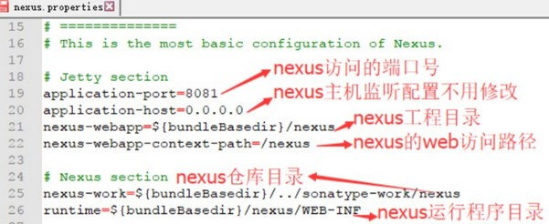
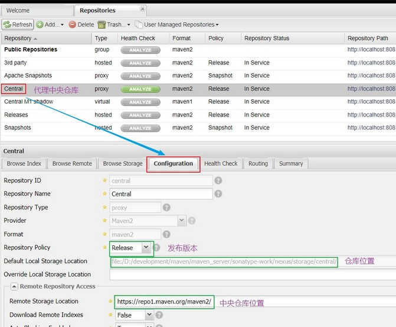
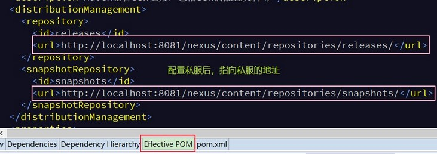
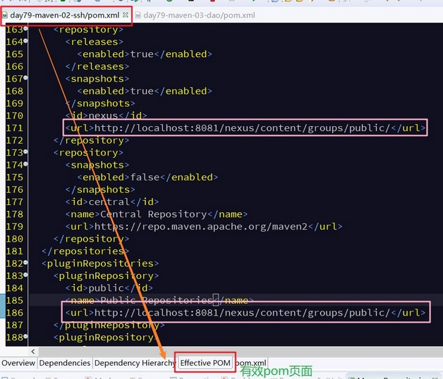
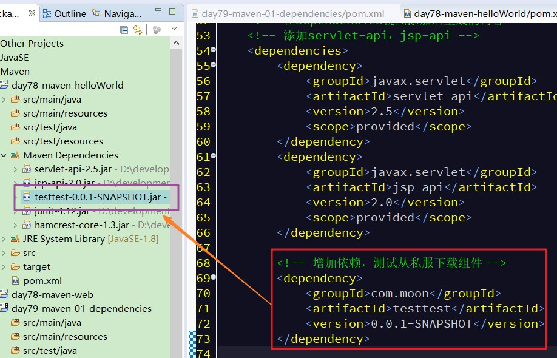
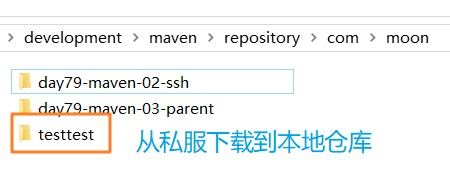

# Maven 私服

## 1. 私服使用场景

项目组编写了一个通用的工具类，其它项目组将类拷贝过去使用，当工具类修改bug后通过邮件发送给各各项目组，这种分发机制不规范可能导致工具类版本不统一。

**解决方案：项目组将写的工具类通过maven构建，打成jar，将jar包发布到公司的maven仓库中，公司其它项目通过maven依赖管理从仓库自动下载jar包**。

公司在自己的局域网内搭建自己的远程仓库服务器，称为私服，私服服务器即是公司内部的maven远程仓库，每个员工的电脑上安装maven软件并且连接私服服务器，员工将自己开发的项目打成jar并发布到私服服务器，其它项目组从私服服务器下载所依赖的构件（jar）。

私服还充当一个代理服务器，当私服上没有jar包会从互联网中央仓库自动下载


## 2. 关于中央仓库使用的注意事项

- **地址**:

目前来说，http://repo1.maven.org/maven2/是真正的Maven中央仓库的地址，该地址内置在Maven的源码中其他的都是镜像。

如果仓库X可以提供仓库Y存储的所有内容，那么就可以认为X是Y的一个镜像，某些情况下使用镜像可以提高项目构建效率。

- **索引**:

中央仓库带有索引文件以方便用户对其进行搜索，索引每周更新一次

- **黑名单**:

如果某个IP地址恶意的下载中央仓库内容，例如全公司100台机器使用同一个IP反复下载，这个IP（甚至是IP段）会进入黑名单，因此稍有规模的使用Maven时，应该用Nexus架设私服

## 3. windows 系统搭建私服环境

### 3.1. 下载 nexus

Nexus 是 Maven 仓库管理器，通过 nexus 可以搭建 maven 仓库，同时 nexus 还提供强大的仓库管理功能，构件搜索功能等。

- ~~下载地址：https://help.sonatype.com/repomanager3/product-information/download~~
- 下载地址：https://help.sonatype.com/repomanager3/download
- 下载文件：nexus-x.x.x-xx-bundle.zip

> 以下使用 nexus-2.12.0-01-bundle.zip 为示例

### 3.2. 安装 nexus

解压nexus-2.12.0-01-bundle.zip，解压在不含中文和空格的目录下，解压完成后进入bin目录

以管理员身份运行【命令提示符】


在cmd中进入bin目录，执行 `nexus.bat install`


安装成功在服务中查看有nexus服务，启动服务【可以设置不自动开启】


### 3.3. 卸载 nexus

cmd进入nexus的bin目录，执行：`nexus.bat uninstall`


### 3.4. 启动 nexus

方法 1：cmd进入bin目录，执行：`nexus.bat start`


方法 2：直接启动nexus服务


查看nexus的配置文件，位置：conf/nexus.properties



```properties
# Jetty section
application-port=8081						#nexus的访问端口配置
application-host=0.0.0.0					#nexus主机监听配置(不用修改)
nexus-webapp=${bundleBasedir}/nexus		#nexus工程目录
nexus-webapp-context-path=/nexus		#nexus的web访问路径
# Nexus section
nexus-work=${bundleBasedir}/../sonatype-work/nexus	# nexus 仓库目录
runtime=${bundleBasedir}/nexus/WEB-INF					# nexus 运行程序目录
```

### 3.5. 直接使用快捷方式安装、卸载、启动 nexus

进入安装目录 \nexus-2.12.0-01\bin\jsw\windows-x86-64，里面都相关的脚本。


console-nexus.bat：不需要安装成服务，点击一次运行一次，关闭后不再运行。

### 3.6. 登陆 nexus

访问：http://localhost:8081/nexus/

点击右上角的Log in，使用Nexus内置账户`admin`/`admin123`登陆

### 3.7. nexus 的仓库有4种类型（了解）


1. `hosted`：宿主仓库，部署自己的jar到这个类型的仓库，包括releases和snapshot两部分，Releases公司内部发布版本仓库、Snapshots公司内部测试版本仓库
2. `proxy`：代理仓库，用于代理远程的公共仓库，如maven中央仓库，用户连接私服，私服自动去中央仓库下载jar包或者插件。
3. `group`：仓库组，用来合并多个hosted/proxy仓库，通常我们配置自己的maven连接仓库组。
4. `virtual`(虚拟)：兼容Maven1版本的jar或者插件

> *注：nexus 仓库默认在 根目录\sonatype-work\nexus\storage 文件夹中*

central：代理仓库，代理中央仓库



apache-snapshots：代理仓库。存储snapshots构件，代理地址https://repository.apache.org/snapshots/

- central-m1：virtual类型仓库，兼容Maven1版本的jar或者插件
- releases：本地仓库，存储releases构件。
- snapshots：本地仓库，存储snapshots构件。
- thirdparty：第三方仓库
- public：仓库组


### 3.8. 修改本地仓库（snapshots）允许重复部署


## 4. 将项目发布到私服

### 4.1. 第一步：配置settings.xml(maven的安装文件的conf目录下)

需要在客户端即部署dao工程的电脑上配置maven环境，并修改settings.xml文件，配置连接私服的用户和密码。

此用户名和密码用于私服校验，因为私服需要知道上传都的账号和密码是否和私服中的账号和密码一致。

```xml
<!-- 配置连接私服的用户和密码 -->
<server>
	<id>releases</id>
	<username>admin</username>
	<password>admin123</password>
</server>
<server>
	<id>snapshots</id>
	<username>deployment</username>
	<password>deployment123</password>
</server>
```

不需要记，复制即可

- releases 连接发布版本项目仓库
- snapshots 连接测试版本项目仓库


### 4.2. 第二步：配置pom.xml

配置私服仓库的地址，本公司的自己的jar包会上传到私服的宿主仓库，根据工程的版本号决定上传到哪个宿主仓库，如果版本为release则上传到私服的release仓库，如果版本为snapshot则上传到私服的snapshot仓库

```xml
<!-- 配置上传资源到私服 -->
<distributionManagement>
	<repository>
		<id>releases</id>
		<url>http://localhost:8081/nexus/content/repositories/releases/</url>
	</repository>
	<snapshotRepository>
		<id>snapshots</id>
		<url>http://localhost:8081/nexus/content/repositories/snapshots/</url>
	</snapshotRepository>
</distributionManagement>
```

> <font color=red>**注意：pom.xml这里`<id>`和 settings.xml 配置 `<id>` 对应！**</font>


没有配置pomx.xml私服地址前


配置pom.xml私服地址后



### 4.3. 第三步：测试使用 deploy 命令上传组件(项目)到私服

根据本项目pom.xml中version定义决定发布到哪个仓库，如果version定义为snapshot，执行deploy后查看nexus的snapshot仓库，如果version定义为release则项目将发布到nexus的release仓库，本项目将发布到snapshot仓库


查看上传到私服的结果，在私服查看/http方式查看/到本地查看


## 5. 从私服下载资源(项目)

### 5.1. 管理仓库组

nexus中包括很多仓库，hosted中存放的是企业自己发布的jar包及第三方公司的jar包，proxy中存放的是中央仓库的jar，为了方便从私服下载jar包可以将多个仓库组成一个仓库组，每个工程需要连接私服的仓库组下载jar包

打开nexus配置仓库组，<font color=red>将右边的选项拖到左边</font>，组成仓库组。仓库组包括了本地仓库、代理仓库等


### 5.2. 在setting.xml中配置仓库

在客户端的 setting.xml 中配置私服的仓库，由于 setting.xml 中没有 `repositories` 的配置标签需要使用 `profile` 定义仓库

```xml
<profile>
	<!--profile 的 id-->
	<id>dev</id>
	<repositories>
		<repository>
			<!--仓库 id，repositories 可以配置多个仓库，保证 id 不重复-->
			<id>nexus</id>
			<!--仓库地址，即 nexus 仓库组的地址-->
			<url>http://localhost:8081/nexus/content/groups/public/</url>
			<!--是否下载 releases 构件-->
			<releases>
				<enabled>true</enabled>
			</releases>
			<!--是否下载 snapshots 构件-->
			<snapshots>
				<enabled>true</enabled>
			</snapshots>
		</repository>
	</repositories>
	<pluginRepositories>
		<!-- 插件仓库，maven 的运行依赖插件，也需要从私服下载插件 -->
		<pluginRepository>
			<!-- 插件仓库的 id 不允许重复，如果重复后边配置会覆盖前边 -->
			<id>public</id>
			<name>Public Repositories</name>
			<url>http://localhost:8081/nexus/content/groups/public/</url>
		</pluginRepository>
	</pluginRepositories>
</profile>

<!-- 使用 profile 定义仓库需要激活才可生效 -->
<!-- 激活模板 -->
<activeProfiles>
	<activeProfile>dev</activeProfile>
</activeProfiles>
```

<font color=purple>*需要从私服下载资源，只需要配置settings.xml*</font>

配置成功后，右键 -> update project,通过eclipse查看Effective pom，有效pom是maven软件最终使用的pom内容，程序员不直接编辑有效pom

有效pom内容如下：

下边的pom内容中有两个仓库地址，maven会先从前边的仓库的找，如果找不到jar包再从下边的找，从而就实现了从私服下载jar包



### 5.3. 测试从私服下载 jar 包(待测试)

删除工作区间的已经上传到私服的项目，删除本地库安装。


在任意一个项目添加依赖，就是刚才上传到私服的项目的依赖





