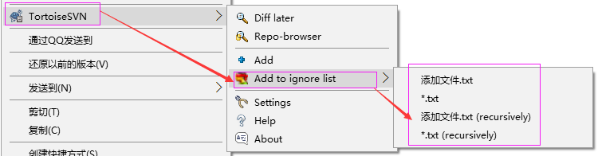

# SVN 文件版本控制软件

> 官网地址：http://subversion.apache.org/

## 1. SVN 概述

### 1.1. 项目管理中版本控制的问题

通常软件开发由多人协作开发，如果对代码文件、配置文件、文档等没有进行版本控制，将会出现很多问题：

- 代码管理混乱
- 备份多个版本，占用磁盘空间大
- 解决代码冲突困难
- 容易引发 BUG
- 难于追溯问题代码的修改人和修改时间
- 难于恢复至以前正确版本
- 无法进行权限控制
- 项目版本发布困难

### 1.2. 什么是版本控制

版本控制(Revision control)是维护工程蓝图的标准做法，能追踪工程蓝图从诞生到定案的过程。是一种记录多个文件内容变化，以便将来查阅特定版本修订情况的系统。

### 1.3. 主流的版本控制

- VSS: Visual Source Safe(Microsoft Visual Studio 成员)主要任务是负责项目文件的管理
- CVS: march-hare 出品的一套用于进行文件版本控制软件
- SVN: Apache 软件基金会名下的一套用于进行文件版本控制软件

> Notes: 目前主流还是使用 git 进行版本控制
>
> 以下内容当了解一下历史吧 -_-!
>
> 在 2000 年初，开发人员要写一个 CVS 的自由软件代替品，它保留 CVS 的基本思想，但没有它的错误和局限，保留 CVS 的基本特性但去除 CVS 的 bug 和不好的特性。
>
> 在 2000 年 2 月，他们联系《使用 CVS 开发开源项目》（Open Source Development with CVS）(Coriolis, 1999)的作者 Karl Fogel，并征求了他是否愿意在这个新的项目中担任一个角色。巧合的是，当时 Karl 已经和他的朋友 Jim Blandy 讨论了一个关于新的版本控制系统的设计。在 1995 年，这两人就成立了Cyclic Software，一个提供 CVS 的商业支持的软件公司。虽然他们经营商业服务，但是仍然在每天都在工作中使用 CVS。使用 CVS 的挫折感使得 Jim 认真思考更好的方法来管理数据，不但确定名字为“Subversion”，而且完成了 Subversion 档案库的基础设计。
>
> 当 CollabNet 的电话到来时，Karl 立即答应了加入项目中，而且 Jim 让他的雇主 RedHat Software 同意让他在这个项目中不定期工作。CollabNet 雇用了 Karl 和 Ben Collins-Sussman，并在 5 月开始了详细设计工作。在得到了来自 CollabNet 的 Brian Behlendorf、Jason Robbins 和 Greg Stein（当时是一名活跃在 WebDAV/DeltaV 规范过程的自由程序员）很多创意的帮助下，Subversion 很快地引起了一个活跃开发者社区的注意。它找出并欢迎很多同样在 CVS 上受到挫折的社员能来为这个项目做点什么。
>
> Subversion 最初的设计 Team 定下了几个简单的目标。 它必须在功能上可取代 CVS，也就是说，所有 CVS 可做到的事, 它都要能够作到。 在修正最明显的瑕疵的同时，还要保留相同的开发模式。还有 Subversion 应该要和 CVS 很相像，任何 CVS 使用者只要花费少许的力气，就可以很快地上手。
>
> 经过十四个月的编码后，Subversion 于 2001 年 8 月 31 日开始实现 “自行管理”。 也就是说，开发人员不再使用 CVS 来管理 Subversion 的代码，而以 Subversion 自己来管理。
>
> - 2009 年 11 月，Subversion 被 Apache Incubator 专案所接收。
> - 2010 年 1 月，正式成为 Apache 软件基金会的一个顶级专案，所以为 Apache Subversion.
>
> 目前 Apache Subversion 的主席为 Greg Stein, 项目领导者 Release manager 为 Wandisco 公司。

### 1.4. 什么是 SVN

SVN（Subversion）是多年前崛起的版本管理工具，在以前的开源项目里(J2EE)，几乎 95% 以上的项目都用到了 SVN。Subversion 项目的初衷是为了替换当年开源社区最为流行的版本控制软件 CVS，在 CVS 的功能的基础上有很多的提升同时也能较好的解决 CVS 系统的一些不足。

SVN 针对软件研发企业的软件生产过程而言，SVN 用于管理整个开发过程中的源码，进行版本控制。

> 引用百度百科解释：
>
> SVN 是 subversion 的缩写，是一个开放源代码的版本控制系统，通过采用分支管理系统的高效管理，简而言之就是用于多个人共同开发同一个项目，实现共享资源，实现最终集中式的管理。

### 1.5. SVN 的工作原理

#### 1.5.1. SVN 的使用模式

svn 是基于客户/服务器模式：

- **复制-修改-合并方案(Subversion 默认的模式)**

在这种模型里，每一个客户读取项目配置库建立一个私有工作副本——版本库中文件和目录的本地映射。用户并行工作，修改各自的工作副本，最终，各个私有的复制合并在一起，成为最终的版本，这种系统通常可以辅助合并操作，但是最终要靠人工去确定正误。

- **锁定-修改-解锁方案**

在这样的模型里，在一个时间段里配置库的一个文件只允许被一个人修改。此模式不适合软件开发这种工作。

#### 1.5.2. SVN 的工作方式

## 2. SVN 服务的安装与使用

### 2.1. Apache Subversion 官方服务端

官方提供的服务端安装包，安装后需要通过命令行操作，适用于专业配置管理员使用

> Apache Subversion 服务端下载地址：http://subversion.apache.org/download.cgi

### 2.2. VisualSVN server 图形化服务端

程序开发爱好者开发的图形化操作界面的 svn 服务端，它适用于普通软件开发人员使用。

> 下载地址：https://www.visualsvn.com/downloads/

#### 2.2.1. 安装图形化服务端

运行安装程序

 

接受许可协议，点击下一步

点击【Standard Edition】进行设置

设置软件的安装目录和代码仓库的位置

> Notes: 如果出现端口被占用，可以采用以下两种解决办法：
>
> - 第一种：停止服务中 VMWare WorkStation Server 服务
> - 第二种：改变 svn 的端口号。SVN 软件安装端口使用建议8888

点击安装

安装完成后，到安装目录查看程序：

查看服务，VisualSVN 成功启动：

#### 2.2.2. 注意事项

安装路径不能有中文和空格。若安装后如果选择了不自动启动，需要使用的时候就在【服务】中点击开启

### 2.3. 创建仓库

svn 服务端创建完成需要创建仓库，仓库中存放要版本控制的文件。通过 VisualSVN Server.msc 进入 VisualSVN server 管理的图形界面：

双击打开服务端管理界面，如下图：

右键点击【Repositories】，选择【Create New Repository...】

选择文件存储方式

指定仓库名称。**注：名称不要包含中文**

创建一个空的仓库

设置用户访问仓库权限

仓库创建成功，仓库地址为 `https://ip 地址或计算机名/svn/仓库名称`

点击【Finish】后，可以查看新创建的仓库

### 2.4. 创建工程目录

仓库中存放开发项目代码、文档等，需要创建一个工程目录。

输入工程的名称，然后点击 OK 即可

### 2.5. SVN 客户端类型

svn 客户端需要通过网络访问 svn 服务端提交文件、查询文件等，可通过以下客户端类型访问 svn 服务端：

1. 使用 Subversion 提供的客户端命令。需要在命令行下输入命令操作。
2. 使用 Torotise 图形化界面操作（推荐）
3. 使用 Eclipse 等开发工具插件操作（推荐）

## 3. SVN 权限管理（了解）

### 3.1. 认证授权机制

在企业开发中会为每位程序员、测试人员等相关人员分配一个账号，用户通过使用 svn 客户端连接 svn 服务时需要输入账号和密码，svn 服务对账号和密码进行校验，输入正确可以继续访问，当用户访问仓库下某个目录时，svn 服务对用户进行授权，如果用户拥有该目录的访问权限方可访问。

- 判断账号和密码输入是否正确的过程即认证过程。
- 判断用户是否拥有目录的读/写权限时即授权过程。

### 3.2. 创建用户

在 VisualSVN Server 中，选择【Users】目录，右键选择【Create User...】

创建用户

选择【Users】目录，查看已创建的用户

### 3.3. 修改用户

在【Users】目录中，点击右键修改用户

### 3.4. 组操作

#### 3.4.1. 创建组

右键点击【Groups】目录，选择【Create Group...】创建组

新建一个开发组，并且加入开发人员

#### 3.4.2. 查看创建的组

选择【Groups】目录即可查看已创建的组

#### 3.4.3. 修改组

右键可以编辑组

### 3.5. 分配权限

给仓库下的每个目录分配权限对访问进行控制

#### 3.5.1. 删除默认权限

右键仓库，选择【Properties...】

选择组或者用户，点击【Remove】按钮，删除系统安装后默认权限

#### 3.5.2. 示例一：开发人员拥有读写权限

进入权限分配界面

添加组或用户

分配权限。继承父目录权限、不可访问、读权限、读/写权限

访问时输入账号

登陆测试是否有读/写权限，添加一个文件夹，需要输入注释，才可以创建

#### 3.5.3. 示例二：测试人员拥有读权限

登陆测试是否有读/写权限：

创建窗口弹出，输入注释点击保存的时候，弹窗提醒如下

### 3.6. 清除认证缓存

有几种情况需要清除认证缓存：

1. 本地使用多个账号登陆，每次输入的账号和密码都不一样
2. 当账号密码修改后（建议清理）

右键选择【settings】选项

然后点击【clear all】按钮，清除所有即可

## 4. SVN 目录说明

- trunk：项目开发代码的主体，是从项目开始直到当前都处于活动的状态，从这里可以获得项目最新的源代码以及几乎所有的变更历史信息。
- branches：从 trunk 的某个点分离出来的代码拷贝，通常可以在不影响主干的前提下在这里进行重大 bug 的修改，或者做实验性的开发，以及定制功能开发等。如果分支达到了预期的目的，通常可以被合并（Mgerge）到主干中。
- tag：用来表示 trunk 和 branches 的某个点的状态，以代表项目的某个稳定状态，通常为最终发布状态。

工程目录创建完成，查看它的 svn 地址：

拷贝 svn 地址：

## 5. TortoiseSVN 客户端

TortoiseSVN 是 Subversion 版本控制系统的一个免费开源客户端，不需要为使用它而付费。TortoiseSVN 是 Subversion 的 Windows 扩展。它使你避免接触 Subversion 枯燥而且不方便的 Command Line。它完全嵌入 Windows Explorer，使用时只需在正常的窗口里右键操作就可以了

### 5.1. 下载安装

> 下载址址：http://tortoisesvn.net/downloads.html

TortoiseSVN 提供了 32 位和 64 位不同版本，根据当前操作系统选择相应的安装包

双击运行安装程序，点击下一步

 

选择自己的安装目录后，点击下一步

> Notes: TortoiseSVN 客户端可以通过图形化的界面来访问 svn 服务端提交文件、查询文件等。安装需要修改客户端电脑右键菜单，因此安装后需要重启电脑。

### 5.2. 浏览仓库

使用 TortoiseSVN 客户端浏览 svn 服务端的仓库的内容，在某个目录下右键打开：

输入仓库地址

点击 OK 后查看仓库的信息

### 5.3. 导入与导出

Export：导出项目。和 checkout 区别（checkout 检出后文件，含有.svn 隐藏文件夹，会和 SVN 仓库交互，export 导出，没有.svn 隐藏文件夹）

import：将本地资源导入到 svn 服务器

### 5.4. 常用操作

#### 5.4.1. Checkout

检出项目，复制项目的副本到本地。在要检出的目录中右键：

设置相关检出信息

#### 5.4.2. add

在检出的目录中添加文件：

其中“添加文件.txt”这是一个新文件

- 【Add to ignore list】：添加到忽略列表 （标记该文件不需要版本控制 ）

- 【Add】： 标记这个文件添加到服务器

文件上有这个小图标  ，代表要添加到版本库

#### 5.4.3. Commit

当检出目录或子目录中内容有修改，目录图标变为： 

在检出目录或要提交修改的目录右键，通过 Commit 提交本地修改至 svn 服务器：

填写提交日志

显示

提交后目录中的内容与 svn 服务同步，目录图标变为： 

#### 5.4.4. update

在检出目录或子目标或文件上右键，更新仓库的文件到本地：

- **更新到最新版本**

- **更新到指定版本**，选择【Update to revision...】

通过【Show log】，查询版本再输入版本号

#### 5.4.5. Delete

删除版本库文件，在标记删除后，本地文件删除，标记删除后需要提交。

#### 5.4.6. 恢复

在检出目录或子目录操作会记录操作日志，提交前可以回滚操作。在要回滚的检出目录或子目录中右键：

勾选需要回滚的文件

#### 5.4.7. 冲突处理

两个客户端同时修改同一个文件， 改动同一个位置，发生冲突情况

如果当 commit 遇到文件已经过时，说明另一个人可能改动过(update)

手动 Merge 后，需要将编辑后冲突文件，标记为已经解决，再进行 commit

## 6. Eclipse 的 SVN 插件使用

### 6.1. svn 插件安装

Subversion 的 eclipse 插件，下载地址：http://subclipse.tigris.org/servlets/ProjectProcess?pageID=p4wYuA

下载好之后，在【eclipse\dropins】目录下新建一个 svn 目录

然后把下载好的压缩文件 site-x.x.x.zip 解压缩到此文件夹下，如下图：

到此即安装完成，但这里需要注意，需要重启 eclipse。重新打开 eclipse 后，查看视图有 SVN 选项说明安装成功：

### 6.2. 将项目共享到 SVN

切换“SVN 资源库”视图，新建 SVN 仓库连接

输入资源库的地址

共享项目到 SVN

### 6.3. 从 svn 检出

将 svn 管理项目检出到工作区

### 6.4. 解决冲突

如果出现冲突，则提交不了

需要手动 merge 后，标记为解决后，才能提交

## 7. 其他

### 7.1. svn 链接访问拒绝问题解决方案

如果出现 svn 链接访问拒绝，排除了用户名和密码错误 以及服务已经启动的情况下，可以试下如下的解决方法：

1. 右键点击“我的电脑”，通过【管理】打开服务

2. 找到 SVN Server 服务（VisualSVN Server），右键选择【属性】选项

3. 选择【登录】标签页面，按下图修改

### 7.2. SVN 的状态图标的含义

常见的SVN的图标有以下几种，如下图：

1. “常规”：绿色圈带白色对勾，主要是表示自己电脑上的文件或者文件夹与SVN服务器上对应的文件一致，在自己电脑没有进行任何修改。
2. “修改”：红色圈带白色感叹号，当你开始编辑一个文件，这个文件的状态就会变成修改状态，图标也会变成红色圆圈带白色感叹号。通过这种状态的变化，你就可以知道自己修改过哪些文件，需要提交哪些文件。
3. “冲突”：黄色三角形带黑色感叹号，是指出现了冲突，一般在同时编辑一个文件时容易出现这种冲突的现象。
4. “只读”：灰色圈带白色对勾，这是设置只读属性后才会出现的标识，直到你获得文件锁才能取消只读。只读文件用这个重载图标来表示你必须在编辑之前先得到一个锁。
5. “已删除”：红色叉，表示相应文件或文件夹被计划删除，或者表示文件缺失。
6. “增加”：蓝色加号，表示文件或文件夹已经被计划加入到版本控制之下。通常是新建的文件或文件夹会有这个标识。
7. “忽略”：灰色圈带白色横线，表示已经不受版本控制了。
8. “无版本控制”：蓝色圈带白色问号，表示暂时还没有版本的控制，但没有被忽略。
9. “锁定”：一把黄色的锁，表示文件被锁定，必须先释放锁才能让别人的修改提交。

### 7.3. 参考资料

- [svn使用教程](https://svnbucket.com/posts/svn-tutorial/)
- [svn常用命令](https://svnbucket.com/posts/svn-commands-tutorial/)
- [菜鸟笔记 - SVN 教程](https://www.runoob.com/svn/svn-tutorial.html)
