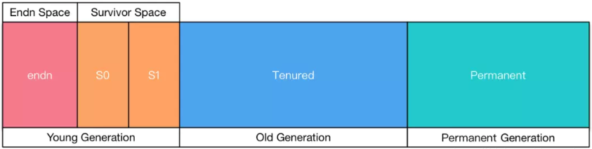
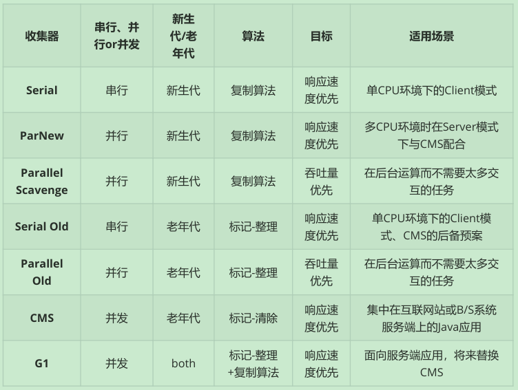
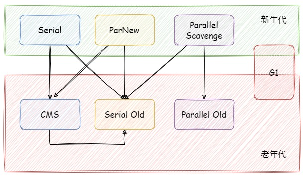
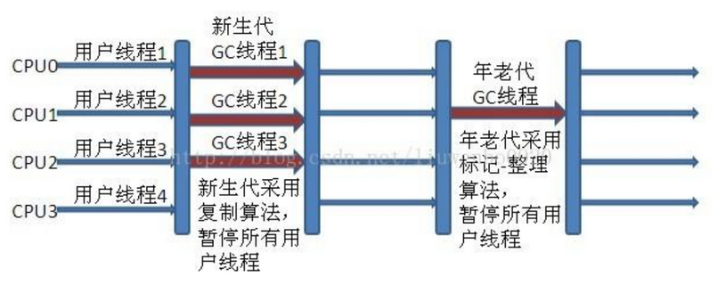
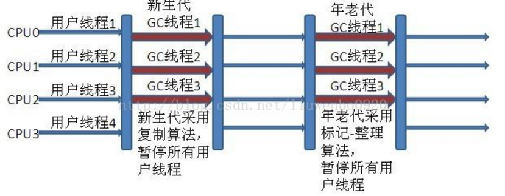
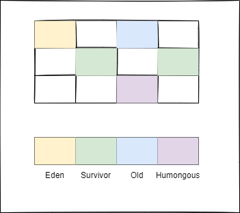
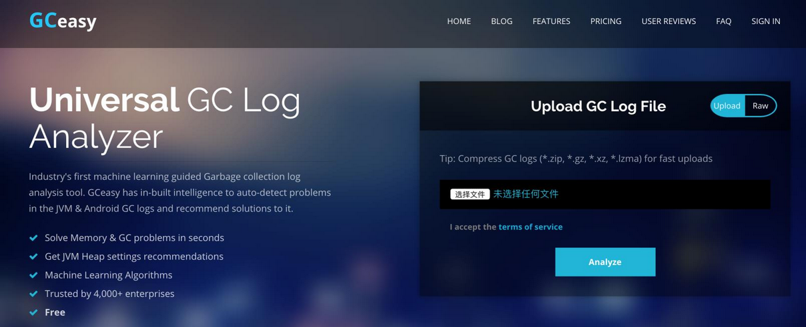

## 1. Java 垃圾回收机制概述

GC（Gabage Collection）垃圾收集，是 JVM 内部的一个守护线程，也是 Java 与 C++ 的主要区别之一。

在 Java 语言中，程序员不需要显式的去释放一个对象的内存，而是由虚拟机自行执行。在 JVM 中有一个垃圾回收线程（守护线程），它是低优先级的，在正常情况下是不会执行的，只有在虚拟机空闲或者当前堆内存不足时，才会触发执行。GC 线程会对 JVM 中的内存进行标记，扫描并确定哪些内存堆中已经死亡的或者长时间没有被任何引用的对象、哪些内存需要回收，根据一定的回收策略，并将它们添加到要回收的集合中，自动的回收内存，保证 JVM 中的内存空间，防止出现内存泄露和溢出问题。**其中 JVM 中 GC 的重点区域是堆空间**。

在 JVM 中是自动化的垃圾回收机制，Java 提供的 GC 功能可以自动监测对象是否超过作用域从而达到自动回收内存的目的，并且 Java 语言没有提供释放已分配内存的显示操作方法。程序员一般不用去关注，也可以通过 `System.gc()` 或者 `Runtime.getRuntime().gc()` 手动执行的额外方式来主动发起 GC 垃圾回收（**项目中切记不要使用**），但是 Java 语言规范并不保证 GC 一定会执行。

> 在 Java 诞生初期，垃圾回收是 Java 最大的亮点之一，因为服务器端的编程需要有效的防止内存泄露问题，然而如今 Java 的垃圾回收机制已经成为被诟病的存在。移动智能终端用户通常觉得 IOS 的系统比 Android 系统有更好的用户体验，其中一个深层次的原因就在于 Android 系统中垃圾回收的不可预知性。

### 1.1. 内存溢出（内存泄漏）

内存泄漏是指不再被使用的对象或者变量一直被占据在内存中。理论上来说，JVM 是有 GC 垃圾回收机制的，也就是说，不再被使用的对象，会被 GC 自动回收掉，自动从内存中清除。

但是 JVM 也还是存在着内存泄漏的情况，Java 导致内存泄露的原因（场景）很明确：**长生命周期的对象持有短生命周期对象的引用就很可能发生内存泄露**，尽管短生命周期对象已经不再需要，但是因为长生命周期对象持有它的引用而导致不能被回收

### 1.2. GC 对 Java 中各种引用类型的处理

- **强引用**：Java 中最常见的引用类型，在把一个对象赋给一个引用变量时，这个引用变量就是一个强引用。只要强引用关系还存在，发生 GC 的时候不会被回收。

```java
Object obj = new Object();
```

> 强引用是造成 Java 内存泄漏(Memory Link)的主要原因。

- **软引用**：有用但不是必须的对象，通过 `SoftReference` 类实现，在内存空间不足时（发生内存溢出之前）会被回收。

```java
// 软引用
SoftReference<String> softRef = new SoftReference<String>(str);
```

> 可用场景：创建缓存的时候，创建的对象放进缓存中，当内存不足时，JVM 就会回收早先创建的对象。

- **弱引用**：有用但不是必须的对象，通过 `WeakReference` 类实现。不管当前内存空间足够与否，在下一次 GC 时都会回收只具有弱引用的对象。

```java
// 弱引用
WeakReference<String> weakRef = new WeakReference<String>(str);
```

> 可用场景：Java 源码中的 `java.util.WeakHashMap` 中的 key 就是使用弱引用，相当于一旦不需要某个引用，JVM 会自动处理它，开发者不需要做其它操作。

- **虚引用**（幽灵引用/幻影引用）：在 JDK1.2 之后，用 `PhantomReference` 类实现虚引用，通过查看这个类的源码，发现它只有一个构造函数和一个 `get()` 方法，而且它的 `get()` 方法仅仅是返回一个null，即无法通过虚引用获得对象，是最弱的一种引用关系。虚引用必须要和 `ReferenceQueue` 引用队列一起使用，NIO 的堆外内存就是靠其管理。虚引用并不会决定对象的生命周期。如果一个对象仅持有虚引用，那么它就和没有任何引用一样，在任何时候都可能被垃圾回收。**虚引用的用途是跟踪对象的垃圾回收状态，在 gc 时会返回一个系统通知**。

```java
PhantomReference<String> prf = new PhantomReference<String>(new String("str"), newReferenceQueue<>());
```

> 可用场景：对象销毁前的一些操作，比如说资源释放等。`Object.finalize()` 虽然也可以做这类动作，但是这个方式即不安全又低效上诉所说的几类引用，都是指对象本身的引用，而不是指 Reference 的四个子类的引用( SoftReference 等)。

## 2. JVM 的垃圾回收算法

- **标记-清除算法**：标记无用对象，然后进行清除回收。
- **复制算法**：按照容量划分二个大小相等的内存区域，当一块用完的时候将活着的对象复制到另一块上，然后再把已使用的内存空间一次清理掉。
- **标记-整理算法**：标记无用对象，让所有存活的对象都向一端移动，然后直接清除掉端边界以外的内存。
- **分代算法**：根据对象存活周期的不同将内存划分为几块，一般是新生代和老年代，新生代基本采用复制算法，老年代采用标记整理算法。

### 2.1. 标记-清除算法

标记-清除算法（Mark-Sweep）是一种常见的基础垃圾收集算法，标记无用对象，然后进行清除回收。它将垃圾收集分为两个阶段：

- 标记阶段：利用可达性去遍历内存，标记出可以回收的对象
- 清除阶段：回收被标记的对象所占用的空间


算法的优缺点：

- 优点：实现简单，不需要对象进行移动。
- 缺点：标记、清除过程效率低，无法清除垃圾碎片。产生大量不连续的内存碎片，提高了垃圾回收的频率。后续可能发生大对象不能找到可利用空间的问题。

### 2.2. 复制算法

为了解决标记-清除算法的效率不高的问题，产生了复制算法（Copying）。它把内存空间划为两个相等的区域，每次只使用其中一个区域。垃圾收集时，遍历当前使用的区域，把存活对象复制到另外一个区域中，最后将当前使用的区域的可回收的对象进行回收。


- 优点：按顺序分配内存即可，实现简单、运行高效，不用考虑内存碎片。
- 缺点：内存使用率不高，可用的内存大小缩小为原来的一半，对象存活率高时会频繁进行复制，效率会大大降低。

### 2.3. 标记-整理算法

在新生代中可以使用复制算法，但是在老年代就不能选择复制算法了，因为老年代的对象存活率会较高，这样会有较多的复制操作，导致效率变低。标记-清除算法可以应用在老年代中，但是它效率不高，在内存回收后容易产生大量内存碎片。

因此根据老年代的特点就出现了一种标记-整理算法（Mark-Compact）算法，与标记-整理算法不同的是，在标记可回收的对象后，不是直接对可回收对象进行清理，而是将所有存活的对象压缩到内存的一端，使他们紧凑的排列在一起，然后对端边界以外的内存进行回收。回收后，已用和未用的内存都各自一边。


- 优点：解决了标记-清理算法存在的内存碎片问题。
- 缺点：仍需要进行局部对象移动，一定程度上降低了效率。

### 2.4. 分代收集算法

当前商业虚拟机都采用**分代收集**（Generational Collecting）的垃圾收集算法。分代收集算法，是根据对象的存活周期将内存划分为几个不同的区域。一般包括**年轻代、老年代和永久代**，如图所示：



然后根据各年代的特点分别采用不同的 GC 算法：

- 新生代采用**复制算法**，该区域主要存储短生命周期的对象，因此在垃圾回收的标记阶段会标记大量已死亡的对象及少量存活的对象，因此只需选用复制算法将少量存活的对象复制到内存的另一端并清理原区域的内存即可。
- 老年代采用**标记清除算法**或者**标记整理算法**，该区域主要存放长生命周期的对象和大对象，可回收的对象一般较少，因此采用标记整理算法直接释放死亡状态的对象所占用的内存空间即可。

> Notes: Java 8 中已经移除了永久代，新增一个叫做元数据区的 native 内存区

### 2.5. 分区收集算法

不同于『分代收集算法』是按对象的生命周期长短划分，**分区收集算法**则将整个堆空间划分为连续的不同小区间，每个小区间独立使用，独立回收。这样做的好处是可以控制一次回收多少个小区间。

在相同条件下，堆空间越大，一次 GC 耗时就越长，从而产生的停顿也越长。为了更好地控制 GC 产生的停顿时间，将一块大的内存区域分割为多个小块，根据目标停顿时间，每次合理地回收若干个小区间(而不是整个堆)，从而减少一次 GC 所产生的停顿。

## 3. 垃圾回收器的基本原理

对于 GC 来说，当创建对象时，GC 就开始监控这个对象的地址、大小以及使用情况。GC 采用有向图的方式记录和管理堆(heap)中的所有对象。

### 3.1. GC 如何判断对象是否可以被回收（即判断对象是否存活）

垃圾收集器在做垃圾回收的时候，首先需要判定的就是哪些内存是需要被回收的，“存活”的不可以被回收，“死亡”的需要被回收。一般有两种方法来判断：

- **引用计数器法**：为每个对象创建一个引用计数，有对象引用时计数器 +1，引用被释放时计数 -1，当计数器为 0 时就说明对象是不可用、可以被回收。它有一个缺点不能解决循环引用的问题，是指两个对象相互引用，导致它们的引用一直存在，从而不能被回收。
- **可达性分析算法**：从 GC Roots 对象为起点，开始根据引用关系向下搜索，搜索所走过的路径称为**引用链**。当一个对象到 GC Roots 没有任何引用链相连时，则证明此对象是不可用、可以被回收的。值得注意的是，不可达对象不等价于可回收对象，此对象要经过至少两次标记才能判定其是否可以被回收。*此算法解决了引用计数法的循环引用问题*。


### 3.2. 可作为 GC Roots 的对象

1. 虚拟机栈中引用的对象
2. 本地方法栈中 Native 方法引用的对象
3. 方法区中类静态属性引用的对象
4. 方法区中常量引用的对象

### 3.3. 内存的分配策略

- **对象优先在 Eden 分配**：大多数情况下，对象在新生代 Eden 上分配，当 Eden 空间不够时，触发 Minor GC。
- **大对象直接进入老年代**：大对象是指需要连续内存空间的对象，最典型的大对象有长字符串和大数组。可以设置JVM参数 `-XX:PretenureSizeThreshold`，大于此值的对象直接在老年代分配。
- **长期存活的对象进入老年代**：通过参数 `-XX:MaxTenuringThreshold` 可以设置对象进入老年代的年龄阈值。对象在 Survivor 区每经过一次 Minor GC ，年龄就增加 1 岁，当它的年龄增加到一定程度，就会被晋升到老年代中。
- **动态对象年龄判定**：并非对象的年龄必须达到 `MaxTenuringThreshold` 才能晋升老年代，如果在 Survivor 中相同年龄所有对象大小的总和大于 Survivor 空间的一半，则年龄大于或等于该年龄的对象可以直接进入老年代，无需达到 `MaxTenuringThreshold` 年龄阈值。
- **空间分配担保**：在发生 Minor GC 之前，虚拟机先检查老年代最大可用的连续空间是否大于新生代所有对象总空间，如果条件成立的话，那么 Minor GC 是安全的。如果不成立的话虚拟机会查看 `HandlePromotionFailure` 的值是否允许担保失败。如果允许，那么就会继续检查老年代最大可用的连续空间是否大于历次晋升到老年代对象的平均大小，如果大于，将尝试着进行一次 Minor GC；如果小于，或者 `HandlePromotionFailure` 的值为不允许担保失败，那么就要进行一次 Full GC。

### 3.4. 垃圾回收具体过程

新生代的 GC 过程叫做 MinorGC，相对触发频繁，采用<u>**复制算法**</u>实现，具体过程如下：

1. 将在 Eden 区和 SurvivorFrom 区中存活的对象复制到 SurvivorTo 区中，同时这些对象的年龄都加 1。其中有以下几种情况会将对象直接复制到老年代：
    - 某些对象年龄达到老年代的标准（对象晋升老年代的标准由 `XX:MaxTenuringThreshold` 设置，默认为 15）则直接复制到老年代；
    - 如果 SurvivorTo 区的内存空间不够，也会直接复制到老年代；
    - 如果对象属于大对象（通过 `XX:PretenureSizeThreshold` 来设置大小），也会直接复制到老年代。
2. 清空 Eden 区和 SurvivorFrom 区中的对象。
3. 将 SurvivorTo 区和 SurvivorFrom 区互换，原来的 SurvivorTo 区成为下一次 GC 时的 SurvivorFrom 区。

> 对于新生代区域 GC 会如此反复循环以上3步操作。

老年代的 GC 过程叫做 MajorGC，在老年代的对象比较稳定，MajorGC 不会被频繁触发。在 MajorGC 之前会先进行一次 MinorGC，使得有新生代的对象晋身入老年代，如果之后出现老年代空间不足或者无法找到足够大的连续空间分配给新创建的大对象时，就会解决 MajorGC 进行垃圾回收，释放内存空间。MajorGC 采用<u>**标记清除算法**</u>，耗时较长，在老年代没有内存空间可分配时，会抛出 Out Of Memory 异常。

永久代与老年代、新生代不同，GC 不会在程序运行期间对永久代的内存进行清理，因此永久代的内存会随着加载的 Class 文件的增加而增加，在加载的 Class 文件过多时会抛出 Out Of Memory 异常。Java 8 中永久代已经被换成元数据区，元数据区的区别在于，没有使用 JVM 的内存，而是直接使用操作系统的本地内存。

### 3.5. 为什么大对象直接进入老年代

大对象是指需要大量连续内存空间的对象，频繁出现大对象是致命的，会导致在内存还有不少空间的情况下提前触发 GC 以获取足够的连续空间来安置新对象。

因为新生代使用的是标记-清除算法来处理垃圾回收的，如果大对象直接在新生代分配就会导致 Eden 区和两个 Survivor 区之间发生大量的内存复制。因此对于大对象都会直接在老年代进行分配。

## 4. GC 的类型

- **MinorGC**：回收新生代，因为新生代对象存活时间很短，因此 MinorGC 会频繁执行，执行的速度一般也会比较快。（一般采用复制算法回收垃圾）
- **MajorGC** 指的是老年代的 GC，出现 MajorGC 一般经常伴有 MinorGC，MajorGC 的速度要比 MinorGC 慢的多。（可采用标记清楚法和标记整理法）
- **FullGC**：清理整个堆空间，包含回收老年代和新生代，老年代的对象存活时间长，因此 FullGC 很少执行，执行速度会比 MinorGC 慢很多。

### 4.1. Minor GC 触发条件

- eden 区满时，触发 MinorGC。即申请一个对象时，发现 eden 区不够用，则触发一次 MinorGC。
- 新创建的对象大小大于Eden所剩空间时，触发 MinorGC

### 4.2. Full GC 的触发条件

对于 Minor GC，其触发条件比较简单，当 Eden 空间满时，就将触发一次 Minor GC。而 Full GC 触发条件相对复杂，有以下情况会发生 full GC：

- **调用 `System.gc()` 方法**：只是建议虚拟机执行 Full GC，但是虚拟机不一定真正去执行。不建议使用这种方式，而是让虚拟机管理内存。
- **老年代（元空间）空间不足**：其常见场景为前文所讲的大对象直接进入老年代、长期存活的对象进入老年代等。为了避免以上原因引起的 Full GC，应当尽量不要创建过大的对象以及数组、注意编码规范避免内存泄露。除此之外，可以通过 `-Xmn` 参数调大新生代的大小，让对象尽量在新生代被回收掉，不进入老年代。还可以通过 `-XX:MaxTenuringThreshold` 调大对象进入老年代的年龄，让对象在新生代多存活一段时间。
- **空间分配担保失败**：使用复制算法的 Minor GC 需要老年代的内存空间作担保，如果担保失败会执行一次 Full GC。这是 Hotspot 为了避免由于新生代对象晋升到老年代导致老年代空间不足的现象，如果之前统计所得到的 Minor GC 晋升到老年代的平均大小大于老年代的剩余空间，那么就直接触发 Full GC。
> 例如程序第一次触发 Minor GC 后，有 6MB 的对象晋升到老年代，那么当下一次 Minor GC 发生时，首先检查老年代的剩余空间是否大于 6MB，如果小于 6MB，则执行 Full GC。
- **JDK 1.7 及以前的永久代空间不足**：在 JDK 1.7 及以前，HotSpot 虚拟机中的方法区是用永久代实现的，永久代中存放的为一些 Class 的信息、常量、静态变量等数据。当系统中要加载的类、反射的类和调用的方法较多时，永久代可能会被占满，在未配置为采用 CMS GC 的情况下也会执行 Full GC。如果经过 Full GC 仍然回收不了，那么虚拟机会抛出 `java.lang.OutOfMemoryError`。

> Tips: *Major GC 通常是跟 Full GC 是等价的*

## 5. 垃圾回收器种类

JVM 中针对新生代和年老代分别提供了多种不同的垃圾收集器，JDK1.6 中 Sun HotSpot 虚拟机的垃圾收集器主要分为：Serial、ParNew、Parallel Scavenge、Serial Old、Parallel Old、CMS、G1。



不同种类的垃圾回收器处理的区域图：



### 5.1. Serial 收集器（单线程、复制算法）

Serial 是最基本**单线程垃圾收集器**，使用复制算法，曾经是 JDK1.3.1 之前新生代唯一的垃圾收集器。它只使用一个垃圾收集线程去进行垃圾回收，在进行垃圾回收的时候必须暂停其他所有的工作线程（Stop The World），直到它收集结束。主要特点是：

- 简单高效；内存消耗小；
- 没有线程交互的开销，单线程收集效率高；
- 需暂停所有的工作线程，用户体验不好。

Serial 垃圾收集器虽然在收集垃圾过程中需要暂停所有其他的工作线程，但是它简单高效，对于限定单个 CPU 环境来说，没有线程交互的开销，可以获得最高的单线程垃圾收集效率。因此 Serial 垃圾收集器依然是 java 虚拟机运行在 Client 模式下默认的新生代垃圾收集器。

### 5.2. ParNew 收集器（Serial + 多线程）

ParNew 收集器其实就是**Serial 收集器的多线程版本**，也使用复制算法，除了使用多线程进行垃圾收集外，其他行为、参数与 Serial 收集器基本一致。ParNew 垃圾收集器在垃圾收集过程中同样也要**暂停所有其他的工作线程**。

ParNew 收集器默认开启和 CPU 数目相同的线程数，可以通过 `-XX:ParallelGCThreads` 参数来限制垃圾收集器的线程数。ParNew 垃圾收集器是很多 java 虚拟机运行在 Server 模式下新生代的默认垃圾收集器。

### 5.3. Parallel Scavenge 收集器（多线程复制算法、高效）

Parallel Scavenge 收集器是**新生代收集器**，基于复制清除算法实现的、多线程程的垃圾收集器。能够并行收集的多线程收集器，允许多个垃圾回收线程同时运行，降低垃圾收集时间，提高吞吐量。

所谓吞吐量就是 CPU 中用于运行用户代码的时间与 CPU 总消耗时间的比值（即`吞吐量 = 运行用户代码时间 / (运行用户代码时间 + 垃圾收集时间)`）。**Parallel Scavenge 收集器重点关注点是吞吐量，高效率的利用 CPU 资源，尽快地完成程序的运算任务，主要适用于在后台运算而不需要太多交互的任务**。

自适应调节策略也是 ParallelScavenge 收集器与 ParNew 收集器的一个重要区别；与 CMS 垃圾收集器的区别是，后者的关注点更多的是用户线程的停顿时间。

Parallel Scavenge 收集器提供了两个参数用于精确控制吞吐量，分别是控制最大垃圾收集停顿时间的 `-XX:MaxGCPauseMillis` 参数以及直接设置吞吐量大小的 `-XX:GCTimeRatio` 参数。

- `-XX：MaxGCPauseMillis` 参数的值是一个大于0的毫秒数，收集器将尽量保证内存回收花费的时间不超过用户设定值。
- `-XX：GCTimeRatio` 参数的值大于0小于100，即垃圾收集时间占总时间的比率，相当于吞吐量的倒数。

### 5.4. Serial Old 收集器（单线程标记整理算法）

Serial 收集器的老年代版本，单线程收集器，使用标记-整理算法。这个收集器也主要是运行在 Client 默认的 java 虚拟机默认的年老代垃圾收集器。在 Server 模式下，主要有两个用途：

1. 在 JDK1.5 之前版本中与新生代的 Parallel Scavenge 收集器搭配使用。
2. 作为年老代中使用 CMS 收集器的后备垃圾收集方案。

新生代 Serial 与年老代 Serial Old 搭配垃圾收集过程图：


新生代 Parallel Scavenge 收集器与 ParNew 收集器工作原理类似，都是多线程的收集器，都使用的是复制算法，在垃圾收集过程中都需要暂停所有的工作线程。新生代 ParallelScavenge/ParNew 与年老代 Serial Old 搭配垃圾收集过程图：



### 5.5. Parallel Old 收集器（多线程标记整理算法）

Parallel Scavenge 收集器的老年代版本。多线程垃圾收集，使用标记-整理算法，在 JDK 1.6 才开始提供。

在 JDK1.6 之前，新生代使用 Parallel Scavenge 收集器只能搭配年老代的 Serial Old 收集器，只能保证新生代的吞吐量优先，无法保证整体的吞吐量， Parallel Old 正是为了在年老代同样提供吞吐量优先的垃圾收集器，如果系统对吞吐量要求比较高，可以优先考虑新生代 Parallel Scavenge 和年老代 Parallel Old 收集器的搭配策略。

新生代 Parallel Scavenge 和年老代 Parallel Old 收集器搭配运行过程图：



### 5.6. CMS 收集器（多线程标记清除算法）

Concurrent Mark Sweep(CMS) 收集器是一种年老代垃圾收集器，使用多线程的标记-清除算法，追求获取最短停顿时间，实现了**让垃圾收集线程与用户线程基本上同时工作**。CMS 垃圾回收基于标记-清除算法实现，整个过程分为四个步骤：

- **初始标记**：暂停所有用户线程（Stop The World），记录直接与 GC Roots 直接相连的对象。
- **并发标记**：从 GC Roots 开始对堆中对象进行可达性分析，找出存活对象，耗时较长，但是不需要停顿用户线程。
- **重新标记**：在并发标记期间，因用户程序继续运行而导致标记对象的引用关系可能会变化，需要重新进行标记。此阶段也会暂停所有用户线程。
- **并发清除**：清除标记对象（GC Roots 不可达对象），这个阶段也是可以与用户线程同时并发工作，不需要暂停用户线程。

由于耗时最长的并发标记和并发清除过程中，垃圾收集线程可以和用户线程一起并发工作，所以总体上 CMS 收集器的内存回收和用户线程是一起并发地执行。CMS 收集器工作过程：


在整个过程中，耗时最长的是并发标记和并发清除阶段，这两个阶段垃圾收集线程都可以与用户线程一起工作，所以从总体上来说，CMS 收集器的内存回收过程是与用户线程一起并发执行的。其优缺点如下：

- **优点**：并发收集，停顿时间短。
- **缺点**：
    - 标记清除算法导致收集结束有大量空间碎片。
    - 产生浮动垃圾，在并发清理阶段用户线程还在运行，会不断有新的垃圾产生，这一部分垃圾出现在标记过程之后， CMS 无法在当次收集中回收它们，只好等到下一次垃圾回收再处理；

### 5.7. G1 收集器

G1 垃圾收集器的目标是在**不同应用场景中追求高吞吐量和低停顿之间的最佳平衡**。可以通过 `-XX:+UseG1GC` 参数来启用 G1 收集器。

G1 将整个堆分成相同大小的分区（Region），有四种不同类型的分区：Eden、Survivor、Old 和 Humongous。分区的大小取值范围为 1M 到 32M，都是2的幂次方。分区大小可以通过 `-XX:G1HeapRegionSize` 参数指定。Humongous 区域用于存储大对象。G1 规定只要大小超过了一个分区容量一半的对象就认为是大对象。



G1 收集器对各个分区回收所获得的空间大小和回收所需时间的经验值进行排序，得到一个优先级列表，每次根据用户设置的最大回收停顿时间，优先回收价值最大的分区。其特点是：可以由用户指定期望的垃圾收集停顿时间。

G1 收集器的回收过程分为以下几个步骤：

- **初始标记**：暂停所有其他线程，记录直接与 GC Roots 直接相连的对象，耗时较短。
- **并发标记**：从 GC Roots 开始对堆中对象进行可达性分析，找出要回收的对象，耗时较长，不过可以和用户程序并发执行。
- **最终标记**：需对其他线程做短暂的暂停，用于处理并发标记阶段对象引用出现变动的区域。
- **筛选回收**：对各个分区的回收价值和成本进行排序，根据用户所期望的停顿时间来制定回收计划，然后把决定回收的分区的存活对象复制到空的分区中，再清理掉整个旧的分区的全部空间。这里的操作涉及存活对象的移动，会暂停用户线程，由多条收集器线程并行完成。

相比与 CMS 收集器， G1 收集器两个最突出的改进是：

1. 基于标记-整理算法，不产生内存碎片。
2. 可以非常精确控制停顿时间，在不牺牲吞吐量前提下，实现低停顿垃圾回收。G1 收集器避免全区域垃圾收集，它把堆内存划分为大小固定的几个独立区域，并且跟踪这些区域的垃圾收集进度，同时在后台维护一个优先级列表，每次根据所允许的收集时间，优先回收垃圾最多的区域。区域划分和优先级区域回收机制，确保 G1 收集器可以在有限时间获得最高的垃圾收集效率

## 6. JVM GC 日志可视化分析工具 - gceasy.io

### 6.1. gceasy.io 概述 

JVM 的垃圾回收 GC 日志是观察服务状态的重要信息。但 GC 日志的可读性很差，分析起来是极其痛苦，所以需要可视化分析工具。gceasy.io 是一个很方便的分析工具。

### 6.2. gceasy.io 使用步骤

在 idea 修改 VM 参数配置，开启 GC 日志

```java
-XX:+PrintGCDetails -Xloggc:gc.log
```


访问分析 GC 日志在线工具 gceasy.io，地址：https://gceasy.io/



具体分析的展示内容如下：


## 7. finalize() 方法的调用与析构函数(finalization)

`protected void finalize() throws Throwable {}` 是 Object 类声明的一个方法。当垃圾回收器（garbage colector）决定回收某对象时，在垃圾回收器执行时会调用被回收对象的 `finalize()` 方法，可以覆盖此方法来实现对其资源的回收。<font color=red>**注意：一旦垃圾回收器准备释放对象占用的内存，将首先调用该对象的 `finalize()` 方法，并且下一次垃圾回收动作发生时，才真正回收对象占用的内存空间**</font>。

GC 作为内存回收，其实大部分时候应用都不需要在 finalization 做些事情(也就是不需要重载)。只有在某些很特殊的情况下，比如调用了一些 native 的方法(一般是C写的)，需要要在 finaliztion 里去调用 C 的释放函数。

析构函数(finalization) 主要用来释放被对象占用的资源（不是指内存，而是指其他资源，比如文件(FileHandle)、端口(ports)、数据库连接(DB Connection)等）。然而它不能真正有效地工作。
