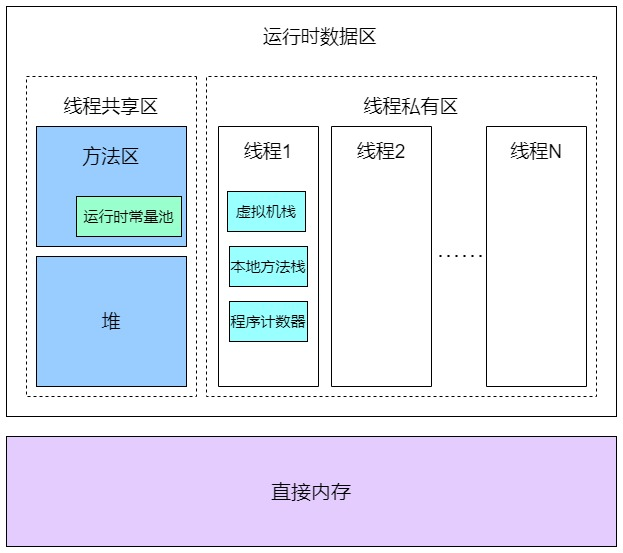

## 1. JVM 运行时数据区域



**运行时数据区的定义**：Java 虚拟机在执行 Java 程序的过程中会把它所管理的内存划分为若干个不同的数据区域。JVM 内存主要分为**堆、程序计数器、方法区、虚拟机栈和本地方法栈**等。按照与线程的关系也可以这么划分区域：

- **线程私有区域**：一个线程拥有单独的一份内存区域。主要包含虚拟机栈、本地方法栈、程序计数器。区域生命周期与线程相同，依赖用户线程的启动/结束而创建/销毁
- **线程共享区域**：被所有线程共享，且在内存中只有一份，主要包含堆、方法区。共享区域随虚拟机的启动/关闭而创建/销毁。

**直接内存**也叫作堆外内存，它并不是JVM 运行时数据区的一部分，它属于没有被JVM虚拟机化的操作系统上的其他内存。比如操作系统上有8G内存，被 JVM 虚拟化了3G，那么还剩余5G，JVM 是借助一些工具使用这5G内存的，这个内存部分称之为直接内存。

> 扩展：直接内存在并发编程中被频繁使用 。JDK 的 NIO 模块提供的基于 Channel 与 Buffer 的 I/O 操作方式就是基于堆外内存实现的，NIO 模块通过调用 Native 函数库直接在操作系统上分配堆外内存，然后使用 DirectByteBuffer 对象作为这块内存的引用对内存进行操作，Java 进程可以通过堆外内存技术避免在 Java 堆 和 Native 堆中来回复制数据带来的资源占用和性能消耗，因此堆外内存在高并发应用场景下被广泛使用（ Netty 、Flink 、HBase 、Hadoop 都有用到堆外内存）。

## 2. 虚拟机栈

### 2.1. 概述

<font color=red>**虚拟机栈是描述线程运行 java 方法过程的内存模型，包含所需的数据，指令、返回地址，是线程私有的**</font>。其实在实际的代码中，一个线程是可以运行多个方法的。如下面的测试程序

```java
public class MethodAndStack {
    public static void main(String[] args) {
        System.out.println("main方法执行开始");
        A();
        System.out.println("main方法执行结束");
    }

    public static void A() {
        System.out.println("A方法执行");
        B();
    }

    public static void B() {
        System.out.println("B方法执行");
        C();
    }

    public static void C() {
        System.out.println("C方法执行");
    }
}
```

程序开始执行，会有一个线程1来运行这些代码，此时线程1会有一个对应的虚拟机栈，同时执行每个方法的时候都会打包成一个**栈帧**。


main方法执行时，会有一个栈帧（main）送入到虚拟机栈。在main方法中调用了A方法，此时又一个将A方法生成一个栈帧(A)进入虚拟机栈，同样的方式栈帧（B）与栈帧（C）进入虚拟机栈，最后等C方法执行结束后，栈帧(C)出栈，然后到B方法执行完，栈帧(B)出栈，同样依次进行，最后main方法执行完，栈帧(main)出栈

这就是 Java 方法运行时对虚拟机栈的影响。**虚拟机栈就是用来存储线程运行方法中的数据，而每一个方法对应一个栈帧**。

### 2.2. 虚拟机栈相关概念

- **栈的数据结构**：先进后出(FILO)的数据结构
- **虚拟机栈的作用**：在 JVM 运行过程中存储当前线程运行方法所需的数据，指令、返回地址。
- **虚拟机栈是基于线程**：就算只有一个`main()`方法，也是以线程的方式运行的，是线程私有的，每个线程都有各自的 Java 虚拟机栈。在线程的生命周期中，参与计算的数据会频繁地入栈和出栈，栈的生命周期是和线程一样的，即随着线程的创建而创建，随着线程的死亡而死亡。
- **虚拟机栈的内存大小**：虚拟机栈内存不是无限大，有大小限制，缺省为1M（具体不同的操作系统的默认大小不一样），可用参数`–Xss`来调整大小，例如`-Xss256k`。如果不断的往虚拟机栈中入栈帧，但是不出栈的话，那么这个虚拟机栈就会出现栈溢出错误（`Exception in thread "main" java.lang.StackOverflowError`）

> 参数值的大小详见官方文档（JDK1.8）：《1.2 JAVA SE 官方文档》

StackOverflowError 测试：

```java
public class StackError {
    public static void main(String[] args) {
        A();
    }
    public static void A() {
        A();
    }
}
```

### 2.3. 栈帧

在每个 Java 方法被调用的时候，都会创建一个栈帧，并进入虚拟机栈（入栈）；一旦方法完成相应的调用后，则出栈。栈帧（Frame）用于存储部分运行时数据及其部分过程结果的数据结构，同时也被用来处理动态链接(Dynamic Linking)。**栈帧大体都包含四个区域**：

- **局部变量表**：用于存放方法参数和方法内局部变量。它是一个 32 位的长度，主要存放我们的 Java 的八大基础数据类类型；如果是 64 位的就使用高低位占用两个也可以存放下；如果是局部的对象，比如 Object 对象，只需要存放它的一个引用地址即可
- **操作数栈**：是存放 java 方法执行的操作数的，先进后出的栈结构。操作的的元素可以是任意的 java 数据类型，所以在一个方法刚刚开始的时候，这个方法操作数栈是空的。<font color=red>**操作数栈本质上是 JVM 执行引擎的一个工作区，也就是方法在执行，才会对操作数栈进行操作，如果代码不不执行，操作数栈其实就是空的**</font>。
- **动态链接库**：Java 语言的多态特性。每个栈帧都包含一个指向运行时常量池中该栈所属方法的符号引用，在方法调用过程中，会进行动态链接，将这个符号引用转化为直接引用。
    - 部分符号引用在类加载阶段的时候就转化为直接引用，这种转化就是**静态链接**
    - 部分符号引用在运行期间转化为直接引用，这种转化就是**动态链接**
- **返回地址（方法出口）**：存放调用当前方法的指令地址。一个方法有两种退出方式：
    - 正常返回，调用程序计数器中的地址作为返回，这个返回地址就记录下一条指令的地址。
    - 异常退出，通过异常处理器表（非栈帧中的）来确定。

栈帧随着方法调用而创建，随着方法结束而销毁。无论方法是正常完成还是异常完成（抛出了在方法内未被捕获的异常）都算作方法结束。

### 2.4. 栈帧执行对内存区域的影响

在 JVM 中，基于解释执行的这种方式是基于栈的引擎，这个就是操作数栈。对 class 进行反汇编，对照字节码参照资料，可以分析操作数栈的执行流程。

```bash
javap –c XXXX.class
```

> 字节码助记码解释参考资料地址：https://cloud.tencent.com/developer/article/1333540


## 3. 程序计数器

程序计数器是占用较小的内存空间，作为记录当前线程执行的字节码行号指示器，**记录各个线程执行指令的地址**。<font color=red>**程序计数器在各线程之间独立存储（线程私有）**</font>，互不影响。主要的作用是：

1. 当前线程所执行的字节码的行号指示器，通过它实现**代码的流程控制**，如：分支、顺序执行、选择、跳转、循环、异常处理。
2. 在多线程的情况下，程序计数器用于**记录当前线程执行的位置**，当线程被切换回来的时候能够知道它上次执行的位置。如：线程恢复

> Notes: <font color=red>**程序计数器也是 JVM 中唯一不会 OOM(Out Of Memory)的内存区域**</font>，它的生命周期随着线程的创建而创建，随着线程的结束而死亡。

**程序计数器产生的原因**是，因为 Java 是多线程语言，当执行的线程数量超过 CPU 核数时，线程之间会根据时间片轮询争夺 CPU 资源。如果一个线程的时间片用完了，或者是其它原因导致这个线程的 CPU 资源被提前抢夺，那么这个退出的线程就需要单独的一个程序计数器，来记录下一条运行的指令。

JVM （虚拟机）内部有完整的指令与执行的一套流程，所以在运行 Java 方法的时候需要使用程序计数器（记录实时执行虚拟机字节码指令的地址或行号），如果是遇到本地方法（native 方法），这个方法不是 JVM 来具体执行，所以程序计数器不需要记录了，这个是因为在操作系统层面也有一个程序计数器，这个会记录本地代码的执行的地址，所以在执行 native 方法时，JVM 中程序计数器的值为空(Undefined)。

## 4. 本地方法栈

本地方法栈和 Java 虚拟机栈是功能非常类似的一个区域，甚至可以认为虚拟机栈和本地方法栈是同一个区域。虚拟机规范无强制规定，各版本虚拟机自由实现，HotSpot直接把本地方法栈和虚拟机栈合二为一。两者主要的区别是服务的对象不一样：

- Java 虚拟机栈用于管理 Java 函数的调用
- <font color=red>**本地方法栈则用于管理本地方法（native 方法）的调用**</font>。本地方法并不是用 Java 实现的，而是由 C 语言实现的(比如 `Object.hashcode` 方法)。

本地方法被执行的时候，在本地方法栈也会创建一个栈帧，用于存放该本地方法的局部变量表、操作数栈、动态链接、出口信息。


## 5. 堆

### 5.1. 定义

堆是 JVM 上最大的内存区域，程序运行几乎所有的创建的对象和产生的数据都是存储在堆中。<font color=red>**堆是被所有线程共享的内存区域**</font>。堆空间一般是程序启动时，就申请了，但是并不一定会全部使用。堆一般设置成可伸缩的。

**垃圾回收器主要操作的对象就是堆区域**。随着对象的频繁创建，堆空间占用的越来越多，就需要不定期的对不再使用的对象进行回收。这个在 Java 中，就叫作 GC（Garbage Collection）。

### 5.2. 在堆中对象的存储位置

对象创建后，是在堆上分配，还是在栈上分配，取决于对象的类型和在 Java 类中存在的位置。Java 的对象可以分为基本数据类型和普通对象。

- 对于普通对象来说，JVM 会首先在堆上创建对象，然后在其他地方使用的其实是它存储地址的引用。比如，一个方法需要使用一个对象，将其引用地址保存在虚拟机栈的局部变量表中。
- 对于基本数据类型（byte、short、int、long、float、double、char)来说，有两种情况。当在方法体内声明了基本数据类型的对象，它就会在栈上直接分配。其他情况，都是在堆上分配。

### 5.3. 堆的相关配置参数

- `-Xms`：堆的最小值，即设定程序启动时占用内存大小。
- `-Xmx`：堆的最大值，即设定程序运行期间最大可占用的内存大小。如果程序运行需要占用更多的内存，超出了这个设置值，就会抛出 OutOfMemory 异常。
- `-Xmn`：新生代的大小；
- `-XX:NewSize`；新生代最小值；
- `-XX:MaxNewSize`：新生代最大值

例如：

```bash
java -Xms256m -Xmx1024M
```

### 5.4. 堆空间分代划分

堆被划分为：**新生代**、**老年代（Tenured）**和**永久代**。其中，新生代默认占 1/3 堆空间，老年代默认占 2/3 堆空间，永久代（主要存放 Class 和 Meta 元数据的信息）占非常少的堆空间。

新生代又被进一步划分为：**Eden 区**和 **Survivor 区**，而 Survivor 区又由 **SurvivorFrom 区**和 **SurvivorTo 区**组成。Eden 区默认占 8/10 新生代空间，SurvivorFrom 区和 SurvivorTo 区默认分别占 1/10 新生代空间。整个区域默认的比例是，Eden:SurvivorFrom:SurvivorTo = 8:1:1

> TOOD: 待重画堆的结构图


值得注意的是：在 Java 8 中永久代已经被元数据区（也称元空间）所取代。元数据区作用与永久代类似，最大区别在于：元数据区并没有使用 Java 虚拟机的内存，而是直接使用操作系统的本地内存。因此，元空间的大小不再受 JVM 内存的限制，加载的元数据信息的多少，由操作系统的内存空间决定。

> Notes: 堆空间的分代划分主要是用于 GC 垃圾回收算法。

#### 5.4.1. 新生代

新生代又划分为：Eden 区、SurvivorFrom 区与 SurvivorTo 区

- Eden 区：Java 新对象的存放区域（如果新创建的对象占用内存很大，则直接分配到老年代）。当 Eden 区内存不够的时候就会触发 MinorGC，对新生代区进行一次垃圾回收。
- Survivor From 区：上一次 GC 的幸存者，作为本次 GC 的被扫描者。
- Survivor To 区：保留了一次 MinorGC 过程中的幸存者。

#### 5.4.2. 老年代

老年代主要存放应用程序中生命周期长的内存对象。老年代的对象比较稳定，所以 MajorGC 不会频繁执行，在进行 MajorGC 前一般都先进行了一次 MinorGC。当无法找到足够大的连续空间分配给新创建的较大对象时也会提前触发一次 MajorGC 进行垃圾回收腾出空间。

新生代与老年代默认比例是 1:2。

#### 5.4.3. 永久代

永久代指内存的永久保存区域，主要存放 Class 和 Meta（元数据）的信息，Class 在被加载的时候被放入永久区域。它和和存放实例的区域不同，<font color=red>**GC 不会在主程序运行期对永久区域进行清理**</font>，所以这也导致了永久代的区域会随着加载的 Class 的增多而胀满，最终抛出 OOM 异常。

但查看垃圾收集器的输出信息，会发现其实永久代也是被回收的。如果永久代满了或者是超过了临界值，会触发完全垃圾回收(Full GC)。这就是为什么正确的永久代大小对避免 Full GC 是非常重要的原因。(注：Java8 中已经移除了永久代，新加了一个叫做元数据区的 native 内存区)

### 5.5. 32 位和 64 位 JVM 的最大堆内存

- 32 位的 JVM 理论上堆内存可以到达 2<sup>32</sup>，即 4GB，但实际上会比这个小很多。不同操作系统之间不同，如 Windows 系统大约 1.5 GB，Solaris 大约 3GB。
- 64 位的 JVM 允许指定最大的堆内存，理论上可以达到 2<sup>64</sup>，这也是一个非常大的数值，实际上可以指定堆内存大小到 100GB。甚至有的 JVM(如 Azul)，堆内存到 1000G 都是可能的。

### 5.6. 关于堆空间分代相关知识

#### 5.6.1. 新生代为什么要分 Eden 和两个 Survivor 区域

如果没有 Survivor 区，Eden 区每进行一次 Minor GC，存活的对象就会被送到老年代。老年代很快被填满，会触发 Major GC。老年代的内存空间远大于新生代，进行一次 Full GC 消耗的时间比 Minor GC 长得多，所以需要分为 Eden 和 Survivor。

Survivor 区的存在意义，就是<u>减少被送到老年代的对象，进而减少 Full GC 的发生</u>。Survivor 的预筛选保证，只有经历 15 次 Minor GC 还能在新生代中存活的对象，才会被送到老年代。

而设置两个 Survivor 区最大的好处就是<u>解决了碎片化</u>，刚刚新建的对象在 Eden 中，经历一次 Minor GC，Eden 中的存活对象就会被移动到第一块 survivor space S0，Eden 被清空；等 Eden 区再满了，就再触发一次 Minor GC，Eden 和 S0 中的存活对象又会被复制送入第二块 survivor space S1（这个过程非常重要，因为这种复制算法保证了S1中来自S0和 Eden 两部分的存活对象占用连续的内存空间，避免了碎片化的发生）

#### 5.6.2. 堆空间分代的依据

主要原因就是可以根据各个年代的特点进行对象分区存储，更便于回收，采用最适当的收集算法。

- 新生代中，每次垃圾收集时都发现大批对象死去，只有少量对象存活，便采用了<u>**复制算法**</u>，只需要付出少量存活对象的复制成本就可以完成收集。
- 老年代中因为对象存活率高、没有额外空间对它进行分配担保，就必须采用<u>**“标记-清理”或者“标记-整理”算法**</u>。

新生代又分为 Eden 和 Survivor （From 与 To，这里简称一个区）两个区，加上老年代总共为三个区。数据会首先分配到 Eden 区当中，如果是大对象则会直接放入到老年代（大对象是指需要大量连续内存空间的 java 对象）。当 Eden 没有足够空间的时候就会触发 jvm 发起一次 Minor GC。如果对象经过一次 Minor GC 还存活，并且又能被 Survivor 空间接受，那么将被移动到 Survivor 空间当中，并将其年龄设为1，对象在 Survivor 每熬过一次 Minor GC，年龄就加1，当年龄达到一定的程度（默认为15）时，就会被晋升到老年代中了，当然晋升老年代的年龄是可以设置的。

### 5.7. 堆和栈的区别

**物理地址**：

- 堆的物理地址分配对对象是不连续的。因此性能慢些。在GC的时候也要考虑到不连续的分配，所以有各种算法。比如，标记-消除，复制，标记-压缩，分代（即新生代使用复制算法，老年代使用标记—压缩）
- 栈使用的是数据结构中的栈，先进后出的原则，物理地址分配是连续的。所以性能快。

**内存分别**：

- 堆的物理地址分配是不连续的，所以<font color=red>**分配的内存是在运行期确认的，因此大小不固定**</font>。一般堆大小远远大于栈。
- 栈的物理地址分配是连续的，所以<font color=red>**分配的内存大小要在编译期就确认，大小是固定的**</font>。

**存放的内容**：

- 堆存放的是对象的实例和数组。该区关注点是数据的存储。
- 栈存放的是局部变量，操作数栈，返回结果。该区关注点是程序方法的执行。

> Tips: 静态变量存放在方法区中，静态的对象依旧存放在堆

**程序的可见度**：

- 堆对于整个应用程序都是<font color=red>**共享、可见的**</font>。
- 栈只对于线程是可见的，所以也是<font color=red>**线程私有**</font>。栈的生命周期和线程相同。

**当内存不足时抛出的异常错误不同**：

- 堆空间不足：`java.lang.OutOfMemoryError`。
- 栈空间不足：`java.lang.StackOverFlowError`。

## 6. 方法区

### 6.1. 方法区的定义

方法区也被称为永久代，与堆空间一样，是各个线程共享的内存区域。**主要是用来存放已被虚拟机加载的类相关信息，包括类信息、静态变量、常量、运行时常量池、字符串常量池（JDK 1.8 后存放在堆中）、即时编译器编译后的机器码等**。方法区是 JVM 对内存的“逻辑划分”：

- 在 JDK1.7 及之前很多开发者都习惯将方法区称为“永久代”
- 在 JDK1.8 及以后使用了元空间来实现方法区。

JVM 在执行某个类的时候，必须先加载。在加载类（加载、验证、准备、解析、初始化）的时候，JVM 会先加载 class 文件，而在 class 文件中除了有类的版本、字段、方法和接口等描述信息外，还有一项信息是常量池 (Constant Pool Table)，用于存放编译期间生成的各种字面量和符号引用。

<font color=red>**对方法区进行垃圾回收的主要目标是：常量池的回收和类的卸载。**</font>

### 6.2. 字面量

字面量包括字符串（`String a = "b"`）、基本类型的常量（`final` 修饰的变量）

### 6.3. 符号引用

符号引用则包括类和方法的全限定名（例如 `String` 这个类，它的全限定名就是 `java.lang.String`）、字段的名称和描述符以及方法的名称和描述符。

例如：一个 java 类（假设为A类）被编译成一个 `.class` 文件时，如果 A 类引用了 B 类，但是在编译时 A 类并不知道引用类的实际内存地址，因此只能使用符号引用来代替。

在类装载器装载A类时，此时可以通过虚拟机获取B类的实际内存地址，因此便可以既将符号 `org.simple.B` 替换为 B 类的实际内存地址，及直接引用地址。即在编译时用符号引用来代替引用类，在加载时再通过虚拟机获取该引用类的实际地。以一组符号来描述所引用的目标，符号可以是任何形式的字面量，只要使用时能无歧义地定位到目标即可。

**符号引用与虚拟机实现的内存布局是无关的，引用的目标不一定已经加载到内存中**。

### 6.4. 常量池与运行时常量池

**运行时常量池是方法区的一部分**。当类加载到内存中后，JVM 就会将 class 文件常量池中的内容存放到运行时的常量池中，除了有类的版本、字段、方法、接口等描述等信息外，还有一项信息是常量池（Constant Pool Table），用于存放编译期生成的各种字面量和符号引用。在解析阶段，JVM 会把符号引用替换为直接引用（对象的索引值）。

例如：类中的一个字符串常量在 class 文件中时，存放在 class 文件常量池中的；在 JVM 加载完类之后，JVM 会将这个字符串常量放到运行时常量池中，并在解析阶段，指定该字符串对象的索引值。运行时常量池是全局共享的，多个类共用一个运行时常量池，class 文件中常量池多个相同的字符串在运行时常量池只会存在一份。

常量池与运行时常量池的区别：

- 运行时常量池（Runtime Constant Pool）是每一个类或接口的常量池（Constant Pool）的运行时表示形式，它包括了若干种不同的常量：从编译期可知的数值字面量、必须运行期解析后才能获得的方法或字段引用。
- 运行时常量池相对于 Class 常量池的另外一个重要特征是具备**动态性**

## 7. Java 8 的元空间

在 HotSpot 虚拟机中，Java7 版本中已经将永久代的静态变量和运行时常量池转移到了堆中，其余部分则存储在 JVM 的非堆内存中。而 Java8 版本已经将方法区中实现的永久代移除，并用**元空间**（class metadata）代替了之前的永久代，并且元空间的存储位置不再是在虚拟机中，而是使用本地内存。

**元空间与永久代两者最大的区别在于：元空间并不在虚拟机中，而是使用直接内存**。默认情况下，永久代内存受限于 JVM 可用内存，而<u>**元空间使用的是直接内存，受本机可用内存的限制**</u>，虽然元空间仍旧可能溢出，但是相比永久代内存溢出的概率更小。

**元空间大小参数设置**如下：

- JDK 1.7 及以前（初始和最大值）：`-XX:PermSize; -XX:MaxPermSize;`
- JDK 1.8 以后（初始和最大值）：`-XX:MetaspaceSize; -XX:MaxMetaspaceSize;`。如果不设置参数的话，大小就只受本机总内存的限制

> JVM 参数参考 《1.2 JAVA SE 官方文档网址》

### 7.1. 使用元空间替代永久代的原因

了解 Java8 为什么使用元空间替代永久代，这样做有什么好处呢？官方的解释如下：

移除永久代是为了融合 HotSpot JVM 与 JRockit VM 而做出的努力，因为 JRockit 没有永久代，所以不需要配置永久代。

永久代内存经常不够用或发生内存溢出，抛出异常 `java.lang.OutOfMemoryError: PermGen`。这是因为在 JDK1.7 版本中，指定的 PermGen 区大小为8M，由于 PermGen 中类的元数据信息在每次 FullGC 的时候都可能被收集，回收率都偏低，成绩很难令人满意；还有为 PermGen 分配多大的空间很难确定，PermSize 的大小依赖于很多因素，比如，JVM 加载的 class 总数、常量池的大小和方法的大小等。

### 7.2. 元空间溢出的问题

元空间在本地内存上，默认是没有上限的，若不加限制出了问题会影响整个服务器的，所以也是比较危险的。可以通过 `-XX:MaxMetaspaceSize` 可以指定最大值。

一般使用动态代理的框架会生成很多 Java 类，如果占用空间超出了我们的设定最大值，会发生元空间溢出。

## 8. 直接内存（堆外内存）

直接内存，又称堆外内存，是用于进行数据存储。JVM 在运行时，会从操作系统申请大块的堆内存，进行数据的存储；同时还有虚拟机栈、本地方法栈和程序计数器，这块称之为栈区。操作系统剩余的内存也就是堆外内存。

<u>**直接内存不是虚拟机运行时数据区的一部分**</u>，也不是 java 虚拟机规范中定义的内存区域。堆外内存不受 JVM 堆大小限制，但受本机总内存的限制，可以通过`-XX:MaxDirectMemorySize`来设置（默认与堆内存最大值一样）大小。这部分内存也被频繁地使用，所以也会出现 OOM 异常。

直接内存的读写操作比堆内存快，可以提升程序I/O操作的性能。通常在I/O通信过程中，会存在堆内内存到堆外内存的数据拷贝操作，对于需要频繁进行内存间数据拷贝且生命周期较短的暂存数据，都建议存储到直接内存。如果使用了 NIO 的话，这块区域会被频繁使用。NIO 提供了 `DirectBuffer`，可以直接访问系统物理内存，避免堆内内存到堆外内存的来回的数据拷贝操作，提高效率。`DirectBuffer` 直接分配在物理内存中，并不占用堆空间，其可申请的最大内存受操作系统限制，不受最大堆内存的限制。

在 java 堆内可以用 `DirectByteBuffer` 对象直接引用并操作。其他堆外内存，主要是指使用了 Unsafe 或者其他 JNI 手段直接申请的内存。

> Tips: 堆外内存的泄漏是非常严重的，它的排查难度高、影响大，甚至会造成主机的程序死亡。同时，要注意 Oracle 之前计划在 Java 9 中去掉 `sun.misc.Unsafe` API。这里删除 `sun.misc.Unsafe` 的原因之一是使 Java 更加安全，并且有替代方案。

## 9. JVM 中的常量池

JDK 1.8 开始：

- **字符串常量池**：存放在堆中，包括 String 对象执行 `intern()` 方法后存的地方、双引号直接引用的字符串
- **运行时常量池**：存放在方法区，属于元空间，是类加载后的一些存储区域，大多数是类中 constant_pool 的内容
- **类文件常量池**：constant_pool，JVM 定义的概念
