## 1. JVM 概述

### 1.1. 什么是JVM

JVM 全称 Java Virtual Machine（Java虚拟机），用来保证 Java 语言**跨平台**

Java 虚拟机可以看做是一个虚拟化的操作系统，类似于 Linux 或者 Windows 的操作系统，如同真实的计算机那样，它有自己的指令集以及各种运行时内存区域.Java 虚拟机与Java语言并没有必然的联系，它只与特定的二进制文件格式(.class文件格式所关联)。Java 虚拟机就是一个字节码翻译器，它将字节码文件翻译成各个系统对应的机器码，确保字节码文件能在各个系统正确运行。

当用 JVM 运行一个 Java 程序时，这个 Java 程序就是一个运行中的实例，每个运行中的 Java 程序都是一个 JVM 实例。

#### 1.1.1. Java 程序的执行过程

一个 Java 程序，首先经过 javac 编译成 `.class` 文件，然后 JVM 将其加载到方法区，执行引擎将会执行这些字节码。执行时，会翻译成操作系统相关的函数。JVM 作为 .class 文件的翻译存在，输入字节码，调用操作系统函数。

执行过程：Java 文件 -> 编译器 -> 字节码 -> JVM -> 机器码。

#### 1.1.2. 跨平台与跨语言

- **跨平台**：编写一个java类，在不同的操作系统上（Linux、Windows、MacOS 等平台）执行效果都是一样，这个就是 JVM 的跨平台性。**不同操作系统有对应的 JDK 的版本**
- **跨语言（语言无关性）**：JVM 只识别字节码，所以与语言没有直接强关联。**JVM 不是解析 Java 文件，而是解析`.class`文件（俗称字节码文件）**。像其他语言（如：Groovy 、Kotlin、Scala等）它们编译成字节码后同样可以在 JVM 上运行，这就是 JVM 的跨语言的特性。

### 1.2. Java虚拟机规范及其实现

> Java SE 8 版本的虚拟机规范地址：https://docs.oracle.com/javase/specs/jvms/se8/html/index.html

Java 虚拟机有一套抽象规范，Java 虚拟机规范（The Java Virtual Machine Specification，JVMS），具体的实现过程不仅需要不同的厂商要遵循 Java 虚拟机规范，而且还要根据每个平台的不同特性以软件或软硬结合的方式去实现设定的功能。

常见的 JVM 实现如下：

- Hotspot：目前使用的最多的 Java 虚拟机。在命令行输入`java –version`，会输出目前使用的虚拟机的名字、版本等信息、执行模式。


- Jrocket：曾号称世界上最快的JVM，被Oracle公司收购，合并于Hotspot
- J9: IBM自己的虚拟机
- TaobaoVM：淘宝自己的VM，实际上是 Hotspot 的定制版。只有一定体量、一定规模的厂商才会开发自己的虚拟机
- LiquidVM：针对硬件的虚拟机。下面是没有操作系统的（不是 Linux 也不是 windows），直接就是硬件，运行效率比较高。
- zing：其垃圾回收速度非常快（1 毫秒之内），是业界标杆。它的一个垃圾回收的算法后来被 Hotspot 吸收才有了现在的 ZGC。

### 1.3. JVM 的多线程

在多核操作系统上，JVM 允许在一个进程内同时并发执行多个线程 。JVM 中的线程与操作系统中的线程是相互对应的，在 JVM 线程的本地存储 、缓冲区分配 、同步对象、枝 、程序计数器等准备工作都完成时，JVM 会调用操作系统的接口创建一个与之对应的原生线程；在JVM 线程运行结束时，原生线程随之被回收 。操作系统负责调度所有线程，并为其分配 CPU 时间片，在原生线程初始化完毕时，就会调用 Java 线程的 `run()` 执行该线程；在线程结束时，会释放原生线程和 Java 线程所对应的资源 。

在 JVM 后台运行的线程主要有以下几个：

- 虚拟机线程（ JVM Thread ）：虚拟机线程在 JVM 到达安全点（ SafePoint ）时出现
- 周期性任务线程：通过定时器调度线程来实现周期性操作的执行 
- GC 线程：该线程支持 JVM 中不同的垃圾回收活动 
- 编译器线程：在运行时将字节码动态编译成本地平台机器码，是 JVM 跨平台的具体实现 
- 信号分发线程：接收发送到 JVM 的信号并调用 JVM 方法

### 1.4. JVM 整体知识体系

JVM 能涉及非常庞大的一块知识体系，比如内存结构、垃圾回收、类加载、性能调优、JVM 自身优化技术、执行引擎、类文件结构、监控工具等。

在JVM的知识体系中，内存结构是核心重点，所有JVM相关的知识都或多或少涉及内存结构。比如垃圾回收回收的就是内存、类加载加载到的地方也是内存、性能优化也涉及到内存优化、执行引擎与内存密不可分、类文件结构与内存的设计有关系，监控工具也会监控内存。

### 1.5. JVM 内存模型图（来源网络）

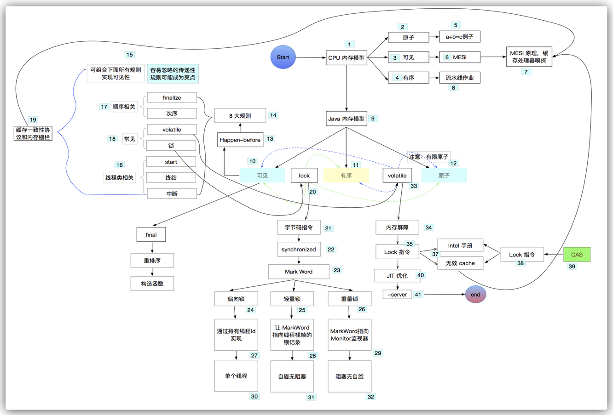

### 1.6. JVM 整体结构图

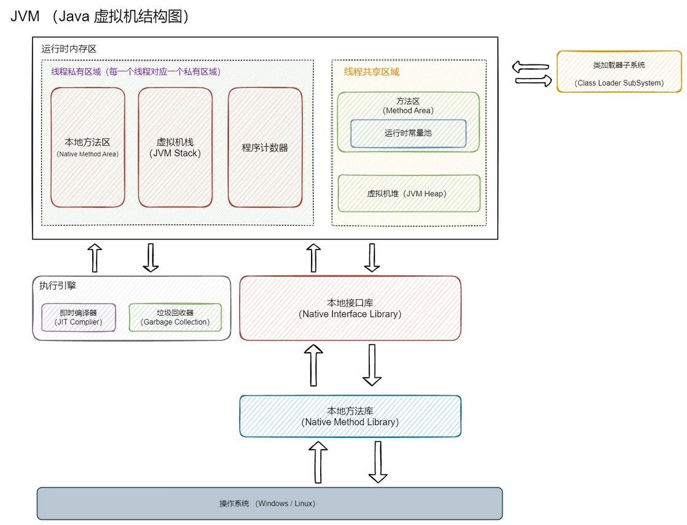

## 2. JVM 内存结构（重点）

### 2.1. 运行时数据区域划分


**运行时数据区的定义**：Java 虚拟机在执行 Java 程序的过程中会把它所管理的内存划分为若干个不同的数据区域。JVM 内存主要分为**堆、程序计数器、方法区、虚拟机栈和本地方法栈**等。按照与线程的关系也可以这么划分区域：

- **线程私有区域**：一个线程拥有单独的一份内存区域。主要包含虚拟机栈、本地方法栈、程序计数器。区域生命周期与线程相同，依赖用户线程的启动/结束而创建/销毁
- **线程共享区域**：被所有线程共享，且在内存中只有一份，主要包含堆、方法区。共享区域随虚拟机的启动/关闭而创建/销毁。

**直接内存**也叫作堆外内存，它并不是JVM 运行时数据区的一部分，它属于没有被JVM虚拟机化的操作系统上的其他内存。比如操作系统上有8G内存，被 JVM 虚拟化了3G，那么还剩余5G，JVM 是借助一些工具使用这5G内存的，这个内存部分称之为直接内存。

> 扩展：直接内存在并发编程中被频繁使用 。JDK 的 NIO 模块提供的基于 Channel 与 Buffer 的 I/O 操作方式就是基于堆外内存实现的，NIO 模块通过调用 Native 函数库直接在操作系统上分配堆外内存，然后使用 DirectByteBuffer 对象作为这块内存的引用对内存进行操作，Java 进程可以通过堆外内存技术避免在 Java 堆 和 Native 堆中来回复制数据带来的资源占用和性能消耗，因此堆外内存在高并发应用场景下被广泛使用（ Netty 、Flink 、HBase 、Hadoop 都有用到堆外内存）。

### 2.2. 虚拟机栈

#### 2.2.1. 概述

<font color=red>**虚拟机栈是描述线程运行 java 方法过程的内存模型，包含所需的数据，指令、返回地址，是线程私有的**</font>。其实在实际的代码中，一个线程是可以运行多个方法的。如下面的测试程序

```java
public class MethodAndStack {
    public static void main(String[] args) {
        System.out.println("main方法执行开始");
        A();
        System.out.println("main方法执行结束");
    }

    public static void A() {
        System.out.println("A方法执行");
        B();
    }

    public static void B() {
        System.out.println("B方法执行");
        C();
    }

    public static void C() {
        System.out.println("C方法执行");
    }
}
```

程序开始执行，会有一个线程1来运行这些代码，此时线程1会有一个对应的虚拟机栈，同时执行每个方法的时候都会打包成一个**栈帧**。

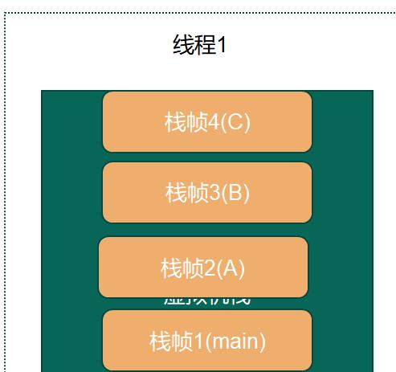

main方法执行时，会有一个栈帧（main）送入到虚拟机栈。在main方法中调用了A方法，此时又一个将A方法生成一个栈帧(A)进入虚拟机栈，同样的方式栈帧（B）与栈帧（C）进入虚拟机栈，最后等C方法执行结束后，栈帧(C)出栈，然后到B方法执行完，栈帧(B)出栈，同样依次进行，最后main方法执行完，栈帧(main)出栈

这就是 Java 方法运行时对虚拟机栈的影响。**虚拟机栈就是用来存储线程运行方法中的数据，而每一个方法对应一个栈帧**。

#### 2.2.2. 虚拟机栈相关概念

- **栈的数据结构**：先进后出(FILO)的数据结构
- **虚拟机栈的作用**：在 JVM 运行过程中存储当前线程运行方法所需的数据，指令、返回地址。
- **虚拟机栈是基于线程**：就算只有一个`main()`方法，也是以线程的方式运行的，是线程私有的，每个线程都有各自的 Java 虚拟机栈。在线程的生命周期中，参与计算的数据会频繁地入栈和出栈，栈的生命周期是和线程一样的，即随着线程的创建而创建，随着线程的死亡而死亡。
- **虚拟机栈的内存大小**：虚拟机栈内存不是无限大，有大小限制，缺省为1M（具体不同的操作系统的默认大小不一样），可用参数`–Xss`来调整大小，例如`-Xss256k`。如果不断的往虚拟机栈中入栈帧，但是不出栈的话，那么这个虚拟机栈就会出现栈溢出错误（`Exception in thread "main" java.lang.StackOverflowError`）

> 参数值的大小详见官方文档（JDK1.8）：《1.2 JAVA SE 官方文档》

StackOverflowError 测试：

```java
public class StackError {
    public static void main(String[] args) {
        A();
    }
    public static void A() {
        A();
    }
}
```

#### 2.2.3. 栈帧

在每个 Java 方法被调用的时候，都会创建一个栈帧，并进入虚拟机栈（入栈）；一旦方法完成相应的调用后，则出栈。栈帧（Frame）用于存储部分运行时数据及其部分过程结果的数据结构，同时也被用来处理动态链接(Dynamic Linking)。**栈帧大体都包含四个区域**：

- **局部变量表**：用于存放方法参数和方法内局部变量。它是一个 32 位的长度，主要存放我们的 Java 的八大基础数据类类型；如果是 64 位的就使用高低位占用两个也可以存放下；如果是局部的对象，比如 Object 对象，只需要存放它的一个引用地址即可
- **操作数栈**：是存放 java 方法执行的操作数的，先进后出的栈结构。操作的的元素可以是任意的 java 数据类型，所以在一个方法刚刚开始的时候，这个方法操作数栈是空的。<font color=red>**操作数栈本质上是 JVM 执行引擎的一个工作区，也就是方法在执行，才会对操作数栈进行操作，如果代码不不执行，操作数栈其实就是空的**</font>
- **动态连接**：Java 语言的多态特性。每个栈帧都包含一个指向运行时常量池中该栈所属方法的符号引用，在方法调用过程中，会进行动态链接，将这个符号引用转化为直接引用。
    - 部分符号引用在类加载阶段的时候就转化为直接引用，这种转化就是**静态链接**
    - 部分符号引用在运行期间转化为直接引用，这种转化就是**动态链接**
- **返回地址（方法出口）**：正常返回（调用程序计数器中的地址作为返回）、异常的话（通过异常处理器表[非栈帧中的]来确定）

栈帧随着方法调用而创建，随着方法结束而销毁。无论方法是正常完成还是异常完成（抛出了在方法内未被捕获的异常）都算作方法结束。

#### 2.2.4. 栈帧执行对内存区域的影响

在 JVM 中，基于解释执行的这种方式是基于栈的引擎，这个就是操作数栈。对 class 进行反汇编，对照字节码参照资料，可以分析操作数栈的执行流程。

```bash
javap –c XXXX.class
```

> 字节码助记码解释参考资料地址：https://cloud.tencent.com/developer/article/1333540

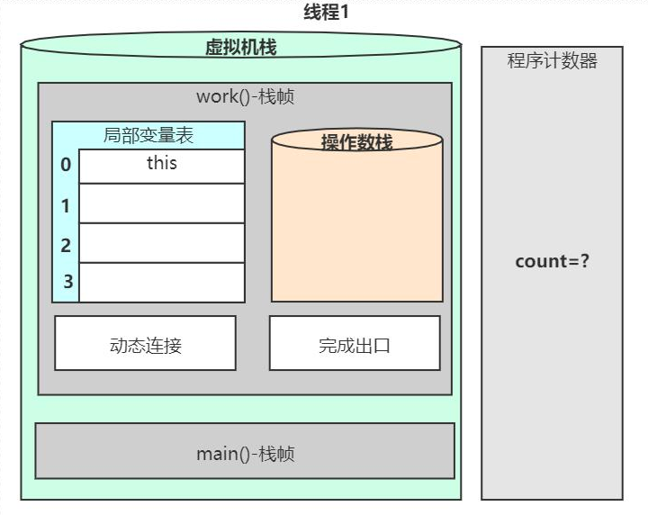

### 2.3. 程序计数器

程序计数器是占用较小的内存空间，作为记录当前线程执行的字节码行号指示器，**记录各个线程执行指令的地址**。<font color=red>**程序计数器在各线程之间独立存储（线程私有）**</font>，互不影响。主要的作用是：

1. 当前线程所执行的字节码的行号指示器，通过它实现**代码的流程控制**，如：分支、顺序执行、选择、跳转、循环、异常处理。
2. 在多线程的情况下，程序计数器用于**记录当前线程执行的位置**，当线程被切换回来的时候能够知道它上次执行的位置。如：线程恢复

> Notes: <font color=red>**程序计数器也是 JVM 中唯一不会 OOM(Out Of Memory)的内存区域**</font>，它的生命周期随着线程的创建而创建，随着线程的结束而死亡。

**程序计数器产生的原因**是，因为 Java 是多线程语言，当执行的线程数量超过 CPU 核数时，线程之间会根据时间片轮询争夺 CPU 资源。如果一个线程的时间片用完了，或者是其它原因导致这个线程的 CPU 资源被提前抢夺，那么这个退出的线程就需要单独的一个程序计数器，来记录下一条运行的指令。

JVM （虚拟机）内部有完整的指令与执行的一套流程，所以在运行 Java 方法的时候需要使用程序计数器（记录实时执行虚拟机字节码指令的地址或行号），如果是遇到本地方法（native 方法），这个方法不是 JVM 来具体执行，所以程序计数器不需要记录了，这个是因为在操作系统层面也有一个程序计数器，这个会记录本地代码的执行的地址，所以在执行 native 方法时，JVM 中程序计数器的值为空(Undefined)。

### 2.4. 本地方法栈

本地方法栈和 Java 虚拟机栈是功能非常类似的一个区域，甚至可以认为虚拟机栈和本地方法栈是同一个区域。虚拟机规范无强制规定，各版本虚拟机自由实现，HotSpot直接把本地方法栈和虚拟机栈合二为一。两者主要的区别是服务的对象不一样：

- Java 虚拟机栈用于管理 Java 函数的调用
- <font color=red>**本地方法栈则用于管理本地方法（native 方法）的调用**</font>。本地方法并不是用 Java 实现的，而是由 C 语言实现的(比如 `Object.hashcode` 方法)。

本地方法被执行的时候，在本地方法栈也会创建一个栈帧，用于存放该本地方法的局部变量表、操作数栈、动态链接、出口信息。

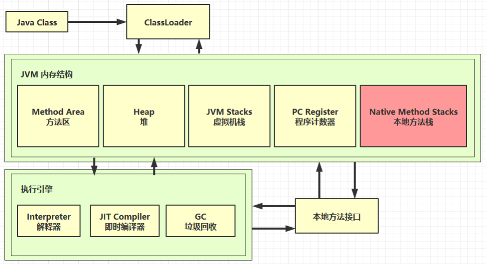

### 2.5. 堆

#### 2.5.1. 定义

堆是 JVM 上最大的内存区域，程序运行几乎所有的创建的对象和产生的数据都是存储在堆中。<font color=red>**堆是被所有线程共享的内存区域**</font>。堆空间一般是程序启动时，就申请了，但是并不一定会全部使用。堆一般设置成可伸缩的。

**垃圾回收器主要操作的对象就是堆区域**。随着对象的频繁创建，堆空间占用的越来越多，就需要不定期的对不再使用的对象进行回收。这个在 Java 中，就叫作 GC（Garbage Collection）。

#### 2.5.2. 在堆中对象的存储位置

对象创建后，是在堆上分配，还是在栈上分配，取决于对象的类型和在 Java 类中存在的位置。Java 的对象可以分为基本数据类型和普通对象。

- 对于普通对象来说，JVM 会首先在堆上创建对象，然后在其他地方使用的其实是它存储地址的引用。比如，一个方法需要使用一个对象，将其引用地址保存在虚拟机栈的局部变量表中。
- 对于基本数据类型（byte、short、int、long、float、double、char)来说，有两种情况。当在方法体内声明了基本数据类型的对象，它就会在栈上直接分配。其他情况，都是在堆上分配。

#### 2.5.3. 堆的相关配置参数

- `-Xms`：堆的最小值，即设定程序启动时占用内存大小。
- `-Xmx`：堆的最大值，即设定程序运行期间最大可占用的内存大小。如果程序运行需要占用更多的内存，超出了这个设置值，就会抛出 OutOfMemory 异常。
- `-Xmn`：新生代的大小；
- `-XX:NewSize`；新生代最小值；
- `-XX:MaxNewSize`：新生代最大值

例如：

```bash
java -Xms256m -Xmx1024M
```

#### 2.5.4. 堆空间分代划分

堆被划分为：**新生代**、**老年代（Tenured）**和**永久代**。其中，新生代默认占 1/3 堆空间，老年代默认占 2/3 堆空间，永久代（主要存放 Class 和 Meta 元数据的信息）占非常少的堆空间。

新生代又被进一步划分为：**Eden 区**和 **Survivor 区**，而 Survivor 区又由 **SurvivorFrom 区**和 **SurvivorTo 区**组成。Eden 区默认占 8/10 新生代空间，SurvivorFrom 区和 SurvivorTo 区默认分别占 1/10 新生代空间。

> TOOD: 待重画堆的结构图

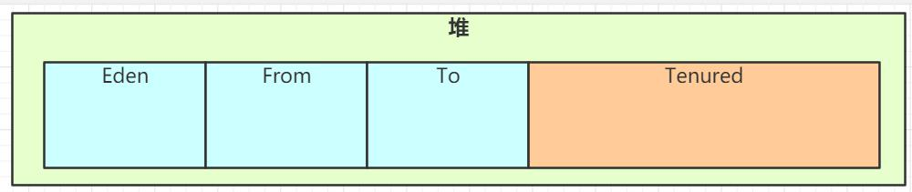

值得注意的是：在 Java 8 中永久代已经被元数据区（也称元空间）所取代。元数据区作用与永久代类似，最大区别在于：元数据区并没有使用 Java 虚拟机的内存，而是直接使用操作系统的本地内存。因此，元空间的大小不再受 JVM 内存的限制，加载的元数据信息的多少，由操作系统的内存空间决定。

> Notes: 堆空间的分代划分主要是用于 GC 垃圾回收算法

##### 2.5.4.1. Eden 区

Java 新对象的存放区域（如果新创建的对象占用内存很大，则直接分配到老年代）。当 Eden 区内存不够的时候就会触发 MinorGC，对新生代区进行一次垃圾回收。

##### 2.5.4.2. SurvivorFrom 区

上一次 GC 的幸存者，作为本次 GC 的被扫描者。

##### 2.5.4.3. SurvivorTo 区

保留了一次 MinorGC 过程中的幸存者。

##### 2.5.4.4. 老年代

老年代主要存放应用程序中生命周期长的内存对象。老年代的对象比较稳定，所以 MajorGC 不会频繁执行，在进行 MajorGC 前一般都先进行了一次 MinorGC。当无法找到足够大的连续空间分配给新创建的较大对象时也会提前触发一次 MajorGC 进行垃圾回收腾出空间。

##### 2.5.4.5. 永久代

永久代指内存的永久保存区域，主要存放 Class 和 Meta（元数据）的信息，Class 在被加载的时候被放入永久区域。它和和存放实例的区域不同，<font color=red>**GC 不会在主程序运行期对永久区域进行清理**</font>，所以这也导致了永久代的区域会随着加载的 Class 的增多而胀满，最终抛出 OOM 异常。

但查看垃圾收集器的输出信息，会发现其实永久代也是被回收的。如果永久代满了或者是超过了临界值，会触发完全垃圾回收(Full GC)。这就是为什么正确的永久代大小对避免 Full GC 是非常重要的原因。(注：Java8 中已经移除了永久代，新加了一个叫做元数据区的 native 内存区)

#### 2.5.5. 32 位和 64 位 JVM 的最大堆内存

- 32 位的 JVM 理论上堆内存可以到达 2<sup>32</sup>，即 4GB，但实际上会比这个小很多。不同操作系统之间不同，如 Windows 系统大约 1.5 GB，Solaris 大约 3GB。
- 64 位的 JVM 允许指定最大的堆内存，理论上可以达到 2<sup>64</sup>，这也是一个非常大的数值，实际上可以指定堆内存大小到 100GB。甚至有的 JVM(如 Azul)，堆内存到 1000G 都是可能的。

### 2.6. 方法区

#### 2.6.1. 方法区的定义

方法区也被称为永久代，与堆空间一样，是各个线程共享的内存区域。**主要是用来存放已被虚拟机加载的类相关信息，包括类信息、静态变量、常量、运行时常量池、字符串常量池、即时编译器编译后的机器码等**。方法区是 JVM 对内存的“逻辑划分”：

- 在 JDK1.7 及之前很多开发者都习惯将方法区称为“永久代”
- 在 JDK1.8 及以后使用了元空间来实现方法区。

JVM 在执行某个类的时候，必须先加载。在加载类（加载、验证、准备、解析、初始化）的时候，JVM 会先加载 class 文件，而在 class 文件中除了有类的版本、字段、方法和接口等描述信息外，还有一项信息是常量池 (Constant Pool Table)，用于存放编译期间生成的各种字面量和符号引用。

<font color=red>**对方法区进行垃圾回收的主要目标是：常量池的回收和类的卸载。**</font>

#### 2.6.2. 字面量

字面量包括字符串（`String a = "b"`）、基本类型的常量（`final` 修饰的变量）

#### 2.6.3. 符号引用

符号引用则包括类和方法的全限定名（例如 `String` 这个类，它的全限定名就是 `java.lang.String`）、字段的名称和描述符以及方法的名称和描述符。

例如：一个 java 类（假设为A类）被编译成一个 `.class` 文件时，如果 A 类引用了 B 类，但是在编译时 A 类并不知道引用类的实际内存地址，因此只能使用符号引用来代替。

在类装载器装载A类时，此时可以通过虚拟机获取B类的实际内存地址，因此便可以既将符号 `org.simple.B` 替换为 B 类的实际内存地址，及直接引用地址。即在编译时用符号引用来代替引用类，在加载时再通过虚拟机获取该引用类的实际地。以一组符号来描述所引用的目标，符号可以是任何形式的字面量，只要使用时能无歧义地定位到目标即可。

**符号引用与虚拟机实现的内存布局是无关的，引用的目标不一定已经加载到内存中**。

#### 2.6.4. 常量池与运行时常量池

**运行时常量池是方法区的一部分**。当类加载到内存中后，JVM 就会将 class 文件常量池中的内容存放到运行时的常量池中，除了有类的版本、字段、方法、接口等描述等信息外，还有一项信息是常量池（Constant Pool Table），用于存放编译期生成的各种字面量和符号引用。在解析阶段，JVM 会把符号引用替换为直接引用（对象的索引值）。

例如：类中的一个字符串常量在 class 文件中时，存放在 class 文件常量池中的；在 JVM 加载完类之后，JVM 会将这个字符串常量放到运行时常量池中，并在解析阶段，指定该字符串对象的索引值。运行时常量池是全局共享的，多个类共用一个运行时常量池，class 文件中常量池多个相同的字符串在运行时常量池只会存在一份。

常量池与运行时常量池的区别：

- 运行时常量池（Runtime Constant Pool）是每一个类或接口的常量池（Constant Pool）的运行时表示形式，它包括了若干种不同的常量：从编译期可知的数值字面量、必须运行期解析后才能获得的方法或字段引用。
- 运行时常量池相对于 Class 常量池的另外一个重要特征是具备**动态性**

### 2.7. Java 8 的元空间

在 HotSpot 虚拟机中，Java7 版本中已经将永久代的静态变量和运行时常量池转移到了堆中，其余部分则存储在 JVM 的非堆内存中。而 Java8 版本已经将方法区中实现的永久代移除，并用**元空间**（class metadata）代替了之前的永久代，并且元空间的存储位置不再是在虚拟机中，而是使用本地内存。

**元空间与永久代两者最大的区别在于：元空间并不在虚拟机中，而是使用直接内存**。默认情况下，永久代内存受限于 JVM 可用内存，而<u>**元空间使用的是直接内存，受本机可用内存的限制**</u>，虽然元空间仍旧可能溢出，但是相比永久代内存溢出的概率更小。

**元空间大小参数设置**如下：

- JDK 1.7 及以前（初始和最大值）：`-XX:PermSize; -XX:MaxPermSize;`
- JDK 1.8 以后（初始和最大值）：`-XX:MetaspaceSize; -XX:MaxMetaspaceSize;`。如果不设置参数的话，大小就只受本机总内存的限制

> JVM 参数参考：《1.2 JAVA SE 官方文档网址》，了解 Java8 为什么使用元空间替代永久代，这样做有什么好处呢？
>
> - 官方解释：移除永久代是为了融合 HotSpot JVM 与 JRockit VM 而做出的努力，因为 JRockit 没有永久代，所以不需要配置永久代。
> - 永久代内存经常不够用或发生内存溢出，抛出异常 `java.lang.OutOfMemoryError: PermGen`。这是因为在 JDK1.7 版本中，指定的 PermGen 区大小为8M，由于 PermGen 中类的元数据信息在每次 FullGC 的时候都可能被收集，回收率都偏低，成绩很难令人满意；还有为 PermGen 分配多大的空间很难确定，PermSize 的大小依赖于很多因素，比如，JVM 加载的 class 总数、常量池的大小和方法的大小等。

### 2.8. 直接内存（堆外内存）

直接内存，又称堆外内存，是用于进行数据存储。JVM 在运行时，会从操作系统申请大块的堆内存，进行数据的存储；同时还有虚拟机栈、本地方法栈和程序计数器，这块称之为栈区。操作系统剩余的内存也就是堆外内存。

<u>**直接内存不是虚拟机运行时数据区的一部分**</u>，也不是 java 虚拟机规范中定义的内存区域。堆外内存不受 JVM 堆大小限制，但受本机总内存的限制，可以通过`-XX:MaxDirectMemorySize`来设置（默认与堆内存最大值一样）大小。这部分内存也被频繁地使用，所以也会出现 OOM 异常。

直接内存的读写操作比堆内存快，可以提升程序I/O操作的性能。通常在I/O通信过程中，会存在堆内内存到堆外内存的数据拷贝操作，对于需要频繁进行内存间数据拷贝且生命周期较短的暂存数据，都建议存储到直接内存。如果使用了 NIO 的话，这块区域会被频繁使用。NIO 提供了 `DirectBuffer`，可以直接访问系统物理内存，避免堆内内存到堆外内存的来回的数据拷贝操作，提高效率。`DirectBuffer` 直接分配在物理内存中，并不占用堆空间，其可申请的最大内存受操作系统限制，不受最大堆内存的限制。

在 java 堆内可以用 `DirectByteBuffer` 对象直接引用并操作。其他堆外内存，主要是指使用了 Unsafe 或者其他 JNI 手段直接申请的内存。

> Tips: 堆外内存的泄漏是非常严重的，它的排查难度高、影响大，甚至会造成主机的程序死亡。同时，要注意 Oracle 之前计划在 Java 9 中去掉 `sun.misc.Unsafe` API。这里删除 `sun.misc.Unsafe` 的原因之一是使 Java 更加安全，并且有替代方案。

### 2.9. 堆和栈的区别

**物理地址**：

- 堆的物理地址分配对对象是不连续的。因此性能慢些。在GC的时候也要考虑到不连续的分配，所以有各种算法。比如，标记-消除，复制，标记-压缩，分代（即新生代使用复制算法，老年代使用标记—压缩）
- 栈使用的是数据结构中的栈，先进后出的原则，物理地址分配是连续的。所以性能快。

**内存分别**：

- 堆的物理地址分配是不连续的，所以<font color=red>**分配的内存是在运行期确认的，因此大小不固定**</font>。一般堆大小远远大于栈。
- 栈的物理地址分配是连续的，所以<font color=red>**分配的内存大小要在编译期就确认，大小是固定的**</font>。

**存放的内容**：

- 堆存放的是对象的实例和数组。该区关注点是数据的存储。
- 栈存放的是局部变量，操作数栈，返回结果。该区关注点是程序方法的执行。

> Tips: 静态变量存放在方法区中，静态的对象依旧存放在堆

**程序的可见度**：

- 堆对于整个应用程序都是<font color=red>**共享、可见的**</font>。
- 栈只对于线程是可见的，所以也是<font color=red>**线程私有**</font>。栈的生命周期和线程相同。

**当内存不足时抛出的异常错误不同**：

- 堆空间不足：`java.lang.OutOfMemoryError`。
- 栈空间不足：`java.lang.StackOverFlowError`。

## 3. JVM 运行流程示例

### 3.1. 运行流程测试

```java
/**
 * JVM执行流程测试
 * <p> VM参数配置 </p>
 * -Xms30m -Xmx30m -XX:MaxMetaspaceSize=30m -XX:+UseConcMarkSweepGC -XX:-UseCompressedOops
 *
 * <p> -XX:MaxMetaspaceSize 定义元空间的最大值 </p>
 * <p> -XX:+UseConcMarkSweepGC -XX:-UseCompressedOops 指定垃圾回收器 </p>
 */
public class JVMObject {
    public final static String MAN_TYPE = "man"; // 常量
    public static String WOMAN_TYPE = "woman";  // 静态变量
    public static void main(String[] args) throws InterruptedException {
        Person p1 = new Person();
        p1.setName("月の女祭司");
        p1.setSexType(WOMAN_TYPE);
        p1.setAge(28);

        // 主动触发GC 垃圾回收 15次
        for (int i = 0; i < 15; i++) {
            System.gc();
        }

        Person p2 = new Person();
        p2.setName("Moon");
        p2.setSexType(MAN_TYPE);
        p2.setAge(19);
        Thread.sleep(Integer.MAX_VALUE); // 线程休眠
    }
}
```

配置 VM 参数：`-Xms30m -Xmx30m -XX:MaxMetaspaceSize=30m -XX:+UseConcMarkSweepGC -XX:-UseCompressedOops`

**JVM运行的主要流程**如下：

1. JVM 向操作系统申请内存：通过配置参数或者默认配置参数向操作系统申请内存空间，根据内存大小找到具体的内存分配表，然后把内存段的起始地址和终止地址分配给 JVM，然后 JVM 再进行内部分配
2. JVM 获得内存空间后，会根据配置参数分配堆、栈以及方法区的内存大小，例如：`-Xms30m -Xmx30m -Xss1m -XX:MaxMetaspaceSize=30m`
3. 进行类加载，主要是把 class 放入方法区、还有 class 中的静态变量和常量也要放入方法区
4. 执行方法及创建对象。如上面测试代码：启动 main 线程，执行 main 方法，开始执行第一行代码。此时堆内存中会创建一个 Person 对象，对象引用 p1 就存放在栈中。后续代码中遇到 new 关键字，会再创建一个 Person 对象，对象引用 p2 就存放在栈中。


### 3.2. JVM 运行内存的整体流程总结

- JVM 在操作系统上启动，申请内存，先进行运行时数据区的初始化，然后把类加载到方法区，最后执行方法。
- 方法的执行和退出过程在内存上的体现上就是虚拟机栈中栈帧的入栈和出栈。
- 同时在方法的执行过程中创建的对象一般情况下都是放在堆中，最后堆中的对象也是需要进行垃圾回收清理的。

### 3.3. JHSDB 工具

JHSDB 是一款基于服务性代理实现的进程外调试工具。服务性代理是 HotSpot 虚拟机中一组用于映射 Java 虚拟机运行信息的，主要基于 Java 语言实现的API集合

#### 3.3.1. JDK1.8 的开启方式

开启 JHSDB 工具，在 JDK1.8 启动 JHSDB 的时候必须将 `sawindbg.dll`（一般会在JDK的目录下）复制到对应的jre/bin目录下(*注：在windows上安装了 JDK1.8 后往往同级目录下有一个
jre 的目录*)

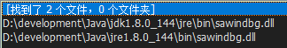

然后到目录：`...\Java\jdk1.8.0_144\lib` 进入命令行，执行 `java -cp .\sa-jdi.jar sun.jvm.hotspot.HSDB`


#### 3.3.2. JDK1.9 及以后的开启方式

进入 JDK 的 bin 目录下，在命令行中使用 `jhsdb hsdb` 来启动JHSDB工具

#### 3.3.3. 配置程序运行时的VM参数

VM 参数加入：`-XX:+UseConcMarkSweepGC -XX:-UseCompressedOops`

```
节选官方文档参数解释：
-XX:+UseConcMarkSweepGC
Enables the use of the CMS garbage collector for the old generation. Oracle recommends that you use the CMS garbage collector when application latency requirements cannot be met by the throughput (-XX:+UseParallelGC) garbage collector. The G1 garbage collector (-XX:+UseG1GC) is another alternative.

By default, this option is disabled and the collector is chosen automatically based on the configuration of the machine and type of the JVM. When this option is enabled, the -XX:+UseParNewGC option is automatically set and you should not disable it, because the following combination of options has been deprecated in JDK 8: -XX:+UseConcMarkSweepGC -XX:-UseParNewGC.

-XX:-UseCompressedOops
Disables the use of compressed pointers. By default, this option is enabled, and compressed pointers are used when Java heap sizes are less than 32 GB. When this option is enabled, object references are represented as 32-bit offsets instead of 64-bit pointers, which typically increases performance when running the application with Java heap sizes less than 32 GB. This option works only for 64-bit JVMs.

It is also possible to use compressed pointers when Java heap sizes are greater than 32GB. See the -XX:ObjectAlignmentInBytes option.
```

> 详细说明参考官方文档：《1.2 JAVA SE 官方文档网址》

#### 3.3.4. JHSDB 工具的使用

##### 3.3.4.1. 打开查看程序的运行进程

启动上面的测试代码，因为 JVM 启动有一个进程，需要借助一个java的命令方 `jps` 查找到对应程序的进程

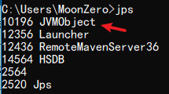

点击 JHSDB 工具中 【File】 --> 【Attach to HotSpot process...】，在【process ID】中输入程序的进程id，点击ok打开，查询当前程序中的所有线程信息

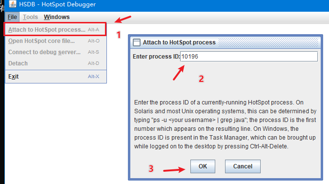


##### 3.3.4.2. 查看堆参数

点击【Tools】 --> 【Heap Parameters】，打开堆参数面板

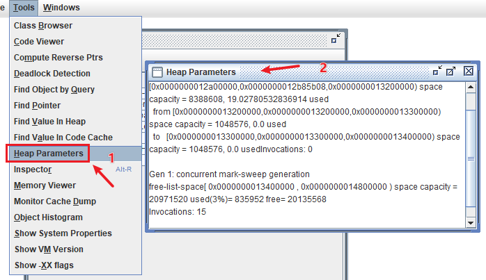

上图中可以看到实际 JVM 启动过程中堆中参数的对照，在不启动内存压缩的情况下。堆空间里面的分代划分都是连续的。

##### 3.3.4.3. 查看程序中对象

点击【Tools】 --> 【Object Histogram】，可以看到 JVM 中所有的对象，都是基于 class 的对象。通过全路径名搜索，可以查询当前程序中的对象信息

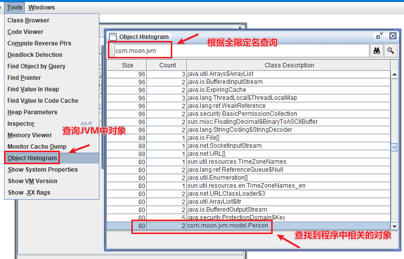

双击出现这个Person类，弹出框可以查询到两个对象，就是上面示例程序中的p1和p2对象。选择对象再点击【Inspect】查看对象的详细信息

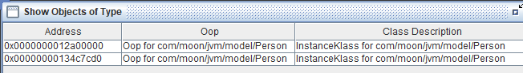

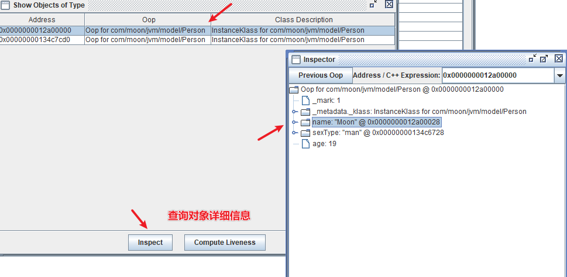

分开点开两个对象对比，在创建p1对象后，手动多次触发了gc垃圾回收后，p1位置在老年代，而最后创建的p2对象就在Eden区


##### 3.3.4.4. 查看栈

选择main线程，点击【Stack Memory...】按钮

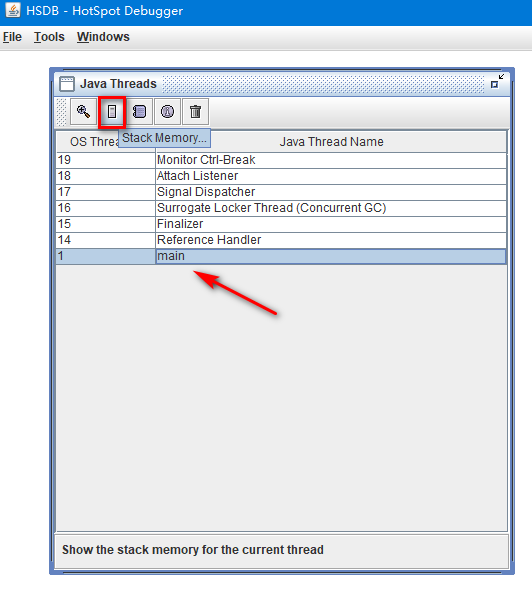

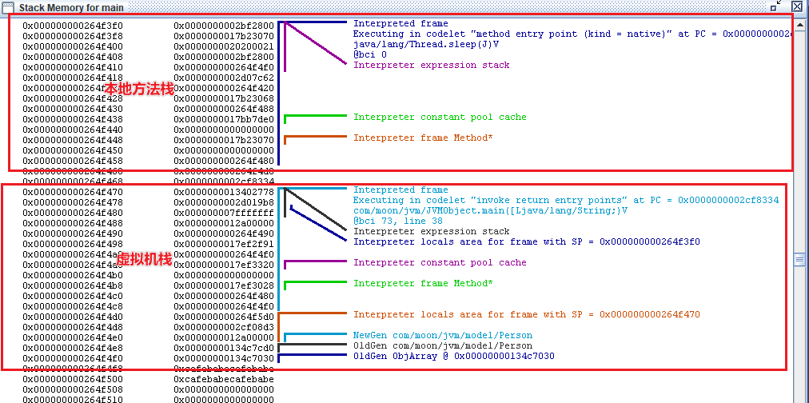

从上图中可以验证栈内存，同时也可以验证到虚拟机栈和本地方法栈在 Hotspot 中是合二为一的实现了。

#### 3.3.5. JVM 的处理全过程总结

执行上面的示例程序，可以看到 JVM 在运行程序的全过程如下：

1. JVM 向操作系统申请内存，JVM 第一步就是通过配置参数或者默认配置参数向操作系统申请内存空间。
2. JVM 获得内存空间后，会根据配置参数分配堆、栈以及方法区的内存大小。
3. 完成上一个步骤后，JVM 首先会执行构造器，编译器会在`.java`文件被编译成`.class`文件时，收集所有类的初始化代码，包括静态变量赋值语句、静态代码块、静态方法，静态变量和常量放入方法区
4. 执行方法。启动 main 线程，执行 main 方法，开始执行第一行代码。此时堆内存中会创建一个 Person 对象，对象引用 p1 就存放在栈中。执行其他方法时，具体的操作查看上面章节的《栈帧执行对内存区域的影响》。

## 4. HotSpot 虚拟机对象

### 4.1. 对象的创建方式

Java 中提供的几种对象创建方式：

1. 使用 `new` 关键字（调用了构造函数）
2. 使用 `Class` 类的 `newInstance` 方法（调用了构造函数）
3. 使用 `Constructor` 类的 `newInstance` 方法（调用了构造函数）
4. 使用 `clone` 方法（没有调用了构造函数）
5. 使用反序列化（没有调用了构造函数）

### 4.2. 对象创建流程

#### 4.2.1. 流程解析

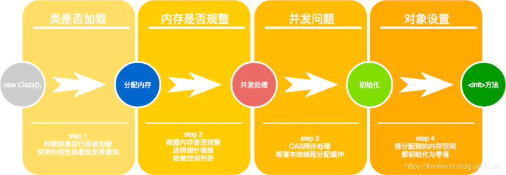

1. **类加载检查**：当虚拟机遇到一条 new 指令时，首先检查是否能在常量池中定位到这个类的符号引用，并且检查这个符号引用代表的类是否已被加载过、解析和初始化过。如果没有，必须先执行相应的类加载。
2. **分配内存**：在类加载检查通过后，接下来虚拟机将为对象实例分配内存。若 Java 堆中内存是绝对规整的，使用“指针碰撞”方式分配内存；如果不是规整的，就从空闲列表中分配，叫做“空闲列表”方式。划分内存时还需要考虑一个问题-并发，也有两种方式: CAS同步处理，或者本地线程分配缓冲(Thread Local Allocation Buffer, TLAB)。
3. **内存空间初始化**：分配到的内存空间都初始化为零值，通过这个操作保证了对象的字段可以不赋初始值就直接使用，程序能访问到这些字段的数据类型所对应的零值。
4. **设置对象头**：Hotspot 虚拟机的对象头包括，存储对象自身的运行时元数据（哈希码、分代年龄、锁标志等等）、类型指针和数据长度（数组对象才有），类型指针就是对象指向它的类信息的指针，虚拟机通过这个指针来确定这个对象是哪个类的实例。
5. **按照 Java 代码执行相关初始化方法**。

#### 4.2.2. 为对象分配内存的方式

类加载完成后，接着会在Java堆中划分一块内存分配给对象。内存分配根据Java堆是否规整，有两种方式：

- **指针碰撞**：如果Java堆的内存是规整，即所有用过的内存放在一边，而空闲的的放在另一边。分配内存时将位于中间的指针指示器向空闲的内存移动一段与对象大小相等的距离，这样便完成分配内存工作。
- **空闲列表**：如果Java堆的内存不是规整的，则需要由虚拟机维护一个列表来记录那些内存是可用的，这样在分配的时候可以从列表中查询到足够大的内存分配给对象，并在分配后更新列表记录。

选择哪种分配方式是由 Java 堆是否规整来决定的，而 Java 堆是否规整又由所采用的垃圾收集器是否带有压缩整理功能决定。


#### 4.2.3. 处理并发安全问题

对象的创建在虚拟机中是一个非常频繁的行为，哪怕只是修改一个指针所指向的位置，在并发情况下也是不安全的，可能出现正在给对象 A 分配内存，指针还没来得及修改，对象 B 又同时使用了原来的指针来分配内存的情况。解决这个问题有两种方案：

- 对分配内存空间的动作进行同步处理（采用 CAS + 失败重试来保障更新操作的原子性）
- 把内存分配的动作按照线程划分在不同的空间之中进行，即每个线程在 Java 堆中预先分配一小块内存，称为本地线程分配缓冲（Thread Local Allocation Buffer, TLAB）。哪个线程要分配内存，就在哪个线程的 TLAB 上分配。只有 TLAB 用完并分配新的 TLAB 时，才需要同步锁。通过 `-XX:+/-UserTLAB` 参数来设定虚拟机是否使用TLAB。


### 4.3. 对象的访问定位

Java 程序需要通过 JVM 栈上的引用访问堆中的具体对象。对象的访问方式取决于 JVM 虚拟机的实现。目前主流的访问方式有**句柄**和**直接指针**两种方式。

- **指针**：指向对象，代表一个对象在内存中的起始地址。
- **句柄**：可以理解为指向指针的指针，维护着对象的指针。句柄不直接指向对象，而是指向对象的指针（句柄不发生变化，指向固定内存地址），再由对象的指针指向对象的真实内存地址。

#### 4.3.1. 句柄访问

Java 堆中划分出一块内存来作为**句柄池**，引用中存储对象的**句柄地址**，而句柄中**包含了对象实例数据与对象类型数据各自的具体地址信息**，具体构造如下图所示：

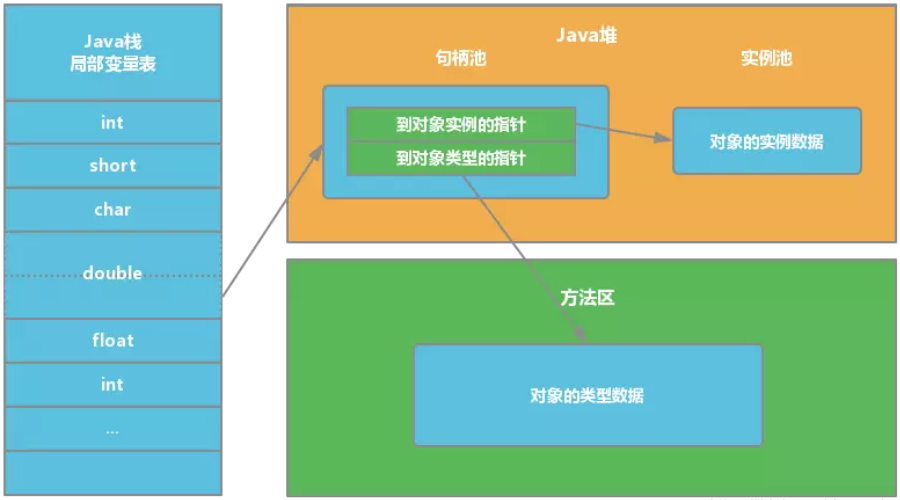

使用句柄访问的优势：**引用中存储的是稳定的句柄地址，在对象被移动（垃圾收集时移动对象是非常普遍的行为）时只会改变句柄中的实例数据指针，而引用本身不需要修改**。

#### 4.3.2. 直接指针

如果使用**直接指针**访问，**引用中存储的直接就是对象地址**，那么 Java 堆对象内部的布局中就必须考虑如何放置访问**类型数据**的相关信息。

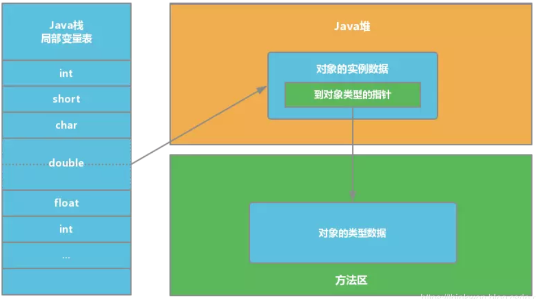

使用直接指针访问的优势：**速度更快，节省了一次指针定位的时间开销**。由于对象的访问在 Java 中非常频繁，因此这类开销积少成多后也是非常可观的执行成本。HotSpot 中采用的就是这种方式。

### 4.4. 类文件结构

Class 文件编译成 JVM 指令后的结构：

```java
ClassFile {
    u4             magic; // 类文件的标志
    u2             minor_version; // 小版本号
    u2             major_version; // 大版本号
    u2             constant_pool_count; // 常量池的数量
    cp_info        constant_pool[constant_pool_count-1]; // 常量池
    u2             access_flags; // 类的访问标记
    u2             this_class; // 当前类的索引
    u2             super_class; // 父类
    u2             interfaces_count; // 接口
    u2             interfaces[interfaces_count]; // 一个类可以实现多个接口
    u2             fields_count; // 字段属性
    field_info     fields[fields_count]; // 一个类会可以有个字段
    u2             methods_count; // 方法数量
    method_info    methods[methods_count];    // 一个类可以有个多个方法
    u2             attributes_count;    // 此类的属性表中的属性数
    attribute_info attributes[attributes_count];    // 属性表集合
}
```

主要参数说明如下：

- **魔数**(`magic`)： class 文件标志。
- **文件版本**：高版本的 Java 虚拟机可以执行低版本编译器生成的类文件，但是低版本的 Java 虚拟机不能执行高版本编译器生成的类文件。
- **常量池**：存放字面量和符号引用。字面量类似于 Java 的常量，如字符串，声明为 `final` 的常量值等。符号引用包含三类：类和接口的全限定名，方法的名称和描述符，字段的名称和描述符。
- **访问标志**：识别类或者接口的访问信息，比如这个 Class 是类还是接口，是否为 `public` 或者 `abstract` 类型等等。
- **当前类的索引**：类索引用于确定这个类的全限定名。

## 5. 类的生命周期

### 5.1. 类生命周期的概述

**类的生命周期**：是指从被加载到虚拟机内存中开始，到从内存卸载为止。它的完整生命周期包括：加载（Loading）、验证（Verification）、准备（Preparation）、解析（Resolution）、初始化（Initialization）、使用（Using）和卸载（Unloading）等 7 个阶段。

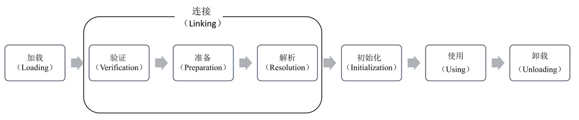

- 其中『验证、准备、解析』 3 个部分统称为『连接（Linking）』。
- 在使用之前的阶段，称为『类的加载过程』。

### 5.2. 类加载的概念

当第一次使用某个类时，如果该类的字节码文件(class)还没有加载到内存中，则 JVM 通过类的完全限定名（包名和类名）查找此类的字节码文件，会将该类的字节码文件（`.class`）加载到内存中，并在内存中创建一个 Class 对象(字节码文件对象)，用来封装类在方法区内的数据结构并存放在堆区内。

> Notes: **每一个类只会加载一次，每一个类的 Class 对象是都是唯一的(单例)。当类加载到内存中时会执行该类的静态代码块，而且只会加载一次**

### 5.3. 类加载的时机

1. 创建该类的对象和子类对象
2. 访问类的静态变量，或者为静态变量赋值（**静态常量除外**，因为静态常量在编译时已经存在）
3. 调用类的静态方法
4. 使用反射方式来强制创建某个类或接口对应的 `java.lang.Class` 对象
5. 初始化某个类的子类
6. 直接使用 `java` 命令来执行含有 main 方法的类时

> Notes: Java 类的加载是动态的，它并不会一次性将所有类全部加载后再运行，而是保证程序运行的基础类(像是基类)完全加载到 JVM 中，至于其他类，则在需要的时候才加载。此做法就是为了节省内存开销。

### 5.4. 类装载方式

类装载方式分成以下两种：

1. 隐式装载，程序在运行过程中，当遇到通过 `new` 等方式生成对象时，隐式调用类装载器加载对应的类到 JVM 中
2. 显式装载，通过 `Class.forName("com.moon.Foo")` 等方法，显式加载需要的类

### 5.5. 类加载过程

**类加载过程**：是指当程序要使用某个类时，JVM 会将类加载到内存中初始完成初始化，类的加载分为5个阶段：**加载、验证、准备、解析、初始化**。在类初始化完成后就可以使用该类的信息，而当一个类不再被需要时可以从 JVM 中卸载。

#### 5.5.1. 加载

加载阶段，是指 JVM 读取 Class 文件（通过类的全限定名称来查找）读入内存（运行时区域的方法区内），并且根据 Class 文件描述在堆中创建 `java.lang.Class` 对象，并封装类在方法区的数据结构这个过程。具体过程主要包含：

1. 通过类的全限定名获取定义此类的二进制字节流
2. 将字节流所代表的静态存储结构转换为方法区的运行时数据结构
3. 在内存中生成一个代表该类的 `Class` 对象，作为方法区类信息的访问入口

值得注意的是，Class 对象不一定非得要从一个 class 文件获取，读取 Class 文件时既可以通过文件的形式读取，也可以通过 jar 包、war 包读取，还可以通过代理自动生成 Class 或其他方式读取，也可以由其它文件生成（比如将 JSP 文件转换成对应的 Class 类）。

> Tips: 任何类被使用时系统都会建立一个 Class 对象

#### 5.5.2. 验证

验证阶段，检查加载的 class 文件的正确性，是否有正确的内部结构，并和其他类协调一致。主要用于确保 Class 文件符合当前虚拟机的要求，保障虚拟机自身的安全，只有通过验证的 Class 文件才能被 JVM 加载。主要包括四种验证：**文件格式验证**，**元数据验证**，**字节码验证**，**符号引用验证**。

#### 5.5.3. 准备

准备阶段，主要工作是在方法区中为类静态变量分配内存空间，并设置类中变量的初始值。初始值指不同数据类型的默认值，这里需要注意 final 类型的变量和非 final 类型的变量在准备阶段的数据初始化过程不同。例如：

```java
public static int value = 1000;
```

以上示例的静态变量 value 在准备阶段的初始值是 0，将 value 设置为 1000 是在对象初始化阶段。因为 JVM 在编译阶段会将静态变量的初始化操作定义在构造器中。

```java
public static final int value = 1000;
```

JVM 在编译阶段后会为 final 类型的变量 value 生成其对应的 ConstantValue 属性，虚拟机在准备阶段会根据 ConstantValue 属性将 value 赋值为 1000。

#### 5.5.4. 解析

解析阶段，是指虚拟机将类的二进制数据中的常量池中符号引用替换成直接引用的过程。“符号引用”可以理解为一个标示，在直接引用中直接指向内存中的地址

- **符号引用**：与虚拟机实现的布局无关，引用的目标并不一定要已经加载到内存中。各种虚拟机实现的内存布局可以各不相同，但是它们能接受的符号引用必须是一致的，因为符号引用的字面量形式明确定义在 Java 虚拟机规范的 Class 文件格式中。
- **直接引用**：可以是指向目标的指针，相对偏移量或是一个能间接定位到目标的句柄。如果有了直接引用，那引用的目标必定已经在内存中存在。

#### 5.5.5. 初始化

初始化阶段，是指真正开始执行类中定义的 Java 代码，调用类构造器，对静态变量和静态代码块执行初始化工作。主要通过执行类构造器的`<client>`方法为类进行初始化。`<client>`方法是在编译阶段由编译器自动收集类中静态语句块和变量的赋值操作组成的。JVM 规定，只有在父类的`<client>`方法都执行成功后，子类中的`<client>`方法才可以被执行。在一个类中既没有静态变量赋值操作也没有静态语句块时，编译器不会为该类生成`<client>`方法。

在发生以下几种情况时，JVM <u>不会</u>执行类的初始化流程：

- 常量在编译时会将其常量值存入使用该常量的类的常量池中，该过程不需要调用常量所在的类，因此不会触发该常量类的初始化。
- 在子类引用父类的静态字段时，不会触发子类的初始化，只会触发父类的初始化。
- 定义对象数组，不会触发该类的初始化。
- 在使用类名获取 Class 对象时不会触发类的初始化。
- 在使用 `Class.forName` 加载指定的类时，可以通过 `initialize` 参数设置是否需要对类进行初始化。如果值为 false 时，不会触发类初始化。
- 在使用 `ClassLoader` 默认的 `loadClass` 方法加载类时不会触发该类的初始化。

### 5.6. 类的卸载条件

需要同时满足以下 3 个条件的类，才可能会被卸载：

- 该类所有的实例都已经被回收。
- 加载该类的类加载器已经被回收。
- 该类对应的 `java.lang.Class` 对象没有在任何地方被引用，无法在任何地方通过反射访问该类的方法。

虚拟机可以对满足上述 3 个条件的类进行回收，但不一定会进行回收。

## 6. 类加载器

### 6.1. 概念

类加载器是负责加载类的对象。对于任意一个类，都需要由加载它的类加载器和这个类本身，并确立在 JVM 中的唯一性，每一个类加载器，都有一个独立的类名称空间。类加载器通过类的全限定名获取该类的 class 字节码文件（二进制字节流），将硬盘中的 class 文件加载到 Java 内存中，并且在内存中创建一个 Class 对象。

> Notes: **类加载器本身也是一个类**

### 6.2. 类加载器的分类

类加载器可以分为两种：

- 第一种是 Java 虚拟机自带的类加载器，分别为引导类加载器、扩展类加载器和应用类加载器（系统类加载器）
- 第二种是用户自定义的类加载器，是 `java.lang.ClassLoader` 的子类实例。

#### 6.2.1. Bootstrap ClassLoader（引导类加载器）

**引导类加载器（Bootstrap ClassLoader）**：最底层的加载器（由 C 和 C++ 编写，不是 Java 中的类），是虚拟机自身的一部分。且没有父加载器，也没有继承 `java.lang.ClassLoader` 类。负责加载由系统属性 `sun.boot.class.path` 指定的路径下的核心 Java 类库（即：`JAVA_HOME\lib\rt.jar`），或者被 `-Xbootclasspath` 参数所指定的路径中并且被虚拟机识别的类库。该类无法被 Java 程序直接引用。

> Notes: 出于安全考虑，根类加载器只加载 java、javax、sun 开头包的类。

```java
ClassLoader cl1 = Object.class.getClassLoader();
// Object 类是由引导类加载器加载，因此输出为 null
System.out.println("cl1:" + cl1);
```

#### 6.2.2. Extensions ClassLoader（扩展类加载器）

**扩展类加载器（Extensions ClassLoader）**：由 Java 程序编写，是 Java 类中的一个内部类，`sun.misc.Launcher$ExtClassLoader`类（JDK9 是 `jdk.internal.loader.ClassLoaders$PlatformClassLoader` 类）。负责加载 JRE 中的扩展库的类。如：`JAVA_HOME\jar\lib\ext`或 `Java.ext.dirs` 系统变量指定的路径中的所有类库。Java 虚拟机的实现会提供一个扩展库目录。该类加载器在此目录里面查找并加载 Java 类。

**其父加载器是引导类加载器**。

> Notes: **如果在 eclipse 中要使用 lib/ext 包中的类，需要进行如下设置**：
>
> 在【Project Properties】->【Java Build Path】中的指定 JRE 包的访问规则，Edit 规则 Accessible，指定为 `sun/**`，指定可以在 eclipse 中访问 sun 开头的包。
>
> 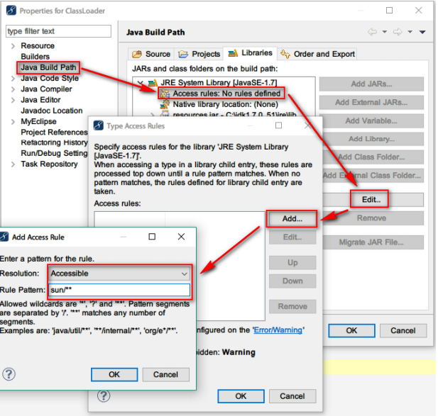

`ExtClassLoader` 加载目录源码：

```java
private static File[] getExtDirs() {
    String s = System.getProperty("java.ext.dirs");
    File[] dirs;
    if (s != null) {
        StringTokenizer st =
                new StringTokenizer(s, File.pathSeparator);
        int count = st.countTokens();
        dirs = new File[count];
        for (int i = 0; i < count; i++) {
            dirs[i] = new File(st.nextToken());
        }
    } else {
        dirs = new File[0];
    }
    return dirs;
}
```

输出示例：

```java
// DNSNameService类位于 dnsns.jar 包中，它存在于 jre/lib/ext 目录下
ClassLoader cl = DNSNameService.class.getClassLoader();
System.out.println(cl); // 打印结果sun.misc.Launcher$ExtClassLoader
```

#### 6.2.3. Application / System ClassLoader（应用/系统类加载器）

**应用类加载器（Application ClassLoader），或者称为系统类加载器（System ClassLoader）**：由 Java 程序编写，是一个 Java 内部类，`sun.misc.Launcher$AppClassLoader`类（JDK9是`jdk.internal.loader.ClassLoaders$AppClassLoader`）。负责加载 `CLASSPATH` 环境变量或者系统属性 `java.class.path` 所指定的目录中指定的 jar(包括第三方的库)和 bin 目录下的 Java 类。一般来说，Java 应用的类都是由它来完成加载的。可以通过 `ClassLoader.getSystemClassLoader()` 方法来获取它。一般情况，如果没有自定义类加载器，则默认使用该类加载器。

**其父加载器是扩展类加载器，是用户自定义类加载器的默认父加载器。**

```java
// 平常编写的 Java 类是使用的应用类加载器
ClassLoader classLoader = ClassLoaderDemo.class.getClassLoader();
System.out.println(classLoader); // sun.misc.Launcher$AppClassLoader
```

#### 6.2.4. User ClassLoader（自定义类加载器）

**用户自定义类加载器（User ClassLoader）**，通过继承 `java.lang.ClassLoader` 类的方式实现。**其默认父加载器是系统类加载器**。

### 6.3. 类加载器的加载机制（双亲委派机制）

#### 6.3.1. 双亲委派机制的概念

从 JDK1.2 开始，<font color=red>**类的加载过程采用双亲委派机制(PDM)**</font>。这种机制能够很好的保护 java 程序的安全。

双亲委派模型：如果一个类加载器收到了类加载的请求，它首先不会自己去加载这个类，而是把这个请求委派给父类加载器去完成，每一层的类加载器都是如此，这样所有的加载请求都会被传送到顶层的启动类加载器中，只有当父加载无法完成加载请求（它的搜索范围中没找到所需的类）时，才向下委派给子加载器尝试去加载类，直到该类被成功加载。

双亲委派模型的具体实现代码在 `java.lang.ClassLoader` 类的 `loadClass()` 方法中，具体的流程是：先检查类是否已经加载过，如果没有则让父类加载器去加载。当父类加载器加载失败时抛出 `ClassNotFoundException`，此时尝试自己去加载。若最后找不到该类，则 JVM 会抛出 `ClassNotFoundException`。源码节选如下：

```java
protected Class<?> loadClass(String name, boolean resolve) throws ClassNotFoundException {
    synchronized (getClassLoadingLock(name)) {
        // First, check if the class has already been loaded
        Class<?> c = findLoadedClass(name);
        if (c == null) {
            long t0 = System.nanoTime();
            try {
                if (parent != null) {
                    c = parent.loadClass(name, false);
                } else {
                    c = findBootstrapClassOrNull(name);
                }
            } catch (ClassNotFoundException e) {
                // ClassNotFoundException thrown if class not found
                // from the non-null parent class loader
            }

            if (c == null) {
                // If still not found, then invoke findClass in order
                // to find the class.
                long t1 = System.nanoTime();
                c = findClass(name);

                // this is the defining class loader; record the stats
                sun.misc.PerfCounter.getParentDelegationTime().addTime(t1 - t0);
                sun.misc.PerfCounter.getFindClassTime().addElapsedTimeFrom(t1);
                sun.misc.PerfCounter.getFindClasses().increment();
            }
        }
        if (resolve) {
            resolveClass(c);
        }
        return c;
    }
}

protected Class<?> findClass(String name) throws ClassNotFoundException {
    throw new ClassNotFoundException(name);
}
```

> Tips: 
>
> - 除了虚拟机自带的引导类加载器之外，其余的类加载器都有唯一的父加载器。
> - 双亲委派机制的父子关系并非面向对象程序设计中的继承关系，而是通过使用组合模式来复用父加载器代码。

演示类加载器的父子关系：

```java
ClassLoader loader = ClassLoaderDemo.class.getClassLoader();
while (loader != null) {
    System.out.println(loader);
    loader = loader.getParent();
}
```

输出结果：

```java
sun.misc.Launcher$AppClassLoader@18b4aac2
sun.misc.Launcher$ExtClassLoader@677327b6
```

#### 6.3.2. 双亲委派机制的加载流程

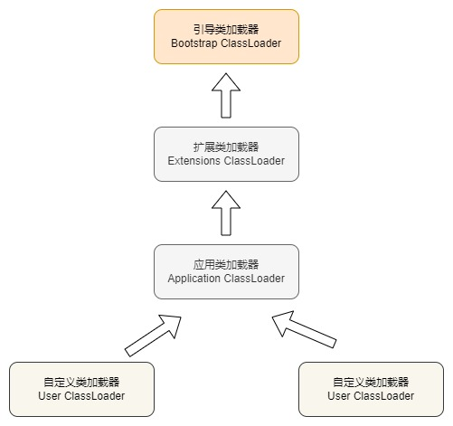

双亲委派加载机制的类加载流程如下：

1. 将自定义加载器挂载到应用程序类加载器
2. 当 AppClassLoader 加载一个 class 时，它首先不会自己去尝试加载这个类，而是把类加载请求委派给父类加载器 ExtClassLoader 去完成
3. 当 ExtClassLoader 加载一个 class 时，它首先也不会自己去尝试加载这个类，而是把类加载请求委派给 BootStrapClassLoader 去完成
4. 启动类加载器(BootStrapClassLoader)在加载路径下查找并加载 Class 文件，如果 BootStrapClassLoader 加载失败（例如在 `$JAVA_HOME/jre/lib` 里未查找到该class），会使用 ExtClassLoader 来尝试加载
5. 扩展类加载器（ExtClassLoader）在加载路径下查找并加载 Class 文件，若 ExtClassLoader 也加载失败，则会使用 AppClassLoader 来加载
6. AppClassLoader 在加载路径下查找并加载 Class 文件，如果未找到目标 Class 文件，则交由自定义加载器加载。
7. 在自定义加载器下查找并加载用户指定目录下的 Class 文件，如果在自定义加载路径下未找到目标 Class 文件，则会抛出 ClassNotFoundException 异常

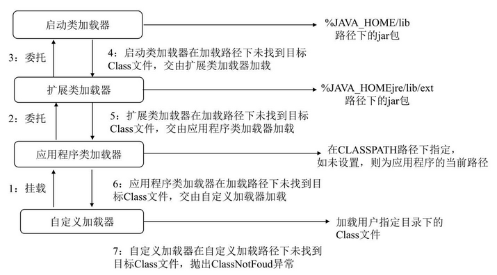

> Notes: 双亲委派机制的核心是保障类的唯一性和安全性。如果在 JVM 中存在包名和类名相同的两个类，则该类将无法被加载，JVM 也无法完成类加载流程。

#### 6.3.3. 双亲委派机制的好处

使用双亲委派机制的好处：

1. 可以避免类的重复加载，当父类加载器已经加载了该类时，就没有必要子 ClassLoader 再加载一次。
2. 基于安全因素的考虑，java 核心 api 中定义类型不会被随意替换。假设通过网络传递一个名为 `java.lang.Object` 的类，通过双亲委托模式传递到启动类加载器，而启动类加载器在核心 Java API 发现该名字的类已被加载，则不会重新加载网络传递过来的 `java.lang.Object` 类，而直接返回已加载过的 `Object.class`，从而可以防止核心 API 库被随意篡改。

定义一个类，注意包名与jdk原生的一样

```java
package java.lang;
​
public class MyObject {
​
}

加载该类

```java
public static void main(String[] args) {
    Class clazz = MyObject.class;
    System.out.println(clazz.getClassLoader());
}
```

输出结果：

```
Exception in thread "main" java.lang.SecurityException: Prohibited package name: java.lang
```

示例说明：因为 java.lang 包属于核心包，只能由引导类加载器进行加载。而根据类加载的双亲委派机制，引导类加载器是加载不到该自定义的 MyObject 类的，所以只能由 AppClassLoader 进行加载，而这又不是允许的，所以最终会报出`Prohibited package name: java.lang`（禁止的包名）错误。

### 6.4. ClassLoader 抽象类

所有的类加载器（除了引导类加载器）都必须继承 `java.lang.ClassLoader` 抽象类

#### 6.4.1. 获取类加载器对象

通过 Class 对象的 `getClassLoader` 方法可以获得当前类的类加载器对象

```java
@CallerSensitive
public ClassLoader getClassLoader()
```

> Notes: <font color=red>**如果通过`类名.class.getClassLoader()`获得的类加载器对象是 null，则说明该类是由引导类加载器加载**</font>

#### 6.4.2. ClassLoader 类常用方法

```java
public final ClassLoader getParent()
```

- 获得父加载器对象。三种类加载器之间没有真正的子父类关系，只是一种叫法。三种加载器的子父关系（上下级关系）：应用类加载器(AppClassLoader) -> 扩展类加载器(ExtClassLoader) -> 引导类加载器(BootstrapClassLoader)

```java
public URL getResource(String name)
```

- 如果资源文件是在 src 文件夹下，资源文件路径：不需要加 `/`，代表从 bin 目录查找指定名称的资源文件。返回值是 URL 对象(统一资源定位符)

```java
public InputStream getResourceAsStream(String name)
```

- 如果资源文件是在 src 文件夹下，资源文件路径：不需要加 `/`，代表从 bin 目录查找指定名称的资源文件。返回资源文件关联的字节输入流对象。

```java
protected Class<?> loadClass(String name, boolean resolve) throws ClassNotFoundException
```

- loadClass 方法是双亲委托模式的实现。从源码中可以观察到各种类加载器的执行顺序。需要注意的是，只有父类加载器加载不到类时，才会调用 `findClass` 方法进行类的查找，所以，在自定义类加载器时，不要覆盖掉该方法，而应该覆盖掉 `findClass` 方法

```java
protected Class<?> findClass(String name) throws ClassNotFoundException
```

- `findClass` 方法在 `ClassLoader` 类中给出了一个默认的错误实现。在自定义类加载器时，一般需要覆盖此方法

```java
protected final Class<?> defineClass(String name, byte[] b, int off, int len) throws ClassFormatError {
    return defineClass(name, b, off, len, null);
}
```

- `defineClass` 方法是用来将 byte 字节解析成虚拟机能够识别的 Class 对象。`defineClass()`方法通常与`findClass()`方法一起使用。在自定义类加载器时，会直接覆盖 `ClassLoader` 的`findClass()` 方法获取要加载类的字节码，然后调用 `defineClass()` 方法生成 Class 对象。

```java
protected final void resolveClass(Class<?> c) {
    resolveClass0(c);
}

private native void resolveClass0(Class<?> c);
```

- 类加载器可以使用此方法来连接指定的类。

#### 6.4.3. URLClassLoader（实现类）

```java
public class URLClassLoader extends SecureClassLoader implements Closeable
```

在 java.net 包中，JDK 提供了一个更加易用的类加载器 `URLClassLoader`，继承了 `ClassLoader`，能够从本地或者网络上指定的位置加载类。*可以将其作为自定义的类加载器来使用*。

##### 6.4.3.1. 构造方法

```java
public URLClassLoader(URL[] urls, ClassLoader parent)
```

- 指定要加载的类所在的 URL 地址，并指定父类加载器

```java
public URLClassLoader(URL[] urls)
```

- 指定要加载的类所在的 URL 地址，父类加载器默认为系统类加载器

##### 6.4.3.2. 使用示例

示例1；加载磁盘上的类

```java
File path = new File("d:/");
URI uri = path.toURI();
URL url = uri.toURL();
URLClassLoader cl = new URLClassLoader(new URL[]{url});
Class clazz = cl.loadClass("com.moon.Demo");
clazz.newInstance();
```

示例2；加载网络上的类

```java
URL url = new URL("http://localhost:8080/examples/");
URLClassLoader classLoader = new URLClassLoader(new URL[]{url});
System.out.println(classLoader.getParent());
Class aClass = classLoader.loadClass("com.moon.Demo");
aClass.newInstance();
```

### 6.5. 自定义类加载器

自定义类加载器，需要继承 `ClassLoader` 类，并覆盖 `findClass` 方法。

#### 6.5.1. OSGI（动态模型系统）【了解】

OSGI（Open Service Gateway Initiative）是 Java 动态化模块化系统的一系列规范，旨在为实现 Java 程序的模块化编程提供基础条件。基于 OSGI 的程序可以实现模块级的热插拔功能，在程序升级更新时，可以只针对需要更新的程序进行停用和重新安装，极大提高了系统升级的安全性和便捷性。

OSGI 提供了一种面向服务的架构，该架构为组件提供了动态发现其他组件的功能，这样无论是加入组件还是卸载组件，都能被系统的其他组件感知，以便各个组件之间能更好地协调工作。

OSGI 不但定义了模块化开发的规范，还定义了实现这些规范所依赖的服务与架构，市场上也有成熟的框架对其进行实现和应用，但只有部分应用适合采用 OSGI 方式，因为它为了实现动态模块，不再遵循 JVM 类加载双亲委派机制和其他 JVM 规范，在安全性上有所牺牲。

#### 6.5.2. 自定义文件类加载器  

```java
public class MyFileClassLoader extends ClassLoader {

    private String directory; // 被加载的类所在的目录

    // 父类加载器：AppClassLoader系统类加载器
    public MyFileClassLoader(String directory) {
        super();
        this.directory = directory;
    }

    // 指定要加载的类所在的文件目录
    public MyFileClassLoader(String directory, ClassLoader parent) {
        super(parent);
        this.directory = directory;
    }

    /**
     * 覆盖 findClass 方法，并使用 defineClass 返回 Class 对象
     *
     * @param name
     * @return
     * @throws ClassNotFoundException
     */
    @Override
    protected Class<?> findClass(String name) throws ClassNotFoundException {
        try {
            // 包名转换为目录
            StringBuilder sb = new StringBuilder();
            sb.append(directory).append(File.separator).append(name.replace(".", File.separator)).append(".class");
            String file = sb.toString();

            // 构建输入流
            InputStream in = new FileInputStream(file);
            // 构建输出流:ByteArrayOutputStream
            ByteArrayOutputStream baos = new ByteArrayOutputStream();
            // 读取文件
            int len = -1;//读取到的数据的长度
            byte[] buf = new byte[2048];//缓存
            while ((len = in.read(buf)) != -1) {
                baos.write(buf, 0, len);
            }
            byte[] data = baos.toByteArray();
            in.close();
            baos.close();
            return defineClass(name, data, 0, data.length);
        } catch (IOException e) {
            System.out.println(e);
            return null;
        }
    }

    // 测试
    public static void main(String[] args) throws Exception {
        MyFileClassLoader cl = new MyFileClassLoader("d:/");
        Class<?> aClass = cl.loadClass("com.moon.Demo");
        aClass.newInstance();
    }
}
```

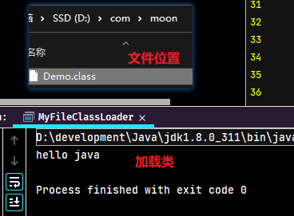

#### 6.5.3. 自定义网络类加载器

```java
public class MyURLClassLoader extends ClassLoader {

    private String url; // 类所在的网络地址

    // 默认的父类加载器：AppClassLoader
    public MyURLClassLoader(String url) {
        this.url = url;
    }

    public MyURLClassLoader(String url, ClassLoader parent) {
        super(parent);
        this.url = url;
    }

    /**
     * 覆盖 findClass 方法，并使用 defineClass 返回 Class 对象
     * http://localhost:8080/examples         com.moon.Demo
     *
     * @param name
     * @return
     * @throws ClassNotFoundException
     */
    protected Class<?> findClass(String name) throws ClassNotFoundException {
        try {
            // 组装URL地址
            StringBuilder sb = new StringBuilder();
            sb.append(url).append("/").append(name.replace(".", "/")).append(".class");
            String path = sb.toString();
            URL url = new URL(path);

            // 构建输入流
            InputStream in = url.openStream();
            // 构建字节输出流
            ByteArrayOutputStream baos = new ByteArrayOutputStream();
            // 读取内容
            int len = -1;
            byte[] buf = new byte[2048];
            while ((len = in.read(buf)) != -1) {
                baos.write(buf, 0, len);
            }
            byte[] data = baos.toByteArray(); // class的二进制数据
            in.close();
            baos.close();
            return defineClass(name, data, 0, data.length);
        } catch (IOException e) {
            e.printStackTrace();
            return null;
        }
    }

    public static void main(String[] args) throws Exception {
        MyURLClassLoader cl = new MyURLClassLoader("http://localhost:8080/examples");
        Class<?> aClass = cl.loadClass("com.moon.Demo");
        aClass.newInstance();
    }
}
```

#### 6.5.4. 热部署类加载器

当调用 loadClass 方法加载类时，会采用双亲委派模式，即如果类已经被加载，就从缓存中获取，不会重新加载。如果同一个 class 被同一个类加载器多次加载，则会报错。因此，要实现热部署让同一个 class 文件被不同的类加载器重复加载即可。但是不能调用 loadClass 方法，而应该调用 findClass 方法，避开双亲委托模式，从而实现同一个类被多次加载，实现热部署。

```java
MyFileClassLoader myFileClassLoader1 = new MyFileClassLoader("d:/", null);
MyFileClassLoader myFileClassLoader2 = new MyFileClassLoader("d:/", myFileClassLoader1);
Class clazz1 = myFileClassLoader1.loadClass("com.moon.Demo");
Class clazz2 = myFileClassLoader2.loadClass("com.moon.Demo");
System.out.println("class1:" + clazz1.hashCode());
System.out.println("class2:" + clazz2.hashCode());
// 结果:class1和class2的hashCode一致

MyFileClassLoader myFileClassLoader3 = new MyFileClassLoader("d:/", null);
MyFileClassLoader myFileClassLoader4 = new MyFileClassLoader("d:/", myFileClassLoader3);
Class clazz3 = myFileClassLoader3.findClass("com.moon.Demo");
Class clazz4 = myFileClassLoader4.findClass("com.moon.Demo");
System.out.println("class3:" + clazz3.hashCode());
System.out.println("class4:" + clazz4.hashCode());
// 结果：class1和class2的hashCode不一致
```

### 6.6. 类的显式与隐式加载

类的加载方式是指虚拟机将 class 文件加载到内存的方式。

- **显式加载**：指在 java 代码中通过调用 `ClassLoader` 加载 class 对象，比如 `Class.forName(String name)`、`this.getClass().getClassLoader().loadClass()` 等方式加载类。
- **隐式加载**：指不需要在 java 代码中明确调用加载的代码，而是通过虚拟机自动加载到内存中。比如在加载某个 class 时，该 class 引用了另外一个类的对象，那么这个对象的字节码文件就会被虚拟机自动加载到内存中。

### 6.7. 线程上下文类加载器

在 Java 中存在着很多的服务提供者接口 SPI，全称 Service Provider Interface，是 Java 提供的一套用来被第三方实现或者扩展的 API，这些接口一般由第三方提供实现，常见的 SPI 有 JDBC、JNDI 等。这些 SPI 的接口（比如 JDBC 中的 java.sql.Driver）属于核心类库，一般存在 rt.jar 包中，由引导类加载器加载。而第三方实现的代码一般作为依赖 jar 包存放在 classpath 路径下，由于 SPI 接口中的代码需要加载具体的第三方实现类并调用其相关方法，SPI 的接口类是由根类加载器加载的，Bootstrap 类加载器无法直接加载位于 classpath 下的具体实现类。由于双亲委派模式的存在， Bootstrap 类加载器也无法反向委托 AppClassLoader 加载 SPI 的具体实现类。在这种情况下，java 提供了线程上下文类加载器用于解决以上问题。

线程上下文类加载器可以通过 `java.lang.Thread` 的 `getContextClassLoader()` 来获取，或者通过 `setContextClassLoader(ClassLoader cl)` 来设置线程的上下文类加载器。如果没有手动设置上下文类加载器，线程将继承其父线程的上下文类加载器，初始线程的上下文类加载器是系统类加载器（AppClassLoader），在线程中运行的代码可以通过此类加载器来加载类或资源。

显然这种加载类的方式破坏了双亲委托模型，但它使得java类加载器变得更加灵活。

> TODO: 待补充以下源码示例

以 JDBC 中的类为例说明。在 JDBC 中有一个类 java.sql.DriverManager，它是 rt.jar 中的类，用来注册实现了 java.sql.Driver 接口的驱动类，而 java.sql.Driver 的实现类一般都是位于数据库的驱动 jar 包中的。

java.sql.DriverManager 的部分源码截图：

> TODO: 待补充源码示例

java.util.ServiceLoader 的部分源码截图：

> TODO: 待补充源码示例

## 7. 垃圾收集器

### 7.1. Java 垃圾回收机制概述

GC（Gabage Collection）垃圾收集，是 JVM 内部的一个守护线程，也是 Java 与 C++ 的主要区别之一。

在 Java 语言中，程序员不需要显式的去释放一个对象的内存，而是由虚拟机自行执行。在 JVM 中有一个垃圾回收线程（守护线程），它是低优先级的，在正常情况下是不会执行的，只有在虚拟机空闲或者当前堆内存不足时，才会触发执行。GC 线程会对 JVM 中的内存进行标记，扫描并确定哪些内存堆中已经死亡的或者长时间没有被任何引用的对象、哪些内存需要回收，根据一定的回收策略，并将它们添加到要回收的集合中，自动的回收内存，保证 JVM 中的内存空间，防止出现内存泄露和溢出问题。**其中 JVM 中 GC 的重点区域是堆空间**。

在 JVM 中是自动化的垃圾回收机制，Java 提供的 GC 功能可以自动监测对象是否超过作用域从而达到自动回收内存的目的，并且 Java 语言没有提供释放已分配内存的显示操作方法。程序员一般不用去关注，也可以通过 `System.gc()` 或者 `Runtime.getRuntime().gc()` 手动执行的额外方式来主动发起 GC 垃圾回收（**项目中切记不要使用**），但是 Java 语言规范并不保证 GC 一定会执行。

> 在 Java 诞生初期，垃圾回收是 Java 最大的亮点之一，因为服务器端的编程需要有效的防止内存泄露问题，然而如今 Java 的垃圾回收机制已经成为被诟病的存在。移动智能终端用户通常觉得 IOS 的系统比 Android 系统有更好的用户体验，其中一个深层次的原因就在于 Android 系统中垃圾回收的不可预知性。

#### 7.1.1. 内存溢出（内存泄漏）

内存泄漏是指不再被使用的对象或者变量一直被占据在内存中。理论上来说，JVM 是有 GC 垃圾回收机制的，也就是说，不再被使用的对象，会被 GC 自动回收掉，自动从内存中清除。

但是 JVM 也还是存在着内存泄漏的情况，Java 导致内存泄露的原因（场景）很明确：**长生命周期的对象持有短生命周期对象的引用就很可能发生内存泄露**，尽管短生命周期对象已经不再需要，但是因为长生命周期对象持有它的引用而导致不能被回收

#### 7.1.2. GC 对 Java 中各种引用类型的处理

- **强引用**：Java 中最常见的引用类型，在把一个对象赋给一个引用变量时，这个引用变量就是一个强引用。只要强引用关系还存在，发生 GC 的时候不会被回收。

```java
Object obj = new Object();
```

> 强引用是造成 Java 内存泄漏(Memory Link)的主要原因。

- **软引用**：有用但不是必须的对象，通过 `SoftReference` 类实现，在内存空间不足时（发生内存溢出之前）会被回收。

```java
// 软引用
SoftReference<String> softRef = new SoftReference<String>(str);
```

> 可用场景：创建缓存的时候，创建的对象放进缓存中，当内存不足时，JVM就会回收早先创建的对象。

- **弱引用**：有用但不是必须的对象，通过 `WeakReference` 类实现。不管当前内存空间足够与否，在下一次 GC 时都会回收只具有弱引用的对象。

```java
// 弱引用
WeakReference<String> weakRef = new WeakReference<String>(str);
```

> 可用场景：Java 源码中的 `java.util.WeakHashMap` 中的 key 就是使用弱引用，相当于一旦不需要某个引用，JVM会自动处理它，开发者不需要做其它操作。

- **虚引用**（幽灵引用/幻影引用）：无法通过虚引用获得对象，用 `PhantomReference` 实现虚引用。虚引用并不会决定对象的生命周期。如果一个对象仅持有虚引用，那么它就和没有任何引用一样，在任何时候都可能被垃圾回收。**虚引用的用途是跟踪对象的垃圾回收状态，在 gc 时会返回一个系统通知**。

```java
PhantomReference<String> prf = new PhantomReference<String>(new String("str"), newReferenceQueue<>());
```

> 可用场景：对象销毁前的一些操作，比如说资源释放等。`Object.finalize()` 虽然也可以做这类动作，但是这个方式即不安全又低效上诉所说的几类引用，都是指对象本身的引用，而不是指 Reference 的四个子类的引用( SoftReference 等)。

### 7.2. JVM 的垃圾回收算法

- **标记-清除算法**：标记无用对象，然后进行清除回收。
- **复制算法**：按照容量划分二个大小相等的内存区域，当一块用完的时候将活着的对象复制到另一块上，然后再把已使用的内存空间一次清理掉。
- **标记-整理算法**：标记无用对象，让所有存活的对象都向一端移动，然后直接清除掉端边界以外的内存。
- **分代算法**：根据对象存活周期的不同将内存划分为几块，一般是新生代和老年代，新生代基本采用复制算法，老年代采用标记整理算法。

#### 7.2.1. 标记-清除算法

标记-清除算法（Mark-Sweep）是一种常见的基础垃圾收集算法，标记无用对象，然后进行清除回收。它将垃圾收集分为两个阶段：

- 标记阶段：利用可达性去遍历内存，标记出可以回收的对象
- 清除阶段：回收被标记的对象所占用的空间

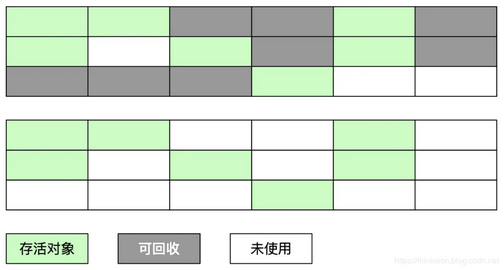

算法的优缺点：

- 优点：实现简单，不需要对象进行移动。
- 缺点：标记、清除过程效率低，无法清除垃圾碎片。产生大量不连续的内存碎片，提高了垃圾回收的频率。后续可能发生大对象不能找到可利用空间的问题。

#### 7.2.2. 复制算法

为了解决标记-清除算法的效率不高的问题，产生了复制算法（Copying）。它把内存空间划为两个相等的区域，每次只使用其中一个区域。垃圾收集时，遍历当前使用的区域，把存活对象复制到另外一个区域中，最后将当前使用的区域的可回收的对象进行回收。

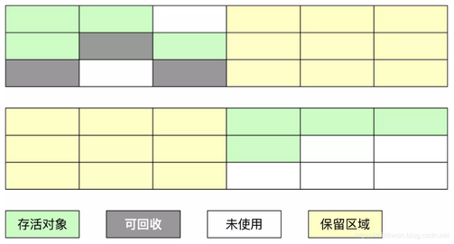

- 优点：按顺序分配内存即可，实现简单、运行高效，不用考虑内存碎片。
- 缺点：内存使用率不高，可用的内存大小缩小为原来的一半，对象存活率高时会频繁进行复制，效率会大大降低。

#### 7.2.3. 标记-整理算法

在新生代中可以使用复制算法，但是在老年代就不能选择复制算法了，因为老年代的对象存活率会较高，这样会有较多的复制操作，导致效率变低。标记-清除算法可以应用在老年代中，但是它效率不高，在内存回收后容易产生大量内存碎片。

因此根据老年代的特点就出现了一种标记-整理算法（Mark-Compact）算法，与标记-整理算法不同的是，在标记可回收的对象后，不是直接对可回收对象进行清理，而是将所有存活的对象压缩到内存的一端，使他们紧凑的排列在一起，然后对端边界以外的内存进行回收。回收后，已用和未用的内存都各自一边。

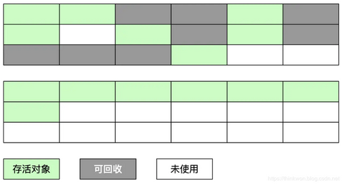

- 优点：解决了标记-清理算法存在的内存碎片问题。
- 缺点：仍需要进行局部对象移动，一定程度上降低了效率。

#### 7.2.4. 分代收集算法

当前商业虚拟机都采用**分代收集**（Generational Collecting）的垃圾收集算法。分代收集算法，是根据对象的存活周期将内存划分为几个不同的区域。一般包括**年轻代、老年代和永久代**，如图所示：

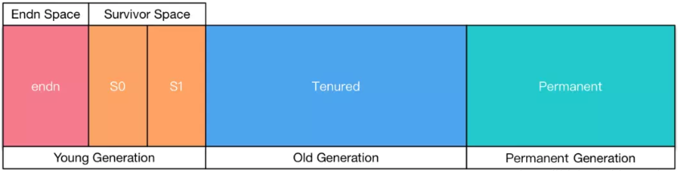

然后根据各年代的特点分别采用不同的 GC 算法：

- 新生代采用**复制算法**，该区域主要存储短生命周期的对象，因此在垃圾回收的标记阶段会标记大量已死亡的对象及少量存活的对象，因此只需选用复制算法将少量存活的对象复制到内存的另一端并清理原区域的内存即可。
- 老年代采用**标记清除算法**或者**标记整理算法**，该区域主要存放长生命周期的对象和大对象，可回收的对象一般较少，因此采用标记整理算法直接释放死亡状态的对象所占用的内存空间即可。

> Notes: Java 8 中已经移除了永久代，新增一个叫做元数据区的 native 内存区

#### 7.2.5. 分区收集算法

不同于『分代收集算法』是按对象的生命周期长短划分，**分区收集算法**则将整个堆空间划分为连续的不同小区间，每个小区间独立使用，独立回收。这样做的好处是可以控制一次回收多少个小区间。

在相同条件下，堆空间越大，一次 GC 耗时就越长，从而产生的停顿也越长。为了更好地控制 GC 产生的停顿时间，将一块大的内存区域分割为多个小块，根据目标停顿时间，每次合理地回收若干个小区间(而不是整个堆)，从而减少一次 GC 所产生的停顿。

### 7.3. 垃圾回收器的基本原理

对于 GC 来说，当创建对象时，GC 就开始监控这个对象的地址、大小以及使用情况。GC 采用有向图的方式记录和管理堆(heap)中的所有对象。

#### 7.3.1. GC 如何判断对象是否可以被回收（即判断对象是否存活）

垃圾收集器在做垃圾回收的时候，首先需要判定的就是哪些内存是需要被回收的，“存活”的不可以被回收，“死亡”的需要被回收。一般有两种方法来判断：

- **引用计数器法**：为每个对象创建一个引用计数，有对象引用时计数器 +1，引用被释放时计数 -1，当计数器为 0 时就说明对象是不可用、可以被回收。它有一个缺点不能解决循环引用的问题，是指两个对象相互引用，导致它们的引用一直存在，从而不能被回收。
- **可达性分析算法**：从 GC Roots 对象为起点，开始向下搜索，搜索所走过的路径称为**引用链**。当一个对象到 GC Roots 没有任何引用链相连时，则证明此对象是不可用、可以被回收的。值得注意的是，不可达对象不等价于可回收对象，此对象要经过至少两次标记才能判定其是否可以被回收。*此算法解决了引用计数法的循环引用问题*。

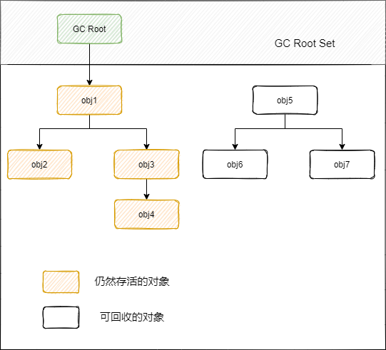

#### 7.3.2. 可作为 GC Roots 的对象

1. 虚拟机栈中引用的对象
2. 本地方法栈中 Native 方法引用的对象
3. 方法区中类静态属性引用的对象
4. 方法区中常量引用的对象

#### 7.3.3. 内存的分配策略

- **对象优先在 Eden 分配**：大多数情况下，对象在新生代 Eden 上分配，当 Eden 空间不够时，触发 Minor GC。
- **大对象直接进入老年代**：大对象是指需要连续内存空间的对象，最典型的大对象有长字符串和大数组。可以设置JVM参数 `-XX:PretenureSizeThreshold`，大于此值的对象直接在老年代分配。
- **长期存活的对象进入老年代**：通过参数 `-XX:MaxTenuringThreshold` 可以设置对象进入老年代的年龄阈值。对象在 Survivor 区每经过一次 Minor GC ，年龄就增加 1 岁，当它的年龄增加到一定程度，就会被晋升到老年代中。
- **动态对象年龄判定**：并非对象的年龄必须达到 `MaxTenuringThreshold` 才能晋升老年代，如果在 Survivor 中相同年龄所有对象大小的总和大于 Survivor 空间的一半，则年龄大于或等于该年龄的对象可以直接进入老年代，无需达到 `MaxTenuringThreshold` 年龄阈值。
- **空间分配担保**：在发生 Minor GC 之前，虚拟机先检查老年代最大可用的连续空间是否大于新生代所有对象总空间，如果条件成立的话，那么 Minor GC 是安全的。如果不成立的话虚拟机会查看 `HandlePromotionFailure` 的值是否允许担保失败。如果允许，那么就会继续检查老年代最大可用的连续空间是否大于历次晋升到老年代对象的平均大小，如果大于，将尝试着进行一次 Minor GC；如果小于，或者 `HandlePromotionFailure` 的值为不允许担保失败，那么就要进行一次 Full GC。

#### 7.3.4. 垃圾回收具体过程

新生代的 GC 过程叫做 MinorGC，相对触发频繁，采用<u>**复制算法**</u>实现，具体过程如下：

1. 将在 Eden 区和 SurvivorFrom 区中存活的对象复制到 SurvivorTo 区中，同时这些对象的年龄都加 1。其中有以下几种情况会将对象直接复制到老年代：
    - 某些对象年龄达到老年代的标准（对象晋升老年代的标准由 `XX:MaxTenuringThreshold` 设置，默认为 15）则直接复制到老年代；
    - 如果 SurvivorTo 区的内存空间不够，也会直接复制到老年代；
    - 如果对象属于大对象（通过 `XX:PretenureSizeThreshold` 来设置大小），也会直接复制到老年代。
2. 清空 Eden 区和 SurvivorFrom 区中的对象。
3. 将 SurvivorTo 区和 SurvivorFrom 区互换，原来的 SurvivorTo 区成为下一次 GC 时的 SurvivorFrom 区。

> 对于新生代区域 GC 会如此反复循环以上3步操作。

老年代的 GC 过程叫做 MajorGC，在老年代的对象比较稳定，MajorGC 不会被频繁触发。在 MajorGC 之前会先进行一次 MinorGC，使得有新生代的对象晋身入老年代，如果之后出现老年代空间不足或者无法找到足够大的连续空间分配给新创建的大对象时，就会解决 MajorGC 进行垃圾回收，释放内存空间。MajorGC 采用<u>**标记清除算法**</u>，耗时较长，在老年代没有内存空间可分配时，会抛出 Out Of Memory 异常。

永久代与老年代、新生代不同，GC 不会在程序运行期间对永久代的内存进行清理，因此永久代的内存会随着加载的 Class 文件的增加而增加，在加载的 Class 文件过多时会抛出 Out Of Memory 异常。Java 8 中永久代已经被换成元数据区，元数据区的区别在于，没有使用 JVM 的内存，而是直接使用操作系统的本地内存。

#### 7.3.5. Minor GC 和 Full GC 的区别

- **Minor GC**：回收新生代，因为新生代对象存活时间很短，因此 Minor GC 会频繁执行，执行的速度一般也会比较快。
- **Full GC**：回收老年代和新生代，老年代的对象存活时间长，因此 Full GC 很少执行，执行速度会比 Minor GC 慢很多。

#### 7.3.6. Full GC 的触发条件

对于 Minor GC，其触发条件比较简单，当 Eden 空间满时，就将触发一次 Minor GC。而 Full GC 触发条件相对复杂，有以下情况会发生 full GC：

- **调用 `System.gc()` 方法**：只是建议虚拟机执行 Full GC，但是虚拟机不一定真正去执行。不建议使用这种方式，而是让虚拟机管理内存。
- **老年代空间不足**：其常见场景为前文所讲的大对象直接进入老年代、长期存活的对象进入老年代等。为了避免以上原因引起的 Full GC，应当尽量不要创建过大的对象以及数组、注意编码规范避免内存泄露。除此之外，可以通过 `-Xmn` 参数调大新生代的大小，让对象尽量在新生代被回收掉，不进入老年代。还可以通过 `-XX:MaxTenuringThreshold` 调大对象进入老年代的年龄，让对象在新生代多存活一段时间。
- **空间分配担保失败**：使用复制算法的 Minor GC 需要老年代的内存空间作担保，如果担保失败会执行一次 Full GC。这是 Hotspot 为了避免由于新生代对象晋升到老年代导致老年代空间不足的现象，如果之前统计所得到的 Minor GC 晋升到老年代的平均大小大于老年代的剩余空间，那么就直接触发 Full GC。
> 例如程序第一次触发 Minor GC 后，有 6MB 的对象晋升到老年代，那么当下一次 Minor GC 发生时，首先检查老年代的剩余空间是否大于 6MB，如果小于 6MB，则执行 Full GC。
- **JDK 1.7 及以前的永久代空间不足**：在 JDK 1.7 及以前，HotSpot 虚拟机中的方法区是用永久代实现的，永久代中存放的为一些 Class 的信息、常量、静态变量等数据。当系统中要加载的类、反射的类和调用的方法较多时，永久代可能会被占满，在未配置为采用 CMS GC 的情况下也会执行 Full GC。如果经过 Full GC 仍然回收不了，那么虚拟机会抛出 `java.lang.OutOfMemoryError`。

### 7.4. 垃圾回收器种类

JVM 中针对新生代和年老代分别提供了多种不同的垃圾收集器，JDK1.6 中 Sun HotSpot 虚拟机的垃圾收集器主要分为：Serial、ParNew、Parallel Scavenge、Serial Old、Parallel Old、CMS、G1。

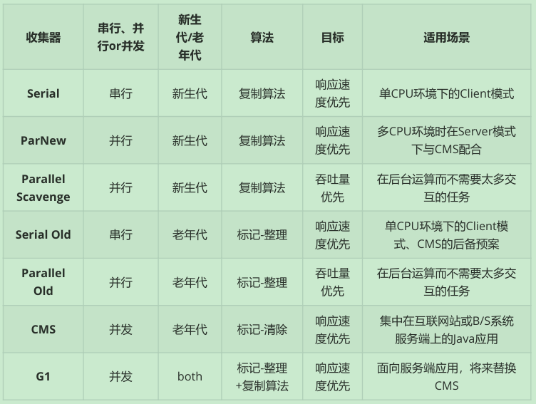

不同种类的垃圾回收器处理的区域图：

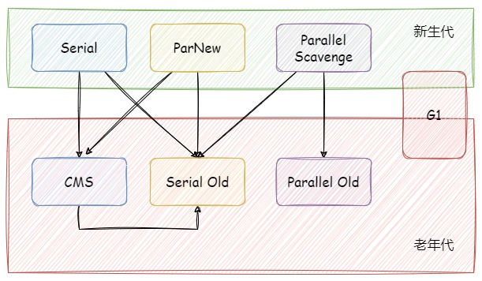

#### 7.4.1. Serial 收集器（单线程、复制算法）

Serial 是最基本**单线程垃圾收集器**，使用复制算法，曾经是 JDK1.3.1 之前新生代唯一的垃圾收集器。它只使用一个垃圾收集线程去进行垃圾回收，在进行垃圾回收的时候必须暂停其他所有的工作线程（Stop The World），直到它收集结束。主要特点是：

- 简单高效；内存消耗小；
- 没有线程交互的开销，单线程收集效率高；
- 需暂停所有的工作线程，用户体验不好。

Serial 垃圾收集器虽然在收集垃圾过程中需要暂停所有其他的工作线程，但是它简单高效，对于限定单个 CPU 环境来说，没有线程交互的开销，可以获得最高的单线程垃圾收集效率。因此 Serial 垃圾收集器依然是 java 虚拟机运行在 Client 模式下默认的新生代垃圾收集器。

#### 7.4.2. ParNew 收集器（Serial + 多线程）

ParNew 收集器其实就是**Serial 收集器的多线程版本**，也使用复制算法，除了使用多线程进行垃圾收集外，其他行为、参数与 Serial 收集器基本一致。ParNew 垃圾收集器在垃圾收集过程中同样也要**暂停所有其他的工作线程**。

ParNew 收集器默认开启和 CPU 数目相同的线程数，可以通过 `-XX:ParallelGCThreads` 参数来限制垃圾收集器的线程数。ParNew 垃圾收集器是很多 java 虚拟机运行在 Server 模式下新生代的默认垃圾收集器。

#### 7.4.3. Parallel Scavenge 收集器（多线程复制算法、高效）

Parallel Scavenge 收集器是**新生代收集器**，基于复制清除算法实现的、多线程程的垃圾收集器。能够并行收集的多线程收集器，允许多个垃圾回收线程同时运行，降低垃圾收集时间，提高吞吐量。

所谓吞吐量就是 CPU 中用于运行用户代码的时间与 CPU 总消耗时间的比值（即`吞吐量 = 运行用户代码时间 / (运行用户代码时间 + 垃圾收集时间)`）。**Parallel Scavenge 收集器重点关注点是吞吐量，高效率的利用 CPU 资源，尽快地完成程序的运算任务，主要适用于在后台运算而不需要太多交互的任务**。

自适应调节策略也是 ParallelScavenge 收集器与 ParNew 收集器的一个重要区别；与 CMS 垃圾收集器的区别是，后者的关注点更多的是用户线程的停顿时间。

Parallel Scavenge 收集器提供了两个参数用于精确控制吞吐量，分别是控制最大垃圾收集停顿时间的 `-XX:MaxGCPauseMillis` 参数以及直接设置吞吐量大小的 `-XX:GCTimeRatio` 参数。

- `-XX：MaxGCPauseMillis` 参数的值是一个大于0的毫秒数，收集器将尽量保证内存回收花费的时间不超过用户设定值。
- `-XX：GCTimeRatio` 参数的值大于0小于100，即垃圾收集时间占总时间的比率，相当于吞吐量的倒数。

#### 7.4.4. Serial Old 收集器（单线程标记整理算法）

Serial 收集器的老年代版本，单线程收集器，使用标记-整理算法。这个收集器也主要是运行在 Client 默认的 java 虚拟机默认的年老代垃圾收集器。在 Server 模式下，主要有两个用途：

1. 在 JDK1.5 之前版本中与新生代的 Parallel Scavenge 收集器搭配使用。
2. 作为年老代中使用 CMS 收集器的后备垃圾收集方案。

新生代 Serial 与年老代 Serial Old 搭配垃圾收集过程图：

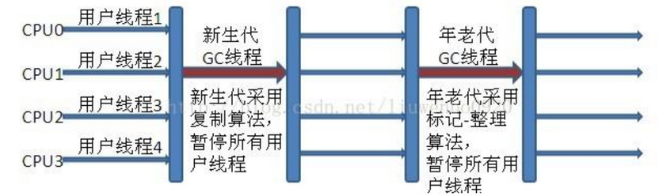

新生代 Parallel Scavenge 收集器与 ParNew 收集器工作原理类似，都是多线程的收集器，都使用的是复制算法，在垃圾收集过程中都需要暂停所有的工作线程。新生代 ParallelScavenge/ParNew 与年老代 Serial Old 搭配垃圾收集过程图：

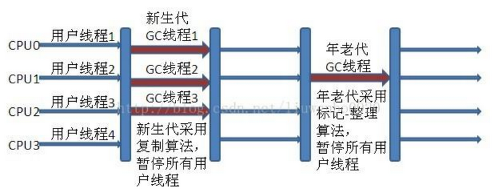

#### 7.4.5. Parallel Old 收集器（多线程标记整理算法）

Parallel Scavenge 收集器的老年代版本。多线程垃圾收集，使用标记-整理算法，在 JDK 1.6 才开始提供。

在 JDK1.6 之前，新生代使用 Parallel Scavenge 收集器只能搭配年老代的 Serial Old 收集器，只能保证新生代的吞吐量优先，无法保证整体的吞吐量， Parallel Old 正是为了在年老代同样提供吞吐量优先的垃圾收集器，如果系统对吞吐量要求比较高，可以优先考虑新生代 Parallel Scavenge 和年老代 Parallel Old 收集器的搭配策略。

新生代 Parallel Scavenge 和年老代 Parallel Old 收集器搭配运行过程图：

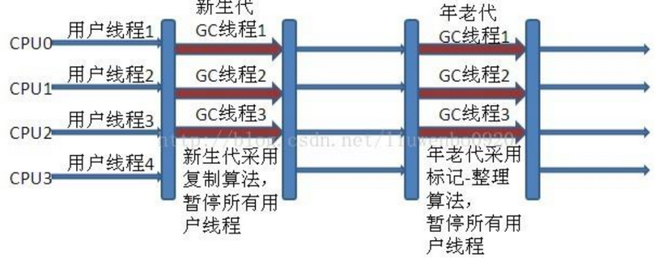

#### 7.4.6. CMS 收集器（多线程标记清除算法）

Concurrent Mark Sweep(CMS) 收集器是一种年老代垃圾收集器，使用多线程的标记-清除算法，追求获取最短停顿时间，实现了**让垃圾收集线程与用户线程基本上同时工作**。CMS 垃圾回收基于标记-清除算法实现，整个过程分为四个步骤：

- **初始标记**：暂停所有用户线程（Stop The World），记录直接与 GC Roots 直接相连的对象。
- **并发标记**：从 GC Roots 开始对堆中对象进行可达性分析，找出存活对象，耗时较长，但是不需要停顿用户线程。
- **重新标记**：在并发标记期间，因用户程序继续运行而导致标记对象的引用关系可能会变化，需要重新进行标记。此阶段也会暂停所有用户线程。
- **并发清除**：清除标记对象（GC Roots 不可达对象），这个阶段也是可以与用户线程同时并发工作，不需要暂停用户线程。

由于耗时最长的并发标记和并发清除过程中，垃圾收集线程可以和用户线程一起并发工作，所以总体上 CMS 收集器的内存回收和用户线程是一起并发地执行。CMS 收集器工作过程：

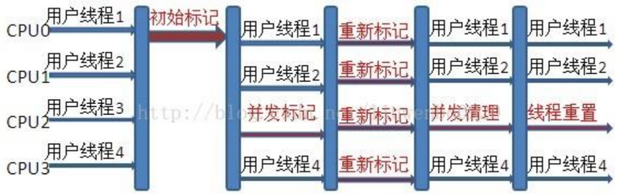

在整个过程中，耗时最长的是并发标记和并发清除阶段，这两个阶段垃圾收集线程都可以与用户线程一起工作，所以从总体上来说，CMS 收集器的内存回收过程是与用户线程一起并发执行的。其优缺点如下：

- **优点**：并发收集，停顿时间短。
- **缺点**：
    - 标记清除算法导致收集结束有大量空间碎片。
    - 产生浮动垃圾，在并发清理阶段用户线程还在运行，会不断有新的垃圾产生，这一部分垃圾出现在标记过程之后， CMS 无法在当次收集中回收它们，只好等到下一次垃圾回收再处理；

#### 7.4.7. G1 收集器

G1 垃圾收集器的目标是在**不同应用场景中追求高吞吐量和低停顿之间的最佳平衡**。可以通过 `-XX:+UseG1GC` 参数来启用 G1 收集器。

G1 将整个堆分成相同大小的分区（Region），有四种不同类型的分区：Eden、Survivor、Old 和 Humongous。分区的大小取值范围为 1M 到 32M，都是2的幂次方。分区大小可以通过 `-XX:G1HeapRegionSize` 参数指定。Humongous 区域用于存储大对象。G1 规定只要大小超过了一个分区容量一半的对象就认为是大对象。

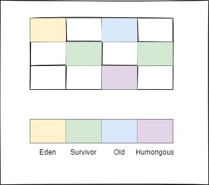

G1 收集器对各个分区回收所获得的空间大小和回收所需时间的经验值进行排序，得到一个优先级列表，每次根据用户设置的最大回收停顿时间，优先回收价值最大的分区。其特点是：可以由用户指定期望的垃圾收集停顿时间。

G1 收集器的回收过程分为以下几个步骤：

- **初始标记**：暂停所有其他线程，记录直接与 GC Roots 直接相连的对象，耗时较短。
- **并发标记**：从 GC Roots 开始对堆中对象进行可达性分析，找出要回收的对象，耗时较长，不过可以和用户程序并发执行。
- **最终标记**：需对其他线程做短暂的暂停，用于处理并发标记阶段对象引用出现变动的区域。
- **筛选回收**：对各个分区的回收价值和成本进行排序，根据用户所期望的停顿时间来制定回收计划，然后把决定回收的分区的存活对象复制到空的分区中，再清理掉整个旧的分区的全部空间。这里的操作涉及存活对象的移动，会暂停用户线程，由多条收集器线程并行完成。

相比与 CMS 收集器， G1 收集器两个最突出的改进是：

1. 基于标记-整理算法，不产生内存碎片。
2. 可以非常精确控制停顿时间，在不牺牲吞吐量前提下，实现低停顿垃圾回收。G1 收集器避免全区域垃圾收集，它把堆内存划分为大小固定的几个独立区域，并且跟踪这些区域的垃圾收集进度，同时在后台维护一个优先级列表，每次根据所允许的收集时间，优先回收垃圾最多的区域。区域划分和优先级区域回收机制，确保 G1 收集器可以在有限时间获得最高的垃圾收集效率

### 7.5. JVM GC 日志可视化分析工具 - gceasy.io

#### 7.5.1. gceasy.io 概述 

JVM 的垃圾回收 GC 日志是观察服务状态的重要信息。但 GC 日志的可读性很差，分析起来是极其痛苦，所以需要可视化分析工具。gceasy.io 是一个很方便的分析工具。

#### 7.5.2. gceasy.io 使用步骤

在 idea 修改 VM 参数配置，开启 GC 日志

```java
-XX:+PrintGCDetails -Xloggc:gc.log
```

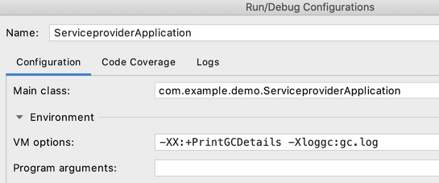

访问分析 GC 日志在线工具 gceasy.io，地址：https://gceasy.io/

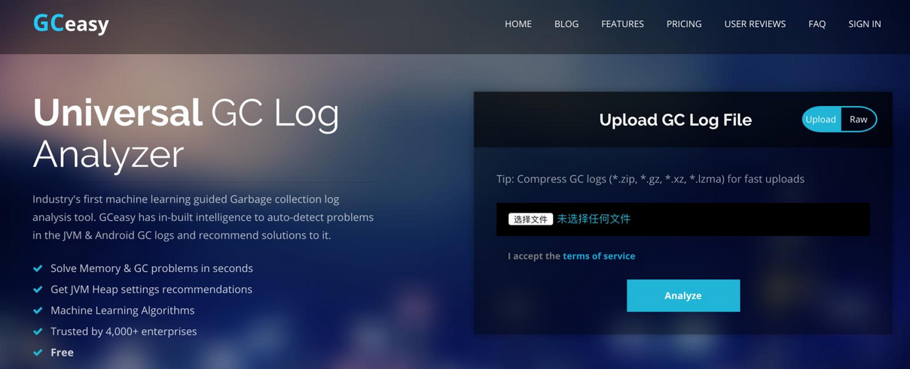

具体分析的展示内容如下：

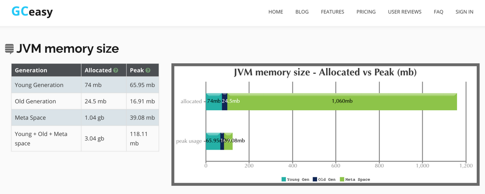

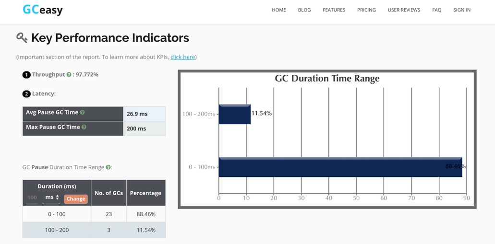

## 8. Java 对象的布局

### 8.1. 概述

术语参考: http://openjdk.java.net/groups/hotspot/docs/HotSpotGlossary.html

在 JVM 中，对象在内存中的布局分为三块区域：**对象头**、**实例数据**和**对齐填充**。如下图所示：

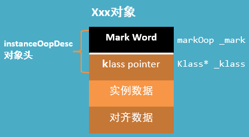

### 8.2. 对象头

对象头由三部分组成：

- 用于存储自身的运行时数据的 Mark Word。包含哈希码、GC分代年龄、锁标识状态、线程持有的锁、偏向线程ID（一般占32/64 bit）。
- 指向类信息的指针，及对象指向它的类元数据的指针
- 数组长度（数组对象才有）

HotSpot 采用 `instanceOopDesc` 和 `arrayOopDesc` 来描述对象头，`arrayOopDesc` 对象用来描述数组类型。`instanceOopDesc` 的定义的在 Hotspot 源码的 instanceOop.hpp 文件中，另外，`arrayOopDesc` 的定义对应 arrayOop.hpp。

```cpp
class instanceOopDesc : public oopDesc {
    public:
    // aligned header size.
    static int header_size() { return sizeof(instanceOopDesc)/HeapWordSize; }

    // If compressed, the offset of the fields of the instance may not be aligned.
    static int base_offset_in_bytes() {
        // offset computation code breaks if UseCompressedClassPointers
        // only is true
        return (UseCompressedOops && UseCompressedClassPointers) ?
            klass_gap_offset_in_bytes() : sizeof(instanceOopDesc);
    }
    static bool contains_field_offset(int offset, int nonstatic_field_size) {
        int base_in_bytes = base_offset_in_bytes();
        return (offset >= base_in_bytes &&
            (offset-base_in_bytes) < nonstatic_field_size * heapOopSize);
    }
};
```

从 instanceOopDesc 代码中可以看到 instanceOopDesc 继承自 oopDesc，oopDesc 的定义载 Hotspot 源码中的 oop.hpp 文件中。

```cpp
class oopDesc {
    friend class VMStructs;
    private:
    volatile markOop _mark;
    union _metadata {
        Klass* _klass;
        narrowKlass _compressed_klass;
    } _metadata;

    // Fast access to barrier set. Must be initialized.
    static BarrierSet* _bs;
    // 省略其他代码
};
```

从源码可知，在普通实例对象中，oopDesc 的定义包含两个成员，分别是 `_mark` 和 `_metadata`

- `_mark` 表示对象标记、属于 markOop 类型，也就是接下来要讲解的 Mark World，它记录了对象和锁有关的信息
- `_metadata` 表示类元信息，类元信息存储的是对象指向它的类元数据(Klass)的首地址，其中Klass表示普通指针、`_compressed_klass`表示压缩类指针。

#### 8.2.1. Mark Word

Mark Word 用于存储对象自身的运行时数据，如哈希码（HashCode）、GC分代年龄、锁状态标志、线程持有的锁、偏向线程ID、偏向时间戳等等，占用内存大小与虚拟机位长一致。Mark Word 对应的类型是 markOop 。源码位于 markOop.hpp 中。

```cpp
// Bit-format of an object header (most significant first, big endian layout below):
//
// 32 bits:
// --------
// hash:25 ------------>| age:4 biased_lock:1 lock:2 (normal object)
// JavaThread*:23 epoch:2 age:4 biased_lock:1 lock:2 (biased object)
// size:32 ------------------------------------------>| (CMS free block)
// PromotedObject*:29 ---------->| promo_bits:3 ----->| (CMS promoted object)
//
// 64 bits:
// --------
// unused:25 hash:31 -->| unused:1 age:4 biased_lock:1 lock:2 (normal object)
// JavaThread*:54 epoch:2 unused:1 age:4 biased_lock:1 lock:2 (biased object)
// PromotedObject*:61 --------------------->| promo_bits:3 ----->| (CMS promoted object)
// size:64 ----------------------------------------------------->| (CMS free block)
// [JavaThread* | epoch | age | 1 | 01] lock is biased toward given thread
// [0 | epoch | age | 1 | 01] lock is anonymously biased
//
// - the two lock bits are used to describe three states: locked/unlocked and monitor.
//
// [ptr | 00] locked ptr points to real header on stack
// [header | 0 | 01] unlocked regular object header
// [ptr | 10] monitor inflated lock (header is wapped out)
// [ptr | 11] marked used by markSweep to mark an object
// not valid at any other time
```

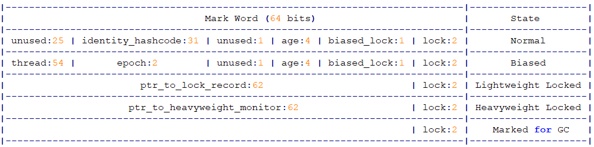

在 64 位虚拟机下，Mark Word 是 64bit 大小的，其存储结构如下：

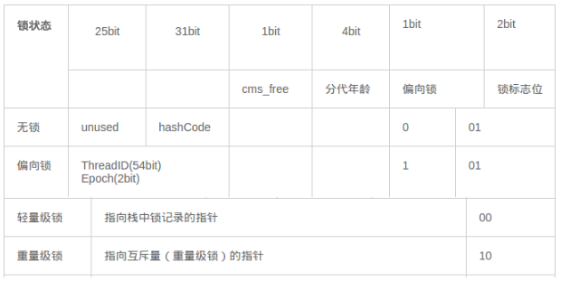

在 32 位虚拟机下，Mark Word 是 32bit 大小的，其存储结构如下：

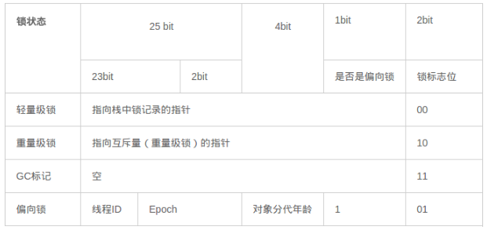

#### 8.2.2. klass pointer

这一部分用于存储对象的类型指针，该指针指向它的类元数据，JVM 通过这个指针确定对象是哪个类的实例。该指针的位长度为 JVM 的一个字大小，即 32 位的 JVM 为 32 位，64 位的 JVM 为 64 位。 如果应用的对象过多，使用 64 位的指针将浪费大量内存，统计而言，64 位的 JVM 将会比 32 位的 JVM 多耗费 50% 的内存。为了节约内存可以使用选项 `-XX:+UseCompressedOops` 开启指针压缩，其中，oop 即 ordinary object pointer 普通对象指针。开启该选项后，下列指针将压缩至 32 位：

1. 每个 Class 的属性指针（即静态变量）
2. 每个对象的属性指针（即对象变量）
3. 普通对象数组的每个元素指针

当然，也不是所有的指针都会压缩，一些特殊类型的指针 JVM 不会优化，比如指向 PermGen 的 Class 对象指针(JDK8中指向元空间的Class对象指针)、本地变量、堆栈元素、入参、返回值和 NULL 指针等。

对象头 = Mark Word + 类型指针（未开启指针压缩的情况下）

- 在 32 位系统中，Mark Word = 4 bytes，类型指针 = 4bytes，对象头 = 8 bytes = 64 bits；
- 在 64 位系统中，Mark Word = 8 bytes，类型指针 = 8bytes，对象头 = 16 bytes = 128bits；

#### 8.2.3. 示例

以 32 位虚拟机为例

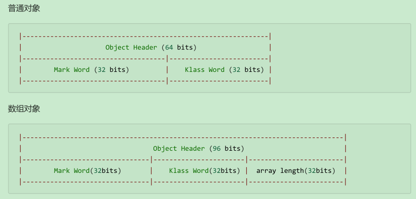

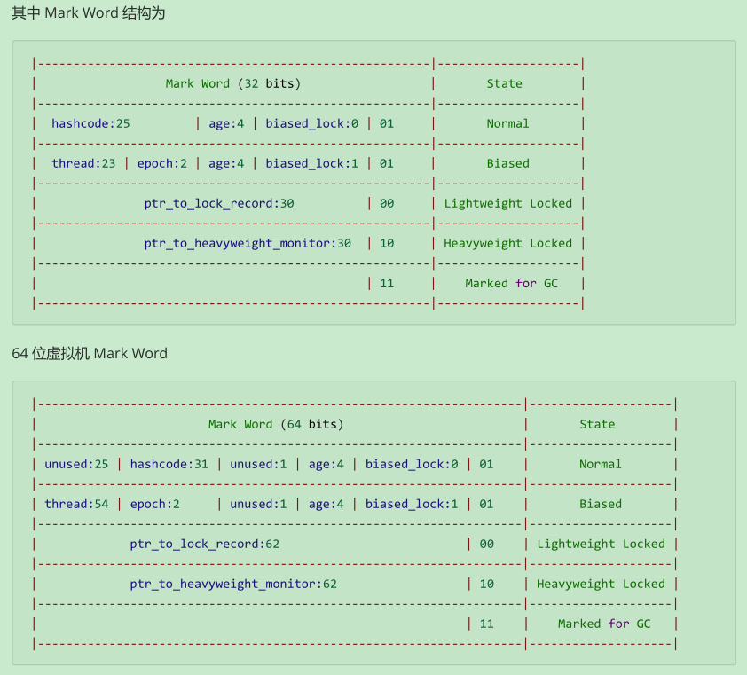

### 8.3. 实例数据

**实例数据**就是类中定义的成员属性和值。用来存储对象真正的有效信息（包括父类继承下来的和自己定义的）。

### 8.4. 对齐填充

对齐填充并不是必然存在的，也没有什么特别的意义，它仅仅起着占位符的作用，由于 HotSpot VM 的自动内存管理系统要求对象起始地址必须是 8 字节的整数倍，换句话说，就是对象的大小必须是 8 字节的整数倍。而对象头正好是 8 字节的倍数，因此，当对象实例数据部分没有对齐时，就需要通过对齐填充来补全。

内存对齐的主要作用是：

1. 平台原因：不是所有的硬件平台都能访问任意地址上的任意数据的；某些硬件平台只能在某些地址处取某些特定类型的数据，否则抛出硬件异常。
2. 性能原因：经过内存对齐后，CPU 的内存访问速度大大提升。

### 8.5. 查看 Java 对象布局工具库

```xml
<dependency>
    <groupId>org.openjdk.jol</groupId>
    <artifactId>jol-core</artifactId>
    <version>0.9</version>
</dependency>
```

### 8.6. Java 对象创建过程

1. JVM 遇到一条新建对象的指令时首先去检查这个指令的参数是否能在常量池中定义到一个类的符号引用。然后加载这个类
2. 为对象分配内存。一种办法“指针碰撞”、一种办法“空闲列表”，最终常用的办法“本地线程缓冲分配(TLAB)”
3. 将除对象头外的对象内存空间初始化为0
4. 对对象头进行必要设置

## 9. JVM 扩展

### 9.1. main 方法执行过程

示例代码：

```java
public class Application {
    public static void main(String[] args) {
        Person p = new Person("MooNkirA");
        p.getName();
    }
}

class Person {
    public String name;

    public Person(String name) {
        this.name = name;
    }
    public String getName() {
        return this.name;
    }
}
```

执行 main 方法的过程如下：

1. 编译 Application.java 后得到 Application.class 后，执行这个 class 文件，系统会启动一个 JVM 进程，从类路径中找到一个名为 Application.class 的二进制文件，将 `Application` 类信息加载到运行时数据区的方法区内，这个过程叫做**类的加载**。
2. JVM 找到 `Application` 的主程序入口，执行 `main` 方法。
3. `main` 方法的第一条语句为 `Person p = new Person("MooNkirA")`，就是让 JVM 创建一个 `Person` 对象，但是此时方法区中是没有 `Person` 类的信息的，所以 JVM 马上加载 `Person` 类并将其信息放到方法区中。
4. 加载完 `Person` 类后，JVM 在堆中分配内存给 `Person` 对象，然后调用构造函数初始化 `Person` 对象，**这个 `Person` 对象持有指向方法区中的 `Person` 类的类型信息的引用**。
5. 执行 `p.getName()` 时，JVM 根据 p 的引用找到其所指向的对象，然后根据此对象持有的引用定位到方法区中 `Person` 类的类型信息的方法表，获得 `getName()` 的字节码地址。
6. 执行 `getName()` 方法。

### 9.2. OOM 问题的排查

> 线上 JVM 必须配置 `-XX:+HeapDumpOnOutOfMemoryError` 和 `-XX:HeapDumpPath=/tmp/heapdump.hprof`，当OOM发生时自动 dump 堆内存信息到指定目录

排查 OOM 的方法如下：

- 查看服务器运行日志日志，捕捉到内存溢出异常
- 使用 `jstat` 命令工具查看监控 JVM 的内存和 GC 情况，评估问题大概出在什么区域
- 使用 MAT 工具载入 dump 文件，分析大对象的占用情况

### 9.3. 如何获取 Java 程序使用的内存？堆使用的百分比？

通过 `java.lang.Runtime` 类中与内存相关方法来获取剩余的内存，总内存及最大堆内存。

```java
public native long freeMemory();
```

- 返回剩余空间的字节数

```java
public native long totalMemory();
```

- 返回总内存的字节数

```java
public native long maxMemory();
```

- 返回最大内存的字节数

### 9.4. class 字节码文件 10 个主要组成部分

- MagicNumber
- Version
- Constant_pool
- Access_flag
- This_class
- Super_class
- Interfaces
- Fields
- Methods
- Attributes
