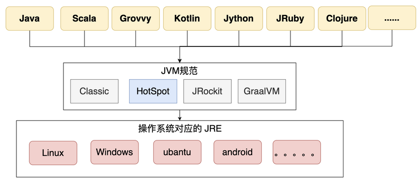
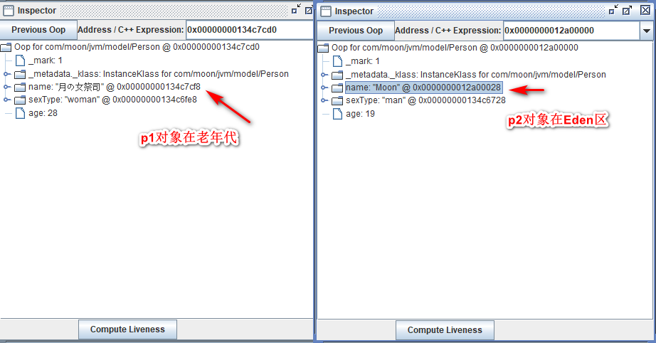

## 1. JVM 概述

### 1.1. 什么是JVM

JVM 全称 Java Virtual Machine（Java虚拟机），用来保证 Java 语言**跨平台**。Java 虚拟机可以看做是一个虚拟化的操作系统，类似于 Linux 或者 Windows 的操作系统，如同真实的计算机那样，它有自己的指令集以及各种运行时内存区域。

Java 发展至今，已经远不是一种语言，而是一个标准。Java 虚拟机与 Java 语言并没有必然的联系，只满足 JVM 规范的二进制文件格式(.class 文件格式)，就可以在 JVM 虚拟机执行。Java 虚拟机就是一个字节码翻译器，它将字节码文件翻译成各个系统对应的机器码，确保字节码文件能在各个系统正确运行。通过 JVM 虚拟机，屏蔽了上层各种开发语言的差距，同时也屏蔽了下层各种操作系统的区别。



当用 JVM 运行一个 Java 程序时，这个 Java 程序就是一个运行中的实例，每个运行中的 Java 程序都是一个 JVM 实例。

#### 1.1.1. Java 程序的执行过程

一个 Java 程序，首先经过 javac 编译成 `.class` 文件，然后 JVM 将其加载到方法区，执行引擎将会执行这些字节码。执行时，会翻译成操作系统相关的函数。JVM 作为 .class 文件的翻译存在，输入字节码，调用操作系统函数。

执行过程：Java 文件 -> 编译器 -> 字节码 -> JVM -> 机器码。

#### 1.1.2. 跨平台与跨语言

- **跨平台**：编写一个java类，在不同的操作系统上（Linux、Windows、MacOS 等平台）执行效果都是一样，这个就是 JVM 的跨平台性。**不同操作系统有对应的 JDK 的版本**
- **跨语言（语言无关性）**：JVM 只识别字节码，所以与语言没有直接强关联。**JVM 不是解析 Java 文件，而是解析`.class`文件（俗称字节码文件）**。像其他语言（如：Groovy 、Kotlin、Scala等）它们编译成字节码后同样可以在 JVM 上运行，这就是 JVM 的跨语言的特性。

### 1.2. Java 虚拟机规范

> Java SE 8 版本的虚拟机规范地址：https://docs.oracle.com/javase/specs/jvms/se8/html/index.html

Java 虚拟机有一套抽象规范，Java 虚拟机规范（The Java Virtual Machine Specification，JVMS），具体的实现过程不仅需要不同的厂商要遵循 Java 虚拟机规范，而且还要根据每个平台的不同特性以软件或软硬结合的方式去实现设定的功能。

理论上，只要能够写出一个符合标准的 class 文件，就在 JVM 中执行。JVM 虚拟机不管此 cass 文件从什么语言编译出来的，这也是 JVM 支持多语言的基础。

### 1.3. JVM 的实现

常见的 JVM 实现如下：

- Hotspot：目前使用的最多的 Java 虚拟机。在命令行输入`java –version`，会输出目前使用的虚拟机的名字、版本等信息、执行模式。


- Jrocket：曾号称世界上最快的JVM，被Oracle公司收购，合并于Hotspot
- J9: IBM自己的虚拟机
- TaobaoVM：淘宝自己的VM，实际上是 Hotspot 的定制版。只有一定体量、一定规模的厂商才会开发自己的虚拟机
- LiquidVM：针对硬件的虚拟机。下面是没有操作系统的（不是 Linux 也不是 windows），直接就是硬件，运行效率比较高。
- zing：其垃圾回收速度非常快（1 毫秒之内），是业界标杆。它的一个垃圾回收的算法后来被 Hotspot 吸收才有了现在的 ZGC。

### 1.4. JVM 的多线程

在多核操作系统上，JVM 允许在一个进程内同时并发执行多个线程 。JVM 中的线程与操作系统中的线程是相互对应的，在 JVM 线程的本地存储 、缓冲区分配 、同步对象、枝 、程序计数器等准备工作都完成时，JVM 会调用操作系统的接口创建一个与之对应的原生线程；在JVM 线程运行结束时，原生线程随之被回收 。操作系统负责调度所有线程，并为其分配 CPU 时间片，在原生线程初始化完毕时，就会调用 Java 线程的 `run()` 执行该线程；在线程结束时，会释放原生线程和 Java 线程所对应的资源 。

在 JVM 后台运行的线程主要有以下几个：

- 虚拟机线程（JVM Thread）：虚拟机线程在 JVM 到达安全点（SafePoint）时出现
- 周期性任务线程：通过定时器调度线程来实现周期性操作的执行
- GC 线程：该线程支持 JVM 中不同的垃圾回收活动
- 编译器线程：在运行时将字节码动态编译成本地平台机器码，是 JVM 跨平台的具体实现
- 信号分发线程：接收发送到 JVM 的信号并调用 JVM 方法

### 1.5. JVM 整体知识体系

JVM 能涉及非常庞大的一块知识体系，比如内存结构、垃圾回收、类加载、性能调优、JVM 自身优化技术、执行引擎、类文件结构、监控工具等。

在JVM的知识体系中，内存结构是核心重点，所有JVM相关的知识都或多或少涉及内存结构。比如垃圾回收回收的就是内存、类加载加载到的地方也是内存、性能优化也涉及到内存优化、执行引擎与内存密不可分、类文件结构与内存的设计有关系，监控工具也会监控内存。

### 1.6. JVM 内存模型图（来源网络）


### 1.7. JVM 结构图


## 2. JVM 运行流程示例

### 2.1. 运行流程测试

```java
/**
 * JVM执行流程测试
 * <p> VM参数配置 </p>
 * -Xms30m -Xmx30m -XX:MaxMetaspaceSize=30m -XX:+UseConcMarkSweepGC -XX:-UseCompressedOops
 *
 * <p> -XX:MaxMetaspaceSize 定义元空间的最大值 </p>
 * <p> -XX:+UseConcMarkSweepGC -XX:-UseCompressedOops 指定垃圾回收器 </p>
 */
public class JVMObject {

    public final static String MAN_TYPE = "man"; // 常量
    
    public static String WOMAN_TYPE = "woman";  // 静态变量

    public static void main(String[] args) throws InterruptedException {
        Person p1 = new Person();
        p1.setName("月の女祭司");
        p1.setSexType(WOMAN_TYPE);
        p1.setAge(28);

        // 主动触发GC 垃圾回收 15次
        for (int i = 0; i < 15; i++) {
            System.gc();
        }

        Person p2 = new Person();
        p2.setName("Moon");
        p2.setSexType(MAN_TYPE);
        p2.setAge(19);
        Thread.sleep(Integer.MAX_VALUE); // 线程休眠
    }
}
```

配置 VM 参数：`-Xms30m -Xmx30m -XX:MaxMetaspaceSize=30m -XX:+UseConcMarkSweepGC -XX:-UseCompressedOops`

**JVM运行的主要流程**如下：

1. JVM 向操作系统申请内存：通过配置参数或者默认配置参数向操作系统申请内存空间，根据内存大小找到具体的内存分配表，然后把内存段的起始地址和终止地址分配给 JVM，然后 JVM 再进行内部分配
2. JVM 获得内存空间后，会根据配置参数分配堆、栈以及方法区的内存大小，例如：`-Xms30m -Xmx30m -Xss1m -XX:MaxMetaspaceSize=30m`
3. 进行类加载，主要是把 class 放入方法区、还有 class 中的静态变量和常量也要放入方法区
4. 执行方法及创建对象。如上面测试代码：启动 main 线程，执行 main 方法，开始执行第一行代码。此时堆内存中会创建一个 Person 对象，对象引用 p1 就存放在栈中。后续代码中遇到 new 关键字，会再创建一个 Person 对象，对象引用 p2 就存放在栈中。


### 2.2. JVM 运行内存的整体流程总结

- JVM 在操作系统上启动，申请内存，先进行运行时数据区的初始化，然后把类加载到方法区，最后执行方法。
- 方法的执行和退出过程在内存上的体现上就是虚拟机栈中栈帧的入栈和出栈。
- 同时在方法的执行过程中创建的对象一般情况下都是放在堆中，最后堆中的对象也是需要进行垃圾回收清理的。

### 2.3. JHSDB 工具

JHSDB 是一款基于服务性代理实现的进程外调试工具。服务性代理是 HotSpot 虚拟机中一组用于映射 Java 虚拟机运行信息的，主要基于 Java 语言实现的 API 集合

#### 2.3.1. JDK1.8 的开启方式

开启 JHSDB 工具，在 JDK1.8 启动 JHSDB 的时候必须将 `sawindbg.dll`（一般会在JDK的目录下）复制到对应的jre/bin目录下(*注：在 windows 上安装了 JDK1.8 后往往同级目录下有一个
jre 的目录*)


然后到目录：`...\Java\jdk1.8.0_144\lib` 进入命令行，执行 `java -cp .\sa-jdi.jar sun.jvm.hotspot.HSDB`


#### 2.3.2. JDK 1.9 及以后的开启方式

进入 JDK 的 bin 目录下，在命令行中使用 `jhsdb hsdb` 来启动JHSDB工具

#### 2.3.3. 配置程序运行时的VM参数

VM 参数加入：`-XX:+UseConcMarkSweepGC -XX:-UseCompressedOops`

```
节选官方文档参数解释：
-XX:+UseConcMarkSweepGC
Enables the use of the CMS garbage collector for the old generation. Oracle recommends that you use the CMS garbage collector when application latency requirements cannot be met by the throughput (-XX:+UseParallelGC) garbage collector. The G1 garbage collector (-XX:+UseG1GC) is another alternative.

By default, this option is disabled and the collector is chosen automatically based on the configuration of the machine and type of the JVM. When this option is enabled, the -XX:+UseParNewGC option is automatically set and you should not disable it, because the following combination of options has been deprecated in JDK 8: -XX:+UseConcMarkSweepGC -XX:-UseParNewGC.

-XX:-UseCompressedOops
Disables the use of compressed pointers. By default, this option is enabled, and compressed pointers are used when Java heap sizes are less than 32 GB. When this option is enabled, object references are represented as 32-bit offsets instead of 64-bit pointers, which typically increases performance when running the application with Java heap sizes less than 32 GB. This option works only for 64-bit JVMs.

It is also possible to use compressed pointers when Java heap sizes are greater than 32GB. See the -XX:ObjectAlignmentInBytes option.
```

> 详细说明参考官方文档：《1.2 JAVA SE 官方文档网址》

#### 2.3.4. JHSDB 工具的使用

##### 2.3.4.1. 打开查看程序的运行进程

启动上面的测试代码，因为 JVM 启动有一个进程，需要借助一个java的命令方 `jps` 查找到对应程序的进程


点击 JHSDB 工具中 【File】 --> 【Attach to HotSpot process...】，在【process ID】中输入程序的进程id，点击ok打开，查询当前程序中的所有线程信息


##### 2.3.4.2. 查看堆参数

点击【Tools】 --> 【Heap Parameters】，打开堆参数面板


上图中可以看到实际 JVM 启动过程中堆中参数的对照，在不启动内存压缩的情况下。堆空间里面的分代划分都是连续的。

##### 2.3.4.3. 查看程序中对象

点击【Tools】 --> 【Object Histogram】，可以看到 JVM 中所有的对象，都是基于 class 的对象。通过全路径名搜索，可以查询当前程序中的对象信息


双击出现这个Person类，弹出框可以查询到两个对象，就是上面示例程序中的p1和p2对象。选择对象再点击【Inspect】查看对象的详细信息


分开点开两个对象对比，在创建p1对象后，手动多次触发了gc垃圾回收后，p1位置在老年代，而最后创建的p2对象就在Eden区



##### 2.3.4.4. 查看栈

选择main线程，点击【Stack Memory...】按钮


从上图中可以验证栈内存，同时也可以验证到虚拟机栈和本地方法栈在 Hotspot 中是合二为一的实现了。

### 2.4. JVM 的处理全过程总结

执行上面的示例程序，可以看到 JVM 在运行程序的全过程如下：

1. JVM 向操作系统申请内存，JVM 第一步就是通过配置参数或者默认配置参数向操作系统申请内存空间。
2. JVM 获得内存空间后，会根据配置参数分配堆、栈以及方法区的内存大小。
3. 完成上一个步骤后，JVM 首先会执行构造器，编译器会在`.java`文件被编译成`.class`文件时，收集所有类的初始化代码，包括静态变量赋值语句、静态代码块、静态方法，静态变量和常量放入方法区
4. 执行方法。启动 main 线程，执行 main 方法，开始执行第一行代码。此时堆内存中会创建一个 Person 对象，对象引用 p1 就存放在栈中。执行其他方法时，具体的操作查看上面章节的《栈帧执行对内存区域的影响》。

## 3. Java 对象的创建（HotSpot 虚拟机）

### 3.1. 对象的创建方式

Java 中提供的几种对象创建方式：

1. 使用 `new` 关键字（调用了构造函数）
2. 使用 `Class` 类的 `newInstance` 方法（调用了构造函数）
3. 使用 `Constructor` 类的 `newInstance` 方法（调用了构造函数）
4. 使用 `clone` 方法（没有调用了构造函数）
5. 使用反序列化（没有调用了构造函数）

### 3.2. 对象创建流程


1. **类加载检查**：当虚拟机遇到一条 new 指令时，首先检查该指令的参数是否能在常量池中定位到这个类的符号引用，并且检查这个符号引用代表的类是否已被加载过、解析和初始化过。如果没有，必须先执行相应的类加载。
2. **分配内存**：在类加载检查通过后，接下来虚拟机将为对象实例分配内存。一般有两种方式：
    1. 若 Java 堆中内存是绝对规整的，使用“指针碰撞”方式分配内存。
    2. 如果不是规整的，就从空闲列表中分配，叫做“空闲列表”方式。
    > 划分内存时还需要考虑一个问题-并发，也有两种方式: CAS同步处理，或者本地线程分配缓冲(Thread Local Allocation Buffer, TLAB)（最终常用的办法）。
3. **内存空间初始化**：分配到的内存空间（除对象头外）都初始化为 0，通过这个操作保证了对象的字段可以不赋初始值就直接使用，程序能访问到这些字段的数据类型所对应的零值。
4. **设置对象头**：Hotspot 虚拟机进行对象头必要的设置，包括：存储对象自身的运行时元数据（哈希码、分代年龄、锁标志、GC 信息等等对象所属类的类元信息）、类型指针（就是对象指向它的类信息的指针，虚拟机通过这个指针来确定这个对象是哪个类的实例）和数据长度（数组对象才有）。
5. **按照 Java 代码执行相关初始化方法**：执行 init 方法，初始化成员变量，执行实例化代码块，调用类的构造方法，并把堆内对象的首地址赋值给引用变量。。

#### 3.2.1. 为对象分配内存的方式

类加载完成后，接着会在 JVM 堆中划分一块内存分配给对象。内存分配根据堆内存是否规整，有两种方式：


- **指针碰撞**：如果堆的内存是规整，即所有用过的内存放在一边，而空闲的的放在另一边。这种方式在内存中放一个指针作为分界指示器，分配内存时将位于中间的指针指示器向空闲的内存移动一段与对象大小相等的距离，这样便完成分配内存工作。
- **空闲列表**：如果堆的内存不是规整的，则需要由虚拟机维护一个列表来记录那些内存是可用的，这样在分配的时候可以从列表中查询到足够大的内存分配给对象，并在分配后更新列表记录。

选择哪种分配方式是由堆内存是否规整来决定的，而堆内存是否规整又由所采用的垃圾收集器是否带有压缩整理功能决定。

#### 3.2.2. 处理对象创建时的并发安全问题

对象的创建在虚拟机中是一个非常频繁的行为，哪怕只是修改一个指针所指向的位置，在并发情况下也是不安全的，可能出现正在给对象 A 分配内存，指针还没来得及修改，对象 B 又同时使用了原来的指针来分配内存的情况。解决这个问题有两种方案：


- 方案一：对分配内存空间的动作进行同步处理，即采用 CAS 机制，配合失败重试的方式来保障更新操作的原子性。（*该方式效率低*）
- 方案二：把内存分配的动作按照线程划分在不同的空间之中进行，即每个线程在 Java 堆中预先分配一小块内存，称为本地线程分配缓冲（Thread Local Allocation Buffer, TLAB）。哪个线程要分配内存，就在哪个线程的 TLAB （"私有内存"）上分配。只有 TLAB 用完并分配新的 TLAB 时，才需要同步锁。通过 `-XX:+/-UserTLAB` 参数来设定虚拟机是否使用 TLAB。（*一般采用这种策略*）

### 3.3. 对象的访问定位

Java 程序需要通过 JVM 栈上的引用访问堆中的具体对象。对象的访问方式取决于 JVM 虚拟机的实现。目前主流的访问方式有**句柄**和**直接指针**两种方式。

- **指针**：指向对象，代表一个对象在内存中的起始地址。
- **句柄**：可以理解为指向指针的指针，维护着对象的指针。句柄不直接指向对象，而是指向对象的指针（句柄不发生变化，指向固定内存地址），再由对象的指针指向对象的真实内存地址。

#### 3.3.1. 句柄访问

Java 堆中划分出一块内存来作为**句柄池**，引用中存储对象的**句柄地址**，而句柄中**包含了对象实例数据与对象类型数据各自的具体地址信息**，具体构造如下图所示：


使用句柄访问的优势：**引用中存储的是稳定的句柄地址，在对象被移动（垃圾收集时移动对象是非常普遍的行为）时只会改变句柄中的实例数据指针，而引用本身不需要修改**。

#### 3.3.2. 直接指针

如果使用**直接指针**访问，**引用中存储的直接就是对象地址**，那么 Java 堆对象内部的布局中就必须考虑如何放置访问**类型数据**的相关信息。


使用直接指针访问的优势：**速度更快，节省了一次指针定位的时间开销**。由于对象的访问在 Java 中非常频繁，因此这类开销积少成多后也是非常可观的执行成本。HotSpot 中采用的就是这种方式。

### 3.4. 类（Class 文件）文件结构

#### 3.4.1. Class 文件概述

class 文件包含了 Java 虚拟机的指令集、符号表、辅助信息的字节码(Byte Code)，是实现跨操作系统和语言无关性的基石之一。

一个 Class 文件定义了一个类或接口的信息，是以 8 个字节为单位，没有分隔符，按顺序紧凑排在一起的二进制流。用『无符号数』和『表』组成的伪结构来存储数据。

- 无符号数：基本数据类型，用来描述数字、索引引用、数量值、字符串值，如u1、u2 分别表示 1 个字节、2 个字节
- 表：无符号数和其他表组成，命名一般以 "_info" 结尾

#### 3.4.2. class 字节码文件 10 个主要组成部分

class 文件本质是一个二进制文件，不能直接用文本的方式阅读，但是可以用一些安装了特殊插件的文本工具（如 UltraEdit）打开，内容如下：


中间的部分就是 class 文件的二进制内容。是以十六进制的形式展示。空格隔开的部分代表了 8 个 bit，而每一位代表的是 4 个 bit 字节，也就是一个十六进制的数字。例如第一个字母 C 就表示十六进制的 12，二进制是1100。而所有的 class 文件，都必须以十六进制的 CAFEBABE 开头，这就是 JVM 规范的一部分。

除了前面的方法，也可以直接使用 JDK 提供的 `javap` 指令来直接查看 class 文件。例如：`javap -v Xxxx.class`。Class 文件编译成 JVM 指令后的结构：

```java
ClassFile {
    u4             magic; // 类文件的标志
    u2             minor_version; // 小版本号
    u2             major_version; // 大版本号
    u2             constant_pool_count; // 常量池的数量
    cp_info        constant_pool[constant_pool_count-1]; // 常量池
    u2             access_flags; // 类的访问标记
    u2             this_class; // 当前类的索引
    u2             super_class; // 父类
    u2             interfaces_count; // 接口
    u2             interfaces[interfaces_count]; // 一个类可以实现多个接口
    u2             fields_count; // 字段属性
    field_info     fields[fields_count]; // 一个类会可以有个字段
    u2             methods_count; // 方法数量
    method_info    methods[methods_count];    // 一个类可以有个多个方法
    u2             attributes_count;    // 此类的属性表中的属性数
    attribute_info attributes[attributes_count];    // 属性表集合
}
```

主要参数说明如下：

- **魔数（magic_number）**： class 文件标志。Class 文件头 4 个字节，0xCAFEBABE。作用是确定该文件是 Class 文件。
- **文件版本（version）**：4 个字节，前 2 个是次版本号 Minor Version，后 2 个主版本号 Major Version。从 45 (JDK1.0) 开始，如 0x00000032 转十进制就是 50，代表 JDK 6。高版本的 Java 虚拟机可以执行低版本编译器生成的类文件，但是低版本的 Java 虚拟机不能执行高版本编译器生成的类文件。
- **常量池（constant_pool）**：存放字面量和符号引用。字面量类似于 Java 的常量，如字符串，声明为 `final` 的常量值等。符号引用包含三类：类和接口的全限定名，方法的名称和描述符，字段的名称和描述符。每项常量都是一个表，目前 17 种。其特点是，Class 文件中最大数据项目之一、第一个出现表数据结构。
    - **常量容量计数值(constant_pool_count)**，u2，从 1 开始。如 0x0016 十进制 22 代表有 21 项常量。
- **访问标志（access_flags）**：2 个字节，识别类或者接口的访问信息，比如这个 Class 是类还是接口，是否为 `public` 或者 `abstract` 类型等等。
- **当前类的索引（this_class）、父类索引（super_class）、接口索引集合（interfaces）**：类索引用于确定类的全限定名、父类索引确定父类的全限定名、接口索引集合确定实现接口。索引值在常量池中查找对应的常量
- **字段表集合（fields）**：描述接口或类申明的变量
    - fields_count，u2：表示字段表数量；后面接着相应数量的字段表。有 9 种字段访问标志
- **方法表集合（methods）**：描述接口或类申明的方法。*方法表结构与字段表结构一致*
    - methods_count，u2：表示方法表数量；后面接着相应数量的方法表。有 12 种方法访问标志
- **属性表集合（attributes）**：class 文件、字段表、方法表可携带属性集合，描述特有信息。预定义 29 项属性，可自定义写入不重名属性。

以上的查看方式还是不够直观，可以直接使用 IDEA 的 jclasslib bytecode viewer 插件查看：


插件会显示 class 文件的大致组成部分，再结合官方文档。尽管 Java 发展了多年，并且版本也不断更新，但是 class 文件的结构、字节码指令的语义和数量几乎没有发生过变动，所有对 class 文件格式的改进，都集中在方法标志、属性表这些设计上原本就是可扩展的数据结构中添加新内容。

> Notes: 这里有一个不太起眼的小细节，常量池中的索引结构是从 1 开始的，而不是像 Java 中其他地方是从 0 开始。这样做的目的在于，如果后面某些指向常量池的索引值的数据在特定情况下需要表达“不引用任何一个常量池项目"的含义，就可以把索引值设定为 0 表示。

## 4. Java 对象的布局

### 4.1. 概述

在 JVM 中，对象在内存中的布局分为三块区域：**对象头（Header）**、**实例数据（Instance Data）**和**对齐填充**。如下图所示：


> 术语参考: http://openjdk.java.net/groups/hotspot/docs/HotSpotGlossary.html

### 4.2. 对象头

对象头由三部分组成：

- 用于存储自身的运行时数据的 Mark Word。包含哈希码、GC分代年龄、锁标识状态、线程持有的锁、偏向线程ID（一般占32/64 bit）。
- 指向类信息的指针，及对象指向它的类元数据的指针
- 数组长度（数组对象才有）

HotSpot 采用 `instanceOopDesc` 和 `arrayOopDesc` 来描述对象头，`arrayOopDesc` 对象用来描述数组类型。`instanceOopDesc` 的定义的在 Hotspot 源码的 instanceOop.hpp 文件中，另外，`arrayOopDesc` 的定义对应 arrayOop.hpp。

```cpp
class instanceOopDesc : public oopDesc {
    public:
    // aligned header size.
    static int header_size() { return sizeof(instanceOopDesc)/HeapWordSize; }

    // If compressed, the offset of the fields of the instance may not be aligned.
    static int base_offset_in_bytes() {
        // offset computation code breaks if UseCompressedClassPointers
        // only is true
        return (UseCompressedOops && UseCompressedClassPointers) ?
            klass_gap_offset_in_bytes() : sizeof(instanceOopDesc);
    }
    static bool contains_field_offset(int offset, int nonstatic_field_size) {
        int base_in_bytes = base_offset_in_bytes();
        return (offset >= base_in_bytes &&
            (offset-base_in_bytes) < nonstatic_field_size * heapOopSize);
    }
};
```

从 instanceOopDesc 代码中可以看到 instanceOopDesc 继承自 oopDesc，oopDesc 的定义载 Hotspot 源码中的 oop.hpp 文件中。

```cpp
class oopDesc {
    friend class VMStructs;
    private:
    volatile markOop _mark;
    union _metadata {
        Klass* _klass;
        narrowKlass _compressed_klass;
    } _metadata;

    // Fast access to barrier set. Must be initialized.
    static BarrierSet* _bs;
    // 省略其他代码
};
```

从源码可知，在普通实例对象中，oopDesc 的定义包含两个成员，分别是 `_mark` 和 `_metadata`

- `_mark` 表示对象标记、属于 markOop 类型，也就是接下来要讲解的 Mark World，它记录了对象和锁有关的信息
- `_metadata` 表示类元信息，类元信息存储的是对象指向它的类元数据(Klass)的首地址，其中Klass表示普通指针、`_compressed_klass`表示压缩类指针。

#### 4.2.1. Mark Word

Mark Word 用于存储对象自身的运行时数据，如哈希码（HashCode）、GC分代年龄、锁状态标志、线程持有的锁、偏向线程ID、偏向时间戳等等，占用内存大小与虚拟机位长一致。Mark Word 对应的类型是 markOop 。源码位于 markOop.hpp 中。

```cpp
// Bit-format of an object header (most significant first, big endian layout below):
//
// 32 bits:
// --------
// hash:25 ------------>| age:4 biased_lock:1 lock:2 (normal object)
// JavaThread*:23 epoch:2 age:4 biased_lock:1 lock:2 (biased object)
// size:32 ------------------------------------------>| (CMS free block)
// PromotedObject*:29 ---------->| promo_bits:3 ----->| (CMS promoted object)
//
// 64 bits:
// --------
// unused:25 hash:31 -->| unused:1 age:4 biased_lock:1 lock:2 (normal object)
// JavaThread*:54 epoch:2 unused:1 age:4 biased_lock:1 lock:2 (biased object)
// PromotedObject*:61 --------------------->| promo_bits:3 ----->| (CMS promoted object)
// size:64 ----------------------------------------------------->| (CMS free block)
// [JavaThread* | epoch | age | 1 | 01] lock is biased toward given thread
// [0 | epoch | age | 1 | 01] lock is anonymously biased
//
// - the two lock bits are used to describe three states: locked/unlocked and monitor.
//
// [ptr | 00] locked ptr points to real header on stack
// [header | 0 | 01] unlocked regular object header
// [ptr | 10] monitor inflated lock (header is wapped out)
// [ptr | 11] marked used by markSweep to mark an object
// not valid at any other time
```


在 64 位虚拟机下，Mark Word 是 64bit 大小的，其存储结构如下：


在 32 位虚拟机下，Mark Word 是 32bit 大小的，其存储结构如下：


#### 4.2.2. klass pointer

这一部分用于存储对象的类型指针，该指针指向它的类元数据，JVM 通过这个指针确定对象是哪个类的实例。该指针的位长度为 JVM 的一个字大小，即 32 位的 JVM 为 32 位，64 位的 JVM 为 64 位。 如果应用的对象过多，使用 64 位的指针将浪费大量内存，统计而言，64 位的 JVM 将会比 32 位的 JVM 多耗费 50% 的内存。为了节约内存可以使用选项 `-XX:+UseCompressedOops` 开启指针压缩，其中，oop 即 ordinary object pointer 普通对象指针。开启该选项后，下列指针将压缩至 32 位：

1. 每个 Class 的属性指针（即静态变量）
2. 每个对象的属性指针（即对象变量）
3. 普通对象数组的每个元素指针

当然，也不是所有的指针都会压缩，一些特殊类型的指针 JVM 不会优化，比如指向 PermGen 的 Class 对象指针(JDK8中指向元空间的Class对象指针)、本地变量、堆栈元素、入参、返回值和 NULL 指针等。

对象头 = Mark Word + 类型指针（未开启指针压缩的情况下）

- 在 32 位系统中，Mark Word = 4 bytes，类型指针 = 4bytes，对象头 = 8 bytes = 64 bits；
- 在 64 位系统中，Mark Word = 8 bytes，类型指针 = 8bytes，对象头 = 16 bytes = 128bits；

#### 4.2.3. 示例

以 32 位虚拟机为例


### 4.3. 实例数据

**实例数据**就是类中定义的成员属性和值。用来存储对象真正的有效信息（包括父类继承下来的和自己定义的）。

### 4.4. 对齐填充

对齐填充并不是必然存在的，也没有什么特别的意义，它仅仅起着占位符的作用，由于 HotSpot VM 的自动内存管理系统要求对象起始地址必须是 8 字节的整数倍，换句话说，就是对象的大小必须是 8 字节的整数倍。而对象头正好是 8 字节的倍数，因此，当对象实例数据部分没有对齐时，就需要通过对齐填充来补全。

内存对齐的主要作用是：

1. 平台原因：不是所有的硬件平台都能访问任意地址上的任意数据的；某些硬件平台只能在某些地址处取某些特定类型的数据，否则抛出硬件异常。
2. 性能原因：经过内存对齐后，CPU 的内存访问速度大大提升。

### 4.5. 查看 Java 对象布局工具库 jol-core

jol-core 是一个可以查看对象在堆中保存的信息的工具类库，使用时引入 maven 依赖

```xml
<dependency>
    <groupId>org.openjdk.jol</groupId>
    <artifactId>jol-core</artifactId>
    <version>0.17</version>
</dependency>
```

编写示例代码，

```java
import org.openjdk.jol.info.ClassLayout;

/**
 * 对象的内存布局，此布局就跟操作系统有关系。
 */
public class JOLDemo {
    private String id;
    private String name;

    public static void main(String[] args) {
        JOLDemo o = new JOLDemo();
        System.out.println(ClassLayout.parseInstance(o).toPrintable());

        synchronized (o) {
            System.out.println(ClassLayout.parseInstance(o).toPrintable());
        }
    }
}
```

示例输出结果：


ClassPoint 实际上就是一个指向元空间对应类的一个指针。示例中具体结果是被压缩过的。

## 5. 执行引擎

执行引擎是将字节指令转为机器指令，让操作系统执行程序。

### 5.1. 释执行与编译执行

JVM 有两种执行的方式：

- 解释执行：JVM 接收一条指令，就将这条指令转换成机器指令执行。
- 编译执行：提前转换成机器指令，编译执行也就是传说中的 JIT。

大部分情况下，使用编译执行的方式显然比解释执行更快，减少了翻译机器指令的性能消耗。而常用的 HotSpot 虚拟机，最为核心的实现机制就是 HotSpot 热点。它会搜集用户代码中执行最频繁的热点代码，形成 CodeCache，放到元空间中，后续再执行就不用编译，直接执行即可。

但是编译执行有一个问题，就是程序预热会比较慢。也不可能把所有代码都提前编译成模板，若将执行频率并不高的代码也编译保存，也会造成内存空间的浪费。因此 JDK 默认采用的就是一种混合执行的方式。它会检测采用那种方式执行更快。虽然开发者可以干预 JDK 的执行方式，但是在绝大部分情况下，都是不建议进行干预。


### 5.2. 编译执行时的代码优化

热点代码会触发 JIT（实时编译），JIT 编译运用一些编译优化技术，可以智能地编译出运行时最优性能的代码。HotSpot 虚拟机中内置了两个（或三个）即时编译器：

- 客户端编译器（ClientCompiler）：简称为 C1 编译器
- 服务端编译器（ServerCompiler）：简称为 C2 编译器（部分资料和 JDK 源码中 C2 也叫『Opto 编译器』）
- Graal 编译器：在 JDK 10 才出现的第三个即时编译器，主要是用于代替 C2 编译器。

Graal 编译器采用 Java 语言编写，因此生态的活力更强。并由此衍生出了 GraalVM 这样的支持实时编译的产品。也就是绕过 class 文件，直接将 Java 代码编译成可在操作系统本地执行的应用程序。这也就是 AOT 技术（Ahead Of Time）。

- C1 会对字节码进行简单和可靠的优化，耗时短，以达到更快的编译速度。启动快，占用内存小，执行效率没有 server 快。默认情况下不进行动态编译，适用于桌面应用程序。
- C2 进行耗时较长的优化，以及激进优化，但优化的代码执行效率更高。启动慢，占用内存多，执行效率高，适用于服务器端应用。默认情况下就是使用的 C2 编译器。并且绝大部分情况下也不建议特意去使用 C1。

由于即时编译器编译本地代码需要占用程序运行时间，通常要编译出优化程度越高的代码，所花费的时间便会越长；而且想要编译出优化程度更高的代码，解释器可能还要替编译器收集性能监控信息，这对解释执行阶段的速度也有所影响。为了在程序启动响应速度与运行效率之间达到最佳平衡，HotSpot 虚拟机在编译子系统中加入了分层编译的功能，分层编译根据编译器编译、优化的规模与耗时，划分出不同的编译层次，其中包括：

- 第 0 层。程序纯解释执行，并且解释器不开启性能监控功能（Profiling）。
- 第 1 层。使用 C1 编译器将字节码编译为本地代码来运行，进行简单可靠的稳定优化，不开启性能监控功能。
- 第 2 层。仍然使用 C1 编译器执行，仅开启方法及回边次数统计等有限的性能监控功能。
- 第 3 层。仍然使用 C1 编译器执行，开启全部性能监控，除了第 2 层的统计信息外，还会收集如分支跳转、虚方法调用版本等全部的统计信息。
- 第 4 层。使用 C2 编译器将字节码编译为本地代码，相比起 C1 编译器，C2 编译器会启用更多编译耗时更长的优化，还会根据性能监控信息进行一些不可靠的激进优化。

JDK8 中提供了 `-XX:TieredStopAtLevel=1` 参数，用于指定使用哪一层编译模型。但除非是 JVM 的开发者，否则不建议干预 JVM 的编译过程。

### 5.3. 静态执行与动态执行

- 静态执行，指在 class 文件编译过程中就已经确定了执行方法。
- 动态执行，指需要在运行期间才能确定调用哪个方法。比如多个重载的方法，需要根据传入类型确定调用哪个方法。动态执行更多的是关联到 `invokedynamic` 指令。

在 JVM 的语言体系中，以 Scala 为代表的函数式的编程方式会越来越重要，动态执行也会随之变得更为重要。

## 6. JVM 扩展

### 6.1. main 方法执行过程

示例代码：

```java
public class Application {
    public static void main(String[] args) {
        Person p = new Person("MooNkirA");
        p.getName();
    }
}

class Person {
    public String name;

    public Person(String name) {
        this.name = name;
    }
    public String getName() {
        return this.name;
    }
}
```

执行 main 方法的过程如下：

1. 编译 Application.java 后得到 Application.class 后，执行这个 class 文件，系统会启动一个 JVM 进程，从类路径中找到一个名为 Application.class 的二进制文件，将 `Application` 类信息加载到运行时数据区的方法区内，这个过程叫做**类的加载**。
2. JVM 找到 `Application` 的主程序入口，执行 `main` 方法。
3. `main` 方法的第一条语句为 `Person p = new Person("MooNkirA")`，就是让 JVM 创建一个 `Person` 对象，但是此时方法区中是没有 `Person` 类的信息的，所以 JVM 马上加载 `Person` 类并将其信息放到方法区中。
4. 加载完 `Person` 类后，JVM 在堆中分配内存给 `Person` 对象，然后调用构造函数初始化 `Person` 对象，**这个 `Person` 对象持有指向方法区中的 `Person` 类的类型信息的引用**。
5. 执行 `p.getName()` 时，JVM 根据 p 的引用找到其所指向的对象，然后根据此对象持有的引用定位到方法区中 `Person` 类的类型信息的方法表，获得 `getName()` 的字节码地址。
6. 执行 `getName()` 方法。

### 6.2. 如何获取 Java 程序使用的内存？堆使用的百分比？

通过 `java.lang.Runtime` 类中与内存相关方法来获取剩余的内存，总内存及最大堆内存。

```java
public native long freeMemory();
```

- 返回剩余空间的字节数

```java
public native long totalMemory();
```

- 返回总内存的字节数

```java
public native long maxMemory();
```

- 返回最大内存的字节数

### 6.3. 逃逸分析（待理解）

逃逸分析是指，分析对象动态作用域：

- 当一个对象在方法里面被定义后，它可能被外部方法所引用，例如作为调用参数传递到其他方法中，这种称为**方法逃逸**。
- 被外部线程访问到，譬如赋值给可以在其他线程中访问的实例变量，这种称为**线程逃逸**。

如果能证明一个对象不会逃逸到方法或线程之外，或者逃逸程度比较低（只逃逸出方法而不会逃逸出线程），则可能为这个对象实例采取不同程度的优化，如栈上分配、标量替换、同步消除。

### 6.4. 深入字节码理解 try-cache-finally 的执行流程

准备一段简单的 try-cache-finally 的代码用于测试：

```java
public class ByteCodeInterViewDemo {
    public int inc() {
        int x;
        try {
            x = 1;
        } catch (Exception e) {
            x = 2;
        } finally {
            x = 3;
        }
        return x;
    }
}
```

使用 idea 的 jclasslib bytecode viewer 插件查询 class 文件，在字节码指令的上面，有一个异常表的标签。这个异常表就是用来控制抛出异常的情况下的处理流程。


异常表中每一行代表一个执行逻辑的分支。表示当字节码从『起始PC』到『结束PC』（不包含结束PC）之间出现了类型为『捕获异常』或者其子类的异常时，就跳转到『跳转PC』处进行处理。由于可知，try-cache-finally 的代码定义了三条执行路径：

- 如果 try 语句块中出现了属于 Exception 或者其子类的异常，转到 catch 语句块处理。
- 如果 try 语句块中出现了不属于 Exception 或其子类的异常，转到 finally 语句块处理。
- 如果 catch 语句块中出现了任何异常，转到 finally 语句块处理。


