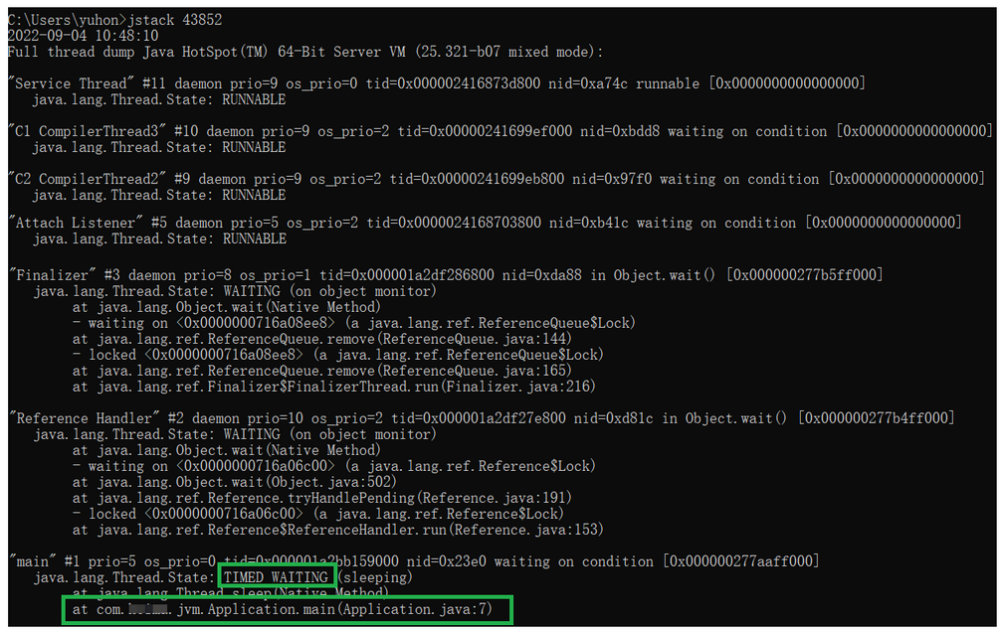
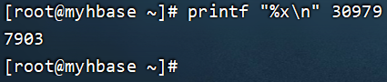

## 1. JVM 调优参数配置的位置

按不同的部署方式，对应的参数配置位置也不同：

- war 包部署，在 tomcat 中设置
- jar 包部署，在启动参数设置

### 1.1. 以 tomcat 方式部署 war 包

war 包部署时，可修改 TOMCAT_HOME/bin/catalina.sh 文件(linux 系统，若是 windows 系统则是 `*.bat`) 来设置 vm 参数，如下图，配置 `JAVA_OPTS="-Xms512m -Xmx1024m"`


### 1.2. 以 jar 文件部署的 SpringBoot 项目

通常在 linux 系统下直接加参数启动 springboot 项目即可，如：

```bash
nohup java -Xms512m -Xmx1024m -jar xxxx.jar --spring.profiles.active=prod &
```

命令参数解析：

- `nohup`：用于在系统后台不挂断地运行命令，退出终端不会影响程序的运行
- `&`：让命令在后台执行，终端退出后命令仍旧执行。

## 2. 常用的 JVM 调优的参数

对于 JVM 调优，主要是调整年轻代、老年代、元空间的内存空间大小及使用的垃圾回收器类型。

- Java SE 8 版本 JVM 虚拟机参数设置参考文档地址：https://docs.oracle.com/javase/8/docs/technotes/tools/unix/java.html
- vm 参数官方文档：https://www.oracle.com/java/technologies/javase/vmoptions-jsp.html

### 2.1. JVM 的三类参数

- 标准参数，以 `-` 为前缀，所有 HotSpot 都支持。例如 `java -version`。这类参数可以使用 `java -help` 或者 `java -?` 命令查询。
- 非标准参数，以 `-X` 为前缀，是特定 HotSpot 版本支持的指令。例如：`java -Xms200M -Xmx200M`。这类指令可以用 `java -X` 命令查询。
- 不稳定参数，以 `-XX` 为前缀，这些参数是跟特定 HotSpot 版本对应，很有可能换个版本就没有了。详细的文档资料也特别少。例如 JDK8 有以下几个不稳定参数的指令：

```bash
java -XX:+PrintFlagsFinal # 所有最终生效的不稳定指令。
java -XX:+PrintFlagsInitial # 默认的不稳定指令
java -XX:+PrintCommandLineFlags # 当前命令的不稳定指令 -- 这里可以看到是用的哪种 GC。JDK1.8 默认用的 ParallelGC
```

### 2.2. 内存设置

#### 2.2.1. 设置堆空间大小

为了防止垃圾收集器在初始大小、最大内存之间收缩堆而产生额外的时间，通常把最大、初始大小设置为相同的值。

- `-Xms`：设置堆的初始化大小
- `-Xmx`：设置堆的最大内存

> Tips: 配置时不指定单位默认为字节；指定单位，按照指定的单位设置。

例如：

```
# 初始化推大小为 2g
-Xms2g
# 堆最大内存为 2g
-Xmx2g
# 设置为 1024 字节
-Xms:1024
# 设置为 1024 kb
-Xms:1024k
# 设置为 1024 mb
-Xms:1024m
```

堆空间设置多少合适？

堆的默认最大值是物理内存的 1/4，初始大小是物理内存的 1/64。堆太小，可能会频繁的导致年轻代和老年代的垃圾回收，会产生 STW，暂停用户线程。堆内存大肯定是好的，存在风险，假如发生了 full GC，它会扫描整个堆空间，暂停用户线程的时间长。

设置参考推荐：尽量大，也要考察一下当前计算机其他程序的内存使用情况。

#### 2.2.2. 设置年轻代中 Eden 区和两个 Survivor 区的大小比例

`-XXSurvivorRatio` 参数用于设置年轻代中 Eden 区和两个 Survivor 区的大小比例。该值如果不设置，则默认比例为 8:1:1。Java 官方通过增大 Eden 区的大小，来减少 YGC 发生的次数，但有时虽然次数减少了，但 Eden 区满的时候，由于占用的空间较大，导致释放缓慢，此时 STW(Stop the world) 的时间较长，因此需要按照程序情况去调优。

```
# 表示年轻代中的分配比率：survivor : eden = 2:3
-XXSurvivorRatio=3

# 设置新生代 Eden 和 Survivor 比例为 8:2，具体 Eden : from : to = 8 : 1 : 1
-XX:SurvivorRatio=8
```

#### 2.2.3. 年轻代和老年代的比例

年轻代和老年代默认比例为 1:2。可以通过调整二者空间大小比率来设置两者的大小。

- `-XX:newSize`：设置年轻代的初始大小
- `-XX:MaxNewSize`：设置年轻代的最大大小，初始大小和最大大小两个值通常相同
- `-XX:NewRatio`：设置年轻代与老年代的比例值

例如：

```
# 设置新生代大小
-XX:NewSize=1
# 设置年轻的和老年代的内存比例为 1:4
-XX:NewRatio=4
```

#### 2.2.4. 虚拟机栈的设置

虚拟机栈的设置，**每个线程默认会开启 1M 的堆栈**，用于存放栈帧、调用参数、局部变量等，但一般 256K 就够用。通常减少每个线程的堆栈，可以产生更多的线程，但这实际上还受限于操作系统。`-Xss` 用于对每个线程 stack 大小的调整。例如：

```
-Xss256k
```

#### 2.2.5. 年轻代（新生代）的内存大小

一般来说，当 survivor 区不够大或者占用量达到 50%，就会把一些对象放到老年区。通过设置合理的 eden 区，survivor 区及使用率，可以将年轻对象保存在年轻代，从而避免 full GC，使用 `-Xmn` 设置年轻代的大小。

```
-Xmn
```

#### 2.2.6. 大对象分配内存配置

对于占用内存比较多的大对象，一般会选择在老年代分配内存。如果在年轻代给大对象分配内存，年轻代内存不够了，就要在 eden 区移动大量对象到老年代，然后这些移动的对象可能很快消亡，因此导致 full GC。通过设置参数：`-XX:PetenureSizeThreshold=1000000`，单位为 B，标明对象大小超过 1M 时，在老年代(tenured)分配内存空间。

#### 2.2.7. 年轻代晋升老年代阈值

一般情况下，年轻对象放在 eden 区，当第一次 GC 后，如果对象还存活，放到 survivor 区，此后每 GC 一次，年龄增加 1，当对象的年龄达到阈值，就被放到 tenured 老年区。这个阈值可以通过 `-XX:MaxTenuringThreshold` 设置：

```
# threshold 默认为15，取值范围 0-15
-XX:MaxTenuringThreshold=threshold
```

如果想让对象留在年轻代，可以设置比较大的阈值。

### 2.3. 垃圾回收器的配置

#### 2.3.1. 选择垃圾回收器的类型

- `-XX:+UseParallelGC`：年轻代使用并行垃圾回收收集器。这是一个关注吞吐量的收集器，可以尽可能的减少垃圾回收时间。
- `-XX:+UseParallelOldGC`：设置老年代使用 ParNew + ParNew Old 组合并行垃圾回收收集器。
- `–XX:+UseParNewGC`：指定使用 ParNew + Serial Old 垃圾回收器组合。
- `-XX:+UseConcMarkSweepGC`：老年代使用 CMS + Serial Old 垃圾收集器组合，降低停顿。
- `-XX:ParallelGCThreads`：设置 Parallel GC 的线程数。
- `-XX:+UseG1GC`：使用 G1 垃圾收集器。

#### 2.3.2. 打印 GC 配置信息与日志

- `-XX:+PrintGC`：开启打印 gc 信息
- `-XX:+PrintGCDetails`：打印 gc 详细信息。
- `-XX:+PrintGCTimeStamps`：打印 GC 的时间戳
- `-XX:+PrintTenuringDistribution`：查看熬过收集后剩余对象的年龄分布信息
- `-XX:PrintHeapAtGC：打印GC前后的堆栈信息`
- `-Xloggc:filename`：设置 GC log 文件的位置。

> Tips: 不同 JDK 版本会有不同的参数。比如 JDK9 中，就不用分这么多参数，可以统一使用 `-X-log:gc*` 通配符打印所有的 GC 日志。

准备简单的测试示例代码：

```java
public class GCLogTest {
    public static void main(String[] args) {
        ArrayList<byte[]> list = new ArrayList<>();

        for (int i = 0; i < 500; i++) {
            byte[] arr = new byte[1024 * 100];//100KB
            list.add(arr);
            try {
                Thread.sleep(10);
            } catch (InterruptedException e) {
                e.printStackTrace();
            }
        }
    }
}
```

使用 idea 执行以上代码时，设置 JVM 参数：

```
-Xms60m -Xmx60m -XX:SurvivorRatio=8 -XX:+PrintGCDetails -Xloggc:./gc.log
```


执行后，打开生成的 `gc.log` 文件，查看输出信息：


文件中记录了两次 MinorGC 和两次 FullGC 的执行效果。另外，在程序执行完成后，也会打印出 Heap 堆区的内存使用情况。如果不添加 `-Xloggc` 参数，这些日志信息只是打印在控制台。

#### 2.3.3. CMS 垃圾回收器相关

- `-XX:+UseCMSInitiatingOccupancyOnly`、`-XX:CMSInitiatingOccupancyFraction`：与前者配合使用，指定 MajorGC 的发生时机。
- `-XX:+ExplicitGCInvokesConcurrent`：代码调用 `System.gc()` 开始并行 FullGC，建议加上这个参数。
- `-XX:+CMSScavengeBeforeRemark`：表示开启或关闭在 CMS 重新标记阶段之前的清除（YGC）尝试，它可以降低 remark 时间，建议加上。
- `-XX:+ParallelRefProcEnabled`：可以用来并行处理 Reference，以加快处理速度，缩短耗时。

#### 2.3.4. G1 垃圾回收器相关

- `-XX:MaxGCPauseMillis`：用于设置目标停顿时间，G1 会尽力达成
- `-XX:G1HeapRegionSize`：用于设置小堆区大小，建议保持默认。
- `-XX:InitiatingHeapOccupancyPercent`：表示当整个堆内存使用达到一定比例（默认是 45%），并发标记阶段就会被启动。
- `-XX:ConcGCThreads`：表示并发垃圾收集器使用的线程数量，默认值随 JVM 运行的平台不同而变动，不建议修改

### 2.4. 内存分页

尝试使用大的内存分页，增加 CPU 的内存寻址能力，从而系统的性能。

```
# 设置内存页的大小
-XX:+LargePageSizeInBytes
```

### 2.5. -XX:+UseCompressedOops

当应用从 32 位的 JVM 迁移到 64 位的 JVM 时，由于对象的指针从 32 位增加到了 64 位，因此堆内存会突然增加差不多翻倍，这也会对 CPU 缓存（容量比内存小很多）的数据产生不利的影响。

迁移到 64 位的 JVM 主要动机在于可以指定最大堆大小，通过压缩 OOP 可以节省一定的内存。通过 `-XX:+UseCompressedOops` 选项，JVM 会使用 32 位的 OOP，而不是 64 位的 OOP。

### 2.6. 示例：生产环境用的什么JDK？如何配置的垃圾收集器？

例如生产环境使用了 Oracle JDK 1.8，G1 收集器相关配置如下：

```
-Xmx12g
-Xms12g
-XX:+UseG1GC
-XX:InitiatingHeapOccupancyPercent=45
-XX:MaxGCPauseMillis=200
-XX:MetaspaceSize=256m
-XX:MaxMetaspaceSize=256m
-XX:MaxDirectMemorySize=512m
-XX:G1HeapRegionSize 未指定
```

核心思路：

- 每个内存区域设置上限，避免溢出。
- 堆设置为操作系统的 70% 左右，超过 8G，首选 G1。
- 根据老年代对象提升速度，调整新生代与老年代之间的内存比例。
- 等过 GC 信息，针对项目敏感指标优化，比如访问延迟、吞吐量等。

## 3. 常用的 JVM 调优命令

### 3.1. jps（虚拟机进程状况工具）

`jps`：JVM Process Status Tool，列出本机所有正在运行的虚拟机（Java）进程。显示执行主类（Main Class, main() 函数所在的类）的名称，以及进程的本地虚拟机的唯一 ID。

```bash
jps -lvm
```

常用参数如下：

- `-m` 输出虚拟机进程启动时传递给主类 main 方法的参数。
- `-l` 输出完整的包名和应用主类名。如果进程执行是 jar 包，输出 jar 的完全的路径名。
- `-v` 输出虚拟机进程启动时 JVM 参数。
- `-q` 只输出lvmid，省略主类的名称


### 3.2. jstack（堆栈跟踪工具）

`jstack`：查看某个 Java 进程内当前时刻的线程堆栈信息。线程快照就是当前虚拟机内每一条线程正在执行的方法堆栈的集合，生成线程快照的主要目的是定位线程出现长时间停顿的原因。语法如下：

```bash
jstack [option] vmid
```

option 选项取值说明：

- `-F` 当正常输出的请求不被响应时，强制输出线程堆栈
- `-l` 除堆栈外，显示关于锁的额外附加信息，查看是否死锁
- `-m` 如果调用本地方法的话，可以显示 C/C++ 的堆栈



发生死锁时可以使用 `jstack -l pid` 观察锁持有情况。

```bash
jstack -l 4124 | more
```

### 3.3. jstat（虚拟机统计信息工具）

`jstat`：JVM statistics Monitoring，用于监视虚拟机各种**运行状态信息（类装载、内存、垃圾收集、JIT编译等运行数据）**。命令语法如下：

```bash
jstat [option vmid [interval[s|ms] [count]] ]
```

参数说明：

- `option` 代表用户希望查询的虚拟机信息，主要分3类：
    - 类装载
    - 垃圾收集
    - 运行期编译状况
- `vmid` 虚拟机id
- `interval` 查询间隔
- `count` 查询次数

> Tips: 如果不指定 `interval` 与 `count` 此两个参数，就默认查询一次。

#### 3.3.1. option 选项取值说明

- `-class` 监视类装载、卸载数量、总空间及类装载锁消耗的时间
- `-gc` 监视 Java 堆状况，包括 Eden 区，2 个 survivor 区、老年代
- `-gccapacity` 监视内容与 `-gc` 基本相同，但输出主要关注Java堆各个区域使用的最大和最小空间
- `-gcutil` 监视内容与 `-gc` 基本相同，主要关注已经使用空间站空间百分比
- `-gccause` 与 `-gcutil` 功能一样，但是会额外输出导致上一次 GC 产生的原因
- `-gcnew` 监视新生代的 GC 的状况
- `-gcnewcapacity` 监视内容与 `-gcnew` 基本相同，输出主要关注使用到的最大最小空间
- `-gcold` 监视老年代的 GC 情况
- `-gcoldcapacity` 监控内容与 `-gcold` 基本相同，主要关注使用到的最大最小空间
- `-compiler` 输出 JIT 编译器编译过的方法、耗时等信息

#### 3.3.2. 示例及输出信息说明

1. 使用参数 `-gcuitl` 可以查看垃圾回收的统计信息。

```bash
jstat -gcutil 4124

S0 S1 E O M CCS YGC YGCT FGC FGCT GCT
0.00 0.00 67.21 19.20 96.36 94.96 10 0.084 3 0.191 0.275
```

> 参数说明：
>
> - S0： Survivor0 区当前使用比例
> - S1： Survivor1 区当前使用比例
> - E： Eden 区使用比例
> - O：老年代使用比例
> - M：元数据区使用比例
> - CCS：压缩使用比例
> - YGC：年轻代垃圾回收次数
> - FGC：老年代垃圾回收次数
> - FGCT：老年代垃圾回收消耗时间
> - GCT：垃圾回收消耗总时间

2. 使用 `-gc` 参数，查看垃圾回收统计。

```bash
jstat -gc pid
```


### 3.4. jmap（内存映像工具）

`jmap`：JVM Memory Map，查看运行中的堆内存的快照（heap dump 文件），从而可以对堆内存进行离线分析。该命令工具还可以查询 finalize 执行队列，Java 堆和永久代的详细信息，如果空间使用率、当前用的是哪种收集器等。命令语法：

```bash
jmap [option] vmid
```

option 选项说明：

- `-dump` 生成 Java 堆转储快照，其中 live 自参数说明是否只 dump 出存活对象
- `-finalizerinfo` 显示在 F `-Queue` 中等待 Finalizer 线程执行 finalize 方法的对象。只在 Linux/Solaris 平台下有效
- `-heap` 显示 Java 堆详细信息，如使用哪种回收器、参数配置、分代状况。
- `-histo` 显示堆中对象统计信息、包括类、实例数量和合计容量。
- `-F` 当虚拟机进程对 `-dump` 选项没有响应时，可使用这个选项强制生成 dump 快照。

```bash
jmap -dump:format=b,file=heap.hprof pid
```

- `format=b` 表示以 hprof 二进制格式转储 Java 堆的内存
- `file=<filename>` 用于指定快照 dump 文件的文件名

例如：查询进程 53280

```java
C:\Users\MooN>jmap -heap 53280
Attaching to process ID 53280, please wait...
Debugger attached successfully.
Server compiler detected.
JVM version is 25.321-b07

using thread-local object allocation.
Parallel GC with 8 thread(s)   //并行的垃圾回收器

Heap Configuration:  //堆配置
   MinHeapFreeRatio         = 0   //空闲堆空间的最小百分比
   MaxHeapFreeRatio         = 100  //空闲堆空间的最大百分比
   MaxHeapSize              = 8524922880 (8130.0MB) //堆空间允许的最大值
   NewSize                  = 178257920 (170.0MB) //新生代堆空间的默认值
   MaxNewSize               = 2841640960 (2710.0MB) //新生代堆空间允许的最大值
   OldSize                  = 356515840 (340.0MB) //老年代堆空间的默认值
   NewRatio                 = 2 //新生代与老年代的堆空间比值，表示新生代：老年代=1：2
   SurvivorRatio            = 8 //两个Survivor区和Eden区的堆空间比值为8,表示S0:S1:Eden=1:1:8
   MetaspaceSize            = 21807104 (20.796875MB) //元空间的默认值
   CompressedClassSpaceSize = 1073741824 (1024.0MB) //压缩类使用空间大小
   MaxMetaspaceSize         = 17592186044415 MB //元空间允许的最大值
   G1HeapRegionSize         = 0 (0.0MB)//在使用 G1 垃圾回收算法时，JVM 会将 Heap 空间分隔为若干个 Region，该参数用来指定每个 Region 空间的大小。

Heap Usage:
PS Young Generation
Eden Space: //Eden使用情况
   capacity = 134217728 (128.0MB)
   used     = 10737496 (10.240074157714844MB)
   free     = 123480232 (117.75992584228516MB)
   8.000057935714722% used
From Space: //Survivor-From 使用情况
   capacity = 22020096 (21.0MB)
   used     = 0 (0.0MB)
   free     = 22020096 (21.0MB)
   0.0% used
To Space: //Survivor-To 使用情况
   capacity = 22020096 (21.0MB)
   used     = 0 (0.0MB)
   free     = 22020096 (21.0MB)
   0.0% used
PS Old Generation  //老年代 使用情况
   capacity = 356515840 (340.0MB)
   used     = 0 (0.0MB)
   free     = 356515840 (340.0MB)
   0.0% used

3185 interned Strings occupying 261264 bytes.
```

> Tips: 它是一个进程或系统在某一给定的时间的快照。比如在进程崩溃时，甚至是任何时候，我们都可以通过工具将系统或某进程的内存备份出来供调试分析用。dump 文件中包含了程序运行的模块信息、线程信息、堆栈调用信息、异常信息等数据，方便系统技术人员进行错误排查。

### 3.5. jhat

`jhat`：JVM Heap Analysis Tool，此命令是与 `jmap` 搭配使用，用来分析 `jmap` 生成的 dump，`jhat` 内置了一个微型的 HTTP/HTML 服务器，生成 dump 的分析结果后，可以在浏览器中查看。

### 3.6. jinfo（配置信息工具）

`jinfo`：JVM Configuration info，实时查看当前的应用 JVM 运行参数配置。语法格式：

```bash
jinfo [option] pid
```

例如：

```bash
jinfo -flags 1
```

> Tips: 与 `jps -v` 命令比较，该只是查看虚拟机启动时显式指定的参数列表。

### 3.7. 查询 JVM 相关参数值

- 查看所有参数的最终值，*初始值可能被修改掉*。

```bash
java -XX:+PrintFlagsFinal -version
```

- 查看所有参数的初始值

```bash
java -XX:+PrintFlagsInitial
```

### 3.8. Arthas（Java 诊断工具）

Arthas 是 Alibaba 开源的 Java 诊断工具。支持 JDK 6+，支持 Linux/Mac/Winodws，采用命令行交互模式，同时提供丰富的 Tab 自动补全功能，进一步方便进行问题的定位和诊断。

> 详见[《Arthas - Alibaba 开源的 Java 诊断工具》笔记](/JVM/Arthas)

## 4. JVM 性能调优可视化工具

JDK 自带了很多监控工具，都位于 JDK 的 bin 目录下，其中最常用的是 jconsole 和 jvisualvm 这两款视图监控工具。第三方有：MAT(Memory Analyzer Tool)、GChisto。

- MAT（Memory Analyzer Tool）：一个基于 Eclipse 的内存分析工具，是一个快速、功能丰富的 Javaheap 分析工具，可以帮助开发者查找内存泄漏和减少内存消耗。
- GChisto：一款专业分析 gc 日志的工具

### 4.1. jconsole

jconsole（Java Monitoring and Management Console）：从 Java5 开始，在 JDK 中自带的 java 监控和管理控制台。用于对 JVM 中的内存、线程和类等进行监控，是一个基于 JMX 的 GUI 性能监控工具。

1. 打开方式：java 安装目录 bin 目录下 直接启动 jconsole.exe 即可。


2. 可以内存、线程、类等信息


### 4.2. VisualVM：故障处理工具

jvisualvm：JDK 自带的全能分析工具，可以分析内存快照、线程快照、程序死锁、监控内存的变化、gc 变化等。能够监控线程，内存情况，查看方法的 CPU 时间和内存中的对象，已被 GC 的对象，反向查看分配的堆栈。

1. 打开方式：java 安装目录 bin 目录下 直接启动 jvisualvm.exe 即可


2. 监控程序运行情况


3. 查看运行中的 dump


4. 查看堆中的信息


## 5. JVM 常见问题排查

### 5.1. OutOfMemoryError 问题的排查

Java 内存泄露原因：

- 如果线程请求分配的栈容量超过 java 虚拟机栈允许的最大容量的时候，java 虚拟机将抛出一个 StackOverFlowError 异常
- 如果 java 虚拟机栈可以动态拓展，并且扩展的动作已经尝试过，但是目前无法申请到足够的内存去完成拓展，或者在建立新线程的时候没有足够的内存去创建对应的虚拟机栈，那 java 虚拟机将会抛出一个 OutOfMemoryError 异常
- 如果一次加载的类太多，元空间内存不足，则会报 OutOfMemoryError: Metaspace


排查 OOM 的方案：

- 查看服务器运行日志日志，捕捉到内存溢出异常。
- 使用 `jstat` 命令工具查看监控 JVM 的内存和 GC 情况，评估问题大概出在什么区域。
- 使用 MAT 工具载入 dump 文件，分析大对象的占用情况。（dump 文件巨大，实际生产环境很难有机会去获取到 dump 文件）

其中一种排查 OOM 的思路如下：

1. 通过 jmap 指定打印他的内存快照 dump。（Dump 文件是进程的内存镜像。可以把程序的执行状态通过调试器保存到 dump 文件中）

```bash
jmap -dump:format=b,file=heap.hprof pid
```

建议使用另一方式，使用 vm 参数获取 dump 文件。因为有的情况是内存溢出之后程序则会直接中断，而 jmap 只能打印在运行中的程序，所以建议通过参数的方式的生成 dump 文件，配置如下：

```
# 线上 JVM 必须配置
-XX:+HeapDumpOnOutOfMemoryError
# 指定当 OOM 发生时自动 dump 堆内存信息到指定目录
-XX:HeapDumpPath=/home/app/dumps/heapdump.hprof
```

2. 通过工具，VisualVM（Ecplise MAT）去分析 dump 文件。VisualVM 可以加载离线的 dump 文件，文件 -> 装入 -> 选择 dump 文件即可查看堆快照信息。如下图


> Tips: 如果是 linux 系统中的程序，则需要把 dump 文件下载到本地（windows环境）下，打开 VisualVM 工具分析。VisualVM 目前只支持在 windows 环境下运行可视化

3. 通过查看堆信息的情况，可以大概定位内存溢出是哪行代码出了问题


4. 找到对应的代码，通过阅读上下文的情况，进行修复即可

### 5.2. CPU 飙高排查方案与思路

1. 使用 top 命令查看占用 cpu 的情况


2. 通过 top 命令查看后，可以查看是哪一个进程占用 cpu 较高，上图所示的进程为：30978
3. 查看当前线程中的进程信息

```bash
ps H -eo pid,tid,%cpu | grep 30978
```


命令参数说明：

- `pid`：进程 id
- `tid`：进程中的线程 id
- `%`：cpu 使用率 

4. 通过上图分析，在进程 30978 中的线程 30979 占用 cpu 较高。注意：上述的线程 id 是一个十进制，需要把这个线程 id 转换为 16 进制，因为通常在日志中展示的都是 16 进制的线程 id 名称。在 linux 中执行命令进行转换：

```bash
printf "%x\n" 30979
```



5. 可以根据线程 id 找到有问题的线程，进一步定位到问题代码的源码行号。执行以下命令：

```bash
jstack 30978
```


