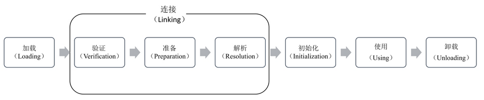
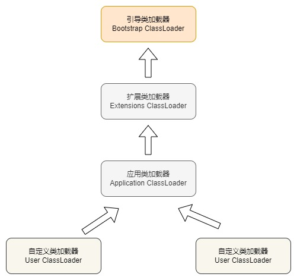

## 1. 类加载

当第一次使用某个类时，如果该类的字节码文件(class)还没有加载到内存中，则 JVM 通过类的完全限定名（包名和类名）查找此类的字节码文件，会将该类的字节码文件（`.class`）加载到内存中，并在内存中创建一个 Class 对象(字节码文件对象)，用来封装类在方法区内的数据结构并存放在堆区内。

> Notes: **每一个类只会加载一次，每一个类的 Class 对象是都是唯一的(单例)。当类加载到内存中时会执行该类的静态代码块，而且只会加载一次**

### 1.1. 类的生命周期

**类的生命周期**：是指从被加载到虚拟机内存中开始，到从内存卸载为止。它的完整生命周期包括：加载（Loading）、验证（Verification）、准备（Preparation）、解析（Resolution）、初始化（Initialization）、使用（Using）和卸载（Unloading）等 7 个阶段。



> Notes: 
>
> - **类加载过程**：是指当程序要使用某个类时，JVM 会将类加载到内存中初始完成初始化，类的加载分为5个阶段：**加载、验证、准备、解析、初始化**。
> - 其中『验证、准备、解析』 3 个部分统称为『**连接（Linking）**』。
> - 需要注意，JVM 在内存分配和对象创建过程中可能会做一些优化，如对象的重叠分配、内存预分配等技术手段，以提高对象创建的效率和性能。
> - 类加载是在使用之前的阶段，在类初始化完成后就可以使用该类的信息，而当一个类不再被需要时可以从 JVM 中卸载（Unloading）。

### 1.2. JDK 8 的类加载机制总结

- 缓存：每个类加载器对加载过的类都有一个缓存。
- 双亲委派机制：向上委托查找，向下委托加载。（每步都会先查找当时类加载器的本地缓存是否已经加载过）
- 沙箱保护机制：不允许应用程序加载 JDK 内部的系统类。

### 1.3. 类加载的时机（触发类加载的时机）

1. **创建类的实例**：当通过关键字 `new` 创建一个该类的对象或某个类的子类对象时，JVM 需要加载该类以创建对应的对象。
2. **访问类的静态变量、调用类的静态方法、或者为静态变量赋值（<u>静态常量除外</u>，因为静态常量在编译时已经存在）**：JVM 需要加载该类以获取对应的静态成员。
3. **调用类的静态成员所在的类被加载**：当访问一个类的静态成员，而该类的静态成员所在的类还没有被加载时，JVM 需要先加载该静态成员所在的类。
4. **使用反射机制**：使用反射方式来强制创建某个类或接口对应的 `java.lang.Class` 对象，JVM 会在运行时加载相应的类。
5. **类型转换**：当进行类型转换时（如将一个父类对象强制转换为子类对象），JVM 需要加载目标类型所对应的类。
6. 直接使用 `java` 命令来执行含有 `main` 方法的类时。

> Notes: Java 类的加载是动态按需进行的，它并不会一次性将所有类全部加载后再运行，而是保证程序运行的基础类(像是基类)完全加载到 JVM 中。至于其他类，则在运行时根据实际需要来加载。JVM 会采用懒加载的策略，此做法就是为了尽可能避免不必要的类加载和资源消耗，节省内存开销。

### 1.4. 类的显式与隐式加载

类的加载方式是指虚拟机将 class 文件加载到内存的方式，类装载方式分成以下两种：

- **显式加载**：指在 java 代码中通过调用 `ClassLoader` 显式加载需要的类，比如 `Class.forName(类的全限定名)`、`this.getClass().getClassLoader().loadClass()` 等方式加载类。
- **隐式加载**：指不需要在 Java 代码中明确调用类加载的代码，而是通过虚拟机自动加载到内存中。比如以下场景：
    - 程序在运行过程中，当遇到通过 `new` 等方式生成对象时，隐式调用类装载器加载对应的类到 JVM 中。
    - 在加载某个 class 时，该 class 引用了另外一个类的对象，那么这个对象的字节码文件就会被虚拟机自动加载到内存中。

## 2. 类的加载（Loading）阶段

加载阶段，是指 JVM 读取 Class 文件（通过类的全限定名称来查找）读入内存（运行时区域的方法区内），并且根据 Class 文件描述在堆中创建 `java.lang.Class` 对象，并封装类在方法区的数据结构这个过程。具体过程主要包含：

1. 通过类的全限定名获取定义此类的二进制字节流
2. 将字节流所代表的静态存储结构转换为方法区的运行时数据结构
3. 在内存中生成一个代表该类的 `Class` 对象，作为方法区类信息的访问入口

值得注意的是，Class 对象不一定非得要从一个 class 文件获取，读取 Class 文件时既可以通过文件的形式读取，也可以通过 jar 包、war 包读取，还可以通过代理自动生成 Class 或其他方式读取，也可以由其它文件生成（比如将 JSP 文件转换成对应的 Class 类）。

> Tips: 任何类被使用时系统都会建立一个 Class 对象

## 3. 类加载器

类加载器是负责加载类的对象。对于任意一个类，都需要由加载它的类加载器和这个类本身，并确立在 JVM 中的唯一性，每一个类加载器，都有一个独立的类名称空间。类加载器通过类的全限定名获取该类的 class 字节码文件（二进制字节流），将硬盘中的 class 文件加载到 Java 内存中，并且在内存中创建一个 Class 对象。

> Notes: **类加载器本身也是一个类**

类加载器可以分为两种：

- 第一种是 Java 虚拟机自带的类加载器，分别为引导类加载器、扩展类加载器和应用类加载器（系统类加载器）
- 第二种是用户自定义的类加载器，是 `java.lang.ClassLoader` 的子类实例。

### 3.1. Bootstrap ClassLoader（引导类加载器）

**引导类加载器（Bootstrap ClassLoader）**：最底层的加载器（由 C 和 C++ 编写，不是 Java 中的类），是虚拟机自身的一部分。且没有父加载器，也没有继承 `java.lang.ClassLoader` 类。负责加载由系统属性 `sun.boot.class.path` 指定的路径下的核心 Java 类库（即：`JAVA_HOME\lib\rt.jar`），或者被 `-Xbootclasspath` 参数所指定的路径中并且被虚拟机识别的类库。该类无法被 Java 程序直接引用。

> Notes: 出于安全考虑，根类加载器只加载 java、javax、sun 开头包的类。

```java
ClassLoader cl1 = Object.class.getClassLoader();
// Object 类是由引导类加载器加载，因此输出为 null
System.out.println("cl1:" + cl1);
```

### 3.2. Extensions ClassLoader（扩展类加载器）

**扩展类加载器（Extensions ClassLoader）**：由 Java 程序编写，是 Java 类中的一个内部类，`sun.misc.Launcher$ExtClassLoader`类（JDK9 是 `jdk.internal.loader.ClassLoaders$PlatformClassLoader` 类）。负责加载 JRE 中的扩展库的类。如：`JAVA_HOME\jar\lib\ext`或 `Java.ext.dirs` 系统变量指定的路径中的所有类库。Java 虚拟机的实现会提供一个扩展库目录。该类加载器在此目录里面查找并加载 Java 类。

**其父加载器是引导类加载器**。

> Notes: **如果在 eclipse 中要使用 lib/ext 包中的类，需要进行如下设置**：
>
> 在【Project Properties】->【Java Build Path】中的指定 JRE 包的访问规则，Edit 规则 Accessible，指定为 `sun/**`，指定可以在 eclipse 中访问 sun 开头的包。
>
> 

`ExtClassLoader` 加载目录源码：

```java
private static File[] getExtDirs() {
    String s = System.getProperty("java.ext.dirs");
    File[] dirs;
    if (s != null) {
        StringTokenizer st =
                new StringTokenizer(s, File.pathSeparator);
        int count = st.countTokens();
        dirs = new File[count];
        for (int i = 0; i < count; i++) {
            dirs[i] = new File(st.nextToken());
        }
    } else {
        dirs = new File[0];
    }
    return dirs;
}
```

输出示例：

```java
// DNSNameService类位于 dnsns.jar 包中，它存在于 jre/lib/ext 目录下
ClassLoader cl = DNSNameService.class.getClassLoader();
System.out.println(cl); // 打印结果sun.misc.Launcher$ExtClassLoader
```

### 3.3. Application / System ClassLoader（应用/系统类加载器）

**应用类加载器（Application ClassLoader），或者称为系统类加载器（System ClassLoader）**：由 Java 程序编写，是一个 Java 内部类，`sun.misc.Launcher$AppClassLoader`类（JDK9是`jdk.internal.loader.ClassLoaders$AppClassLoader`）。负责加载 `CLASSPATH` 环境变量或者系统属性 `java.class.path` 所指定的目录中指定的 jar(包括第三方的库)和 bin 目录下的 Java 类。一般来说，Java 应用的类都是由它来完成加载的。可以通过 `ClassLoader.getSystemClassLoader()` 方法来获取它。一般情况，如果没有自定义类加载器，则默认使用该类加载器。

**其父加载器是扩展类加载器，是用户自定义类加载器的默认父加载器。**

```java
// 平常编写的 Java 类是使用的应用类加载器
ClassLoader classLoader = ClassLoaderDemo.class.getClassLoader();
System.out.println(classLoader); // sun.misc.Launcher$AppClassLoader
```

### 3.4. User ClassLoader（自定义类加载器）

**用户自定义类加载器（User ClassLoader）**，通过继承 `java.lang.ClassLoader` 类的方式实现。**其默认父加载器是系统类加载器**。

## 4. 类加载器的加载机制

### 4.1. 双亲委派机制概述

从 JDK1.2 开始，<font color=red>**类的加载过程采用双亲委派机制(PDM)**</font>。这种机制能够很好的保护 java 程序的安全。

双亲委派模型：如果一个类加载器收到了类加载的请求，它首先不会自己去加载这个类，而是把这个请求委派给父类加载器去完成，每一层的类加载器都是如此，这样所有的加载请求都会被传送到顶层的启动类加载器中，只有当父加载无法完成加载请求（它的搜索范围中没找到所需的类）时，才向下委派给子加载器尝试去加载类，直到该类被成功加载。

### 4.2. 双亲委派机制的加载流程



双亲委派加载机制的类加载流程如下：

1. 将自定义加载器挂载到应用程序类加载器
2. 当 AppClassLoader 加载一个 class 时，它首先不会自己去尝试加载这个类，而是把类加载请求委派给父类加载器 ExtClassLoader 去完成
3. 当 ExtClassLoader 加载一个 class 时，它首先也不会自己去尝试加载这个类，而是把类加载请求委派给 BootStrapClassLoader 去完成
4. 启动类加载器(BootStrapClassLoader)在加载路径下查找并加载 Class 文件，如果 BootStrapClassLoader 加载失败（例如在 `$JAVA_HOME/jre/lib` 里未查找到该class），会使用 ExtClassLoader 来尝试加载
5. 扩展类加载器（ExtClassLoader）在加载路径下查找并加载 Class 文件，若 ExtClassLoader 也加载失败，则会使用 AppClassLoader 来加载
6. AppClassLoader 在加载路径下查找并加载 Class 文件，如果未找到目标 Class 文件，则交由自定义加载器加载。
7. 在自定义加载器下查找并加载用户指定目录下的 Class 文件，如果在自定义加载路径下未找到目标 Class 文件，则会抛出 ClassNotFoundException 异常


> Notes: 双亲委派机制的核心是保障类的唯一性和安全性。如果在 JVM 中存在包名和类名相同的两个类，则该类将无法被加载，JVM 也无法完成类加载流程。

### 4.3. 双亲委派机制的好处

双亲委派模型是保证 Java 应用程序的稳定性和安全性的重要机制，使用双亲委派模型能够避免类的冲突、提高安全性、节省资源，并保证类的一致性。使用双亲委派机制的好处：

1. **避免资源浪费问题**：每个类加载器都有自己的类加载搜索路径和加载规则，若没有双亲委派机制，可能导致同一个类被不同的类加载器重复加载，造成资源的浪费。而使用了双亲委派机制，当父类加载器已经加载了该类时，就没有必要子 ClassLoader 再加载一次，可以避免类的重复加载，
2. **避免类冲突问题**：在没有双亲委派机制的情况下，不同的类加载器可以独立加载相同的类。这可能导致类的冲突和不一致性，因为同一个类在不同的类加载器中会有多个版本存在，最终导致类的不一致问题。
3. **基于安全因素的考虑**：双亲委派模型可以通过从上层类加载器向下层加载器委派类加载请求来提高安全性，保证 Java 核心 API 中定义类型不会被随意替换。假设通过网络传递一个名为 `java.lang.Object` 的类，通过双亲委托模式传递到启动类加载器，而启动类加载器在核心 Java API 发现该名字的类已被加载，则不会重新加载网络传递过来的 `java.lang.Object` 类，而直接返回已加载过的 `Object.class`，从而可以防止核心 API 库被随意篡改。示例如下：

定义一个类，注意包名与jdk原生的一样

```java
package java.lang;
​
public class MyObject {
​
}

加载该类

```java
public static void main(String[] args) {
    Class clazz = MyObject.class;
    System.out.println(clazz.getClassLoader());
}
```

输出结果：

```
Exception in thread "main" java.lang.SecurityException: Prohibited package name: java.lang
```

示例说明：因为 `java.lang` 包属于核心包，只能由引导类加载器进行加载。而根据类加载的双亲委派机制，引导类加载器是加载不到该自定义的 MyObject 类的，所以只能由 AppClassLoader 进行加载，而这又不是允许的，所以最终会报出 `Prohibited package name: java.lang`（禁止的包名）错误。

### 4.4. 双亲委派模型的实现源码分析

双亲委派模型的具体实现代码在 `java.lang.ClassLoader` 类的 `loadClass()` 方法中，具体的流程是：先检查类是否已经加载过，如果没有则让父类加载器去加载。当父类加载器加载失败时抛出 `ClassNotFoundException`，此时尝试自己去加载。若最后找不到该类，则 JVM 会抛出 `ClassNotFoundException`。源码节选如下：

```java
// 类加载器的核心方法
protected Class<?> loadClass(String name, boolean resolve) throws ClassNotFoundException {
    synchronized (getClassLoadingLock(name)) {
        // First, check if the class has already been loaded
        // 每个类加载器，对它加载过的类都有一个缓存，先去缓存中查看有没有加载过
        Class<?> c = findLoadedClass(name);
        if (c == null) { // 没有加载过，就走双亲委派，找父类加载器进行加载。
            long t0 = System.nanoTime();
            try {
                if (parent != null) {
                    c = parent.loadClass(name, false);
                } else {
                    c = findBootstrapClassOrNull(name);
                }
            } catch (ClassNotFoundException e) {
                // ClassNotFoundException thrown if class not found
                // from the non-null parent class loader
            }

            if (c == null) {
                // If still not found, then invoke findClass in order
                // to find the class.
                long t1 = System.nanoTime();
                // 父类加载器没有加载过，则自行解析 class 文件加载。
                c = findClass(name);

                // this is the defining class loader; record the stats
                sun.misc.PerfCounter.getParentDelegationTime().addTime(t1 - t0);
                sun.misc.PerfCounter.getFindClassTime().addElapsedTimeFrom(t1);
                sun.misc.PerfCounter.getFindClasses().increment();
            }
        }
        // 此处是加载过程中的链接(Linking)部分，分为验证、准备、解析三个部分。
        // 运行时加载类，默认是无法进行这个链接的步骤。
        if (resolve) {
            resolveClass(c);
        }
        return c;
    }
}

protected Class<?> findClass(String name) throws ClassNotFoundException {
    throw new ClassNotFoundException(name);
}
```

> Tips: 
>
> - 除了虚拟机自带的引导类加载器之外，其余的类加载器都有唯一的父加载器。
> - 双亲委派机制的父子关系并非面向对象程序设计中的继承关系，而是通过使用组合模式来复用父加载器代码。
> - `loadClass` 方法是 `protected` 声明的，这意味着，此方法是可以被子类覆盖的。所以，双亲委派机制也是可以被打破的。

演示类加载器的父子关系：

```java
ClassLoader loader = ClassLoaderDemo.class.getClassLoader();
while (loader != null) {
    System.out.println(loader);
    loader = loader.getParent();
}
```

输出结果：

```java
sun.misc.Launcher$AppClassLoader@18b4aac2
sun.misc.Launcher$ExtClassLoader@677327b6
```

### 4.5. 沙箱保护机制

双亲委派机制最大的作用就是要保护 JDK 内部的核心类不会被应用覆盖。而为此 JAVA 在双亲委派的基础上，还加了一层保险，就是 `ClassLoader` 的 `preDefineClass` 方法。

```java
private ProtectionDomain preDefineClass(String name, ProtectionDomain pd) {
    if (!checkName(name))
        throw new NoClassDefFoundError("IllegalName: " + name);

    // Note:  Checking logic in java.lang.invoke.MemberName.checkForTypeAlias
    // relies on the fact that spoofing is impossible if a class has a name
    // of the form "java.*"
    // 不允许加载核心类，否则直接抛出异常。
    if ((name != null) && name.startsWith("java.")) {
        throw new SecurityException
            ("Prohibited package name: " +
                name.substring(0, name.lastIndexOf('.')));
    }
    if (pd == null) {
        pd = defaultDomain;
    }

    if (name != null) checkCerts(name, pd.getCodeSource());

    return pd;
}
```

此方法会用在 JAVA 在内部定义一个类之前，以简单粗暴的处理方式来阻止开发者定义 `java.` 开头的包。因此在 JDK 中，可以看到很多 `javax` 开头的包，这些包名也是跟这个沙箱保护机制有关系的。

### 4.6. 打破双亲委派机制的例子及其原因

- JNDI 通过引入线程上下文类加载器，可以在 `Thread.setContextClassLoader` 方法设置，默认是应用程序类加载器，来加载 SPI 的代码。有了线程上下文类加载器，就可以完成父类加载器请求子类加载器完成类加载的行为。打破的原因是为了 JNDI 服务的类加载器是启动器类加载，为了完成高级类加载器请求子类加载器（即上文中的线程上下文加载器）加载类。
- Tomcat，应用的类加载器优先自行加载应用目录下的 class，并不是先委派给父加载器，加载不了才委派给父加载器。打破的目的是为了完成应用间的类隔离。Tomcat 有几个主要类加载器：
    - CommonLoader：Tomcat 最基本的类加载器，加载路径中的 class 可以被 Tomcat 容器本身以及各个 Webapp 访问。
    - CatalinaLoader：Tomcat 容器私有的类加载器，加载路径中的 class 对于 Webapp 不可见。
    - SaredLoader：各个 Webapp 共享的类加载器，加载路径中的 class 对于所有 Webapp 可见，但是对于 Tomcat 容器不可见。
    - WebappClassLoader：各个 Webapp 私有的类加载器，加载路径中的 class 只对当前 Webapp 可见。比如加载 war 包里相关的类，每个 war 包应用都有自己的 webappClassLoader，实现相互隔离，比如不同 war 包应用引入了不同的 spring 版本，这样实现就能加载各自的 spring 版本。
    - JSP 类加载器：针对每个 JSP 页面创建一个加载器。这个加载器比较轻量级，所以 Tomcat 还实现了热加载，也就是 JSP 只要修改了，就创建一个新的加载器，从而实现了 JSP 页面的热更新。
- OSGi，实现模块化热部署，为每个模块都自定义了类加载器，需要更换模块时，模块与类加载器一起更换。其类加载的过程中，有平级的类加载器加载行为。打破的原因是为了实现模块热替换。
- JDK 9，Extension ClassLoader 被 Platform ClassLoader 取代，当平台及应用程序类加载器收到类加载请求，在委派给父加载器加载前，要先判断该类是否能够归属到某一个系统模块中，如果可以找到这样的归属关系，就要优先委派给负责那个模块的加载器完成加载。打破的原因，是为了添加模块化的特性。

## 5. 类加载器的实现

### 5.1. ClassLoader 抽象类

所有的类加载器（除了引导类加载器）都必须继承 `java.lang.ClassLoader` 抽象类

#### 5.1.1. 获取类加载器对象

通过 Class 对象的 `getClassLoader` 方法可以获得当前类的类加载器对象

```java
@CallerSensitive
public ClassLoader getClassLoader()
```

> Notes: <font color=red>**如果通过`类名.class.getClassLoader()`获得的类加载器对象是 null，则说明该类是由引导类加载器加载**</font>

#### 5.1.2. 类常用方法

```java
public final ClassLoader getParent()
```

- 获得父加载器对象。三种类加载器之间没有真正的子父类关系，只是一种叫法。三种加载器的子父关系（上下级关系）：应用类加载器(AppClassLoader) -> 扩展类加载器(ExtClassLoader) -> 引导类加载器(BootstrapClassLoader)

```java
public URL getResource(String name)
```

- 如果资源文件是在 src 文件夹下，资源文件路径：不需要加 `/`，代表从 bin 目录查找指定名称的资源文件。返回值是 URL 对象(统一资源定位符)

```java
public InputStream getResourceAsStream(String name)
```

- 如果资源文件是在 src 文件夹下，资源文件路径：不需要加 `/`，代表从 bin 目录查找指定名称的资源文件。返回资源文件关联的字节输入流对象。

```java
protected Class<?> loadClass(String name, boolean resolve) throws ClassNotFoundException
```

- loadClass 方法是双亲委托模式的实现。从源码中可以观察到各种类加载器的执行顺序。需要注意的是，只有父类加载器加载不到类时，才会调用 `findClass` 方法进行类的查找，所以，在自定义类加载器时，不要覆盖掉该方法，而应该覆盖掉 `findClass` 方法

```java
protected Class<?> findClass(String name) throws ClassNotFoundException
```

- `findClass` 方法在 `ClassLoader` 类中给出了一个默认的错误实现。在自定义类加载器时，一般需要覆盖此方法

```java
protected final Class<?> defineClass(String name, byte[] b, int off, int len) throws ClassFormatError {
    return defineClass(name, b, off, len, null);
}
```

- `defineClass` 方法是用来将 byte 字节解析成虚拟机能够识别的 Class 对象。`defineClass()`方法通常与`findClass()`方法一起使用。在自定义类加载器时，会直接覆盖 `ClassLoader` 的`findClass()` 方法获取要加载类的字节码，然后调用 `defineClass()` 方法生成 Class 对象。

```java
protected final void resolveClass(Class<?> c) {
    resolveClass0(c);
}

private native void resolveClass0(Class<?> c);
```

- 类加载器可以使用此方法来连接指定的类。

### 5.2. URLClassLoader（实现类）

```java
public class URLClassLoader extends SecureClassLoader implements Closeable
```

在 java.net 包中，JDK 提供了一个更加易用的类加载器 `URLClassLoader`，继承了 `ClassLoader`，能够从本地或者网络上指定的位置加载类。*可以将其作为自定义的类加载器来使用*。

#### 5.2.1. 构造方法

```java
public URLClassLoader(URL[] urls, ClassLoader parent)
```

- 指定要加载的类所在的 URL 地址，并指定父类加载器

```java
public URLClassLoader(URL[] urls)
```

- 指定要加载的类所在的 URL 地址，父类加载器默认为系统类加载器

#### 5.2.2. 示例 - 通过类加载器引入外部 jar 包

示例1；加载磁盘上的类

```java
File path = new File("d:/");
URI uri = path.toURI();
URL url = uri.toURL();
URLClassLoader cl = new URLClassLoader(new URL[]{url});
Class clazz = cl.loadClass("com.moon.Demo");
clazz.newInstance();
```

示例2；加载网络上的类

```java
URL url = new URL("http://localhost:8080/examples/");
URLClassLoader classLoader = new URLClassLoader(new URL[]{url});
System.out.println(classLoader.getParent());
Class aClass = classLoader.loadClass("com.moon.Demo");
aClass.newInstance();
```

### 5.3. 自定义类加载器

自定义类加载器，需要继承 `ClassLoader` 类，并覆盖 `findClass` 方法。

#### 5.3.1. OSGI（动态模型系统）【了解】

OSGI（Open Service Gateway Initiative）是 Java 动态化模块化系统的一系列规范，旨在为实现 Java 程序的模块化编程提供基础条件。基于 OSGI 的程序可以实现模块级的热插拔功能，在程序升级更新时，可以只针对需要更新的程序进行停用和重新安装，极大提高了系统升级的安全性和便捷性。

OSGI 提供了一种面向服务的架构，该架构为组件提供了动态发现其他组件的功能，这样无论是加入组件还是卸载组件，都能被系统的其他组件感知，以便各个组件之间能更好地协调工作。

OSGI 不但定义了模块化开发的规范，还定义了实现这些规范所依赖的服务与架构，市场上也有成熟的框架对其进行实现和应用，但只有部分应用适合采用 OSGI 方式，因为它为了实现动态模块，不再遵循 JVM 类加载双亲委派机制和其他 JVM 规范，在安全性上有所牺牲。

#### 5.3.2. 自定义文件类加载器  

```java
public class MyFileClassLoader extends ClassLoader {

    private String directory; // 被加载的类所在的目录

    // 父类加载器：AppClassLoader系统类加载器
    public MyFileClassLoader(String directory) {
        super();
        this.directory = directory;
    }

    // 指定要加载的类所在的文件目录
    public MyFileClassLoader(String directory, ClassLoader parent) {
        super(parent);
        this.directory = directory;
    }

    /**
     * 覆盖 findClass 方法，并使用 defineClass 返回 Class 对象
     *
     * @param name
     * @return
     * @throws ClassNotFoundException
     */
    @Override
    protected Class<?> findClass(String name) throws ClassNotFoundException {
        try {
            // 包名转换为目录
            StringBuilder sb = new StringBuilder();
            sb.append(directory).append(File.separator).append(name.replace(".", File.separator)).append(".class");
            String file = sb.toString();

            // 构建输入流
            InputStream in = new FileInputStream(file);
            // 构建输出流:ByteArrayOutputStream
            ByteArrayOutputStream baos = new ByteArrayOutputStream();
            // 读取文件
            int len = -1;//读取到的数据的长度
            byte[] buf = new byte[2048];//缓存
            while ((len = in.read(buf)) != -1) {
                baos.write(buf, 0, len);
            }
            byte[] data = baos.toByteArray();
            in.close();
            baos.close();
            return defineClass(name, data, 0, data.length);
        } catch (IOException e) {
            System.out.println(e);
            return null;
        }
    }

    // 测试
    public static void main(String[] args) throws Exception {
        MyFileClassLoader cl = new MyFileClassLoader("d:/");
        Class<?> aClass = cl.loadClass("com.moon.Demo");
        aClass.newInstance();
    }
}
```


#### 5.3.3. 自定义网络类加载器

```java
public class MyURLClassLoader extends ClassLoader {

    private String url; // 类所在的网络地址

    // 默认的父类加载器：AppClassLoader
    public MyURLClassLoader(String url) {
        this.url = url;
    }

    public MyURLClassLoader(String url, ClassLoader parent) {
        super(parent);
        this.url = url;
    }

    /**
     * 覆盖 findClass 方法，并使用 defineClass 返回 Class 对象
     * http://localhost:8080/examples         com.moon.Demo
     *
     * @param name
     * @return
     * @throws ClassNotFoundException
     */
    protected Class<?> findClass(String name) throws ClassNotFoundException {
        try {
            // 组装URL地址
            StringBuilder sb = new StringBuilder();
            sb.append(url).append("/").append(name.replace(".", "/")).append(".class");
            String path = sb.toString();
            URL url = new URL(path);

            // 构建输入流
            InputStream in = url.openStream();
            // 构建字节输出流
            ByteArrayOutputStream baos = new ByteArrayOutputStream();
            // 读取内容
            int len = -1;
            byte[] buf = new byte[2048];
            while ((len = in.read(buf)) != -1) {
                baos.write(buf, 0, len);
            }
            byte[] data = baos.toByteArray(); // class的二进制数据
            in.close();
            baos.close();
            return defineClass(name, data, 0, data.length);
        } catch (IOException e) {
            e.printStackTrace();
            return null;
        }
    }

    public static void main(String[] args) throws Exception {
        MyURLClassLoader cl = new MyURLClassLoader("http://localhost:8080/examples");
        Class<?> aClass = cl.loadClass("com.moon.Demo");
        aClass.newInstance();
    }
}
```

#### 5.3.4. 热部署类加载器

当调用 loadClass 方法加载类时，会采用双亲委派模式，即如果类已经被加载，就从缓存中获取，不会重新加载。如果同一个 class 被同一个类加载器多次加载，则会报错。因此，要实现热部署让同一个 class 文件被不同的类加载器重复加载即可。但是不能调用 loadClass 方法，而应该调用 findClass 方法，避开双亲委托模式，从而实现同一个类被多次加载，实现热部署。

```java
MyFileClassLoader myFileClassLoader1 = new MyFileClassLoader("d:/", null);
MyFileClassLoader myFileClassLoader2 = new MyFileClassLoader("d:/", myFileClassLoader1);
Class clazz1 = myFileClassLoader1.loadClass("com.moon.Demo");
Class clazz2 = myFileClassLoader2.loadClass("com.moon.Demo");
System.out.println("class1:" + clazz1.hashCode());
System.out.println("class2:" + clazz2.hashCode());
// 结果:class1和class2的hashCode一致

MyFileClassLoader myFileClassLoader3 = new MyFileClassLoader("d:/", null);
MyFileClassLoader myFileClassLoader4 = new MyFileClassLoader("d:/", myFileClassLoader3);
Class clazz3 = myFileClassLoader3.findClass("com.moon.Demo");
Class clazz4 = myFileClassLoader4.findClass("com.moon.Demo");
System.out.println("class3:" + clazz3.hashCode());
System.out.println("class4:" + clazz4.hashCode());
// 结果：class1和class2的hashCode不一致
```

### 5.4. 线程上下文类加载器

在 Java 中存在着很多的服务提供者接口 SPI，全称 Service Provider Interface，是 Java 提供的一套用来被第三方实现或者扩展的 API，这些接口一般由第三方提供实现，常见的 SPI 有 JDBC、JNDI 等。这些 SPI 的接口（比如 JDBC 中的 java.sql.Driver）属于核心类库，一般存在 rt.jar 包中，由引导类加载器加载。而第三方实现的代码一般作为依赖 jar 包存放在 classpath 路径下，由于 SPI 接口中的代码需要加载具体的第三方实现类并调用其相关方法，SPI 的接口类是由根类加载器加载的，Bootstrap 类加载器无法直接加载位于 classpath 下的具体实现类。由于双亲委派模式的存在， Bootstrap 类加载器也无法反向委托 AppClassLoader 加载 SPI 的具体实现类。在这种情况下，java 提供了线程上下文类加载器用于解决以上问题。

线程上下文类加载器可以通过 `java.lang.Thread` 的 `getContextClassLoader()` 来获取，或者通过 `setContextClassLoader(ClassLoader cl)` 来设置线程的上下文类加载器。如果没有手动设置上下文类加载器，线程将继承其父线程的上下文类加载器，初始线程的上下文类加载器是系统类加载器（AppClassLoader），在线程中运行的代码可以通过此类加载器来加载类或资源。

显然这种加载类的方式破坏了双亲委托模型，但它使得java类加载器变得更加灵活。

> TODO: 待补充以下源码示例

以 JDBC 中的类为例说明。在 JDBC 中有一个类 java.sql.DriverManager，它是 rt.jar 中的类，用来注册实现了 java.sql.Driver 接口的驱动类，而 java.sql.Driver 的实现类一般都是位于数据库的驱动 jar 包中的。

java.sql.DriverManager 的部分源码截图：

> TODO: 待补充源码示例

java.util.ServiceLoader 的部分源码截图：

> TODO: 待补充源码示例

## 6. 类的链接（Linking）阶段

### 6.1. 验证

验证阶段，检查加载的 class 文件的正确性，是否有正确的内部结构，并和其他类协调一致。主要用于确保 Class 文件符合当前虚拟机的要求，保障虚拟机自身的安全，只有通过验证的 Class 文件才能被 JVM 加载。主要包括四种验证：**文件格式验证**，**元数据验证**，**字节码验证**，**符号引用验证**。

### 6.2. 准备

准备阶段，主要工作是在方法区中为<u>**类静态变量分配内存空间，并设置类中变量的初始值（这里是指不同数据类型的默认值）**</u>，称为『半初始化状态』。等连接过程完成，在后面的初始化阶段时，再将静态属性从默认值修改为指定的初始值。

值得需要注意的是，final 类型的变量和非 final 类型的变量在准备阶段的数据初始化过程不同。例如：

- static 修饰的变量，分配空间在准备阶段完成（设置默认值），赋值在初始化阶段完成。如下示例的静态变量 value 在准备阶段的初始值是 0，将 value 设置为 1000 是在对象初始化阶段。因为 JVM 在编译阶段会将静态变量的初始化操作定义在构造器中。

```java
public static int value = 1000;
```

- static 修饰的变量是 final 的基本类型，以及字符串常量，值已确定，赋值在准备阶段完成。如下示例，JVM 在编译阶段后会为 final 类型的变量 value 生成其对应的 ConstantValue 属性，虚拟机在准备阶段会根据 ConstantValue 属性将 value 赋值为 1000。

```java
public static final int value = 1000;
```

- static 修饰的变量是 final 的引用类型，也会在初始化阶段完成赋值。

```java
public static final Object obj = new Object();
```

> Tips: static 静态的属性，是属于类的，它是在类初始化过程中维护的；而普通的属性是属于对象的，它是在创建对象的过程中维护的。不要搞混！

#### 6.2.1. 测试示例

测试代码：

```java
class Apple {
    static Apple apple = new Apple(10);
    static double price = 20.00;
    double totalpay;

    public Apple(double discount) {
        System.out.println("====" + price);
        totalpay = price - discount;
    }
}

public class PriceTest01 {
    public static void main(String[] args) {
        System.out.println(Apple.apple.totalpay);
    }
}
```

程序输出的结果是 -10，而不是 10。因为 `Apple.apple` 访问了类的静态变量，会触发类的初始化，即加载 -> 链接 -> 初始化。当 main 方法执行构造函数时，price 还没有初始化完成，处于链接阶段的准备阶段，其值为默认值 0。这时构造函数的 price 就是 0，所以最终打印出来的结果是 -10 而不是 10。

有以下方法让结果正常输出为 10。

- 可以把 price 属性定义提前，因为程序是从上到当执行，当执行构造函数时，price 属性已经完成了初始化。
- 或者使用 `final` 关键字修饰 price 属性，让 price 的初始化过程提前到编译阶段之前。

### 6.3. 解析

解析阶段，是指虚拟机将类的二进制数据中的常量池中符号引用替换成直接引用的过程。“符号引用”可以理解为一个标示，在直接引用中直接指向内存中的地址

- **符号引用**：与虚拟机实现的布局无关，引用的目标并不一定要已经加载到内存中。各种虚拟机实现的内存布局可以各不相同，但是它们能接受的符号引用必须是一致的，因为符号引用的字面量形式明确定义在 Java 虚拟机规范的 Class 文件格式中。
- **直接引用**：可以是指向目标的指针，相对偏移量或是一个能间接定位到目标的句柄。如果有了直接引用，那引用的目标必定已经在内存中存在。

### 6.4. 链接过程的源码实现分析

在 `ClassLoader` 的 `loadClass` 方法中，有一个 native 的方法 `resolveClass`，其实现的过程称为 linking-链接。

## 7. 类的初始化（Initialization）阶段

初始化阶段，是指真正开始执行类中定义的 Java 代码，调用类构造器，对静态变量和静态代码块执行初始化工作。主要通过执行类构造器的`<client>`方法为类进行初始化。`<client>`方法是在编译阶段由编译器自动收集类中静态语句块和变量的赋值操作组成的。JVM 规定，只有在父类的`<client>`方法都执行成功后，子类中的`<client>`方法才可以被执行。在一个类中既没有静态变量赋值操作也没有静态语句块时，编译器不会为该类生成`<client>`方法。

在发生以下几种情况时，JVM <u>不会</u>执行类的初始化流程：

- 常量在编译时会将其常量值存入使用该常量的类的常量池中，该过程不需要调用常量所在的类，因此不会触发该常量类的初始化。
- 在子类引用父类的静态字段时，不会触发子类的初始化，只会触发父类的初始化。
- 定义对象数组，不会触发该类的初始化。
- 在使用类名获取 Class 对象时不会触发类的初始化。
- 在使用 `Class.forName` 加载指定的类时，可以通过 `initialize` 参数设置是否需要对类进行初始化。如果值为 false 时，不会触发类初始化。
- 在使用 `ClassLoader` 默认的 `loadClass` 方法加载类时不会触发该类的初始化。

## 8. 类的卸载（Unloading）

需要同时满足以下 3 个条件的类，才可能会被卸载：

- 该类所有的实例都已经被回收。
- 加载该类的类加载器已经被回收。
- 该类对应的 `java.lang.Class` 对象没有在任何地方被引用，无法在任何地方通过反射访问该类的方法。

虚拟机可以对满足上述 3 个条件的类进行回收，但不一定会进行回收。
