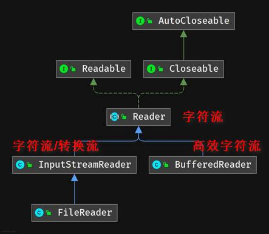
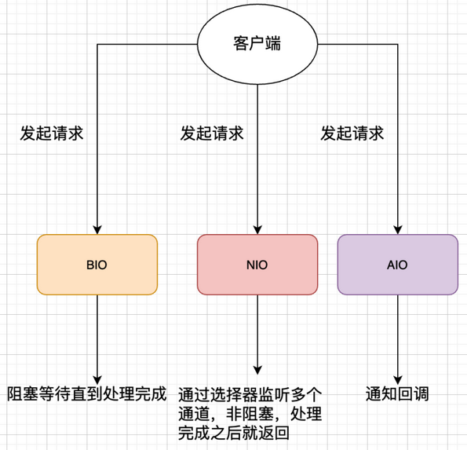

## 1. IO 流

### 1.1. 数据在计算机的表现形式

所有数据(视频、音频、图片、文本文件)在计算机中都是由0和1组成。计算机只能识别0和1；

数据在计算机的表现形式就是：**二进制数据**。在数据传输过程中，一切数据(文本、图像、声音等)最终存储的均为一个个字节，即二进制数字。所以数据传输过程中使用二进制数据可以完成任意数据的传递，<font color=red>**任何数据在传输过程中都是以0和1格式传输**</font>。

向一个文件中存储一定的数据(一些数字)，如果使用文本方式打开，则会以文本的方式解释数据。如果以视频的方式打开，则会以视频的方式解释数据。音频、可行执行文件等亦是如此。所以，在文件传输过程中，要时刻明确，传输的始终为二进制数据。

### 1.2. IO 概念

IO 操作，是指输入和输出操作。

- Input(输入操作)：数据从文件到程序的过程。
- Output(输出操作)：数据从程序到文件的过程。

输入输出的参照物：java 程序

当使用集合持有数据时，这些数据都存在于内存中，一旦程序运行结束，这些数据将会从内存中清除，下次再想使用这些数据，已经没有了。

果希望将运算永久地保存下来，可以使用 IO，将这些数据持久化存储起来。要把数据持久化存储就需要把内存中的数据存储到内存以外的其他持久化设备(硬盘、光盘、U 盘等)上。此时需要数据的输入(in)输出(out)。数据输入输出相关的类均在 io 包下。

### 1.3. IO 流的概念

1. 将数据写到文件中，实现数据永久化存储
2. 读取文件中已经存在的数据

按流向可分为两种：输入流（I），输出流（O）。

- I 表示 Intput，是数据从硬盘进内存的过程，称之为读。
- O 表示 Output，是数据从内存到硬盘的过程。称之为写。

### 1.4. IO 模型分类

#### 1.4.1. 阻塞 IO 模型（Blocking IO）

最传统的一种 IO 模型，即在读写数据过程中用户线程会发生阻塞现象。

当用户线程发出 IO 请求之后，内核会去查看数据是否就绪，如果没有就绪就会等待数据就绪，而用户线程就会处于阻塞状态，用户线程交出 CPU。当数据就绪之后，内核会将数据拷贝到用户线程，并返回结果给用户线程，用户线程才解除 block 状态。典型的阻塞 IO 模型的例子为：`data = socket.read();`，如果数据没有就绪，就会一直阻塞在 `read` 方法处。


> 在客户端连接数量不高的情况下，性能上是没问题的。但是当面对十万甚至百万级连接的时候，传统的 BIO 模型就会突显性能上的缺陷。

#### 1.4.2. 非阻塞 IO 模型（Nonblocking IO）

在非阻塞 I/O 模型中，当用户线程发起一个 read 操作后，并不需要等待，而是马上就得到了一个结果。如果结果是一个 error 时，它就知道数据还没有准备好，于是它可以再次发送 read 操作。期间用户线程会继续不断重试直到数据准备好为止。一旦内核中的数据准备好了，并且又再次收到了用户线程的请求，那么它马上就将数据拷贝到了用户线程，然后返回。


所以事实上，在非阻塞 IO 模型中，用户线程需要不断地询问内核数据是否就绪，也就说非阻塞 IO 不会交出 CPU，但会一直占用 CPU。典型的非阻塞 IO 模型实现一般如下：

```java
while (true) {
    data = socket.read();
    if (data != error) {
        // 处理数据
        break;
    }
}
```

因此，非阻塞 IO 有一个非常严重的缺点，在 while 循环中需要不断地去询问内核数据是否就绪，这样会导致 CPU 占用率非常高，因此一般情况下很少使用 while 循环这种方式来读取数据。

非阻塞 IO 可以一个线程处理多个流事件，只要不停地询所有流事件即可。当然这种方式也不好，当大多数流没数据时，也是会大量浪费 CPU 资源。为了避免 CPU 空转，引进代理(select 和 poll，两种方式相差不大)，代理可以观察多个流 I/O 事件，空闲时会把当前线程阻塞掉，当有一个或多个 I/O 事件时，就从阻塞态醒过来，把所有 IO 流都轮询一遍，于是没有 IO 事件时程序就阻塞在 select 方法处，即便这样依然存在问题，但从 select 处只是知道是否有 IO 事件发生，却不知道是哪几个流，还是只能轮询所有流，epoll 这样的代理就可以把哪个流发生怎样的 IO 事件通知用户线程。

#### 1.4.3. 多路复用 IO 模型（IO multiplexing）

多路复用 IO 模型是目前使用得比较多的模型。**Java NIO 实际上就是多路复用 IO 模型**。

在 Java NIO 中，是通过 `selector.select()` 去查询每个通道是否有到达事件，如果没有事件，则一直阻塞在那里，因此这种方式会导致用户线程的阻塞。在多路复用 IO 模型中，会有一个线程不断去轮询多个 socket 的状态，只有当 socket 真正有读写事件时，才真正调用实际的 IO 读写操作。


因此**IO 多路复用的特点是：通过一种机制一个进程能同时等待多个文件描述符，而这些文件描述符(套接字描述符)其中任意一个进入就绪状态，select 函数就可以返回**。

在多路复用 IO 模型中，只需要使用一个线程就可以管理多个 socket，系统不需要建立新的进程或者线程，也不必维护这些线程和进程，并且只有在真正有 socket 读写事件进行时，才会使用 IO 资源，所以它大大减少了资源占用。因此，多路复用 IO 比较适合连接数比较多的情况。

另外多路复用 IO 之所以比非阻塞 IO 模型的效率高，是因为在非阻塞 IO 中，不断地询问 socket 状态时通过用户线程去进行；而在多路复用 IO 中，轮询每个 socket 状态是内核在进行的，这个效率要比用户线程要高的多。

不过要注意的是，多路复用 IO 模型是通过轮询的方式来检测是否有事件到达，并且对到达的事件逐一进行响应。因此对于多路复用 IO 模型来说，一旦事件响应体很大，那么就会导致后续的事件迟迟得不到处理，并且会影响新的事件轮询。

> 目前支持 IO 多路复用的系统调用，有 select，epoll 等等。select 系统调用，目前几乎在所有的操作系统上都有支持。
>
> - **select 调用**：内核提供的系统调用，它支持一次查询多个系统调用的可用状态。几乎所有的操作系统都支持。
> - **epoll 调用**：linux 2.6 内核，属于 select 调用的增强版本，优化了 IO 的执行效率。

#### 1.4.4. 信号驱动 IO 模型

在信号驱动 IO 模型中，当用户线程发起一个 IO 请求操作，会给对应的 socket 注册一个信号函数，然后用户线程会继续执行；当内核数据就绪时会发送一个信号给用户线程，用户线程接收到信号之后，便在信号函数中调用 IO 读写操作来进行实际的 IO 请求操作。


**信号驱动 IO 模型的特点是：等待数据报到达期间进程不被阻塞。主循环可以继续执行，只要等待来自信号处理函数的通知。既可以是数据已准备好被处理，也可以是数据报已准备好被读取**。

#### 1.4.5. 异步 IO 模型（asynchronous IO）

异步 IO 模型是最理想的 IO 模型，在异步 IO 模型中，当用户线程发起 read 操作之后，立刻就可以开始去做其它的事。而另一方面，从内核的角度，当它受到一个 asynchronous read 之后，它会立刻返回，说明 read 请求已经成功发起了，因此不会对用户线程产生任何 block。然后，内核会等待数据准备完成，再将数据拷贝到用户线程，当这一切都完成之后，内核会给用户线程发送一个信号，告诉它 read 操作完成了。也就说用户线程完全不需要实际的整个 IO 操作是如何进行的，只需要先发起一个请求，当接收内核返回的成功信号时表示 IO 操作已经完成，可以直接去使用数据了。


在异步 IO 模型中，IO 操作的两个阶段都不会阻塞用户线程，这两个阶段都是由内核自动完成，然后发送一个信号告知用户线程操作已完成。用户线程中不需要再次调用 IO 函数进行具体的读写。这点是和信号驱动模型有所不同的，在信号驱动模型中，当用户线程接收到信号表示数据已经就绪，然后需要用户线程调用 IO 函数进行实际的读写操作；而在异步 IO 模型中，收到信号表示 IO 操作已经完成，不需要再在用户线程中调用 IO 函数进行实际的读写操作。

> Tips: 异步 IO 是需要操作系统的底层支持，在 Java 7 中，提供了 Asynchronous IO。

## 2. File 类

### 2.1. File 简述

`File` 类：文件和目录路径名的抽象表示形式。即，Java 中把文件或者目录（文件夹）都封装成 `File` 对象。

可以用来操作硬盘上的文件或文件夹。也就是说如果要去操作硬盘上的文件，或者文件夹只要找到 `File` 这个类即可。

- 文件可以持久化地存储数据
- `File` 的一个对象就代表一个文件或文件夹(自己简单地定义，方便记忆的说法)
- 文档上说明 `File` 类代表文件或文件夹路径，但是我们可以通过路径找到对应的文件或文件夹。
- 可以认为 `File` 类就代表文件或文件夹(通过路径找到)

### 2.2. 相对路径与绝对路径

**绝对路径**

- 以盘符开始到文件的全路径
- 在整个系统中，<font color=red>**具有唯一性**</font>

**相对路径**

- 从某个参照目录开始到指定文件所经过的路径
- 在整个系统中，<font color=red>**不具有唯一性**</font>
- 相对路径一般是在 Eclipse 中的某个项目当中创建一个文件夹(目录)开始。如 a.txt 相对于 myIO 项目根目录经过了 `a/b/a.txt`，则 `a/b/a.txt` 就是该文件的相对路径

### 2.3. File 类的使用

#### 2.3.1. 成员变量

- 与系统有关的路径分隔符，window是“`;`”，mac与lunix是“`:`”

```java
public static final String pathSeparator
```

- 与系统有关的默认名称分隔符(目录分隔符)，跨平台的。window是“`\`”，mac与lunix是“`/`”。应该是需要跨平台，所以不能直接将分隔符写成一种类型。目前JDK版本已经可以自动识别。

```java
public static final String separator
```

> 注：静态成员变量，直接用`file.成员变量名`使用

#### 2.3.2. 构造方法

```java
public File(String pathname)
```

- 根据文件或文件夹路径字符串创建文件对象，通过路径找到对应的文件或文件夹
- > API描述：通过将给定路径名字符串转换为抽象路径名来创建一个新 `File` 实例。如果给定字符串是空字符串，那么结果是空抽象路径名。
- 例：`File f = new File("E:\\documents\\aaa.txt");`

```java
public File(String parent, String child);
```

- parent 指的是父级目录路径字符串，child 指的是子级目录（子级文件）路径字符串。根据父文件夹路径和子文件夹（子文件）路径创建文件对象。
- 例：`File f = new File("E:\\documents\\", "aaa.txt");`

```java
public File(File parent, String child);
```

- parent 为 File 类型，为了使用 `File` 类中的方法
- 例：`File f = new File(new File("E:\\documents\\"), "aaa.txt");`

<font color=red>**注意：File的构造方法不会去判断路径是否存在，需要自己去调用方法处理**</font>

#### 2.3.3. 文件创建

```java
public boolean createNewFile() throws IOException;
```

根据构造方法指定的路径创建文件，如果文件已经存在，则什么不做。如果文件不存在，则创建文件。

<font color=red>**只能用来创建文件，不能创建文件夹**</font>。在创建文件时，如果文件所在的文件夹不存在，则报错系统找不到指定的路径。<font color=red>**创建文件时，必须确保文件夹已经存在**</font>。

#### 2.3.4. 文件夹创建

```java
public boolean mkdir();
```

- 根据路径字符串创建文件夹（<font color=red>**单级目录，下面不能再创建新的目录**</font>）
- 如果文件夹存在，则什么不做；如果文件夹不存在，则创建。创建成功返回`true`，否则返回`false`
- 需要注意：<font color=red>**只能用来创建文件夹，不能创建文件**</font>
- 使用`mkdir`方法创建文件夹时，必须保证其所在文件夹已经存在，否则创建失败(不会报错)

```java
public boolean mkdirs();
```

- 一次性创建多级文件夹（最常用）。如果父文件夹不存在，则会先创建父文件夹。
- 创建成功返回`true`，否则返回`false`
- 需要注意：<font color=red>**只能用来创建文件夹，不能创建文件**</font>

#### 2.3.5. 文件/文件夹删除

```java
public boolean delete();
```

删除此抽象路径名表示的文件或目录。如果删除成功返回`true`；如果不成功则返回`false`。

- `File`对象是文件：直接删除文件(<font color=red>**Java 删除时，不会使用 windows 的回收站**</font>)
- `File`对象是文件夹：只删定义路径中最后一个文件夹且只能删除空文件夹，如果不是空文件夹，即不能删除。

#### 2.3.6. 获取文件/文件夹信息

```java
public long length()
```

- 获得文件大小，单位：字符。<font color=red>**只能是文件，不能是文件夹**</font>。
- > API: 返回由此抽象路径名表示的文件的长度（单位：字符）。如果此路径名表示一个目录，则返回值是不确定的(<font color=red>**垃圾值**</font>)。

```java
public String getName();
```

- 获取文件/文件夹的名称
- > API: 返回由此抽象路径名表示的文件或目录的名称。该名称是路径名名称序列中的最后一个名称。如果路径名名称序列为空，则返回空字符串。

```java
public String getAbsolutePath();
```

- 获取绝对路径字符串，返回此抽象路径名的绝对路径名字符串。

```java
public File getAbsoluteFile()
```

- 获取绝对路径的对象
- > API: 返回此抽象路径名的绝对路径名形式。等同于`new File(this.getAbsolutePath())`。

```java
public String getParent();
```

- 获得上一级文件路径字符串；
- > API: 返回所在文件夹路径(根据创建对象时是否为绝对路径/相对路径)

```java
public File getParentFile()
```

- 获得上一级文件路径对象；（<font color=blue>**应该是用于返回上一级目录再继续进行其他操作**</font>）
- > API: 返回此抽象路径名父目录的抽象路径名；如果此路径名没有指定父目录，则返回 null。

```java
public String getPath();
```

- 获取路径(用什么方式创建的对象,就返回什么方式的路径(绝对路径/相对路径))
- > API: 将此抽象路径名转换为一个路径名字符串。所得字符串使用默认名称分隔符分隔名称序列中的名称。

获取文件/文件夹信息示例代码：

```java
/*
 * 获取 E 盘 aaa 文件夹中 b.txt 文件的文件名，文件大小，文件的绝对路径和父路径等信息，
 * 	并将信息输出在控制台。
 */
@Test
public void testGetFileInfo() {
    // 获取 E 盘 aaa 文件夹中 b.txt对象
    File file = new File("e:\\aaa\\b.txt");
    // 判断对象是否文件
    System.out.println("对象是否为文件：" + file.isFile());
    // 获取文件的大小,单位：字节
    System.out.println("对象文件的大小 ：" + file.length());
    // 获取文件名
    System.out.println("对象文件的名称：" + file.getName());
    // 获取文件的绝对路径
    System.out.println("对象的绝对路径是：" + file.getAbsolutePath());
    // 获取父路径信息
    System.out.println("对象的父路径是：" + file.getParent());
    // 获取路径
    System.out.println("对象的路径是(用什么方式创建的对象,就返回什么方式的路径)：" + file.getPath());

    File file2 = new File("qq.txt");
    // 获取这个相对路径的对象的绝对路径
    System.out.println("相对路径对象的绝对路径是：" + file2.getAbsolutePath());
}
```

输出结果

```
对象是否为文件：true
对象文件的大小 ：44
对象文件的名称：b.txt
对象的绝对路径是：e:\aaa\b.txt
对象的父路径是：e:\aaa
对象的路径是(用什么方式创建的对象,就返回什么方式的路径)：e:\aaa\b.txt
相对路径对象的绝对路径是：D:\code\java-technology-stack\java-basic-api\qq.txt
```

#### 2.3.7. 判断文件/文件夹

此部分的API是用于判断该 `File` 对象是否存在或者判断该 `File` 对象代表一个文件还是代表一个文件夹

```java
public boolean exists();
```

- 判断文件/文件夹是否存在。存在则返回`true`，否则返回`false`

```java
public boolean isDirectory();
```

- 判断`File`对象是否为文件夹，是文件夹则则返回`true`，否则返回`false`

```java
public boolean isFile();
```

- 判断File对象是否为文件，是文件则返回`true`，否则返回`false`

#### 2.3.8. 获取文件/文件夹列表（重点）

需要注意：<font color=red>**File 对象必须是文件夹**</font>

```java
public String[] list()
```

- 获得当前文件夹对象下所有文件（子文件和子文件夹），返回字符串数组。
- > API: 返回一个字符串数组，这些字符串指定此抽象路径名表示的目录中的文件和目录。

```java
public File[] listFiles();
```

- 获得当前文件夹对象下所有文件（子文件和子文件夹），返回 `File` 对象数组。
- > API: 返回一个抽象路径名数组，这些路径名表示此抽象路径名表示的目录中的文件。

<font color=red>**注意：如果是`File`对象是文件，则返回去的数组为`null`。所以在使用List获取方法前，需要判断`File`对象是否是文件夹。**</font>

示例代码：

```java
@Test
public void testGetFileList() {
    // 创建文件夹对象
    File file = new File("E:\\00-Downloads\\test\\");
    String[] list = file.list();
    // 输出该文件夹里的文件列表
    System.out.println(Arrays.toString(list));

    // 创建文件对象（非文件夹）
    File file2 = new File("E:\\00-Downloads\\a.txt");
    String[] list2 = file2.list();
    // 输出null
    System.out.println(Arrays.toString(list2));
}
```

输出结果：

```
[a - 副本 (2).txt, a - 副本 (3).txt, a - 副本 (4).txt, a - 副本 (5).txt, a - 副本.txt, a.txt]
null
```

### 2.4. File 类基础应用案例

#### 2.4.1. 读取指定文件夹下的所有文件（多个文件夹）

```java
import java.io.File;

public class MoonZero {
	public static void main(String[] args) {
		// 创建文件夹对象
		File file = new File("E:\\temp");
		// 调用读取所有文件的方法
		printAllFile(file);
	}

	// 创建读取当前文件夹下的的有文件递归方法
	public static void printAllFile(File file) {
		// 获取当前文件夹下所有文件的list对象数组
		File[] list = file.listFiles();
		// 利用增强for遍历File对象数组
		for (File f : list) {
			// 再判断是否是文件，如果是文件，直接输出（递归的出口）
			if (f.isFile()) {
				// 直接输出对像是绝对路径，是因为File重写了toString方法
				System.out.println(f);
			} else {
				// 不是文件，则就是文件夹，就进行递归，继续执行。
				printAllFile(f);
			}
		}
	}
}
```

#### 2.4.2. 统计指定文件夹所有文件的大小总和（文件夹下有多个文件夹）

```java
package day10;

import java.io.File;
import java.util.ArrayList;
import java.util.Iterator;
import java.util.Scanner;

/*
 * 关卡2训练案例2
 * 	键盘录入一个文件路径，根据文件路径创建文件对象，判断是文件还是文件夹
 * 	如果是文件，则输出文件的大小
 * 	如果是文件夹则计算该文件夹下所有文件大小之和并输出(不包含子文件夹)。
 */
public class Test2_02 {
	public static void main(String[] args) {
		Scanner input = new Scanner(System.in);
		System.out.println("请录入一个文件路径：");
		File file = new File(input.nextLine());
		// 判断是文件还是文件夹
		if (file.isFile()) {
			System.out.println("输入的文件路径是文件！");
			System.out.println("\"" + file.getName() + "\"的大小是：" + file.length());
		} else {
			System.out.println("输入的文件路径是文件夹！");
			System.out.println("输入的文件夹里的所有文件清单：");
			// 增加将子文件夹都算进去，调用递归方法来统计所有文件的大小
			// 创建一个新的集合，用来存放递归所有文件的File对像。
			ArrayList<File> array = new ArrayList<File>();
			findAllFile(file, array);
			// 将递归接收所有的文件的集合再使用迭代器遍历
			Iterator<File> it = array.iterator();
			// 定义一个long变量用来统计所有文件的大小
			long sum = 0;
			while (it.hasNext()) {
				File f = it.next();
				System.out.println(f.getName());
				sum += f.length();
			}
			System.out.println("文件夹中的所有文件的大小之和是：" + sum);
		}
		input.close();
	}

	public static void findAllFile(File file, ArrayList<File> array) {
		// 使用listFiles方法，获取File对象数组。
		File[] fileArr = file.listFiles();
		for (File f : fileArr) {
			// 判断，如果是文件，直接输出统计大小，如果是文件夹，再进行递归遍历
			if (f.isFile()) {
				array.add(f);
			} else {
				findAllFile(f, array);
			}
		}
	}
}
```

#### 2.4.3. 删除指定文件夹下的所有文件（多个文件夹）

```java
package day10;

import java.io.File;
import java.util.Scanner;

/*
 * 关卡3训练案例2
 * 	键盘录入一个文件夹路径，删除该路径下的文件夹。
 * 	要求：文件夹中包含有子文件夹
 */
public class Test3_02 {
	public static void main(String[] args) {
		// 创建键盘录入对象
		Scanner input = new Scanner(System.in);
		System.out.println("请输入一个文件夹路径：");
		File file = new File(input.nextLine());
		// 调用递归方法，对当前文件夹进行删除操作。
		deleteFile(file);
		input.close();
	}

	public static void deleteFile(File file) {
		// 获取file对象数组
		File[] list = file.listFiles();
		// 遍历数组
		for (File f : list) {
			// 进行判断是否为文件，如果文件直接删除
			if (f.isFile()) {
				// 将文件删除后才能将文件夹删除
				f.delete();
			} else {
				// 如果是文件夹，再递归，然后里面的文件都删除。
				deleteFile(f);
			}
		}
		// 再对文件夹进行删除，上一步递归后，已经将里面的文件夹和文件都删除
		file.delete();
	}
}
```

## 3. FileFilter 文件过滤器(难点、重点)

### 3.1. FileFilter 概述

`FileFilter` 过滤器是一个函数式接口，用于抽象路径名的过滤器。使用时候要创建一个接口的实现类。**（通常使用匿名内部类或者lambda表达式来完成，因为一般该接口只适用于本次的过滤需求，没有广泛的适用性。）**

```java
@FunctionalInterface
public interface FileFilter {

    /**
     * Tests whether or not the specified abstract pathname should be
     * included in a pathname list.
     *
     * @param  pathname  The abstract pathname to be tested
     * @return  <code>true</code> if and only if <code>pathname</code>
     *          should be included
     */
    boolean accept(File pathname);
}
```

`FileFilter` 接口的唯一方法`accept`，作用是测试指定抽象路径名是否应该包含在某个路径名列表中。

### 3.2. 接口的调用时机

每当遍历获得一个子文件或子文件夹时，系统内部会创建一个文件对象，然后将该文件对象作为参数调用，文件过滤的`accept`方法，由`accept`的返回值决定该文件是否要过滤。<font color=red>**返回`false`表示过滤该文件，`ture`则不过滤**</font>。

### 3.3. File 类使用过滤器的方法

根据指定文件过滤器获得当前文件夹下的过滤后的所有文件的`File`对象数组

```java
public File[] listFiles(FileFilter filter)
```

> API: 返回抽象路径名数组，这些路径名表示此抽象路径名表示的目录中满足指定过滤器的文件和目录。除了返回数组中的路径名必须满足过滤器外，此方法的行为与 `listFiles()` 方法相同。如果给定 `filter` 为 `null`，则接受所有路径名。否则，当且仅当在路径名上调用过滤器的` FileFilter.accept(java.io.File)` 方法返回 `true` 时，该路径名才满足过滤器。

### 3.4. 文件过滤器的使用步骤与示例

1.	定义一个类实现`FileFilter`接口**（通常使用匿名内部类或者lambda表达式来完成）**
2.	重写`accept`方法,满足条件的返回`true`,不满足条件的返回`false`
3.	创建`FileFilter`接口的实现类对象
4.	`file.listFiles()`方法参数中传入过滤器

使用文件过滤器示例:

```java
import java.io.File;
import java.io.FileFilter;

/*
 * 需求：只输出文件夹中所有的.pptx文件
 */
public class MoonZero {
	public static void main(String[] args) {
		// 创建文件夹对象
		File file = new File("E:\\temp");
		// 调用读取所有文件的方法
		printAllFile(file);
	}

	// 创建读取当前文件夹下的的有文件递归方法
	public static void printAllFile(File file) {
		// 创建FileFilter接口的实现类对象
		FileFilterDemo ff = new FileFilterDemo();
		// 使用File[] listFiles(FileFilter filter)方法，获取过滤后的File对象数组
		File[] list = file.listFiles(ff);
		// 利用增强for遍历File对象数组
		for (File f : list) {
			// 再判断是否是文件，如果是文件，直接输出（递归的出口）
			if (f.isFile()) {
				// 直接输出对像是绝对路径，是因为File重写了toString方法
				System.out.println(f);
			} else {
				// 不是文件，则就是文件夹，就进行递归，继续执行。
				printAllFile(f);
			}
		}
	}
}

// 定义一个类实现FileFilter接口
class FileFilterDemo implements FileFilter {
	// 重写过滤器 FileFilter的accept抽象方法，
	// 根据需求定义过滤的条件
	@Override
	public boolean accept(File pathname) {
		// 要先判断传入的File对象是文件还是文件夹
		// 如果是文件夹则直接不过滤，如果是文件，则进行判断过滤。
		if (pathname.isDirectory()) {
			return true;
		} else {
			return pathname.getName().endsWith(".pptx");
		}
		// 另一种简单写法
		// return (pathname.isDirectory()) || (pathname.getName().endsWith(".pptx"));
	}
}
```

使用文件过滤器示例2:(使用匿名内部类)

```java
import java.io.File;
import java.io.FileFilter;

/*
 * 需求：只输出文件夹中所有的.pptx文件
 */
public class MoonZero {
	public static void main(String[] args) {
		// 创建文件夹对象
		File file = new File("E:\\temp");
		// 调用读取所有文件的方法
		printAllFile(file);
	}

	// 创建读取当前文件夹下的的有文件递归方法
	public static void printAllFile(File file) {
		// 使用File[] listFiles(FileFilter filter)方法，获取过滤后的File对象数组
		File[] list = file.listFiles(new FileFilter() {
			// 创建FileFilter接口的匿名内部类，直接重写accept抽象方法
			@Override
			public boolean accept(File pathname) {
				// 要先判断传入的File对象是文件还是文件夹
				// 如果是文件夹则直接不过滤，如果是文件，则进行判断过滤。
				return (pathname.isDirectory()) || (pathname.getName().endsWith(".pptx"));
			}
		});
		// 利用增强for遍历File对象数组
		for (File f : list) {
			// 再判断是否是文件，如果是文件，直接输出（递归的出口）
			if (f.isFile()) {
				// 直接输出对像是绝对路径，是因为File重写了toString方法
				System.out.println(f);
			} else {
				// 不是文件，则就是文件夹，就进行递归，继续执行。
				printAllFile(f);
			}
		}
	}
}
```

## 4. 字符流

### 4.1. 字符流概述

IO 流用来处理设备之间的数据传输。Java 对数据的操作是通过流的方式，用于操作流的类都在 IO 包中。

在 IO 开发过程中，传输最频繁的数据为字符，而以字节方式传输字符需要每次将字符串转换成字节再处理，而且也丧失了程序员对数据内容的判断。所以，为了方便对字符进行操作，Java 提供了专门以字符作为操作单位的类——『字符流』，但其底层仍然为字节流。

> 注意：<font color=red>**字符流只能操作字符，无法操作其他数据，如声音、视频等**</font>。

### 4.2. FileWriter 输出字符流

`FileWriter` 输出字符流在 `java.io` 包中，用于写数据，属于输出流。

```java
public class FileWriter extends OutputStreamWriter
```

#### 4.2.1. FileWriter 向文件中写数据操作步骤

1. 使用 FileWriter 流关联文件
2. 利用 FileWriter 的写方法写数据
3. 利用 FileWriter 的刷新方法将数据从内存刷到硬盘上
4. 利用 FileWriter 的关流方法将释放占用的系统底层资源

#### 4.2.2. 构造方法

创建输出流对象时，做了哪些事情:

1. 调用系统资源创建了一个文件
2. 创建输出流对象
3. 把输出流对象指向文件


```java
public FileWriter(String fileName) throws IOException
```

- 传入一个文件的路径和名称创建输出流，此类输出流**无法追加写入**。如：`FileWriter fw = new FileWriter("d:\\a.txt")`

```java
public FileWriter(String fileName, boolean append) throws IOException
```

- 传入一个文件的路径和名称创建输出流，根据 append 参数判断是否可追加写入数据。true 表示可以追加写入。默认是 false 无追加。

```java
public FileWriter(File file) throws IOException
```

- 根据给定的 File 对象构造一个 FileWriter 对象。

```java
 public FileWriter(File file, boolean append) throws IOException
```

- 根据给定的 File 对象构造一个 FileWriter 对象。并且可以通过 append 参数指定是否追加写入。

#### 4.2.3. 常用方法

> Notes: 以下 5 种 write 写数据方法，均调用输出流对象的写数据的方法，向文件对象写入数据，但数据没有直接写到文件，只是写到了内存缓冲区。

```java
public void write(String str) throws IOException
```

- 向文件写入一个字符串数据。

```java
public void write(String str, int off, int len) throws IOException
```

- 向文件写入指定字符串中的一部分数据。
    - str：待写入的字符串数据
    - off：指定待写入的字符串开始截取的位置索引
    - len：写入的长度（注意不是索引）

```java
public void write(int c) throws IOException
```

- 写入一个字符数据，这里写 int 类型的好处是既可以写 char类 型的数据，也可以写 char 对应的 int 类型的值。如 `'a'` 就是 97

```java
public void write(char cbuf[]) throws IOException 
```

- 写入一个字符数组数据。继承自 `Writer` 类的方法

```java
public void write(char cbuf[], int off, int len) throws IOException
```

- 写入一个字符数组的一部分数据
    - cbuf[]：待写入的字符数组
    - off：指定待写入的字符数组开始截取的位置索引
    - len：写入的长度（注意不是索引）

```java
public void flush() throws IOException
```

- 将内存中的数据刷新到文件中

```java
public void close() throws IOException
```

- 通知系统释放和该文件相关的资源关闭流，释放系统底层资源。

#### 4.2.4. close() 和 flush() 方法的区别

- flush(): 刷新缓冲区。流对象还可以继续使用。
- close(): 先刷新缓冲区，然后通知系统释放资源。流对象不可以再被使用了。

### 4.3. FileReader 输入字符流

`FileReader` 输出字符流在 `java.io` 包中，从文件中读数据，属于输入流。

```java
public class FileReader extends InputStreamReader
```

#### 4.3.1. 输入流读文件的步骤

1. 创建输入流对象
2. 调用输入流对象的读数据方法
3. 释放资源

#### 4.3.2. 构造方法

```java
public FileReader(String fileName) throws FileNotFoundException
```

- 根据传递文件名称，创建文件输入流

```java
public FileReader(File file) throws FileNotFoundException
```

- 在给定从中读取数据的 File 的情况下创建一个新 FileReader。

#### 4.3.3. 常用方法

```java
public int read() throws IOException
```

- 一次读取一个字符，如果读取数据的返回值是-1的时候，就说明没有可读取的数据了。

```java
public int read(char cbuf[]) throws IOException
```

- 一次读取一个字符数组的数据并保存到 cbuf 数组中，返回的是实际读取的字符个数

#### 4.3.4. 读数据方式1：一次读取一个字符

调用输入流对象的读数据方法，一次读取一个字符。循环去就读取文件的数据，通过测试，如果读取数据的返回值是-1的时候，就说明没有数据了，这也作为循环的结束条件。读取出来的是字符的 ASCII 码，所以需要(char)强转。

```java
FileReader fr = new FileReader("C:\\a.txt");
// 定义 ch 变量，是实际读取的数据，也是当返回-1的时候代表没有可读取数据
int ch;
while ((ch = fr.read()) != -1) {
    // 额外内容
    // Thread.sleep(100); // 这个可以减缓读取的速度
    System.out.print((char) ch); // 示例打印输出是不换行的字符，不要输出"ln"换行。因为如果文档有换行的话，一样可以读取到换行的信息
}
```

#### 4.3.5. 读数据方式2：一次读取一个字符数组

调用输入流对象的读数据方法，一次读取一个字符数组，通常读取的字符数量为1024及其整数倍

```java
FileReader fr = new FileReader("C:\\a.txt");
// 1.初始化读取的字符数数组，一般可以是1024及其整数倍
char[] chs = new char[1024];
// 定义 len 变量，是实际读取的数据数量，也是当返回-1的时候代表没有可读取数据
int len;
while ((len = fr.read(chs)) != -1) {
    System.out.print(new String(chs, 0, len)); // 如果文档有换行的话，一样可以读取到换行的信息
}
```

#### 4.3.6. read() 和 read(char cbuf[]) 的区别

如果文件中的数据是"a"，两种方法区别如下：

- `int len = fr.read();`，结果是 `len = 97`，数据保存在 len 中
- `int len = fr.read(arr);`，结果是 `len = 1`，代表的是只读一个数据，实际的数据是保存在 arr 数组中。

### 4.4. BufferedWriter / BufferedReader（缓冲字符流）

#### 4.4.1. BufferedWriter

`BufferedWriter` 带缓冲的输出字符流在 `java.io` 包中，是文本写入字符输出流，缓冲各个字符，从而提供单个字符、数组和字符串的高效写入。

```java
public class BufferedWriter extends Writer
```

> Tips: <font color=red>**缓冲流一样是用基本流的方法，只是创建对象的比较麻烦，但缓冲流的效率会比较高，一般都是使用缓冲流。**</font>

##### 4.4.1.1. 构造方法

```java
public BufferedWriter(Writer out)
```

- 创建一个使用默认大小输出缓冲区的缓冲字符输出流。

`BufferedWriter` 用法与 `FileWriter` 是一样的，只是创建对象的时候不一样。

```java
BufferedWriter bw = new BufferedWriter(new FileWriter("xxx.txt"));   
```

##### 4.4.1.2. 特有方法

```java
public void newLine() throws IOException
```

- 写一个换行符，此换行符由系统决定，不同的操作系统使用的换行符不同。

#### 4.4.2. BufferedReader

`BufferedReader` 带缓冲的输出字符流在 `java.io` 包中，从字符输入流中读取文本，缓冲各个字符，从而实现字符、数组和行的高效读取。

```java
public class BufferedReader extends Reader 
```

##### 4.4.2.1. 构造方法

```java
public BufferedReader(Reader in)
```

- 创建一个使用默认大小输入缓冲区的缓冲字符输入流。

`BufferedReader` 用法与 `FileReader` 是一样的，但创建对象的时候不一样。

```java
BufferedReader br = new BufferedReader(new FileReader("xxx.txt"));
```

##### 4.4.2.2. 特有方法

```java
public String readLine() throws IOException
```

- 一次读取一行数据，但是不读取换行符。基础使用示例如下：

```java
BufferedReader br = new BufferedReader(new FileReader("xxx.txt"));
String line;
// 将 br.readLine() 方法返回是 null，说明已经无数据可读取
while ((line = br.readLine()) != null) {
    // readLine是不读取换行符的，所以示例打印加“ln”
    System.out.println(line);
}
```

### 4.5. IO 字符流复制文本文件5种实现方式示例

```java
package com.moon;

import java.io.BufferedReader;
import java.io.BufferedWriter;
import java.io.FileReader;
import java.io.FileWriter;
import java.io.IOException;

/*
 * 复制文本文件(5种方式)
 */
public class CopyFileTest {

	public static void main(String[] args) throws IOException {
		String srcFileName = "FileWriterDemo.java";
		String destFileName = "Copy.java";
		
//		method1(srcFileName,destFileName);
//		method2(srcFileName,destFileName);
		method3(srcFileName,destFileName);
//		method4(srcFileName,destFileName);
//		method5(srcFileName,destFileName);
	}
	
	//缓冲流一次读写一行字符串
	public static void method5(String srcFileName,String destFileName) throws IOException {
		//创建输入缓冲流对象
		BufferedReader br = new BufferedReader(new FileReader(srcFileName));
		//创建输出缓冲流对象
		BufferedWriter bw = new BufferedWriter(new FileWriter(destFileName));
		
		//一次读写一个字符串
		String line;
		while((line=br.readLine())!=null){
			bw.write(line);
			bw.newLine();
			bw.flush();
		}
		
		//释放资源
		bw.close();
		br.close();
	}
	
	//缓冲流一次读写一个字符数组
	public static void method4(String srcFileName,String destFileName) throws IOException {
		//创建输入缓冲流对象
		BufferedReader br = new BufferedReader(new FileReader(srcFileName));
		//创建输出缓冲流对象
		BufferedWriter bw = new BufferedWriter(new FileWriter(destFileName));
		
		//一次读写一个字符数组
		char[] chs = new char[1024];
		int len;
		while((len=br.read(chs))!=-1) {
			bw.write(chs,0,len);
		}
		
		//释放资源
		bw.close();
		br.close();
	}
	
	//缓冲流一次读写一个字符
	public static void method3(String srcFileName,String destFileName) throws IOException {
		//创建输入缓冲流对象
		BufferedReader br = new BufferedReader(new FileReader(srcFileName));
		//创建输出缓冲流对象
		BufferedWriter bw = new BufferedWriter(new FileWriter(destFileName));
		
		//一次读写一个字符
		int ch;
		while((ch=br.read())!=-1) {
			bw.write(ch);
		}
		
		//释放资源
		bw.close();
		br.close();
	}
	
	//基本流一次读写一个字符数组
	public static void method2(String srcFileName,String destFileName) throws IOException {
		//创建输入流对象
		FileReader fr = new FileReader(srcFileName);
		//创建输出流对象
		FileWriter fw = new FileWriter(destFileName);
		
		//一次读写一个字符数组
		char[] chs = new char[1024];
		int len;
		while((len=fr.read(chs))!=-1) {
			fw.write(chs,0,len);
		}
		
		//释放资源
		fw.close();
		fr.close();
	}
	
	//基本流一次读写一个字符
	public static void method1(String srcFileName,String destFileName) throws IOException {
		//创建输入流对象
		FileReader fr = new FileReader(srcFileName);
		//创建输出流对象
		FileWriter fw = new FileWriter(destFileName);
		
		//一次读写一个字符
		int ch;
		while((ch=fr.read())!=-1) {
			fw.write(ch);
		}
		
		//释放资源
		fw.close();
		fr.close();
	}
}
```

## 5. 字节流

### 5.1. 字符流存在的问题

字符输入和输出流只能操作文本文件，如果操作的是非文本文件（图片，视频，音频...）就会出现数据丢失的问题。

### 5.2. OutputStream 字节输出流

#### 5.2.1. 概述

```java
public abstract class OutputStream implements Closeable, Flushable
```

`OutputStream` 字节输出流在 `java.io` 包中，是一个抽象类。字节输出流的根类，定义了所有字节输出流应该具备的方法。

此抽象类表示是所有字节输出流类的超类/父类/基类，常用子类有：

- `java.io.FileOutputStream`
- `java.io.BufferedOutputStream`

#### 5.2.2. 常用方法

```java
public abstract void write(int b) throws IOException;
```

- 输出一个字节。如果整数b超出一个字节，也是写入一个字节的内容。

```java
public void write(byte b[]) throws IOException
```

- 输出一个字节数组。如果写入字符串，将字符串转成字节数组。如：`new FileOutputStream("a.txt").write("你好".getByte());`

```java
public void write(byte b[], int off, int len) throws IOException
```

- 输出字节数组的一部分。
    - `byte b[]`：待写出的字节数组
    - `int off`：从字节数组的哪个位置开始
    - `int len`：写出多少个字节

```java
public void close() throws IOException
```

- 关闭流释放资源。释放 IO 占用的 windows 底层资源

#### 5.2.3. 常用子类：FileOutputStream (文件字节输出流)

```java
public class FileOutputStream extends OutputStream
```

`java.io.FileOutputStream` 是 `OutputStream` 的一个常用子类，其构造方法如下：

```java
public FileOutputStream(String name) throws FileNotFoundException
```

- 通过字符串路径创建 `FileOutputStream` 对象。创建一个向具有指定名称的文件中写入数据的输出文件流。默认是以覆盖方式写入内容。

```java
public FileOutputStream(String name, boolean append) throws FileNotFoundException
```

- 通过字符串路径创建 `FileOutputStream` 对象。参数 `append` 为 true 代表每次写入都向文件末尾追加，默认为 false 则每次都以覆盖方式写入。

```java
public FileOutputStream(File file) throws FileNotFoundException
```

- 通过 `File` 对象创建 `FileOutputStream` 对象。默认是以覆盖方式写入内容。

```java
public FileOutputStream(File file, boolean append) throws FileNotFoundException
```

- 通过 `File` 对象创建 `FileOutputStream` 对象。参数 `append` 为 true 代表每次写入都向文件末尾追加，默认为 false 则每次都以覆盖方式写入。

> Notes: <font color=red>**直接 `new FileOutputStream(file)` 创建对象，写入数据，会覆盖原有的文件**</font>。

#### 5.2.4. 字节输出流的使用步骤

1. 创建字节输出流对象并关联目标文件
2. 调用 `write()` 方法写出数据：写一个字节，写一个字节数组，写一个字节数组的一部分。
3. 关闭流释放资源。

#### 5.2.5. 字节输出流注意事项

- 如果文件不存在，则会自动创建该文件。
- 如果不是追加写出，则默认会先将文件内容清空再输出新内容。
- 如果需要给文件追加写出，则在构造方法指定参数 `append` 为 true，实现追加输入的效果。
- 实现内容换行，可以使用 `String` 类的方法，将字符串转成 `byte` 数组，在写完数据后加上`"\r\n"`（这里的换行方式是windows系统）。

```java
FileOutputStream fos = new FileOutputStream("a.txt", true);
// ...写入相关内容后再进行换行，
fos.write("\r\n".getBytes());
```

#### 5.2.6. 异常的处理

1. 假设在 `FileOutputStream fos = new FileOutputStream("c.txt");` 出现异常
2. 使用 try-catch 捕获 `FileNotFoundException` 异常
3. 在 finally 中关流，此时可能会访问不到 fos 变量，因此需要在 try 外面定义 fos
4. 在 finally 要先判断 fos 是否为空，只有 fos 不等于空才需要关流
5. 调用 `fos.close();` 时又有异常，接着再进行 try-catch 捕获 `IOException` 异常
6. 在 try 中调用 `fos.write();` 会有 `IOException`，添加一个新的 catch 分支捕获即可。*其实可以合并成一个 `IOException` 分支即可，分开只是为了更清晰问题*

```java
FileOutputStream fos = null;
try {
    fos = new FileOutputStream("c.txt");
    fos.write("写点东西".getBytes());
} catch (FileNotFoundException e) {
    // do something...
} catch (IOException e) {
    // do something...
} finally {
    try {
        if (fos != null) {
            fos.close();
        }
    } catch (IOException e) {
        // 关闭流失败
    }
}
```

### 5.3. InputStream 字节输入流

#### 5.3.1. 概述

```java
public abstract class InputStream implements Closeable 
```

`InputStream` 字节输入流在 `java.io` 包中，是一个抽象类。字节输入流的根类，定义了所有字节输入流应该具备的方法。

此抽象类表示是所有字节输入流类的超类/父类/基类，常用子类有：

- `java.io.FileInputStream`
- `java.io.BufferedInputStream`

#### 5.3.2. 常用方法

```java
public abstract int read() throws IOException;
```

- 读取一个字节，返回的是字节内容本身，读取到末尾返回 `-1`。

```java
public int read(byte b[]) throws IOException
```

- 将读取到字节输出存储到字节数组b 中，返回实际读取的字节个数。返回 `-1` 表示读到文件末尾。

```java
public int read(byte b[], int off, int len) throws IOException
```

- 将读取到字节输出存储的字节数组b 中，返回实际读取的字节个数
    - `byte b[]`：存储读取的内容字节数组
    - `int off`：从哪个位置开始存储
    - `int len`：存几个字符

```java
public void close() throws IOException
```

- 释放 IO 占用的系统底层资源

#### 5.3.3. 常用子类：FileInputStream (文件字节输入流)

```java
public class FileInputStream extends InputStream
```

`java.io.FileInputStream` 是 `InputStream` 的一个常用子类，用于从文件中读取字节数据。其构造方法如下：

```java
public FileInputStream(String name) throws FileNotFoundException
```

- 通过字符串路径创建 `FileInputStream`

```java
public FileInputStream(File file) throws FileNotFoundException
```

- 通过 `File` 对象创建 `FileInputStream`

#### 5.3.4. 字节输入流的使用步骤

1. 创建字节输入流对象并关联目标文件
2. 调用 `read()` 方法读取数据：读一个字节，读一个字节数组，读一个字节数组的一部分。
3. 关闭流释放资源。

#### 5.3.5. 字节输入流注意事项

- 如果输入流关联的文件不存在，则会抛出异常。

#### 5.3.6. 基础示例

```java
package com.moon;

import java.io.FileInputStream;
import java.io.IOException;

/*
 * 关卡1训练案例5
 * 	利用字节输入流读取 C 盘文件 b.txt 的内容，
 * 	使用循环读取，一次读取一个字节数组，直到读取到文件末尾，
 * 	将读取到的字节数组转换成字符串输出到控制台。
 */
public class Test1_05 {
	public static void main(String[] args) throws IOException {
		// 创建字节输入流对象
        String src = "D:\\b.txt";
        FileInputStream fis = new FileInputStream(src);
        // 定义一个字节数组
        byte[] b = new byte[1024];
        int len;
        while ((len = fis.read(b)) != -1) {
            System.out.print(new String(b, 0, len));
        }
        // 释放资源
        fis.close();
	}
}
```

### 5.4. BufferedOutputStream / BufferedInputStream（字节缓冲流）

#### 5.4.1. 缓冲流高效原理

利用缓冲区临时存储多个数据，统一调用底层资源将数据写入到目标文件中。Java 在常规 IO 流的基础上，提供了更为高效的缓冲流，如下：

- 高效流使用普通流对象作为构造方法参数。将普通流包装，提供高效的装饰。<font color=red>**即在读写还是用到普通流来实现，高效流只提供了缓冲区（缓冲区就新建一个字节数组，而默认的数组长度是8192）**</font>。
- 高效流 `write` 写出数据时，写出位置为缓冲区，并非目标资源。需要通过 `flush` 刷新方法将缓冲区的内容写出到目标文件中。
- 高效输出流的关闭 `close` 方法先会自动调用 `flush` 方法，再关闭流。
- 都通减少调用底层资源的使用资料来达到高效

**高效缓冲流除了创建对象的时候与普通字节流不一样，其他使用方式都和普通字节流一样**。JDK1.5 后，高效缓冲流就高于普通字节流。

> Tips: 凡是字节流都没有 `write.newLine()` 和 `readLine()` 这个方法。

#### 5.4.2. BufferedOutputStream（缓冲输出流、写数据）

```java
public class BufferedOutputStream extends FilterOutputStream 
```

`BufferedOutputStream` 继承了 `FilterOutputStream` 最终是继承 `OutputStream`。

##### 5.4.2.1. 构造方法

```java
public BufferedOutputStream(OutputStream out)
```

- 通过 OutputStream 对象来创建 BufferedOutputStream。如：`new BufferedOutputStream(new FileOutputStream("xxx"));`

```java
public BufferedOutputStream(OutputStream out, int size)
```

- 可以传递任意的字节输出流对象，可以指定缓冲区大小。

##### 5.4.2.2. 普通方法

```java
public synchronized void write(int b) throws IOException
```

- 写一个字节

```java
public void write(byte b[]) throws IOException
```

- 写字节数组，继承自 `FilterOutputStream` 类的方法

```java
public synchronized void write(byte b[], int off, int len) throws IOException
```

- 写字节数组的一部分

#### 5.4.3. BufferedInputStream（缓冲输入流、读数据）

```java
public class BufferedInputStream extends FilterInputStream
```

`BufferedInputStream` 继承了 `FilterInputStream` 最终是继承 `InputStream`。

##### 5.4.3.1. 构造方法

```java
public BufferedInputStream(InputStream in)
```

- 通过 InputStream 对象来创建一个 BufferedInputStream。如：`new BufferedInputStream(new FileInputStream("xxx"));`

```java
public BufferedInputStream(InputStream in, int size)
```

- 可以传递任意的字节输入流对象，可以指定缓冲区大小。

##### 5.4.3.2. 普通方法

```java
public synchronized int read() throws IOException
```

- 读取一个字节

```java
public int read(byte b[]) throws IOException
```

- 读取一个字节数组，继承自 `FilterInputStream` 类的方法

```java
private int read1(byte[] b, int off, int len) throws IOException
```

- 读取数组的部分

### 5.5. 字节流综合案例

#### 5.5.1. 案例1：4 种字节流复制文件

```java
package com.moon;

import java.io.BufferedInputStream;
import java.io.BufferedOutputStream;
import java.io.File;
import java.io.FileInputStream;
import java.io.FileOutputStream;
import java.io.IOException;

/*
 * 关卡1训练案例12
 * 	四种复制文件方式比较
 * 		1.字节流复制文件一次读写一个字节
 * 		2.字节流复制文件一次读写一个字节数组
 * 		3.高效流复制文件一次读写一个字节
 * 		4.高效流复制文件一次读取一个字节数组
 * 	利用上面四种方式复制同一个文件，输出每一种复制方式花费的时间。
 */
public class Test1_12 {
	public static void main(String[] args) throws IOException {
		// 创建复制的源文件路径对象和目标文件路径对象
		File src = new File("E:\\abc.zip");
		File copy2 = new File("e:\\我是复制品，Please kill me~2.zip");
		File copy3 = new File("e:\\我是复制品，Please kill me~3.zip");
		File copy4 = new File("e:\\我是复制品，Please kill me~4.zip");

		method04(src, copy4);
		method03(src, copy3);
		method02(src, copy2);
		// method01(src, copy);

	}

	// 高效流复制文件一次读取一个字节数组
	public static void method04(File src, File copy4) throws IOException {
		// 记录当前系统时间毫秒值
		long start = System.currentTimeMillis();
		// 创建高效字节输入输出流对象
		BufferedInputStream bis = new BufferedInputStream(new FileInputStream(src));
		BufferedOutputStream bos = new BufferedOutputStream(new FileOutputStream(copy4));

		// 高效流复制文件一次读取一个字节数组
		byte[] b = new byte[1024];
		int len;
		while ((len = bis.read(b)) != -1) {
			bos.write(b, 0, len);
		}

		// 释放资源
		bos.close();
		bis.close();
		// 输出完成复制需要的时间
		System.out.println("高效流复制文件一次读取一个字节数组耗时：" + (System.currentTimeMillis() - start));
	}

	// 高效流复制文件一次读写一个字节
	public static void method03(File src, File copy) throws IOException {
		// 记录当前系统时间毫秒值
		long start = System.currentTimeMillis();
		// 创建高效字节输入输出流对象
		BufferedInputStream bis = new BufferedInputStream(new FileInputStream(src));
		BufferedOutputStream bos = new BufferedOutputStream(new FileOutputStream(copy));

		// 高效流复制文件一次读写一个字节
		int b;
		while ((b = bis.read()) != -1) {
			bos.write(b);
		}

		// 释放资源
		bos.close();
		bis.close();
		// 输出完成复制需要的时间
		System.out.println("高效流复制文件一次读写一个字节耗时：" + (System.currentTimeMillis() - start));
	}

	// 字节流复制文件一次读写一个字节数组
	public static void method02(File src, File copy) throws IOException {
		// 记录当前系统时间毫秒值
		Long start = System.currentTimeMillis();
		// 创建字节输入输出流对象
		FileInputStream fis = new FileInputStream(src);
		FileOutputStream fos = new FileOutputStream(copy);

		// 字节流复制文件一次读写一个字节数组
		byte[] b = new byte[1024];
		int len;
		while ((len = fis.read(b)) != -1) {
			fos.write(b, 0, len);
		}

		// 释放资源
		fos.close();
		fis.close();
		// 输出完成复制需要的时间
		System.out.println("字节流复制文件一次读写一个字节数组耗时：" + (System.currentTimeMillis() - start));
	}

	// 字节流复制文件一次读写一个字节
	public static void method01(File src, File copy) throws IOException {
		// 记录当前系统时间毫秒值
		Long start = System.currentTimeMillis();
		// 创建字节输入输出流对象
		FileInputStream fis = new FileInputStream(src);
		FileOutputStream fos = new FileOutputStream(copy);

		// 字节流复制文件一次读写一个字节
		int b;
		while ((b = fis.read()) != -1) {
			fos.write(b);
		}

		// 释放资源
		fos.close();
		fis.close();
		// 输出完成复制需要的时间
		System.out.println("字节流复制文件一次读写一个字节耗时：" + (System.currentTimeMillis() - start));
	}
}
```

#### 5.5.2. 案例2：字节流组合 File 类，复制文件夹下所有文件（包括文件夹与文件）

```java
package com.moon;

import java.io.BufferedInputStream;
import java.io.BufferedOutputStream;
import java.io.File;
import java.io.FileInputStream;
import java.io.FileOutputStream;
import java.io.IOException;

/*
 * 关卡2训练案例3(增加需要，指定文件夹下有多个文件夹，将所有文件（含文件夹复制到目标文件夹中）)
 * 	在 C 盘下创建一个目录 d1,在目录 d1 下创建创建若干个文本文件，
 * 	并在每一个文本文件中添加若干内容。利用字节高效流将该目录下的所有文件复制到 C 盘下的 d2 目录下。
 */
public class Test2_03 {
	public static void main(String[] args) throws IOException {
		// 创建复制源和目标路径对象
		File src = new File("e:\\srcFile");
		File copy = new File("e:\\copyFile");

		// 调用复制所有文件的方法
		copyAllfile(src, copy);
	}

	/**
	 * 递归方法读取源路径中的所有文件
	 * 
	 * @param src
	 *            源文件路径
	 * @param copy
	 *            目标文件路径
	 * @throws IOException
	 */
	public static void copyAllfile(File src, File copy) throws IOException {
		// 先判断目标路径的文件是否存在，如果不存在，就创建文件夹
		if (!copy.exists()) {
			copy.mkdirs();
		}
		// 使用listFiles方法获取当前文件下所有file对象的数组
		File[] list = src.listFiles();
		// 遍历数组，判断如果是文件，直接判断到目标文件路径中
		for (File f : list) {
			// 将目标路径修改成需要的路径
			File copyNewFile = new File(copy, f.getName());
			if (f.isFile()) {
				// 调用复制文件的方法进行文件复制
				copyFile(f, copyNewFile);
			} else {
				copyAllfile(f, copyNewFile);
			}
		}
	}

	/**
	 * 复制文件到目标路径的方法
	 * 
	 * @param src
	 *            源文件路径
	 * @param copy
	 *            目标文件路径
	 * @throws IOException
	 */
	public static void copyFile(File src, File copy) throws IOException {
		// 创建高效字节输入输出流对象
		BufferedInputStream bis = new BufferedInputStream(new FileInputStream(src));
		BufferedOutputStream bos = new BufferedOutputStream(new FileOutputStream(copy));

		// 使用一次读取数组的方式复制文件
		byte[] b = new byte[1024];
		int len;
		while ((len = bis.read(b)) != -1) {
			bos.write(b, 0, len);
		}

		// 释放资源
		bis.close();
		bos.close();
	}
}
```

## 6. 转换流

### 6.1. 概念

为什么要使用转换流？因为使用 `FileReader` 或 `BufferedReader` 读取文件时，**默认使用的编码是 GBK**。如果读取的文件的编码格式是 UTF-8 时，则不能使用 `FileReader` 或 `BufferedReader` 读取。此时就需要利用转换流读取文件的内容。

转换流的作用：字节流和字符流相互转换的桥梁。

转换流是字符流的一种，创建对象时传入对应字节流对象即可完成转换动作。转换流同样使用了包装的思想，其构造方法接收的同样为 IO 流对象，并非某个文件资源。关闭转换流的同时即关闭了对应的字节流。

<font color=purple>**构造方法传入字节流对象自身调用字符流的方法**</font>

### 6.2. 字符编码表

#### 6.2.1. 什么是编码表

将现实生活中的文字对应数字，存储的是数字的二进制。

**编码表**：就是生活中字符和计算机二进制的对应关系表。

#### 6.2.2. ASCII 码表

ASCII 码表：American Standard Code for Information Interchange/美国信息交换标准代码

一个字节中的 7 位就可以表示。对应的字节都是正数。`0 ~ xxxxxx`

其他常见码表有：ASCII, ISO-8859-1, GBK, UTF-8

#### 6.2.3. 支持中文的码表

- GB2312：简体中文码表。兼容 ASCII 码表，并加入了中文字符，包含 6000~7000 中文和符号。用两个字节表示。两个字节第一个字节是负数,第二个字节可能是正数
- GBK：目前最常用的中文码表，兼容 GB2312 码表，2 万的中文和符号。用两个字节表示，其中的一部分文字，第一个字节开头是 1，第二字节开头是 0
- GB18030：最新的中文码表，目前还没有正式使用。
- Unicode码表：国际码表，包含各国大多数常用字符，每个字符都占 2 个字节，因此有 65536 个字符映射关系。Java 语言使用的 char 类型就是使用 Unicode 码表，如 `char c = 'a';` 占两个字节。
- UTF-8：基于 unicode，一个字节就可以存储数据，不要用两个字节存储，而且这个码表更加的标准化 中文一般使用 3 个字节表示

#### 6.2.4. 编码/解码

- 编码：将文字对应到数字，如：`a -> 97`
- 解码: 将数字对应到文字，如：`97 -> a`

#### 6.2.5. 乱码

乱码，是指因为文本在存储时使用的映射码表和在读取时使用的码表不一致造成的。

当将字符串转为对应的数字字节时，需要指定码表，则存储了为该字符该码表对应的数字字节，如果使用了其他码表重写翻译回字符串，则拼写的新字符串会乱码。

对于 IO 操作，与字符串编码表使用类似，当以某个码表写出字节数据时，又使用另外码表展示，会出现乱码。

### 6.3. OutputStreamWriter（输出转换流）

#### 6.3.1. 继承体系

```java
public class OutputStreamWriter extends Writer
```

OutputStreamWriter 是<font color=red>**字符流通向字节流**</font>的桥梁：可使用<font color=red>**指定的 charset 将要写入流中的字符编码成字节**</font>。


#### 6.3.2. 构造方法

通过构造函数看出，可以完成**字节输出流转换为字符输出流**。

```java
public OutputStreamWriter(OutputStream out)
```

- 使用默认的编码表创建 `OutputStreamWriter`。默认是 GBK

```java
public OutputStreamWriter(OutputStream out, String charsetName) throws UnsupportedEncodingException
```

- 使用指定的编码表创建 `OutputStreamWrite`，参数 `charsetName` 可选值如：gbk/GBK, utf-8/UTF-8 等等。默认是 GBK，通常在使用 UTF-8 的时候才需要指定。

示例：

```java
// 构造方式1:
// 1.创建字节输出流
FileOutputStream fos = new FileOutputStream("a.txt");
// 2.将字节流转为字符流，即通过字节流对象创建转换流对象
OutputStreamWriter osw1 = new OutputStreamWriter(fos);
// 构造方式2（常用）:
OutputStreamWriter osw2 = new OutputStreamWriter(new FileOutputStream("a.txt"), StandardCharsets.UTF_8);
```

#### 6.3.3. 常用方法

```java
public void write(int c) throws IOException 
```

- 写入单个字符。

```java
public void write(char cbuf[]) throws IOException
```

- 写入字符数组。继承自 `Writer`

```java
public void write(char cbuf[], int off, int len) throws IOException
```

- 写入字符数组的某一部分。

```java
public void write(String str) throws IOException
```

- 写入字符串。继承自 `Writer`

```java
public void write(String str, int off, int len) throws IOException
```

- 写入字符串的某一部分。

#### 6.3.4. 字符流转字节流的过程

1. 首先通过 `OutputStreamWriter` 查询指定码表，将要输出的内容转换成对应的字节。
2. 然后将转换的字节交给 `FileOutputStream` 输出到文件。
3. 最后关闭流释放资源。

### 6.4. InputStreamReader（输入转换流）

#### 6.4.1. 继承体系

```java
public class InputStreamReader extends Reader
```

InputStreamReader 是<font color=red>**字节流通向字符流的桥梁**</font>：它使用<font color=red>**指定的 charset 读取字节并将其解码为字符**</font>



#### 6.4.2. 构造方法

通过构造函数看出，可以完成**字节输入流转换为字符输入流**。

```java
public InputStreamReader(InputStream in)
```

- 使用默认的编码表创建 InputStreamReader

```java
public InputStreamReader(InputStream in, String charsetName) throws UnsupportedEncodingException
```

- 使用指定的编码表创建 InputStreamReader，参数 `charsetName` 可选值：GBK/UTF-8

示例：

```java
// 构造方式1:
// 1.创建字节输入流
FileInputStream fis = new FileInputStream("a.txt");
// 2.将字节流转为字符流，即通过字节流对象创建转换流对象
InputStreamReader isr1 = new InputStreamReader(fis);
// 构造方式2（常用）:
InputStreamReader isr2 = new InputStreamReader(new FileInputStream("a.txt"), StandardCharsets.UTF_8);
```

#### 6.4.3. 常用方法

```java
public int read() throws IOException
```

- 读取单个字符。

```java
public int read(char cbuf[]) throws IOException
```

- 将字符读入数组。继承自 `Reader`。

```java
public int read(char cbuf[], int offset, int length) throws IOException
```

- 将字符读入数组中的某一部分。

#### 6.4.4. 字节流转换字符流的过程

1. 由字节输入流去目标文件中读取数据，获得对应的字节。
2. 然后将字节交给转换流去查询对应的编码表，得到对应的字符。
3. 最后关闭流释放资源。

### 6.5. 转换流与字符流子类

#### 6.5.1. 两者的区别

`Writer` 字符输出流：

- `OutputStreamWriter`：转换流写入数据，可以指定字符编码表。
- `FileWriter`：字符输出流，采用默认的字符编码表（GBK）。

`Reader` 字符输入流：

- `InputStreamReader`：转换流读取数据，可以指定字符编码表。
- `FileReader`：字符输入流，采用默认的字符编码表（GBK）。

#### 6.5.2. FileReader / FileWriter 原理

FileReader / FileWriter 构造方法实际上使用的是 InputStreamReader / OutputStreamWriter 的构造方法中的默认码表。

字符流其实用的就是转换流，只是使用默认码表，不能指定编码表而已。

#### 6.5.3. 转换流与字符流使用选择

什么时候使用转换流，什么时候使用字符流 FileReader / FileWriter？

- 如果需要修改默认的码表，必须使用转换流（默认的码表是：GBK）。可以使用转换流包装字节缓冲输入输出流。
- 如果不需要指定码表，使用 FileReader / FileWriter (代码简单一点)

## 7. 打印流

### 7.1. 打印流的概念与分类

打印流的作用是：为其他流添加功能，使其能方便输出各种数据类型的值。其最大的特点是：<font color=red>**只有输出数据的流，没有读取数据的流**</font>。分成以下两类：

- 字节打印流: `java.io.PrintStream`，继承了 `FilterOutputStream`，顶层父类是 `OutputStream`

```java
public class PrintStream extends FilterOutputStream implements Appendable, Closeable
```

- 字符打印流: `java.io.PrintWriter`， 继承 Writer

```java
public class PrintWriter extends Writer
```

> Tips: 以上两种流的方法使用是一样的。

### 7.2. 打印流使用方法

> `PrintWrite` 与 `PrintStream` 使用方法一样，下面以 `PrintStream` 为示例说明

#### 7.2.1. PrintStream 类构造方法

`PrintStream` 类有很多构造方法，以下是常用的构造方法介绍：

```java
public PrintStream(String fileName) throws FileNotFoundException
```

- 创建具有指定文件名称且不带自动行刷新的新打印流。

```java
public PrintStream(File file) throws FileNotFoundException
```

- 创建具有指定文件且不带自动行刷新的新打印流。

```java
public PrintStream(OutputStream out, boolean autoFlush) 
```

- 根据字节输入流出，并可以指定是否自动行刷新，创建打印流

```java
public PrintStream(OutputStream out, boolean autoFlush, String encoding)
```

- 根据字节输入流出，并可以指定是否自动行刷新、指定字符编码，创建打印流

示例：在创建字节流时指定可以追加输出

```java
// 如果需要追加输出，也可以在创建 FileOutputStream 对象时指定 append 参数为 true
PrintStream ps = new PrintStream(new FileOutputStream("ps.txt",true));
```

#### 7.2.2. PrintStream 类成员方法

PrintStream 类常用的成员方法主要是 `print` 与 `println`，并有大量的重载方法


```java
public void print(数据类型 变量名);
```

- 将指定数据类型的值打印到流关联目标文件中，不换行。

```java
public void println(数据类型 变量名);
```

- 将指定数据类型的值打印到流关联目标文件中，换行。

## 8. IO 流总结（字符流和字节流）

### 8.1. Java IO 体系图


### 8.2. 字节流与字符流的区别

- 字节流：以字节为单位输入输出数据，按照 8 位传输。
- 字符流：以字符为单位输入输出数据，按照 16 位传输。
- 字节流可以处理所有格式的文件。
- <font color=red>**字符流在处理文本的效率比字节流高**</font>。

在 Java 中，可以根据结尾来判断是字节流还是字符流。

- `InputStream`/`OutputStream`：字节流
- `Writer`/`Reader`：字符流

#### 8.2.1. 字节流和字符流的选择

- 绝大多数情况下使用字节流会更好，因为字节流是字符流的包装，而大多数时候 IO 操作都是直接操作磁盘文件，所以这些流在传输时都是以字节的方式进行的（图片等都是按字节存储的）。
- 如果操作需要通过 IO 在内存中频繁处理字符串的情况，使用字符流会比较好，因为字符流具备缓冲区，提高了性能。

## 9. BIO 编程

BIO 有的称之为 basic(基本) IO，有的称之为 block(阻塞) IO，主要应用于文件 IO 和网络 IO。

BIO 主要的 API 在 `java.io` 包中，其中重点包含 5 个类（`File`、`OutputStream`、`InputStream`、`Writer`、`Reader`）和 1 个接口（`Serializable`）。

### 9.1. 基于 BIO 的网络 IO

在 JDK1.4 之前，我们建立网络连接的时候只能采用 BIO，需要先在服务端启动一个 ServerSocket，然后在客户端启动 Socket 来对服务端进行通信，默认情况下服务端需要对每个请求建立一个线程等待请求，而客户端发送请求后，先咨询服务端是否有线程响应，如果没有则会一直等待或者遭到拒绝，如果有的话，客户端线程会等待请求结束后才继续执行，这就是阻塞式 IO

### 9.2. 基本用法示例（基于 TCP）

- 编写TCP服务端

```java
package com.moon.system.testmodule.bio;

import java.io.IOException;
import java.io.InputStream;
import java.io.OutputStream;
import java.net.ServerSocket;
import java.net.Socket;

/**
 * BIO 编程测试 - TCP服务器端程序
 */
public class TCPServer {

    public static void main(String[] args) throws IOException {
        // 1. 创建ServerSocket对象，设置端口号为9999
        ServerSocket serverSocket = new ServerSocket(9999);

        while (true) {
            // 2. 监听客户端
            System.out.println("serverSocket.accept()执行前");
            Socket socket = serverSocket.accept();  // 阻塞，等客户端启动
            System.out.println("serverSocket.accept()执行完");

            // 3. 从连接中取出输入流来接收消息
            InputStream inputStream = socket.getInputStream();  // 阻塞，等待接收客户端发出的消息
            byte[] bytes = new byte[1024];
            // 读取数据
            inputStream.read(bytes);

            String clientIP = socket.getInetAddress().getHostAddress();
            System.out.println(String.format("%s说：%s", clientIP, new String(bytes).trim()));

            // 4. 从连接中取出输出流并回话
            OutputStream outputStream = socket.getOutputStream();
            outputStream.write("TCPServer收到消息".getBytes());

            //  5. 关闭socket
            socket.close();
        }
    }
}
```

- 上述代码编写了一个服务器端程序，绑定端口号 9999，accept 方法用来监听客户端连接，如果没有客户端连接，就一直等待，程序会阻塞在`serverSocket.accept()`方法

```java
package com.moon.system.testmodule.bio;

import java.io.InputStream;
import java.io.OutputStream;
import java.net.Socket;
import java.util.Scanner;

/**
 * BIO 编程测试 - TCP客户端程序
 */
public class TCPClient {

    public static void main(String[] args) throws Exception {
        while (true) {
            // 1.创建Socket对象，连接9999端口
            Socket socket = new Socket("127.0.0.1", 9999);

            // 2.从连接中取出输出流并发消息
            OutputStream outputStream = socket.getOutputStream();
            System.out.println("请输入:");
            Scanner sc = new Scanner(System.in);
            String msg = sc.nextLine();
            outputStream.write(msg.getBytes());

            // 3.从连接中取出输入流并接收回话
            InputStream is = socket.getInputStream(); // 阻塞，一直等待服务端的响应
            byte[] bytes = new byte[20];
            is.read(bytes);
            System.out.println("TCPServer回复：" + new String(bytes).trim());

            // 4.关闭
            socket.close();
        }
    }
}
```

- 上述代码编写了一个客户端程序，通过 9999 端口连接服务器端，getInputStream 方法用来等待服务器端返回数据，如果没有返回，就一直等待，程序会阻塞在`socket.getInputStream()`方法

## 10. NIO 编程

### 10.1. 概述

java.nio 全称 java non-blocking IO，是指 JDK 提供的新 API。从 JDK1.4 开始，Java 提供了一系列改进的输入/输出的新特性，被统称为 NIO(即 New IO)。新增了许多用于处理输入输出的类，这些类都被放在 java.nio 包及子包下，并且对原 java.io 包中的很多类进行改写，新增了满足 NIO 的功能。


#### 10.1.1. Java NIO 和传统 I/O 的区别

Java NIO 和 传统的 BIO 有着相同的目的和作用，但还是有以下的区别：

1. 实现方式不同：传统 I/O 是面向流的，以流的方式处理数据；NIO 是面向缓冲区的，以块的方式处理数据。在流的操作中，数据只能在一个流中连续进行读写，数据没有缓冲；而面向缓冲区的操作，数据可以从一个 Channel 读取到一个 Buffer 中，再从 Buffer 写入 CHannel 中，可以方便地在缓冲区中进行数据的前后移动等操作。块 I/O 的效率比流 I/O 高很多，这种功能在应用层主要用于数据的粘包、拆包等操作。
2. 传统 I/O 的流操作是阻塞模式的，NIO 是基于多路复用 I/O 模型实现非阻塞模式的。传统的 I/O 中，用户线程调用 `read()` 或者 `write()` 进行 I/O 读写操作时，该线程将一直阻塞，直到数据读写完成；而 NIO 通过 Selector 监听 Channel 上事件的变化，在 Channel 上有数据变化时通知该线程进行读写操作。

#### 10.1.2. NIO 三大核心组件

<font color=red>**NIO 主要有三大核心部分：Channel(通道)，Buffer(缓冲区), Selector(选择器)**</font>。

传统的 BIO 基于字节流和字符流进行操作，而 NIO 基于 Channel(通道)和 Buffer(缓冲区)进行操作，数据总是从通道读取到缓冲区中，或者从缓冲区写入到通道中。Selector(选择区)用于监听多个通道的事件（比如：连接请求，数据到达等），因此使用单个线程就可以监听多个客户端通道。

#### 10.1.3. NIO 的非阻塞

传统 IO 的各种流是阻塞的。即当一个线程调用 `read()` 或 `write()` 时，该线程被阻塞，直到有一些数据被读取，或数据完全写入。该线程在此期间不能再做任何事情了。

NIO 的非阻塞模式，使一个线程从某通道发送请求读取数据，但是它仅能得到目前可用的数据，如果目前没有数据可用时，就什么都不会获取，而不会保持线程阻塞。所以直至数据变的可以读取之前，该线程可以继续做其他的事情。非阻塞写数据也一样，一个线程请求写入一些数据到某通道，但不需要等待它完全写入，这个线程同时可以去做别的事情。

线程通常将非阻塞 IO 的空闲时间用于在其它通道上执行 IO 操作，所以一个单独的线程现在可以管理多个输入和输出通道（channel）。

#### 10.1.4. NIO 和 IO 适用场景

NIO 是为弥补传统 IO 的不足而诞生的，但 NIO 也有自身的缺点。因为 NIO 是面向缓冲区的操作，每一次的数据处理都是对缓冲区进行的，那么在数据处理之前必须要判断缓冲区的数据是否完整或者已经读取完毕，如果没有，假设数据只读取了一部分，那么对不完整的数据处理没有任何意义。所以每次数据处理之前都要检测缓冲区数据。

NIO 和 IO 各适用的场景：

- 如果需要管理同时打开的成千上万个连接，这些连接每次只是发送少量的数据，例如聊天服务器，此时使用 NIO 处理数据可能是个很好的选择。
- 而如果只有少量的连接，而这些连接每次要发送大量的数据，这时候传统的 IO 更合适。

使用哪种类型来处理数据，需要在数据的响应等待时间和检查缓冲区数据的时间上作比较来权衡选择。

### 10.2. 通道（Channel）

#### 10.2.1. 概述

通道（Channel）类似于 BIO 中的 Stream(流)。只是 Stream(流)是单向，分为 InputStream(输入流)和 OutputStream(输出流)；而 **NIO 中的通道(Channel)是双向的**，既可以用来进行读操作，也可以用来进行写操作。

> Notes: **BIO 中的 stream 是单向的**，例如 `FileInputStream` 用来建立到目标（文件，网络套接字，硬件设备等）的一个连接，对象只能进行读取数据的操作。

#### 10.2.2. Channel 接口实现类

NIO 中常用的 `Channel` 实现类有：

|     Channel 实现类     |               作用               |
| --------------------- | ------------------------------- |
| `FileChannel`         | 用于文件的数据读写                 |
| `DatagramChannel`     | 用于 UDP 协议网络通信的数据读写     |
| `ServerSocketChannel` | Socket Server 用于 TCP 的数据读写 |
| `SocketChannel`       | Socket Client 用于 TCP 的数据读写 |


#### 10.2.3. FileChannel（文件的数据读写）

```java
public abstract class FileChannel
    extends AbstractInterruptibleChannel
    implements SeekableByteChannel, GatheringByteChannel, ScatteringByteChannel
```

该类主要用来对本地文件进行 IO 操作，主要方法如下

- 从通道读取数据并放到缓冲区中

```java
public int read(ByteBuffer dst);
```

- 把缓冲区的数据写到通道中

```java
public int write(ByteBuffer src);
```

- 从目标通道中复制数据到当前通道

```java
public long transferFrom(ReadableByteChannel src, long position, long count);
```

- 把数据从当前通道复制给目标通道

```java
public long transferTo(long position, long count, WritableByteChannel target);
```

#### 10.2.4. ServerSocketChannel（服务 TCP 的数据读写）

```java
public abstract class ServerSocketChannel
    extends AbstractSelectableChannel
    implements NetworkChannel
```

ServerSocketChannel，用来在服务器端监听新的客户端 Socket 连接。常用方法如下

- 得到一个 ServerSocketChannel 通道

```java
public static ServerSocketChannel open()
```

- 设置服务器端端口号

```java
public final ServerSocketChannel bind(SocketAddress local)
```

- 设置阻塞或非阻塞模式，取值 false 表示采用非阻塞模式

```java
public final SelectableChannel configureBlocking(boolean block)
```

- 接受一个连接，返回代表这个连接的通道对象

```java
public SocketChannel accept()
```

- 注册一个选择器并设置监听事件

```java
public final SelectionKey register(Selector sel, int ops)
```

#### 10.2.5. SocketChannel（客户端 TCP 的数据读写）

```java
public abstract class SocketChannel
    extends AbstractSelectableChannel
    implements ByteChannel, ScatteringByteChannel, GatheringByteChannel, NetworkChannel
```

SocketChannel，网络 IO 通道，具体负责进行读写操作。NIO 总是把缓冲区的数据写入通道，或者把通道里的数据读到缓冲区。常用方法如下所示

- 得到一个 SocketChannel 通道

```java
public static SocketChannel open()
```

- 设置阻塞或非阻塞模式，取值 false 表示采用非阻塞模式

```java
public final SelectableChannel configureBlocking(boolean block)
```

- 连接服务器

```java
public boolean connect(SocketAddress remote)
```

- 如果上面的方法连接失败，接下来就要通过该方法完成连接操作

```java
public boolean finishConnect()
```

- 往通道里写数据

```java
public int write(ByteBuffer src)
```

- 从通道里读数据

```java
public int read(ByteBuffer dst)
```

- 注册一个选择器并设置监听事件，最后一个参数可以设置共享数据

```java
public final SelectionKey register(Selector sel, int ops, Object att)
```

- 关闭通道

```java
public final void close()
```

### 10.3. 缓冲区（Buffer）

#### 10.3.1. 概述

Java IO 面向流意味着每次从流中读一个或多个字节，直至读取所有字节，它们没有被缓存在任何地方。此外，它也不能前后移动流中的数据。如果需要前后移动从流中读取的数据，需要先将它缓存到一个缓冲区。 

而 NIO 的缓冲导向方法不同。数据读取到一个它稍后处理的缓冲区，需要时可在缓冲区中前后移动。这就增加了处理过程中的灵活性。但是，还需要检查是否该缓冲区中包含所有需要处理的数据。而且，需确保当更多的数据读入缓冲区时，不要覆盖缓冲区里尚未处理的数据。

缓冲区（Buffer）：实际上是一个容器，其内部通过一个连续的字节数组存储 I/O 上的数据。缓冲区对象内置了一些机制，能够跟踪和记录缓冲区的状态变化情况。**Channel 提供从文件、网络读取数据的渠道，但是读取或写入的数据都必须经由 Buffer**，如下图所示（以文件读写为例）：


#### 10.3.2. Buffer 抽象实现类

在 NIO 中，`java.nio.Buffer` 是一个顶层抽象类，对于 Java 中的不同的基本数据类型都有一个 `Buffer` 类型实现与之相对应。常用的 `Buffer` 子类如下：

|   Buffer 子类   |       作用类型       |
| -------------- | ------------------- |
| `ByteBuffer`   | 存储字节数据到缓冲区   |
| `ShortBuffer`  | 存储字符串数据到缓冲区 |
| `CharBuffer`   | 存储字符数据到缓冲区   |
| `IntBuffer`    | 存储整数数据到缓冲区   |
| `LongBuffer`   | 存储长整型数据到缓冲区 |
| `DoubleBuffer` | 存储小数到缓冲区      |
| `FloatBuffer`  | 存储小数到缓冲区      |

#### 10.3.3. ByteBuffer（存储字节数据）

最常用的自然是 ByteBuffer 类（二进制数据），该类的主要方法如下所示

- 存储字节数据到缓冲区

```java
public abstract ByteBuffer put(byte[] b);
```

- 从缓冲区获得字节数据

```java
public abstract byte[] get();
```

- 把缓冲区数据转换成字节数组

```java
public final byte[] array();
```

- 设置缓冲区的初始容量

```java
public static ByteBuffer allocate(int capacity);
```

- 把一个现成的数组放到缓冲区中使用

```java
public static ByteBuffer wrap(byte[] array);
```

- 翻转缓冲区，重置位置到初始位置。相当于切换模式，如：『写模式切换成读模式』或者『读模式切换成写模式』 

```java
public final Buffer flip();
```

- 清空整个缓冲区数据。

```java
public Buffer clear();
```

- 清空缓冲区部分数据。只清除已经读取的数据，未读取的数据会被移到 buffer 的开头，此时写入数据会从当前数据的末尾开始。

```java
public abstract ByteBuffer compact();
```

### 10.4. 选择器（Selector）

#### 10.4.1. 概述

一般的 IO 操作，如果用阻塞 I/O，需要多线程（浪费内存）；如果用非阻塞 I/O，需要不断重试（耗费CPU）。

Selector（选择器），能够检测多个注册的 Channel 通道上是否有 I/O 事件发生，如果有事件发生，便获取事件然后针对每个事件进行相应的响应和处理。因此只用一个 Selector 单线程去管理多个通道，也就是管理多个连接，并且不必为每个连接都创建一个线程，避免了多线程之间的上下文切换导致的开销。同时，Selector 只有在 Channel 有真正有读写事件发生时，才会调用 I/O 函数来进行读写，从而大大地减少了系统开销。

#### 10.4.2. Selector 类关系图

`Selector` 类关系图如下：


#### 10.4.3. Selector 常用方法

- 得到一个选择器对象

```java
public static Selector open();
```

- 监控所有注册的通道，当其中有 IO 操作可以进行时，将对应的 SelectionKey 加入到内部集合中并返回，参数用来设置超时时间

```java
public int select(long timeout);
```

- 从内部集合中得到所有的 SelectionKey

```java
public Set<SelectionKey> selectedKeys();
```

- 获取所有准备就绪的网络通道

```java
public abstract Set<SelectionKey> keys();
```

#### 10.4.4. SelectionKey 类(网络通道key)

`SelectionKey`，代表了 `Selector` 和网络通道的注册关系，一共四种：

- `int OP_ACCEPT`：有新的网络连接可以接受，值为 16
- `int OP_CONNECT`：代表连接已经建立，值为 8
- `int OP_READ`：代表读操作，值为 1
- `int OP_WRITE`：代表写操作，值为 4

该类的常用方法如下所示：

- 得到与之关联的 Selector 对象

```java
public abstract Selector selector()
```

- 得到与之关联的通道

```java
public abstract SelectableChannel channel()
```

- 得到与之关联的共享数据

```java
public final Object attachment()
```

- 设置或改变监听事件

```java
public abstract SelectionKey interestOps(int ops)
```

- 是否可以 accept

```java
public final boolean isAcceptable()
```

- 是否可以读

```java
public final boolean isReadable()
```

- 是否可以写

```java
public final boolean isWritable()
```

### 10.5. 文件 NIO 示例

测试使用 NIO 进行本地文件的读、写和复制操作，和 BIO 进行对比

#### 10.5.1. 往本地文件中写数据

```java
/* 往本地文件中写数据 */
@Test
public void testWrite() throws Exception {
    // 1. 创建输出流
    FileOutputStream fileOutputStream = new FileOutputStream("E:\\moon.txt");
    // 2. 从流中得到一个通道
    FileChannel fileChannel = fileOutputStream.getChannel();
    // 3. 提供一个缓冲区
    ByteBuffer buffer = ByteBuffer.allocate(1024);
    // 4. 往缓冲区中存入数据
    String str = "hello,nio";
    buffer.put(str.getBytes());
    // 5. 翻转缓冲区
    buffer.flip();
    // 6. 把缓冲区写到通道中
    fileChannel.write(buffer);
    // 7. 关闭
    fileOutputStream.close();
}
```

> NIO 中的通道是从输出流对象里通过 `getChannel` 方法获取到的，该通道是双向的，既可以读，又可以写。在往通道里写数据之前，必须通过 put 方法把数据存到 `ByteBuffer` 中，然后通过通道的 `write` 方法写数据。在 `write` 之前，需要调用 `flip` 方法翻转缓冲区，把内部重置到初始位置，这样在接下来写数据时才能把所有数据写到通道里

#### 10.5.2. 从本地文件中读数据

```java
/* 从本地文件中读取数据 */
@Test
public void test2() throws Exception {
    File file = new File("E:\\moon.txt");
    // 1. 创建输入流
    FileInputStream fileInputStream = new FileInputStream(file);
    // 2. 得到一个通道
    FileChannel fileChannel = fileInputStream.getChannel();
    // 3. 准备一个缓冲区
    ByteBuffer buffer = ByteBuffer.allocate((int) file.length());
    // 4. 从通道里读取数据并存到缓冲区中
    fileChannel.read(buffer);
    System.out.println(new String(buffer.array()));
    // 5. 关闭
    fileInputStream.close();
}
```

> 上面示例从输入流中获得一个通道，然后提供 ByteBuffer 缓冲区，该缓冲区的初始容量和文件的大小一样，最后通过通道的 read 方法把数据读取出来并存储到了 ByteBuffer 中

#### 10.5.3. 复制本地文件

以下示例通过传统的 BIO 复制一个文件，分别通过输入流和输出流实现了文件的复制

```java
/* 使用 BIO 实现文件复制 */
@Test
public void testBioCopy() throws Exception {
    // 1. 创建两个流
    FileInputStream fileInputStream = new FileInputStream("E:\\moon.txt");
    FileOutputStream fileOutputStream = new FileOutputStream("E:\\moon_copy.txt");
    // 2. 定义字节数组，使用一次读取数组方式复制文件
    byte[] bytes = new byte[1024];
    int len;
    while ((len = fileInputStream.read(bytes)) != -1) {
        fileOutputStream.write(bytes, 0, len);
    }
    // 3. 关闭资源
    fileInputStream.close();
    fileOutputStream.close();
}
```

以下示例使用 NIO 实现文件复制，分别从两个流中得到两个通道，sourceCh 负责读数据，destCh 负责写数据，然后直接调用 transferFrom 方法一步到位实现了文件复制

```java
/* 使用 NIO 实现文件复制 */
@Test
public void testNioCopy() throws Exception {
    // 1. 创建两个流
    FileInputStream fileInputStream = new FileInputStream("E:\\moon.txt");
    FileOutputStream fileOutputStream = new FileOutputStream("E:\\moon_copy.txt");
    // 2. 得到两个通道
    FileChannel fileInChannel = fileInputStream.getChannel();
    FileChannel fileOutChannel = fileOutputStream.getChannel();
    // 3. 复制
    fileOutChannel.transferFrom(fileInChannel, 0, fileInChannel.size());
    // 4. 关闭
    fileInputStream.close();
    fileOutputStream.close();
}
```

### 10.6. 网络 IO

#### 10.6.1. 概述

Java NIO 中的网络通道是非阻塞 IO 的实现，基于事件驱动，非常适用于服务器需要维持大量连接，但是数据交换量不大的情况，例如一些即时通信的服务等等...


如下图描述，从一个客户端向服务端发送数据，然后服务端接收数据的过程。客户端发送数据时，必须先将数据存入 Buffer 中，然后将 Buffer 中的内容写入通道。服务端这边接收数据必须通过 Channel 将数据读入到 Buffer 中，然后再从 Buffer 中取出数据来处理。


在 Java 中编写 Socket 服务器，通常有以下几种模式：

- 一个客户端连接用一个线程。
    - 优点：程序编写简单。
    - 缺点：如果连接非常多，分配的线程也会非常多，服务器可能会因为资源耗尽而崩溃。
- 将每一个客户端连接交给一个拥有固定数量线程的连接池。
    - 优点：程序编写相对简单，可以处理大量的连接。
    - 缺点：线程的开销非常大，连接如果非常多，排队现象会比较严重。
- <font color=red>**【推荐】**</font>使用 Java 的 NIO，用非阻塞的 IO 方式处理。这种模式可以用一个线程，处理大量的客户端连接

#### 10.6.2. 基础示例

需求分析：实现服务器端和客户端之间的数据通信（非阻塞）。

- 网络服务器端程序。用 NIO 实现了一个服务器端程序，能不断接受客户端连接并读取客户端发过来的数据。

```java
package com.moon.system.testmodule.nio.socket;

import java.net.InetSocketAddress;
import java.nio.ByteBuffer;
import java.nio.channels.SelectionKey;
import java.nio.channels.Selector;
import java.nio.channels.ServerSocketChannel;
import java.nio.channels.SocketChannel;
import java.util.Iterator;

/**
 * NIO案例 - 网络服务器端程序
 */
public class NIOServer {
    public static void main(String[] args) throws Exception {
        // 1. 得到一个ServerSocketChannel对象
        ServerSocketChannel serverSocketChannel = ServerSocketChannel.open();
        // 2. 得到一个Selector对象
        Selector selector = Selector.open();
        // 3. 绑定一个端口号
        serverSocketChannel.bind(new InetSocketAddress(9999));
        // 4. 设置非阻塞方式
        serverSocketChannel.configureBlocking(false);
        // 5. 把ServerSocketChannel对象注册给Selector对象
        serverSocketChannel.register(selector, SelectionKey.OP_ACCEPT);
        // 6. 处理逻辑
        while (true) {
            // 6.1 监控客户端
            if (selector.select(2000) == 0) {  // nio非阻塞式的优势
                System.out.println("Server:没有客户端搭理我，我就干点别的事");
                continue;
            }
            // 6.2 得到SelectionKey,判断通道里的事件
            Iterator<SelectionKey> keyIterator = selector.selectedKeys().iterator();
            while (keyIterator.hasNext()) {
                SelectionKey key = keyIterator.next();
                // 客户端连接请求事件
                if (key.isAcceptable()) {
                    System.out.println("OP_ACCEPT");
                    SocketChannel socketChannel = serverSocketChannel.accept();
                    socketChannel.configureBlocking(false);
                    // 将每个新连接的通道注册给Selector对象
                    socketChannel.register(selector, SelectionKey.OP_READ, ByteBuffer.allocate(1024));
                }

                // 读取客户端数据事件
                if (key.isReadable()) {
                    SocketChannel channel = (SocketChannel) key.channel();
                    // 获取客户端发送的附件，读取数据放到缓冲区
                    ByteBuffer buffer = (ByteBuffer) key.attachment();
                    channel.read(buffer);
                    System.out.println("客户端发来数据：" + new String(buffer.array()));
                }
                // 6.3 手动从集合中移除当前key,防止重复处理
                keyIterator.remove();
            }
        }
    }
}
```

- 网络客户端程序。通过 NIO 实现了一个客户端程序，连接上服务器端后发送了一条数据。

```java
package com.moon.system.testmodule.nio.socket;

import java.net.InetSocketAddress;
import java.nio.ByteBuffer;
import java.nio.channels.SocketChannel;

/**
 * NIO案例 - 网络客户端程序
 */
public class NIOClient {
    public static void main(String[] args) throws Exception {
        // 1. 得到一个网络通道
        SocketChannel socketChannel = SocketChannel.open();
        // 2. 设置非阻塞方式
        socketChannel.configureBlocking(false);
        // 3. 提供服务器端的IP地址和端口号
        InetSocketAddress address = new InetSocketAddress("127.0.0.1", 9999);
        // 4. 连接服务器端
        if (!socketChannel.connect(address)) {
            while (!socketChannel.finishConnect()) {  // nio作为非阻塞式的优势
                System.out.println("Client:连接服务器端的同时，我还可以干别的一些事情");
            }
        }
        // 5. 得到一个缓冲区并存入数据
        String msg = "hello,Server";
        ByteBuffer byteBuffer = ByteBuffer.wrap(msg.getBytes());
        // 6. 发送数据
        socketChannel.write(byteBuffer);
        System.in.read();   // 为了不让程序停止（因为客户端停止，服务端会抛出异常，暂时不想多做处理），特意设置等待输入，让程序阻塞在此处
    }
}
```

NIO 示例运行效果：


#### 10.6.3. 网络聊天案例

需求：使用NIO实现多人聊天

- 使用 NIO 编写了一个聊天程序的服务器端，可以接受客户端发来的数据，并能把数据广播给所有客户端

```java
package com.moon.system.testmodule.nio.chat;

import java.io.IOException;
import java.net.InetSocketAddress;
import java.nio.ByteBuffer;
import java.nio.channels.Channel;
import java.nio.channels.SelectionKey;
import java.nio.channels.Selector;
import java.nio.channels.ServerSocketChannel;
import java.nio.channels.SocketChannel;
import java.time.LocalDateTime;
import java.time.format.DateTimeFormatter;
import java.util.Iterator;

/**
 * NIO案例 - 聊天程序服务器端
 */
public class ChatServer {

    /* 定义监听通道 */
    private ServerSocketChannel listenerChannel;
    /* 选择器对象 */
    private Selector selector;
    /* 服务器端口 */
    private static final int PORT = 9999;
    /* 缓冲区字节数组大小 */
    private static final int BYTE_SIZE = 1024;

    // 创建基于JDK1.8的DateTimeFormatter（线程安全）
    private static final DateTimeFormatter DATE_TIME_FORMATTER = DateTimeFormatter.ofPattern("yyyy-MM-dd HH:mm:ss");

    /**
     * 定义构造方法，初始化相关设置
     */
    public ChatServer() {
        try {
            // 1. 得到监听通道
            listenerChannel = ServerSocketChannel.open();
            // 2. 得到选择器
            selector = Selector.open();
            // 3. 绑定端口
            listenerChannel.bind(new InetSocketAddress(PORT));
            // 4. 设置为非阻塞模式
            listenerChannel.configureBlocking(false);
            // 5. 将选择器绑定到监听通道并监听accept事件
            listenerChannel.register(selector, SelectionKey.OP_ACCEPT);
            printInfo("Chat Server is ready.......");
        } catch (IOException e) {
            e.printStackTrace();
        }
    }

    /**
     * 服务端的相关业务逻辑
     *
     * @throws Exception
     */
    public void start() throws Exception {
        try {
            /* 循环不停的监控 */
            while (true) {
                // 判断是否有新的客户端连接
                if (selector.select(2000) == 0) {
                    System.out.println("Server:暂无新客户端连接，可进行其他业务逻辑");
                    continue;
                }

                // 获取所有的网络通道key
                Iterator<SelectionKey> keyIterator = selector.selectedKeys().iterator();
                // 迭代所有网络通道
                while (keyIterator.hasNext()) {
                    SelectionKey selectionKey = keyIterator.next();

                    // 客户端连接请求事件
                    if (selectionKey.isAcceptable()) {
                        // 获取客户端连接通道对象
                        SocketChannel socketChannel = listenerChannel.accept();
                        // 设置非阻塞方式
                        socketChannel.configureBlocking(false);
                        // 将每个新连接的通道注册给Selector对象
                        socketChannel.register(selector, SelectionKey.OP_READ);
                        // 做客户端连接成功后的相关业务逻辑...
                        System.out.println(socketChannel.getRemoteAddress().toString().substring(1) + "上线了...");
                    }

                    // 读取客户端数据事件
                    if (selectionKey.isReadable()) {
                        readMsg(selectionKey);
                    }

                    // 手动从集合中移除当前key,防止重复处理
                    keyIterator.remove();
                }
            }
        } catch (IOException e) {
            e.printStackTrace();
        }
    }

    /**
     * 读取客户端发来的消息并广播出去
     *
     * @param selectionKey 网络通道key
     */
    private void readMsg(SelectionKey selectionKey) throws Exception {
        // 根据key获取客户端连接通道
        SocketChannel channel = (SocketChannel) selectionKey.channel();
        // 创建缓冲区
        ByteBuffer buffer = ByteBuffer.allocate(BYTE_SIZE);
        // 获取客户端发送的附件，读取数据放到缓冲区
        int count = channel.read(buffer);
        // 判断是否读取到客户端消息
        if (count > 0) {
            String msg = new String(buffer.array());
            // 打印消息
            this.printInfo(msg);
            // 将消息发送广播
            broadCast(channel, msg);
        }
    }

    /**
     * 给所有的客户端发广播
     *
     * @param channel 客户端连接通道
     * @param msg     消息字符串
     */
    private void broadCast(SocketChannel channel, String msg) {
        System.out.println("服务器发送了广播...");
        /*
         * 过Selector对象以下方法，获取所有准备就绪的网络，循环所有客户端网络通道key
         *  public abstract Set<SelectionKey> keys();
         */
        this.selector.keys().forEach(key -> {
            // 获取其他客户端的连接通道对象
            Channel targetChannel = key.channel();

            // 判断排除本身以内的其他客户端连接通道
            if (targetChannel instanceof SocketChannel && targetChannel != channel) {
                SocketChannel destChannel = (SocketChannel) targetChannel;
                // 获取缓冲区
                ByteBuffer buffer = ByteBuffer.wrap(msg.getBytes());
                try {
                    // 通过连接通道，发送信息
                    destChannel.write(buffer);
                } catch (IOException e) {
                    e.printStackTrace();
                }
            }
        });
    }

    /**
     * 往控制台打印消息
     *
     * @param str 输入的信息
     */
    private void printInfo(String str) {
        System.out.println("[" + DATE_TIME_FORMATTER.format(LocalDateTime.now()) + "] -> " + str);
    }

    public static void main(String[] args) throws Exception {
        // 测试
        new ChatServer().start();
    }
}
```

- 通过 NIO 编写了一个聊天程序的客户端，可以向服务器端发送数据，并能接收服务器广播的数据

```java
package com.moon.system.testmodule.nio.chat;

import java.net.InetSocketAddress;
import java.nio.ByteBuffer;
import java.nio.channels.SocketChannel;

/**
 * NIO案例 - 聊天程序客户端
 */
public class ChatClient {

    /* 定义服务器地址 */
    private static final String HOST = "127.0.0.1";
    /* 定义服务器端口 */
    private static final int PORT = 9999;
    /* 定义网络通道 */
    private SocketChannel socketChannel;
    /* 聊天用户名 */
    private String userName;

    /* 缓冲区字节数组大小 */
    private static final int BYTE_SIZE = 1024;

    /**
     * 定义构造方法，初始化业务设置
     *
     * @throws Exception
     */
    public ChatClient() throws Exception {
        // 1. 得到一个网络通道
        socketChannel = SocketChannel.open();
        // 2. 设置非阻塞方式
        socketChannel.configureBlocking(false);
        // 3. 提供服务器端的IP地址和端口号
        InetSocketAddress address = new InetSocketAddress(HOST, PORT);
        // 4. 连接服务器端
        if (!socketChannel.connect(address)) {
            while (!socketChannel.finishConnect()) {
                System.out.println("Client:连接服务器端的同时，我还可以干别的一些事情");
            }
        }
        // 5. 得到客户端IP地址和端口信息，作为聊天用户名使用
        userName = socketChannel.getLocalAddress().toString().substring(1);
        System.out.println("---------------Client(" + userName + ") is ready---------------");
    }

    /**
     * 向服务器端发送数据
     *
     * @param msg 消息字符串
     * @throws Exception
     */
    public void sendMsg(String msg) throws Exception {
        // 定义结束聊天的信息
        if (msg.equalsIgnoreCase("bye")) {
            socketChannel.close();
            return;
        }

        // 给服务端发送数据
        msg = userName + "说：" + msg;
        ByteBuffer buffer = ByteBuffer.wrap(msg.getBytes());
        socketChannel.write(buffer);
    }

    /**
     * 从服务器端接收数据
     *
     * @throws Exception
     */
    public void receiveMsg() throws Exception {
        // 获取字节缓冲区
        ByteBuffer buffer = ByteBuffer.allocate(BYTE_SIZE);
        // 读取数据
        int size = socketChannel.read(buffer);
        if (size > 0) {
            // 如果有接收数据，进行相关业务逻辑处理
            String msg = new String(buffer.array());
            System.out.println(msg.trim());
        }
    }
}
```

- 运行了聊天程序的客户端，并在主线程中发送数据，在另一个线程中不断接收服务器端的广播数据，该代码运行一次就是一个聊天客户端，可以同时运行多个聊天客户端

```java
public class TestChat {
    public static void main(String[] args) throws Exception {
        // 启动客户端
        ChatClient chatClient = new ChatClient();

        // 单独开一个线程不断的接收服务器端广播的数据
        new Thread(() -> {
            while (true) {
                try {
                    // 接收服务端发送的数据
                    chatClient.receiveMsg();
                    // 休眠2秒
                    Thread.currentThread().sleep(2000);
                } catch (Exception e) {
                    e.printStackTrace();
                }
            }
        }).start();

        // 模拟客户端输入消息
        Scanner scanner = new Scanner(System.in);
        while (scanner.hasNextLine()) {
            String msg = scanner.nextLine();
            // 向服务端发送消息
            chatClient.sendMsg(msg);
        }
    }
}
```

## 11. AIO 编程

JDK 7 引入了 Asynchronous I/O，即 AIO。在进行 I/O 编程中，常用到两种模式：Reactor 和 Proactor。Java 的 NIO 就是 Reactor，当有事件触发时，服务器端得到通知，进行相应的处理

AIO 即 NIO 2.0，叫做异步不阻塞的 IO 模型。AIO 引入异步通道的概念，采用了 Proactor 模式，简化了程序编写，一个有效的请求才启动一个线程，它的特点是先由操作系统完成后才通知服务端程序启动线程去处理，一般适用于连接数较多且连接时间较长的应用。

> *目前 AIO 还没有广泛应用。Netty 之前也尝试使用过 AIO，不过又放弃了。这是因为 Netty 使用了 AIO 之后，在 Linux 系统上的性能并没有多少提升。*

## 12. 不同类型的 IO 对比总结

IO 的方式通常分为几种：同步阻塞的 BIO、同步非阻塞的 NIO、异步非阻塞的 AIO。

- **BIO 方式**适用于连接数目比较小且固定的架构，这种方式对服务器资源要求比较高，并发局限于应用中，JDK1.4 以前的唯一选择，但程序直观简单易理解。
- **NIO 方式**适用于连接数目多且连接比较短（轻操作）的架构，比如聊天服务器，并发局限于应用中，编程比较复杂，JDK1.4 开始支持。
- **AIO 方式**使用于连接数目多且连接比较长（重操作）的架构，比如相册服务器，充分调用 OS 参与并发操作，编程比较复杂，JDK7 开始支持。

|   对比总结   |   BIO   |        NIO         |   AIO    |
| ----------- | ------- | ------------------- | -------- |
| IO 方式     | 同步阻塞 | 同步非阻塞（多路复用） | 异步非阻塞 |
| API 使用难度 | 简单    | 复杂                | 复杂      |
| 可靠性       | 差      | 好                  | 好        |
| 吞吐量       | 低      | 高                  | 高        |



> 举个例子再理解一下：
>
> - 同步阻塞：你到饭馆点餐，然后在那等着，啥都干不了，饭馆没做好，你就必须等着！
> - 同步非阻塞：你在饭馆点完餐，就去玩儿了。不过玩一会儿，就回饭馆问一声：好了没啊！
> - 异步非阻塞：饭馆打电话说，我们知道您的位置，一会给你送过来，安心玩儿就可以了，类似于现在的外卖。

## 13. Properties 类

### 13.1. Properties 概述

```java
public class Properties extends Hashtable<Object,Object> 
```

`java.util.Properties` 类继承 `Hashtable`，实现了 `Map` 接口，是属性集合（完全可以当成双列集合使用）。

使用时不需要指定泛型变量，<font color=red>**键和值默认都是字符串类型**</font>。可以与 IO 流技术相结合，实现从文件中读取数据到集合中，也可以直接将集合的数据保存到文件中。

`Properies` 类特点：键和值必须是 `String` 类型，不支持泛型。与 IO 有关的集合类，对文件进行操作，文件就叫属性文件。

### 13.2. Properties 属性文件

属性文件是 Java 中常用的一种文件类型，其扩展名必须是 `properties`。如：`applicatioin.properties`

**属性文件内容格式要求**：

- 一个键值对占一行，格式是：`键=值`。

```properties
name=MooNkirA
age=18
```

- 文件中可以使用注释，以 `#` 开头就是注释行。

```properties
# 我是一行注释
key=abc
```

- **文件中如果有空行，则会被忽略**。

### 13.3. 构造方法

```java
public Properties()
```

- 创建一个无默认值的空属性列表。

```java
public Properties(Properties defaults)
```

- 创建一个有默认值的空属性列表。

### 13.4. 属性值操作相关方法

```java
public synchronized Object setProperty(String key, String value)
```

- 存储键值对，如果键存在，则替换旧的键值对，并返回旧的value值。也可以使用 `put` 方法设置键值，但一般建议使用 `setProperty` 方法。

```java
public String getProperty(String key)
```

- 根据key(键)得到相应的属性值，如果key(键)不存在，则返回 null。

```java
public String getProperty(String key, String defaultValue)
```

- 通过属性名（key 键）得到属性值，如果属性值不存在，则返回方法参数的 defaultValue，从而保证一定可以得到一个属性值。

```java
public synchronized V remove(Object key)
```

- 根据key(键)删除对应的值。继承自 `HashTable`

```java
public synchronized int size()
```

- 得到 Properties 集合的键值对个数。继承自 `HashTable`

```java
public Set<String> stringPropertyNames()
```

- 返回此属性列表中的所有属性名（key 键）的 Set 集合

### 13.5. 将集合中内容存储到文件

```java
public void store(OutputStream out, String comments) throws IOException
```

- 通过字节流，将集合中的数据(属性列表)保存到流关联的目标文件中，并加上注释（comments），还会加上保存的时间，汉字使用的是 Unicode 编码。参数 `comments` 是描述信息，一般给 null 即可

```java
public void store(Writer writer, String comments) throws IOException
```

- 保存属性到字符流中，并加上注释。还会加上保存的时间。字符流汉字直接写入。

### 13.6. 读取文件中的数据并保存到属性集合

```java
public synchronized void load(InputStream inStream) throws IOException
```
- 从字节输入流中读取属性列表（属性名和属性值）

```java
public synchronized void load(Reader reader) throws IOException
```

- 从字符输入流中读取属性列表（属性名和属性值）

## 14. 序列化与反序列化

### 14.1. 概述

> 引用维基百科对于“序列化”的介绍：
>
> 序列化（serialization）在计算机科学的数据处理中，是指将数据结构或对象状态转换成可取用格式（例如存成文件，存于缓冲，或经由网络中发送），以留待后续在相同或另一台计算机环境中，能恢复原先状态的过程。依照序列化格式重新获取字节的结果时，可以利用它来产生与原始对象相同语义的副本。对于许多对象，像是使用大量引用的复杂对象，这种序列化重建的过程并不容易。面向对象中的对象序列化，并不概括之前原始对象所关系的函数。这种过程也称为对象编组（marshalling）。从一系列字节提取数据结构的反向操作，是反序列化（也称为解编组、deserialization、unmarshalling）。

一般情况下，只有当 JVM 处于运行时，创建的对象就存活在内存中，但对象会随着 JVM 的关闭而消失（即对象的生命周期不会比 JVM 的生命周期更长）。在有些实际情况需要在JVM停止运行之后能够保存(持久化)指定的对象，并在将来重新读取被保存的对象。另外对象并不只是存在内存中，还需要在传输网络或者持久化到文件，下次再加载出来用，这些场景都需要用到 Java 序列化技术。

**Java 序列化技术**正是将对象转变成一串由二进制字节组成的数组，可以通过将二进制数据保存到磁盘或者传输网络，磁盘或者网络接收者可以在对象的属类的模板上来反序列化类的对象，达到对象持久化的目的。


- <font color=red>**序列化：将数据结构或对象转换成二进制字节流的过程**</font>。要实现对象的序列化需要使用的流：`ObjectOutputStream` 继承 `OutputStream`
- <font color=red>**反序列化：将在序列化过程中所生成的二进制字节流的过程转换成数据结构或者对象的过程**</font>。要实现对象的反序列化需要使用的流：`ObjectInputStream` 继承 `InputStream`

#### 14.1.1. 序列化协议对应于 TCP/IP 四层模型中的层级

网络通信的双方必须要采用和遵守相同的协议。TCP/IP 四层模型如下：

1. 应用层
2. 传输层
3. 网络层
4. 网络接口层


如上图所示，OSI 七层协议模型中，表示层做的事情主要就是对应用层的用户数据进行处理转换为二进制流。反过来的话，就是将二进制流转换成应用层的用户数据。因此，OSI 七层协议模型中的应用层、表示层和会话层对应的都是 TCP/IP 四层模型中的应用层，所以**序列化协议属于 TCP/IP 协议应用层的一部分**。

#### 14.1.2. 实际开发中序列化和反序列化的应用场景

1. 对象在进行网络传输（比如远程方法调用 RPC 的时候）之前需要先被序列化，接收到序列化的对象之后需要再进行反序列化
2. 将对象存储到文件中的时候需要进行序列化，将对象从文件中读取出来需要进行反序列化
3. 将对象存储到缓存数据库（如 Redis）时需要用到序列化，将对象从缓存数据库中读取出来需要反序列化

#### 14.1.3. 常见序列化协议

常见的序列化协议有：JDK 自带的序列化，比较常用第三方的序列化协议：hessian、kyro、protostuff。

其中 JDK 自带的序列化一般很少用，因为序列化效率低并且部分版本有安全漏洞，主要原因有两个：

- 不支持跨语言调用：如果调用的是其他语言开发的服务的时候就不支持了。
- 性能差：相比于其他序列化框架性能更低，主要原因是序列化之后的字节数组体积较大，导致传输成本加大。

### 14.2. Serializable 接口

#### 14.2.1. 概述

```java
package java.io;

public interface Serializable {
}
```

`Serializable`接口，没有任何方法，该接口属于标记性接口，仅用于标识可序列化的语义。接口的作用是，能够保证实现了该接口的类的对象可以直接被序列化到文件中

> Notes: <font color=red>**被保存的对象要求实现 `Serializable` 接口，否则不能直接保存到文件中。否则会出现`java.io.NotSerializableException`。**</font>

#### 14.2.2. serialVersionUID

序列化是将对象的状态信息转换为可存储或传输的形式的过程。虚拟机是否允许反序列化，不仅取决于类路径和功能代码是否一致，一个非常重要的一点是两个类的序列化 ID 是否一致，这个所谓的序列化 ID，就是在代码中定义的 `serialVersionUID`。

序列化号 serialVersionUID 属于版本控制的作用。序列化的时候 serialVersionUID 也会被写入二级制序列，当反序列化时会检查 serialVersionUID 是否和当前类的 serialVersionUID 一致。如果 serialVersionUID 不一致则会抛出 `InvalidClassException` 异常。强烈推荐每个序列化类都手动指定其 serialVersionUID，如果不手动指定，那么编译器会动态生成默认的序列化号。

#### 14.2.3. Externalizable

Java 中还提供了 `Externalizable` 接口，也可以实现它来提供序列化能力。

```java
package java.io;

public interface Externalizable extends java.io.Serializable {
    
    void writeExternal(ObjectOutput out) throws IOException;

    void readExternal(ObjectInput in) throws IOException, ClassNotFoundException;
}
```

`Externalizable` 继承自 Serializable，该接口中定义了两个抽象方法：`writeExternal()` 与 `readExternal()`。当使用 `Externalizable` 接口来进行序列化与反序列化的时候需要开发人员重写该方法。否则所有变量的值都会变成默认值。

### 14.3. ObjectOutputStream（对象序列化流）

#### 14.3.1. ObjectOutputStream 的作用

对象输出流，将 Java 的对象保存到文件中

#### 14.3.2. 构造方法

```java
public ObjectOutputStream(OutputStream out);
```

根据指定的字节输出`OutputStream`对象来创建`ObjectOutputStream`。如：

```java
ObjectOutputStream oos = new ObjectOutputStream(new FileOutputStream("stu.txt"));
```

#### 14.3.3. 相关方法

```java
public final void writeObject(Object obj)
```

将对象Obj写出到流关联的目标文件中

#### 14.3.4. 序列化步骤

1. 定义类，实现 `Serializable` 接口，自定义一个 `serialVersionUID`

```java
public class Student implements Serializable {
    private static final long serialVersionUID = -6286083484798000168L;
}
```

2. 创建对象
3. 使用一个输出流(如：`FileOutputStream`)来构建 `ObjectOutputStream` （对象流）对象
4. 调用 `ObjectOutputStream` 对象的 `writeObject` 将对象写入文件中(即保存其状态)
5. 关流

### 14.4. ObjectInputStream（对象反序列化流）

#### 14.4.1. ObjectInputStream 的作用

将文件中的对象读取到程序中，将对象从文件中读取出来，实现对象的反序列化操作。

#### 14.4.2. 构造方法

```java
ObjectInputStream(InputStream in)
```

通过字节输入`InputStream`对象创建`ObjectInputStream`

#### 14.4.3. 普通方法

```java
public final Object readObject()
```

从流关联的的文件中读取对象

#### 14.4.4. 反序列化步骤

1. 创建对象输入流
2. 调用`readObject()`方法读取对象
3. 关流

### 14.5. 自定义对象输出流(了解)

#### 14.5.1. 概念

要自定义对象输出流，就让新建的类继承 `ObjectOutputStream`

#### 14.5.2. WriteStreamHeader 方法的调用时机

```java
public class ObjectOutputStream extends OutputStream implements ObjectOutput, ObjectStreamConstants {
    // ...省略
    public ObjectOutputStream(OutputStream out) throws IOException {
        verifySubclass();
        bout = new BlockDataOutputStream(out);
        handles = new HandleTable(10, (float) 3.00);
        subs = new ReplaceTable(10, (float) 3.00);
        enableOverride = false;
        writeStreamHeader();
        bout.setBlockDataMode(true);
        if (extendedDebugInfo) {
            debugInfoStack = new DebugTraceInfoStack();
        } else {
            debugInfoStack = null;
        }
    }

    protected void writeStreamHeader() throws IOException {
        bout.writeShort(STREAM_MAGIC);
        bout.writeShort(STREAM_VERSION);
    }
    // ...省略
}
```

`WriteStreamHeader()` 方法中 `ObjectOutputStream` 类中的成员方法，每当创建 `ObjectOutputStream` 对象时，在 `ObjectOutputStream` 的构造方法中调用。

#### 14.5.3. WriteStreamHeader 方法的作用

`WriteStreamHeader()` 方法作用是，写入一个头部信息，如果是要追加写入，则要求第一个对象写入一个头部信息，其他对象则不能写入头部信息。

判断文件是否存在，或文件长度是0，如果是就表示第一次保存对象。调用了 `ObjectInputStream` 中的方法： 

```java
public int available() throws IOException
```

返回可以不受阻塞地读取的字节数。

### 14.6. 瞬态关键字 transient

#### 14.6.1. transient 的作用

序列化对象时，如果不想保存某一个成员变量的值，该如何处理？`transient` 关键字作用就是用于指定**序列化对象时不保存某个成员变量的值**。

用 `transient` 修饰成员变量，能够保证该成员变量的值不能被序列化到文件中。当对象被反序列化时，被 `transient` 修饰的变量值会设为初始值，如 int 型的是 0，对象型的是 null。

#### 14.6.2. 使用 static 修饰的成员变量（不建议使用）

可以将该成员变量定义为静态的成员变量。因为对象序列化只会保存对象自己的信息，静态成员变量是属于类的信息，所有不会被保存。**但不建议使用**。

#### 14.6.3. 注意点

`transient` 只能修饰变量，不能修饰类和方法

### 14.7. 序列化的常见问题与注意事项

#### 14.7.1. InvalidClassException 异常

`java.io.InvalidClassException`: 无效的类异常。此异常是<font color=red>**序列号冲突**</font>。

- 出错的核心问题：**类改变后，类的序列化号也改变，就和文件中的序列化号不一样**
- 解决方法：**修改类的时候，让序列化号不变，自定义一个序列号，不要系统随机生成序列号。**


#### 14.7.2. 注意事项总结

- 序列化对象必须实现序列化接口。
- 序列化对象里面的属性是对象的话也要实现序列化接口。
- 类的对象序列化后，类的序列化ID(`serialVersionUID`)不能轻易修改，不然反序列化会失败。
- 类的对象序列化后，类的属性有增加或者删除不会影响序列化，只是值会丢失。
- 如果父类实现了序列化接口，子类会继承父类的序列化，子类无需添加序列化接口。
- 如果父类没有实现序列化接口，而子类序列化了，子类中的属性能正常序列化，但父类的属性会丢失，不能序列化。
- 用 Java 序列化的二进制字节数据只能由 Java 反序列化，不能被其他语言反序列化。如果要进行前后端或者不同语言之间的交互一般需要将对象转变成 Json/Xml 通用格式的数据，再恢复原来的对象。
- 如果某个字段不想被序列化，在该字段前加上 `transient` 关键字即可。在被反序列化后，`transient` 修饰的变量值会被设为对应类型的初始值，例如，int 类型变量的值是 0，对象类型变量的值是 null。
- <font color=red>**序列化不会保存静态变量**</font>。
- 序列化对象会将其状态保存为一组字节；反序列化时，再将这些字节组装成对象。

### 14.8. 扩展

#### 14.8.1. 其他序列化转换对象的方式

除了使用 Java 自带的序列化机制，通过实现 `Serializable` 接口并重写 `readObject` 和 `writeObject` 方法，将对象转换成字节序列，或将字节序列转换成对象。使用 `ObjectInputStream` 和 `ObjectOutputStream` 进行读写操作。还有以下序列化转换对象的方式：

1. 使用 JSON 序列化框架，如 Jackson、Gson 等，通过将对象转换成 JSON 字符串，或将 JSON 字符串转换成对象。使用 ObjectMapper 进行读写操作。
2. 使用 XML 序列化框架，如 JAXB、XStream 等，通过将对象转换成 XML 格式，或将 XML 格式转换成对象。使用 Marshaller 和 Unmarshaller 进行读写操作。
3. 使用 Protobuf 序列化框架，通过定义`.proto`文件来描述数据结构，然后使用编译器生成 Java 代码，使用这些生成的代码进行读写操作。

#### 14.8.2. 序列化对象案例

要序列化一个对象，这个对象所在类就必须实现Java序列化的接口：`java.io.Serializable`。

##### 14.8.2.1. 类添加序列化接口

```java
import java.io.Serializable;

public class User implements Serializable {

    private static final long serialVersionUID = -8475669200846811112L;

    private String username;
    private String address;

    public String getUsername() {
        return username;
    }

    public void setUsername(String username) {
        this.username = username;
    }

    public String getAddress() {
        return address;
    }

    public void setAddress(String address) {
        this.address = address;
    }

    @Override
    public String toString() {
        return "User{" +
                "username='" + username + '\'' +
                ", address='" + address + '\'' +
                '}';
    }
}
```

##### 14.8.2.2. 序列化/反序列化

可以借助commons-lang3工具包里面的类实现对象的序列化及反序列化，无需自己写

```java
import org.apache.commons.lang3.SerializationUtils;

public class Test {
    public static void main(String[] args) {
        User user = new User();
        user.setUsername("Java");
        user.setAddress("China");
        byte[] bytes = SerializationUtils.serialize(user);

        User u = SerializationUtils.deserialize(bytes);
        System.out.println(u);
    }
}
```

输出结果：

```
User{username='Java', address='China'}
```

上例通过序列化对象字节到内存然后反序列化，当然里面也提供了序列化磁盘然后再反序列化的方法，原理都是一样的，只是目标地不一样。
