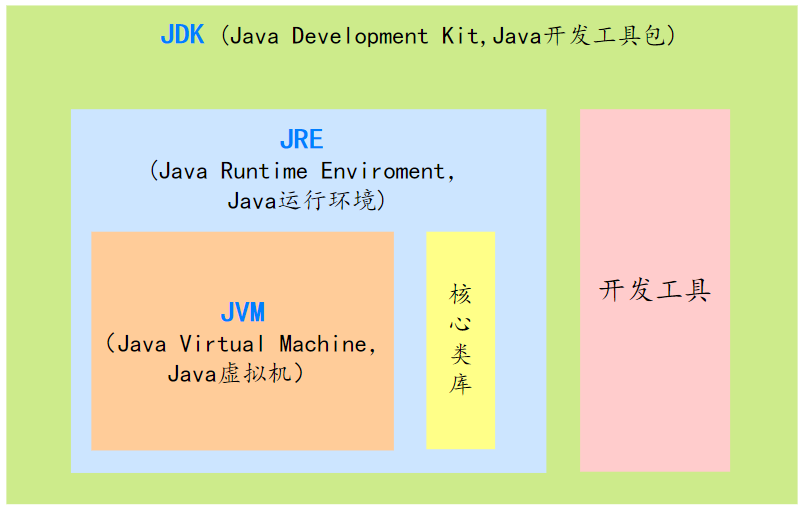
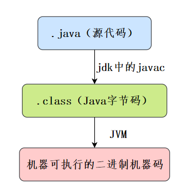
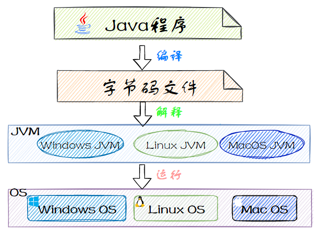

## 1. Java 概述

### 1.1. 什么是 Java

Java 是一门面向对象的编程语言，不仅吸收了 C++ 语言的各种优点，还摒弃了 C++ 里难以理解的多继承、指针等概念，因此 Java 语言具有功能强大和简单易用两个特征。Java 语言作为静态面向对象编程语言的优秀代表，极好地实现了面向对象理论，允许程序员以优雅的思维方式进行复杂的编程。

### 1.2. Java 语言的特点

- 面向对象（封装，继承，多态）。
- 平台无关性，平台无关性的具体表现在于，Java 是『一次编写，到处运行（Write Once，Run any Where）』的语言，因此采用 Java 语言编写的程序具有很好的可移植性，而保证这一点的正是 Java 的虚拟机机制。在引入虚拟机之后，Java 语言在不同的平台上运行不需要重新编译。
- 支持多线程。C++ 语言没有内置的多线程机制，因此必须调用操作系统的多线程功能来进行多线程程序设计，而 Java 语言却提供了多线程支持。
- 编译与解释并存。

## 2. JDK 概述

JDK (Java Development Kit) 是 Java 语言的软件开发工具包(SDK)，主要用于移动设备、嵌入式设备上的 Java 应用程序。JDK 是整个 Java 开发的核心，它包含了 JAVA 的运行环境（JVM+Java 系统类库）和 JAVA 工具。

> JDK 官网：https://www.oracle.com/java/

### 2.1. JDK 版本号的选择

Oracle JDK 8u211 及以上版本进行具有商业用途(盈利目的)的应用或工具的开发时是要收费的

JDK8 最后一个免费版本，JDK 8u202。但推荐下载 JDK 8u201？！说好的最后一个免费版本，为什么写了两个版本号 8u201 和 8u202 呢？到底要用哪一个？

这就涉及到 Oracle 跟 Oracle JDK 的使用者之间的一个小小的约定或小常识了！**下载奇数版本！！！**

从 2014 年 10 月发布 Java SE 7 Update 71 (Java SE 7u71) 开始，Oracle 在发布 Oracle JDK 关键补丁更新 (CPUs：Critical Patch Updates) 的同时一般会发布相应的补丁集更新 (PSUs：Patch Set Updates)。那么 CPUs 和 PSUs 之间有什么区别呢？

Oracle JDK 关键补丁更新 (CPUs) 包含安全漏洞修复和重要漏洞修复，Oracle 强烈建议所有 Oracle JDK 用户及时升级到最新的 CPU 版本，Oracle JDK 关键补丁更新 (CPUs) 版本号采用奇数编号！

Oracle JDK 补丁集更新 (PSUs) 包含相应 CPUs 中的所有修复以及其他非重要修复，仅当您受到Oracle JDK关键补丁更新 (CPUs)版本之外的其他漏洞的影响时才应当使用相应的补丁集更新 (PSUs) ，Oracle JDK 补丁集更新 (PSUs) 版本号采用偶数编号！

所以，一般情况下只要下载奇数编号的最新版本更新就行了！但要记住：商业收费版本的不要用于商业用途！

### 2.2. Oracle JDK 与 Open JDK

Oracle JDK 是基于 Open JDK 源代码的商业版本。要学习 Java 新技术可以去 Open JDK 官网学习。

> Open JDK 官网：http://openjdk.java.net/

JDK Enhancement Proposals(JDK增强建议)。通俗的讲JEP就是JDK的新特性

## 3. windows 系统安装 JDK

### 3.1. JDK变量环境配置

最好的配置方式：将位置切割成两段，一段用`JAVA_HOME`保存，一段用\bin保存。如下例：

```
JAVA_HOME = C:\Program Files\Java\jdk1.8.0_91
%JAVA_HOME%\bin  相等于 --> C:\Program Files\Java\jdk1.8.0_91\bin
```


### 3.2. 安装多个 JDK

安装过程都一样。只是配置环境变量时改动一下。分别将多个不同版本的jdk设置一个环境变量，然后最终让`JAVA_HOME`指定当前需要使用的版本的变量即可

```
JAVA_HOME_8 = D:\development\Java\jdk1.8.0_311
JAVA_HOME_11 = D:\development\Java\jdk-11.0.13
JAVA_HOME = %JAVA_HOME_8%
```


### 3.3. JDK 11 手动生成 jre 目录

许多java软件的运行需要依赖jre，但是在安装jdk11后，发现jdk11并没有自动安装jre环境。其实 jdk11 的安装包里是自带 jre 的，只不过没有自动安装，手动安装一下就可以了。

使用cmd命令行窗口进入jdk 安装目录输入以下命令，即可生成 jre 目录：

```bash
bin\jlink.exe --module-path jmods --add-modules java.desktop --output jre
```

### 3.4. 注意事项

如果是安装版，请务必到以下位置删除这几个文件。(二者其一有)

> - C:\Program Files (x86)\Common Files\Oracle\Java\javapath
> - C:\Program Files\Common Files\Oracle\Java\javapath

如果不删除上面这些文件，直接到环境变量PATH，将下面这些引用删除即可：

```
C:\Program Files\Common Files\Oracle\Java\javapath
C:\Program Files (x86)\Common Files\Oracle\Java\javapath
C:\ProgramData\Oracle\Java\javapath
```

## 4. Linux 系统安装 JDK

详见《Linux》相关的笔记

## 5. 综合扩展

### 5.1. JRE、JDK、JVM 及 JIT 的区别

- JRE（Java run-time） 是 Java 运行时环境，是运行 Java 程序所必须的。它是运⾏已编译 Java 程序所需的所有内容的集合，包括 Java 虚拟机（JVM），Java 类库，Java 命令和其他的⼀些基础构件。但是，它不能⽤于创建新程序。
- JDK（Java development kit）是 Java 程序开发工具集。它拥有 JRE 所拥有的⼀切，还有 Java 编译器（javac）和⼯具（如 javadoc 和 jdb）。它能够创建和编译程序。
- JVM（Java virtual machine）是 Java 虚拟机，它的责任是运行 Java 程序。针对不同系统的实现（Windows，Linux，macOS）不同的 JVM，因此 Java 语言可以实现跨平台。
- JIT（Just In Time compilation）是即时编译。为了提高热点代码的执行效率，在运行时，当代码执行的次数超过一定的阈值时，虚拟机会将 Java 字节码转换为与本地平台相关的机器码，并进行各种层次的优化。如：主要的热点代码会被准换为本地代码，这样有利大幅度提高 Java 应用的性能。



### 5.2. javap 反编译工具（待整理）

> 参考：[Java编程教程-理解javap工具](https://mp.weixin.qq.com/s/5iK2uuBtG6Amkc3b0SdQvw)

### 5.3. 字节码

#### 5.3.1. 概述

所谓的字节码，就是 Java 程序经过编译之类产生的 .class 文件，字节码能够被虚拟机识别，从而实现 Java 程序的跨平台性。

#### 5.3.2. Java 程序运行步骤

Java 程序从源代码到运行主要有三步：

- **编译**：将我们的代码（.java）编译成虚拟机可以识别理解的字节码（.class）
- **解释**：虚拟机执行 Java 字节码，将字节码翻译成机器能识别的机器码
- **执行**：对应的机器执行二进制机器码



只需要把 Java 程序编译成 Java 虚拟机能识别的 Java 字节码，不同的平台安装对应的 Java 虚拟机，这样就可以可以实现 Java 语言的平台无关性。

### 5.4. Java 语言“编译与解释并存”

高级编程语言按照程序的执行方式分为<u>**编译型**</u>和<u>**解释型**</u>两种。

- **编译型语言**是指编译器针对特定的操作系统将源代码一次性翻译成可被该平台执行的机器码。
- **解释型语言**是指解释器对源程序逐行解释成特定平台的机器码并立即执行。

Java 语言既具有编译型语言的特征，也具有解释型语言的特征。因为由 Java 编写的程序需要先经过编译步骤，生成字节码（`*.class` 文件），这种字节码必须再经过 JVM，解释成操作系统能识别的机器码，在由操作系统执行。因此可以认为 Java 语言编译与解释并存。



Java 源程序与编译型运行区别：


