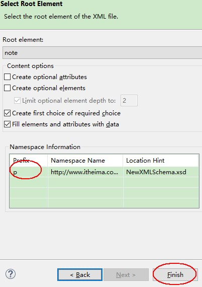

# Java 基础 - XML

## 1. XML 概述

XML 的全称 Extensible Markup Language，中文：可扩展标记语言。XML 是一门语言，由 w3c 组织制定。

XML 是使用标记来描述数据格式，标记又叫标签，元素。标签又分为开始标签和结束标签，比如`<name>`是开始标签，`</name>`是结束标签。

### 1.1. 作用

- 用于描述数据(关系型数据)，存储数据，可以当成一个小型数据库使用。
- 作为框架的配置文件(structs.xml, hibernate.cfg.xml…)。好处是可以提升软件的灵活性。如：数据库的配置、JavaBean 的配置。使用时的数据可以查看不同的 xml 配置文件。
- 可以用于不同的平台之间进行数据交换# Java基础 - XML

> XML 被设计用来描述数据，其焦点是数据的内容。HTML 被设计用来显示数据，其焦点是数据的外观。

### 1.2. XML 的约束

XML 约束是用来规定 XML 文件中应该出现哪些标签，哪些属性，每个属性的取值有哪些。其作用是：

- 约束XML文件结构
- 让XML文档的书写更加规范

#### 1.2.1. 约束文件分类

**DTD 约束文件**：

- DTD 约束文件是一个文本文件，语法结构相对简单，数据类型比较单一。
- 应用场景: struts.xml 和 hibernate.cfg.xml
- 文件后缀名：dtd

**Schema 约束**

- Schema 约束文档本身也是一个 XML 文件
- 语法结构相关复杂，数据类型很丰富，可以约束文本的具体数据类型
- 应用场景：Spring 的配置文件：applicationContext.xml, tomcat 中的 web.xml 等
- 文件后缀名：xsd

## 2. XML 语法

- xml 文件后缀名是`.xml`，可以使用浏览器去检查 xml 是否符合语法。因为浏览器内置了 xml 的解析引擎。
- 格式良好的 XML 文档规则
    1. 必须有声明语句
    2. XML 的标签区分大小写
    3. XML 文档有且只有一个根元素
    4. 属性值使用引号
    5. 所有的标记必须有相应的结束标记，空标记也必须关闭
    6. 标记必须正确嵌套
    7. 对于特殊字符要进行处理
- 一个 XML 文件分为几部分内容：文档声明、标签、属性、注释、转义字符、CDATA 区、处理指令。

### 2.1. 文档声明

在编写 XML 文档时，必须要有文档声明

#### 2.1.1. 声明格式

在 XML 文档的首行声明

```xml
<?xml version="1.0" encoding="utf-8"?>
```

还有更简单的声明语法：

```xml
<?xml version="1.0" ?>
```

标签参数说明：

- version(版本)：表示 xml 的版本号。W3C 在 1998 年 2 月发布 1.0 版本，2004 年 2 月又发布 1.1 版本，但因为 1.1 版本不能向下兼容 1.0 版本，所以 1.1 没有人用。同时，在 2004 年 2 月 W3C 又发布了 1.0 版本的第三版。<font color=red>**目前使用 1.0 版本**</font>
- encoding(编码)：可以指定UTF-8或GBK，是可选属性。<font color=red>**常用的是UTF-8**</font>。

> Notes: 
>
> - 参数的顺序必须是：<font color=red>**version 在前，encoding 在后**</font>，否则会报错。
> - 文档声明的语句必须牌XML文档的最左上角，不能有任何空格和换行。

#### 2.1.2. 编码问题

用 encoding 属性说明文档的字符编码：`<?xml version="1.0" encoding="GBK" ?>`

记事本默认是 ANSI 的编码，在简体中文 Windows 操作系统中，ANSI 编码代表 GBK 编码。XML 文件保存的编码要与 encoding 的编码相同，不然解析会出错。

#### 2.1.3. xml 文档编码问题注意

ecplise 工具会自动根据 xml 文件的文档声明自动设置保存时的编码，所以在 eclipse 中编写 xml 文件通常不会有编码问题。但是如果使用记事本工具，那么注意保存 xml 文件的编码和文件声明的编码保持一致！

### 2.2. 标签（元素）

#### 2.2.1. 标签的格式

```xml
<标签名>标签内容(数据部分)</标签名>
```

例：

```xml
<student>张三</student>
```

#### 2.2.2. 标签分类

**有主体标签**：

```xml
<a>www.moonzero.com</a>
```

**无主体标签，即空标签**：

```xml
<a></a>
<!-- 简写 -->
<a/>
```

#### 2.2.3. 标签命名规范

- 标签名严格区分大小写，比如`<A>`和`<a>`是完全不同的标签。
- 标签名不能以数字开头。只能以字母或下划线开头，可以是中文。
- 标签名不能包含空格，比如`<name of>`。但是`<name >`写法是可以，但不推荐使用。
- 标签名不能使用冒号(`:`)，是命名空间的特殊符号。

#### 2.2.4. 标签的注意事项

- 在一个 xml 文档中，只允许有一个根标签。
- 标签中是可以有属性有多个，属性值必须使用引号括起来。
- 开始标签和结束标签必须成对出现。
- 标签可以嵌套标签，但是必须合理嵌套，不能出现交叉嵌套。

错误的嵌套示例：

```xml
<a>welcome to <b>www.moonzero.com</a></b>
```

<font color=red>**对于 XML 标签中出现的所有空格和换行，XML 解析程序都会当作标签内容进行处理。**</font>

### 2.3. 属性

#### 2.3.1. 属性语法格式

```xml
<开始标签 属性名="属性值"  属性值 = '属性值'>标签内容(数据部分)</结束标签>
```

示例：

```xml
<name id="001">李四</name>
```

#### 2.3.2. 注意事项

- 属性值必须放在双引号或单引号中，不能省略引号，也不能单双混用。
- 属性必须放在开始标签中，不能写在结束标签中。
- 在一个标签中，属性可以有多个，属性之前使用空格分隔即可。但不能出现同名的属性。

### 2.4. 注释

#### 2.4.1. 注释语法格式

```xml
<!-- xml 注释内容 -->
```

#### 2.4.2. 注意事项

- 注释不能嵌套。
- XML 注释不能出现在文档声明语句之上。

### 2.5. 转义字符

有些符号在 XML 语言中是有特殊含义的，如果想原样输出 XML 中的特殊字符，那么就需要对其进行转义。

**转义的语法格式**：<font color=red>**以`&`开始，以`;`结束**</font>

| 特殊字符 |  替代字符  |     英文      |
| :-----: | :------: | ------------ |
|   `&`   | `&amp;`  | ampersand    |
|   `<`   |  `&lt;`  | less than    |
|   `>`   |  `&gt;`  | greater than |
|   `"`   | `&quot;` | quote        |
|   `'`   | `&apos;` | apostrophe   |

### 2.6. CDATA 区

XML 文档中的所有文本均会被解析器解析。而 CDATA 区的作用是：能够保证在CDATA区的字符数据能够原样输出，不会被浏览器解析。

#### 2.6.1. 语法格式

CDATA 部分由 "`<![CDATA[`" 开始，由 "`]]>`" 结束，其内容可以换行

```xml
<![CDATA[字符数据(文本内容)]]
```

示例：

```xml
<script>
<![CDATA[
function matchwo(a,b)
{
    if (a < b && a < 0) then
    {
        return 1;
    }
    else
    {
        return 0;
    }
}
]]>
</script>
```

#### 2.6.2. 注意事项

- CDATA 部分不能包含字符串 "`]]>`"。也不允许嵌套的 CDATA 部分。
- 标记 CDATA 部分结尾的 "`]]>`" 不能包含空格或换行。

## 3. DTD 约束

DTD 全称：Document Type Definition 文档类型定义

### 3.1. DTD 的分类

按引用位置来分类：

- 内部 DTD：约束直接写在XML文档中（不使用）
- 外部 DTD：单独使用一个文件来写约束，通过引用来使用

### 3.2. DTD 文档声明的两种形式（引用方式）

#### 3.2.1. SYSTEM

**含义**：表示该DTD约束是个人或是某个组织的，不公开的，私有的，使用范围比较窄

**语法格式**：

```xml
<!DOCTYPE 根标签 SYSTEM "DTD 文件的地址和名字">
```

示例：

```xml
<!DOCTYPE bookshelf SYSTEM "book.dtd">
```

文件地址例子说明：

- "../book.dtd" 在上一层目录中
- "../dtd/book.dtd" 在上一层目录的dtd文件夹中


#### 3.2.2. PUBLIC

**含义**：当前的 DTD 是公开的，可以广泛使用的，使用范围比较广。

**语法格式**：

```xml
<!DOCTYPE 根元素 PUBLIC "DTD 的描述" "DTD 文件的地址">
```

示例：

```xml
<!DOCTYPE struts PUBLIC "-//Apache Software Foundation//DTD Struts Configuration 2.1//EN" 
                        "http://struts.apache.org/dtds/struts-2.1.dtd">
```

#### 3.2.3. DTD 文件描述

DTD 文件描述由**四个组成部分**：`前缀//DTD 文件的所有者//DTD 版本信息//语言`

前缀部分有以下三个取值：

- `ISO`： 当前的 DTD 是符合 ISO 标准的(国际化标准)
- `+`： 非 ISO 标准的 DTD，经过了改进
- `-`： 非 ISO 标准的 DTD，没有改进过的

### 3.3. DTD语法：元素约束

#### 3.3.1. 元素约束语法格式

```xml
<!ELEMENT 元素名(标签名) 元素类型或元素内容>
```

上面三个要素必须要<font color=red>**空格分隔，空格不能省略**</font>。

#### 3.3.2. 元素的类别（3种）

- (#PCDATA)：Parsed Character Data 被解析的字符数据（文本内容）
- EMPTY：空的(表示一个空的标签) 如： `<BR/>` 的 DTD 为：`<!ELEMENT BR EMPTY>`
- ANY：任意的内容都可以

#### 3.3.3. 元素的内容修饰符号

| 符号  |               描述                |           示例            |                                         |
| :--: | -------------------------------- | ------------------------ | --------------------------------------- |
| `?`  | 表示该对象可以出现，但只能出现一次      | `(author?)`              | author 出现 0~1 次                       |
| `*`  | 表示该对象允许出现任意多次，也可以是零次 | `(author*)`              | author 出现 0~n 次                       |
| `+`  | 表示该对象最少出现一次，可以出现多次     | `(contact+)`             | contact 出现 1~n 次                      |
| `()` | 用来给元素分组                      | `(name,gender,phone)`    |                                         |
| `|`  | 表明在列出的对象中选择一个             | `(title\|author\|price)` | 包含这一个子元素，三者选一。                 |
| `,`  | 表示对象必须按指定的顺序出现           | `(title,author,price)`   | 包含这三个子元素，而且元素要依次出现，出现一次。 |

#### 3.3.4. 元素约束示例

```xml
<!ELEMENT bookshelf (book+)>
<!ELEMENT book (title,author,price)>
<!ELEMENT title (#PCDATA)>
<!ELEMENT author (#PCDATA)>
<!ELEMENT price (#PCDATA)>
```

### 3.4. DTD语法：属性约束

#### 3.4.1. 语法格式

语法：

```xml
<!ATTLIST 元素名
	属性名 属性类型 类型选项
	属性名 属性类型 类型选项
	……
>
```

**属性类型**：

|        属性类型         |                     说明                      |
| --------------------- | -------------------------------------------- |
| `CDATA`               | Character Data字符数据类型，文本内容             |
| `(enum1|enum2|enum3)` | 枚举类型，属性的取值从这几种中选择一种              |
| `ID`                  | 属性值在整个 XML 文件中是唯一，而且命名不能以数字开头 |

**类型选项**：

|     类型选项     |          选项的含义          |
| -------------- | -------------------------- |
| `#REQUIRED`    | 必须的属性                   |
| `#IMPLIED`     | 可选的属性                   |
| `#FIXED value` | 属性的值是固定的，只能取 value |
| 默认值           | 直接写就是默认值              |

#### 3.4.2. 属性约束示例

属性约束（两种写法）

```xml
<!ATTLIST article author CDATA #REQUIRED>
<!ATTLIST article editor CDATA #IMPLIED>
<!ATTLIST article date CDATA #IMPLIED>
<!ATTLIST article edition CDATA #IMPLIED>

<!ATTLIST article 
	author CDATA #REQUIRED
	editor CDATA #IMPLIED
	date CDATA #IMPLIED
	edition CDATA #IMPLIED
>
```

### 3.5. DTD 综合案例

案例需求：

1. 根元素是 contactList，其根元素包含 1~n 个 contact 子元素，contact 子元素包含 name,gender,phone,qq,email 元素这个元素必须依次出现，并且元素中都可以包含文本元素(`#PCDATA`)
2. 其中 contact 有 id 属性，必须，并且不能重复，不能以数字开头
3. contact 有一个可选的属性 vip，取值是 true 或 false
4. 按此 DTD 约束创建 XML 文件，并添加 3 条 contact 记录。

案例 DTD 约束文件：

```xml
<!ELEMENT contactList (contact+)>
<!ELEMENT contact (name,gender,phone,qq,email)>
<!ELEMENT name (#PCDATA)>
<!ELEMENT gender (#PCDATA)>
<!ELEMENT phone (#PCDATA)>
<!ELEMENT qq (#PCDATA)>
<!ELEMENT email (#PCDATA)>

<!ATTLIST contact
	id ID #REQUIRED
	vip (true|false) #IMPLIED
>
```

案例 XML 文件

```xml
<?xml version="1.0" encoding="UTF-8"?>
<!DOCTYPE contactList SYSTEM "contact.dtd" >
<contactList>
	<contact id="S100" vip="true">
		<name>张三</name>
		<gender>男</gender>
		<phone>13565784567</phone>
		<qq>394832048</qq>
		<email>zhang@moonzero.com</email>
	</contact>
	<contact id="S200">
		<name>李四</name>
		<gender>女</gender>
		<phone>15687960980</phone>
		<qq>109456893</qq>
		<email>li@moonzero.com</email>
	</contact>
</contactList>
```

## 4. Schema 约束

Schema `/'ski:mə/`  概要，纲要

### 4.1. Schema 约束概述

1. 扩展名(XML Schema Definition) XML 模式定义：xsd
2. Schema 约束文件本身也是个 XML 文件，所以它也有根元素，根标签(元素)的名字叫 schema

模式文档和实例文档的概念

- 制定约束的 XML 文档称为：模式文档 (类似于：类)
- 被模式该当约束的 XML 文档称为：实例文档 (类似于：对象)

> Notes: <font color=purple>**Schema 也被约束，被官方Schema约束文档所约束。**</font>

### 4.2. Schema 的命名空间

#### 4.2.1. 概述

由于 XML 中的元素名是预定义的，当两个不同的文档使用相同的元素名时，就会发生**命名冲突**的问题。

Schema 命名空间的作用：用来描述实例文档使用的标签，属性是来自于哪一个模式文档。避免标签名、属性名冲突的问题。

#### 4.2.2. 名称空间声明的一般形式

名称空间声明的一般形式为：

- 第一部分是一个关键字`xmlns:`
- 第二部分是名称空间的前缀
- 第三部分是一个等号
- 第四部分是双引号，将第五部分的名称空间标识URI 包括起来

```xml
xmlns:xs="http://www.w3.org/2001/XMLSchema"
```

#### 4.2.3. XML Namespace (xmlns) 属性

XML 命名空间属性被放置于某个元素的开始标签之中，并使用以下的语法：

```xml
xmlns:前缀="URI 地址"
```

当一个命名空间被定义在某个元素的开始标签中时，所有带有相同前缀的子元素都会与同一个命名空间相关联。

> Notes: <font color=red>**用于标示命名空间的地址不会被解析器用于查找信息。其唯一的作用是赋予命名空间一个唯一的名称。**</font>

#### 4.2.4. 统一资源标示符（Uniform Resource Identifier (URI)）

统一资源标示符是一串可以标示因特网资源的字符。最常用的 URI	 是用来标示因特网域名地址的统一资源定位器(URL)。例如：

```
http://www.baidu.com/xxx
```

#### 4.2.5. 默认的命名空间（Default Namespaces）

默认命名空间格式：

```xml
xmlns="namespaceURI"
```

为某个元素定义默认的命名空间可以让我们省去在所有的子元素中使用前缀的工作。<font color=red>**一个 XML 文件中只能使用一个默认的命名空间**</font>。例如：

```xml
<table xmlns="http://www.moonzero.com/html4">
```

#### 4.2.6. 命名冲突解决方案

**使用前缀来避免命名冲突**：

```xml
// 代表表格
<h:table>
	<h:tr>
	<h:td>Apples</h:td>
	<h:td>Bananas</h:td>
	</h:tr>
</h:table>
// 代表家具
<f:table>
	<f:name>African Coffee Table</f:name>
	<f:width>80</f:width>
	<f:length>120</f:length>
</f:table>
```

两个文档都使用了不同的名称来命名它们的 `<table>` 元素 (`<h:table>` 和 `<f:table>`)。通过使用前缀，创建了两种不同类型的 `<table>` 元素。

**使用命名空间（Namespaces）解决命名冲突**：

```xml
<?xml version="1.0" encoding="UTF-8"?>
<xs:schema 
	xmlns:xs="http://www.w3.org/2001/XMLSchema" 
	targetNamespace="http://www.example.org/NewXMLSchema" 
	xmlns:tns="http://www.example.org/NewXMLSchema" 
	elementFormDefault="qualified">
</xs:schema>
```

与仅仅使用前缀不同，可以为标签添加了一个 `xmlns` 属性，这样就为前缀赋予了一个与某个命名空间相关联的限定名称

### 4.3. Schema 文档使用与解析

#### 4.3.1. 使用示例

示例 Schema 模式文档：note.xsd：

```xml
<?xml version="1.0"?>
<xs:schema xmlns:xs="http://www.w3.org/2001/XMLSchema"
	targetNamespace="http://www.moonzero.com/note"
	elementFormDefault="qualified">
	<xs:element name="note">
 		<xs:complexType>
			<xs:sequence>
			 <xs:element name="to" type="xs:string"/>
			 <xs:element name="from" type="xs:string"/>
			 <xs:element name="heading" type="xs:string"/>
			 <xs:element name="body" type="xs:string"/>
 			</xs:sequence>
 		</xs:complexType>
 	</xs:element>
</xs:schema>
```

实例文档：note.xml

```xml
<?xml version="1.0"?>
<note xmlns="http://www.moonzero.com/note"
	xmlns:xsi="http://www.w3.org/2001/XMLSchema-instance"
	xsi:schemaLocation="http://www.moonzero.com/note note.xsd">
	<to>Tove</to>
	<from>Jani</from>
	<heading>Reminder</heading>
	<body>Don't forget me this weekend!</body>
</note>
```

#### 4.3.2. Schema 元素解析说明

1. schema 是每一个 XML 模式文档的根元素
2. `<schema>` 元素包含属性 `xmlns:xs="http://www.w3.org/2001/XMLSchema"`
    - 作用一：表示 schema 中用到的元素和数据类型来自命名空间 `"http://www.w3.org/2001/XMLSchema"`。
    - 作用二：规定了来自命名空间 `"http://www.w3.org/2001/XMLSchema"` 的元素和数据类型使用前缀 `xs`。
    - <font color=red>**这个引用官方指定的约束，约束来自于该命名空间。一般生成不用去修改。**</font>
3. `targetNamespace="http://www.moonzero.com/note"` 表示被此 schema 定义的元素 (note, to, from, heading, body) ，被绑定到了命名空间：`"http://www.moonzero.com/note"`。
    - `targetNamespace = "URI字符串"` 注意 URI 字符串，一般设置的公司的域名或网址，不查找该网址是否存在。它的作用就是用来唯一标识一个命名空间。
    - 该模式文档定义的约束将被绑定到`"http://xx//xxx/xxx"`，命名空间(包)中
    - <font color=red>**注：用于标示命名空间的地址不会被解析器用于查找信息。其唯一的作用是赋予命名空间一个唯一的名称。**</font>
4. `elementFormDefault="qualified"` 使用此 xsd 的实例文档必须遵守此文档的约束。
    - 取值`qualified`: 必须遵循该模式文档定义的约束条件
    - 取值`unqualified`: 使用该模式文档的实例文档不需要遵循约束条件
5. `note` 元素是一个复合类型，因为它包含其他的子元素。
6. `<xs:sequence>` 表示其中的子元素要按顺序出现
7. 其他元素 (to, from, heading, body) 是简易类型，因为它们没有包含其他元素。

#### 4.3.3. Schema 使用说明

**定义位置**：在模式文档的根标签中定义

**引用格式**：

- 没有使用前缀 `xmlns = "包名"`
- 如果没有使用前缀`：`标识使用

**引用位置**：在实例文档的根标签中引用

1. 指定 XML Schema 实例命名空间：`xmlns:xsi="http://www.w3.org/2001/XMLSchema-instance"`
2. 使用 `xsi:schemaLocation` 属性：
    - 第一个值是需要使用的命名空间。
    - 第二个值是供命名空间使用的 XML schema 的位置。
    - 如：`xsi:schemaLocation="http://www.moonzero.com/note note.xsd"`，xsi 即 xml schema instance 简写
3. `xmlns="http://www.moonzero.com/note"` 规定了默认命名空间的声明。此声明会告知 schema 验证器，在此 XML 文档中使用的所有元素的约束都来源于这个命名空间。也可以指定一个前缀，这里使用默认的命名空间，则可以省略前缀。

使用 eclipse 创建 XML 文件关联 xsd 文件：新建项目 -> 选择XML File -> 选择【Create XML file from an XML schema file】 -> 选择相应的 schema.xsd 文件 -> 最后的 Prefix 是设置前缀名，可以修改设置为空



### 4.4. Schema 与DTD 的区别

1. XML: DTD 只是个普通的文本文件，并不是 XML 文件。而 Schema 本身也是一个 XML 文件。
2. 数据类型： DTD 的类型比较单一，Schema 的数据类型丰富得多，可以指定如：integer、date、double。
3. 约束功能：约束功能更加强大，可以使用更多规则，甚至可以使用正则表达式来约束。一个 XML 可以有多个 Schema 约束文档。
4. 复杂度：比 DTD 要复杂。
5. <font color=red>**可以多个 Schema 模式文档约束一个 XML 实例文档，而一个 DTD 文件只能约束一个 XML 文档**</font>。

## 5. XML 解析

### 5.1. XML 的解析概述

**XML 解析**是指，使用 Java 技术从 XML 文档中获取数据的过程。

### 5.2. XML 解析的方式

#### 5.2.1. DOM 解析

DOM 解析是直接将 XML 文档加载到内存中，在内存中生成一个 DOM 树。DOM 树上的每一个对象都是一个节点(Node)对象。DOM 解析优缺点如下：

- 优点：xml 中的每个元素都是 dom 树上的一个节点，<font color=red>**可以在解析的过程中对结点上的每个元素进行增删改操作**</font>。一般使用在PC端开发。
- 缺点：如果 XML 文档内容特别大，则会导致内存占用也比较大。

#### 5.2.2. SAX 解析

SAX 解析是指，从上往下一行一行解析，解析一行释放一行。SAX 解析优缺点如下：

- 优点：占用内存空间小，一般使用客户端App开发。
- 缺点：以只读的方式解析，不能对节点进行增删改操作。

### 5.3. DOM4J（第三方解析工具）

DOM4J 是一个最优秀的第三方 Java 的 XML API 解析框架，是 jdom 的升级品，采用 dom 方式来解析 xml 文件（*Hibernate 框架就是使用 Dom4j 解析 XML*）。该框架具有性能优异、功能强大和极其易使用的特点，它的性能超过 sun 公司官方的dom 技术，同时它也是一个开放源代码的软件，可以在 SourceForge 上找到。

> DOM4J 官网地址：http://www.dom4j.org/

在 eclipse 中使用 dom4j 的步骤：

1. 在项目中创建一个文件夹：lib
2. 将 dom4j-1.6.1.jar 文件复制到 lib 文件夹
3. 在 jar 文件上点右键，选 Builder Path -> Add to Builder Path
4. 在类中导包使用

## 6. 使用 DOM4J 解析 XML

### 6.1. DOM 树的组成元素

- 文档对象：Document
- 节点：Node
- 元素：Element
- 属性：Attribute
- 文本：Text

#### 6.1.1. Document 文档对象

每一个 XML 文档加载到内存中后会生成一个 `Document` 对象，通过 `Document` 对象就可以获取 XML 文档中的所有内容。获得 `Document` 对象步骤如下：

1. 创建一个 `SAXReader` 对象，用于读取 xml 文件。
2. 通过 `SAXReader` 对象调用 `read` 方法，读取 xml 文件得到 `Document` 对象

#### 6.1.2. Node 节点信息

<font color=red>**DOM 树中每个元素都抽象成一个节点对象 `Node`，节点是所有元素的父元素**</font>。

获得 `Node` 对象步骤：

1. 通过 `Element` 类的 `nodeIterator()` 方法获取 `Node` 对象迭代器对象
2. 通过迭代器对象就可以遍历当前元素节点下的所有 `Node` 对象
3. 获取 `Node` 的对象后，通过判断 `Node` 对象的类型来筛选需要的对象

#### 6.1.3. Element 标签信息

所有元素(标签)都是一个 `Element` 对象

#### 6.1.4. Attribute 属性信息

每一个元素上的每一个属性都是一个 `Attribute` 对象。获得 `Attribute` 属性的前提，先获得标签 `Element` 对象。

获取属性值的两种方式：

- 先得到 `Attribute` 对象，再通过对象的方法得到属性名和属性值。
- 直接通过属性的名字得到字符串类型的属性值。

#### 6.1.5. Text 文本元素

Text 文本元素就是指标签体的内容，获取步骤如下：

1. 得到文本元素的前提：先得到元素 Element
2. 调用相关操作文本信息的方法

> Notes: 空格、换行、制表符：也是属于文本的一部分，所以在解析 xml 文件的时候，格式化 XML 文件要注意。

### 6.2. DOM4J 工具包常用类

#### 6.2.1. SAXReader 类

```java
public Document read(String name);
```

- 返回一个 Document 对象，name 是 xml 文档名字

```java
public Document read(File file)
```

- 返回一个 Document 对象，参数是一个 File 文件路径对象

#### 6.2.2. Document 类

```java
public Element getRootElement()
```

- 获得根标签(元素)对象

```java
public void setRootElement(Element rootElement)
```

- 将标签(元素)对象添加到该 document 对象中。(调用此方法的 Document 对象)

#### 6.2.3. Node 类

```java
public short getNodeType()
```

- 得到节点的类型，所有的节点类型在 Node 接口中定义了常量。<font color=red>**注：通过判断返回的类型来筛选需要得到的Node对象**</font>。**常用 Node 常量对象类型**如下：
    - Node.ELEMENT_NODE 标签节点
    - Node.TEXT_NODE 文本节点
    - Node.COMMENT_NODE 注释节点
    - Node.ATTRIBUTE_NODE 属性节点

```java
public String getName()
```

- 获取当前节点的名称，返回字符串

```java
public void setText(String text)
```

- 给当前的节点对象设置text文本内容

#### 6.2.4. Element 类

所有元素(标签)都是一个 Element 对象，是 Branch 的子类

```java
public interface Element extends Branch
```

##### 6.2.4.1. Element 类对节点 Node 的操作相关方法

```java
public Iterator<Node> nodeIterator()
```

- Element继承父类的方法，方法返回当前标签下所有的子节点（Node对象）的迭代器，<font color=red>**获取的包含了注解、空白内容等等元素**</font>。

##### 6.2.4.2. Element 类对元素（标签）Element 的操作相关方法

```java
public Iterator<Element> elementIterator()
```

- 获得该元素节点下所有子元素(Element、标签)的迭代器对象。(<font color=red>**只获取到标签对象**</font>)
> 原文档解释：Returns an iterator over all this elements child elements.

```java
public Iterator elementIterator(String name)
```

- 获得该元素节点下指定名字的所有子元素(Element、标签)的迭代器对象。(<font color=red>**只获取到标签名为name的对象**</font>)

```java
public List<Element> elements();
```

- 获得当前元素下的所有子元素Element对象的List集合

```java
public List<Element> elements(String name);
```

- 根据元素名name获得所有的该名称的所有元素对象的List集合。

```java
public Element element(String name);
```

- 得到指定名字name的标签对象，<font color=red>**如果多个同名标签则默认返回第一个元素对象**</font>

```java
public String getName();
```

- 继承父类(Node)的方法，获取当前标签的名称，返回字符串

```java
public Element addElement(String name)
```

- 继承父类(Branch)的方法，给当前元素标签对象新增一个新的子标签，并<font color=red>**返回该新增的标签对象**</font>
> 原文档解释：Adds a new Element node with the given name to this branch and returns a reference to the new node.

```java
public Element addAttribute(String name, String value)
```

- 给当前标签对象新增一个属性(包括名称和值)，如：`"name"="value"`
> 原文档解释：Adds the attribute value of the given local name. If an attribute already exists for the given name it will be replaced. Attributes with null values are silently ignored. If the value of the attribute is null then this method call will remove any attributes with the given name.

```java
public void add(Element element)
```

- 继承父类(Branch)的方法，给当前标签对象新增一个子标签对象element，无返回值。

```java
public void setText(String text)
```

- 继承父类(Node)方法，给当前的标签对象设置text文本内容

##### 6.2.4.3. Element 类对属性 Attribute 的操作相关方法

```java
public Attribute attribute(String name);
```

- 通过指定属性的名字name得到一个属性对象
> 原文档解释：Returns the attribute with the given name

```java
public String attributeValue(String name);
```

- 通过属性名字直接得到当前标签element对象的属性值，返回 String 类型

```java
public List<Attribute> attributes();
```

- 得到当前标签的所有的属性对象(Attribute)的List集合

```java
public Iterator<Attribute> attributeIterator();
```

- 获得当前元素属性的迭代器对象。

##### 6.2.4.4. Element类对文本Text的操作相关方法

```java
public String getText();
```

- 通过元素对象得到元素的文本内容（包括了左右空格，换行符等内容）

```java
public String getTextTrim();
```

- 通过元素对象得到元素的文本内容（<font color=red>**会自动去掉包括了左右空格，换行符等内容**</font>）

```java
public String elementText(String name);
```

- 通过元素对象根据子元素名name得到该元素的文本内容（包括了左右空格，换行符等内容）

```java
public String elementTextTrim(String name);
```

- 通过元素对象根据子元素名name得到该元素的文本内容（<font color=red>**会自动去掉包括了左右空格，换行符等内容**</font>）

#### 6.2.5. Attribute 类

```java
public String getText();
```

- 获取属性的值。(继承父类Node的方法)

```java
public String getName();
```

- 得到属性的名字。(继承父类Node的方法)

```java
public String getValue();
```

- 得到属性的值。

#### 6.2.6. XMLWriter 类

##### 6.2.6.1. DocumentHelper 工具类

DocumentHelper 工具类可以用来创建文档对象，元素对象，属性对象...

```java
public static Document createDocument()
```

- 用来创建空的文档对象

```java
public static Document createDocument(Element rootElement)
```

- 以 `rootElement` 对象为根标签，并创建文档对象

```java
public static Element createElement(String name)
```

- 创建名称是 name 的 `Element` 对象

##### 6.2.6.2. OutputFormat 类（格式化）

```java
public static OutputFormat createPrettyPrint()
```

- 静态方法，创建漂亮型格式化的对象。每个元素内容换新一行。
> 原文档解释：A static helper method to create the default pretty printing format. This format consists of an indent of 2 spaces, newlines after each element and all other whitespace trimmed, and XMTML is false.

```java
public static OutputFormat createCompactFormat()
```

- 静态方法，创建紧凑型格式化的对象，所有的内容一行显示
> 原文档解释：A static helper method to create the default compact format. This format does not have any indentation or newlines after an alement and all other whitespace trimmed

##### 6.2.6.3. XMLWriter 类

```java
public XMLWriter(OutputStream out, OutputFormat format)
```

- XMLWriter 类的构造方法。参数说明：
    - out：字节输出流对象，用来关联目标文件
    - format：格式化对象

```java
public void write(Document doc);
```

- 将文档对象写出 XML 文件中

### 6.3. 使用示例

#### 6.3.1. DOM4J 常用方法练习

示例 xml 文档

```xml
<?xml version="1.0" encoding="UTF-8"?>
<contactList> 
  <!--  注释内容 -->  
  <contact id="S100" vip="true"> 
    <name>
    	潘金莲
    </name>  
    <gender>女</gender>  
    <phone>136909877890</phone>  
    <qq>387439274</qq>  
    <email>panpan@moonzero.com</email> 
  </contact>  
  <contact id="S200" vip="false"> 
    <name>武大狼</name>  
    <gender>男</gender>  
    <phone>13609876543</phone>  
    <qq>394535</qq>  
    <email>wuda@moonzero.com</email> 
  </contact>  
  <contact id="X999" vip="false"> 
    <name>西蒙</name>  
    <gender>男</gender>  
    <phone>2987342394</phone>  
    <qq>29342394</qq>  
    <email>aaa@aa.com</email> 
  </contact>  
  <contact id="9527" vip="false"> 
    <name>华安</name>  
    <phone>10086</phone>  
    <gender>男</gender>  
    <qq>10000</qq>  
    <email>10000@qq.com</email> 
  </contact>
</contactList>
```

DOM4J 解析 xml 示例代码：

```java
import java.util.Iterator;
import java.util.List;

import org.dom4j.Attribute;
import org.dom4j.Document;
import org.dom4j.Element;
import org.dom4j.Node;
import org.dom4j.io.SAXReader;

public class MoonZero {
	@SuppressWarnings("unchecked")
	public static void main(String[] args) throws Exception {
		// 创建SAXReader类的对象
		SAXReader sax = new SAXReader();
		// 获取xml文档的Document类对象
		Document doc = sax.read("contact.xml");
		System.out.println(doc);

		// 获取标签对象
		Element rootEle = doc.getRootElement();
		System.out.println(rootEle);
		// 使用节点Node对象的迭代器遍历全部子标签元素
		// getNodeIterator(rootEle);

		System.out.println("-========");
		// 获取当前标签下的子标签对象迭代器,输出所有子标签对象
		getElementIterator(rootEle);

		// 两种获取当前标签下的所有子标签对象Element的List集合
		getElementList(rootEle);
		// 得到指定名字的标签对象，如果多个同名标签则默认返回第一个元素对象
		System.out.println(rootEle.element("contact").getName());

		// 获取文本内容 第一个获取子标签名字"name"
		System.out.println(rootEle.element("contact").element("name").getName());
		// 下面全部获取子标签的文本内容"潘金莲"
		System.out.println(rootEle.element("contact").element("name").getText());
		System.out.println(rootEle.element("contact").element("name").getTextTrim());
		System.out.println("===================");
		System.out.println(rootEle.element("contact").elementText("name"));
		System.out.println(rootEle.element("contact").elementTextTrim("name"));

		// 获取属性对象的迭代器
		Element childEle = rootEle.element("contact");
		Iterator<Attribute> attIt = childEle.attributeIterator();
		while (attIt.hasNext()) {
			System.out.println(attIt.next().getText());
		}

		System.out.println("=====================");
		// 获取属性对象的List集合
		List<Attribute> attList = childEle.attributes();
		for (Attribute a : attList) {
			System.out.println(a.getText());
		}

		// 直接获取属性值
		System.out.println(childEle.attribute("id").getValue());
		System.out.println(childEle.attribute("id").getText());
		System.out.println(childEle.attributeValue("id"));
		// 获取属性的名称
		System.out.println(childEle.attribute("id").getName());
	}

	@SuppressWarnings("unchecked")
	public static void getElementList(Element rootEle) {
		List<Element> listEle = rootEle.elements();
		for (Element childEle : listEle) {
			System.out.println(childEle);
		}
		System.out.println("===============");
		List<Element> listEle2 = rootEle.elements("contact");
		for (Element childEle : listEle2) {
			System.out.println(childEle);
		}
	}

	@SuppressWarnings("unchecked")
	public static void getElementIterator(Element rootEle) {
		// 获取当前标签下的子标签对象迭代器
		Iterator<Element> eleIt = rootEle.elementIterator("contact");
		// 遍历迭代器，输出所有子标签对象
		while (eleIt.hasNext()) {
			Element ele = eleIt.next();
			System.out.println(ele);
		}
	}

	@SuppressWarnings({ "unchecked", "static-access" })
	public static void getNodeIterator(Element rootEle) {
		// 获取Node对象的迭代器
		Iterator<Node> nodeIt = rootEle.nodeIterator();

		// 遍历迭代器,判断是contact标签才输出
		while (nodeIt.hasNext()) {
			Node node = nodeIt.next();
			if (node.getNodeType() == node.ELEMENT_NODE) {
				System.out.println(node);
			}
		}
	}
}
```

#### 6.3.2. XML 数据的封装案例

```java
import java.io.File;
import java.util.List;

import org.apache.commons.beanutils.BeanUtils;
import org.dom4j.Attribute;
import org.dom4j.Document;
import org.dom4j.Element;
import org.dom4j.io.SAXReader;

/**
 * 需求
	* 创建实体类Contact，包含属性：id、name、gender、phone、qq、email，属性全部使用String类型
	* 将XML文件中的联系人封装成一个List<Contact>集合，并输出在控制台
		* 1) 得到根元素
		* 2）得到所有的contact元素
		* 3) 得到contact元素中的下级元素封装成数据，其中id是属性，其它的都是文本。 

 */
public class MoonZero {
	@SuppressWarnings("unchecked")
	public static void main(String[] args) throws Exception {
		//创建SAXReader对象
		SAXReader sax = new SAXReader();
		//获取XML的document对象
		Document doc = sax.read(new File("contact.xml"));
		
		//获取根元素对对象
		Element ele = doc.getRootElement();
		
		//获取子元素对象List集合
		List<Element> eleList = ele.elements();
		//遍历集合
		for (Element childEle: eleList) {
			//创建contact对象
			Contact c = new Contact();
			//再获取子元素对象下的所有子子元素List集合
			List<Element> childEleList = childEle.elements();
			for (Element ccEle : childEleList) {
				String name = ccEle.getName();
				Object value = ccEle.getTextTrim();
				//使用BeanUtils方法给对象赋值
				BeanUtils.setProperty(c, name, value);
			}
			
			//获取子元素属性对象集合
			List<Attribute> attList = childEle.attributes();
			for (Attribute att : attList) {
				BeanUtils.setProperty(c, att.getName(), att.getValue());
			}
			System.out.println(c);
		}
	}
}
```

#### 6.3.3. XMLWriter 基础使用案例

```java
import java.io.FileOutputStream;
import java.io.IOException;

import org.dom4j.Document;
import org.dom4j.DocumentHelper;
import org.dom4j.Element;
import org.dom4j.io.OutputFormat;
import org.dom4j.io.SAXReader;
import org.dom4j.io.XMLWriter;

/*
 * 需求：
 * 		生成一个空的XML文件
 * 		新增一个联系人对象到XML文件
 */
public class MoonZero {
	public static void main(String[] args) throws Exception {
		// 生成一个空的XML文件
		// createNewDocument();

		// 给XML文件新增联系人
		// 先读取文档，创建SAXReader对象获取Document对象
		SAXReader sax = new SAXReader();
		Document doc = sax.read("newXML.xml");

		// 获取根元素对象
		Element rootEle = doc.getRootElement();
		// 调用方法获取新增的标签对象，新增到根元素对象下
		rootEle.add(createNewContact());

		// 创建字节输出流对象，关联输出文件对象
		FileOutputStream fos = new FileOutputStream("newXML.xml");
		// 创建格式化
		OutputFormat format = OutputFormat.createPrettyPrint();

		// 创建XMLWriter对象，将Document对象输出到文件、
		XMLWriter xml = new XMLWriter(fos, format);
		xml.write(doc);

		// 关闭流对象
		fos.close();
	}

	public static Element createNewContact() {
		// 创建新增联系人对象
		Contact con = new Contact("剑圣主宰", "男", "10086", "10000", "10000@qq.com", "9527", true);

		// 将对象新增到根元素对象子标签中
		// 给根元素新增一个子元素对象
		Element childEle = DocumentHelper.createElement("contact");
		// 给子元素对象新增子元素对象和文本内容
		childEle.addElement("name").setText(con.getName());
		childEle.addElement("gender").setText(con.getGender());
		childEle.addElement("phone").setText(con.getPhone());
		childEle.addElement("qq").setText(con.getQq());
		childEle.addElement("email").setText(con.getEmail());
		// 给子元素对象新增属性对象和文本内容
		childEle.addAttribute("id", con.getId());
		childEle.addAttribute("vip", Boolean.toString(con.isVip()));
		return childEle;
	}

	// 生成一个空的XML文件
	public static void createNewDocument() throws IOException {
		// 使用工具类DocumentHelper一个元素Element对象
		Element rootEle = DocumentHelper.createElement("contactList");

		// 获取一个有根元素的Document对象
		Document doc = DocumentHelper.createDocument(rootEle);

		// 创建格式化对象
		OutputFormat format = OutputFormat.createPrettyPrint();
		// 创建字节输出流对象，关联输出文件对象
		FileOutputStream fos = new FileOutputStream("newXML.xml");

		// 创建XMLWriter对象
		XMLWriter xml = new XMLWriter(fos, format);

		// 给根元素新增一个子元素对象
		Element childEle = rootEle.addElement("contact");
		// 给子元素对象新增子元素对象和文本内容
		childEle.addElement("name").setText("敌法师");
		childEle.addElement("gender").setText("男");
		childEle.addElement("phone").setText("10086");
		childEle.addElement("qq").setText("10101010");
		childEle.addElement("email").setText("10101010@qq.com");
		// 给子元素对象新增属性对象和文本内容
		childEle.addAttribute("id", "s001");
		childEle.addAttribute("vip", "true");

		// 将Document输出到文件
		xml.write(doc);
		// 关闭流对象
		fos.close();
	}
}
```
