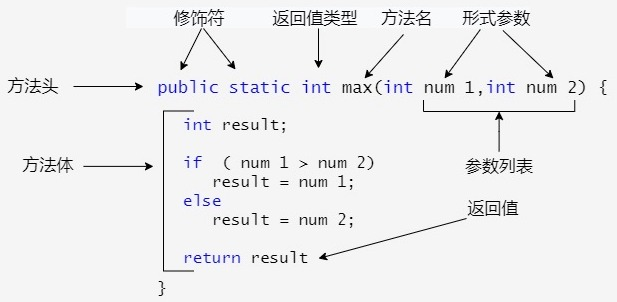
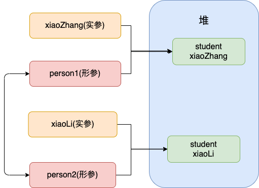
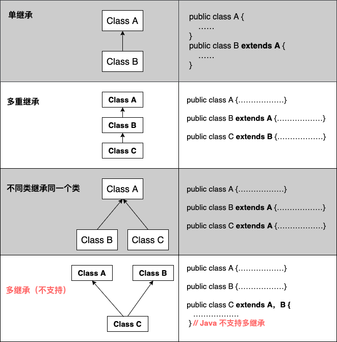
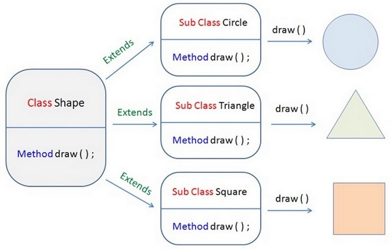

## 1. 面向对象概念

Java 语言提供类、接口和继承等面向对象的特性，为了简单起见，只支持类之间的单继承，但支持接口之间的多继承，并支持类与接口之间的实现机制（关键字为 `implements`）。Java 语言全面支持动态绑定，而 C++语言只对虚函数使用动态绑定。总之，Java 语言是一个纯的面向对象程序设计语言。

### 1.1. 面向对象的特征

面向对象有以下四大特征：

- **抽象**：是将一类对象的共同特征总结出来构造类的过程，包括数据抽象和行为抽象两方面。抽象只关注对象有哪些属性和行为，并不关注这些行为的细节是什么。
- **继承**：是从已有类得到继承信息创建新类的过程。提供继承信息的类被称为父类(超类、基类)，得到继承信息的类被称为子类(派生类)。继承让变化中的软件系统有了一定的延续性，同时继承也是封装程序中可变因素的重要手段。
- **封装**：通常认为封装是把数据和操作数据的方法绑定起来，对数据的访问只能通过已定义的接口。面向对象的本质就是将现实世界描绘成一系列完全自治、封闭的对象。在类中编写的方法就是对实现细节的一种封装；编写一个类就是对数据和数据操作的封装。可以说，封装就是隐藏一切可隐藏的东西，只向外界提供最简单的编程接口。
- **多态**：是指允许不同子类型的对象对同一消息作出不同的响应。简单的说就是用同样的对象引用调用同样的方法但是做了不同的事情。多态性分为编译时的多态性和运行时的多态性。方法重载（overload）实现的是编译时的多态性（也称为前绑定），而方法重写（override）实现的是运行时的多态性（也称为后绑定）。运行时的多态是面向对象最精髓的东西，要实现多态需要做两件事：
    1. 方法重写（子类继承父类并重写父类中已有的或抽象的方法）。
    2. 对象造型（用父类型引用引用子类型对象，这样同样的引用调用同样的方法就会根据子类对象的不同而表现出不同的行为）。

### 1.2. 面向对象五大基本原则

- 单一职责原则 SRP(Single Responsibility Principle)：类的功能要单一
- 开放封闭原则 OCP(Open－Close Principle)：一个模块对于拓展是开放的，对于修改是封闭的
- 里式替换原则 LSP(the Liskov Substitution Principle LSP)：子类可以替换父类出现在父类能够出现的任何地方
- 依赖倒置原则 DIP(the Dependency Inversion Principle DIP)：高层次的模块不应该依赖于低层次的模块，他们都应该依赖于抽象。抽象不应该依赖于具体实现，具体实现应该依赖于抽象
- 接口分离原则 ISP(the Interface Segregation Principle ISP)：设计时采用多个与特定客户类有关的接口比采用一个通用的接口要好

## 2. Java 对象和类

### 2.1. 概念

- **类**：是一个模板，它描述一类对象的行为和状态。
- **对象**：是类的一个实例，有状态和行为。

### 2.2. 类的定义

使用 `class` 关键字来定义类。语法如下：

```java
public class 类的名称 {
}
```

#### 2.2.1. 类的属性

一个类可以包含以下类型变量：

- **局部变量**：在方法、构造方法或者语句块中定义的变量被称为局部变量。变量声明和初始化都是在方法中，方法结束后，变量就会自动销毁。
- **成员变量**：成员变量是定义在类中，方法体之外的变量。这种变量在创建对象的时候实例化。成员变量可以被类中方法、构造方法和特定类的语句块访问。
- **类变量**：类变量也声明在类中，方法体之外，但必须声明为 `static` 类型。

示例：

```java
public class Dog {
    String breed;
    int size;
    static String color;
    int age;
 
    void eat(String food) {
    }
 
    void run() {
    }
 
    void sleep(){
    }
}
```

> Notes: 通过对象直接访问成员变量，会存在数据安全问题。通常会将成员变量使用 `private` 关键字修饰，让成员变量只能在本类中被访问。如果其他类需要访问 `private` 修饰的成员变量，则要提供相应的`getXxx()`和`setXxx()`用于获取和设置成员变量的值，方法用 `public` 修饰

#### 2.2.2. 构造方法

每个类都有构造方法。如果没有显式地为类定义构造方法，Java 编译器将会为该类提供一个默认无参构造方法。

在创建一个对象的时候，至少要调用一个构造方法。构造方法的名称必须与类同名，一个类可以有多个构造方法。

```java
public class Puppy{
    // 默认无参构造方法
    public Puppy(){
    }
 
    // 这个构造器仅有一个参数：name
    public Puppy(String name){    
    }
}
```

**构造方法的特性**：

- 名字与类名相同
- 没有返回值，也不能使用 void 声明构造函数
- 创建类的对象时自动调用

> Notes: 
>
> 1. 构造方法会在创建对象的时候自动调用
> 2. 在创建的时候，构造方法只会被调用一次。而类的其他方法，可以通过对象来反复调用多次
> 3. 如果在类中手动定义了构造方法后，则**不会再为该类提供默认的无参构造方法**。

### 2.3. 对象

使用一个类，其实就是使用该类的成员(成员变量和成员方法)。而要想使用一个类的成员，就必须首先拥有该类的对象。

#### 2.3.1. 创建对象

对象是根据类创建的。在Java中，使用关键字 new 来创建一个新的对象。创建对象需要以下三步：

- 声明：声明一个对象，包括对象名称和对象类型。
- 实例化：使用关键字 `new` 来创建一个对象。
- 初始化：使用 `new` 创建对象时，会调用构造方法初始化对象。

```java
类名 对象名 = new 类名();
```

#### 2.3.2. 访问实例变量和方法

通过已创建的对象来访问成员变量和成员方法，如下所示：

```java
/* 实例化对象 */
Object referenceVariable = new Constructor();
/* 访问类中的变量 */
referenceVariable.variableName;
/* 访问类中的方法 */
referenceVariable.methodName();
```

> 注：示例的变量与方法均为 `public` 修饰

#### 2.3.3. Java 中使用变量，遵循“就近原则”

在使用变量时需要遵循的原则为：**就近原则**。顺序如下：

局部 -> 本类成员 -> 父类成员 -> Object 有就使用，没有就报错。

### 2.4. 匿名对象

#### 2.4.1. 匿名对象定义语法格式

正常有名字的对象：

```java
Person p = new Person();
```

匿名对象：

```java
new Person();
```

当方法的返回值是对象的话，可以继续调用方法

```java
public class Person {
    // ...省略
    public Person show() {
        System.out.println(this.name + "xxx");
        return this;
    }

    // show 之后的返回值是对象，所以可以继续调用方法method
    public static void main(String[] args) {
        int age = new Person().show().getAge();
    }
}
```

#### 2.4.2. 匿名对象的特点

- 没有任何引用变量指向。
- 在调用完方法后就会成垃圾，会在垃圾回收器(gc)空闲的时候将对象进行回收。

#### 2.4.3. 匿名对象和有名对象调用方法的区别

- 有名对象：在创建对象的代码量多些，后续可以使用变量名多次调用方法。
- 匿名对象：在创建对象的代码量少些，但创建对象后只能调用一次方法。

#### 2.4.4. 使用场景

- 当对象只调用一个成员方法一次的时候，后面不再使用这个对象，可以使用匿名对象(减少代码量)
- 作为方法的实参参数

### 2.5. 成员变量和局部变量的区别

1. 在类中的位置不同
    - 成员变量：类中，方法外
    - 局部变量：方法中或者方法声明上(形式参数)
2. 作用域不同
    - 成员变量：针对整个类有效
    - 局部变量：只在某个范围内有效。(一般指的就是方法块内)
3. 在内存中存储的位置不同
    - 成员变量：存储在堆内存中
    - 局部变量：存储在栈内存中
4. 生命周期不同
    - 成员变量：随着对象的创建而存在，随着对象的消失而消失
    - 局部变量：在方法被调用，或者语句被执行的时候存在；当方法调用完，或者语句结束后，就自动释放
5. 初始化值的问题
    - 成员变量：有默认值(int/byte/short/lnng 默认是 0；char 默认是 `\u0000`；double/float 默认是 0.0；boolean 默认是 false)
    - 局部变量：没有默认值。必须先定义，赋值，才能使用

### 2.6. 类实例化的顺序（重点）

Java 类的实例化的顺序是：`静态变量` -> `静态代码块` -> `成员变量（全局变量）` -> `初始化代码块` -> `构造函数`。测试示例如下：

```java
public class InitSequenceBean {

    private static String staticStr = initStaticMember();
    private String str = initOrdinaryMember();

    static {
        System.out.println("静态代码块执行了....");
    }

    {
        System.out.println("初始化代码块执行了....");
    }

    public InitSequenceBean() {
        System.out.println("无参构造函数执行了....");
    }

    private static String initStaticMember() {
        System.out.println("静态成员变量初始化....");
        return "123";
    }

    private String initOrdinaryMember() {
        System.out.println("普通成员变量初始化....");
        return "abc";
    }
}
```

测试代码与结果

```java
@Test
public void testInitializationSequence() {
    InitSequenceBean bean = new InitSequenceBean();
    System.out.println(bean);
    /*
     * 测试结果：
     *  静态成员变量初始化....
     *  静态代码块执行了....
     *  普通成员变量初始化....
     *  初始化代码块执行了....
     *  无参构造函数执行了....
     *  com.moon.java.basic.InitSequenceBean@ba8a1dc
     */
}
```

## 3. Java 方法

### 3.1. 概念

Java方法是语句的集合，它们在一起执行一个功能。

- 方法是解决一类问题的步骤的有序组合
- 方法包含于类或对象中
- 方法在程序中被创建，在其他地方被引用

```java
public class Dog {

    void eat(String food) {
    }
 
    void run() {
    }
 
    void sleep(){
    }
}
```

一个类可以拥有多个方法，在上面的例子中：`eat()`、`run()`、`sleep()` 都是 Dog 类的方法。

### 3.2. 方法的定义语法

一般情况下，定义一个方法包含以下语法：

```java
修饰符 返回值类型 方法名(参数类型 参数名1, 参数类型 参数名2, ...){
    ...
    方法体
    ...
    return 返回值;
}
```



方法包含一个方法头和一个方法体。下面是一个方法的所有部分：

- 修饰符：修饰符，这是可选的，告诉编译器如何调用该方法。定义了该方法的访问类型。
- 返回值类型：方法可能会有返回值，`returnValueType` 是用于限定方法返回值的数据类型。有些方法执行所需的操作，但没有返回值。在这种情况下，`returnValueType` 是关键字 `void`。
- 方法名：是方法的实际名称。方法名和参数表共同构成方法签名。
- 参数类型与参数名：参数像是一个占位符。当方法被调用时，传递值给参数。这个值被称为实参或变量。参数列表是指方法的参数类型、顺序和参数的个数。参数是可选的，方法可以不包含任何参数。
- 方法体：方法体包含具体的语句，定义该方法的功能。
- `return`（可选）：结束方法，若有返回值，则返回给调用者。

### 3.3. 形参 & 实参

#### 3.3.1. 概念

参数在程序语言中分为：

- **实参（实际参数、argument）**：用于传递给函数/方法的参数，可以是常量、变量、表达式、函数等。无论实参是何种类型，在调用函数时，它们都必须具有确定的值， 以便把这些值传送给方法的形参。
- **形参（形式参数、parameter）**：由于它不是实际存在的变量，所以又称虚拟变量。用于定义函数/方法时使用的参数列表，用于接收调用该函数时传入的实参，将实参赋值给形参。*因而，调用函数/方法时必须注意实参的个数、类型应与形参一一对应，并且实参必须要有确定的值。*

```java
String hello = "Hello!";
// hello 为实参
sayHello(hello);
// str 为形参
void sayHello(String str) {
    System.out.println(str);
}
```

#### 3.3.2. 形参与实参使用总结

- 定义位置与使用范围：形参出现在函数定义中，在整个函数体内都可以使用，离开该函数则不能使用；实参出现在主调函数中，进入被调函数后，实参变量也不能使用。
- 两者的功能是数据传送：函数调用时，主调函数把实参的值传送给被调函数的形参从而实现主调函数向被调函数的数据传送。
- 形参变量只有在被调用时才分配内存单元，在调用结束时， 即刻释放所分配的内存单元。因此，形参只有在函数内部有效。函数调用结束返回主调函数后则不能再使用该形参变量。
- 在进行函数调用时，实参都必须具有确定的值，以便把这些值传送给形参。
- 实参和形参在数量上、类型上、顺序上应严格一致，否则会发生“类型不匹配”的错误。
- **函数调用中发生的数据传送是单向的**。只能把实参的值传送给形参，而不能把形参的值反向地传送给实参。因此在函数调用过程中，形参的值发生改变，而实参中的值不会变化。 
- 当形参和实参不是引用类型时，在该函数运行时，形参和实参是不同的变量，它们在内存中位于不同的位置，形参将实参的内容复制一份，在该函数运行结束的时候形参被释放，而实参内容不会改变；而如果函数的参数是引用类型变量，在调用该函数的过程中，传给函数的是实参的地址（也是复制的），在函数体内部使用的也是实参的地址，即使用的就是实参本身。所以在函数体内部可以改变实参对象中的值，**但不能改变其引用地址**！！

### 3.4. 值传递 & 引用传递

程序设计语言将实参传递给方法（或函数）的方式分为两种：

- **值传递**：指的是在方法调用时，方法接收的是实参值的拷贝，会创建副本，传递后就互不相关了。
- **引用传递**：指的是在方法调用时，方法接收的直接是实参所引用的对象在堆中的地址，不会创建副本，即传递前和传递后都指向同一个引用（也就是同一个内存空间）。对形参的修改将影响到实参。

很多程序设计语言（比如 C++、 Pascal）提供了两种参数传递的方式，<font color=red>**值得注意的是，在 Java 中只有值传递**</font>。

### 3.5. Java 只有通过值传递参数

调用一个方法时必须按照参数列表指定的顺序提供参数。

> Notes: 程序设计语言中有关将参数传递给方法（或函数）的一些专业术语。**按值调用(call by value)表示方法接收的是调用者提供的值，而按引用调用（call by reference)表示方法接收的是调用者提供的变量地址。一个方法可以修改传递引用所对应的变量值，而不能修改传递值调用所对应的变量值。**它用来描述各种程序设计语言（不只是Java)中方法参数传递方式。

Java 程序设计语言总是采用按值调用。即：<font color=red>**方法得到的是所有参数值的一个拷贝，方法不能修改传递给它的任何参数变量的内容**</font>。

案例证明：

```java
public class Person {
    private String name;
   // 省略构造函数、Getter&Setter方法
}

public static void main(String[] args) {
    Person xiaoZhang = new Person("小张");
    Person xiaoLi = new Person("小李");
    swap(xiaoZhang, xiaoLi);
    System.out.println("xiaoZhang:" + xiaoZhang.getName());
    System.out.println("xiaoLi:" + xiaoLi.getName());
}

public static void swap(Person person1, Person person2) {
    Person temp = person1;
    person1 = person2;
    person2 = temp;
    System.out.println("person1:" + person1.getName());
    System.out.println("person2:" + person2.getName());
}
```

输出结果：

```
person1:小李
person2:小张
xiaoZhang:小张
xiaoLi:小李
```

解析：两个引用类型的形参互换并没有影响实参啊！因为 swap 方法的参数 person1 和 person2 只是拷贝的实参 xiaoZhang 和 xiaoLi 的地址。因此，person1 和 person2 的互换只是拷贝的两个地址的互换罢了，并不会影响到实参 xiaoZhang 和 xiaoLi。



### 3.6. 方法重载(Overload)

方法重载(overloading) 是在一个类里面，定义方法名字相同，而参数不同、返回类型可以相同也可以不同的相关方法（与返回值类型无关）。每个重载的方法（或者构造函数）都必须有一个独一无二的参数类型列表。**最常见就是构造器的重载**。

<font color=purple>**重载(Overload)是一个类中多态性的一种表现**</font>。方法重载的规则如下：

- 被重载的方法必须改变参数列表(参数个数、类型、顺序，其中一项不相同即可)
- 被重载的方法可以改变返回类型
- 被重载的方法可以改变访问修饰符
- 被重载的方法可以声明新的或更广的检查异常
- 方法能够在同一个类中或者在一个子类中被重载

> Notes: <font color=red>**不能以返回值类型、访问权限、抛出的异常（数量）等不同作为重载函数的区分标准**</font>

### 3.7. 方法的特点总结

在调用方法的时候，Java 虚拟机会通过参数列表的不同来区分同名的方法。方法有如下特点：

1. 方法不调用，不执行。
2. 编写方法的时候不能嵌套定义，但是能嵌套调用。
3. 写方法不能提高程序的效率。
4. 方法能提高代码的复用性。
5. 方法的参数如果是基本数据类型：形式参数的改变不影响实际参数。
6. 如果参数是引用数据类型：形式参数的改变（只是引用对象内的属性值）直接影响实际参数

### 3.8. 扩展：native（本地）方法

native 方法表示该方法要用另外一种依赖平台的编程语言实现的。

例如，`FileOutputStream` 类需要与硬件打交道，底层的实现用的是操作系统相关的 API 实现。若在 windows 系统则需要用 c 语言实现的，所以，查看 jdk 的源代码，可以发现 `FileOutputStream` 的 `open` 方法的定义如下：

```java
private void open(String name, boolean append) throws FileNotFoundException {
    open0(name, append);
}

private native void open0(String name, boolean append) throws FileNotFoundException;
```

使用 Java 是无法直接调用别人写的 C 语言函数，需要按照 Java 的要求写一个 C 语言的函数，再用这个 C 语言函数去调用别人的 C 语言函数。由于是按 Java 的要求来写的，所以这个 C 语言函数就可以与 Java 对接上，Java 那边的对接方式就是定义出与这个 C 函数相对应的方法，Java 中对应的方法不需要写具体的代码，但需要在前面声明 native。

> Tips: native 方法不能是抽象的，不能与 `abstract` 混用

## 4. 组合和继承

**Java中类与类之间常见的关系**

- 组合关系
- 继承关系
- 代理模式关系

### 4.1. 组合

一个类型A中的成员变量的数据类型是类型B时，此时A和B就是组合关系。

即A类中的成员变量的数据类型是B类。例如：Student 类中 String 类型的属性就是组合关系。

### 4.2. 继承

#### 4.2.1. 概念

继承就是子类继承父类的特征和行为，使得子类对象（实例）具有父类的实例域和方法，或子类从父类继承方法，使得子类具有父类相同的行为。

继承是面向对象四大特征(封装、继承、多态、抽象)之一，面向对象重点。是类与类之间关系的一种。从类与类之间设计角度看，子类必须是父类的一种才可能使用继承

> Tips: 继承是实现多态的前提。

#### 4.2.2. 继承的好处

1. 解决代码复用的常用方式
2. 提高了代码的扩展性
3. 为多态提供前提条件

#### 4.2.3. 继承的语法格式 (extends 关键字)

使用 extends 关键字来实现继承，而且所有的类都是继承于 `java.lang.Object`，当一个类没有继承相关的关键字时，则默认继承 Object（这个类在 java.lang 包中，不需要 `import` 导入）祖先类。

```java
public class 子类名 extends 父类名{
}
```

### 4.3. 继承的类型

Java 只<font color=red>**支持单继承，不支持多继承**</font>(即 `extends` 后面不能跟多个父类)。但支持多层继承，例如：

```java
Foo extends Bar;
// 这样 Foo 就是间接继承了父类 SuperBar
Bar extends SuperBar;
```



### 4.4. 继承的特点

1. <font color=red>子类拥有(除构造方法以外)父类的所有成员(成员变量和成员方法)</font>
2. <font color=red>子类能够直接访问父类非 `private` 修饰的成员</font>
3. 子类可以在父类的基础上添加特有属性
4. 子类可以对父类的方法进行功能扩展(方法重写)
5. 子类可以在父类的基础上添加特有的方法
6. 构造方法不能被继承，但是子类可以<font color=red>通过 `super` 关键字间接调用父类的构造方法</font>。实际中一般成员变量都用 `private` 修饰，父类的成员变量要提供相应的 getXxx/setXxx 方法让子类调用来访问

### 4.5. 继承的注意事项

- 每个类都直接或者间接继承 Object 父类。当一个类没有明显继承其他类时，都隐藏一个 `extends Object` 的父类
- Object 类是所有类的父类（超类）
- 子类并不是父类的一个子集。实际上，一个子类通常比它的父类包含更多的信息和方法。一般情况下，最好能为每个类提供一个无参构造方法，以便于对该类进行扩展，同时避免错误。

### 4.6. 方法重写(Override)

#### 4.6.1. 概念与语法规则

重写是子类对父类的允许访问的方法的实现逻辑进行重新编写，**即跟父类的方法声明完全一样，只是方法体核心逻辑不一样**！方法重写有如下要求：

- 需要存在父子关系
- 方法名相同
- 参数列表相同(类型、个数、顺序均一致)
- 返回值类型相同，或者是原方法返回的子类类型

> Notes: 与方法重载不一样地方是：方法名、参数列表、返回值全部一致。（*返回值可以是子类*）

#### 4.6.2. 方法重写的注意事项

- 子类重写父类的方法后，通过子类对象调用的是重写后的方法。
- <font color=red>子类在重写父类方法时，访问权限修饰符要大于或等于(`>=`)父类的方法访问权限修饰符</font>。(`private < 默认 < protected < public`)。一般重写方法都修饰符一致即可。
- 如果父类的方法用 `private` 修饰，则不能被子类重写，即使子类有声明一样的方法，也不属于重写，属于定义了一个同名的新方法
- 当需要扩展父类方法(父类方法功能不能满足需求时)，就可以使用方法重写。最常用的用法是，在重写的方法中用 `super.xxx()`，这样既保留父类的功能，双达到增强功能的效果。

```java
@Override
public void xxx(){
    super.xxx();
    ....
}
```

- 重写方法不能抛出新的检查异常或者比被重写方法申明更加宽泛的异常。例如：父类的一个方法申明了一个检查异常 `IOException`，但是在重写这个方法的时候不能抛出 `Exception` 异常，因为 `Exception` 是 `IOException` 的父类，抛出 `IOException` 异常或者 `IOException` 的子类异常。
- 被 `final` 关键字修饰的方法不能被重写。
- 构造方法不能被重写。
- 如果某个类与另一个类不存在继承关系，则不能重写对方的方法。
- 子类与父类所在包的位置，会影响可重写的方法范围也有区别：
    - 子类和父类在同一个包中，那么子类可以重写父类中声明为非 `private` 和非 `final` 的所有方法。
    - 子类和父类不在同一个包中，那么子类只能够重写父类的声明为 `public` 和 `protected` 修饰的非 `final` 方法。
- 声明为 `static` 的方法不能被重写，但是能够被再次声明（相当于方法重载）。

#### 4.6.3. @Override 注解

`@Override`	注解用来修饰方法，表示该方法是重写父类的方法。如果修饰的方法在父类中没有找到，则编译失败。

```java
class Animal{
    public void move(){
        System.out.println("动物可以移动");
    }
}
 
class Dog extends Animal{
    @Override
    public void move(){
        System.out.println("狗可以跑和走");
    }
}
```

#### 4.6.4. 重写与重载的区别

|  区别点  |  重载方法  |                 重写方法                 |
| ------- | --------- | --------------------------------------- |
| 参数列表 | 不能相同   | 必须一致                                 |
| 返回类型 | 可以不相同 | 必须一致                                 |
| 异常     | 可以不相同 | 可以减少或删除，一定不能抛出新的或者更广的异常 |
| 访问权限 | 可以不相同 | 一定不能做更严格的限制（可以降低限制）        |


## 5. 内部类

### 5.1. 概述

将一个类定义在另一个类中或另一个类的方法中的类，该类就称为内部类。内部类是一个相对概念。有以下特点：

- 内部类可以直接访问任何外部类的成员，包括 private 修饰的。
- 外部类编译后会出现两个 class 文件。内部类生成的 class 文件的命名：`外部类名$内部类名.class`
- 内部类分为成员内部类与局部内部类。定义时是一个正常定义类的过程，同样包含各种修饰符、继承与实现关系等。
- 在日常的企业级开发中，很少会使用到内部类来实现业务逻辑，一般用匿名内部类或成员内部类

### 5.2. 内部类4种类型

- 静态内部类
- 成员内部类
- 局部内部类
- 匿名内部类

### 5.3. 静态内部类

#### 5.3.1. 定义

定义在类内部的静态类，称为**静态内部类**。

```java
public class Out {
    private static int a;
    private int b;

    public static class Inner {
        public void print() {
            System.out.println(a);
        }
    }
}
```

例如：**Java 集合类 `HashMap` 内部就有一个静态内部类 `Entry`**。Entry 是 HashMap 存放元素的抽象，HashMap 内部维护 Entry 数组用了存放元素，但是 Entry 对使用者是透明的。像这种和外部类关系密切的，且不依赖外部类实例的，都可以使用静态内部类。

#### 5.3.2. 使用与特点

1. 静态内部类只能访问外部类所有的静态变量和静态方法，即使是 `private` 的也一样。如果要访问外部类的成员变量与方法，则必须要`new`一个外部类的对象，通过对象去访问成员变量与方法。
2. 静态内部类和一般类一致，可以定义静态变量、方法，构造方法等。
3. 其它类使用静态内部类需要使用 `外部类.静态内部类` 方式创建一个静态内部类对象，如下所示：

```java
Out.Inner inner = new Out.Inner();
inner.print();
```

### 5.4. 成员内部类

#### 5.4.1. 成员内部类定义

定义在类内部的非静态类叫作**成员内部类**，定义在成员位置的，与成员变量同级。定义格式：

```java
public class Outer{
    private String a;
    class Inner{
        // 其他代码
        // 成员变量
        // 成员方法
    }
}
```

#### 5.4.2. 访问方式

- 访问方式1：间接访问。在外部为中提供一个方法，在该方法中创建内部类的对象。
- 访问方式2：直接访问。`外部类.内部类 变量名 = new 外部类().new 内部类();`

```java
Outer.Inner x = new Outer().new Inner();
```

#### 5.4.3. 使用注意事项

1. 成员内部类可以访问外部类所有的变量和方法，包括静态和非静态，私有和公有。
2. 成员内部类**不能定义静态方法和静态变量**（final 修饰的除外），因为成员内部类是非静态的，而在 Java 的非静态代码块中不能定义静态方法和静态变量。
3. 当内部类和外部类出现同名的成员时，默认访问的是内部类的成员，内部类如果要访问外部类的成员，则需要使用以下格式：

```java
外部类.this.成员变量;
外部类.this.成员方法(参数列表);
```

4. 外部类要访问成员内部类的属性或者调用方法，必须要创建一个内部类的对象，使用该对象访问属性或者调用方法。
5. 其他的类要访问普通内部类的属性或者调用普通内部类的方法，必须要在外部类中**创建一个成员内部类类型的对象作为属性**，外同类可以通过该属性访问到成员内部类的对象，再通过成员内部类的对象来调用方法或者访问内部类的属性

#### 5.4.4. 使用场景

- 当一个类只被一个类使用时，就可以该类定义为某一个类的内部类。
- 在描述事物A时，发现事物A中还包含了另一类事物B，而且事物B要使用到事物A的一些成员数据，此时就可以将事物 B定义为事物A的内部类。

#### 5.4.5. 使用案例

```java
public static void main(String[] args) {
    // 创建汽车对象
    Car c = new Car(true);
    Car.Engine e = c.new Engine();
    // 将创建出来的发动机对象调用work方法
    e.work();
    System.out.println("================");
    // 另一种创建内部类对象的方法
    Car.Engine e1 = new Car(false).new Engine();
    e1.work();
}

// 新建一个发动机类
class Car {
    private boolean status;

    public Car(boolean status) {
        super();
        this.status = status;
    }

    public Car() {
        super();
    }

    // 新建一个发动机内部类
    class Engine {
        // 直接使用car类中的成员变量
        public void work() {
            if (status) {	// 内部类可以直接访问任何外部类的成员，包括 private 修饰的。
                System.out.println("发动机就飞速旋转。");
            } else {
                System.out.println("发动机停止工作。");
            }
        }
    }
}
```

### 5.5. 局部内部类

定义在外部类的某一个成员方法中的类，叫作**局部内部类**。定义格式：

```java
public class Outer{
    public void method{
        class Inner{
            //其他代码
        }
    }
}
```

定义在实例方法中的局部类可以访问外部类的所有变量和方法；定义在静态方法中的局部类只能访问外部类的静态变量和方法

**访问格式**：只能在成员方法内部创建该内部类的对象，调用相关方法。

**使用场景**：如果一个类只在某个方法中使用，则可以考虑使用局部类。

**注意事项**：

- 局部内部类不能使用权限修饰符。
- 局部内部类中如果要访问方法中的局部变量，
    - JDK1.8 之前该局部变量需要使用 `final` 修饰。
    - JDK1.8 之后该局部变量可以不用 `final` 修饰，但也不能修改。

### 5.6. 匿名内部类

#### 5.6.1. 概述与前提

**匿名内部类**是指，通过继承一个父类或者实现一个接口的方式，直接定义并创建实例对象的类。

<font color=red>**匿名内部类只继承一个父类或者实现一个接口，同时它也是没有 class 关键字，这是因为匿名内部类是直接使用 `new` 关键字生成一个对象的引用**</font>。可以理解为将定义子类与创建子类对象两个步骤由一个格式一次完成，两个步骤是连在一起的、即时的。

> Tips: 匿名内部类是局部内部类的一种。

#### 5.6.2. 匿名内部类使用格式

匿名内部类如果不定义变量引用，则也是匿名对象。格式如下：

```java
new (父)类或接口(){
    // 重写需要重写的方法
};
```

#### 5.6.3. 匿名内部类使用说明

- **过程**：
    - 临时定义一个类型的子类
    - 定义后即刻创建刚刚定义的这个类的对象
- **目的**：
    - 匿名内部类是创建某个类型子类对象的快捷方式。
    - 我们为了临时定义一个类的子类，并创建这个子类的对象而使用匿名内部类。
- **常见问题**：
    - 匿名内部类无法定义构造方法，因为没有类名；
    - 匿名内部类可以定义特有的方法和变量；但是无法去访问。所以一般不会这样添加。
- **特点**：
    1. 匿名内部类编译后也会出现两个 class 文件。匿名内部类生成的 class 文件的命名：`外部类名$1.class`, 如果第2次创建的话，就是`外部类名$2.class`，如此类推。例：`Test2_02$1.class`
    2. 创建出来的匿名内部类对象可以直接使用一次。可以用于直接赋值，也可以将地址值赋给父类/接口类型的对象。这样可以多次使用。匿名内部类主要是省了不用创建子类.java。
    3. 匿名内部类必须继承一个抽象类或者实现一个接口
    4. 匿名内部类不能定义任何静态成员和静态方法
    5. 当所在的方法的形参需要被匿名内部类使用时，必须声明为 final。因为**生命周期不一致**，局部变量直接存储在栈中，当方法执行结束后，非final的局部变量就被销毁。而局部内部类对局部变量的引用依然存在，如果局部内部类要调用局部变量时，就会出错。声明 final 可以确保局部内部类使用的变量与外层的局部变量区分开，解决生命周期不一致的问题。
    6. 匿名内部类不能是抽象的，它必须要实现继承的类或者实现的接口的所有抽象方法

```java
public static void main(String[] args) {
    // 定义匿名内部类，调用参加运动会的方法
    Sport s = new Sport() {
        @Override
        public void run() {}
    };
    enter(s);
    System.out.println("===========================");
    // 匿名内部类，其实就是在一个类中直接创建一个匿名的子类对象，可以直接使用。
    // 如果需要多次使用的话，要用一个父类对象或接口对象接收。
    enter(new Sport() {
        @Override
        public void run() {}
    });
}
// 定义一个方法，以接口作为参数，输入参加是否参加运会
public static void enter(Sport s) {
    System.out.println("参加运动会，奔跑吧。");
}
```

### 5.7. 内部类的优点

- 一个内部类对象可以访问创建它的外部类对象的内容，包括私有数据！
- 内部类不为同一包的其他类所见，具有很好的封装性；
- 内部类有效实现了“多重继承”，优化 java 单继承的缺陷。
- 匿名内部类可以很方便的定义回调。

### 5.8. 内部类的应用场景

1. 一些多算法场合
2. 解决一些非面向对象的语句块
3. 适当使用内部类，使得代码更加灵活和富有扩展性
4. 当某个类除了它的外部类，不再被其他的类使用时

## 6. 抽象类与抽象方法

### 6.1. 抽象方法的概念

使用 `abstract` 修饰，没有方法体的方法就是抽象方法。抽象方法没有定义，方法名后面直接跟一个分号，而不是花括号。
	
**抽象方法定义格式**：

```java
权限修饰符(public) abstract 返回值类型 方法名(参数列表);
```

> Notes: 该方法的具体实现由它的子类确定

### 6.2. 抽象类的概念

被 `abstract` 修饰的类就是抽象类，具有抽象方法的类就是必须是一个抽象类。抽象类除了不能实例化对象之外，类的其它功能依然存在，成员变量、成员方法和构造方法的访问方式和普通类一样。

**抽象类的作用**是：用来描述一种类型应该具备的基本特征和行为(功能/方法)，实现这些功能就由子类通过方法重写来完成。

**抽象类的定义格式**：

```java
权限修饰符(public) abstract class 类名{
	// ...
}
```

> Tips: 
>
> - <font color=red>**子类继承抽象类的话，就必须要重写抽象类中的抽象方法**</font>
> - 什么情况下要定义抽象类和抽象方法？当某种功能(方法)无法确定的时候，子类都需要重写该方法的时候，就将方法定义成抽象方法。

### 6.3. 抽象类的特点

- 抽象类和抽象方法必须使用 `abstract` 修饰。
- 抽象类不能直接创建对象（初学者很容易犯的错）。如果被实例化，就会报错，编译无法通过。只能通过子类继承抽象类，进行创建子类对象，调用重写方法等操作。
> 不能直接创建的原因是，如果可以创建对象后，就是说对象可以调用抽象类中的抽象方法，但抽象方法没有什么作用，这样调用就没有意义。为了避免这个不必要的操作，就规定抽象类不能直接创建对象。
- 抽象类中是可以不定义抽象方法(*但一般不会这样操作，在适配器模式会使用到*)，但是有抽象方法的类必定是抽象类。
- 构造方法，类方法（用 `static` 修饰的方法）不能声明为抽象方法。因为抽象方法需要被子类实现的，静态方法无法被重写。
- 子类继承了抽象类时必须重写抽象类中的所有抽象方法，否则该子类也要定义为抽象类。
- 抽象类中可以有构造方法，意义是让子类可以能过 `super` 调用父类的构造方法给父类的成员变量赋值
- 一个抽象类不作为父类出现，没有任何意义。
- 抽象类中可以定义普通方法(非抽象方法)。
- 抽象关键字 `abstract` 不能和 `private` 关键字一起使用。<font color=red>因为一般继承了抽象类的子类，要求要重写全部的抽象方法，如果用 `private` 关键字修饰了，就不能重写该方法，就相互矛盾。</font>
- 抽象类可以继承普通类。
- 抽象类可以定义静态的 `main` 方法。

> Tips: 只要记住**抽象类与普通类的唯一区别就是不能创建实例对象和允许有 `abstract` 修饰的方法**。要理解抽象类的本质和作用，可以思考自己就是 Java 语言的设计者，你是否会提供这样的支持，如果不提供的话，有什么理由吗？如果你没有道理不提供，那答案就是肯定的了。

## 7. this / super 关键字

### 7.1. this 关键字的作用

Java 中使用变量，遵循“就近原则”：局部 -> 本类成员 -> 父类成员 -> Object 有就使用，没有就报错。

`this` 关键字可以用来解决局部变量和成员变量重名的问题。如：

- 代表本类当前对象的引用（谁调用，this 就代表谁）
- 调用本类的其他构造方法
- 访问本类的其他成员（成员变量和成员方法）

使用时注意问题：不能在静态方法中使用 `this` 关键字。

### 7.2. this / super 的使用

`this` 关键字用于访问本类的成员变量、成员方法、构造方法等；而当父类和子类出现同名的成员变量与成员方法时，则需要通过`super`关键来访问父类的成员变量与成员方法。

#### 7.2.1. this / super 访问成员变量

- `this.成员变量`：先在本类中查找，本类找不到，去父类找，父类直到到找不到则报错
- `super.成员变量名`：直接去父类中查找指定的成员变量，如果父类中没有，再往上找，找到 Object 没有，则报错。

#### 7.2.2. this / super 访问成员方法

- `this.成员方法(参数列表)`：先调用本类的，本类找不到，则调用父类的，父类直到到找不到则报错。
- `super.成员方法(参数列表)`：直接去父类中查找指定的成员方法，如果父类中没有，再往上找，找到 Object 没有，则报错。

#### 7.2.3. this / super 访问构造方法

**`this` 访问本类构造方法(注意：没有"`.`")**：

- `this()`：访问本类无参数构造方法。
- `this(参数列表)`：访问本类有参数构造方法。

****super** 访问父类的构造方法(注意：没有"`.`")**

- `super()`：调用父类无参构造方法
- `super(参数列表)`：调用父类有参构造方法

**`this`/`super` 调用构造方法的注意事项**：

1. **必须是在构造方法中使用，并且在第一行有效语句**。不能在非构造方法中通过 `this()`/`super()` 调用本类/父类构造方法。
2. `this` 只会在本类找对应构造方法，不会去父类查找，因为父类的构造方法是不能被继承的。
4. <font color=red>**`this()` 和 `super()` 不能同时出现在构造方法中**</font>。

### 7.3. this 与 super 的区别

- `super`：它引用当前对象的直接父类中的成员（用来访问直接父类中被隐藏的父类中成员数据或函数，基类与派生类中有相同成员定义时如：`super.变量名`、`super.成员函数据名`（实参）
- `this`：它代表当前对象名（在程序中易产生二义性之处，应使用 this 来指明当前对象；如果函数的形参与类中的成员数据同名，这时需用 this 来指明成员变量名）
- `super()` 和 `this()` 的用法类似，均需放在构造方法内第一行。区别是，`super()` 在子类中调用父类的构造方法，`this()` 在本类内调用本类的其它构造方法。
- `super()` 和 `this()` 不能同时出现在一个构造函数里面，因为 this 必然会调用其它的构造函数，其它的构造函数必然也会有 super 语句的存在，所以在同一个构造函数里面有相同的语句，就失去了语句的意义，编译器也不会通过。
- `this()` 和 `super()` 都指的是对象，所以，均不可以在 `static` 环境中使用。包括：`static` 变量、`static` 方法、`static` 语句块。

尽管可以用 this 调用一个构造器，但却不能调用两个。从本质上讲，this 是一个指向本对象的指针，然而 super 是一个 Java 关键字。

### 7.4. 构造方法调用注意事项

1. 当通过子类创建对象时，默认会先调用父类的无参数构造方法。子类的每一个构造方法中，如果方法体没有显示指定父类构造方法，都默认首行隐藏 `super();` 语句来调用父类的无参构造方法。
2. 如果需要调用父类的有参构造方法，就在创建子类对象时的有参构造方法体首行中写上 `super(xxx, xxx, ...);` 语句。当通过手动调用父类构造方法时，就不会默认再调用父类无参数构造方法;
3. 通过 `super` 调用父类的构造方法时，该语句必须是第一行有效语句，必须在构造方法中使用
4. 不能在子类的非构造方法中通过 `super` 调用父类的构造方法

<font color=red>**总结：`this` 用于调用本类的构造方法，`super` 用于调用父类的构造方法**</font>

> Tips: 
>
> - 创建子类对象，**不会创建父类对象，默认调用父类的构造方法只是为了给父类的成员变量赋值**。
> - Java 程序在执行子类的构造方法之前，如果该构造方法中没有显示使用 `super()` 来调用父类特定的构造方法，则会默认调用父类中“无参构造方法”。如果父类中只定义了有参数的构造方法，而在子类的构造方法中又没有用 `super()` 来调用父类中特定的构造方法，则编译时将发生错误，因为 Java 程序在父类中找不到无参的构造方法可供执行。因此建议父类里显式加上无参构造方法，从而避免编译错误。

## 8. 接口

### 8.1. 接口的概述

接口（英文：Interface），在 JAVA 编程语言中是一个抽象类型，是抽象方法的集合。可以理解为，接口是用来描述功能集合，只描述功能所具备的方法，具体如何实现这些功能由实现类通过方法重写完成。

接口并不是类，编写接口的方式和类很相似，但是它们属于不同的概念。类描述对象的属性和方法。接口则包含类要实现的方法。接口通常以 `interface` 关键字来声明。一个类通过实现接口的方式，从而来继承接口的抽象方法。除非实现接口的类是抽象类，否则该类要定义接口中的所有方法。实现类可以理解成接口的“子类”。

接口无法被实例化，但是可以被实现。一个实现接口的类，必须实现接口内所描述的所有方法，否则就必须声明为抽象类。另外，在 Java 中，接口类型可用来声明一个变量，他们可以成为一个空指针，或是被绑定在一个以此接口实现的对象。

> Tips: 接口也是一种引用数据类型，比抽象类更加抽象的“类”，但实质不是类。但在多态中使用中可以当成“类”。

### 8.2. 接口的声明语法

使用 `interface` 关键字来定义接口，接口名与类名的命名规则一致。接口的声明语法格式如下：

```java
[权限修饰符] interface 接口名 [extends 其他的接口名] {
    // 声明变量
    String FOO = "foo"; // 默认是 public static final 修饰
    // 抽象方法，必须是 public 类型
	public void method1();
	public int method2(方法参数...);
	String method3(方法参数...); // 省略权限修饰符与 abstract 抽象关键字，默认是 public abstract 修饰
	....
}
```

接口定义的语法注意点：

- 接口是隐式抽象的，当声明一个接口的时候，不必使用 `abstract` 关键字。
- 接口中的定义的方法全部都是抽象方法（JDk 1.8 以后，接口可以定义普通默认方法），无具体的逻辑实现。可以省略 `abstract` 关键字，因为在接口中默认是抽象方法。
- 接口可以定义成员变量，默认是 `public static final` 修饰的变量
- 接口的所有方法默认是 `public abstract` 修饰的方法，可以省略不写，但权限类型必须是 `public`。

示例：

```java
public interface DemoInterface {

    String FOO = "foo";
    
    void foo();

    default void bar(){
        // do something...
    };
}
```

### 8.3. 接口的实现语法

当类实现接口的时候，必须实现接口中所有的方法。否则，该类必须声明为抽象的类。**类可以同时实现多个接口**。

类使用 `implements` 关键字实现接口。在类声明中，`implements` 关键字放在 `class` 声明后面。语法格式如下：

```java
public class 实现类名称 implements 接口名称[, 接口2名称, 接口3名称..., ...] {
    // 实现接口所有抽象方法
}
```

示例：

```java
public class MammalInt implements Animal {

    @Override
    public void eat() {
        System.out.println("Mammal eats");
    }

    @Override
    public void travel() {
        System.out.println("Mammal travels");
    }

    @Override
    public int noOfLegs() {
        return 0;
    }

    public static void main(String args[]) {
        MammalInt m = new MammalInt();
        m.eat();
        m.travel();
    }
}
```

#### 8.3.1. 重写接口中声明的方法注意规则

- 类在实现接口的方法时，不能抛出强制性异常，只能在接口中，或者继承接口的抽象类中抛出该强制性异常。
- 类在重写方法时要保持一致的方法名，并且应该保持相同或者相兼容的返回值类型。否则该方法不是实现接口的抽象方法，而属于类自身定义的方法。
- 如果实现接口的类是抽象类，那么可以不实现该接口的抽象方法。

#### 8.3.2. 实现接口注意规则

- 一个类可以同时实现多个接口。
- 一个类只能继承一个类，但是能实现多个接口。
- 一个接口能继承另一个接口，这和类之间的继承比较相似。

### 8.4. 接口特性

- 接口中每一个方法均为隐式的抽象方法，接口中的方法会被隐式的指定为 `public abstract`（其他修饰符都会报错），可以省略不写。
- 接口中可以含有成员变量，但是接口中的变量会被隐式的指定为 `public static final` 修饰（变量只能是 `public`，用 `private` 修饰会报编译错误），可以省略不写。
- 接口中的方法是不能在接口中实现，只能由实现接口的类来实现接口中的方法。但 Java 8 之后 接口中可以使用 `default` 关键字修饰的非抽象方法。

#### 8.4.1. JDK 1.8 版本的新特性

- JDK 1.8 以后，接口里可以有静态方法和方法体了。
- JDK 1.8 以后，接口允许包含具体实现的方法，该方法称为"默认方法"，默认方法使用 `default` 关键字修饰。

```java
public default void xxxx() {
    // do something...
}
```

#### 8.4.2. JDK 1.9 版本的新特性

- JDK 1.9 以后，允许将方法定义为 `private`，使得某些复用的代码不会把方法暴露出去。

### 8.5. 接口的继承

一个接口能继承其他接口，和类之间的继承方式比较相似。接口的继承也是使用 `extends` 关键字，子接口会继承父接口的所有方法。

在 Java 中，类的是不允许多继承，但接口是可以多继承。在接口的多继承中 `extends` 关键字只需要使用一次，在其后跟着继承所有接口，使用“,”(英文逗号)分隔。接口的继承声明语法格式如下：

```java
public interface 接口名称 extends 接口1名称[, 接口2名称, 接口3名称..., ...]
```

示例：

```java
public interface Hockey extends Sports, Event {}
```

### 8.6. 标记接口

标记接口是一种**特殊**的接口。该接口没有任何方法和属性，它仅仅用于表明它的类属于一个特定的类型，让其容易识别与分类，供特殊场景使用。

标记接口作用简单形象的说，就是给某个对象打个标（盖个戳），使对象拥有某个或某些特权。例如：`java.awt.event` 包中的 `MouseListener` 接口继承的 `java.util.EventListener` 接口定义如下：

```java
package java.util;

/**
 * A tagging interface that all event listener interfaces must extend.
 * @since JDK1.1
 */
public interface EventListener {
}
```

标记接口主要用于以下目的：

1. **建立一个公共的父接口**。正如 `EventListener` 接口，这是由几十个其他接口扩展的 Java API，可以使用一个标记接口来建立一组接口的父接口。例如：当一个接口继承了 `EventListener` 接口，Java 虚拟机(JVM)就知道该接口将要被用于一个事件的代理方案。
2. **向一个类添加数据类型**。这种情况是标记接口最初的目的，实现标记接口的类不需要定义任何接口方法(因为标记接口根本就没有方法)，但是该类通过多态性变成一个接口类型。

### 8.7. 总结

- 类实现接口时必须实现该接口中所有抽象方法，包括父接口的，如果没有全部实现，则该类应该声明成抽象类。
- 类在继承一个类的同时还可以实现多个接口。
- 抽象父类中的抽象方法可以和接口中的抽象方法同名，子类在实现父类和接口方法时，只需要重写一个即可。
- 接口中没有普通的成员变量，只能定义常量，一旦赋值就不能改变。通过 `接口名.成员变量名称` 直接调用该成员变量。
- 接口中的变量和方法均有默认修饰符。
    - 成员变量：`public static final`
    - 成员方法：`public abstract`
- 接口可以承继接口，而且可以**多继承**；实现类也要将所有父接口中的所有抽象方法进行重写。

#### 8.7.1. 接口与类的比较

**接口与类的相似点**：

- 一个接口可以有多个方法。
- 接口文件保存在 .java 结尾的文件中，文件名使用接口名。
- 接口的字节码文件保存在 .class 结尾的文件中。
- 接口相应的字节码文件必须在与包名称相匹配的目录结构中。

**接口与类的区别**：

- 接口不能用于实例化对象。
- 接口没有构造方法。
- 接口中所有的方法必须是抽象方法，Java 8 之后 接口中可以使用 `default` 关键字修饰的非抽象方法。
- 接口不能包含成员变量，除了 `static` 和 `final` 变量。
- 接口不是被类继承了，而是被类实现
- 接口支持多继承。

#### 8.7.2. 接口与抽象类的对比

从设计层面来说，抽象类是对类的抽象，是一种模板设计；接口是行为的抽象，是一种行为的规范。

**两者的相同点**：

- 接口和抽象类都不能创建对象
- 接口和抽象类都包含抽象方法，其子类都必须覆写这些抽象方法

**两者的不相同点**：

1. 声明的方式
    - 抽象类使用 `abstract` 关键字声明
    - 接口使用 `interface` 关键字声明
2. 子类继承/实现方式
    - 子类使用 `extends` 关键字来继承抽象类。如果子类不是抽象类的话，它需要提供抽象类中所有声明的方法的实现。
    - 子类使用 `implements` 关键字来实现接口，并且需要提供接口中所有声明的方法的实现。
3. 构造方法
    - 抽象类可以有构造方法。
    - 接口不能有构造方法。
4. 方法访问修饰符
    - 抽象类中的方法可以是任意访问修饰符，但抽象方法不能定义为 `private`。
    - 接口方法默认修饰符是 `public abstract`，并且不允许定义为 `private` 或者 `protected`。
5. 多继承
    - 一个类最多只能继承一个抽象类
    - 一个类可以实现多个接口
6. 成员变量、静态变量
    - 抽象类可以定义成员变量与静态变量（包括常量），并且抽象类中的成员变量可以是任意访问类型。
    - 接口不可以定义成员变量，但是可以定义常量。即接口的字段（变量）默认都是 `public static final` 修饰的类型。
7. 普通方法
    - 抽象类可以定义普通方法。即可以有方法体，就是能实现方法的具体功能
    - 接口在 JDK1.8 之前只能有抽象方法；JDK1.8 之后可以定义默认方法（使用 `default` 关键字修饰的非抽象方法）。如果有普通方法，普通方法也是可以由现实类重写。
8. 静态代码块和静态方法
    - 抽象类中可以包含静态代码块和静态方法
    - 接口在 JDK1.8 以前不能含有静态代码块以及静态方法(用 `static` 修饰的方法)，在 JDK1.8 之后可以定义静态方法。
9. 抽象类与接口之间的继承性
    - 抽象类可以实现多个接口。如果抽象类实现接口，则可以把接口中方法映射到抽象类中作为抽象方法而不必实现，而在抽象类的子类中实现接口中方法
    - 接口不可以继承抽象类(但可以继承多个接口)

#### 8.7.3. 接口和抽象类如何选择

明确该方法是否是某种数据类型的共性内容。

- 如果是共性内容，该方法就应该放到该种类型的父类中。然后再考虑该方法父类知不知道如何实现，如果父类不知道如何实现并且要求子类必须重写的，则将该方法定义为抽象方法，该父类就必须定义为抽象类。即当“我是你的一种时”使用继承(抽象类)，父类是通过不断的抽取共性内容而得出来的。
- 如果不是共性内容，该方法就应该定义到接口中，然后需要该功能的类实现接口重写方法即可。当“我应该像你一样具备某种功能时”使用接口，接口是功能的集合，只描述功能具备的方法，由实现类通过方法重写来完成，这个功能不是抽象类都有的功能的时候。

接口和抽象类各有优缺点，在接口和抽象类的选择上，必须遵守这样一个原则：

- 行为模型应该总是通过接口而不是抽象类定义，所以通常是优先选用接口，尽量少用抽象类。
- 选择抽象类的时候通常是如下情况：需要定义子类的行为，又要为子类提供通用的功能。

## 9. 多态

### 9.1. 多态的概述

同一种事物表现出来的多种形态。是面向对象的三大特征之一。

所谓多态就是指程序中定义的引用变量所指向的具体类型和通过该引用变量具体调用的方法实现在编程时并不确定，而是在程序运行期间才确定，即一个引用变量到底会指向哪个类的实例对象，该引用变量发出的方法调用到底是哪个类中实现的方法，必须在由程序运行期间才能决定。

在 Java 中有两种形式可以实现多态：**继承**（多个子类对同一方法的重写）和**接口**（实现接口并覆盖接口中同一方法）。



#### 9.1.1. 多态的前提

- 必须要子父类关系(继承)或者类实现接口的关系
- 要有方法重写
- 要有父类引用指向子类对象。如：`Parent p = new Child();`

#### 9.1.2. 多态的优缺点

**多态的好处(优点)**

- 提高了代码的灵活性和可维护性：通过多态，可以将代码编写成通用的、松耦合的形式，提高代码的可维护性。
- 提高了代码的扩展性：通过添加新的子类，可以扩展系统的功能。
- 提高了代码的复用性
- 消除类型之间的耦合关系

**多态的弊端(缺点)**

- 多态情况下，不能访问子类特有的成员变量和成员方法。即用父类和接口去作为对象类型时，创建出来的对象不能调用子类特有的方法，因为子类的方法不存在父类和接口中

### 9.2. Java 中实现多态的机制

实现多态的机制就是，<font color=red>**父类或接口定义的引用变量可以指向子类或具体实现类的实例对象**</font>。而程序调用的方法在运行期才动态绑定，就是引用变量所指向的具体实例对象的方法，也就是内存里正在运行的那个对象的方法，而不是引用变量的类型中定义的方法。

基础语法定义：

```java
父类类型 对象名 = new 子类类名();
接口类型 对象名 = new 接口实现类类名();
```

示例：

```java
public class Person{
	method1;
}

public class Student extends Person{
	@Override
	method1;
}

// 创建学生对象
// Student stu = new Student();
Person stu = new Student();	// 多态：父类引用指向子类对象


// 另外一种方法 (接口可以理解为Student的父类)
public interface Play{
	public void playGame();
}

public class Student implements Play{
	@Override
	public void playGame(){
		....
	}
}

// 创建学生对象
Play p = new Student();
```

### 9.3. 多态的转型

多态的转型分为向上转型与向下转型两种。

**向上转型**：父类引用指向子类对象的过程就是向上转型，由编译器自动完成。

```java
父类名 变量名 = new 子类类名();
```

**向下转型**：把向上转型的父类引用强制转换成子类引用。

```java
子类类型名 变量名 = (子类类型名)父类引用变量名;
```

### 9.4. 多态的使用场景

- **作为形式参数**：多态作为方法形式参数，可以接收更多数据类型的对象。
- **作为方法返回值类型**：多态作为方法返回值，可以返回更多数据类型的对象。

### 9.5. 多态的注意事项

多态情况下，当子父类出现同名的成员变量时，通过父类引用访问成员变量时，访问的是父类的成员变；当子父类出现同名的成员方法时，通过父类引用调用成员方法时，调用的是子类重写后的方法。

- <font color=purple>**成员变量属于静态绑定**</font>：在程序运行之前就确定了访问的成员变量是哪个对象的。
- <font color=purple>**成员方法属于动态绑定**</font>：在程序运行过程中才去确定调用哪个对象的，如果子类重写了，则调用子类的，否则调用父类的。

小结：

- <font color=red>**如果访问的是成员变量，编译看左边，运行也看左边。**</font>
- <font color=red>**如果调用的是成员方法，编译看左边，运行看右边。**</font>

### 9.6. 多态的实现原理

要了解多态的实现原理，需要先了解两个概念：<u>动态绑定</u>和<u>虚拟方法调用</u>。

#### 9.6.1. 动态绑定

**动态绑定（Dynamic Binding）**：指的是在编译时，Java 编译器只能知道变量的声明类型，而无法确定其实际的对象类型。而在运行时，Java 虚拟机（JVM）会通过动态绑定来解析实际对象的类型。这意味着，编译器会推迟方法的绑定（即方法的具体调用）到运行时。正是这种动态绑定机制，使得多态成为可能。

#### 9.6.2. 虚拟方法调用

**虚拟方法调用（Virtual Method Invocation）**：在 Java 中，所有的非私有、非静态和非 final 方法都是被隐式地指定为虚拟方法。虚拟方法调用是在运行时根据实际对象的类型来确定要调用的方法的机制。当通过父类类型的引用变量调用被子类重写的方法时，虚拟机会根据实际对象的类型来确定要调用的方法版本，而不是根据引用变量的声明类型。

#### 9.6.3. 实现流程综述

多态的实现原理主要是依靠“动态绑定”和“虚拟方法调用”，它的实现流程如下：

1. 创建父类类型的引用变量，并将其赋值为子类对象。
2. 在运行时，通过动态绑定确定引用变量所指向的实际对象的类型。
3. 根据实际对象的类型，调用相应的方法版本。

## 10. JavaBean

### 10.1. 概念

Java 定义一种特殊的类名为『JavaBean』，该需要满足以下三个要求：

- 类必须是 public 修饰
- 类必须有 public 的无参构造方法
- 必须为每一个成员变量提供对应的 setter & getter 方法

### 10.2. 字段与属性

在 Java 中经常提起的『字段』，其实就是成员变量，字段名就是成员变量名

1. 一般情况下，属性名就是字段名，成员变量名。
2. 另一种情况，属性名是通过 setter & getter 方法得到的。

例如：setName -> 去掉set单词 -> Name -> 首字母小写 -> name，此时 name 才是对应类的属性（字段）

```java
private String description;

public void setDesc(String description){
	this.description = description;
}

public String getDesc{
	return this.description;
}
```

<font color=red>**值得注意的是，根据 JavaBean 的定义，此时属性名是 `desc`，而非 `description`**</font>

## 11. Object 类

### 11.1. 概述

<font color=red>**`Object` 是类层次结构中的根类，所有的类都直接或者间接的继承自该类**</font>。

如果一个方法的形式参数是Object，那么这里我们就可以传递它的任意的子类对象。

### 11.2. 核心方法

#### 11.2.1. equals

```java
public boolean equals(Object obj)
```

`Object` 类 `equals` 方法用来比较两个对象是否相同。默认通过 `==` 比较两个对象的引用变量是否指向同一个内存地址，以此判断两个对象是否相同。如果需要判断对象属性的内容是否相同，则通过子类来重写 `equals` 方法。如下：

```java
@Override
public boolean equals(Object o) {
    if (this == o) return true;
    if (o == null || getClass() != o.getClass()) return false;
    Person person = (Person) o;
    return age == person.age &&
            height == person.height &&
            Objects.equals(name, person.name);
}
```

#### 11.2.2. toString

```java
public String toString() {
    return getClass().getName() + "@" + Integer.toHexString(hashCode());
}
```

父类 `Object` 类的 `toString` 方法默认返回值是 `包名.类名@对象的哈希码（十六进制）` 的字符串。此方法的调用时机：

- 直接调用：手动通过对象调用，通过`对象名.toString()`;
- 间接调用：当打印输出该对象时系统自动调用 `toString()` 方法。

通过重写 `toString` 方法即可自定义输出的内容：

```java
@Override
public String toString() {
    return new StringJoiner(", ", Person.class.getSimpleName() + "[", "]")
            .add("name='" + name + "'")
            .add("age=" + age)
            .add("height=" + height)
            .toString();
}
```

#### 11.2.3. hashCode

```java
public native int hashCode();
```

将与对象相关的信息映射成一个哈希值，**默认的实现 hashCode 值是根据对象的内存地址换算出来**。也可以通过重写方法，自定义hashCode 生成规则：

```java
@Override
public int hashCode() {
    return Objects.hash(name, age, height);
}
```

> Tips: **重写了 `equals` 方法一般都要重写 `hashCode` 方法**！

#### 11.2.4. clone

```java
protected native Object clone() throws CloneNotSupportedException;
```

Java 赋值是复制对象引用，如果想要得到一个对象的副本，使用赋值操作是无法达到目的的。此 `clone()` 方法实现了对象中各个属性的复制，但需要注意此方法的可见范围是 `protected`。

实体类使用克隆的前提是：

- 类必须实现 `Cloneable` 接口，这是一种约定，`Cloneable` 是一个标记接口，自身没有方法。在调用 `clone` 方法时，会判断是否实现 `Cloneable` 接口，无实现则抛出 `CloneNotSupportedException` 异常。
- 覆盖 `clone()` 方法，将方法的权限修饰符提升为 `public`。

##### 11.2.4.1. 浅拷贝

浅拷贝：拷贝对象和原始对象的引用类型，新旧对象引用同一个对象内存地址。

如下例中，`Person` 对象里面有个 `Student` 对象，调用 `clone` 方法之后，克隆对象和原对象的 `Student` 引用的是同一个对象，这种即是浅拷贝。


```java
public class Person implements Cloneable {

    private String name;
    private int age;
    private int height;
    private Student student;

    @Override
    public Object clone() throws CloneNotSupportedException {
        return super.clone();
    }

    public static void main(String[] args) throws CloneNotSupportedException {
        Person person = new Person();
        Student student = new Student("Moon", 16, 100);
        person.student = student;

        Person clonePerson = (Person) person.clone();
        student.setName("斩月"); // 修改原对象的属性值
        System.out.println(clonePerson.student.getName()); // 输出结果是：斩月，即浅拷贝后的对象与原对象是指向同一个对象
    }
    // ...省略getter/setter
}
```

##### 11.2.4.2. 深拷贝

深拷贝：拷贝对象和原始对象的引用类型，新旧对象引用不同的对象，修改新对象不会影响改到原对象。

如下例中，在 clone 函数中不仅调用了 `super.clone`，而且调用 `Student` 对象的 `clone` 方法（`Student` 类也要实现 `Cloneable` 接口并重写 `clone` 方法），从而实现了深拷贝。最终于打印的结果是『Moon』，可以看到拷贝`Student`对象的值不会受到原对象的影响。

```java
public class Student implements Cloneable {

    volatile private String name;
    private int age;
    private int socre;

    public Student(String name, int age, int socre) {
        this.name = name;
        this.age = age;
        this.socre = socre;
    }

    @Override
    public Object clone() throws CloneNotSupportedException {
        return super.clone();
    }
    
    // ...省略getter/setter
}


public class Person implements Cloneable {

    private String name;
    private int age;
    private int height;
    private Student student;

    @Override
    public Object clone() throws CloneNotSupportedException {
        Person p = null;
        p = (Person) super.clone();
        p.student = (Student) student.clone(); // 拷贝Student对象
        return p;
    }

    public static void main(String[] args) throws CloneNotSupportedException {
        Person person = new Person();
        Student student = new Student("Moon", 16, 100);
        person.student = student;

        Person clonePerson = (Person) person.clone();
        student.setName("斩月"); // 修改原对象的属性值
        System.out.println(clonePerson.student.getName()); // 输出结果是：Moon，即深拷贝后的对象与原对象不是同一个对象
    }
    // ...省略getter/setter
}
```

#### 11.2.5. getClass

```java
public final native Class<?> getClass();
```

方法返回此 `Object` 实例运行时的字节码对象，常用于 java 反射机制。

#### 11.2.6. wait / notify

```java
public final void wait() throws InterruptedException
public final native void wait(long timeout) throws InterruptedException;
public final void wait(long timeout, int nanos) throws InterruptedException
```

- 当前线程调用对象的 `wait()` 方法之后，当前线程会释放对象锁，进入等待状态。等待其他线程调用此对象的 `notify()`/`notifyAll()` 唤醒或者等待超时时间 `wait(long timeout)` 自动唤醒。<font color=red>**线程必须获取 Object 对象锁之后才能通过对象调用 `wait()`**</font>。

```java
public final native void notify();
public final native void notifyAll();
```

- `notify()` 唤醒在此对象上等待的单个线程，选择是任意性的。`notifyAll()` 唤醒在此对象上等待的所有线程。

#### 11.2.7. finalize

```java
protected void finalize() throws Throwable { }
```

当垃圾回收器确定不存在对该对象的引用时，由对象的垃圾回收器调用此方法。Java 中允许子类重写 `finalize()` 方法并在垃圾收集器将对象从内存中清除出去之前做必要的配置系统资源或执行其他清理工作。

GC 作为内存回收，其实大部分时候应用都不需要在 finalization 做些事情(也就是不需要重载)。只有在某些很特殊的情况下，比如调用了一些 native 的方法(一般是C写的)，可以要在 finaliztion 里去调用C的释放函数。

### 11.3. 相关扩展

#### 11.3.1. 两个对象的 hashCode 相同，则 equals 是否也一定为 true？

equals 与 hashcode 的关系：

- 如果两个对象调用 equals 比较返回 true，那么它们的 hashCode 值一定要相同；
- 如果两个对象的 hashCode 相同，它们并不一定相同。

hashcode 方法主要是用来<font color=red>**提升对象比较的效率**</font>，先进行 hashcode() 的比较，如果不相同，那就不必在进行 equals 的比较，这样就大大减少了 equals 比较的次数，当比较对象的数量很大的时候能提升效率。

之所以重写 `equals()` 时也要重写 `hashcode()` ，是为了保证 `equals()` 方法返回 true 的情况下 hashcode 值也要一致；如果重写了 `equals()` 没有重写 `hashcode()`，就会出现两个对象相等但 hashcode 不相等的情况。这样，当用其中的一个对象作为键保存到 HashMap、HashTable 或 HashSet 中，再以另一个对象作为键值去查找他们的时候，则会查找不到。

#### 11.3.2. 重写 equals 不重写 hashcode 会有什么效果及原理

重写 equals 不重写 hashcode，可能会导致这个类在使用哈希数据结构存储时出现问题。因为哈希数据结构需要根据 hashCode 值来进行数据的查找和定位，这会导致即使两个对象的属性值相等，但它们的 hashCode 值也可能不相等。

由于 equals 方法一般和 hashCode 方法是配合使用的，即当两个对象使用 equals 方法比较返回 true 时，它们的 hashCode 方法应该返回相同的值。因此，如果在重写 equals 方法时不重写 hashCode 方法，那么可能会导致这两个方法的行为不一致，从而破坏哈希数据结构的性质。

为了解决这个问题，通常需要同时重写 equals 方法和 hashCode 方法。在重写 hashCode 方法时，需要根据对象的属性值来计算出一个 hashCode 值，通常可以使用 Java 提供的 `Objects.hash(Object... values)` 方法来实现。同时，在重写 hashCode 方法时，需要保证对于 equals 方法返回 true 的两个对象，它们的 hashCode 方法返回的值相等，从而保证哈希数据结构的正确性。

## 12. String 类

### 12.1. 简述

```java
public final class String
    implements java.io.Serializable, Comparable<String>, CharSequence {
    /** The value is used for character storage. */
    private final char value[];

    /** Cache the hash code for the string */
    private int hash; // Default to 0
}
```

`String` 字符串类，由多个字符组成的一串数据，<font color=red>**字符串其本质是一个字符数组**</font>。有以下特点：

- **不能被继承与修改**：`String` 类是 `final` 关键字修饰，此类不能被继承。并且该类的所有成员变量也都是 `final` 修饰。
- "abc"是 `String` 类的一个实例，或者成为 String 类的一个对象，也可以看成是一个字符串对象(相当于`char data[] = {'a', 'b', 'c'};`)
- **字符串是常量**，一旦被赋值，就不能被改变
- **线程安全**。同一个字符串实例可以被多个线程共享，因为字符串不可变，本身就是线程安全的。
- **支持hash映射和缓存**。因为String的hash值经常会使用到，比如作为 Map 的键，不可变的特性使得 hash 值也不会变，不需要重新计算。
- **字符串常量池优化**。String 对象创建之后，会缓存到字符串常量池中，下次需要创建同样的对象时，可以直接返回缓存的引用。

> Notes: 字符串是一种比较特殊的引用数据类型，直接输出字符串对象输出的是该对象中的数据。

### 12.2. 常用方法

#### 12.2.1. 构造方法

把字符串数据封装成字符串对象，或者是简写成 `String s = "xxx";` 可直接创建对象。<font color=purple>**注意：只有 String 类型才能直接赋值创建对象**</font>

```java
public String()
public String(String original)
```

通过字符数组创建的构造方法：

```java
// 把字符数组的数据封装成字符串对象
public String(char value[])
// 把字符数组中的一部分数据封装成字符串对象
public String(char value[], int offset, int count)

String(char[] value, boolean share)
```

其他的构造方法：

```java
public String(int[] codePoints, int offset, int count)
public String(byte bytes[], int offset, int length, String charsetName)
            throws UnsupportedEncodingException
public String(byte bytes[], int offset, int length, Charset charset)
public String(byte bytes[], String charsetName)
            throws UnsupportedEncodingException
public String(byte bytes[], Charset charset)
public String(byte bytes[], int offset, int length)
public String(byte bytes[])

public String(StringBuffer buffer)
public String(StringBuilder builder)
```

已过时的构造方法：

```java
@Deprecated
public String(byte ascii[], int hibyte, int offset, int count)

@Deprecated
public String(byte ascii[], int hibyte)
```

#### 12.2.2. 字符串判断方法

```java
public boolean equals(Object anObject)
```

- 比较字符串的内容是否相同

```java
public boolean equalsIgnoreCase(String anotherString)
```

- 比较字符串的内容是否相同（忽略大小写）

```java
public boolean startsWith(String prefix)
public boolean startsWith(String prefix, int toffset)
```

- 判断字符串对象是否以指定的 prefix 开头

```java
public boolean endsWith(String suffix)
```

- 判断字符串对象是否以指定的 str 结尾

```java
public boolean contains(CharSequence s)
```

- 如果此列表中包含指定的元素，则返回 true。更确切地讲，当且仅当此列表包含至少一个满足 (`o==null ? e==null : o.equals(e)`) 的元素 e 时，则返回 true。

```java
public int compareTo(String anotherString)
```

- 按字典顺序，当前字符串对象与参数 anotherString 指定的字符串比较大小。如果当前字符串与 anotherString 相同，该方法返回值0；如果当前字符串对象大于 anotherString，该方法返回正值；如果小于 anotherString，该方法返回负值。例如：

```java
String str = "abcde";
str.compareTo("boy"); // 返回负整数
str.compareTo("aba"); // 返回正整数
str.compareTo("abcde"); // 返回0
```

```java
public int compareToIgnoreCase(String str)
```

- 按字典顺序比较两个字符串，不考虑大小写。此方法返回一个整数，其符号与使用规范化的字符串调用 `compareTo` 所得符号相同，规范化字符串的大小写差异已通过对每个字符调用 `Character.toLowerCase(Character.toUpperCase(character))` 消除。返回值是根据指定 str 大于、等于还是小于当前 String 对象（不考虑大小写），分别返回一个负整数、0 或一个正整数。

```java
public boolean isEmpty()
```

- 当字符串对象的 `length()` 为 0 时返回 true。

#### 12.2.3. 获取字符串信息的方法

```java
public int length()
```

- 获取字符串的长度，就是字符个数

```java
public char charAt(int index)
```

- 获取指定索引处的字符，首个字符的索引值是0

```java
public int indexOf(String str)
```

- 获取str在字符串对象中第一次出现的索引。(如果参数值是不存在的字符，输出-1)

```java
public int indexOf(String str, int fromIndex)
```

- 从当前字符串的 fromIndex 位置外开始检索字符串 str，并返回首次出现 str 的位置。如果没有检索到字符串str，该方法返回的值是-1。

```java
public int lastIndexOf(String str)
```

- 从当前字符串的头开始检索到字符串str，并返回最后出现str的位置。如果没有检索到字符串str，该方法返回的值是-1。

#### 12.2.4. 字符串操作方法

```java
// 从 beginIndex 索引处开始截取字符串，默认到结尾。
public String substring(int beginIndex)
// 从 beginIndex 索引处开始，到 endIndex 索引结束截取字符串(包含beginIndex，不包含endIndex)
public String substring(int beginIndex, int endIndex)
```

- 截取当前字符串对象。（注：并非直接截取当前对象）

```java
public String trim()
```

- 去除字符串两端空格

```java
public String[] split(String regex)
public String[] split(String regex, int limit)
```

- 按照指定符号分割字符串，regex 可以为正则表达式。**注意：不能根据“`+`”和“`/`”进行切割，要特殊处理**。

```java
public String replace(char oldChar, char newChar)
```

- 返回一个新的字符串，它是通过用 newChar 替换此字符串中出现的所有 oldChar 得到的。

```java
public String replace(CharSequence target, CharSequence replacement)
```

- 使用指定的字面值替换序列替换此字符串所有匹配字面值目标序列的子字符串，该替换从字符串的开头朝末尾执行。例如，用 "b" 替换字符串 "aaa" 中的 "aa" 将生成 "ba" 而不是 "ab"。

```java
public String replaceAll(String regex, String replacement)
```

- 使用给定的 replacement 替换此字符串<font color=red>**所有**</font>匹配给定的正则表达式的子字符串。

```java
public String replaceFirst(String regex, String replacement)
```

- 使用给定的 replacement 替换此字符串匹配给定的正则表达式的<font color=red>**第一个**</font>子字符串。

#### 12.2.5. 字符串转换方法

```java
public char[] toCharArray()
```

- 将当前字符串对象转换为字符数组

```java
public String toLowerCase()
public String toLowerCase(Locale locale)
```

- 将当前字符串对象内容转换为小写字符串

```java
public String toUpperCase()
public String toUpperCase(Locale locale)
```

- 将当前字符串对象内容转换为大写字符串

```java
public byte[] getBytes()
public byte[] getBytes(Charset charset)
public byte[] getBytes(String charsetName) throws UnsupportedEncodingException

@Deprecated
public void getBytes(int srcBegin, int srcEnd, byte dst[], int dstBegin)
```

- 返回当前字符串的 byte 类型数组

#### 12.2.6. 其他类型转换成字符串对象方法

String 类的静态方法 `valueOf`，将 Object 类的对象、基础数据类型、字符数组等转换字符串表示形式（对象）返回。此方法有重载，参数可以是 boolean、char、char[]、long、int、double、float 等

```java
public static String valueOf(Object obj)

public static String valueOf(char c)
public static String valueOf(char data[])
public static String valueOf(char data[], int offset, int count)

public static String valueOf(boolean b)
public static String valueOf(int i)
public static String valueOf(long l)
public static String valueOf(float f)
public static String valueOf(double d)
```

#### 12.2.7. format 方法专题（java字符串格式化）

[JAVA字符串格式化-String.format()的使用](https://blog.csdn.net/lonely_fireworks/article/details/7962171/)

String 类的 `format()` 方法用于创建格式化的字符串以及连接多个字符串对象，显示不同转换符实现不同数据类型到字符串的转换

```java
format(String format, Object... args)
```

- 新字符串使用本地语言环境，制定字符串格式和参数生成格式化的新字符串。

```java
format(Locale locale, String format, Object... args)
```

- 使用指定的语言环境，制定字符串格式和参数生成格式化的字符串。

#### 12.2.8. 其他方法

```java
public native String intern();
```

`intern()` 是个 Native 方法，其作用是首先从常量池中查找是否存在该常量值的字符串，若不存在则先在常量池中创建，否则直接返回常量池已经存在的字符串的引用。比如

```java
String s1 = "aa";
String s2 = s1.intern();
System.out.print(s1 == s2); // true
```

上述代码因为`"aa"`会在编译阶段确定下来，并放置字符串常量池中，因此最终 s1 和 s2 引用的是同一个字符串常量对象。

### 12.3. 字符串的遍历

方式1：`length()` 配合 `charAt()`

```java
String str = "MooNkirA";
for (int i = 0; i < str.length(); i++) {
    System.out.println(str.charAt(i));
}
```

方式2：把字符串转换为字符数组，然后遍历数组

```java
String str = "MooNkirA";
char[] chars = str.toCharArray();
for (char c : chars) {
    System.out.println(c);
}
```

### 12.4. 构造方法与直接赋值创建字符串的区别

- 通过构造方法创建字符串对象是在堆内存。
- 直接赋值方式创建对象是在方法区的常量池。

> Notes: 字符串的内容是存储在方法区的常量池中，是为了方便字符串的重复使用。

这两种方式创建的字符串对象地址值是不同，但是里面保存的内容是相同的，所以不能用 `==` 来判断字符串(String)是否相等。`==` 比较运算符可用于以下情况：

- 用于基本数据类型：比较的是基本数据类型的值是否相同
- 用于引用数据类型：比较的是引用数据类型的地址值是否相同。<font color=red>**(不同类型是不能比较，会直接报错)**</font>

### 12.5. StringBuilder

#### 12.5.1. 概述

`StringBuilder` 可以理解为是一个可变的字符串，字符串缓冲区类。  

```java
public final class StringBuilder extends AbstractStringBuilder
    implements Serializable, CharSequence
```

String 和 StringBuilder 的区别：

- String 的内容是固定的
- StringBuilder 的内容是可变的

> Notes: `String` 与 `StringBuilder` 不是同一类型对象，不能直接进行比较。

#### 12.5.2. 常用方法

```java
public StringBuilder()

public StringBuilder(int capacity)

public StringBuilder(String str)

public StringBuilder(CharSequence seq)
```

- StringBuilder 的构造方法

```java
public int capacity()
```

- 返回当前容量 (理论值)

```java
public int length()
```

- 返回长度(已经存储的字符个数，实际值)

```java
public AbstractStringBuilder append(Object obj)
public AbstractStringBuilder append(String str)
public AbstractStringBuilder append(StringBuffer sb)
AbstractStringBuilder append(AbstractStringBuilder asb)
public AbstractStringBuilder append(CharSequence s)
public AbstractStringBuilder append(CharSequence s, int start, int end)
public AbstractStringBuilder append(char[] str)
public AbstractStringBuilder append(char str[], int offset, int len)
public AbstractStringBuilder append(boolean b)
public AbstractStringBuilder append(char c)
public AbstractStringBuilder append(int i)
public AbstractStringBuilder append(long l)
public AbstractStringBuilder append(float f)
public AbstractStringBuilder append(double d)
```

- 添加数据的系列方法，并返回自身对象。因为添加方法均返回对象本身，因此可以使用链式编程：`sb.append("hello").append("world").append(true).append(100);`

```java
public AbstractStringBuilder reverse() 
```

- 字符串反转

```java
public AbstractStringBuilder delete(int start, int end)
```

- 移除此序列的子字符串中的字符。该子字符串从指定的 `start` 处开始，一直到索引 `end - 1` 处的字符（*即包头不包尾*）。如果不存在这种字符，则一直到序列尾部。如果 start 等于 end，则不发生任何更改。


```java
public AbstractStringBuilder deleteCharAt(int index)
```

- 移除此序列指定位置上的 char。此序列将缩短一个 char


```java
public char charAt(int index)
```

- 返回此序列中指定索引处的 char 值。index 参数必须大于等于 0，且小于此序列的长度。

#### 12.5.3. StringBuilder 与 String 相互转换方法

StringBuilder -> String：通过 `Object` 类的 `toString()` 方法或者 String 类的构造方法，均可实现将 `StringBuilder` 对象转成 `String`

```java
StringBuilder sb = new StringBuilder();
sb.append("MooN").append("kirA");

// 通过 toString 方法转成 String 对象
String sb2String = sb.toString();
// 通过 String 类的构造方法创建
String sb2Str = new String(sb);
```

String -> StringBuilder：直接通过构造方法即可以实现把 String 转成 StringBuilder

```java
StringBuilder sb = new StringBuilder("MooNkirA");
```

### 12.6. StringBuffer (待整理)

> TODO: 待整理

## 13. 类与对象综合知识

### 13.1. 实体类各种命名含义

#### 13.1.1. VO、PO、DO、DTO、BO、QO、DAO、POJO 的概念

- DO（ Data Object）领域对象：与数据库表结构一一对应，通过DAO层向上传输数据源对象。
- PO（persistant object）持久对象：在 o/r 映射的时候出现的概念，如果没有 o/r 映射，没有这个概念存在了。通常对应数据模型 ( 数据库 ), 本身还有部分业务逻辑的处理。可以看成是与数据库中的表相映射的 java 对象。最简单的 PO 就是对应数据库中某个表中的一条记录，多个记录可以用 PO 的集合。 PO 中应该不包含任何对数据库的操作
- DTO（ Data Transfer Object）数据传输对象：Service或Manager向外传输的对象。这个概念来源于J2EE的设计模式，原来的目的是为了EJB的分布式应用提供粗粒度的数据实体，以减少分布式调用的次数，从而提高分布式调用的性能和降低网络负载，但在这里，泛指用于展示层与服务层之间的数据传输对象。
- BO（ Business Object）业务对象：由Service层输出的封装业务逻辑的对象。
- AO（ Application Object）应用对象：在Web层与Service层之间抽象的复用对象模型，极为贴近展示层，复用度不高。
- VO（ View Object）显示层对象：通常是Web向模板渲染引擎层传输的对象。
- POJO（ Plain Ordinary Java Object）：POJO专指只有setter/getter/toString的简单类，包括DO/DTO/BO/VO等。
- Query：数据查询对象，各层接收上层的查询请求。注意超过2个参数的查询封装，禁止使用Map类来传输。

#### 13.1.2. JDO

Java Data Object 简称 JDO，是 Java 对象持久化的新的规范，也是一个用于存取某种数据仓库中的对象的标准化 API。JDO 提供了透明的对象存储，因此对开发人员来说，存储数据对象完全不需要额外的代码（如 JDBC API 的使用）。这些繁琐的例行工作已经转移到 JDO 产品提供商身上，使开发人员解脱出来，从而集中时间和精力在业务逻辑上。另外，JDO 很灵活，因为它可以在任何数据底层上运行。

JDO 与 JDBC 比较：

- JDBC 只是面向关系数据库（RDBMS）
- JDO 更通用，提供到任何数据底层的存储功能，比如关系数据库、文件、XML以及对象数据库（ODBMS）等等，使得应用可移植性更强。
