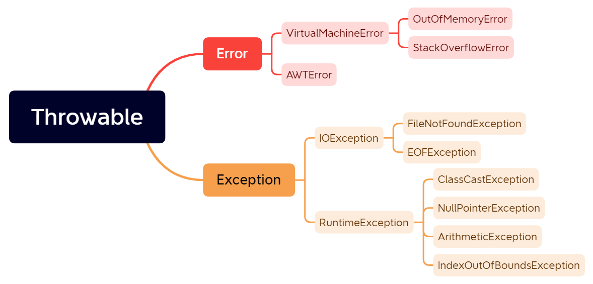
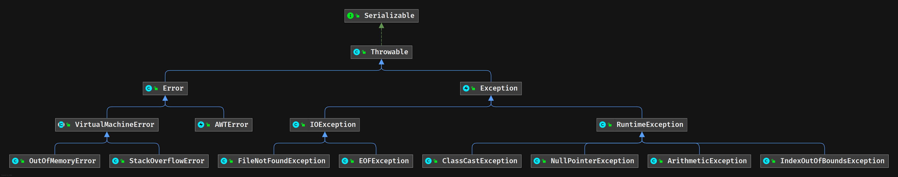
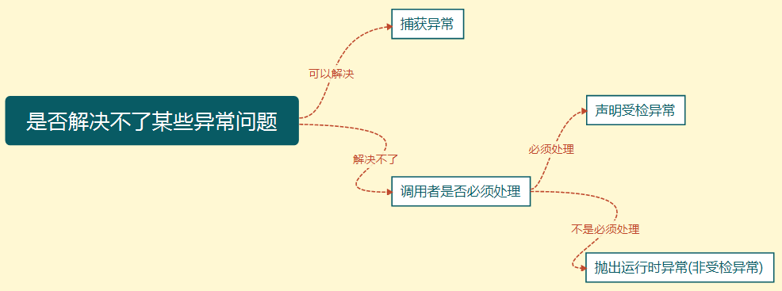

## 1. 异常概述

### 1.1. 什么是异常

Java程序在编译或运行过程中出现的问题就称为异常。

Java 异常是 Java 提供的一种识别及响应错误的一致性机制。Java 异常机制可以使程序中异常处理代码和正常业务代码分离，保证程序代码更加优雅，并提高程序健壮性。

### 1.2. 异常的继承体系



> 异常体系思维导图详见《01-Java SE 知识体系.xmind》



#### 1.2.1. Throwable

`Throwable` 是 Java 异常体系的最顶层、所有错误与异常的超类。它包含了两个主要子类：`Error`（错误）和 `Exception`（异常）

无论是错误还是异常，它们都有具体的子类体现每一个问题，它们的子类都有一个共性，就是都**以父类名才作为子类的后缀名**

#### 1.2.2. Error（错误）

Error 类：是 Throwable 一个子类，用来指示运行时环境发生的错误。Java 程序通常不捕获错误，错误一般发生在严重故障时，它们在Java程序处理的范畴之外。一出现就是致命的，例如，服务器宕机，数据库崩溃，JVM 内存溢出等。一般地，程序不会从错误中恢复。

特点：此类错误一般表示代码运行时 JVM 出现问题。通常有 VirtualMachineError（虚拟机运行错误）、NoClassDefFoundError（类定义错误）、OutOfMemoryError（内存不足错误）、StackOverflowError（栈溢出错误）等。此类错误发生时，JVM 将终止线程。

> Tips: <font color=red>**这些错误是不受检异常，非代码性错误。因此，当此类错误发生时，应用程序不应该去处理此类错误。按照 Java 惯例，开发时是不应该实现任何新的 Error 子类的！**</font>

#### 1.2.3. Exception（异常）

Exception（异常）指 Java 程序运行异常，即运行中的程序发生了不期望发生的事件，这种异常可以被 Java 异常处理机制处理。

`Exception` 类是 `Throwable` 类的子类。所有的异常类是 `java.lang.Exception` 类的子类。这些异常又分为两类：RuntimeException(运行时异常) 和 CheckedException(编译时异常、检查异常)。

### 1.3. 异常与错误的区别

**异常**：

- 在编译或运行过程中出现的问题就称为异常
- 可以针对异常进行处理，处理后，后续的代码可以继续运行。如果不处理，否则程序直接崩溃

**错误**：

- 程序在运行过程中出现的问题。
- 错误一般是由系统产生并反馈给JVM。
- 没有具体的处理方式，只能修改错误的代码。否则程序直接崩溃，无法运行

如何判断程序出现的问题是错误还是异常？

- 根据控制台输入的错误信息，判断类名是以 Error 还是 Exception 结尾。
- 如果是 Error 则是错误，否是就是 Exception。

### 1.4. Java常见错误与异常

- `java.lang.IllegalAccessError`：违法访问错误。当一个应用试图访问、修改某个类的域（Field）或者调用其方法，但是又违反域或方法的可见性声明，则抛出该异常。
- `java.lang.InstantiationError`：实例化错误。当一个应用试图通过Java的 `new` 操作符构造一个抽象类或者接口时抛出该异常.
- `java.lang.OutOfMemoryError`：内存不足错误。当可用内存不足以让Java虚拟机分配给一个对象时抛出该错误。
- `java.lang.StackOverflowError`：堆栈溢出错误。当一个应用递归调用的层次太深而导致堆栈溢出或者陷入死循环时抛出该错误。
- `java.lang.ClassCastException`：类型转换异常。假设有类A和B（A不是B的父类或子类），O是A的实例，那么当强制将O构造为类B的实例时抛出该异常。该异常经常被称为强制类型转换异常。
- `java.lang.ClassNotFoundException`：找不到类异常。当应用试图根据字符串形式的类名构造类，而在遍历 CLASSPAH 之后找不到对应名称的 class 文件时，抛出该异常。
- `java.lang.ArithmeticException`：算术条件异常。譬如：整数除零等。
- `java.lang.ArrayIndexOutOfBoundsException`：数组索引越界异常。当对数组的索引值为负数或大于等于数组大小时抛出。
- `java.lang.IndexOutOfBoundsException`：索引越界异常。当访问某个序列的索引值小于0或大于等于序列大小时，抛出该异常。
- `java.lang.InstantiationException`：实例化异常。当试图通过 `newInstance()` 方法创建某个类的实例，而该类是一个抽象类或接口时，抛出该异常。
- `java.lang.NoSuchFieldException`：属性不存在异常。当访问某个类的不存在的属性时抛出该异常。
- `java.lang.NoSuchMethodException`：方法不存在异常。当访问某个类的不存在的方法时抛出该异常。
- `java.lang.NullPointerException`：空指针异常。当应用试图在要求使用对象的地方使用了 null 时，抛出该异常。譬如：调用 null 对象的实例方法、访问 null 对象的属性、计算 null 对象的长度、使用 throw 句抛出 null 等等。
- `java.lang.NumberFormatException`：数字格式异常。当试图将一个 String 转换为指定的数字类型，而该字符串确不满足数字类型要求的格式时，抛出该异常。
- `java.lang.StringIndexOutOfBoundsException`：字符串索引越界异常。当使用索引值访问某个字符串中的字符，而该索引值小于0或大于等于序列大小时，抛出该异常。

## 2. 异常的分类

Exception 异常类又分以下两种：

- 编译时异常（检查性异常）：最具代表的检查性异常是用户错误或问题引起的异常，这是程序员无法预见的。例如要打开一个不存在文件时，一个异常就发生了，这些异常在编译时不能被简单地忽略。
- 运行时异常：运行时异常是可能被程序员避免的异常。与检查性异常相反，运行时异常可以在编译时被忽略。

### 2.1. 运行时异常

运行时异常，是指 RuntimeException及其子类。在编译时，Java 编译器不会对其进行检查，这类异常既不用抛出，也不用捕获，也会编译通过。一般都是程序员运行时才发现的异常，需要修改源码。以下是常见的内置运行时异常：

- ArithmeticException
- NullPointerException(空指针)
- ArrayIndexOutOfBoundsException(数组越界)
- StringIndexOutOfBoundsException
- ClassCastException(类转换异常)
- ArrayStoreException(数据存储异常，操作数组时类型不一致)
- 还有IO操作的BufferOverflowException异常

### 2.2. 编译时异常

编译时异常，是指 Exception 类及其子类（除了 `RuntimeException`）。在编译时，Java 编译器会进行检查，如果程序中出现此类异常，必须进行处理，否则无法通过编译。

比如：`ClassNotFoundException`（没有找到指定的类异常），`IOException`（IO流异常），要么通过 `throws` 进行声明抛出，要么通过 `try-catch` 进行捕获处理，否则不能通过编译。在程序中，通常不会自定义该类异常，而是直接使用系统提供的异常类。<font color=red>**该异常必须手动在代码里添加捕获语句来处理该异常**</font>。

### 2.3. 运行时异常和编译时异常的区别(理解)

- **运行时异常**：只要是RuntimeException或其子类异常都是运行时异常。
- **编译时异常**：除了运行时异常以外的所有异常都是编译时异常。
- **运行时异常特点**
    - 方法声明上如果声明的异常是运行时异常，则方法调用者可以处理，也可以不处理。
    - 方法体内部抛出的异常是运行时异常，则方法声明上可以声明，也可以不声明。
- **编译时异常特点**
    - 方法声明上如果声明的异常是编译时异常，则要求方法调用者一定要处理。
    - 方法体内部抛出的异常是编译时异常，则要求对该异常进行处理（捕获处理或者声明抛出处理）。

> 为什么java编译器对运行时异常管理如何松散？因为运行时异常一般通过程序员良好的编程习惯避免。

## 3. 异常相关方法

`Throwable` 类是 Java 语言中所有错误或异常的超类，因此所有异常均继承了 `Throwable` 类中的以下主要方法：

```java
public String getMessage()
```

- 获得创建 Throwable 异常对象构造方法中指定的消息字符串。

```java
public Throwable getCause()
```

- 返回一个 Throwable 对象代表异常原因

```java
public String toString()
```

- 获得 Throwable 异常信息的类全名和消息字符串。

```java
public void printStackTrace()
```

- 打印异常的栈信息，追溯异常根源。
- 将此 throwable 及其追踪输出至标准错误流。此方法将此 Throwable 对象的堆栈跟踪输出至错误输出流，作为字段 `System.err` 的值。输出的第一行包含此对象的 `toString()` 方法的结果。剩余行表示以前由方法 `fillInStackTrace()` 记录的数据。

```java
public string getLocalizedMessage()
```

- 返回异常对象的本地化信息。使用 `Throwable` 的子类覆盖这个方法，可以声称本地化信息。如果子类没有覆盖该方法，则该方法返回的信息与 `getMessage()` 返回的结果相同

```java
public StackTraceElement [] getStackTrace()
```

- 返回一个包含堆栈层次的数组。下标为0的元素代表栈顶，最后一个元素代表方法调用堆栈的栈底

```java
public Throwable fillInStackTrace()
```

- 用当前的调用栈层次填充 `Throwable` 对象栈层次，添加到栈层次任何先前信息中。

```java
public synchronized Throwable initCause(Throwable cause) 
```

- 初始化原始异常

## 4. 异常处理

### 4.1. 异常的处理方式

JVM 对异常的默认处理方式是：

- 将异常的类名，位置，原因等信息输出在控制台。
- 终止程序的运行。后续的代码没有办法执行。

在Java应用中，手动异常的处理机制分为：

- 声明异常
- 抛出异常
- 捕获异常

这个体系中的所有类和对象都具备一个独有的特点；就是**可抛性**。可抛性的体现：就是这个体系中的类和对象都可以被 `throws` 和 `throw` 两个关键字所操作

### 4.2. JVM 的异常处理

Java 通过面向对象的方法进行异常处理，一旦方法抛出异常，系统自动根据该异常对象寻找合适异常处理器（Exception Handler）来处理该异常，把各种不同的异常进行分类，并提供了良好的接口。

在一个方法中如果发生异常，这个方法会创建一个异常对象，并转交给 JVM，该异常对象包含异常名称，异常描述以及异常发生时应用程序的状态。创建异常对象并转交给 JVM 的过程称为抛出异常。可能有一系列的方法调用，最终才进入抛出异常的方法，这一系列方法调用的有序列表叫做调用栈。

JVM 会顺着调用栈去查找看是否有可以处理异常的代码，如果有，则调用异常处理代码。当 JVM 发现可以处理异常的代码时，会把发生的异常传递给它。如果 JVM 没有找到可以处理该异常的代码块，JVM 就会将该异常转交给默认的异常处理器（默认处理器为 JVM 的一部分），默认异常处理器打印出异常信息并终止应用程序。

### 4.3. 异常处理之声明异常（throws 关键字）

当一个方法应该捕获一些已知的异常，但没有捕获到这些检查性异常时，那么该方法必须使用 `throws` 关键字来声明异常，传递异常给调用者去处理。`throws` 关键字放在方法签名的尾部。

#### 4.3.1. throws 语法格式

```java
修饰符 返回值类型 方法名 (参数类型 参数名1, 参数类型 参数名2, ……) throws 异常类名1,异常类名2,…… {
	......
}
```

> Notes: `throws` 后面跟多个异常，使用“`,`”逗号隔开。

#### 4.3.2. 异常声明抛出处理流程

- 在某个方法的声明上，让它(这个方法)抛出这个产生的异常，自己不处理，谁调用这个方法，谁处理
- 方法声明上加 `throws` 异常类名
    - 如：方法a 中产生了异常，声明抛出
    - 方法b 调用方法a，则该异常由a 转向了b
- 一般情况下，main 方法是不会声明抛出异常的，因为该方法抛出，直接抛出给了JVM，JVM 的默认处理机制是终止程序运行，则这样处理，相当于没有处理！

### 4.4. 异常处理之抛出异常（throw 关键字）

当一个方法需要处理一些已知的异常，但方法自己不知道如何处理的异常，且不需要调用者处理，那么可以抛出异常。

`throw` 关键字作用是在方法内部抛出一个 `Throwable` 类型的异常。任何 Java 代码都可以通过 `throw` 语句抛出异常。

#### 4.4.1. throw 语法格式

```java
throw new 异常类名(“异常信息”);
```

> Notes: `throw` 关键字之后的对象一定是异常对象，不能是其他对象。

#### 4.4.2. throws 和 throw 的区别

throws 和 throw 的作用：

- throws：将异常类名标识出类，报告给方法调用者
- throw：将异常对象抛出，抛给方法的调用者。

throws 和 throw 的使用位置：

- throws：使用在方法声明上
- throw：使用在方法体内部

调用者对 throws 和 throw 的处理：

- throws：方法声明抛出的异常，在调用者的方法中必须包含可处理异常的代码，否则也要在方法签名中用 throws 关键字声明相应的异常。
- throw：方法内部抛出的异常，方法调用者可以不进行处理

### 4.5. 异常处理之捕获异常（try catch finally）

在开发时，如果定义功能时，发现该功能会出现一些问题，**应该将问题在定义功能时标示出来**，这样调用者就可以在使用这个功能的时候，预先给出处理方式。

如何标示呢？通过 `throws` 关键字完成，格式：`throws 异常类名,异常类名...`

当方法声明异常后，调用者在使用该功能（调用该方法）时，就必须要处理，否则编译失败。*当然调用者也可以继续将异常抛出*

#### 4.5.1. 捕获处理总体格式

```java
try {
    // 需要检测的异常；
} catch(异常类名 变量名) {
    // 异常处理代码
    // 通常我们只使用一个方法：printStackTrace 打印异常信息
} finally {
    // 不管是否有异常发生，都会执行该代码块中的代码。
}
```

#### 4.5.2. 异常捕获处理-单 catch 处理

```java
try{
	// 需要检测的异常；
} catch (异常类名 异常变量名) {
	// 异常处理代码
	// 可以调用异常的方法
	// 通常我们只使用一个方法：printStackTrace 打印异常信息
}
```

格式说明：

- try 代码块中存放可能出现异常的代码。
- catch 代码块中存放处理异常的代码。

执行流程：

- 先执行try代码块中的代码，如果try代码块中的代码没有出现异常，则不会执行catch代码块的代码。
- 如果try代码块中的代码出现异常，则会进入catch代码块执行里面的代码。

#### 4.5.3. 异常捕获处理-多 catch 处理

```java
try {
	// 需要检测的异常；
} catch(异常类名1 异常变量1) {
	// 异常处理代码，可以调用异常的方法
} catch(异常类名2 异常变量2) {
	// 异常处理代码，可以调用异常的方法
} catch(异常类名3 异常变量3 | 异常类名4 异常变量4 ...) {
	// 多个异常，都是同一种处理时，可以使用 "|" 来分隔
} ……    // 可以有无数个catch
```

多 catch 处理注意事项

- 多个catch 外理异常时，异常类名要有先后顺序。
- 如果多个异常类之间是平级关系(没有继承关系)，则没有先后顺序要求
- 如果多个异常类之间是上下级关系(有继承关系)，越高级的父类要写在越下面。
- 同一个 catch 代码块也可以捕获多种类型异常，用 `|` 分隔不同类型的异常
- **特殊情况：try对应多个catch时，如果有父类的catch语句块，一定要放在下面。**

> 在实际开发中是不是只捕获Exception异常吗？因为实际开发中，需要针对不同的异常有不同的处理方式。

#### 4.5.4. finally 代码块

finally 代码块：**只要进入了try的代码块**，不管是否有异常发生，都会执行该代码块中的代码。因此通常**用来释放资源**，比如关闭IO流或数据库相关资源。

```java
try {
	// 需要检测的异常；
} catch(异常类名1 异常变量1) {
	// 异常处理代码
	// 可以调用异常的方法
	// 通常我们只使用一个方法：printStackTrace 打印异常信息
} catch(异常类名2 异常变量2) {
	// 异常处理代码
	// 可以调用异常的方法
	// 通常我们只使用一个方法：printStackTrace 打印异常信息
} finally {
	// 不管是否有异常发生，都会执行该代码块中的代码。
}
```

finally 代码块的注意事项：

- 若 catch 代码块中包含 return 语句，finally 中的代码依然会执行。并且会先执行 finally 代码块中的逻辑后，再执行 catch 代码块的 return 语句。
- 若 catch 与 finally 代码块中都包含 return 语句，则只会执行 finally 中的 return 语句，不会执行 catch 中的 return 语句。
- finally 中最好不要包含 return 语句，否则程序会提前退出，返回值不是 try 或 catch 中的返回值。
- `System.exit(0);` 此方法是退出 jvm，只有这种情况 finally 代码块不执行。
- **finally 代码块是在 return 后面的表达式运算语句之后执行的**。即 return 语句不会马上将运算后的值返回给调用者，而是先把要返回的值保存起来，待 finally 代码块执行完毕之后再向调用者返回其值。<font color=red>**因此不管在 finally 中是否修改了返回值，返回的值都不会改变，仍然返回是之前保存的值**</font>。

```java
public static void main(String[] args) {
    int sum = doSum(1, 2);
    System.out.println(sum); // 输出是 3
}

private static int doSum(int a, int b) {
    int sum;
    try {
        sum = a + b;
        return sum;
    } finally {
        sum = 100;
        System.out.println("finally sum: " + sum); // 输出是 100
    }
}
```

#### 4.5.5. try-catch-finally 的几种组合方式

组合1：

```java
try {
	// ... do something
} catch (Exception e) {
	// ... do something
} finally {
	// ... do something
}
```

组合2：

```java
try {
	// ... do something
} catch (Exception e) {
	// ... do something
}
```

组合3：

```java
try {
	// ... do something
} finally {
	// ... do something
}
```

> Tips: `try  finally` 是针对出现了异常时，并不需要处理，但是资源一定关闭的这种特殊情况。记住 `finally` 很有用，主要用于关闭资源。无论是否发生异常，资源都必须进行关闭。

### 4.6. try-with-resource （待整理）

JAVA 7 以后提供了更优雅的方式来实现资源的自动释放，自动释放的资源需要是实现了 `AutoCloseable` 接口的类。例如：

```java
try (Scanner scanner = new Scanner(new FileInputStream("c:/abc"), "UTF‐8")) {
    // code
} catch (IOException e) {
    // handle exception
}
```

上例中，try 代码块退出时，会自动调用 `scanner.close` 方法，和把 `scanner.close` 方法放在 finally 代码块中不同的是，若 `scanner.close` 抛出异常，则会被抑制，抛出的仍然为原始异常。被抑制的异常会由 `addSusppressed` 方法添加到原来的异常，如果想要获取被抑制的异常列表，可以调用 `getSuppressed` 方法来获取。

### 4.7. 方法重写时异常处理（针对编译时异常）

- 父类方法声明上没有使用 `throws` 声明抛出异常，子类重写方法时不能声明抛出异常。
- 父类方法声明上使用 `throws` 声明一个异常时，子类重写方法时可以声明和父类一样的异常或其异常的子类。
- 父类方法声明上使用 `throws` 声明多个异常时，子类重写方法可以声明和父类多个异常的子集异常。

**总结：子类不能声明抛出比父类大的异常。**

> Notes: 
>
> - 如果父类或者接口中的方法没有抛出过异常，那么子类是不可以抛出异常的，**如果子类重写的方法中出现了异常，只能 `try` 不能 `throws`**。
> - 如果这个异常子类无法处理，已经影响了子类方法的具体运算，这时可以在子类方法中，通过 `throw` 抛出 `RuntimeException` 异常或者其子类，这样，子类的方法上是不需要 `throws` 声明的。

## 5. Java 异常处理最佳实践

在 Java 中处理异常并不是一个简单的事情。不仅仅初学者很难理解，即使一些有经验的开发者也需要花费很多时间来思考如何处理异常，包括需要处理哪些异常，怎样处理等等。

> Tips: 也可以直接参考《阿里巴巴 Java 开发手册》中的“异常处理”部分内容

### 5.1. 异常处理方式的选择

可以根据下图来选择是捕获异常，声明异常还是抛出异常



相关异常处理选择的问题：

1. 定义异常处理时，什么时候定义try，什么时候定义throws呢？
    - 功能内部如果出现异常，如果内部可以处理，就用try；
    - 如果功能内部处理不了，就必须声明出来，让调用者处理。
2. 什么时候使用抛出处理？什么时候使用捕获处理?
    - 如果当前代码是直接跟用户打交道的，则千万不要抛出异常，要捕获处理。
    - 如果需要将异常报告给上一层(方法调用者)则要使用抛出处理。
3. 父类方法没有声明抛出异常，子类覆盖方法时发生了异常，怎么办？
    - 子类重写方法时，可以抛出异常，但是只能抛出运行时异常或其子类。

### 5.2. 优先明确的异常

抛出的异常越明确越好，这样 API 更容易被理解。方法的调用者能够更好的处理异常并且避免额外的检查。因此，总是尝试寻找最适合异常事件的类，例如，抛出一个 `NumberFormatException` 来替换一个 `IllegalArgumentException`。避免抛出一个不明确的异常。

```java
public void doNotDoThis() throws Exception {
    // ...
}

public void doThis() throws NumberFormatException {
    // ...
}
```

### 5.3. 对异常进行文档说明

当在方法上声明抛出异常时，也需要进行文档说明。目的是为了给调用者提供尽可能多的信息，从而可以更好地避免或处理异常。在 Javadoc 添加 `@throws` 声明，并且描述抛出异常的场景。

```java
/**
 * xxx
 * @param input xxx
 * @throws MyBusinessException 异常的详细描述
 */
public void doSomething(String input) throws MyBusinessException {
    // ...
}
```

### 5.4. 不要捕获 Throwable 类

`Throwable` 是所有异常和错误的超类。语法上可以允许 catch 子句中使用它，但是建议永远不应该这样做！

如果在 catch 子句中使用 `Throwable`，它不仅会捕获所有异常，也将捕获所有的错误。JVM 抛出错误，指出不应该由应用程序处理的严重问题。典型的例子是 `OutOfMemoryError` 或者 `StackOverflowError`。两者都是由应用程序控制之外的情况引起的，无法处理。所以，最好不要捕获 `Throwable`，除非确定自己处于一种特殊的情况下能够处理错误。

```java
public void doNotCatchThrowable() {
    try {
        // do something
    } catch (Throwable t) {
        // don't do this!
    }
}
```

### 5.5. 不要忽略异常

很多时候，开发者很有自信不抛出异常，因此写了一个 catch 块，但是没有做任何处理或者记录日志。但现实是经常会出现无法预料的异常，或者无法确定这里的代码未来会不会被改动(删除了阻止异常抛出的代码)，而此时由于异常被捕获，使得无法拿到足够的错误信息来定位问题。

```java
public void doNotIgnoreExceptions() {
    try {
        // do something
    } catch (NumberFormatException e) {
        // this will never happen
    }
}

public void logAnException() {
    try {
        // do something
    } catch (NumberFormatException e) {
        log.error("This should never happen: " + e);
    }
}
```

### 5.6. 不要记录并抛出异常

很多代码甚至类库中都会有捕获异常、记录日志并再次抛出的逻辑。

```java
try {
    // do something
} catch (NumberFormatException e) {
    log.error(e);
    throw e;
}
```

这种处理逻辑看着是合理的，但这会导致给同一个异常输出多条日志。建议可以将异常包装为自定义异常，让仅仅当想要处理异常时才去捕获，否则只需要在方法签名中声明让调用者去处理。

```java
public void doNotThrowAgainExceptions() throws MyBusinessException {
    try {
        // do something
    } catch (NumberFormatException e) {
        throw new MyBusinessException("A message that describes the error.", e);
    }
}
```

### 5.7. 包装异常时不要抛弃原始的异常

捕获标准异常并包装为自定义异常是一个很常见的做法，这样可以添加更为具体的异常信息并能够做针对的异常处理。

在包装异常时，请确保将原始异常设置为原因。否则，将会丢失堆栈跟踪和原始异常的消息，这将会使分析导致异常的异常事件变得困难。

```java
public void wrapException() throws MyBusinessException {
    try {
        // do something
    } catch (NumberFormatException e) {
        throw new MyBusinessException("A message that describes the error.", e);
    }
}
```

> Notes：上例代码 `NumberFormatException e` 中的原始异常 e）。`Exception` 类提供了特殊的构造函数方法，它接受一个 `Throwable` 作为参数。

### 5.8. 不要使用异常来控制程序的流程

不应该使用异常控制应用的执行流程，例如，本应该使用 if 语句进行条件判断的情况下，却使用异常处理，这是非常不好的习惯，会严重影响应用的性能。

### 5.9. 使用标准异常

如果使用内建的异常可以解决问题，就不要用自定义异常。Java API 提供了上百种针对不同情况的异常类型，在开发中首先尽可能使用 Java API 提供的异常，如果标准的异常不能满足要求，这时候创建自己的定制异常。尽可能得使用标准异常有利于新加入的开发者看懂项目代码。

### 5.10. 异常会影响性能

**异常处理的性能成本非常高**，每个 Java 程序员在开发时都应牢记这句话。创建一个异常非常慢，抛出一个异常又会消耗1~5ms，当一个异常在应用的多个层级之间传递时，会拖累整个应用的性能。

- 仅在异常情况下使用异常
- 在可恢复的异常情况下使用异常

尽管使用异常有利于 Java 开发，但是在应用中最好不要捕获太多的调用栈，因为在很多情况下都不需要打印调用栈就知道哪里出错了。因此，异常消息应该提供恰到好处的信息。

## 6. 自定义异常

- 命名规范：`XxxException`
- 继承关系：继承 `Exception` 或 `RuntimeException`
- 构造方法：一般提供无参构造方法和1个有参构造方法，用于记录详细异常描述信息

### 6.1. 异常链

异常链是指，同时有很多异常抛出，即一个异常引发另一个异常，另一个异常引发更多异常。一般会在在开头或结尾处找它的原始异常来解决问题，异常可通过 `initCause` 方法串起来，可以通过自定义异常。
