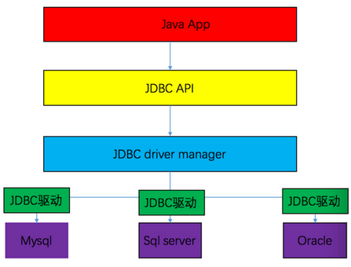
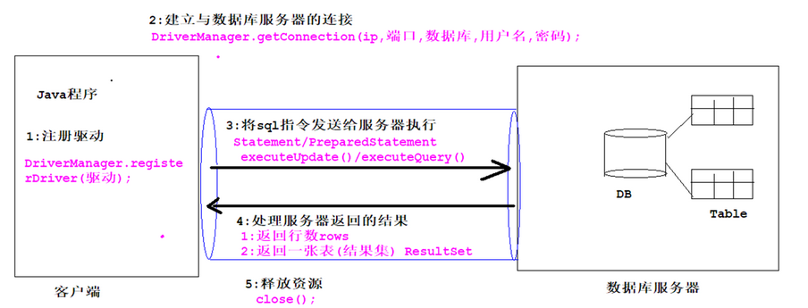

## 1. JDBC（Java数据库连接）概述

JDBC（Java DataBase Connectivity, java数据库连接）是一种用于执行 SQL 语句的 Java API。JDBC 是 Java访问数据库的标准规范，作用是可以为不同的关系型数据库提供统一访问方式，它由一组用Java语言编写的接口和类组成。具体的实现类由各大数据库厂商来编写。

JDBC 需要连接驱动，驱动是两个设备要进行通信，满足一定通信数据格式，数据格式由设备提供商规定，设备提供商为设备提供驱动软件，通过软件可以与该设备进行通信。



### 1.1. MySQL 数据库 JDBC 相关资源

MySQL 驱动官网下载地址：https://dev.mysql.com/downloads/connector/j/

相关文件夹说明：

- src 文件夹是源代码
- docs 文件夹是 API

## 2. JDBC 开发

### 2.1. JDBC 执行流程



使用 JDBC 连接数据库的四个参数：

- 用户名
- 密码
- 连接字符串：jdbc:mysql://localhost:3306/数据库?参数名=参数值
- 数据库驱动类，如 MySQL数据库驱动是 `com.mysql.jdbc.Driver`，8.0版本后驱动类是 `com.mysql.cj.jdbc.Driver`

### 2.2. JDBC 开发步骤（以 MySQL 为例）

1. 加载并注册数据库驱动，即告知JVM使用的是哪一个数据库的驱动，通常使用反射技术 `Class.forName()` 方法将驱动类加入到内存中。

```java
Class.forName("com.mysql.jdbc.Driver")
```

2. 通过 `DriverManager` 连接数据库并获得连接对象 `Connection`

```java
Connection conn = DriverManager.getConnection(url, user, password);
```

> 使用JDBC中的类，完成对MySQL数据库的连接

3. 获得语句执行平台，通过 `Connection` 对象的 `createStatement()` 方法获得 `Statement` 对象。`Statement` 对象就是对SQL语句的执行者对象。
4. 调用 `Statement` 对象的 `excuteXxx(String sql)` 方法发送要执行的SQL语句，并获得执行后数据库返回结果。
5. 处理结果，通过 `ResultSet` 的 `next()` 和 `getXxx(索引/字段名)` 方法获得数据库返回的结果集。
6. 必须关闭释放数据库资源，使用 `close()` 方法。<font color=red>**关闭原则：后开的先关(`ResultSet` -> `Statement` -> `Connection`)**</font>

> <font color=purple>**注：一般开发会使用 `PreparedStatement` 来代替父类 `Statement`，使用效率和安全性都更高。**</font>
>
> <font color=red>JDBC 访问数据库的基础包，在 JavaSE 中的包。导包注意要选择java.sql包</font>

### 2.3. 项目（程序）引入驱动 jar 包（MySQL 的驱动）

- MySQL 相关jar包：mysql-connector-java-x.x.xx-bin.jar
    - MySQL驱动相关文件夹mysql-connector-java-x.x.xx
    - src文件夹是源代码，docs文件夹是API
- MySQL 官方驱动下载地址：https://dev.mysql.com/downloads/connector/j/
- MySQL maven 依赖
    ```xml
    <!-- https://mvnrepository.com/artifact/mysql/mysql-connector-java -->
    <dependency>
        <groupId>mysql</groupId>
        <artifactId>mysql-connector-java</artifactId>
        <version>x.x.xx</version>
    </dependency>
    ```

## 3. JDBC 的核心 API 使用

### 3.1. 核心 API 概述

- `Driver` 接口：数据库驱动的接口，由数据库的厂商实现。
- `DriverManager` 类：用来管理和注册数据库驱动的类
- `Connection` 接口：数据库连接对象。
- `Statement`/`PrepareStatement` 接口：操作数据库 SQL 语句的对象
- `ResultSet` 接口：用来封装数据库返回符合查询条件的结果集

### 3.2. Driver 接口

每个驱动程序都应该提供一个实现 Driver 接口的类。`DriverManager` 会试着加载尽可能多的它可以找到的驱动程序，这意味着用户可以通过调用以下程序加载和注册一个驱动程序类对象。

```java
Class.forName("foo.bah.Driver");
```

### 3.3. DriverManager 类

#### 3.3.1. 类作用

`java.sql.DriverManager` 类用于管理和注册一组 JDBC 驱动程序的基本服务。

`DriverManager` 是一个工厂类，通过它来创建数据库连接。当 JDBC 的 `Driver` 类被加载进来时，它会自己注册到 `DriverManager` 类里面，然后会把数据库配置信息传成 `DriverManager.getConnection()` 方法，`DriverManager` 会使用注册到它里面的驱动来获取数据库连接，并返回给调用的程序。

#### 3.3.2. 注册驱动程序方法

```java
public static void registerDriver(new Driver());
```

注册数据库驱动的静态方法

```java
DriverManager.registerDriver(new com.mysql.jdbc.Driver());
```

使用该方法注册驱动会触发驱动注册两次，一般不推荐使用

<font color=red>**正确的注册驱动使用下面的方式：一般使用 `Class` 类的 `forName("类全名")` 注册驱动，可以解决注册两次的问题**</font>

```java
Class.forName("com.mysql.jdbc.Driver");
```

> <font color=red>**注：从JDK1.6开始，JDBC的版本是4.0版本后，可以不用写注册驱动的代码了，但是为了兼容之前的版本，注册驱动的代码一般都会保留。**</font>

#### 3.3.3. 类常用方法

获取连接对象方式1：通过指定 url（需要连接的数据库地址），用户名和密码得到一个 `Connection` 接口的实现类。用于连接数据库并获得连接对象。

```java
public static Connection getConnection(String url, String user, String password) throws SQLException;
```

参数说明：

- `url`: 连接数据库字符串 url
- `user`: 用户名，比如：root
- `password`: 密码，注册时候的密码。比如：123456

获取连接对象方式2：通过一个属性集和 URL，得到一个数据库的连接。实际开发中比较常用

```java
public static Connection getConnection(String url, Properties info) throws SQLException
```

参数说明：

- `url`: 连接数据库字符串url
- `info`: 属性集合，用来存储用户名和密码

> 一般 properties 属性文件存放在 src 文件夹中，先获取当前类的 `Class` 对象，再使用 `Class` 类的 `getResourceAsStream("/文件名")` 得到输入流对象，再使用 `load()` 读取文件

Code Demo: 使用 `Properties` 属性文件获取 `Connection` 对象

```java
// 创建Properties集合
Properties info = new Properties();
// 加载文件数据到info中
info.load(ConnectionDemo.class.getResourceAsStream("/jdbc.properties"));
// 连接数据库获得连接对象
Connection conn = DriverManager.getConnection("jdbc:mysql://10.211.55.3:3306/tempDb", info);
```

#### 3.3.4. 连接数据库的 URL 地址格式

URL用于标识数据库的位置，程序员通过URL地址告诉JDBC程序连接哪个数据库，URL的写法为：

##### 3.3.4.1. url地址格式

格式：

```
jdbc协议名:子协议://数据库服务器地址或 IP 地址:端口号/数据库名
```

示例：

```java
jdbc:mysql: [] //localhost:3306/test? 参数名:参数值
```

```java
// MySQL写法：
jdbc:mysql://localhost:3306/temp

// 简写格式（前提：数据库服务器地址是本机，端口号默认是3306）
jdbc:mysql:///temp
```

##### 3.3.4.2. 各类数据库连接字符串

JDBC的URL = 协议名 + 子协议名 + 数据源名

- 协议名总是`jdbc`。
- 子协议名由JDBC驱动程序的编写者决定。
- 数据源名也可能包含用户与口令等信息；这些信息也可单独提供。

##### 3.3.4.3. 几种常见的数据库连接

**Oracle**

- 驱动：`oracle.jdbc.driver.OracleDriver`
- URL：`jdbc:oracle:thin:@machine_name:port:dbname`
    - `machine_name`：数据库所在的机器的名称；
    - `port`：端口号，默认是1521

**MySQL**

- 驱动：`com.mysql.jdbc.Driver`
- URL：`jdbc:mysql://machine_name:port/dbname`
    - `machine_name`：数据库所在的机器的名称；
    - `port`：端口号，默认3306

**SQL Server**

- 驱动：`com.microsoft.jdbc.sqlserver.SQLServerDriver`
- URL：`jdbc:microsoft:sqlserver://<machine_name><:port>;DatabaseName=<dbname>`
    - `machine_name`：数据库所在的机器的名称；
    - `port`：端口号，默认是1433

**DB2**

- 驱动：`com.ibm.db2.jdbc.app.DB2Driver`
- URL：`jdbc:db2://<machine_name><:port>/dbname`
    - `machine_name`：数据库所在的机器的名称；
    - `port`：端口号，默认是5000

#### 3.3.5. 解决JDBC无法连接MySQL数据库的问题

MySQL数据连接时只能使用localhost连接，但不能用IP连接问题的解决方案

1. 打开cmd窗口，进入MySQL安装的bin目录
2. 执行命令登录数据库,之后会出现一行要你输入密码的 `mysql -u root -p`
3. 执行以下命令分配新用户：
    ```bash
    # (%) 表示所有ip
    grant all privileges on *.* to 'root'@'%' identified by 'root';
    ```
4. 执行完上述命令后用下面的命令刷新权限
    ```bash
    flush privileges;
    ```
5. 之后关闭mysql服务，然后启动mysql服务，大功告成

#### 3.3.6. mysql 8.0+以上版本驱动连接失败

使用 mysql 8.0+ 版本后，一些项目连接数据会报以下的错误：

```
java.sql.SQLNonTransientConnectionException:Public key Retrieval is not allowed…
```

此时需要修改数据库的连接，增加如下配置：

1. `useSSL=false` MySQL 8.0 以上版本不需要建立 SSL 连接的，需要显示关闭
2. `allowPublicKeyRetrieval=true` 允许客户端从服务器获取公钥。
3. `serverTimezone=UTC` 设置时区，mysql驱动8.0+也要指定时区，不然也会报一些错

```yml
spring:
  datasource:
    url: jdbc:mysql://localhost:3306/test_db?characterEncoding=utf-8&useSSL=false&useUnicode=true&allowPublicKeyRetrieval=true&serverTimezone=UTC
    driverClassName: com.mysql.cj.jdbc.Driver
    username: root
    password: 123456
    type: com.alibaba.druid.pool.DruidDataSource # 设置使用的数据源类型
```

> Notes: 如果使用的 mysql 是 8.0+，建议最好把以上三个参数设置下，避免发生一些莫名错误。

### 3.4. Connection 接口

#### 3.4.1. 接口作用

用来和数据库建立连接，和获取 `Statement` 对象

#### 3.4.2. 常用方法

```java
Statement createStatement() throws SQLException;
```

- 创建一个 `Statement` 接口现实类对象来将 SQL 语句发送到数据库。

```java
PreparedStatement prepareStatement(String sql);
```

- 创建一个 `PreparedStatement` 对象来将参数化的 SQL 语句发送到数据库。
    - `sql`：需要执行的SQL语句，获取 `PreparedStatement` 对象后直接使用方法 `executeUpdate()` 或 `executeQuery()` 进行操作。

```java
void close() throws SQLException
```

- 立即释放此 `Connection` 对象的数据库和 JDBC 资源，建议最好在调用 `close` 方法之前，应用程序显式提交或回滚一个活动事务。

### 3.5. Statement 接口（操作数据库）

#### 3.5.1. 接口概述

用来发送SQL语句给数据库执行，对数据库进行增删改查操作。通过 `Connection` 对象的 `createStatement()` 方法获取 `Statement` 对象。

```java
public interface Statement extends Wrapper, AutoCloseable
```

CRUD(增删改查操作):

- C: `Create`
- R: `Read`
- U: `Update`
- D: `Delete`

#### 3.5.2. 常用方法

```java
boolean execute(String sql) throws SQLException;
boolean execute(String sql, int autoGeneratedKeys) throws SQLException;
boolean execute(String sql, int columnIndexes[]) throws SQLException;
boolean execute(String sql, String columnNames[]) throws SQLException;
```

- 可以执行任意的 SQL 语句。如果查询的结果是一个 `ResultSet` 对象，此方法返回 true；如果结果不是 `ResultSet`（比如 insert 或者 update 等语句），此方法则会返回 false。可以通过接口的 `getResultSet()` 方法来获取 ResultSet 结结果对象，或者通过 `getUpdateCount()` 方法来获取更新的记录条数。

```java
int executeUpdate(String sql) throws SQLException;
```

- 只能执行数据库的SQL语句中的 `insert`、`delete`、`update`、`drop`、`create` 用于数据库的增删改的操作等 DML、DDL 语句。方法参数与返回值解析如下：
    - `sql`：表示语句，返回执行成功的数据表行数。
    - 可以执行数据定义语言『DDL(Data Definition Language)』。用于创建，修改，删除数据库、表、列等。如：`create`，`alter`，`drop`等。**使用DDL语句不影响行数，即返回值为0**。
    - 可以数据操作语言『DML(Data Manipulation Language)』。用来修改、删除、添加数据。如：`insert`、`delete`、`update`。**使用DML语句会影响行数，会返回影响行数**
    > 建议：一般使用操作数据库的语句，先在图形化客户端运行判断是否有错，再写到 IDE

```java
ResultSet executeQuery(String sql) throws SQLException;
```

- 用于数据库SQL语句中的 `select` 查询操作，返回一个符合条件的结果集，是 `ResultSet` 接口的现实类。即使查询不到记录返回的 `ResultSet` 也不会为 null。如果方法传入参数是 insert 或者 update 语句的话，它会抛出错误信息为 “executeQuery method can not be used for update” 的 `java.util.SQLException`。 

```java
void close() throws SQLException;
```

- 立即释放此 `Statement` 对象的数据库和 JDBC 资源，而不是等待该对象自动关闭时发生此操作。一般来说，使用完后立即释放资源是一个好习惯，这样可以避免对数据库资源的占用。

> 注：关闭 `Statement` 对象时，还将同时关闭其当前的 `ResultSet` 对象（如果有）。

### 3.6. ResultSet 接口（查询/处理结果）

#### 3.6.1. 接口概述

```java
public interface ResultSet extends Wrapper, AutoCloseable
```

通过 `Statement` 的 `executeQuery()` 方法查询数据库后会返回一个 `ResultSet` 对象。`java.sql.ResultSet` 是一个接口，其作用是用来封装符合查询条件的记录，提供用于从当前行获取列值的方法，可以指定列的索引编号或列的名称。

`ResultSet` 对象维护了一个游标，指向当前的数据行。可以将 `ResultSet` 理解成一根指针，开始的时候这个游标默认指向位置在执行查询记录的第一行之前，如果调用了 `ResultSet` 的 `next()` 方法游标会下移一行；如果没有更多的数据时，`next()` 方法会返回 false。因此可以在 for 循环中用它来遍历数据集。

默认的 `ResultSet` 是不能更新的，游标也只能往下移，即只能从第一行到最后一行遍历一遍。不过**也可以创建可以回滚或者可更新的 `ResultSet`**。

值得注意的是，当生成 `ResultSet` 的 `Statement` 对象要关闭或者重新执行或是获取下一个 `ResultSet` 的时候，之前的 `ResultSet` 对象也会自动关闭。

#### 3.6.2. 常用方法

```java
boolean next() throws SQLException;
```

- `ResultSet` 光标最初位于第一行之前。第一次调用 `next` 方法使第一行成为当前行；第二次调用使第二行成为当前行，依此类推。如果新的当前行有效，则返回 `true`；如果不存在下一行，则返回 `false`。

```java
Xxx getXxx(列索引号或列字段名称);
```

- 可以指定列的索引编号或列的名称，XXX 表示数据类型。**列号默认从1开始**。如：`getString(1);`、`getInt("name");`

```java
void close() throws SQLException;
```

- 即释放此 `ResultSet` 对象的数据库和 JDBC 资源

#### 3.6.3. getXxx 方法注意事项

1. 如果指针在指向结果集第一行前面时调用 `resultSet.getXX()` 获取列值，会抛出异常：`Before start of result set`
2. 如果指针在指向结果集最后一行后面时，调用 `resultSet.getXX()` 获取列值，会抛出异常：`After end of result set`
3. 如果查询结果集为空，还调用 `resultSet.getXX()` 获取列值，会抛出异常：`Illegal operation on empty result set`
4. 使用完毕以后要关闭结果集 `ResultSet`，再关闭 `Statement`，再关闭 `Connection`

#### 3.6.4. 常用数据类型转换表

|         SQL 类型         |     JDBC  对应方法     |      返回类型       |
| ------------------------ | --------------------- | ------------------ |
| BIT(1) bit(n)            | getBoolean getBytes() | Boolean byte[]     |
| TINYINT                  | getByte()             | Byte               |
| SMALLINT                 | getShort()            | Short              |
| Int                      | getInt()              | Int                |
| BIGINT                   | getLong()             | Long               |
| CHAR,VARCHAR,LONGVARCHAR | getString()           | String             |
| Text(clob) Blob          | getClob getBlob()     | Clob Blob          |
| DATE                     | getDate()             | java.sql.Date      |
| TIME                     | getTime()             | java.sql.Time      |
| TIMESTAMP                | getTimestamp()        | java.sql.Timestamp |

> **查询乱码的问题**：如果汉字查询出现乱码，要将数据库的字符集设置成 UTF-8，因为多数 IDE 默认使用 utf-8 的编码

### 3.7. PreparedStatement 接口

#### 3.7.1. SQL 注入的概念

SQL 注入是指，用户输入的内容作为了 SQL 语法的一部分，改变了原有 SQL 语句的含义。

#### 3.7.2. 接口概述

用于 SQL 语句的发送，是继承 `Statement` 的子接口，拥有父类所有的功能。可以防止 SQL 注入的问题，比父类更安全。然后可以使用此对象多次高效地执行该语句。

在使用 `Connection` 的方法得到 `PreparedStatement` 对象时，已经定义数据库操作的语句。

> 实际开发时使用 `PreparedStatement` 比较多

#### 3.7.3. 常用方法

```java
int executeUpdate() throws SQLException;
```

用于增删改的操作，返回影响的行数
在此 PreparedStatement 对象中执行 SQL 语句

```java
ResultSet executeQuery() throws SQLException;
```

用于查询，返回结果集。在此 `PreparedStatement` 对象中执行 SQL 查询，并返回该查询结果集封装成的 `ResultSet` 对象。

```java
void setXxx(int index, Xxx xxx);
```

将指定参数值 `xxx` 赋值给第 `index` 个占位符 `?` 。再将此值发送到数据库时，驱动程序将它转换成一个 SQL Xxx类型值。

#### 3.7.4. 预编译

数据库在接收到 SQL 语句后，需要对词法和语义解析，优化 SQL 语句，制定执行计划等一系列处理，这需要花费一些时间。如果一条 SQL 语句需要反复执行，每次都进行语法检查和优化，显然会造成性能与时间的浪费。

SQL 预编译，指的是数据库驱动在发送 SQL 语句和参数给 DBMS 之前对 SQL 语句进行编译，这样 DBMS 执行 SQL 时，就不需要重新编译，一次编译、多次运行，省去解析优化等过程。

JDBC 中使用对象 `PreparedStatement` 来抽象预编译语句，使用预编译。具体做法是将 SQl 语句中的**值用占位符替代**，即**SQL 语句模板化**。预编译阶段可以优化 SQL 的执行，预编译之后的 SQL 多数情况下可以直接执行，DBMS 不需要再次编译，越复杂的 SQL，编译的复杂度将越大，预编译阶段可以合并多次操作为一个操作；同时预编译语句对象可以重复利用，把一个 SQL 预编译后产生的 `PreparedStatement` 对象缓存下来，下次对于同一个SQL，可以直接使用这个缓存的对象。

**预编译的作用小结**：

- 预编译阶段可以优化 sql 的执行。预编译之后的 sql 多数情况下可以直接执行，数据库服务器不需要再次编译，可以提升性能。
- 预编译语句对象可以重复利用。将一个 sql 预编译后产生的 `PreparedStatement` 对象缓存下来，下次对于同一个 sql，可以直接使用这个缓存的对象。
- 防止 SQL 注入。使用预编译，对注入的参数将**不会再进行 SQL 编译**。即后面注入进来的参数系统将不会认为它会是一条 SQL 语句，而默认其是一个参数。

#### 3.7.5. Statement 和 PreparedStatement 的区别

1. 安全性
    - `PreparedStatement` 可以防止 SQL 注入问题，安全
    - `Statement` 有 SQL注入 的隐患问题，不安全
2. 预编译功能
    - `PreparedStatement` 有预编译的功能，在创建对象的时候就提供了 SQL 语句并存储在 `PreparedStatement` 对象中。在真正执行前，才把参数传递给 SQL 语句，并且可以反复执行。
    - `Statement` 没有预编译的功能，创建的时候没有 SQL 语句，执行的时候才提供 SQL 语句
3. 缓存
    - `PreparedStatement` 有缓存功能，使用缓存可以提升运行速度。
    - `Statement` 没有缓存功能
4. 效率
    - `PreparedStatement` 效率高，因为数据库系统对相同的 SQL 语句不会再次编译
    - `Statement` 效率低

#### 3.7.6. PreparedStatement 使用步骤

1. 准备要执行的SQL语句，使用 `?` 临时代替真实的参数
2. 调用 `Connection` 对象的 `preparedStatement()` 方法创建 `PreparedStatement` 对象，并传递SQL语句
3. 调用 `PreparedStatement` 对象的 `setXxx(int index, Xxx value)` 给占位符 `?` 使用真实的参数赋值，<font color=red>**`?` 参数序号，从 1 开始**</font>
4. 调用 `PreparedStatement` 对象的 `executeUpdate()`/`executeQuery()` 方法，执行SQL语句，不需要再次传递SQL语句。

<font color=red>**注：要先使用 `setXxx()` 方法给占位符 `?` 赋值后再调用 `executeXxx()` 方法**</font>

### 3.8. 释放资源

1. 需要释放的对象和顺序：`ResultSet` -> `Statement` -> `Connection`
2. `Connection` 对象释放原则：尽可能晚的打开，尽可能早的释放。因为 `Connection` 资源比较占用内存的，而且使用频率高，是公共的，稀缺的资源。
3. 释放资源的操作放在 `finally` 语句块中

### 3.9. API 示例

#### 3.9.1. 使用 executeUpdate 执行 DML 操作数据库练习代码

Code Demo: 给数据库insert、update、delete create、drop等操作

```java
import java.sql.Connection;
import java.sql.DriverManager;
import java.sql.SQLException;
import java.sql.Statement;

/*
 * 3.1 使用 JDBC 的开发步骤：
	 	* 1. 注册并加载数据库驱动 Class.forName()
	 	* 2. 连接数据库，获取连接对象 Connection con = DriverManager.getConnection();
	 	* 3. 创建 Statement对象  Statement stmt = conn.createStatement();
	 	* 4. 使用 Statement对象发送 SQL
	 	* 5. 处理结果
	 	* 6. 关闭连接，后开的先关。
 */
public class MoonZero {
	public static void main(String[] args) throws Exception {
		// 注册数据库驱动
		Class.forName("com.mysql.jdbc.Driver");

		// 准备连接数据库字符串
		String url = "jdbc:mysql://localhost:3306/tempDb";
		String uName = "root";
		String pwd = "123456";

		// 连接数据库，获取Connection对象
		Connection con = DriverManager.getConnection(url, uName, pwd);

		// 获取Statement对象
		Statement sta = con.createStatement();

		// 使用Statement对象进行DDL和DML操作,定义一个sql操作语句字符串
		String sql;
		// 创建表
		// sql = "create table testss(id int primary key,tname varchar(20) not null);";
		// 执行后line=0

		// 删除数据表
		// sql = "drop table testss;";
		// 执行后line=0

		// 进行insert操作
		// sql = "insert into testss values(1,'试试');";
		// 执行后line=1
		// sql = "insert into testss values(2,'再试试'), (3,'最后一插');";
		// 执行后line=2

		// 进行delete操作
		// sql = "delete from testss where id = 1;";
		// 执行后line=1

		// 进行update操作
		sql = "update testss set tname='用eclipse改一下' where id = 3;";
		// 执行后line=1

		operateTable(sta, sql);
		// 关闭资源，先开后关
		sta.close();
		con.close();
	}

	// 测试创建数据表方法
	public static void operateTable(Statement sta, String sql) throws SQLException {
		// 执行后line=0
		int line = sta.executeUpdate(sql);
		System.out.println(line);
	}
}
```

#### 3.9.2. 解析 executeQuery 返回的数据库结果集练习代码

Code Demo: 解析 executeQuery 返回的数据库结果集(执行 DQL 操作)

```java
import java.sql.Connection;
import java.sql.DriverManager;
import java.sql.ResultSet;
import java.sql.Statement;

public class MoonZero {
	public static void main(String[] args) throws Exception {
		// 数据库注册
		Class.forName("com.mysql.jdbc.Driver");

		// 获取数据库Connetion对象
		String url = "jdbc:mysql://localhost:3306/tempDb";
		String user = "root";
		String pwd = "123456";
		Connection conn = DriverManager.getConnection(url, user, pwd);

		// 获得语句执行平台，通过数据库连接对象，获取到SQL语句执行者对象
		Statement stat = conn.createStatement();

		// 准备sql语句
		String sql = "select * from dept";

		// 获取查询返回的select查询结果集
		ResultSet rs = stat.executeQuery(sql);

		// 使用循环解析返回的所有内容
		while (rs.next()) {
			System.out.print(rs.getInt("id") + " ");
			System.out.println(rs.getString("name"));
		}

		// 关闭资源
		rs.close();
		stat.close();
		conn.close();
	}
}
```

#### 3.9.3. 自定义数据库工具类练习

Code Demo: 自定义原生JDBC数据库工具类，用来创建连接和关闭资源，用户名和密码使用读取 properties 属性文件的方式

```java
import java.sql.Connection;
import java.sql.DriverManager;
import java.sql.ResultSet;
import java.sql.SQLException;
import java.sql.Statement;
import java.util.Properties;

/**
 * 获取数据连接、关闭等操作的工具类
 */
public class MooNJDBCUtils {
	// 数据库驱动字符串
	private static final String DRIVER_CLASS = "com.mysql.jdbc.Driver";

	// 使用静态代码块，用来加载类时就运行注册的动作
	static {
		try {
			Class.forName(DRIVER_CLASS);
		} catch (ClassNotFoundException e) {
			e.printStackTrace();
		}
	}

	/**
	 * 获取数据库连接对象
	 *
	 * @param url  需要连接的数据库地址url字符串
	 * @return 连接数据库对象
	 */
	public static Connection getConnection(String url) {
		// 读取jdbc.properties配置文件，获取用户名和密码
		Properties pro = new Properties();

		try {
			pro.load(MooNJDBCUtils.class.getResourceAsStream("/jdbc.properties"));
			Connection conn = DriverManager.getConnection(url, pro);
			return conn;
		} catch (Exception e) {
			throw new RuntimeException(e);
		}
	}

	public static void close(ResultSet rs, Statement stmt, Connection conn) {
		if (rs != null) {
			try {
				rs.close();
			} catch (SQLException e) {
				e.printStackTrace();
			}
		}
		close(stmt, conn);
	}

	/**
	 * 关闭数据库资源方法
	 *
	 * @param stmt  数据库操作对象(子类PreparedStatement也可以关闭)
	 * @param conn  数据库的连接对象
	 */
	public static void close(Statement stmt, Connection conn) {
		if (stmt != null) {
			try {
				stmt.close();
			} catch (SQLException e) {
				e.printStackTrace();
			}
		}
		close(conn);
	}

	/**
	 * 关闭数据库连接对象方法
	 *
	 * @param conn  数据库的连接对象
	 */
	public static void close(Connection conn) {
		if (conn != null) {
			try {
				conn.close();
			} catch (SQLException e) {
				e.printStackTrace();
			}
		}
	}
}
```

保存用户名和密码的 properties 属性文件 jdbc.properties:

```properties
user=root
password=123456
```

## 4. JDBC 事务操作

### 4.1. JDBC 事务处理的分类

事务处理方式主要分为两种：**自动处理**和**手动处理**。

**自动处理**：每条SQL语句执行后自动提交事务，无法通过回滚撤消操作。

**手动处理**：
		
1. 先调用 `setAutoCommit(false)` 开启事务，取消自动提交
2. 在 SQL 执行完后调用 `commit()` 提交事务；如果出现异常则调用 `rollback()` 回滚事务。

### 4.2. Connection 接口与事务处理相关的方法

```java
void setAutoCommit(boolean autoCommit) throws SQLException;
```

- 将此连接的自动提交模式设置为给定状态。如果连接处于自动提交模式下，则它的所有 SQL 语句将被执行并作为单个事务提交。否则，它的 SQL 语句将聚集到事务中，直到调用 commit 方法或 rollback 方法为止。默认情况下，新连接处于自动提交模式。参数 `boolean autoCommit` 的取值说明如下：
    - autoCommit 设置为 false，则代表开启事务，后面的 SQL 语句将算成一个事务，直到调用 commit 方法或 rollback 方法为止。
    - 默认情况下，autoCommit 值为 true，是自动提交模式，代表后面每一个 SQL 语句算成一个事务，自动提交事务。

```java
void commit() throws SQLException;
```

- 提交事务

```java
void rollback() throws SQLException;
```

- 回滚事务

### 4.3. JDBC 事务操作基础示例

```java
import java.sql.Connection;
import java.sql.PreparedStatement;

import org.apache.commons.dbutils.DbUtils;

import jdbc.C3P0Utils;

public class MoonZero {

	public static void main(String[] args) {
		// 声明连接对象
		Connection conn = null;
		// 声明操作数据库对象
		PreparedStatement ps = null;

		try {
			// 定义操作sql语句
			String sql = "update users set gender='改' where id=2;";
			// 使用工具类读取配置文件获取连接
			conn = C3P0Utils.getConnection();
			// 关闭事务自动提交
			conn.setAutoCommit(false);

			// 获取操作对象,对数据库进行更新
			ps = conn.prepareStatement(sql);
			ps.executeUpdate();

			DbUtils.closeQuietly(ps);
			// 手动制造异常
			// System.out.println(5 / 0);

			ps = conn.prepareStatement("update users set gender='改' where id=4;");
			ps.executeUpdate();
			System.out.println("修改成功");
			// 提交事务
			DbUtils.commitAndCloseQuietly(conn);
		} catch (Exception e) {
			// 事务回滚
			DbUtils.rollbackAndCloseQuietly(conn);
			System.out.println("修改失败");
			e.printStackTrace();
		} finally {
			// 使用DbUtils工具类关闭资源
			DbUtils.closeQuietly(ps);
		}
	}
}
```

## 5. JDBC 连接池

### 5.1. 连接池概述

**连接池**是一个用来创建和管理数据连接对象的容器。

<font color=red>**连接池的核心思想：连接复用**</font>，为数据库连接建立一个“缓冲池”。预先在缓冲池中放入一定数量的连接，当需要建立数据库连接时，只需从“缓冲池”中取出一个连接，使用完毕之后再放回池中。可以通过设定连接池最大连接数来防止系统无限制地与数据库连接，更为重要的是可以通过连接池的管理机制监视数据库的连接的数量、使用情况，为系统开发，测试及性能调整提供依据。

#### 5.1.1. JDBC 中连接数据的问题

获取连接对象需要消耗比较多的资源，而每次操作都要重新获取新的连接对象，执行一次操作就把连接关闭，这样连接对象的使用率低。而数据库创建连接通常需要消耗相对较多的资源，创建时间也较长。

使用连接池技术可以避免频繁创建数据库连接对象和销毁连接对象带来的开销。

#### 5.1.2. 连接池的使用步骤

- 创建：程序启动时创建连接池(容器)并初始化连接对象。放在一块内存中，这块内存称为连接池。
- 获取(使用)：直接从连接池中获得一个已经创建好的连接对象来操作数据库
- 关闭：关闭的时候不是真正关闭连接，而是将连接对象再次放回到连接池中，等待复用。

### 5.2. DataSource 数据库连接池 API

#### 5.2.1. 数据源(连接池)接口

`javax.sql.DataSource` 接口表示数据源。只要是实现类实现了该接口的类，就是一个连接池类。

```java
public interface DataSource  extends CommonDataSource, Wrapper
```

#### 5.2.2. 连接池接口常用方法

```java
Connection getConnection() throws SQLException;
```

从数据源（连接池）中获取一个连接对象

#### 5.2.3. 连接池相关参数

1. 初始连接数：一开始连接池中创建多少个连接对象。
2. 最大连接数：连接池中最多可以有多少个连接对象。
3. 最长等待时间：当一个会话要从连接池中得到连接对象的时候，最长等待多久。
4. 最长空闲时间：当一个连接对象在指定时间内没有被使用时，则回收该连接对象。

### 5.3. 常用数据库连接池（第三方工具）

- C3P0 连接池
- DBCP 连接池

### 5.4. C3P0 连接池技术

#### 5.4.1. C3P0 连接池概述

C3P0 是一个开源的第三方 JDBC 连接池工具，它实现了数据源和 JNDI 绑定，支持 JDBC3 规范和 JDBC2 的标准扩展。目前使用它的开源项目有 Hibernate，Spring 等。

> 官网下载地址：https://sourceforge.net/projects/c3p0/

#### 5.4.2. C3P0 连接池的特点

1. 免费开源的连接池技术
2. 很多主流的第三方框架都是使用该连接池技术。比如：Spring 和 Hibernate 框架，默认推荐使用 C3P0 作为连接池实现

#### 5.4.3. c3p0 与 DBCP 区别

- dbcp 没有自动回收空闲连接的功能
- c3p0 有自动回收空闲连接功能

#### 5.4.4. C3P0 的使用步骤

1. 导入 jar 库 c3p0-0.9.5.2.jar 和 mchange-commons-java-0.2.11.jar。（*注：数据库驱动mysql-connector-java-5.1.37-bin.jar也不能少*）
2. 创建连接池对象 ComboPooledDataSource 对象
    ```java
    ComboPooledDataSource ds = new ComboPooledDataSource();
    ```
3. 设置数据库连接参数（jdbcUrl，user，password，driverClass）
    - 数据库连接url字符串：`ds.setJdbcUrl("jdbc:mysql://localhost:3306/tempDb");`
    - 用户名：`ds.setUser("root");`
    - 密码：`ds.setPassword("123456");`
    - 驱动类全名：`ds.setDriverClass("com.mysql.jdbc.Driver");`
4. 设置连接池参数
    - 初始连接数：一开始获得多少个数据连接对象(默认值：3)，如果设置值少于3，也是默认是3。
    ```java
    setInitialPoolSize(int num)
    ```
    - 最大连接数：连接池中最多有多少个连接对象可以使用(默认值：15)
    ```java
    setMaxPoolSize(int num)
    ```
    - 最大等待时间：当某个纯种要获得连接对象时，如果没有可用的连接对象时需要等待的时间，如果超过时间还没有获得，则抛出异常。(默认值：0，就是无限等待)
    ```java
    setCheckoutTimeout(毫秒值)
    ```
    - 最大空闲回收时间：连接对象空间时长，如果在指定的时长内没有被再次使用，会被真正关闭。(默认值：0，就是无限等待)
    ```java
    setMaxIdleTime(秒值)
    ```
5. 调用 `getConnection()` 方法，获取连接对象。
    ```java
    Connection conn = ds.getConnection();
    ```
6. 关闭连接对象。不是真正关闭，而是将连接对象放回连接池中。

Code Demo: C3P0创建连接池步骤练习

```java
import java.sql.Connection;

import com.mchange.v2.c3p0.ComboPooledDataSource;

public class MoonZero {
	public static void main(String[] args) {
		// 创建连接池对象
		ComboPooledDataSource ds = new ComboPooledDataSource();

		try {
			// 设置连接参数
			ds.setDriverClass("com.mysql.jdbc.Driver");
			ds.setJdbcUrl("jdbc:mysql://localhost:3306/tempDb");
			ds.setUser("root");
			ds.setPassword("123456");

			// 设置连接池参数
			// 初始化连接数
			ds.setInitialPoolSize(5);
			// 最大连接数
			ds.setMaxPoolSize(10);
			// 最大等待时间
			ds.setCheckoutTimeout(3000);
			// 最大空余等待时间
			ds.setMaxIdleTime(3);

			// 获取连接
			for (int i = 1; i <= 11; i++) {
				Connection conn = ds.getConnection();
				System.out.println(conn);
				if (i == 5) {
					// 不是真正关闭，将连接对象放回连接池
					conn.close();
				}
			}
		} catch (Exception e) {
			e.printStackTrace();
		}
	}
}
```

#### 5.4.5. C3P0 连接池(使用 xml 配置文件加载)

##### 5.4.5.1. 使用配置文件的好处

1. 配置信息和操作数据库代码分离，降低了程序的耦合性。
2. 配置信息不是硬编码到 Java 源码中，后期维护更加方便。
3. 可以使用不同的连接池参数。如：`maxPoolSize=10`,`maxPoolSize=8`
4. 可以连接不同的数据库。如：db1,db2
5. 可以连接不同厂商的数据库。如：Oracle 或 MySQL

##### 5.4.5.2. 配置文件的要求

1. 文件名命名要求：`c3p0-config.xml`
2. 位置要求：放在类路径下，源代码即 src 目录下。

##### 5.4.5.3. C3P0 配置文件的使用方式

方式1： 使用默认配置（default-config）

```java
ComboPooledDataSource ds = new ComboPooledDataSource();
```

方式2： 使用命名配置（`named-config：name="配置名"`）

```java
ComboPooledDataSource ds = new ComboPooledDataSource("配置名");
```

<font color=red>**配置文件的各个属性名，都是以设置方法去掉`set`后的名字。**</font>

Code Demo : C3P0 配置文件

```xml
<?xml version="1.0" encoding="UTF-8"?>
<c3p0-config>
	<!-- 默认配置 -->
	<default-config>
		<!-- 数据库连接信息 -->
		<property name="driverClass">com.mysql.jdbc.Driver</property>
		<property name="jdbcUrl">jdbc:mysql://localhost:3306/tempDb</property>
		<property name="user">root</property>
		<property name="password">123456</property>

		<!-- 连接池的配置 -->
		<!-- 连接池初始化连接数 -->
		<property name="initialPoolSize">5</property>
		<!-- 连接池最大连接数 -->
		<property name="maxPoolSize">10</property>
		<!-- 连接池最大等待时间 -->
		<property name="checkoutTimeout">3000</property>
		<!-- 连接池最大空闲时间 -->
		<property name="maxIdleTime">3</property>
	</default-config>

	<!-- 其它的命名配置 -->
	<named-config name="MoonZero-config">
		<!-- 数据库连接信息 -->
		<property name="driverClass">com.mysql.jdbc.Driver</property>
		<property name="jdbcUrl">jdbc:mysql://127.0.0.1:3306/tempDb</property>
		<property name="user">root</property>
		<property name="password">123456</property>

		<!-- 连接池的配置 -->
		<!-- 连接池初始化连接数 -->
		<property name="initialPoolSize">5</property>
		<!-- 连接池最大连接数 -->
		<property name="maxPoolSize">9</property>
		<!-- 连接池最大等待时间 -->
		<property name="checkoutTimeout">3000</property>
		<!-- 连接池最大空闲时间 -->
		<property name="maxIdleTime">3</property>
	</named-config>
</c3p0-config>
```

Code Demo : C3P0 使用配置文件创建连接池

```java
import java.sql.Connection;
import java.sql.SQLException;

import com.mchange.v2.c3p0.ComboPooledDataSource;

/*
 * 关卡1训练案例2
 * 1.C3P0 连接池的使用
 	* 要求：连接池参数和初始化连接数通过配置文件配置。
 * 使用 C3P0连接池获得 10个连接对象。
 	* 要求：分别使用默认配置和命名配置创建连接池对象。再通过连接池对象获得连接对象。
 */
public class MoonZero {
	public static void main(String[] args) {
		// 使用配置文件创建连接池对象(方式1：使用默认配置(default-config))
		// ComboPooledDataSource ds = new ComboPooledDataSource();

		// 使用配置文件创建连接池对象(方式2：使用命名配置(named-config:MoonZero-config))
		ComboPooledDataSource ds = new ComboPooledDataSource("MoonZero-config");

		// 使用循环获取连接对象
		for (int i = 1; i <= 11; i++) {
			try {
				Connection conn = ds.getConnection();
				System.out.println(i + " = " + conn);
				// 测试最大连接数，不是真正的关闭，只是放回去连接池
				if (i == 5 || i == 9) {
					conn.close();
				}
			} catch (SQLException e) {
				e.printStackTrace();
			}
		}
	}
}
```

#### 5.4.6. 自定义 C3P0 连接池工具类

Code Demo: 自定义C3P0工具类

```java
import java.sql.Connection;
import java.sql.SQLException;

import javax.sql.DataSource;

import com.mchange.v2.c3p0.ComboPooledDataSource;

public class C3P0Utils {
	// 创建私有静态数据源(连接池对象)成员变量
	// src文件夹下有xml配置文件，所以不需要进行数据库设置与连接池设置
	private static DataSource ds = new ComboPooledDataSource();

	// 创建公有的得到数据源(连接池对象)的方法
	public static DataSource getDataSource() {
		return ds;
	}

	// 创建共有的得到连接对象的方法
	public static Connection getConnection() {
		try {
			return ds.getConnection();
		} catch (SQLException e) {
			throw new RuntimeException(e);
		}
	}
}
```

### 5.5. DBCP 连接池技术

#### 5.5.1. DBCP 连接池概述

DBCP: DataBase Connection Pool 数据库连接池。

DBCP 是 Apache 旗下组织开发的一款产品，免费开源的，也是 Tomcat 服务器的默认使用连接池

#### 5.5.2. DBCP 使用步骤

1. 导入 dbcp 相关的 jar 包
		目前使用版本
			commons-dbcp-1.4.jar	核心包
			commons-pool-1.6.jar	支持包
		注：DBCP 2 compiles and runs under Java 7 only (JDBC 4.1)
			DBCP 1.4 compiles and runs under Java 6 only (JDBC 4)
2. 创建连接池对象 `BasicDataSource` 对象
    ```java
    BasicDataSource ds = new BasicDataSource();
    ```
3. 设置连接参数（url，username，password，driverClassName）
    - 数据库连接url字符串：`ds.setUrl("jdbc:mysql://localhost:3306/tempDb");`
    - 用户名：`ds.setUsername("root");`
    - 密码：`ds.setPassword("xxx");`
    - 驱动类全名：`ds.setDriverClassName("com.mysql.jdbc.Driver");`
    > **注：与C3P0设置连接参数的方法名有不同**
4. 设置连接池参数（初始连接数，最大连接数，最大等待时间，最大空闲数）
    - 初始化连接数：`setInitialSize(int num)`
    - 最大连接数：`setMaxActive(int num)`
    - 超过最大连接数时，最大等待时间：`setMaxWait(毫秒值)`
    - 最大空闲数：`setMaxIdle(int num)` 连接池中最多只有指定个数的连接对象空闲。
    > **注：与C3P0设置连接池参数的方法名有不同**
5. 调用 `getConnection()` 方法，获取连接对象
    ```java
    Connection conn = ds.getConnection();
    ```
6. 关闭连接对象。不是真正关闭，而是将连接对象放回连接池中

Code Demo: DBCP连接池技术

```java
import java.sql.Connection;

import org.apache.commons.dbcp.BasicDataSource;

public class MoonZero {
	public static void main(String[] args) {
		try {
			// 创建连接池对象
			BasicDataSource ds = new BasicDataSource();
			// 设置连接参数
			ds.setDriverClassName("com.mysql.jdbc.Driver");
			ds.setUrl("jdbc:mysql://localhost:3306/tempDb");
			ds.setUsername("root");
			ds.setPassword("123456");

			// 设置连接池参数
			// 初始化连接数
			ds.setInitialSize(5);
			// 最大连接数
			ds.setMaxActive(10);
			// 超过最大连接数时，最大等待时间
			ds.setMaxWait(3000);
			// 最大空闲连接数
			ds.setMaxIdle(3);

			// 获取连接
			for (int i = 1; i <= 10; i++) {
				Connection conn = ds.getConnection();
				// 因为 DBCP 返回的 Connection 对象已经重写了 toString()方法，
				// 为了看到不同的对象，输出 hashCode()方法。
				System.out.println(i + " : " + conn.hashCode());
				if (i == 5) {
					// 释放连接(不是真正的关闭连接对象，而是把连接对象放回连接池)
					conn.close();
				}
			}
		} catch (Exception e) {
			e.printStackTrace();
		}
	}
}
```

```
输出结果：
1 : 1327763628
2 : 1915503092
3 : 1535128843
4 : 2027961269
5 : 458209687
6 : 458209687
7 : 254413710
8 : 1789447862
9 : 1688376486
10 : 445884362
```

#### 5.5.3. 使用 Properties 配置文件加载 DBCP 连接池

##### 5.5.3.1. DBCP配置文件要求

1. 文件名命名要求：xxx.properties，一般使用 dbcp.properties
2. 位置要求：放在类路径下，源代码即 src 目录下。
3. 键名：配置文件的键与方法名去掉 set 相同，首字母小写。

> 注：写键值对时，在"="左右尽量不要有空格

dbcp.properties : DBCP配置文件示例

```properties
# 数据库的连接信息
url=jdbc:mysql://localhost:3306/tempDb
username=root
password=123456
driverClassName=com.mysql.jdbc.Driver
#连接池的配置信息
initailSize=5
maxActive=10
maxWait=3000
maxIdle=7
```

##### 5.5.3.2. DBCP 使用配置文件加载连接池步骤

1. 创建 `Properties` 属性文件，配置相关参数
2. 通过类对象的 `getResourceAsStream("/dbcp.properties")` 方法，从类路径下加载文件，以字节流的方式加载。
3. 通过 `properties.load(InputStream in)` 加载属性文件
4. 通过 `BasicDataSourceFactory.createDataSource(Properties prop)`，得到 `DataSource` 连接池对象
5. 通过 `DataSource` 类对象调用 `getConnection()` 方法得到连接对象
6. 关闭连接对象

Code Demo: DBCP使用配置文件加载连接池

```java
import java.sql.Connection;
import java.util.Properties;

import org.apache.commons.dbcp.BasicDataSource;
import org.apache.commons.dbcp.BasicDataSourceFactory;

public class MoonZero {
	public static void main(String[] args) {
		try {
			// 创建Properties类对象读取属性文件
			Properties pro = new Properties();
			pro.load(MoonZero.class.getResourceAsStream("/dbcp.properties"));

			// 创建连接池对象
			DataSource ds = BasicDataSourceFactory.createDataSource(pro);

			// 获取连接
			for (int i = 1; i <= 11; i++) {
				Connection conn = ds.getConnection();
				// 因为 DBCP 返回的 Connection 对象已经重写了 toString()方法，
				// 为了看到不同的对象，输出 hashCode()方法。
				System.out.println(i + " : " + conn.hashCode());
				if (i == 5) {
					// 释放连接(不是真正的关闭连接对象，而是把连接对象放回连接池)
					conn.close();
				}
			}
		} catch (Exception e) {
			e.printStackTrace();
		}
	}
}
```

## 6. DBUtils 工具

### 6.1. DbUtils 工具概述

`DbUtils` 是 Apache 组织开发的一个开源 JDBC 工具类库。是一款方便操作数据库的工具。

使用 DBUtils 能简化 JDBC 操作数据库复杂的代码，同时也不会影响程序的性能。使用需要导入 jar 包：

- commons-dbutils-x.x.jar  核心包
- commons-logging-x.x.x.jar  日志记录包

目前使用的是：commons-dbutils-1.7.jar

### 6.2. DbUtils 工具的核心类

#### 6.2.1. DbUtils 类

提供了装载 JDBC 驱动程序、关闭资源和处理事务的相关静态方法

```java
public static void close(…) throws java.sql.SQLException;
```

DbUtils 类提供了三个重载的关闭方法。这些方法检查所提供的参数是不是 `NULL`，如果不是的话，它们就关闭 `Connection`、`Statement` 和 `ResultSet`。

```java
public static void closeQuietly(…);
```

这一类方法不仅能在 `Connection`、`Statement` 和 `ResultSet` 为 `NULL` 情况下避免关闭，还能隐藏一些在程序中抛出的 `SQLException`。

#### 6.2.2. QueryRunner 类

用来对数据库执行CRUD(增删改查)操作

##### 6.2.2.1. QueryRunner 增删改操作方式1：传入数据源对象

**构造方法**

```java
QueryRunner(DataSource ds);
```

根据数据源创建查询器对象，方法参数：

- `ds`: 连接池对象，数据源

**增删改的方法**

```java
int update(String sql);
int update(String sql, Object param);
int update(String sql, Object...params);
```

执行增删改操作，返回影响的行数。

方法参数：

- `sql`：需要执行的sql语句
- `params`：实际参数(真实参数)，给sql语句中的占位符赋值

> 注：以上方法在内部都有释放资源的代码，所以<font color=red>**无需关闭连接**</font>等操作


##### 6.2.2.2. QueryRunner 增删改操作方式2：没有传入任何对象

**构造方法**

```java
QueryRunner();
```

创建查询器对象

**增删改的方法，在方法中指定 `Connection` 对象**

```java
int update(Connection conn, String sql);
int update(Connection conn, String sql, Object...params);
```

参数说明：

- `conn`: 数据库连接对象
- `sql`: 需要执行的sql语句
- `params`: 实际参数(真实参数)，给sql语句中的占位符赋值

> 注：以上方法没有释放资源的代码，<font color=red>**需要操作者手动关闭连接**</font>

##### 6.2.2.3. QueryRunner 查询操作方式1：没有连接对象

构造方法

```java
QueryRunner(DataSource ds);
```

根据数据源创建查询器对象。

参数说明：

- `ds`: 连接池对象，数据源

```java
Object query(String sql, ResultSetHandler rsh)
Object query(String sql, ResultSetHandler rsh, Object... params)
```

> 注：以上方法在内部都有释放资源的代码，所以<font color=red>**无需关闭连接**</font>等操作

##### 6.2.2.4. QueryRunner 查询操作方式2：有连接对象，需要手动关闭资源

构造方法

```java
QueryRunner();
```

创建查询器对象

```java
Object query(Connection conn, String sql, ResultSetHandler rsh)
Object query(Connection conn, String sql, ResultSetHandler rsh, Object... params)
```

> 注：以上方法没有释放资源的代码，<font color=red>**需要操作者手动关闭连接**</font>

##### 6.2.2.5. QureyRunner 的操作多个数据方法

```java
int[] batch(String sql, Object[][] params)
```

用于同一个sql语句进行执行多次的方法。

参数说明：

- `params`：二维数组
    - 一维：sql语句要执行多次
    - 二维：就是每条sql语句中`?`存储的占位符的参数，二维长度是`?`参数的个数

> <font color=red>**注：批量处理，是访问数据库一次，一次性执行重复多个sql语句处理，这样可以减少数据库访问次数的压力(如果使用逐条删除的方式，每次删除都访问数据库一次)。**</font>

示例：

```java
/**
 * 批量删除商品
 *
 * @param pids 商品id数组
 */
public void delProductBatch(String[] pids) {
	// 删除数据的sql语句，只需要将删除单个数据的语句执行多次，每次根据不同的id删除即可
	String sql = "delete from product where pid=?;";

	// DBUtils.runner.batch(sql, params),用于同一个sql语句进行执行多次的方法
	// params 二维数组
	// 一维：sql语句要执行多少次
	// 二维：就是每个sql语句中？存储的占位符的值

	// 创建二维数组,长度是传入数组的长度，每个元素数组长度是1
	Object[][] params = new Object[pids.length][1];
	// 使用循环给二维数组赋值
	for (int i = 0; i < params.length; i++) {
		params[i][0] = pids[i];
	}

	// 使用查询器方法操作多次操作
	try {
		qr.batch(sql, params);
	} catch (SQLException e) {
		e.printStackTrace();
		throw new RuntimeException(e);
	}
}
```

#### 6.2.3. ResultSetHandler 接口

用来定义如何封装查询结果集

##### 6.2.3.1. 接口的方法

```java
Object handle(ResultSet rs);
```

方法调用时机：调用`query(String sql, ResultSetHandler rsh);`方法查询到结果之后会触发结果集处理器对象的该方法，按需要重写方法返回自定义的结果。

方法内如何处理由操作者定义。当`DbUtils`提供的常用实现类不能满足要求的时，再定义匿名内部类重写该方法

Code Demo: 实现 `ResultSetHandler` 接口，重写 `handle` 方法

```java
import java.sql.ResultSet;
import java.sql.SQLException;
import java.util.ArrayList;
import java.util.List;

import javax.sql.DataSource;

import org.apache.commons.dbutils.QueryRunner;
import org.apache.commons.dbutils.ResultSetHandler;

import jdbc.C3P0Utils;

/*
 * 关卡1训练案例10
 	* 查询用户表的所有用户数据，要求如下：
 	* 1.只查询用户名和性别两个字段信息。
 	* 2.查询结果是一个集合，集合中存放所有的用户对象。
	 	* 操作步骤
	 	* 1. 通过 C3P0Utils 工具类获得数据源对象
	 	* 2. 根据数据源对象创建 QueryRunner 对象
	 	* 3. 编写查询的 SQL 语句。
	 	* 4. 调用 QueryRunner 的对象的 query 方法进行查询
	 	* 5. 获得查询结果。
 */
public class QueryRunnerTest {
	public static void main(String[] args) {
		// 使用c3p0工具类获取数据源对象
		DataSource ds = C3P0Utils.getDataSource();

		// 获取QueryRunner对象
		QueryRunner qr = new QueryRunner(ds);

		// 准备sql语句
		String sql = "select name,gender from users;";

		// 调用query文件进行查询，重写handle方法，返回一个对象集合
		try {
			List<User> list = qr.query(sql, new ResultSetHandler<List<User>>() {

				@Override
				public List<User> handle(ResultSet rs) throws SQLException {
					// 创建集合用来存放对象
					List<User> list = new ArrayList<>();
					// 使用循环记取数据库返回的结果集
					while (rs.next()) {
						// 创建用户对象
						User u = new User();
						u.setName(rs.getString("name"));
						u.setGender(rs.getString("gender"));
						list.add(u);
					}
					return list;
				}
			});

			// 遍历集合
			for (User u : list) {
				System.out.println(u);
			}

		} catch (SQLException e) {
			e.printStackTrace();
		}
	}
}
```

#### 6.2.4. 常用的 ResultSetHandler 接口的实现类

##### 6.2.4.1. 封装成 JavaBean (BeanHandler / BeanListHandler)

<font color=red>**前提：表的列名与 JavaBean 属性名要相同**</font>

```java
T BeanHandler<T>(Class clazz);
```

把结果集的一行数据封装成 JavaBean。常用于查询一条记录的情况。如果SQL语句是查询多个记录，则返回查询到的第一行记录。

```java
List<T> BeanListHandler<T>(Class clazz);
```

把结果集的每一行数据封装成 JavaBean，把这个 JavaBean 放入 `List` 中返回

Code Demo:

```java
import java.sql.SQLException;

import org.apache.commons.dbutils.QueryRunner;
import org.apache.commons.dbutils.handlers.BeanHandler;

import day25.level01.User;
import jdbc.DBCPUtils;

/*
 * 关卡2训练案例3
 	* 查询用户表中的第一条用户记录并将该记录封装成一个 JavaBean 对象。
 	* 注意事项：JavaBean 属性名和用户表的列名要相同。
 */
public class Test02_03 {
	public static void main(String[] args) throws SQLException {
		// 使用工具类得到数据源对象,并创建QueryRunner对象
		QueryRunner qr = new QueryRunner(DBCPUtils.getDataSource());

		// 准备sql语句
		String sql = "select * from users";

		// 准备好bean对象，属性名与用户表列相同，调用query方法封装JavaBean对象
		User u = qr.query(sql, new BeanHandler<>(User.class));

		// 输入bean对象
		System.out.println(u);
	}
}

import java.sql.Connection;
import java.sql.SQLException;
import java.util.List;

import org.apache.commons.dbutils.DbUtils;
import org.apache.commons.dbutils.QueryRunner;
import org.apache.commons.dbutils.handlers.BeanListHandler;

import day25.level01.User;
import jdbc.DBCPUtils;

/*
 * 关卡2训练案例4
 	* 1.查询用户表的所有用户记录并将每一条记录封装成 JavaBean 对象存放到集合中。
*/
public class Test02_04 {
	public static void main(String[] args) throws SQLException {
		// 创建无参QueryRunner对象
		QueryRunner qr = new QueryRunner();

		// 准备sql语句 查询用户表全部记录
		String sql = "select * from users;";

		// 使用工具类获取连接对象，创建BeanListHandler对象，执行sql语句
		Connection conn = DBCPUtils.getConnection();
		List<User> list = qr.query(conn, sql, new BeanListHandler<>(User.class));

		// 遍历集合将Bean对象输出
		for (User u : list) {
			System.out.println(u);
		}

		// 使用DbUtils工具类关闭资源
		DbUtils.closeQuietly(conn);
	}
}
```

##### 6.2.4.2. 封装成 Map (MapHandler / MapListHandler)

<font color=red>**可用于表连接查询的时候**</font>

```java
Map<String, Object> MapHandler();
```

将结果集中的第一行数据封装到一个 `Map` 里，`key` 是列名，`value` 就是对应的值。

```java
List<Map<String, Object>> MapListHandler();
```

将结果集中的每一行数据都封装到一个 `Map` 里，然后再存放到 `List`

Code Demo:

```java
import java.sql.Connection;
import java.sql.SQLException;
import java.util.List;
import java.util.Map;
import java.util.Set;

import org.apache.commons.dbutils.DbUtils;
import org.apache.commons.dbutils.QueryRunner;
import org.apache.commons.dbutils.handlers.MapHandler;
import org.apache.commons.dbutils.handlers.MapListHandler;

import jdbc.DBCPUtils;

/*
 * 关卡2训练案例6
 	* 1.定义一个方法：查询用户表获取第一条用户记录并封装成 Map 集合(key 是字段名称，value是字段值)。
 	* 2.定义一个方法：查询用户表获取所有用户记录并返回一个集合，集合中存放的都是 Map 对象，
 		* 一个 Map 对象封装对应一个用户记录。
 */
public class Test02_06 {
	public static void main(String[] args) throws SQLException {
		// 创建无参的QueryRunner对象
		QueryRunner qr = new QueryRunner();

		// 定义执行的sql操作语句
		String sql = "select * from users";

		// 查询用户表第一个用户记录并封装成map集合
		testMapHandler(qr, sql);
		System.out.println("**********************");

		// 查询用户表获取所有用户记录并返回一个集合，集合中存放的都是 Map对象
		testMapListHandler(qr, sql);
	}

	public static void testMapListHandler(QueryRunner qr, String sql) throws SQLException {
		// 使用工具类获取Connection对象
		Connection conn = DBCPUtils.getConnection();
		// 创建MapHandler对象，执行sql语句
		List<Map<String, Object>> list = qr.query(conn, sql, new MapListHandler());

		// 遍历List集合
		for (Map<String, Object> map : list) {
			Set<String> key = map.keySet();
			for (String k : key) {
				System.out.println(k + " = " + map.get(k));
			}
			System.out.println("==========");
		}
		// 使用DbUtils工具类关闭资源
		DbUtils.closeQuietly(conn);
	}

	public static void testMapHandler(QueryRunner qr, String sql) throws SQLException {
		// 使用工具类获取Connection对象
		Connection conn = DBCPUtils.getConnection();
		// 创建MapHandler对象，执行sql语句
		Map<String, Object> map = qr.query(conn, sql, new MapHandler());

		// 遍历Map集合
		Set<String> keySet = map.keySet();
		for (String key : keySet) {
			System.out.println(key + " = " + map.get(key));
		}
		// 使用DbUtils工具类关闭资源
		DbUtils.closeQuietly(conn);
	}
}
```

##### 6.2.4.3. 封装成数组(ArrayHandler / ArrayListHandler)

```java
Object[] ArrayHandler();
```

把结果集的第一行数据封装成对象数组。(常用于只有一条记录的情况)

```java
List<Object[]> ArrayListHandler();
```

把结果集的每一行数据封装对象数组，把这个对象数组放入 `List` 中

Code Demo:

```java
import java.sql.Connection;
import java.sql.SQLException;
import java.util.Arrays;
import java.util.List;

import org.apache.commons.dbutils.DbUtils;
import org.apache.commons.dbutils.QueryRunner;
import org.apache.commons.dbutils.handlers.ArrayHandler;
import org.apache.commons.dbutils.handlers.ArrayListHandler;

import jdbc.DBCPUtils;

/*
 * 关卡2训练案例1
 	* 查询用户表中的第一条数据。并将数据封装成对象数组
 		* 操作步骤
	 	* 1.通过 C3P0Utils 工具类获得数据源对象
	 	* 2.创建 QueryRunner 对象
	 	* 3.编写 SQL 语句
	 	* 4.调用 QueryRunner 对象的 query 方法传入 SQL 语句和 ArrayHandler 对象
	 	* 5.接收方法返回值即对象数组。
 */
public class Test02_01 {
	public static void main(String[] args) throws SQLException {
		// 准备sql语句
		String sql = "select * from users";

		// 使用DBCP工具类获取数据源，并创建QueryRunner对象
		QueryRunner qr = new QueryRunner(DBCPUtils.getDataSource());
		// 使用ArrayHandler获取第一行数据并封装成对象数组
		Object[] arr = qr.query(sql, new ArrayHandler());

		// 直接输出数组
		System.out.println(Arrays.toString(arr));

		System.out.println("================");
		// 使用无参构造方法创建QueryRunner对象
		QueryRunner qr2 = new QueryRunner();
		// 使用工具类获取Connection对象，传入query方法执行sql语句,
		Connection conn = DBCPUtils.getConnection();
		// 使用ArrayListHandler返回一个对象数组集合
		List<Object[]> arr2 = qr2.query(conn, sql, new ArrayListHandler());

		// 使用DbUtils方法关闭资源
		DbUtils.closeQuietly(conn);

		// 遍历对象数组集合
		for (Object[] objs : arr2) {
			System.out.println(Arrays.toString(objs));
		}

	}
}
```

##### 6.2.4.4. 封装单行单列数据 (ScalarHandler)

```java
T ScalarHandler<T>();
```

把结果集的第一行第一列取出。通常用于只有单行单列的聚合函数查询查询结果集。

> <font color=red>*注：用来统计数量是时返回的数据类型是`long`*</font>

Code Demo:

```java
import java.sql.Connection;
import java.sql.SQLException;

import org.apache.commons.dbutils.DbUtils;
import org.apache.commons.dbutils.QueryRunner;
import org.apache.commons.dbutils.handlers.ScalarHandler;

import jdbc.DBCPUtils;

/*
 * 关卡2训练案例4
 	* 查询用户表中用户记录的数量。
 */
public class Test02_04 {
	public static void main(String[] args) throws SQLException {
		// 创建无参QueryRunner对象
		QueryRunner qr = new QueryRunner();

		// 准备sql语句 查询用户表全部记录
		String sql = "select COUNT(*) from users;";

		// 使用工具类获取连接对象，创建ScalarHandler对象统计用户数量，执行sql语句
		Connection conn = DBCPUtils.getConnection();
		long count = qr.query(conn, sql, new ScalarHandler<Long>());
		System.out.println("用户数量是：" + count);
		// 使用DbUtils工具类关闭资源
		DbUtils.closeQuietly(conn);
	}
}
```

##### 6.2.4.5. 封装多行单列数据 (ColumnListHandler)

```java
List<T> ColumnListHandler<T>();
```

只封装一列的时候，将这一列的数据封装成 `List` 集合，集合中的元素类型与列的类型相同。其中 `new ColumnListHandler<String>("列名")`。通常用于多行单列的查询结果集。

如果查询多列的话，只默认返回第一列

Code Demo:

```java
import java.sql.Connection;
import java.sql.SQLException;
import java.util.List;

import org.apache.commons.dbutils.DbUtils;
import org.apache.commons.dbutils.QueryRunner;
import org.apache.commons.dbutils.handlers.ColumnListHandler;

import jdbc.C3P0Utils;

/*
 * 关卡2训练案例5
 	* 1.定义一个方法，查询用户表，获得所有用户的名字存放到集合中。(ColumnListHandler)
*/
public class Test02_05 {
	public static void main(String[] args) throws SQLException {
		// 创建QueryRunner无参对象
		QueryRunner qr = new QueryRunner();

		// 准备sql语句
		// 查询用户表中所有用户名
		String sql = "select name from users;";

		// 使用工具类获取连接对象，创建ColumnListHandler，获取所有用户名集合
		Connection conn = C3P0Utils.getConnection();
		List<String> list = qr.query(conn, sql, new ColumnListHandler<String>());

		// 遍历集合
		for (String s : list) {
			System.out.println(s);
		}

		// 使用DbUtils工具类关闭资源
		DbUtils.closeQuietly(conn);
	}
}
```

##### 6.2.4.6. KeyedHandler

```java
Map<String, Map<String, Object>> KeyedHandler<K>(String s);
```

将多条记录封装成一个 `Map`，取其中的一列做为键，记录本身做为值，这个值是 `Map` 集合，封装这一条记录。即：`Map<某列类型,Map<字段名,字段值>>`，其中 `KeyedHandler` 指定为`<某列的类型>(列名)`。

不指定，默认以第1列的值做为键。一般指定唯一的值的列做为列

示例：

```java
import java.sql.Connection;
import java.sql.SQLException;
import java.util.Map;
import java.util.Set;

import org.apache.commons.dbutils.DbUtils;
import org.apache.commons.dbutils.QueryRunner;
import org.apache.commons.dbutils.handlers.KeyedHandler;

import jdbc.C3P0Utils;

/*
 * 关卡2训练案例5
 	* 2.定义一个方法，查询用户表，获得所有用户的所有信息，返回一个 Map 集合(Map 集合的
 		* key 是用户 id，value 是每一个用户的信息，也是一个 Map 集合。)
 */
public class Test02_05 {
	public static void main(String[] args) throws SQLException {
		// 创建QueryRunner无参对象
		QueryRunner qr = new QueryRunner();

		// 准备sql语句
		// 查询用户表中所有用户,封装成一个Map集合
		String sql = "select * from users;";

		// 使用工具类获取连接对象，创建KeyedHandler，获取所有用户Map集合
		Connection conn = C3P0Utils.getConnection();
		Map<Integer, Map<String, Object>> map = qr.query(conn, sql, new KeyedHandler<Integer>("id"));

		// 遍历Map集合
		Set<Integer> set = map.keySet();
		for (Integer key : set) {
			System.out.println(key + " = " + map.get(key));
		}

		// 使用DbUtils工具类关闭资源
		DbUtils.closeQuietly(conn);
	}
}
```

### 6.3. DbUtils 事务操作

#### 6.3.1. DbUtils 事务处理方式

**自动提交**：每条SQL语句执行后自动提交事务。无法通过回滚撤消操作。

**手动提交**：

1. 创建 `Connection` 对象和 `QueryRunner` 对象，`QueryRunner` 对象不能使用数据源。
2. 先调用 `conn.setAutoCommit(false);` 开启事务，取消自动提交。
3. 在 SQL 执行完后调用 `commitAndCloseQuietly(conn);` 提交事务，如果出现异常则调用 `rollbackAndCloseQuietly(conn);` 回滚事务。

#### 6.3.2. 与事务处理相关的方法（待修改完善）

```java
conn.setAutoCommit(false);
```

- 禁止自动提交事务，开启事务

```java
new QueryRunner();
```

- 创建核心类，不传数据源(手动管理连接)

```java
query(conn , sql , handler, params);
update(conn, sql , params);

```
- 手动传递连接执行查询或更新的操作

```java
DbUtils.commitAndClose(conn);
DbUtils.commitAndCloseQuietly(conn);
```

- 提交并关闭连接

```java
DbUtils.rollbackAndClose(conn);
DbUtils.rollbackAndCloseQuietly(conn);
```

- 回滚并关闭连接

## 7. JPA（Java Persistence API）

### 7.1. 概述

JPA 是 Java Persistence API 的简称，中文名 Java 持久层 API，是 JDK 5.0 注解或 XML 描述对象－关系表的映射关系，并将运行期的实体对象持久化到数据库中。

### 7.2. Persistence 类

`Persistence` 类主要是用于读取配置文件，获得实体管理工厂。常用方法如下所示：

```java
public static EntityManagerFactory createEntityManagerFactory(String persistenceUnitName)
```

- 获得实体管理工厂。参数 `String persistenceUnitName`：配置文件中的 `persistenceUnitName`

示例：

```java
EntityManagerFactory emf = Persistence.createEntityManagerFactory("crm");
```

### 7.3. EntityManagerFactory 接口

用于管理数据库的连接，获得操作对象实体管理类 `EntityManager`。`EntityManagerFactory` 是一个线程安全的对象，并且其创建极其浪费资源，所以编程的时候要保持它是单例的。常用方法如下所示：

```java
public EntityManager createEntityManager();
```

- 获取操作对象实体管理类

示例：

```java
EntityManagerFactory emf = Persistence.createEntityManagerFactory("crm");
EntityManager entityManager = emf.createEntityManager();
```

### 7.4. EntityManager 接口

在 JPA 规范中，EntityManager 实体管理类是操作数据库的重要 API，它是线程不安全的，需要保持线程独有。常用方法如下所示：

```java
public EntityTransaction getTransaction();
```

- 获取事务对象，<font color=red>**但没有开启事务**</font>

```java
public void persist(Object entity);
```

- 插入数据

```java
public void remove(Object entity);
```

- 根据对象的主键id删除数据。<font color=red>**注意：使用JPA删除数据也必须使用持久化对象，即要先查询数据，再删除**</font>

```java
public <T> T merge(T entity);
```

- 如果数据库没有记录就保存，如果有记录就更新，重要的判断是 OID 是否相同，OID（Object ID）就是在配置文件配置为 `<id>` 属性。

```java
public <T> T find(Class<T> entityClass, Object primaryKey);
```

- 用于通过OID，获得一条记录，有延迟。相当于`get()`

```java
public <T> T getReference(Class<T> entityClass, Object primaryKey);
```

- 用于通过OID，获得一条记录，无延迟。相当于`load()`

```java
public Query createQuery(String qlString);
```

- 获取 JPQL 操作对象，参数是操作 HQL 语句，用于删除和更新

```java
public <T> TypedQuery<T> createQuery(String qlString, Class<T> resultClass);
```

- 获取 JPQL 操作对象，用于查询操作

### 7.5. EntityTransaction 接口

EntityTransaction 接口用于管理事务（开始，提交，回滚）。获取事务（没有开启事务）：

#### 7.5.1. 获取实例

```java
EntityManagerFactory emf = Persistence.createEntityManagerFactory("crm");
EntityManager em = emf.createEntityManager();
EntityTransaction transaction = em.getTransaction();
```

#### 7.5.2. 常用方法

```java
public void begin();
```

- 开启事务

```java
public void commit();
```

- 提交事务

```java
public void rollback();
```

- 回滚事务

### 7.6. TypedQuery 接口

`TypedQuery` 接口继承 `Query` 接口。用于操作 JPQL 的查询的。JPQL 和 HQL 一样。为什么 JPA 的标准，查询需要指定类型，目的就是为了让返回的数据没有没有警告。

#### 7.6.1. 获取实例

```java
EntityManager em = xxx;
TypedQuery<Xxx> query = em.createQuery("xxx", Xxx.class);
```

#### 7.6.2. 常用方法

```java
int executeUpdate();
```

- 执行查询操作（好像不用）。此方法继承于 `Query` 接口

```java
TypedQuery<X> setParameter(int position, Object value);
```

- 设置 `?` 参数的值。
    - `int position`：是 `?` 占位符后面指定的下标
    - `Object value`：占位符的值

```java
TypedQuery<X> setParameter(String name, Object value);
```

- 设置命名参数的值。
    - `String name`：命名参数的名字，不带 `:` 号
    - `Object value`：命名参数的值

```java
TypedQuery<X> setFirstResult(int startPosition);
```

- 设置分页查询的起始数
    - `int startPosition`：查询语句 `limit` 的起始数

```java
TypedQuery<X> setMaxResults(int maxResult);
```

- 设置分页查询的数量
    - `int maxResult`：分页查询每页大小

```java
List<X> getResultList();
```

- 返回查询的结果List集合（查询所有的数据）

```java
X getSingleResult();
```

- 返回查询的结果是一条数据，常用聚合函数 `count()`，相当于 `uniqueResult()`

### 7.7. Query 接口

用于操作SQL的查询接口，执行没有返回数据的JPQL（增删改），<font color=red>**用于删除和更新**</font>

#### 7.7.1. 获取实例

```java
EntityManager em = xxx;
Query query = em.createQuery("xxx");
```

#### 7.7.2. 常用方法

```java
int executeUpdate();
```

- 执行删除和修改的操作

```java
Query setParameter(int position, Object value);
```

- 设置 `?` 参数的值。
    - `int position`：是 `?` 占位符后面指定的下标
    - `Object value`：占位符的值

```java
Query setParameter(String name, Object value);
```

- 设置命名参数的值。
    - `String name`：命名参数的名字，不带 `:` 号
    - `Object value`：命名参数的值

### 7.8. CriteriaBuilder 接口

用户使用标准查询接口 Criteria 查询接口
